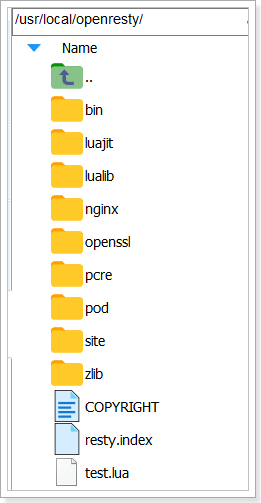
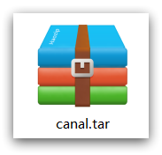

# 多级缓存案例导入

为了演示多级缓存，我们先导入一个商品管理的案例，其中包含商品的CRUD功能。我们将来会给查询商品添加多级缓存。


## 安装MySQL

后期做数据同步需要用到MySQL的主从功能，所以需要大家在虚拟机中，利用Docker来运行一个MySQL容器。


### 准备目录

为了方便后期配置MySQL，我们先准备两个目录，用于挂载容器的数据和配置文件目录：

```sh
# 进入/tmp目录
cd /tmp
# 创建文件夹
mkdir mysql
# 进入mysql目录
cd mysql
```


### 运行命令

进入mysql目录后，执行下面的Docker命令：

```sh
docker run \
 -p 3306:3306 \
 --name mysql \
 -v $PWD/conf:/etc/mysql/conf.d \
 -v $PWD/logs:/logs \
 -v $PWD/data:/var/lib/mysql \
 -e MYSQL_ROOT_PASSWORD=123 \
 --privileged \
 -d \
 mysql:5.7.25
```


### 修改配置

在/tmp/mysql/conf目录添加一个my.cnf文件，作为mysql的配置文件：

```sh
# 创建文件
touch /tmp/mysql/conf/my.cnf
```


文件的内容如下：

```ini
[mysqld]
skip-name-resolve
character_set_server=utf8
datadir=/var/lib/mysql
server-id=1000
```


### 重启

配置修改后，必须重启容器：

```sh
docker restart mysql
```


## 导入SQL

接下来，利用Navicat客户端连接MySQL，然后导入课前资料提供的sql文件：


其中包含两张表：

- tb_item：商品表，包含商品的基本信息
- tb_item_stock：商品库存表，包含商品的库存信息

之所以将库存分离出来，是因为库存是更新比较频繁的信息，写操作较多。而其他信息修改的频率非常低。


## 导入Demo工程

下面导入课前资料提供的工程：

 


项目结构如图所示：


其中的业务包括：

- 分页查询商品
- 新增商品
- 修改商品
- 修改库存
- 删除商品
- 根据id查询商品
- 根据id查询库存


业务全部使用mybatis-plus来实现，如有需要请自行修改业务逻辑。


### 分页查询商品

在`com.heima.item.web`包的`ItemController`中可以看到接口定义：


### 新增商品

在`com.heima.item.web`包的`ItemController`中可以看到接口定义：


### 修改商品

在`com.heima.item.web`包的`ItemController`中可以看到接口定义：


### 修改库存

在`com.heima.item.web`包的`ItemController`中可以看到接口定义：


### 删除商品

在`com.heima.item.web`包的`ItemController`中可以看到接口定义：


这里是采用了逻辑删除，将商品状态修改为3


### 根据id查询商品

在`com.heima.item.web`包的`ItemController`中可以看到接口定义：


这里只返回了商品信息，不包含库存


### 根据id查询库存

在`com.heima.item.web`包的`ItemController`中可以看到接口定义：


### 启动

注意修改application.yml文件中配置的mysql地址信息：


需要修改为自己的虚拟机地址信息、还有账号和密码。


修改后，启动服务，访问：http://localhost:8081/item/10001即可查询数据


## 导入商品查询页面

商品查询是购物页面，与商品管理的页面是分离的。

部署方式如图：


我们需要准备一个反向代理的nginx服务器，如上图红框所示，将静态的商品页面放到nginx目录中。

页面需要的数据通过ajax向服务端（nginx业务集群）查询。


### 运行nginx服务

这里我已经给大家准备好了nginx反向代理服务器和静态资源。

我们找到课前资料的nginx目录：

 

将其拷贝到一个非中文目录下，运行这个nginx服务。

运行命令：

```powershell
start nginx.exe
```


然后访问 http://localhost/item.html?id=10001即可：


### 反向代理

现在，页面是假数据展示的。我们需要向服务器发送ajax请求，查询商品数据。

打开控制台，可以看到页面有发起ajax查询数据：


而这个请求地址同样是80端口，所以被当前的nginx反向代理了。

查看nginx的conf目录下的nginx.conf文件：

 

其中的关键配置如下：


其中的192.168.150.101是我的虚拟机IP，也就是我的Nginx业务集群要部署的地方：


完整内容如下：

```nginx
#user  nobody;
worker_processes  1;

events {
    worker_connections  1024;
}

http {
    include       mime.types;
    default_type  application/octet-stream;

    sendfile        on;
    #tcp_nopush     on;
    keepalive_timeout  65;

    upstream nginx-cluster{
        server 192.168.150.101:8081;
    }
    server {
        listen       80;
        server_name  localhost;

	location /api {
            proxy_pass http://nginx-cluster;
        }

        location / {
            root   html;
            index  index.html index.htm;
        }

        error_page   500 502 503 504  /50x.html;
        location = /50x.html {
            root   html;
        }
    }
}
```


# 安装OpenResty

## 安装

首先你的Linux虚拟机必须联网


**安装开发库**

首先要安装OpenResty的依赖开发库，执行命令：

```sh
yum install -y pcre-devel openssl-devel gcc --skip-broken
```


**安装OpenResty仓库**

你可以在你的 CentOS 系统中添加 `openresty` 仓库，这样就可以便于未来安装或更新我们的软件包（通过 `yum check-update` 命令）。运行下面的命令就可以添加我们的仓库：

```
yum-config-manager --add-repo https://openresty.org/package/centos/openresty.repo
```


如果提示说命令不存在，则运行：

```
yum install -y yum-utils 
```

然后再重复上面的命令


**安装OpenResty**

然后就可以像下面这样安装软件包，比如 `openresty`：

```bash
yum install -y openresty
```


**安装opm工具**

opm是OpenResty的一个管理工具，可以帮助我们安装一个第三方的Lua模块。

如果你想安装命令行工具 `opm`，那么可以像下面这样安装 `openresty-opm` 包：

```bash
yum install -y openresty-opm
```


**目录结构**

默认情况下，OpenResty安装的目录是：/usr/local/openresty

 

看到里面的nginx目录了吗，OpenResty就是在Nginx基础上集成了一些Lua模块。


**配置nginx的环境变量**

打开配置文件：

```sh
vi /etc/profile
```

在最下面加入两行：

```sh
export NGINX_HOME=/usr/local/openresty/nginx
export PATH=${NGINX_HOME}/sbin:$PATH
```

NGINX_HOME：后面是OpenResty安装目录下的nginx的目录

然后让配置生效：

```
source /etc/profile
```


## 启动和运行

OpenResty底层是基于Nginx的，查看OpenResty目录的nginx目录，结构与windows中安装的nginx基本一致：


所以运行方式与nginx基本一致：

```sh
# 启动nginx
nginx
# 重新加载配置
nginx -s reload
# 停止
nginx -s stop
```


nginx的默认配置文件注释太多，影响后续我们的编辑，这里将nginx.conf中的注释部分删除，保留有效部分。

修改`/usr/local/openresty/nginx/conf/nginx.conf`文件，内容如下：

```nginx
#user  nobody;
worker_processes  1;
error_log  logs/error.log;

events {
    worker_connections  1024;
}

http {
    include       mime.types;
    default_type  application/octet-stream;
    sendfile        on;
    keepalive_timeout  65;

    server {
        listen       8081;
        server_name  localhost;
        location / {
            root   html;
            index  index.html index.htm;
        }
        error_page   500 502 503 504  /50x.html;
        location = /50x.html {
            root   html;
        }
    }
}
```


在Linux的控制台输入命令以启动nginx：

```sh
nginx
```


然后访问页面：http://192.168.150.101:8081，注意ip地址替换为你自己的虚拟机IP：


## 备注

加载OpenResty的lua模块：

```nginx
#lua 模块
lua_package_path "/usr/local/openresty/lualib/?.lua;;";
#c模块     
lua_package_cpath "/usr/local/openresty/lualib/?.so;;";  
```


common.lua

```lua
-- 封装函数，发送http请求，并解析响应
local function read_http(path, params)
    local resp = ngx.location.capture(path,{
        method = ngx.HTTP_GET,
        args = params,
    })
    if not resp then
        -- 记录错误信息，返回404
        ngx.log(ngx.ERR, "http not found, path: ", path , ", args: ", args)
        ngx.exit(404)
    end
    return resp.body
end
-- 将方法导出
local _M = {  
    read_http = read_http
}  
return _M
```


释放Redis连接API：

```lua
-- 关闭redis连接的工具方法，其实是放入连接池
local function close_redis(red)
    local pool_max_idle_time = 10000 -- 连接的空闲时间，单位是毫秒
    local pool_size = 100 --连接池大小
    local ok, err = red:set_keepalive(pool_max_idle_time, pool_size)
    if not ok then
        ngx.log(ngx.ERR, "放入redis连接池失败: ", err)
    end
end
```

读取Redis数据的API：

```lua
-- 查询redis的方法 ip和port是redis地址，key是查询的key
local function read_redis(ip, port, key)
    -- 获取一个连接
    local ok, err = red:connect(ip, port)
    if not ok then
        ngx.log(ngx.ERR, "连接redis失败 : ", err)
        return nil
    end
    -- 查询redis
    local resp, err = red:get(key)
    -- 查询失败处理
    if not resp then
        ngx.log(ngx.ERR, "查询Redis失败: ", err, ", key = " , key)
    end
    --得到的数据为空处理
    if resp == ngx.null then
        resp = nil
        ngx.log(ngx.ERR, "查询Redis数据为空, key = ", key)
    end
    close_redis(red)
    return resp
end
```


开启共享词典：

```nginx
# 共享字典，也就是本地缓存，名称叫做：item_cache，大小150m
lua_shared_dict item_cache 150m; 
```

# 安装Canal

下面我们就开启mysql的主从同步机制，让Canal来模拟salve


## 开启MySQL主从

Canal是基于MySQL的主从同步功能，因此必须先开启MySQL的主从功能才可以。

这里以之前用Docker运行的mysql为例：


### 开启binlog

打开mysql容器挂载的日志文件，我的在`/tmp/mysql/conf`目录:


修改文件：

```sh
vi /tmp/mysql/conf/my.cnf
```

添加内容：

```ini
log-bin=/var/lib/mysql/mysql-bin
binlog-do-db=heima
```

配置解读：

- `log-bin=/var/lib/mysql/mysql-bin`：设置binary log文件的存放地址和文件名，叫做mysql-bin
- `binlog-do-db=heima`：指定对哪个database记录binary log events，这里记录heima这个库

最终效果：

```ini
[mysqld]
skip-name-resolve
character_set_server=utf8
datadir=/var/lib/mysql
server-id=1000
log-bin=/var/lib/mysql/mysql-bin
binlog-do-db=heima
```


### 设置用户权限

接下来添加一个仅用于数据同步的账户，出于安全考虑，这里仅提供对heima这个库的操作权限。

```sql
create user canal@'%' IDENTIFIED by 'canal';
GRANT SELECT, REPLICATION SLAVE, REPLICATION CLIENT,SUPER ON *.* TO 'canal'@'%' identified by 'canal';
FLUSH PRIVILEGES;
```


重启mysql容器即可

```
docker restart mysql
```


测试设置是否成功：在mysql控制台，或者Navicat中，输入命令：

```
show master status;
```

 


## 安装Canal

### 创建网络

我们需要创建一个网络，将MySQL、Canal、MQ放到同一个Docker网络中：

```sh
docker network create heima
```

让mysql加入这个网络：

```sh
docker network connect heima mysql
```


### 安装Canal

课前资料中提供了canal的镜像压缩包:

 

大家可以上传到虚拟机，然后通过命令导入：

```
docker load -i canal.tar
```


然后运行命令创建Canal容器：

```sh
docker run -p 11111:11111 --name canal \
-e canal.destinations=heima \
-e canal.instance.master.address=mysql:3306  \
-e canal.instance.dbUsername=canal  \
-e canal.instance.dbPassword=canal  \
-e canal.instance.connectionCharset=UTF-8 \
-e canal.instance.tsdb.enable=true \
-e canal.instance.gtidon=false  \
-e canal.instance.filter.regex=heima\\..* \
--network heima \
-d canal/canal-server:v1.1.5
```


说明:

- `-p 11111:11111`：这是canal的默认监听端口
- `-e canal.instance.master.address=mysql:3306`：数据库地址和端口，如果不知道mysql容器地址，可以通过`docker inspect 容器id`来查看
- `-e canal.instance.dbUsername=canal`：数据库用户名
- `-e canal.instance.dbPassword=canal` ：数据库密码
- `-e canal.instance.filter.regex=`：要监听的表名称

表名称监听支持的语法：

```
mysql 数据解析关注的表，Perl正则表达式.
多个正则之间以逗号(,)分隔，转义符需要双斜杠(\\) 
常见例子：
1.  所有表：.*   or  .*\\..*
2.  canal schema下所有表： canal\\..*
3.  canal下的以canal打头的表：canal\\.canal.*
4.  canal schema下的一张表：canal.test1
5.  多个规则组合使用然后以逗号隔开：canal\\..*,mysql.test1,mysql.test2 
```

