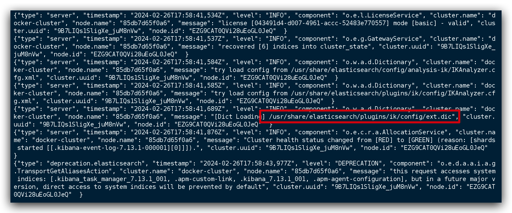
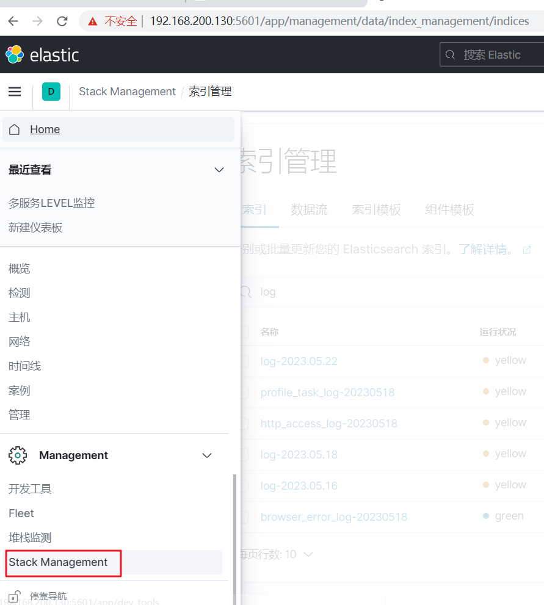
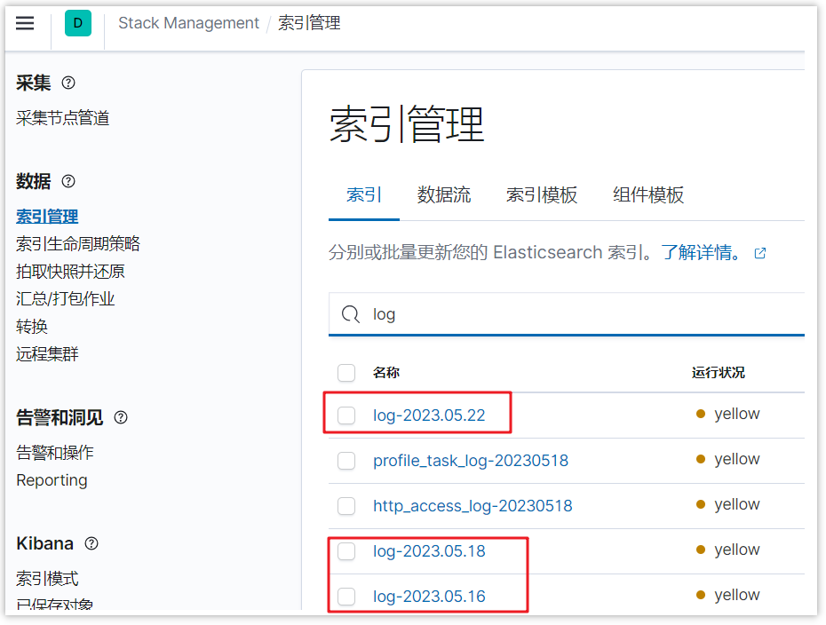
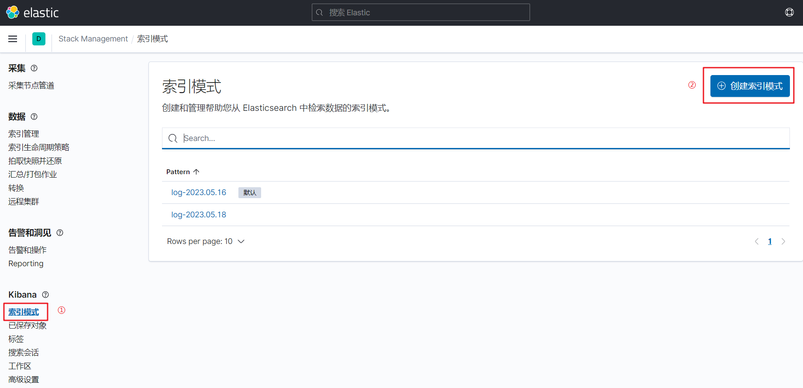
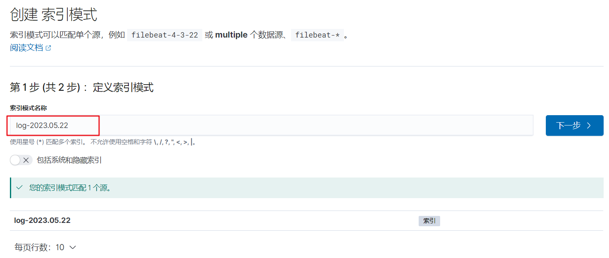
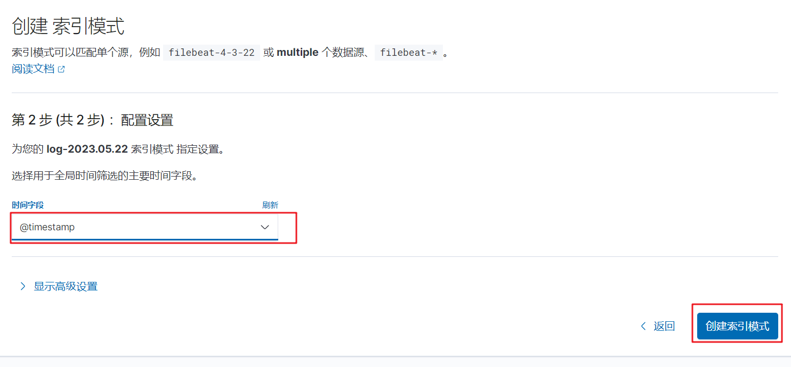
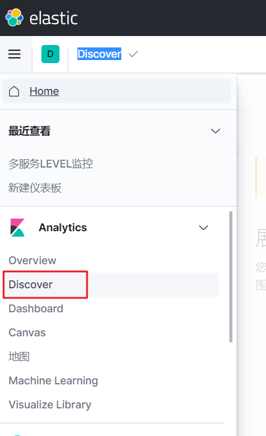
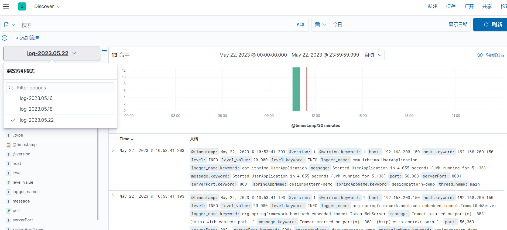
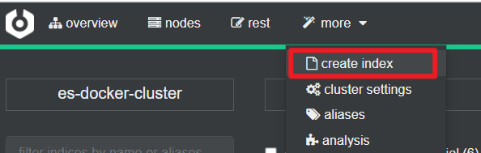

# 安装ELK

[[toc]]


## 部署单点ES

### 创建网络

因为我们还需要部署kibana容器，因此需要让es和kibana容器互联。这里先创建一个网络：

```sh
docker network create es-net
```

<br/>

### 加载镜像

这里我们采用 ElasticSearch 的7.13.1版本的镜像，这个镜像体积非常大，接近1G。不建议大家自己pull。

<br/>

大家将其上传到虚拟机中，然后运行命令加载即可：

```sh
# 导入数据
docker load -i es.tar
```

<br/>

同理还有`kibana`的 tar 包也需要这样做。

```sh
[root@centos7 ~]# docker save -o es.tar elasticsearch:7.13.1
[root@centos7 ~]# docker save -o kibana.tar kibana:7.13.1
[root@centos7 ~]# docker save -o logstash.tar logstash:7.13.1
```

<br/>

### 运行容器

创建文件夹

```sh
mkdir -p /usr/local/src/es/data
mkdir -p /usr/local/src/es/logs
mkdir -p /usr/local/src/es/plugins
chmod -R 777 /usr/local/src/es/
```

<br/>

运行 Docker 命令，部署单点ES

```sh
docker run -d \
  --name es \
  --restart=always \
  --network=es-net \
  -e "ES_JAVA_OPTS=-Xms512m -Xmx512m" \
  -e "discovery.type=single-node" \
  -v /usr/local/src/es/data:/usr/share/elasticsearch/data \
  -v /usr/local/src/es/plugins:/usr/share/elasticsearch/plugins \
  -v /usr/local/src/es/logs:/usr/share/elasticsearch/logs \
  -p 9200:9200 \
  -p 9300:9300 \
elasticsearch:7.13.1
```

<br/>

**命令解释**

- `-–name es`：将容器重命名为 `es`
- `--restart=always`：Docker 每次重启后都会启动
- `--network=es-net` ：加入一个名为 `es-net` 的网络中
- `-e "cluster.name=es-docker-cluster"`：设置集群名称
- `-e "http.host=0.0.0.0"`：监听的地址，可以外网访问
- `-e "ES_JAVA_OPTS=-Xms512m -Xmx512m"`：内存大小
- `-e "discovery.type=single-node"`：非集群模式
- `-v es-data:/usr/share/elasticsearch/data`：挂载逻辑卷，绑定es的数据目录
- `-v /usr/local/src/es/data:/usr/share/elasticsearch/data`：目录挂载，绑定es的数据目录
- `-p 9200:9200`：端口映射配置
- `elasticsearch:7.13.1` ：启动容器的版本号，如果本地镜像没有则下载

<br/>

**启动验证**

在浏览器中输入：http://192.168.150.101:9200  即可看到 ElasticSearch 的响应结果：

```json
{
    "name": "85db7d65f0a6",
    "cluster_name": "docker-cluster",
    "cluster_uuid": "9B7LIQs1SligXe_juM8nVw",
    "version": {
        "number": "7.13.1",
        "build_flavor": "default",
        "build_type": "docker",
        "build_hash": "9a7758028e4ea59bcab41c12004603c5a7dd84a9",
        "build_date": "2021-05-28T17:40:59.346932922Z",
        "build_snapshot": false,
        "lucene_version": "8.8.2",
        "minimum_wire_compatibility_version": "6.8.0",
        "minimum_index_compatibility_version": "6.0.0-beta1"
    },
    "tagline": "You Know, for Search"
}
```

<br/>

修改安全禁用配置

```sh
[root@centos7 ~]# docker exec -it es /bin/bash
[root@85db7d65f0a6 elasticsearch]# cd config/
[root@85db7d65f0a6 config]# vi elasticsearch.yml 
xpack.security.enabled: false
[root@85db7d65f0a6 config]# exit
[root@centos7 ~]# docker restart es
```


## 部署Kibana

Kibana 可以给我们提供一个 ElasticSearch 的可视化界面，便于我们学习。

<br/>

### 运行容器

运行docker命令，部署kibana

```sh
docker run -d \
	--name kibana \
	--restart=always \
	--network=es-net \
	-e ELASTICSEARCH_HOSTS=http://es:9200 \
	-p 5601:5601  \
kibana:7.13.1
```

<br/>

**命令解释**

- `--network=es-net` ：加入一个名为 es-net 的网络中，与 ElasticSearch 在同一个网络中
- `-e ELASTICSEARCH_HOSTS=http://es:9200"`：设置 ElasticSearch 的地址，因为 Kibana 已经与 ElasticSearch 在一个网络，因此可以用容器名直接访问 ElasticSearch
- `-p 5601:5601`：端口映射配置

<br/>

Kibana 启动一般比较慢，需要多等待一会，可以通过命令：

```sh
docker logs -f kibana
```

此时，在浏览器输入地址访问：http://192.168.150.101:5601，即可看到结果

<br/>

### DevTools

kibana中提供了一个DevTools界面：


这个界面中可以编写DSL来操作elasticsearch。并且对DSL语句有自动补全功能。


## 安装插件

### 安装ik插件

下载地址：[Release v7.13.1 · medcl/elasticsearch-analysis-ik (github.com)](https://github.com/medcl/elasticsearch-analysis-ik/releases/tag/v7.13.1)

将 `elasticsearch-analysis-ik-7.13.1.zip` 放入 `/urs/local/src/plugins` 目录中

<br/>

**重启容器**

```shell
# 4、重启容器
docker restart es
# 查看es日志
docker logs -f es
```

<br/>

**测试**

IK分词器包含两种模式：

* `ik_smart`：最少切分

* `ik_max_word`：最细切分

```json
GET /_analyze
{
  "analyzer": "ik_max_word",
  "text": "黑马程序员学习java太棒了"
}
```

结果：

```json
{
  "tokens" : [
    {
      "token" : "黑马",
      "start_offset" : 0,
      "end_offset" : 2,
      "type" : "CN_WORD",
      "position" : 0
    },
    {
      "token" : "程序员",
      "start_offset" : 2,
      "end_offset" : 5,
      "type" : "CN_WORD",
      "position" : 1
    },
    {
      "token" : "程序",
      "start_offset" : 2,
      "end_offset" : 4,
      "type" : "CN_WORD",
      "position" : 2
    },
    {
      "token" : "员",
      "start_offset" : 4,
      "end_offset" : 5,
      "type" : "CN_CHAR",
      "position" : 3
    },
    {
      "token" : "学习",
      "start_offset" : 5,
      "end_offset" : 7,
      "type" : "CN_WORD",
      "position" : 4
    },
    {
      "token" : "java",
      "start_offset" : 7,
      "end_offset" : 11,
      "type" : "ENGLISH",
      "position" : 5
    },
    {
      "token" : "太棒了",
      "start_offset" : 11,
      "end_offset" : 14,
      "type" : "CN_WORD",
      "position" : 6
    },
    {
      "token" : "太棒",
      "start_offset" : 11,
      "end_offset" : 13,
      "type" : "CN_WORD",
      "position" : 7
    },
    {
      "token" : "了",
      "start_offset" : 13,
      "end_offset" : 14,
      "type" : "CN_CHAR",
      "position" : 8
    }
  ]
}
```

<br/>

### 扩展词词典

随着互联网的发展，“造词运动”也越发的频繁。出现了很多新的词语，在原有的词汇列表中并不存在。比如：“奥力给”，“传智播客” 等。

所以我们的词汇也需要不断的更新，IK分词器提供了扩展词汇的功能。

- 打开IK分词器config目录：`IKAnalyzer.cfg.xml`


```sh {10}
[root@centos7 config]# pwd
/usr/local/src/es/plugins/ik/config
[root@centos7 config]# ls -l
总用量 8260
-rw-r--r--. 1 root root 5225922 2月  27 01:34 extra_main.dic
-rw-r--r--. 1 root root   63188 2月  27 01:34 extra_single_word.dic
-rw-r--r--. 1 root root   63188 2月  27 01:34 extra_single_word_full.dic
-rw-r--r--. 1 root root   10855 2月  27 01:34 extra_single_word_low_freq.dic
-rw-r--r--. 1 root root     156 2月  27 01:34 extra_stopword.dic
-rw-r--r--. 1 root root     625 2月  27 01:34 IKAnalyzer.cfg.xml
-rw-r--r--. 1 root root 3058510 2月  27 01:34 main.dic
-rw-r--r--. 1 root root     123 2月  27 01:34 preposition.dic
-rw-r--r--. 1 root root    1824 2月  27 01:34 quantifier.dic
-rw-r--r--. 1 root root     164 2月  27 01:34 stopword.dic
-rw-r--r--. 1 root root     192 2月  27 01:34 suffix.dic
-rw-r--r--. 1 root root     752 2月  27 01:34 surname.dic
```

<br/>

- 在 `IKAnalyzer.cfg.xml` 配置文件内容添加：

```xml
<?xml version="1.0" encoding="UTF-8"?>
<!DOCTYPE properties SYSTEM "http://java.sun.com/dtd/properties.dtd">
<properties>
        <comment>IK Analyzer 扩展配置</comment>
        <!--用户可以在这里配置自己的扩展字典 *** 添加扩展词典-->
        <entry key="ext_dict">ext.dic</entry>
</properties>
```

<br/>

- 新建一个 ext.dic，可以参考config目录下复制一个配置文件进行修改

```properties
传智播客
奥力给
```

<br/>

- 重启 ElasticSearch 

```sh
docker restart es

# 查看 日志
docker logs -f es
```

日志中已经成功加载 `ext.dic` 配置文件



<br/>

- 测试效果：


```json
GET /_analyze
{
  "analyzer": "ik_max_word",
  "text": "传智播客Java就业超过90%,奥力给！"
}
```

> 注意当前文件的编码必须是 UTF-8 格式，严禁使用Windows记事本编辑

<br/>

### 停用词词典

在互联网项目中，在网络间传输的速度很快，所以很多语言是不允许在网络上传递的，如：关于宗教、政治等敏感词语，那么我们在搜索时也应该忽略当前词汇。

IK分词器也提供了强大的停用词功能，让我们在索引时就直接忽略当前的停用词汇表中的内容。

<br/>

- IKAnalyzer.cfg.xml配置文件内容添加：


```xml
<?xml version="1.0" encoding="UTF-8"?>
<!DOCTYPE properties SYSTEM "http://java.sun.com/dtd/properties.dtd">
<properties>
        <comment>IK Analyzer 扩展配置</comment>
        <!--用户可以在这里配置自己的扩展字典-->
        <entry key="ext_dict">ext.dic</entry>
         <!--用户可以在这里配置自己的扩展停止词字典  *** 添加停用词词典-->
        <entry key="ext_stopwords">stopword.dic</entry>
</properties>
```

<br/>

- 在 stopword.dic 添加停用词

```properties
习大大
```

<br/>

- 重启elasticsearch 

```sh
# 重启服务
docker restart es

# 查看 日志
docker logs -f es
```

日志中已经成功加载 `stopword.dic` 配置文件

<br/>

- 测试效果

```json
GET /_analyze
{
  "analyzer": "ik_max_word",
  "text": "传智播客Java就业率超过95%,习大大都点赞,奥力给！"
}
```

> 注意当前文件的编码必须是 UTF-8 格式，严禁使用Windows记事本编辑

<br/>

## 安装Logstash

Logstash 是免费且开放的服务器端数据处理管道，能够从多个来源采集数据，转换数据，然后将数据发送到您最喜欢的“存储库”中。

<br/>

### 创建容器

```shell
docker run -d \
  --name logstash \
  --network=es-net \
  --restart=always \
  -p 5044:5044 \
  -p 9600:9600 \
logstash:7.13.1
```

<br/>

### 修改配置

设置ES的地址，创建完容器之后，需要在容器修改一些配置

找到 `config` 目录中的 `logstatsh.yml` 文件

```shell
[root@centos7 ~]# docker exec -it logstash /bin/bash
bash: warning: setlocale: LC_ALL: cannot change locale (en_US.UTF-8)
bash-4.2$ pwd       
/usr/share/logstash
bash-4.2$ vi config/logstash.yml 
```

<br/>

修改里面的内容，设置es服务的地址，如下

```yaml
http.host: "0.0.0.0"
xpack.monitoring.elasticsearch.hosts:
[ "http://192.168.200.130:9200" ] #设置跟es的服务地址
```

<br/>

设置 `Logstash` 收集日志的输入和输出,进入容器找到 `pipeline`目录中的 `logstatsh.conf` 文件

```shell
[root@centos7 ~]# docker exec -it logstash /bin/bash 
bash: warning: setlocale: LC_ALL: cannot change locale (en_US.UTF-8)
bash-4.2$ vi pipeline/logstash.conf

```

<br/>

修改如下，可以设置数据输入的方式，也可以设置把数据存放到哪里

```shell
input {
  tcp {
    mode => "server"
    host => "0.0.0.0"  # 允许任意主机发送日志
    port => 5044
    codec => json_lines    # 数据格式
  }
}

output {
  elasticsearch {
      hosts  => ["http://192.168.200.130:9200"]   # ElasticSearch 的地址和端口
      index  => "log-%{+YYYY.MM.dd}"         # 指定索引名,可以根据自己的需求指定命名
      codec  => "json"
  }
  stdout {
    codec => rubydebug
  }
}
```

<br/>

修改完所有的配置后，需要重启logstash容器

```shell
docker restart logstash
```

<br/>

### 系统对接

在项目的pom文件中添加新的依赖

```xml
<dependency>
    <groupId>net.logstash.logback</groupId>
    <artifactId>logstash-logback-encoder</artifactId>
    <version>6.6</version>
</dependency>
```

目前，我们采用的logback来采集日志进行上报给logstash

<br/>

需要在 `resources` 目录中新增一个文件 `logback-spring.xml` (注意命名，不要修改)

```xml
<?xml version="1.0" encoding="UTF-8"?>
<configuration>
    <include resource="org/springframework/boot/logging/logback/base.xml" />
    <springProperty scope="context" name="springAppName" source="spring.application.name"/>
    <springProperty scope="context" name="serverPort" source="server.port"/>
    <appender name="LOGSTASH" class="net.logstash.logback.appender.LogstashTcpSocketAppender">
        <!--logstash的服务地址和端口，可以实际情况设置-->
        <destination>192.168.200.130:5044</destination>
        <!-- 日志输出编码 -->
        <encoder charset="UTF-8" class="net.logstash.logback.encoder.LogstashEncoder">
            <providers>
                <timestamp>
                    <timeZone>UTC</timeZone>
                </timestamp>
                <pattern>
                    <pattern>
                        {
                        <!--应用名称 -->
                        "app": "${springAppName}_${serverPort}",
                        <!--打印时间 -->
                        "timestamp": "%d{yyyy-MM-dd HH:mm:ss.SSS}",
                        <!--线程名称 -->
                        "thread": "%thread",
                        <!--日志级别 -->
                        "level": "%level",
                        <!--日志名称 -->
                        "logger_name": "%logger",
                        <!--日志信息 -->
                        "message": "%msg",
                        <!--日志堆栈 -->
                        "stack_trace": "%exception"
                        }
                    </pattern>
                </pattern>
            </providers>
        </encoder>
    </appender>
    <!--定义日志文件的存储地址,使用绝对路径-->
    <property name="LOG_HOME" value="/home/logs"/>
    <!-- 按照每天生成日志文件 -->
    <appender name="FILE" class="ch.qos.logback.core.rolling.RollingFileAppender">
        <rollingPolicy class="ch.qos.logback.core.rolling.TimeBasedRollingPolicy">
            <!--日志文件输出的文件名-->
            <fileNamePattern>${LOG_HOME}/${springAppName}-${serverPort}-%d{yyyy-MM-dd}.log</fileNamePattern>
        </rollingPolicy>
        <encoder>
            <pattern>%d{yyyy-MM-dd HH:mm:ss.SSS} [%thread] %-5level %logger{36} - %msg%n</pattern>
        </encoder>
    </appender>
    <root level="INFO">
        <appender-ref ref="LOGSTASH" />
        <appender-ref ref="FILE" />
        <appender-ref ref="CONSOLE" />
    </root>


</configuration>
```

<br/>

也可以在专门在application.yml文件中设置logback配置的目录

```yaml
logging:
  config: classpath:logback-spring.xml
```

## ELK基本使用

### 查看索引文件

对接项目之后，可以启动项目，产生一些日志数据

然后打开kibana，找到索引管理



可以直接查看已创建的日志索引



### 添加索引模式

如果想用kibana方便的查看日志的数据，可以添加索引模式，如下图



点击创建索引模式，输入想要管理的索引名称



点击下一步，添加筛选的字段，一般都是时间戳字段，最后点击创建索引模式



### 检索日志

打开Discover



检索日志，选择不同的索引，可以按照不同的字段检索，或者在输入框直接输入内容，也是可以的




## 部署ES集群

我们会在单机上利用docker容器运行多个es实例来模拟es集群。不过生产环境推荐大家每一台服务节点仅部署一个es的实例。

部署es集群可以直接使用docker-compose来完成，但这要求你的Linux虚拟机至少有**4G**的内存空间


### 创建ES集群

首先编写一个docker-compose文件，内容如下：

```sh
version: '2.2'
services:
  es01:
    image: elasticsearch:7.12.1
    container_name: es01
    environment:
      - node.name=es01
      - cluster.name=es-docker-cluster
      - discovery.seed_hosts=es02,es03
      - cluster.initial_master_nodes=es01,es02,es03
      - "ES_JAVA_OPTS=-Xms512m -Xmx512m"
    volumes:
      - data01:/usr/share/elasticsearch/data
    ports:
      - 9200:9200
    networks:
      - elastic
  es02:
    image: elasticsearch:7.12.1
    container_name: es02
    environment:
      - node.name=es02
      - cluster.name=es-docker-cluster
      - discovery.seed_hosts=es01,es03
      - cluster.initial_master_nodes=es01,es02,es03
      - "ES_JAVA_OPTS=-Xms512m -Xmx512m"
    volumes:
      - data02:/usr/share/elasticsearch/data
    ports:
      - 9201:9200
    networks:
      - elastic
  es03:
    image: elasticsearch:7.12.1
    container_name: es03
    environment:
      - node.name=es03
      - cluster.name=es-docker-cluster
      - discovery.seed_hosts=es01,es02
      - cluster.initial_master_nodes=es01,es02,es03
      - "ES_JAVA_OPTS=-Xms512m -Xmx512m"
    volumes:
      - data03:/usr/share/elasticsearch/data
    networks:
      - elastic
    ports:
      - 9202:9200
volumes:
  data01:
    driver: local
  data02:
    driver: local
  data03:
    driver: local

networks:
  elastic:
    driver: bridge
```


es运行需要修改一些linux系统权限，修改`/etc/sysctl.conf`文件

```sh
vi /etc/sysctl.conf
```

添加下面的内容：

```sh
vm.max_map_count=262144
```

然后执行命令，让配置生效：

```sh
sysctl -p
```


通过docker-compose启动集群：

```sh
docker-compose up -d
```


### 集群状态监控

kibana可以监控es集群，不过新版本需要依赖es的x-pack 功能，配置比较复杂。

这里推荐使用cerebro来监控es集群状态，官方网址：https://github.com/lmenezes/cerebro

课前资料已经提供了安装包：


解压即可使用，非常方便。

解压好的目录如下：


进入对应的bin目录：


双击其中的cerebro.bat文件即可启动服务。


访问http://localhost:9000 即可进入管理界面：


输入你的elasticsearch的任意节点的地址和端口，点击connect即可：


绿色的条，代表集群处于绿色（健康状态）。


### 创建索引库

#### 利用kibana的DevTools创建索引库

在DevTools中输入指令：

```json
PUT /itcast
{
  "settings": {
    "number_of_shards": 3, // 分片数量
    "number_of_replicas": 1 // 副本数量
  },
  "mappings": {
    "properties": {
      // mapping映射定义 ...
    }
  }
}
```


#### 利用cerebro创建索引库

利用cerebro还可以创建索引库：



填写索引库信息：


点击右下角的create按钮：


### 查看分片效果

回到首页，即可查看索引库分片效果：


