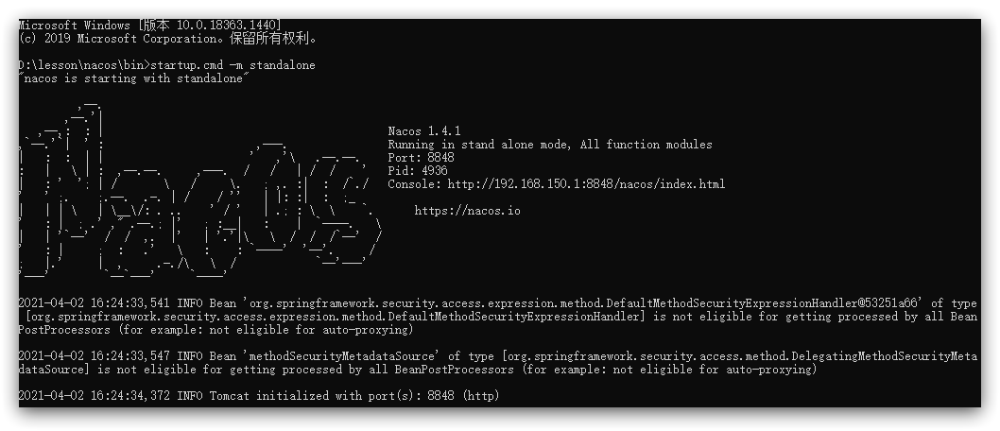

# Nacos安装指南

[[toc]]

## 本地安装

开发阶段采用单机安装即可。

### 下载安装包

在 Nacos 的 GitHub 页面，提供有下载链接，可以下载编译好的 Nacos 服务端或者源代码：

GitHub主页：https://github.com/alibaba/nacos

GitHub的Release下载页：https://github.com/alibaba/nacos/releases

<br/>

如图：


<br/>

本课程采用1.4.1.版本的 Nacos 

- Windows 版本使用 `nacos-server-1.4.1.zip`  包
- Linux/Mac 版本使用 `nacos-server-1.4.1.tar.gz` 包

<br/>

### 解压

将这个包解压到任意非中文目录下，如图：


目录说明：

- bin：启动脚本
- conf：配置文件

<br/>

### 配置

Nacos的默认端口是8848，如果你电脑上的其它进程占用了8848端口，请先尝试关闭该进程。

**如果无法关闭占用8848端口的进程**，也可以进入nacos的conf目录，修改配置文件中的端口：


修改其中的内容，如果不修改配置文件，则默认使用 Nacos 内置的 derby 数据库


<br/>

### 启动

启动非常简单，进入bin目录，结构如下：


然后执行命令即可：

- Windows命令：

  ```sh
  startup.cmd -m standalone
  ```

- Linux/Mac命令：

  ```sh
  sh startup.sh -m standalone
  ```

  

执行后的效果如图：



<br/>

### 访问

在浏览器输入地址：http://127.0.0.1:8848/nacos 


<br/>

默认的账号和密码是 `nacos\nacos`，进入后：


## Linux安装

Linux或者与Windows类似。

<br/>

### 准备

Nacos依赖于JDK运行，所以Linux上也需要安装JDK才行：[JDK8下载官网](https://www.oracle.com/java/technologies/javase/javase8u211-later-archive-downloads.html)


<br/>

上传到某个目录，然后解压缩。例如：`/usr/local/src/`

```sh
[root@centos7 src]# pwd
/usr/local/src
[root@centos7 src]# tar -xvf jdk-8u391-linux-aarch64.tar.gz 
[root@centos7 src]# ll
drwxr-xr-x. 8 root root       194 1月   9 21:02 jdk1.8.0_391
```

<br/>

配置环境变量

```sh
[root@centos7 src]# vim /etc/profile
export JAVA_HOME=/usr/local/src/jdk1.8.0_391
export PATH=$PATH:$JAVA_HOME/bin
[root@centos src]# source /etc/profile
```

<br/>

查看环境变量

```sh
[root@centos7 src]# java -version
java version "1.8.0_391"
Java(TM) SE Runtime Environment (build 1.8.0_391-b13)
Java HotSpot(TM) 64-Bit Server VM (build 25.391-b13, mixed mode)
```

<br/>

**上传安装包**


<br/>

上传到Linux服务器的某个目录，例如 `/usr/local/src` 目录下：

```sh
[root@centos7 src]# ll
-rw-r--r--. 1 root root  79052411 1月   9 21:09 nacos-server-1.4.1.tar.gz
```

<br/>

### 解压

命令解压缩安装包：

```sh
tar -xvf nacos-server-1.4.1.tar.gz
```

然后删除安装包：

```sh
rm -rf nacos-server-1.4.1.tar.gz
```

目录中最终样式：

```sh
[root@centos7 src]# ll
drwxr-xr-x. 5 root root        72 1月   9 21:11 nacos
```

目录内部：

```sh
[root@centos7 nacos]# ll
总用量 24
drwxr-xr-x. 2 root root     82 1月   9 21:11 bin
drwxr-xr-x. 2  502 games   205 1月  15 2021 conf
-rw-r--r--. 1  502 games 16583 12月 15 2020 LICENSE
-rw-r--r--. 1  502 games  1305 5月  14 2020 NOTICE
drwxr-xr-x. 2 root root     30 1月   9 21:11 target
```

<br/>

### 配置

查看 `nacos/conf` 目录下的文件

```sh
[root@centos7 conf]# ll
总用量 76
-rw-r--r--. 1 502 games  1224 12月 24 2020 1.4.0-ipv6_support-update.sql
-rw-r--r--. 1 502 games  7011 2月  25 17:52 application.properties					 # 需要修改的配置
-rw-r--r--. 1 502 games  6515 12月 24 2020 application.properties.example   # 配置信息例子
-rw-r--r--. 1 502 games   670 12月 15 2020 cluster.conf.example						 # 集群配置
-rw-r--r--. 1 502 games 25710 1月  15 2021 nacos-logback.xml								 # 日志配置
-rw-r--r--. 1 502 games 10660 12月 24 2020 nacos-mysql.sql           		   # 数据库脚本
-rw-r--r--. 1 502 games  8795 12月 24 2020 schema.sql
```

<br/>

配置 `application.properties`，设置数据库信息和端口信息，也可以使用默认信息

```properties
#*************** Spring Boot Related Configurations ***************#
### Default web context path:
server.servlet.contextPath=/nacos
### Default web server port:
server.port=8848

#*************** Network Related Configurations ***************#

spring.datasource.platform=mysql

db.num=1

### Connect URL of DB:
db.url.0=jdbc:mysql://127.0.0.1:3306/nacos?characterEncoding=utf8&connectTimeout=1000&socketTimeout=3000&autoReconnect=true&useUnicode=true&useSSL=false&serverTimezone=UTC
db.user.0=nacos
db.password.0=nacos
```

<br/>


### 脚本

在MySQL中，可以通过以下步骤来创建Nacos的用户和密码。

1. 运行以下命令创建新的用户并设置密码：

```sql
CREATE USER 'nacos'@'%' IDENTIFIED BY 'your_password';
```

其中，`nacos`为要创建的用户名，`'localhost'`表示该用户只能从本地访问MySQL服务器，而不能从远程主机进行访问，设置成 `%` 为任何主机都可连接；`your_password`为所需设置的密码。根据自己的情况修改这些参数。

```sql
CREATE USER 'nacos'@'%' IDENTIFIED BY 'nacos';
```

<br/>

2. 然后，将该用户添加到特定的数据库中，以便他们有足够的权限操作相关数据库：

```sql
GRANT ALL PRIVILEGES ON your_database.* TO 'nacos'@'localhost';
FLUSH PRIVILEGES;
```

其中，`your_database`为要授权给该用户的数据库名称。同样，根据自己的情况修改这些参数。

```sql
GRANT ALL PRIVILEGES ON nacos.* TO 'nacos'@'%';
FLUSH PRIVILEGES;
```

<br/>

3. 最后，确认已成功创建了Nacos用户及其对应的密码：

```sql
SELECT user FROM mysql.user WHERE User = 'nacos';
```

如果返回结果包含"nacos"字符串，则说明用户已经被正确创建。

<br/>

4. SQL 总结，最后在 conf 目录中执行 `nacos-mysql.sql`

```sql
CREATE USER 'nacos'@'%' IDENTIFIED BY 'nacos';

GRANT ALL PRIVILEGES ON nacos.* TO 'nacos'@'%';
FLUSH PRIVILEGES;

SELECT user FROM mysql.user WHERE User = 'nacos';
```

<br/>

### 启动

在 `nacos/bin` 目录中，输入命令启动 Nacos：

```sh
[root@centos7 bin]# sh startup.sh -m standalone
```

查看日志文件

设置 nacos 为开机自启动

<br/>

### 依赖

父工程：

```xml
<dependency>
    <groupId>com.alibaba.cloud</groupId>
    <artifactId>spring-cloud-alibaba-dependencies</artifactId>
    <version>2.2.5.RELEASE</version>
    <type>pom</type>
    <scope>import</scope>
</dependency>
```

<br/>

客户端：

```xml
<!-- nacos客户端依赖包 -->
<dependency>
    <groupId>com.alibaba.cloud</groupId>
    <artifactId>spring-cloud-starter-alibaba-nacos-discovery</artifactId>
</dependency>
```


## 集群搭建

### 集群结构图

官方给出的Nacos集群图：


其中包含3个nacos节点，然后一个负载均衡器代理3个Nacos。这里负载均衡器可以使用nginx。

<br/>

我们计划的集群结构：


<br/>

三个nacos节点的地址：

| 节点   | ip            | port |
| ------ | ------------- | ---- |
| nacos1 | 192.168.150.1 | 8845 |
| nacos2 | 192.168.150.1 | 8846 |
| nacos3 | 192.168.150.1 | 8847 |

<br/>

搭建集群的基本步骤：

- 搭建数据库，初始化数据库表结构
- 下载nacos安装包
- 配置nacos
- 启动nacos集群
- nginx反向代理

<br/>

### 初始化数据库

Nacos默认数据存储在内嵌数据库Derby中，不属于生产可用的数据库。

官方推荐的最佳实践是使用带有主从的高可用数据库集群，主从模式的高可用数据库可以参考**传智教育**的后续高手课程。

<br/>

### 下载Nacos

nacos在GitHub上有下载地址：https://github.com/alibaba/nacos/tags

可以选择任意版本下载。本例中才用1.4.1版本


<br/>

### 配置Nacos

将这个包解压到任意非中文目录下，如图：


目录说明：

- bin：启动脚本
- conf：配置文件

<br/>

进入 `nacos` 的 `conf` 目录，修改配置文件 `cluster.conf.example` ，重命名为 `cluster.conf`：


然后添加内容：

```sh
127.0.0.1:8845
127.0.0.1.8846
127.0.0.1.8847
```

<br/>

然后修改application.properties文件，添加数据库配置

```properties
spring.datasource.platform=mysql

db.num=1

db.url.0=jdbc:mysql://127.0.0.1:3306/nacos?characterEncoding=utf8&connectTimeout=1000&socketTimeout=3000&autoReconnect=true&useUnicode=true&useSSL=false&serverTimezone=UTC
db.user.0=root
db.password.0=123
```

<br/>

### 启动

将nacos文件夹复制三份，分别命名为：nacos1、nacos2、nacos3


然后分别修改三个文件夹中的 `application.properties`

nacos1:

```properties
server.port=8845
```

nacos2:

```properties
server.port=8846
```

nacos3:

```properties
server.port=8847
```

<br/>

然后分别启动三个nacos节点：

```
startup.cmd
```

<br/>

### Nginx反向代理

找到课前资料提供的nginx安装包：


<br/>

解压到任意非中文目录下：


<br/>

修改 `conf/nginx.conf` 文件，配置如下：

```nginx
upstream nacos-cluster {
  server 127.0.0.1:8845;
	server 127.0.0.1:8846;
	server 127.0.0.1:8847;
}

server {
    listen       80;
    server_name  localhost;

    location /nacos {
        proxy_pass http://nacos-cluster;
    }
}
```


而后在浏览器访问：http://localhost/nacos

<br/>

代码中application.yml文件配置如下：

```yaml
spring:
  cloud:
    nacos:
      server-addr: localhost:80 # Nacos地址
```

<br/>

### 优化

- 实际部署时，需要给做反向代理的 `Nginx` 服务器设置一个域名，这样后续如果有服务器迁移`Nacos` 的客户端也无需更改配置.

- `Nacos` 的各个节点应该部署到多个不同服务器，做好容灾和隔离


