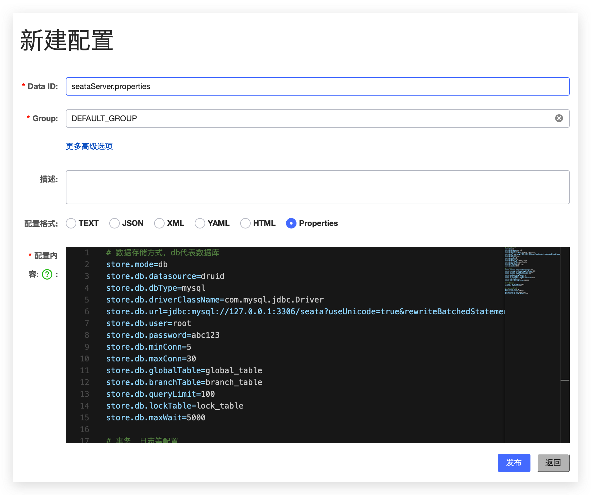
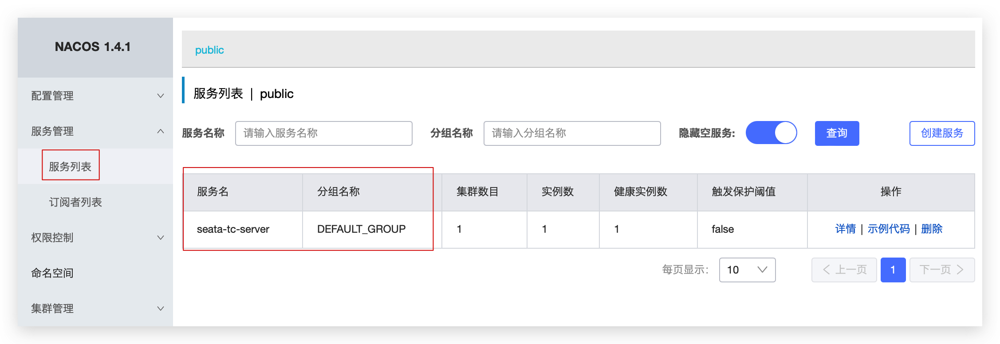

安装Seata
=========

官方文档：https://seata.apache.org/zh-cn/docs/ops/deploy-guide-beginner

部署资料：https://blog.csdn.net/wejack/article/details/131862344

<br>

部署Seata的tc-server
--------------------

**下载**

首先我们要下载 seata-server包，地址：

https://seata.apache.org/unversioned/release-history/seata-server

当然，课前资料也准备好了：`seata-server-1.4.2.zip`

<br/>

**解压**

在非中文目录解压缩这个zip包，其目录结构如下：

```sh
[root@centos7 src]# yum install -y zip unzip
[root@centos7 src]# unzip seata-server-1.4.2.zip
[root@centos7 src]# rm -rf seata-server-1.4.2.zip
[root@centos7 src]# mv seata/seata-server-1.4.2/ seata
[root@centos7 src]# cd seata/
[root@centos7 seata]# ll
总用量 24
drwxr-xr-x. 2 root root    53 4月  25 2021 bin   	#运行脚本
drwxr-xr-x. 4 root root   156 4月  25 2021 conf  	#配置文件
drwxr-xr-x. 3 root root  8192 4月  25 2021 lib   	#依赖库
-rw-r--r--. 1 root root 11365 5月  13 2019 LICENSE 
drwxr-xr-x. 2 root root     6 4月  25 2021 logs
```

<br/>

**修改配置**

修改 `conf` 目录下的 `registry.conf` 文件：

```sh
[root@centos7 conf]# pwd
/usr/local/src/seata/conf
[root@centos7 conf]# ll
总用量 24
-rw-r--r--. 1 root root 1859 4月  25 2021 file.conf
-rw-r--r--. 1 root root 3112 4月  25 2021 file.conf.example
drwxr-xr-x. 2 root root  114 4月  25 2021 logback
-rw-r--r--. 1 root root 2222 4月  25 2021 logback.xml
drwxr-xr-x. 3 root root   22 4月  25 2021 META-INF
-rw-r--r--. 1 root root 1324 4月  25 2021 README.md
-rw-r--r--. 1 root root 1327 4月  25 2021 README-zh.md
-rw-r--r--. 1 root root 1938 4月  25 2021 registry.conf #修改配置文件
```

内容如下

```properties
registry {
  # tc服务的注册中心类，这里选择nacos，也可以是eureka、zookeeper等
  type = "nacos"

  nacos {
    # seata tc 服务注册到 nacos的服务名称，可以自定义
    application = "seata-tc-server"
    serverAddr = "127.0.0.1:8848"
    group = "DEFAULT_GROUP"
    namespace = ""
    cluster = "SH"
    username = "nacos"
    password = "nacos"
  }
}

config {
  # 读取tc服务端的配置文件的方式，这里是从nacos配置中心读取，这样如果tc是集群，可以共享配置
  type = "nacos"
  # 配置nacos地址等信息
  nacos {
    serverAddr = "127.0.0.1:8848"
    namespace = ""
    group = "DEFAULT_GROUP"
    username = "nacos"
    password = "nacos"
    dataId = "seataServer.properties"
  }
}
```

<br/>

**在nacos添加配置**

特别注意，为了让tc服务的集群可以共享配置，我们选择了 `nacos` 作为统一配置中心。因此服务端配置文件 `seataServer.properties` 文件需要在 `nacos` 中配好。



<br/>

配置内容如下：

```properties
# 数据存储方式，db代表数据库
store.mode=db
store.db.datasource=druid
store.db.dbType=mysql
# mysql:8.0
# store.db.driverClassName=com.mysql.cj.jdbc.Driver
# mysql:5.7
store.db.driverClassName=com.mysql.jdbc.Driver
store.db.url=jdbc:mysql://127.0.0.1:3306/seata?useUnicode=true&rewriteBatchedStatements=true&useSSL=false
store.db.user=root
store.db.password=abc123
store.db.minConn=5
store.db.maxConn=30
store.db.globalTable=global_table
store.db.branchTable=branch_table
store.db.queryLimit=100
store.db.lockTable=lock_table
store.db.maxWait=5000

# 事务、日志等配置
server.recovery.committingRetryPeriod=1000
server.recovery.asynCommittingRetryPeriod=1000
server.recovery.rollbackingRetryPeriod=1000
server.recovery.timeoutRetryPeriod=1000
server.maxCommitRetryTimeout=-1
server.maxRollbackRetryTimeout=-1
server.rollbackRetryTimeoutUnlockEnable=false
server.undo.logSaveDays=7
server.undo.logDeletePeriod=86400000

# 客户端与服务端传输方式
transport.serialization=seata
transport.compressor=none

# 关闭metrics功能，提高性能
metrics.enabled=false
metrics.registryType=compact
metrics.exporterList=prometheus
metrics.exporterPrometheusPort=9898
```

其中的数据库地址、用户名、密码都需要修改成你自己的数据库信息。

<br/>

**创建数据库表**

特别注意：tc服务在管理分布式事务时，需要记录事务相关数据到数据库中，你需要提前创建好这些表。

[Seata-V1.4.2-Server-DB-脚本 ](https://github.com/apache/incubator-seata/tree/v1.4.2/script/server/db)

这些表主要记录全局事务、分支事务、全局锁信息：

```sql
SET NAMES utf8mb4;
SET FOREIGN_KEY_CHECKS = 0;

create database seata;
use seata;

-- ----------------------------
-- Table structure for branch_table
-- ----------------------------
DROP TABLE IF EXISTS `branch_table`;
CREATE TABLE `branch_table`  (
  `branch_id` bigint(20) NOT NULL,
  `xid` varchar(128) CHARACTER SET utf8 COLLATE utf8_general_ci NOT NULL,
  `transaction_id` bigint(20) NULL DEFAULT NULL,
  `resource_group_id` varchar(32) CHARACTER SET utf8 COLLATE utf8_general_ci NULL DEFAULT NULL,
  `resource_id` varchar(256) CHARACTER SET utf8 COLLATE utf8_general_ci NULL DEFAULT NULL,
  `branch_type` varchar(8) CHARACTER SET utf8 COLLATE utf8_general_ci NULL DEFAULT NULL,
  `status` tinyint(4) NULL DEFAULT NULL,
  `client_id` varchar(64) CHARACTER SET utf8 COLLATE utf8_general_ci NULL DEFAULT NULL,
  `application_data` varchar(2000) CHARACTER SET utf8 COLLATE utf8_general_ci NULL DEFAULT NULL,
  `gmt_create` datetime(6) NULL DEFAULT NULL,
  `gmt_modified` datetime(6) NULL DEFAULT NULL,
  PRIMARY KEY (`branch_id`) USING BTREE,
  INDEX `idx_xid`(`xid`) USING BTREE
) ENGINE = InnoDB CHARACTER SET = utf8 COLLATE = utf8_general_ci ROW_FORMAT = Compact;

-- ----------------------------
-- Records of branch_table
-- ----------------------------

-- ----------------------------
-- Table structure for global_table
-- ----------------------------
DROP TABLE IF EXISTS `global_table`;
CREATE TABLE `global_table`  (
  `xid` varchar(128) CHARACTER SET utf8 COLLATE utf8_general_ci NOT NULL,
  `transaction_id` bigint(20) NULL DEFAULT NULL,
  `status` tinyint(4) NOT NULL,
  `application_id` varchar(32) CHARACTER SET utf8 COLLATE utf8_general_ci NULL DEFAULT NULL,
  `transaction_service_group` varchar(32) CHARACTER SET utf8 COLLATE utf8_general_ci NULL DEFAULT NULL,
  `transaction_name` varchar(128) CHARACTER SET utf8 COLLATE utf8_general_ci NULL DEFAULT NULL,
  `timeout` int(11) NULL DEFAULT NULL,
  `begin_time` bigint(20) NULL DEFAULT NULL,
  `application_data` varchar(2000) CHARACTER SET utf8 COLLATE utf8_general_ci NULL DEFAULT NULL,
  `gmt_create` datetime NULL DEFAULT NULL,
  `gmt_modified` datetime NULL DEFAULT NULL,
  PRIMARY KEY (`xid`) USING BTREE,
  INDEX `idx_gmt_modified_status`(`gmt_modified`, `status`) USING BTREE,
  INDEX `idx_transaction_id`(`transaction_id`) USING BTREE
) ENGINE = InnoDB CHARACTER SET = utf8 COLLATE = utf8_general_ci ROW_FORMAT = Compact;

-- ----------------------------
-- Records of global_table
-- ----------------------------


-- ----------------------------
-- Records of lock_table
-- ----------------------------

SET FOREIGN_KEY_CHECKS = 1;
```

<br/>

**启动TC服务**

启动成功后，`seata-server` 应该已经注册到 `nacos` 注册中心了。

```sh
nohup sh seata-server.sh \
-p 8091 \
-m db \
-h 127.0.0.1 >log.out 2>1 &
```

<br/>

打开浏览器，访问nacos地址：http://localhost:8848，然后进入服务列表页面，可以看到seata-tc-server的信息：




微服务集成Seata
-------------------

首先，我们需要在微服务中引入seata依赖：

```xml
<dependency>
    <groupId>com.alibaba.cloud</groupId>
    <artifactId>spring-cloud-starter-alibaba-seata</artifactId>
    <exclusions>
        <!--版本较低，1.3.0，因此排除-->
        <exclusion>
            <artifactId>seata-spring-boot-starter</artifactId>
            <groupId>io.seata</groupId>
        </exclusion>
    </exclusions>
</dependency>
<!--seata starter 采用1.4.2版本-->
<dependency>
    <groupId>io.seata</groupId>
    <artifactId>seata-spring-boot-starter</artifactId>
    <version>${seata.version}</version>
</dependency>
```

<br/>

**修改配置文件**

需要修改 `application.yml` 文件，添加一些配置：

```yaml
seata:
  registry: # TC服务注册中心的配置，微服务根据这些信息去注册中心获取tc服务地址
    type: nacos # 注册中心类型 nacos
    nacos:
      server-addr: 127.0.0.1:8848 # nacos地址
      namespace: "" # namespace，默认为空
      group: DEFAULT_GROUP # 分组，默认是DEFAULT_GROUP
      application: seata-tc-server # seata服务名称
      username: nacos
      password: nacos
  tx-service-group: seata-demo # 事务组名称
  service:
    vgroup-mapping: # 事务组与cluster的映射关系
      seata-demo: SH
```


