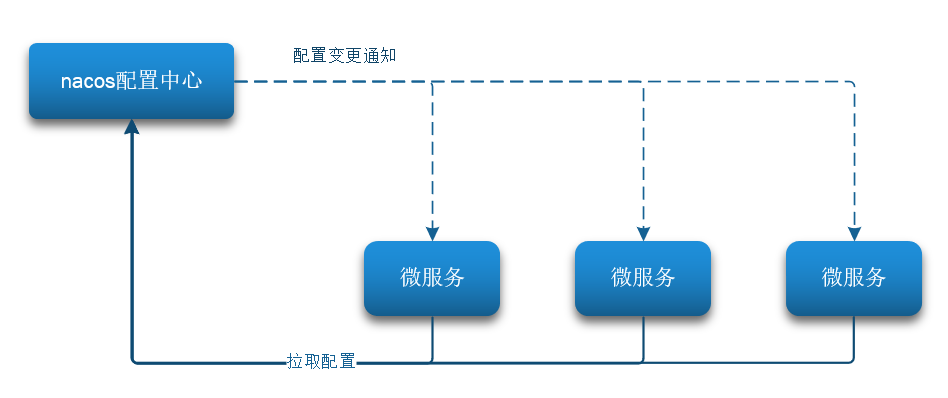

# 微服务治理

[[toc]]


## 认识微服务

随着互联网行业的发展，对服务的要求也越来越高，服务架构也从单体架构逐渐演变为现在流行的微服务架构。这些架构之间有怎样的差别呢？

<br/>

### 单体架构

**单体架构**：将业务的所有功能集中在一个项目中开发，打成一个包部署。


:::warning 💡单体架构的优缺点如下

**优点**

- 架构简单
- 部署成本低

**缺点**

- 耦合度高（维护困难、升级困难）

:::

<br/>

### 分布式架构

**分布式架构**：根据业务功能对系统做拆分，每个业务功能模块作为独立项目开发，称为一个服务。


:::warning 💡分布式架构的优缺点

**优点**

- 降低服务耦合
- 有利于服务升级和拓展

**缺点**

- 服务调用关系错综复杂

:::

<br/>

分布式架构虽然降低了服务耦合，但是服务拆分时也有很多问题需要思考：

- 服务拆分的粒度如何界定？
- 服务之间如何调用？
- 服务的调用关系如何管理？

人们需要制定一套行之有效的标准来约束分布式架构。

<br/>

### 微服务架构

微服务的架构特征

- **单一职责**：微服务拆分粒度更小，每一个服务都对应唯一的业务能力，做到单一职责
- **自治**：团队独立、技术独立、数据独立，独立部署和交付
- **面向服务**：服务提供统一标准的接口，与语言和技术无关
- **隔离性强**：服务调用做好隔离、容错、降级，避免出现级联问题


<br/>

微服务的上述特性其实是在给分布式架构制定一个标准，进一步降低服务之间的耦合度，提供服务的独立性和灵活性。做到高内聚，低耦合。

因此，可以认为**微服务**是一种经过良好架构设计的**分布式架构方案** 。

<br/>

但方案该怎么落地？选用什么样的技术栈？全球的互联网公司都在积极尝试自己的微服务落地方案。

其中在 Java 领域最引人注目的就是 SpringCloud 提供的方案了。

<br/>

### SpringCloud

SpringCloud是目前国内使用最广泛的微服务框架。

- 官网地址：https://spring.io/projects/spring-cloud

SpringCloud 集成了各种微服务功能组件，并基于 SpringBoot 实现了这些组件的自动装配，从而提供了良好的开箱即用体验。

<br/>

其中常见的组件包括：


<br/>

另外，SpringCloud 底层是依赖于 SpringBoot ，并且有版本的兼容关系，如下：


我们课堂学习的版本是 Hoxton.SR10，因此对应的 SpringBoot 版本是2.3.x版本。

<br/>

:::warning 💡总结

- 单体架构：简单方便，高度耦合，扩展性差，适合小型项目。例如：学生管理系统

- 分布式架构：松耦合，扩展性好，但架构复杂，难度大。适合大型互联网项目，例如：京东、淘宝

- 微服务：一种良好的分布式架构方案
  - 优点：拆分粒度更小、服务更独立、耦合度更低
  
  - 缺点：架构非常复杂，运维、监控、部署难度提高
  
- SpringCloud 是微服务架构的一站式解决方案，集成了各种优秀微服务功能组件

:::

<br/>

## 服务拆分与调用

任何分布式架构都离不开服务的拆分，微服务也是一样。

<br/>

### 服务拆分原则

这里我总结了微服务拆分时的几个原则：

- 不同微服务，不要重复开发相同业务
- 微服务数据独立，不要访问其它微服务的数据库
- 微服务可以将自己的业务暴露为接口，供其它微服务调用


<br/>

### 服务拆分示例

Gitee仓库提供了一个Demo工程：[cloud-demo](https://gitee.com/iMousse/cswiki-project/tree/master/cloud/cloud-demo)

```sh
# 父工程，管理依赖
cloud-demo
│  # 订单微服务，负责订单相关业务
├── order-service 
│  # 用户微服务，负责用户相关业务
└── user-service
```

<br/>

:::tip 🔖 服务拆分要求

- 订单微服务和用户微服务都必须有各自的数据库，相互独立
- 订单服务和用户服务都对外暴露Restful的接口
- 订单服务如果需要查询用户信息，只能调用用户服务的Restful接口，不能查询用户数据库

:::

<br/>

#### 导入SQL

首先，将提供的 `cloud-order.sql` 和 `cloud-user.sql` 导入到 MySQL 中：

```SQL
SET NAMES utf8mb4;
SET FOREIGN_KEY_CHECKS = 0;

CREATE DATABASE IF NOT EXISTS cloud_order;
USE cloud_order;

-- ----------------------------
-- Table structure for tb_order
-- ----------------------------
DROP TABLE IF EXISTS `tb_order`;
CREATE TABLE `tb_order`  (
  `id` bigint(20) NOT NULL AUTO_INCREMENT COMMENT '订单id',
  `user_id` bigint(20) NOT NULL COMMENT '用户id',
  `name` varchar(100) CHARACTER SET utf8 COLLATE utf8_general_ci NULL DEFAULT NULL COMMENT '商品名称',
  `price` bigint(20) NOT NULL COMMENT '商品价格',
  `num` int(10) NULL DEFAULT 0 COMMENT '商品数量',
  PRIMARY KEY (`id`) USING BTREE,
  UNIQUE INDEX `username`(`name`) USING BTREE
) ENGINE = InnoDB AUTO_INCREMENT = 109 CHARACTER SET = utf8 COLLATE = utf8_general_ci ROW_FORMAT = Compact;

-- ----------------------------
-- Records of tb_order
-- ----------------------------
INSERT INTO `tb_order` VALUES (101, 1, 'Apple 苹果 iPhone 12 ', 699900, 1);
INSERT INTO `tb_order` VALUES (102, 2, '雅迪 yadea 新国标电动车', 209900, 1);
INSERT INTO `tb_order` VALUES (103, 3, '骆驼（CAMEL）休闲运动鞋女', 43900, 1);
INSERT INTO `tb_order` VALUES (104, 4, '小米10 双模5G 骁龙865', 359900, 1);
INSERT INTO `tb_order` VALUES (105, 5, 'OPPO Reno3 Pro 双模5G 视频双防抖', 299900, 1);
INSERT INTO `tb_order` VALUES (106, 6, '美的（Midea) 新能效 冷静星II ', 544900, 1);
INSERT INTO `tb_order` VALUES (107, 2, '西昊/SIHOO 人体工学电脑椅子', 79900, 1);
INSERT INTO `tb_order` VALUES (108, 3, '梵班（FAMDBANN）休闲男鞋', 31900, 1);

CREATE DATABASE IF NOT EXISTS cloud_user;
USE cloud_user;
-- ----------------------------
-- Table structure for tb_user
-- ----------------------------
DROP TABLE IF EXISTS `tb_user`;
CREATE TABLE `tb_user`  (
  `id` bigint(20) NOT NULL AUTO_INCREMENT,
  `username` varchar(100) CHARACTER SET utf8 COLLATE utf8_general_ci NULL DEFAULT NULL COMMENT '收件人',
  `address` varchar(255) CHARACTER SET utf8 COLLATE utf8_general_ci NULL DEFAULT NULL COMMENT '地址',
  PRIMARY KEY (`id`) USING BTREE,
  UNIQUE INDEX `username`(`username`) USING BTREE
) ENGINE = InnoDB AUTO_INCREMENT = 109 CHARACTER SET = utf8 COLLATE = utf8_general_ci ROW_FORMAT = Compact;

-- ----------------------------
-- Records of tb_user
-- ----------------------------
INSERT INTO `tb_user` VALUES (1, '柳岩', '湖南省衡阳市');
INSERT INTO `tb_user` VALUES (2, '文二狗', '陕西省西安市');
INSERT INTO `tb_user` VALUES (3, '华沉鱼', '湖北省十堰市');
INSERT INTO `tb_user` VALUES (4, '张必沉', '天津市');
INSERT INTO `tb_user` VALUES (5, '郑爽爽', '辽宁省沈阳市大东区');
INSERT INTO `tb_user` VALUES (6, '范兵兵', '山东省青岛市');

SET FOREIGN_KEY_CHECKS = 1;
```

> 💡 注意：cloud-order 表中持有 cloud-user 表中的 id 字段。
>

<br/>

### 实现远程调用案例

在 order-service 服务中，有一个根据id查询订单的接口：

```java
@RestController
@RequestMapping("order")
public class OrderController {

   @Autowired
   private OrderService orderService;

    @GetMapping("{orderId}")
    public Order queryOrderByUserId(@PathVariable("orderId") Long orderId) {
        // 根据id查询订单并返回
        return orderService.queryOrderById(orderId);
    }
}
```

<br/>

根据id查询订单，返回值是Order对象，[localhost:8080/order/101](http://localhost:8080/order/101)

```json
{
    "id": 101,
    "price": 699900,
    "name": "Apple 苹果 iPhone 12 ",
    "num": 1,
    "userId": 1,
    "user": null
}
```

<br/>

在 `user-service` 中有一个根据id查询用户的接口：

```java
@Slf4j
@RestController
@RequestMapping("/user")
public class UserController {

  @Autowired
  private UserService userService;


  @GetMapping("/{id}")
  public User queryById(@PathVariable("id") Long id) {
  	return userService.queryById(id);
	}
}
```

<br/>

查询的结果如图：[localhost:8081/user/1](http://localhost:8081/user/1)

```json
{
    "id": 1,
    "username": "柳岩",
    "address": "湖南省衡阳市"
}
```

<br/>

#### 案例需求

修改 `order-service` 中的根据 ID 查询订单业务，要求在查询订单的同时，根据订单中包含的 userId 查询出用户信息，一起返回。


因此，我们需要在 order-service 中向 user-service 发起一个 http 的请求，调用：[localhost:8080/order/101](http://localhost:8080/order/101)

<br/>

大概在 `order-service` 服务中的步骤是这样的：

- 注册一个 RestTemplate 的实例到 Spring 容器
- 修改 OrderService 类中的 queryOrderById，并通过 URL 查找 `user-service` 中的用户
- 将查询的 User 填充到 Order 对象，一起返回

<br/>

#### 注册RestTemplate

首先，我们在 order-service 服务中的 OrderApplication 启动类中，注册 RestTemplate 实例：

```java {17-20}
package cn.itcast.order;

import org.mybatis.spring.annotation.MapperScan;
import org.springframework.boot.SpringApplication;
import org.springframework.boot.autoconfigure.SpringBootApplication;
import org.springframework.context.annotation.Bean;
import org.springframework.web.client.RestTemplate;

@MapperScan("cn.itcast.order.mapper")
@SpringBootApplication
public class OrderApplication {

    public static void main(String[] args) {
        SpringApplication.run(OrderApplication.class, args);
    }

    @Bean
    public RestTemplate restTemplate() {
        return new RestTemplate();
    }
}
```

<br/>

#### 实现远程调用

修改 order-service 服务中的 OrderService 类中的 queryOrderById 方法：

```java {28-31}
package cn.itcast.order.web;

import cn.itcast.order.pojo.Order;
import cn.itcast.order.pojo.User;
import cn.itcast.order.service.OrderService;
import org.springframework.beans.factory.annotation.Autowired;
import org.springframework.web.bind.annotation.GetMapping;
import org.springframework.web.bind.annotation.PathVariable;
import org.springframework.web.bind.annotation.RequestMapping;
import org.springframework.web.bind.annotation.RestController;
import org.springframework.web.client.RestTemplate;

@RestController
@RequestMapping("order")
public class OrderController {

   @Autowired
   private OrderService orderService;

    @Autowired
    private RestTemplate restTemplate;

    @GetMapping("{orderId}")
    public Order queryOrderByUserId(@PathVariable("orderId") Long orderId) {
        // 根据id查询订单并返回
        Order order = orderService.queryOrderById(orderId);

        //通过url调用user服务，获取user用户
        String url = "http://localhost:8081/user/" + order.getUserId();
        User user = restTemplate.getForObject(url, User.class);
        order.setUser(user);

        return order;
    }
}
```

<br/>

### 提供者与消费者

在服务调用关系中，会有两个不同的角色：

**服务提供者**：一次业务中，被其它微服务调用的服务。（提供接口给其它微服务）

**服务消费者**：一次业务中，调用其它微服务的服务。（调用其它微服务提供的接口）


但是，服务提供者与服务消费者的角色并不是绝对的，而是相对于业务而言。

<br/>

如果服务A调用了服务B，而服务B又调用了服务C，服务B的角色是什么？

- 对于A调用B的业务而言：A是服务消费者，B是服务提供者
- 对于B调用C的业务而言：B是服务消费者，C是服务提供者

因此，服务B既可以是服务提供者，也可以是服务消费者。


## 注册中心-Eureka

假如我们的服务提供者user-service部署了多个实例，如图：


:::warning 💡思考

- `order-service` 在发起远程调用的时候，该如何得知 `user-service` 实例的 IP 地址和端口？
- 有多个 `user-service` 实例地址，`order-service` 调用时该如何选择？
- `order-service` 如何得知某个 `user-service` 实例是否依然健康，是不是已经宕机？

:::

<br/>

### Eureka的作用

这些问题都需要利用 SpringCloud 中的注册中心来解决，其中最广为人知的注册中心就是 Eureka，其结构如下：


<br/>

问题1：order-service 如何得知 user-service 实例地址？

获取地址信息的流程如下：

- user-service服务实例启动后，将自己的信息注册到 eureka-server（Eureka服务端）。这个叫服务注册
- eureka-server 保存服务名称到服务实例地址列表的映射关系
- order-service 根据服务名称，拉取实例地址列表。这个叫服务发现或服务拉取

<br/>

问题2：order-service 如何从多个 user-service 实例中选择具体的实例？

- order-service 从实例列表中利用负载均衡算法选中一个实例地址
- 向该实例地址发起远程调用

<br/>

问题3：order-service 如何得知某个 user-service 实例是否依然健康，是不是已经宕机？

- user-service 会每隔一段时间（默认30秒）向 eureka-server 发起请求，报告自己状态，称为心跳
- 当超过一定时间没有发送心跳时，eureka-server 会认为微服务实例故障，将该实例从服务列表中剔除
- order-service 拉取服务时，就能将故障实例排除了

> 注意：一个微服务，既可以是服务提供者，又可以是服务消费者，因此 eureka 将服务注册、服务发现等功能统一封装到了 eureka-client 端

<br/>

因此，接下来我们动手实践的步骤包括：


<br/>

### 搭建服务

首先大家注册中心服务端：eureka-server，这必须是一个独立的微服务

<br/>

**创建eureka-server服务**


<br/>

**引入eureka依赖**

引入SpringCloud为eureka提供的starter依赖：

```xml
<dependency>
    <groupId>org.springframework.cloud</groupId>
    <artifactId>spring-cloud-starter-netflix-eureka-server</artifactId>
</dependency>
```

<br/>

**编写启动类**

给 `eureka-server` 服务编写一个启动类，一定要添加一个 @EnableEurekaServer 注解，开启 eureka 的注册中心功能：

```java
package cn.itcast.eureka;

import org.springframework.boot.SpringApplication;
import org.springframework.boot.autoconfigure.SpringBootApplication;
import org.springframework.cloud.netflix.eureka.server.EnableEurekaServer;

@SpringBootApplication
@EnableEurekaServer
public class EurekaApplication {
    public static void main(String[] args) {
        SpringApplication.run(EurekaApplication.class, args);
    }
}
```

<br/>

**编写配置文件**

编写一个application.yml文件，内容如下：

```yaml
server:
  port: 10086
spring:
  application:
    name: eureka-server
eureka:
  client:
    service-url: 
      defaultZone: http://127.0.0.1:10086/eureka
```

<br/>

**启动服务**

启动微服务，然后在浏览器访问：http://127.0.0.1:10086

看到下面结果应该是成功了：


<br/>

### 服务注册

下面，我们将 `user-service` 注册到 `eureka-server` 中去。

**引入依赖**

在 `user-service` 的 `pom.xml` 文件中，引入下面的 `eureka-client` 依赖：

```xml
<dependency>
    <groupId>org.springframework.cloud</groupId>
    <artifactId>spring-cloud-starter-netflix-eureka-client</artifactId>
</dependency>
```

<br/>

**配置文件**

在 user-service 中，修改 application.yml 文件，添加服务名称、eureka地址：

```yaml 
spring:
  application:
    name: userservice
eureka:
  client:
    service-url:
      defaultZone: http://127.0.0.1:10086/eureka
```

<br/>

**启动多个user-service实例**

为了演示一个服务有多个实例的场景，我们添加一个 SpringBoot 的启动配置，再启动一个 `user-service`。

首先，复制原来的 `user-service` 启动配置：


<br/>

然后，在弹出的窗口中，填写信息：


<br/>

现在，SpringBoot 窗口会出现两个 `user-service` 启动配置：不过，第一个是 8081 端口，第二个是8082 端口


查看eureka-server管理页面：


<br/>

### 服务发现

下面，我们将 `order-service` 的逻辑修改：向 `eureka-server` 拉取 `user-service` 的信息，实现服务发现。

<br/>

**引入依赖**

之前说过，服务发现、服务注册统一都封装在 `eureka-client` 依赖，因此这一步与服务注册时一致。

在 `order-service` 的 pom.xml 文件中，引入下面的 `eureka-client` 依赖：

```xml
<dependency>
    <groupId>org.springframework.cloud</groupId>
    <artifactId>spring-cloud-starter-netflix-eureka-client</artifactId>
</dependency>
```

<br/>

**配置文件**

服务发现也需要知道 eureka 地址，因此第二步与服务注册一致，都是配置 eureka 信息：

在 `order-service` 中，修改 application.yml 文件，添加服务名称、eureka地址：

```yaml
spring:
  application:
    name: orderservice
eureka:
  client:
    service-url:
      defaultZone: http://127.0.0.1:10086/eureka
```

<br/>

**服务拉取和负载均衡**

最后，我们要去 `eureka-server` 中拉取 `user-service` 服务的实例列表，并且实现负载均衡。不过这些动作不用我们去做，只需要添加一些注解即可。

在 `order-service` 的 OrderApplication 中，给 RestTemplate 这个 Bean 添加一个 @LoadBalanced 注解：

```java {10}
@MapperScan("cn.itcast.order.mapper")
@SpringBootApplication
public class OrderApplication {

    public static void main(String[] args) {
        SpringApplication.run(OrderApplication.class, args);
    }

    @Bean
    @LoadBalanced
    public RestTemplate restTemplate(){
        return new RestTemplate();
    }
}
```

<br/>

修改 `order-service` 服务中修改访问的 URL 路径，用服务名代替IP、端口：

```java
@RestController
@RequestMapping("order")
public class OrderController {

   @Autowired
   private OrderService orderService;

    @Autowired
    private RestTemplate restTemplate;

    @GetMapping("{orderId}")
    public Order queryOrderByUserId(@PathVariable("orderId") Long orderId) {
        // 根据id查询订单并返回
        Order order = orderService.queryOrderById(orderId);

        //通过url调用user服务，获取user用户
        String url = "http://localhost:8081/user/" + order.getUserId();// [!code --]
        String url = "http://userservice/user/" + order.getUserId();// [!code ++]
        User user = restTemplate.getForObject(url, User.class);
        order.setUser(user);

        return order;
    }
}
```

Spring 会自动帮助我们从 `eureka-server` 端，根据 `userservice` 这个服务名称，获取实例列表，而后完成负载均衡。


## 负载均衡-Ribbon

上一节中，我们添加了 @LoadBalanced 注解，即可实现负载均衡功能，这是什么原理呢？

<br/>

### 原理

SpringCloud 底层其实是利用了一个名为 Ribbon 的组件，来实现负载均衡功能的。


那么我们发出的请求明明是`http://userservice/user/1`，怎么变成了`http://localhost:8081`的呢？

<br/>

### 源码跟踪

为什么我们只输入了 Service 名称就可以访问了呢？之前还要获取 IP 和端口。

显然有人帮我们根据 Service 名称，获取到了服务实例的 IP 和端口。它就是`LoadBalancerInterceptor`，这个类会在对 RestTemplate 的请求进行拦截，然后从 Eureka 根据服务id获取服务列表，随后利用负载均衡算法得到真实的服务地址信息，替换服务ID。

<br/>

我们进行源码跟踪：

#### LoadBalancerIntercepor


可以看到这里的intercept方法，拦截了用户的 HttpRequest 请求，然后做了几件事：

- `request.getURI()`：获取请求uri，本例中就是 http://user-service/user/8
- `originalUri.getHost()`：获取uri路径的主机名，其实就是服务id，`user-service`
- `this.loadBalancer.execute()`：处理服务id，和用户请求。

这里的 `this.loadBalancer` 是 `LoadBalancerClient` 类型，我们继续跟入。

<br/>

#### LoadBalancerClient

继续跟入execute方法：


代码是这样的：

- getLoadBalancer(serviceId)：根据服务 id 获取 ILoadBalancer，而 ILoadBalancer 会拿着服务 id 去eureka中获取服务列表并保存起来。
- getServer(loadBalancer)：利用内置的负载均衡算法，从服务列表中选择一个。本例中，可以看到获取了 8082 端口的服务

<br/>

放行后，再次访问并跟踪，发现获取的是8081：


果然实现了负载均衡。

<br/>

#### 负载均衡策略IRule

在刚才的代码中，可以看到获取服务使通过一个`getServer`方法来做负载均衡:


<br/>

我们继续跟入：


<br/>

继续跟踪源码chooseServer方法，发现这么一段代码：


<br/>

我们看看这个rule是谁：


<br/>

这里的rule默认值是一个`RoundRobinRule`，看类的介绍：


这不就是轮询的意思嘛。到这里，整个负载均衡的流程我们就清楚了。

<br/>

#### 总结

SpringCloudRibbon 的底层采用了一个拦截器，拦截了 RestTemplate 发出的请求，对地址做了修改。用一幅图来总结一下：


<br/>

:::tip 🔖 基本流程如下：

- 拦截我们的 RestTemplate 请求 http://userservice/user/1
- RibbonLoadBalancerClient 会从请求 URL 中获取服务名称，也就是 `user-service`
- DynamicServerListLoadBalancer 根据 `user-service` 到 `eureka` 拉取服务列表
- eureka 返回列表，localhost:8081、localhost:8082
- IRule 利用内置负载均衡规则，从列表中选择一个，例如 localhost:8081
- RibbonLoadBalancerClient 修改请求地址，用 localhost:8081 替代 userservice，发起真实请求 [localhost:8081/user/1](http://localhost:8081/user/1) 

:::

<br/>

### 负载均衡策略

负载均衡的规则都定义在IRule接口中，而IRule有很多不同的实现类：


不同规则的含义如下：


默认的实现就是 ZoneAvoidanceRule，是一种轮询方案

<br/>

**自定义负载均衡策略**

通过定义IRule实现可以修改负载均衡规则，有两种方式：

1. 代码方式：`order-service` 中的 OrderApplication 类中，定义一个新的 IRule：

```java
@Bean
public IRule randomRule(){
    return new RandomRule();
}
```

<br/>

2. 配置文件方式：在 `order-service`的 application.yml 文件中，添加新的配置也可以修改规则：

```yaml
# 给某个微服务配置负载均衡规则，这里是userservice服务
userservice: 
  ribbon:
  	# 负载均衡规则 
    NFLoadBalancerRuleClassName: com.netflix.loadbalancer.RandomRule 
```

> **注意**，一般用默认的负载均衡规则，不做修改。

<br/>

### 饥饿加载

Ribbon 默认是采用懒加载，即第一次访问时才会去创建 LoadBalanceClient，请求时间会很长。

而饥饿加载则会在项目启动时创建，降低第一次访问的耗时，通过下面配置开启饥饿加载：

```yaml
ribbon:
  eager-load:
    enabled: true
    clients: userservice
```


## 注册中心-Nacos

[Nacos](https://nacos.io/) 是阿里巴巴的产品，现在是 [SpringCloud ](https://spring.io/projects/spring-cloud)中的一个组件。相比 [Eureka](https://github.com/Netflix/eureka) 功能更加丰富，在国内受欢迎程度较高。


安装方式可以参考 [安装Nacos](00操作篇-安装Nacos.md)

<br/>

### 服务注册到Nacos

Nacos 是 SpringCloudAlibaba 的组件，而 SpringCloudAlibaba 也遵循 SpringCloud 中定义的服务注册、服务发现规范。因此使用 Nacos 和使用 Eureka 对于微服务来说，并没有太大区别。

主要差异在于：

- 依赖不同
- 服务地址不同

<br/>

**引入依赖**

在 cloud-demo 父工程的 pom.xml 文件中的`<dependencyManagement>` 中引入 SpringCloudAlibaba 的依赖： 

```xml
<dependency>
    <groupId>com.alibaba.cloud</groupId>
    <artifactId>spring-cloud-alibaba-dependencies</artifactId>
    <version>2.2.6.RELEASE</version>
    <type>pom</type>
    <scope>import</scope>
</dependency>
```

然后在 `user-service` 和 `order-service` 中的 pom.xml 文件中引入 `nacos-discovery` 依赖：

```xml
<dependency>
    <groupId>com.alibaba.cloud</groupId>
    <artifactId>spring-cloud-starter-alibaba-nacos-discovery</artifactId>
</dependency>
```

> **注意**：不要忘了注释掉 eureka 的依赖。

<br/>

**配置nacos地址**

在 `user-service` 和 `order-service` 的 application.yml 中添加 Nacos 地址：

```yaml
spring:
  cloud:
    nacos:
      server-addr: localhost:8848
```

> **注意**：不要忘了注释掉 eureka 的地址

<br/>

**重启**

重启微服务后，登录 Nacos 管理页面，可以看到微服务信息：


### 服务分级存储模型

一个**服务**可以有多个**实例**，例如我们的 `user-service`，可以有:

- 127.0.0.1:8081
- 127.0.0.1:8082
- 127.0.0.1:8083

<br/>

假如这些实例分布于全国各地的不同机房，例如：

- 127.0.0.1:8081，在上海机房
- 127.0.0.1:8082，在上海机房
- 127.0.0.1:8083，在杭州机房

Nacos就将同一机房内的实例 划分为一个**集群**。

<br/>

也就是说，`user-service` 是服务，一个服务可以包含多个集群，如杭州、上海，每个集群下可以有多个实例，形成分级模型，如图：


<br/>

微服务互相访问时，应该尽可能访问同集群实例，因为本地访问速度更快。当本集群内不可用时，才访问其它集群。例如：


杭州机房内的 `order-service` 应该优先访问同机房的 `user-service`。

<br/>

修改 `user-service` 的 application.yml 文件，添加集群配置：

```yaml
spring:
  cloud:
    nacos:
      server-addr: localhost:8848
      discovery:
        cluster-name: HZ # 集群名称
```

<br/>

重启两个 `user-service` 实例后，我们可以在 `Nacos` 控制台看到下面结果：


<br/>

我们再次复制一个 `user-service` 启动配置，添加属性：

```sh
-Dserver.port=8083 -Dspring.cloud.nacos.discovery.cluster-name=SH
```

启动 UserApplication3 后再次查看 Nacos 控制台：


<br/>

**同集群优先的负载均衡**

默认的 `ZoneAvoidanceRule` 并不能实现根据同集群优先来实现负载均衡。

因此Nacos中提供了一个 `NacosRule` 的实现，可以优先从同集群中挑选实例。

<br/>

修改 `order-service` 的 application.yml 文件，添加集群配置：

```sh
spring:
  cloud:
    nacos:
      server-addr: localhost:8848
      discovery:
      	# 集群名称
        cluster-name: HZ
```

<br/>

修改 `order-service` 的 application.yml 文件，修改负载均衡规则：

```yaml
userservice:
  ribbon:
    NFLoadBalancerRuleClassName: com.alibaba.cloud.nacos.ribbon.NacosRule # 负载均衡规则 
```

<br/>

### 权重配置

实际部署中会出现这样的场景：

服务器设备性能有差异，部分实例所在机器性能较好，另一些较差，我们希望性能好的机器承担更多的用户请求。但默认情况下NacosRule是同集群内随机挑选，不会考虑机器的性能问题。因此，Nacos 提供了权重配置来控制访问频率，权重越大则访问频率越高。在 Nacos 控制台，找到 `user-service` 的实例列表，点击编辑，即可修改权重：


在弹出的编辑窗口，修改权重：


> **注意**：如果权重修改为0，则该实例永远不会被访问

<br/>

### 环境隔离

Nacos提供了 namespace 来实现环境隔离功能。

- Nacos 中可以有多个 namespace
- namespace下可以有 group、service 等
- 不同namespace之间相互隔离，例如不同 namespace 的服务互相不可见


**创建namespace**

默认情况下，所有service、data、group都在同一个namespace，名为public：


我们可以点击页面新增按钮，添加一个namespace，然后填写表单：


就能在页面看到一个新的 namespace：


<br/>

**给微服务配置 namespace**

给微服务配置namespace只能通过修改配置来实现。

例如，修改 `order-service` 的application.yml文件：

```yaml {7}
spring:
  cloud:
    nacos:
      server-addr: localhost:8848
      discovery:
        cluster-name: HZ
        namespace: 856c34c2-21a7-4b1a-9670-6b46a6c9dd0d # 命名空间，填ID
```

<br/>

重启 `order-service` 后，访问控制台，可以看到下面的结果：

**public命名空间**


**dev命名空间**


此时访问 [localhost:8080/order/101](http://localhost:8080/order/101)，因为 namespace 不同，会导致找不到 userservice，控制台会报错：


<br/>

### Nacos与Eureka的区别

Nacos的服务实例分为两种l类型：

- 临时实例：如果实例宕机超过一定时间，会从服务列表剔除，默认的类型。
- 非临时实例：如果实例宕机，不会从服务列表剔除，也可以叫永久实例。

<br/>

配置一个服务实例为永久实例：

```yaml
spring:
  cloud:
    nacos:
      discovery:
        ephemeral: false # 设置为非临时实例
```

Nacos 和 Eureka 整体结构类似，服务注册、服务拉取、心跳等待，但是也存在一些差异：


<br/>

- Nacos 与 Eureka 的共同点
  - 都支持服务注册和服务拉取
  - 都支持服务提供者心跳方式做健康检测
- Nacos 与 Eureka 的区别
  - Nacos 支持服务端主动检测提供者状态：临时实例采用心跳模式，非临时实例采用主动检测模式
  - 临时实例心跳不正常会被剔除，非临时实例则不会被剔除
  - Nacos 支持服务列表变更的消息推送模式，服务列表更新更及时
  - Nacos 集群默认采用AP方式，当集群中存在非临时实例时，采用 CP 模式；Eureka 采用 AP 方式


## 配置管理-Nacos

Nacos 除了可以做注册中心，同样可以做配置管理来使用。


### 配置管理

当微服务部署的实例越来越多，达到数十、数百时，逐个修改微服务配置就会让人抓狂，而且很容易出错。我们需要一种统一配置管理方案，可以集中管理所有实例的配置。




Nacos 一方面可以将配置集中管理，另一方可以在配置变更时，及时通知微服务，实现配置的热更新。

<br/>

**在 Nacos 中添加配置文件**


<br/>

然后在弹出的表单中，填写配置信息：

```yaml
pattern:
  dateformat: yyyy-MM-dd HH:mm:ss
```


> 注意：项目的核心配置，需要热更新的配置才有放到 Nacos 管理的必要。基本不会变更的一些配置还是保存在微服务本地比较好。

<br/>

**从微服务拉取配置**

微服务要拉取 Nacos 中管理的配置，并且与本地的 application.yml 配置合并，才能完成项目启动。但如果尚未读取 application.yml，又如何得知 Nacos 地址呢？

因此 Spring 引入了一种新的配置文件：bootstrap.yaml 文件，会在 application.yml 之前被读取，流程如下：


<br/>

**引入nacos-config依赖**

首先，在 `user-service` 服务中，引入 `nacos-config` 的客户端依赖：

```xml
<!--nacos配置管理依赖-->
<dependency>
    <groupId>com.alibaba.cloud</groupId>
    <artifactId>spring-cloud-starter-alibaba-nacos-config</artifactId>
</dependency>
```

<br/>

**添加 bootstrap.yaml**

然后，在 `user-service` 中添加一个 bootstrap.yaml 文件，内容如下：

```yaml 
spring:
  application:
    name: userservice
  profiles:
    active: dev #开发环境，这里是dev
  cloud:
    nacos:
      server-addr: localhost:8848
      config:
        file-extension: yaml # 文件后缀名
```

这里会根据spring.cloud.nacos.server-addr获取nacos地址，再根据 

`${spring.application.name}-${spring.profiles.active}.${spring.cloud.nacos.config.file-extension} `作为文件id，来读取配置。

本例中，就是去读取 `userservice-dev.yaml`：


<br/>

**读取Nacos配置**

在 `user-service` 中的 UserController 中添加业务逻辑，读取 pattern.dateformat 配置：

```java
package cn.itcast.user.web;

import cn.itcast.user.pojo.User;
import cn.itcast.user.service.UserService;
import lombok.extern.slf4j.Slf4j;
import org.springframework.beans.factory.annotation.Autowired;
import org.springframework.beans.factory.annotation.Value;
import org.springframework.web.bind.annotation.*;

import java.time.LocalDateTime;
import java.time.format.DateTimeFormatter;

@Slf4j
@RestController
@RequestMapping("/user")
public class UserController {

    @Value("${pattern.dateformat}")
    private String dateformat;
    
    @GetMapping("now")
    public String now(){
        return LocalDateTime.now().format(DateTimeFormatter.ofPattern(dateformat));
    }
}
```

在页面访问，可以看到效果：http://localhost:8081/user/now

<br/>

### 配置热更新

我们最终的目的，是修改 Nacos 中的配置后，微服务中无需重启即可让配置生效，也就是**配置热更新**。

要实现配置热更新，可以使用两种方式：

<br/>

**方式一**

在 @Value 注入的变量所在类上添加注解 @RefreshScope：

```java
@Slf4j
@RestController
@RefreshScope
@RequestMapping("/user")
public class UserController {

    @Value("${pattern.dateformat}")
    private String dateformat;
    
    @GetMapping("now")
    public String now(){
        return LocalDateTime.now().format(DateTimeFormatter.ofPattern(dateformat));
    }
}
```

<br/>

**方式二**

使用 @ConfigurationProperties 注解代替 @Value 注解。

在 `user-service` 服务中，添加一个类，读取 patterrn.dateformat 属性：

```java
package cn.itcast.user.config;

import lombok.Data;
import org.springframework.boot.context.properties.ConfigurationProperties;
import org.springframework.stereotype.Component;

@Component
@Data
@ConfigurationProperties(prefix = "pattern")
public class PatternProperties {
    private String dateformat;
}
```

<br/>

在 UserController 中使用这个类代替 @Value：

```java
package cn.itcast.user.web;

import cn.itcast.user.config.PatternProperties;
import cn.itcast.user.pojo.User;
import cn.itcast.user.service.UserService;
import lombok.extern.slf4j.Slf4j;
import org.springframework.beans.factory.annotation.Autowired;
import org.springframework.web.bind.annotation.GetMapping;
import org.springframework.web.bind.annotation.PathVariable;
import org.springframework.web.bind.annotation.RequestMapping;
import org.springframework.web.bind.annotation.RestController;

import java.time.LocalDateTime;
import java.time.format.DateTimeFormatter;

@Slf4j
@RestController
@RequestMapping("/user")
public class UserController {

    @Autowired
    private PatternProperties patternProperties;

    @GetMapping("now")
    public String now(){
        return LocalDateTime.now()
                .format(DateTimeFormatter
                        .ofPattern(patternProperties.getDateformat()));
    }
}
```


### 配置共享

其实微服务启动时，会去nacos读取多个配置文件，例如：

- `[spring.application.name]-[spring.profiles.active].yaml`，例如：userservice-dev.yaml

- `[spring.application.name].yaml`，例如：userservice.yaml

而`[spring.application.name].yaml`不包含环境，因此可以被多个环境共享。

<br/>

下面我们通过案例来测试配置共享

<br/>

**添加一个环境共享配置**

我们在nacos中添加一个userservice.yaml文件：

```yaml
pattern:
  envSharedValue: 多环境共享属性值
```


<br/>

**在user-service中读取共享配置**

在 user-service 服务中，修改PatternProperties类，读取新添加的属性：

```java
package cn.itcast.user.config;

import lombok.Data;
import org.springframework.boot.context.properties.ConfigurationProperties;
import org.springframework.stereotype.Component;

@Component
@Data
@ConfigurationProperties(prefix = "pattern")
public class PatternProperties {
    private String dateformat;
    private String envSharedValue;
}
```

在user-service服务中，修改UserController，添加一个方法：

```Java
@Slf4j
@RestController
@RequestMapping("/user")
public class UserController {

    @Autowired
    private PatternProperties patternProperties;

    @GetMapping("prop")
    public PatternProperties prop(){
        return patternProperties;
    }

}
```


**运行两个UserApplication**

修改 UserApplication2 这个启动项，使用不同的 profile，改变其 profile 值：


这样，UserApplication(8081) 使用的 profile 是 dev，UserApplication2(8082) 使用的 profile 是 test。

启动 UserApplication 和 UserApplication2

<br/>

访问 http://localhost:8081/user/prop，结果：

```json
{
    "dateformat": "yyyy-MM-dd HH:mm:ss",
    "envSharedValue": "多环境共享属性值"
}
```

<br/>

访问 http://localhost:8082/user/prop，结果：

```json
{
    "dateformat": null,
    "envSharedValue": "多环境共享属性值"
}
```

可以看出来，不管是 dev，还是 test 环境，都读取到了 envSharedValue 这个属性的值。

<br/>

**配置共享的优先级**

当nacos、服务本地同时出现相同属性时，优先级有高低之分：


<br/>

### 搭建集群

Nacos 生产环境下一定要部署为集群状态，部署方式参考: [搭建集群](00操作篇-安装Nacos.md#集群搭建)


## 远程调用-Feign

先来看我们以前利用RestTemplate发起远程调用的代码：

```Java
String url = "http://userservice/user/" + order.getUserId();
User user = restTemplate.getForObject(url, User.class);
```

存在下面的问题：

- 代码可读性差，编程体验不统一
- 参数复杂URL难以维护


<br/>

Feign是一个声明式的http客户端，官方地址：https://github.com/OpenFeign/feign

其作用就是帮助我们优雅的实现http请求的发送，解决上面提到的问题。


<br/>

### Feign替代RestTemplate

Fegin的使用步骤如下：

<br/>

**引入依赖**

我们在 `order-service` 服务的 pom.xml 文件中引入 Feign 的依赖：

```xml
<dependency>
    <groupId>org.springframework.cloud</groupId>
    <artifactId>spring-cloud-starter-openfeign</artifactId>
</dependency>
```

<br/>

**添加注解**

在 `order-service` 的启动类添加注解开启Feign的功能：

```Java {1}
@EnableFeignClients
@MapperScan("cn.itcast.order.mapper")
@SpringBootApplication
public class OrderApplication {

    public static void main(String[] args) {
        SpringApplication.run(OrderApplication.class, args);
    }

}
```

<br/>

**编写Feign的客户端**

在 `order-service` 中新建一个接口，内容如下：

```java
package cn.itcast.order.client;

import cn.itcast.order.pojo.User;
import org.springframework.cloud.openfeign.FeignClient;
import org.springframework.web.bind.annotation.GetMapping;
import org.springframework.web.bind.annotation.PathVariable;

@FeignClient("userservice")
public interface UserClient {
    @GetMapping("/user/{id}")
    User findById(@PathVariable("id") Long id);
}
```

这个客户端主要是基于SpringMVC的注解来声明远程调用的信息，比如：

- 服务名称：userservice
- 请求方式：GET
- 请求路径：/user/{id}
- 请求参数：Long id
- 返回值类型：User

这样，Feign 就可以帮助我们发送 Http 请求，无需自己使用 RestTemplate 来发送了。

<br/>

**测试**

修改 `order-service` 中的 OrderService 类中的 queryOrderById 方法，使用 Feign 客户端代替RestTemplate：

```Java {8,9,17}
@RestController
@RequestMapping("order")
public class OrderController {

   @Autowired
   private OrderService orderService;

    @Autowired
    private UserClient userClient;

    @GetMapping("{orderId}")
    public Order queryOrderByUserId(@PathVariable("orderId") Long orderId) {
        // 根据id查询订单并返回
        Order order = orderService.queryOrderById(orderId);

        //通过feign调用user服务，获取user用户
        User user = userClient.findById(order.getUserId());
        order.setUser(user);

        return order;
    }
}
```

<br/>

### 自定义配置

Feign可以支持很多的自定义配置，如下表所示：


一般情况下，默认值就能满足我们使用，如果要自定义时，只需要创建自定义的 @Bean 覆盖默认 Bean即可。

<br/>

#### 配置文件方式

基于配置文件修改feign的日志级别可以针对单个服务：

```yaml
feign:  
  client:
    config: 
      userservice: # 针对某个微服务的配置
        loggerLevel: FULL #  日志级别 
```

也可以针对所有服务：

```yaml
feign:  
  client:
    config: 
      default: # 这里用default就是全局配置，如果是写服务名称，则是针对某个微服务的配置
        loggerLevel: FULL #  日志级别 
```

而日志的级别分为四种：

- NONE：不记录任何日志信息，这是默认值。
- BASIC：仅记录请求的方法，URL以及响应状态码和执行时间
- HEADERS：在BASIC的基础上，额外记录了请求和响应的头信息
- FULL：记录所有请求和响应的明细，包括头信息、请求体、元数据。

<br/>

#### Java代码方式

也可以基于Java代码来修改日志级别，先声明一个类，然后声明一个Logger.Level的对象：

```java
public class DefaultFeignConfiguration  {
    @Bean
    public Logger.Level feignLogLevel(){
        return Logger.Level.BASIC; // 日志级别为BASIC
    }
}
```

如果要**全局生效**，将其放到启动类的@EnableFeignClients这个注解中：

```java
@EnableFeignClients(defaultConfiguration = DefaultFeignConfiguration .class) 
```

如果是**局部生效**，则把它放到对应的@FeignClient这个注解中：

```java
@FeignClient(value = "userservice", configuration = DefaultFeignConfiguration .class) 
```

<br/>

### 使用优化

Feign底层发起http请求，依赖于其它的框架。其底层客户端实现包括：

- URLConnection：默认实现，不支持连接池
- Apache HttpClient ：支持连接池
- OKHttp：支持连接池


<br/>

因此提高 Feign 的性能主要手段就是使用**连接池**代替默认的 URLConnection。

这里我们用 Apache 的 HttpClient来演示。

<br/>

**引入依赖**

在 `order-service` 的 pom.xml 文件中引入 Apache 的 HttpClient 依赖：

```xml
<!--httpClient的依赖 -->
<dependency>
    <groupId>io.github.openfeign</groupId>
    <artifactId>feign-httpclient</artifactId>
</dependency>
```

<br/>

**配置连接池**

在 `order-service` 的 application.yml 中添加配置：

```yaml
feign:
  client:
    config:
      default: # default全局的配置
        loggerLevel: BASIC # 日志级别，BASIC就是基本的请求和响应信息
  httpclient:
    enabled: true # 开启feign对HttpClient的支持
    max-connections: 200 # 最大的连接数
    max-connections-per-route: 50 # 每个路径的最大连接数
```

<br/>

接下来，在FeignClientFactoryBean中的loadBalance方法中打断点：


<br/>

Debug方式启动 `order-service` 服务，可以看到这里的 Client，底层就是Apache HttpClient：


Feign的优化总结：

- 日志级别尽量用 basic

- 使用 HttpClient 或 OKHttp 代替 URLConnection
  - 引入 feign-httpClient 依赖
  - 配置文件开启 httpClient 功能，设置连接池参数

<br/>

### 最佳实践

所谓最近实践，就是使用过程中总结的经验，最好的一种使用方式。

自习观察可以发现，Feign的客户端与服务提供者的controller代码非常相似：

<br/>

feign客户端

```Java
@FeignClient("userservice")
public interface UserClient {
    @GetMapping("/user/{id}")
    User findById(@PathVariable("id") Long id);
}
```

<br/>

UserController

```Java
@Slf4j
@RestController
@RequestMapping("/user")
public class UserController {
    @Autowired
    private UserService userService;
    
    @GetMapping("/{id}")
    public User queryById(@PathVariable("id") Long id) {
        return userService.queryById(id);
    }
}

```

有没有一种办法简化这种重复的代码编写呢？

<br/>

#### 继承方式

一样的代码可以通过继承来共享：

1）定义一个 API 接口，利用定义方法，并基于 SpringMVC 注解做声明。

2）Feign 客户端和 Controller 都集成改接口


优点：

- 简单
- 实现了代码共享

缺点：

- 服务提供方、服务消费方紧耦合

- 参数列表中的注解映射并不会继承，因此Controller中必须再次声明方法、参数列表、注解

<br/>

#### 抽取方式

将 Feign Client 抽取为独立模块，并且把接口有关的 POJO、默认的 Feign 配置都放到这个模块中，提供给所有消费者使用。

例如，将 UserClient、User、Feign 的默认配置都抽取到一个 feign-api 包中，所有微服务引用该依赖包，即可直接使用。


#### 实现

**抽取**

首先创建一个module，命名为feign-api：


在 feign-api 中然后引入 feign 的 starter 依赖

```xml
<dependency>
    <groupId>org.springframework.cloud</groupId>
    <artifactId>spring-cloud-starter-openfeign</artifactId>
</dependency>
```

然后，order-service中编写的UserClient、User、DefaultFeignConfiguration都复制到feign-api项目中


**在order-service中使用feign-api**

首先，删除 order-service中的UserClient、User、DefaultFeignConfiguration等类或接口。

在order-service的pom文件中中引入feign-api的依赖：

```xml
<dependency>
    <groupId>cn.itcast.demo</groupId>
    <artifactId>feign-api</artifactId>
    <version>1.0</version>
</dependency>
```

修改 `order-service` 中的所有与上述三个组件有关的导包部分，改成导入 feign-api 中的包

<br/>

**重启测试**

重启后，发现服务报错了：

```sh
Description:

Field userClient in cn.itcast.order.web.OrderController required a bean of type 'cn.itcast.feign.client.UserClient' that could not be found.

The injection point has the following annotations:
	- @org.springframework.beans.factory.annotation.Autowired(required=true)
```

这是因为 UserClient 现在在 cn.itcast.feign.clients 包下，

而 `order-service` 的 @EnableFeignClients 注解是在 cn.itcast.order 包下，不在同一个包，无法扫描到UserClient。

<br/>

**解决扫描包问题**

方式一：指定Feign应该扫描的包

```java
@EnableFeignClients(basePackages = "cn.itcast.feign.clients")
@MapperScan("cn.itcast.order.mapper")
@SpringBootApplication
public class OrderApplication {

    public static void main(String[] args) {
        SpringApplication.run(OrderApplication.class, args);
    }

}
```

<br/>

方式二：指定需要加载的Client接口

```java
@EnableFeignClients(clients = {UserClient.class})
@MapperScan("cn.itcast.order.mapper")
@SpringBootApplication
public class OrderApplication {

    public static void main(String[] args) {
        SpringApplication.run(OrderApplication.class, args);
    }

}
```

<br/>

测试：[localhost:8080/order/101](http://localhost:8080/order/101)

```json
{
    "id": 101,
    "price": 699900,
    "name": "Apple 苹果 iPhone 12 ",
    "num": 1,
    "userId": 1,
    "user": {
        "id": 1,
        "username": "柳岩",
        "address": "湖南省衡阳市"
    }
}
```


## 服务网关-Gateway

Spring Cloud Gateway 是 Spring Cloud 的一个全新项目，该项目是基于 Spring 5.0，Spring Boot 2.0 和 Project Reactor 等响应式编程和事件流技术开发的网关，它旨在为微服务架构提供一种简单有效的统一的 API 路由管理方式。

<br/>

> 思考：为什么需要网关

Gateway网关是我们服务的守门神，所有微服务的统一入口。网关的**核心功能特性**：

- 请求路由
- 权限控制
- 限流

<br/>

**架构图**


**权限控制**：网关作为微服务入口，需要校验用户是是否有请求资格，如果没有则进行拦截。

**路由和负载均衡**：一切请求都必须先经过 Gateway，但网关不处理业务，而是根据某种规则，把请求转发到某个微服务，这个过程叫做路由。当然路由的目标服务有多个时，还需要做负载均衡。

**限流**：当请求流量过高时，在网关中按照下流的微服务能够接受的速度来放行请求，避免服务压力过大。

<br/>

在 SpringCloud 中网关的实现包括两种：

- Gateway
- Zuul

Zuul 是基于 Servlet 的实现，属于阻塞式编程。而 SpringCloud Gateway 则是基于 Spring5 中提供的 WebFlux，属于响应式编程的实现，具备更好的性能。

<br/>

### 快速入门

下面，我们就演示下网关的基本路由功能。基本步骤如下：

1. 创建 Gateway服务，引入网关依赖
2. 编写启动类
3. 编写基础配置和路由规则
4. 启动网关服务进行测试

<br/>

**创建 Gateway 服务，引入依赖**


**引入依赖**

```xml
<!--网关-->
<dependency>
    <groupId>org.springframework.cloud</groupId>
    <artifactId>spring-cloud-starter-gateway</artifactId>
</dependency>
<!--nacos服务发现依赖-->
<dependency>
    <groupId>com.alibaba.cloud</groupId>
    <artifactId>spring-cloud-starter-alibaba-nacos-discovery</artifactId>
</dependency>
```

<br/>

**编写启动类**

```java
package cn.itcast.gateway;

import org.springframework.boot.SpringApplication;
import org.springframework.boot.autoconfigure.SpringBootApplication;

@SpringBootApplication
public class GatewayApplication {

	public static void main(String[] args) {
		SpringApplication.run(GatewayApplication.class, args);
	}
}
```

<br/>

**编写基础配置和路由规则**

创建 application.yml 文件，内容如下：

```yaml
server:
  port: 10010 # 网关端口
spring:
  application:
    name: gateway # 服务名称
  cloud:
    nacos:
      server-addr: localhost:8848 # nacos地址
    gateway:
      routes: # 网关路由配置
        - id: user-service # 路由id，自定义，只要唯一即可
          # uri: http://127.0.0.1:8081 # 路由的目标地址 http就是固定地址
          uri: lb://userservice # 路由的目标地址 lb就是负载均衡，后面跟服务名称
          predicates: # 路由断言，也就是判断请求是否符合路由规则的条件
            - Path=/user/** # 这个是按照路径匹配，只要以/user/开头就符合要求
```

我们将符合 `Path`  规则的一切请求，都代理到  `uri `参数指定的地址。

本例中，我们将 `/user/**`开头的请求，代理到`lb://userservice`，lb是负载均衡，根据服务名拉取服务列表，实现负载均衡。

<br/>

**重启测试**

重启网关，访问 `http://localhost:10010/user/1`  时，符合`/user/**`规则。请求转发到uri：http://userservice/user/1

```json
{
    "id": 1,
    "username": "柳岩",
    "address": "湖南省衡阳市"
}
```

<br/>

**网关路由的流程图**

整个访问的流程如下：


网关搭建步骤：

1. 创建项目，引入 Nacos 服务发现和 Gateway 依赖
2. 配置 application.yml，包括服务基本信息、Nacos地址、路由

路由配置包括：

1. 路由id：路由的唯一标示
2. 路由目标（uri）：路由的目标地址，http代表固定地址，lb代表根据服务名负载均衡
3. 路由断言（predicates）：判断路由的规则，
4. 路由过滤器（filters）：对请求或响应做处理

接下来，就重点来学习路由断言和路由过滤器的详细知识

<br/>

### 断言工厂

我们在配置文件中写的断言规则只是字符串，这些字符串会被Predicate Factory读取并处理，转变为路由判断的条件

例如Path=/user/**是按照路径匹配，这个规则是由

`org.springframework.cloud.gateway.handler.predicate.PathRoutePredicateFactory`类来

处理的，像这样的断言工厂在 SpringCloudGateway 还有十几个:


我们只需要掌握Path这种路由工程就可以了。

<br/>

### 过滤器工厂

GatewayFilter是网关中提供的一种过滤器，可以对进入网关的请求和微服务返回的响应做处理：


<br/>

#### 路由过滤器的种类

Spring提供了31种不同的路由过滤器工厂。例如：

| **名称**             | **说明**                     |
| -------------------- | ---------------------------- |
| AddRequestHeader     | 给当前请求添加一个请求头     |
| RemoveRequestHeader  | 移除请求中的一个请求头       |
| AddResponseHeader    | 给响应结果中添加一个响应头   |
| RemoveResponseHeader | 从响应结果中移除有一个响应头 |
| RequestRateLimiter   | 限制请求的流量               |

<br/>

#### 请求头过滤器

下面我们以AddRequestHeader 为例来讲解。

> **需求**：给所有进入 userservice 的请求添加一个请求头：Truth=itcast is freaking awesome!

只需要修改 Gateway 服务的 application.yml 文件，添加路由过滤即可：

```yaml {10}
spring:
  cloud:
    gateway:
      routes:
      - id: user-service 
        uri: lb://userservice 
        predicates: 
        - Path=/user/** 
        filters: # 过滤器
        - AddRequestHeader=Truth, Itcast is freaking awesome! # 添加请求头
```

当前过滤器写在 userservice 路由下，因此仅仅对访问 userservice 的请求有效。

<br/>

#### 默认过滤器

如果要对所有的路由都生效，则可以将过滤器工厂写到 default 下。格式如下：

```yaml
spring:
  cloud:
    gateway:
      routes:
      - id: user-service 
        uri: lb://userservice 
        predicates: 
        - Path=/user/**
      default-filters: # 默认过滤项
      - AddRequestHeader=Truth, Itcast is freaking awesome! 
```

<br/>

**总结**

- 过滤器的作用是什么？

  -  对路由的请求或响应做加工处理，比如添加请求头

  -  配置在路由下的过滤器只对当前路由的请求生效

- defaultFilters的作用是什么？

  - 对所有路由都生效的过滤器


<br/>

### 全局过滤器

上一节学习的过滤器，网关提供了31种，但每一种过滤器的作用都是固定的。如果我们希望拦截请求，做自己的业务逻辑则没办法实现。

<br/>

**作用**

全局过滤器的作用也是处理一切进入网关的请求和微服务响应，与 GatewayFilter 的作用一样。区别在于 GatewayFilter 通过配置定义，处理逻辑是固定的；而 GlobalFilter 的逻辑需要自己写代码实现。

定义方式是实现 GlobalFilter 接口。

```java
public interface GlobalFilter {
    /**
     *  处理当前请求，有必要的话通过{@link GatewayFilterChain}将请求交给下一个过滤器处理
     *
     * @param exchange 请求上下文，里面可以获取Request、Response等信息
     * @param chain 用来把请求委托给下一个过滤器 
     * @return {@code Mono<Void>} 返回标示当前过滤器业务结束
     */
    Mono<Void> filter(ServerWebExchange exchange, GatewayFilterChain chain);
}
```

在 Filter 中编写自定义逻辑，可以实现下列功能：

- 登录状态判断
- 权限校验
- 请求限流等

<br/>

**自定义全局过滤器**

需求：定义全局过滤器，拦截请求，判断请求的参数是否满足下面条件：

- 参数中是否有 authorization，

- authorization 参数值是否为 admin

如果同时满足则放行，否则拦截

<br/>

实现：在 Gateway 中定义一个过滤器

```java
package cn.itcast.gateway.filters;

import org.springframework.cloud.gateway.filter.GatewayFilterChain;
import org.springframework.cloud.gateway.filter.GlobalFilter;
import org.springframework.core.annotation.Order;
import org.springframework.http.HttpStatus;
import org.springframework.stereotype.Component;
import org.springframework.web.server.ServerWebExchange;
import reactor.core.publisher.Mono;

@Order(-1)
@Component
public class AuthorizeFilter implements GlobalFilter {
    @Override
    public Mono<Void> filter(ServerWebExchange exchange, GatewayFilterChain chain) {
        // 1.获取请求参数
        MultiValueMap<String, String> params = exchange.getRequest().getQueryParams();
        // 2.获取authorization参数
        String auth = params.getFirst("authorization");
        // 3.校验
        if ("admin".equals(auth)) {
            // 放行
            return chain.filter(exchange);
        }
        // 4.拦截
        // 4.1.禁止访问，设置状态码
        exchange.getResponse().setStatusCode(HttpStatus.FORBIDDEN);
        // 4.2.结束处理
        return exchange.getResponse().setComplete();
    }
}
```

<br/>

**过滤器执行顺序**

请求进入网关会碰到三类过滤器：当前路由的过滤器、DefaultFilter、GlobalFilter

请求路由后，会将当前路由过滤器和 DefaultFilter、GlobalFilter，合并到一个过滤器链（集合）中，排序后依次执行每个过滤器：


<br/>

排序的规则是什么呢？

- 每一个过滤器都必须指定一个 int 类型的 order 值，**order值越小，优先级越高，执行顺序越靠前**。

- GlobalFilter 通过实现 Ordered 接口，或者添加 @Order 注解来指定 order 值，由我们自己指定

- 路由过滤器和d efaultFilter 的 order 由 Spring 指定，默认是按照声明顺序从1递增。

- 当过滤器的 order 值一样时，会按照 defaultFilter > 路由过滤器 > GlobalFilter 的顺序执行。

<br/>

详细内容，可以查看源码：

`org.springframework.cloud.gateway.route.RouteDefinitionRouteLocator#getFilters()`方法是先加载defaultFilters，然后再加载某个route的filters，然后合并。

`org.springframework.cloud.gateway.handler.FilteringWebHandler#handle()`方法会加载全局过滤器，与前面的过滤器合并后根据order排序，组织过滤器链

<br/>

### 跨域问题

> 思考：什么是跨域问题

跨域：域名不一致就是跨域，主要包括：

- 域名不同： www.taobao.com 和 www.taobao.org 和 www.jd.com 和 miaosha.jd.com

- 域名相同，端口不同：localhost:8080 和 localhost8081

跨域问题：浏览器禁止请求的发起者与服务端发生跨域 Ajax请求，请求被浏览器拦截的问题

<br/>

解决方案：CORS，这个以前应该学习过，这里不再赘述了。不知道的小伙伴可以查看 https://www.ruanyifeng.com/blog/2016/04/cors.html

<br/>

#### 模拟跨域问题

创建index.html文件

```html
<!DOCTYPE html>
<html lang="en">
<head>
    <meta charset="UTF-8">
    <meta name="viewport" content="width=device-width, initial-scale=1.0">
    <meta http-equiv="X-UA-Compatible" content="ie=edge">
    <title>Document</title>
</head>
<body>
<pre>
spring:
  cloud:
    gateway:
      globalcors: # 全局的跨域处理
        add-to-simple-url-handler-mapping: true # 解决options请求被拦截问题
        corsConfigurations:
          '[/**]':
            allowedOrigins: # 允许哪些网站的跨域请求
              - "http://localhost:8090"
              - "http://www.leyou.com"
            allowedMethods: # 允许的跨域ajax的请求方式
              - "GET"
              - "POST"
              - "DELETE"
              - "PUT"
              - "OPTIONS"
            allowedHeaders: "*" # 允许在请求中携带的头信息
            allowCredentials: true # 是否允许携带cookie
            maxAge: 360000 # 这次跨域检测的有效期
</pre>
</body>
<script src="https://unpkg.com/axios/dist/axios.min.js"></script>
<script>
  axios.get("http://localhost:10010/user/1?authorization=admin")
  .then(resp => console.log(resp.data))
  .catch(err => console.log(err))
</script>
</html>
```

放入 tomcat 或者 nginx 这样的 web 服务器中，启动并访问。

可以在浏览器控制台看到下面的错误：


从 localhost:8090 访问 localhost:10010，端口不同，显然是跨域的请求。

<br/>

#### 解决跨域问题

在gateway服务的application.yml文件中，添加下面的配置：

```yaml
spring:
  cloud:
    gateway:
      # 。。。
      globalcors: # 全局的跨域处理
        add-to-simple-url-handler-mapping: true # 解决options请求被拦截问题
        corsConfigurations:
          '[/**]':
            allowedOrigins: # 允许哪些网站的跨域请求 
              - "http://localhost:8090"
            allowedMethods: # 允许的跨域ajax的请求方式
              - "GET"
              - "POST"
              - "DELETE"
              - "PUT"
              - "OPTIONS"
            allowedHeaders: "*" # 允许在请求中携带的头信息
            allowCredentials: true # 是否允许携带cookie
            maxAge: 360000 # 这次跨域检测的有效期
```


