异步通信
========

[[toc]]

## 初识MQ

### 同步异步

微服务间通讯有同步和异步两种方式：

- 同步通讯：就像打电话，需要实时响应。
- 异步通讯：就像发邮件，不需要马上回复。


两种方式各有优劣，打电话可以立即得到响应，但是你却不能跟多个人同时通话。发送邮件可以同时与多个人收发邮件，但是往往响应会有延迟。

<br/>

#### 同步通讯

我们之前学习的Feign调用就属于同步方式，虽然调用可以实时得到结果，但存在下面的问题：


<br/>

::: warning 💡 思考

同步调用的优点

- 时效性较强，可以立即得到结果

同步调用的问题

- 耦合度高
- 性能和吞吐能力下降
- 有额外的资源消耗
- 有级联失败问题

:::

<br/>

#### 异步通讯

异步调用则可以避免上述问题：

我们以购买商品为例，用户支付后需要调用订单服务完成订单状态修改，调用物流服务，从仓库分配响应的库存并准备发货。

<br/>

在事件模式中，支付服务是事件发布者（Publisher），在支付完成后只需要发布一个支付成功的事件（Event），事件中带上订单id。

订单服务和物流服务是事件订阅者（Consumer），订阅支付成功的事件，监听到事件后完成自己业务即可。

<br/>

为了解除事件发布者与订阅者之间的耦合，两者并不是直接通信，而是有一个中间人（Broker）。发布者发布事件到 Broker，不关心谁来订阅事件。订阅者从 Broker订阅事件，不关心谁发来的消息。


Broker 是一个像数据总线一样的东西，所有的服务要接收数据和发送数据都发到这个总线上，这个总线就像协议一样，让服务间的通讯变得标准和可控。

<br/>

:::warning 💡思考：异步通信优缺点

好处：

- **吞吐量提升**：无需等待订阅者处理完成，响应更快速

- **故障隔离**：服务没有直接调用，不存在级联失败问题
- **异步调用**：调用间没有阻塞，不会造成无效的资源占用
- **耦合度极低**：每个服务都可以灵活插拔，可替换
- **流量削峰**：不管发布事件的流量波动多大，都由Broker接收，订阅者可以按照自己的速度去处理事件

缺点：

- 架构复杂了，业务没有明显的流程线，不好管理
- 需要依赖于Broker的可靠、安全、性能

:::

好在现在开源软件或云平台上 Broker 的软件是非常成熟的，比较常见的一种就是我们今天要学习的MQ技术。

<br/>

### 技术对比

MQ，中文是消息队列（MessageQueue），字面来看就是存放消息的队列。也就是事件驱动架构中的Broker。

比较常见的MQ实现：

- ActiveMQ
- RabbitMQ
- RocketMQ
- Kafka

<br/>

**常见MQ的对比**

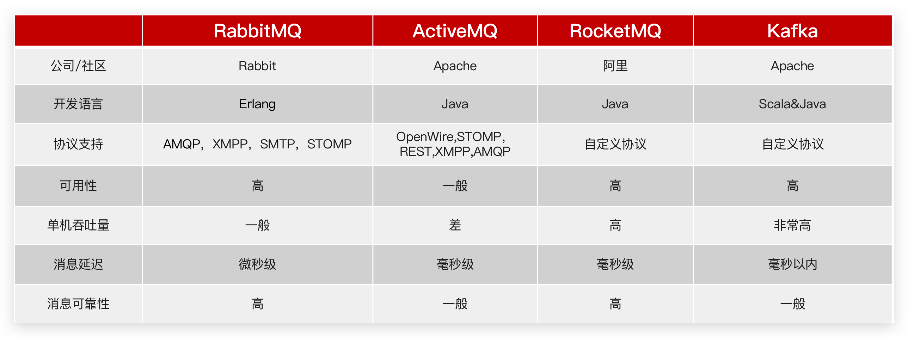

<br/>

- 追求可用性：Kafka、 RocketMQ 、RabbitMQ
- 追求可靠性：RabbitMQ、RocketMQ
- 追求吞吐能力：RocketMQ、Kafka
- 追求消息低延迟：RabbitMQ、Kafka

<br/>

:::warning  💡思考：为什么选择 RabbitMQ 而没有选择 Kafka

Kafka 是以吞吐量高而闻名，不过其数据稳定性一般，而且无法保证消息有序性。我们公司的日志收集也有使用，业务模块中则使用的RabbitMQ。

阿里巴巴的 RocketMQ 基于 Kafka 的原理，弥补了 Kafka 的缺点，继承了其高吞吐的优势，其客户端目前以 Java 为主。但是我们担心阿里巴巴开源产品的稳定性，所以就没有使用。

RabbitMQ 基于面向并发的语言 Erlang 开发，吞吐量不如 Kafka，但是对我们公司来讲够用了。而且消息可靠性较好，并且消息延迟极低，集群搭建比较方便。支持多种协议，并且有各种语言的客户端，比较灵活。Spring对RabbitMQ的支持也比较好，使用起来比较方便，比较符合我们公司的需求。

综合考虑我们公司的并发需求以及稳定性需求，我们选择了RabbitMQ。

:::


## 快速入门

### 安装MQ

安装RabbitMQ，参考资料：[安装RabbitMQ](00操作篇-安装MQ.md)

<br/>

**基本结构**


<br/>

RabbitMQ中的一些角色：

- Publisher：生产者
- Consumer：消费者
- Exchange：交换机，负责消息路由
- Queue：队列，存储消息
- VirtualHost：虚拟主机，隔离不同租户的exchange、queue、消息的隔离

<br/>

### 消息模型

RabbitMQ官方提供了5个不同的Demo示例，对应了不同的消息模型：

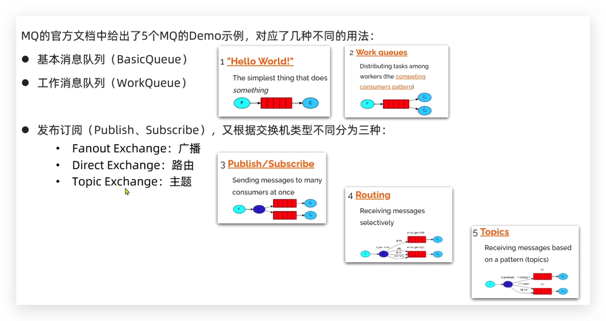

<br/>

### 导入工程

Gitee仓库提供了一个Demo工程：[mq-demo](https://gitee.com/iMousse/cswiki-project/tree/master/cloud/mq-demo)

<br/>

**结构如下**

```sh
# 父工程，管理项目依赖
mq-demo
│   # 消息的消费者
├── consumer
│   # 消息的发送者
└── publisher
```

<br/>

**实现步骤**

- 运行 `Publisher` 服务中的测试类 `PublisherTest` 中的测试方法`testSendMessage()`
- 查看 `RabbitMQ` 控制台的消息
- 启动 `Consumer`服务，查看是否能接收消息

<br/>

### 入门案例

简单队列模式的模型图：

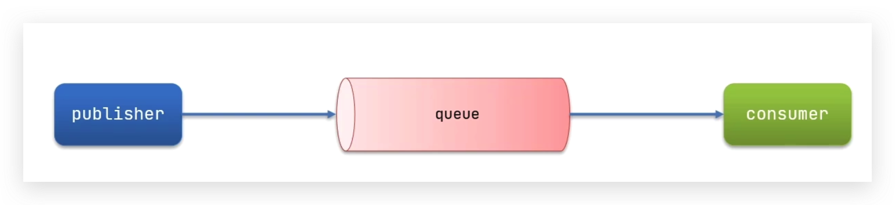

<br/>

官方的 `HelloWorld` 是基于最基础的消息队列模型来实现的，只包括三个角色：

- `Publisher`：消息发布者，将消息发送到队列 `Queue`
- `Queue`：消息队列，负责接受并缓存消息
- `Consumer`：订阅队列，处理队列中的消息

<br/>

:::warning 💡思考：Publisher 实现的流程

- 建立连接
- 创建 Channel
- 声明队列
- 发送消息
- 关闭连接和 Channel

:::

<br/>

**代码实现**

```java
package cn.itcast.mq.helloworld;

import com.rabbitmq.client.Channel;
import com.rabbitmq.client.Connection;
import com.rabbitmq.client.ConnectionFactory;
import org.junit.Test;

import java.io.IOException;
import java.util.concurrent.TimeoutException;

public class PublisherTest {
    @Test
    public void testSendMessage() throws IOException, TimeoutException {
        // 1.建立连接
        ConnectionFactory factory = new ConnectionFactory();
        // 1.1.设置连接参数，分别是：主机名、端口号、vhost、用户名、密码
        factory.setHost("192.168.150.101");
        factory.setPort(5672);
        factory.setVirtualHost("/");
        factory.setUsername("itcast");
        factory.setPassword("123321");
        // 1.2.建立连接
        Connection connection = factory.newConnection();

        // 2.创建通道Channel
        Channel channel = connection.createChannel();

        // 3.创建队列
        String queueName = "simple.queue";
        channel.queueDeclare(queueName, false, false, false, null);

        // 4.发送消息
        String message = "hello, rabbitmq!";
        channel.basicPublish("", queueName, null, message.getBytes());
        System.out.println("发送消息成功：【" + message + "】");

        // 5.关闭通道和连接
        channel.close();
        connection.close();

    }
}
```

<br/>

:::warning 💡思考：Consumer实现的流程

- 建立连接
- 创建Channel
- 声明队列
- 订阅消息

:::

<br/>

**代码实现**

```java
package cn.itcast.mq.helloworld;

import com.rabbitmq.client.*;

import java.io.IOException;
import java.util.concurrent.TimeoutException;

public class ConsumerTest {

    public static void main(String[] args) throws IOException, TimeoutException {
        // 1.建立连接
        ConnectionFactory factory = new ConnectionFactory();
        // 1.1.设置连接参数，分别是：主机名、端口号、vhost、用户名、密码
        factory.setHost("192.168.150.101");
        factory.setPort(5672);
        factory.setVirtualHost("/");
        factory.setUsername("itcast");
        factory.setPassword("123321");
        // 1.2.建立连接
        Connection connection = factory.newConnection();

        // 2.创建通道Channel
        Channel channel = connection.createChannel();

        // 3.创建队列
        String queueName = "simple.queue";
        channel.queueDeclare(queueName, false, false, false, null);

        // 4.订阅消息
        channel.basicConsume(queueName, true, new DefaultConsumer(channel){
            @Override
            public void handleDelivery(String consumerTag, Envelope envelope,
                                       AMQP.BasicProperties properties, byte[] body) throws IOException {
                // 5.处理消息
                String message = new String(body);
                System.out.println("接收到消息：【" + message + "】");
            }
        });
        System.out.println("等待接收消息。。。。");
    }
}
```

<br/>

:::warning 💡思考：流程总结

基本消息队列的消息发送流程

1. 建立 connection

2. 创建 channel

3. 利用 channel 声明队列

4. 利用 channel 向队列发送消息

基本消息队列的消息接收流程

1. 建立 connection

2. 创建 channel

3. 利用 channel 声明队列

4. 定义 consumer 的消费行为 handleDelivery()

5. 利用 channel 将消费者与队列绑定

:::

<br/>

## SpringAMQP

SpringAMQP是基于RabbitMQ封装的一套模板，并且还利用SpringBoot对其实现了自动装配，使用起来非常方便。

SpringAmqp的官方地址：https://spring.io/projects/spring-amqp


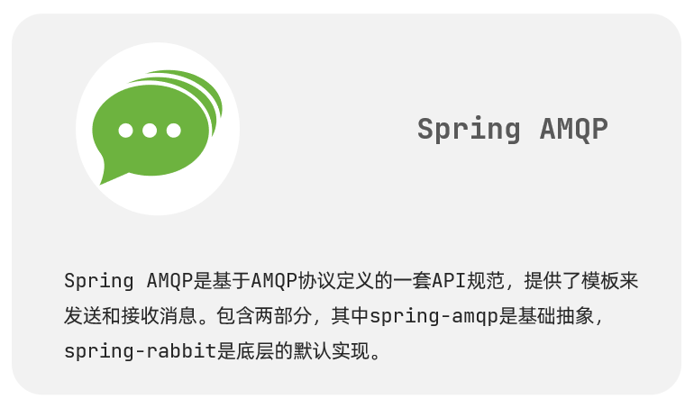

<br/>

SpringAMQP提供了三个功能：

- 自动声明队列、交换机及其绑定关系
- 基于注解的监听器模式，异步接收消息
- 封装了RabbitTemplate工具，用于发送消息 

<br/>

### BasicQueue 

**简单队列模型**

在父工程 `mq-demo` 中引入依赖

```xml
<!--AMQP依赖，包含RabbitMQ-->
<dependency>
    <groupId>org.springframework.boot</groupId>
    <artifactId>spring-boot-starter-amqp</artifactId>
</dependency>
```

<br/>

#### **消息发送**

首先配置MQ地址，在 publisher 服务的 application.yml 中添加配置：

```yaml
spring:
  rabbitmq:
    host: 192.168.150.101 # 主机名
    port: 5672 # 端口
    virtual-host: / # 虚拟主机
    username: itcast # 用户名
    password: 123321 # 密码
```

<br/>

然后在 publisher 服务中编写测试类 SpringAmqpTest，并利用 RabbitTemplate 实现消息发送：

```java
package cn.itcast.mq.spring;

import org.junit.Test;
import org.junit.runner.RunWith;
import org.springframework.amqp.rabbit.core.RabbitTemplate;
import org.springframework.beans.factory.annotation.Autowired;
import org.springframework.boot.test.context.SpringBootTest;
import org.springframework.test.context.junit4.SpringRunner;

@RunWith(SpringRunner.class)
@SpringBootTest
public class SpringAmqpTest {

    @Autowired
    private RabbitTemplate rabbitTemplate;

    @Test
    public void testSimpleQueue() {
        // 队列名称
        String queueName = "simple.queue";
        // 消息
        String message = "hello, spring amqp!";
        // 发送消息
        rabbitTemplate.convertAndSend(queueName, message);
    }
}
```

<br/>

#### 消息接收

首先配置MQ地址，在consumer服务的application.yml中添加配置：

```yaml
spring:
  rabbitmq:
    host: 192.168.150.101 # 主机名
    port: 5672 # 端口
    virtual-host: / # 虚拟主机
    username: itcast # 用户名
    password: 123321 # 密码
```

<br/>

然后在consumer服务的`cn.itcast.mq.listener`包中新建一个类SpringRabbitListener，代码如下：

```java
package cn.itcast.mq.listener;

import org.springframework.amqp.rabbit.annotation.RabbitListener;
import org.springframework.stereotype.Component;

@Component
public class SpringRabbitListener {

    @RabbitListener(queues = "simple.queue")
    public void listenSimpleQueueMessage(String msg) throws InterruptedException {
        System.out.println("spring 消费者接收到消息：【" + msg + "】");
    }
}
```

<br/>

#### 测试

启动consumer服务，然后在publisher服务中运行测试代码，发送MQ消息

<br/>

### WorkQueue

Work queues，也被称为（Task queues），任务模型。简单来说就是**让多个消费者绑定到一个队列，共同消费队列中的消息**。

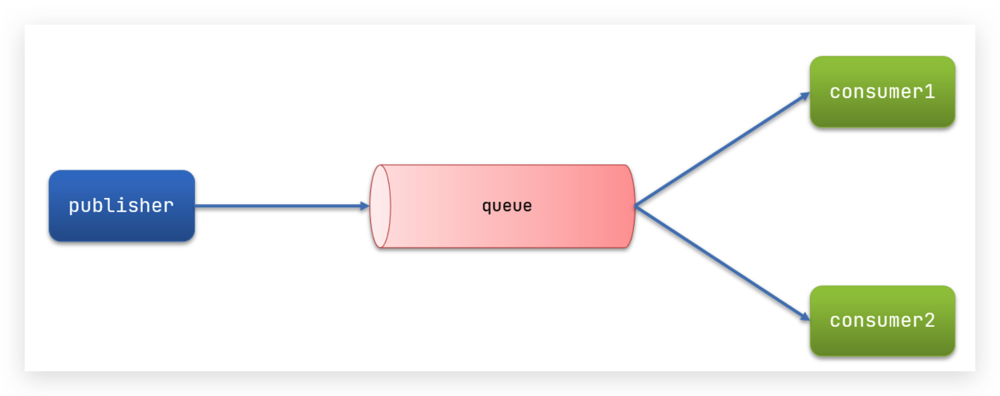

当消息处理比较耗时的时候，可能生产消息的速度会远远大于消息的消费速度。长此以往，消息就会堆积越来越多，无法及时处理。

此时就可以使用 work  模型，多个消费者共同处理消息处理，速度就能大大提高了。

<br/>

#### 消息发送

这次我们循环发送，模拟大量消息堆积现象。

在 publisher 服务中的 SpringAmqpTest 类中添加一个测试方法：

```java
/**
 * workQueue
 * 向队列中不停发送消息，模拟消息堆积。
*/
@Test
public void testWorkQueue() throws InterruptedException {
    // 队列名称
    String queueName = "simple.queue";
    // 消息
    String message = "hello, message_";
    for (int i = 0; i < 50; i++) {
        // 发送消息
        rabbitTemplate.convertAndSend(queueName, message + i);
        Thread.sleep(20);
    }
}
```

<br/>

#### 消息接收

要模拟多个消费者绑定同一个队列，我们在consumer服务的SpringRabbitListener中添加2个新的方法：

```java
@RabbitListener(queues = "simple.queue")
public void listenWorkQueue1(String msg) throws InterruptedException {
    System.out.println("消费者1接收到消息：【" + msg + "】" + LocalTime.now());
    Thread.sleep(20);
}

@RabbitListener(queues = "simple.queue")
public void listenWorkQueue2(String msg) throws InterruptedException {
    System.err.println("消费者2........接收到消息：【" + msg + "】" + LocalTime.now());
    Thread.sleep(200);
}
```

注意到这个消费者sleep了1000秒，模拟任务耗时。

<br/>

#### 测试

启动ConsumerApplication后，在执行publisher服务中刚刚编写的发送测试方法testWorkQueue。

可以看到消费者1很快完成了自己的25条消息。消费者2却在缓慢的处理自己的25条消息。

<br/>

也就是说消息是平均分配给每个消费者，并没有考虑到消费者的处理能力。这样显然是有问题的。

<br/>

#### 能者多劳

在spring中有一个简单的配置，可以解决这个问题。我们修改consumer服务的application.yml文件，添加配置：

```yaml
spring:
  rabbitmq:
    listener:
      simple:
        prefetch: 1 # 每次只能获取一条消息，处理完成才能获取下一个消息
```

<br/>

:::warning 💡 总结：Work 模型的使用

- 多个消费者绑定到一个队列，同一条消息只会被一个消费者处理
- 通过设置prefetch来控制消费者预取的消息数量

:::

<br/>

### 发布/订阅

发布订阅的模型如图

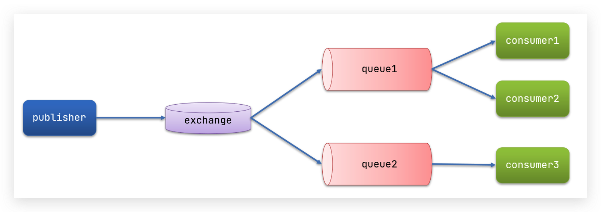

<br/>

可以看到，在订阅模型中，多了一个 Exchange 角色，而且过程略有变化：

- Publisher：生产者，也就是要发送消息的程序，但是不再发送到队列中，而是发给X（交换机）
- Exchange：交换机，图中的X。一方面，接收生产者发送的消息。另一方面，知道如何处理消息，例如递交给某个特别队列、递交给所有队列、或是将消息丢弃。到底如何操作，取决于 Exchange 的类型。Exchange有以下3种类型：
  - Fanout：广播，将消息交给所有绑定到交换机的队列
  - Direct：定向，把消息交给符合指定routing key 的队列
  - Topic：通配符，把消息交给符合routing pattern（路由模式） 的队列
- Consumer：消费者，与以前一样，订阅队列，没有变化
- Queue：消息队列也与以前一样，接收消息、缓存消息。

<br/>

**Exchange（交换机）只负责转发消息，不具备存储消息的能力**，因此如果没有任何队列与Exchange绑定，或者没有符合路由规则的队列，那么消息会丢失！

<br/>

### Fanout

Fanout，英文翻译是扇出，我觉得在MQ中叫广播更合适。

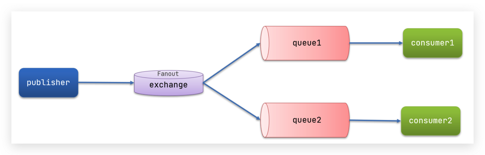

在广播模式下，消息发送流程是这样的：

- 可以有多个队列
- 每个队列都要绑定到 Exchange（交换机）
- 生产者发送的消息，只能发送到交换机，交换机来决定要发给哪个队列，生产者无法决定
- 交换机把消息发送给绑定过的所有队列
- 订阅队列的消费者都能拿到消息

<br/>

我们的计划是这样的：

- 创建一个交换机 `itcast.fanout` ，类型是 `Fanout`
- 创建两个队列 `fanout.queue1` 和 `fanout.queue2` ，绑定到交换机 `itcast.fanout`

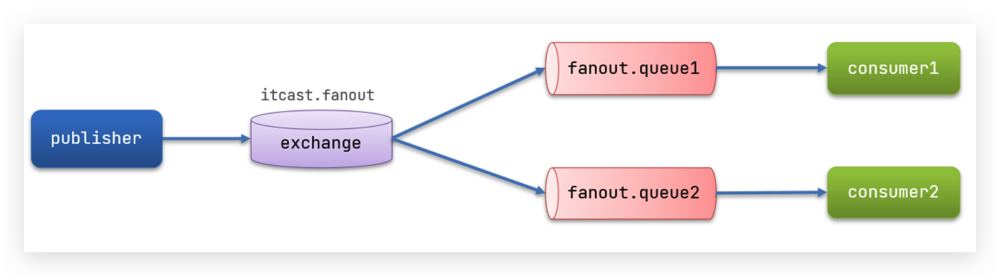

<br/>

#### 声明队列和交换机

Spring提供了一个接口Exchange，来表示所有不同类型的交换机：


在consumer中创建一个类，声明队列和交换机：

```java
package cn.itcast.mq.config;

import org.springframework.amqp.core.Binding;
import org.springframework.amqp.core.BindingBuilder;
import org.springframework.amqp.core.FanoutExchange;
import org.springframework.amqp.core.Queue;
import org.springframework.context.annotation.Bean;
import org.springframework.context.annotation.Configuration;

@Configuration
public class FanoutConfig {
    /**
     * 声明交换机
     * @return Fanout类型交换机
     */
    @Bean
    public FanoutExchange fanoutExchange(){
        return new FanoutExchange("itcast.fanout");
    }

    /**
     * 第1个队列
     */
    @Bean
    public Queue fanoutQueue1(){
        return new Queue("fanout.queue1");
    }

    /**
     * 绑定队列和交换机
     */
    @Bean
    public Binding bindingQueue1(Queue fanoutQueue1, FanoutExchange fanoutExchange){
        return BindingBuilder.bind(fanoutQueue1).to(fanoutExchange);
    }

    /**
     * 第2个队列
     */
    @Bean
    public Queue fanoutQueue2(){
        return new Queue("fanout.queue2");
    }

    /**
     * 绑定队列和交换机
     */
    @Bean
    public Binding bindingQueue2(Queue fanoutQueue2, FanoutExchange fanoutExchange){
        return BindingBuilder.bind(fanoutQueue2).to(fanoutExchange);
    }
}
```


#### 消息发送

在publisher服务的SpringAmqpTest类中添加测试方法：

```java
@Test
public void testFanoutExchange() {
    // 队列名称
    String exchangeName = "itcast.fanout";
    // 消息
    String message = "hello, everyone!";
    rabbitTemplate.convertAndSend(exchangeName, "", message);
}
```


<br/>

#### 消息接收

在consumer服务的SpringRabbitListener中添加两个方法，作为消费者：

```java
@RabbitListener(queues = "fanout.queue1")
public void listenFanoutQueue1(String msg) {
    System.out.println("消费者1接收到Fanout消息：【" + msg + "】");
}

@RabbitListener(queues = "fanout.queue2")
public void listenFanoutQueue2(String msg) {
    System.out.println("消费者2接收到Fanout消息：【" + msg + "】");
}
```

<br/>

:::warning 📌 总结

交换机的作用是什么？

- 接收publisher发送的消息
- 将消息按照规则路由到与之绑定的队列
- 不能缓存消息，路由失败，消息丢失
- FanoutExchange的会将消息路由到每个绑定的队列

声明队列、交换机、绑定关系的Bean是什么？

- Queue
- FanoutExchange
- Binding

:::

<br/>

### Direct

在Fanout模式中，一条消息，会被所有订阅的队列都消费。但是，在某些场景下，我们希望不同的消息被不同的队列消费。这时就要用到Direct类型的Exchange。

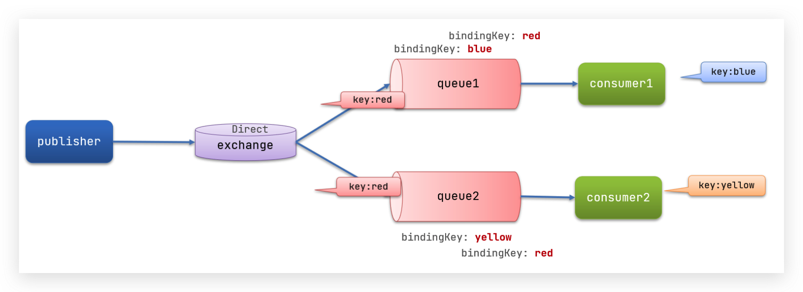

 在Direct模型下：

- 队列与交换机的绑定，不能是任意绑定了，而是要指定一个`RoutingKey`（路由key）
- 消息的发送方在 向 Exchange发送消息时，也必须指定消息的 `RoutingKey`。
- Exchange不再把消息交给每一个绑定的队列，而是根据消息的`Routing Key`进行判断，只有队列的`Routingkey`与消息的 `Routing key`完全一致，才会接收到消息

<br/>

**案例需求如下**：

1. 利用@RabbitListener声明Exchange、Queue、RoutingKey

2. 在consumer服务中，编写两个消费者方法，分别监听direct.queue1和direct.queue2

3. 在publisher中编写测试方法，向itcast. direct发送消息

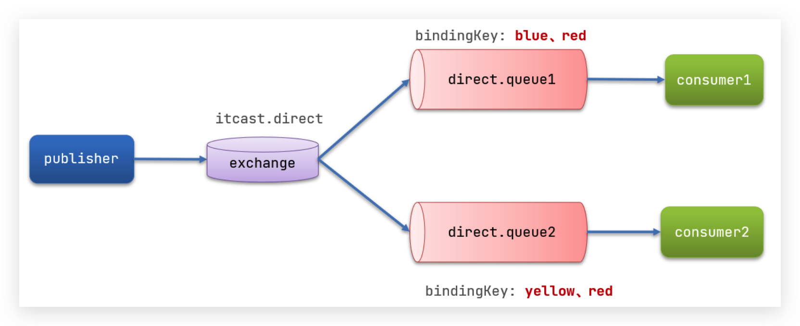

<br/>

#### 基于注解声明

基于@Bean的方式声明队列和交换机比较麻烦，Spring还提供了基于注解**声明队列和交换机**。

在 consumer 的 SpringRabbitListener 中添加两个消费者，同时基于注解来声明队列和交换机：

```java
@RabbitListener(bindings = @QueueBinding(
    value = @Queue(name = "direct.queue1"),
    exchange = @Exchange(name = "itcast.direct", type = ExchangeTypes.DIRECT),
    key = {"red", "blue"}
))
public void listenDirectQueue1(String msg){
    System.out.println("消费者接收到direct.queue1的消息：【" + msg + "】");
}

@RabbitListener(bindings = @QueueBinding(
    value = @Queue(name = "direct.queue2"),
    exchange = @Exchange(name = "itcast.direct", type = ExchangeTypes.DIRECT),
    key = {"red", "yellow"}
))
public void listenDirectQueue2(String msg){
    System.out.println("消费者接收到direct.queue2的消息：【" + msg + "】");
}
```

<br/>

#### 消息发送

在publisher服务的SpringAmqpTest类中添加测试方法：

```java
@Test
public void testSendDirectExchange() {
    // 交换机名称
    String exchangeName = "itcast.direct";
    // 消息
    String message = "红色警报！日本乱排核废水，导致海洋生物变异，惊现哥斯拉！";
    // 发送消息
    rabbitTemplate.convertAndSend(exchangeName, "red", message);
}
```

<br/>

:::warning 📌 总结：描述下Direct交换机与Fanout交换机的差异？

- Fanout交换机将消息路由给每一个与之绑定的队列
- Direct交换机根据RoutingKey判断路由给哪个队列
- 如果多个队列具有相同的RoutingKey，则与Fanout功能类似

基于@RabbitListener注解声明队列和交换机有哪些常见注解？

- @Queue
- @Exchange

:::

<br/>

### Topic

`Topic`类型的`Exchange`与`Direct`相比，都是可以根据`RoutingKey`把消息路由到不同的队列。只不过`Topic`类型`Exchange`可以让队列在绑定`Routing key` 的时候使用通配符！

<br/>

`Routingkey` 一般都是有一个或多个单词组成，多个单词之间以”.”分割，例如： `item.insert`

 通配符规则：

`#`：匹配一个或多个词

`*`：匹配不多不少恰好1个词

<br/>

举例：

`item.#`：能够匹配`item.spu.insert` 或者 `item.spu`

`item.*`：只能匹配`item.spu`

<br/>

图示：

 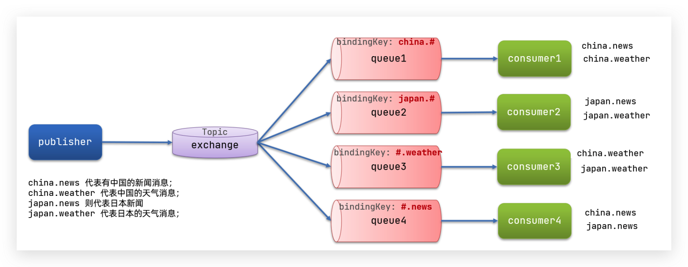

解释：

- Queue1：绑定的是`china.#` ，因此凡是以 `china.`开头的`routing key` 都会被匹配到。包括china.news和china.weather
- Queue2：绑定的是`#.news` ，因此凡是以 `.news`结尾的 `routing key` 都会被匹配。包括china.news和japan.news

<br/>

实现思路：

1. 并利用@RabbitListener声明Exchange、Queue、RoutingKey
2. 在consumer服务中，编写两个消费者方法，分别监听topic.queue1和topic.queue2
3. 在publisher中编写测试方法，向itcast. topic发送消息

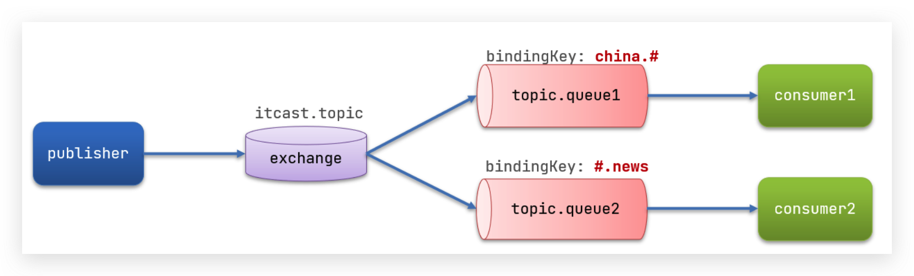

<br/>

#### 消息发送

在 publisher 服务的 SpringAmqpTest 类中添加测试方法：

```java
/**
     * topicExchange
     */
@Test
public void testSendTopicExchange() {
    // 交换机名称
    String exchangeName = "itcast.topic";
    // 消息
    String message = "喜报！孙悟空大战哥斯拉，胜!";
    // 发送消息
    rabbitTemplate.convertAndSend(exchangeName, "china.news", message);
}
```

<br/>

#### 消息接收

在 consumer 服务的 SpringRabbitListener 中添加方法：

```java
@RabbitListener(bindings = @QueueBinding(
    value = @Queue(name = "topic.queue1"),
    exchange = @Exchange(name = "itcast.topic", type = ExchangeTypes.TOPIC),
    key = "china.#"
))
public void listenTopicQueue1(String msg){
    System.out.println("消费者接收到topic.queue1的消息：【" + msg + "】");
}

@RabbitListener(bindings = @QueueBinding(
    value = @Queue(name = "topic.queue2"),
    exchange = @Exchange(name = "itcast.topic", type = ExchangeTypes.TOPIC),
    key = "#.news"
))
public void listenTopicQueue2(String msg){
    System.out.println("消费者接收到topic.queue2的消息：【" + msg + "】");
}
```

<br/>

:::warning 📌总结：描述下Direct交换机与Topic交换机的差异？

- Topic交换机接收的消息RoutingKey必须是多个单词，以 `**.**` 分割
- Topic交换机与队列绑定时的bindingKey可以指定通配符
- `#`：代表0个或多个词
- `*`：代表1个词

:::

<br/>

### 消息转换器

之前说过，Spring会把你发送的消息序列化为字节发送给MQ，接收消息的时候，还会把字节反序列化为Java对象。


只不过，默认情况下Spring采用的序列化方式是JDK序列化。众所周知，JDK序列化存在下列问题：

- 数据体积过大
- 有安全漏洞
- 可读性差

我们来测试一下。

<br/>

#### 测试默认转换器

我们修改消息发送的代码，发送一个Map对象：

```java
@Test
public void testSendMap() throws InterruptedException {
    // 准备消息
    Map<String,Object> msg = new HashMap<>();
    msg.put("name", "Jack");
    msg.put("age", 21);
    // 发送消息
    rabbitTemplate.convertAndSend("simple.queue","", msg);
}
```

<br/>

停止consumer服务

<br/>

发送消息后查看控制台：


<br/>

#### 配置JSON转换器

显然，JDK序列化方式并不合适。我们希望消息体的体积更小、可读性更高，因此可以使用JSON方式来做序列化和反序列化。

在publisher和consumer两个服务中都引入依赖：

```xml
<dependency>
    <groupId>com.fasterxml.jackson.dataformat</groupId>
    <artifactId>jackson-dataformat-xml</artifactId>
    <version>2.9.10</version>
</dependency>
```

配置消息转换器。

<br/>

在启动类中添加一个Bean即可：

```java
@Bean
public MessageConverter jsonMessageConverter(){
    return new Jackson2JsonMessageConverter();
}
```


