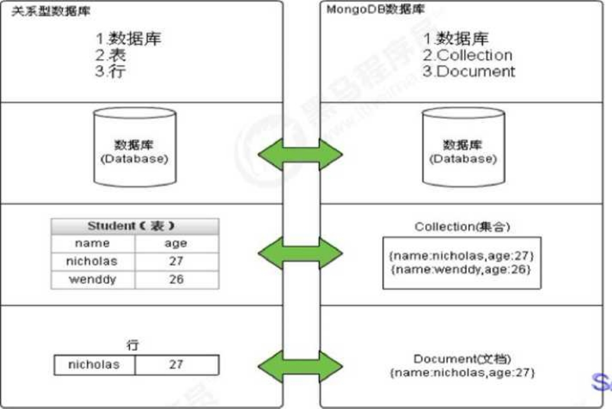
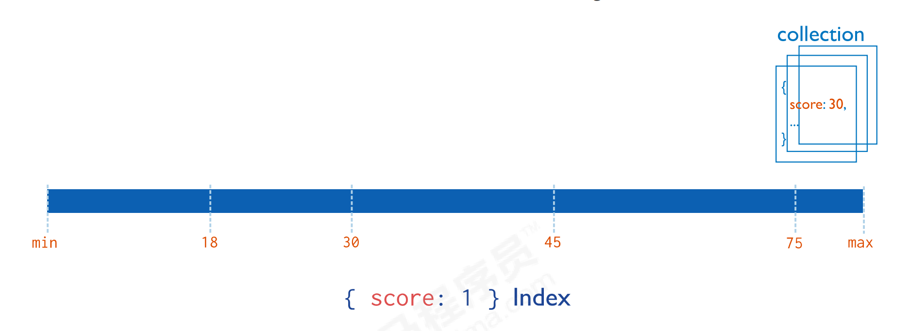
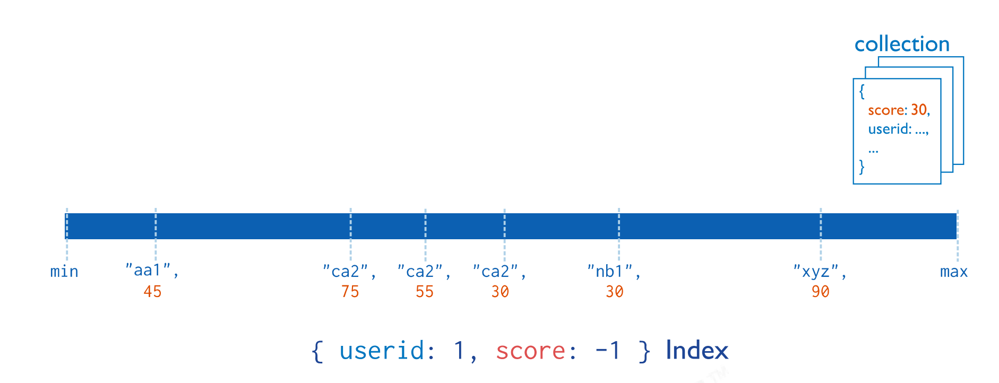
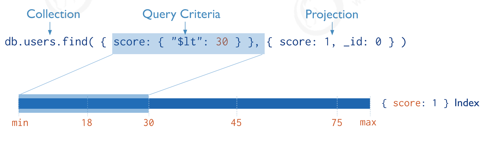
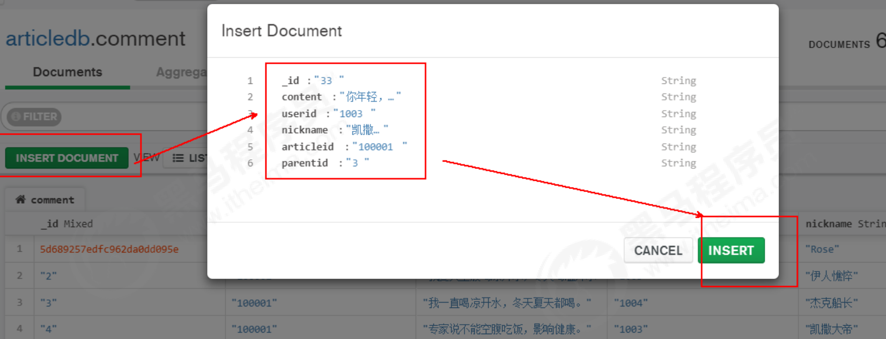

课程目标

- 理解MongoDB的业务场景、熟悉MongoDB的简介、特点和体系结构、数据类型等。
- 能够在Windows和Linux下安装和启动MongoDB,图形化管理界面Compass的安装使用
- 掌握MongoDB基本常用命令实现数据的CRUD
- 掌握MongoDB的索弓|类型、索引管理、执行计划。
- 使用Spring Data MongoDB完成文章评论业务的开发


1.相关概念
==========

1.1业务应用场景
---------------

传统的关系型数据库（如MySQL），在数据操作的"三高"需求以及应对Web2.0的网站需求面前，显得力不从心。

解释："三高"需求：

- High performance -对数据库高并发读写的需求。
- Huge Storage -对海量数据的高效率存储和访问的需求。
- High Scalability && High Availability-对数据库的高可扩展性和高可用性的需求。

而MongoDB可应对'三高"需求。


具体的应用场景如:

1. 社交场景：使用 MongoDB 存储用户信息，以及用户发表的朋友圈信息，通过地理位置索引实现附近的人、地点等功能。
2. 游戏场景：使用 MongoDB 存储游戏用户信息，用户的装备、积分等直接以内嵌文档的形式存储，方便查询、高效率存储和访问。
3. 物流场景：使用 MongoDB 存储订单信息，订单状态在运送过程中会不断更新，以 MongoDB 内嵌数组的形式来存储，一次查询就能将订单所有的变更读取出来。
4. 物联网场景：使用 MongoDB 存储所有接入的智能设备信息，以及设备汇报的日志信息，并对这些信息进行多维度的分析。
5. 视频直播：使用 MongoDB 存储用户信息、点赞互动信息等。


这些应用场景中，数据操作方面的共同特点是：

1. 数据量大
2. 写入操作频繁（读写都很频繁）
3. 价值较低的数据，对事务性要求不高

对于这样的数据，我们更适合使用MongoDB来实现数据的存储。


**什么时候选择MongoDB**

在架构选型上，除了上述的三个特点外，如果你还犹豫是否要选择它？可以考虑以下的一些问题：

- 应用不需要事务及复杂 JOIN 支持
- 新应用，需求会变，数据模型无法确定，想快速迭代开发
- 应用需要2000-3000以上的读写QPS（更高也可以）
- 应用需要TB甚至 PB 级别数据存储
- 应用发展迅速，需要能快速水平扩展
- 应用要求存储的数据不丢失
- 应用需要99.999%高可用
- 应用需要大量的地理位置查询、文本查询

如果上述有1个符合，可以考虑 MongoDB，2个及以上的符合，选择 MongoDB 绝不会后悔。


思考：如果用MySQL呢？

MongoDB和MySQL相比，可以以更低的成本解决问题（包括学习、开发、运维等成本）


1.2 MongoDB简介
---------------

MongoDB是一个开源、高性能、无模式的文档型数据库，当初的设计就是用于简化开发和方便扩展，是NoSQL数据库产品中的一种。是最像关系型数据库（MySQL）的非关系型数据库。

它支持的数据结构非常松散，是一种类似于 JSON 的 格式叫BSON，所以它既可以存储比较复杂的数据类型，又相当的灵活。

MongoDB中的记录是一个文档，它是一个由字段和值对（fifield:value）组成的数据结构。MongoDB文档类似于JSON对象，即一个文档认为就是一个对象。字段的数据类型是字符型，它的值除了使用基本的一些类型外，还可以包括其他文档、普通数组和文档数组。


1.3 体系结构
------------

MySQL和MongoDB对比




| SQL术语/概念 | MongoDB术语/概念 | 解释说明                            |
| ------------ | ---------------- | ----------------------------------- |
| database     | database         | 数据库                              |
| table        | collection       | 数据库表/集合                       |
| row          | document         | 数据记录行/文档                     |
| column       | field            | 数据字段/域                         |
| index        | index            | 索引                                |
| table joins  |                  | 表连接 MongoDB 不支持               |
|              | 嵌入文档         | MongoDB通过嵌入式文档来替代多表链接 |
| primary key  | primary key      | 主键,MongoDB自动将_id字段设置为主键 |


1.4 数据模型
------------

MongoDB的最小存储单位就是文档(document)对象。文档(document)对象对应于关系型数据库的行。数据在MongoDB中以BSON（Binary-JSON）文档的格式存储在磁盘上。

BSON（Binary Serialized Document Format）是一种类 JSON 的一种二进制形式的存储格式，简称Binary JSON。BSON 和 JSON 一样，支持内嵌的文档对象和数组对象，但是 BSON 有 JSON 没有的一些数据类型，如Date和BinData类型。

BSON 采用了类似于 C 语言结构体的名称、对表示方法，支持内嵌的文档对象和数组对象，具有轻量性、可遍历性、高效性的三个特点，可以有效描述非结构化数据和结构化数据。这种格式的优点是灵活性高，但它的缺点是空间利用率不是很理想。

Bson中，除了基本的 JSON 类型：String, Integer, Boolean, Double, Null, Array和Object，mongo还使用了特殊的数据类型。这些类型包括date,object id,binary data,regular expression 和 code。每一个驱动都以特定语言的方式实现了这些类型，查看你的驱动的文档来获取详细信息。

BSON数据类型参考列表：

| 数据类型      | 描述                                                         | 举例                                                  |
| ------------- | ------------------------------------------------------------ | ----------------------------------------------------- |
| 字符串        | UTF-8字符串都可表示为字符串类型的数据                        | `{"X" : "foobar")`                                    |
| 对象id        | 对象id是文档的12字节的唯一 ID                                | `("X" :Objectld()}`                                   |
| 布尔值        | 真或者假：true 或者 faIse                                    | `{"x":true}+`                                         |
| 数组          | 值的集合或者列表可以表示成数组                               | `("x" : ["a", "b", "c"]}`                             |
| 32位整数      | 类型不可用。JavaScript支持64位浮点数，所以32位整数会被 自动转换。 | shell是不支持该类型的，shell中默认会转换成64 位浮点数 |
| 64位整数      | 不支持这个类型。shell会使用一个屏的内嵌文档来显示64位 整数   | shell是不支持该类型的，shell中默认会转换成64 位浮点数 |
| 64位浮点数    | shell中的数字就是这一种类型                                  | `("x" : 3.14159 , "y" : 3)`                           |
| null          | 表示空值或者未定义的对象                                     | `("x":null)`                                          |
| undefined     | 文档中也可以使用未定义类型                                   | `{"x": undefined}`                                    |
| 符号          | shell不支持，shell会将数据库中的符号类型的数据自动转换成字符串 |                                                       |
| 正则表达式    | 文档中可以包含正则表达式,采用JavaScript的正则表达式语法      | `{"x" : /foobar/i)`                                   |
| 代码          | 文档中还可以包含JavaScript代码                               | `("x" : functionQ (/* ...... */})`                    |
| 二进制数据    | 二进制数据可以由任意字节的串组成，不过shell中无法使用        |                                                       |
| 最大值/最小值 | BSON包括特殊类型,表示可能的最大值。shell中没有这个 类型。    |                                                       |

提示：

shell默认使用64位浮点型数值。`{“x”：3.14}`或`{“x”：3}`。对于整型值，可以使用NumberInt（4字节符号整数）或NumberLong（8字节符号整数），`{“x”:NumberInt(“3”)}{“x”:NumberLong(“3”)}`

1.5.MongoDB的特点
-----------------

MongoDB主要有如下特点

（1）**高性能**：

MongoDB提供高性能的数据持久性。特别是对嵌入式数据模型的支持减少了数据库系统上的I/O活动。

索引支持更快的查询，并且可以包含来自嵌入式文档和数组的键。（文本索引解决搜索的需求、TTL索引解决历史数据自动过期的需求、地理位置索引可用于构建各种 O2O 应用）

mmapv1、wiredtiger、mongorocks（rocksdb）、in-memory 等多引擎支持满足各种场景需求。

Gridfs解决文件存储的需求。

（2）**高可用性：**

MongoDB的复制工具称为副本集（replica set），它可提供自动故障转移和数据冗余。

（3）**高扩展性：**

MongoDB提供了水平可扩展性作为其核心功能的一部分。

分片将数据分布在一组集群的机器上。（海量数据存储，服务能力水平扩展）

从3.4开始，MongoDB支持基于片键创建数据区域。在一个平衡的集群中，MongoDB将一个区域所覆盖的读写只定向到该区域内的那些片。

（4）**丰富的查询支持：**

MongoDB支持丰富的查询语言，支持读和写操作(CRUD)，比如数据聚合、文本搜索和地理空间查询等。

（5）其他特点：如无模式（动态模式）、灵活的文档模型、


2.单机部署
==========

2.1 Windows系统中的安装启动


3.基本常用命令
==============

3.1案例需求
-----------

存放文章评论的数据存放到MongoDB中，数据结构参考如下：

数据库：**articledb**

| 专栏文章评论   | comment        |                   |                           |
| -------------- | -------------- | ----------------- | ------------------------- |
| 字段名称       | 字段含义       | 字段类型          | 备注                      |
| _id            | ID             | Objectld 或String | Mongo的主键的字段         |
| articleid      | 文章ID         | String            |                           |
| content        | 评论内容       | String            |                           |
| userid         | 评论人ID       | String            |                           |
| nickname       | 评论人昵称     | String            |                           |
| createdatetime | 评论的日期时间 | Date              |                           |
| likenum        | 点赞数         | Int32             |                           |
| replynum       | 回复数         | Int32             |                           |
| state          | 状态           | String            | 0 :不可见；1 :可见；      |
| parentid       | 上级ID         | String            | 如果为0表示文章的顶级评论 |


3.2数据库操作
-------------

### 3.2.1.选择和创建数据库

选择和创建数据库的语法格式：

```
use 数据库名称
```

如果数据库不存在则自动创建，例如一下语句创建`spitdb`数据库

```
use articledb
```

查看有权限查看的所有的数据库命令

```
show dbs
show databases
```

> **注意**:在 MongoDB 中，集合只有在内容插入后才会创建。就是说，创建集合(数据表)后要再插入一个文档(记录)，集合才会真正创建。

查看当前正在使用的数据库命令

```
db
```

MongoDB中默认的数据库为test，如果你没有选择数据库，集合将放在test数据库中。


另外：数据库名可以满足以下条件的任意UTF-8字符串。

- 不能是空字符串（"")。
- 不得含有' '（空格)、.、$、/、\和\0 (空字符)。
- 应全部小写。
- 最多64字节。


有一些数据库名是保留的，可以直接访问这些有特殊作用的数据库。

- **admin**： 从权限的角度来看，这是"root"数据库。要是将一个用户添加到这个数据库，这个用户自动继承所有数据库的权限。一些特定的服务器端命令也只能从这个数据库运行，比如列出所有的数据库或者关闭服务器。
- **local:** 这个数据永远不会被复制，可以用来存储限于本地单台服务器的任意集合
- **confifig**: 当Mongo用于分片设置时，confifig数据库在内部使用，用于保存分片的相关信息。
### 3.2.2.数据库的删除

MongoDB删除数据库的语法格式如下：

```
db.dropDatabase()
```

提示：主要用来删除已经持久化的数据库


3.3.集合操作
------------

集合，类似关系数据库中的表，可以显示的创建，也可以隐式的创建


### 3.3.1.集合的显式创建

基本语法格式

```
db.createCollection(name)
```

参数说明:name为要创建的集合名词


例如：创建一个名为`myCollection`的普通集合

```
db.createCollection("myCollection")
```


查看当前库中的表

```
show collections
show tables
```


集合的命名规范：

- 集合名不能是空字符串""。
- 集合名不能含有\0字符（空字符)，这个字符表示集合名的结尾。
- 集合名不能以"system."开头，这是为系统集合保留的前缀。
- 用户创建的集合名字不能含有保留字符。有些驱动程序的确支持在集合名里面包含，这是因为某些系统生成的集合中包含该字符。除非你要访问这种系统创建的集合，否则千万不要在名字里出现$。


### 3.3.2.集合的隐式创建

当向一个集合中插入一个文档的时候，如果集合不存在则会自动创建集合。

详情`文档的插入`章节

提示：通常我们使用隐式创建文档。


### 3.3.3.集合的删除

集合删除语法如下

```
db.collection.drop()
db.集合.drop()
```

返回值：如果成功删除选定的集合，则drop()方法返回true,否则返回false


例如：删除`mycollection`集合

```
db.mycollection.drop()
```


3.4.文档基本CRUD
----------------

文档（Document）的数据结构和 JSON 基本一样，所有存储在集合中的数据都是 BSON 格式。


### 3.4.1.文档的插入

文档的插入分为单个文档的插入和批量插入


#### 1.单个文档插入

使用insert() 或 save() 方法向集合中插入文档，语法如下

```
db.collection.insert( 
	<document or array of documents>, 
	{ 
		writeConcern: <document>, 
		ordered: <boolean> 
	} 
)
```

参数说明

| Parameter      | Type              | Description                                                  |
| -------------- | ----------------- | ------------------------------------------------------------ |
| `document`     | document or array | 要插入到集合中的文档或文档数组。（Json格式）                 |
| `writeconcern` | document          | Optional. A document expressing the write concern. Omit to use the default write concern. See Write Concern. Do not explicitly set the write concern for the operation if run in a transaction. To use write concern with transactions, see Transactions and Write Concern. |
| `ordered`      | boolean           | 可选。如果为真，则按顺序插入数组中的文档,如果其中文档出现错误，MongoDB将返回而不处理数组中的其余文档。如果为假，则执行无序插入，如果其中文档出现错误，则继续处理数组中的主文档。在版本2.6+中默认为true |

示例

```json
db.comment.insert(
  {
    "articleid":"100000",
    "content":"今天天气真好，阳光明媚",
    "userid":"1001","nickname":"Rose",
    "createdatetime":new Date(),
    "likenum":NumberInt(10),
    "state":null
  }
)
```

提示：

1. comment集合如果不存在，则会隐式创建
2. mongo中的数字，默认情况下是double类型，如果要存整型，必须使用函数NumberInt(整型数字)，否则取出来就有问题了。
3. 插入当前日期使用 new Date()
4. 插入的数据没有指定 _id ，会自动生成主键值
5. 如果某字段没值，可以赋值为null，或不写该字段。


执行后如下，说明插入一个数据成功了

```json
WriteResult({ "nInserted" : 1 })
```


注意：

1. 文档中的键/值对是有序的。
2. 文档中的值不仅可以是在双引号里面的字符串，还可以是其他几种数据类型（甚至可以是整个嵌入的文档)。
3. MongoDB区分类型和大小写。
4. MongoDB的文档不能有重复的键。
5. 文档的键是字符串。除了少数例外情况，键可以使用任意UTF-8字符。


文档键命名规范：

- 键不能含有\0 (空字符)。这个字符用来表示键的结尾。
- .和$有特别的意义，只有在特定环境下才能使用。
- 以下划线"_"开头的键是保留的(不是严格要求的)。


#### 2.批量文档插入

批量插入语法如下

```json
db.collection.insertMany( 
  [ <document 1> , <document 2>, ... ], 
  { 
    writeConcern: <document>, 
    ordered: <boolean> 
  } 
)
```

示例

```json
db.comment.insertMany(
  [ 
    {
      "_id":"1",
      "articleid":"100001",
      "content":"我们不应该把清晨浪费在手机上，健康很重要，一杯温水幸福你我他。",
      "userid":"1002",
      "nickname":"相忘于江湖",
      "createdatetime":new Date("2019-08-05T22:08:15.522Z"),
      "likenum":NumberInt(1000),"state":"1"
    }, 
    {
      "_id":"2",
      "articleid":"100001",
      "content":"我夏天空腹喝凉开水，冬天喝温开水",
      "userid":"1005","nickname":"伊人憔悴",
      "createdatetime":new Date("2019-08-05T23:58:51.485Z"),
      "likenum":NumberInt(888),
      "state":"1"
    }, 
    {
      "_id":"3",
      "articleid":"100001",
      "content":"我一直喝凉开水，冬天夏天都喝",
      "userid":"1004","nickname":"杰克船长",
      "createdatetime":new Date("2019-08-06T01:05:06.321Z"),
      "likenum":NumberInt(666),
      "state":"1"
    }, 
    {
      "_id":"4",
      "articleid":"100001",
      "content":"专家说不能空腹吃饭，影响健康。",
      "userid":"1003","nickname":"凯撒",
      "createdatetime":new Date("2019-08-06T08:18:35.288Z"),
      "likenum":NumberInt(2000),
      "state":"1"
    }, 
    {
      "_id":"5",
      "articleid":"100001",
      "content":"研究表明，刚烧开的水千万不能喝，因为烫嘴。",
      "userid":"1003","nickname":"凯撒",
      "createdatetime":new Date("2019-08- 06T11:01:02.521Z"),
      "likenum":NumberInt(3000),
      "state":"1"
    } 
  ]
);
```

执行后如下，说明批量插入数据成功了

```json
{
        "acknowledged" : true,
        "insertedIds" : [
                "1",
                "2",
                "3",
                "4",
                "5"
        ]
}
```

提示：

插入时指定了 _id ，则主键就是该值。如果某条数据插入失败，将会终止插入，但已经插入成功的数据不会回滚掉。因为批量插入由于数据较多容易出现失败，因此，可以使用try catch进行异常捕捉处理，测试的时候可以不处理。如（了解）：

```json
try {
  db.comment.insertMany(
    [ 
      {
        "_id":"1",
        "articleid":"100001",
        "content":"我们不应该把清晨浪费在手机上，健康很重要，一杯温水幸福你我他。",
        "userid":"1002",
        "nickname":"相忘于江湖",
        "createdatetime":new Date("2019-08-05T22:08:15.522Z"),
        "likenum":NumberInt(1000),"state":"1"
      }, 
      {
        "_id":"2",
        "articleid":"100001",
        "content":"我夏天空腹喝凉开水，冬天喝温开水",
        "userid":"1005",
        "nickname":"伊人憔悴",
        "createdatetime":new Date("2019-08-05T23:58:51.485Z"),
        "likenum":NumberInt(888),
        "state":"1"
      }, 
      {
        "_id":"3",
        "articleid":"100001",
        "content":"我一直喝凉开水，冬天夏天都喝",
        "userid":"1004",
        "nickname":"杰克船长",
        "createdatetime":new Date("2019-08-06T01:05:06.321Z"),
        "likenum":NumberInt(666),
        "state":"1"
      }, 
      {
        "_id":"4",
        "articleid":"100001",
        "content":"专家说不能空腹吃饭，影响健康。",
        "userid":"1003",
        "nickname":"凯撒",
        "createdatetime":new Date("2019-08-06T08:18:35.288Z"),
        "likenum":NumberInt(2000),
        "state":"1"
      }, 
      {
        "_id":"5",
        "articleid":"100001",
        "content":"研究表明，刚烧开的水千万不能喝，因为烫嘴。",
        "userid":"1003",
        "nickname":"凯撒",
        "createdatetime":new Date("2019-08- 06T11:01:02.521Z"),
        "likenum":NumberInt(3000),
        "state":"1"
      } 
    ]
  );
} catch (e) { 
	print (e); 
}
```
### 3.4.2.文档的查询

查询数据的语法如下：

```
db.collection.find(<query>,[projection])
```

参数说明

| Parameter  | Type     | Description                                                  |
| ---------- | -------- | ------------------------------------------------------------ |
| query      | document | 可选。使用查询运算符指定选择筛选器。若要返回集合中的所有文档,请省略此参数或传递空文档 （｛｝）. |
| projection | document | 可选。指定觐与查询筛选器匹配的文档中返回的字段（噸）°若要返回匹配文档中的所有字段， 请省略此参数。 |

示例

#### 1.查询所有

当我们要查询spit集合所有文档，我们输入以下命令

```
db.comment.find()
db.comment.find({})
```

这里你会发现每条文档会有一个叫_id的字段，这个相当于我们原来关系数据库中表的主键，当你在插入文档记录时没有指定该字段，MongoDB会自动创建，其类型是ObjectID类型。如果我们在插入文档记录时指定该字段也可以，其类型可以是ObjectID类型，也可以是MongoDB支持的任意类型。


如果我想按一定条件来查询，比如我想查询userid为1003的记录，怎么办？很简单！只 要在find()中添加参数即可，参数也是json格式，如下：

```
db.comment.find({userid:'1003'})
```


如果你只需要返回符合条件的第一条数据，我们可以使用fifindOne命令来实现，语法和fifind一样。

如：查询用户编号是1003的记录，但只最多返回符合条件的第一条记录：

```
db.comment.findOne({userid:'1003'})
```


#### 2.投影查询

如果要查询结果返回部分字段，则需要使用投影查询（不显示所有字段，只显示指定的字段）。

如：查询结果只显示 _id、userid、nickname :

```json
>db.comment.find({userid:"1003"},{userid:1,nickname:1}) 
{ "_id" : "4", "userid" : "1003", "nickname" : "凯撒" } 
{ "_id" : "5", "userid" : "1003", "nickname" : "凯撒" }
```

默认 _id 会显示。

如：查询结果只显示 、userid、nickname ，不显示 _id ：

```json
>db.comment.find({userid:"1003"},{userid:1,nickname:1,_id:0}) 
{ "userid" : "1003", "nickname" : "凯撒" } 
{ "userid" : "1003", "nickname" : "凯撒" }
```

再例如：查询所有数据，但只显示 _id、userid、nickname :

```json
>db.comment.find({},{userid:1,nickname:1})
```


### 3.4.3.文档的更新

更新文档的语法：

```json
db.collection.update(query, update, options) 
//或 
db.collection.update( 
	<query>, 
	<update>, 
	{ 
		upsert: <boolean>, 
		multi: <boolean>, 
		writeConcern: <document>, 
		collation: <document>, 
		arrayFilters: [ <filterdocument1>, ... ], 
		hint: <document|string> // Available starting in MongoDB 4.2 
		} 
)
```

参数：

| Parameter    | Type                  | Description                                                  |
| ------------ | --------------------- | ------------------------------------------------------------ |
| query        | document              | 更新的选择条件。可以使用与fifind（）方法中相同的查询选择器，类似sql update查询内where后面的。。在3.0版中进行了更改：当使用upsert:true执行update（）时，如果查询使用点表示法在_id字段上指定条件，则MongoDB将拒绝插入新文档。 |
| update       | document  or pipeline | 要应用的修改。该值可以是：包含更新运算符表达式的文档，或仅包含：对的替换文档，或在MongoDB 4.2中启动聚合管道 |
| upsert       | boolean               | 可选。如果设置为true，则在没有与查询条件匹配的文档时创建新文档。默认值为false，如果找不到匹配项，则不会插入新文档。 |
| multi        | boolean               | 可选。如果设置为true，则更新符合查询条件的多个文档。如果设置为false，则更新一个文档。默认值为false。 |
| writeConcern | document              | 可选。表示写问题的文档。抛出异常的级别。                     |
| collation    | document              | 可选。指定要用于操作的校对规则。校对规则允许用户为字符串比较指定特定于语言的规则，例如字母大小写和重音标记的规则。 |
| arrayFilters | array                 | 可选。一个筛选文档数组，用于确定要为数组字段上的更新操作修改哪些数组元素。 |
| hint         | document or string    | 可选。指定用于支持查询谓词的索引的文档或字符串。该选项可以采用索引规范文档或索引名称字符串。如果指定的索引不存在，则说明操作错误。 |

提示：主要关注前四个参数即可

【示例】

#### 1.覆盖的修改

如果我们想修改_id为1的记录，点赞量为1001，输入以下语句：

```json
db.comment.update({_id:"1"},{likenum:NumberInt(1001)})
```


#### 2.局部的修改

为了解决这个问题，我们需要使用修改器$set来实现

我们想修改_id为2的记录，浏览量为889，输入以下语句：

```json
db.comment.update({_id:"2"},{$set:{likenum:NumberInt(889)}})
```


#### 3.批量的修改

更新所有用户为 1003 的用户的昵称为 凯撒大帝

```json
//默认只修改第一条数据 
db.comment.update({userid:"1003"},{$set:{nickname:"凯撒2"}}) 
//修改所有符合条件的数据 
db.comment.update({userid:"1003"},{$set:{nickname:"凯撒大帝"}},{multi:true})
```

提示：如果不加后面的参数，则只更新符合条件的第一条记录


#### 4.列值增长的修改

如果我们想实现对某列值在原有值的基础上进行增加或减少，可以使用 $inc 运算符来实现。

需求：对3号数据的点赞数，每次递增1

```json
db.comment.update({_id:"3"},{$inc:{likenum:NumberInt(1)}})
```


### 3.4.4.删除文档

删除文档的语法结构：

```
db.集合名称.remove(条件)
```

以下语句可以将数据全部删除，请慎用

```
db.comment.remove({})
```

如果删除_id=1的记录，输入以下语句

```
db.comment.remove({_id:"1"})
```


3.5.文档分页查询
----------------

### 3.5.1.统计查询

统计查询使用count()方法，语法如下：

```
db.collection.count(query, options)
```


参数

| Parameter | Type     | Description                      |
| --------- | -------- | -------------------------------- |
| query     | document | 查询选择条件。                   |
| options   | document | 可选。用于修改计数的额夕卜选项。 |

提示：可选项暂时不使用。


【示例】

1.统计所有记录数：

统计`comment`集合的所有的记录数：

```
db.comment.count()
```

2.按条件统计记录数:

例如：统计userid为1003的记录条数

```
db. comment. count ({userid : "1003"})
```

提示：

默认情况下`count()`方法返回符合条件的全部记录条数.


### 3.5.2.分页列表查询

可以使用limit。方法来读取扌旨定数量的数据，使用skip。方法来跳过指定数量的数据。

基本语法如下所示：

```json
>db.COLLECTION_NAME.find().limit(NUMBER).skip(NUMBER)
```

如果你想返回指定条数的记录,可以在 find 方法后调用 limit 来返回结果 (TopN) ,默认值20 ,例如：

```
db.comment.find().limit (3)
```

skip方法同样接受一个数字参数作为跳过的记录条数。(前N个不要)，默认值是0

```
db.comment.find().skip(3)
```

分页查询：需求：每页2个,第二页开始：跳过前两条数据,接着值显示3和4条数据

```json
//第一页
db.comment.find() .skip(0).limit(2)
//第二页
db.comment.find() .skip(2).limit(2)
//第三页
db.comment.find() .skip(4).limit(2)
```


### 3.5.3.排序查询

sort()方法对数据进行排序,sort()方法可以通过参数指定排序的字段，并使用1和-1来指定排序的方式，其中1为升序排列，而-1是用于降序排列。

语法如下所示:

```json
db.COLLECTION_NAME.find().sort({KEY：1})
//或
db.集合名称.find().sort(排序方式)
```

例如:

对userid降序排列,并对访问量进行升序排列

```json
db.comment.find().sort({userid:-1,likenum :1})
```

提示：

skip(), limilt(), sort()三个放在一起执行的时候，执行的顺序是先 sort(), 然后是 skip()，最后是显示的 limit()，和命令编写顺序无关。


3.6.文档的更多查询
------------------

### 3.6.1.正则查询

MongoDB的模糊查询是通过**正则表达式**的方式实现的。格式为：

```json
db.collection.find({field:/正则表达式/}) 
//或
db.集合.find({字段:/正则表达式/})
```

提示：正则表达式是js的语法，直接量的写法。

例如，我要查询评论内容包含“开水”的所有文档，代码如下：

```
db.comment.find({content:/开水/})
```

如果要查询评论的内容中以“专家”开头的，代码如下：

```
db.comment.find({content:/^专家/})
```


### 3.6.2.比较查询

<, <=, >, >= 这个操作符也是很常用的，格式如下:

```json
db.集合名称.find({ "field" : { $gt: value }}) // 大于: field > value 
db.集合名称.find({ "field" : { $lt: value }}) // 小于: field < value 
db.集合名称.find({ "field" : { $gte: value }}) // 大于等于: field >= value 
db.集合名称.find({ "field" : { $lte: value }}) // 小于等于: field <= value 
db.集合名称.find({ "field" : { $ne: value }}) // 不等于: field != value
```

示例：查询评论点赞数量大于700的记录

```json
db.comment.find({likenum:{$gt:NumberInt(700)}})
```


### 3.6.3.包含查询

包含使用$in操作符。 示例：查询评论的集合中userid字段包含1003或1004的文档

```json
db.comment.find({userid:{$in:["1003","1004"]}})
```

不包含使用$nin操作符。 示例：查询评论集合中userid字段不包含1003和1004的文档

```
db.comment.find({userid:{$nin:["1003","1004"]}})
```


### 3.6.4.条件连接查询

我们如果需要查询同时满足两个以上条件，需要使用$and操作符将条件进行关联。（相当于SQL的AND)格式为：

```
$and:[ { },{ },{ } ]
```

示例：查询评论集合中likenum大于等于700 并且小于2000的文档：

```json
db.comment.find({$and:[{likenum:{$gte:NumberInt(700)}},{likenum:{$lt:NumberInt(2000)}}]})
```

如果两个以上条件之间是或者的关系，我们使用`$or`操作符进行关联，与前面`and`的使用方式相同格式为：

```
$or:[ { },{ },{ } ]
```

示例：查询评论集合中userid为1003，或者点赞数小于1000的文档记录

```json
db.comment.find({$or:[ {userid:"1003"} ,{likenum:{$lt:1000} }]})
```


3.7.常用命令小结
----------------

```sql
选择切换数据库：use articledb 
插入数据：db.comment.insert({bson数据}) 
查询所有数据：db.comment.find(); 
条件查询数据：db.comment.find({条件}) 
查询符合条件的第一条记录：db.comment.findOne({条件})
查询符合条件的前几条记录：db.comment.find({条件}).limit(条数) 
查询符合条件的跳过的记录：db.comment.find({条件}).skip(条数) 
修改数据：db.comment.update({条件},{修改后的数据}) 或db.comment.update({条件},{$set:{要修改部分的字段:数据}) 
修改数据并自增某字段值：db.comment.update({条件},{$inc:{自增的字段:步进值}}) 
删除数据：db.comment.remove({条件}) 
统计查询：db.comment.count({条件}) 
模糊查询：db.comment.find({字段名:/正则表达式/}) 
条件比较运算：db.comment.find({字段名:{$gt:值}})
包含查询：db.comment.find({字段名:{$in:[值1，值2]}})或db.comment.find({字段名:{$nin:[值1，值2]}}) 
条件连接查询：db.comment.find({$and:[{条件1},{条件2}]})或db.comment.find({$or:[{条件1},{条件2}]})
```
4.索引-Index
============

4.1.概述
--------

索引支持在MongoDB中高效地执行查询。如果没有索引，MongoDB必须执行全集合扫描，即扫描集合中的每个文档，以选择与查询语句匹配的文档。这种扫描全集合的查询效率是非常低的，特别在处理大量的数据时，查询可以要花费几十秒甚至几分钟，这对网站的性能是非常致命的。

如果查询存在适当的索引，MongoDB可以使用该索引限制必须检查的文档数。

索引是特殊的数据结构，它以易于遍历的形式存储集合数据集的一小部分。索引存储特定字段或一组字段的值，按字段值排序。索引项的排序支持有效的相等匹配和基于范围的查询操作。此外，MongoDB还可以使用索引中的排序返回排序结果。

官网文档：https://docs.mongodb.com/manual/indexes/

了解：MongoDB索引使用B树数据结构（确切的说是B-Tree，MySQL是B+Tree）


4.2.索引的类型
--------------

### 4.2.1.单字段索引

MongoDB支持在文档的单个字段上创建用户定义的升序/降序索引，称为单字段索引（Single Field Index）。

对于单个字段索引和排序操作，索引键的排序顺序（即升序或降序）并不重要，因为MongoDB可以在任何方向上遍历索引。




### 4.2.2.复合索引

MongoDB还支持多个字段的用户定义索引，即复合索引（Compound Index）。

复合索引中列出的字段顺序具有重要意义。例如，如果复合索引由 { userid: 1, score: -1 } 组成，则索引首先按userid正序排序，然后

在每个userid的值内，再在按score倒序排序。




### 4.2.3.其他索引

地理空间索引（Geospatial Index）、文本索引（Text Indexes）、哈希索引（Hashed Indexes）。


地理空间索引

为了支持对地理空间坐标数据的有效查询，MongoDB提供了两种特殊的索引：返回结果时使用平面几何的二维索引和返回结果时使用球面几何的二维球面索引。


文本索引

MongoDB提供了一种文本索引类型，支持在集合中搜索字符串内容。这些文本索引不存储特定于语言的停止词（例如“the”、“a”、“or”），而将集合中的词作为词干，只存储根词。


哈希索引

为了支持基于散列的分片，MongoDB提供了散列索引类型，它对字段值的散列进行索引。这些索引在其范围内的值分布更加随机，但只支持相等匹配，不支持基于范围的查询。


4.3.索引的管理操作
------------------

### 4.3.1.索引的查看

说明：返回一个集合中的所有索引的数组

语法：

```
db.collection.getIndexs()
```

提示：该语法命令运行要求是MongoDB 3.0+

【示例】

查看comment集合中所有的索引情况

```json
> db.comment.getIndexes()
[
	{ 
		"v" : 2, 
		"key" : {"_id" : 1 },
		"name" : "_id_", 
		"ns" : "articledb.comment" 
	} 
]
```

结果中显示的是默认` _id` 索引。

默认`_id`索引：

MongoDB在创建集合的过程中，在 `_id` 字段上创建一个唯一的索引，默认名字为` _id_` ，该索引可防止客户端插入两个具有相同值的文档，您不能在`_id`字段上删除此索引。

注意：该索引是唯一索引，因此值不能重复，即 `_id` 值不能重复的。在分片集群中，通常使用 `_id` 作为片键。


### 4.3.2.索引的创建

说明：在集合上创建索引

语法：

```sql
db.collection.createIndex(keys,options)
```

参数：

| Parameter | Type     | Description                                                  |
| --------- | -------- | ------------------------------------------------------------ |
| keys      | document | 包含字段和阊寸的文档,其中字段是索引键，值描述该字段的索引类型。对于字段上的升序索引，请 指定值1 ；对于降序索引，请指定值-1。比如：{字段：1或-1},其中1为指定按升序创建索引，如果你 想按降序来创建索引指定为-1即可。另外，MongoDB支持几种不同的索引类型，包括文本、地理空 间和哈希索引。 |
| options   | document | 可选。包含一组控制索弓I创建的选项的文档。有关详细信息，请参见选项详情列表。 |

options更多选项列表：

| Parameter          | Type          | Description                                                  |
| ------------------ | ------------- | ------------------------------------------------------------ |
| background         | Boolean       | 建索引过程会阻塞其它数据库操作，background可指定以后台方式创建索引，即增加 "background"可选参数。"background"默认值为false。 |
| unique             | Boolean       | 建立的索引是否唯一。指定为true创建唯一索引。默认值为false。  |
| name               | string        | 索引的名称。如果未指定,MongoDB的通过连接索引的字段名和排序顺序生成 索引名称。 |
| dropDups           | Boolean       | 3.0+版本已废弃。在建立唯一索引时是否删除重复记录，指定true创建唯一索引。默认值为 false. |
| sparse             | Boolean       | 对文档中不存在的字段数据不启用索引；这个参数需要特别注意，如果设置为true的话，在索引字段中不会查询出不包含对应字段的文档.。默认值为***\*false.\**** |
| expireAfterSeconds | integer       | 指定以秒为单位的数值,完成TTL设定，设定集合的生存时间。       |
| V                  | index version | 索引的版本号。默认的索引版本取决于mongod创建索引时运行的版本。 |
| weights            | document      | 索引权重值，数值在1到99,999之间，表示该索引相对于其他索引字段的得分权重。 |
| default_language   | string        | 对于文本索引，该参数决定了停用词及词干和词器的规则的列表。默认为英语 |
| language_override  | string        | 对于文本索引，该参数指定了包含在文档中的字段名,语言覆盖默认的language ,默认值为 language. |

提示：

注意在 3.0.0 版本前创建索引方法为 `db.collection.ensureIndex()` ，之后的版本使用了 `db.collection.createIndex() `方法，`ensureIndex() `还能用，但只是` createIndex() `的别名。


【示例】

（1）单字段索引示例：对 userid 字段建立索引：

```json
> db.comment.createIndex({userid:1}) 
{ 
	"createdCollectionAutomatically" : false, 
	"numIndexesBefore" : 1, 
	"numIndexesAfter" : 2, 
	"ok" : 1 
}
```

参数1：按升序创建索引

```json
> db.comment.getIndexes() 
[ 	
	{ 
		"v" : 2, 
		"key" : {"_id" : 1 },
		"name" : "_id_", 
		"ns" : "articledb.comment" },
	{ 
		"v" : 2, 
		"key" : {"userid" : 1 },
		"name" : "userid_1", 
		"ns" : "articledb.comment" 
	} 
]
```


（2）复合索引：对 userid 和 nickname 同时建立复合（Compound）索引：

```json
> db.comment.createIndex({userid:1,nickname:-1}) 
{ 
	"createdCollectionAutomatically" : false, 
	"numIndexesBefore" : 2, 
	"numIndexesAfter" : 3,
  "ok" : 1 
}
```

查看一下索引

```json
> db.comment.getIndexes() 
[ 
	{ 
		"v" : 2, 
		"key" : {"_id" : 1 },
		"name" : "_id_", "ns" : 
		"articledb.comment" 
	},
	{ 
		"v" : 2, 
		"key" : {"userid" : 1 },
		"name" : "userid_1", 
		"ns" : "articledb.comment" 
	},
	{ 
		"v" : 2, 
		"key" : {"userid" : 1, "nickname" : -1 },
		"name" : "userid_1_nickname_-1", 
		"ns" : "articledb.comment" 
	} 
]
```


### 4.3.3.索引的移除

说明：可以移除指定的索引，或移除所有索引

一、指定索引的移除

语法：

```
db.collection.dropIndex(index)
```

参数：

| Parameter | Type               | Description                                                  |
| --------- | ------------------ | ------------------------------------------------------------ |
| index     | string or document | 指定要删除的索引。可以通过索引名称或索引规范文档指定索引。若要删除文本索引，请指定 |

示例：

删除 `comment` 集合中 `userid `字段上的升序索引：

```
> db.comment.dropIndex({userid:1}) 
{ "nIndexesWas" : 3, "ok" : 1 }
```


二、所有索引的移除

语法：

```
db.collection.dropIndexes()
```

示例：

```
> db.comment.dropIndexes() 
{ "nIndexesWas" : 2, "msg" : "non-_id indexes dropped for collection", "ok" : 1 }
```

提示：` _id` 的字段的索引是无法删除的，只能删除非 `_id` 字段的索引。


4.4.索引的使用
--------------

### 4.4.1.执行计划

分析查询性能（Analyze Query Performance）通常使用执行计划（解释计划、Explain Plan）来查看查询的情况，如查询耗费的时间、是否基于索引查询等。

那么，通常我们想知道，建立的索引是否有效，效果如何，都需要通过执行计划查看。

语法：

```sql
db.collection.find(query,options).explain(options)
```

【示例】

查看根据userid查询数据的情况：

```json
> db.comment.find({userid:"1003"}).explain() 
{ 
  "queryPlanner" : { 
    "plannerVersion" : 1, 
    "namespace" : "articledb.comment", 
    "indexFilterSet" : false, 
    "parsedQuery" : { 
      "userid" : { 
        "$eq" : "1003" 
      } 
    },
    "winningPlan" : { 
      "stage" : "COLLSCAN", 
      "filter" : { 
        "userid" : { 
          "$eq" : "1003" 
        } 
      },"direction" : "forward" 
    },"rejectedPlans" : [ ] 
  },
  "serverInfo" : { 
    "host" : "9ef3740277ad", 
    "port" : 27017,
    "version" : "4.0.10", 
    "gitVersion" : "c389e7f69f637f7a1ac3cc9fae843b635f20b766" 
  },"ok" : 1 
}
```

关键点看： `stage : COLLSCAN`表示全集合扫描

下面对`userid`建立索引

```json
>  db.comment.createIndex({userid:1})
{
        "numIndexesBefore" : 1,
        "numIndexesAfter" : 2,
        "createdCollectionAutomatically" : false,
        "ok" : 1
}
```

再次查看执行计划

```json
> db.comment.find({userid:"1003"}).explain()
{
        "explainVersion" : "1",
        "queryPlanner" : {
                "namespace" : "test.comment",
                "indexFilterSet" : false,
                "parsedQuery" : {
                        "userid" : {
                                "$eq" : "1003"
                        }
                },
                "queryHash" : "37A12FC3",
                "planCacheKey" : "3B74CBDE",
                "maxIndexedOrSolutionsReached" : false,
                "maxIndexedAndSolutionsReached" : false,
                "maxScansToExplodeReached" : false,
                "winningPlan" : {
                        "stage" : "FETCH",
                        "inputStage" : {
                                "stage" : "IXSCAN",
                                "keyPattern" : {
                                        "userid" : 1
                                },
                                "indexName" : "userid_1",
                                "isMultiKey" : false,
                                "multiKeyPaths" : {
                                        "userid" : [ ]
                                },
                                "isUnique" : false,
                                "isSparse" : false,
                                "isPartial" : false,
                                "indexVersion" : 2,
                                "direction" : "forward",
                                "indexBounds" : {
                                        "userid" : [
                                                "[\"1003\", \"1003\"]"
                                        ]
                                }
                        }
                },
                "rejectedPlans" : [ ]
        },
        "command" : {
                "find" : "comment",
                "filter" : {
                        "userid" : "1003"
                },
                "$db" : "test"
        },
        "serverInfo" : {
                "host" : "59761caa39b4",
                "port" : 27017,
                "version" : "5.0.5",
                "gitVersion" : "d65fd89df3fc039b5c55933c0f71d647a54510ae"
        },
        "ok" : 1
}
```

关键点看： `stage : IXSCAN` ,基于索引的扫描


### 4.4.2.涵盖的查询

Covered Queries

当查询条件和查询的投影仅包含索引字段时，MongoDB直接从索引返回结果，而不扫描任何文档或将文档带入内存。 这些覆盖的查询可以非常有效。



更多：https://docs.mongodb.com/manual/core/query-optimization/#read-operations-covered-query

【示例】

```json
>  db.comment.find({userid:"1003"},{userid:1,_id:0})
{ "userid" : "1003" }
{ "userid" : "1003" }
>  db.comment.find({userid:"1003"},{userid:1,_id:0}).explain()
{
        "explainVersion" : "1",
        "queryPlanner" : {
                "namespace" : "test.comment",
                "indexFilterSet" : false,
                "parsedQuery" : {
                        "userid" : {
                                "$eq" : "1003"
                        }
                },
                "queryHash" : "8177476D",
                "planCacheKey" : "F842FA57",
                "maxIndexedOrSolutionsReached" : false,
                "maxIndexedAndSolutionsReached" : false,
                "maxScansToExplodeReached" : false,
                "winningPlan" : {
                        "stage" : "PROJECTION_COVERED",
                        "transformBy" : {
                                "userid" : 1,
                                "_id" : 0
                        },
                        "inputStage" : {
                                "stage" : "IXSCAN",
                                "keyPattern" : {
                                        "userid" : 1
                                },
                                "indexName" : "userid_1",
                                "isMultiKey" : false,
                                "multiKeyPaths" : {
                                        "userid" : [ ]
                                },
                                "isUnique" : false,
                                "isSparse" : false,
                                "isPartial" : false,
                                "indexVersion" : 2,
                                "direction" : "forward",
                                "indexBounds" : {
                                        "userid" : [
                                                "[\"1003\", \"1003\"]"
                                        ]
                                }
                        }
                },
                "rejectedPlans" : [ ]
        },
        "command" : {
                "find" : "comment",
                "filter" : {
                        "userid" : "1003"
                },
                "projection" : {
                        "userid" : 1,
                        "_id" : 0
                },
                "$db" : "test"
        },
        "serverInfo" : {
                "host" : "59761caa39b4",
                "port" : 27017,
                "version" : "5.0.5",
                "gitVersion" : "d65fd89df3fc039b5c55933c0f71d647a54510ae"
        },
        "serverParameters" : {
                "internalQueryFacetBufferSizeBytes" : 104857600,
                "internalQueryFacetMaxOutputDocSizeBytes" : 104857600,
                "internalLookupStageIntermediateDocumentMaxSizeBytes" : 104857600,
                "internalDocumentSourceGroupMaxMemoryBytes" : 104857600,
                "internalQueryMaxBlockingSortMemoryUsageBytes" : 104857600,
                "internalQueryProhibitBlockingMergeOnMongoS" : 0,
                "internalQueryMaxAddToSetBytes" : 104857600,
                "internalDocumentSourceSetWindowFieldsMaxMemoryBytes" : 104857600
        },
        "ok" : 1
}
```

5.文章评论
==========

5.1.需求分析
------------

某头条的文章评论业务如下：


文章示例参考：早晨空腹喝水，是对还是错？https://www.toutiao.com/a6721476546088927748/

需要实现以下功能：

- 基本增删改查API
- 根据文章id查询评论
- 评论点赞


5.2.表结构分析
--------------

数据库：articledb

| 专栏文章评论   | comment        |                   |                           |
| -------------- | -------------- | ----------------- | ------------------------- |
| 字段名称       | 字段含义       | 字段类型          | 备注                      |
| _id            | ID             | Objectld 或String | Mongo的主键的字段         |
| articleid      | 文章ID         | String            |                           |
| content        | 评论内容       | String            |                           |
| userid         | 评论人ID       | String            |                           |
| nickname       | 评论人廁       | String            |                           |
| createdatetime | 评论的日期时间 | Date              |                           |
| likenum        | 点赞数         | Int32             |                           |
| replynum       | 回复数         | Int32             |                           |
| state          | 状态           | String            | 0 :不可见；1 :可见；      |
| parentid       | 上级ID         | String            | 如果为0表示文章的顶级评论 |


5.3.技术选型
------------

### 5.3.1.mongodb-driver

mongodb-driver是mongo官方推出的java连接mongoDB的驱动包，相当于JDBC驱动。我们通过一个入门的案例来了解mongodb-driver

的基本使用。

官方驱动说明和下载：http://mongodb.github.io/mongo-java-driver/

官方驱动示例文档：http://mongodb.github.io/mongo-java-driver/3.8/driver/getting-started/quick-start/


### 5.3.2.SpringDataMongoDB

SpringData家族成员之一，用于操作MongoDB的持久层框架，封装了底层的mongodb-driver。

官网主页：

https://projects.spring.io/spring-data-mongodb/

我们十次方项目的吐槽微服务就采用SpringDataMongoDB框架。


5.4.文章微服务模块搭建
----------------------

（1）搭建项目工程article，pom.xml引入依赖：

```xml
<?xml version="1.0" encoding="UTF-8"?>
<project xmlns="http://maven.apache.org/POM/4.0.0"
         xmlns:xsi="http://www.w3.org/2001/XMLSchema-instance"
         xsi:schemaLocation="http://maven.apache.org/POM/4.0.0 http://maven.apache.org/xsd/maven-4.0.0.xsd">
    <modelVersion>4.0.0</modelVersion>

    <parent>
        <groupId>org.springframework.boot</groupId>
        <artifactId>spring-boot-starter-parent</artifactId>
        <version>2.1.6.RELEASE</version>
        <relativePath/> <!-- lookup parent from repository -->
    </parent>

    <groupId>cn.itcast</groupId>
    <artifactId>mongodb-airicle</artifactId>
    <version>1.0-SNAPSHOT</version>

    <properties>
        <maven.compiler.source>8</maven.compiler.source>
        <maven.compiler.target>8</maven.compiler.target>
    </properties>

    <dependencies>
        <dependency>
            <groupId>org.springframework.boot</groupId>
            <artifactId>spring-boot-starter-test</artifactId>
            <scope>test</scope>
        </dependency>
        <dependency>
            <groupId>org.springframework.boot</groupId>
            <artifactId>spring-boot-starter-data-mongodb</artifactId>
        </dependency>
        <dependency>
            <groupId>org.projectlombok</groupId>
            <artifactId>lombok</artifactId>
        </dependency>
    </dependencies>

</project>
```

2.创建application.yml

```yml
spring:
  data:
    mongodb:
      host: 47.108.90.242
      port: 27017
      database: articledb
      #也可以使用uri连接
      #uri: mongodb://192.168.40.134:27017/articledb
```

3.创建启动类

```java
package cn.itcast.article;

import org.springframework.boot.SpringApplication;
import org.springframework.boot.autoconfigure.SpringBootApplication;

@SpringBootApplication
public class ArticleApplication {
    public static void main(String[] args) {
        SpringApplication.run(ArticleApplication.class, args);
    }
}
```

4.创建实体类

```java
package cn.itcast.article.po;

import lombok.Data;
import org.springframework.data.annotation.Id;
import org.springframework.data.mongodb.core.index.CompoundIndex;
import org.springframework.data.mongodb.core.index.Indexed;
import org.springframework.data.mongodb.core.mapping.Document;
import org.springframework.data.mongodb.core.mapping.Field;

import java.io.Serializable;
import java.time.LocalDateTime;
import java.util.Date;

/**
 * 文章评论实体类
 * 把一个java类声明为mongodb的文档，可以通过collection参数指定这个类对应的文档。                           
 * @Document(collection="mongodb 对应 collection 名")                             
 * 若未加 @Document ，该 bean save 到 mongo 的 comment collection                    
 * 若添加 @Document ，则 save 到 comment collection                                 
 */
@Document(collection = "comment")//可以省略，如果省略，则默认使用类名小写映射集合
//复合索引
//@CompoundIndex(def = "{'userid': 1, 'nickname': -1}")
@Data
public class Comment implements Serializable {
    //主键标识，该属性的值会自动对应mongodb的主键字段"_id"，如果该属性名就叫“id”,则该注解可以省略，否则必须写
    @Id
    private String id;//主键
  
    //该属性对应mongodb的字段的名字，如果一致，则无需该注解
    @Field("content")
    private String content;//吐槽内容
  
    private Date publishtime;//发布日期
  
    //添加了一个单字段的索引
    @Indexed
    private String userid;//发布人ID
  
    private String nickname;//昵称
    private LocalDateTime createdatetime;//评论的日期时间
    private Integer likenum;//点赞数
    private Integer replynum;//回复数
    private String state;//状态
    private String parentid;//上级ID
    private String articleid;
}
```

说明：

索引可以大大提升查询效率，一般在查询字段上添加索引，索引的添加可以通过Mongo的命令来添加，也可以在Java的实体类中通过注解添加。

1）单字段索引注解@Indexed

org.springframework.data.mongodb.core.index.Indexed.class

声明该字段需要索引，建索引可以大大的提高查询效率。

Mongo命令参考

```json
db.comment.createIndex({"userid":1})
```

2）复合索引注解@CompoundIndex

org.springframework.data.mongodb.core.index.CompoundIndex.class

复合索引的声明，建复合索引可以有效地提高多字段的查询效率。

Mongo命令参考：

```sql
db.comment.createIndex({"userid":1,"nickname":-1})
```


5.5.文章评论的CRUD
------------------

（1）创建数据访问接口 cn.itcast.article包下创建dao包，包下创建接口

cn.itcast.article.dao.CommentRepository

```Java
package cn.itcast.article.dao;

import cn.itcast.article.po.Comment;
import org.springframework.data.domain.Page;
import org.springframework.data.domain.Pageable;
import org.springframework.data.mongodb.repository.MongoRepository;

public interface CommentRepository extends MongoRepository<Comment,String > {


}
```

创建业务逻辑类 cn.itcast.article包下创建service包，包下创建类

```java
package cn.itcast.article.service;

import cn.itcast.article.dao.CommentRepository;
import cn.itcast.article.po.Comment;
import org.springframework.beans.factory.annotation.Autowired;
import org.springframework.data.domain.Page;
import org.springframework.data.domain.PageRequest;
import org.springframework.data.domain.Pageable;
import org.springframework.data.mongodb.core.MongoTemplate;
import org.springframework.data.mongodb.core.query.Criteria;
import org.springframework.data.mongodb.core.query.Query;
import org.springframework.data.mongodb.core.query.Update;
import org.springframework.stereotype.Service;

import java.util.List;

@Service
public class CommentService {

    @Autowired
    private CommentRepository commentRepository;

    /**
     * 保存一个评论
     * @param comment
     */
    public void saveComment(Comment comment){
        //如果需要自定义主键，可以在这里指定主键；如果不指定主键，MongoDB会自动生成主键
        //设置一些默认初始值。。。
        //调用dao
        commentRepository.save(comment);
    }

    /**
     * 更新评论
     * @param comment
     */
    public void updateComment(Comment comment){
        //调用dao
        commentRepository.save(comment);
    }

    /**
     * 根据id删除评论
     * @param id
     */
    public void deleteCommentById(String id){
        //调用dao
        commentRepository.deleteById(id);
    }

    /**
     * 查询所有评论
     * @return
     */
    public List<Comment> findCommentList(){
        //调用dao
        return commentRepository.findAll();
    }

    /**
     * 根据id查询评论
     * @param id
     * @return
     */
    public Comment findCommentById(String id){
        //调用dao
        return commentRepository.findById(id).get();
    }

}
```

（3）新建Junit测试类，测试保存和查询所有：

cn.itcast.article.service.CommentServiceTest

```java
package cn.itcast.article.service;

import cn.itcast.article.po.Comment;
import org.junit.Test;
import org.junit.runner.RunWith;
import org.springframework.beans.factory.annotation.Autowired;
import org.springframework.boot.test.context.SpringBootTest;
import org.springframework.data.domain.Page;
import org.springframework.test.context.junit4.SpringRunner;

import java.time.LocalDateTime;
import java.util.List;

@RunWith(SpringRunner.class)
@SpringBootTest
public class CommentServiceTest {

    @Autowired
    private CommentService commentService;


    @Test
    public void testFindCommentList() {
        List<Comment> commentList = commentService.findCommentList();
        System.out.println(commentList);
    }

    @Test
    public void testFindCommentById() {
        Comment commentById = commentService.findCommentById("1");
        System.out.println(commentById);
    }

    @Test
    public void testSaveComment(){
        Comment comment=new Comment();
        comment.setArticleid("100000");
        comment.setContent("测试添加的数据");
        comment.setCreatedatetime(LocalDateTime.now());
        comment.setUserid("1003");
        comment.setNickname("凯撒大帝");
        comment.setState("1");
        comment.setLikenum(0);
        comment.setReplynum(0);

        commentService.saveComment(comment);

    }
}
```


5.6.文章评论的分页查询
----------------------

（1）CommentRepository新增方法定义

```java
Page<Comment> findByParentid(String parentid,Pageable pageable);
```

（2）CommentService新增方法

```java
 public Page<Comment> findCommentListByParentid(String parentid,int page,int size) {
     return commentRepository.findByParentid(parentid,PageRequest.of(page-1,size));
 }
```

（3）Junit测试用例：

cn.itcast.article.service.CommentServiceTest

```java
		@Test
    public void testFindCommentListByParentid() {
        Page<Comment> page = commentService.findCommentListByParentid("3", 1, 2);
        System.out.println(page.getTotalElements());
        System.out.println(page.getContent());
    }
```

测试：使用compass快速插入一条测试数据，数据的内容是对3号评论内容进行评论




5.7.文章评论实现点赞
--------------------

我们看一下以下点赞的临时示例代码： CommentService 新增updateThumbup方法

```java
/*** 点赞-效率低 
 *  @param id 
 */
public void updateCommentThumbupToIncrementingOld(String id) {
    Comment comment = commentRepository.findById(id).get();
    comment.setLikenum(comment.getLikenum() + 1);
    commentRepository.save(comment);
}
```

以上方法虽然实现起来比较简单，但是执行效率并不高，因为我只需要将点赞数加1就可以了，没必要查询出所有字段修改后再更新所有字段。(蝴蝶效应)

我们可以使用MongoTemplate类来实现对某列的操作。

（1）修改CommentService

```java
@Autowired
private MongoTemplate mongoTemplate;

public void updateCommentLikenum(String id) {

    //  查询条件
    Query query = Query.query(Criteria.where("_id").is(id));
    //  更新条件
    Update update = new Update();
    update.inc("likenum");
    mongoTemplate.updateFirst(query, update, Comment.class);
}
```

（2）测试用例：

cn.itcast.article.service.CommentServiceTest

```java
   @Test
    public void testUpdateCommentLikenum() {
        commentService.updateCommentLikenum("1");
    }
```


