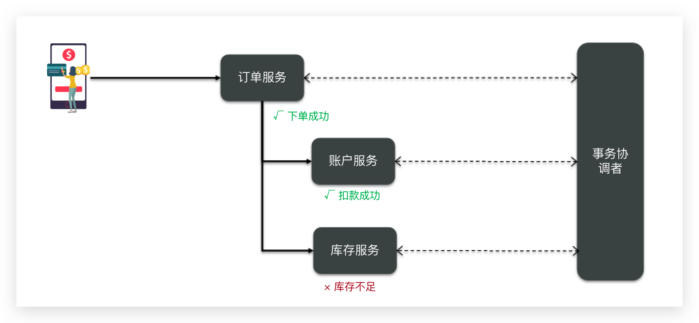
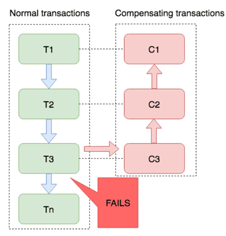

分布式事务
==========

[[toc]]


## 分布式事务问题

本地事务，也就是传统的**单机事务**。在传统数据库事务中，必须要满足四个原则：


<br/>

### 分布式事务

**分布式事务**，就是指不是在单个服务或单个数据库架构下，产生的事务，例如：

- 跨数据源的分布式事务
- 跨服务的分布式事务
- 综合情况

<br/>

在数据库水平拆分、服务垂直拆分之后，一个业务操作通常要跨多个数据库、服务才能完成。例如电商行业中比较常见的下单付款案例，包括下面几个行为：

- 创建新订单
- 扣减商品库存
- 从用户账户余额扣除金额

<br/>

完成上面的操作需要访问三个不同的微服务和三个不同的数据库。


<br/>

订单的创建、库存的扣减、账户扣款在每一个服务和数据库内是一个本地事务，可以保证ACID原则。

但是当我们把三件事情看做一个"业务"，要满足保证“业务”的原子性，要么所有操作全部成功，要么全部失败，不允许出现部分成功部分失败的现象，这就是**分布式系统下的事务**了。

此时ACID难以满足，这是分布式事务要解决的问题。

<br/>

### 分布式事务问题

我们通过一个案例来演示分布式事务的问题：

创建数据库，名为 `seata_demo`

```SQL
create database seata_demo;
use seata_demo;
SET NAMES utf8mb4;
SET FOREIGN_KEY_CHECKS = 0;

-- ----------------------------
-- Table structure for account_tbl
-- ----------------------------
DROP TABLE IF EXISTS `account_tbl`;
CREATE TABLE `account_tbl`  (
  `id` int(11) NOT NULL AUTO_INCREMENT,
  `user_id` varchar(255) CHARACTER SET utf8 COLLATE utf8_general_ci NULL DEFAULT NULL,
  `money` int(11) UNSIGNED NULL DEFAULT 0,
  PRIMARY KEY (`id`) USING BTREE
) ENGINE = InnoDB AUTO_INCREMENT = 2 CHARACTER SET = utf8 COLLATE = utf8_general_ci ROW_FORMAT = COMPACT;

-- ----------------------------
-- Records of account_tbl
-- ----------------------------
INSERT INTO `account_tbl` VALUES (1, 'user202103032042012', 1000);

-- ----------------------------
-- Table structure for order_tbl
-- ----------------------------
DROP TABLE IF EXISTS `order_tbl`;
CREATE TABLE `order_tbl`  (
  `id` int(11) NOT NULL AUTO_INCREMENT,
  `user_id` varchar(255) CHARACTER SET utf8 COLLATE utf8_general_ci NULL DEFAULT NULL,
  `commodity_code` varchar(255) CHARACTER SET utf8 COLLATE utf8_general_ci NULL DEFAULT NULL,
  `count` int(11) NULL DEFAULT 0,
  `money` int(11) NULL DEFAULT 0,
  PRIMARY KEY (`id`) USING BTREE
) ENGINE = InnoDB AUTO_INCREMENT = 1 CHARACTER SET = utf8 COLLATE = utf8_general_ci ROW_FORMAT = COMPACT;

-- ----------------------------
-- Records of order_tbl
-- ----------------------------

-- ----------------------------
-- Table structure for storage_tbl
-- ----------------------------
DROP TABLE IF EXISTS `storage_tbl`;
CREATE TABLE `storage_tbl`  (
  `id` int(11) NOT NULL AUTO_INCREMENT,
  `commodity_code` varchar(255) CHARACTER SET utf8 COLLATE utf8_general_ci NULL DEFAULT NULL,
  `count` int(11) UNSIGNED NULL DEFAULT 0,
  PRIMARY KEY (`id`) USING BTREE,
  UNIQUE INDEX `commodity_code`(`commodity_code`) USING BTREE
) ENGINE = InnoDB AUTO_INCREMENT = 2 CHARACTER SET = utf8 COLLATE = utf8_general_ci ROW_FORMAT = COMPACT;

-- ----------------------------
-- Records of storage_tbl
-- ----------------------------
INSERT INTO `storage_tbl` VALUES (1, '100202003032041', 10);

SET FOREIGN_KEY_CHECKS = 1;
```

<br/>

**导入 seat-demo 基础工程**

工程源码 ：https://gitee.com/iMousse/cswiki-project/tree/master/cloud/seata-demo

微服务结构如下：

```sh
# 父工程，负责管理项目依赖
seata-demo 
│   # 账户服务，负责管理用户的资金账户。提供扣减余额的接口
├── account-service
│   # 库存服务，负责管理商品库存。提供扣减库存的接口
├── order-service
│   # 订单服务，负责管理订单。创建订单时，需要调用account-service和storage-service
└── storage-service
```

 <br/>

**测试下单功能**

启动所有工程，发送请求

```sh
curl --location --request POST 'http://localhost:8082/order?userId=user202103032042012&commodityCode=100202003032041&count=20&money=200'
```

如图


测试发现，当库存不足时，如果余额已经扣减，并不会回滚，出现了分布式事务问题。


<br/>

### 学习目标


## 理论基础

解决分布式事务问题，需要一些分布式系统的基础知识作为理论指导。

### CAP定理

1998年，加州大学的计算机科学家 Eric Brewer 提出，分布式系统有三个指标。

- 一致性：Consistency
- 可用性：Availability
- 分区容错性：Partition tolerance 

它们的第一个字母分别是 C、A、P，这三个指标不可能同时做到。这个结论就叫做 CAP 定理。


<br/>

**一致性**

Consistency（一致性）：用户访问分布式系统中的任意节点，得到的数据必须一致。

比如现在包含两个节点，其中的初始数据是一致的：


当我们修改其中一个节点的数据时，两者的数据产生了差异：


要想保住一致性，就必须实现 node01 到 node02 的数据同步：


<br/>

**可用性**

Availability （可用性）：用户访问集群中的任意健康节点，必须能得到响应，而不是超时或拒绝。

如图，有三个节点的集群，访问任何一个都可以及时得到响应：


当有部分节点因为网络故障或其它原因无法访问时，代表节点不可用：


**分区容错**

**Partition（分区）**：因为网络故障或其它原因导致分布式系统中的部分节点与其它节点失去连接，形成独立分区。


**Tolerance（容错）**：在集群出现分区时，整个系统也要持续对外提供服务

<br/>

**矛盾**

在分布式系统中，系统间的网络不能100%保证健康，一定会有故障的时候，而服务有必须对外保证服务。因此Partition Tolerance不可避免。

当节点接收到新的数据变更时，就会出现问题了：


如果此时要保证**一致性**，就必须等待网络恢复，完成数据同步后，整个集群才对外提供服务，服务处于阻塞状态，不可用。

如果此时要保证**可用性**，就不能等待网络恢复，那node01、node02与node03之间就会出现数据不一致。

也就是说，在P一定会出现的情况下，A和C之间只能实现一个。

<br/>

:::warning 💡思考：简述CAP定理内容

- 分布式系统节点通过网络连接，一定会出现分区问题（P）
- 当分区出现时，系统的一致性（C）和可用性（A）就无法同时满足

**💡思考：ElasticSearch集群是CP还是AP**

- ES集群出现区分时，故障节点会被剔除集群，数据粉片会重新分配到其它节点，保证数据一致性。因此时低可用性，高一致性，属于CP

:::

<br/>

### BASE理论

BASE理论是对CAP的一种解决思路，包含三个思想：

- **Basically Available （基本可用）**：分布式系统在出现故障时，允许损失部分可用性，即保证核心可用。
- **Soft State（软状态）**：在一定时间内，允许出现中间状态，比如临时的不一致状态。
- **Eventually Consistent（最终一致性**）：虽然无法保证强一致性，但是在软状态结束后，最终达到数据一致。

<br/>

> 思考：解决分布式事务有什么思路？

分布式事务最大的问题是各个子事务的一致性问题，因此可以借鉴CAP定理和BASE理论，有两种解决思路：

- AP模式：各子事务分别执行和提交，允许出现结果不一致，然后采用弥补措施恢复数据即可，实现<mark>最终一致</mark>。

- CP模式：各个子事务执行后互相等待，同时提交，同时回滚，达成<mark>强一致</mark>。但事务等待过程中，处于弱可用状态。

<br/>

但不管是哪一种模式，都需要在子系统事务之间互相通讯，协调事务状态，也就是需要一个**事务协调者(TC)**



这里的子系统事务，称为**分支事务**；有关联的各个分支事务在一起称为**全局事务**。


:::warning 💡思考：简述BASE理论三个思想

- 基本可用
- 软状态
- 最终一致

<br/>

💡**思考：解决分布式事务的思想和模型**

- 全局事务：整个分布式事务
- 分支事务：每个微服务的子系统的事务
- 最终一致思想：各分支事务分别执行并提交，如果有不一致的情况，再想办法恢复数据。
- 强一致思想：各分支事务执行完业务不要提交，等待彼此结果，而后统一提交或回滚。

:::


## 初识Seata

Seata是 2019 年 1 月份蚂蚁金服和阿里巴巴共同开源的分布式事务解决方案。致力于提供高性能和简单易用的分布式事务服务，为用户打造一站式的分布式解决方案。

官网地址：http://seata.io/

其中的文档、播客中提供了大量的使用说明、源码分析。


<br/>

### Seata的架构

Seata事务管理中有三个重要的角色：

- **TC (Transaction Coordinator) -** **事务协调者：**维护全局和分支事务的状态，协调全局事务提交或回滚。

- **TM (Transaction Manager) -** **事务管理器：**定义全局事务的范围、开始全局事务、提交或回滚全局事务。

- **RM (Resource Manager) -** **资源管理器：**管理分支事务处理的资源，与TC交谈以注册分支事务和报告分支事务的状态，并驱动分支事务提交或回滚。

<br/>

**整体的架构图**


<br/>

Seata基于上述架构提供了四种不同的分布式事务解决方案：
- XA模式：强一致性分阶段事务模式，牺牲了一定的可用性，无业务侵入
- TCC模式：最终一致的分阶段事务模式，有业务侵入
- AT模式：最终一致的分阶段事务模式，无业务侵入，也是Seata的默认模式
- SAGA模式：长事务模式，有业务侵入

无论哪种方案，都离不开TC，也就是事务的协调者。

<br/>

### 部署TC服务

[安装Seata](00操作篇-安装Seata.md)

<br/>

### 集成Seata

我们以order-service为例来演示。

安装 `Maven Helper` 插件


<br/>

**引入依赖**

首先，在order-service中引入依赖：

```xml
<!--seata-->
<dependency>
    <groupId>com.alibaba.cloud</groupId>
    <artifactId>spring-cloud-starter-alibaba-seata</artifactId>
    <exclusions>
        <!--版本较低，1.3.0，因此排除--> 
        <exclusion>
            <artifactId>seata-spring-boot-starter</artifactId>
            <groupId>io.seata</groupId>
        </exclusion>
    </exclusions>
</dependency>
<dependency>
    <groupId>io.seata</groupId>
    <artifactId>seata-spring-boot-starter</artifactId>
    <!--seata starter 采用1.4.2版本-->
    <version>${seata.version}</version>
</dependency>
```

<br/>

**配置TC地址**

在 order-service 中的 application.yml 中，配置TC服务信息，通过注册中心 nacos，结合服务名称获取TC地址：

```yaml
seata:
  registry: # TC服务注册中心的配置，微服务根据这些信息去注册中心获取tc服务地址
    type: nacos # 注册中心类型 nacos
    nacos:
      server-addr: 127.0.0.1:8848 # nacos地址
      namespace: "" # namespace，默认为空
      group: DEFAULT_GROUP # 分组，默认是DEFAULT_GROUP
      application: seata-tc-server # seata服务名称
      username: nacos
      password: nacos
  tx-service-group: seata-demo # 事务组名称
  service:
    vgroup-mapping: # 事务组与cluster的映射关系
      seata-demo: SH
```

<br/>

微服务如何根据这些配置寻找TC的地址呢？

我们知道注册到Nacos中的微服务，确定一个具体实例需要四个信息：

- namespace：命名空间
- group：分组
- application：服务名
- cluster：集群名

<br/>

以上四个信息，在刚才的yaml文件中都能找到：


namespace 为空，就是默认的 public

结合起来，TC服务的信息就是：`public@DEFAULT_GROUP@seata-tc-server@SH`，这样就能确定TC服务集群了。然后就可以去Nacos拉取对应的实例信息了。

<br/>

**其它服务**

其它两个微服务也都参考order-service的步骤来做，完全一样。


## 动手实践

下面我们就一起学习下Seata中的四种不同的事务模式。

<br/>

### XA模式

XA 规范 是 X/Open 组织定义的分布式事务处理（DTP，Distributed Transaction Processing）标准，XA 规范描述了全局的TM与局部的RM之间的接口，几乎所有主流的数据库都对  XA 规范提供了支持。

<br/>

#### 两阶段提交

XA是规范，目前主流数据库都实现了这种规范，实现的原理都是基于两阶段提交。

**正常情况**


**异常情况**


<br/>

**一阶段**

- 事务协调者通知每个事物参与者执行本地事务
- 本地事务执行完成后报告事务执行状态给事务协调者，此时事务不提交，继续持有数据库锁

**二阶段**

- 事务协调者基于一阶段的报告来判断下一步操作
  - 如果一阶段都成功，则通知所有事务参与者，提交事务
  - 如果一阶段任意一个参与者失败，则通知所有事务参与者回滚事务

<br/>

#### Seata的XA模型

Seata对原始的XA模式做了简单的封装和改造，以适应自己的事务模型，基本架构如图：


<br/>

RM一阶段的工作：

- 注册分支事务到TC
- 执行分支业务SQL但不提交
- 报告执行状态到TC


TC二阶段的工作：

- TC检测各分支事务执行状态
  - 如果都成功，通知所有RM提交事务
  - 如果有失败，通知所有RM回滚事务


RM二阶段的工作：

- 接收TC指令，提交或回滚事务

<br/>

:::warning 💡思考：XA模式的优缺点

XA模式的优点是什么？

- 事务的强一致性，满足ACID原则。
- 常用数据库都支持，实现简单，并且没有代码侵入

XA模式的缺点是什么？

- 因为一阶段需要锁定数据库资源，等待二阶段结束才释放，性能较差
- 依赖关系型数据库实现事务

:::

<br/>

#### XA实现

Seata的starter已经完成了XA模式的自动装配，实现非常简单，步骤如下：

- 修改 `application.yml` 文件（每个参与事务的微服务），开启XA模式：


```yaml
seata:
  data-source-proxy-mode: XA
```

<br/>

- 给发起全局事务的入口方法添加 `@GlobalTransactional` 注解:


本例中是 `OrderServiceImpl` 中的 `create` 方法.

```java {16}
@Slf4j
@Service
public class OrderServiceImpl implements OrderService {

    private final AccountClient accountClient;
    private final StorageClient storageClient;
    private final OrderMapper orderMapper;

    public OrderServiceImpl(AccountClient accountClient, StorageClient storageClient, OrderMapper orderMapper) {
        this.accountClient = accountClient;
        this.storageClient = storageClient;
        this.orderMapper = orderMapper;
    }

    @Override
    @GlobalTransactional
    public Long create(Order order) {
        // 创建订单
        orderMapper.insert(order);
        try {
            // 扣用户余额
            accountClient.deduct(order.getUserId(), order.getMoney());
            // 扣库存
            storageClient.deduct(order.getCommodityCode(), order.getCount());

        } catch (FeignException e) {
            log.error("下单失败，原因:{}", e.contentUTF8(), e);
            throw new RuntimeException(e.contentUTF8(), e);
        }
        return order.getId();
    }
}

```

<br/>

- 重启服务并测试

重启三个服务，再次测试，发现无论怎样，三个微服务都能成功回滚。

<br/>

### AT模式

AT模式同样是分阶段提交的事务模型，不过缺弥补了XA模型中资源锁定周期过长的缺陷。

<br/>

#### Seata的AT模型

基本流程图：


<br/>

阶段一RM的工作：

- 注册分支事务
- 记录 `undo-log`（数据快照）
- 执行业务sql并提交
- 报告事务状态

阶段二提交时RM的工作：

- 删除 `undo-log` 即可

阶段二回滚时RM的工作：

- 根据 `undo-log` 恢复数据到更新前

<br/>

#### 流程梳理

我们用一个真实的业务来梳理下AT模式的原理。

比如，现在又一个数据库表，记录用户余额：`{"id": 1, "money": 100}`

其中一个分支业务要执行的SQL为：

```sql
update tb_account set money = money - 10 where id = 1
```

<br/>

AT模式下，当前分支事务执行流程如下：

**一阶段**

- TM发起并注册全局事务到TC
- TM调用分支事务
- 分支事务准备执行业务SQL
- RM拦截业务SQL，根据where条件查询原始数据，形成快照
- RM执行业务SQL，提交本地事务，释放数据库锁。此时 `money = 90`
  ```json
  {
      "id": 1, "money": 100
  }
  ```
- RM报告本地事务状态给TC

<br/>

**二阶段**

- TM通知TC事务结束

- TC检查分支事务状态
  - 如果都成功，则立即删除快照
  - 如果有分支事务失败，需要回滚。读取快照数据（`{"id": 1, "money": 100}`），将快照恢复到数据库。此时数据库再次恢复为100

<br/>

**流程图**


<br/>

:::warning 💡思考：简述AT模式与XA模式最大的区别是什么？

- XA模式一阶段不提交事务，锁定资源；AT模式一阶段直接提交，不锁定资源。
- XA模式依赖数据库机制实现回滚；AT模式利用数据快照实现数据回滚。
- XA模式强一致；AT模式最终一致

:::

<br/>

#### 脏写问题

在多线程并发访问AT模式的分布式事务时，有可能出现脏写问题，如图：


解决思路就是引入了全局锁的概念。在释放DB锁之前，先拿到全局锁。避免同一时刻有另外一个事务来操作当前数据。

<br/>

**事务2**因为获取全局锁，需要去执行 `set money` 语句，但是**事务1**也在等待DB锁。因为**事务1**的DB锁相对**事务2**的全局锁等待时间更久，**事务2**在重试30次后自动释放了。


- DB锁：数据库不释放，任何人都不能对数据库进行操作。
- 全局锁：Seate 在  TC 记录当前操作某行数据的事务。

<br/>

注意：如果不是 Seate 管理的事务则可以对这条数据进行操作。<mark>如果没有被 Seate 管理的事务操作了其他数据则不会被锁。</mark>比如修改其他字段，但是也可以修改金额字段，造成数据的脏写，但是这个几率很低，主要有三个方面

- 转账一般都是成功的，很少有需要回滚的场景
- 分布式事务，链路比较长，耗时比较久，并发比较低
- 在做业务尽量避免多个业务去操作同一个字段，可以通过代码规范来进行避免。

<br/>


但是 Seate 也有方案来进行避免


<br/>

:::warning 💡思考：AT模式优缺点

AT模式的优点：

- 一阶段完成直接提交事务，释放数据库资源，性能比较好
- 利用全局锁实现读写隔离
- 没有代码侵入，框架自动完成回滚和提交

AT模式的缺点：

- 两阶段之间属于软状态，属于最终一致
- 框架的快照功能会影响性能，但比XA模式要好很多

:::

<br/>

#### AT实现

AT模式中的快照生成、回滚等动作都是由框架自动完成，没有任何代码侵入，因此实现非常简单。

只不过，AT模式需要一个表来记录全局锁、另一张表来记录数据快照 `undo_log`。

<br/>

- 导入数据库表，记录全局锁：[Seata-V1.4.2-Client-AT-DB-脚本](https://github.com/apache/incubator-seata/tree/v1.4.2/script/client/at/db)

其中 `lock_table` 导入到TC服务关联的数据库，`undo_log` 表导入到微服务关联的数据库：

```java
SET NAMES utf8mb4;
SET FOREIGN_KEY_CHECKS = 0;

-- ----------------------------
-- Table structure for undo_log
-- ----------------------------
DROP TABLE IF EXISTS `undo_log`;
CREATE TABLE `undo_log`  (
  `branch_id` bigint(20) NOT NULL COMMENT 'branch transaction id',
  `xid` varchar(100) CHARACTER SET utf8 COLLATE utf8_general_ci NOT NULL COMMENT 'global transaction id',
  `context` varchar(128) CHARACTER SET utf8 COLLATE utf8_general_ci NOT NULL COMMENT 'undo_log context,such as serialization',
  `rollback_info` longblob NOT NULL COMMENT 'rollback info',
  `log_status` int(11) NOT NULL COMMENT '0:normal status,1:defense status',
  `log_created` datetime(6) NOT NULL COMMENT 'create datetime',
  `log_modified` datetime(6) NOT NULL COMMENT 'modify datetime',
  UNIQUE INDEX `ux_undo_log`(`xid`, `branch_id`) USING BTREE
) ENGINE = InnoDB CHARACTER SET = utf8 COLLATE = utf8_general_ci COMMENT = 'AT transaction mode undo table' ROW_FORMAT = Compact;

-- ----------------------------
-- Records of undo_log
-- ----------------------------

-- ----------------------------
-- Table structure for lock_table
-- ----------------------------
DROP TABLE IF EXISTS `lock_table`;
CREATE TABLE `lock_table`  (
  `row_key` varchar(128) CHARACTER SET utf8 COLLATE utf8_general_ci NOT NULL,
  `xid` varchar(96) CHARACTER SET utf8 COLLATE utf8_general_ci NULL DEFAULT NULL,
  `transaction_id` bigint(20) NULL DEFAULT NULL,
  `branch_id` bigint(20) NOT NULL,
  `resource_id` varchar(256) CHARACTER SET utf8 COLLATE utf8_general_ci NULL DEFAULT NULL,
  `table_name` varchar(32) CHARACTER SET utf8 COLLATE utf8_general_ci NULL DEFAULT NULL,
  `pk` varchar(36) CHARACTER SET utf8 COLLATE utf8_general_ci NULL DEFAULT NULL,
  `gmt_create` datetime NULL DEFAULT NULL,
  `gmt_modified` datetime NULL DEFAULT NULL,
  PRIMARY KEY (`row_key`) USING BTREE,
  INDEX `idx_branch_id`(`branch_id`) USING BTREE
) ENGINE = InnoDB CHARACTER SET = utf8 COLLATE = utf8_general_ci ROW_FORMAT = Compact;


SET FOREIGN_KEY_CHECKS = 1;
```

<br/>

- 修改 `application.yml` 文件，将事务模式修改为AT模式即可：

```yaml
seata:
  data-source-proxy-mode: AT # 默认就是AT
```

<br/>

- 重启服务并测试


<br/>

### TCC模式

TCC模式与AT模式非常相似，每阶段都是独立事务，不同的是TCC通过人工编码来实现数据恢复。需要实现三个方法：

- Try：资源的检测和预留； 
- Confirm：完成资源操作业务；要求 Try 成功 Confirm 一定要能成功。
- Cancel：预留资源释放，可以理解为try的反向操作。

<br/>

#### 流程分析

举例，一个扣减用户余额的业务。假设账户A原来余额是100，需要余额扣减30元。

- **阶段一（ Try ）**：检查余额是否充足，如果充足则冻结金额增加30元，可用余额扣除30

初识余额：


余额充足，可以冻结：


此时，总金额 = 冻结金额 + 可用金额，数量依然是100不变。事务直接提交无需等待其它事务。

<br/>

- **阶段二（Confirm)**：假如要提交（Confirm），则冻结金额扣减30

确认可以提交，不过之前可用金额已经扣减过了，这里只要清除冻结金额就好了：


此时，总金额 = 冻结金额 + 可用金额 = 0 + 70  = 70元

<br/>

- **阶段二(Canncel)**：如果要回滚（Cancel），则冻结金额扣减30，可用余额增加30

需要回滚，那么就要释放冻结金额，恢复可用金额：


<br/>

#### Seata的TCC模型

[TCC 理论及设计实现指南介绍 (seata.io)](http://seata.io/zh-cn/blog/tcc-mode-design-principle.html)

Seata中的TCC模型依然延续之前的事务架构，如图：


<br/>

:::warning 💡思考：TCC模式的优缺点

**TCC模式的每个阶段是做什么的？**

- Try：资源检查和预留
- Confirm：业务执行和提交
- Cancel：预留资源的释放

<br/>

**TCC的优点是什么？**

- 一阶段完成直接提交事务，释放数据库资源，性能好
- 相比AT模型，无需生成快照，无需使用全局锁，性能最强
- 不依赖数据库事务，而是依赖补偿操作，可以用于非事务型数据库

<br/>

**TCC的缺点是什么？**

- 有代码侵入，需要人为编写 Try、Confirm 和 Cancel 接口，太麻烦
- 软状态，事务是最终一致
- 需要考虑 Confirm 和 Cancel 的失败情况，做好幂等处理

:::

<br/>

#### TCC实现

改造 `account-service` 服务，利用TCC实现分布式事务

需求如下：

- 修改account-service，编写 Try、Confirm、Cancel 逻辑
- Try 业务：添加冻结金额，扣减可用金额
- Confirm 业务：删除冻结金额
- Cancel 业务：删除冻结金额，恢复可用金额
- 保证 Confirm、Cancel 接口的<font color="red">幂等性</font>
- 允许<font color="red">空回滚</font>
- 拒绝<font color="red">业务悬挂</font>

<br/>

##### 空回滚

当某分支事务的 Try 阶段**阻塞**时，可能导致全局事务超时而触发二阶段的 Cancel 操作。在未执行 Try 操作时先执行了 Cancel 操作，这时 Cancel 不能做回滚，就是**空回滚**。


执行 Cancel 操作时，应当判断 Try 是否已经执行，如果尚未执行，则应该空回滚。

<br/>

##### 业务悬挂

对于已经空回滚的业务，之前被阻塞的Try操作恢复，继续执行 Try，就永远不可能 Confirm 或 Cancel ，事务一直处于中间状态，这就是**业务悬挂**。

执行 Try 操作时，应当判断 Cancel 是否已经执行过了，如果已经执行，应当阻止空回滚后的 Try 操作，避免悬挂。

<br/>

解决空回滚和业务悬挂问题，必须要记录当前事务状态，是在 Try、还是 Cancel？

<br/>

##### 业务分析


<br/>

##### 思路分析

这里我们定义一张表：

```sql
SET NAMES utf8mb4;
SET FOREIGN_KEY_CHECKS = 0;

-- ----------------------------
-- Table structure for account_freeze_tbl
-- ----------------------------
DROP TABLE IF EXISTS `account_freeze_tbl`;
CREATE TABLE `account_freeze_tbl`  (
  `xid` varchar(128) CHARACTER SET utf8 COLLATE utf8_general_ci NOT NULL,
  `user_id` varchar(255) CHARACTER SET utf8 COLLATE utf8_general_ci NULL DEFAULT NULL,
  `freeze_money` int(11) UNSIGNED NULL DEFAULT 0,
  `state` int(1) NULL DEFAULT NULL COMMENT '事务状态，0:try，1:confirm，2:cancel',
  PRIMARY KEY (`xid`) USING BTREE
) ENGINE = InnoDB CHARACTER SET = utf8 COLLATE = utf8_general_ci ROW_FORMAT = COMPACT;

-- ----------------------------
-- Records of account_freeze_tbl
-- ----------------------------

SET FOREIGN_KEY_CHECKS = 1;
```

其中：

- `xid`：是全局事务id

- `freeze_money`：用来记录用户冻结金额，UNSIGNED则不需要判断为负数

- `state`：用来记录事务状态

<br/>

:::warning 💡思考：那此时，我们的业务开怎么做呢？

- Try 业务
  - 记录冻结金额和事务状态到 account_freeze 表
  - 扣减 account 表可用金额
- Confirm 业务
  - 根据 xid 删除 account_freeze表 的冻结记录
- Cancel 业务
  - 修改 account_freeze 表，冻结金额为 0，state 为2
  - 修改 account 表，恢复可用金额
- 如何判断是否空回滚？
  - cancel 业务中，根据 xid 查询 account_freeze，如果为 null 则说明 try 还没做，需要空回滚
- 如何避免业务悬挂？
  - try 业务中，根据 xid 查询 account_freeze ，如果已经存在则证明 Cancel已经执行，拒绝执行try业务

:::

<br/>

接下来，我们改造 `account-service` ，利用TCC实现余额扣减功能。

<br/>

##### 声明接口

TCC的Try、Confirm、Cancel方法都需要在接口中基于注解来声明，

我们在 `account-service` 项目中的`cn.itcast.account.service`包中新建一个接口，声明TCC三个接口：

```java
@LocalTCC
public interface TCCService {
    
    /**
     * Try逻辑，@TwoPhaseBusinessAction 中的name属性要与当前方法名一致，用于指定Try逻辑对应的方法
     */
    @TwoPhaseBusinessAction(name = "deduct", commitMethod = "confirm", rollbackMethod = "cancel")
    void deduct(@BusinessActionContextParameter(paramName = "userId") String userId,
                @BusinessActionContextParameter(paramName = "money") int money);

    /**
     * 二阶段confirm确认方法、可以另命名，但要保证与 commitMethod 一致
     *
     * @param context 上下文,可以传递try方法的参数
     * @return boolean 执行是否成功
     */
    boolean confirm(BusinessActionContext context);

    /**
     * 二阶段回滚方法，要保证与 rollbackMethod 一致
     */
    boolean cancel(BusinessActionContext context);
}
```

<br/>

##### 编写实现类

在 `account-service` 服务中的 `cn.itcast.account.service.impl` 包下新建一个类。

实现TCC的Try、Confirm、Cancel方法

```java
package cn.itcast.account.service.impl;

import cn.itcast.account.entity.AccountFreeze;
import cn.itcast.account.mapper.AccountFreezeMapper;
import cn.itcast.account.mapper.AccountMapper;
import cn.itcast.account.service.AccountTCCService;
import io.seata.core.context.RootContext;
import io.seata.rm.tcc.api.BusinessActionContext;
import lombok.extern.slf4j.Slf4j;
import org.springframework.beans.factory.annotation.Autowired;
import org.springframework.stereotype.Service;
import org.springframework.transaction.annotation.Transactional;

@Service
@Slf4j
public class AccountTCCServiceImpl implements AccountTCCService {

    @Autowired
    private AccountMapper accountMapper;
    @Autowired
    private AccountFreezeMapper freezeMapper;

    @Override
    @Transactional
    public void deduct(String userId, int money) {
        // 0.获取事务id
        String xid = RootContext.getXID();

        // 1.扣减可用余额
        accountMapper.deduct(userId, money);
      
        // 2.记录冻结金额，事务状态
        AccountFreeze freeze = new AccountFreeze();
        freeze.setUserId(userId);
        freeze.setFreezeMoney(money);
        freeze.setState(AccountFreeze.State.TRY);
        freeze.setXid(xid);
        freezeMapper.insert(freeze);
    }

    @Override
    public boolean confirm(BusinessActionContext ctx) {
        // 1.获取事务id
        String xid = ctx.getXid();
      
        // 2.根据id删除冻结记录
        int count = freezeMapper.deleteById(xid);
        return count == 1;
    }

    @Override
    public boolean cancel(BusinessActionContext ctx) {
        // 0.查询冻结记录
        String xid = ctx.getXid();
        AccountFreeze freeze = freezeMapper.selectById(xid);

        // 1.恢复可用余额
        accountMapper.refund(freeze.getUserId(), freeze.getFreezeMoney());
      
        // 2.将冻结金额清零，状态改为CANCEL
        freeze.setFreezeMoney(0);
        freeze.setState(AccountFreeze.State.CANCEL);
        int count = freezeMapper.updateById(freeze);
        return count == 1;
    }
}

```

<br/>

实现TCC的幂等，实现空回滚，拒绝业务悬挂

```java {29-33,62-72,74-78}
package cn.itcast.account.service.impl;

import cn.itcast.account.entity.AccountFreeze;
import cn.itcast.account.mapper.AccountFreezeMapper;
import cn.itcast.account.mapper.AccountMapper;
import cn.itcast.account.service.AccountTCCService;
import io.seata.core.context.RootContext;
import io.seata.rm.tcc.api.BusinessActionContext;
import lombok.extern.slf4j.Slf4j;
import org.springframework.beans.factory.annotation.Autowired;
import org.springframework.stereotype.Service;
import org.springframework.transaction.annotation.Transactional;

@Service
@Slf4j
public class AccountTCCServiceImpl implements AccountTCCService {

    @Autowired
    private AccountMapper accountMapper;
    @Autowired
    private AccountFreezeMapper freezeMapper;

    @Override
    @Transactional
    public void deduct(String userId, int money) {
        // 0.获取事务id
        String xid = RootContext.getXID();

        // 判断freeze中是否有冻结记录，如果有一定是CANCEL执行过，要拒绝业务
        AccountFreeze oldFreeze = freezeMapper.selectById(xid);
        if (oldFreeze != null) {
            return;
        }
      
        // 1.扣减可用余额
        accountMapper.deduct(userId, money);
      
        // 2.记录冻结金额，事务状态
        AccountFreeze freeze = new AccountFreeze();
        freeze.setUserId(userId);
        freeze.setFreezeMoney(money);
        freeze.setState(AccountFreeze.State.TRY);
        freeze.setXid(xid);
        freezeMapper.insert(freeze);
    }

    @Override
    public boolean confirm(BusinessActionContext ctx) {
        // 1.获取事务id
        String xid = ctx.getXid();
        // 2.根据id删除冻结记录
        int count = freezeMapper.deleteById(xid);
        return count == 1;
    }

    @Override
    public boolean cancel(BusinessActionContext ctx) {
        // 0.查询冻结记录
        String xid = ctx.getXid();
        AccountFreeze freeze = freezeMapper.selectById(xid);

        // 空回滚的判断，判断freeze是否为空，为null则证明try没有执行，需要空回滚
        if (freeze == null) {
            String userId = ctx.getActionContext("userId").toString();
            freeze = new AccountFreeze();
            freeze.setXid(xid);
            freeze.setUserId(userId);
            freeze.setFreezeMoney(0);
            freeze.setState(AccountFreeze.State.CANCEL);
            freezeMapper.insert(freeze);
            return true;
        }

        // 幂等判断
        if (freeze.getState().equals(AccountFreeze.State.CANCEL)) {
            //已经处理过一次CANCEL，无需重复处理
            return true;
        }

        // 1.恢复可用余额
        accountMapper.refund(freeze.getUserId(), freeze.getFreezeMoney());
       
        // 2.将冻结金额清零，状态改为CANCEL
        freeze.setFreezeMoney(0);
        freeze.setState(AccountFreeze.State.CANCEL);
        int count = freezeMapper.updateById(freeze);
        return count == 1;
    }
}
```

<br/>

### SAGA模式

Saga 模式是 Seata 即将开源的长事务解决方案，将由蚂蚁金服主要贡献。

其理论基础是Hector & Kenneth  在1987年发表的论文[Sagas](https://microservices.io/patterns/data/saga.html)。

Seata官网对于Saga的指南：https://seata.io/zh-cn/docs/user/saga.html

<br/>

#### 原理

在 Saga 模式下，分布式事务内有多个参与者，每一个参与者都是一个冲正补偿服务，需要用户根据业务场景实现其正向操作和逆向回滚操作。

分布式事务执行过程中，依次执行各参与者的正向操作，如果所有正向操作均执行成功，那么分布式事务提交。如果任何一个正向操作执行失败，那么分布式事务会去退回去执行前面各参与者的逆向回滚操作，回滚已提交的参与者，使分布式事务回到初始状态。



Saga也分为两个阶段：

- 一阶段：直接提交本地事务
- 二阶段：成功则什么都不做；失败则通过编写补偿业务来回滚

<br/>

:::warning 💡思考：SAGA模式的优缺点

优点：

- 事务参与者可以基于事件驱动实现异步调用，吞吐高
- 一阶段直接提交事务，无锁，性能好
- 不用编写TCC中的三个阶段，实现简单

缺点：

- 软状态持续时间不确定，时效性差
- 没有锁，没有事务隔离，会有脏写

:::


### 四种模式对比

我们从以下几个方面来对比四种实现：

- 一致性：能否保证事务的一致性？强一致还是最终一致？
- 隔离性：事务之间的隔离性如何？
- 代码侵入：是否需要对业务代码改造？
- 性能：有无性能损耗？
- 场景：常见的业务场景

<br/>

**如图**


## 高可用

Seata的TC服务作为分布式事务核心，一定要保证集群的高可用性。

<br/>

### 高可用架构模型

搭建TC服务集群非常简单，启动多个TC服务，注册到nacos即可。

但集群并不能确保100%安全，万一集群所在机房故障怎么办？所以如果要求较高，一般都会做异地多机房容灾。

比如一个TC集群在上海，另一个TC集群在杭州：


<br/>

微服务基于事务组`tx-service-group` 与TC集群的映射关系，来查找当前应该使用哪个TC集群。当SH集群故障时，只需要将 `vgroup-mapping` 中的映射关系改成HZ。则所有微服务就会切换到HZ的TC集群了。

<br/>

### 实现高可用

#### 模拟异地容灾的TC集群

计划启动两台seata的tc服务节点：

| 节点名称 | ip地址    | 端口号 | 集群名称 |
| -------- | --------- | ------ | -------- |
| seata    | 127.0.0.1 | 8091   | SH       |
| seata2   | 127.0.0.1 | 8092   | HZ       |

之前我们已经启动了一台seata服务，端口是8091，集群名为SH。

现在，将seata目录复制一份，起名为seata2

<br/>

修改 `seata2/conf/registry.conf` 内容如下：

```nginx
registry {
  # tc服务的注册中心类，这里选择nacos，也可以是eureka、zookeeper等
  type = "nacos"

  nacos {
    # seata tc 服务注册到 nacos的服务名称，可以自定义
    application = "seata-tc-server"
    serverAddr = "127.0.0.1:8848"
    group = "DEFAULT_GROUP"
    namespace = ""
    cluster = "HZ"
    username = "nacos"
    password = "nacos"
  }
}

config {
  # 读取tc服务端的配置文件的方式，这里是从nacos配置中心读取，这样如果tc是集群，可以共享配置
  type = "nacos"
  # 配置nacos地址等信息
  nacos {
    serverAddr = "127.0.0.1:8848"
    namespace = ""
    group = "SEATA_GROUP"
    username = "nacos"
    password = "nacos"
    dataId = "seataServer.properties"
  }
}
```

<br/>

进入 `seata2/bin` 目录，然后运行命令：

```powershell
seata-server.bat -p 8092
```

<br/>

打开nacos控制台，查看服务列表：


点进详情查看：


<br/>

#### 将事务组映射配置到nacos

接下来，我们需要将 `tx-service-group` 与 `cluster` 的映射关系都配置到 `nacos` 配置中心。

<br/>

新建一个配置


<br/>

配置的内容如下

```properties
# 事务组映射关系
service.vgroupMapping.seata-demo=SH

service.enableDegrade=false
service.disableGlobalTransaction=false
# 与TC服务的通信配置
transport.type=TCP
transport.server=NIO
transport.heartbeat=true
transport.enableClientBatchSendRequest=false
transport.threadFactory.bossThreadPrefix=NettyBoss
transport.threadFactory.workerThreadPrefix=NettyServerNIOWorker
transport.threadFactory.serverExecutorThreadPrefix=NettyServerBizHandler
transport.threadFactory.shareBossWorker=false
transport.threadFactory.clientSelectorThreadPrefix=NettyClientSelector
transport.threadFactory.clientSelectorThreadSize=1
transport.threadFactory.clientWorkerThreadPrefix=NettyClientWorkerThread
transport.threadFactory.bossThreadSize=1
transport.threadFactory.workerThreadSize=default
transport.shutdown.wait=3
# RM配置
client.rm.asyncCommitBufferLimit=10000
client.rm.lock.retryInterval=10
client.rm.lock.retryTimes=30
client.rm.lock.retryPolicyBranchRollbackOnConflict=true
client.rm.reportRetryCount=5
client.rm.tableMetaCheckEnable=false
client.rm.tableMetaCheckerInterval=60000
client.rm.sqlParserType=druid
client.rm.reportSuccessEnable=false
client.rm.sagaBranchRegisterEnable=false
# TM配置
client.tm.commitRetryCount=5
client.tm.rollbackRetryCount=5
client.tm.defaultGlobalTransactionTimeout=60000
client.tm.degradeCheck=false
client.tm.degradeCheckAllowTimes=10
client.tm.degradeCheckPeriod=2000

# undo日志配置
client.undo.dataValidation=true
client.undo.logSerialization=jackson
client.undo.onlyCareUpdateColumns=true
client.undo.logTable=undo_log
client.undo.compress.enable=true
client.undo.compress.type=zip
client.undo.compress.threshold=64k
client.log.exceptionRate=100
```

<br/>

#### 微服务读取nacos配置

接下来，需要修改每一个微服务的application.yml文件，让微服务读取nacos中的client.properties文件：

```yaml
seata:
  config:
    type: nacos
    nacos:
      server-addr: 127.0.0.1:8848
      username: nacos
      password: nacos
      group: SEATA_GROUP
      data-id: client.properties
```

重启微服务，现在微服务到底是连接tc的SH集群，还是tc的HZ集群，都统一由nacos的client.properties来决定了。

高级篇
------


### 可靠消息最终一致性

什么是靠靠消息最终一致性事务是指当事务发起方执行完成本地事务后并发出一条消息，事务参与方（消息消费者）一定能够接收消息并处理事务成功，此方案强调的是只要消息发给事务参与方最终事务要达到一致。

此方案是通过消息中间件完成的。如下图


事务发起方（消息生产方）将消息发给消息中间件 ，事务参与方从消息中间件接收消息 ，事务发起方和消息中间件之间 ，事务参与方（消息消费方）和消息中间件之间都是通过网络通信 ，由于网络通信的不确定性会导致分布式事务问题。

因此可靠消息最终一致性行方案要解决以下几个问题

<br/>

- 本地事务与消息发送的原子性问题

本地事务与消息发送的原子性问题即：事务发起方在本地事务执行成功后消息必须发出去，否则就丢弃消息。即实现本地事务和消息发送的原子性，要么都成功，要么都失败。本地事务与消息发送的原子性问题是实现可靠消息最终一致性方案的关键问题。

先来尝试下这种操作，先发送消息，再操作数据库：

```sql
begin transaction
// 发送MQ
// 数据库操作
commit transaction
```

这种情况下无法保证数据库操作与发送消息的一致性，因为可能发送消息成功，数据库操作失败。

<br/>

你立马想到第二种方案，先进行数据库操作，再发送消息：

```sql
begin transaction
// 数据库操作
// 发送MQ
commit transaction
```

这种情况貌似没有问题，但如果发送 MQ 消息失败，就会抛出异常，导致数据库事务回滚。但如果是发送 MQ 超时，数据库回滚，但 MQ 消息其实已经正常发送了，同样会导致数据不一致。

<br/>

- 事务参与方接收消息的可靠性

事务参与方必须能够从消息队列接收到消息，如果接收消息失败可以重复接收消息。

<br/>

- 消息重复消息的问题

由于网络2的存在，若某一个消费节点超时但是消费成功，此时消息中间件会重复投递此消息，就导致了消息的重复消费。

要解决消息重复消费的问题就要实现事务参与方的方法幂等性

<br/>

#### 解决方案：本地消息表方案

本地消息表这个方案最初是eBay提出的，此方案的核心是通过本地事务保证数据业务操作和消息的一致性，然后通过定时任务将消息发送至消息中间件，待确认消息发送给消费方成功再将消息删除。

下面以注册送积分为例来说明：下例共有两个微服务交互，用户服务和积分服务，用户服务负责添加用户，积分服务负责增加积分。


<br/>

**用户注册**

用户服务在本地事务新增用户和增加 ”积分消息日志“。（用户表和消息表通过本地事务保证一致）

下边是伪代码

```sql
begin transaction；
//1.新增用户
//2.存储积分消息日志
commit transation;
```

这种情况下，本地数据库操作与存储积分消息日志处于同一个事务中，本地数据库操作与记录消息日志操作具备原子性。

<br/>

**定时任务扫描日志**

如何保证将消息发送给消息队列呢？

经过第一步消息已经写到消息日志表中，可以启动独立的线程，定时对消息日志表中的消息进行扫描并发送至消息

中间件，在消息中间件反馈发送成功后删除该消息日志，否则等待定时任务下一周期重试。

<br/>

**消费消息**

如何保证消费者一定能消费到消息呢？

这里可以使用MQ的ack（即消息确认）机制，消费者监听MQ，如果消费者接收到消息并且业务处理完成后向MQ

发送ack（即消息确认），此时说明消费者正常消费消息完成，MQ将不再向消费者推送消息，否则消费者会不断重试向消费者来发送消息。

积分服务接收到 增加积分 消息，开始增加积分，积分增加成功后向消息中间件回应ack，否则消息中间件将重复投递此消息。

由于消息会重复投递，积分服务的”增加积分“功能需要实现幂等性。


优点：1.事务最终一致性保证。通过定时任务去轮训，还有重试机制。确保分布式事务达到最终一致性
2.服务之间的解藕。服务A和服务B之间可以不需要直接调用
3.高可用。即时消息暂时无法发送，或者消费宕机，系统也可以通过重试机制，来保证这个消息不会丢失。

<br/>

#### 解决方案二：RacketMQ事务消息方案

随着微服务架构的新奇，系统被拆分为多个独立的服务，每个服务都有独立的数据库。传统的分布式事务，两阶段提交三阶段提交就会变的难以使用。其中有性能瓶颈的原因，还有可靠性的原因。协调者或参与者宕机，都会导致事务的卡死。还有维护程度比较复杂，因此转向了基于消息系统实现最终一致性的一个模式。

下面通过一个会员积分的例子说清楚消息系统的最终一致性的事务实现。

用户注册成为会员，会给用户赠送100积分。


整个流程分为三个阶段

第一阶段：发送半消息，或者是发送预消息，在用户注册之前会员服务会调用消息系统，发送一条消息，该消息会被存储到消息系统的数据库内，状态为待确认。如果消息系统写入失败，整个业务就终止了。如果消息系统写入成功，会员服务继续调用业务逻辑。

第二阶段：会员服务执行本地事务，对用户进行注册，注册成功后存储业务数据。然后调用消息系统，发送业务执行结果。消息系统将半消息的状态改为可发送。如果这次失败，调用消息系统，取消半消息即可。如果消息系统在一定时间内都没有收到半消息的确认。业务系统还需要提供这个回查接口，来确认业务是否执行成功，根据结果来更新消息数据是可发送还是作废。这是一种补偿机制。

第三个阶段：消费者消费消息，消息系统将可发送的消息投递给积分服务，积分服务会订阅这个相关的消息。积分服务收到消息以后为用户发送积分，返回确认状态，消息系统记录这个消息消费完成。整个链路就完成。

<br/>

为什么需要发送半消息？

主要是为了保证消息和本地事务的一致性。因为消息发送和本地事务属于两个独立的系统。如果直接发送消息而不用半消息会发生以下问题

一种是会员服务先发送消息，然后写入数据库，但是写入数据库失败，但是消息已经被消费导致数据不一致。

还有一种情况就是本地事务执行成功，但是发送消息失败，这也会导致数据不一致。

还有一种就是但是消息已经发送出去但是在本地事务中显示超时，这会导致消息消费成功但是用户注册失败。

使用了半消息就将消息发送与本地事务进行解藕，并形成以下流程。发送半消息，本地事务执行成功后确认消息，半消息才会变成可发送状态。如果本地事务执行失败，消息就会撤回，下游不会消费消息。

<br/>

下游服务事务失败，要回滚整个事务吗？

事务的最终一致性是通过补偿机制而非回滚，下游的服务失败不会影响一致性，当消息变为可发送状态时，上游的本地事务已经提交了。而下游系统只要保证数据处理的结果是正确的。可以通过补偿机制或者幂等性处理，不断重试最终完成目标。

而回滚通过需要操作多个系统和数据库，这会带来巨大的复杂性和性能代价。

<br/>

落地需要注意的点

要做好幂等机制和补偿机制。对消息的状态和投递进行监控，确保系统稳定性。依赖消息系统需要可靠的消息系统作为支撑。


### 分布式事务解决方案之最大努力通知

最大努力通知也是一种解决分布式事务的方案 ，下边是一个是充值的例子 ：


交互流程:

1、账户系统调用充值系统接口

2、充值系统完成支付处理向账户系统发起充值结果通知若通知失败，则充值系统按策略进行重复通知

3、账户系统接收到充值结果通知修改充值状态。

4、账户系统未接收到通知会主动调用充值系统的接口查询充值结果。

<br/>

通过上边的例子我们总结最大努力通知方案的目标：

目标：发起通知方通过一定的机制最大努力将业务处理结果通知到接收方。

具体包括：

1、有一定的消息重复通知机制。

因为接收通知方可能没有接收到通知，此时要有一定的机制对消息重复通知。

2、消息校对机制。

如果尽最大努力也没有通知到接收方，或者接收方消费消息后要再次消费，此时可由接收方主动向通知方查询消息信息来满足需求。

<br/>

最大努力通知与可靠消息一致性有什么不同？

1、解决方案思想不同

可靠消息一致性，发起通知方需要保证将消息发出去，并且将消息发到接收通知方，消息的可靠性关键由发起通知方来保证。

最大努力通知，发起通知方尽最大的努力将业务处理结果通知为接收通知方，但是可能消息接收不到，此时需要接收通知方主动调用发起通知方的接口查询业务处理结果，通知的可靠性关键在接收通知方。

<br/>

2、两者的业务应用场景不同

可靠消息一致性关注的是交易过程的事务一致，以异步的方式完成交易。

最大努力通知关注的是交易后的通知事务，即将交易结果可靠的通知出去。

<br/>

3、技术解决方向不同

可靠消息一致性要解决消息从发出到接收的一致性，即消息发出并且被接收到。

最大努力通知无法保证消息从发出到接收的一致性，只提供消息接收的可靠性机制。可靠机制是，最大努力的将消息通知给接收方，当消息无法被接收方接收时，由接收方主动查询消息（业务处理结果）。

<br/>

通过对最大努力通知的理解，采用MQ的ack机制就可以实现最大努力通知。

方案1：


方案2：


方案1和方案2的不同点：

1、方案1中接收通知方与MQ接口，即接收通知方案监听 MQ，此方案主要应用与内部应用之间的通知。

2、方案2中由通知程序与MQ接口，通知程序监听MQ，收到MQ的消息后由通知程序通过互联网接口协议调用接收通知方。此方案主要应用于外部应用之间的通知，例如支付宝、微信的支付结果通知。


### 综合案例分析

前边我们已经学习了四种分布式事务解决方案，2PC、TCC、可靠消息最终一致性、最大努力通知，每种解决方案我们通过案例开发进行学习，本章节我们结合互联网金融项目中的业务场景，来进行分布式事务解决方案可行性分析。

#### 系统介绍：P2P

P2P金融又叫P2P信贷。其中P2P是 peer-to-peer 或 person-to-person 的简写，意思是：个人对个人。P2P金融指个人与个人间的小额借贷交易，一般需要借助电子商务专业网络平台帮助借贷双方确立借贷关系并完成相关交易手续。借款者可自行发布借款信息，包括金额、利息、还款方式和时间，实现自助式借款;投资者根据借款人发布的信息，自行决定出借金额，实现自助式借贷。

目前，国家对P2P行业的监控与规范性控制越来越严格，出台了很多政策来对其专项整治。并主张采用“银行存管模式”来规避P2P平台挪用借投人资金的风险，通过银行开发的“银行存管系统”管理投资者的资金，每位P2P平台用户**在银行的存管系统内都会有一个独立账号**，平台来管理交易，做到资金和交易分开，让P2P平台不能接触到资金，就可以一定程度避免资金被挪用的风险。

<br/>

什么是银行存管模式？

银行存管模式涉及到2套账户体系，P2P平台和银行各一套账户体系。投资人在P2P平台注册后，会同时跳转到银行再开一个电子账户，2个账户间有一一对应的关系。当投资人投资时，资金进入的是平台在银行为投资人开设的二级账户中，每一笔交易，是由银行在投资人与借款人间的交易划转，P2P平台仅能看到信息的流动。


银 行 存 管 模 式：此种模式下 ，涉及到2套账户体系 ，P2P平台和银行各一套账户体系。投资人在P2P平台注册后 ，会同 时跳转到银行再开一个电子账户 ，2个账户间有一一对应的关系。 当投资人投资时 ，资金进入的是平  台在银行为投资人开设的二级账户中 ，每一笔交易 ，是由银行在投资人与借款人间的交易划转 ，P2P 平台仅能看到信息的流动。

标 的：P2P业内 ，习惯把借款人发布的投资项目称为“标的”。

发 标：借款人在P2P平台中创建并发布“标的”过程。

投 标：投资人在认可相关借款人之后进行的一种借贷行为 ，对自己中意的借款标的进行投资操作 ，一个借款 标可由单个投资人或多个投资人承接。

满 标：单笔借款标筹集齐所有借款资金即为满标 ，计息时间是以标满当日开始计息 ，投资人较多的平台多数 会当天满标。

<br/>

#### 模块说明

**统一账号服务**

- 用户的登录账号、密码、角色、权限、资源等系统级信息的管理，不包含用户业务信息。

**用户中心**

- 提供用户业务信息的管理，如会员信息、实名认证信息、绑定银行卡信息等，“用户中心”的每个用户与“**统一账号服**“务中的账号关联。

**交易中心**

- 提供发标、投标等业务。

**还款服务**

- 提供还款计划的生成、执行、记录与归档。

**银行存管系统**(模拟)

- 模拟银行存管系统，进行资金的存管，划转。

<br/>

#### 注册账号案例分析

采用用户、账号分离设计(这样设计的好处是，当用户的业务信息发生变化时，不会影响的认证、授权等系统机制)，因此需要保证用户信息与账号信息的一致性。

用户向用户中心发起注册请求，用户中心保存用户业务信息，然后通知统一账号服务新建该用户所对应登录账号。


针对注册业务，如果用户与账号信息不一致，则会导致严重问题，因此该业务对一致性要求较为严格，即当用户服

务和账号服务任意一方出现问题都需要回滚事务。

根据上述需求进行解决方案分析：

1、采用可靠消息一致性方案

可靠消息一致性要求只要消息发出，事务参与者接到消息就要将事务执行成功，不存在回滚的要求，所以不适用。

2、采用最大努力通知方案

最大努力通知表示发起通知方执行完本地事务后将结果通知给事务参与者，即使事务参与者执行业务处理失败发起通知方也不会回滚事务，所以不适用。

3、采用Seata实现2PC

在用户中心发起全局事务，统一账户服务为事务参与者，用户中心和统一账户服务只要有一方出现问题则全局事务回滚，符合要求。

<br/>

实现方法如下：

1、用户中心添加用户信息，开启全局事务

2、统一账号服务添加账号信息，作为事务参与者

3、其中一方执行失败Seata对SQL进行逆操作删除用户信息和账号信息，实现回滚。

4、采用Hmily实现TCC:：TCC也可以实现用户中心和统一账户服务只要有一方出现问题则全局事务回滚，符合要求。

<br/>

实现方法如下：

1、用户中心

try：添加用户，状态为不可用

confirm：更新用户状态为可用

cancel：删除用户

2、统一账号服务

try：添加账号，状态为不可用

confirm：更新账号状态为可用

cancel：删除账号

<br/>

#### 存管开户

根据政策要求，P2P业务必须让银行存管资金，用户的资金在银行存管系统的账户中，而不在P2P平台中，因此用户要在银行存管系统开户。


用户向用户中心提交开户资料，用户中心生成开户请求号并重定向至银行存管系统开户页面。用户设置存管密码并确认开户后，银行存管立即返回“请求已受理”。在某一时刻，银行存管系统处理完该开户请求后，将调用回调地址通知处理结果，若通知失败，则按一定策略重试通知。同时，银行存管系统应提供**开户结果查询**的接口，供用户中心校对结果。

<br/>

**解决方案分析**

1、采用Seata实现2PC：需要侵入银行存管系统的数据库，由于它的外部系统，所以不适用。

2、采用Hmily实现TCC：TCC侵入性更强，所以不适用。

3、基于MQ的可靠消息一致性

如果让银行存管系统监听 MQ则不合适 ，因为它的外部系统。如果银行存管系统将消息发给MQ用户中心监听MQ是可以的，但是由于相对银行存管系统来说用户中心属于外部系统，银行存管系统是不会让外部系统直接监听自己的MQ的，基于MQ的通信协议也不方便外部系统间的交互，所以本方案不合适。

4、最大努力通知方案

银行存管系统内部使用MQ，银行存管系统处理完业务后将处理结果发给MQ，由银行存管的通知程序专门发送通知，并且采用互联网协议通知给第三方系统（用户中心）。

下图中发起通知即银行存管系统：


<br/>

#### 满标审核

在借款人标的募集够所有的资金后，P2P运营管理员审批该标的，触发放款，并开还款流程。


生成还款计划是一个执行时长较长的业务，不建议阻塞主业务流程，此业务对一致性要求较低。

根据上述需求进行解决方案分析：

1、采用Seata实现2PC

Seata在事务执行过程会进行数据库资源锁定，由于事务执行时长较长会将资源锁定较长时间，所以不适用。

2、采用Hmily实现TCC

本需求对业务一致性要求较低，因为生成还款计划的时长较长，所以不要求交易中心修改标的状态为“还款中”就立即生成还款计划 ，所以本方案不适用。

3、基于MQ的可靠消息一致性

满标审批通过后由交易中心修改标的状态为“还款中”并且向还款服务发送消息，还款服务接收到消息开始生成还款计划，基本于MQ的可靠消息一致性方案适用此场景 。

4、最大努力通知方案

满标审批通过后由交易中心向还款服务发送通知要求生成还款计划，还款服务并且对外提供还款计划生成结果校对接口供其它服务查询，最大努力 通知方案也适用本场景 。

<br/>

**重点知识回顾**

事务的基本概念以及本地事务特性。

CAP、BASE理论的概念。

2PC、TCC、可靠消息最终一致性、最大努力通知各类型原理及特性。

不同分布式事务类型的应用场景讨论。

RocketMQ事务消息机制。

Seata与传统XA原理上的差异。

<br/>

**分布式事务对比分析**

在学习各种分布式事务的解决方案后，我们了解到各种方案的优缺点：

**2PC** 最大的诟病是一个阻塞协议。RM在执行分支事务后需要等待TM的决定，此时服务会阻塞并锁定资源。由于其阻塞机制和最差时间复杂度高， 因此，这种设计不能适应随着事务涉及的服务数量增加而扩展的需要，很难用于并发较高以及子事务生命周期较长 (long-running transactions) 的分布式服务中。

如果拿**TCC**事务的处理流程与2PC两阶段提交做比较，2PC通常都是在跨库的DB层面，而TCC则在应用层面的处理，需要通过业务逻辑来实现。这种分布式事务的实现方式的优势在于，可以让**应用自己定义数据操作的粒度，使得降低锁冲突、提高吞吐量成为可能**。而不足之处则在于对应用的侵入性非常强，业务逻辑的每个分支都需要实现try、confirm、cancel三个操作。此外，其实现难度也比较大，需要按照网络状态、系统故障等不同的失败原因实现不同的回滚策略。典型的使用场景：登录送优惠券等。

**可靠消息最终一致性**事务适合执行周期长且实时性要求不高的场景。引入消息机制后，同步的事务操作变为基于消息执行的异步操作, 避免了分布式事务中的同步阻塞操作的影响，并实现了两个服务的解耦。典型的使用场景：注册送积分，登录送优惠券等。

**最大努力通知**是分布式事务中要求最低的一种,适用于一些最终一致性时间敏感度低的业务；允许发起通知方处理业务失败，在接收通知方收到通知后积极进行失败处理，无论发起通知方如何处理结果都会不影响到接收通知方的后续处理；发起通知方需提供查询执行情况接口，用于接收通知方校对结果。典型的使用场景：银行通知、支付结果通知等。


