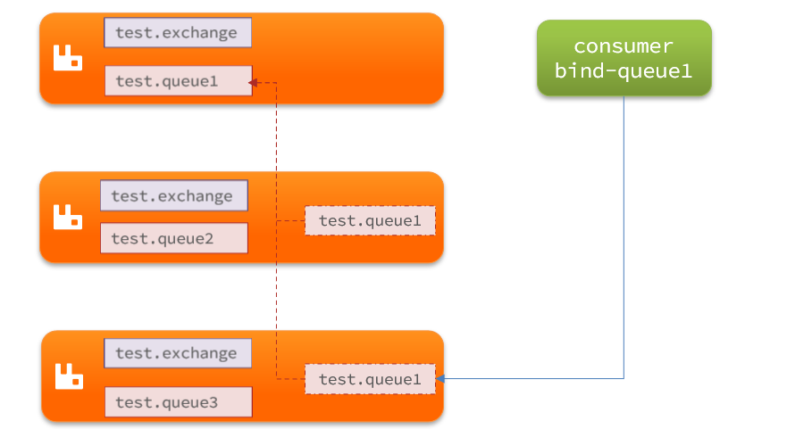

可靠消息服务
============

消息队列在使用过程中，面临着很多实际问题需要思考：


<br/>

**消息可靠性**

- 生产者发送消息时可能因为网络问题导致消息没有到达交换机：
  - RabbitMQ提供了publisher confirm机制
    - 生产者发送消息后，可以编写ConfirmCallback函数
    - 消息成功到达交换机后，RabbitMQ会调用ConfirmCallback通知消息的发送者，返回ACK
    - 消息如果未到达交换机，RabbitMQ也会调用ConfirmCallback通知消息的发送者，返回NACK
    - 消息超时未发送成功也会抛出异常
- 消息到达交换机后，如果未能到达队列，也会导致消息丢失：
  - RabbitMQ提供了publisher return机制
    - 生产者可以定义ReturnCallback函数
    - 消息到达交换机，未到达队列，RabbitMQ会调用ReturnCallback通知发送者，告知失败原因
- 消息到达队列后，MQ宕机也可能导致丢失消息：
  - RabbitMQ提供了持久化功能，集群的主从备份功能
    - 消息持久化，RabbitMQ会将交换机、队列、消息持久化到磁盘，宕机重启可以恢复消息
    - 镜像集群，仲裁队列，都可以提供主从备份功能，主节点宕机，从节点会自动切换为主，数据依然在
- 消息投递给消费者后，如果消费者处理不当，也可能导致消息丢失
  - SpringAMQP基于RabbitMQ提供了消费者确认机制、消费者重试机制，消费者失败处理策略：
    - 消费者的确认机制：
      - 消费者处理消息成功，未出现异常时，Spring返回ACK给RabbitMQ，消息才被移除
      - 消费者处理消息失败，抛出异常，宕机，Spring返回NACK或者不返回结果，消息不被异常
    - 消费者重试机制：
      - 默认情况下，消费者处理失败时，消息会再次回到MQ队列，然后投递给其它消费者。Spring提供的消费者重试机制，则是在处理失败后不返回NACK，而是直接在消费者本地重试。多次重试都失败后，则按照消费者失败处理策略来处理消息。避免了消息频繁入队带来的额外压力。
    - 消费者失败策略：
      - 当消费者多次本地重试失败时，消息默认会丢弃。
      - Spring提供了Republish策略，在多次重试都失败，耗尽重试次数后，将消息重新投递给指定的异常交换机，并且会携带上异常栈信息，帮助定位问题。

<br/>

**消息重复消费**

消息重复消费的原因多种多样，不可避免。所以只能从消费者端入手，只要能保证消息处理的幂等性就可以确保消息不被重复消费。

而幂等性的保证又有很多方案：

- 给每一条消息都添加一个唯一id，在本地记录消息表及消息状态，处理消息时基于数据库表的id唯一性做判断
- 同样是记录消息表，利用消息状态字段实现基于乐观锁的判断，保证幂等
- 基于业务本身的幂等性。比如根据id的删除、查询业务天生幂等；新增、修改等业务可以考虑基于数据库id唯一性、或者乐观锁机制确保幂等。本质与消息表方案类似。

<br/>

**消息有序性**

其实 RabbitMQ 是队列存储，天然具备先进先出的特点，只要消息的发送是有序的，那么理论上接收也是有序的。不过当一个队列绑定了多个消费者时，可能出现消息轮询投递给消费者的情况，而消费者的处理顺序就无法保证了。

因此，要保证消息的有序性，需要做的下面几点：

- 保证消息发送的有序性
- 保证一组有序的消息都发送到同一个队列
- 保证一个队列只包含一个消费者

<br/>

**消息堆积问题**

消息堆积问题产生的原因往往是因为消息发送的速度超过了消费者消息处理的速度。因此解决方案无外乎以下三点：

- 提高消费者处理速度

  - 消费者处理速度是由业务代码决定的，所以我们能做的事情包括

    - 尽可能优化业务代码，提高业务性能
    - 接收到消息后，开启线程池，并发处理多个消息

    优点：成本低，改改代码即可

    缺点：开启线程池会带来额外的性能开销，对于高频、低时延的任务不合适。推荐任务执行周期较长的业务。

- 增加更多消费者

  - 一个队列绑定多个消费者，共同争抢任务，自然可以提供消息处理的速度。

    优点：能用钱解决的问题都不是问题。实现简单粗暴

    缺点：问题是没有钱。成本太高

- 增加队列消息存储上限

  - 在RabbitMQ的1.8版本后，加入了新的队列模式：Lazy Queue

    这种队列不会将消息保存在内存中，而是在收到消息后直接写入磁盘中，理论上没有存储上限。可以解决消息堆积问题。

    优点：磁盘存储更安全；存储无上限；避免内存存储带来的Page Out问题，性能更稳定；

    缺点：磁盘存储受到IO性能的限制，消息时效性不如内存模式，但影响不大。

<br/>


**延迟消息问题**


<br/>

MQ高可用

要实现RabbitMQ的高可用无外乎下面两点：

- 做好交换机、队列、消息的持久化
- 搭建RabbitMQ的镜像集群，做好主从备份。当然也可以使用仲裁队列代替镜像集群。


## 消息可靠性

消息从发送，到消费者接收，会经理多个过程：


其中的每一步都可能导致消息丢失，常见的丢失原因包括：

- 发送时丢失：
  - 生产者发送的消息未送达 exchange
  - 消息到达 exchange 后未到达 queue
- MQ 宕机，queue 将消息丢失
- consumer 接收到消息后未消费就宕机

<br/>

针对这些问题，RabbitMQ 分别给出了解决方案：

- 生产者确认机制
- MQ 持久化
- 消费者确认机制
- 失败重试机制

<br/>

下面我们就通过案例来演示每一个步骤。

首先，导入课前资料提供的demo工程：[mq-advanced-demo](https://gitee.com/iMousse/cswiki-demo/tree/main/cloud/mq-advanced-demo)

<br/>

项目结构如下：

```sh
mq-advanced-demo
├── consumer
├── publisher
├── src
└── pom.xml
```

<br/>


### 生产者消息确认

RabbitMQ 提供了 publisher confirm 机制来避免消息发送到 MQ 过程中丢失。这种机制必须给每个消息指定一个唯一ID。消息发送到 MQ 以后，会返回一个结果给发送者，表示消息是否处理成功。

返回结果有两种方式：

- publisher-confirm，发送者确认
  - 消息成功投递到交换机，返回ack
  - 消息未投递到交换机，返回nack
- publisher-return，发送者回执
  - 消息投递到交换机了，但是没有路由到队列。返回ACK，及路由失败原因。


> 注意：确认机制发送消息时，需要给每个消息设置一个全局唯一ID，以区分不同消息，避免 ack 冲突
>

<br/>

#### 修改配置

首先，修改 publisher 服务中的 application.yml 文件，添加下面的内容：

```yaml
spring:
  rabbitmq:
    publisher-confirm-type: correlated
    publisher-returns: true
    template:
      mandatory: true
```

说明：

- `publish-confirm-type`：开启 publisher-confirm，这里支持两种类型：
  - `simple`：同步等待 confirm 结果，直到超时
  - `correlated`：异步回调，定义 ConfirmCallback，MQ 返回结果时会回调这个 ConfirmCallback
- `publish-returns`：开启 publish-return 功能，同样是基于 callback 机制，不过是定义 ReturnCallback
- `template.mandatory`：定义消息路由失败时的策略。true，则调用 ReturnCallback；false：则直接丢弃消息

<br/>

#### 定义Return回调

每个 RabbitTemplate 只能配置一个 ReturnCallback，因此需要在项目加载时配置：

修改 publisher 服务，添加一个：

```java
package cn.itcast.mq.config;

import lombok.extern.slf4j.Slf4j;
import org.springframework.amqp.rabbit.core.RabbitTemplate;
import org.springframework.beans.BeansException;
import org.springframework.context.ApplicationContext;
import org.springframework.context.ApplicationContextAware;
import org.springframework.context.annotation.Configuration;

@Slf4j
@Configuration
public class CommonConfig implements ApplicationContextAware {
    @Override
    public void setApplicationContext(ApplicationContext applicationContext) throws BeansException {
        // 获取RabbitTemplate
        RabbitTemplate rabbitTemplate = applicationContext.getBean(RabbitTemplate.class);
        // 设置ReturnCallback
        rabbitTemplate.setReturnCallback((message, replyCode, replyText, exchange, routingKey) -> {
            // 投递失败，记录日志
            log.info("消息发送失败，应答码{}，原因{}，交换机{}，路由键{},消息{}",
                     replyCode, replyText, exchange, routingKey, message.toString());
            // 如果有业务需要，可以重发消息
        });
    }
}
```

<br/>

#### 定义ConfirmCallback

ConfirmCallback 可以在发送消息时指定，因为每个业务处理 confirm 成功或失败的逻辑不一定相同。

在 publisher 服务的 `cn.itcast.mq.spring.SpringAmqpTest` 类中，定义一个单元测试方法：

```java
public void testSendMessage2SimpleQueue() throws InterruptedException {
    // 消息体
    String message = "hello, spring amqp!";
    // 全局唯一的消息ID，需要封装到CorrelationData中
    CorrelationData correlationData = new CorrelationData(UUID.randomUUID().toString());
    // 添加callback
    correlationData.getFuture().addCallback(
        result -> {
            if(result.isAck()){
                // ack，消息成功
                log.debug("消息发送成功, ID:{}", correlationData.getId());
            }else{
                // nack，消息失败
                log.error("消息发送失败, ID:{}, 原因{}",correlationData.getId(), result.getReason());
            }
        },
        ex -> log.error("消息发送异常, ID:{}, 原因{}",correlationData.getId(),ex.getMessage())
    );
    // 发送消息
    rabbitTemplate.convertAndSend("task.direct", "task", message, correlationData);

    // 休眠一会儿，等待ack回执
    Thread.sleep(2000);
}
```

<br/>

### 消息持久化

生产者确认可以确保消息投递到RabbitMQ的队列中，但是消息发送到RabbitMQ以后，如果突然宕机，也可能导致消息丢失。

要想确保消息在RabbitMQ中安全保存，必须开启消息持久化机制。

- 交换机持久化
- 队列持久化
- 消息持久化

<br/>

#### 交换机持久化

RabbitMQ 中交换机默认是非持久化的， MQ 重启后就丢失。

SpringAMQP 中可以通过代码指定交换机持久化：

```java
@Bean
public DirectExchange simpleExchange(){
    // 三个参数：交换机名称、是否持久化、当没有queue与其绑定时是否自动删除
    return new DirectExchange("simple.direct", true, false);
}
```

事实上，默认情况下，由 SpringAMQP 声明的交换机都是持久化的。

<br/>

可以在 RabbitMQ 控制台看到持久化的交换机都会带上 `D `的标示：


<br/>

#### 队列持久化

RabbitMQ 中队列默认是非持久化的，MQ 重启后就丢失。

SpringAMQP 中可以通过代码指定交换机持久化：

```java
@Bean
public Queue simpleQueue(){
    // 使用QueueBuilder构建队列，durable就是持久化的
    return QueueBuilder.durable("simple.queue").build();
}
```

事实上，默认情况下，由 SpringAMQP 声明的队列都是持久化的。

<br/>

可以在 RabbitMQ 控制台看到持久化的队列都会带上 `D` 的标示：


<br/>

#### 消息持久化

利用SpringAMQP发送消息时，可以设置消息的属性（MessageProperties），指定 delivery-mode：

- 非持久化
- 持久化

<br/>

用 Java 代码指定：

```java {3-6}
@Test
public void testDurableMessage(){
    // 创建消息
    Message message = MessageBuilder.withBody("hello,ttl queue".getBytes(StandardCharsets.UTF_8))
            .setDeliveryMode(MessageDeliveryMode.PERSISTENT)
            .build();

    // 消息ID，封装到 CorrelationData 中
    CorrelationData correlationData = new CorrelationData(UUID.randomUUID().toString());
    rabbitTemplate.convertAndSend("simple.queue", message, correlationData);
    
    // 记录
    log.debug("发送成功");
}
```

默认情况下，SpringAMQP 发出的任何消息都是持久化的，不用特意指定。

<br/>

### 消费者消息确认

RabbitMQ 是**阅后即焚**机制，RabbitMQ 确认消息被消费者消费后会立刻删除。

而 RabbitMQ 是通过消费者回执来确认消费者是否成功处理消息的：消费者获取消息后，应该向RabbitMQ 发送 ACK 回执，表明自己已经处理消息。

<br/>

设想这样的场景：

- RabbitMQ 投递消息给消费者
- 消费者获取消息后，返回 ACK 给 RabbitMQ
- RabbitMQ 删除消息
- 消费者宕机，消息尚未处理

这样，消息就丢失了。因此消费者返回 ACK 的时机非常重要。

<br/>

而SpringAMQP则允许配置三种确认模式：

- manual：手动 ack，需要在业务代码结束后，调用 api 发送 ack。

- auto：自动 ack，由 Spring 监测 Listener 代码是否出现异常，没有异常则返回 ack；抛出异常则返回 nack

- none：关闭ack，MQ 假定消费者获取消息后会成功处理，因此消息投递后立即被删除


<br/>

由此可知：

- none模 式下，消息投递是不可靠的，可能丢失
- auto 模式类似事务机制，出现异常时返回 nack，消息回滚到 mq；没有异常，返回ack
  - 一般我们都是使用默认的 auto 即可。

- manual：自己根据业务情况，判断什么时候该ack

<br/>

#### 演示none模式

修改 consumer 服务的 application.yml 文件，添加下面内容：

```yaml
spring:
  rabbitmq:
    listener:
      simple:
        acknowledge-mode: none # 关闭ack
```

修改 consumer 服务的 SpringRabbitListener 类中的方法，模拟一个消息处理异常：

```java
@RabbitListener(queues = "simple.queue")
public void listenSimpleQueue(String msg) {
    log.info("消费者接收到simple.queue的消息：【{}】", msg);
    // 模拟异常
    System.out.println(1 / 0) ;
    log.debug("消息处理完成！");
}
```

测试可以发现，当消息处理抛异常时，消息依然被RabbitMQ删除了。

<br/>

#### 演示auto模式

再次把确认机制修改为auto:

```yaml
spring:
  rabbitmq:
    listener:
      simple:
        acknowledge-mode: auto # 关闭ack
```

在异常位置打断点，再次发送消息，程序卡在断点时，可以发现此时消息状态为unack（未确定状态）：


抛出异常后，因为Spring会自动返回nack，所以消息恢复至Ready状态，并且没有被RabbitMQ删除：


<br/>

### 消费失败重试机制

当消费者出现异常后，消息会不断requeue（重入队）到队列，再重新发送给消费者，然后再次异常，再次requeue，无限循环，导致mq的消息处理飙升，带来不必要的压力：


怎么办呢？

<br/>

#### 本地重试

我们可以利用Spring的retry机制，在消费者出现异常时利用本地重试，而不是无限制的requeue到mq队列。

修改consumer服务的application.yml文件，添加内容：

```yaml
spring:
  rabbitmq:
    listener:
      simple:
        retry:
          enabled: true # 开启消费者失败重试
          initial-interval:  # 初识的失败等待时长为1秒
          multiplier: # 失败的等待时长倍数，下次等待时长 = multiplier * last-interval
          max-attempts: # 最大重试次数
          stateless: true # true无状态；false有状态。如果业务中包含事务，这里改为false
```

<br/>

重启 consumer 服务，重复之前的测试。可以发现：

- 在重试3次后，SpringAMQP 会抛出异常 AmqpRejectAndDontRequeueException，说明本地重试触发了
- 查看 RabbitMQ 控制台，发现消息被删除了，说明最后 SpringAMQP 返回的是ack，MQ 删除消息了

<br/>

结论：

- 开启本地重试时，消息处理过程中抛出异常，不会 requeue 到队列，而是在消费者本地重试
- 重试达到最大次数后，Spring 会返回 ack，消息会被丢弃

<br/>

#### 失败策略

在之前的测试中，达到最大重试次数后，消息会被丢弃，这是由 Spring 内部机制决定的。

在开启重试模式后，重试次数耗尽，如果消息依然失败，则需要有MessageRecovery接口来处理，它包含三种不同的实现：

- RejectAndDontRequeueRecoverer：重试耗尽后，直接reject，丢弃消息。默认就是这种方式

- ImmediateRequeueMessageRecoverer：重试耗尽后，返回nack，消息重新入队

- RepublishMessageRecoverer：重试耗尽后，将失败消息投递到指定的交换机

<br/>

比较优雅的一种处理方案是 RepublishMessageRecoverer，失败后将消息投递到一个指定的，专门存放异常消息的队列，后续由人工集中处理。

<br/>

1）在 consumer 服务中定义处理失败消息的交换机和队列

```java
@Bean
public DirectExchange errorMessageExchange(){
    return new DirectExchange("error.direct");
}

@Bean
public Queue errorQueue(){
    return new Queue("error.queue", true);
}

@Bean
public Binding errorBinding(Queue errorQueue, DirectExchange errorMessageExchange){
    return BindingBuilder.bind(errorQueue).to(errorMessageExchange).with("error");
}
```

<br/>

2）定义一个RepublishMessageRecoverer，关联队列和交换机

```java
@Bean
public MessageRecoverer republishMessageRecoverer(RabbitTemplate rabbitTemplate){
    return new RepublishMessageRecoverer(rabbitTemplate, "error.direct", "error");
}
```

<br/>

完整代码：

```java
package cn.itcast.mq.config;

import org.springframework.amqp.core.Binding;
import org.springframework.amqp.core.BindingBuilder;
import org.springframework.amqp.core.DirectExchange;
import org.springframework.amqp.core.Queue;
import org.springframework.amqp.rabbit.core.RabbitTemplate;
import org.springframework.amqp.rabbit.retry.MessageRecoverer;
import org.springframework.amqp.rabbit.retry.RepublishMessageRecoverer;
import org.springframework.context.annotation.Bean;

@Configuration
public class ErrorMessageConfig {
    @Bean
    public DirectExchange errorMessageExchange(){
        return new DirectExchange("error.direct");
    }
    @Bean
    public Queue errorQueue(){
        return new Queue("error.queue", true);
    }
    @Bean
    public Binding errorBinding(Queue errorQueue, DirectExchange errorMessageExchange){
        return BindingBuilder.bind(errorQueue).to(errorMessageExchange).with("error");
    }

    @Bean
    public MessageRecoverer republishMessageRecoverer(RabbitTemplate rabbitTemplate){
        return new RepublishMessageRecoverer(rabbitTemplate, "error.direct", "error");
    }
}
```

<br/>


:::warning  💡总结：如何确保RabbitMQ消息的可靠性？

- 开启生产者确认机制，确保生产者的消息能到达队列
- 开启持久化功能，确保消息未消费前在队列中不会丢失
- 开启消费者确认机制为auto，由spring确认消息处理成功后完成ack
- 开启消费者失败重试机制，并设置 MessageRecoverer，多次重试失败后将消息投递到异常交换机，交由人工处理

:::


## 死信交换机

> 什么是死信交换机?

当一个队列中的消息满足下列情况之一时，可以成为死信（dead letter）：

- 消费者使用 basic.reject 或 basic.nack声明消费失败，并且消息的requeue参数设置为false
- 消息是一个过期消息，超时无人消费
- 要投递的队列消息满了，无法投递

<br/>

如果这个包含死信的队列配置了`dead-letter-exchange`属性，指定了一个交换机，那么队列中的死信就会投递到这个交换机中，而这个交换机称为**死信交换机**（Dead Letter Exchange，检查DLX）。

<br/>

如图，一个消息被消费者拒绝了，变成了死信：


<br/>

因为simple.queue绑定了死信交换机 dl.direct，因此死信会投递给这个交换机：


<br/>

如果这个死信交换机也绑定了一个队列，则消息最终会进入这个存放死信的队列：


<br/>

另外，队列将死信投递给死信交换机时，必须知道两个信息：

- 死信交换机名称
- 死信交换机与死信队列绑定的 RoutingKey

<br/>

这样才能确保投递的消息能到达死信交换机，并且正确的路由到死信队列。


<br/>

**利用死信交换机接收死信（拓展）**

在失败重试策略中，默认的 RejectAndDontRequeueRecoverer 会在本地重试次数耗尽后，发送 reject 给 RabbitMQ，消息变成死信，被丢弃。

<br/>

我们可以给 simple.queue 添加一个死信交换机，给死信交换机绑定一个队列。这样消息变成死信后也不会丢弃，而是最终投递到死信交换机，路由到与死信交换机绑定的队列。


<br/>

我们在 consumer 服务中，定义一组死信交换机、死信队列：

```java
// 声明普通的 simple.queue 队列，并且为其指定死信交换机：dl.direct
@Bean
public Queue simpleQueue2(){
    return QueueBuilder.durable("simple.queue") // 指定队列名称，并持久化
        .deadLetterExchange("dl.direct") // 指定死信交换机
        .build();
}

// 声明死信交换机 dl.direct
@Bean
public DirectExchange dlExchange(){
    return new DirectExchange("dl.direct", true, false);
}

// 声明存储死信的队列 dl.queue
@Bean
public Queue dlQueue(){
    return new Queue("dl.queue", true);
}

// 将死信队列 与 死信交换机绑定
@Bean
public Binding dlBinding(){
    return BindingBuilder.bind(dlQueue()).to(dlExchange()).with("simple");
}
```

<br/>

什么样的消息会成为死信？

- 消息被消费者reject或者返回nack
- 消息超时未消费
- 队列满了

死信交换机的使用场景是什么？

- 如果队列绑定了死信交换机，死信会投递到死信交换机；
- 可以利用死信交换机收集所有消费者处理失败的消息（死信），交由人工处理，进一步提高消息队列的可靠性。

<br/>

### TTL

一个队列中的消息如果超时未消费，则会变为死信，超时分为两种情况：

- 消息所在的队列设置了超时时间
- 消息本身设置了超时时间


<br/>

**接收超时死信的死信交换机**

在consumer服务的SpringRabbitListener中，定义一个新的消费者，并且声明 死信交换机、死信队列：

```java
@RabbitListener(bindings = @QueueBinding(
    value = @Queue(name = "dl.ttl.queue", durable = "true"),
    exchange = @Exchange(name = "dl.ttl.direct"),
    key = "ttl"
))
public void listenDlQueue(String msg){
    log.info("接收到 dl.ttl.queue的延迟消息：{}", msg);
}
```

<br/>

**声明一个队列并指定TTL**

要给队列设置超时时间，需要在声明队列时配置 x-message-ttl 属性：

```java
package cn.itcast.mq.config;

import org.springframework.amqp.core.*;
import org.springframework.context.annotation.Bean;
import org.springframework.context.annotation.Configuration;

@Configuration
public class TTLMessageConfig {
    @Bean
    public Queue ttlQueue(){
        return QueueBuilder.durable("ttl.queue") // 指定队列名称，并持久化
                .ttl(10000) // 设置队列的超时时间，10秒
                .deadLetterExchange("dl.ttl.direct") // 指定死信交换机
                .build();
    }

    // 声明交换机
    @Bean
    public DirectExchange ttlExchange(){
        return new DirectExchange("ttl.direct");
    }

    // 将 TTL 与交换机绑定
    @Bean
    public Binding ttlBinding(){
        return BindingBuilder.bind(ttlQueue()).to(ttlExchange()).with("ttl");
    }
}
```

<br/>

发送消息，但是不要指定TTL：

```java
@Test
public void testTTLQueue() {
    // 创建消息
    String message = "hello, ttl queue";
    // 消息ID，需要封装到CorrelationData中
    CorrelationData correlationData = new CorrelationData(UUID.randomUUID().toString());
    // 发送消息
    rabbitTemplate.convertAndSend("ttl.direct", "ttl", message, correlationData);
    // 记录日志
    log.debug("发送消息成功");
}
```

<br/>

发送消息的日志：


<br/>

查看下接收消息的日志：


<br/>

因为队列的TTL值是10000ms，也就是10秒。可以看到消息发送与接收之间的时差刚好是10秒。

<br/>

**发送消息时设定TTL**

```java
@Test
public void testTTLMsg() {
    // 创建消息
    Message message = MessageBuilder
        .withBody("hello, ttl message".getBytes(StandardCharsets.UTF_8))
        .setExpiration("5000")
        .build();
    // 消息ID，需要封装到CorrelationData中
    CorrelationData correlationData = new CorrelationData(UUID.randomUUID().toString());
    // 发送消息
    rabbitTemplate.convertAndSend("ttl.direct", "ttl", message, correlationData);
    log.debug("发送消息成功");
}
```

<br/>

查看发送消息日志：


<br/>

接收消息日志：


<br/>

这次，发送与接收的延迟只有5秒。说明当队列、消息都设置了TTL时，任意一个到期就会成为死信。


**总结**

消息超时的两种方式是？

- 给队列设置ttl属性，进入队列后超过ttl时间的消息变为死信
- 给消息设置ttl属性，队列接收到消息超过ttl时间后变为死信

如何实现发送一个消息20秒后消费者才收到消息？

- 给消息的目标队列指定死信交换机
- 将消费者监听的队列绑定到死信交换机
- 发送消息时给消息设置超时时间为20秒


### 延迟队列

利用TTL结合死信交换机，我们实现了消息发出后，消费者延迟收到消息的效果。这种消息模式就称为延迟队列（Delay Queue）模式。

延迟队列的使用场景包括：

- 延迟发送短信
- 用户下单，如果用户在15 分钟内未支付，则自动取消
- 预约工作会议，20分钟后自动通知所有参会人员

<br/>

因为延迟队列的需求非常多，所以RabbitMQ的官方也推出了一个插件，原生支持延迟队列效果。这个插件就是DelayExchange插件。

参考RabbitMQ的插件列表页面：https://www.rabbitmq.com/community-plugins.html


使用方式可以参考官网地址：https://blog.rabbitmq.com/posts/2015/04/scheduling-messages-with-rabbitmq

<br/>

#### 安装DelayExchange插件

[安装插件](00操作篇-安装MQ.md#安装插件)

<br/>

#### DelayExchange原理

DelayExchange需要将一个交换机声明为delayed类型。当我们发送消息到delayExchange时，流程如下：

- 接收消息
- 判断消息是否具备x-delay属性
- 如果有x-delay属性，说明是延迟消息，持久化到硬盘，读取x-delay值，作为延迟时间
- 返回routing not found结果给消息发送者
- x-delay时间到期后，重新投递消息到指定队列

<br/>

#### 使用DelayExchange

插件的使用也非常简单：声明一个交换机，交换机的类型可以是任意类型，只需要设定delayed属性为true即可，然后声明队列与其绑定即可。

<br/>

**声明DelayExchange交换机**

基于注解方式（推荐）：


<br/>

也可以基于@Bean的方式：


<br/>

发送消息时，一定要携带 x-delay 属性，指定延迟的时间：


<br/>

延迟队列插件的使用步骤包括哪些？

- 声明一个交换机，添加delayed属性为true

- 发送消息时，添加x-delay头，值为超时时间


<br/>

## 惰性队列

### 消息堆积

当生产者发送消息的速度超过了消费者处理消息的速度，就会导致队列中的消息堆积，直到队列存储消息达到上限。之后发送的消息就会成为死信，可能会被丢弃，这就是消息堆积问题。


解决消息堆积有两种思路：

- 增加更多消费者，提高消费速度。也就是我们之前说的work queue模式
- 扩大队列容积，提高堆积上限

<br/>

要提升队列容积，把消息保存在内存中显然是不行的。

<br/>

### 惰性队列

从RabbitMQ的3.6.0版本开始，就增加了Lazy Queues的概念，也就是惰性队列。惰性队列的特征如下：

- 接收到消息后直接存入磁盘而非内存
- 消费者要消费消息时才会从磁盘中读取并加载到内存
- 支持数百万条的消息存储

<br/>

#### 基于命令行设置lazy-queue

而要设置一个队列为惰性队列，只需要在声明队列时，指定x-queue-mode属性为lazy即可。可以通过命令行将一个运行中的队列修改为惰性队列：

```sh
rabbitmqctl set_policy Lazy "^lazy-queue$" '{"queue-mode":"lazy"}' --apply-to queues  
```

命令解读：

- `rabbitmqctl` ：RabbitMQ的命令行工具
- `set_policy` ：添加一个策略
- `Lazy` ：策略名称，可以自定义
- `"^lazy-queue$"` ：用正则表达式匹配队列的名字
- `'{"queue-mode":"lazy"}'` ：设置队列模式为lazy模式
- `--apply-to queues  `：策略的作用对象，是所有的队列

<br/>

**基于@Bean声明lazy-queue**


**基于@RabbitListener声明LazyQueue**


#### 总结

消息堆积问题的解决方案？

- 队列上绑定多个消费者，提高消费速度
- 使用惰性队列，可以再mq中保存更多消息

惰性队列的优点有哪些？

- 基于磁盘存储，消息上限高
- 没有间歇性的page-out，性能比较稳定

惰性队列的缺点有哪些？

- 基于磁盘存储，消息时效性会降低
- 性能受限于磁盘的IO


## MQ集群

### 集群分类

RabbitMQ的是基于Erlang语言编写，而Erlang又是一个面向并发的语言，天然支持集群模式。RabbitMQ的集群有两种模式：

- **普通集群**：是一种分布式集群，将队列分散到集群的各个节点，从而提高整个集群的并发能力。
- **镜像集群**：是一种主从集群，普通集群的基础上，添加了主从备份功能，提高集群的数据可用性。

<br/>

镜像集群虽然支持主从，但主从同步并不是强一致的，某些情况下可能有数据丢失的风险。因此在RabbitMQ的3.8版本以后，推出了新的功能：**仲裁队列**来代替镜像集群，底层采用Raft协议确保主从的数据一致性。

<br/>

### 普通集群

普通集群，或者叫标准集群（classic cluster），具备下列特征：

- 会在集群的各个节点间共享部分数据，包括：交换机、队列元信息。不包含队列中的消息。
- 当访问集群某节点时，如果队列不在该节点，会从数据所在节点传递到当前节点并返回
- 队列所在节点宕机，队列中的消息就会丢失

<br/>

**结构如图**



<br/>

**部署**

参考课前资料：[集群部署](00操作篇-安装MQ.md#集群部署)

<br/>

### 镜像集群

镜像集群：本质是主从模式，具备下面的特征：

- 交换机、队列、队列中的消息会在各个mq的镜像节点之间同步备份。
- 创建队列的节点被称为该队列的**主节点，**备份到的其它节点叫做该队列的**镜像**节点。
- 一个队列的主节点可能是另一个队列的镜像节点
- 所有操作都是主节点完成，然后同步给镜像节点
- 主宕机后，镜像节点会替代成新的主

<br/>

**结构如图**


**部署**

参考课前资料：[镜像模式](00操作篇-安装MQ.md#镜像模式)


### 仲裁队列

仲裁队列：仲裁队列是3.8版本以后才有的新功能，用来替代镜像队列，具备下列特征：

- 与镜像队列一样，都是主从模式，支持主从数据同步
- 使用非常简单，没有复杂的配置
- 主从同步基于Raft协议，强一致

<br/>

**部署**

参考课前资料：[仲裁队列](00操作篇-安装MQ.md#仲裁队列)

<br/>

**Java代码创建仲裁队列**

```java
@Bean
public Queue quorumQueue() {
    return QueueBuilder
        .durable("quorum.queue") // 持久化
        .quorum() // 仲裁队列
        .build();
}
```

<br/>

**SpringAMQP连接MQ集群**

```java
spring:
  rabbitmq:
    addresses: 192.168.150.105:8071, 192.168.150.105:8072, 192.168.150.105:8073
    username: itcast
    password: 123321
    virtual-host: /
```

> 注意：这里用address来代替host、port方式
>


