# Nacos源码分析


1、Nacos服务注册与发现源码深度剖析
2、Nacos心跳机制与服务健康检查源码剖析
3、Nacos注册表如何防止多节点读写并发冲突
4、Nacos高并发支撑异步任务与内存队列剖析
5、Nacos 2.X底层gRPC通信性能爆裂提升原理剖析
6、Nacos 2.X内存注册表架构设计原理剖析
7、Nacos2.X高性能事件驱动架构原理剖析
8、Nacos集群CP架构底层Raft协议实现源码剖析
9、从脑裂问题剖析Nacos&Eureka&Zookeeper架构异同
10、阿里云超大规模注册中心Saas架构剖析
11、Sentinel底层滑动时间窗限流算法源码剖析
12、利用Sentinel的Metric机制计算线上系统实时QPS


## 下载源码并运行

要研究Nacos源码自然不能用打包好的Nacos服务端jar包来运行，需要下载源码自己编译来运行。

### 下载Nacos源码

Nacos的GitHub地址：https://github.com/alibaba/nacos

课前资料中已经提供了下载好的1.4.2版本的Nacos源码：

 


如果需要研究其他版本的同学，也可以自行下载：

大家找到其release页面：https://github.com/alibaba/nacos/tags，找到其中的1.4.2.版本：

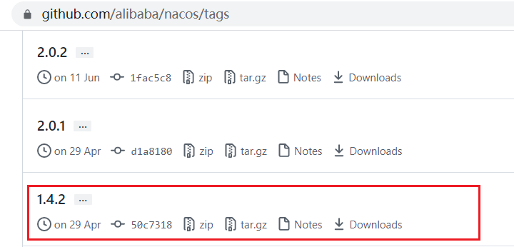

点击进入后，下载Source code(zip)：

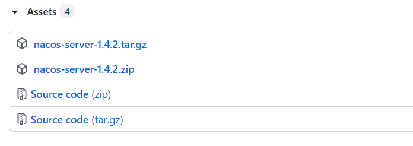


### 导入Demo工程

我们的课前资料提供了一个微服务Demo，包含了服务注册、发现等业务。

 

导入该项目后，查看其项目结构：

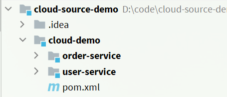 

结构说明：

- cloud-source-demo：项目父目录
  - cloud-demo：微服务的父工程，管理微服务依赖
    - order-service：订单微服务，业务中需要访问user-service，是一个服务消费者
    - user-service：用户微服务，对外暴露根据id查询用户的接口，是一个服务提供者


### 导入Nacos源码

将之前下载好的Nacos源码解压到cloud-source-demo项目目录中：

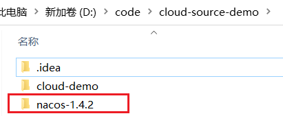 

然后，使用IDEA将其作为一个module来导入：

1）选择项目结构选项：

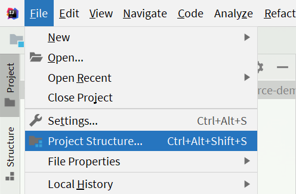 

然后点击导入module：

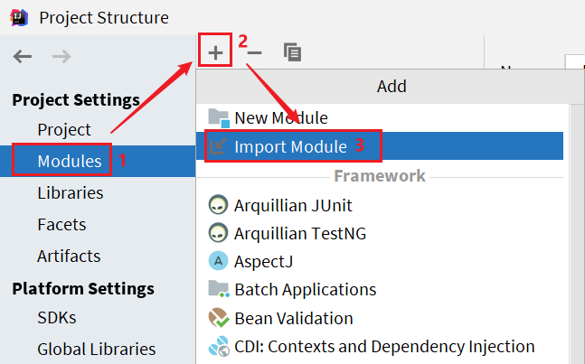 

在弹出窗口中，选择nacos源码目录：

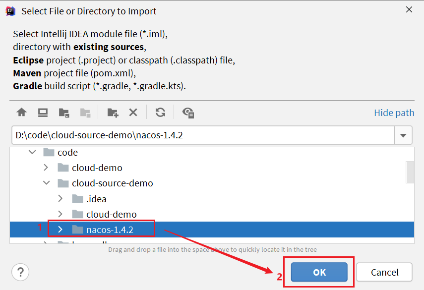

然后选择maven模块，finish：

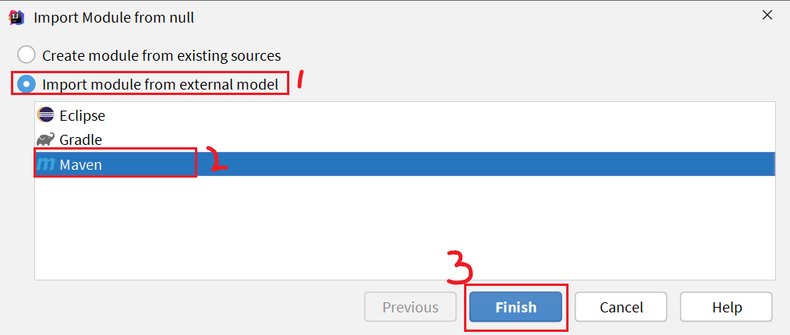

最后，点击OK即可：

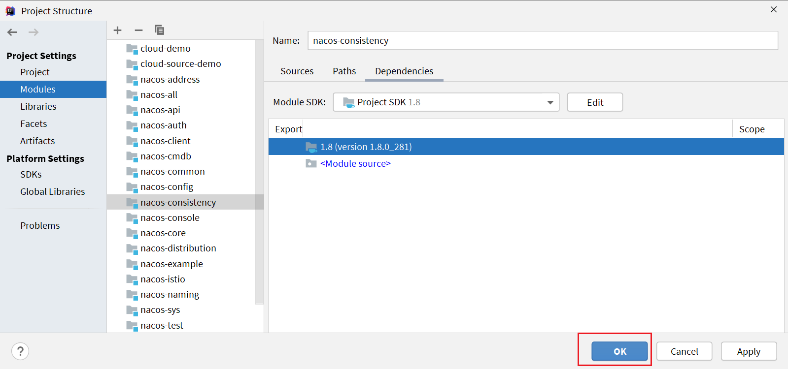

导入后的项目结构：

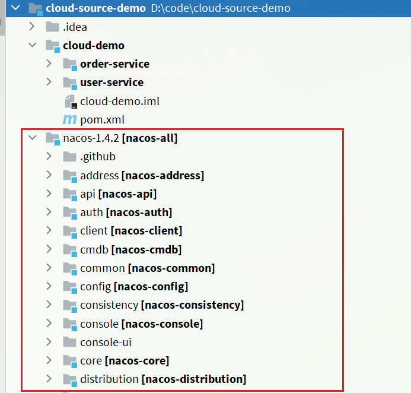


### proto编译

Nacos 底层的数据通信会基于protobuf对数据做序列化和反序列化。并将对应的proto文件定义在了consistency这个子模块中：

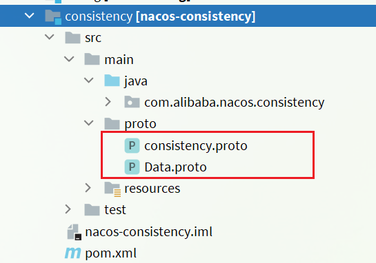

我们需要先将proto文件编译为对应的Java代码。

#### 什么是 protobuf

protobuf 的全称是 Protocol Buffer，是 Google 提供的一种数据序列化协议，这是Google官方的定义：

> Protocol Buffers 是一种轻便高效的结构化数据存储格式，可以用于结构化数据序列化，很适合做数据存储或 RPC 数据交换格式。它可用于通讯协议、数据存储等领域的语言无关、平台无关、可扩展的序列化结构数据格式。

可以简单理解为，是一种跨语言、跨平台的数据传输格式。与 Json 的功能类似，但是无论是性能，还是数据大小都比 Json 要好很多。

Protobuf 的之所以可以跨语言，就是因为数据定义的格式为`.proto`格式，需要基于 protoc 编译为对应的语言。


#### 安装protoc

Protobuf的GitHub地址：https://github.com/protocolbuffers/protobuf/releases


我们可以下载windows版本的来使用：


另外，课前资料也提供了下载好的安装包：

 


解压到任意非中文目录下，其中的bin目录中的protoc.exe可以帮助我们编译：

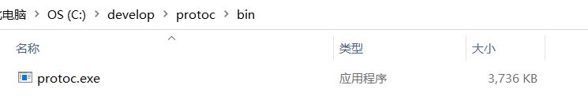

然后将这个bin目录配置到你的环境变量path中，可以参考JDK的配置方式：


#### 编译proto

进入 nacos-1.4.2 的 consistency 模块下的 src/main 目录下：


然后打开cmd窗口，运行下面的两个命令：

```powershell
protoc --java_out=./java ./proto/consistency.proto
protoc --java_out=./java ./proto/Data.proto
```

如图：

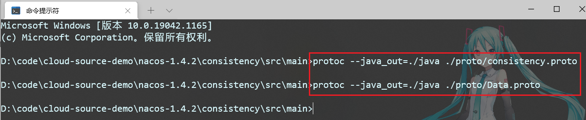

会在 nacos 的 consistency 模块中编译出这些 Java 代码：

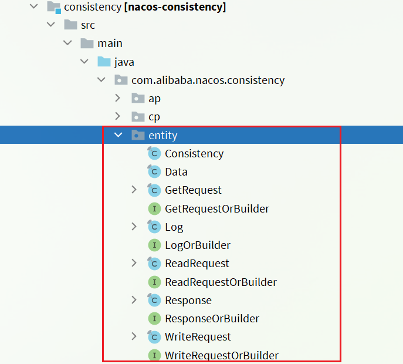


### 运行

nacos服务端的入口是在console模块中的Nacos类：

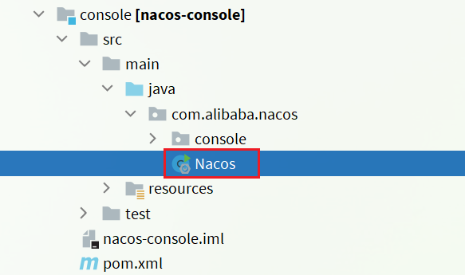 

我们需要让它单机启动：

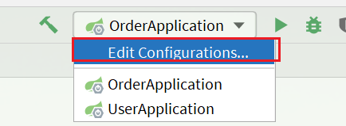 

然后新建一个 SpringBootApplication：

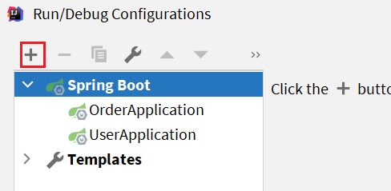 

然后填写应用信息：

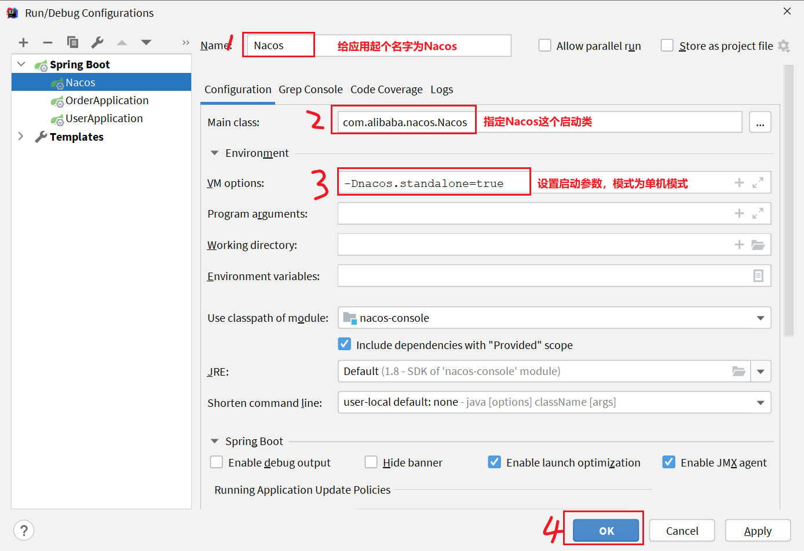


然后运行 Nacos 这个 main 函数：


将 order-service 和 user-service 服务启动后，可以查看 nacos 控制台：

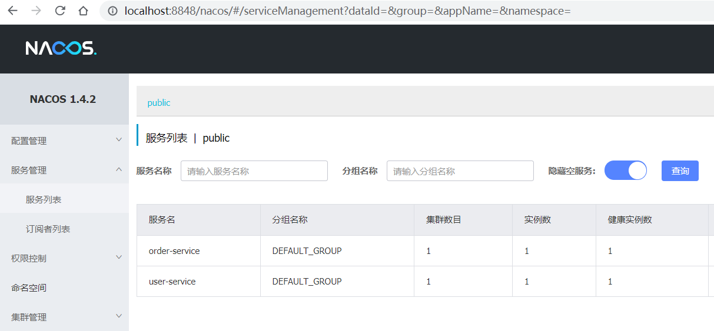


## 服务注册

服务注册到 Nacos 以后，会保存在一个本地注册表中，其结构如下：

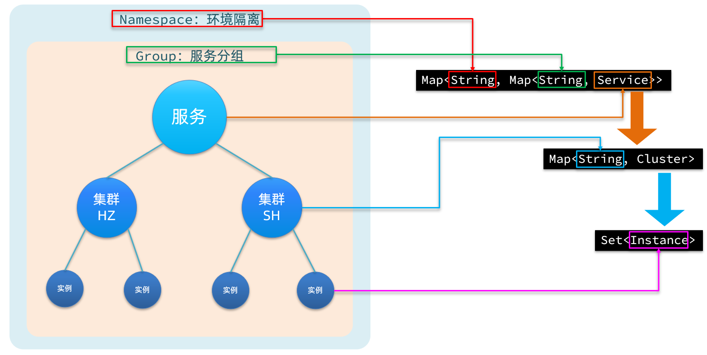

首先最外层是一个 Map，结构为：`Map<String, Map<String, Service>>`：

- key：是 namespace_id，起到环境隔离的作用。namespace下可以有多个group
- value：又是一个`Map<String, Service>`，代表分组及组内的服务。一个组内可以有多个服务
  - key：代表group分组，不过作为key时格式是group_name:service_name
  - value：分组下的某一个服务，例如userservice，用户服务。类型为`Service`，内部也包含一个`Map<String,Cluster>`，一个服务下可以有多个集群
    - key：集群名称
    - value：`Cluster`类型，包含集群的具体信息。一个集群中可能包含多个实例，也就是具体的节点信息，其中包含一个`Set<Instance>`，就是该集群下的实例的集合
      - Instance：实例信息，包含实例的IP、Port、健康状态、权重等等信息


每一个服务去注册到 Nacos 时，就会把信息组织并存入这个 Map 中。


### 服务注册接口

Nacos 提供了服务注册的 API 接口，客户端只需要向该接口发送请求，即可实现服务注册。

**接口说明：**注册一个实例到Nacos服务。

**请求类型**：`POST`

**请求路径**：`/nacos/v1/ns/instance`

**请求参数**：

| 名称        | 类型    | 是否必选 | 描述         |
| :---------- | :------ | :------- | ------------ |
| ip          | 字符串  | 是       | 服务实例IP   |
| port        | int     | 是       | 服务实例port |
| namespaceId | 字符串  | 否       | 命名空间ID   |
| weight      | double  | 否       | 权重         |
| enabled     | boolean | 否       | 是否上线     |
| healthy     | boolean | 否       | 是否健康     |
| metadata    | 字符串  | 否       | 扩展信息     |
| clusterName | 字符串  | 否       | 集群名       |
| serviceName | 字符串  | 是       | 服务名       |
| groupName   | 字符串  | 否       | 分组名       |
| ephemeral   | boolean | 否       | 是否临时实例 |

**错误编码**：

| 错误代码 | 描述                  | 语义                   |
| :------- | :-------------------- | :--------------------- |
| 400      | Bad Request           | 客户端请求中的语法错误 |
| 403      | Forbidden             | 没有权限               |
| 404      | Not Found             | 无法找到资源           |
| 500      | Internal Server Error | 服务器内部错误         |
| 200      | OK                    | 正常                   |


### 客户端

首先，我们需要找到服务注册的入口。

#### NacosServiceRegistryAutoConfiguration

因为 Nacos 的客户端是基于 SpringBoot 的自动装配实现的，我们可以在 nacos-discovery 依赖：

`spring-cloud-starter-alibaba-nacos-discovery-2.2.6.RELEASE.jar`

这个包中找到Nacos自动装配信息：

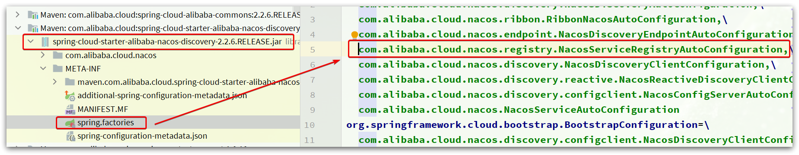

可以看到，有很多个自动配置类被加载了，其中跟服务注册有关的就是 NacosServiceRegistryAutoConfiguration 这个类，我们跟入其中。


可以看到，在 NacosServiceRegistryAutoConfiguration 这个类中，包含一个跟自动注册有关的 Bean：

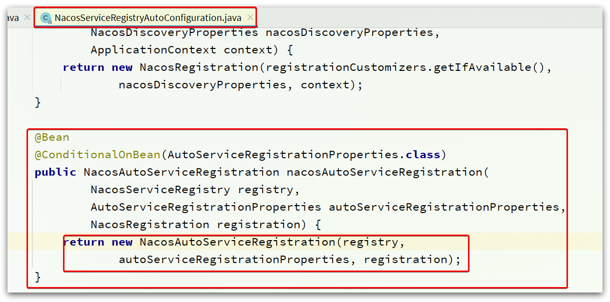


#### NacosAutoServiceRegistration

`NacosAutoServiceRegistration`源码如图：

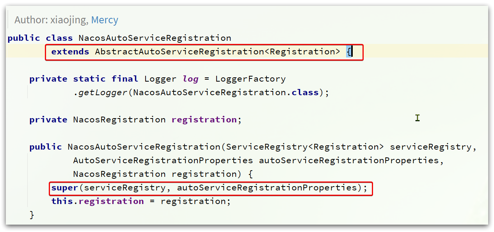

可以看到在初始化时，其父类 `AbstractAutoServiceRegistration` 也被初始化了。


`AbstractAutoServiceRegistration`如图：

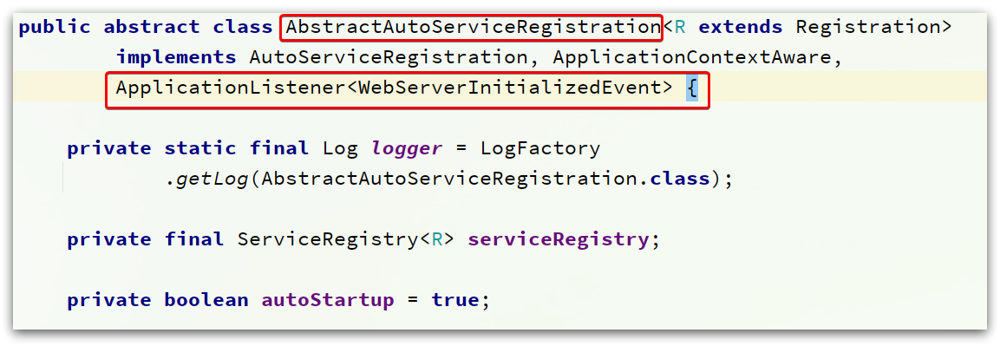

可以看到它实现了`ApplicationListener`接口，监听Spring容器启动过程中的事件。

在监听到`WebServerInitializedEvent`（web服务初始化完成）的事件后，执行了`bind` 方法。

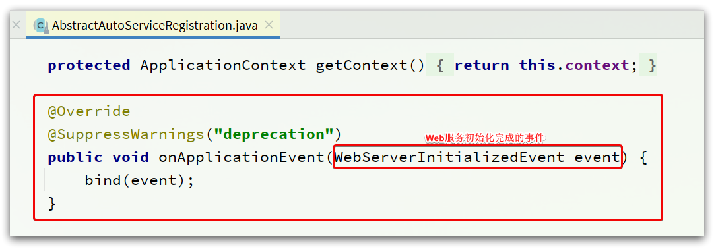


其中的bind方法如下：

```java
public void bind(WebServerInitializedEvent event) {
    // 获取 ApplicationContext
    ApplicationContext context = event.getApplicationContext();
    // 判断服务的 namespace,一般都是null
    if (context instanceof ConfigurableWebServerApplicationContext) {
        if ("management".equals(((ConfigurableWebServerApplicationContext) context)
                                .getServerNamespace())) {
            return;
        }
    }
    // 记录当前 web 服务的端口
    this.port.compareAndSet(0, event.getWebServer().getPort());
    // 启动当前服务注册流程
    this.start();
}
```

其中的start方法流程：

```java
public void start() {
		if (!isEnabled()) {
			if (logger.isDebugEnabled()) {
				logger.debug("Discovery Lifecycle disabled. Not starting");
			}
			return;
		}

		// 当前服务处于未运行状态时，才进行初始化
		if (!this.running.get()) {
      // 发布服务开始注册的事件
			this.context.publishEvent(new InstancePreRegisteredEvent(this, getRegistration()));
      // ☆☆☆☆开始注册☆☆☆☆
			register();
			if (shouldRegisterManagement()) {
				registerManagement();
			}
      // 发布注册完成事件
			this.context.publishEvent(new InstanceRegisteredEvent<>(this, getConfiguration()));
      // 服务状态设置为运行状态，基于AtomicBoolean
			this.running.compareAndSet(false, true);
		}

	}
```


其中最关键的register()方法就是完成服务注册的关键，代码如下：

```java
protected void register() {
    this.serviceRegistry.register(getRegistration());
}
```

此处的this.serviceRegistry就是NacosServiceRegistry：

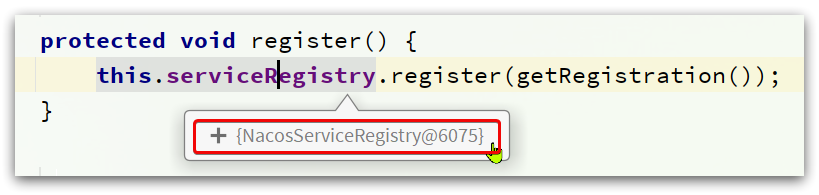


#### NacosServiceRegistry

`NacosServiceRegistry` 是 Spring 的`ServiceRegistry`接口的实现类，而 ServiceRegistry 接口是服务注册、发现的规约接口，定义了register、deregister 等方法的声明。


而`NacosServiceRegistry`对`register`的实现如下：

```java
@Override
public void register(Registration registration) {
   	// 判断serviceId是否为空，也就是spring.application.name不能为空
    if (StringUtils.isEmpty(registration.getServiceId())) {
        log.warn("No service to register for nacos client...");
        return;
    }
    // 获取Nacos的命名服务，其实就是注册中心服务
    NamingService namingService = namingService();
    // 获取 serviceId 和 Group
    String serviceId = registration.getServiceId();
    String group = nacosDiscoveryProperties.getGroup();
	  // 封装服务实例的基本信息，如 cluster-name、是否为临时实例、权重、IP、端口等
    Instance instance = getNacosInstanceFromRegistration(registration);

    try {
        // 开始注册服务
        namingService.registerInstance(serviceId, group, instance);
        log.info("nacos registry, {} {} {}:{} register finished", group, serviceId,
                 instance.getIp(), instance.getPort());
    }
    catch (Exception e) {
        if (nacosDiscoveryProperties.isFailFast()) {
            log.error("nacos registry, {} register failed...{},", serviceId,
                      registration.toString(), e);
            rethrowRuntimeException(e);
        }
        else {
            log.warn("Failfast is false. {} register failed...{},", serviceId,
                     registration.toString(), e);
        }
    }
}
```

可以看到方法中最终是调用 NamingService 的 registerInstance 方法实现注册的。

而 NamingService 接口的默认实现就是NacosNamingService。


#### NacosNamingService

NacosNamingService提供了服务注册、订阅等功能。

其中registerInstance就是注册服务实例，源码如下：

```java
@Override
public void registerInstance(String serviceName, String groupName, Instance instance) throws NacosException {
    // 检查超时参数是否异常。心跳超时时间(默认15秒)必须大于心跳周期(默认5秒)
    NamingUtils.checkInstanceIsLegal(instance);
    // 拼接得到新的服务名，格式为：groupName@@serviceId
    String groupedServiceName = NamingUtils.getGroupedName(serviceName, groupName);
    // 判断是否为临时实例，默认为 true。
    if (instance.isEphemeral()) {
        // 如果是临时实例，需要定时向 Nacos 服务发送心跳
        BeatInfo beatInfo = beatReactor.buildBeatInfo(groupedServiceName, instance);
        beatReactor.addBeatInfo(groupedServiceName, beatInfo);
    }
    // 发送注册服务实例的请求
    serverProxy.registerService(groupedServiceName, groupName, instance);
}
```

最终，由 NacosProxy 的 registerService 方法，完成服务注册。


代码如下：

```java
public void registerService(String serviceName, String groupName, Instance instance) throws NacosException {

    NAMING_LOGGER.info("[REGISTER-SERVICE] {} registering service {} with instance: {}", namespaceId, serviceName,
                       instance);
	// 组织请求参数
    final Map<String, String> params = new HashMap<String, String>(16);
    params.put(CommonParams.NAMESPACE_ID, namespaceId);
    params.put(CommonParams.SERVICE_NAME, serviceName);
    params.put(CommonParams.GROUP_NAME, groupName);
    params.put(CommonParams.CLUSTER_NAME, instance.getClusterName());
    params.put("ip", instance.getIp());
    params.put("port", String.valueOf(instance.getPort()));
    params.put("weight", String.valueOf(instance.getWeight()));
    params.put("enable", String.valueOf(instance.isEnabled()));
    params.put("healthy", String.valueOf(instance.isHealthy()));
    params.put("ephemeral", String.valueOf(instance.isEphemeral()));
    params.put("metadata", JacksonUtils.toJson(instance.getMetadata()));
	// 通过POST请求将上述参数，发送到 /nacos/v1/ns/instance
    reqApi(UtilAndComs.nacosUrlInstance, params, HttpMethod.POST);

}
```


这里提交的信息就是Nacos服务注册接口需要的完整参数，核心参数有：

- namespace_id：环境
- service_name：服务名称
- group_name：组名称
- cluster_name：集群名称
- ip: 当前实例的ip地址
- port: 当前实例的端口


而在NacosNamingService的registerInstance方法中，有一段是与服务心跳有关的代码，我们在后续会继续学习。

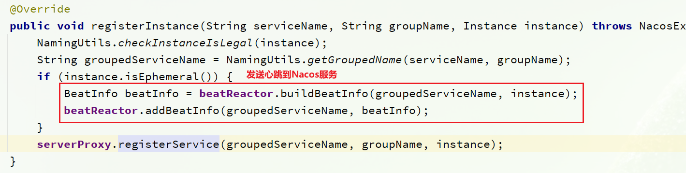


#### 客户端注册的流程图

如图：

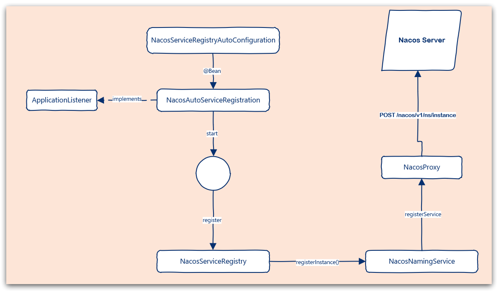

流程总结


### 服务端

在nacos-console的模块中，会引入nacos-naming这个模块：


模块结构如下：


其中的com.alibaba.nacos.naming.controllers包下就有服务注册、发现等相关的各种接口，其中的服务注册是在`InstanceController`类中：

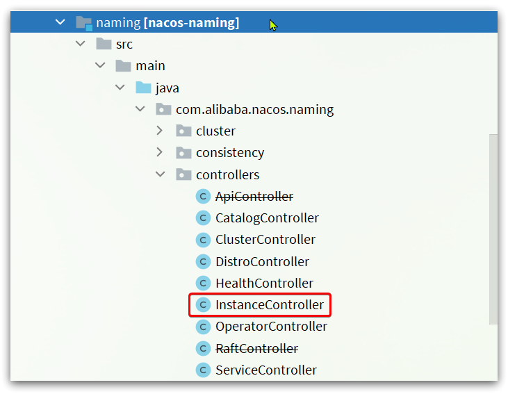


#### InstanceController

进入InstanceController类，可以看到一个register方法，就是服务注册的方法了：

```java
@CanDistro
@PostMapping
@Secured(parser = NamingResourceParser.class, action = ActionTypes.WRITE)
public String register(HttpServletRequest request) throws Exception {
	  // 尝试获取 namespaceId 
    final String namespaceId = WebUtils
        .optional(request, CommonParams.NAMESPACE_ID, Constants.DEFAULT_NAMESPACE_ID);
    // 尝试获取serviceName，其格式为 group_name@@service_name
    final String serviceName = WebUtils.required(request, CommonParams.SERVICE_NAME);
    NamingUtils.checkServiceNameFormat(serviceName);
	  // 解析出实例信息，封装为Instance对象
    final Instance instance = parseInstance(request);
	  // 注册实例
    serviceManager.registerInstance(namespaceId, serviceName, instance);
    return "ok";
}
```


这里，进入到了serviceManager.registerInstance()方法中。


#### ServiceManager

ServiceManager就是Nacos中管理服务、实例信息的核心API，其中就包含Nacos的服务注册表：

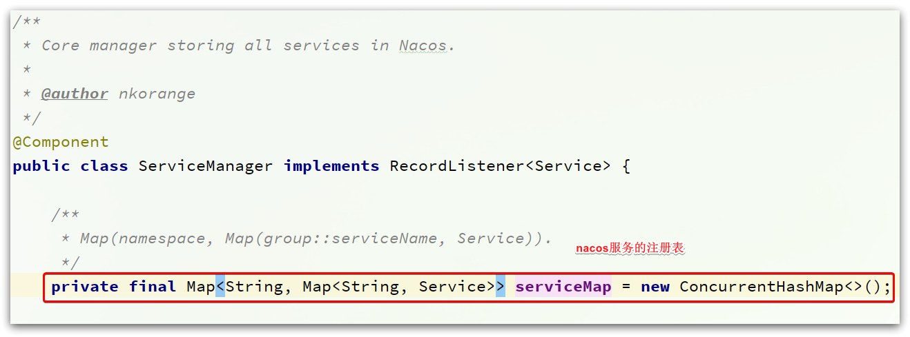

而其中的registerInstance方法就是注册服务实例的方法：

```java
/**
     * Register an instance to a service in AP mode.
     *
     * <p>This method creates service or cluster silently if they don't exist.
     *
     * @param namespaceId id of namespace
     * @param serviceName service name
     * @param instance    instance to register
     * @throws Exception any error occurred in the process
     */
public void registerInstance(String namespaceId, String serviceName, Instance instance) throws NacosException {
	  // 创建一个空的service（如果是第一次来注册实例，要先创建一个空service出来，放入注册表）
    // 此时不包含实例信息
    createEmptyService(namespaceId, serviceName, instance.isEphemeral());
    // 拿到创建好的 service
    Service service = getService(namespaceId, serviceName);
    // 拿不到则抛异常
    if (service == null) {
        throw new NacosException(NacosException.INVALID_PARAM,
                                 "service not found, namespace: " + namespaceId + ", service: " + serviceName);
    }
    // 添加要注册的实例到 service 中
    addInstance(namespaceId, serviceName, instance.isEphemeral(), instance);
}
```


创建好了服务，接下来就要添加实例到服务中：

```java
/**
     * Add instance to service.
     *
     * @param namespaceId namespace
     * @param serviceName service name
     * @param ephemeral   whether instance is ephemeral
     * @param ips         instances
     * @throws NacosException nacos exception
     */
public void addInstance(String namespaceId, String serviceName, boolean ephemeral, Instance... ips)
    throws NacosException {
	  // 监听服务列表用到的key，服务唯一标识，例如：com.alibaba.nacos.naming.iplist.ephemeral.public##DEFAULT_GROUP@@order-service
    String key = KeyBuilder.buildInstanceListKey(namespaceId, serviceName, ephemeral);
    // 获取服务
    Service service = getService(namespaceId, serviceName);
    // 同步锁，避免并发修改的安全问题
    synchronized (service) {
        // 1）获取要更新的实例列表
        List<Instance> instanceList = addIpAddresses(service, ephemeral, ips);
		    // 2）封装实例列表到Instances对象
        Instances instances = new Instances();
        instances.setInstanceList(instanceList);
		    // 3）完成 注册表更新 以及 Nacos 集群的数据同步
        consistencyService.put(key, instances);
    }
}
```


该方法中对修改服务列表的动作加锁处理，确保线程安全。而在同步代码块中，包含下面几步：

- 先获取要更新的实例列表，`addIpAddresses(service, ephemeral, ips);`
- 然后将更新后的数据封装到`Instances`对象中，后面更新注册表时使用
- 最后，调用`consistencyService.put()`方法完成Nacos集群的数据同步，保证集群一致性。


> 注意：在第1步的addIPAddress中，会拷贝旧的实例列表，添加新实例到列表中。在第3步中，完成对实例状态更新后，则会用新列表直接覆盖旧实例列表。而在更新过程中，旧实例列表不受影响，用户依然可以读取。
>
> 这样在更新列表状态过程中，无需阻塞用户的读操作，性能比较好。这种方案称为CopyOnWrite方案。


##### 更服务列表

我们来看看实例列表的更新，对应的方法是`addIpAddresses(service, ephemeral, ips);`：

```java
private List<Instance> addIpAddresses(Service service, boolean ephemeral, Instance... ips) throws NacosException {
    return updateIpAddresses(service, UtilsAndCommons.UPDATE_INSTANCE_ACTION_ADD, ephemeral, ips);
}
```

继续进入`updateIpAddresses`方法：

```java
public List<Instance> updateIpAddresses(Service service, String action, boolean ephemeral, Instance... ips)
    throws NacosException {
	  // 根据namespaceId、serviceName获取当前服务的实例列表，返回值是Datum
    // 第一次来，肯定是null
    Datum datum = consistencyService
        .get(KeyBuilder.buildInstanceListKey(service.getNamespaceId(), service.getName(), ephemeral));
		// 得到服务中现有的实例列表
    List<Instance> currentIPs = service.allIPs(ephemeral);
    // 创建map，保存实例列表，key为ip地址，value是Instance对象
    Map<String, Instance> currentInstances = new HashMap<>(currentIPs.size());
    // 创建Set集合，保存实例的instanceId
    Set<String> currentInstanceIds = Sets.newHashSet();
		// 遍历要现有的实例列表
    for (Instance instance : currentIPs) {
        // 添加到map中
        currentInstances.put(instance.toIpAddr(), instance);
        // 添加instanceId到set中
        currentInstanceIds.add(instance.getInstanceId());
    }
	
    // 创建map，用来保存更新后的实例列表
    Map<String, Instance> instanceMap;
    if (datum != null && null != datum.value) {
        // 如果服务中已经有旧的数据，则先保存旧的实例列表
        instanceMap = setValid(((Instances) datum.value).getInstanceList(), currentInstances);
    } else {
        // 如果没有旧数据，则直接创建新的map
        instanceMap = new HashMap<>(ips.length);
    }
		// 遍历实例列表
    for (Instance instance : ips) {
        // 判断服务中是否包含要注册的实例的cluster信息
        if (!service.getClusterMap().containsKey(instance.getClusterName())) {
            // 如果不包含，创建新的cluster
            Cluster cluster = new Cluster(instance.getClusterName(), service);
            cluster.init();
            // 将集群放入service的注册表
            service.getClusterMap().put(instance.getClusterName(), cluster);
            Loggers.SRV_LOG
                .warn("cluster: {} not found, ip: {}, will create new cluster with default configuration.",
                      instance.getClusterName(), instance.toJson());
        }
				// 删除实例 or 新增实例 ？
        if (UtilsAndCommons.UPDATE_INSTANCE_ACTION_REMOVE.equals(action)) {
            instanceMap.remove(instance.getDatumKey());
        } else {
            // 新增实例，instance生成全新的instanceId
            Instance oldInstance = instanceMap.get(instance.getDatumKey());
            if (oldInstance != null) {
                instance.setInstanceId(oldInstance.getInstanceId());
            } else {
                instance.setInstanceId(instance.generateInstanceId(currentInstanceIds));
            }
            // 放入instance列表
            instanceMap.put(instance.getDatumKey(), instance);
        }

    }

    if (instanceMap.size() <= 0 && UtilsAndCommons.UPDATE_INSTANCE_ACTION_ADD.equals(action)) {
        throw new IllegalArgumentException(
            "ip list can not be empty, service: " + service.getName() + ", ip list: " + JacksonUtils
            .toJson(instanceMap.values()));
    }
		// 将instanceMap中的所有实例转为List返回
    return new ArrayList<>(instanceMap.values());
}
```

简单来讲，就是先获取旧的实例列表，然后把新的实例信息与旧的做对比，新的实例就添加，老的实例同步ID。然后返回最新的实例列表。


##### Nacos集群一致性

在完成本地服务列表更新后，Nacos又实现了集群一致性更新，调用的是:

`consistencyService.put(key, instances);`

这里的ConsistencyService接口，代表集群一致性的接口，有很多中不同实现：

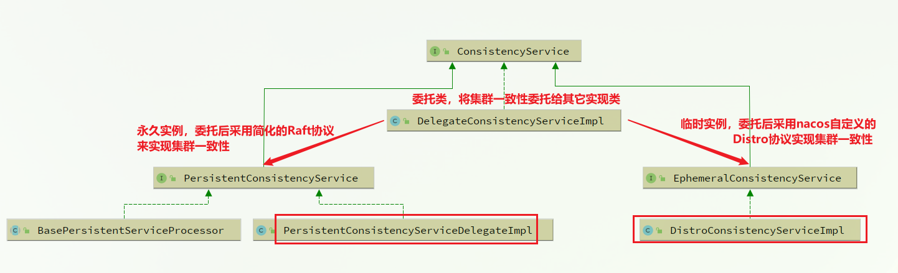


我们进入DelegateConsistencyServiceImpl来看：

```java
@Override
public void put(String key, Record value) throws NacosException {
    // 根据实例是否是临时实例，判断委托对象
    mapConsistencyService(key).put(key, value);
}
```

其中的`mapConsistencyService(key)`方法就是选择委托方式的：

```java
private ConsistencyService mapConsistencyService(String key) {
    // 判断是否是临时实例：
    // 是，选择 ephemeralConsistencyService，也就是 DistroConsistencyServiceImpl类
    // 否，选择 persistentConsistencyService，也就是PersistentConsistencyServiceDelegateImpl
    return KeyBuilder.matchEphemeralKey(key) ? ephemeralConsistencyService : persistentConsistencyService;
}
```

默认情况下，所有实例都是临时实例，我们关注 DistroConsistencyServiceImpl 即可。


#### DistroConsistencyServiceImpl

我们来看临时实例的一致性实现：DistroConsistencyServiceImpl类的put方法：

```java
public void put(String key, Record value) throws NacosException {
    // 先将要更新的实例信息写入本地实例列表
    onPut(key, value);
    // 开始集群同步
    distroProtocol.sync(new DistroKey(key, KeyBuilder.INSTANCE_LIST_KEY_PREFIX), DataOperation.CHANGE,
                        globalConfig.getTaskDispatchPeriod() / 2);
}
```

这里方法只有两行：

- `onPut(key, value)`：其中value就是Instances，要更新的服务信息。这行主要是基于线程池方式，异步的将Service信息写入注册表中(就是那个多重Map)
- `distroProtocol.sync()`：就是通过Distro协议将数据同步给集群中的其它Nacos节点


我们先看onPut方法

##### 更新本地实例列表

**放入阻塞队列**

onPut方法如下：

```java
public void onPut(String key, Record value) {
		// 判断是否是临时实例
    if (KeyBuilder.matchEphemeralInstanceListKey(key)) {
        // 封装 Instances 信息到 数据集：Datum
        Datum<Instances> datum = new Datum<>();
        datum.value = (Instances) value;
        datum.key = key;
        datum.timestamp.incrementAndGet();
        // 放入DataStore
        dataStore.put(key, datum);
    }

    if (!listeners.containsKey(key)) {
        return;
    }
		// 放入阻塞队列，这里的 notifier 维护了一个阻塞队列，并且基于线程池异步执行队列中的任务
    notifier.addTask(key, DataOperation.CHANGE);
}
```


notifier 的类型就是`DistroConsistencyServiceImpl.Notifier`，内部维护了一个阻塞队列，存放服务列表变更的事件：

```java
public class Notifier implements Runnable {

    private ConcurrentHashMap<String, String> services = new ConcurrentHashMap<>(10 * 1024);

    // 阻塞队列
    private BlockingQueue<Pair<String, DataOperation>> tasks = new ArrayBlockingQueue<>(1024 * 1024);
}
```


addTask 时，将任务加入该阻塞队列：

```java
// DistroConsistencyServiceImpl.Notifier类的 addTask 方法：
public void addTask(String datumKey, DataOperation action) {

    if (services.containsKey(datumKey) && action == DataOperation.CHANGE) {
        return;
    }
    if (action == DataOperation.CHANGE) {
        services.put(datumKey, StringUtils.EMPTY);
    }
    // 任务放入阻塞队列
    tasks.offer(Pair.with(datumKey, action));
}
```


**线程池**

线程池在 DistroConsistencyServiceImpl 类初始化的时候就会进行启动

```java
@PostConstruct
public void init() {
    GlobalExecutor.submitDistroNotifyTask(notifier);
}
```

GlobalExecutor

```java
// 提交任务
public static void submitDistroNotifyTask(Runnable runnable) {
    DISTRO_NOTIFY_EXECUTOR.submit(runnable);
}

// 线程池
private static final ScheduledExecutorService DISTRO_NOTIFY_EXECUTOR = ExecutorFactory.Managed
            .newSingleScheduledExecutorService(ClassUtils.getCanonicalName(NamingApp.class),
                    new NameThreadFactory("com.alibaba.nacos.naming.distro.notifier"));
                    
// 单一线程池
public static ScheduledExecutorService newSingleScheduledExecutorService(final String group,
        final ThreadFactory threadFactory) {
    ScheduledExecutorService executorService = Executors.newScheduledThreadPool(1, threadFactory);
    THREAD_POOL_MANAGER.register(DEFAULT_NAMESPACE, group, executorService);
    return executorService;
}
```


**Notifier异步更新**

同时，notifier还是一个Runnable，通过一个单线程的线程池来不断从阻塞队列中获取任务，执行服务列表的更新。来看下其中的run方法：

```java
// DistroConsistencyServiceImpl.Notifier类的run方法：
@Override
public void run() {
    Loggers.DISTRO.info("distro notifier started");
	  
  	// 死循环，不断执行任务。因为是阻塞队列，不会导致CPU负载过高
    for (; ;) {
        try {
            // 从阻塞队列中获取任务
            Pair<String, DataOperation> pair = tasks.take();
          
            // 处理任务，更新服务列表
            handle(pair);
        } catch (Throwable e) {
            Loggers.DISTRO.error("[NACOS-DISTRO] Error while handling notifying task", e);
        }
    }
}
```


来看看 handle 方法：

```java
// DistroConsistencyServiceImpl.Notifier类的 handle 方法：
private void handle(Pair<String, DataOperation> pair) {
    try {
        String datumKey = pair.getValue0();
        DataOperation action = pair.getValue1();

        services.remove(datumKey);

        int count = 0;

        if (!listeners.containsKey(datumKey)) {
            return;
        }
				// 遍历，找到变化的 Service，这里的 RecordListener就是 Service
        for (RecordListener listener : listeners.get(datumKey)) {

            count++;

            try {
                // 服务的实例列表CHANGE事件
                if (action == DataOperation.CHANGE) {
                    // 更新服务列表
                    listener.onChange(datumKey, dataStore.get(datumKey).value);
                    continue;
                }
								// 服务的实例列表 DELETE 事件
                if (action == DataOperation.DELETE) {
                    listener.onDelete(datumKey);
                    continue;
                }
            } catch (Throwable e) {
                Loggers.DISTRO.error("[NACOS-DISTRO] error while notifying listener of key: {}", datumKey, e);
            }
        }

        if (Loggers.DISTRO.isDebugEnabled()) {
            Loggers.DISTRO
                .debug("[NACOS-DISTRO] datum change notified, key: {}, listener count: {}, action: {}",
                       datumKey, count, action.name());
        }
    } catch (Throwable e) {
        Loggers.DISTRO.error("[NACOS-DISTRO] Error while handling notifying task", e);
    }
}
```


**覆盖实例列表**

而在 Service 的 onChange 方法中，就可以看到更新实例列表的逻辑了：

```java
@Override
public void onChange(String key, Instances value) throws Exception {

    Loggers.SRV_LOG.info("[NACOS-RAFT] datum is changed, key: {}, value: {}", key, value);

		// 更新实例列表
    updateIPs(value.getInstanceList(), KeyBuilder.matchEphemeralInstanceListKey(key));

    recalculateChecksum();
}
```

updateIPs方法：

```java
public void updateIPs(Collection<Instance> instances, boolean ephemeral) {
    // 准备一个 Map，key 是 cluster，值是集群下的 Instance 集合
    Map<String, List<Instance>> ipMap = new HashMap<>(clusterMap.size());
  
    // 获取服务的所有cluster名称
    for (String clusterName : clusterMap.keySet()) {
        ipMap.put(clusterName, new ArrayList<>());
    }
  
    // 遍历要更新的实例
    for (Instance instance : instances) {
        try {
            if (instance == null) {
                Loggers.SRV_LOG.error("[NACOS-DOM] received malformed ip: null");
                continue;
            }
						// 判断实例是否包含 clusterName，没有的话用默认 cluster
            if (StringUtils.isEmpty(instance.getClusterName())) {
                instance.setClusterName(UtilsAndCommons.DEFAULT_CLUSTER_NAME);
            }
          
						// 判断 cluster 是否存在，不存在则创建新的 cluster
            if (!clusterMap.containsKey(instance.getClusterName())) {
                Loggers.SRV_LOG
                    .warn("cluster: {} not found, ip: {}, will create new cluster with default configuration.",
                          instance.getClusterName(), instance.toJson());
                Cluster cluster = new Cluster(instance.getClusterName(), this);
                cluster.init();
                getClusterMap().put(instance.getClusterName(), cluster);
            }
          
						// 获取当前 cluster 实例的集合，不存在则创建新的
            List<Instance> clusterIPs = ipMap.get(instance.getClusterName());
            if (clusterIPs == null) {
                clusterIPs = new LinkedList<>();
                ipMap.put(instance.getClusterName(), clusterIPs);
            }
          
						// 添加新的实例到 Instance 集合
            clusterIPs.add(instance);
        } catch (Exception e) {
            Loggers.SRV_LOG.error("[NACOS-DOM] failed to process ip: " + instance, e);
        }
    }

    for (Map.Entry<String, List<Instance>> entry : ipMap.entrySet()) {
        //make every ip mine
        List<Instance> entryIPs = entry.getValue();
        
      	// 将实例集合更新到 clusterMap（注册表）
        clusterMap.get(entry.getKey()).updateIps(entryIPs, ephemeral);
    }

    setLastModifiedMillis(System.currentTimeMillis());
    
  	// 发布服务变更的通知消息
    getPushService().serviceChanged(this);
    StringBuilder stringBuilder = new StringBuilder();

    for (Instance instance : allIPs()) {
        stringBuilder.append(instance.toIpAddr()).append("_").append(instance.isHealthy()).append(",");
    }

    Loggers.EVT_LOG.info("[IP-UPDATED] namespace: {}, service: {}, ips: {}", getNamespaceId(), getName(),
                         stringBuilder.toString());

}
```


在第 45 行的代码中：`clusterMap.get(entry.getKey()).updateIps(entryIPs, ephemeral);`

就是在更新注册表：

```java
public void updateIps(List<Instance> ips, boolean ephemeral) {
    // 获取旧实例列表
    Set<Instance> toUpdateInstances = ephemeral ? ephemeralInstances : persistentInstances;

    HashMap<String, Instance> oldIpMap = new HashMap<>(toUpdateInstances.size());

    for (Instance ip : toUpdateInstances) {
        oldIpMap.put(ip.getDatumKey(), ip);
    }

		// 检查新加入实例的状态
    List<Instance> newIPs = subtract(ips, oldIpMap.values());
    if (newIPs.size() > 0) {
        Loggers.EVT_LOG
            .info("{} {SYNC} {IP-NEW} cluster: {}, new ips size: {}, content: {}", getService().getName(),
                  getName(), newIPs.size(), newIPs.toString());

        for (Instance ip : newIPs) {
            HealthCheckStatus.reset(ip);
        }
    }
  
		// 移除要删除的实例
    List<Instance> deadIPs = subtract(oldIpMap.values(), ips);

    if (deadIPs.size() > 0) {
        Loggers.EVT_LOG
            .info("{} {SYNC} {IP-DEAD} cluster: {}, dead ips size: {}, content: {}", getService().getName(),
                  getName(), deadIPs.size(), deadIPs.toString());

        for (Instance ip : deadIPs) {
            HealthCheckStatus.remv(ip);
        }
    }

    toUpdateInstances = new HashSet<>(ips);
  
		// 直接覆盖旧实例列表
    if (ephemeral) {
        ephemeralInstances = toUpdateInstances;
    } else {
        persistentInstances = toUpdateInstances;
    }
}
```


##### 集群数据同步

在DistroConsistencyServiceImpl的put方法中分为两步：

```java
@Override
public void put(String key, Record value) throws NacosException {
    // 将实例更新到内存注册表，通过 AP 模式实现
    onPut(key, value);
    // 同步数据到集群中
    distroProtocol.sync(new DistroKey(key, KeyBuilder.INSTANCE_LIST_KEY_PREFIX), DataOperation.CHANGE,
            globalConfig.getTaskDispatchPeriod() / 2);
}
```

其中的onPut方法已经分析过了。


下面的distroProtocol.sync()就是集群同步的逻辑了。

DistroProtocol类的sync方法如下：

```java
public void sync(DistroKey distroKey, DataOperation action, long delay) {
    // 遍历 Nacos 集群中除自己以外的其它节点
    for (Member each : memberManager.allMembersWithoutSelf()) {
        DistroKey distroKeyWithTarget = new DistroKey(distroKey.getResourceKey(), distroKey.getResourceType(),
                                                      each.getAddress());
        // 定义一个 Distro 的同步任务
        DistroDelayTask distroDelayTask = new DistroDelayTask(distroKeyWithTarget, action, delay);
        // 交给线程池去执行
        distroTaskEngineHolder.getDelayTaskExecuteEngine().addTask(distroKeyWithTarget, distroDelayTask);
        if (Loggers.DISTRO.isDebugEnabled()) {
            Loggers.DISTRO.debug("[DISTRO-SCHEDULE] {} to {}", distroKey, each.getAddress());
        }
    }
}
```


其中同步的任务封装为一个`DistroDelayTask`对象。

交给了`distroTaskEngineHolder.getDelayTaskExecuteEngine()`执行，这行代码的返回值是：`NacosDelayTaskExecuteEngine`，这个类维护了一个线程池，并且接收任务，执行任务。


执行任务的方法为 processTasks() 方法：

```java
protected void processTasks() {
    Collection<Object> keys = getAllTaskKeys();
    for (Object taskKey : keys) {
        AbstractDelayTask task = removeTask(taskKey);
        if (null == task) {
            continue;
        }
        NacosTaskProcessor processor = getProcessor(taskKey);
        if (null == processor) {
            getEngineLog().error("processor not found for task, so discarded. " + task);
            continue;
        }
        try {
            // 尝试执行同步任务，如果失败会重试
            if (!processor.process(task)) {
                retryFailedTask(taskKey, task);
            }
        } catch (Throwable e) {
            getEngineLog().error("Nacos task execute error : " + e.toString(), e);
            retryFailedTask(taskKey, task);
        }
    }
}
```

可以看出来基于Distro模式的同步是异步进行的，并且失败时会将任务重新入队并充实，因此不保证同步结果的强一致性，属于AP模式的一致性策略。


#### 服务端流程图

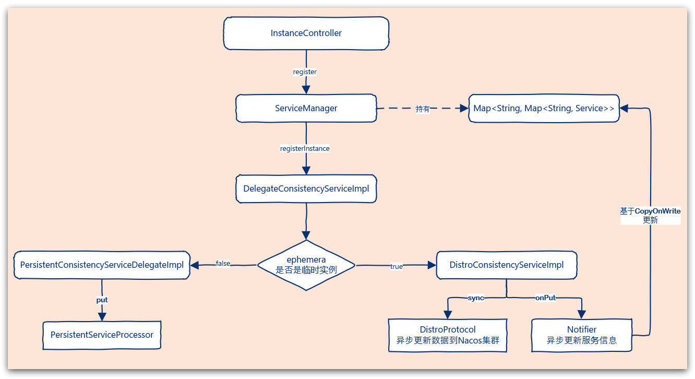


### 总结

- Nacos的注册表结构是什么样的？

  - 答：Nacos是多级存储模型，最外层通过namespace来实现环境隔离，然后是group分组，分组下就是服务，一个服务有可以分为不同的集群，集群中包含多个实例。因此其注册表结构为一个Map，类型是：

    `Map<String, Map<String, Service>>`，外层key是`namespace_id`，内层key是`group+serviceName`.

    Service内部维护一个Map，结构是：`Map<String,Cluster>`，key是clusterName，值是集群信息

    Cluster内部维护一个Set集合，元素是Instance类型，代表集群中的多个实例。


- Nacos如何保证并发写的安全性？
  - 答：首先，在注册实例时，会对service加锁，不同service之间本身就不存在并发写问题，互不影响。相同service时通过锁来互斥。并且，在更新实例列表时，是基于异步的线程池来完成，而线程池的线程数量为1.
  
  
  
- Nacos如何避免并发读写的冲突？
  - 答：Nacos在更新实例列表时，会采用CopyOnWrite技术，首先将Old实例列表拷贝一份，然后更新拷贝的实例列表，再用更新后的实例列表来覆盖旧的实例列表。

  
  
- Nacos如何应对阿里内部数十万服务的并发写请求？
  - 答：Nacos内部会将服务注册的任务放入阻塞队列，采用线程池异步来完成实例更新，从而提高并发写能力。


## 服务心跳

Nacos 将服务实例分为临时实例和非临时实例。临时实例采用心跳模式，检测不正常会被剔除。非临时实例采用主动检测模式，检测不正常不会被剔除，但是会被标记为不健康。

<br/>

Nacos 的实例分为临时实例和永久实例两种，可以通过在yaml 文件配置：

```yaml
spring:
  application:
    name: order-service
  cloud:
    nacos:
      discovery:
        ephemeral: false # 设置实例为永久实例。true：临时; false：永久
      server-addr: 192.168.150.1:8845
```


临时实例基于心跳方式做健康检测，而永久实例则是由Nacos主动探测实例状态。


其中Nacos提供的心跳的API接口为：

**接口描述**：发送某个实例的心跳

**请求类型**：PUT

**请求路径**：

```plain
/nacos/v1/ns/instance/beat
```

**请求参数**：

| 名称        | 类型           | 是否必选 | 描述         |
| :---------- | :------------- | :------- | ------------ |
| serviceName | 字符串         | 是       | 服务名       |
| groupName   | 字符串         | 否       | 分组名       |
| ephemeral   | boolean        | 否       | 是否临时实例 |
| beat        | JSON格式字符串 | 是       | 实例心跳内容 |

**错误编码**：

| 错误代码 | 描述                  | 语义                   |
| :------- | :-------------------- | :--------------------- |
| 400      | Bad Request           | 客户端请求中的语法错误 |
| 403      | Forbidden             | 没有权限               |
| 404      | Not Found             | 无法找到资源           |
| 500      | Internal Server Error | 服务器内部错误         |
| 200      | OK                    | 正常                   |


### 客户端

服务注册这一节中，我们说过 NacosNamingService 这个类实现了服务的注册，同时也实现了服务心跳：

```java
@Override
public void registerInstance(String serviceName, String groupName, Instance instance) throws NacosException {
    NamingUtils.checkInstanceIsLegal(instance);
    String groupedServiceName = NamingUtils.getGroupedName(serviceName, groupName);
    // 判断是否是临时实例。
    if (instance.isEphemeral()) {
        // 如果是临时实例，则构建心跳信息BeatInfo
        BeatInfo beatInfo = beatReactor.buildBeatInfo(groupedServiceName, instance);
        // 添加心跳任务
        beatReactor.addBeatInfo(groupedServiceName, beatInfo);
    }
    serverProxy.registerService(groupedServiceName, groupName, instance);
}
```


#### BeatInfo

这里的BeanInfo就包含心跳需要的各种信息：

```java
public class BeatInfo {
    
    private int port;
    
    private String ip;
    
    private double weight;
    
    private String serviceName;
    
    private String cluster;
    
    private Map<String, String> metadata;
    
    private volatile boolean scheduled;
    
    private volatile long period;
    
    private volatile boolean stopped;
    
}
```


#### BeatReactor

而`BeatReactor`这个类则维护了一个线程池：

```java
public BeatReactor(NamingProxy serverProxy, int threadCount) {
    this.serverProxy = serverProxy;
    this.executorService = new ScheduledThreadPoolExecutor(threadCount, new ThreadFactory() {
        @Override
        public Thread newThread(Runnable r) {
            Thread thread = new Thread(r);
            thread.setDaemon(true);
            thread.setName("com.alibaba.nacos.naming.beat.sender");
            return thread;
        }
    });
}
```


当调用 `BeatReactor` 的 `.addBeatInfo(groupedServiceName, beatInfo)`方法时，就会执行心跳：

```java
public void addBeatInfo(String serviceName, BeatInfo beatInfo) {
    NAMING_LOGGER.info("[BEAT] adding beat: {} to beat map.", beatInfo);
    String key = buildKey(serviceName, beatInfo.getIp(), beatInfo.getPort());
    BeatInfo existBeat = null;
    //fix #1733
    if ((existBeat = dom2Beat.remove(key)) != null) {
        existBeat.setStopped(true);
    }
    dom2Beat.put(key, beatInfo);
    // 利用线程池，定期执行心跳任务，周期为 beatInfo.getPeriod()
    executorService.schedule(new BeatTask(beatInfo), beatInfo.getPeriod(), TimeUnit.MILLISECONDS);
    MetricsMonitor.getDom2BeatSizeMonitor().set(dom2Beat.size());
}
```


心跳周期的默认值在`com.alibaba.nacos.api.common.Constants`类中：

```java
public static final long DEFAULT_HEART_BEAT_TIMEOUT = TimeUnit.SECONDS.toMillis(15);

public static final long DEFAULT_IP_DELETE_TIMEOUT = TimeUnit.SECONDS.toMillis(30);

// 心跳周期 可以看到是5秒，默认5秒一次心跳。
public static final long DEFAULT_HEART_BEAT_INTERVAL = TimeUnit.SECONDS.toMillis(5);
```


#### BeatTask

心跳的任务封装在`BeatTask`这个类中，是一个 Runnable，其 run方法如下：

```java
@Override
public void run() {
    if (beatInfo.isStopped()) {
        return;
    }
    // 获取心跳周期
    long nextTime = beatInfo.getPeriod();
    try {
        // 发送心跳
        JsonNode result = serverProxy.sendBeat(beatInfo, BeatReactor.this.lightBeatEnabled);
        long interval = result.get("clientBeatInterval").asLong();
        boolean lightBeatEnabled = false;
        if (result.has(CommonParams.LIGHT_BEAT_ENABLED)) {
            lightBeatEnabled = result.get(CommonParams.LIGHT_BEAT_ENABLED).asBoolean();
        }
        BeatReactor.this.lightBeatEnabled = lightBeatEnabled;
        if (interval > 0) {
            nextTime = interval;
        }
        // 判断心跳结果
        int code = NamingResponseCode.OK;
        if (result.has(CommonParams.CODE)) {
            code = result.get(CommonParams.CODE).asInt();
        }
        if (code == NamingResponseCode.RESOURCE_NOT_FOUND) {
            // 如果失败，则需要重新注册实例
            Instance instance = new Instance();
            instance.setPort(beatInfo.getPort());
            instance.setIp(beatInfo.getIp());
            instance.setWeight(beatInfo.getWeight());
            instance.setMetadata(beatInfo.getMetadata());
            instance.setClusterName(beatInfo.getCluster());
            instance.setServiceName(beatInfo.getServiceName());
            instance.setInstanceId(instance.getInstanceId());
            instance.setEphemeral(true);
            try {
                serverProxy.registerService(beatInfo.getServiceName(),
                                            NamingUtils.getGroupName(beatInfo.getServiceName()), instance);
            } catch (Exception ignore) {
            }
        }
    } catch (NacosException ex) {
        NAMING_LOGGER.error("[CLIENT-BEAT] failed to send beat: {}, code: {}, msg: {}",
                            JacksonUtils.toJson(beatInfo), ex.getErrCode(), ex.getErrMsg());

    } catch (Exception unknownEx) {
        NAMING_LOGGER.error("[CLIENT-BEAT] failed to send beat: {}, unknown exception msg: {}",
                            JacksonUtils.toJson(beatInfo), unknownEx.getMessage(), unknownEx);
    } finally {
        executorService.schedule(new BeatTask(beatInfo), nextTime, TimeUnit.MILLISECONDS);
    }
}
```


#### 发送心跳

最终心跳的发送还是通过`NamingProxy`的`sendBeat`方法来实现：

```java
public JsonNode sendBeat(BeatInfo beatInfo, boolean lightBeatEnabled) throws NacosException {

    if (NAMING_LOGGER.isDebugEnabled()) {
        NAMING_LOGGER.debug("[BEAT] {} sending beat to server: {}", namespaceId, beatInfo.toString());
    }
    // 组织请求参数
    Map<String, String> params = new HashMap<String, String>(8);
    Map<String, String> bodyMap = new HashMap<String, String>(2);
    if (!lightBeatEnabled) {
        bodyMap.put("beat", JacksonUtils.toJson(beatInfo));
    }
    params.put(CommonParams.NAMESPACE_ID, namespaceId);
    params.put(CommonParams.SERVICE_NAME, beatInfo.getServiceName());
    params.put(CommonParams.CLUSTER_NAME, beatInfo.getCluster());
    params.put("ip", beatInfo.getIp());
    params.put("port", String.valueOf(beatInfo.getPort()));
    // 发送请求，这个地址就是：/v1/ns/instance/beat
    String result = reqApi(UtilAndComs.nacosUrlBase + "/instance/beat", params, bodyMap, HttpMethod.PUT);
    return JacksonUtils.toObj(result);
}
```


### 服务端

对于临时实例，服务端代码分两部分：

- InstanceController 提供了一个接口，处理客户端的心跳请求
- 定时检测实例心跳是否按期执行


#### InstanceController

与服务注册时一样，在 nacos-naming 模块中的 InstanceController 类中，定义了一个方法用来处理心跳请求：

```java
@CanDistro
@PutMapping("/beat")
@Secured(parser = NamingResourceParser.class, action = ActionTypes.WRITE)
public ObjectNode beat(HttpServletRequest request) throws Exception {
		// 解析心跳的请求参数
    ObjectNode result = JacksonUtils.createEmptyJsonNode();
    result.put(SwitchEntry.CLIENT_BEAT_INTERVAL, switchDomain.getClientBeatInterval());

    String beat = WebUtils.optional(request, "beat", StringUtils.EMPTY);
    RsInfo clientBeat = null;
    if (StringUtils.isNotBlank(beat)) {
        clientBeat = JacksonUtils.toObj(beat, RsInfo.class);
    }
    String clusterName = WebUtils
        .optional(request, CommonParams.CLUSTER_NAME, UtilsAndCommons.DEFAULT_CLUSTER_NAME);
    String ip = WebUtils.optional(request, "ip", StringUtils.EMPTY);
    int port = Integer.parseInt(WebUtils.optional(request, "port", "0"));
    if (clientBeat != null) {
        if (StringUtils.isNotBlank(clientBeat.getCluster())) {
            clusterName = clientBeat.getCluster();
        } else {
            // fix #2533
            clientBeat.setCluster(clusterName);
        }
        ip = clientBeat.getIp();
        port = clientBeat.getPort();
    }
    String namespaceId = WebUtils.optional(request, CommonParams.NAMESPACE_ID, Constants.DEFAULT_NAMESPACE_ID);
    String serviceName = WebUtils.required(request, CommonParams.SERVICE_NAME);
    NamingUtils.checkServiceNameFormat(serviceName);
    Loggers.SRV_LOG.debug("[CLIENT-BEAT] full arguments: beat: {}, serviceName: {}", clientBeat, serviceName);
    // 尝试根据参数中的namespaceId、serviceName、clusterName、ip、port等信息
    // 从 Nacos 的注册表中获取实例
    Instance instance = serviceManager.getInstance(namespaceId, serviceName, clusterName, ip, port);
		// 如果获取失败，说明心跳失败，实例尚未注册
    if (instance == null) {
        if (clientBeat == null) {
            result.put(CommonParams.CODE, NamingResponseCode.RESOURCE_NOT_FOUND);
            return result;
        }

        Loggers.SRV_LOG.warn("[CLIENT-BEAT] The instance has been removed for health mechanism, "
                             + "perform data compensation operations, beat: {}, serviceName: {}", clientBeat, serviceName);
			
      	// 这里重新注册一个实例
        instance = new Instance();
        instance.setPort(clientBeat.getPort());
        instance.setIp(clientBeat.getIp());
        instance.setWeight(clientBeat.getWeight());
        instance.setMetadata(clientBeat.getMetadata());
        instance.setClusterName(clusterName);
        instance.setServiceName(serviceName);
        instance.setInstanceId(instance.getInstanceId());
        instance.setEphemeral(clientBeat.isEphemeral());

        serviceManager.registerInstance(namespaceId, serviceName, instance);
    }
		// 尝试基于namespaceId和serviceName从 注册表中获取Service服务
    Service service = serviceManager.getService(namespaceId, serviceName);
		// 如果不存在，说明服务不存在，返回404
    if (service == null) {
        throw new NacosException(NacosException.SERVER_ERROR,
                                 "service not found: " + serviceName + "@" + namespaceId);
    }
  
    if (clientBeat == null) {
        clientBeat = new RsInfo();
        clientBeat.setIp(ip);
        clientBeat.setPort(port);
        clientBeat.setCluster(clusterName);
    }
  
    // 如果心跳没问题，开始处理心跳结果
    service.processClientBeat(clientBeat);

    result.put(CommonParams.CODE, NamingResponseCode.OK);
    if (instance.containsMetadata(PreservedMetadataKeys.HEART_BEAT_INTERVAL)) {
        result.put(SwitchEntry.CLIENT_BEAT_INTERVAL, instance.getInstanceHeartBeatInterval());
    }
    result.put(SwitchEntry.LIGHT_BEAT_ENABLED, switchDomain.isLightBeatEnabled());
    return result;
}
```

最终，在确认心跳请求对应的服务、实例都在的情况下，开始交给 Service 类处理这次心跳请求。调用了 Service 的 processClientBeat 方法


#### 处理心跳请求

查看`Service`的`service.processClientBeat(clientBeat);`方法：

```java
public void processClientBeat(final RsInfo rsInfo) {
    ClientBeatProcessor clientBeatProcessor = new ClientBeatProcessor();
    clientBeatProcessor.setService(this);
    clientBeatProcessor.setRsInfo(rsInfo);
    HealthCheckReactor.scheduleNow(clientBeatProcessor);
}
```

可以看到心跳信息被封装到了 ClientBeatProcessor 类中，交给了 HealthCheckReactor 处理，HealthCheckReactor 就是对线程池的封装，不用过多查看。

关键的业务逻辑都在 ClientBeatProcessor 这个类中，它是一个 Runnable，其中的 run 方法如下：

```java
@Override
public void run() {
    Service service = this.service;
    if (Loggers.EVT_LOG.isDebugEnabled()) {
        Loggers.EVT_LOG.debug("[CLIENT-BEAT] processing beat: {}", rsInfo.toString());
    }

    String ip = rsInfo.getIp();
    String clusterName = rsInfo.getCluster();
    int port = rsInfo.getPort();
  
    // 获取集群信息
    Cluster cluster = service.getClusterMap().get(clusterName);
  
    // 获取集群中的所有实例信息
    List<Instance> instances = cluster.allIPs(true);

    for (Instance instance : instances) {
      
        // 找到心跳的这个实例
        if (instance.getIp().equals(ip) && instance.getPort() == port) {
            if (Loggers.EVT_LOG.isDebugEnabled()) {
                Loggers.EVT_LOG.debug("[CLIENT-BEAT] refresh beat: {}", rsInfo.toString());
            }
          
            // 更新实例的最后一次心跳时间 lastBeat
            instance.setLastBeat(System.currentTimeMillis());
            if (!instance.isMarked()) {
                if (!instance.isHealthy()) {
                    instance.setHealthy(true);
                    Loggers.EVT_LOG
                        .info("service: {} {POS} {IP-ENABLED} valid: {}:{}@{}, region: {}, msg: client beat ok",
                              cluster.getService().getName(), ip, port, cluster.getName(),
                              UtilsAndCommons.LOCALHOST_SITE);
                    getPushService().serviceChanged(service);
                }
            }
        }
    }
}
```

处理心跳请求的核心就是更新心跳实例的最后一次心跳时间，lastBeat，这个会成为判断实例心跳是否过期的关键指标！


#### 心跳异常检测

在服务注册时，一定会创建一个 `Service` 对象，而 `Service` 中有一个`init`方法，会在注册时被调用：

```java
public void init() {
    // 开启心跳检测的任务
    HealthCheckReactor.scheduleCheck(clientBeatCheckTask);
    for (Map.Entry<String, Cluster> entry : clusterMap.entrySet()) {
        entry.getValue().setService(this);
        entry.getValue().init();
    }
}
```

其中 HealthCheckReactor.scheduleCheck 就是执行心跳检测的定时任务：

```java
public static void scheduleCheck(ClientBeatCheckTask task) {
    futureMap.computeIfAbsent(task.taskKey(),
            k -> GlobalExecutor.scheduleNamingHealth(task, 5000, 5000, TimeUnit.MILLISECONDS));
}
```

可以看到，该任务是 5000ms 执行一次，也就是5秒对实例的心跳状态做一次检测。


此处的 ClientBeatCheckTask 同样是一个Runnable，其中的 run 方法为：

```java
@Override
public void run() {
    try {
        // 找到所有临时实例的列表
        List<Instance> instances = service.allIPs(true);

        // first set health status of instances:
        for (Instance instance : instances) {
            // 判断 心跳间隔（当前时间 - 最后一次心跳时间） 是否大于 心跳超时时间，默认15秒
            if (System.currentTimeMillis() - instance.getLastBeat() > instance.getInstanceHeartBeatTimeOut()) {
                if (!instance.isMarked()) {
                    if (instance.isHealthy()) {
                        // 如果超时，标记实例为不健康 healthy = false
                        instance.setHealthy(false);
 
                        // 发布实例状态变更的事件
                        getPushService().serviceChanged(service);
                        ApplicationUtils.publishEvent(new InstanceHeartbeatTimeoutEvent(this, instance));
                    }
                }
            }
        }

        if (!getGlobalConfig().isExpireInstance()) {
            return;
        }

        // then remove obsolete instances:
        for (Instance instance : instances) {

            if (instance.isMarked()) {
                continue;
            }
           // 判断心跳间隔（当前时间 - 最后一次心跳时间）是否大于 实例被删除的最长超时时间，默认30秒
            if (System.currentTimeMillis() - instance.getLastBeat() > instance.getIpDeleteTimeout()) {
                // 如果是超过了30秒，则删除实例
                Loggers.SRV_LOG.info("[AUTO-DELETE-IP] service: {}, ip: {}", service.getName(),
                                     JacksonUtils.toJson(instance));
                deleteIp(instance);
            }
        }

    } catch (Exception e) {
        Loggers.SRV_LOG.warn("Exception while processing client beat time out.", e);
    }

}
```


其中的超时时间同样是在`com.alibaba.nacos.api.common.Constants`这个类中：

```java
// 心跳超时，被标记为不健康的时间
public static final long DEFAULT_HEART_BEAT_TIMEOUT = TimeUnit.SECONDS.toMillis(15);

// 心跳超时，实例被删除时间
public static final long DEFAULT_IP_DELETE_TIMEOUT = TimeUnit.SECONDS.toMillis(30);

public static final long DEFAULT_HEART_BEAT_INTERVAL = TimeUnit.SECONDS.toMillis(5);
```


#### 主动健康检测

对于非临时实例（ephemeral=false)，Nacos会采用主动的健康检测，定时向实例发送请求，根据响应来判断实例健康状态。

入口的`ServiceManager`类中的 registerInstance 方法：

```java
public void registerInstance(String namespaceId, String serviceName, Instance instance) throws NacosException {
    // 判断是否是第一次注册，如果是创建空的服务，并加入注册表
    createEmptyService(namespaceId, serviceName, instance.isEphemeral());
    
    Service service = getService(namespaceId, serviceName);
    
    if (service == null) {
        throw new NacosException(NacosException.INVALID_PARAM,
                "service not found, namespace: " + namespaceId + ", service: " + serviceName);
    }
    
    addInstance(namespaceId, serviceName, instance.isEphemeral(), instance);
}
```


创建空服务时：

```java
public void createEmptyService(String namespaceId, String serviceName, boolean local) throws NacosException {
    // 如果服务不存在，创建新的服务
    createServiceIfAbsent(namespaceId, serviceName, local, null);
}
```


创建服务流程：

```java
public void createServiceIfAbsent(String namespaceId, String serviceName, boolean local, Cluster cluster)
    throws NacosException {
    // 尝试获取服务
    Service service = getService(namespaceId, serviceName);
    if (service == null) {
				// 发现服务不存在，开始创建新服务
        Loggers.SRV_LOG.info("creating empty service {}:{}", namespaceId, serviceName);
        service = new Service();
        service.setName(serviceName);
        service.setNamespaceId(namespaceId);
        service.setGroupName(NamingUtils.getGroupName(serviceName));
        // now validate the service. if failed, exception will be thrown
        service.setLastModifiedMillis(System.currentTimeMillis());
        service.recalculateChecksum();
        if (cluster != null) {
            cluster.setService(service);
            service.getClusterMap().put(cluster.getName(), cluster);
        }
        service.validate();
        // ** 写入注册表并初始化 **
        putServiceAndInit(service);
        if (!local) {
            addOrReplaceService(service);
        }
    }
}
```


关键在`putServiceAndInit(service)`方法中：

```java
private void putServiceAndInit(Service service) throws NacosException {
    // 将服务写入注册表
    putService(service);
    service = getService(service.getNamespaceId(), service.getName());
    // 完成服务的初始化
    service.init();
    consistencyService
        .listen(KeyBuilder.buildInstanceListKey(service.getNamespaceId(), service.getName(), true), service);
    consistencyService
        .listen(KeyBuilder.buildInstanceListKey(service.getNamespaceId(), service.getName(), false), service);
    Loggers.SRV_	LOG.info("[NEW-SERVICE] {}", service.toJson());
}
```


进入初始化逻辑：`service.init()`，这个会进入 Service 类中：

```java
/**
* Init service.
*/
public void init() {
    // 开启临时实例的心跳监测任务
    HealthCheckReactor.scheduleCheck(clientBeatCheckTask);
    // 遍历注册表中的集群
    for (Map.Entry<String, Cluster> entry : clusterMap.entrySet()) {
        entry.getValue().setService(this);
        // 完成集群初识化
        entry.getValue().init();
    }
}
```


这里集群的初始化 ` entry.getValue().init();` 会进入 `Cluster` 类型的 `init()` 方法：

```java
/**
* Init cluster.
*/
public void init() {
    if (inited) {
        return;
    }
    // 创建健康检测的任务
    checkTask = new HealthCheckTask(this);
		// 这里会开启对 非临时实例 的定时健康检测
    HealthCheckReactor.scheduleCheck(checkTask);
    inited = true;
}
```


这里的`HealthCheckReactor.scheduleCheck(checkTask);`会开启定时任务，对非临时实例做健康检测。检测逻辑定义在`HealthCheckTask`这个类中，是一个 Runnable，其中的 run 方法：

```java
public void run() {

    try {
        if (distroMapper.responsible(cluster.getService().getName()) && switchDomain
            .isHealthCheckEnabled(cluster.getService().getName())) {
            // 开始健康检测
            healthCheckProcessor.process(this);
						// 记录日志 。。。
        }
    } catch (Throwable e) {
       // 记录日志 。。。
    } finally {
        if (!cancelled) {
            // 结束后，再次进行任务调度，一定延迟后执行
            HealthCheckReactor.scheduleCheck(this);
            
            // 。。。
        }
    }
}
```


健康检测逻辑定义在`healthCheckProcessor.process(this);`方法中，在HealthCheckProcessor接口中，这个接口也有很多实现，默认是`TcpSuperSenseProcessor`：

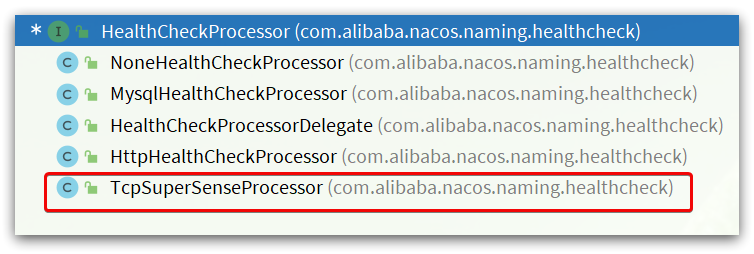


进入`TcpSuperSenseProcessor`的 process 方法：

```java
@Override
public void process(HealthCheckTask task) {
    // 获取所有非临时实例的集合
    List<Instance> ips = task.getCluster().allIPs(false);

    if (CollectionUtils.isEmpty(ips)) {
        return;
    }

    for (Instance ip : ips) {
				// 封装健康检测信息到 Beat
        Beat beat = new Beat(ip, task);
        // 放入一个阻塞队列中
        taskQueue.add(beat);
        MetricsMonitor.getTcpHealthCheckMonitor().incrementAndGet();
    }
}
```

可以看到，所有的健康检测任务都被放入一个阻塞队列，而不是立即执行了。这里又采用了异步执行的策略，可以看到Nacos中大量这样的设计。

而 `TcpSuperSenseProcessor` 本身就是一个Runnable，在它的构造函数中会把自己放入线程池中去执行，其run方法如下：

```java
public void run() {
    while (true) {
        try {
            // 处理任务
            processTask();
            // ...
        } catch (Throwable e) {
            SRV_LOG.error("[HEALTH-CHECK] error while processing NIO task", e);
        }
    }
}
```


通过 processTask 来处理健康检测的任务：

```java
private void processTask() throws Exception {
    // 将任务封装为一个 TaskProcessor，并放入集合
    Collection<Callable<Void>> tasks = new LinkedList<>();
    do {
        Beat beat = taskQueue.poll(CONNECT_TIMEOUT_MS / 2, TimeUnit.MILLISECONDS);
        if (beat == null) {
            return;
        }

        tasks.add(new TaskProcessor(beat));
    } while (taskQueue.size() > 0 && tasks.size() < NIO_THREAD_COUNT * 64);
		// 批量处理集合中的任务
    for (Future<?> f : GlobalExecutor.invokeAllTcpSuperSenseTask(tasks)) {
        f.get();
    }
}
```

任务被封装到了 TaskProcessor 中去执行了，TaskProcessor 是一个 Callable，其中的 call 方法：

```java
@Override
public Void call() {
    // 获取检测任务已经等待的时长
    long waited = System.currentTimeMillis() - beat.getStartTime();
    if (waited > MAX_WAIT_TIME_MILLISECONDS) {
        Loggers.SRV_LOG.warn("beat task waited too long: " + waited + "ms");
    }
	
    SocketChannel channel = null;
    try {
        // 获取实例信息
        Instance instance = beat.getIp();
				// 通过 NIO 建立 TCP 连接
        channel = SocketChannel.open();
        channel.configureBlocking(false);
        // only by setting this can we make the socket close event asynchronous
        channel.socket().setSoLinger(false, -1);
        channel.socket().setReuseAddress(true);
        channel.socket().setKeepAlive(true);
        channel.socket().setTcpNoDelay(true);

        Cluster cluster = beat.getTask().getCluster();
        int port = cluster.isUseIPPort4Check() ? instance.getPort() : cluster.getDefCkport();
        channel.connect(new InetSocketAddress(instance.getIp(), port));
				// 注册连接、读取事件
        SelectionKey key = channel.register(selector, SelectionKey.OP_CONNECT | SelectionKey.OP_READ);
        key.attach(beat);
        keyMap.put(beat.toString(), new BeatKey(key));

        beat.setStartTime(System.currentTimeMillis());

        GlobalExecutor
            .scheduleTcpSuperSenseTask(new TimeOutTask(key), CONNECT_TIMEOUT_MS, TimeUnit.MILLISECONDS);
    } catch (Exception e) {
        beat.finishCheck(false, false, switchDomain.getTcpHealthParams().getMax(),
                         "tcp:error:" + e.getMessage());

        if (channel != null) {
            try {
                channel.close();
            } catch (Exception ignore) {
            }
        }
    }

    return null;
}
```


### 总结

Nacos的健康检测有两种模式：

- 临时实例：
  - 采用客户端心跳检测模式，心跳周期5秒
  - 心跳间隔超过15秒则标记为不健康
  - 心跳间隔超过30秒则从服务列表删除
- 永久实例：
  - 采用服务端主动健康检测方式
  - 周期为2000 + 5000毫秒内的随机数
  - 检测异常只会标记为不健康，不会删除


那么为什么Nacos有临时和永久两种实例呢？

以淘宝为例，双十一大促期间，流量会比平常高出很多，此时服务肯定需要增加更多实例来应对高并发，而这些实例在双十一之后就无需继续使用了，采用**临时实例**比较合适。而对于服务的一些常备实例，则使用**永久实例**更合适。


与 Eureka 相比，Nacos 与 Eureka 在临时实例上都是基于心跳模式实现，差别不大，主要是心跳周期不同，Eureka 是30秒，Nacos是5秒。

另外，Nacos 支持永久实例，而 Eureka 不支持，Eureka 只提供了心跳模式的健康监测，而没有主动检测功能。


## 服务发现

Nacos 的服务发现分为两种模式：

- 模式一：主动拉取模式，消费者定期主动从 Nacos 拉取服务列表并缓存起来，再服务调用时优先读取本地缓存中的服务列表。
- 模式二：订阅模式，消费者订阅 Nacos 中的服务列表，并基于 UDP 协议来接收服务变更通知。当 Nacos 中的服务列表更新时，会发送UDP广播给所有订阅者。


Nacos 提供了一个根据 serviceId 查询实例列表的接口：

**接口描述**：查询服务下的实例列表

**请求类型**：GET

**请求路径**：

```url
/nacos/v1/ns/instance/list
```

**请求参数**：

| 名称        | 类型                       | 是否必选        | 描述               |
| :---------- | :------------------------- | :-------------- | ------------------ |
| serviceName | 字符串                     | 是              | 服务名             |
| groupName   | 字符串                     | 否              | 分组名             |
| namespaceId | 字符串                     | 否              | 命名空间ID         |
| clusters    | 字符串，多个集群用逗号分隔 | 否              | 集群名称           |
| healthyOnly | boolean                    | 否，默认为false | 是否只返回健康实例 |

**错误编码**：

| 错误代码 | 描述                  | 语义                   |
| :------- | :-------------------- | :--------------------- |
| 400      | Bad Request           | 客户端请求中的语法错误 |
| 403      | Forbidden             | 没有权限               |
| 404      | Not Found             | 无法找到资源           |
| 500      | Internal Server Error | 服务器内部错误         |
| 200      | OK                    | 正常                   |


### 客户端

#### 定时更新服务列表

#### NacosNamingService

在2.2.4小节中，我们讲到一个类`NacosNamingService`，这个类不仅仅提供了服务注册功能，同样提供了服务发现的功能。


多个重载的方法最终都会进入一个方法：

```java
@Override
public List<Instance> getAllInstances(String serviceName, String groupName, List<String> clusters,
                                      boolean subscribe) throws NacosException {

    ServiceInfo serviceInfo;
    // 1.判断是否需要订阅服务信息（默认为 true）
    if (subscribe) {
        // 1.1.订阅服务信息
        serviceInfo = hostReactor.getServiceInfo(NamingUtils.getGroupedName(serviceName, groupName),
                                                 StringUtils.join(clusters, ","));
    } else {
        // 1.2.直接去nacos拉取服务信息
        serviceInfo = hostReactor
            .getServiceInfoDirectlyFromServer(NamingUtils.getGroupedName(serviceName, groupName),
                                              StringUtils.join(clusters, ","));
    }
    // 2.从服务信息中获取实例列表并返回
    List<Instance> list;
    if (serviceInfo == null || CollectionUtils.isEmpty(list = serviceInfo.getHosts())) {
        return new ArrayList<Instance>();
    }
    return list;
}
```


#### HostReactor

进入订阅服务消息，这里是由`HostReactor`类的`getServiceInfo()`方法来实现的：

```java
public ServiceInfo getServiceInfo(final String serviceName, final String clusters) {

    NAMING_LOGGER.debug("failover-mode: " + failoverReactor.isFailoverSwitch());
    // 由 服务名@@集群名拼接 key
    String key = ServiceInfo.getKey(serviceName, clusters);
    if (failoverReactor.isFailoverSwitch()) {
        return failoverReactor.getService(key);
    }
    // 读取本地服务列表的缓存，缓存是一个Map，格式：Map<String, ServiceInfo>
    ServiceInfo serviceObj = getServiceInfo0(serviceName, clusters);
    // 判断缓存是否存在
    if (null == serviceObj) {
        // 不存在，创建空ServiceInfo
        serviceObj = new ServiceInfo(serviceName, clusters);
        // 放入缓存
        serviceInfoMap.put(serviceObj.getKey(), serviceObj);
        // 放入待更新的服务列表（updatingMap）中
        updatingMap.put(serviceName, new Object());
        // 立即更新服务列表
        updateServiceNow(serviceName, clusters);
        // 从待更新列表中移除
        updatingMap.remove(serviceName);

    } else if (updatingMap.containsKey(serviceName)) {
        // 缓存中有，但是需要更新
        if (UPDATE_HOLD_INTERVAL > 0) {
            // hold a moment waiting for update finish 等待5秒中，待更新完成
            synchronized (serviceObj) {
                try {
                    serviceObj.wait(UPDATE_HOLD_INTERVAL);
                } catch (InterruptedException e) {
                    NAMING_LOGGER
                        .error("[getServiceInfo] serviceName:" + serviceName + ", clusters:" + clusters, e);
                }
            }
        }
    }
    // 开启定时更新服务列表的功能
    scheduleUpdateIfAbsent(serviceName, clusters);
    // 返回缓存中的服务信息
    return serviceInfoMap.get(serviceObj.getKey());
}
```


基本逻辑就是先从本地缓存读，根据结果来选择：

- 如果本地缓存没有，立即去 Nacos 读取，`updateServiceNow(serviceName, clusters)`

  ```java
  private void updateServiceNow(String serviceName, String clusters) {
      try {
          updateService(serviceName, clusters);
      } catch (NacosException e) {
          NAMING_LOGGER.error("[NA] failed to update serviceName: " + serviceName, e);
      }
  }
  ```

  

- 如果本地缓存有，则开启定时更新功能，并返回缓存结果：

  - `scheduleUpdateIfAbsent(serviceName, clusters)`

  ```java
  /**
   * Schedule update if absent.
   *
   * @param serviceName service name
   * @param clusters    clusters
   */
  public void scheduleUpdateIfAbsent(String serviceName, String clusters) {
      if (futureMap.get(ServiceInfo.getKey(serviceName, clusters)) != null) {
          return;
      }
  
      synchronized (futureMap) {
          if (futureMap.get(ServiceInfo.getKey(serviceName, clusters)) != null) {
              return;
          }
  
          // 更新实例列表
          ScheduledFuture<?> future = addTask(new UpdateTask(serviceName, clusters));
          futureMap.put(ServiceInfo.getKey(serviceName, clusters), future);
      }
  }
  ```
  
  在UpdateTask中，最终还是调用updateService方法：
  
  ```java
  @Override
      public void run() {
          long delayTime = DEFAULT_DELAY;
  
          try {
              ServiceInfo serviceObj = serviceInfoMap.get(ServiceInfo.getKey(serviceName, clusters));
  
              if (serviceObj == null) {
              		// 调用 updateService
                  updateService(serviceName, clusters);
                  return;
              }
  
              if (serviceObj.getLastRefTime() <= lastRefTime) {
                  updateService(serviceName, clusters);
                  serviceObj = serviceInfoMap.get(ServiceInfo.getKey(serviceName, clusters));
              } else {
                  // if serviceName already updated by push, we should not override it
                  // since the push data may be different from pull through force push
                  refreshOnly(serviceName, clusters);
              }
  
              lastRefTime = serviceObj.getLastRefTime();
  
              if (!notifier.isSubscribed(serviceName, clusters) && !futureMap
                      .containsKey(ServiceInfo.getKey(serviceName, clusters))) {
                  // abort the update task
                  NAMING_LOGGER.info("update task is stopped, service:" + serviceName + ", clusters:" + clusters);
                  return;
              }
              if (CollectionUtils.isEmpty(serviceObj.getHosts())) {
                  incFailCount();
                  return;
              }
              delayTime = serviceObj.getCacheMillis();
              resetFailCount();
          } catch (Throwable e) {
              incFailCount();
              NAMING_LOGGER.warn("[NA] failed to update serviceName: " + serviceName, e);
          } finally {
              executor.schedule(this, Math.min(delayTime << failCount, DEFAULT_DELAY * 60), TimeUnit.MILLISECONDS);
          }
      }
  }
  ```
  
  


不管是立即更新服务列表，还是定时更新服务列表，最终都会执行HostReactor中的updateService()方法：

```java
public void updateService(String serviceName, String clusters) throws NacosException {
    ServiceInfo oldService = getServiceInfo0(serviceName, clusters);
    try {
		    // 基于ServerProxy发起远程调用，查询服务列表
        String result = serverProxy.queryList(serviceName, clusters, pushReceiver.getUdpPort(), false);

        if (StringUtils.isNotEmpty(result)) {
            // 处理查询结果
            processServiceJson(result);
        }
    } finally {
        if (oldService != null) {
            synchronized (oldService) {
                oldService.notifyAll();
            }
        }
    }
}
```

#### ServerProxy

而ServerProxy的queryList方法如下：

```java
public String queryList(String serviceName, String clusters, int udpPort, boolean healthyOnly)
    throws NacosException {
	// 准备请求参数
    final Map<String, String> params = new HashMap<String, String>(8);
    params.put(CommonParams.NAMESPACE_ID, namespaceId);
    params.put(CommonParams.SERVICE_NAME, serviceName);
    params.put("clusters", clusters);
    params.put("udpPort", String.valueOf(udpPort));
    params.put("clientIP", NetUtils.localIP());
    params.put("healthyOnly", String.valueOf(healthyOnly));
		// 发起请求，地址与API接口一致
    return reqApi(UtilAndComs.nacosUrlBase + "/instance/list", params, HttpMethod.GET);
}
```


#### 处理服务变更通知

除了定时更新服务列表的功能外，Nacos 还支持服务列表变更时的主动推送功能。

在 HostReactor 类的构造函数中，有非常重要的几个步骤：

```java
public HostReactor(NamingProxy serverProxy, BeatReactor beatReactor, String cacheDir, boolean loadCacheAtStart,
        boolean pushEmptyProtection, int pollingThreadCount) {
    // init executorService
    this.executor = new ScheduledThreadPoolExecutor(pollingThreadCount, new ThreadFactory() {
        @Override
        public Thread newThread(Runnable r) {
            Thread thread = new Thread(r);
            thread.setDaemon(true);
            thread.setName("com.alibaba.nacos.client.naming.updater");
            return thread;
        }
    });

    this.beatReactor = beatReactor;
    this.serverProxy = serverProxy;
    this.cacheDir = cacheDir;
    if (loadCacheAtStart) {
        this.serviceInfoMap = new ConcurrentHashMap<String, ServiceInfo>(DiskCache.read(this.cacheDir));
    } else {
        this.serviceInfoMap = new ConcurrentHashMap<String, ServiceInfo>(16);
    }
    this.pushEmptyProtection = pushEmptyProtection;
    this.updatingMap = new ConcurrentHashMap<String, Object>();
    this.failoverReactor = new FailoverReactor(this, cacheDir);
    // 服务端推送变更的接收器
    this.pushReceiver = new PushReceiver(this);
    // 变更事件的监听器
    this.notifier = new InstancesChangeNotifier();

    NotifyCenter.registerToPublisher(InstancesChangeEvent.class, 16384);
    // 订阅变更事件
    NotifyCenter.registerSubscriber(notifier);
}
```


基本思路是：

- 通过 PushReceiver 监听服务端推送的变更数据
- 解析数据后，通过 NotifyCenter 发布服务变更的事件
- InstanceChangeNotifier 监听变更事件，完成对服务列表的更新


##### PushReceiver

我们先看PushReceiver，这个类会以UDP方式接收Nacos服务端推送的服务变更数据。

先看构造函数：

```java
public PushReceiver(HostReactor hostReactor) {
    try {
        this.hostReactor = hostReactor;
        // 创建 UDP 客户端
        String udpPort = getPushReceiverUdpPort();
        if (StringUtils.isEmpty(udpPort)) {
            this.udpSocket = new DatagramSocket();
        } else {
            this.udpSocket = new DatagramSocket(new InetSocketAddress(Integer.parseInt(udpPort)));
        }
        // 准备线程池
        this.executorService = new ScheduledThreadPoolExecutor(1, new ThreadFactory() {
            @Override
            public Thread newThread(Runnable r) {
                Thread thread = new Thread(r);
                thread.setDaemon(true);
                thread.setName("com.alibaba.nacos.naming.push.receiver");
                return thread;
            }
        });
				// 开启线程任务，准备接收变更数据
        this.executorService.execute(this);
    } catch (Exception e) {
        NAMING_LOGGER.error("[NA] init udp socket failed", e);
    }
}
```

PushReceiver 构造函数中基于线程池来运行任务。这是因为 PushReceiver 本身也是一个 Runnable，其中的 run 方法业务逻辑如下：

```java
@Override
public void run() {
    while (!closed) {
        try {
            // byte[] is initialized with 0 full filled by default
            byte[] buffer = new byte[UDP_MSS];
            DatagramPacket packet = new DatagramPacket(buffer, buffer.length);
						// 接收推送数据
            udpSocket.receive(packet);
						// 解析为json字符串
            String json = new String(IoUtils.tryDecompress(packet.getData()), UTF_8).trim();
            NAMING_LOGGER.info("received push data: " + json + " from " + packet.getAddress().toString());
						// 反序列化为对象
            PushPacket pushPacket = JacksonUtils.toObj(json, PushPacket.class);
            String ack;
            if ("dom".equals(pushPacket.type) || "service".equals(pushPacket.type)) {
                // 交给 HostReactor去处理
                hostReactor.processServiceJson(pushPacket.data);

                // send ack to server 发送ACK回执，略。。
        } catch (Exception e) {
            if (closed) {
                return;
            }
            NAMING_LOGGER.error("[NA] error while receiving push data", e);
        }
    }
}
```


##### HostReactor

通知数据的处理由交给了`HostReactor`的`processServiceJson`方法：

```java
public ServiceInfo processServiceJson(String json) {
    // 解析出ServiceInfo信息
    ServiceInfo serviceInfo = JacksonUtils.toObj(json, ServiceInfo.class);
    String serviceKey = serviceInfo.getKey();
    if (serviceKey == null) {
        return null;
    }
    // 查询缓存中的 ServiceInfo
    ServiceInfo oldService = serviceInfoMap.get(serviceKey);

    // 如果缓存存在，则需要校验哪些数据要更新
    boolean changed = false;
    if (oldService != null) {
		// 拉取的数据是否已经过期
        if (oldService.getLastRefTime() > serviceInfo.getLastRefTime()) {
            NAMING_LOGGER.warn("out of date data received, old-t: " + oldService.getLastRefTime() + ", new-t: "
                               + serviceInfo.getLastRefTime());
        }
        // 放入缓存
        serviceInfoMap.put(serviceInfo.getKey(), serviceInfo);
		
        // 中间是缓存与新数据的对比，得到newHosts：新增的实例；remvHosts：待移除的实例;
        // modHosts：需要修改的实例
        if (newHosts.size() > 0 || remvHosts.size() > 0 || modHosts.size() > 0) {
            // 发布实例变更的事件
            NotifyCenter.publishEvent(new InstancesChangeEvent(
                serviceInfo.getName(), serviceInfo.getGroupName(),
                serviceInfo.getClusters(), serviceInfo.getHosts()));
            DiskCache.write(serviceInfo, cacheDir);
        }

    } else {
        // 本地缓存不存在
        changed = true;
        // 放入缓存
        serviceInfoMap.put(serviceInfo.getKey(), serviceInfo);
        // 直接发布实例变更的事件
        NotifyCenter.publishEvent(new InstancesChangeEvent(
            serviceInfo.getName(), serviceInfo.getGroupName(),
            serviceInfo.getClusters(), serviceInfo.getHosts()));
        serviceInfo.setJsonFromServer(json);
        DiskCache.write(serviceInfo, cacheDir);
    }
	// 。。。
    return serviceInfo;
}
```


### 服务端

#### 拉取服务列表接口

在介绍的 InstanceController 中，提供了拉取服务列表的接口：

```java
/**
     * Get all instance of input service.
     *
     * @param request http request
     * @return list of instance
     * @throws Exception any error during list
     */
@GetMapping("/list")
@Secured(parser = NamingResourceParser.class, action = ActionTypes.READ)
public ObjectNode list(HttpServletRequest request) throws Exception {
    // 从request中获取namespaceId和serviceName
    String namespaceId = WebUtils.optional(request, CommonParams.NAMESPACE_ID, Constants.DEFAULT_NAMESPACE_ID);
    String serviceName = WebUtils.required(request, CommonParams.SERVICE_NAME);
    NamingUtils.checkServiceNameFormat(serviceName);

    String agent = WebUtils.getUserAgent(request);
    String clusters = WebUtils.optional(request, "clusters", StringUtils.EMPTY);
    String clientIP = WebUtils.optional(request, "clientIP", StringUtils.EMPTY);
    // 获取客户端的 UDP端口
    int udpPort = Integer.parseInt(WebUtils.optional(request, "udpPort", "0"));
    String env = WebUtils.optional(request, "env", StringUtils.EMPTY);
    boolean isCheck = Boolean.parseBoolean(WebUtils.optional(request, "isCheck", "false"));

    String app = WebUtils.optional(request, "app", StringUtils.EMPTY);

    String tenant = WebUtils.optional(request, "tid", StringUtils.EMPTY);

    boolean healthyOnly = Boolean.parseBoolean(WebUtils.optional(request, "healthyOnly", "false"));

    // 获取服务列表
    return doSrvIpxt(namespaceId, serviceName, agent, clusters, clientIP, udpPort, env, isCheck, app, tenant,
                     healthyOnly);
}
```


进入`doSrvIpxt()`方法来获取服务列表：

```java
public ObjectNode doSrvIpxt(String namespaceId, String serviceName, String agent,
                            String clusters, String clientIP,
                            int udpPort, String env, boolean isCheck,
                            String app, String tid, boolean healthyOnly) throws Exception {
    ClientInfo clientInfo = new ClientInfo(agent);
    ObjectNode result = JacksonUtils.createEmptyJsonNode();
    // 获取服务列表信息
    Service service = serviceManager.getService(namespaceId, serviceName);
    long cacheMillis = switchDomain.getDefaultCacheMillis();

    // now try to enable the push
    try {
        if (udpPort > 0 && pushService.canEnablePush(agent)) {
			// 添加当前客户端 IP、UDP端口到 PushService 中
            pushService
                .addClient(namespaceId, serviceName, clusters, agent, new InetSocketAddress(clientIP, udpPort),
                           pushDataSource, tid, app);
            cacheMillis = switchDomain.getPushCacheMillis(serviceName);
        }
    } catch (Exception e) {
        Loggers.SRV_LOG
            .error("[NACOS-API] failed to added push client {}, {}:{}", clientInfo, clientIP, udpPort, e);
        cacheMillis = switchDomain.getDefaultCacheMillis();
    }

    if (service == null) {
        // 如果没找到，返回空
        if (Loggers.SRV_LOG.isDebugEnabled()) {
            Loggers.SRV_LOG.debug("no instance to serve for service: {}", serviceName);
        }
        result.put("name", serviceName);
        result.put("clusters", clusters);
        result.put("cacheMillis", cacheMillis);
        result.replace("hosts", JacksonUtils.createEmptyArrayNode());
        return result;
    }
	// 结果的检测，异常实例的剔除等逻辑省略
    // 最终封装结果并返回 。。。

    result.replace("hosts", hosts);
    if (clientInfo.type == ClientInfo.ClientType.JAVA
        && clientInfo.version.compareTo(VersionUtil.parseVersion("1.0.0")) >= 0) {
        result.put("dom", serviceName);
    } else {
        result.put("dom", NamingUtils.getServiceName(serviceName));
    }
    result.put("name", serviceName);
    result.put("cacheMillis", cacheMillis);
    result.put("lastRefTime", System.currentTimeMillis());
    result.put("checksum", service.getChecksum());
    result.put("useSpecifiedURL", false);
    result.put("clusters", clusters);
    result.put("env", env);
    result.replace("metadata", JacksonUtils.transferToJsonNode(service.getMetadata()));
    return result;
}
```


#### 发布服务变更的UDP通知

在上一节中，`InstanceController`中的`doSrvIpxt()`方法中，有这样一行代码：

```java
pushService.addClient(namespaceId, serviceName, clusters, agent,
                      new InetSocketAddress(clientIP, udpPort),
                           pushDataSource, tid, app);
```


其实是把消费者的UDP端口、IP等信息封装为一个PushClient对象，存储PushService中。方便以后服务变更后推送消息。

PushService类本身实现了`ApplicationListener`接口：


这个是事件监听器接口，监听的是 ServiceChangeEvent（服务变更事件）。

当服务列表变化时，就会通知我们：

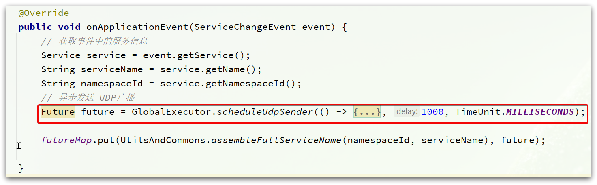


源码总结
--------

Nacos 服务注册表的结构是怎么样的 ？

Nacos 采用了数据的分级存储模型。最外层的是 namespace，用来隔离环境。然后是 Group，用来对服务分组。接下来就是服务，一个服务包含多个实例，有可能处于不同机房。因此服务下有多个集群，集群下是不同的实例。

对应到 Java 代码中，Nacos 采用了一个多层的 Map。结构为 Map<String,Map<String,Service>>。其中最外层 Map 的 key 就是 namespace，值是一个 Map。内层 Map 的 key 是 group 拼接 serviceName。值是 Serivce 对象。Service 内部都是一个 Map。Key 是集群名称，值是集群对象。集群内部维护了实例的集合。

<br/>

Nacos如何支撑阿里内部数十万服务注册压力？

- 异步处理机制：Nacos 接收到注册请求时，不会立即写数据到注册表，而是将请求服务添加到阻塞队列，然后立即响应客户端。Nacos 通过线程池读取阻塞队列中的任务，实现了实例的异步更新，提高了并发写的能力，避免以为直接写阻塞导致的性能瓶颈。
- 服务实例的持久化和缓存：Nacos 区分临时实例和永久实例。临时实例会被保存在服务端的内部缓存中，不会持久到磁盘；而永久实例不仅保存到注册表中，而且会被持久化到磁盘中。这样设计可以在永久实例下线时，系统能够快速恢复。

<br/>

Nacos如何避免并发读写冲突问题？

首先 Nacos 采用的是异步处理注册请求的方式，当接收到注册写请求后不会同步的写到注册表中，而是添加到阻塞队列。然后通过单线程的线程池获取任务，异步的完成注册表的更新。这种提升了并发写的能力。

其次 Nacos 更新实例时采用的是 CopyOnWrite 的思想。先将旧的一份数据拷贝出来，然后在新的数据上进行更新，添加，删除操作。在更新的过程中，Nacos 还可以读取原有的数据。在更新完成后，将新的实例数据替换成旧的实例数据，从而避免的读写冲突。但是 CopyOnWrite 保证的是数据最终一致性，在更新的过程中 Nacos 读取的还是旧数据。

最后局部加锁避免冲突：在添加实例时，Nacos 会对单个服务加锁，而不是对整个注册表加锁。这种局部加锁的方式避免了不同服务之间的并发写冲突，可以使多个服务并行执行注册操作。

<br/>

Nacos 与 Eureka 有什么相同点和不同点？

Nacos 与 Eureka 都支持服务注册与发现，都通过心跳来检测服务实例的健康状态。

不同点：

Nacos 将服务实例分为临时实例和非临时实例。临时实例采用心跳模式，检测不正常会被剔除。非临时实例采用主动检测模式，检测不正常不会被剔除，但是会被标记为不健康。Eureka 只支持临时模式，并通过心跳机制来判断服务实例的健康状态，当连续检测到几次心跳未接收则默认服务实例下线。

Nacos 支持定时拉取服务和主动推送变更消息两种模式，服务列表更新更及时。Eureka 只支持定时拉取。

Nacos 集群默认采用 AP 高可用方式，但集群存在非临时实例时，采用 CP 强一致模式；Eureka 采用 AP 高可用方式。

Nacos 还支持配置中心，Eureka 只有注册中心。

<br/>

# Sentinel源码分析

## 1.Sentinel的基本概念

Sentinel实现限流、隔离、降级、熔断等功能，本质要做的就是两件事情：

- 统计数据：统计某个资源的访问数据（QPS、RT等信息）
- 规则判断：判断限流规则、隔离规则、降级规则、熔断规则是否满足


这里的**资源**就是希望被Sentinel保护的业务，例如项目中定义的controller方法就是默认被Sentinel保护的资源。


### 1.1.ProcessorSlotChain

实现上述功能的核心骨架是一个叫做ProcessorSlotChain的类。这个类基于责任链模式来设计，将不同的功能（限流、降级、系统保护）封装为一个个的Slot，请求进入后逐个执行即可。


其工作流如图：


责任链中的Slot也分为两大类：

- 统计数据构建部分（statistic）
  - NodeSelectorSlot：负责构建簇点链路中的节点（DefaultNode），将这些节点形成链路树
  - ClusterBuilderSlot：负责构建某个资源的ClusterNode，ClusterNode可以保存资源的运行信息（响应时间、QPS、block 数目、线程数、异常数等）以及来源信息（origin名称）
  - StatisticSlot：负责统计实时调用数据，包括运行信息、来源信息等
- 规则判断部分（rule checking）
  - AuthoritySlot：负责授权规则（来源控制）
  - SystemSlot：负责系统保护规则
  - ParamFlowSlot：负责热点参数限流规则
  - FlowSlot：负责限流规则
  - DegradeSlot：负责降级规则


### 1.2.Node

Sentinel 中的簇点链路是由一个个的 Node 组成的，Node 是一个接口，包括下面的实现：


所有的节点都可以记录对资源的访问统计数据，所以都是 StatisticNode 的子类。

按照作用分为两类Node：

- DefaultNode：代表链路树中的每一个资源，一个资源出现在不同链路中时，会创建不同的DefaultNode节点。而树的入口节点叫EntranceNode，是一种特殊的DefaultNode
- ClusterNode：代表资源，一个资源不管出现在多少链路中，只会有一个ClusterNode。记录的是当前资源被访问的所有统计数据之和。


DefaultNode 记录的是资源在当前链路中的访问数据，用来实现基于链路模式的限流规则。ClusterNode 记录的是资源在所有链路中的访问数据，实现默认模式、关联模式的限流规则。


例如：我们在一个SpringMVC项目中，有两个业务：

- 业务1：controller中的资源`/order/query`访问了service中的资源`/goods`
- 业务2：controller中的资源`/order/save`访问了service中的资源`/goods`

创建的链路图如下：

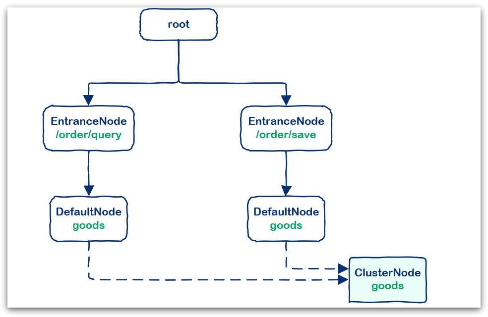


### 1.3.Entry

默认情况下，Sentinel会将controller中的方法作为被保护资源，那么问题来了，我们该如何将自己的一段代码标记为一个Sentinel的资源呢？

Sentinel中的资源用Entry来表示。声明Entry的API示例：

```java
// 资源名可使用任意有业务语义的字符串，比如方法名、接口名或其它可唯一标识的字符串。
try (Entry entry = SphU.entry("resourceName")) {
  // 被保护的业务逻辑
  // do something here...
} catch (BlockException ex) {
  // 资源访问阻止，被限流或被降级
  // 在此处进行相应的处理操作
}
```


### 1.3.1.自定义资源

例如，我们在order-service服务中，将`OrderService`的`queryOrderById()`方法标记为一个资源。

1）首先在order-service中引入sentinel依赖

```xml
<!--sentinel-->
<dependency>
    <groupId>com.alibaba.cloud</groupId>
    <artifactId>spring-cloud-starter-alibaba-sentinel</artifactId>
</dependency>
```

2）然后配置Sentinel地址

```yaml
spring:
  cloud:
    sentinel:
      transport:
        dashboard: localhost:8089 # 这里我的sentinel用了8089的端口
```

3）修改OrderService类的queryOrderById方法

代码这样来实现：

```java
public Order queryOrderById(Long orderId) {
    // 创建Entry，标记资源，资源名为resource1
    try (Entry entry = SphU.entry("resource1")) {
        // 1.查询订单，这里是假数据
        Order order = Order.build(101L, 4999L, "小米 MIX4", 1, 1L, null);
        // 2.查询用户，基于Feign的远程调用
        User user = userClient.findById(order.getUserId());
        // 3.设置
        order.setUser(user);
        // 4.返回
        return order;
    }catch (BlockException e){
        log.error("被限流或降级", e);
        return null;
    }
}
```


4）访问

打开浏览器，访问order服务：http://localhost:8080/order/101

然后打开sentinel控制台，查看簇点链路：

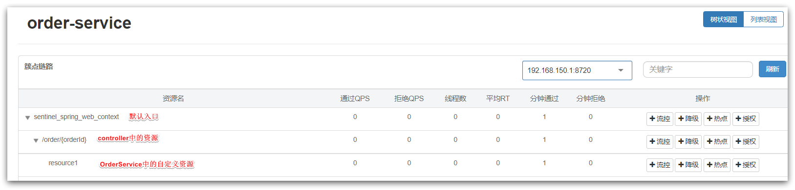


### 1.3.2.基于注解标记资源

在之前学习Sentinel的时候，我们知道可以通过给方法添加@SentinelResource注解的形式来标记资源。


这个是怎么实现的呢？

来看下我们引入的Sentinel依赖包：

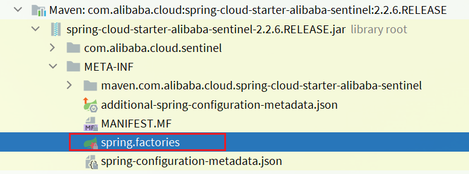

其中的spring.factories声明需要就是自动装配的配置类，内容如下：

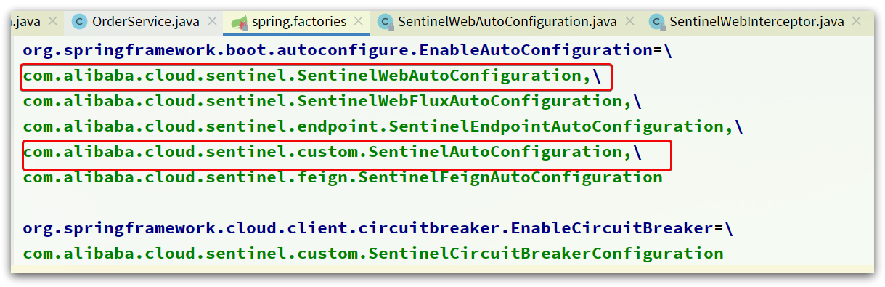

我们来看下`SentinelAutoConfiguration`这个类：

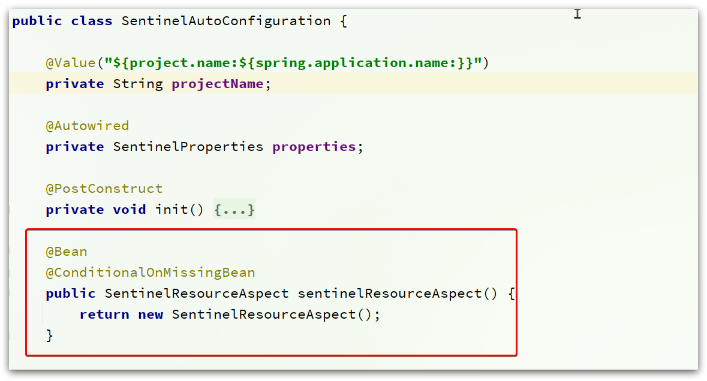

可以看到，在这里声明了一个Bean，`SentinelResourceAspect`：

```java
/**
 * Aspect for methods with {@link SentinelResource} annotation.
 *
 * @author Eric Zhao
 */
@Aspect
public class SentinelResourceAspect extends AbstractSentinelAspectSupport {
	// 切点是添加了 @SentinelResource注解的类
    @Pointcut("@annotation(com.alibaba.csp.sentinel.annotation.SentinelResource)")
    public void sentinelResourceAnnotationPointcut() {
    }
	
    // 环绕增强
    @Around("sentinelResourceAnnotationPointcut()")
    public Object invokeResourceWithSentinel(ProceedingJoinPoint pjp) throws Throwable {
        // 获取受保护的方法
        Method originMethod = resolveMethod(pjp);
		// 获取 @SentinelResource注解
        SentinelResource annotation = originMethod.getAnnotation(SentinelResource.class);
        if (annotation == null) {
            // Should not go through here.
            throw new IllegalStateException("Wrong state for SentinelResource annotation");
        }
        // 获取注解上的资源名称
        String resourceName = getResourceName(annotation.value(), originMethod);
        EntryType entryType = annotation.entryType();
        int resourceType = annotation.resourceType();
        Entry entry = null;
        try {
            // 创建资源 Entry
            entry = SphU.entry(resourceName, resourceType, entryType, pjp.getArgs());
            // 执行受保护的方法
            Object result = pjp.proceed();
            return result;
        } catch (BlockException ex) {
            return handleBlockException(pjp, annotation, ex);
        } catch (Throwable ex) {
            Class<? extends Throwable>[] exceptionsToIgnore = annotation.exceptionsToIgnore();
            // The ignore list will be checked first.
            if (exceptionsToIgnore.length > 0 && exceptionBelongsTo(ex, exceptionsToIgnore)) {
                throw ex;
            }
            if (exceptionBelongsTo(ex, annotation.exceptionsToTrace())) {
                traceException(ex);
                return handleFallback(pjp, annotation, ex);
            }

            // No fallback function can handle the exception, so throw it out.
            throw ex;
        } finally {
            if (entry != null) {
                entry.exit(1, pjp.getArgs());
            }
        }
    }
}

```


简单来说，@SentinelResource注解就是一个标记，而Sentinel基于AOP思想，对被标记的方法做环绕增强，完成资源（`Entry`）的创建。


### 1.4.Context

上一节，我们发现簇点链路中除了controller方法、service方法两个资源外，还多了一个默认的入口节点：

sentinel_spring_web_context，是一个EntranceNode类型的节点

这个节点是在初始化Context的时候由Sentinel帮我们创建的。

### 1.4.1.什么是Context

那么，什么是Context呢？

- Context 代表调用链路上下文，贯穿一次调用链路中的所有资源（ `Entry`），基于ThreadLocal。
- Context 维持着入口节点（`entranceNode`）、本次调用链路的 curNode（当前资源节点）、调用来源（`origin`）等信息。
- 后续的Slot都可以通过Context拿到DefaultNode或者ClusterNode，从而获取统计数据，完成规则判断
- Context初始化的过程中，会创建EntranceNode，contextName就是EntranceNode的名称


对应的API如下：

```java
// 创建context，包含两个参数：context名称、 来源名称
ContextUtil.enter("contextName", "originName");
```


### 1.4.2.Context的初始化

那么这个Context又是在何时完成初始化的呢？

#### 1.4.2.1.自动装配

来看下我们引入的Sentinel依赖包：


其中的spring.factories声明需要就是自动装配的配置类，内容如下：


我们先看SentinelWebAutoConfiguration这个类：

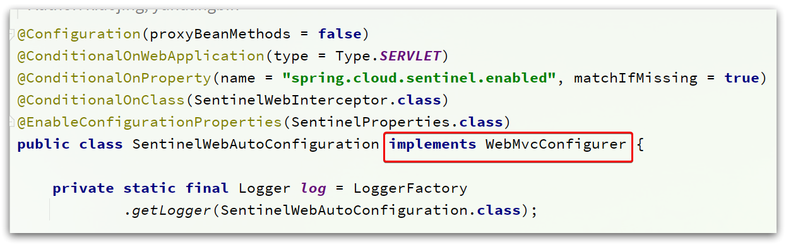

这个类实现了WebMvcConfigurer，我们知道这个是SpringMVC自定义配置用到的类，可以配置HandlerInterceptor：

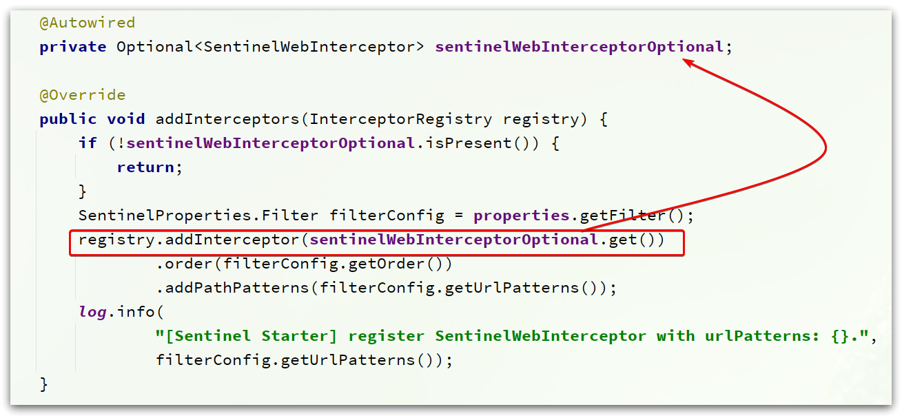

可以看到这里配置了一个`SentinelWebInterceptor`的拦截器。

`SentinelWebInterceptor`的声明如下：

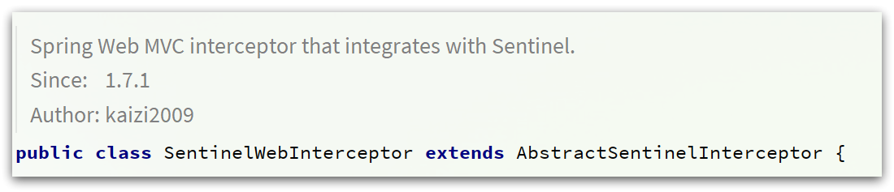

发现它继承了`AbstractSentinelInterceptor`这个类。

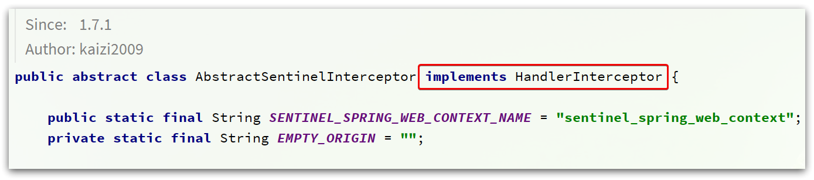


`HandlerInterceptor`拦截器会拦截一切进入controller的方法，执行`preHandle`前置拦截方法，而Context的初始化就是在这里完成的。


#### 1.4.2.2.AbstractSentinelInterceptor

`HandlerInterceptor`拦截器会拦截一切进入controller的方法，执行`preHandle`前置拦截方法，而Context的初始化就是在这里完成的。

我们来看看这个类的`preHandle`实现：

```java
@Override
public boolean preHandle(HttpServletRequest request, HttpServletResponse response, Object handler)
    throws Exception {
    try {
        // 获取资源名称，一般是controller方法的@RequestMapping路径，例如/order/{orderId}
        String resourceName = getResourceName(request);
        if (StringUtil.isEmpty(resourceName)) {
            return true;
        }
        // 从request中获取请求来源，将来做 授权规则 判断时会用
        String origin = parseOrigin(request);
        
        // 获取 contextName，默认是sentinel_spring_web_context
        String contextName = getContextName(request);
        // 创建 Context
        ContextUtil.enter(contextName, origin);
        // 创建资源，名称就是当前请求的controller方法的映射路径
        Entry entry = SphU.entry(resourceName, ResourceTypeConstants.COMMON_WEB, EntryType.IN);
        request.setAttribute(baseWebMvcConfig.getRequestAttributeName(), entry);
        return true;
    } catch (BlockException e) {
        try {
            handleBlockException(request, response, e);
        } finally {
            ContextUtil.exit();
        }
        return false;
    }
}
```


#### 1.4.2.3.ContextUtil

创建Context的方法就是` ContextUtil.enter(contextName, origin);`

我们进入该方法：

```java
public static Context enter(String name, String origin) {
    if (Constants.CONTEXT_DEFAULT_NAME.equals(name)) {
        throw new ContextNameDefineException(
            "The " + Constants.CONTEXT_DEFAULT_NAME + " can't be permit to defined!");
    }
    return trueEnter(name, origin);
}
```

进入`trueEnter`方法：

```java
protected static Context trueEnter(String name, String origin) {
    // 尝试获取context
    Context context = contextHolder.get();
    // 判空
    if (context == null) {
        // 如果为空，开始初始化
        Map<String, DefaultNode> localCacheNameMap = contextNameNodeMap;
        // 尝试获取入口节点
        DefaultNode node = localCacheNameMap.get(name);
        if (node == null) {
            LOCK.lock();
            try {
                node = contextNameNodeMap.get(name);
                if (node == null) {
                    // 入口节点为空，初始化入口节点 EntranceNode
                    node = new EntranceNode(new StringResourceWrapper(name, EntryType.IN), null);
                    // 添加入口节点到 ROOT
                    Constants.ROOT.addChild(node);
                    // 将入口节点放入缓存
                    Map<String, DefaultNode> newMap = new HashMap<>(contextNameNodeMap.size() + 1);
                    newMap.putAll(contextNameNodeMap);
                    newMap.put(name, node);
                    contextNameNodeMap = newMap;
                }
            } finally {
                LOCK.unlock();
            }
        }
        // 创建Context，参数为：入口节点 和 contextName
        context = new Context(node, name);
        // 设置请求来源 origin
        context.setOrigin(origin);
        // 放入ThreadLocal
        contextHolder.set(context);
    }
    // 返回
    return context;
}
```


## 2.ProcessorSlotChain执行流程

接下来我们跟踪源码，验证下ProcessorSlotChain的执行流程。

### 2.1.入口

首先，回到一切的入口，`AbstractSentinelInterceptor`类的`preHandle`方法：


还有，`SentinelResourceAspect`的环绕增强方法：

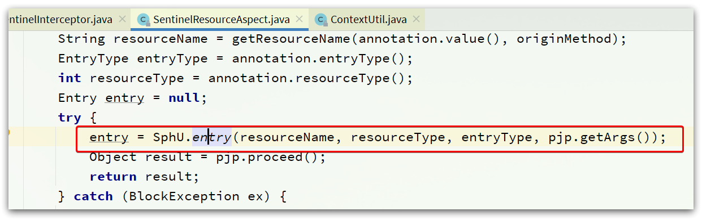


可以看到，任何一个资源必定要执行`SphU.entry()`这个方法:

```java
public static Entry entry(String name, int resourceType, EntryType trafficType, Object[] args)
    throws BlockException {
    return Env.sph.entryWithType(name, resourceType, trafficType, 1, args);
}
```

继续进入`Env.sph.entryWithType(name, resourceType, trafficType, 1, args);`：

```java
@Override
public Entry entryWithType(String name, int resourceType, EntryType entryType, int count, boolean prioritized,
                           Object[] args) throws BlockException {
    // 将 资源名称等基本信息 封装为一个 StringResourceWrapper对象
    StringResourceWrapper resource = new StringResourceWrapper(name, entryType, resourceType);
    // 继续
    return entryWithPriority(resource, count, prioritized, args);
}
```

进入`entryWithPriority`方法：

```java
private Entry entryWithPriority(ResourceWrapper resourceWrapper, int count, boolean prioritized, Object... args)
    throws BlockException {
    // 获取 Context
    Context context = ContextUtil.getContext();

    if (context == null) {
        // Using default context.
        context = InternalContextUtil.internalEnter(Constants.CONTEXT_DEFAULT_NAME);
    }
、	// 获取 Slot执行链，同一个资源，会创建一个执行链，放入缓存
    ProcessorSlot<Object> chain = lookProcessChain(resourceWrapper);

	// 创建 Entry，并将 resource、chain、context 记录在 Entry中
    Entry e = new CtEntry(resourceWrapper, chain, context);
    try {
        // 执行 slotChain
        chain.entry(context, resourceWrapper, null, count, prioritized, args);
    } catch (BlockException e1) {
        e.exit(count, args);
        throw e1;
    } catch (Throwable e1) {
        // This should not happen, unless there are errors existing in Sentinel internal.
        RecordLog.info("Sentinel unexpected exception", e1);
    }
    return e;
}
```


在这段代码中，会获取`ProcessorSlotChain`对象，然后基于chain.entry()开始执行slotChain中的每一个Slot.  而这里创建的是其实现类：DefaultProcessorSlotChain.

获取ProcessorSlotChain以后会保存到一个Map中，key是ResourceWrapper，值是ProcessorSlotChain.

所以，**一个资源只会有一个ProcessorSlotChain**.


### 2.2.DefaultProcessorSlotChain

我们进入DefaultProcessorSlotChain的entry方法：

```java
@Override
public void entry(Context context, ResourceWrapper resourceWrapper, Object t, int count, boolean prioritized, Object... args)
    throws Throwable {
    // first，就是责任链中的第一个 slot
    first.transformEntry(context, resourceWrapper, t, count, prioritized, args);
}
```

这里的first，类型是AbstractLinkedProcessorSlot：

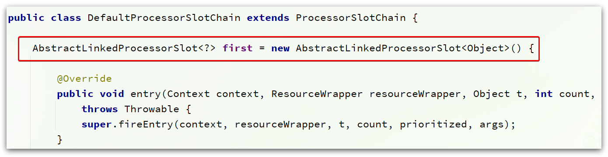

看下继承关系：

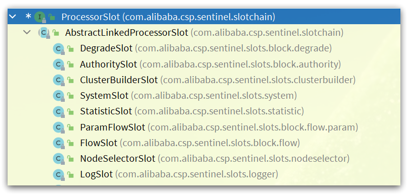


因此，first一定是这些实现类中的一个，按照最早讲的责任链顺序，first应该就是 `NodeSelectorSlot`。


不过，既然是基于责任链模式，所以这里只要记住下一个slot就可以了，也就是next：

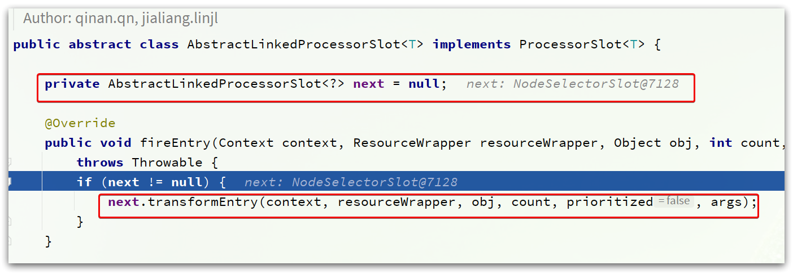

next确实是NodeSelectSlot类型。


而NodeSelectSlot的next一定是ClusterBuilderSlot，依次类推：


责任链就建立起来了。


### 2.3.NodeSelectorSlot

NodeSelectorSlot负责构建簇点链路中的节点（DefaultNode），将这些节点形成链路树。

核心代码：

```java
@Override
public void entry(Context context, ResourceWrapper resourceWrapper, Object obj, int count, boolean prioritized, Object... args)
    throws Throwable {
  	// 尝试获取 当前资源的 DefaultNode
    DefaultNode node = map.get(context.getName());
    if (node == null) {
        synchronized (this) {
            node = map.get(context.getName());
            if (node == null) {
                // 如果为空，为当前资源创建一个新的 DefaultNode
                node = new DefaultNode(resourceWrapper, null);
                HashMap<String, DefaultNode> cacheMap = new HashMap<String, DefaultNode>(map.size());
                cacheMap.putAll(map);
                // 放入缓存中，注意这里的 key是contextName，
                // 这样不同链路进入相同资源，就会创建多个 DefaultNode
                cacheMap.put(context.getName(), node);
                map = cacheMap;
                // 当前节点加入上一节点的 child中，这样就构成了调用链路树
                ((DefaultNode) context.getLastNode()).addChild(node);
            }

        }
    }
	// context中的curNode（当前节点）设置为新的 node
    context.setCurNode(node);
    // 执行下一个 slot
    fireEntry(context, resourceWrapper, node, count, prioritized, args);
}
```


这个Slot完成了这么几件事情：

- 为当前资源创建 DefaultNode
- 将DefaultNode放入缓存中，key是contextName，这样不同链路入口的请求，将会创建多个DefaultNode，相同链路则只有一个DefaultNode
- 将当前资源的DefaultNode设置为上一个资源的childNode
- 将当前资源的DefaultNode设置为Context中的curNode（当前节点）


下一个slot，就是ClusterBuilderSlot


### 2.4.ClusterBuilderSlot

ClusterBuilderSlot负责构建某个资源的ClusterNode，核心代码：

```java
@Override
public void entry(Context context, ResourceWrapper resourceWrapper, DefaultNode node,
                  int count, boolean prioritized, Object... args)
    throws Throwable {
    // 判空，注意ClusterNode是共享的成员变量，也就是说一个资源只有一个ClusterNode，与链路无关
    if (clusterNode == null) {
        synchronized (lock) {
            if (clusterNode == null) {
                // 创建 cluster node.
                clusterNode = new ClusterNode(resourceWrapper.getName(), resourceWrapper.getResourceType());
                HashMap<ResourceWrapper, ClusterNode> newMap = new HashMap<>(Math.max(clusterNodeMap.size(), 16));
                newMap.putAll(clusterNodeMap);
                // 放入缓存，可以是nodeId，也就是resource名称
                newMap.put(node.getId(), clusterNode);
                clusterNodeMap = newMap;
            }
        }
    }
    // 将资源的 DefaultNode与 ClusterNode关联
    node.setClusterNode(clusterNode);
	// 记录请求来源 origin 将 origin放入 entry
    if (!"".equals(context.getOrigin())) {
        Node originNode = node.getClusterNode().getOrCreateOriginNode(context.getOrigin());
        context.getCurEntry().setOriginNode(originNode);
    }
	// 继续下一个slot
    fireEntry(context, resourceWrapper, node, count, prioritized, args);
}
```


### 2.5.StatisticSlot

StatisticSlot负责统计实时调用数据，包括运行信息（访问次数、线程数）、来源信息等。

StatisticSlot是实现限流的关键，其中基于**滑动时间窗口算法**维护了计数器，统计进入某个资源的请求次数。

核心代码：

```java
@Override
public void entry(Context context, ResourceWrapper resourceWrapper, DefaultNode node, 
                  int count, boolean prioritized, Object... args) throws Throwable {
    try {
        // 放行到下一个 slot，做限流、降级等判断
        fireEntry(context, resourceWrapper, node, count, prioritized, args);

        // 请求通过了, 线程计数器 +1 ，用作线程隔离
        node.increaseThreadNum();
        // 请求计数器 +1 用作限流
        node.addPassRequest(count);

        if (context.getCurEntry().getOriginNode() != null) {
            // 如果有 origin，来源计数器也都要 +1
            context.getCurEntry().getOriginNode().increaseThreadNum();
            context.getCurEntry().getOriginNode().addPassRequest(count);
        }

        if (resourceWrapper.getEntryType() == EntryType.IN) {
            // 如果是入口资源，还要给全局计数器 +1.
            Constants.ENTRY_NODE.increaseThreadNum();
            Constants.ENTRY_NODE.addPassRequest(count);
        }

        // 请求通过后的回调.
        for (ProcessorSlotEntryCallback<DefaultNode> handler : StatisticSlotCallbackRegistry.getEntryCallbacks()) {
            handler.onPass(context, resourceWrapper, node, count, args);
        }
    } catch (Throwable e) {
        // 各种异常处理就省略了。。。
        context.getCurEntry().setError(e);

        throw e;
    }
}
```


另外，需要注意的是，所有的计数+1动作都包括两部分，以` node.addPassRequest(count);`为例：

```java
@Override
public void addPassRequest(int count) {
    // DefaultNode的计数器，代表当前链路的 计数器
    super.addPassRequest(count);
    // ClusterNode计数器，代表当前资源的 总计数器
    this.clusterNode.addPassRequest(count);
}
```

具体计数方式，我们后续再看。

接下来，进入规则校验的相关slot了，依次是：

- AuthoritySlot：负责授权规则（来源控制）
- SystemSlot：负责系统保护规则
- ParamFlowSlot：负责热点参数限流规则
- FlowSlot：负责限流规则
- DegradeSlot：负责降级规则


### 2.6.AuthoritySlot

负责请求来源origin的授权规则判断，如图：

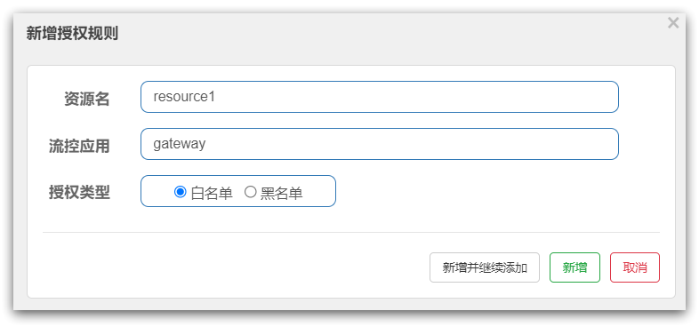

核心API：

```java
@Override
public void entry(Context context, ResourceWrapper resourceWrapper, DefaultNode node, int count, boolean prioritized, Object... args)
    throws Throwable {
    // 校验黑白名单
    checkBlackWhiteAuthority(resourceWrapper, context);
    // 进入下一个 slot
    fireEntry(context, resourceWrapper, node, count, prioritized, args);
}
```

黑白名单校验的逻辑：

```java
void checkBlackWhiteAuthority(ResourceWrapper resource, Context context) throws AuthorityException {
    // 获取授权规则
    Map<String, Set<AuthorityRule>> authorityRules = AuthorityRuleManager.getAuthorityRules();

    if (authorityRules == null) {
        return;
    }

    Set<AuthorityRule> rules = authorityRules.get(resource.getName());
    if (rules == null) {
        return;
    }
	// 遍历规则并判断
    for (AuthorityRule rule : rules) {
        if (!AuthorityRuleChecker.passCheck(rule, context)) {
            // 规则不通过，直接抛出异常
            throw new AuthorityException(context.getOrigin(), rule);
        }
    }
}
```

再看下`AuthorityRuleChecker.passCheck(rule, context)`方法：

```java
static boolean passCheck(AuthorityRule rule, Context context) {
    // 得到请求来源 origin
    String requester = context.getOrigin();

    // 来源为空，或者规则为空，都直接放行
    if (StringUtil.isEmpty(requester) || StringUtil.isEmpty(rule.getLimitApp())) {
        return true;
    }

    // rule.getLimitApp()得到的就是 白名单 或 黑名单 的字符串，这里先用 indexOf方法判断
    int pos = rule.getLimitApp().indexOf(requester);
    boolean contain = pos > -1;

    if (contain) {
        // 如果包含 origin，还要进一步做精确判断，把名单列表以","分割，逐个判断
        boolean exactlyMatch = false;
        String[] appArray = rule.getLimitApp().split(",");
        for (String app : appArray) {
            if (requester.equals(app)) {
                exactlyMatch = true;
                break;
            }
        }
        contain = exactlyMatch;
    }
	// 如果是黑名单，并且包含origin，则返回false
    int strategy = rule.getStrategy();
    if (strategy == RuleConstant.AUTHORITY_BLACK && contain) {
        return false;
    }
	// 如果是白名单，并且不包含origin，则返回false
    if (strategy == RuleConstant.AUTHORITY_WHITE && !contain) {
        return false;
    }
	// 其它情况返回true
    return true;
}
```


### 2.7.SystemSlot

SystemSlot是对系统保护的规则校验：

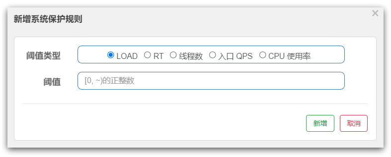

核心API：

```java
@Override
public void entry(Context context, ResourceWrapper resourceWrapper, DefaultNode node, 
                  int count,boolean prioritized, Object... args) throws Throwable {
    // 系统规则校验
    SystemRuleManager.checkSystem(resourceWrapper);
    // 进入下一个 slot
    fireEntry(context, resourceWrapper, node, count, prioritized, args);
}
```

来看下`SystemRuleManager.checkSystem(resourceWrapper);`的代码：

```java
public static void checkSystem(ResourceWrapper resourceWrapper) throws BlockException {
    if (resourceWrapper == null) {
        return;
    }
    // Ensure the checking switch is on.
    if (!checkSystemStatus.get()) {
        return;
    }

    // 只针对入口资源做校验，其它直接返回
    if (resourceWrapper.getEntryType() != EntryType.IN) {
        return;
    }

    // 全局 QPS校验
    double currentQps = Constants.ENTRY_NODE == null ? 0.0 : Constants.ENTRY_NODE.successQps();
    if (currentQps > qps) {
        throw new SystemBlockException(resourceWrapper.getName(), "qps");
    }

    // 全局 线程数 校验
    int currentThread = Constants.ENTRY_NODE == null ? 0 : Constants.ENTRY_NODE.curThreadNum();
    if (currentThread > maxThread) {
        throw new SystemBlockException(resourceWrapper.getName(), "thread");
    }
	// 全局平均 RT校验
    double rt = Constants.ENTRY_NODE == null ? 0 : Constants.ENTRY_NODE.avgRt();
    if (rt > maxRt) {
        throw new SystemBlockException(resourceWrapper.getName(), "rt");
    }

    // 全局 系统负载 校验
    if (highestSystemLoadIsSet && getCurrentSystemAvgLoad() > highestSystemLoad) {
        if (!checkBbr(currentThread)) {
            throw new SystemBlockException(resourceWrapper.getName(), "load");
        }
    }

    // 全局 CPU使用率 校验
    if (highestCpuUsageIsSet && getCurrentCpuUsage() > highestCpuUsage) {
        throw new SystemBlockException(resourceWrapper.getName(), "cpu");
    }
}
```


### 2.8.ParamFlowSlot

ParamFlowSlot就是热点参数限流，如图：

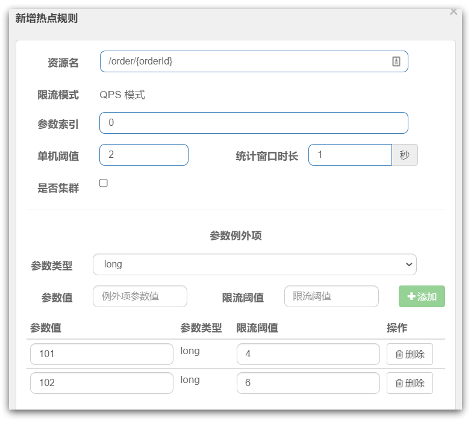

是针对进入资源的请求，针对不同的请求参数值分别统计QPS的限流方式。

- 这里的单机阈值，就是最大令牌数量：maxCount

- 这里的统计窗口时长，就是统计时长：duration

含义是每隔duration时间长度内，最多生产maxCount个令牌，上图配置的含义是每1秒钟生产2个令牌。


核心API：

```java
@Override
public void entry(Context context, ResourceWrapper resourceWrapper, DefaultNode node,
                  int count, boolean prioritized, Object... args) throws Throwable {
    // 如果没有设置热点规则，直接放行
    if (!ParamFlowRuleManager.hasRules(resourceWrapper.getName())) {
        fireEntry(context, resourceWrapper, node, count, prioritized, args);
        return;
    }
	// 热点规则判断
    checkFlow(resourceWrapper, count, args);
    // 进入下一个 slot
    fireEntry(context, resourceWrapper, node, count, prioritized, args);
}
```


### 2.8.1.令牌桶

热点规则判断采用了令牌桶算法来实现参数限流，为每一个不同参数值设置令牌桶，Sentinel的令牌桶有两部分组成：

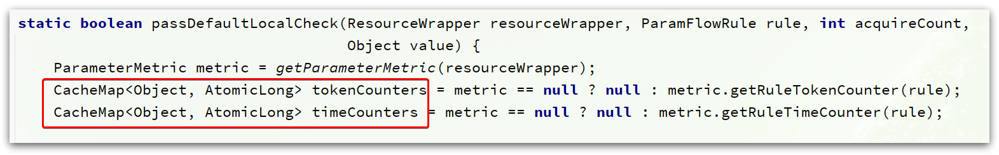

这两个Map的key都是请求的参数值，value却不同，其中：

- tokenCounters：用来记录剩余令牌数量
- timeCounters：用来记录上一个请求的时间


当一个携带参数的请求到来后，基本判断流程是这样的：

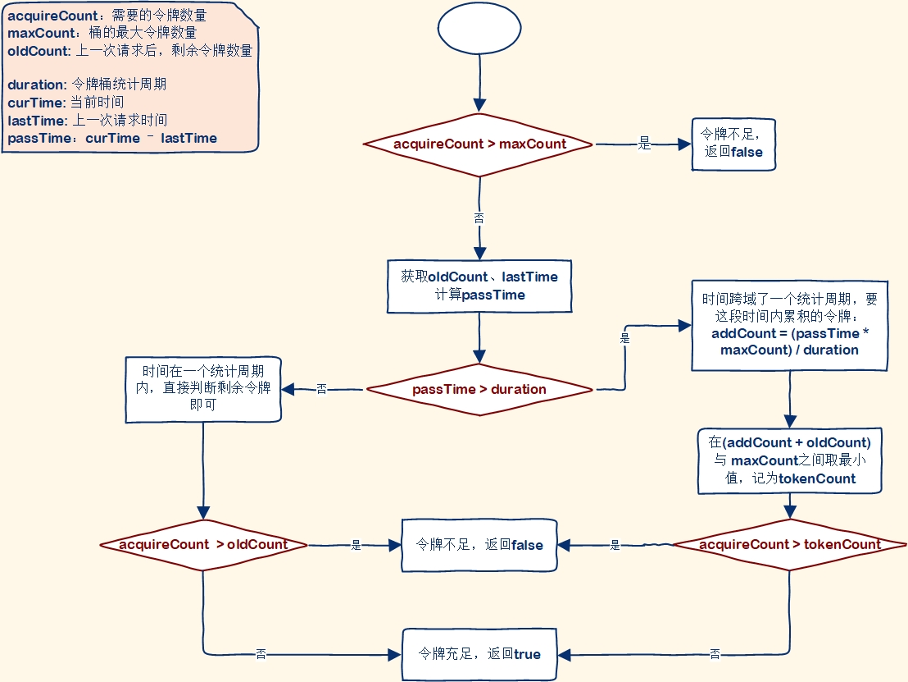


### 2.9.FlowSlot

FlowSlot是负责限流规则的判断，如图：

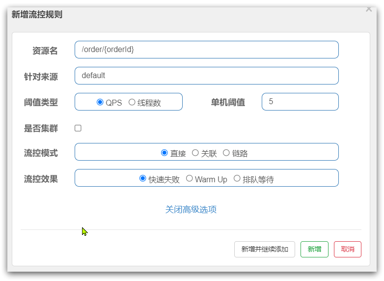

包括：

- 三种流控模式：直接模式、关联模式、链路模式
- 三种流控效果：快速失败、warm up、排队等待


三种流控模式，从底层**数据统计**角度，分为两类：

- 对进入资源的所有请求（ClusterNode）做限流统计：直接模式、关联模式
- 对进入资源的部分链路（DefaultNode）做限流统计：链路模式


三种流控效果，从**限流算法**来看，分为两类：

- 滑动时间窗口算法：快速失败、warm up
- 漏桶算法：排队等待效果


### 2.9.1.核心流程

核心API如下：

```java
@Override
public void entry(Context context, ResourceWrapper resourceWrapper, DefaultNode node, int count,
                  boolean prioritized, Object... args) throws Throwable {
    // 限流规则检测
    checkFlow(resourceWrapper, context, node, count, prioritized);
	// 放行
    fireEntry(context, resourceWrapper, node, count, prioritized, args);
}
```

checkFlow方法：

```java
void checkFlow(ResourceWrapper resource, Context context, DefaultNode node, int count, boolean prioritized)
    throws BlockException {
    // checker是 FlowRuleChecker 类的一个对象
    checker.checkFlow(ruleProvider, resource, context, node, count, prioritized);
}
```

跟入FlowRuleChecker：

```java
public void checkFlow(Function<String, Collection<FlowRule>> ruleProvider, 
                      ResourceWrapper resource,Context context, DefaultNode node,
                      int count, boolean prioritized) throws BlockException {
        if (ruleProvider == null || resource == null) {
            return;
        }
        // 获取当前资源的所有限流规则
        Collection<FlowRule> rules = ruleProvider.apply(resource.getName());
        if (rules != null) {
            for (FlowRule rule : rules) {
                // 遍历，逐个规则做校验
                if (!canPassCheck(rule, context, node, count, prioritized)) {
                    throw new FlowException(rule.getLimitApp(), rule);
                }
            }
        }
    }
```


这里的FlowRule就是限流规则接口，其中的几个成员变量，刚好对应表单参数：

```java
public class FlowRule extends AbstractRule {
    /**
     * 阈值类型 (0: 线程, 1: QPS).
     */
    private int grade = RuleConstant.FLOW_GRADE_QPS;
    /**
     * 阈值.
     */
    private double count;
    /**
     * 三种限流模式.
     *
     * {@link RuleConstant#STRATEGY_DIRECT} 直连模式;
     * {@link RuleConstant#STRATEGY_RELATE} 关联模式;
     * {@link RuleConstant#STRATEGY_CHAIN} 链路模式.
     */
    private int strategy = RuleConstant.STRATEGY_DIRECT;
    /**
     * 关联模式关联的资源名称.
     */
    private String refResource;
    /**
     * 3种流控效果.
     * 0. 快速失败, 1. warm up, 2. 排队等待, 3. warm up + 排队等待
     */
    private int controlBehavior = RuleConstant.CONTROL_BEHAVIOR_DEFAULT;
	// 预热时长
    private int warmUpPeriodSec = 10;
    /**
     * 队列最大等待时间.
     */
    private int maxQueueingTimeMs = 500;
    // 。。。 略
}
```


校验的逻辑定义在`FlowRuleChecker`的`canPassCheck`方法中：

```java
public boolean canPassCheck(/*@NonNull*/ FlowRule rule, Context context, DefaultNode node, int acquireCount,
                            boolean prioritized) {
    // 获取限流资源名称
    String limitApp = rule.getLimitApp();
    if (limitApp == null) {
        return true;
    }
	// 校验规则
    return passLocalCheck(rule, context, node, acquireCount, prioritized);
}
```

进入`passLocalCheck()`：

```java
private static boolean passLocalCheck(FlowRule rule, Context context, DefaultNode node,
                                      int acquireCount,  boolean prioritized) {
    // 基于限流模式判断要统计的节点， 
    // 如果是直连模式，关联模式，对ClusterNode统计，如果是链路模式，则对DefaultNode统计
    Node selectedNode = selectNodeByRequesterAndStrategy(rule, context, node);
    if (selectedNode == null) {
        return true;
    }
	// 判断规则
    return rule.getRater().canPass(selectedNode, acquireCount, prioritized);
}
```


这里对规则的判断先要通过`FlowRule#getRater()`获取流量控制器`TrafficShapingController`，然后再做限流。

而`TrafficShapingController`有3种实现：

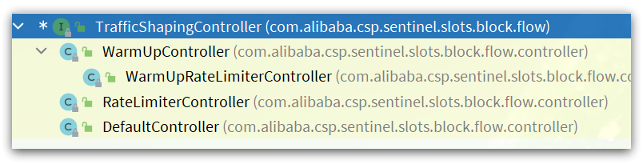

- DefaultController：快速失败，默认的方式，基于滑动时间窗口算法
- WarmUpController：预热模式，基于滑动时间窗口算法，只不过阈值是动态的
- RateLimiterController：排队等待模式，基于漏桶算法


最终的限流判断都在TrafficShapingController的canPass方法中。


### 2.9.2.滑动时间窗口

滑动时间窗口的功能分两部分来看：

- 一是时间区间窗口的QPS计数功能，这个是在StatisticSlot中调用的
- 二是对滑动窗口内的时间区间窗口QPS累加，这个是在FlowRule中调用的


先来看时间区间窗口的QPS计数功能。

#### 2.9.2.1.时间窗口请求量统计

回顾2.5章节中的StatisticSlot部分，有这样一段代码：


就是在统计通过该节点的QPS，我们跟入看看，这里进入了DefaultNode内部：

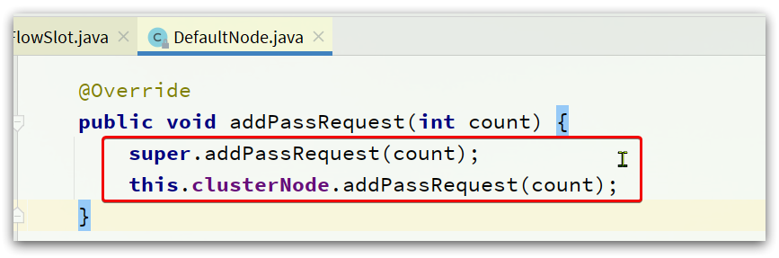

发现同时对`DefaultNode`和`ClusterNode`在做QPS统计，我们知道`DefaultNode`和`ClusterNode`都是`StatisticNode`的子类，这里调用`addPassRequest()`方法，最终都会进入`StatisticNode`中。

随便跟入一个：

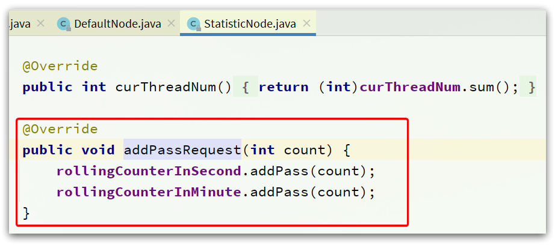

这里有秒、分两种纬度的统计，对应两个计数器。找到对应的成员变量，可以看到：

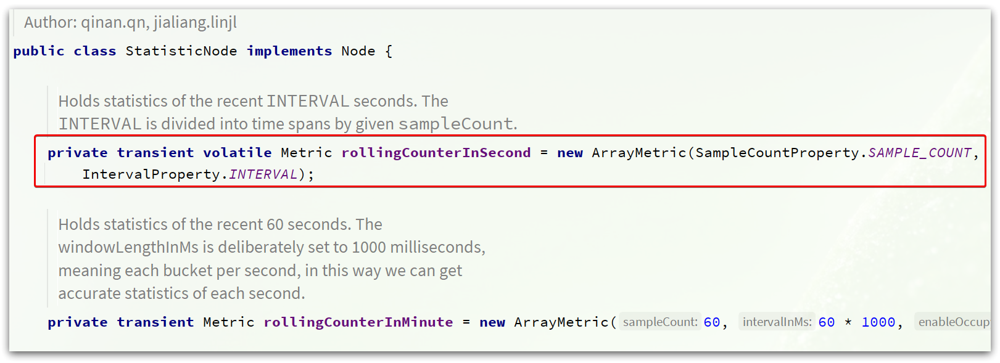

两个计数器都是ArrayMetric类型，并且传入了两个参数：

```java
// intervalInMs：是滑动窗口的时间间隔，默认为 1 秒
// sampleCount: 时间窗口的分隔数量，默认为 2，就是把 1秒分为 2个小时间窗
public ArrayMetric(int sampleCount, int intervalInMs) {
    this.data = new OccupiableBucketLeapArray(sampleCount, intervalInMs);
}
```

如图：

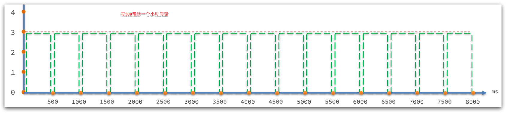


接下来，我们进入`ArrayMetric`类的`addPass`方法：

```java
@Override
public void addPass(int count) {
    // 获取当前时间所在的时间窗
    WindowWrap<MetricBucket> wrap = data.currentWindow();
    // 计数器 +1
    wrap.value().addPass(count);
}
```


那么，计数器如何知道当前所在的窗口是哪个呢？

这里的data是一个LeapArray：

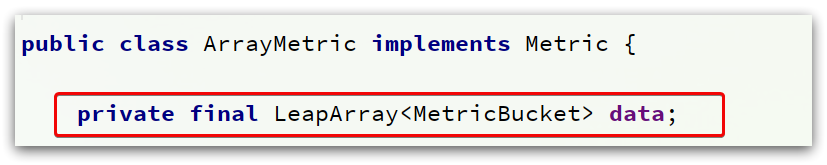

LeapArray的四个属性：

```java
public abstract class LeapArray<T> {
    // 小窗口的时间长度，默认是500ms ，值 = intervalInMs / sampleCount
    protected int windowLengthInMs;
    // 滑动窗口内的 小窗口 数量，默认为 2
    protected int sampleCount;
    // 滑动窗口的时间间隔，默认为 1000ms
    protected int intervalInMs;
    // 滑动窗口的时间间隔，单位为秒，默认为 1
    private double intervalInSecond;
}
```


LeapArray是一个环形数组，因为时间是无限的，数组长度不可能无限，因此数组中每一个格子放入一个时间窗（window），当数组放满后，角标归0，覆盖最初的window。

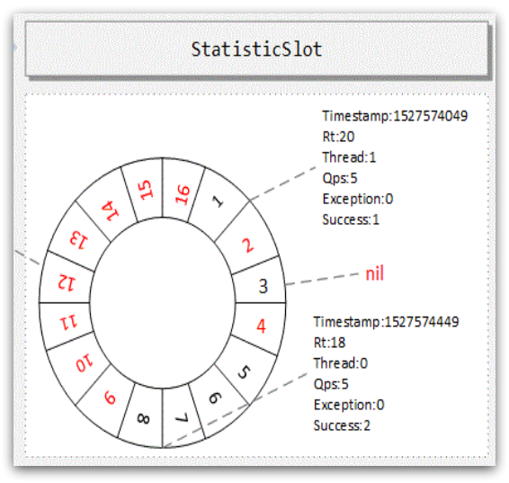

因为滑动窗口最多分成sampleCount数量的小窗口，因此数组长度只要大于sampleCount，那么最近的一个滑动窗口内的2个小窗口就永远不会被覆盖，就不用担心旧数据被覆盖的问题了。


我们跟入` data.currentWindow();`方法：

```java
public WindowWrap<T> currentWindow(long timeMillis) {
    if (timeMillis < 0) {
        return null;
    }
	// 计算当前时间对应的数组角标
    int idx = calculateTimeIdx(timeMillis);
    // 计算当前时间所在窗口的开始时间.
    long windowStart = calculateWindowStart(timeMillis);

    /*
         * 先根据角标获取数组中保存的 oldWindow 对象，可能是旧数据，需要判断.
         *
         * (1) oldWindow 不存在, 说明是第一次，创建新 window并存入，然后返回即可
         * (2) oldWindow的 starTime = 本次请求的 windowStar, 说明正是要找的窗口，直接返回.
         * (3) oldWindow的 starTime < 本次请求的 windowStar, 说明是旧数据，需要被覆盖，创建 
         *     新窗口，覆盖旧窗口
         */
    while (true) {
        WindowWrap<T> old = array.get(idx);
        if (old == null) {
            // 创建新 window
            WindowWrap<T> window = new WindowWrap<T>(windowLengthInMs, windowStart, newEmptyBucket(timeMillis));
            // 基于CAS写入数组，避免线程安全问题
            if (array.compareAndSet(idx, null, window)) {
                // 写入成功，返回新的 window
                return window;
            } else {
                // 写入失败，说明有并发更新，等待其它人更新完成即可
                Thread.yield();
            }
        } else if (windowStart == old.windowStart()) {
            return old;
        } else if (windowStart > old.windowStart()) {
            if (updateLock.tryLock()) {
                try {
                    // 获取并发锁，覆盖旧窗口并返回
                    return resetWindowTo(old, windowStart);
                } finally {
                    updateLock.unlock();
                }
            } else {
                // 获取锁失败，等待其它线程处理就可以了
                Thread.yield();
            }
        } else if (windowStart < old.windowStart()) {
            // 这种情况不应该存在，写这里只是以防万一。
            return new WindowWrap<T>(windowLengthInMs, windowStart, newEmptyBucket(timeMillis));
        }
    }
}
```


找到当前时间所在窗口（WindowWrap）后，只要调用WindowWrap对象中的add方法，计数器+1即可。

这里只负责统计每个窗口的请求量，不负责拦截。限流拦截要看FlowSlot中的逻辑。


#### 2.9.2.2.滑动窗口QPS计算

在2.9.1小节我们讲过，FlowSlot的限流判断最终都由`TrafficShapingController`接口中的`canPass`方法来实现。该接口有三个实现类：

- DefaultController：快速失败，默认的方式，基于滑动时间窗口算法
- WarmUpController：预热模式，基于滑动时间窗口算法，只不过阈值是动态的
- RateLimiterController：排队等待模式，基于漏桶算法


因此，我们跟入默认的DefaultController中的canPass方法来分析：

```java
@Override
public boolean canPass(Node node, int acquireCount, boolean prioritized) {
    // 计算目前为止滑动窗口内已经存在的请求量
    int curCount = avgUsedTokens(node);
    // 判断：已使用请求量 + 需要的请求量（1） 是否大于 窗口的请求阈值
    if (curCount + acquireCount > count) {
        // 大于，说明超出阈值，返回false
        if (prioritized && grade == RuleConstant.FLOW_GRADE_QPS) {
            long currentTime;
            long waitInMs;
            currentTime = TimeUtil.currentTimeMillis();
            waitInMs = node.tryOccupyNext(currentTime, acquireCount, count);
            if (waitInMs < OccupyTimeoutProperty.getOccupyTimeout()) {
                node.addWaitingRequest(currentTime + waitInMs, acquireCount);
                node.addOccupiedPass(acquireCount);
                sleep(waitInMs);

                // PriorityWaitException indicates that the request will pass after waiting for {@link @waitInMs}.
                throw new PriorityWaitException(waitInMs);
            }
        }
        return false;
    }
    // 小于等于，说明在阈值范围内，返回true
    return true;
}
```


因此，判断的关键就是`int curCount = avgUsedTokens(node);`

```java
private int avgUsedTokens(Node node) {
    if (node == null) {
        return DEFAULT_AVG_USED_TOKENS;
    }
    return grade == RuleConstant.FLOW_GRADE_THREAD ? node.curThreadNum() : (int)(node.passQps());
}
```

因为我们采用的是限流，走`node.passQps()`逻辑：

```java
// 这里又进入了 StatisticNode类
@Override
public double passQps() {
    // 请求量 ÷ 滑动窗口时间间隔 ，得到的就是QPS
    return rollingCounterInSecond.pass() / rollingCounterInSecond.getWindowIntervalInSec();
}
```

那么`rollingCounterInSecond.pass()`是如何得到请求量的呢？

```java
// rollingCounterInSecond 本质是ArrayMetric，之前说过
@Override
public long pass() {
    // 获取当前窗口
    data.currentWindow();
    long pass = 0;
    // 获取 当前时间的 滑动窗口范围内 的所有小窗口
    List<MetricBucket> list = data.values();
	// 遍历
    for (MetricBucket window : list) {
        // 累加求和
        pass += window.pass();
    }
    // 返回
    return pass;
}
```

来看看`data.values()`如何获取 滑动窗口范围内 的所有小窗口：

```java
// 此处进入LeapArray类中：

public List<T> values(long timeMillis) {
    if (timeMillis < 0) {
        return new ArrayList<T>();
    }
    // 创建空集合，大小等于 LeapArray长度
    int size = array.length();
    List<T> result = new ArrayList<T>(size);
	// 遍历 LeapArray
    for (int i = 0; i < size; i++) {
        // 获取每一个小窗口
        WindowWrap<T> windowWrap = array.get(i);
        // 判断这个小窗口是否在 滑动窗口时间范围内（1秒内）
        if (windowWrap == null || isWindowDeprecated(timeMillis, windowWrap)) {
            // 不在范围内，则跳过
            continue;
        }
        // 在范围内，则添加到集合中
        result.add(windowWrap.value());
    }
    // 返回集合
    return result;
}
```

那么，`isWindowDeprecated(timeMillis, windowWrap)`又是如何判断窗口是否符合要求呢？

```java
public boolean isWindowDeprecated(long time, WindowWrap<T> windowWrap) {
    // 当前时间 - 窗口开始时间  是否大于 滑动窗口的最大间隔（1秒）
    // 也就是说，我们要统计的时 距离当前时间1秒内的 小窗口的 count之和
    return time - windowWrap.windowStart() > intervalInMs;
}
```


### 2.9.3.漏桶

上一节我们讲过，FlowSlot的限流判断最终都由`TrafficShapingController`接口中的`canPass`方法来实现。该接口有三个实现类：

- DefaultController：快速失败，默认的方式，基于滑动时间窗口算法
- WarmUpController：预热模式，基于滑动时间窗口算法，只不过阈值是动态的
- RateLimiterController：排队等待模式，基于漏桶算法


因此，我们跟入默认的RateLimiterController中的canPass方法来分析：

```java
@Override
public boolean canPass(Node node, int acquireCount, boolean prioritized) {
    // Pass when acquire count is less or equal than 0.
    if (acquireCount <= 0) {
        return true;
    }
    // 阈值小于等于 0 ，阻止请求
    if (count <= 0) {
        return false;
    }
	// 获取当前时间
    long currentTime = TimeUtil.currentTimeMillis();
    // 计算两次请求之间允许的最小时间间隔
    long costTime = Math.round(1.0 * (acquireCount) / count * 1000);

    // 计算本次请求 允许执行的时间点 = 最近一次请求的可执行时间 + 两次请求的最小间隔
    long expectedTime = costTime + latestPassedTime.get();
	// 如果允许执行的时间点小于当前时间，说明可以立即执行
    if (expectedTime <= currentTime) {
        // 更新上一次的请求的执行时间
        latestPassedTime.set(currentTime);
        return true;
    } else {
        // 不能立即执行，需要计算 预期等待时长
        // 预期等待时长 = 两次请求的最小间隔 +最近一次请求的可执行时间 - 当前时间
        long waitTime = costTime + latestPassedTime.get() - TimeUtil.currentTimeMillis();
        // 如果预期等待时间超出阈值，则拒绝请求
        if (waitTime > maxQueueingTimeMs) {
            return false;
        } else {
            // 预期等待时间小于阈值，更新最近一次请求的可执行时间，加上costTime
            long oldTime = latestPassedTime.addAndGet(costTime);
            try {
                // 保险起见，再判断一次预期等待时间，是否超过阈值
                waitTime = oldTime - TimeUtil.currentTimeMillis();
                if (waitTime > maxQueueingTimeMs) {
                    // 如果超过，则把刚才 加 的时间再 减回来
                    latestPassedTime.addAndGet(-costTime);
                    // 拒绝
                    return false;
                }
                // in race condition waitTime may <= 0
                if (waitTime > 0) {
                    // 预期等待时间在阈值范围内，休眠要等待的时间，醒来后继续执行
                    Thread.sleep(waitTime);
                }
                return true;
            } catch (InterruptedException e) {
            }
        }
    }
    return false;
}
```


与我们之前分析的漏桶算法基本一致：

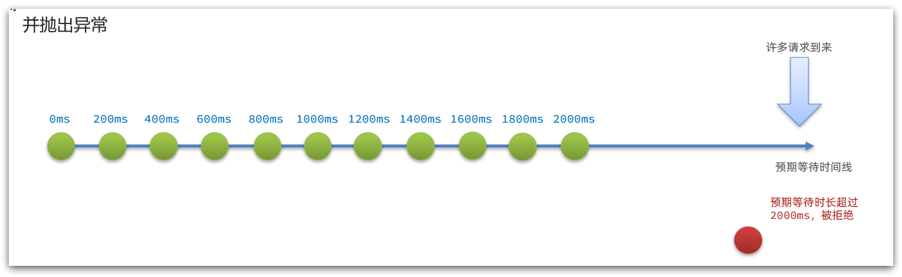


### 2.10.DegradeSlot

最后一关，就是降级规则判断了。

Sentinel的降级是基于状态机来实现的：

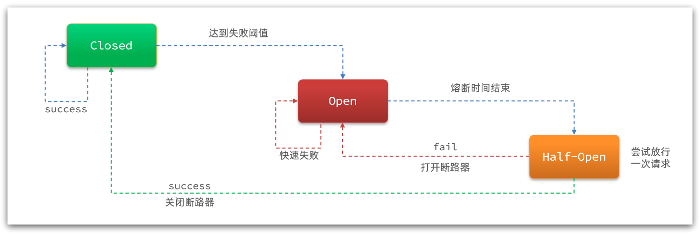


对应的实现在DegradeSlot类中，核心API：

```java
@Override
public void entry(Context context, ResourceWrapper resourceWrapper, DefaultNode node, 
                  int count, boolean prioritized, Object... args) throws Throwable {
    // 熔断降级规则判断
    performChecking(context, resourceWrapper);
	// 继续下一个slot
    fireEntry(context, resourceWrapper, node, count, prioritized, args);
}
```

继续进入`performChecking`方法：

```java
void performChecking(Context context, ResourceWrapper r) throws BlockException {
    // 获取当前资源上的所有的断路器 CircuitBreaker
    List<CircuitBreaker> circuitBreakers = DegradeRuleManager.getCircuitBreakers(r.getName());
    if (circuitBreakers == null || circuitBreakers.isEmpty()) {
        return;
    }
    for (CircuitBreaker cb : circuitBreakers) {
        // 遍历断路器，逐个判断
        if (!cb.tryPass(context)) {
            throw new DegradeException(cb.getRule().getLimitApp(), cb.getRule());
        }
    }
}
```


### 2.10.1.CircuitBreaker

我们进入CircuitBreaker的tryPass方法中：

```java
@Override
public boolean tryPass(Context context) {
    // 判断状态机状态
    if (currentState.get() == State.CLOSED) {
        // 如果是closed状态，直接放行
        return true;
    }
    if (currentState.get() == State.OPEN) {
        // 如果是OPEN状态，断路器打开
        // 继续判断OPEN时间窗是否结束，如果是则把状态从OPEN切换到 HALF_OPEN，返回true
        return retryTimeoutArrived() && fromOpenToHalfOpen(context);
    }
    // OPEN状态，并且时间窗未到，返回false
    return false;
}
```

有关时间窗的判断在`retryTimeoutArrived()`方法：

```java
protected boolean retryTimeoutArrived() {
    // 当前时间 大于 下一次 HalfOpen的重试时间
    return TimeUtil.currentTimeMillis() >= nextRetryTimestamp;
}
```

OPEN到HALF_OPEN切换在`fromOpenToHalfOpen(context)`方法：

```java
protected boolean fromOpenToHalfOpen(Context context) {
    // 基于CAS修改状态，从 OPEN到 HALF_OPEN
    if (currentState.compareAndSet(State.OPEN, State.HALF_OPEN)) {
        // 状态变更的事件通知
        notifyObservers(State.OPEN, State.HALF_OPEN, null);
        // 得到当前资源
        Entry entry = context.getCurEntry();
        // 给资源设置监听器，在资源Entry销毁时（资源业务执行完毕时）触发
        entry.whenTerminate(new BiConsumer<Context, Entry>() {
            @Override
            public void accept(Context context, Entry entry) {
                // 判断 资源业务是否异常
                if (entry.getBlockError() != null) {
                    // 如果异常，则再次进入OPEN状态
                    currentState.compareAndSet(State.HALF_OPEN, State.OPEN);
                    notifyObservers(State.HALF_OPEN, State.OPEN, 1.0d);
                }
            }
        });
        return true;
    }
    return false;
}
```


这里出现了从OPEN到HALF_OPEN、从HALF_OPEN到OPEN的变化，但是还有几个没有：

- 从CLOSED到OPEN
- 从HALF_OPEN到CLOSED

### 2.10.2.触发断路器

请求经过所有插槽 后，一定会执行exit方法，而在DegradeSlot的exit方法中：

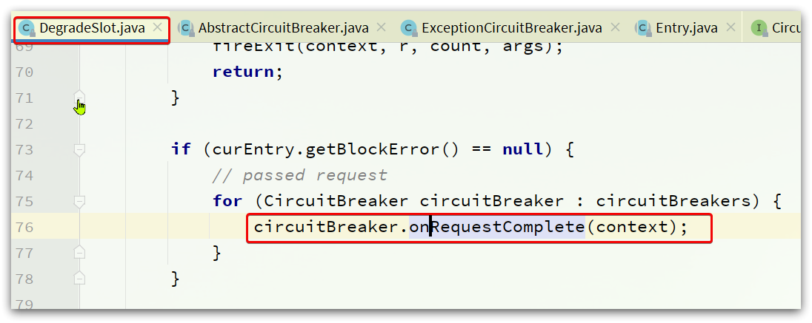

会调用CircuitBreaker的onRequestComplete方法。而CircuitBreaker有两个实现：

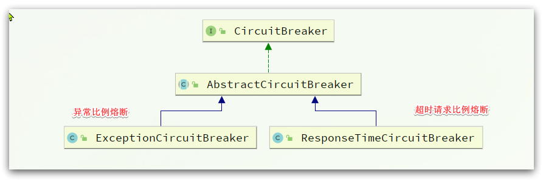


我们这里以异常比例熔断为例来看，进入`ExceptionCircuitBreaker`的`onRequestComplete`方法：

```java
@Override
public void onRequestComplete(Context context) {
    // 获取资源 Entry
    Entry entry = context.getCurEntry();
    if (entry == null) {
        return;
    }
    // 尝试获取 资源中的 异常
    Throwable error = entry.getError();
    // 获取计数器，同样采用了滑动窗口来计数
    SimpleErrorCounter counter = stat.currentWindow().value();
    if (error != null) {
        // 如果出现异常，则 error计数器 +1
        counter.getErrorCount().add(1);
    }
    // 不管是否出现异常，total计数器 +1
    counter.getTotalCount().add(1);
	// 判断异常比例是否超出阈值
    handleStateChangeWhenThresholdExceeded(error);
}
```

来看阈值判断的方法：

```java
private void handleStateChangeWhenThresholdExceeded(Throwable error) {
    // 如果当前已经是OPEN状态，不做处理
    if (currentState.get() == State.OPEN) {
        return;
    }
	// 如果已经是 HALF_OPEN 状态，判断是否需求切换状态
    if (currentState.get() == State.HALF_OPEN) {
        if (error == null) {
            // 没有异常，则从 HALF_OPEN 到 CLOSED
            fromHalfOpenToClose();
        } else {
            // 有一次，再次进入OPEN
            fromHalfOpenToOpen(1.0d);
        }
        return;
    }
	// 说明当前是CLOSE状态，需要判断是否触发阈值
    List<SimpleErrorCounter> counters = stat.values();
    long errCount = 0;
    long totalCount = 0;
    // 累加计算 异常请求数量、总请求数量
    for (SimpleErrorCounter counter : counters) {
        errCount += counter.errorCount.sum();
        totalCount += counter.totalCount.sum();
    }
    // 如果总请求数量未达到阈值，什么都不做
    if (totalCount < minRequestAmount) {
        return;
    }
    double curCount = errCount;
    if (strategy == DEGRADE_GRADE_EXCEPTION_RATIO) {
        // 计算请求的异常比例
        curCount = errCount * 1.0d / totalCount;
    }
    // 如果比例超过阈值，切换到 OPEN
    if (curCount > threshold) {
        transformToOpen(curCount);
    }
}
```


