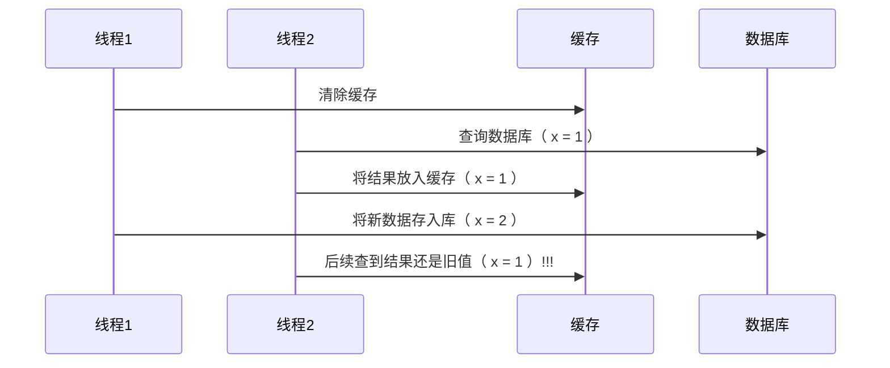
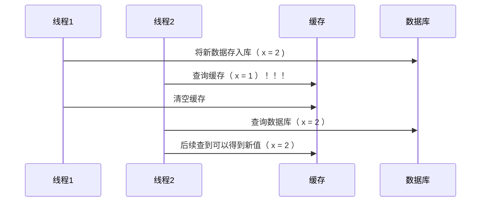
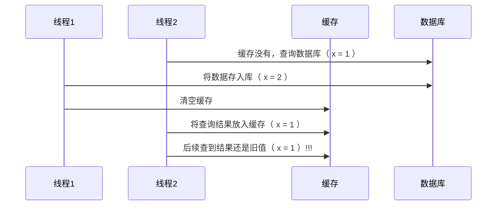

[返回首页](index.md)

#### <font color='green'>* 应用之缓存</font>

##### 缓存更新策略

更新时，是先清缓存还是先更新数据库 

**先清缓存**



**先更新数据库**



<br/>

补充一种情况，假设查询线程 A 查询数据时恰好缓存数据由于时间到期失效，或是第一次查询



> 这种情况的出现几率非常小，见 facebook 论文

##### 读写锁实现一致性缓存

使用读写锁实现一个简单的按需加载缓存,解决在修改数据库和删除缓存之间有数据查询导致数据不准确。

```java
class GenericCachedDao<T> {
    // HashMap 作为缓存非线程安全, 需要保护
    HashMap<SqlPair, T> map = new HashMap<>();
    ReentrantReadWriteLock lock = new ReentrantReadWriteLock(); 
    GenericDao genericDao = new GenericDao();
    public int update(String sql, Object... params) {
        SqlPair key = new SqlPair(sql, params);
        // 加写锁, 防止其它线程对缓存读取和更改
        lock.writeLock().lock();
        try {
            int rows = genericDao.update(sql, params);
            map.clear();
            return rows;
        } finally {
            lock.writeLock().unlock();
        }
    }
    public T queryOne(Class<T> beanClass, String sql, Object... params) {
        SqlPair key = new SqlPair(sql, params);
        // 加读锁, 防止其它线程对缓存更改
        lock.readLock().lock();
        try {
            T value = map.get(key);
            if (value != null) {
                return value;
            }
        } finally {
            lock.readLock().unlock();
        }
        // 加写锁, 防止其它线程对缓存读取和更改
        lock.writeLock().lock();
        try {
            // get 方法上面部分是可能多个线程进来的, 可能已经向缓存填充了数据
            // 为防止重复查询数据库, 再次验证
            T value = map.get(key);
            if (value == null) {
                // 如果没有, 查询数据库
                value = genericDao.queryOne(beanClass, sql, params);
                map.put(key, value);
            }
            return value;
        } finally {
            lock.writeLock().unlock();
        }
    }
    // 作为 key 保证其是不可变的
    class SqlPair {
        private String sql;
        private Object[] params;
        public SqlPair(String sql, Object[] params) {
            this.sql = sql;
            this.params = params;
        }
        @Override
        public boolean equals(Object o) {
            if (this == o) {
                return true;
            }
            if (o == null || getClass() != o.getClass()) {
                return false;
            }
            SqlPair sqlPair = (SqlPair) o;
            return sql.equals(sqlPair.sql) &&
                Arrays.equals(params, sqlPair.params);
        }
        @Override
        public int hashCode() {
            int result = Objects.hash(sql);
            result = 31 * result + Arrays.hashCode(params);
            return result;
        }
    }
}
```

**注意** 

- 以上实现体现的是读写锁的应用，保证缓存和数据库的一致性，但有下面的问题没有考虑 

  - 适合读多写少，如果写操作比较频繁，以上实现性能低 

  - 没有考虑缓存容量 

  - 没有考虑缓存过期 

  - 只适合单机 

  - 并发性还是低，目前只会用一把锁 

  - 更新方法太过简单粗暴，清空了所有 key（考虑按类型分区或重新设计 key） 

- 乐观锁实现：用 CAS 去更新

<br/>

