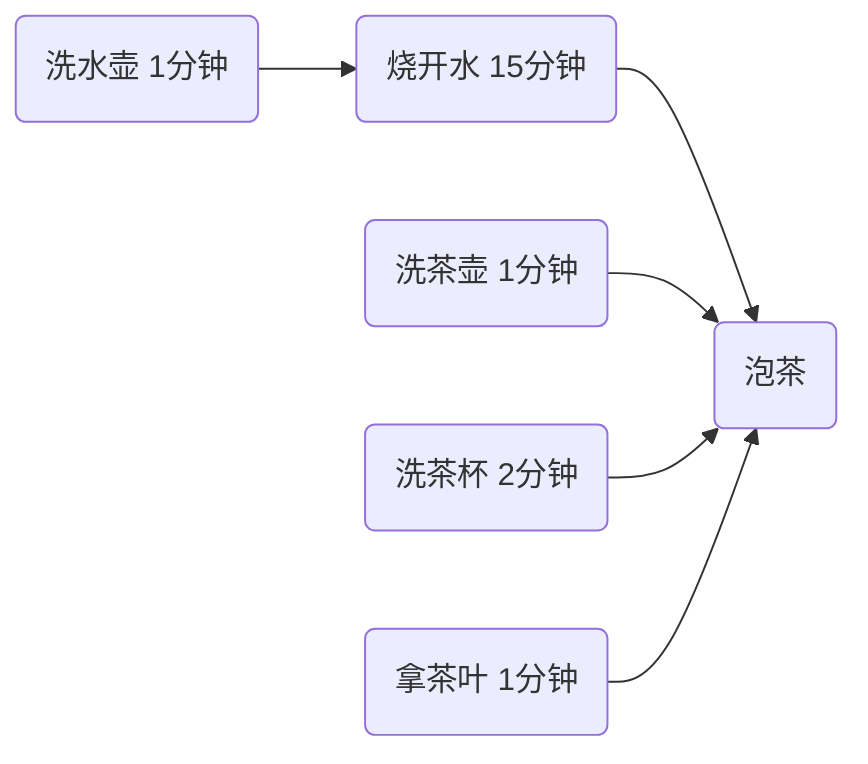
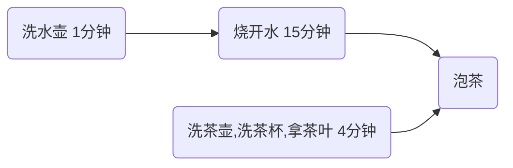

[返回首页](index.md)
#### <font color="green">*应用之统筹</font>

阅读华罗庚《统筹方法》，给出烧水泡茶的多线程解决方案，提示 

- 参考图二，用两个线程（两个人协作）模拟烧水泡茶过程 
  - 文中办法乙、丙都相当于任务串行 
  - 而图一相当于启动了 4 个线程，有点浪费 
- 用 sleep(n) 模拟洗茶壶、洗水壶等耗费的时间

附：华罗庚《统筹方法》

统筹方法，是一种安排工作进程的数学方法。它的实用范围极广泛，在企业管理和基本建设中，以及关系复杂的科研项目的组织与管理中，都可以应用。

怎样应用呢？主要是把工序安排好。

比如，想泡壶茶喝。当时的情况是：开水没有；水壶要洗，茶壶、茶杯要洗；火已生了，茶叶也有了。怎么办？

- 办法甲：洗好水壶，灌上凉水，放在火上；在等待水开的时间里，洗茶壶、洗茶杯、拿茶叶；等水开了，泡茶喝。
- 办法乙：先做好一些准备工作，洗水壶，洗茶壶茶杯，拿茶叶；一切就绪，灌水烧水；坐待水开了，泡茶喝。
- 办法丙：洗净水壶，灌上凉水，放在火上，坐待水开；水开了之后，急急忙忙找茶叶，洗茶壶茶杯，泡茶喝。

哪一种办法省时间？我们能一眼看出，第一种办法好，后两种办法都窝了工。

这是小事，但这是引子，可以引出生产管理等方面有用的方法来。

水壶不洗，不能烧开水，因而洗水壶是烧开水的前提。没开水、没茶叶、不洗茶壶茶杯，就不能泡茶，因而这些又是泡茶的前提。它们的相互关系，可以用下边的箭头图来表示：



从这个图上可以一眼看出，办法甲总共要16分钟（而办法乙、丙需要20分钟）。如果要缩短工时、提高工作效率，应当主要抓烧开水这个环节，而不是抓拿茶叶等环节。同时，洗茶壶茶杯、拿茶叶总共不过4分钟，大可利用“等水开”的时间来做。

是的，这好像是废话，卑之无甚高论。有如走路要用两条腿走，吃饭要一口一口吃，这些道理谁都懂得。但稍有变化，临事而迷的情况，常常是存在的。在近代工业的错综复杂的工艺过程中，往往就不是像泡茶喝这么简单了。任务多了，几百几千，甚至有好几万个任务。关系多了，错综复杂，千头万绪，往往出现“万事俱备，只欠东风”的情况。由于一两个零件没完成，耽误了一台复杂机器的出厂时间。或往往因为抓的不是关键，连夜三班，急急忙忙，完成这一环节之后，还得等待旁的环节才能装配。

洗茶壶，洗茶杯，拿茶叶，或先或后，关系不大，而且同是一个人的活儿，因而可以合并成为：



看来这是“小题大做”，但在工作环节太多的时候，这样做就非常必要了。

这里讲的主要是时间方面的事，但在具体生产实践中，还有其他方面的许多事。这种方法虽然不一定能直接解决所有问题，但是，我们利用这种方法来考虑问题，也是不无裨益的。

```java
@Slf4j(topic = "c.TestMakeTea")
public class TestMakeTea {

    public static void main(String[] args) {
        Thread t1 = new Thread(() -> {
            log.debug("洗水壶");
            Sleeper.sleep(1);
            log.debug("烧开水");
            Sleeper.sleep(15);
        },"老王");

        Thread t2 = new Thread(() -> {
            log.debug("洗茶壶");
            Sleeper.sleep(1);
            log.debug("洗茶杯");
            Sleeper.sleep(2);
            log.debug("拿茶叶");
            Sleeper.sleep(1);

            try {
                // t2 等待 t1 烧完开水进行泡茶
                t1.join();
            } catch (InterruptedException e) {
                throw new RuntimeException(e);
            }
            log.debug("泡茶");
        },"小王");

        t1.start();
        t2.start();
    }
}
```

输出

```java
01:54:16 [小王] c.TestMakeTea - 洗茶壶
01:54:16 [老王] c.TestMakeTea - 洗水壶
01:54:17 [老王] c.TestMakeTea - 烧开水
01:54:17 [小王] c.TestMakeTea - 洗茶杯
01:54:19 [小王] c.TestMakeTea - 拿茶叶
01:54:32 [小王] c.TestMakeTea - 泡茶
```

缺陷

- 上面模拟的是小王等老王的水烧开了，小王泡茶，如果反过来要实现老王等小王的茶叶拿来了，老王泡茶呢？代码最好能适应两种情况。
- 上面的两个线程其实是各执行各的，如果要模拟老王把水壶交给小王泡茶，或模拟小王把茶叶交给老王泡茶呢
