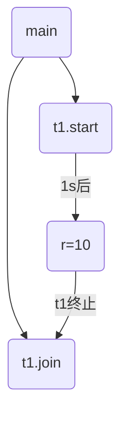

[返回首页](index.md)
### *应用之同步

以调用方角度来讲，如果

- 需要等待结果返回，才能继续运行就是同步 
- 不需要等待结果返回，就能继续运行就是异步

代码实现

```java
@Slf4j(topic = "c.TestPrint")
public class TestPrint {
    static int r = 0;

    public static void main(String[] args) throws InterruptedException {
        Thread t1 = new Thread(()->{
            log.debug("开始");
            sleep(1);
            log.debug("结束");
            r = 10;
        }) ;

        t1.start();
        // t1线程等待主线程执行完 // [!code ++]
        t1.join();     // [!code ++]

        log.debug("结果为:{}", r);
    }
}
```

输出

```java
03:48:38 [Thread-0] c.TestPrint - 开始
03:48:39 [Thread-0] c.TestPrint - 结束
03:48:39 [main] c.TestPrint - 结果为:10
```

流程图



<br/>


### 应用之异步调用

以调用方角度来讲，如果

- 需要等待结果返回，才能继续运行就是同步
- 不需要等待结果返回，就能继续运行就是异步

<br/>

多线程可以让方法执行变为异步的（即不要巴巴干等着）比如说读取磁盘文件时，假设读取操作花费了 5 秒钟，如果没有线程调度机制，这 5 秒 cpu 什么都做不了，其它代码都得暂停。

```java
package org.itcast.applicayion;

import lombok.extern.slf4j.Slf4j;
import org.itcast.util.Constants;
import org.itcast.util.FileReader;

import java.io.IOException;
import java.util.concurrent.CompletableFuture;
import java.util.concurrent.ExecutorService;
import java.util.concurrent.Executors;

/**
 * 同步和异步的区别
 *      需要等待结果返回就是同步，不需要等待结果返回就是异步
 */
@Slf4j(topic = "c.TestASync")
public class TestASync {
    public static void main(String[] args) throws IOException {
        // 普通实现
        test1();

        // 线程实现
        test2();

        // 线程池实现
        test3();

        // CompletableFuture实现
        test4();
    }

    private static void test1() {
        FileReader.read(Constants.MP4_FULL_PATH);
        log.debug("do other things ...");
    }

    private static void test2() {
        new Thread(() -> FileReader.read(Constants.MP4_FULL_PATH)).start();
        log.debug("do other things ...");
    }

    private static void test3() {
        ExecutorService service = Executors.newFixedThreadPool(1);
        service.execute(() -> FileReader.read(Constants.MP4_FULL_PATH));
        log.debug("do other things");
    }

    private static void test4() throws IOException {
        CompletableFuture.runAsync(() -> FileReader.read(Constants.MP4_FULL_PATH));
        log.debug("do other things");
        System.in.read();
    }
}

```

输出：没有使用线程时，方法的调用是同步的

```sh
15:18:55 [main] c.FileReader - read [01_什么是jvm.mp4] start ...
15:18:55 [main] c.FileReader - read [01_什么是jvm.mp4] end ... cost: 24 ms
15:18:55 [main] c.TestASync - do other things ...
```

使用了线程以后，方法的调用是异步的。输出

```sh
15:22:03 [main] c.TestASync - do other things ...
15:22:03 [Thread-0] c.FileReader - read [01_什么是jvm.mp4] start ...
15:22:03 [Thread-0] c.FileReader - read [01_什么是jvm.mp4] end ... cost: 36 ms
```

线程池实现输出

```sh
15:23:01 [main] c.TestASync - do other things
15:23:01 [pool-2-thread-1] c.FileReader - read [01_什么是jvm.mp4] start ...
15:23:01 [pool-2-thread-1] c.FileReader - read [01_什么是jvm.mp4] end ... cost: 28 ms
```

CompletableFuture实现输出

```sh
15:23:40 [main] c.TestASync - do other things
15:23:40 [ForkJoinPool.commonPool-worker-1] c.FileReader - read [01_什么是jvm.mp4] start ...
15:23:40 [ForkJoinPool.commonPool-worker-1] c.FileReader - read [01_什么是jvm.mp4] end ... cost: 20 ms
```

<br/>

结论

- 比如在项目中，视频文件需要转换格式等操作比较费时，这时开一个新线程处理视频转换，避免阻塞主线程
- tomcat 的异步 servlet 也是类似的目的，让用户线程处理耗时较长的操作，避免阻塞 tomcat 的工作线程
- ui 程序中，开线程进行其他操作，避免阻塞 ui 线程
