线程基础
========
[返回首页](index.md)

[[toc]]

<br/>

本章内容主要描述了线程与进程的区别，并发和并行的区别，然后从线程拥有的状态开始，开始一步一步介绍线程的使用方法，线程的基础方法，线程如何中断，以及如何相互协作，最后以线程状态之间的转换结尾。

::: details 初始化项目代码

::: code-group

```xml [pom.xml]
<?xml version="1.0" encoding="UTF-8"?>
<project xmlns="http://maven.apache.org/POM/4.0.0"
         xmlns:xsi="http://www.w3.org/2001/XMLSchema-instance"
         xsi:schemaLocation="http://maven.apache.org/POM/4.0.0 http://maven.apache.org/xsd/maven-4.0.0.xsd">
    <modelVersion>4.0.0</modelVersion>

    <groupId>org.example</groupId>
    <artifactId>java-concurrent</artifactId>
    <version>1.0-SNAPSHOT</version>

    <properties>
        <project.build.sourceEncoding>UTF-8</project.build.sourceEncoding>
        <maven.compiler.source>1.8</maven.compiler.source>
        <maven.compiler.target>1.8</maven.compiler.target>
    </properties>

    <dependencies>
        <dependency>
            <groupId>junit</groupId>
            <artifactId>junit</artifactId>
            <version>4.11</version>
            <scope>test</scope>
        </dependency>
        <!-- https://mvnrepository.com/artifact/org.projectlombok/lombok -->
        <dependency>
            <groupId>org.projectlombok</groupId>
            <artifactId>lombok</artifactId>
            <version>1.18.22</version>
            <scope>provided</scope>
        </dependency>
        <dependency>
            <groupId>org.slf4j</groupId>
            <artifactId>slf4j-api</artifactId>
            <version>1.7.22</version>
        </dependency>
        <dependency>
            <groupId>ch.qos.logback</groupId>
            <artifactId>logback-classic</artifactId>
            <version>1.2.3</version>
        </dependency>
        <dependency>
            <groupId>org.junit.jupiter</groupId>
            <artifactId>junit-jupiter</artifactId>
            <version>RELEASE</version>
            <scope>compile</scope>
        </dependency>
        <dependency>
            <groupId>org.openjdk.jol</groupId>
            <artifactId>jol-core</artifactId>
            <version>0.17</version>
        </dependency>
    </dependencies>

</project>
```

```xml [logback.xml]
<?xml version="1.0" encoding="UTF-8"?>
<configuration scan="true">
    <appender name="STDOUT" class="ch.qos.logback.core.ConsoleAppender">
        <encoder>
            <pattern>%date{HH:mm:ss} [%t] %logger - %m%n</pattern>
        </encoder>
    </appender>
    <logger name="c" level="debug" additivity="false">
        <appender-ref ref="STDOUT"/>
    </logger>
    <root level="ERROR">
        <appender-ref ref="STDOUT"/>
    </root>
</configuration>
```

```java [Sleeper]
package org.itcast.util;

import java.util.concurrent.TimeUnit;

/**
 * Sleep的工具类
 */
public class Sleeper {
    public static void sleep(int i) {
        try {
            TimeUnit.SECONDS.sleep(i);
        } catch (InterruptedException e) {
            e.printStackTrace();
        }
    }

    public static void sleep(double i) {
        try {
            TimeUnit.MILLISECONDS.sleep((int) (i * 1000));
        } catch (InterruptedException e) {
            e.printStackTrace();
        }
    }
}
```

```java [Constants]
package org.itcast.util;

/**
 * 视频地址
 */
public interface Constants {
    // todo 视频地址
    String MP4_FULL_PATH = "";
}
```

```java [FileReader]
package org.itcast.util;

import lombok.extern.slf4j.Slf4j;

import java.io.File;
import java.io.FileInputStream;
import java.io.IOException;

@Slf4j(topic = "c.FileReader")
public class FileReader {
    public static void read(String filename) {
        int idx = filename.lastIndexOf(File.separator);
        String shortName = filename.substring(idx + 1);
        try (FileInputStream in = new FileInputStream(filename)) {
            long start = System.currentTimeMillis();
            log.debug("read [{}] start ...", shortName);
            byte[] buf = new byte[1024];
            int n = -1;
            do {
                n = in.read(buf);
            } while (n != -1);
            long end = System.currentTimeMillis();
            log.debug("read [{}] end ... cost: {} ms", shortName, end - start);
        } catch (IOException e) {
            e.printStackTrace();
        }
    }
}
```

:::

基础概念
---------

### 线程和进程

**进程**

- 程序由指令和数据组成，但这些指令要运行，数据要读写，就必须将指令加载至 CPU，数据加载至内存。在指令运行过程中还需要用到磁盘、网络等设备。进程就是用来加载指令、管理内存、管理 IO 的 。
- 当一个程序被运行，从磁盘加载这个程序的代码至内存，这时就开启了一个进程。
- 进程就可以视为程序的一个实例。大部分程序可以同时运行多个实例进程（例如记事本、画图、浏览器 等），也有的程序只能启动一个实例进程（例如网易云音乐、360 安全卫士等）


<br/>

**线程**

- 一个进程之内可以分为一到多个线程。


- 一个线程就是一个指令流，将指令流中的一条条指令以一定的顺序交给 CPU 执行


- Java 中，线程作为最小调度单位，进程作为资源分配的最小单位。 在 windows 中进程是不活动的，只是作 为线程的容器

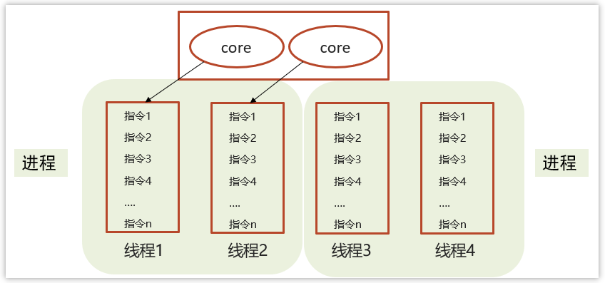

<br/>

**二者对比**

- 进程是正在运行程序的实例，进程中包含了线程，每个线程执行不同的任务
- 不同的进程使用不同的内存空间，在当前进程下的所有线程可以共享内存空间
- 线程更轻量，线程上下文切换成本一般上要比进程上下文切换低

<br/>

:::warning 💡思考：线程和进程的区别

- 进程是正在运行程序的实例，进程中包含了线程，每个线程执行不同的任务。
- 不同的进程使用不同的内存空间，当前进程下的所有线程可以共享内存空间。
- 线程更轻量，线程上下文切换成本比进程上下文切换要低。

:::

<br/>


### 并发与并行

单核CPU

- 单核CPU下线程实际还是串行执行的

- 操作系统中有一个组件叫做任务调度器，将cpu的时间片（windows下时间片最小约为 15 毫秒）分给不同的程序使用，只是由于cpu在线程间（时间片很短）的切换非常快，人类感觉是同时运行的 。

- 总结为一句话就是： 微观串行，宏观并行

一般会将这种线程轮流使用CPU的做法称为并发（concurrent）

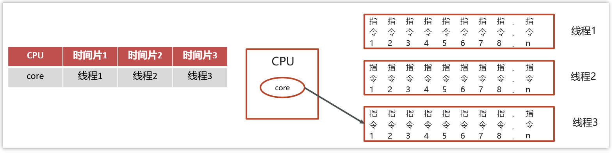

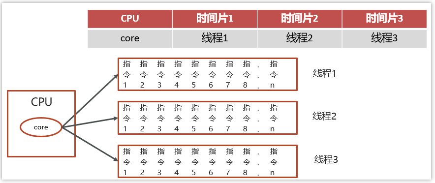

<br/>

**多核CPU**

每个核（core）都可以调度运行线程，这时候线程可以是并行的。

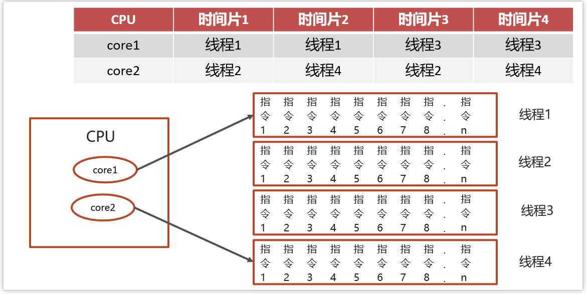

<br/>

- **并发（concurrent）是同一时间应对（dealing with）多件事情的能力**
- **并行（parallel）是同一时间动手做（doing）多件事情的能力**

举例：

- 家庭主妇做饭、打扫卫生、给孩子喂奶，她一个人轮流交替做这多件事，这时就是并发

- 家庭主妇雇了个保姆，她们一起这些事，这时既有并发，也有并行（这时会产生竞争，例如锅只有一口，一个人用锅时，另一个人就得等待）

- 雇了3个保姆，一个专做饭、一个专打扫卫生、一个专喂奶，互不干扰，这时是并行

<br/>

::: warning 💡思考：并行与并发的区别

- 并发是同一时间应对多件事情的能力，一个CPU轮流执行多个线程，在微观上是串行，在宏观上是并行。
- 并行是同一时间处理多件事情的能力，多个CPU同时处理多个线程。

举个例子：食堂一个阿姨给两个队伍同时打饭，就是并发。食堂两个阿姨给两个队伍打饭就是并行

:::

<br/>


### <font color='green'>*应用之异步调用</font>

以调用方角度来讲，如果

- 需要等待结果返回，才能继续运行就是同步
- 不需要等待结果返回，就能继续运行就是异步

<br/>

多线程可以让方法执行变为异步的（即不要巴巴干等着）比如说读取磁盘文件时，假设读取操作花费了 5 秒钟，如果没有线程调度机制，这 5 秒 cpu 什么都做不了，其它代码都得暂停。

```java
package org.itcast.applicayion;

import lombok.extern.slf4j.Slf4j;
import org.itcast.util.Constants;
import org.itcast.util.FileReader;

import java.io.IOException;
import java.util.concurrent.CompletableFuture;
import java.util.concurrent.ExecutorService;
import java.util.concurrent.Executors;

/**
 * 同步和异步的区别
 *      需要等待结果返回就是同步，不需要等待结果返回就是异步
 */
@Slf4j(topic = "c.TestASync")
public class TestASync {
    public static void main(String[] args) throws IOException {
        // 普通实现
        test1();

        // 线程实现
        test2();

        // 线程池实现
        test3();

        // CompletableFuture实现
        test4();
    }

    private static void test1() {
        FileReader.read(Constants.MP4_FULL_PATH);
        log.debug("do other things ...");
    }

    private static void test2() {
        new Thread(() -> FileReader.read(Constants.MP4_FULL_PATH)).start();
        log.debug("do other things ...");
    }

    private static void test3() {
        ExecutorService service = Executors.newFixedThreadPool(1);
        service.execute(() -> FileReader.read(Constants.MP4_FULL_PATH));
        log.debug("do other things");
    }

    private static void test4() throws IOException {
        CompletableFuture.runAsync(() -> FileReader.read(Constants.MP4_FULL_PATH));
        log.debug("do other things");
        System.in.read();
    }
}

```

输出：没有使用线程时，方法的调用是同步的

```sh
15:18:55 [main] c.FileReader - read [01_什么是jvm.mp4] start ...
15:18:55 [main] c.FileReader - read [01_什么是jvm.mp4] end ... cost: 24 ms
15:18:55 [main] c.TestASync - do other things ...
```

使用了线程以后，方法的调用是异步的。输出

```sh
15:22:03 [main] c.TestASync - do other things ...
15:22:03 [Thread-0] c.FileReader - read [01_什么是jvm.mp4] start ...
15:22:03 [Thread-0] c.FileReader - read [01_什么是jvm.mp4] end ... cost: 36 ms
```

线程池实现输出

```sh
15:23:01 [main] c.TestASync - do other things
15:23:01 [pool-2-thread-1] c.FileReader - read [01_什么是jvm.mp4] start ...
15:23:01 [pool-2-thread-1] c.FileReader - read [01_什么是jvm.mp4] end ... cost: 28 ms
```

CompletableFuture实现输出

```sh
15:23:40 [main] c.TestASync - do other things
15:23:40 [ForkJoinPool.commonPool-worker-1] c.FileReader - read [01_什么是jvm.mp4] start ...
15:23:40 [ForkJoinPool.commonPool-worker-1] c.FileReader - read [01_什么是jvm.mp4] end ... cost: 20 ms
```

<br/>

结论

- 比如在项目中，视频文件需要转换格式等操作比较费时，这时开一个新线程处理视频转换，避免阻塞主线程
- tomcat 的异步 servlet 也是类似的目的，让用户线程处理耗时较长的操作，避免阻塞 tomcat 的工作线程
- ui 程序中，开线程进行其他操作，避免阻塞 ui 线程


如何使用线程
------------

### 创建线程的四种方式

创建线程有四种方式，分别为：继承Thread类、实现Runnable接口、实现Callable接口、线程池创建线程。详细参考下面代码

<br/>

#### 继承Thread类

```java
// 创建线程对象
Thread t = new Thread() {
    public void run() {
        // 要执行的任务
    }
};
// 启动线程
t.start();
```

例如：

```java
package org.itcast.thread;

import lombok.extern.slf4j.Slf4j;

/**
 * 继承Thread类
 */
@Slf4j(topic = "c.MyThread")
public class MyThread extends Thread {

    // 继承Thread，重写 run 方法
    @Override
    public void run() {
        log.debug("hello");
    }

    public static void main(String[] args) {
        MyThread t1 = new MyThread();
        MyThread t2 = new MyThread();

        // 设置线程名称
        t1.setName("t1");
        t2.setName("t2");

        // 运行线程
        t1.start();
        t2.start();
    }
}
```

<br/>

**调用run**

```java
package org.itcast.thread;

import lombok.extern.slf4j.Slf4j;
import org.itcast.util.Constants;
import org.itcast.util.FileReader;

/**
 * 测试run方法与start方法区别
 */
@Slf4j(topic = "c.TestRunStart")
public class TestRunStart {
    public static void main(String[] args) {
        Thread t1 = new Thread("t1") {
            @Override
            public void run() {
                log.debug(Thread.currentThread().getName());
                FileReader.read(Constants.MP4_FULL_PATH);
            }
        };

        t1.run();// [!code warning]
        log.debug("do other things");
    }
}
```

输出：程序仍在main线程运行，FileReader.read()方法调用还是同步

```sh
18:03:51 [main] c.Test1 - main
18:03:51 [main] c.FileReader - read [01_什么是jvm.mp4] start ...
18:03:51 [main] c.FileReader - read [01_什么是jvm.mp4] end ... cost: 59 ms
18:03:51 [main] c.Test1 - do other things
```

<br/>

**调用start**

将上述代码的 ` t1.run() ` 改为 `t1.start()`

输出：程序在 t1线程运行， `FileReader.read() `方法调用是异步的

```sh
18:18:17 [main] c.Test1 - do other things
18:18:17 [t1] c.Test1 - t1
18:18:17 [t1] c.FileReader - read [01_什么是jvm.mp4] start ...
18:18:17 [t1] c.FileReader - read [01_什么是jvm.mp4] end ... cost: 20 ms
```

结论

- 直接调用 run 是在主线程中执行了 run，没有启动新的线程 
- 使用 start 是启动新的线程，通过新的线程间接执行 run 中的代码

```java
package org.itcast.thread;

import lombok.extern.slf4j.Slf4j;
import org.itcast.util.Constants;
import org.itcast.util.FileReader;

/**
 * 测试run方法与start方法区别
 */
@Slf4j(topic = "c.TestRunStart")
public class TestRunStart {
    public static void main(String[] args) {
        Thread t1 = new Thread("t1") {
            @Override
            public void run() {
                log.debug(Thread.currentThread().getName());
                FileReader.read(Constants.MP4_FULL_PATH);
            }
        };

        log.debug("t1状态:{}", t1.getState());
        t1.start();
        log.debug("t1状态:{}", t1.getState());
        log.debug("do other things");
    }
}
```

输出：可以看见，start方法创建了一个新线程，将线程从就绪状态切换为Runnable

```sh
18:21:42 [main] c.Test1 - t1状态:NEW
18:21:42 [main] c.Test1 - t1状态:RUNNABLE
18:21:42 [main] c.Test1 - do other things
18:21:42 [t1] c.Test1 - t1
18:21:42 [t1] c.FileReader - read [01_什么是jvm.mp4] start ...
18:21:42 [t1] c.FileReader - read [01_什么是jvm.mp4] end ... cost: 16 ms
```

<br/>

::: warning 💡 run方法和start方法的区别

- start方法：用来启动线程，通过该线程调用run方法，执行run方法中所定义的逻辑代码。start方法只能调用一次。

- run方法：封装了要被线程执行的代码，可以被多次调用，但是不能启动线程。


:::

<br/>

#### 实现Runnable接口

把【线程】和【任务】（要执行的代码）分开

- Thread 代表线程
- Runnable 可运行的任务（线程要执行的代码）

```java
Runnable runnable = new Runnable() {
    public void run(){
        // 要执行的任务
    }
};
// 创建线程对象
Thread t = new Thread( runnable );
// 启动线程
t.start(); 
```

例如：

```java
package org.itcast.thread;

import lombok.extern.slf4j.Slf4j;

/**
 * 实现Runnable接口
 */
@Slf4j(topic = "c.MyRunnable")
public class MyRunnable implements Runnable {
    @Override
    public void run() {
        log.debug("hello");
    }

    public static void main(String[] args) {
        MyRunnable mr = new MyRunnable();
        Thread t1 = new Thread(mr);
        Thread t2 = new Thread(mr);

        // 设置线程名称
        t1.setName("t1");
        t2.setName("t2");

        // 运行线程
        t1.start();
        t2.start();
    }
}
```

<br/>

分析 `Thread` 的源码，理清它与 `Runnable` 的关系

::: code-group

```java [Runnable源码]
/**
 * Runnable源码
 */
@FunctionalInterface
public interface Runnable {
    /**
     * When an object implementing interface Runnable is used
     * to create a thread, starting the thread causes the object's
     * run method to be called in that separately executing thread.
     * 
     * The general contract of the method run is that it may
     * take any action whatsoever.
     *
     */
    public abstract void run();
}
```

```java [Thread源码]
/**
 * Thread源码
 */
public class Thread implements Runnable {
    /* What will be run. */
    private Runnable target;
    
    public Thread(Runnable target) {
        init(null, target, "Thread-" + nextThreadNum(), 0);
    }
    
    private void init(ThreadGroup g, Runnable target, String name,
                      long stackSize, AccessControlContext acc,
                      boolean inheritThreadLocals) {
        //...
        this.target = target;
       //...
    }
  
    @Override
    public void run() {
        if (target != null) {
            target.run();
        }
    }
}
```

:::

<br/>

::: warning 💡 Thread与Runable对比

- 继承Thread类是把线程和任务合并在了一起，实现Runable接口是把线程和任务分开了 
- 用 Runnable 更容易与线程池等高级API 配合 
- 用 Runnable 让任务类脱离了 Thread 继承体系，更灵活

:::

<br/>

#### 实现Callable接口

FutureTask 能够接收 Callable 类型的参数，用来处理有返回结果的情况

```java
// 创建任务对象
FutureTask<Integer> task3 = new FutureTask<>(() -> {
  log.debug("hello");
  return 100;
});

// 参数1 是任务对象; 参数2 是线程名字，推荐
new Thread(task3, "t3").start();

// 主线程阻塞，同步等待 task 执行完毕的结果
Integer result = task3.get();
log.debug("结果是:{}", result);
```

例如

```java
package org.itcast.thread;

import lombok.extern.slf4j.Slf4j;

import java.util.concurrent.Callable;
import java.util.concurrent.FutureTask;

/**
 * 实现Callable接口
 */
@Slf4j(topic = "c.MyCallable")
public class MyCallable implements Callable<String> {
    @Override
    public String call() throws Exception {
        log.debug("callable running...");
        return "hello";
    }

    public static void main(String[] args) throws Exception {
        MyCallable mc = new MyCallable();

        FutureTask<String> ft = new FutureTask<>(mc);

        Thread t1 = new Thread(ft);
        Thread t2 = new Thread(ft);

        // 设置线程名称
        t1.setName("t1");
        t2.setName("t2");

        // 运行线程
        t1.start();
        t2.start();

        // 调用ft的get方法获取执行结果
        String result = ft.get();
        log.debug("result...{}", result);
    }
}
```

分析FutureTask,理清它与Callable之间的关系

::: code-group 

```java [Callable源码]
/**
 * Callable源码
 */
@FunctionalInterface
public interface Callable<V> {
    /**
     * Computes a result, or throws an exception if unable to do so.
     *
     * @return computed result
     * @throws Exception if unable to compute a result
     */
    V call() throws Exception;
}
```

```java [FutureTask源码]
/**
 * FutureTask源码
 */
public class FutureTask<V> implements RunnableFuture<V> {
    /** The underlying callable; nulled out after running */
    private Callable<V> callable;
    
    /** The result to return or exception to throw from get() */
    private Object outcome; // non-volatile, protected by state reads/writes
    
    /**
     * Creates a {@code FutureTask} that will, upon running, execute the
     * given {@code Callable}.
     *
     * @param  callable the callable task
     * @throws NullPointerException if the callable is null
     */
    public FutureTask(Callable<V> callable) {
        if (callable == null)
            throw new NullPointerException();
        this.callable = callable;
        this.state = NEW;       // ensure visibility of callable
    }
  
    public void run() {
        //...
        try {
            Callable<V> c = callable;
            if (c != null && state == NEW) {
                V result;
                boolean ran;
                try {
                    result = c.call();
                    ran = true;
                } catch (Throwable ex) {
                    result = null;
                    ran = false;
                    setException(ex);
                }
                if (ran)
                    set(result);
            }
        }
        //...
    }
    
    protected void set(V v) {
        if (UNSAFE.compareAndSwapInt(this, stateOffset, NEW, COMPLETING)) {
            outcome = v;
            UNSAFE.putOrderedInt(this, stateOffset, NORMAL); // final state
            finishCompletion();
        }
    }
    
    public V get() throws InterruptedException, ExecutionException {
        int s = state;
        if (s <= COMPLETING)
            s = awaitDone(false, 0L);
        return report(s);
    }
    
    private V report(int s) throws ExecutionException {
        Object x = outcome;
        if (s == NORMAL)
            return (V)x;
        if (s >= CANCELLED)
            throw new CancellationException();
        throw new ExecutionException((Throwable)x);
    }
}   
```

```java [RunnableFuture源码]
/**
 * RunnableFuture源码
 */
public interface RunnableFuture<V> extends Runnable, Future<V> {
    /**
     * Sets this Future to the result of its computation
     * unless it has been cancelled.
     */
    void run();
}
```

说明：

- FutureTask内置了一个Callable对象，初始化方法将指定的Callable赋给这个对象。
- FutureTask实现了Runnable接口，并重写了Run方法，在Run方法中调用了Callable中的call方法，并将返回值赋值给outcome变量
- 通过get方法获取outcome的值。

<br/>

::: warning 注意：Callable和Runnable的区别

1. Runnable接口的run方法没有返回值；Callable接口的call方法有返回值，并且是个泛型，通过Future或FutureTask配合可以用来获取异步执行的结果
2. Callable接口支持返回执行结果需要配合FutureTask.get()得到，此方法会阻塞主进程继续往下执行，如果不调用则不会阻塞。
3. Callable接口的call方法支持抛出异常，而Runnable接口的run方法的只能在内部消化，不支持抛出。

:::

<br/>

#### 线程池创建线程

```java
package org.itcast.thread;

import lombok.extern.slf4j.Slf4j;

import java.util.concurrent.ExecutorService;
import java.util.concurrent.Executors;

/**
 * 线程池创建
 */
@Slf4j(topic = "c.MyExecutors")
public class MyExecutors implements Runnable {

    @Override
    public void run() {
        log.debug("MyExecutors...Run...");
    }

    public static void main(String[] args) {
        // 创建线程对象
        ExecutorService threadPool = Executors.newFixedThreadPool(3);
        // 运行线程对象
        threadPool.submit(new MyExecutors());

        // 结束运行对象
        threadPool.shutdown();
    }
}
```

<br/>

#### 四种方式总结

::: code-group
```java [Thread实现]
@Slf4j(topic = "c.MyThread")
public class MyThread extends Thread {

    // 继承Thread，重写 run 方法
    @Override
    public void run() {
        log.debug("hello");
    }

    public static void main(String[] args) {
        MyThread t1 = new MyThread();
        MyThread t2 = new MyThread();

        // 设置线程名称
        t1.setName("t1");
        t2.setName("t2");

        // 运行线程
        t1.start();
        t2.start();
    }
}
```

```java [实现Runnable接口]
@Slf4j(topic = "c.MyRunnable")
public class MyRunnable implements Runnable {
    @Override
    public void run() {
        log.debug("hello");
    }

    public static void main(String[] args) {
        MyRunnable mr = new MyRunnable();
        Thread t1 = new Thread(mr);
        Thread t2 = new Thread(mr);

        // 设置线程名称
        t1.setName("t1");
        t2.setName("t2");

        // 运行线程
        t1.start();
        t2.start();
    }
}
```

```java [实现Callable接口]
@Slf4j(topic = "c.MyCallable")
public class MyCallable implements Callable<String> {
    @Override
    public String call() throws Exception {
        log.debug("callable running...");
        return "hello";
    }

    public static void main(String[] args) throws ExecutionException, InterruptedException {
        MyCallable mc = new MyCallable();

        FutureTask<String> ft = new FutureTask<>(mc);

        Thread t1 = new Thread(ft);
        Thread t2 = new Thread(ft);

        // 设置线程名称
        t1.setName("t1");
        t2.setName("t2");

        // 运行线程
        t1.start();
        t2.start();

        // 调用ft的get方法获取执行结果
        String result = ft.get();
        log.debug("result...{}", result);
    }
}

```

```java [线程池创建]
@Slf4j(topic = "c.MyExecutors")
public class MyExecutors implements Runnable {

    @Override
    public void run() {
        log.debug("MyExecutors...Run...");
    }

    public static void main(String[] args) {
        // 创建线程对象
        ExecutorService threadPool = Executors.newFixedThreadPool(3);
        // 运行线程对象
        threadPool.submit(new MyExecutors());

        // 结束运行对象
        threadPool.shutdown();
    }
}
```

:::

::: warning 💡思考：创建的线程有哪些方式？

- 继承Thread类并重写run方法，调用start方法启动线程。
- 重写Runnale的run方法，创建Thread类放入到Runnable类中，调用start方法启动线程。
- 重写Callable的call方法，将Callable类放入到创建的FutureTask类中，再将FutureTask类放入到创建的Thread类中，调用调用start方法启动线程。可以通过调用FutureTask的get方法来获取执行结果。
- 通过线程池创建对象，调用submit方法来开启线程，通过shutdown来关闭线程池。

:::

<br/>

### 观察多个线程同时运行 

主要是理解 

- 交替执行 
- 谁先谁后，不由我们控制

示例代码

```java
package org.itcast.thread;

import lombok.extern.slf4j.Slf4j;

@Slf4j(topic = "c.TestMultiThread")
public class TestMultiThread {

    public static void main(String[] args) {
        new Thread(() -> {
            while(true) {
                log.debug("running");
            }
        },"t1").start();
        new Thread(() -> {
            while(true) {
                log.debug("running");
            }
        },"t2").start();
    }
}
```

运行结果：

```sh
23:45:26.254 c.TestMultiThread [t2] - running
23:45:26.254 c.TestMultiThread [t2] - running
23:45:26.254 c.TestMultiThread [t2] - running
23:45:26.254 c.TestMultiThread [t2] - running
23:45:26.254 c.TestMultiThread [t1] - running
23:45:26.254 c.TestMultiThread [t1] - running
23:45:26.254 c.TestMultiThread [t1] - running
23:45:26.254 c.TestMultiThread [t1] - running
23:45:26.254 c.TestMultiThread [t1] - running
23:45:26.254 c.TestMultiThread [t1] - running
```

<br/>

### 查看进程线程的方法 

windows 

- 任务管理器可以查看进程和线程数，也可以用来杀死进程 
- tasklist 查看进程 
  - `tasklist` | `findstr` (查找关键字)
- taskkill 杀死进程
  - `taskkill` /F(彻底杀死）/PID(进程PID)

<br/>

Linux

- `ps -ef` 查看所有进程 
- `ps -fT -p <PID>`  查看某个进程（PID）的所有线程 
- `kill` 杀死进程 
- `top` 按大写 H 切换是否显示线程 
- `top -H -p`  查看某个进程（PID）的所有线程

<br/>

Java 

- `jps`命令查看所有 Java 进程 
- `jstack <PID>` 查看某个 Java 进程（PID）的所有线程状态 
- `jconsole` 来查看某个 Java 进程中线程的运行情况（图形界面）

<br/>

jconsole 远程监控配置 

- 需要以如下方式运行你的 java 类

  ```sh
  java -Djava.rmi.server.hostname=`ip地址` -Dcom.sun.management.jmxremote -Dcom.sun.management.jmxremote.port=`连接端口` -Dcom.sun.management.jmxremote.ssl=是否安全连接 -Dcom.sun.management.jmxremote.authenticate=是否认证 java类
  ```
  
- 关闭防火墙，允许端口

- 修改 /etc/hosts 文件将 127.0.0.1 映射至主机名 

如果要认证访问，还需要做如下步骤 

- 复制 jmxremote.password 文件 
- 修改 jmxremote.password 和 jmxremote.access 文件的权限为 600 即文件所有者可读写 
- 连接时填入 controlRole（用户名），R&D（密码）

<br/>

### <font color='blue'>* 原理之线程运行</font>

#### 栈与栈帧

Java Virtual Machine Stacks （Java 虚拟机栈） 

我们都知道 JVM 中由堆、栈、方法区所组成，其中栈内存是给谁用的呢？其实就是线程，每个线程启动后，虚拟 机就会为其分配一块栈内存。 

- 每个栈由多个栈帧（Frame）组成，对应着每次方法调用时所占用的内存 
- 每个线程只能有一个活动栈帧，对应着当前正在执行的那个方法

::: code-group

```java [单线程模式]
public class TestFrames {
    public static void main(String[] args) {
        method1(10);
    }

    private static void method1(int x) {
        int y = x + 1;
        Object m = method2();
        System.out.println(m);
    }

    private static Object method2() {
        Object n = new Object();
        return n;
    }
}

```

```java [多线程模式]
public class TestFrames {
    public static void main(String[] args) {
        Thread t1 = new Thread(){
            @Override
            public void run() {
                method1(20);
            }
        };
        t1.setName("t1");
        t1.start();
        method1(10);
    }

    private static void method1(int x) {
        int y = x + 1;
        Object m = method2();
        System.out.println(m);
    }

    private static Object method2() {
        Object n = new Object();
        return n;
    }
}
```

:::

单线程示意图

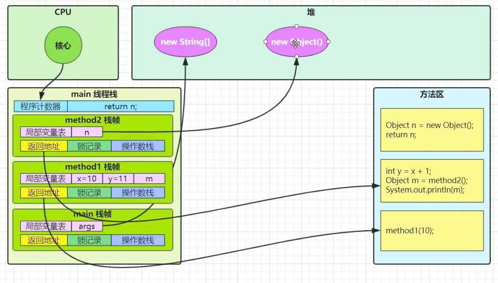

多线程示意图

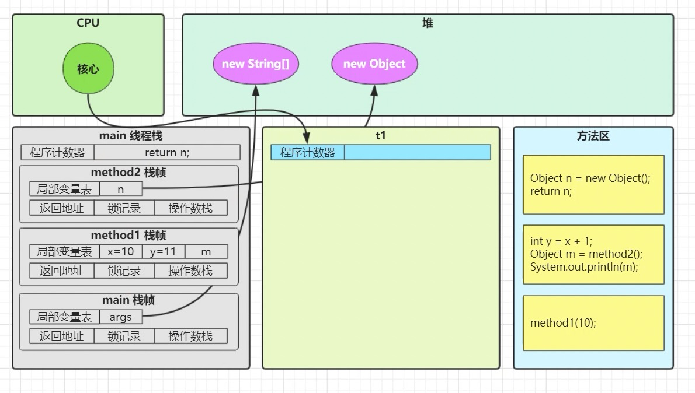

<br/>

#### 线程上下文切换

Thread Context Switch

因为以下一些原因导致 cpu 不再执行当前的线程，转而执行另一个线程的代码 

- 线程的 cpu 时间片用完 
- 垃圾回收 
- 有更高优先级的线程需要运行 
- 线程自己调用了 sleep、yield、wait、join、park、synchronized、lock 等方法 

当 Context Switch 发生时，需要由操作系统保存当前线程的状态，并恢复另一个线程的状态，Java 中对应的概念就是程序计数器（Program Counter Register），它的作用是记住下一条 jvm 指令的执行地址，是线程私有的 

- 状态包括程序计数器、虚拟机栈中每个栈帧的信息，如局部变量、操作数栈、返回地址等 
- Context Switch 频繁发生会影响性能


基础线程方法
------------

### sleep & yield

1. 调用 sleep 会让当前线程从`运行状态`进入`有限时间等待状态 `
2. 其他线程打断正在睡眠的线程，sleep会抛出异常
3. 睡眠结束后的线程未必会立刻得到执行
4. 建议用 TimeUnit 的 Sleep 代替 Thread 的 Sleep 来获得更好的可读性 。其底层还是Sleep方法。
5. 在循环访问锁的过程中，可以加入sleep让线程阻塞时间，防止大量占用cpu资源。

<br/>

举例：调用 sleep 会让当前线程从 Running 进入 Timed Waiting 状态（阻塞） 

```java [状态切换]
package org.itcast.thread;

import lombok.extern.slf4j.Slf4j;

/**
 * sleep方法测试
 */
@Slf4j(topic = "c.TestSleep")
public class TestSleep {
    public static void main(String[] args) throws InterruptedException {
        Thread t1 = new Thread("t1") {
            @Override
            public void run() {
                log.debug("entry sleep...");
                try {
                    Thread.sleep(2000);
                } catch (InterruptedException e) {
                    log.debug("wake up");
                    e.printStackTrace();
                }
            }
        };

        log.debug("t1状态:{}", t1.getState());
        t1.start();
        Thread.sleep(2000);
        log.debug("t1状态:{}", t1.getState());
    }
}
```

输出结果

```sh
15:01:45 [main] c.Test2 - t1状态:NEW
15:01:45 [t1] c.Test2 - enter sleep...
15:01:46 [main] c.Test2 - t1状态:TIMED_WAITING
```

<br/>

举例：其它线程可以使用 interrupt 方法打断正在睡眠的线程，这时 sleep 方法会抛出` InterruptedException` 

```java [打断线程]
package org.itcast.thread;

import lombok.extern.slf4j.Slf4j;

/**
 * sleep方法测试
 */
@Slf4j(topic = "c.TestSleep")
public class TestSleep {
    public static void main(String[] args) throws InterruptedException {
        Thread t1 = new Thread("t1") {
            @Override
            public void run() {
                log.debug("entry sleep...");
                try {
                    Thread.sleep(2000);
                } catch (InterruptedException e) {
                    log.debug("wake up");
                    e.printStackTrace();
                }
            }
        };

        log.debug("t1状态:{}", t1.getState());// [!code --]
        t1.start();
      	Thread.sleep(2000);// [!code --]
        Thread.sleep(1000);// [!code ++]
        log.debug("t1状态:{}", t1.getState());// [!code --]

        log.debug("interrupt..."); // [!code ++]
        t1.interrupt();// [!code ++]
    }
}

```

输出结果

```sh
18:28:23 [t1] c.Test2 - enter sleep...
18:28:24 [main] c.Test2 - interrupt...
18:28:24 [t1] c.Test2 - wake up...
java.lang.InterruptedException: sleep interrupted
Disconnected from the target VM, address: '127.0.0.1:56460', transport: 'socket'
	at java.lang.Thread.sleep(Native Method)
	at org.itcast.test.Test2$1.run(Test2.java:13)
```

<br/>

**yield** 

1. 调用 yield 会让当前线程从 Running 进入 Runnable 就绪状态，然后调度执行其它线程 
1. 具体的实现依赖于操作系统的任务调度器

线程优先级 

- 线程优先级会提示（hint）调度器优先调度该线程，但它仅仅是一个提示，调度器可以忽略它 
- 如果 cpu 比较忙，那么优先级高的线程会获得更多的时间片，但 cpu 闲时，优先级几乎没作用

```java [案例说明]
@Slf4j(topic = "c.TestYield")
public class TestYield {
    public static void main(String[] args) {
        Runnable task1 = () -> {
            int count = 0;
            for (;;) {
                System.out.println("---->1 " + count++);
            }
        };
        Runnable task2 = () -> {
            int count = 0;
            for (;;) {
                Thread.yield();// [!code --]
                Thread.yield();// [!code ++]
                System.out.println("---->2 " + count++);
            }
        };
        Thread t1 = new Thread(task1, "t1");
        Thread t2 = new Thread(task2, "t2");
        t1.setPriority(Thread.MIN_PRIORITY);
        t2.setPriority(Thread.MAX_PRIORITY);
        t1.start();
        t2.start();
    }
}
```

输出

```sh
#优先级
---->1 283500
---->2 374389
#yield
---->1 119199
---->2 101074
```

结论：可以看出，线程优先级和yield会对线程获取cpu时间片产生一定影响，但不会影响太大。

<br/>

#### <font color="green">*应用之限制</font>

案例-防止CPU占用100%，通过sleep 实现 

在没有利用 cpu 来计算时，不要让 while(true) 空转浪费 cpu，这时可以使用 yield 或 sleep 来让出 cpu 的使用权给其他程序

```java
while(true) {
    try {
        Thread.sleep(50);
    } catch (InterruptedException e) {
        e.printStackTrace();
    }
}
```

::: warning 💡 提示

- 可以用 `wait/nofity/nofifyAll` 或 `await/signal/signalAll` 达到类似的效果；
- 不同的是，`wait` 和 `await` 都需要加锁，并且需要相应的唤醒操作，一般适用于要进行同步的场景，sleep 适用于无需锁同步的场景，用来限制空转CPU

:::

<br/>

### join方法详解

为什么需要join，下面的代码执行，打印r是什么？

```java
package org.itcast.thread;

import lombok.extern.slf4j.Slf4j;

import static org.itcast.util.Sleeper.sleep;

@Slf4j(topic = "c.TestPrint")
public class TestPrint {
    static int r = 0;

    public static void main(String[] args) {
        Thread t1 = new Thread(()->{
            log.debug("开始");
            sleep(1);
            log.debug("结束");
            r = 10;
        }) ;

        t1.start();
        log.debug("结果为:{}", r);
    }
}

```

输出

```sh
03:40:41 [main] c.TestPrint - 结果为:0
03:40:41 [Thread-0] c.TestPrint - 开始
03:40:42 [Thread-0] c.TestPrint - 结束分析 
```

- 因为主线程和线程 t1 是并行执行的，t1 线程需要 1 秒之后才能算出 r=10 
- 而主线程一开始就要打印 r 的结果，所以只能打印出 r=0 

解决方法

- 用 sleep 行不行？为什么？ 
  - 可以，但是不好，因为主线程是不知道其他线程的等待时间，无法判断睡眠时间

- 用 join，加在 t1.start() 之后即可
  - 使用join的方式，可以在线程之间数据需要同步的时候使用


<br/>

#### <font color="green"> *应用之同步</font>

以调用方角度来讲，如果

- 需要等待结果返回，才能继续运行就是同步 
- 不需要等待结果返回，就能继续运行就是异步

代码实现

```java
@Slf4j(topic = "c.TestPrint")
public class TestPrint {
    static int r = 0;

    public static void main(String[] args) throws InterruptedException {
        Thread t1 = new Thread(()->{
            log.debug("开始");
            sleep(1);
            log.debug("结束");
            r = 10;
        }) ;

        t1.start();
        // t1线程等待主线程执行完 // [!code ++]
        t1.join();     // [!code ++]

        log.debug("结果为:{}", r);
    }
}
```

输出

```java
03:48:38 [Thread-0] c.TestPrint - 开始
03:48:39 [Thread-0] c.TestPrint - 结束
03:48:39 [main] c.TestPrint - 结果为:10
```

流程图

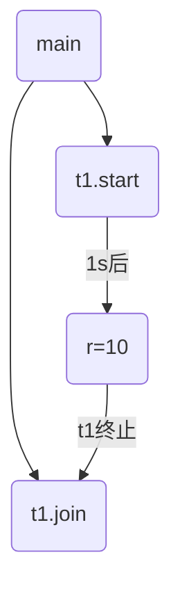

<br/>

#### 等待多个结果

```java
@Slf4j(topic = "c.TestJoin")
public class TestJoin {
    static int r1 = 0;
    static int r2 = 0;

    public static void main(String[] args) throws InterruptedException {
        test1();
    }

    private static void test1() throws InterruptedException {
        Thread t1 = new Thread(() -> {
            sleep(1);
            r1 = 10;
        });
        Thread t2 = new Thread(() -> {
            sleep(2);
            r2 = 20;
        });
        long start = System.currentTimeMillis();
        t1.start();
        t2.start();
        t1.join();
        t2.join();
        long end = System.currentTimeMillis();
        log.debug("r1: {} r2: {} cost: {}", r1, r2, end - start);
    }
}
```

分析如下 

- 第一个 join：等待 t1 时, t2 并没有停止, 而在运行 
- 第二个 join：1s 后, 执行到此, t2 也运行了 1s, 因此也只需再等待 1s 

如果颠倒两个 join 呢？ 

最终都是输出

```sh
18:58:06 [main] c.TestJoin - r1: 10 r2: 20 cost: 2009
```

流程图

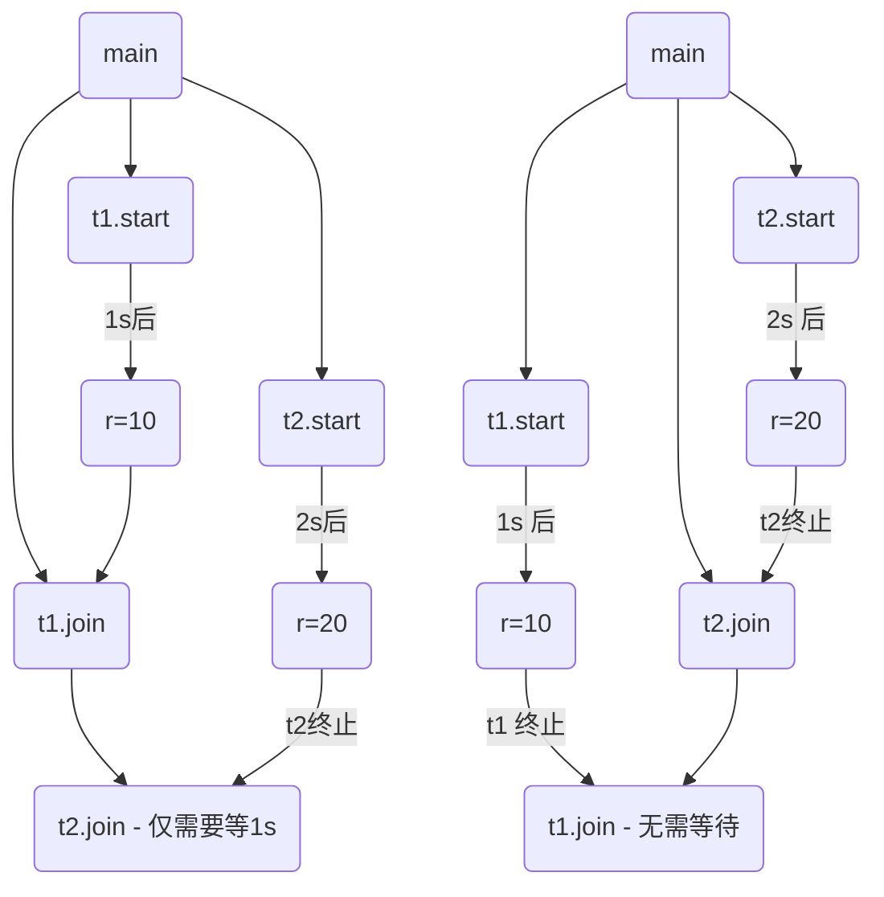

<br/>

#### 有实效的Join

等够时间的Join

```java
package org.itcast.thread;

import lombok.extern.slf4j.Slf4j;

import static org.itcast.util.Sleeper.sleep;

@Slf4j(topic = "c.TestPrint")
public class TestPrint {
    static int r = 0;

    public static void main(String[] args) throws InterruptedException {
        Thread t1 = new Thread(()->{
            log.debug("开始");
            sleep(1);
            log.debug("结束");
            r = 10;
        }) ;

        t1.start();
        t1.join();// [!code --]
        t1.join(1500);// [!code ++]

        log.debug("结果为:{}", r);
    }
}
```

输出

```sh
19:00:40 [main] c.TestJoin - r1: 10 cost: 1005
```

没等够时间的Join

```java
package org.itcast.thread;

import lombok.extern.slf4j.Slf4j;

import static org.itcast.util.Sleeper.sleep;

@Slf4j(topic = "c.TestPrint")
public class TestPrint {
    static int r = 0;

    public static void main(String[] args) throws InterruptedException {
        Thread t1 = new Thread(()->{
            log.debug("开始");
            sleep(1);
            log.debug("结束");
            r = 10;
        }) ;

        t1.start();
        t1.join(1500);// [!code --]
        t1.join(500);// [!code ++]

        log.debug("结果为:{}", r);
    }
}
```

输出

```sh
19:01:43 [main] c.TestJoin - r1: 0  cost: 506
```

<br/>

#### <font color="green">*应用之统筹</font>

阅读华罗庚《统筹方法》，给出烧水泡茶的多线程解决方案，提示 

- 参考图二，用两个线程（两个人协作）模拟烧水泡茶过程 
  - 文中办法乙、丙都相当于任务串行 
  - 而图一相当于启动了 4 个线程，有点浪费 
- 用 sleep(n) 模拟洗茶壶、洗水壶等耗费的时间

附：华罗庚《统筹方法》

统筹方法，是一种安排工作进程的数学方法。它的实用范围极广泛，在企业管理和基本建设中，以及关系复杂的科研项目的组织与管理中，都可以应用。

怎样应用呢？主要是把工序安排好。

比如，想泡壶茶喝。当时的情况是：开水没有；水壶要洗，茶壶、茶杯要洗；火已生了，茶叶也有了。怎么办？

- 办法甲：洗好水壶，灌上凉水，放在火上；在等待水开的时间里，洗茶壶、洗茶杯、拿茶叶；等水开了，泡茶喝。
- 办法乙：先做好一些准备工作，洗水壶，洗茶壶茶杯，拿茶叶；一切就绪，灌水烧水；坐待水开了，泡茶喝。
- 办法丙：洗净水壶，灌上凉水，放在火上，坐待水开；水开了之后，急急忙忙找茶叶，洗茶壶茶杯，泡茶喝。

哪一种办法省时间？我们能一眼看出，第一种办法好，后两种办法都窝了工。

这是小事，但这是引子，可以引出生产管理等方面有用的方法来。

水壶不洗，不能烧开水，因而洗水壶是烧开水的前提。没开水、没茶叶、不洗茶壶茶杯，就不能泡茶，因而这些又是泡茶的前提。它们的相互关系，可以用下边的箭头图来表示：

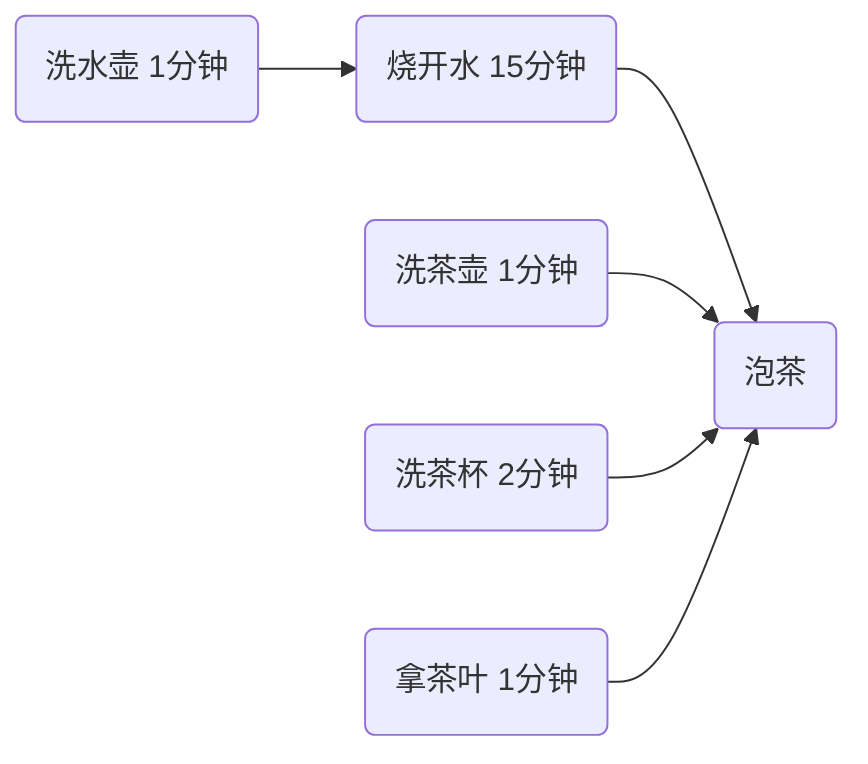

从这个图上可以一眼看出，办法甲总共要16分钟（而办法乙、丙需要20分钟）。如果要缩短工时、提高工作效率，应当主要抓烧开水这个环节，而不是抓拿茶叶等环节。同时，洗茶壶茶杯、拿茶叶总共不过4分钟，大可利用“等水开”的时间来做。

是的，这好像是废话，卑之无甚高论。有如走路要用两条腿走，吃饭要一口一口吃，这些道理谁都懂得。但稍有变化，临事而迷的情况，常常是存在的。在近代工业的错综复杂的工艺过程中，往往就不是像泡茶喝这么简单了。任务多了，几百几千，甚至有好几万个任务。关系多了，错综复杂，千头万绪，往往出现“万事俱备，只欠东风”的情况。由于一两个零件没完成，耽误了一台复杂机器的出厂时间。或往往因为抓的不是关键，连夜三班，急急忙忙，完成这一环节之后，还得等待旁的环节才能装配。

洗茶壶，洗茶杯，拿茶叶，或先或后，关系不大，而且同是一个人的活儿，因而可以合并成为：

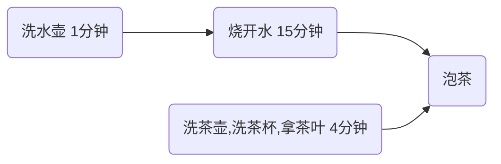

看来这是“小题大做”，但在工作环节太多的时候，这样做就非常必要了。

这里讲的主要是时间方面的事，但在具体生产实践中，还有其他方面的许多事。这种方法虽然不一定能直接解决所有问题，但是，我们利用这种方法来考虑问题，也是不无裨益的。

```java
@Slf4j(topic = "c.TestMakeTea")
public class TestMakeTea {

    public static void main(String[] args) {
        Thread t1 = new Thread(() -> {
            log.debug("洗水壶");
            Sleeper.sleep(1);
            log.debug("烧开水");
            Sleeper.sleep(15);
        },"老王");

        Thread t2 = new Thread(() -> {
            log.debug("洗茶壶");
            Sleeper.sleep(1);
            log.debug("洗茶杯");
            Sleeper.sleep(2);
            log.debug("拿茶叶");
            Sleeper.sleep(1);

            try {
                // t2 等待 t1 烧完开水进行泡茶
                t1.join();
            } catch (InterruptedException e) {
                throw new RuntimeException(e);
            }
            log.debug("泡茶");
        },"小王");

        t1.start();
        t2.start();
    }
}
```

输出

```java
01:54:16 [小王] c.TestMakeTea - 洗茶壶
01:54:16 [老王] c.TestMakeTea - 洗水壶
01:54:17 [老王] c.TestMakeTea - 烧开水
01:54:17 [小王] c.TestMakeTea - 洗茶杯
01:54:19 [小王] c.TestMakeTea - 拿茶叶
01:54:32 [小王] c.TestMakeTea - 泡茶
```

缺陷

- 上面模拟的是小王等老王的水烧开了，小王泡茶，如果反过来要实现老王等小王的茶叶拿来了，老王泡茶呢？代码最好能适应两种情况。
- 上面的两个线程其实是各执行各的，如果要模拟老王把水壶交给小王泡茶，或模拟小王把茶叶交给老王泡茶呢

<br/>

### interrupt方法详解

- `interrupted()`：静态方法，判断当前线程是否被打断，会清除打断标记。
- `islnterrupted()`：判断是否被打断，不会清除打断标记。
- `interrupt()`：将线程的打断标记设置为true，如果被打断线程正在sleep , wait , join会导致被打断的线程抛出InterruptedException ,并清除`打断标记`；如果打断的正在运行的线程，则会设置`打断标记`；park的线程被打断，也会设置`打断标记`，将打断标记设置为true。
  - 设置打断标记：将打断标记设置为true
  - 清除打断标记：将打断标记设置为false

<br/>

#### `Interrupt`说明

`interrupt`的本质是将线程的打断标记设为true，并调用线程的三个parker对象（C++实现级别）unpark该线程。

基于以上本质，有如下说明：

- 打断线程不等于中断线程，有以下两种情况：
  - 打断正在运行中的线程并不会影响线程的运行，但如果线程监测到了打断标记为true，可以自行决定后续处理。
  - 打断阻塞中的线程会让此线程产生一个`InterruptedException`异常，结束线程的运行。但如果该异常被线程捕获住，该线程依然可以自行决定后续处理（终止运行，继续运行，做一些善后工作等等）

<br/>

#### 打断等待的线程

sleep，wait，join 这几个方法都会让线程进入阻塞状态 

打断 sleep 的线程, 会清空打断状态，以 sleep 为例

```java
@Slf4j(topic = "c.TestInterrupt")
public class TestInterrupt {
    public static void main(String[] args) throws InterruptedException {
        test1();
    }
    public static void test1() throws InterruptedException {
        Thread t1 = new Thread(() -> {
            log.debug("sleep...");
            try {
                // sleep,wait, join 都会将打断标志清空，设置为假
                Thread.sleep(5000); 
            } catch (InterruptedException e) {
                e.printStackTrace();
            }
        },"t1");

        t1.start();
        Thread.sleep(1000);
        log.debug("interrupt");
        t1.interrupt();
        // 输出打断标记之前在睡一会儿，防止没有清除打断标志
        Thread.sleep(1000);
        log.debug("打断标记:{}", t1.isInterrupted());
    }
}
```

输出

```sh
15:46:12 [t1] c.TestInterrupt - sleep...
15:46:13 [main] c.TestInterrupt - interrupt
java.lang.InterruptedException: sleep interrupted
	at java.lang.Thread.sleep(Native Method)
	at org.itcast.test.TestInterrupt.lambda$test1$0(TestInterrupt.java:16)
	at java.lang.Thread.run(Thread.java:750)
15:46:14 [main] c.TestInterrupt - 打断标记:false
```

<br/>

#### 打断正常运行的线程

打断正常运行的线程, 只是告诉这个线程打断状态，被打断的线程自己来决定是否还需要运行还是停止运行。

```java
public static void test2(){
    Thread t2 = new Thread(() -> {
        while (true) {
            Thread currentThread = Thread.currentThread();
            boolean interrupted = currentThread.isInterrupted();
            if (interrupted) {
                log.debug("打断状态:{}", interrupted);
                break;
            }
        }
    }, "t2");
    t2.start();
    Sleeper.sleep(0.5);
    t2.interrupt();
}
```

输出

```java
22:32:53 [t2] c.TestInterrupt - 打断状态:true
```

<br/>

#### <font color="orange">*模式之两阶段终止</font>

Two Phase Termination

在一个线程 T1 中如何“优雅”终止线程 T2？这里的【优雅】指的是给 T2 一个料理后事的机会。

<br/>

错误思路

- 使用线程对象的 stop() 方法停止线程 
  - stop 方法会真正杀死线程，如果这时线程锁住了共享资源，那么当它被杀死后就再也没有机会释放锁， 其它线程将永远无法获取锁 
- 使用 System.exit(int) 方法停止线程 
  - 目的仅是停止一个线程，但这种做法会让整个程序都停止

<br/>

流程图

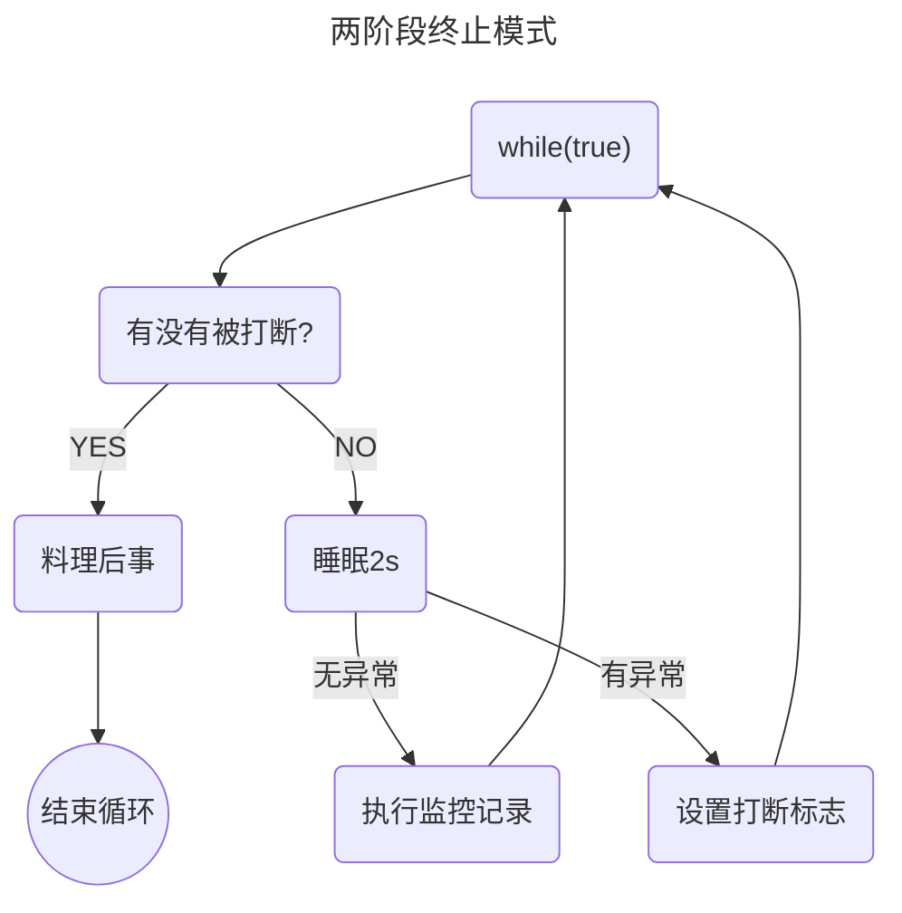

 <br/>

利用 isInterrupted，可以打断正在执行的线程，无论这个线程是在 sleep，wait，还是正常运行

```java {29,40}
package org.itcast.pattern;

import lombok.extern.slf4j.Slf4j;

import java.util.concurrent.TimeUnit;

/**
 * 两阶段终止模式
 */
@Slf4j(topic = "c.TPTInterrupt")
public class TPTInterrupt {
    private Thread thread;

    public void start(){
        thread = new Thread(() -> {
            while (true) {
                Thread currentThread = Thread.currentThread();

                // isInterrupted() 判断是否被打断，不清除打断标记
                if (currentThread.isInterrupted()) {
                    log.debug("料理后事");
                    break;
                }

                try {
                    // 等待的线程会被清除打断标记
                    // 在异常捕捉中重新设置打断标记
                    TimeUnit.SECONDS.sleep(1);
                    log.debug("将结果保存");
                } catch (InterruptedException e) {
                    currentThread.interrupt();
                }

                // 执行监控任务
            }

        });

        // 线程开始运行
        thread.start();
    }

    public void stop() {
        // 设置打断标记
        thread.interrupt();
    }
}
```

调用的主类：TwoPhaseTerminatio

```java [调用]
@Slf4j(topic = "c.TwoPhaseTermination")
public class TwoPhaseTermination {
    public static void main(String[] args) {
       test1();
    }

    private static void test1() {
        TPTInterrupt t = new TPTInterrupt();
        t.start();
        Sleeper.sleep(3.5);
        log.debug("stop");
        t.stop();
    }
}
```

输出结果

```sh
01:11:52 [监控线程] c.TPTInterrupt - 将结果保存
01:11:53 [监控线程] c.TPTInterrupt - 将结果保存
01:11:54 [监控线程] c.TPTInterrupt - 将结果保存
01:11:54 [main] c.TwoPhaseTermination - stop
01:11:54 [监控线程] c.TPTInterrupt - 料理后事
```

<br/>

#### 打断park线程

类似断点，不会清空打断状态

```java
public static void test3(){
    Thread t1 = new Thread(() -> {
        log.debug("park...");
      
        // 4.将打断状态清空，打断状态为false，只有打断状态为true才继续执行
        LockSupport.park();
        log.debug("unpark...");
        log.debug("打断状态:{}", Thread.currentThread().isInterrupted());
    }, "t1");
  
    // 1.调用 t1线程进行启动
    t1.start();
  
    // 2.睡眠0.5s并将打断状态设置成 false
    sleep(0.5);
  
    // 3.将打断状态设置为 true
    t1.interrupt();
}
```

输出

```sh
15:43:16 [t1] c.TestInterrupt - park...
15:43:16 [t1] c.TestInterrupt - unpark
15:43:16 [t1] c.TestInterrupt - 打断状态:true
```

::: warning  💡形象的比喻

`LockSupport.park()`相当于在代码中设置了断点， `Thread.interrupt()`  相当于是否放行，可以继续向下执行。

:::

<br/>

将 `sleep` 和  `t1.interrupt`  注释，调用  `LockSupport.park()`  后不会对下面的程序进行执行

```java
public static void test3(){
    Thread t1 = new Thread(() -> {
        log.debug("park...");
        LockSupport.park();
        log.debug("unpark...");
        log.debug("打断状态:{}", Thread.currentThread().isInterrupted());
    }, "t1");
    t1.start();
  
    sleep(0.5);// [!code --]
    
  	t1.interrupt();// [!code --]
}
```

输出

```sh
15:46:08 [t1] c.TestInterrupt - park...
```

::: warning  💡形象的比喻

`LockSupport.park()`相当于在代码中设置了断点，`t1.interrupt()` 相当于是否放行，这段代码就没有开启放行，所以代码无法继续向下执行。

:::

<br/>

如果已经设置了打断标记, 则 park 会失效

```java
private static void test4() {
    Thread t1 = new Thread(() -> {
        log.debug("park...");
        
        // 4.将打断状态清空，打断状态为false，只有打断状态为true才继续执行
        LockSupport.park();
        log.debug("unpark...");
        log.debug("打断状态:{}", Thread.currentThread().isInterrupted());

        // 5.打断状态已经是true，重新设置打断状态失效，unpark继续执行
        LockSupport.park();
        log.debug("unpark");
    }, "t1");
  
    // 1.调用 t1线程进行启动
    t1.start();
  
    // 2.睡眠0.5s并将打断状态设置成 false
    Sleeper.sleep(1.5);
  
    // 3.将打断状态设置为 true
    t1.interrupt();
}
```

输出

```sh
15:51:06 [t1] c.TestInterrupt - park...
15:51:07 [t1] c.TestInterrupt - unpark...
15:51:07 [t1] c.TestInterrupt - 打断状态:true
15:51:07 [t1] c.TestInterrupt - unpark
```

::: warning  💡形象的比喻

`LockSupport.park()` 相当于在代码中设置了断点，`t1.interrupt()` 相当于是否放行，不管设置了几个 `LockSupport.park()` 都会全部放行

:::

<br/>

可以使用 `Thread.interrupted()`  清除打断状态，将打断标志设为假

```java
private static void test5() {
    Thread t1 = new Thread(() -> {
        log.debug("park...");
        
        // 4.将打断状态清空，打断状态为false，只有打断状态为true才继续执行
        LockSupport.park();
        log.debug("unpark...");

        // 5.执行interrupted方法，将打断状态为true修改为false
        log.debug("执行Thread.interrupted()", Thread.interrupted());
        
        // 6.判断打断状态为false，不继续执行下面的语句
        LockSupport.park();
        log.debug("unpark");
    }, "t1");
  
    // 1.调用 t1线程进行启动
    t1.start();

    // 2.睡眠0.5s并将打断状态设置成 false
    Sleeper.sleep(1);
  
    // 3.将打断状态设置为 true
    t1.interrupt();
}
```

输出

```java
15:52:58 [t1] c.TestInterrupt - park...
15:52:59 [t1] c.TestInterrupt - unpark...
15:52:59 [t1] c.TestInterrupt - 执行Thread.interrupted()
```

::: warning  💡形象的比喻

`LockSupport.park() `相当于在代码中设置了断点，`t1.interrupt()` 相当于是否放行，不管设置了几个 `LockSupport.park() ` 都会全部放行，只有通过  `Thread.interrupted()`  清除打断状态，才能重新对 `park` 生效。

💡 重要方法整理

- `LockSupport.park()` : 清除打断状态，重写设置了打断状态才继续执行
- `Thread.interrupted()` : 清除打断状态
- `interrupte` : 设置打断状态

:::

[park & uppark 的原理 ](#park)

<br/>

#### 不推荐的方法

还有一些不推荐使用的方法，这些方法已过时，容易破坏同步代码块，造成线程死锁

| 方法名    |       功能说明       |
| :-------- | :------------------: |
| stop()    |     停止线程运行     |
| suspend() | 挂起（暂停）线程运行 |
| resume()  |     恢复线程运行     |

<br/>

::: warning 💡 面试题：如何终止一个正在运行的线程

- 使用线程的interrupt方法中断线程，内部其实也是使用中断标记来中断线程。
- 使用退出标志和volatile，使线程正常退出，就是当run方法完成后线程终止。
- 使用线程的stop方法强行终止，但是这个方法在JDK中已经作废，不推荐使用。

:::

<br/>

### 主线程与守护线程

默认情况下，Java 进程需要等待所有线程都运行结束，才会结束。有一种特殊的线程叫做守护线程，只要其它非守护线程运行结束了，即使守护线程的代码没有执行完，也会强制结束。

```java
@Slf4j(topic = "c.TestDaemon")
public class TestDaemon {
    public static void main(String[] args) {
        log.debug("开始运行...");
        Thread t1 = new Thread(() -> {
            log.debug("开始运行...");
            sleep(2);
            log.debug("运行结束...");
        }, "daemon");
         // 设置该线程为守护线程
        t1.setDaemon(true);
        t1.start();

        sleep(1);
        log.debug("运行结束...");
    }
}
```

输出

```sh
01:25:51 [main] c.TestDaemon - 开始运行...
01:25:51 [daemon] c.TestDaemon - 开始运行...
01:25:52 [main] c.TestDaemon - 运行结束...
```

> 注意 
>
> 1.垃圾回收器线程就是一种守护线程 
>
> 2.Tomcat 中的 Acceptor 和 Poller 线程都是守护线程，所以 Tomcat 接收到 shutdown 命令后，不会等待它们处理完当前请求


线程之间状态
--------

### 五种状态

五种状态是从操作系统层面来描述的


- 【初始状态】仅是在语言层面创建了线程对象，还未与操作系统线程关联 
- 【可运行状态】（就绪状态）指该线程已经被创建（与操作系统线程关联），可以由 CPU 调度执行 
- 【运行状态】指获取了 CPU 时间片运行中的状态
  - 当 CPU 时间片用完，会从【运行状态】转换至【可运行状态】，会导致线程的上下文切换
- 【阻塞状态】
  - 如果调用了阻塞 API，如 BIO 读写文件，这时该线程实际不会用到 CPU，会导致线程上下文切换，进入 【阻塞状态】 
  - 等 BIO 操作完毕，会由操作系统唤醒阻塞的线程，转换至【可运行状态】 
  - 与【可运行状态】的区别是，对【阻塞状态】的线程来说只要它们一直不唤醒，调度器就一直不会考虑 调度它们
- 【终止状态】表示线程已经执行完毕，生命周期已经结束，不会再转换为其它状态


### 六种状态

这是从Java API层面来描述的


- NEW 线程刚被创建，但是还没有调用 start() 方法 
- RUNNABLE 当调用了 start() 方法之后，注意，Java API 层面的 RUNNABLE 状态涵盖了 操作系统 层面的 【可运行状态】、【运行状态】和【阻塞状态】（由于 BIO 导致的线程阻塞，在 Java 里无法区分，仍然认为 是可运行） 
- BLOCKED ， WAITING ， TIMED_WAITING 都是 Java API 层面对【阻塞状态】的细分，后面会在状态转换一节 详述 
- TERMINATED 当线程代码运行结束


演示

```java
@Slf4j(topic = "c.TestState")
public class TestState {
    public static void main(String[] args) throws IOException {
        // t1 只是 new出来个对象，没调用 start  状态为NEW
        Thread t1 = new Thread("t1") {
            @Override
            public void run() {
                log.debug("running...");
            }
        };

        // t2线程调用start并执行RUNNABLE
        Thread t2 = new Thread("t2") {
            @Override
            public void run() {
                while(true) { // runnable

                }
            }
        };
        t2.start();

        // t3线程先于主线程输出结束，状态为TERMINATED
        Thread t3 = new Thread("t3") {
            @Override
            public void run() {
                log.debug("running...");
            }
        };
        t3.start();

        // t4线程调用sleep，睡眠时间足够长，并且先拿到锁，状态为TIMED_WAITING
        Thread t4 = new Thread("t4") {
            @Override
            public void run() {
                synchronized (TestState.class) {
                    try {
                        Thread.sleep(1000000); // timed_waiting
                    } catch (InterruptedException e) {
                        e.printStackTrace();
                    }
                }
            }
        };
        t4.start();

        // t5调用 join方法，等待t2运行完，状态为WAITING
        Thread t5 = new Thread("t5") {
            @Override
            public void run() {
                try {
                    t2.join(); // waiting
                } catch (InterruptedException e) {
                    e.printStackTrace();
                }
            }
        };
        t5.start();

        // t6线程由于拿不到锁就阻塞住了，状态为BLOCKED
        Thread t6 = new Thread("t6") {
            @Override
            public void run() {
                synchronized (TestState.class) { // blocked
                    try {
                        Thread.sleep(1000000);
                    } catch (InterruptedException e) {
                        e.printStackTrace();
                    }
                }
            }
        };
        t6.start();

        try {
            Thread.sleep(500);
        } catch (InterruptedException e) {
            e.printStackTrace();
        }
        log.debug("t1 state {}", t1.getState());
        log.debug("t2 state {}", t2.getState());
        log.debug("t3 state {}", t3.getState());
        log.debug("t4 state {}", t4.getState());
        log.debug("t5 state {}", t5.getState());
        log.debug("t6 state {}", t6.getState());
        System.in.read();
    }
}
```

输出

```sh
17:41:28.881 c.TestState [t3] - running...
17:41:29.380 c.TestState [main] - t1 state NEW
17:41:29.383 c.TestState [main] - t2 state RUNNABLE
17:41:29.383 c.TestState [main] - t3 state TERMINATED
17:41:29.383 c.TestState [main] - t4 state TIMED_WAITING
17:41:29.383 c.TestState [main] - t5 state WAITING
17:41:29.383 c.TestState [main] - t6 state BLOCKED
```


