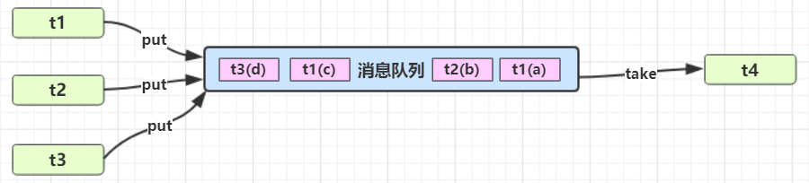

[返回首页](index.md)
## * 模式之生产者消费者

**定义**

- 与前面的保护性暂停中的 GuardObject 不同，不需要产生结果和消费结果的线程一一对应 
- 消费队列可以用来平衡生产和消费的线程资源 
- 生产者仅负责产生结果数据，不关心数据该如何处理，而消费者专心处理结果数据 
- 消息队列是有容量限制的，满时不会再加入数据，空时不会再消耗数据 
- JDK 中各种阻塞队列，采用的就是这种模式



实现

::: code-group

```java [消息类]
package org.itcast.pattern;

public class Message {
    private int id;
    private Object message;

    public Message(int id, Object message) {
        this.id = id;
        this.message = message;
    }

    public int getId() {
        return id;
    }

    public Object getMessage() {
        return message;
    }
}

```

```java [消息队列类] {33,34,54,55}
package org.itcast.pattern;

import lombok.extern.slf4j.Slf4j;

import java.util.LinkedList;

@Slf4j(topic = "c.MessageQueue")
public class MessageQueue {
    private LinkedList<Message> queue;

    private final int capacity;

    public MessageQueue(int capacity) {
        this.capacity = capacity;
        queue = new LinkedList<>();
    }

    /**
     * @return 取出消息队列
     */
    public Message take() {
        synchronized (queue) {
            while (queue.isEmpty()) {
                log.debug("queue is empty, wait");

                try {
                    queue.wait();
                } catch (InterruptedException e) {
                    e.printStackTrace();
                }
            }

            Message message = queue.removeFirst();
            queue.notifyAll();
            return message;
        }
    }

    /**
     * @param message 放入队列
     */
    public void put(Message message) {
        synchronized (queue) {
            while (queue.size() == capacity) {
                log.debug("stocks has reached the limit,wait");

                try {
                    queue.wait();
                } catch (InterruptedException e) {
                    e.printStackTrace();
                }
            }

            queue.addLast(message);
            queue.notifyAll();
        }
    }
}
```

```java [测试类]
package org.itcast.pattern;

import lombok.extern.slf4j.Slf4j;

import java.io.IOException;
import java.util.List;

@Slf4j(topic = "c.TestProducerConsumer")
public class TestProducerConsumer {
    public static void main(String[] args) {
        MessageQueue messageQueue = new MessageQueue(2);
        // 4 个生产者线程, 下载任务
        for (int i = 0; i < 4; i++) {
            int id = i;
            new Thread(() -> {
                try {
                    log.debug("download...");
                    List<String> response = Downloader.download();
                    log.debug("try put message({})", id);
                    messageQueue.put(new Message(id, response));
                } catch (IOException e) {
                    e.printStackTrace();
                }
            }, "生产者" + i).start();
        }

        // 1 个消费者线程, 处理结果
        new Thread(() -> {
            while (true) {
                Message message = messageQueue.take();
                List<String> response = (List<String>) message.getMessage();
                log.debug("take message({}): [{}] lines", message.getId(), response.size());
            }
        }, "消费者").start();
    }
}
```

:::

某次运行结果

```sh
17:05:15 [生产者2] c.TestProducerConsumer - download...
17:05:15 [消费者] c.MessageQueue - queue is empty, wait
17:05:15 [生产者3] c.TestProducerConsumer - download...
17:05:15 [生产者1] c.TestProducerConsumer - download...
17:05:15 [生产者0] c.TestProducerConsumer - download...
17:05:16 [生产者2] c.TestProducerConsumer - try put message(2)
17:05:16 [生产者1] c.TestProducerConsumer - try put message(1)
17:05:16 [生产者0] c.TestProducerConsumer - try put message(0)
17:05:16 [生产者3] c.TestProducerConsumer - try put message(3)
17:05:16 [生产者0] c.MessageQueue - stocks has reached the limit,wait
17:05:16 [生产者1] c.MessageQueue - stocks has reached the limit,wait
17:05:16 [消费者] c.TestProducerConsumer - take message(2): [3] lines
17:05:16 [消费者] c.TestProducerConsumer - take message(3): [3] lines
17:05:16 [消费者] c.TestProducerConsumer - take message(0): [3] lines
17:05:16 [消费者] c.TestProducerConsumer - take message(1): [3] lines
17:05:16 [消费者] c.MessageQueue - queue is empty, wait
```

<br/>
