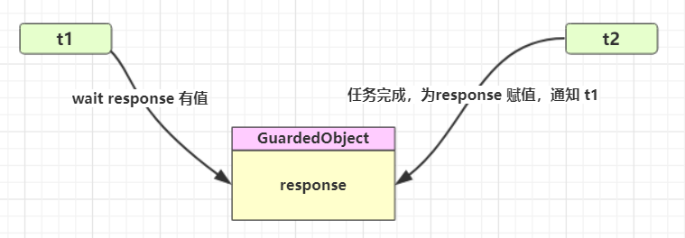
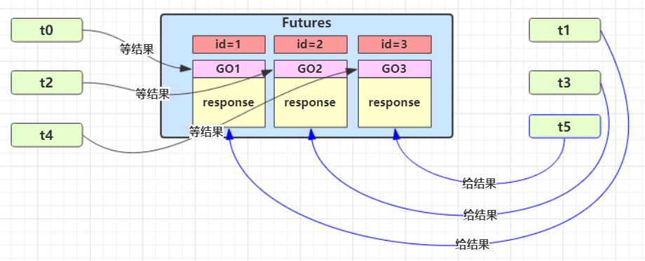

[返回首页](index.md)
## * 模式之保护性暂停

**定义** 

即 Guarded Suspension，**用在一个线程等待另一个线程的执行结果** 

要点 

- 有一个结果需要从一个线程传递到另一个线程，让他们关联同一个 GuardedObject 
- 如果有结果不断从一个线程到另一个线程那么可以使用消息队列（见生产者/消费者） 
- JDK 中，Join 的实现、Future 的实现，采用的就是此模式 
- 因为要等待另一方的结果，因此归类到同步模式

 

<br/>

**实现**：一个线程等待另一个线程的执行结果

:::code-group

```java [实现类] {5,8,12,25}
package org.itcast.pattern;

public class GuardedObject {
    private Object response;
    private final Object lock = new Object();

    public Object get() {
        synchronized (lock) {
            // 条件不满足则等待
            while (response == null) {
                try {
                    lock.wait();
                } catch (InterruptedException e) {
                    e.printStackTrace();
                }
            }
            return response;
        }
    }

    public void complete(Object response) {
        synchronized (lock) {
            // 条件满足，通知等待线程
            this.response = response;
            lock.notifyAll();
        }
    }
}
```

```java [工具类]
package org.itcast.pattern;

import java.io.BufferedReader;
import java.io.IOException;
import java.io.InputStreamReader;
import java.net.HttpURLConnection;
import java.net.URL;
import java.nio.charset.StandardCharsets;
import java.util.ArrayList;
import java.util.List;

public class Downloader {
    public static List<String> download() throws IOException {
        HttpURLConnection conn = (HttpURLConnection) 
                new URL("https://www.baidu.com/").openConnection();
        
        List<String> lines = new ArrayList<>();
        try (BufferedReader reader = new BufferedReader(
                new InputStreamReader(conn.getInputStream(),
                StandardCharsets.UTF_8))
        ) {
            String line;
            while ((line = reader.readLine()) != null) {
                lines.add(line);
            }
        }
        return lines;
    }
}
```

```java [执行类]
package org.itcast.pattern;

import lombok.extern.slf4j.Slf4j;

import java.io.IOException;
import java.util.List;

@Slf4j(topic = "c.TestGuardedObject")
public class TestGuardedObject {
    public static void main(String[] args) {
        GuardedObject guardedObject = new GuardedObject();
        new Thread(() -> {
            try {
                List<String> download = Downloader.download();
                log.debug("down complete");
                guardedObject.complete(download);
            } catch (IOException e) {
                throw new RuntimeException(e);
            }
        }).start();

        log.debug("waiting");
        Object response = guardedObject.get();
        log.debug("get response:[{}]lines", ((List<String>) response).size());
    }
}
```

::: 

执行结果

```sh
08:42:18.568 [main] c.TestGuardedObject - waiting...
08:42:23.312 [Thread-0] c.TestGuardedObject - download complete...
08:42:23.312 [main] c.TestGuardedObject - get response: [3] lines
```

<br/>

#### 带超时版 GuardedObject 

::: code-group

```java [带超时时间]{8,11,25,43}
package org.itcast.pattern;

import lombok.extern.slf4j.Slf4j;

@Slf4j(topic = "c.GuardedObjectV2")
public class GuardedObjectV2 {
    private Object response;
    private final Object lock = new Object();

    public Object get(long millis) {
        synchronized (lock) {
            // 1) 记录最初时间
            long begin = System.currentTimeMillis();
            // 2) 已经经历的时间
            long timePassed = 0;
            while (response == null) {
                // 4) 假设 millis 是 1000，结果在 400 时唤醒了，那么还有 600 要等
                long waitTime = millis - timePassed;
                log.debug("waitTime: {}", waitTime);
                if (waitTime <= 0) {
                    log.debug("break...");
                    break;
                }
                try {
                    lock.wait(waitTime);
                } catch (InterruptedException e) {
                    e.printStackTrace();
                }
                // 3) 如果提前被唤醒，这时已经经历的时间假设为 400
                timePassed = System.currentTimeMillis() - begin;
                log.debug("timePassed: {}, object is null {}",
                        timePassed, response == null);
            }
            return response;
        }
    }

    public void complete(Object response) {
        synchronized (lock) {
            // 条件满足，通知等待线程
            this.response = response;
            log.debug("notify...");
            lock.notifyAll();
        }
    }
}
```

```java [正常版] {9}
public static void main(String[] args) {
    GuardedObjectV2 v2 = new GuardedObjectV2();
    new Thread(() -> {
        sleep(1);
        v2.complete(null);
        sleep(1);
        v2.complete(Arrays.asList("a", "b", "c"));
    }).start();
    Object response = v2.get(2500);
    if (response != null) {
        log.debug("get response: [{}] lines", ((List<String>) response).size());
    } else {
        log.debug("can't get response");
    }
}
```

```java [超时版]
public static void main(String[] args) {
    GuardedObjectV2 v2 = new GuardedObjectV2();
    new Thread(() -> {
        sleep(1);
        v2.complete(null);
        sleep(1);
        v2.complete(Arrays.asList("a", "b", "c"));
    }).start();
    Object response = v2.get(2500);// [!code --]
    Object response = v2.get(1500);// [!code ++]
    if (response != null) {
        log.debug("get response: [{}] lines", ((List<String>) response).size());
    } else {
        log.debug("can't get response");
    }
}
```

::: 

超时版输出

```sh
08:49:39.917 [main] c.GuardedObjectV2 - waitTime: 2500
08:49:40.917 [Thread-0] c.GuardedObjectV2 - notify...
08:49:40.917 [main] c.GuardedObjectV2 - timePassed: 1003, object is null true
08:49:40.917 [main] c.GuardedObjectV2 - waitTime: 1497
08:49:41.918 [Thread-0] c.GuardedObjectV2 - notify...
08:49:41.918 [main] c.GuardedObjectV2 - timePassed: 2004, object is null false
08:49:41.918 [main] c.TestGuardedObjectV2 - get response: [3] lines
```

正常版输出

```sh
08:47:54.963 [main] c.GuardedObjectV2 - waitTime: 1500
08:47:55.963 [Thread-0] c.GuardedObjectV2 - notify...
08:47:55.963 [main] c.GuardedObjectV2 - timePassed: 1002, object is null true
08:47:55.963 [main] c.GuardedObjectV2 - waitTime: 498
08:47:56.461 [main] c.GuardedObjectV2 - timePassed: 1500, object is null true
08:47:56.461 [main] c.GuardedObjectV2 - waitTime: 0
08:47:56.461 [main] c.GuardedObjectV2 - break...
08:47:56.461 [main] c.TestGuardedObjectV2 - can't get response
08:47:56.963 [Thread-0] c.GuardedObjectV2 - notify...
```

<br/>

#### <font color='blue'>* 原理之 join</font>

是调用者轮询检查线程 alive 状态

```java
t1.join();
```

等价于下面的代码

```java
synchronized (t1) {
    // 调用者线程进入 t1 的 waitSet 等待, 直到 t1 运行结束
    while (t1.isAlive()) {
        t1.wait(0);
    }
}
```

> **注意** 
>
> join 体现的是【保护性暂停】模式，请参考之

源码：

```java
//不带参
public final void join() throws InterruptedException {
    join(0);
}
//带参
//等待时长的实现类似于之前的保护性暂停
public final synchronized void join(long millis)
    throws InterruptedException {
    long base = System.currentTimeMillis();
    long now = 0;

    if (millis < 0) {
        throw new IllegalArgumentException("timeout value is negative");
    }

    if (millis == 0) {
        while (isAlive()) {
            wait(0);
        }
    } else {
        while (isAlive()) {
            long delay = millis - now;
            if (delay <= 0) {
                break;
            }
            wait(delay);
            now = System.currentTimeMillis() - base;
        }
    }
}
```

<br/>

#### 多任务版GuardedObject 

图中 Futures 就好比居民楼一层的信箱（每个信箱有房间编号），左侧的 t0，t2，t4 就好比等待邮件的居民，右 侧的 t1，t3，t5 就好比邮递员 。

如果需要在多个类之间使用 GuardedObject 对象，作为参数传递不是很方便，因此设计一个用来解耦的中间类， 这样不仅能够解耦【结果等待者】和【结果生产者】，还能够同时支持多个任务的管理。



<br/>

**代码实现**

::: code-group

```java [标识类] {48,68}
package org.itcast.pattern;

import lombok.extern.slf4j.Slf4j;

/**
 * 多任务版本
 */
@Slf4j(topic = "c.GuardedTask")
public class GuardedTask {
    private int id;

    public GuardedTask(int id) {
        this.id = id;
    }

    public int getId() {
        return id;
    }

    public void setId(int id) {
        this.id = id;
    }

    private Object response;

    /**
     *  获取对象方法
     * @param timeout 超时时间
     * @return 返回结果对象
     */
    public Object get(long timeout) {
        synchronized (this) {
            // 开始时间
            long base = System.currentTimeMillis();
            // 经过时间
            long now = 0;

            while (response == null) {
                // 消耗的时间
                long delay = timeout - now;

                // 时间消耗完则退出
                if (delay <= 0) {
                    break;
                }

                try {
                    this.wait(delay);
                } catch (InterruptedException e) {
                    e.printStackTrace();
                }

                // 重新计算当前时间
                now = System.currentTimeMillis() - base;
            }

            return response;
        }
    }

    /**
     * 产生结果
     * @param response 传入结果
     */
    public void complete(Object response) {
        synchronized (this) {
            this.response = response;
            this.notifyAll();
        }
    }
}
```

```java [中间解耦类]{11}
package org.itcast.pattern;

import java.util.Hashtable;
import java.util.Map;
import java.util.Set;

/**
 * 中间解耦类
 */
public class Mailboxes {
    private static Map<Integer, GuardedTask> boxes = new Hashtable<>();

    private static int id = 1;

    private static synchronized int generateId() {
        return id++;
    }

    public static GuardedTask get(int id) {
        return boxes.remove(id);
    }

    public static GuardedTask create() {
        GuardedTask gt = new GuardedTask(generateId());
        boxes.put(gt.getId(), gt);
        return gt;
    }

    public static Set<Integer> getIds() {
        return boxes.keySet();
    }
}
```

:::

业务相关类

::: code-group

```java [收信人]
package org.itcast.pattern;

import lombok.extern.slf4j.Slf4j;

@Slf4j(topic = "c.People")
class People extends Thread {
    @Override
    public void run() {
        // 收信
        GuardedTask guardedTask = Mailboxes.create();
        log.debug("开始收信 id:{}", guardedTask.getId());
        Object mail = guardedTask.get(5000);
        log.debug("收到信 id:{}, 内容:{}", guardedTask.getId(), mail);
    }
}
```

```java [送信人]
package org.itcast.pattern;

import lombok.extern.slf4j.Slf4j;

@Slf4j(topic = "c.Postman")
class Postman extends Thread {
    private int id;
    private String mail;

    public Postman(int id, String mail) {
        this.id = id;
        this.mail = mail;
    }
    @Override
    public void run() {
        GuardedTask guardedTask = Mailboxes.get(id);
        log.debug("送信 id:{}, 内容:{}", id, mail);
        guardedTask.complete(mail);
    }
}
```

```java [测试类]
package org.itcast.pattern;

import lombok.extern.slf4j.Slf4j;

import java.io.IOException;
import java.util.List;

@Slf4j(topic = "c.TestGuardedObject")
public class TestGuardedObject {
    public static void main(String[] args) {
        GuardedObject guardedObject = new GuardedObject();
        new Thread(() -> {
            try {
                List<String> download = Downloader.download();
                log.debug("down complete");
                guardedObject.complete(download);
            } catch (IOException e) {
                throw new RuntimeException(e);
            }
        }).start();

        log.debug("waiting");
        Object response = guardedObject.get();
        log.debug("get response:[{}]lines", ((List<String>) response).size());
    }
}
```

:::

某次运行结果

```sh
10:35:05.689 c.People [Thread-1] - 开始收信 id:3
10:35:05.689 c.People [Thread-2] - 开始收信 id:1
10:35:05.689 c.People [Thread-0] - 开始收信 id:2
10:35:06.688 c.Postman [Thread-4] - 送信 id:2, 内容:内容2
10:35:06.688 c.Postman [Thread-5] - 送信 id:1, 内容:内容1
10:35:06.688 c.People [Thread-0] - 收到信 id:2, 内容:内容2
10:35:06.688 c.People [Thread-2] - 收到信 id:1, 内容:内容1
10:35:06.688 c.Postman [Thread-3] - 送信 id:3, 内容:内容3
10:35:06.689 c.People [Thread-1] - 收到信 id:3, 内容:内容3
```

某次错误的运行结果

```sh
16:35:09 [Thread-2] c.People - 开始收信 id:3
16:35:09 [Thread-1] c.People - 开始收信 id:2
16:35:09 [Thread-0] c.People - 开始收信 id:1
Exception in thread "main" java.util.ConcurrentModificationException
	at java.util.Hashtable$Enumerator.next(Hashtable.java:1412)
	at org.itcast.pattern.GuardedTaskMain.main(GuardedTaskMain.java:11)
16:35:10 [Thread-4] c.Postman - 开始送信 id:2
16:35:10 [Thread-3] c.Postman - 开始送信 id:3
16:35:10 [Thread-1] c.People - 收到信 id:2, 内容:邮递员发送的内容为2
16:35:10 [Thread-2] c.People - 收到信 id:3, 内容:邮递员发送的内容为3
16:35:14 [Thread-0] c.People - 收到信 id:1, 内容:null
```

<br/>
