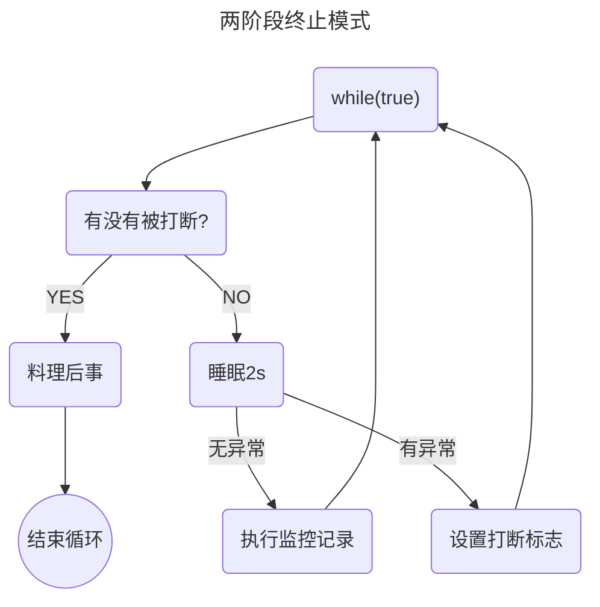

[返回首页](index.md)
## *模式之两阶段终止

Two Phase Termination

在一个线程 T1 中如何“优雅”终止线程 T2？这里的【优雅】指的是给 T2 一个料理后事的机会。

<br/>

错误思路

- 使用线程对象的 stop() 方法停止线程 
  - stop 方法会真正杀死线程，如果这时线程锁住了共享资源，那么当它被杀死后就再也没有机会释放锁， 其它线程将永远无法获取锁 
- 使用 System.exit(int) 方法停止线程 
  - 目的仅是停止一个线程，但这种做法会让整个程序都停止

<br/>

流程图



 <br/>

### interrupt方法

利用 isInterrupted，可以打断正在执行的线程，无论这个线程是在 sleep，wait，还是正常运行

```java {29,40}
package org.itcast.pattern;

import lombok.extern.slf4j.Slf4j;

import java.util.concurrent.TimeUnit;

/**
 * 两阶段终止模式
 */
@Slf4j(topic = "c.TPTInterrupt")
public class TPTInterrupt {
    private Thread thread;
  
   	public static void main(String[] args) {
       TPTInterrupt t = new TPTInterrupt();
        t.start();
        Sleeper.sleep(3.5);
        log.debug("stop");
        t.stop();
    }

    public void start(){
        thread = new Thread(() -> {
            while (true) {
                Thread currentThread = Thread.currentThread();

                // isInterrupted() 判断是否被打断，不清除打断标记
                if (currentThread.isInterrupted()) {
                    log.debug("料理后事");
                    break;
                }

                try {
                    // 等待的线程会被清除打断标记
                    // 在异常捕捉中重新设置打断标记
                    TimeUnit.SECONDS.sleep(1);
                    log.debug("将结果保存");
                } catch (InterruptedException e) {
                    currentThread.interrupt();
                }

                // 执行监控任务
            }

        });

        // 线程开始运行
        thread.start();
    }

    public void stop() {
        // 设置打断标记
        thread.interrupt();
    }

```

输出结果

```sh
01:11:52 [监控线程] c.TPTInterrupt - 将结果保存
01:11:53 [监控线程] c.TPTInterrupt - 将结果保存
01:11:54 [监控线程] c.TPTInterrupt - 将结果保存
01:11:54 [main] c.TPTInterrupt - stop
01:11:54 [监控线程] c.TPTInterrupt - 料理后事
```

<br/>


### volatile关键字

在一个线程 T1 中如何“优雅”终止线程 T2？这里的【优雅】指的是给 T2 一个料理后事的机会。

```java
package org.itcast.pattern;

import lombok.extern.slf4j.Slf4j;
import org.itcast.util.Sleeper;

/**
 * 通过 易变关键字 volatile 解决可见性问题
 */
@Slf4j(topic = "c.TPTVolatile")
public class TPTVolatile {
    private Thread thread;
    private volatile boolean stop = false;

    public void start() {
        thread = new Thread(() -> {
            while (true) {
                Thread current = Thread.currentThread();
                if (stop) {
                    log.debug("料理后事");
                    break;
                }
                try {
                    Thread.sleep(1000);
                    log.debug("将结果保存");
                } catch (InterruptedException e) {
                    stop = true;
                    current.interrupt();
                }
                // 执行监控操作
            }
        }, "监控线程");
        thread.start();
    }

    public void stop() {
        stop = true;
        //让线程立即停止而不是等待sleep结束
        thread.interrupt();
    }

    public static void main(String[] args) {
        TPTVolatile t = new TPTVolatile();
        t.start();
        Sleeper.sleep(3.5);
        log.debug("stop");
        t.stop();
    }
}
```

结果

```sh
11:54:52.003 c.TPTVolatile [监控线程] - 将结果保存
11:54:53.006 c.TPTVolatile [监控线程] - 将结果保存
11:54:54.007 c.TPTVolatile [监控线程] - 将结果保存
11:54:54.502 c.TestTwoPhaseTermination [main] - stop 
11:54:54.502 c.TPTVolatile [监控线程] - 料理后事
```

<br/>
