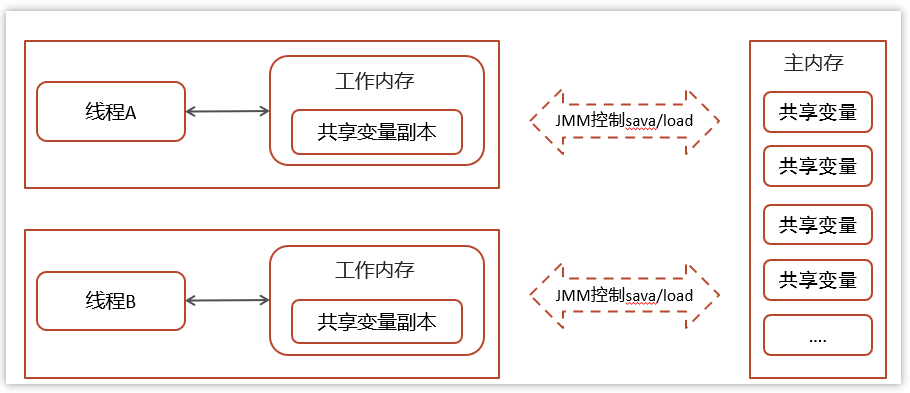
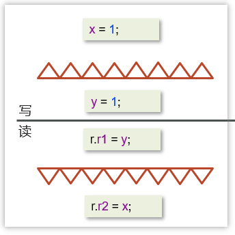
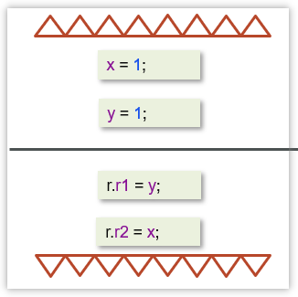

[返回首页](index.md)
[[toc]]

## 共享模型之内存

::: tip 📌 提示： 实现线程安全的方法，有多种手段可以达到目的。 

- 阻塞式的解决方案：`synchronized`，`ReentrantLock` 
- 非阻塞式的解决方案：CAS + volatile，Atomic类
- 无同步方案：栈封闭，线程本地存储，可重入代码，无状态，不可变

:::

### Java内存模型

JMM 即 Java Memory Model，它定义了主存、工作内存抽象概念，底层对应着 CPU 寄存器、缓存、硬件内存、 CPU 指令优化等。 

- 主内存：所有线程都共享的数据，类成员变量，成员变量。
- 工作内存：每个线程私有的数据，局部变量。



<br/>

特点：

- 所有的共享变量都存储于主内存(计算机的RAM)这里所说的变量指的是实例变量和类变量。不包含局部变量，因为局部变量是线程私有的，因此不存在竞争问题。

- 每一个线程还存在自己的工作内存，线程的工作内存，保留了被线程使用的变量的工作副本。
- 线程对变量的所有的操作(读，写)都必须在工作内存中完成，而不能直接读写主内存中的变量，不同线程之间也不能直接访问对方工作内存中的变量，线程间变量的值的传递需要通过主内存完成。

<br/>

JMM的意义

- 计算机硬件底层的内存结构过于复杂，JMM的意义在于避免程序员直接管理计算机底层内存，用一些关键字synchronized、volatile等可以方便的管理内存。解决并发问题的一种规范，思想。

<br/>

JMM 体现在以下几个方面 

- 原子性 - 保证指令不会受到线程上下文切换的影响 
- 可见性 - 保证指令不会受 cpu 缓存的影响 
- 有序性 - 保证指令不会受 cpu 指令并行优化的影响

<br/>

:::warning 💡思考：什么是Java内存模型，如何理解?

- `JMM(Java Memory Model)` Java内存模型，定义了共享内存中多线程程序读写操作的行为规范，通过这些规则来规范对内存的读写操作从而保证指令的正确性
- `JMM` 把内存分为两块，一块是私有线程的工作区域（工作内存），一块是所有线程的共享区域（主内存）
- 线程跟线程之间是相互隔离，线程跟线程交互需要通过主内存

💡 **思考：导致并发问题的原因是什么，如何解决？**

导致并发编程的原因有三个，原子性，可见性，有序性。

- 可见性问题是编译器优化造成的，有序性问题是CPU指令重排导致的，都可以通过volatile关键字来解决
- 原子性问题可以通过CAS解决
- 加锁可以简单粗暴的解决这三种问题

:::

<br/>

### volatile 的理解

一旦一个共享变量（类的成员变量、类的静态成员变量）被volatile修饰之后，那么就具备了两层语义：

<br/>

**保证线程间的可见性**

保证了不同线程对这个变量进行操作时的可见性，即一个线程修改了某个变量的值，这新值对其他线程来说是立即可见的,volatile关键字会强制将修改的值立即写入主存。

一个典型的例子：永不停止的循环

```java
package com.itheima.basic;


// 可见性例子
// -Xint
public class ForeverLoop {
    static boolean stop = false;

    public static void main(String[] args) {
        new Thread(() -> {
            try {
                Thread.sleep(100);
            } catch (InterruptedException e) {
                e.printStackTrace();
            }
            stop = true;
            System.out.println("modify stop to true...");
        }).start();
        foo();
    }

    static void foo() {
        int i = 0;
        while (!stop) {
            i++;
        }
        System.out.println("stopped... c:"+ i);
    }
}
```

当执行上述代码的时候，发现foo()方法中的循环是结束不了的，也就说读取不到共享变量的值结束循环。

主要是因为在JVM虚拟机中有一个JIT（即时编辑器）给代码做了优化。

<br/>

上述代码

```java
while (!stop) {
	i++;
}
```

在很短的时间内，这个代码执行的次数太多了，当达到了一个阈值，JIT就会优化此代码，如下：

```java
while (true) {
	i++;
}
```

当把代码优化成这样子以后，及时`stop`变量改变为了`false`也依然停止不了循环

<br/>

解决方案：

第一：在程序运行的时候加入vm参数`-Xint`表示禁用即时编辑器，不推荐，得不偿失（其他程序还要使用）

第二：在修饰`stop`变量的时候加上`volatile`,表示当前代码禁用了即时编辑器，问题就可以解决，代码如下：

```java
static volatile boolean stop = false;
```

<br/>

**禁止进行指令重排序**

用 volatile 修饰共享变量会在读、写共享变量时加入不同的屏障，阻止其他读写操作越过屏障，从而达到阻止重排序的效果

```java
@JCStressTest
@Outcome(id = {"0, 0", "1, 1", "0, 1"}, expect = Expect.ACCEPTABLE, desc = "ACCEPTABLE")
@Outcome(id = "1, 0", expect = Expect.ACCEPTABLE_INTERESTING, desc = "INTERESTING")
@State
public class ReorderTest {

    int x;
    int y;

    @Actor
    public void actor1() {
        x = 1;
        y = 1;
    }

    @Actor
    public void actor2(II_Result r) {
        r.r1 = y;
        r.r2 = x;
    }
}
```

在去获取上面的结果的时候，有可能会出现4种情况

- 情况一：先执行actor2获取结果--->0,0(正常)

- 情况二：先执行actor1中的第一行代码，然后执行actor2获取结果--->0,1(正常)

- 情况三：先执行actor1中所有代码，然后执行actor2获取结果--->1,1(正常)

- 情况四：先执行actor1中第二行代码，然后执行actor2获取结果---><mark>1,0(发生了指令重排序，影响结果)</mark>

<br/>

**解决方案**

在变量上添加volatile，禁止指令重排序，则可以解决问题

```java {8}
@JCStressTest
@Outcome(id = {"0, 0", "1, 1", "0, 1"}, expect = Expect.ACCEPTABLE, desc = "ACCEPTABLE")
@Outcome(id = "1, 0", expect = Expect.ACCEPTABLE_INTERESTING, desc = "INTERESTING")
@State
public class ReorderTest {

    int x;
    volatile int y;

    @Actor
    public void actor1() {
        x = 1;
        y = 1;
    }

    @Actor
    public void actor2(II_Result r) {
        r.r1 = y;
        r.r2 = x;
    }
}
```

屏障添加的示意图



- 写操作加的屏障是阻止上方其它写操作越过屏障排到volatile变量写之下
- 读操作加的屏障是阻止下方其它读操作越过屏障排到volatile变量读之上

<br/>

**其他补充**

我们上面的解决方案是把volatile加在了int y这个变量上，我们能不能把它加在int x这个变量上呢？

下面代码使用volatile修饰了x变量

```java {7}
@JCStressTest
@Outcome(id = {"0, 0", "1, 1", "0, 1"}, expect = Expect.ACCEPTABLE, desc = "ACCEPTABLE")
@Outcome(id = "1, 0", expect = Expect.ACCEPTABLE_INTERESTING, desc = "INTERESTING")
@State
public class ReorderTest {

    volatile int x;
    int y;

    @Actor
    public void actor1() {
        x = 1;
        y = 1;
    }

    @Actor
    public void actor2(II_Result r) {
        r.r1 = y;
        r.r2 = x;
    }
}
```

屏障添加的示意图



这样显然是不行的，主要是因为下面两个原则：

- 写操作加的屏障是阻止上方其它写操作越过屏障排到volatile变量写之下
- 读操作加的屏障是阻止下方其它读操作越过屏障排到volatile变量读之上

所以，现在我们就可以总结一个volatile使用的小妙招：

- 写变量让volatile修饰的变量的在代码最后位置
- 读变量让volatile修饰的变量的在代码最开始位置

<br/>

::: warning 💡思考：谈谈你对volatile的理解

volatile是一个关键字，可以修饰类的成员变量、类的静态成员变量，主要有两个功能。

- 保证了线程间的可见性：用 volatile 修饰共享变量，能够防止编译器等优化发生，让一个线程对共享变量的修改对另一个线程可见。
- 禁止进行指令重排序，用 volatile 修饰变量会在读、写共享变量时加入读写屏障，阻止其他读写操作越过屏障，从而达到阻止重排序的效果。

:::

<br/>

### 并发编程特征

::: tip 📌 提示： 实现线程安全的方法，有多种手段可以达到目的。 

- 阻塞式的解决方案：`synchronized`，`ReentrantLock` 
- 非阻塞式的解决方案：CAS + volatile，Atomic类
- 无同步方案：栈封闭，线程本地存储，可重入代码，无状态，不可变

:::

Java并发编程三大特性

- 原子性
- 可见性
- 有序性

<br/>

#### 原子性

一个线程在CPU中操作不可暂停，也不可中断，要不执行完成，要不不执行

比如，如下代码能保证原子性吗？

```java
public class TicketDemo {

    static Object lock = new Object();
    int ticketNum = 10;


    public  void getTicket() {
        if (ticketNum <= 0) {
            return;
        }
        System.out.println(Thread.currentThread().getName() + "抢到一张票,剩余:" + ticketNum);
        // 非原子性操作
        ticketNum--;
        
    }

    public static void main(String[] args) {
        TicketDemo ticketDemo = new TicketDemo();
        for (int i = 0; i < 20; i++) {
            new Thread(() -> {
                ticketDemo.getTicket();
            }).start();
        }
    }


}
```

以上代码会出现超卖或者是一张票卖给同一个人，执行并不是原子性的

<br/>

**解决方案**

- synchronized：同步加锁
- JUC里面的lock：加锁

```java {7}
public class TicketDemo {

    static Object lock = new Object();
    int ticketNum = 10;


    public synchronized void getTicket() {
        if (ticketNum <= 0) {
            return;
        }
        System.out.println(Thread.currentThread().getName() + "抢到一张票,剩余:" + ticketNum);
        // 非原子性操作
        ticketNum--;
        
    }

    public static void main(String[] args) {
        TicketDemo ticketDemo = new TicketDemo();
        for (int i = 0; i < 20; i++) {
            new Thread(() -> {
                ticketDemo.getTicket();
            }).start();
        }
    }


}
```

<br/>

#### 可见性

内存可见性：让一个线程对共享变量的修改对另一个线程可见

比如，以下代码不能保证内存可见性

:::code-group

```java [错误思路]
package org.itcast.thread;

import lombok.extern.slf4j.Slf4j;
import org.itcast.util.Sleeper;

/**
 * 测试 synchronized 的可见性
 */
@Slf4j(topic = "c.TestVolatile")
public class TestVolatile {
    static boolean run = true;

    final static Object lock = new Object();

    public static void main(String[] args) throws InterruptedException {
        Thread t = new Thread(() -> {
            while (run) {
                //
                synchronized (lock) {
                    if (!run) {
                        break;

                    }
                }
            }
        });
        t.start();
        Sleeper.sleep(1);
        log.debug("stop...");
        synchronized (lock) {
            run = false; // 线程t不会如预想的停下来
        }
    }
}
```

```java [正确思路]
package org.itcast.thread;

import lombok.extern.slf4j.Slf4j;
import org.itcast.util.Sleeper;

/**
 * 测试 synchronized 的可见性
 */
@Slf4j(topic = "c.TestVolatile")
public class TestVolatile {
    static boolean run = true;

    final static Object lock = new Object();


    public static void main(String[] args) throws InterruptedException {
        Thread t = new Thread(() -> {
            while (run) {
                //
                synchronized (lock) {
                    while (!run) {
                        break;

                    }
                }
            }
        });
        t.start();
        Sleeper.sleep(1);
        stop();
    }

    public  static void stop(){
        synchronized (lock) {
            run = false;
            lock.notifyAll();
            log.debug("stop...");
        }
    }
}
```

:::

解决方案：

- synchronized

- volatile（推荐）

- LOCK

<br/>

**注意** 

synchronized 语句块既可以保证代码块的原子性，也同时保证代码块内变量的可见性。但缺点是 synchronized 是属于重量级操作，性能相对更低 。

JMM关于synchronized的两条规定：

- 线程解锁前，必须把共享变量的最新值刷新到主内存中
- 线程加锁时，将清空工作内存中共享变量的值，从而使用共享变量时需要从主内存中重新获取最新的值（注意：加锁与解锁需要是同一把锁）

通过以上两点，可以看到synchronized能够实现可见性。同时，由于synchronized具有同步锁，所以它也具有原子性。

如果在前面示例的死循环中加入 System.out.println() 会发现即使不加 volatile 修饰符，线程 t 也能正确看到 对 run 变量的修改了，想一想为什么？(println方法中有synchronized代码块保证了可见性)

synchronized关键字不能阻止指令重排，但在一定程度上能保证有序性（如果共享变量没有逃逸出同步代码块的话）。**因为在单线程的情况下指令重排不影响结果，相当于保障了有序性。**

<br/>

#### 有序性

指令重排：处理器为了提高程序运行效率，可能会对输入代码进行优化，它不保证程序中各个语句的执行先后顺序同代码中的顺序一致，但是它会保证程序最终执行结果和代码顺序执行的结果是一致的

还是之前的例子，如下代码：

```java
public class ReorderTest {

    int x;
    int y;

    @Actor
    public void actor1() {
        x = 1;
        y = 1;
    }

    @Actor
    public void actor2(II_Result r) {
        r.r1 = y;
        r.r2 = x;
    }
}
```

解决方案：

- volatile

<br/>

:::warning 💡 **思考：导致并发问题的原因是什么，如何解决？**

导致并发编程的原因有三个，原子性，可见性，有序性。

- 可见性问题是编译器优化造成的，有序性问题是CPU指令重排导致的，都可以通过volatile关键字来解决
- 原子性问题可以通过CAS解决
- 加锁可以简单粗暴的解决这三种问题

:::

<br/>

### <font color='orange'>\* 终止模式之两阶段终止</font>

Two Phase Termination 

在一个线程 T1 中如何“优雅”终止线程 T2？这里的【优雅】指的是给 T2 一个料理后事的机会。

```java
package org.itcast.pattern;

import lombok.extern.slf4j.Slf4j;
import org.itcast.util.Sleeper;

/**
 * 通过 易变关键字 volatile 解决可见性问题
 */
@Slf4j(topic = "c.TPTVolatile")
public class TPTVolatile {
    private Thread thread;
    private volatile boolean stop = false;

    public void start() {
        thread = new Thread(() -> {
            while (true) {
                Thread current = Thread.currentThread();
                if (stop) {
                    log.debug("料理后事");
                    break;
                }
                try {
                    Thread.sleep(1000);
                    log.debug("将结果保存");
                } catch (InterruptedException e) {
                    stop = true;
                    current.interrupt();
                }
                // 执行监控操作
            }
        }, "监控线程");
        thread.start();
    }

    public void stop() {
        stop = true;
        //让线程立即停止而不是等待sleep结束
        thread.interrupt();
    }

    public static void main(String[] args) {
        TPTVolatile t = new TPTVolatile();
        t.start();
        Sleeper.sleep(3.5);
        log.debug("stop");
        t.stop();
    }
}
```

结果

```sh
11:54:52.003 c.TPTVolatile [监控线程] - 将结果保存
11:54:53.006 c.TPTVolatile [监控线程] - 将结果保存
11:54:54.007 c.TPTVolatile [监控线程] - 将结果保存
11:54:54.502 c.TestTwoPhaseTermination [main] - stop 
11:54:54.502 c.TPTVolatile [监控线程] - 料理后事
```

<br/>

### <font color='orange'>\* 同步模式之Balking</font>

Balking （犹豫）模式用在一个线程发现另一个线程或本线程已经做了某一件相同的事，那么本线程就无需再做了，直接结束返回

```java
public class MonitorService {
    // 用来表示是否已经有线程已经在执行启动了
    private volatile boolean starting;

    public void start() {
        log.info("尝试启动监控线程...");
        synchronized (this) {
            if (starting) {
                return;
            }
            starting = true;
        }
        //其实synchronized外面还可以再套一层if，
        //或者改为if(!starting)，if框后直接return

        // 真正启动监控线程...
    }
}
```

当前端页面多次点击按钮调用 start 时 。

输出

```java
[http-nio-8080-exec-1] MonitorService - 该监控线程已启动?(false)
[http-nio-8080-exec-1] MonitorService - 监控线程已启动...
[http-nio-8080-exec-2] MonitorService - 该监控线程已启动?(true)
[http-nio-8080-exec-3] MonitorService - 该监控线程已启动?(true)
[http-nio-8080-exec-4] MonitorService - 该监控线程已启动?(true)
```

它还经常用来实现线程安全的单例

```java
public final class Singleton {
    
    private Singleton() {
    }
    
    private static Singleton INSTANCE = null;
    
    public static synchronized Singleton getInstance() {
        if (INSTANCE != null) {
            return INSTANCE;
        }
      
        INSTANCE = new Singleton();
        return INSTANCE;
    }
}
```

对比一下保护性暂停模式：保护性暂停模式用在一个线程等待另一个线程的执行结果，当条件不满足时线程等待。

<br/>

#### balking 模式习题 

希望 doInit() 方法仅被调用一次，下面的实现是否有问题，为什么？

```java
public class TestVolatile {
    volatile boolean initialized = false;
    void init() {
        if (initialized) { 
            return;
        } 
        doInit();
        initialized = true;
    }
    private void doInit() {
    }
} 
```

<br/>

#### 线程安全单例习题 

单例模式有很多实现方法，饿汉、懒汉、静态内部类、枚举类，试分析每种实现下获取单例对象（即调用 getInstance）时的线程安全，并思考注释中的问题

> 饿汉式：类加载就会导致该单实例对象被创建 
>
> 懒汉式：类加载不会导致该单实例对象被创建，而是首次使用该对象时才会创建

::: code-group

```java [饿汉式]
// 问题1：为什么加 final(防止被子类继承从而重写方法改写单例)
// 问题2：如果实现了序列化接口, 还要做什么来防止反序列化破坏单例(重写readResolve方法)
public final class Singleton implements Serializable {
    // 问题3：为什么设置为私有? 是否能防止反射创建新的实例?(防止外部调用构造方法创建多个实例；不能)
    private Singleton() {}
    // 问题4：这样初始化是否能保证单例对象创建时的线程安全?(能，线程安全性由类加载器保障)
    private static final Singleton INSTANCE = new Singleton();
    // 问题5：为什么提供静态方法而不是直接将 INSTANCE 设置为 public, 说出你知道的理由(可以保证instance的安全性，也能方便实现一些附加逻辑)
    public static Singleton getInstance() {
        return INSTANCE;
    }
    public Object readResolve() {
        return INSTANCE;
    }
}
```

```java [枚举类]
// 问题1：枚举单例是如何限制实例个数的 (枚举类会按照声明的个数在类加载时实例化对象)
// 问题2：枚举单例在创建时是否有并发问题(没有，由类加载器保障安全性)
// 问题3：枚举单例能否被反射破坏单例(不能)
// 问题4：枚举单例能否被反序列化破坏单例(不能)
// 问题5：枚举单例属于懒汉式还是饿汉式(饿汉)
// 问题6：枚举单例如果希望加入一些单例创建时的初始化逻辑该如何做(写构造方法)
enum Singleton { 
    INSTANCE; 
}
```

```java [synchronized]
public final class Singleton {
    private Singleton() { }
    private static Singleton INSTANCE = null;
    // 分析这里的线程安全, 并说明有什么缺点(没有线程安全问题，同步代码块粒度太大，性能差)
    public static synchronized Singleton getInstance() {
        if( INSTANCE != null ){
            return INSTANCE;
        } 
        INSTANCE = new Singleton();
        return INSTANCE;
    }
}
```

```java [DCL+volatil]
public final class Singleton {
    private Singleton() { }
    // 问题1：解释为什么要加 volatile ?(防止putstatic和invokespecial重排导致的异常)
    private static volatile Singleton INSTANCE = null;

    // 问题2：对比实现3, 说出这样做的意义 (缩小了锁的粒度，提高了性能)
    public static Singleton getInstance() {
        if (INSTANCE != null) { 
            return INSTANCE;
        }
        synchronized (Singleton.class) { 
            // 问题3：为什么还要在这里加为空判断, 之前不是判断过了吗
            if (INSTANCE != null) { // t2 
                return INSTANCE;
            }
            INSTANCE = new Singleton(); 
            return INSTANCE;
        } 
    }
}
```

```java [内部类初始化]
public final class Singleton {
    private Singleton() { }
    // 问题1：属于懒汉式还是饿汉式？实际上问的是类的加载机制
    private static class LazyHolder {
        static final Singleton INSTANCE = new Singleton();
    }
    // 问题2：在创建时是否有并发问题
    public static Singleton getInstance() {
        return LazyHolder.INSTANCE;
    }
}
```

:::
