共享模型之管程
============
[返回首页](index.md)

[[toc]]

## synchoronized

**Java代码演示**：两个线程对初始值为 0 的静态变量一个做自增，一个做自减，各做 5000 次，结果是 0 吗？

```java
@Slf4j(topic = "c.TestCounterUnsafe")
public class TestCounterUnsafe {
    static int counter = 0;

    public static void main(String[] args) throws InterruptedException {
        Thread t1 = new Thread(() -> {
            for (int i = 0; i < 5000; i++) {
                counter++;
            }
        }, "t1");

        Thread t2 = new Thread(() -> {
            for (int i = 0; i < 5000; i++) {
                counter--;
            }
        }, "t2");

        t1.start();
        t2.start();
        t1.join();
        t2.join();
        log.debug("{}",counter);
    }
}
```

<br/>

### 共享带来的问题

问题分析：以上的结果可能是正数、负数、零。为什么呢？因为 Java 中对静态变量的自增，自减并不是原子操作，要彻底理解，必须从字节码来进行分析 。

例如对于 `i++` 而言（i 为静态变量），实际会产生如下的 JVM 字节码指令：

```java
getstatic i 			// 获取静态变量i的值
iconst_1 				// 准备常量1
iadd 				  	// 自增
putstatic i 			// 将修改后的值存入静态变量i
```

而对应 `i--` 也是类似：

```java
getstatic i 			// 获取静态变量i的值
iconst_1 				// 准备常量1
isub 					// 自减
putstatic i 			// 将修改后的值存入静态变量i
```

而 Java 的内存模型如下，完成静态变量的自增，自减需要在主存和工作内存中进行数据交换：

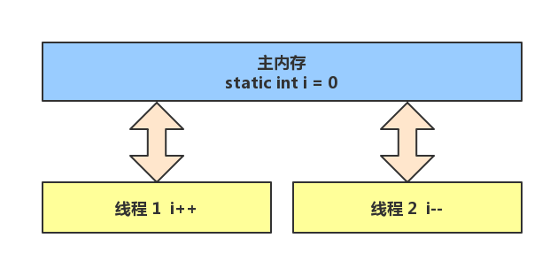

如果是单线程以上 8 行代码是顺序执行（不会交错）没有问题：

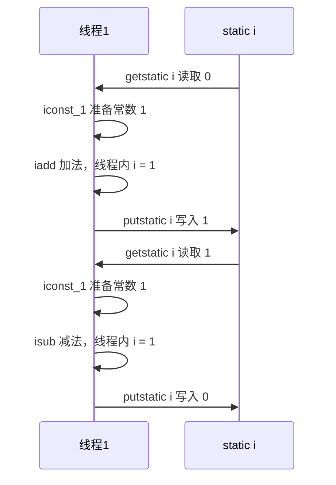

<br/>

但多线程下这 8 行代码可能交错运行： 

**出现负数的情况**

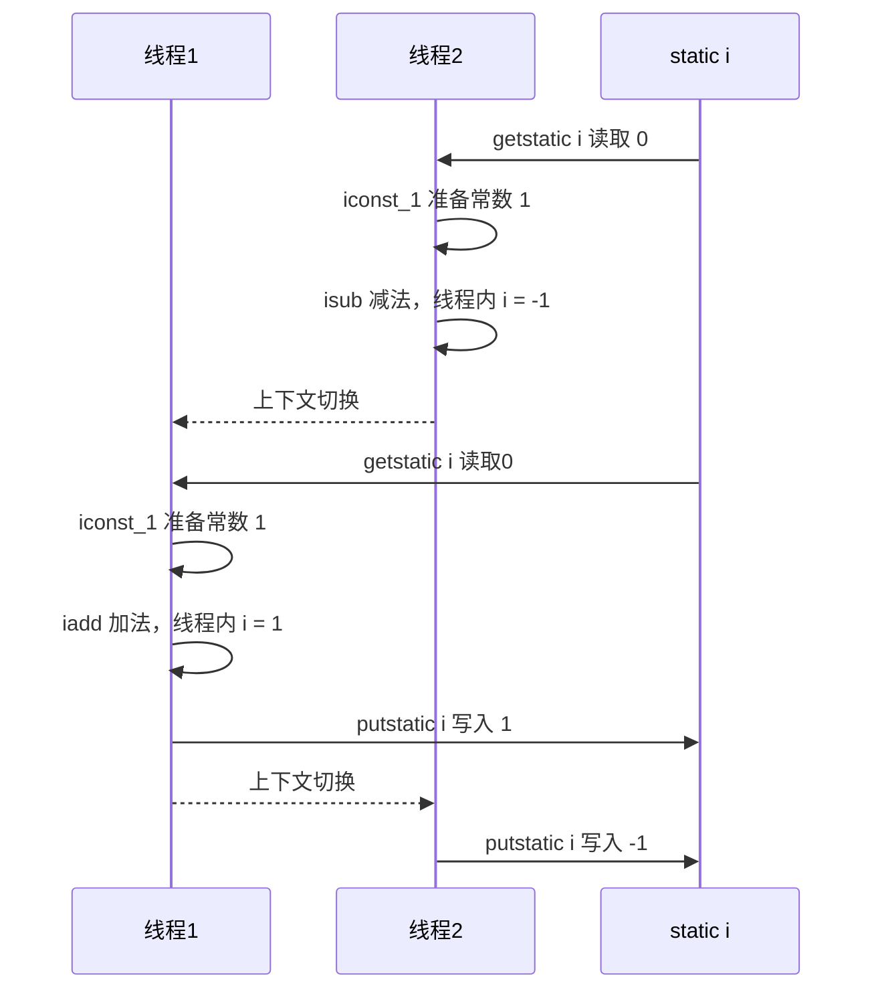

**出现正数的情况**

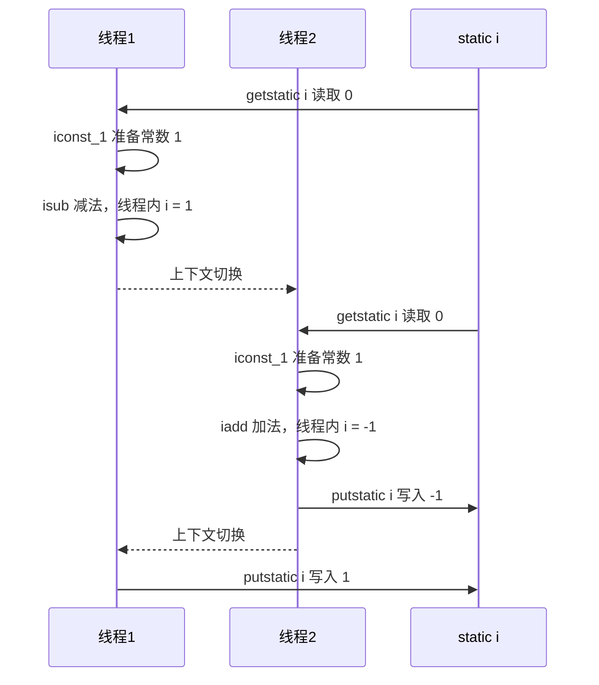

<br/>

**临界区** Critical Section

- 一个程序运行多个线程本身是没有问题的 

- 问题出在多个线程访问<mark>共享资源</mark> 

  - 多个线程读**共享资源**其实也没有问题 

  - 在多个线程对**共享资源**读写操作时发生指令交错，就会出现问题 

- 一段代码块内如果存在对共享资源的多线程读写操作，称这段代码块为**临界区**

```java
static int counter = 0;

static void increment()
    // 临界区
{
    counter++;
}
static void decrement()
    // 临界区
{
    counter--;
}
```

<br/>

**竞态条件** Race Condition

多个线程在临界区内执行，由于代码的**执行序列不同**而导致结果无法预测，称之为发生了<mark>竞态条件</mark>

<br/>

### <font color="green">*应用之互斥</font>

:::tip  提示：为了避免临界区的竞态条件发生，有多种手段可以达到目的。 

- 阻塞式的解决方案：synchronized，ReentrantLock 
- 非阻塞式的解决方案：原子变量，CAS
- 无同步方案：栈封闭，线程本地存储（Thread Local），可重入代码（Reentrant Code）

:::

本次课使用阻塞式的解决方案：synchronized，来解决上述问题，即俗称的【对象锁】，它采用互斥的方式让同一时刻至多只有一个线程能持有【对象锁】，其它线程再想获取这个【对象锁】时就会阻塞住。这样就能保证拥有锁的线程可以安全的执行临界区内的代码，不用担心线程上下文切换。

::: warning  💡虽然 Java 中互斥和同步都可以采用 `synchronized` 关键字来完成，但它们还是有区别的

- 互斥是保证临界区的竞态条件发生，同一时刻只能有一个线程执行临界区代码 
- 同步是由于线程执行的先后、顺序不同、需要一个线程等待其它线程运行到某个点

:::

<br/>

#### synchronized解决

语法

```java
synchronized(对象) // 线程1， 线程2(blocked)
{
    临界区
}
```

解决

```java
package org.itcast.thread;

import lombok.extern.slf4j.Slf4j;

/**
 * Synchronized语法
 */
@Slf4j(topic = "c.TestSynchronized")
public class TestSynchronized {
    static int counter = 0;
    static final Object room = new Object();

    public static void main(String[] args) throws InterruptedException {
        Thread t1 = new Thread(() -> {
            for (int i = 0; i < 5000; i++) {
                synchronized (room) {
                    counter++;
                }
            }
        }, "t1");
        Thread t2 = new Thread(() -> {
            for (int i = 0; i < 5000; i++) {
                synchronized (room) {
                    counter--;
                }
            }
        }, "t2");
        t1.start();
        t2.start();
        t1.join();
        t2.join();
        log.debug("{}",counter);
    }
}
```

你可以做这样的类比：

- `synchronized(对象) `中的对象，可以想象为一个房间（room），有唯一入口（门）房间只能一次进入一人进行计算，线程 t1，t2 想象成两个人
- 当线程 t1 执行到 `synchronized(room)` 时就好比 t1 进入了这个房间，并锁住了门拿走了钥匙，在门内执行`count++` 代码
- 这时候如果 t2 也运行到了 `synchronized(room) `时，它发现门被锁住了，只能在门外等待，发生了上下文切换，阻塞住了
- 这中间即使 t1 的 cpu 时间片不幸用完，被踢出了门外（不要错误理解为锁住了对象就能一直执行下去哦），这时门还是锁住的，t1 仍拿着钥匙，t2 线程还在阻塞状态进不来，只有下次轮到 t1 自己再次获得时间片时才能开门进入
- 当 t1 执行完 `synchronized{}` 块内的代码，这时候才会从 obj 房间出来并解开门上的锁，唤醒 t2 线程把钥匙给他。t2 线程这时才可以进入 obj 房间，锁住了门拿上钥匙，执行它的 `count-- `代码

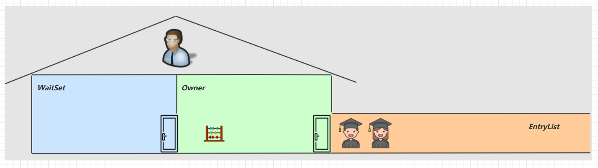

<br/>

图示流程

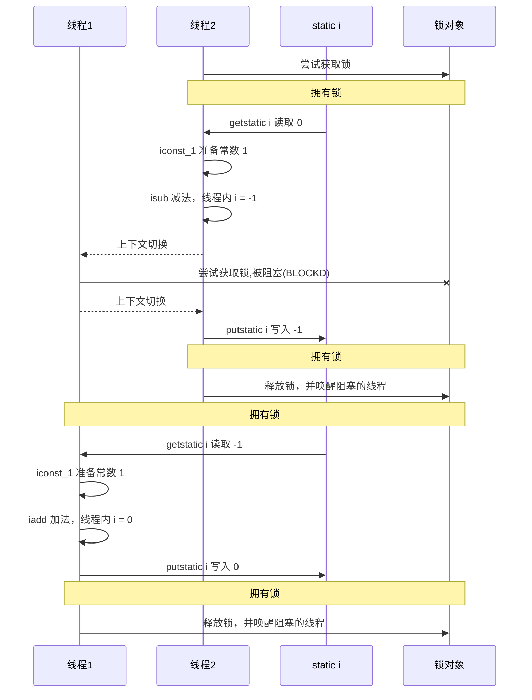

::: warning 💡 思考

> synchronized 实际是用对象锁保证了临界区内代码的原子性，临界区内的代码对外是不可分割的，不会被线程切换所打断。 
>
> 为了加深理解，请思考下面的问题
>
> - 如果把 `synchronized(obj) `放在 for 循环的外面，如何理解？-- 原子性 
> - 如果 `t1 synchronized(obj1) `而 `t2 synchronized(obj2) `会怎样运作？-- 锁对象 
> - 如果 ` t1 synchronized(obj) `而 t2 没有加会怎么样？如何理解？-- 锁对象
>

:::

<br/>

#### 面向对象改进

把需要保护的共享变量放入一个类

```java
package org.itcast.thread;

import lombok.extern.slf4j.Slf4j;

/**
 * 面向对象改进
 */
@Slf4j(topic = "c.TestClassLock")
public class TestClassLock {
    public static void main(String[] args) throws InterruptedException {
        Room room = new Room();
        Thread t1 = new Thread(() -> {
            for (int j = 0; j < 5000; j++) {
                room.increment();
            }
        }, "t1");
        Thread t2 = new Thread(() -> {
            for (int j = 0; j < 5000; j++) {
                room.decrement();
            }
        }, "t2");
        t1.start();
        t2.start();
        t1.join();
        t2.join();
        log.debug("count: {}", room.get());
    }
}

class Room {
    int value = 0;

    public void increment() {
        synchronized (this) {
            value++;
        }
    }

    public void decrement() {
        synchronized (this) {
            value--;
        }
    }

    public int get() {
        synchronized (this) {
            return value;
        }
    }
}
```

输出

```java
02:20:07 [main] c.TestClassLock - count: 0
```

<br/>

#### synchronzied简写

优点：可以控制代码的颗粒度

::: code-group

```java [方法上]
class Test{
    public synchronized void test() {

    }
}
//等价于 
class Test{
    public void test() {
        synchronized(this) {

        }
    }
}
```

```java [静态方法上]
class Test{
    public synchronized static void test() {
    }
}
//等价于
class Test{
    public static void test() {
        synchronized(Test.class) {

        }
    }
}
```

:::

<br/>

#### 线程问题考察

线程八锁:其实就是考察 synchronized 锁住的是哪个对象

:::warning 不加 `synchronized` 的方法

不加 `synchronzied` 的方法就好比不遵守规则的人，不去老实排队（好比翻窗户进去的）

:::

<br/>

**情况1**

```java
@Slf4j(topic = "c.Number")
class Number{
    public synchronized void a() {
        log.debug("1");
    }
    public synchronized void b() {
        log.debug("2");
    }
}
public static void main(String[] args) {
    Number n1 = new Number();
    new Thread(()->{ n1.a(); }).start();
    new Thread(()->{ n1.b(); }).start();
}
```

答案：12 或 21

解析：同一个线程，两个方法上都有锁，所以互斥。有可能先执行1在执行2，也有可能先执行2在执行1

<br/>

**情况2**

```java
@Slf4j(topic = "c.Number")
class Number{
    public synchronized void a() {
        sleep(1);
        log.debug("1");
    }
    public synchronized void b() {
        log.debug("2");
    }
}
public static void main(String[] args) {
    Number n1 = new Number();
    new Thread(()->{ n1.a(); }).start();
    new Thread(()->{ n1.b(); }).start();
}
```

答案：1s后12，或 2 1s后 1

解析：相同线程，两个方法都有锁，所以互斥。有可能先睡眠1s后执行1，在执行2；也有可能先执行2在睡眠1s后执行1

<br/>

**情况3**

```java
@Slf4j(topic = "c.Number")
class Number{
    public synchronized void a() {
        sleep(1);
        log.debug("1");
    }
    public synchronized void b() {
        log.debug("2");
    }
    public void c() {
        log.debug("3");
    }
}
public static void main(String[] args) {
    Number n1 = new Number();
    new Thread(()->{ n1.a(); }).start();
    new Thread(()->{ n1.b(); }).start();
    new Thread(()->{ n1.c(); }).start();
}
```

答案：3 1s 12 或 23 1s 1 或 32 1s 1

解析：方法c上没有锁，方法a和b上都是方法锁，所以c先执行或b先执行，b和c互斥。

<br/>

**情况4**

```java
@Slf4j(topic = "c.Number")
class Number{
    public synchronized void a() {
        sleep(1);
        log.debug("1");
    }
    public synchronized void b() {
        log.debug("2");
    }
}
public static void main(String[] args) {
    Number n1 = new Number();
    Number n2 = new Number();
    new Thread(()->{ n1.a(); }).start();
    new Thread(()->{ n2.b(); }).start();
}
```

答案：2 1s 后 1

解析：不同的对象，this不同，所以锁也不同，没有互斥的关系

<br/>

**情况5**

```java
@Slf4j(topic = "c.Number")
class Number{
    public static synchronized void a() {
        sleep(1);
        log.debug("1");
    }
    public synchronized void b() {
        log.debug("2");
    }
}
public static void main(String[] args) {
    Number n1 = new Number();
    new Thread(()->{ n1.a(); }).start();
    new Thread(()->{ n1.b(); }).start();
}
```

答案：2 1s 后 1

解析：相同对象但是锁对象不同，一个是类成员变量锁，一个是对象锁，所以先执行2，在一秒钟以后执行1

<br/>

**情况6**

```java
@Slf4j(topic = "c.Number")
class Number{
    public static synchronized void a() {
        sleep(1);
        log.debug("1");
    }
    public static synchronized void b() {
        log.debug("2");
    }
}
public static void main(String[] args) {
    Number n1 = new Number();
    new Thread(()->{ n1.a(); }).start();
    new Thread(()->{ n1.b(); }).start();
}
```

答案：1s 后12， 或 2 1s后 1

解析：都是类锁，互斥

<br/>

**情况7**

```java
@Slf4j(topic = "c.Number")
class Number{
    public static synchronized void a() {
        sleep(1);
        log.debug("1");
    }
    public synchronized void b() {
        log.debug("2");
    }
}
public static void main(String[] args) {
    Number n1 = new Number();
    Number n2 = new Number();
    new Thread(()->{ n1.a(); }).start();
    new Thread(()->{ n2.b(); }).start();
}
```

答案：2 1s 后 1

解析：线程不同，并且锁不同。

<br/>

**情况8**

```java
@Slf4j(topic = "c.Number")
class Number{
    public static synchronized void a() {
        sleep(1);
        log.debug("1");
    }
    public static synchronized void b() {
        log.debug("2");
    }
}
public static void main(String[] args) {
    Number n1 = new Number();
    Number n2 = new Number();
    new Thread(()->{ n1.a(); }).start();
    new Thread(()->{ n2.b(); }).start();
}
```

答案：1s 后12， 或 2 1s后 1

解析：虽然不同线程但是锁都是类对象，锁相同。

<br/>

### 变量的线程安全分析

**成员变量和静态变量是否线程安全？** 

- 如果它们没有共享，则线程安全 
- 如果它们被共享了，根据它们的状态是否能够改变，又分两种情况 
  - 如果只有读操作，则线程安全 
  - 如果有读写操作，则这段代码是<mark>临界区</mark>，需要考虑线程安全

<br/>

**局部变量是否线程安全？** 

- 局部变量是线程安全的 
- 但局部变量引用的对象则未必 
  - 如果该对象没有逃离方法的作用访问，它是线程安全的 
  - 如果该对象<mark>逃离方法的作用范围</mark>，需要考虑线程安全

<br/>

**局部变量线程安全分析**

```java
public static void test1() {
    int i = 10;
    i++;
}
```

每个线程调用 test1() 方法时局部变量 i，会在每个线程的栈帧内存中被创建多份，因此不存在共享

```java
  public static void test1();
    descriptor: ()V
    flags: ACC_PUBLIC, ACC_STATIC
    Code:
      stack=1, locals=1, args_size=0
         0: bipush        10
         2: istore_0
         3: iinc          0, 1
         6: return
      LineNumberTable:
        line 14: 0
        line 15: 3
        line 16: 6
      LocalVariableTable:
        Start  Length  Slot  Name   Signature
            3       4     0     i   I
```

如图


先看一个成员变量的例子

```java
class ThreadUnsafe {
    ArrayList<String> list = new ArrayList<>();
    public void method1(int loopNumber) {
        for (int i = 0; i < loopNumber; i++) {
            // { 临界区, 会产生竞态条件
            method2();
            method3();
            // } 临界区
        }
    }
    private void method2() {
        list.add("1");
    }
    private void method3() {
        list.remove(0);
    }
}
```

执行

```java
static final int THREAD_NUMBER = 2;
static final int LOOP_NUMBER = 200;
public static void main(String[] args) {
    ThreadUnsafe test = new ThreadUnsafe();
    for (int i = 0; i < THREAD_NUMBER; i++) {
        new Thread(() -> {
            test.method1(LOOP_NUMBER);
        }, "Thread" + i).start();
    }
}
```

其中一种情况是，如果线程2 还未 add，线程1 remove 就会报错：

```java
Exception in thread "Thread1" java.lang.IndexOutOfBoundsException: Index: 0, Size: 0 
 at java.util.ArrayList.rangeCheck(ArrayList.java:657) 
 at java.util.ArrayList.remove(ArrayList.java:496) 
 at cn.itcast.n6.ThreadUnsafe.method3(TestThreadSafe.java:35) 
 at cn.itcast.n6.ThreadUnsafe.method1(TestThreadSafe.java:26) 
 at cn.itcast.n6.TestThreadSafe.lambda$main$0(TestThreadSafe.java:14) 
 at java.lang.Thread.run(Thread.java:748) 
```

分析： 

- 无论哪个线程中的 method2 引用的都是同一个对象中的 list 成员变量 
- method3 与 method2 分析相同

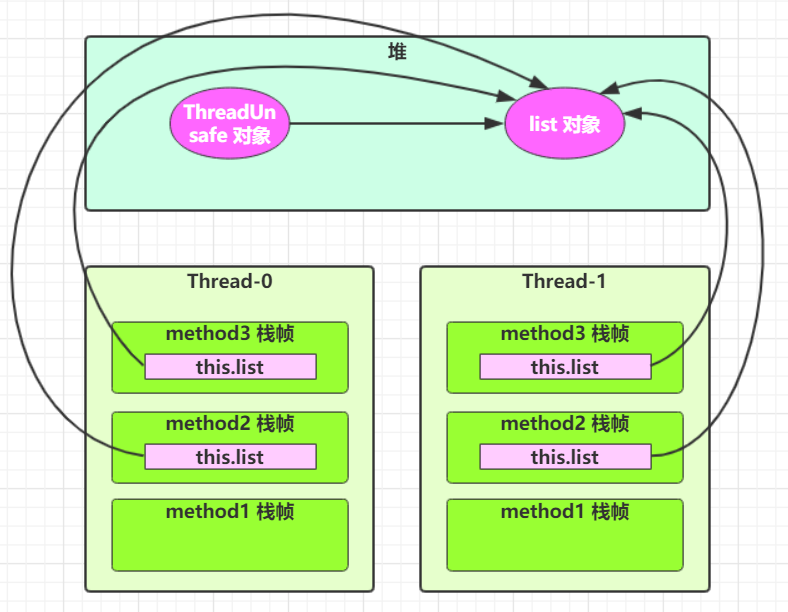

将 list 修改为局部变量

```java
class ThreadSafe {
    public final void method1(int loopNumber) {
        ArrayList<String> list = new ArrayList<>();
        for (int i = 0; i < loopNumber; i++) {
            method2(list);
            method3(list);
        }
    }
    private void method2(ArrayList<String> list) {
        list.add("1");
    }
    private void method3(ArrayList<String> list) {
        list.remove(0);
    }
}
```

那么就不会有上述问题了

分析： 

- list 是局部变量，每个线程调用时会创建其不同实例，没有共享
- 而 method2 的参数是从 method1 中传递过来的，与 method1 中引用同一个对象 
- method3 的参数分析与 method2 相同

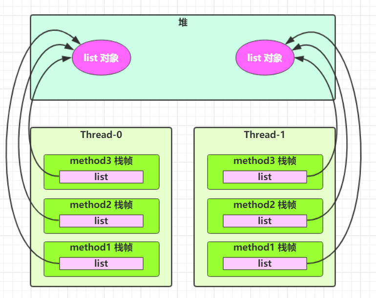


方法访问修饰符带来的思考，如果把 method2 和 method3 的方法修改为 public 会不会代理线程安全问题？ 

- 情况1：有其它线程调用 method2 和 method3 
- 情况2：在 `情况1` 的基础上，为 ThreadSafe 类添加子类，子类覆盖 method2 或 method3 方法，

```java
class ThreadSafe {
    public final void method1(int loopNumber) {
        ArrayList<String> list = new ArrayList<>();
        for (int i = 0; i < loopNumber; i++) {
            method2(list);
            method3(list);
        }
    }
  
    private void method2(ArrayList<String> list) {
        list.add("1");
    }
  
    private void method3(ArrayList<String> list) {
        list.remove(0);
    }
}
class ThreadSafeSubClass extends ThreadSafe{
  
    @Override
    public void method3(ArrayList<String> list) {
        new Thread(() -> {
            list.remove(0);
        }).start();
    }
}
```

> 从这个例子可以看出 private 或 final 提供【安全】的意义所在，请体会开闭原则中的【闭】

<br/>

#### 线程安全级别

共享数据按照线程安全程度的强弱顺序分为以下五类：不可变、绝对线程安全、相对线程安全、线程兼容、线程对立。

- 不可变：不可变的对象线程一定是安全的，不需要采取任何的线程安全保障措施。

  - String ，Integer ，StringBuffer ，Random 

- 绝对线程安全：不管运行时环境如何，调用者都不需要额外的同步措施。

- 线程相对安全：相对线程安全需要保证对这个对象单独的操作是线程安全的，在调用的时候不需要做额外的保障措施。但是对于一些特定顺序的连续调用，就可能需要在调用端使用额外的同步手段来保证调用的正确性。

  - Vector ，线程安全的List实现
  - Hashtable ，线程安全的Map实现
  - java.util.concurrent 包下的类

- 线程兼容：线程兼容是指对象本身并不是线程安全的，但是可以通过在调用端正确地使用同步手段来保证对象在并发环境中可以安全地使用，我们平常说一个类不是线程安全的，绝大多数时候指的是这一种情况。Java API 中大部分的类都是属于线程兼容的，如与前面的 Vector 和 HashTable 相对应的集合类 ArrayList 和 HashMap 等。

- 线程对立：线程对立指的是无论调用端是否采取了同步措施，都无法在多线程环境中使用的代码。由于Java语言天生具有多线程特征，线程对立的代码很少出现，而且通常有害，尽量避免。

<br/>

这里说它们是线程安全的是指，多个线程调用它们同一个实例的某个方法时，是线程安全的。也可以理解为

```java
Hashtable table = new Hashtable();

new Thread(()->{
    table.put("key", "value1");
}).start();

new Thread(()->{
    table.put("key", "value2");
}).start();
```

- 它们的每个方法是原子的 
- 但注意它们多个方法的组合不是原子的，见后面分析

<br/>

**线程安全类方法的组合**

分析下面代码是否线程安全？

```java
Hashtable table = new Hashtable();
// 线程1，线程2
if( table.get("key") == null) {
	table.put("key", value);
}
```

有可能不是安全的，需要对get元素和put元素进行同步。

<br/>

**流程图**

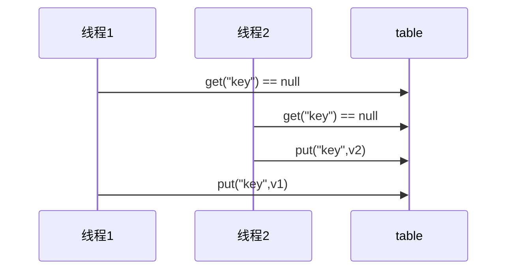

<br/>

**不可变类线程安全性**

String、Integer 等都是不可变类，因为其内部的状态不可以改变，因此它们的方法都是线程安全的。有同学或许有疑问，String 有 replace，substring 等方法【可以】改变值啊，那么这些方法又是如何保证线程安全的呢？

```java
public String substring(int beginIndex) {
    if (beginIndex < 0) {
        throw new StringIndexOutOfBoundsException(beginIndex);
    }
    int subLen = value.length - beginIndex;
    if (subLen < 0) {
        throw new StringIndexOutOfBoundsException(subLen);
    }
    //根本没有改变原有属性，通过新创建对象来实现对象不可变效果
    return (beginIndex == 0) ? this : new String(value, beginIndex, subLen);
}
```

所以不可变类都是线程安全的。

<br/>

举例：

```java
public class Immutable{
    private int value = 0;
    public Immutable(int value){
        this.value = value;
    }
    public int getValue(){
        return this.value;
    }
}
```

如果想增加一个增加的方法呢？

```java
public class Immutable{
    private int value = 0;
    public Immutable(int value){
        this.value = value;
    }
    public int getValue(){
        return this.value;
    }

    public Immutable add(int v){
        return new Immutable(this.value + v);
    }
}
```

<br/>

#### 实例分析

**例1**

```java
public class MyServlet extends HttpServlet {
    // 是否安全？
    Map<String,Object> map = new HashMap<>();
    // 是否安全？
    String S1 = "...";
    // 是否安全？
    final String S2 = "...";
    // 是否安全？
    Date D1 = new Date();
    // 是否安全？
    final Date D2 = new Date();

    public void doGet(HttpServletRequest request, HttpServletResponse response) {
        // 使用上述变量
    }
}
```

答案

```java
public class MyServlet extends HttpServlet {
    // 是否安全？ Map类不是线程安全的
    Map<String,Object> map = new HashMap<>();
    // 是否安全？ 不可变类，线程安全的
    String S1 = "...";
    // 是否安全？ 线程安全的
    final String S2 = "...";
    // 是否安全？ 线程不安全的
    Date D1 = new Date();
    // 是否安全？ Date里面的属性可以修改，所以是线程不安全的
    final Date D2 = new Date();

    public void doGet(HttpServletRequest request, HttpServletResponse response) {
        // 使用上述变量
    }
}
```

<br/>

**例2**

```java
public class MyServlet extends HttpServlet {
    // 是否安全？
    private UserService userService = new UserServiceImpl();

    public void doGet(HttpServletRequest request, HttpServletResponse response) {
        userService.update(...);
    }
}
public class UserServiceImpl implements UserService {
    // 记录调用次数
    private int count = 0;

    public void update() {
        // ...
        count++;
    }
}
```

答案

```java
public class MyServlet extends HttpServlet {
    // 是否安全？ 线程不安全的
    private UserService userService = new UserServiceImpl();

    public void doGet(HttpServletRequest request, HttpServletResponse response) {
        userService.update(...);
    }
}
public class UserServiceImpl implements UserService {
    // 记录调用次数
    private int count = 0;

    public void update() {
      	//临界区
        // ...
        count++;
        //临界区
    }
}
```

<br/>

**例3**

```java
@Aspect
@Component
public class MyAspect {
    // 是否安全？
    private long start = 0L;

    @Before("execution(* *(..))")
    public void before() {
        start = System.nanoTime();
    }

    @After("execution(* *(..))")
    public void after() {
        long end = System.nanoTime();
        System.out.println("cost time:" + (end-start));
    }
}
```

答案：线程不安全的，Spring管理的容器中没有声明多例则都是单例的，单例的成员变量都会被共享。

做成多例呢？也不行，做成多例进入的对象则不一样，无法统计消耗的时间。建议做成环绕通知，将成员变量声明为局部变量。

<br/>

**例4**

```java
public class MyServlet extends HttpServlet {
    // 是否安全
    private UserService userService = new UserServiceImpl();

    public void doGet(HttpServletRequest request, HttpServletResponse response) {
        userService.update(...);
    }
}
public class UserServiceImpl implements UserService {
    // 是否安全
    private UserDao userDao = new UserDaoImpl();

    public void update() {
        userDao.update();
    }
}
public class UserDaoImpl implements UserDao {
    public void update() {
        String sql = "update user set password = ? where username = ?";
        // 是否安全
        try (Connection conn = DriverManager.getConnection("","","")){
            // ...
        } catch (Exception e) {
            // ...
        }
    }
}
```

答案：无状态，没有成员变量，都是线程安全的。

<br/>

**例5**

```java
public class MyServlet extends HttpServlet {
    // 是否安全
    private UserService userService = new UserServiceImpl();

    public void doGet(HttpServletRequest request, HttpServletResponse response) {
        userService.update(...);
    }
}
public class UserServiceImpl implements UserService {
    // 是否安全
    private UserDao userDao = new UserDaoImpl();

    public void update() {
        userDao.update();
    }
}
public class UserDaoImpl implements UserDao {
    // 是否安全
    private Connection conn = null;
    public void update() throws SQLException {
        String sql = "update user set password = ? where username = ?";
        conn = DriverManager.getConnection("","","");
        // ...
        conn.close();
    }
}
```

答案：线程不安全的，connection没有做成方法里面的局部变量，而做成了类里面的成员变量，会被多个线程共享。

<br/>

**例6**

```java
public class MyServlet extends HttpServlet {
    // 是否安全
    private UserService userService = new UserServiceImpl();

    public void doGet(HttpServletRequest request, HttpServletResponse response) {
        userService.update(...);
    }
}
public class UserServiceImpl implements UserService {
    public void update() {
        UserDao userDao = new UserDaoImpl();
        userDao.update();
    }
}
public class UserDaoImpl implements UserDao {
    // 是否安全
    private Connection = null;
    public void update() throws SQLException {
        String sql = "update user set password = ? where username = ?";
        conn = DriverManager.getConnection("","","");
        // ...
        conn.close();
    }
}
```

答案：与第六个例子不同的地方是UserServicelmpl每次调用UserDao都会创建新的对象，多个线程使用的Connection都不会共享，所以不会有线程安全问题。但是不推荐这样使用。

<br/>

**例7**

```java
public abstract class Test {

    public void bar() {
        // 是否安全
        SimpleDateFormat sdf = new SimpleDateFormat("yyyy-MM-dd HH:mm:ss");
        foo(sdf);
    }

    public abstract foo(SimpleDateFormat sdf);


    public static void main(String[] args) {
        new Test().bar();
    }
}
```

其中 foo 的行为是不确定的，可能导致不安全的发生，被称之为**外星方法**

```java
public void foo(SimpleDateFormat sdf) {
    String dateStr = "1999-10-11 00:00:00";
    for (int i = 0; i < 20; i++) {
        new Thread(() -> {
            try {
                sdf.parse(dateStr);
            } catch (ParseException e) {
                e.printStackTrace();
            }
        }).start();
    }
}
```

请比较 JDK 中 String 类的实现。String类就是final的，其他类不能对String类进行继承，所以String类下的方法不能被重写，复合设计模式中的开闭原则。

<br/>

#### 卖票练习

进行卖票练习和转账练习来更好的理解如何解决线程安全问题

测试下面代码是否存在线程安全问题，并尝试改正

```java {17,21}
package org.itcast.thread;

import lombok.extern.slf4j.Slf4j;

import java.util.ArrayList;
import java.util.List;
import java.util.Random;
import java.util.Vector;

@Slf4j(topic = "c.ExerciseSell")
public class ExerciseSell {
    public static void main(String[] args) {
        TicketWindow ticketWindow = new TicketWindow(2000);
        List<Thread> list = new ArrayList<>();
        
      // 用来存储买出去多少张票
        List<Integer> sellCount = new Vector<>();
        for (int i = 0; i < 2000; i++) {
            Thread t = new Thread(() -> {
                // 分析这里的竞态条件
                int count = ticketWindow.sell(randomAmount());
                sellCount.add(count);
            });
            list.add(t);
            t.start();
        }
        list.forEach((t) -> {
            try {
                t.join();
            } catch (InterruptedException e) {
                e.printStackTrace();
            }
        });
        // 买出去的票求和
        log.debug("selled count:{}", sellCount.stream().mapToInt(c -> c).sum());
        // 剩余票数
        log.debug("remainder count:{}", ticketWindow.getCount());
    }

    // Random 为线程安全
    static Random random = new Random();

    // 随机 1~5
    public static int randomAmount() {
        return random.nextInt(5) + 1;
    }
}

class TicketWindow {
    private int count;

    public TicketWindow(int count) {
        this.count = count;
    }

    public int getCount() {
        return count;
    }

    public int sell(int amount) {
        if (this.count >= amount) {
            this.count -= amount;
            return amount;
        } else {
            return 0;
        }
    }
}

```

如何改正

- 将sell方法声明为synchronized即可
  - 因为售票窗口只有一个，所以方法锁也是可以生效的
- 注意只将对count进行修改的一行代码用synchronized括起来也不行。对count大小的判断也必须是为原子操作的一部分，否则也会导致count值异常。

改正的代码

```java
//在方法上加一个synchronized即可
public synchronized int sell(int amount) {
    if (this.count >= amount) {
        this.count -= amount;
        return amount;
    } else {
        return 0;
    }
}
```

另外，用下面的代码行不行，为什么？

- 不行，因为sellCount会被多个线程共享，必须使用线程安全的实现类。

```java
List<Integer> sellCount = new ArrayList<>();
```

测试脚本

```sh
for /L %n in (1,1,10) do java -cp ".;C:\Users\manyh\.m2\repository\ch\qos\logback\logbackclassic\1.2.3\logback-classic-1.2.3.jar;C:\Users\manyh\.m2\repository\ch\qos\logback\logbackcore\1.2.3\logback-core-1.2.3.jar;C:\Users\manyh\.m2\repository\org\slf4j\slf4japi\1.7.25\slf4j-api-1.7.25.jar" cn.itcast.n4.exercise.ExerciseSell
```

说明：

- 两段没有前后因果关系的临界区代码，只需要保证各自的原子性即可，不需要括起来。

<br/>

#### 转账练习

测试下面代码是否存在线程安全问题，并尝试改正

```java
package org.itcast.thread;

import lombok.extern.slf4j.Slf4j;

import java.util.Random;

@Slf4j(topic = "c.ExerciseTransfer")
public class ExerciseTransfer {
    public static void main(String[] args) throws InterruptedException {
        Account a = new Account(1000);
        Account b = new Account(1000);
        Thread t1 = new Thread(() -> {
            for (int i = 0; i < 1000; i++) {
                a.transfer(b, randomAmount());
            }
        }, "t1");
        Thread t2 = new Thread(() -> {
            for (int i = 0; i < 1000; i++) {
                b.transfer(a, randomAmount());
            }
        }, "t2");
        t1.start();
        t2.start();
        t1.join();
        t2.join();
        // 查看转账2000次后的总金额
        log.debug("total:{}", (a.getMoney() + b.getMoney()));
    }

    // Random 为线程安全
    static Random random = new Random();

    // 随机 1~100
    public static int randomAmount() {
        return random.nextInt(100) + 1;
    }
}

class Account {
    private int money;

    public Account(int money) {
        this.money = money;
    }

    public int getMoney() {
        return money;
    }

    public void setMoney(int money) {
        this.money = money;
    }

    public void transfer(Account target, int amount) {
        if (this.money > amount) {
            this.setMoney(this.getMoney() - amount);
            target.setMoney(target.getMoney() + amount);
        }
    }
}
```

这样改正行不行，为什么？

```java
public synchronized void transfer(Account target, int amount) {
    if (this.money > amount) {
        this.setMoney(this.getMoney() - amount);
        target.setMoney(target.getMoney() + amount);
    }
}
```

回答：不行，因为不同线程调用此方法，将会锁住不同的对象

<br/>

如何改正：将transfer方法的方法体用同步代码块包裹，将当Account.class设为锁对象。

```java
public void transfer(Account target, int amount) {
    synchronized(Account.class){
      if (this.money > amount) {
          this.setMoney(this.getMoney() - amount);
          target.setMoney(target.getMoney() + amount);
      }
    }
}
```

<br/>

### <font color='blue'>* 原理之 synchronized</font>

[synchronized原理](juc-theory-synchronized.md)

## wait & notify

小故事为什么需要wait

由于条件不满足，小南不能继续进行计算，但小南如果一直占用着锁，其它人就得一直阻塞，效率太低。

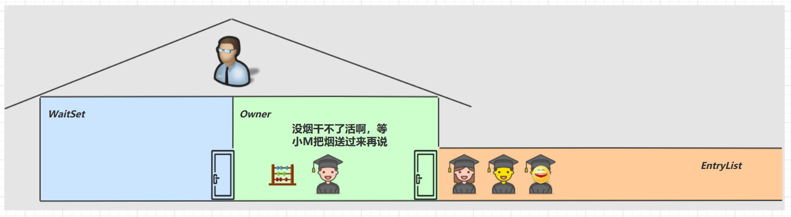

于是老王单开了一间休息室（调用 wait 方法），让小南到休息室（WaitSet）等着去了，但这时锁释放开，其它人可以由老王随机安排进屋。直到小M将烟送来，大叫一声 [ 你的烟到了 ] （调用 notify 方法）

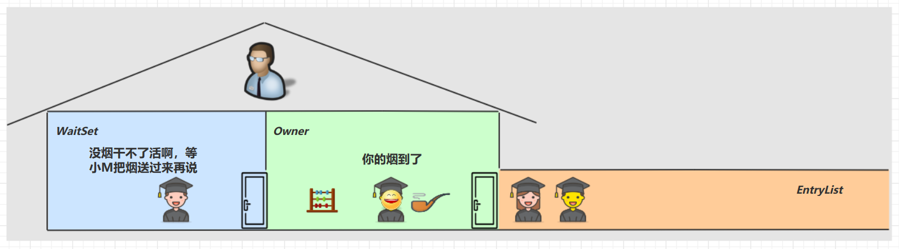

小南于是可以离开休息室，重新进入竞争锁的队列

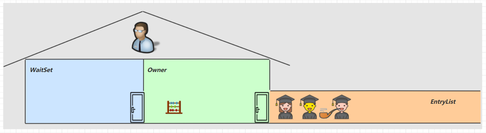

<br/>

### <font color='blue'>* 原理之 wait / notify</font>

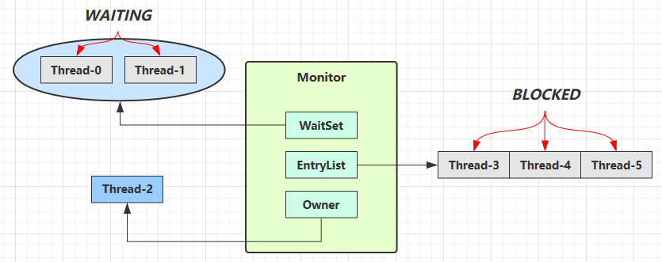

- Owner 线程发现条件不满足，调用 wait 方法，即可进入 WaitSet 变为 WAITING 状态 
- BLOCKED 和 WAITING 的线程都处于阻塞状态，不占用 CPU 时间片 
- BLOCKED 线程会在 Owner 线程释放锁时唤醒 
- WAITING 线程会在 Owner 线程调用 notify 或 notifyAll 时唤醒，但唤醒后并不意味者立刻获得锁，仍需进入 EntryList 重新竞争

<br/>

**API 介绍** 

- `obj.wait()` 让进入 object 监视器的线程到 waitSet 等待 
- `obj.notify()` 在 object 上正在 waitSet 等待的线程中挑一个唤醒 
- `obj.notifyAll()` 让 object 上正在 waitSet 等待的线程全部唤醒

<br/>

它们都是线程之间进行协作的手段，都属于 Object 对象的方法。必须获得此对象的锁，才能调用这几个方法

```java
package org.itcast.thread;

import lombok.extern.slf4j.Slf4j;
import org.itcast.util.Sleeper;

@Slf4j(topic = "c.TestWaitNotify")
public class TestWaitNotify {
    final static Object obj = new Object();

    public static void main(String[] args) {
      
        new Thread(() -> {
            synchronized (obj) {
                log.debug("执行....");
                try {
                    obj.wait(); // 让线程在obj上一直等待下去
                } catch (InterruptedException e) {
                    e.printStackTrace();
                }
                log.debug("其它代码....");
            }
        }).start();

        new Thread(() -> {
            synchronized (obj) {
                log.debug("执行....");
                try {
                    obj.wait(); // 让线程在obj上一直等待下去
                } catch (InterruptedException e) {
                    e.printStackTrace();
                }
                log.debug("其它代码....");
            }
        }).start();

        // 主线程两秒后执行
        Sleeper.sleep(2);
        log.debug("唤醒 obj 上其它线程");
        synchronized (obj) {
          	// 唤醒obj上一个线程
            obj.notify();  // [!code --]
            // 唤醒obj上所有等待线程
            obj.notifyAll(); // [!code ++]
        }
    }
}
```

notify 的一种结果

```sh
20:00:53.096 [Thread-0] c.TestWaitNotify - 执行.... 
20:00:53.099 [Thread-1] c.TestWaitNotify - 执行.... 
20:00:55.096 [main] c.TestWaitNotify - 唤醒 obj 上其它线程
20:00:55.096 [Thread-0] c.TestWaitNotify - 其它代码.... 
```

notifyAll 的结果

```sh {5}
19:58:15.457 [Thread-0] c.TestWaitNotify - 执行.... 
19:58:15.460 [Thread-1] c.TestWaitNotify - 执行.... 
19:58:17.456 [main] c.TestWaitNotify - 唤醒 obj 上其它线程
19:58:17.456 [Thread-1] c.TestWaitNotify - 其它代码.... 
19:58:17.456 [Thread-0] c.TestWaitNotify - 其它代码.... 
```

- `wait()` 方法会释放对象的锁，进入 WaitSet 等待区，从而让其他线程就机会获取对象的锁。无限制等待，直到 notify 为止。
- `wait(long n)` 有时限的等待, 到 n 毫秒后结束等待，进入运行态，或是被 notify。

<br/>

::: warning 💡 面试官：`sleep(long n)` 和 `wait(long n)` 的相同与区别

相同点

- `sleep(long n)` 和 `wait(long n)` 的效果都是让当前线程放弃CPU的使用权，进入等待状态。
- `sleep(long n)` 和 `wait(long n)` 都可以清除打断状态

不同点

- 方法归属不同：`sleep(long n)` 属于静态方法， `wait(long n)` 属于Object成员方法
- 醒来时机不同：`sleep(long n)` 和 `wait(long n)` 虽然都会等待相应毫秒后醒来，但是`wait(long n)`  和 `wait()`  都可以通过 `notify()` 唤醒，并且`wait()` 不唤醒就会一直等待下去
- 锁特性不同： 
  - `wait()` 方法的调用必须获取 `wait()`对象的锁，而`sleep()`没有此限制
  - `wait()` 方法执行后会释放对象锁，允许其它线程获取该对象锁。（我放弃CPU，你们还可以用）
  - `sleep(long n)` 如果在 synchronized 代码块中执行，并不会释放对象锁。（我放弃CPU，但是你们也不能用）

:::

<br/>

```java
package org.itcast.thread;

import lombok.extern.slf4j.Slf4j;

@Slf4j(topic = "c.TestWaitAndSleep")
public class TestWaitAndSleep {
    static final Object LOCK = new Object();

    public static void main(String[] args) throws InterruptedException {
        waiting();
        sleeping();
    }

    private static void waiting() throws InterruptedException {
        Thread t1 = new Thread(() -> {
            synchronized (LOCK) {
                try {
                    log.debug("waiting...");
                    LOCK.wait(5000L);
                } catch (InterruptedException e) {
                    log.debug("interrupted...");
                    e.printStackTrace();
                }
            }
        }, "t1");
        t1.start();

        Thread.sleep(1000);
        synchronized (LOCK) {
            log.debug("other...");
        }

    }

    private static void sleeping() throws InterruptedException {
        Thread t1 = new Thread(() -> {
            synchronized (LOCK) {
                try {
                    log.debug("sleeping...");
                    Thread.sleep(5000L);
                } catch (InterruptedException e) {
                    log.debug("interrupted...");
                    e.printStackTrace();
                }
            }
        }, "t1");
        t1.start();

        Thread.sleep(100);
        synchronized (LOCK) {
            log.debug("other...");
        }
    }
}

```

输出

```sh {2,4}
22:28:45 [t1] c.TestWaitAndSleep - waiting...
22:28:46 [main] c.TestWaitAndSleep - other...
22:28:46 [t1] c.TestWaitAndSleep - sleeping...
22:28:51 [main] c.TestWaitAndSleep - other...
```


###  wait/notify 的正确姿势

**Step1** 

思考下面的解决方案好不好，为什么？

```java
package org.itcast.thread;

import lombok.extern.slf4j.Slf4j;
import org.itcast.util.Sleeper;

@Slf4j(topic = "c.TestCorrectPosture")
public class TestCorrectPosture {
    // 对象锁
    static final Object room = new Object();
    static boolean hasCigarette = false;

    public static void main(String[] args) {
        new Thread(() -> {
            synchronized (room) {
                log.debug("有烟没");
                if (!hasCigarette) {
                    log.debug("没烟，休息一会儿");
                    Sleeper.sleep(2);
                }
                log.debug("有烟没？[{}]", hasCigarette);
                if (hasCigarette) {
                    log.debug("可以开始干活了");
                }
            }
        }, "小南").start();

        for (int i = 0; i < 5; i++) {
            new Thread(() -> {
                synchronized (room) {
                    log.debug("可以干活了");
                }
            }, "其他人").start();
        }

        Sleeper.sleep(1);

        new Thread(() -> {
            // 这里能不能加 synchronized (room)？
            hasCigarette = true;
            log.debug("烟到了噢！");
        }, "送烟的").start();
    }
}
```

输出

```sh
23:01:32 [小南] c.TestCorrectPosture - 有烟没
23:01:32 [小南] c.TestCorrectPosture - 没烟，休息一会儿
23:01:33 [送烟的] c.TestCorrectPosture - 烟到了噢！
23:01:34 [小南] c.TestCorrectPosture - 有烟没？[true]
23:01:34 [小南] c.TestCorrectPosture - 可以开始干活了
23:01:34 [其他人] c.TestCorrectPosture - 可以干活了
23:01:34 [其他人] c.TestCorrectPosture - 可以干活了
23:01:34 [其他人] c.TestCorrectPosture - 可以干活了
23:01:34 [其他人] c.TestCorrectPosture - 可以干活了
23:01:34 [其他人] c.TestCorrectPosture - 可以干活了
```

- 其它干活的线程，都要一直阻塞，效率太低 
- 小南线程必须睡足 2s 后才能醒来，就算烟提前送到，也无法立刻醒来 
- 加了 `synchronized (room) `后，就好比小南在里面反锁了门睡觉，烟根本没法送进门，main 没加 `synchronized` 就好像 main 线程是翻窗户进来的 
- 解决方法，使用 wait - notify 机制

<br/>

**Step2**

思考下面的实现行吗，为什么？主要修改点

- 将小南里面的 sleep方法替换成了 wait方法
- 送烟的加上了 `synchronized` 并且使用 `room.notify()`

```java
package org.itcast.thread;

import lombok.extern.slf4j.Slf4j;
import org.itcast.util.Sleeper;

@Slf4j(topic = "c.TestCorrectPosture")
public class TestCorrectPosture {
    // 对象锁
    static final Object room = new Object();
    static boolean hasCigarette = false;

    public static void main(String[] args) {
        new Thread(() -> {
            synchronized (room) {
                log.debug("有烟没");
                if (!hasCigarette) {
                  	log.debug("没烟，休息一会儿");
                    Sleeper.sleep(2);                		// [!code --]
                    // 等待2秒钟重新进入运行态（需要去竞争）  // [!code ++]
                    try {                               // [!code ++]
                        room.wait(2000);         				// [!code ++]
                    } catch (InterruptedException e) {  // [!code ++]
                        throw new RuntimeException(e);  // [!code ++]
                    }                                   // [!code ++]
                }
                log.debug("有烟没？[{}]", hasCigarette);
                if (hasCigarette) {
                    log.debug("可以开始干活了");
                }
            }
        }, "小南").start();

        for (int i = 0; i < 5; i++) {
            new Thread(() -> {
                synchronized (room) {
                    log.debug("可以干活了");
                }
            }, "其他人").start();
        }

        Sleeper.sleep(1);

        new Thread(() -> {
            synchronized (room) { // [!code ++]
                hasCigarette = true;
                log.debug("烟到了噢！");
                room.notify();
            }
        }, "送烟的").start();
    }
}
```

输出

```sh
14:55:12 [小南] c.TestCorrectPosture - 有烟没
14:55:12 [小南] c.TestCorrectPosture - 没烟，休息一会儿
14:55:12 [其他人] c.TestCorrectPosture - 可以干活了
14:55:12 [其他人] c.TestCorrectPosture - 可以干活了
14:55:12 [其他人] c.TestCorrectPosture - 可以干活了
14:55:12 [其他人] c.TestCorrectPosture - 可以干活了
14:55:12 [其他人] c.TestCorrectPosture - 可以干活了
14:55:13 [送烟的] c.TestCorrectPosture - 烟到了噢！
14:55:13 [小南] c.TestCorrectPosture - 有烟没？[true]
14:55:13 [小南] c.TestCorrectPosture - 可以开始干活了
```

- 解决了其它干活的线程阻塞的问题 
- 但如果有其它线程也在等待条件呢？

<br/>

**Step3**

新增小女线程

```java
package org.itcast.thread;

import lombok.extern.slf4j.Slf4j;
import org.itcast.util.Sleeper;

@Slf4j(topic = "c.TestCorrectPosture2")
public class TestCorrectPosture2 {
    static final Object room = new Object();
    static boolean hasCigarette = false;
    static boolean hasTakeout = false;

    public static void main(String[] args) {
        new Thread(() -> {
            synchronized (room) {
                log.debug("有烟没？[{}]", hasCigarette);
                if (!hasCigarette) {
                    log.debug("没烟，先歇会！");
                    try {
                        room.wait();
                    } catch (InterruptedException e) {
                        e.printStackTrace();
                    }
                }
                log.debug("有烟没？[{}]", hasCigarette);
                if (hasCigarette) {
                    log.debug("可以开始干活了");
                } else {
                    log.debug("没干成活...");
                }
            }
        }, "小南").start();

        new Thread(() -> {
            synchronized (room) {
                log.debug("外卖送到没？[{}]", hasTakeout);
                if (!hasTakeout) {
                    log.debug("没外卖，先歇会！");
                    try {
                        room.wait();
                    } catch (InterruptedException e) {
                        e.printStackTrace();
                    }
                }
                log.debug("外卖送到没？[{}]", hasTakeout);
                if (hasTakeout) {
                    log.debug("可以开始干活了");
                } else {
                    log.debug("没干成活...");
                }
            }
        }, "小女").start();

        Sleeper.sleep(1);

        new Thread(() -> {
            synchronized (room) {
                hasTakeout = true;
                log.debug("外卖到了噢！");
                room.notify();
            }
        }, "送外卖的").start();
    }
}
```

输出

```sh
15:01:58 [小南] c.TestCorrectPosture2 - 有烟没？[false]
15:01:58 [小南] c.TestCorrectPosture2 - 没烟，先歇会！
15:01:58 [小女] c.TestCorrectPosture2 - 外卖送到没？[false]
15:01:58 [小女] c.TestCorrectPosture2 - 没外卖，先歇会！
15:01:59 [送外卖的] c.TestCorrectPosture2 - 外卖到了噢！
15:01:59 [小南] c.TestCorrectPosture2 - 有烟没？[false]
15:01:59 [小南] c.TestCorrectPosture2 - 没干成活...
```

- `notify` 只能随机唤醒一个 `WaitSet` 中的线程，这时如果有其它线程也在等待，那么就可能唤醒不了正确的线程，称之为【虚假唤醒】 
- 解决方法，改为 `notifyAll`

<br/>

**Step4**

```java
new Thread(() -> {
    synchronized (room) {
        hasTakeout = true;
        log.debug("外卖到了噢！");
        room.notifyAll();
    }
}, "送外卖的").start();
```

输出

```sh
20:55:23.978 [小南] c.TestCorrectPosture - 有烟没？[false] 
20:55:23.982 [小南] c.TestCorrectPosture - 没烟，先歇会！
20:55:23.982 [小女] c.TestCorrectPosture - 外卖送到没？[false] 
20:55:23.982 [小女] c.TestCorrectPosture - 没外卖，先歇会！
20:55:24.979 [送外卖的] c.TestCorrectPosture - 外卖到了噢！
20:55:24.979 [小女] c.TestCorrectPosture - 外卖送到没？[true] 
20:55:24.980 [小女] c.TestCorrectPosture - 可以开始干活了
20:55:24.980 [小南] c.TestCorrectPosture - 有烟没？[false] 
20:55:24.980 [小南] c.TestCorrectPosture - 没干成活... 
```

- 用 notifyAll 仅解决某个线程的唤醒问题，但使用 `if + wait` 判断仅有一次机会，一旦条件不成立，就没有重新判断的机会了 
- 解决方法，用 `while + wait`，当条件不成立，再次 wait

<br/>

**Step5** 

将 if 改为 while

```java
if (!hasCigarette) {
    log.debug("没烟，先歇会！");
    try {
        room.wait();
    } catch (InterruptedException e) {
        e.printStackTrace();
    }
}
```

改动后

```java
while (!hasCigarette) {
    log.debug("没烟，先歇会！");
    try {
        room.wait();
    } catch (InterruptedException e) {
        e.printStackTrace();
    }
}
```

输出

```sh
20:58:34.322 [小南] c.TestCorrectPosture - 有烟没？[false] 
20:58:34.326 [小南] c.TestCorrectPosture - 没烟，先歇会！
20:58:34.326 [小女] c.TestCorrectPosture - 外卖送到没？[false] 
20:58:34.326 [小女] c.TestCorrectPosture - 没外卖，先歇会！
20:58:35.323 [送外卖的] c.TestCorrectPosture - 外卖到了噢！
20:58:35.324 [小女] c.TestCorrectPosture - 外卖送到没？[true] 
20:58:35.324 [小女] c.TestCorrectPosture - 可以开始干活了
20:58:35.324 [小南] c.TestCorrectPosture - 没烟，先歇会！
```

模版

```java
static boolean condition = false;

synchronized(lock) {
    while(condition) {
        lock.wait();
    }
    // 干活
}
//另一个线程
synchronized(lock) {
    condition = true;
    lock.notifyAll();
}	
```

最终代码

```java
package org.itcast.thread;

import lombok.extern.slf4j.Slf4j;
import org.itcast.util.Sleeper;

@Slf4j(topic = "c.TestCorrectPosture2")
public class TestCorrectPosture2 {
    static final Object room = new Object();
    static boolean hasCigarette = false;
    static boolean hasTakeout = false;

    public static void main(String[] args) {
        new Thread(() -> {
            synchronized (room) {
                log.debug("有烟没？[{}]", hasCigarette);
                while (!hasCigarette) {
                    log.debug("没烟，先歇会！");
                    try {
                        room.wait();
                    } catch (InterruptedException e) {
                        e.printStackTrace();
                    }
                }
                log.debug("有烟没？[{}]", hasCigarette);
                if (hasCigarette) {
                    log.debug("可以开始干活了");
                } else {
                    log.debug("没干成活...");
                }
            }
        }, "小南").start();

        new Thread(() -> {
            synchronized (room) {
                log.debug("外卖送到没？[{}]", hasTakeout);
                while (!hasTakeout) {
                    log.debug("没外卖，先歇会！");
                    try {
                        room.wait();
                    } catch (InterruptedException e) {
                        e.printStackTrace();
                    }
                }
                log.debug("外卖送到没？[{}]", hasTakeout);
                if (hasTakeout) {
                    log.debug("可以开始干活了");
                } else {
                    log.debug("没干成活...");
                }
            }
        }, "小女").start();

        Sleeper.sleep(1);

        new Thread(() -> {
            synchronized (room) {
                hasTakeout = true;
                log.debug("外卖到了噢！");
                room.notifyAll();
            }
        }, "送外卖的").start();
    }
}
```

<br/>

### <font color='orange'>* 模式之保护性暂停</font>

**定义** 

即 Guarded Suspension，**用在一个线程等待另一个线程的执行结果** 

要点 

- 有一个结果需要从一个线程传递到另一个线程，让他们关联同一个 GuardedObject 
- 如果有结果不断从一个线程到另一个线程那么可以使用消息队列（见生产者/消费者） 
- JDK 中，Join 的实现、Future 的实现，采用的就是此模式 
- 因为要等待另一方的结果，因此归类到同步模式

 

<br/>

**实现**：一个线程等待另一个线程的执行结果

:::code-group

```java [实现类] {5,8,12,25}
package org.itcast.pattern;

public class GuardedObject {
    private Object response;
    private final Object lock = new Object();

    public Object get() {
        synchronized (lock) {
            // 条件不满足则等待
            while (response == null) {
                try {
                    lock.wait();
                } catch (InterruptedException e) {
                    e.printStackTrace();
                }
            }
            return response;
        }
    }

    public void complete(Object response) {
        synchronized (lock) {
            // 条件满足，通知等待线程
            this.response = response;
            lock.notifyAll();
        }
    }
}
```

```java [工具类]
package org.itcast.pattern;

import java.io.BufferedReader;
import java.io.IOException;
import java.io.InputStreamReader;
import java.net.HttpURLConnection;
import java.net.URL;
import java.nio.charset.StandardCharsets;
import java.util.ArrayList;
import java.util.List;

public class Downloader {
    public static List<String> download() throws IOException {
        HttpURLConnection conn = (HttpURLConnection) 
                new URL("https://www.baidu.com/").openConnection();
        
        List<String> lines = new ArrayList<>();
        try (BufferedReader reader = new BufferedReader(
                new InputStreamReader(conn.getInputStream(),
                StandardCharsets.UTF_8))
        ) {
            String line;
            while ((line = reader.readLine()) != null) {
                lines.add(line);
            }
        }
        return lines;
    }
}
```

```java [执行类]
package org.itcast.pattern;

import lombok.extern.slf4j.Slf4j;

import java.io.IOException;
import java.util.List;

@Slf4j(topic = "c.TestGuardedObject")
public class TestGuardedObject {
    public static void main(String[] args) {
        GuardedObject guardedObject = new GuardedObject();
        new Thread(() -> {
            try {
                List<String> download = Downloader.download();
                log.debug("down complete");
                guardedObject.complete(download);
            } catch (IOException e) {
                throw new RuntimeException(e);
            }
        }).start();

        log.debug("waiting");
        Object response = guardedObject.get();
        log.debug("get response:[{}]lines", ((List<String>) response).size());
    }
}
```

::: 

执行结果

```sh
08:42:18.568 [main] c.TestGuardedObject - waiting...
08:42:23.312 [Thread-0] c.TestGuardedObject - download complete...
08:42:23.312 [main] c.TestGuardedObject - get response: [3] lines
```

<br/>

#### 带超时版 GuardedObject 

::: code-group

```java [带超时时间]{8,11,25,43}
package org.itcast.pattern;

import lombok.extern.slf4j.Slf4j;

@Slf4j(topic = "c.GuardedObjectV2")
public class GuardedObjectV2 {
    private Object response;
    private final Object lock = new Object();

    public Object get(long millis) {
        synchronized (lock) {
            // 1) 记录最初时间
            long begin = System.currentTimeMillis();
            // 2) 已经经历的时间
            long timePassed = 0;
            while (response == null) {
                // 4) 假设 millis 是 1000，结果在 400 时唤醒了，那么还有 600 要等
                long waitTime = millis - timePassed;
                log.debug("waitTime: {}", waitTime);
                if (waitTime <= 0) {
                    log.debug("break...");
                    break;
                }
                try {
                    lock.wait(waitTime);
                } catch (InterruptedException e) {
                    e.printStackTrace();
                }
                // 3) 如果提前被唤醒，这时已经经历的时间假设为 400
                timePassed = System.currentTimeMillis() - begin;
                log.debug("timePassed: {}, object is null {}",
                        timePassed, response == null);
            }
            return response;
        }
    }

    public void complete(Object response) {
        synchronized (lock) {
            // 条件满足，通知等待线程
            this.response = response;
            log.debug("notify...");
            lock.notifyAll();
        }
    }
}
```

```java [正常版] {9}
public static void main(String[] args) {
    GuardedObjectV2 v2 = new GuardedObjectV2();
    new Thread(() -> {
        sleep(1);
        v2.complete(null);
        sleep(1);
        v2.complete(Arrays.asList("a", "b", "c"));
    }).start();
    Object response = v2.get(2500);
    if (response != null) {
        log.debug("get response: [{}] lines", ((List<String>) response).size());
    } else {
        log.debug("can't get response");
    }
}
```

```java [超时版]
public static void main(String[] args) {
    GuardedObjectV2 v2 = new GuardedObjectV2();
    new Thread(() -> {
        sleep(1);
        v2.complete(null);
        sleep(1);
        v2.complete(Arrays.asList("a", "b", "c"));
    }).start();
    Object response = v2.get(2500);// [!code --]
    Object response = v2.get(1500);// [!code ++]
    if (response != null) {
        log.debug("get response: [{}] lines", ((List<String>) response).size());
    } else {
        log.debug("can't get response");
    }
}
```

::: 

超时版输出

```sh
08:49:39.917 [main] c.GuardedObjectV2 - waitTime: 2500
08:49:40.917 [Thread-0] c.GuardedObjectV2 - notify...
08:49:40.917 [main] c.GuardedObjectV2 - timePassed: 1003, object is null true
08:49:40.917 [main] c.GuardedObjectV2 - waitTime: 1497
08:49:41.918 [Thread-0] c.GuardedObjectV2 - notify...
08:49:41.918 [main] c.GuardedObjectV2 - timePassed: 2004, object is null false
08:49:41.918 [main] c.TestGuardedObjectV2 - get response: [3] lines
```

正常版输出

```sh
08:47:54.963 [main] c.GuardedObjectV2 - waitTime: 1500
08:47:55.963 [Thread-0] c.GuardedObjectV2 - notify...
08:47:55.963 [main] c.GuardedObjectV2 - timePassed: 1002, object is null true
08:47:55.963 [main] c.GuardedObjectV2 - waitTime: 498
08:47:56.461 [main] c.GuardedObjectV2 - timePassed: 1500, object is null true
08:47:56.461 [main] c.GuardedObjectV2 - waitTime: 0
08:47:56.461 [main] c.GuardedObjectV2 - break...
08:47:56.461 [main] c.TestGuardedObjectV2 - can't get response
08:47:56.963 [Thread-0] c.GuardedObjectV2 - notify...
```

<br/>

#### <font color='blue'>* 原理之 join</font>

是调用者轮询检查线程 alive 状态

```java
t1.join();
```

等价于下面的代码

```java
synchronized (t1) {
    // 调用者线程进入 t1 的 waitSet 等待, 直到 t1 运行结束
    while (t1.isAlive()) {
        t1.wait(0);
    }
}
```

> **注意** 
>
> join 体现的是【保护性暂停】模式，请参考之

源码：

```java
//不带参
public final void join() throws InterruptedException {
    join(0);
}
//带参
//等待时长的实现类似于之前的保护性暂停
public final synchronized void join(long millis)
    throws InterruptedException {
    long base = System.currentTimeMillis();
    long now = 0;

    if (millis < 0) {
        throw new IllegalArgumentException("timeout value is negative");
    }

    if (millis == 0) {
        while (isAlive()) {
            wait(0);
        }
    } else {
        while (isAlive()) {
            long delay = millis - now;
            if (delay <= 0) {
                break;
            }
            wait(delay);
            now = System.currentTimeMillis() - base;
        }
    }
}
```

<br/>

#### 多任务版GuardedObject 

图中 Futures 就好比居民楼一层的信箱（每个信箱有房间编号），左侧的 t0，t2，t4 就好比等待邮件的居民，右 侧的 t1，t3，t5 就好比邮递员 。

如果需要在多个类之间使用 GuardedObject 对象，作为参数传递不是很方便，因此设计一个用来解耦的中间类， 这样不仅能够解耦【结果等待者】和【结果生产者】，还能够同时支持多个任务的管理。


<br/>

**代码实现**

::: code-group

```java [标识类] {48,68}
package org.itcast.pattern;

import lombok.extern.slf4j.Slf4j;

/**
 * 多任务版本
 */
@Slf4j(topic = "c.GuardedTask")
public class GuardedTask {
    private int id;

    public GuardedTask(int id) {
        this.id = id;
    }

    public int getId() {
        return id;
    }

    public void setId(int id) {
        this.id = id;
    }

    private Object response;

    /**
     *  获取对象方法
     * @param timeout 超时时间
     * @return 返回结果对象
     */
    public Object get(long timeout) {
        synchronized (this) {
            // 开始时间
            long base = System.currentTimeMillis();
            // 经过时间
            long now = 0;

            while (response == null) {
                // 消耗的时间
                long delay = timeout - now;

                // 时间消耗完则退出
                if (delay <= 0) {
                    break;
                }

                try {
                    this.wait(delay);
                } catch (InterruptedException e) {
                    e.printStackTrace();
                }

                // 重新计算当前时间
                now = System.currentTimeMillis() - base;
            }

            return response;
        }
    }

    /**
     * 产生结果
     * @param response 传入结果
     */
    public void complete(Object response) {
        synchronized (this) {
            this.response = response;
            this.notifyAll();
        }
    }
}
```

```java [中间解耦类]{11}
package org.itcast.pattern;

import java.util.Hashtable;
import java.util.Map;
import java.util.Set;

/**
 * 中间解耦类
 */
public class Mailboxes {
    private static Map<Integer, GuardedTask> boxes = new Hashtable<>();

    private static int id = 1;

    private static synchronized int generateId() {
        return id++;
    }

    public static GuardedTask get(int id) {
        return boxes.remove(id);
    }

    public static GuardedTask create() {
        GuardedTask gt = new GuardedTask(generateId());
        boxes.put(gt.getId(), gt);
        return gt;
    }

    public static Set<Integer> getIds() {
        return boxes.keySet();
    }
}
```

:::

业务相关类

::: code-group

```java [收信人]
package org.itcast.pattern;

import lombok.extern.slf4j.Slf4j;

@Slf4j(topic = "c.People")
class People extends Thread {
    @Override
    public void run() {
        // 收信
        GuardedTask guardedTask = Mailboxes.create();
        log.debug("开始收信 id:{}", guardedTask.getId());
        Object mail = guardedTask.get(5000);
        log.debug("收到信 id:{}, 内容:{}", guardedTask.getId(), mail);
    }
}
```

```java [送信人]
package org.itcast.pattern;

import lombok.extern.slf4j.Slf4j;

@Slf4j(topic = "c.Postman")
class Postman extends Thread {
    private int id;
    private String mail;

    public Postman(int id, String mail) {
        this.id = id;
        this.mail = mail;
    }
    @Override
    public void run() {
        GuardedTask guardedTask = Mailboxes.get(id);
        log.debug("送信 id:{}, 内容:{}", id, mail);
        guardedTask.complete(mail);
    }
}
```

```java [测试类]
package org.itcast.pattern;

import lombok.extern.slf4j.Slf4j;

import java.io.IOException;
import java.util.List;

@Slf4j(topic = "c.TestGuardedObject")
public class TestGuardedObject {
    public static void main(String[] args) {
        GuardedObject guardedObject = new GuardedObject();
        new Thread(() -> {
            try {
                List<String> download = Downloader.download();
                log.debug("down complete");
                guardedObject.complete(download);
            } catch (IOException e) {
                throw new RuntimeException(e);
            }
        }).start();

        log.debug("waiting");
        Object response = guardedObject.get();
        log.debug("get response:[{}]lines", ((List<String>) response).size());
    }
}
```

:::

某次运行结果

```sh
10:35:05.689 c.People [Thread-1] - 开始收信 id:3
10:35:05.689 c.People [Thread-2] - 开始收信 id:1
10:35:05.689 c.People [Thread-0] - 开始收信 id:2
10:35:06.688 c.Postman [Thread-4] - 送信 id:2, 内容:内容2
10:35:06.688 c.Postman [Thread-5] - 送信 id:1, 内容:内容1
10:35:06.688 c.People [Thread-0] - 收到信 id:2, 内容:内容2
10:35:06.688 c.People [Thread-2] - 收到信 id:1, 内容:内容1
10:35:06.688 c.Postman [Thread-3] - 送信 id:3, 内容:内容3
10:35:06.689 c.People [Thread-1] - 收到信 id:3, 内容:内容3
```

某次错误的运行结果

```sh
16:35:09 [Thread-2] c.People - 开始收信 id:3
16:35:09 [Thread-1] c.People - 开始收信 id:2
16:35:09 [Thread-0] c.People - 开始收信 id:1
Exception in thread "main" java.util.ConcurrentModificationException
	at java.util.Hashtable$Enumerator.next(Hashtable.java:1412)
	at org.itcast.pattern.GuardedTaskMain.main(GuardedTaskMain.java:11)
16:35:10 [Thread-4] c.Postman - 开始送信 id:2
16:35:10 [Thread-3] c.Postman - 开始送信 id:3
16:35:10 [Thread-1] c.People - 收到信 id:2, 内容:邮递员发送的内容为2
16:35:10 [Thread-2] c.People - 收到信 id:3, 内容:邮递员发送的内容为3
16:35:14 [Thread-0] c.People - 收到信 id:1, 内容:null
```

<br/>

### <font color='orange'>* 模式之生产者消费者</font>

**定义**

- 与前面的保护性暂停中的 GuardObject 不同，不需要产生结果和消费结果的线程一一对应 
- 消费队列可以用来平衡生产和消费的线程资源 
- 生产者仅负责产生结果数据，不关心数据该如何处理，而消费者专心处理结果数据 
- 消息队列是有容量限制的，满时不会再加入数据，空时不会再消耗数据 
- JDK 中各种阻塞队列，采用的就是这种模式

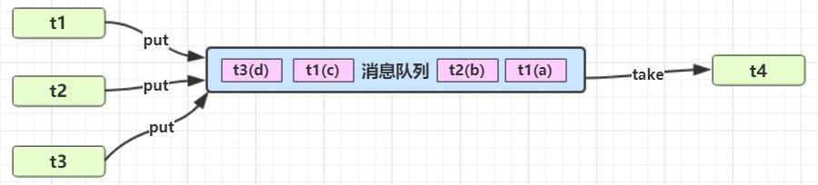

实现

::: code-group

```java [消息类]
package org.itcast.pattern;

public class Message {
    private int id;
    private Object message;

    public Message(int id, Object message) {
        this.id = id;
        this.message = message;
    }

    public int getId() {
        return id;
    }

    public Object getMessage() {
        return message;
    }
}

```

```java [消息队列类] {33,34,54,55}
package org.itcast.pattern;

import lombok.extern.slf4j.Slf4j;

import java.util.LinkedList;

@Slf4j(topic = "c.MessageQueue")
public class MessageQueue {
    private LinkedList<Message> queue;

    private final int capacity;

    public MessageQueue(int capacity) {
        this.capacity = capacity;
        queue = new LinkedList<>();
    }

    /**
     * @return 取出消息队列
     */
    public Message take() {
        synchronized (queue) {
            while (queue.isEmpty()) {
                log.debug("queue is empty, wait");

                try {
                    queue.wait();
                } catch (InterruptedException e) {
                    e.printStackTrace();
                }
            }

            Message message = queue.removeFirst();
            queue.notifyAll();
            return message;
        }
    }

    /**
     * @param message 放入队列
     */
    public void put(Message message) {
        synchronized (queue) {
            while (queue.size() == capacity) {
                log.debug("stocks has reached the limit,wait");

                try {
                    queue.wait();
                } catch (InterruptedException e) {
                    e.printStackTrace();
                }
            }

            queue.addLast(message);
            queue.notifyAll();
        }
    }
}
```

```java [测试类]
package org.itcast.pattern;

import lombok.extern.slf4j.Slf4j;

import java.io.IOException;
import java.util.List;

@Slf4j(topic = "c.TestProducerConsumer")
public class TestProducerConsumer {
    public static void main(String[] args) {
        MessageQueue messageQueue = new MessageQueue(2);
        // 4 个生产者线程, 下载任务
        for (int i = 0; i < 4; i++) {
            int id = i;
            new Thread(() -> {
                try {
                    log.debug("download...");
                    List<String> response = Downloader.download();
                    log.debug("try put message({})", id);
                    messageQueue.put(new Message(id, response));
                } catch (IOException e) {
                    e.printStackTrace();
                }
            }, "生产者" + i).start();
        }

        // 1 个消费者线程, 处理结果
        new Thread(() -> {
            while (true) {
                Message message = messageQueue.take();
                List<String> response = (List<String>) message.getMessage();
                log.debug("take message({}): [{}] lines", message.getId(), response.size());
            }
        }, "消费者").start();
    }
}
```

:::

某次运行结果

```sh
17:05:15 [生产者2] c.TestProducerConsumer - download...
17:05:15 [消费者] c.MessageQueue - queue is empty, wait
17:05:15 [生产者3] c.TestProducerConsumer - download...
17:05:15 [生产者1] c.TestProducerConsumer - download...
17:05:15 [生产者0] c.TestProducerConsumer - download...
17:05:16 [生产者2] c.TestProducerConsumer - try put message(2)
17:05:16 [生产者1] c.TestProducerConsumer - try put message(1)
17:05:16 [生产者0] c.TestProducerConsumer - try put message(0)
17:05:16 [生产者3] c.TestProducerConsumer - try put message(3)
17:05:16 [生产者0] c.MessageQueue - stocks has reached the limit,wait
17:05:16 [生产者1] c.MessageQueue - stocks has reached the limit,wait
17:05:16 [消费者] c.TestProducerConsumer - take message(2): [3] lines
17:05:16 [消费者] c.TestProducerConsumer - take message(3): [3] lines
17:05:16 [消费者] c.TestProducerConsumer - take message(0): [3] lines
17:05:16 [消费者] c.TestProducerConsumer - take message(1): [3] lines
17:05:16 [消费者] c.MessageQueue - queue is empty, wait
```

<br/>

## Park & Unpark

### 基本使用

它们是 LockSupport 类中的方法

```java
// 暂停当前线程
LockSupport.park(); 
// 恢复某个线程的运行
LockSupport.unpark(暂停线程对象)
```

先 park 再 unpark

```java
Thread t1 = new Thread(() -> {
    log.debug("start...");
    sleep(1);
    log.debug("park...");
    LockSupport.park();
    log.debug("resume...");
},"t1");
t1.start();
sleep(2);
log.debug("unpark...");
LockSupport.unpark(t1);
```

输出

```sh
18:42:52.585 c.TestParkUnpark [t1] - start... 
18:42:53.589 c.TestParkUnpark [t1] - park... 
18:42:54.583 c.TestParkUnpark [main] - unpark... 
18:42:54.583 c.TestParkUnpark [t1] - resume... 
```

先 unpark 再 park

```java
Thread t1 = new Thread(() -> {
    log.debug("start...");
    sleep(2);
    log.debug("park...");
    LockSupport.park();
    log.debug("resume...");
}, "t1");
t1.start();
sleep(1);
log.debug("unpark...");
LockSupport.unpark(t1);
```

输出

```sh
18:43:50.765 c.TestParkUnpark [t1] - start... 
18:43:51.764 c.TestParkUnpark [main] - unpark... 
18:43:52.769 c.TestParkUnpark [t1] - park... 
18:43:52.769 c.TestParkUnpark [t1] - resume... 
```

<br/>

:::warning 💡 `unpack & park` 与 `wait & notify` 对比

- `wait & notify` 必须配合 `Object Monitor` 一起使用，而 `park & unpark` 不必

- `park & unpark` 是以线程为单位来【阻塞】和【唤醒】线程，而 notify 只能随机唤醒一个等待线程，notifyAll  是唤醒所有等待线程，就不那么【精确】 

- `park & unpark` 可以先 unpark，而 `wait & notify `不能先 notify

::: 

<br/>


### <font color='blue' id='park'>*原理之park和unpark</font>

每个线程都有自己的一个 Parker 对象(由C++编写，java中不可见)，由三部分组成 `_counter `， `_cond `和 `_mutex` 打个比喻 

- 线程就像一个旅人，Parker 就像他随身携带的背包，条件变量就好比背包中的帐篷。`_counter` 就好比背包的备用干粮（0 为耗尽，1 为充足） 
- 调用 `park` 就是要看需不需要停下来歇息 

  - 如果备用干粮耗尽，那么钻进帐篷歇息 
  - 如果备用干粮充足，那么不需停留，继续前进 
- 调用 `unpark`，就好比令干粮充足 

  - 如果这时线程还在帐篷，就唤醒让他继续前进 
- 如果这时线程还在运行，那么下次他调用 park 时，仅是消耗掉备用干粮，不需停留继续前进 
  
  - 因为背包空间有限，多次调用 unpark 仅会补充一份备用干粮

<br/>


#### 调用Park场景

1. 当前线程调用 `Unsafe.park()` 方法
2. 检查 `_counter `，本情况为 0，这时，获得 _mutex 互斥锁
3. 线程进入 `_cond` 条件变量阻塞
4. 设置 `_counter = 0`

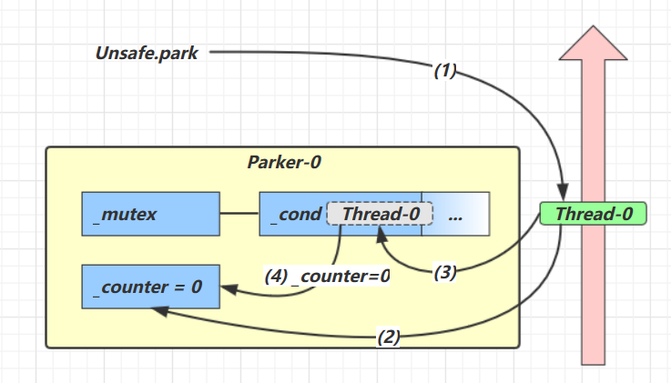

<br/>

#### 调用Unpark场景

1. 调用 `Unsafe.unpark(Thread_0)` 方法，设置 `_counter` 为 1 
2. 唤醒` _cond `条件变量中的 `Thread_0 `
3. `Thread_0` 恢复运行 
4. 设置 `_counter  =  0`

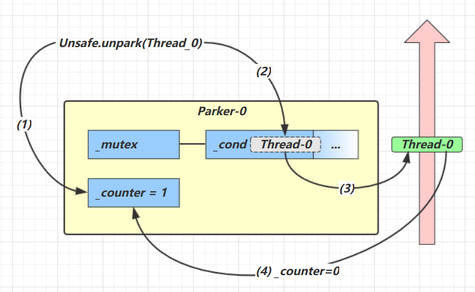

<br/>

#### 先调用Unpark在调用Park场景

1. 调用 `Unsafe.unpark(Thread_0)` 方法，设置 `_counter` 为 1 
2. 当前线程调用 `Unsafe.park()` 方法 
3. 检查 `_counter` ，本情况为 1，这时线程无需阻塞，继续运行 
4. 设置 `_counter =  0`

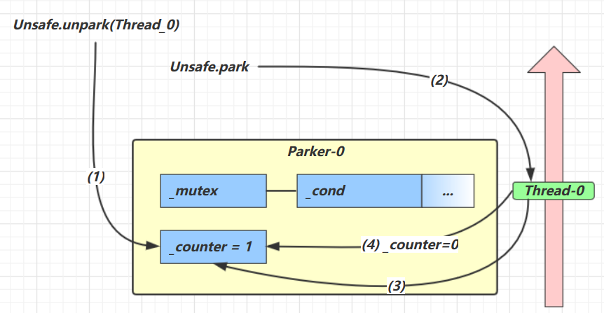

<br/>

## 线程状态转换

JDK中的Thread类中的枚举State

```java
public enum State {
    /**
     * 尚未启动的线程的线程状态
     */
    NEW,

    /**
     * 可运行线程的线程状态。处于可运行状态的线程正在 Java 虚拟机中执行，但它可能正在等待来自操作系统的其他资源，例如处理器。
     */
    RUNNABLE,

    /**
     * 线程阻塞等待监视器锁的线程状态。处于阻塞状态的线程正在等待监视器锁进入同步块/方法或在调用Object.wait后重新进入同步块/方法。
     */
    BLOCKED,

    /**
     * 等待线程的线程状态。由于调用以下方法之一，线程处于等待状态：
     * Object.wait没有超时
     * 没有超时的Thread.join
     * LockSupport.park
     * 处于等待状态的线程正在等待另一个线程执行特定操作。
     * 例如，一个对对象调用Object.wait()的线程正在等待另一个线程对该对象调用Object.notify()或Object.notifyAll() 。已调用Thread.join()的线程正在等待指定线程终止。
     */
    WAITING,

    /**
     * 具有指定等待时间的等待线程的线程状态。由于以指定的正等待时间调用以下方法之一，线程处于定时等待状态：
     * Thread.sleep
     * Object.wait超时
     * Thread.join超时
     * LockSupport.parkNanos
     * LockSupport.parkUntil
     * </ul>
     */
    TIMED_WAITING,

    /**
     * 已终止线程的线程状态。线程已完成执行
     */
    TERMINATED
}
```

### 状态之间如何转换


分别是

* 新建
  * 当一个线程对象被创建，但还未调用 start 方法时处于**新建**状态
  * 此时未与操作系统底层线程关联
* 可运行
  * 调用了 start 方法，就会由**新建**进入**可运行**
  * 此时与底层线程关联，由操作系统调度执行
* 终结
  * 线程内代码已经执行完毕，由**可运行**进入**终结**
  * 此时会取消与底层线程关联
* 阻塞
  * 当获取锁失败后，由**可运行**进入 Monitor 的阻塞队列**阻塞**，此时不占用 cpu 时间
  * 当持锁线程释放锁时，会按照一定规则唤醒阻塞队列中的**阻塞**线程，唤醒后的线程进入**可运行**状态
* 等待
  * 当获取锁成功后，但由于条件不满足，调用了 wait() 方法，此时从**可运行**状态释放锁进入 Monitor 等待集合**等待**，同样不占用 cpu 时间
  * 当其它持锁线程调用 notify() 或 notifyAll() 方法，会按照一定规则唤醒等待集合中的**等待**线程，恢复为**可运行**状态
* 有时限等待
  * 当获取锁成功后，但由于条件不满足，调用了 wait(long) 方法，此时从**可运行**状态释放锁进入 Monitor 等待集合进行**有时限等待**，同样不占用 cpu 时间
  * 当其它持锁线程调用 notify() 或 notifyAll() 方法，会按照一定规则唤醒等待集合中的**有时限等待**线程，恢复为**可运行**状态，并重新去竞争锁
  * 如果等待超时，也会从**有时限等待**状态恢复为**可运行**状态，并重新去竞争锁
  * 还有一种情况是调用 sleep(long) 方法也会从**可运行**状态进入**有时限等待**状态，但与 Monitor 无关，不需要主动唤醒，超时时间到自然恢复为**可运行**状态

<br/>

::: warning 💡思考：线程包括哪些状态，状态之间是如何变化的？

在JDK中的Thread类中有枚举State里面定义了六种状态，分别为新建，可运行，终结，阻塞，等待，有限等待。

- 当一个线程对象被创建，还没有调用 start 方法时处于新建状态，调用了 start 方法则从新建状态进入了可运行状态，如果线程内的代码执行完了，则会由可运行状态进入终结状态。这是一个线程正常的状态。
- 如果线程获取锁失败，则会从可运行状态进入 Monitor 的阻塞队列阻塞，只有当持有锁的线程释放了，就会按照一定的规则唤醒阻塞队列中的线程，唤醒后的线程则进入可运行状态。
- 如果线程获取锁成功，但是由于条件不满足，调用了 wait 方法，从可运行状态释放锁进入了等待状态，当持有线程的锁调用了 notify 方法或 notifyAll 方法后会进入去重新竞争锁。如果是调用了带参的 wait 方法，则会在等待时间结束以后去重新竞争锁。
- 还有另一种情况是调用 sleep 的带参方法也会从可运行状态进入有限等待状态，不需要主动唤醒，超时时间到了自然恢复到可运行状态。

:::

<br/>

### 代码之间如何转换


情况 1 `NEW --> RUNNABLE`

- 当调用 `t.start()` 方法时，由 NEW --> RUNNABLE

<br/>

情况 2 `RUNNABLE <--> WAITING` 

**t 线程**用 `synchronized(obj)` 获取了对象锁后 

- 调用 `obj.wait()` 方法时，**t 线程**从 `RUNNABLE --> WAITING` 
- 调用 `obj.notify()` ， `obj.notifyAll()` ， `t.interrupt()` 时 
  - 竞争锁成功，**t 线程**从 `WAITING --> RUNNABLE` 
  - 竞争锁失败，**t 线程**从 `WAITING --> BLOCKED`

```java
@Slf4j(topic = "c.TestWaitNotify")
public class TestWaitNotify {
    final static Object obj = new Object();
    static boolean condition = false;

    public static void main(String[] args) {
        Thread t1 = new Thread(() -> {
            synchronized (obj) {
                log.debug("执行.... t1 state {}", Thread.currentThread().getState());
                while (!condition) {
                    try {
                        obj.wait(); // 让线程在obj上一直等待下去
                    } catch (InterruptedException e) {
                        e.printStackTrace();
                    }
                }
                log.debug("开始干活... t1 state {}", Thread.currentThread().getState());
            }
        });

        Thread t2 = new Thread(() -> {
            synchronized (obj) {
                log.debug("执行.... t2 state {}", Thread.currentThread().getState());
                while (!condition) {
                    try {
                        obj.wait(); // 让线程在obj上一直等待下去
                    } catch (InterruptedException e) {
                        e.printStackTrace();
                    }
                }
                log.debug("开始干活... t2 state {}", Thread.currentThread().getState());
            }
        });

        t1.start();
        t2.start();

        // 主线程两秒后执行
        Sleeper.sleep(2);
        log.debug("t1 state {}", t1.getState());
        log.debug("t2 state {}", t2.getState());
        log.debug("唤醒 obj 上其它线程");
        synchronized (obj) {
            // 唤醒obj上所有等待线程
            condition = true;
            obj.notifyAll();

        }
        log.debug("t1 state {}", t1.getState());
        log.debug("t2 state {}", t2.getState());
    }
}
```

控制台输出

```sh
23:22:29 [Thread-0] c.TestWaitNotify - 执行.... t1 state RUNNABLE
23:22:29 [Thread-1] c.TestWaitNotify - 执行.... t2 state RUNNABLE
23:22:31 [main] c.TestWaitNotify - t1 state WAITING
23:22:31 [main] c.TestWaitNotify - t2 state WAITING
23:22:31 [main] c.TestWaitNotify - 唤醒 obj 上其它线程
23:22:31 [main] c.TestWaitNotify - t1 state BLOCKED
23:22:31 [Thread-1] c.TestWaitNotify - 开始干活... t2 state RUNNABLE
23:22:31 [main] c.TestWaitNotify - t2 state RUNNABLE
23:22:31 [Thread-0] c.TestWaitNotify - 开始干活... t1 state RUNNABLE
```

<br/>

情况 3 `RUNNABLE <--> WAITING` 

- **当前线程 `t2` 用 `t1.join()` 方法时，**当前线程**从 `RUNNABLE --> WAITING` 注意是**当前线程 `t2`  在 `t1` 线程对象的监视器上等待 
- **`t1` 线程**运行结束，或调用了**当前线程**的 interrupt() 时，当前线程 `t2`从 `WAITING --> RUNNABLE`

```java
/**
 * 应用之统筹
 */
@Slf4j(topic = "c.TestMakeTea")
public class TestMakeTea {

    public static void main(String[] args) {
        Thread t1 = new Thread(() -> {
            log.debug("洗茶壶");
            Sleeper.sleep(1);
            log.debug("洗茶杯");
            Sleeper.sleep(2);
            log.debug("拿茶叶");
            Sleeper.sleep(5);

        }, "小王");

        Thread t2 = new Thread(() -> {
            log.debug("洗水壶");
            Sleeper.sleep(1);
            log.debug("烧开水");
            Sleeper.sleep(3);

            try {
                t1.join();
                log.debug("t2 state {}",Thread.currentThread().getState());
            } catch (InterruptedException e) {
                throw new RuntimeException(e);
            }
            log.debug("泡茶");

        }, "老王");


        t1.start();
        t2.start();

        Sleeper.sleep(5);
        log.debug("t2 state {}", t2.getState());
    }
}
```

控制台输出

```java
22:32:37 [老王] c.TestMakeTea - 洗水壶
22:32:37 [小王] c.TestMakeTea - 洗茶壶
22:32:38 [老王] c.TestMakeTea - 烧开水
22:32:38 [小王] c.TestMakeTea - 洗茶杯
22:32:40 [小王] c.TestMakeTea - 拿茶叶
22:32:42 [main] c.TestMakeTea - t2 state WAITING
22:32:45 [老王] c.TestMakeTea - t2 state RUNNABLE
22:32:45 [老王] c.TestMakeTea - 泡茶
```

<br/>

情况 4 `RUNNABLE <--> WAITING` 

- **当前线程**调用 `LockSupport.park()` 方法会让**当前线程**从 `RUNNABLE --> WAITING` 
- 调用 `LockSupport.unpark`(目标线程) 或调用了线程 的 `interrupt()` ，会让目标线程从 `WAITING -->  RUNNABLE`

```java
/**
 * 测试打断线程
 */
@Slf4j(topic = "c.TestInterrupt")
public class TestInterrupt {
    public static void main(String[] args) throws InterruptedException {
        Thread t1 = new Thread(() -> {
            log.debug("park...");
            LockSupport.park();
            log.debug("unpark");
            log.debug("t1 state {}", Thread.currentThread().getState());
            log.debug("打断状态:{}", Thread.currentThread().isInterrupted());
        }, "t1");

        t1.start();

        Sleeper.sleep(0.5);
        log.debug("t1 state {}", t1.getState());
        t1.interrupt();
    }
}
```

控制台输出

```sh
22:54:36 [t1] c.TestInterrupt - park...
22:54:37 [main] c.TestInterrupt - t1 state WAITING
22:54:37 [t1] c.TestInterrupt - unpark
22:54:37 [t1] c.TestInterrupt - t1 state RUNNABLE
22:54:37 [t1] c.TestInterrupt - 打断状态:true
```

<br/>

情况 5 `RUNNABLE <--> TIMED_WAITING`

**t 线程**用 `synchronized(obj)` 获取了对象锁后 

- 调用 `obj.wait(long n)` 方法时，**t 线程**从 `RUNNABLE --> TIMED_WAITING` 
- **t 线程**等待时间超过了 n 毫秒，或调用 `obj.notify()` ， `obj.notifyAll()` ，` t.interrupt() `时 
  - 竞争锁成功，**t 线程**从 `TIMED_WAITING --> RUNNABLE` 
  - 竞争锁失败，**t 线程**从 `TIMED_WAITING --> BLOCKED`

<br/>

情况 6 `RUNNABLE <--> TIMED_WAITING` 

- **当前线程**调用 `t.join(long n)` 方法时，**当前线程**从 `RUNNABLE --> TIMED_WAITING` 注意是当前线程在**t 线程**对象的监视器上等待 
- **当前线程**等待时间超过了 n 毫秒，或**t 线程**运行结束，或调用了**当前线程**的 `interrupt()` 时，当前线程从 `TIMED_WAITING --> RUNNABLE`

<br/>

情况 7 `RUNNABLE <--> TIMED_WAITING` 

- **当前线程**调用 `Thread.sleep(long n)` ，**当前线程**从 `RUNNABLE --> TIMED_WAITING` 
- **当前线程**等待时间超过了 n 毫秒，**当前线程**从 `TIMED_WAITING --> RUNNABLE`

<br/>

情况 8 `RUNNABLE <--> TIMED_WAITING` 

- **当前线程**调用 `LockSupport.parkNanos(long nanos)` 或 `LockSupport.parkUntil(long millis)` 时，**当前线程**从 `RUNNABLE --> TIMED_WAITING `
- 调用 `LockSupport.unpark`(目标线程) 或调用了线程 的 `interrupt()` ，或是等待超时，会让目标线程从 `TIMED_WAITING--> RUNNABLE`

<br/>

情况 9 `RUNNABLE <--> BLOCKED` 

- **t 线程**用 `synchronized(obj)` 获取了对象锁时如果竞争失败，从 `RUNNABLE --> BLOCKED` 
- 持 obj 锁线程的同步代码块执行完毕，会唤醒该对象上所有 `BLOCKED` 的线程重新竞争，如果其中 **t 线程**竞争 成功，从 `BLOCKED --> RUNNABLE` ，其它失败的线程仍然 `BLOCKED`

<br/>

情况 10 `RUNNABLE <--> TERMINATED` 

- 当前线程所有代码运行完毕，进入 `TERMINATED`

<br/>

所有方法总结

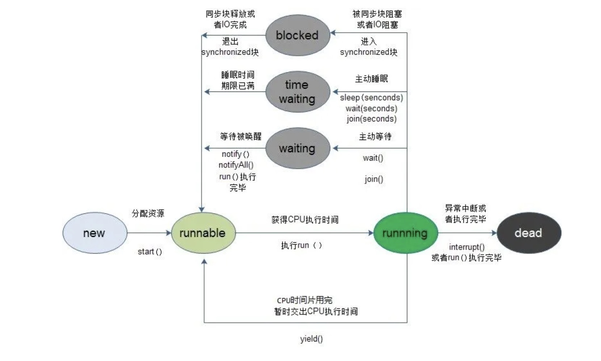

## ReentrantLock

### 多把锁问题

**多把不相干的锁**：一间大屋子有两个功能：睡觉、学习，互不相干。 现在小南要学习，小女要睡觉，但如果只用一间屋子（一个对象锁）的话，那么并发度很低。

解决方法是准备多个房间（多个对象锁） 

例如

```java
class BigRoom {
    public void sleep() {
        synchronized (this) {
            log.debug("sleeping 2 小时");
            Sleeper.sleep(2);
        }
    }
    public void study() {
        synchronized (this) {
            log.debug("study 1 小时");
            Sleeper.sleep(1);
        }
    }
}
```

执行

```java
BigRoom bigRoom = new BigRoom();
new Thread(() -> {
    bigRoom.compute();
},"小南").start();
new Thread(() -> {
    bigRoom.sleep();
},"小女").start();
```

结果

```sh
12:13:54.471 [小南] c.BigRoom - study 1 小时
12:13:55.476 [小女] c.BigRoom - sleeping 2 小时
```

改进

```java
class BigRoom {
    private final Object studyRoom = new Object();
    private final Object bedRoom = new Object();
    public void sleep() {
        synchronized (bedRoom) {
            log.debug("sleeping 2 小时");
            Sleeper.sleep(2);
        }
    }
    public void study() {
        synchronized (studyRoom) {
            log.debug("study 1 小时");
            Sleeper.sleep(1);
        }
    }
}
```

某次执行结果

```sh
12:15:35.069 [小南] c.BigRoom - study 1 小时
12:15:35.069 [小女] c.BigRoom - sleeping 2 小时
```

将锁的粒度细分 

- 好处，是可以增强并发度 
- 坏处，如果一个线程需要同时获得多把锁，就容易发生死锁
- 前提：两把锁锁住的两段代码互不相关

<br/>

### 锁的活跃性

#### 死锁

有这样的情况：一个线程需要同时获取多把锁，这时就容易发生死锁 

`t1 线程` 获得 `A对象` 锁，接下来想获取 `B对象` 的锁 `t2 线程` 获得 `B对象` 锁，接下来想获取 `A对象` 的锁 例：

```java
Object A = new Object();
Object B = new Object();
Thread t1 = new Thread(() -> {
    synchronized (A) {
        log.debug("lock A");
        sleep(1);
        synchronized (B) {
            log.debug("lock B");
            log.debug("操作...");
        }
    }
}, "t1");
Thread t2 = new Thread(() -> {
    synchronized (B) {
        log.debug("lock B");
        sleep(0.5);
        synchronized (A) {
            log.debug("lock A");
            log.debug("操作...");
        }
    }
}, "t2");
t1.start();
t2.start();
```

结果

```sh
12:22:06.962 [t2] c.TestDeadLock - lock B 
12:22:06.962 [t1] c.TestDeadLock - lock A
```

解决方式：

- ReentrantLock

<br/>

**定位死锁**

检测死锁可以使用 jconsole工具，或者使用 jps 定位进程 id，再用 jstack 定位死锁：

```sh
cmd > jps
Picked up JAVA_TOOL_OPTIONS: -Dfile.encoding=UTF-8
12320 Jps
22816 KotlinCompileDaemon
33200 TestDeadLock // JVM 进程
11508 Main
28468 Launcher
```

```sh
cmd > jstack 33200
Picked up JAVA_TOOL_OPTIONS: -Dfile.encoding=UTF-8
2018-12-29 05:51:40
Full thread dump Java HotSpot(TM) 64-Bit Server VM (25.91-b14 mixed mode):

"DestroyJavaVM" #13 prio=5 os_prio=0 tid=0x0000000003525000 nid=0x2f60 waiting on condition 
[0x0000000000000000]
	java.lang.Thread.State: RUNNABLE

"Thread-1" #12 prio=5 os_prio=0 tid=0x000000001eb69000 nid=0xd40 waiting for monitor entry 
[0x000000001f54f000]
	java.lang.Thread.State: BLOCKED (on object monitor)
        at thread.TestDeadLock.lambda$main$1(TestDeadLock.java:28)
        - waiting to lock <0x000000076b5bf1c0> (a java.lang.Object)
        - locked <0x000000076b5bf1d0> (a java.lang.Object)
        at thread.TestDeadLock$$Lambda$2/883049899.run(Unknown Source)
        at java.lang.Thread.run(Thread.java:745)

"Thread-0" #11 prio=5 os_prio=0 tid=0x000000001eb68800 nid=0x1b28 waiting for monitor entry 
[0x000000001f44f000]
	java.lang.Thread.State: BLOCKED (on object monitor)
        at thread.TestDeadLock.lambda$main$0(TestDeadLock.java:15)
        - waiting to lock <0x000000076b5bf1d0> (a java.lang.Object)
         - locked <0x000000076b5bf1c0> (a java.lang.Object)
 		at thread.TestDeadLock$$Lambda$1/495053715.run(Unknown Source)
 		at java.lang.Thread.run(Thread.java:745)
 
// 略去部分输出

Found one Java-level deadlock:
=============================
"Thread-1":
 	waiting to lock monitor 0x000000000361d378 (object 0x000000076b5bf1c0, a java.lang.Object),
 	which is held by "Thread-0"
"Thread-0":
	 waiting to lock monitor 0x000000000361e768 (object 0x000000076b5bf1d0, a java.lang.Object),
 	which is held by "Thread-1"

Java stack information for the threads listed above:
===================================================
"Thread-1":
         at thread.TestDeadLock.lambda$main$1(TestDeadLock.java:28)
         - waiting to lock <0x000000076b5bf1c0> (a java.lang.Object)
         - locked <0x000000076b5bf1d0> (a java.lang.Object)
         at thread.TestDeadLock$$Lambda$2/883049899.run(Unknown Source)
         at java.lang.Thread.run(Thread.java:745)
"Thread-0":
         at thread.TestDeadLock.lambda$main$0(TestDeadLock.java:15)
         - waiting to lock <0x000000076b5bf1d0> (a java.lang.Object)
         - locked <0x000000076b5bf1c0> (a java.lang.Object)
         at thread.TestDeadLock$$Lambda$1/495053715.run(Unknown Source)
         at java.lang.Thread.run(Thread.java:745)
Found 1 deadlock.
```

- 避免死锁要注意加锁顺序 
- 另外如果由于某个线程进入了死循环，导致其它线程一直等待，对于这种情况 linux 下可以通过 top 先定位到 CPU 占用高的 Java 进程，再利用 top -Hp 进程id 来定位是哪个线程，最后再用 jstack 排查

<br/>

**哲学家进餐问题**

有五位哲学家，围坐在圆桌旁。

- 他们只做两件事，思考和吃饭，思考一会吃口饭，吃完饭后接着思考。
- 吃饭时要用两根筷子吃，桌上共有 5 根筷子，每位哲学家左右手边各有一根筷子。
- 如果筷子被身边的人拿着，自己就得等待

::: code-group

```java [筷子类]
class Chopstick {
    String name;

    public Chopstick(String name) {
        this.name = name;
    }

    @Override
    public String toString() {
        return "筷子{" + name + '}';
    }
}
```

```java [哲学家类]
@Slf4j(topic = "c.Philosopher")
class Philosopher extends Thread {
    Chopstick left;
    Chopstick right;

    public Philosopher(String name, Chopstick left, Chopstick right) {
        super(name);
        this.left = left;
        this.right = right;
    }

    @Override
    public void run() {
        while (true) {
            //　尝试获得左手筷子
            synchronized (left) {
                // 尝试获得右手筷子
                synchronized (right) {
                    eat();
                }
            }
        }
    }

    Random random = new Random();
    private void eat() {
        log.debug("eating...");
        Sleeper.sleep(0.5);
    }
}
```

```java [测试类]{12}
public class TestDeadLock {
    public static void main(String[] args) {
        Chopstick c1 = new Chopstick("1");
        Chopstick c2 = new Chopstick("2");
        Chopstick c3 = new Chopstick("3");
        Chopstick c4 = new Chopstick("4");
        Chopstick c5 = new Chopstick("5");
        new Philosopher("苏格拉底", c1, c2).start();
        new Philosopher("柏拉图", c2, c3).start();
        new Philosopher("亚里士多德", c3, c4).start();
        new Philosopher("赫拉克利特", c4, c5).start();
        new Philosopher("阿基米德", c5, c1).start();
    }
}
```

:::

执行不多会，就执行不下去了

```sh
17:17:03.514 c.Philosopher [苏格拉底] - eating...
17:17:03.514 c.Philosopher [亚里士多德] - eating...
17:17:04.027 c.Philosopher [亚里士多德] - eating...
17:17:04.027 c.Philosopher [苏格拉底] - eating...
17:17:04.532 c.Philosopher [亚里士多德] - eating...
17:17:04.532 c.Philosopher [苏格拉底] - eating...
17:17:05.038 c.Philosopher [亚里士多德] - eating...
17:17:05.542 c.Philosopher [赫拉克利特] - eating...
```

使用 jconsole 检测死锁，发现

```sh
-------------------------------------------------------------------------
Name: 阿基米德
State: BLOCKED on cn.itcast.n4.deadlock.v1.Chopstick@72e174a6 owned by: 苏格拉底
Total blocked: 2  Total waited: 2

Stack trace: 
cn.itcast.n4.deadlock.v1.Philosopher.run(TestDeadLock.java:41)
   - locked cn.itcast.n4.deadlock.v1.Chopstick@27ea4f1a

-------------------------------------------------------------------------
Name: 苏格拉底
State: BLOCKED on cn.itcast.n4.deadlock.v1.Chopstick@47bf7551 owned by: 柏拉图
Total blocked: 3  Total waited: 1

Stack trace: 
cn.itcast.n4.deadlock.v1.Philosopher.run(TestDeadLock.java:41)
   - locked cn.itcast.n4.deadlock.v1.Chopstick@72e174a6

-------------------------------------------------------------------------
Name: 柏拉图
State: BLOCKED on cn.itcast.n4.deadlock.v1.Chopstick@3c9c1215 owned by: 亚里士多德
Total blocked: 2  Total waited: 2

Stack trace: 
cn.itcast.n4.deadlock.v1.Philosopher.run(TestDeadLock.java:41)
   - locked cn.itcast.n4.deadlock.v1.Chopstick@47bf7551

-------------------------------------------------------------------------
Name: 亚里士多德
State: BLOCKED on cn.itcast.n4.deadlock.v1.Chopstick@6d04b230 owned by: 赫拉克利特
Total blocked: 10  Total waited: 0

Stack trace: 
cn.itcast.n4.deadlock.v1.Philosopher.run(TestDeadLock.java:41)
   - locked cn.itcast.n4.deadlock.v1.Chopstick@3c9c1215

-------------------------------------------------------------------------
Name: 赫拉克利特
State: BLOCKED on cn.itcast.n4.deadlock.v1.Chopstick@27ea4f1a owned by: 阿基米德
Total blocked: 2  Total waited: 0

Stack trace: 
cn.itcast.n4.deadlock.v1.Philosopher.run(TestDeadLock.java:41)
   - locked cn.itcast.n4.deadlock.v1.Chopstick@6d04b230
```

这种线程没有按预期结束，执行不下去的情况，归类为【活跃性】问题，除了死锁以外，还有活锁和饥饿者两种情况

<br/>

#### 活锁

活锁出现在两个线程互相改变对方的结束条件，最后谁也无法结束，例如

```java
public class TestLiveLock {
    static volatile int count = 10;
    static final Object lock = new Object();
    public static void main(String[] args) {
        new Thread(() -> {
            // 期望减到 0 退出循环
            while (count > 0) {
                sleep(0.2);
                count--;
                log.debug("count: {}", count);
            }
        }, "t1").start();
        new Thread(() -> {
            // 期望超过 20 退出循环
            while (count < 20) {
                sleep(0.2);
                count++;
                log.debug("count: {}", count);
            }
        }, "t2").start();
    }
}
```

解决方式：

- 错开线程的运行时间，使得一方不能改变另一方的结束条件。
- 将睡眠时间调整为随机数。

<br/>

#### 饥饿

很多教程中把饥饿定义为，一个线程由于优先级太低，始终得不到 CPU 调度执行，也不能够结束，饥饿的情况不易演示，讲读写锁时会涉及饥饿问题 

下面我讲一下我遇到的一个线程饥饿的例子，先来看看使用顺序加锁的方式解决之前的死锁问题

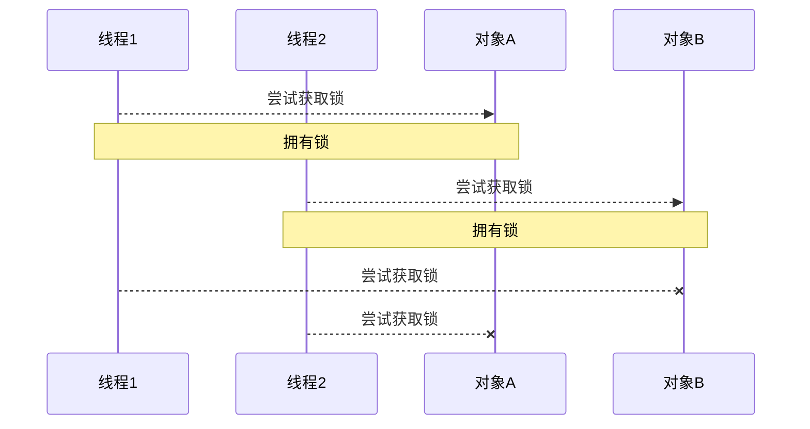

<br/>

顺序加锁的解决方案

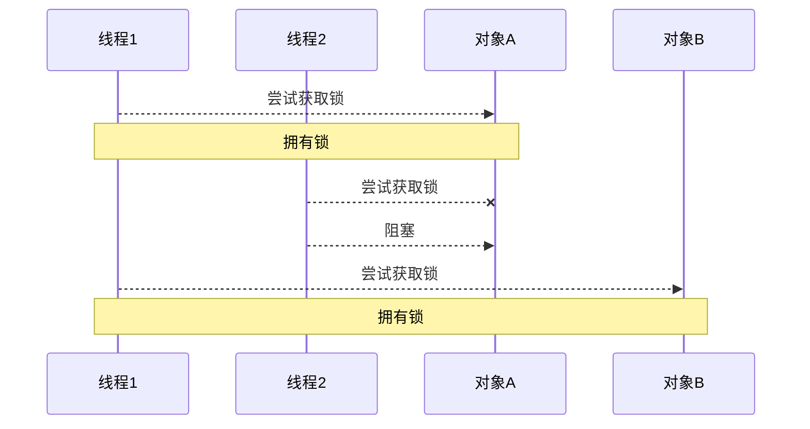

说明：

- 顺序加锁可以解决死锁问题，但也会导致一些线程一直得不到锁，产生饥饿现象。
- 解决方式：ReentrantLock

举例:更换了阿基米德的顺序。阿基米德一直没有获取到锁，产生饥饿现象。

```java
public static void main(String[] args) {
    Chopstick c1 = new Chopstick("1");
    Chopstick c2 = new Chopstick("2");
    Chopstick c3 = new Chopstick("3");
    Chopstick c4 = new Chopstick("4");
    Chopstick c5 = new Chopstick("5");
    new Philosopher("苏格拉底", c1, c2).start();
    new Philosopher("柏拉图", c2, c3).start();
    new Philosopher("亚里士多德", c3, c4).start();
    new Philosopher("赫拉克利特", c4, c5).start();
    new Philosopher("阿基米德", c5, c1).start();// [!code --]
    new Philosopher("阿基米德", c1, c5).start();// [!code ++]
}	
```

<br/>

### ReentrantLock特点

ReentrantLock翻译过来是可重入锁，相对于synchronized它具备以下特点：

- 可中断
- 可以设置超时时间
- 可以设置公平锁
- 支持多个条件变量
- 与synchronized一样，都支持重入

```java
ReentrantLock lock = new ReentrantLock();
try {
    // 获取锁
    lock.lock();
} finally {
    // 释放锁
    lock.unlock();
}
```

<br/>

**实现原理**

ReentrantLock主要利用CAS+AQS队列来实现。它支持公平锁和非公平锁，两者的实现类似

构造方法接受一个可选的公平参数（默认非公平锁），当设置为true时，表示公平锁，否则为非公平锁。公平锁的效率往往没有非公平锁的效率高，在许多线程访问的情况下，公平锁表现出较低的吞吐量。

查看ReentrantLock源码中的构造方法：

```java
/**
* Creates an instance of {@code ReentrantLock}.
* This is equivalent to using {@code ReentrantLock(false)}.
*/
public ReentrantLock() {
	sync = new NonfairSync();
}

/**
* Creates an instance of {@code ReentrantLock} with the
* given fairness policy.
*
* @param fair {@code true} if this lock should use a fair ordering policy
*/
public ReentrantLock(boolean fair) {
	sync = fair ? new FairSync() : new NonfairSync();
}
```

提供了两个构造方法，不带参数的默认为非公平

如果使用带参数的构造函数，并且传的值为true，则是公平锁

其中NonfairSync和FairSync这两个类父类都是Sync

```java
static final class FairSync extends Sync {

}

static final class NonfairSync extends Sync {
     
}
```

而Sync的父类是AQS，所以可以得出ReentrantLock底层主要实现就是基于AQS来实现的

```java
abstract static class Sync extends AbstractQueuedSynchronizer {

}
```

<br/>

**工作流程**


- 线程来抢锁后使用cas的方式修改state状态，修改状态成功为1，则让exclusiveOwnerThread属性指向当前线程，获取锁成功

- 假如修改状态失败，则会进入双向队列中等待，head指向双向队列头部，tail指向双向队列尾部

- 当exclusiveOwnerThread为null的时候，则会唤醒在双向队列中等待的线程

- 公平锁则体现在按照先后顺序获取锁，非公平体现在不在排队的线程也可以抢锁

<br/>

::: warning 💡思考：介绍一下ReentrantLock的特征

- ReentranLock 是属于并发包下的类，属于 API 层面的锁，和 synchronized 一样都是悲观锁实现互斥
- ReentranLock 通过 lock 方法用来获取锁，unlock 方法释放锁
- ReentranLock 支持可重入，可中断，可超时，可以设置公平锁和多个条件变量
- 底层主要是通过 CAS 和 AQS 队列来实现

💡**思考：ReentrantLock 的工作流程是怎么样的**

- ReentrantLock 是基于 AQS 来实现的，内部维护了一个 STATE 属性来表示资源的状态。

- 当线程来抢锁后使用 CAS 的方式修改 STATE 状态，修改状态成功为1，则让exclusiveOwnerThread 属性指向当前线程，获取锁成功。

- 假如修改状态失败，则会进入双向队列中等待，HEAD 指向双向队列头部，TAIL 指向双向队列尾部

- 当 exclusiveOwnerThread 为 null 的时候，则会唤醒在双向队列中等待的线程

- 公平锁则体现在按照先后顺序获取锁，非公平体现在不在排队的线程也可以抢锁

:::

<br/>

#### 可重入 

可重入是指同一个线程如果首次获得了这把锁，那么因为它是这把锁的拥有者，因此有权利再次获取这把锁 如果是不可重入锁，那么第二次获得锁时，自己也会被锁挡住。

```java
package org.itcast.thread;

import lombok.extern.slf4j.Slf4j;

import java.util.concurrent.locks.ReentrantLock;

@Slf4j(topic = "c.TestReentrant")
public class TestReentrant {
    static ReentrantLock lock = new ReentrantLock();

    public static void main(String[] args) {
        method1();
    }

    public static void method1() {
        lock.lock();
        try {
            log.debug("execute method1");
            method2();
        } finally {
            lock.unlock();
        }
    }

    public static void method2() {
        lock.lock();
        try {
            log.debug("execute method2");
            method3();
        } finally {
            lock.unlock();
        }
    }

    public static void method3() {
        lock.lock();
        try {
            log.debug("execute method3");
        } finally {
            lock.unlock();
        }
    }
}
```

输出

```sh
17:59:11.862 [main] c.TestReentrant - execute method1 
17:59:11.865 [main] c.TestReentrant - execute method2 
17:59:11.865 [main] c.TestReentrant - execute method3
```

<br/>

#### 可打断

可打断指的是处于阻塞状态等待锁的线程可以被打断等待。注意`lock.lockInterruptibly()`和`lock.trylock()`方法是可打断的,`lock.lock()`不是。可打断的意义在于避免得不到锁的线程无限制地等待下去，防止死锁的一种方式。

示例

```java {17}
package org.itcast.thread;

import lombok.extern.slf4j.Slf4j;
import org.itcast.util.Sleeper;

import java.util.concurrent.locks.ReentrantLock;

@Slf4j(topic = "c.TestReentrantInterrupt")
public class TestReentrantInterrupt {
    public static void main(String[] args) {
        ReentrantLock lock = new ReentrantLock();
        Thread t1 = new Thread(() -> {
            log.debug("启动...");
            try {
                // 如果没有竞争那么此方法就会获取 lock 对象
                // 如果有竞争就会进入阻塞队列，可以被其它线程用 interrupt打断
                lock.lockInterruptibly();
            } catch (InterruptedException e) {
                e.printStackTrace();
                log.debug("等锁的过程中被打断");
                // 没有获取锁则需要返回 return
                return;
            }
            try {
                log.debug("获得了锁");
            } finally {
                lock.unlock();
            }
        }, "t1");
        lock.lock();
        log.debug("获得了锁");
        t1.start();
        try {
            Sleeper.sleep(1);
            t1.interrupt();
            log.debug("执行打断");
        } finally {
            lock.unlock();
        }
    }
}

```

输出

```sh
20:21:30 [main] c.TestReentrantInterrupt - 获得了锁
20:21:30 [t1] c.TestReentrantInterrupt - 启动...
20:21:31 [main] c.TestReentrantInterrupt - 执行打断
20:21:31 [t1] c.TestReentrantInterrupt - 等锁的过程中被打断
java.lang.InterruptedException
	at java.util.concurrent.locks.AbstractQueuedSynchronizer.doAcquireInterruptibly(AbstractQueuedSynchronizer.java:898)
	at java.util.concurrent.locks.AbstractQueuedSynchronizer.acquireInterruptibly(AbstractQueuedSynchronizer.java:1222)
	at java.util.concurrent.locks.ReentrantLock.lockInterruptibly(ReentrantLock.java:335)
	at org.itcast.thread.TestReentrantInterrupt.lambda$main$0(TestReentrantInterrupt.java:17)
	at java.lang.Thread.run(Thread.java:750)
```

注意如果是不可中断模式，那么即使使用了 interrupt 也不会让等待中断

```java
package org.itcast.thread;

import lombok.extern.slf4j.Slf4j;
import org.itcast.util.Sleeper;

import java.util.concurrent.locks.ReentrantLock;

@Slf4j(topic = "c.TestReentrantTimeout")
public class TestReentrantTimeout {
    public static void main(String[] args) {
        ReentrantLock lock = new ReentrantLock();
        Thread t1 = new Thread(() -> {
            log.debug("启动...");
            try {
                lock.lock();
                log.debug("获得了锁");
            } finally {
                lock.unlock();
            }

        }, "t1");
        lock.lock();
        log.debug("获得了锁");
        t1.start();
        try {
            Sleeper.sleep(1);
            t1.interrupt();
            log.debug("执行打断");
        } finally {
            log.debug("释放了锁");
            lock.unlock();
        }
    }
}

```

输出

```sh {3}
18:06:56.261 [main] c.TestInterrupt - 获得了锁
18:06:56.265 [t1] c.TestInterrupt - 启动... 
18:06:57.266 [main] c.TestInterrupt - 执行打断 // 这时 t1 并没有被真正打断, 而是仍继续等待锁
18:06:58.267 [main] c.TestInterrupt - 释放了锁
18:06:58.267 [t1] c.TestInterrupt - 获得了锁
```

<br/>

#### 锁超时

立刻失败

```java {14}
package org.itcast.thread;

import lombok.extern.slf4j.Slf4j;
import org.itcast.util.Sleeper;

import java.util.concurrent.locks.ReentrantLock;

@Slf4j(topic = "c.TestReentrantTimeout")
public class TestReentrantTimeout {
    public static void main(String[] args) {
        ReentrantLock lock = new ReentrantLock();
        Thread t1 = new Thread(() -> {
            log.debug("启动...");
            if (!lock.tryLock()) {
                log.debug("获取立刻失败，返回");
                return;
            }
            try {
                log.debug("获得了锁");
            } finally {
                lock.unlock();
            }
        }, "t1");
        lock.lock();
        log.debug("获得了锁");
        t1.start();
        try {
            Sleeper.sleep(2);
        } finally {
            lock.unlock();
        }
    }
}
```

输出

```sh
18:15:02.918 [main] c.TestTimeout - 获得了锁
18:15:02.921 [t1] c.TestTimeout - 启动... 
18:15:02.921 [t1] c.TestTimeout - 获取立刻失败，返回
```

超时失败

```java {16}
package org.itcast.thread;

import lombok.extern.slf4j.Slf4j;
import org.itcast.util.Sleeper;

import java.util.concurrent.TimeUnit;
import java.util.concurrent.locks.ReentrantLock;

@Slf4j(topic = "c.TestReentrantTimeout")
public class TestReentrantTimeout {
    public static void main(String[] args) {
        ReentrantLock lock = new ReentrantLock();
        Thread t1 = new Thread(() -> {
            log.debug("启动...");
            try {
                if (!lock.tryLock(1, TimeUnit.SECONDS)) {
                    log.debug("获取立刻失败，返回");
                    return;
                }
            } catch (InterruptedException e) {
                e.printStackTrace();
            }

            try {
                log.debug("获得了锁");
            } finally {
                lock.unlock();
            }
            
        }, "t1");
        lock.lock();
        log.debug("获得了锁");
        t1.start();
        try {
            Sleeper.sleep(2);
        } finally {
            lock.unlock();
        }
    }
}
```

输出

```sh
18:19:40.537 [main] c.TestTimeout - 获得了锁
18:19:40.544 [t1] c.TestTimeout - 启动... 
18:19:41.547 [t1] c.TestTimeout - 获取等待 1s 后失败，返回
```

使用 tryLock 解决哲学家就餐问题

:::code-group

```java [Lock类]
class Chopstick extends ReentrantLock {
    String name;
    public Chopstick(String name) {
        this.name = name;
    }
    @Override
    public String toString() {
        return "筷子{" + name + '}';
    }
}
```

```java [Thread类]
class Philosopher extends Thread {
    Chopstick left;
    Chopstick right;
    public Philosopher(String name, Chopstick left, Chopstick right) {
        super(name);
        this.left = left;
        this.right = right;
    }
    @Override
    public void run() {
        while (true) {
            // 尝试获得左手筷子
            if (left.tryLock()) {
                try {
                    // 尝试获得右手筷子
                    if (right.tryLock()) {
                        try {
                            eat();
                        } finally {
                            right.unlock();
                        }
                    }
                } finally {
                    left.unlock();
                }
            }
        }
    }
    private void eat() {
        log.debug("eating...");
        Sleeper.sleep(1);
    }
}
```

:::

<br/>

#### 公平锁

ReentrantLock 默认是不公平的

```java
package org.itcast.thread;

import lombok.extern.slf4j.Slf4j;
import org.itcast.util.Sleeper;

import java.util.concurrent.locks.ReentrantLock;

@Slf4j(topic = "c.TestReentrantFair")
public class TestReentrantFair {
    public static void main(String[] args) {
        ReentrantLock lock = new ReentrantLock(false);
        lock.lock();
        for (int i = 0; i < 500; i++) {
            new Thread(() -> {
                lock.lock();
                try {
                    System.out.println(Thread.currentThread().getName() + " running...");
                } finally {
                    lock.unlock();
                }
            }, "t" + i).start();
        }

        // 1s 之后去争抢锁
        Sleeper.sleep(1);

        new Thread(() -> {
            System.out.println(Thread.currentThread().getName() + " start...");
            lock.lock();
            try {
                System.out.println(Thread.currentThread().getName() + " running...");
            } finally {
                lock.unlock();
            }
        }, "强行插入").start();
        lock.unlock();
    }
}
```

强行插入，有机会在中间输出

> **注意**：该实验不一定总能复现

```sh
t39 running... 
t40 running... 
t41 running... 
t42 running... 
t43 running... 
强行插入 start... 
强行插入 running... 
t44 running... 
t45 running... 
t46 running... 
t47 running... 
t49 running... 
```

改为公平锁后

```java
ReentrantLock lock = new ReentrantLock(true);
```

强行插入，总是在最后输出

```sh
t465 running... 
t464 running... 
t477 running... 
t442 running... 
t468 running... 
t493 running... 
t482 running... 
t485 running... 
t481 running... 
强行插入 running... 
```

公平锁一般没有必要，会降低并发度，后面分析原理时会讲解

<br/>

#### 条件变量

`synchronized` 中也有条件变量，就是我们讲原理时那个 waitSet 休息室，当条件不满足时进入 waitSet 等待 

`ReentrantLock` 的条件变量比 `synchronized` 强大之处在于，它是支持多个条件变量的，这就好比 

- `synchronized` 是那些不满足条件的线程都在一间休息室等消息 
- 而 `ReentrantLock` 支持多间休息室，有专门等烟的休息室、专门等早餐的休息室、唤醒时也是按休息室来唤醒

<br/>

**使用要点**

- await 前需要获得锁 
- await 执行后，会释放锁，进入 conditionObject 等待 
- await 的线程被唤醒（或打断、或超时）取重新竞争 lock 锁 
- 竞争 lock 锁成功后，从 await 后继续执行

<br/>

:::warning 💡思考： `synchoronized`  和  `Lock` 有什么区别

**语法层面：**

- `synchronized` 是关键字，源码在 JVM 中，用 C++ 语言实现
- `Lock` 是接口，源码由 JDK 提供，用 Java 语言实现
- 使用 `synchronized` 时，退出同步代码块锁会自动释放，Lock 需要手动调用 unlock 方法释放

**功能层面：**

- 二者都属于悲观锁，都具备基本的互斥，同步，锁重入功能。
- `Lock` 提供了许多 `synchronized` 不具备的功能，例如可打断，锁超时，公平锁，多条件变量。
- Lock 有适合不同场景的实现，比如可重入锁 `ReentrantLock`，读写锁 `ReentrantReadWriteLock`

**性能层面：**

- 在没有竞争时，synchronized 做了很多优化，如锁偏向，轻量级锁，性能不差
- 在竞争激烈时，Lock 的实现通常会提供更好的性能。

:::

```java
package com.itheima.lock;

import java.util.concurrent.TimeUnit;
import java.util.concurrent.locks.Condition;
import java.util.concurrent.locks.ReentrantLock;

public class ReentrantLockTest {

    //创建锁对象
    static ReentrantLock lock = new ReentrantLock();
    //条件1
    static Condition c1 = lock.newCondition();
    //条件2
    static Condition c2 = lock.newCondition();

    public static void main(String[] args) throws InterruptedException {

        //可打断
//        lockInterrupt();

        //可超时
//        timeOutLock();

        //多条件变量
        conditionTest();

    }

    /**
     * 多条件变量
     */
    public static void conditionTest(){
        new Thread(() -> {
            lock.lock();
            try {
                //进入c1条件的等待
                c1.await();
                System.out.println(Thread.currentThread().getName()+",acquire lock...");
                Thread.sleep(1000);
            } catch (InterruptedException e) {
                e.printStackTrace();
            }finally {
                lock.unlock();
            }
        }, "t1").start();
        new Thread(() -> {
            lock.lock();
            try {
                //进入c2条件的等待
                c1.await();
                System.out.println(Thread.currentThread().getName()+",acquire lock...");
                Thread.sleep(1000);
            } catch (InterruptedException e) {
                e.printStackTrace();
            }finally {
                lock.unlock();
            }
        }, "t2").start();

        new Thread(() -> {
            lock.lock();
            try {
                //唤醒c1条件的线程
                c1.signalAll();
                //唤醒c2条件的线程
//                c2.signal();
                System.out.println(Thread.currentThread().getName()+",acquire lock...");
                Thread.sleep(1000);
            } catch (InterruptedException e) {
                e.printStackTrace();
            }finally {
                lock.unlock();
            }
        }, "t3").start();


    }

    /**
     * 锁超时
     * @throws InterruptedException
     */
    public static void timeOutLock() throws InterruptedException {

        Thread t1 = new Thread(() -> {
            //尝试获取锁，如果获取锁成功，返回true，否则返回false
            try {
                if (!lock.tryLock(2, TimeUnit.SECONDS)) {
                    System.out.println("t1-获取锁失败");
                    return;
                }
            } catch (InterruptedException e) {
                e.printStackTrace();
            }
            try {
                System.out.println("t1线程-获得了锁");
            } finally {
                lock.unlock();
            }
        }, "t1");

        lock.lock();
        System.out.println("主线程获得了锁");
        t1.start();
        try {
            Thread.sleep(3000);
        } finally {
            lock.unlock();
        }
    }

    /**
     * 可打断
     * @throws InterruptedException
     */
    public static void lockInterrupt() throws InterruptedException {
        Thread t1 = new Thread(() -> {
            try {
                //开启可中断的锁

                lock.lockInterruptibly();
            } catch (InterruptedException e) {
                e.printStackTrace();
                System.out.println("等待的过程中被打断");
                return;
            }
            try {
                System.out.println(Thread.currentThread().getName() + ",获得了锁");
            } finally {
                lock.unlock();
            }
        }, "t1");
        lock.lock();
        System.out.println("主线程获得了锁");
        t1.start();

        try {
            Thread.sleep(1000);
            t1.interrupt();
            System.out.println("执行打断");
        } finally {
            lock.unlock();
        }
    }

}
```

<br/>

`synchronized` 和 `ReentrantLock` 语法总结

:::code-group

```java [synchronized]
static final Object lock = new Object();
static boolean flag = false;

// 一个线程获取锁
synchronized(lock) {
  while(!flag) {
    lock.wait();
  }
  // 干活
}

//一个线程唤醒锁
synchronized(lock) {
  flag = true;
  lock.notifyAll();
}	
```

```java [ReentrantLock]
static ReentrantLock lock = new ReentrantLock();
static volatile boolean flag = false;
static Condition condition = lock.newCondition();

// 一个线程获取锁
lock.lock();
try {
  // 临界区
  while(!flag){
    condition.await();
  }
  // 干活 
} finally {
  // 释放锁
  lock.unlock();
}

// 一个线程唤醒锁
lock.lock();
try {
  flag = true;
  condition.signal();
} finally {
  lock.lock();
}

```

:::

<br/>

**详细API**

```java
public interface Condition {

    void await() throws InterruptedException;

    void awaitUninterruptibly();

	/*
     *  <pre> {@code
     * boolean aMethod(long timeout, TimeUnit unit) {
     *   long nanos = unit.toNanos(timeout);
     *   lock.lock();
     *   try {
     *     while (!conditionBeingWaitedFor()) {
     *       if (nanos <= 0L)
     *         return false;
     *       nanos = theCondition.awaitNanos(nanos);
     *     }
     *     // ...
     *   } finally {
     *     lock.unlock();
     *   }
     * }}</pre>
     *
     * @param nanosTimeout the maximum time to wait, in nanoseconds
     * @return an estimate of the {@code nanosTimeout} value minus
     *         the time spent waiting upon return from this method.
     *         A positive value may be used as the argument to a
     *         subsequent call to this method to finish waiting out
     *         the desired time.  A value less than or equal to zero
     *         indicates that no time remains.
     * @throws InterruptedException if the current thread is interrupted
     *         (and interruption of thread suspension is supported)
     */
    long awaitNanos(long nanosTimeout) throws InterruptedException;

    /**
     * Causes the current thread to wait until it is signalled or interrupted,
     * or the specified waiting time elapses. This method is behaviorally
     * equivalent to:
     *  <pre> {@code awaitNanos(unit.toNanos(time)) > 0}</pre>
     *
     * @param time the maximum time to wait
     * @param unit the time unit of the {@code time} argument
     * @return {@code false} if the waiting time detectably elapsed
     *         before return from the method, else {@code true}
     * @throws InterruptedException if the current thread is interrupted
     *         (and interruption of thread suspension is supported)
     */
    boolean await(long time, TimeUnit unit) throws InterruptedException;

    /**
     * Causes the current thread to wait until it is signalled or interrupted,
     * or the specified deadline elapses.
     *
     *  <pre> {@code
     * boolean aMethod(Date deadline) {
     *   boolean stillWaiting = true;
     *   lock.lock();
     *   try {
     *     while (!conditionBeingWaitedFor()) {
     *       if (!stillWaiting)
     *         return false;
     *       stillWaiting = theCondition.awaitUntil(deadline);
     *     }
     *     // ...
     *   } finally {
     *     lock.unlock();
     *   }
     * }}</pre>
     * @param deadline the absolute time to wait until
     * @return {@code false} if the deadline has elapsed upon return, else
     *         {@code true}
     * @throws InterruptedException if the current thread is interrupted
     *         (and interruption of thread suspension is supported)
     */
    boolean awaitUntil(Date deadline) throws InterruptedException;

    /**
     * Wakes up one waiting thread.
     */
    void signal();

    /**
     * Wakes up all waiting threads.
     */
    void signalAll();
}
```

<br/>

例子：

```java
package org.itcast.thread;

import lombok.extern.slf4j.Slf4j;
import org.itcast.util.Sleeper;

import java.util.concurrent.locks.Condition;
import java.util.concurrent.locks.ReentrantLock;

/**
 * 多条件举例
 */
@Slf4j(topic = "c.TestLockCondition")
public class TestLockCondition {
    static ReentrantLock lock = new ReentrantLock();
    static Condition waitCigaretteQueue = lock.newCondition();
    static Condition waitBreakfastQueue = lock.newCondition();
    static volatile boolean hasCigarette = false;
    static volatile boolean hasBreakfast = false;

    public static void main(String[] args) {
        // 抽烟线程
        new Thread(() -> {
            try {
                lock.lock();
                while (!hasCigarette) {
                    try {
                        log.debug("等待我的香烟");
                        waitCigaretteQueue.await();
                    } catch (InterruptedException e) {
                        e.printStackTrace();
                    }
                }
                log.debug("等到了它的烟");
            } finally {
                lock.unlock();
            }
        }).start();

        // 吃早餐线程
        new Thread(() -> {
            try {
                lock.lock();
                while (!hasBreakfast) {
                    try {
                        log.debug("等待我的早餐");
                        waitBreakfastQueue.await();
                    } catch (InterruptedException e) {
                        e.printStackTrace();
                    }
                }
                log.debug("等到了它的早餐");
            } finally {
                lock.unlock();
            }
        }).start();

        Sleeper.sleep(2);
        // 送早餐
        sendBreakfast();

        Sleeper.sleep(2);
        // 送烟
        sendCigarette();
    }

    private static void sendCigarette() {
        lock.lock();
        try {
            log.debug("送烟来了");
            hasCigarette = true;
            waitCigaretteQueue.signal();
        } finally {
            lock.unlock();
        }
    }

    private static void sendBreakfast() {
        lock.lock();
        try {
            log.debug("送早餐来了");
            hasBreakfast = true;
            waitBreakfastQueue.signal();
        } finally {
            lock.unlock();
        }
    }
}
```

输出

```sh
20:44:00 [Thread-0] c.TestLockCondition - 等待我的香烟
20:44:00 [Thread-1] c.TestLockCondition - 等待我的早餐
20:44:02 [main] c.TestLockCondition - 送早餐来了
20:44:02 [Thread-1] c.TestLockCondition - 等到了它的早餐
20:44:04 [main] c.TestLockCondition - 送烟来了
20:44:04 [Thread-0] c.TestLockCondition - 等到了它的烟
```

<br/>

### <font color='orange'>* 同步模式之顺序控制</font>

#### 固定顺序

比如，必须先3 在 2 后 1 打印

```java
@Slf4j(topic = "c.ByOrderPrint")
public class ByOrderPrint {
    public static void main(String[] args) {
        Thread t1 = new Thread(() -> {
            log.debug("1");

        }, "t1");

        Thread t2 = new Thread(() -> {
            log.debug("2");

        }, "t2");

        t1.start();
        t2.start();
    }
}
```

代码

::: code-group

```java [join实现]
package org.itcast.pattern;

import lombok.extern.slf4j.Slf4j;

@Slf4j(topic = "c.ByOrderPrint2Join")
public class ByOrderPrint2Join {
    public static void main(String[] args) {
        Thread t1 = new Thread(() -> {
            log.debug("3");

        }, "t1");

        Thread t2 = new Thread(() -> {
            try {
                t1.join();
            } catch (InterruptedException e) {
                e.printStackTrace();
            }

            log.debug("2");
        }, "t2");

        Thread t3 = new Thread(() -> {
            try {
                t2.join();
            } catch (InterruptedException e) {
                e.printStackTrace();
            }
            log.debug("1");
        }, "t3");

        t1.start();
        t2.start();
        t3.start();
    }
}

```

```java [wait notify]
package org.itcast.pattern;

import lombok.extern.slf4j.Slf4j;

@Slf4j(topic = "c.ByOrderPrint2Sync")
public class ByOrderPrint2Sync {
    private static final Object object = new Object();
    public static boolean t2runFlag = false;
    public static boolean t3runFlag = false;

    public static void main(String[] args) {
        Thread t1 = new Thread(() -> {
            synchronized (object) {
                log.debug("3");
                t2runFlag = true;

                object.notifyAll();
            }
        }, "t1");

        Thread t2 = new Thread(() -> {
            synchronized (object) {

                while (!t2runFlag) {
                    try {
                        object.wait();
                    } catch (InterruptedException e) {
                        e.printStackTrace();
                    }
                }

                log.debug("2");
                t3runFlag = true;
                object.notifyAll();
            }
        }, "t2");

        Thread t3 = new Thread(() -> {
            synchronized (object) {
                while (!t3runFlag) {
                    try {
                        object.wait();
                    } catch (InterruptedException e) {
                        e.printStackTrace();
                    }
                    
                }
                log.debug("1");
            }
        }, "t3");

        t1.start();
        t2.start();
        t3.start();
    }

}
```

```java [park unpark]
package org.itcast.pattern;

import lombok.extern.slf4j.Slf4j;
import org.itcast.util.Sleeper;

import java.util.concurrent.locks.LockSupport;

@Slf4j(topic = "c.ByOrderPrint2Park")
public class ByOrderPrint2Park {
    public static void main(String[] args) {
        Thread t1 = new Thread(() -> {
            // 默认没有许可证，当没有『许可』时，当前线程暂停运行；
            // 有『许可』时，用掉这个『许可』，当前线程恢复运行
            LockSupport.park();
            System.out.println("1");
        });
        Thread t2 = new Thread(() -> {
            LockSupport.park();
            System.out.println("2");
            // 给线程 t1 发放『许可』（多次连续调用 unpark 只会发放一个『许可』）
            LockSupport.unpark(t1);
        });

        Thread t3 = new Thread(() -> {
            System.out.println("3");
            // 给线程 t2 发放『许可』（多次连续调用 unpark 只会发放一个『许可』）
            LockSupport.unpark(t2);
        });
        t1.start();
        t2.start();
        t3.start();
    }
}
```

:::

::: warning `Wait Notify` 和 `Park Unpark` 版对比

可以看到，实现上很麻烦： 

- 首先，需要保证先 wait 再 notify，否则 wait 线程永远得不到唤醒。因此使用了『运行标记』来判断该不该 wait 
- 第二，如果有些干扰线程错误地 notify 了 wait 线程，条件不满足时还要重新等待，使用了 while 循环来解决此问题 
- 最后，唤醒对象上的 wait 线程需要使用 notifyAll，因为『同步对象』上的等待线程可能不止一个 

可以使用 `LockSupport` 类的 park 和 unpark 来简化上面的题目：

park 和 unpark 方法比较灵活，他俩谁先调用，谁后调用无所谓。并且是以线程为单位进行『暂停』和『恢复』， 不需要『同步对象』和『运行标记』

:::

<br/>

#### 交替输出

要求：线程 1 输出 a 5 次，线程 2 输出 b 5 次，线程 3 输出 c 5 次。现在要求输出 `abcabcabcabcabc` 怎么实现

::: code-group

```java [wait notify]
package org.itcast.pattern;

import lombok.extern.slf4j.Slf4j;

@Slf4j(topic = "c.SyncWaitNotify")
public class SyncWaitNotify {
    private int flag;
    private int loopNum;

    /**
     * @param flag    开始序号
     * @param loopNum 遍历次数
     */
    public SyncWaitNotify(int flag, int loopNum) {
        this.flag = flag;
        this.loopNum = loopNum;
    }

    /**
     * 交替打印数据
     *
     * @param waitFlag 开始序号
     * @param nextFlag 下一次序号
     * @param str      打印的字符
     */
    public void print(int waitFlag, int nextFlag, String str) {
        for (int i = 0; i < loopNum; i++) {
            synchronized (this) {
                while (this.flag != waitFlag) {
                    try {
                        this.wait();
                    } catch (InterruptedException e) {
                        e.printStackTrace();
                    }
                }
                System.out.print(str);
                this.flag = nextFlag;
                this.notifyAll();
            }
        }
    }

    public static void main(String[] args) {
        SyncWaitNotify syncWaitNotify = new SyncWaitNotify(1, 5);
        new Thread( ()-> {syncWaitNotify.print(1,2,"a");}).start();
        new Thread( ()-> {syncWaitNotify.print(2,3,"b");}).start();
        new Thread( ()-> {syncWaitNotify.print(3,1,"c");}).start();
    }
}
```

```java [await signal]
package org.itcast.pattern;

import lombok.extern.slf4j.Slf4j;

import java.util.concurrent.locks.Condition;
import java.util.concurrent.locks.ReentrantLock;

@Slf4j(topic = "c.SyncAwaitSignal")
public class SyncAwaitSignal extends ReentrantLock {
    private int loopNumber;

    public SyncAwaitSignal(int loopNumber) {
        this.loopNumber = loopNumber;
    }

    /**
     * @param first 开始条件
     */
    public void start(Condition first) {
        this.lock();
        try {
            log.debug("start");
            first.signal();
        } finally {
            this.unlock();
        }
    }

    /**
     * 交替打印数据
     *
     * @param current 当前条件
     * @param next    下个条件
     * @param str     打印的字符
     */
    public void print(Condition current, Condition next, String str) {
        for (int i = 0; i < loopNumber; i++) {
            this.lock();
            try {
                current.await();
                log.debug(str);
                next.signal();
            } catch (InterruptedException e) {
                e.printStackTrace();
            } finally {
                this.unlock();
            }
        }
    }

    // 该实现没有考虑 a，b，c 线程都就绪再开始
    public static void main(String[] args) {
        SyncAwaitSignal as = new SyncAwaitSignal(5);

        Condition aWaitSet = as.newCondition();
        Condition bWaitSet = as.newCondition();
        Condition cWaitSet = as.newCondition();

        new Thread(() -> as.print(aWaitSet, bWaitSet, "a")).start();
        new Thread(() -> as.print(bWaitSet, cWaitSet, "b")).start();
        new Thread(() -> as.print(cWaitSet, aWaitSet, "c")).start();

        as.start(aWaitSet);
    }
}

```

```java [park unpark]
package org.itcast.pattern;

import lombok.extern.slf4j.Slf4j;

import java.util.concurrent.locks.LockSupport;

@Slf4j(topic = "c.SyncParkUnPark")
public class SyncParkUnPark {
    private final int loopNumber;
    private Thread[] threads;

    /**
     * @param loopNumber 循环次数
     */
    public SyncParkUnPark(int loopNumber) {
        this.loopNumber = loopNumber;
    }

    /**
     * @param threads 设置线程顺序
     */
    public void setThreads(Thread... threads) {
        this.threads = threads;
    }

    /**
     * @param str 打印字符串
     */
    public void print(String str) {
        for (int i = 0; i < loopNumber; i++) {
            // 清除打断标记
            LockSupport.park();
            System.out.print(str);
            // 为下个线程设置标记
            LockSupport.unpark(nextThread());
        }
    }

    /**
     * @return 获取下一个线程，可以循环
     */
    private Thread nextThread() {
        Thread current = Thread.currentThread();
        int index = 0;
        for (int i = 0; i < threads.length; i++) {
            if (threads[i] == current) {
                index = i;
                break;
            }
        }
        if (index < threads.length - 1) {
            return threads[index + 1];
        } else {
            return threads[0];
        }
    }

    /**
     * 从第一个线程运行
     */
    public void start() {
        for (Thread thread : threads) {
            thread.start();
        }
        // 设置打断标记
        LockSupport.unpark(threads[0]);
    }

    public static void main(String[] args) {
        SyncParkUnPark syncPark = new SyncParkUnPark(5);

        Thread t1 = new Thread(() -> syncPark.print("a"));
        Thread t2 = new Thread(() -> syncPark.print("b"));
        Thread t3 = new Thread(() -> syncPark.print("c"));

        syncPark.setThreads(t1, t2, t3);

        syncPark.start();
    }
}
```

:::
