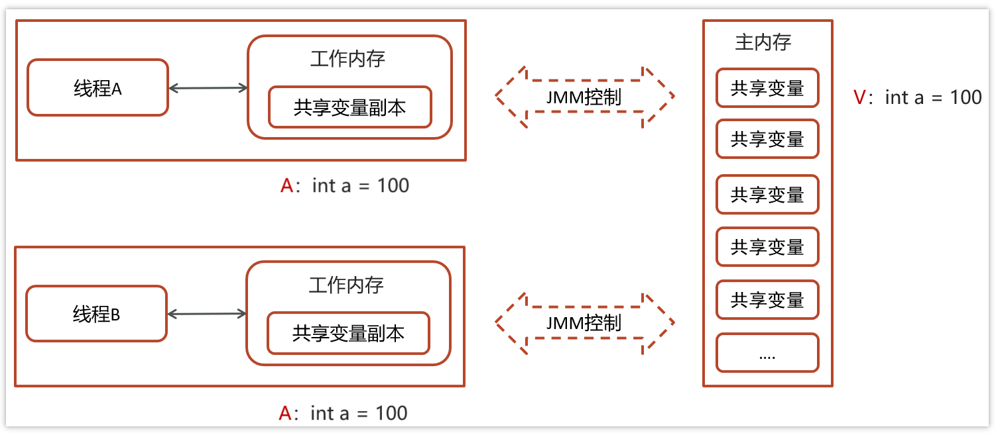
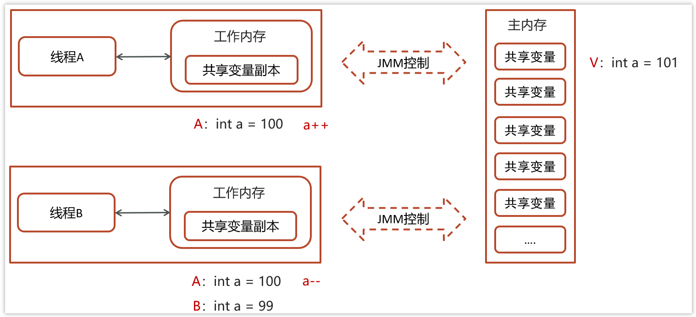
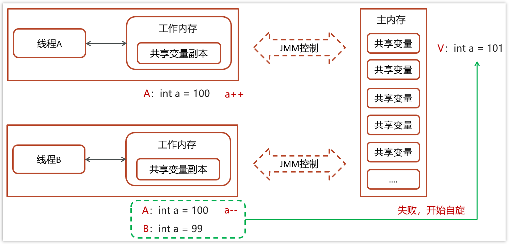
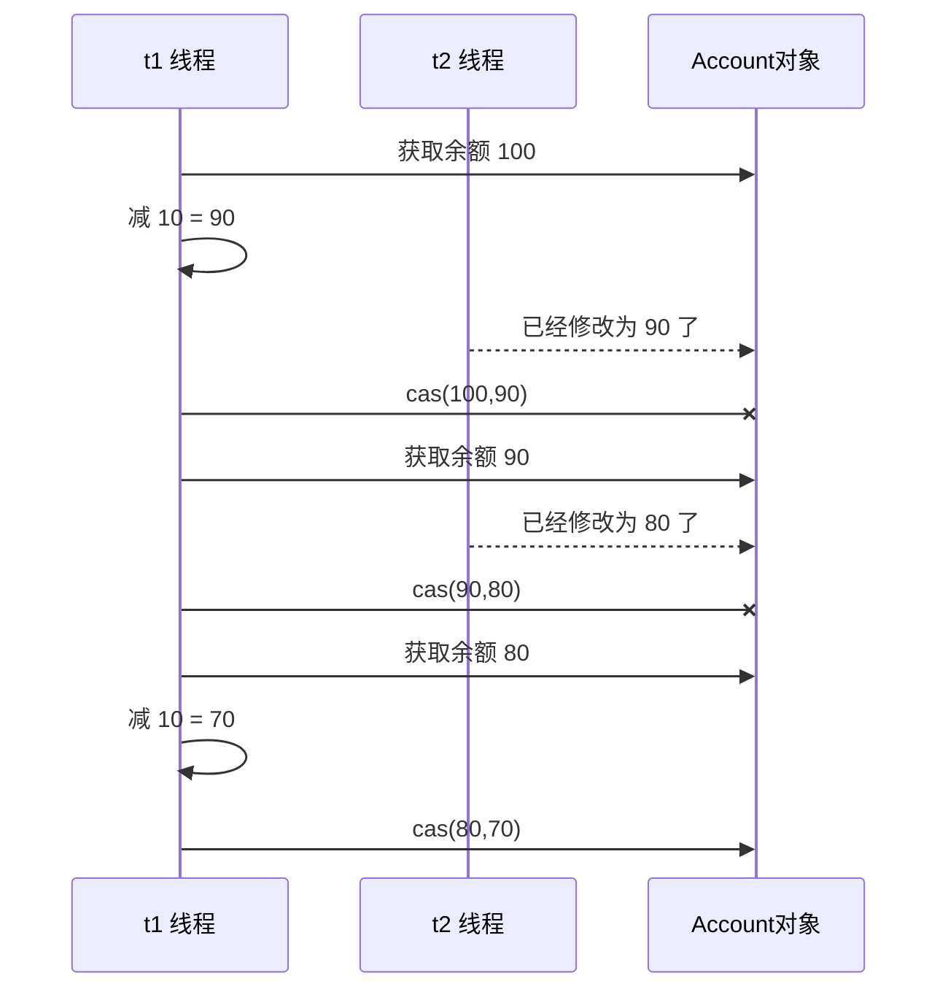

[返回首页](index.md)
[[toc]]

共享模型之无锁
----------------

**问题提出**：有如下需求，保证 `account.withdraw` 取款方法的线程安全

```java
package cn.itcast;
import java.util.ArrayList;
import java.util.List;

interface Account {
    // 获取余额
    Integer getBalance();
    // 取款
    void withdraw(Integer amount);
    /**
     * 方法内会启动 1000 个线程，每个线程做 -10 元 的操作
     * 如果初始余额为 10000 那么正确的结果应当是 0
     */
    static void demo(Account account) {
        List<Thread> ts = new ArrayList<>();
        long start = System.nanoTime();
        for (int i = 0; i < 1000; i++) {
            ts.add(new Thread(() -> {
                account.withdraw(10);
            }));
        }
        ts.forEach(Thread::start);
        ts.forEach(t -> {
            try {
                t.join();
            } catch (InterruptedException e) {
                e.printStackTrace();
            }
        });
        long end = System.nanoTime();
        System.out.println(account.getBalance() 
                           + " cost: " + (end-start)/1000_000 + " ms");
    }
}
```

原有实现并不是线程安全的

```java
class AccountUnsafe implements Account {
    private Integer balance;
    public AccountUnsafe(Integer balance) {
        this.balance = balance;
    }
    @Override
    public Integer getBalance() {
        return balance;
    }
    @Override
    public void withdraw(Integer amount) {
        balance -= amount;
    }
}
```

执行测试代码

```java
public static void main(String[] args) {
    Account.demo(new AccountUnsafe(10000));
}
```

某次的执行结果

```sh
330 cost: 306 ms
```


为什么不安全：`withdraw` 方法

```java
public void withdraw(Integer amount) {
    balance -= amount;
}
```

对应的字节码

```java
ALOAD 0																												  // <- this
ALOAD 0
GETFIELD cn/itcast/AccountUnsafe.balance : Ljava/lang/Integer; // <- this.balance
INVOKEVIRTUAL java/lang/Integer.intValue ()I 									 // 拆箱
ALOAD 1 																											 // <- amount
INVOKEVIRTUAL java/lang/Integer.intValue ()I 						       // 拆箱
ISUB 																													 // 减法
INVOKESTATIC java/lang/Integer.valueOf (I)Ljava/lang/Integer;  // 结果装箱
PUTFIELD cn/itcast/AccountUnsafe.balance : Ljava/lang/Integer; // -> this.balance
```

多线程执行

```java
ALOAD 0 																	// thread-0 <- this 
ALOAD 0 
GETFIELD cn/itcast/AccountUnsafe.balance // thread-0 <- this.balance 
INVOKEVIRTUAL java/lang/Integer.intValue // thread-0 拆箱
ALOAD 1 																 // thread-0 <- amount 
INVOKEVIRTUAL java/lang/Integer.intValue // thread-0 拆箱
ISUB 																		 // thread-0 减法
INVOKESTATIC java/lang/Integer.valueOf   // thread-0 结果装箱
PUTFIELD cn/itcast/AccountUnsafe.balance // thread-0 -> this.balance 
 
 
ALOAD 0 // thread-1 <- this 
ALOAD 0 
GETFIELD cn/itcast/AccountUnsafe.balance // thread-1 <- this.balance 
INVOKEVIRTUAL java/lang/Integer.intValue // thread-1 拆箱
ALOAD 1 																 // thread-1 <- amount 
INVOKEVIRTUAL java/lang/Integer.intValue // thread-1 拆箱
ISUB 																		 // thread-1 减法
INVOKESTATIC java/lang/Integer.valueOf   // thread-1 结果装箱
PUTFIELD cn/itcast/AccountUnsafe.balance // thread-1 -> this.balance
```

原因：Integer虽然是不可变类，其方法是线程安全的，但是以上操作涉及到了多个方法的组合，等价于以下代码：

```java
balance = new Integer(Integer.valueOf(balance) - amount);
```

前一个方法(valueOf)的结果决定后一个方法(构造方法)，这种组合在多线程环境下线程不安全。

<br/>

### 互斥同步

**解决思路-锁**（悲观互斥）首先想到的是给 Account 对象加锁

```java
class AccountUnsafe implements Account {
    private Integer balance;
    public AccountUnsafe(Integer balance) {
        this.balance = balance;
    }
    @Override
    public synchronized Integer getBalance() {
        return balance;
    }
    @Override
    public synchronized void withdraw(Integer amount) {
        balance -= amount;
    }
}
```

结果为

```sh
0 cost: 399 ms 
```

synchronized 是基于悲观锁的思想：最悲观的估计，得防着其它线程来修改共享变量，我上了锁你们都别想改，我改完了解开锁，你们才有机会。

在线程竞争不激烈的情况下，如何对性能进行优化？

<br/>

### 非阻塞同步CAS

CAS的全称是： Compare And Swap(比较再交换)，它体现的一种乐观锁的思想，在无锁情况下保证线程操作共享数据的原子性。

在JUC（ java.util.concurrent ）包下实现的很多类都用到了CAS操作

- `AbstractQueuedSynchronizer`（AQS框架）

- `AtomicXXX` 类

<br/>

例子：我们还是基于刚才学习过的JMM内存模型进行说明

- 线程1与线程2都从主内存中获取变量int a = 100,同时放到各个线程的工作内存中



一个当前内存值V、旧的预期值A、即将更新的值B，当且仅当旧的预期值A和内存值V相同时，将内存值修改为B并返回true，否则什么都不做，并返回false。如果CAS操作失败，通过自旋的方式等待并再次尝试，直到成功。

- 线程1操作：V：int a = 100，A：int a = 100，B：修改后的值：int a = 101 (a++)
  - 线程1拿A的值与主内存V的值进行比较，判断是否相等
  - 如果相等，则把B的值101更新到主内存中



- 线程2操作：V：int a = 100，A：int a = 100，B：修改后的值：int a = 99(a--)
  - 线程2拿A的值与主内存V的值进行比较，判断是否相等(目前不相等，因为线程1已更新V的值99)
  - 不相等，则线程2更新失败



- 自旋锁操作

  - 因为没有加锁，所以线程不会陷入阻塞，效率较高

  - 如果竞争激烈，重试频繁发生，效率会受影响

```java
while (true) {
    int 旧值A = 共享变量V;
    int 结果B = 旧值 + 1;
    if (compareAndSwap(旧值A,结果B)) {
        // 成功，退出循环
    }
}
```

需要不断尝试获取共享内存V中最新的值，然后再在新的值的基础上进行更新操作，如果失败就继续尝试获取新的值，直到更新成功

<br/>

### CAS 底层实现

CAS 底层依赖于一个 Unsafe 类来直接调用操作系统底层的 CAS 指令

```java
public final class Unsafe {
    public final native boolean compareAndSwapObject(Object var1, 
                                                     long var2,
                                                     Object var4, 
                                                     Object var5);

    public final native boolean compareAndSwapInt(Object var1, 
                                                  long var2, 
                                                  int var4, 
                                                  int var5);

    public final native boolean compareAndSwapLong(Object var1, 
                                                   long var2, 
                                                   long var4, 
                                                   long var6);
}
```

都是native修饰的方法，由系统提供的接口执行，并非java代码实现，一般的思路也都是自旋锁实现

```java
while (true) {
    int 旧值A = 共享变量V;
    int 结果B = 旧值 + 1;
    if (compareAndSwap(旧值A,结果B)) {
        // 成功，退出循环
    }
}
```

在java中比较常见使用有很多，比如ReentrantLock和Atomic开头的线程安全类，都调用了Unsafe中的方法

- ReentrantLock中的一段CAS代码

```java
protected final boolean compareAndSetState(int expect, int update) {
    // this 当前值
    // stateOffset 当前释放存在线程运行
  	// expect 期望的值
  	// update 更新后的值
    return unsafe.compareAndSwapInt(this, stateOffset, expect, update);
}
```

<br/>

### 问题解决

**解决思路-无锁**（乐观重试）

```java
class AccountSafe implements Account {
    private AtomicInteger balance;
    public AccountSafe(Integer balance) {
        this.balance = new AtomicInteger(balance);
    }
    @Override
    public Integer getBalance() {
        return balance.get();
    }
    @Override
    public void withdraw(Integer amount) {
        while (true) {
            int prev = balance.get();
            int next = prev - amount;
            if (balance.compareAndSet(prev, next)) {
                break;
            }
        }
        // 可以简化为下面的方法
        // balance.addAndGet(-1 * amount);
    }
  
    public static void main(String[] args) {
      Account.demo(new AccountSafe(10000));
  	}
}
```

某次的执行结果

```sh
0 cost: 302 ms
```

前面看到的 AtomicInteger 的解决方法，内部并没有用锁来保护共享变量的线程安全。那么它是如何实现的呢？

```java
public void withdraw(Integer amount) {
        // 需要不断尝试，直到成功为止
        while (true) {
            // 比如拿到了旧值 1000
            int prev = balance.get();
            // 在这个基础上 1000-10 = 990
            int next = prev - amount;
            /*
             compareAndSet 正是做这个检查，在 set 前，先比较 prev 与当前值
             - 不一致了，next 作废，返回 false 表示失败
             		比如，别的线程已经做了减法，当前值已经被减成了 990
             		那么本线程的这次 990 就作废了，进入 while 下次循环重试
             - 一致，以 next 设置为新值，返回 true 表示成功
             */
            if (balance.compareAndSet(prev, next)) {
                break;
            }
            //或者简洁一点：
            //balance.getAndAdd(-1 * amount);
        }
}
```

其中的关键是 compareAndSet，它的简称就是 CAS （也有 Compare And Swap 的说法），它必须是原子操作。



> **注意** 
>
> 其实 CAS 的底层是 lock cmpxchg 指令（X86 架构），在单核 CPU 和多核 CPU 下都能够保证【比较-交换】的原子性。
>
> - 在多核状态下，某个核执行到带 lock 的指令时，CPU 会让总线锁住，当这个核把此指令执行完毕，再开启总线。这个过程中不会被线程的调度机制所打断，保证了多个线程对内存操作的准确性，是原子的。

### 慢动作分析

```java
@Slf4j
public class SlowMotion {
    public static void main(String[] args) {
        AtomicInteger balance = new AtomicInteger(10000);
        int mainPrev = balance.get();
        log.debug("try get {}", mainPrev);
        new Thread(() -> {
            sleep(1000);
            int prev = balance.get();
            balance.compareAndSet(prev, 9000);
            log.debug(balance.toString());
        }, "t1").start();
        sleep(2000);
        log.debug("try set 8000...");
        boolean isSuccess = balance.compareAndSet(mainPrev, 8000);
        log.debug("is success ? {}", isSuccess);
        if(!isSuccess){
            mainPrev = balance.get();
            log.debug("try set 8000...");
            isSuccess = balance.compareAndSet(mainPrev, 8000);
            log.debug("is success ? {}", isSuccess);
        }
    }
    private static void sleep(int millis) {
        try {
            Thread.sleep(millis);
        } catch (InterruptedException e) {
            e.printStackTrace();
        }
    }
}
```

输出结果

```sh
2019-10-13 11:28:37.134 [main] try get 10000 
2019-10-13 11:28:38.154 [t1] 9000 
2019-10-13 11:28:39.154 [main] try set 8000... 
2019-10-13 11:28:39.154 [main] is success ? false 
2019-10-13 11:28:39.154 [main] try set 8000... 
2019-10-13 11:28:39.154 [main] is success ? true
```

<br/>

### volatile

获取共享变量时，为了保证该变量的可见性，需要使用 `volatile` 修饰。 

它可以用来修饰成员变量和静态成员变量，他可以避免线程从自己的工作缓存中查找变量的值，必须到主存中获取它的值，线程操作 volatile 变量都是直接操作主存。即一个线程对 volatile 变量的修改，对另一个线程可见。

> **注意** 
>
> volatile 仅仅保证了共享变量的可见性，让其它线程能够看到最新值，但不能解决指令交错问题（不能保证原子性）

CAS 必须借助 `volatile` 才能读取到共享变量的最新值来实现【比较并交换】的效果。

<br/>

**为什么无锁效率高** 

- 无锁情况下，即使重试失败，线程始终在高速运行，没有停歇，类似于自旋。而 `synchronized` 会让线程在没有获得锁的时候，发生上下文切换，进入阻塞。线程的上下文切换是费时的，在重试次数不是太多时，无锁的效率高于有锁。
- 线程就好像高速跑道上的赛车，高速运行时，速度超快，一旦发生上下文切换，就好比赛车要减速、熄火， 等被唤醒又得重新打火、启动、加速... 恢复到高速运行，代价比较大 
- 但无锁情况下，因为线程要保持运行，需要额外 CPU 的支持，CPU 在这里就好比高速跑道，没有额外的跑道，线程想高速运行也无从谈起，虽然不会进入阻塞，但由于没有分到时间片，仍然会进入可运行状态，还是会导致上下文切换。所以总的来说，当线程数小于等于cpu核心数时，使用无锁方案是很合适的，因为有足够多的cpu让线程运行。当线程数远多于cpu核心数时，无锁效率相比于有锁就没有太大优势，因为依旧会发生上下文切换。

<br/>

### CAS 的特点

结合 CAS 和 volatile 可以实现无锁并发，适用于线程数少、多核 CPU 的场景下。 

- CAS 是基于乐观锁的思想：最乐观的估计，不怕别的线程来修改共享变量，就算改了也没关系，我吃亏点再重试呗。 
- synchronized 是基于悲观锁的思想：最悲观的估计，得防着其它线程来修改共享变量，我上了锁你们都别想改，我改完了解开锁，你们才有机会。 
- CAS 体现的是无锁并发、无阻塞并发，请仔细体会这两句话的意思 
  - 因为没有使用 synchronized，所以线程不会陷入阻塞，这是效率提升的因素之一 
  - 但如果竞争激烈，可以想到重试必然频繁发生，反而效率会受影响

<br/>

::: warning 💡思考: CAS 你知道吗？

- CAS 全称 Compare And Swap 比较在交换；体现的是一种乐观锁思想，在无锁状态下保证线程操作数据的原子性。
- CAS 的底层是调用的 Unsafe 类中的方法，由操作系统提供实现。

💡**思考：CAS 的具体流程是怎么样的**

我们举个例子，主内存存在一个共享变量为100，现在有两个线程，线程一将共享变量从主内存复制一份做`count++`操作，线程二将共享变量从主内存复制一份做 `count --` 操作。线程一复制的共享变量副本为100，`count ++` 以后变为了 101，这时我们将共享变量的副本与共享变量的值相等，则将共享变量的值修改为 101。这时线程二复制的共享变量也为100，`count--` 以后变为了 99，将共享变量副本与共享变量最新的值做对比，100 <> 101，修改失败。这时则会进入自旋操作。

💡**思考：乐观锁和悲观锁的区别？**

- 乐观锁：CAS 基于乐观锁的思想，是最乐观的估计，不怕别人来修改共享变量，就算修改了也没关系，可以吃亏点在重试。
- 悲观锁：synchronized 是基于悲观锁的思想，是最悲观的估计，防着其它线程来修改共享变量，我上锁了你们都别想修改，我修改成功后解开锁，其他线程才有机会修改。

:::
