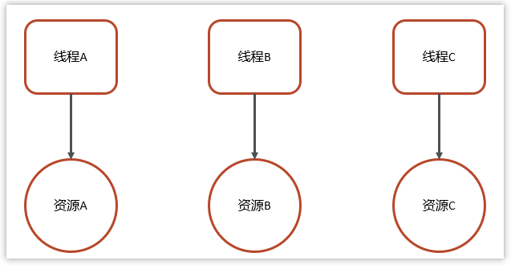
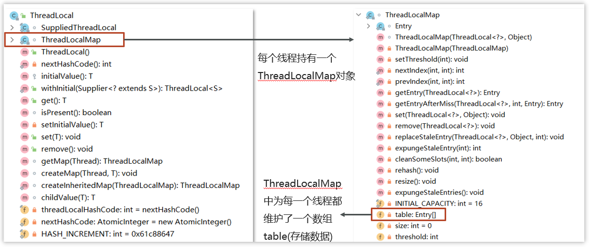
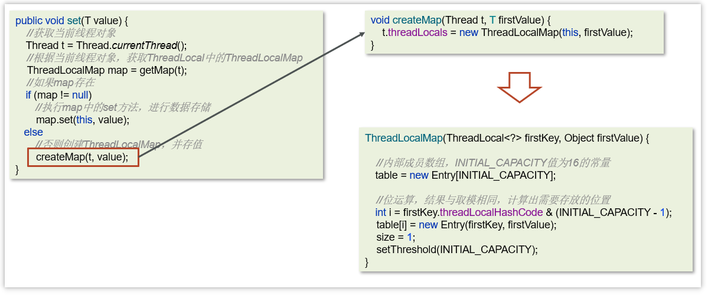
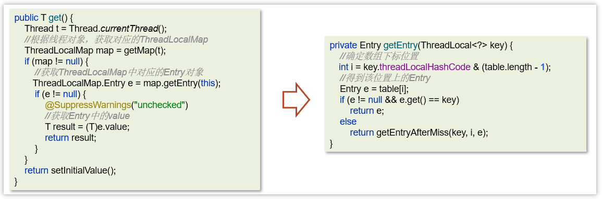
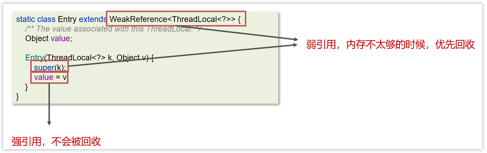

[返回首页](index.md)
[[toc]]

共享模型之无同步方案
--------------------

ThreadLocal是多线程中对于解决线程安全的一个操作类，它会为每个线程都分配一个独立的线程副本从而解决了变量并发访问冲突的问题。ThreadLocal 同时实现了线程内的资源共享

案例：使用JDBC操作数据库时，会将每一个线程的Connection放入各自的ThreadLocal中，从而保证每个线程都在各自的 Connection 上进行数据库的操作，避免A线程关闭了B线程的连接。



### 基本使用

三个主要方法：

- set(value) 设置值

- get() 获取值

- remove() 清除值

```java
public class ThreadLocalTest {
    static ThreadLocal<String> threadLocal = new ThreadLocal<>();

    public static void main(String[] args) {
        new Thread(() -> {
            String name = Thread.currentThread().getName();
            threadLocal.set("itcast");
            print(name);
            System.out.println(name + "-after remove : " + threadLocal.get());
        }, "t1").start();
        new Thread(() -> {
            String name = Thread.currentThread().getName();
            threadLocal.set("itheima");
            print(name);
            System.out.println(name + "-after remove : " + threadLocal.get());
        }, "t2").start();
    }

    static void print(String str) {
        //打印当前线程中本地内存中本地变量的值
        System.out.println(str + " :" + threadLocal.get());
        //清除本地内存中的本地变量
        threadLocal.remove();
    }

}
```

<br/>

### 源码解析

ThreadLocal本质来说就是一个线程内部存储类，从而让多个线程只操作自己内部的值，从而实现线程数据隔离



在ThreadLocal中有一个内部类叫做ThreadLocalMap，类似于HashMap

ThreadLocalMap中有一个属性table数组，这个是真正存储数据的位置

<br/>

**set方法**



<Br/>

**get方法/remove方法**



<br/>

### 内存泄露问题

Java对象中的四种引用类型：强引用、软引用、弱引用、虚引用

- 强引用：最为普通的引用方式，表示一个对象处于有用且必须的状态，如果一个对象具有强引用，则GC并不会回收它。即便堆中内存不足了，宁可出现OOM，也不会对其进行回收

  ```java
  User user = new User();
  ```

- 弱引用：表示一个对象处于可能有用且非必须的状态。在GC线程扫描内存区域时，一旦发现弱引用，就会回收到弱引用相关联的对象。对于弱引用的回收，无关内存区域是否足够，一旦发现则会被回收

  ```java
  User user = new User();
  WeakReference weakReference = new WeakReference(user)
  ```

每一个Thread维护一个ThreadLocalMap，在ThreadLocalMap中的Entry对象继承了WeakReference。其中key为使用弱引用的ThreadLocal实例，value为线程变量的副本



在使用ThreadLocal的时候，强烈建议：**务必手动remove**


<br/>

::: warning 💡思考：谈谈你对 `ThreadLocal` 理解

`ThreadLocal` 主要有两个功能，第一是实现资源对象的线程隔离，让每个线程各用各的资源对象，避免争用引发的线程安全问题。第二是线程内的资源共享。

💡**思考：那 `ThreadLocal` 的底层是如何实现的**

在 `ThreadLocal` 内部维护了一个一个 `ThreadLocalMap` 类型的成员变量，用来存储资源对象。

- 调用 set 方法就是以 `ThreadLocal` 自己作为 key ，资源对象作为 value，放入当前线程的 `ThreadLocalMap` 集合中。
- 调用 get 方法就是以 `ThreadLocal` 自己作为 key，在 `ThreadLocalMap` 中查找资源对象
- 调用 remove 方法就是以 `ThreadLocal` 自己作为 key，在 `ThreadLocalMap` 中移除资源对象

💡**思考：为什么 `ThreadLocal` 会导致内存溢出**

因为 ThreadLocalMap 中的 key 被设置为弱引用，一旦被GC就会被回收，但是只有 key 会得到内存释放，value 是作为强引用不会被 GC 回收。所以我们在使用 ThreadLocal 的时候需要主动使用 remove 方法释放 key，这样就能避免内存溢出。

:::

<br/>
