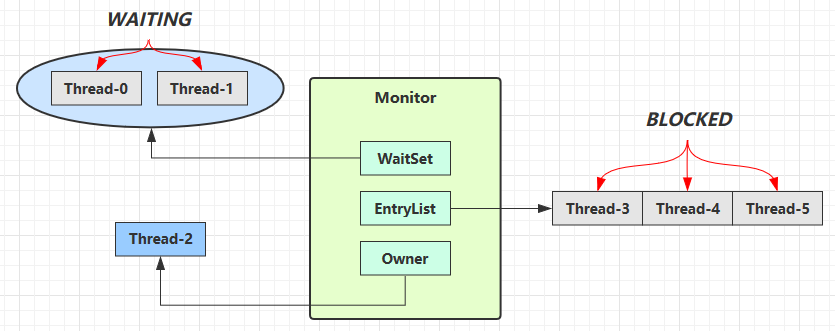
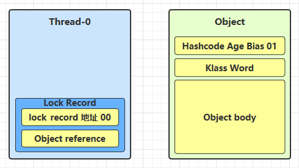
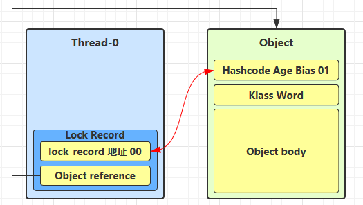
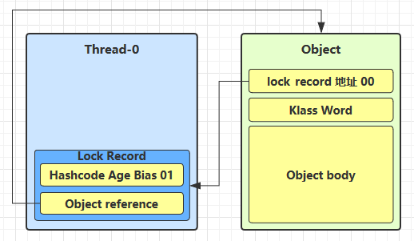
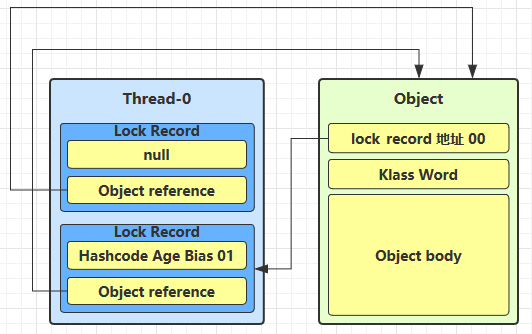
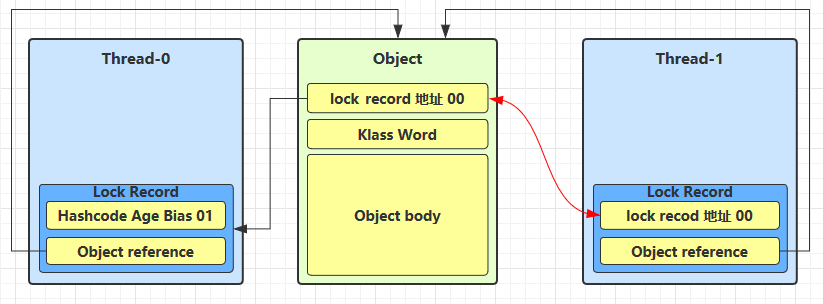
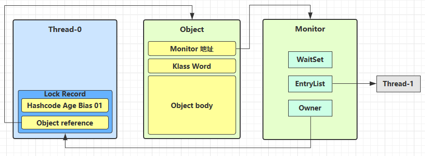
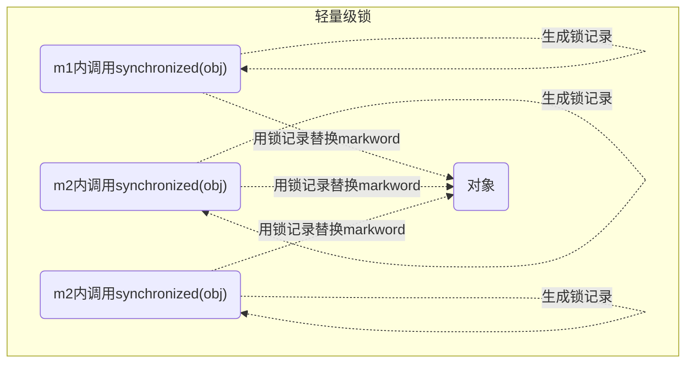
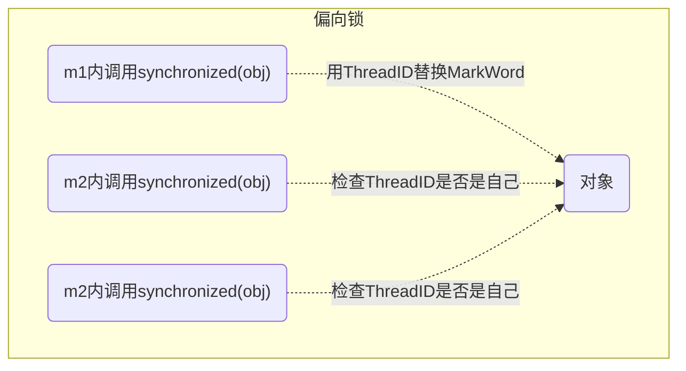

[返回首页](index.md)
[[toc]]

## *synchoronized原理

### Java 对象头

以 32 位虚拟机为例

普通对象

```ruby
|--------------------------------------------------------------|
|                    Object Header (64 bits)                   |
|------------------------------------|-------------------------|
|       Mark Word (32 bits)          |   Klass Word (32 bits)  |
|------------------------------------|-------------------------|
```

数组对象

```ruby
|---------------------------------------------------------------------------------|
|                             Object Header (96 bits)                             |
|--------------------------------|-----------------------|------------------------|
|        Mark Word(32bits)       |   Klass Word(32bits)  |  array length(32bits)  |
|--------------------------------|-----------------------|------------------------|
```

其中 Mark Word 结构为

```ruby
|-------------------------------------------------------|--------------------|
|                  Mark Word (32 bits)                  |        State       |
|-------------------------------------------------------|--------------------|
|    hashcode:25  | age:4 |   biased_lock:0   |   01    |       Normal       |
|-------------------------------------------------------|--------------------|
|thread:23|epoch:2| age:4 |   biased_lock:1   |   01    |       Biased       |
|-------------------------------------------------------|--------------------|
|          ptr_to_lock_record:30              |   00    | Lightweight Locked |
|-------------------------------------------------------|--------------------|
|          ptr_to_heavyweight_monitor:30      |   10    | Heavyweight Locked |
|-------------------------------------------------------|--------------------|
|                                             |   11    |    Marked for GC   |
|-------------------------------------------------------|--------------------|
```

64 位虚拟机 Mark Word

```ruby
|--------------------------------------------------------------------|--------------------|
|                          Mark Word (64 bits)                       |        State       |
|--------------------------------------------------------------------|--------------------|
| unused:25 | hashcode:31 | unused:1 | age:4 | biased_lock:0 |  01   |        Normal      |
|--------------------------------------------------------------------|--------------------|
| thread:54 |   epoch:2   | unused:1 | age:4 | biased_lock:1 |  01   |        Biased      |
|--------------------------------------------------------------------|--------------------|
|                    ptr_to_lock_record:62                   |  00   | Lightweight Locked |
|--------------------------------------------------------------------|--------------------|
|                 ptr_to_heavyweight_monitor:62              |  10   | Heavyweight Locked |
|--------------------------------------------------------------------|--------------------|
|                                                            |  11   |    Marked for GC   |
|--------------------------------------------------------------------|--------------------|
```

> 参考资料
>
> https://stackoverflow.com/questions/26357186/what-is-in-java-object-header


### <font color='blue'>* 原理之Monitor(锁)</font>

Monitor 被翻译为**监视器**或**管程** 

每个 Java 对象都可以关联一个 Monitor 对象，如果使用 synchronized 给对象上锁（重量级）之后，该对象头的 Mark Word 中就被设置指向 Monitor 对象的指针 

Monitor 结构如下



- 刚开始 Monitor 中 Owner 为 null 
- 当 Thread-2 执行 synchronized(obj) 就会将 Monitor 的所有者 Owner 置为 Thread-2，Monitor中只能有一 个 Owner 
- 在 Thread-2 上锁的过程中，如果 Thread-3，Thread-4，Thread-5 也来执行 synchronized(obj)，就会进入 EntryList BLOCKED 
- Thread-2 执行完同步代码块的内容，然后唤醒 EntryList 中等待的线程来竞争锁，竞争的时是非公平的 
- 图中 WaitSet 中的 Thread-0，Thread-1 是之前获得过锁，但条件不满足进入 WAITING 状态的线程，后面讲 wait-notify 时会分析

> **注意**： 
>
> - synchronized 必须是进入同一个对象的 monitor 才有上述的效果 
> - 不加 synchronized 的对象不会关联监视器，不遵从以上规则


### <font color='blue'>* 原理之 synchronized</font>

```java
static final Object lock = new Object();
static int counter = 0;
public static void main(String[] args) {
    synchronized (lock) {
        counter++;
    }
}
```

对应的字节码为

```java
public static void main(java.lang.String[]);
    descriptor: ([Ljava/lang/String;)V
    flags: ACC_PUBLIC, ACC_STATIC
    Code:
      stack=2, locals=3, args_size=1
         0: getstatic     #2                  // <- lock 引用 (Syncronized开始)
         3: dup
         4: astore_1													// locak 引用 slot 1
         5: monitorenter											// 将 lock对象 MarkWord 置为 Minitor指针
         6: getstatic     #3                  // <- i
         9: iconst_1													// 准备常数 1
        10: iadd															// +1
        11: putstatic     #3                  // <- lock引用
        14: aload_1														
        15: monitorexit												// 将 lock对象 MarkWord重置，唤醒 EntryList			
        16: goto          24
        19: astore_2													// e -> slot2
        20: aload_1														// <- lock应用
        21: monitorexit												// 将 lock对象 MarkWord重置，唤醒 EntryList
        22: aload_2														// e <- slot2
        23: athrow														// throw e
        24: return
      Exception table:
         from    to  target type
             6    16    19   any
            19    22    19   any
      LineNumberTable:
        line 7: 0
        line 8: 6
        line 9: 14
        line 10: 24
      LocalVariableTable:
        Start  Length  Slot  Name   Signature
            0      25     0  args   [Ljava/lang/String;
      StackMapTable: number_of_entries = 2
        frame_type = 255 /* full_frame */
          offset_delta = 19
          locals = [ class "[Ljava/lang/String;", class java/lang/Object ]
          stack = [ class java/lang/Throwable ]
        frame_type = 250 /* chop */
          offset_delta = 4
```

> **注意** 
>
> 方法级别的 synchronized 不会在字节码指令中有所体现


### <font color='blue'>* 原理之 synchronized 进阶</font>

#### 轻量级锁

轻量级锁的使用场景：如果一个对象虽然有多线程要加锁，但加锁的时间是错开的（也就是没有竞争），那么可以使用轻量级锁来优化。 

轻量级锁对使用者是透明的，即语法仍然是 `synchronized `

假设有两个方法同步块，利用同一个对象加锁

```java
static final Object obj = new Object();
public static void method1() {
    synchronized( obj ) {
        // 同步块 A
        method2();
    }
}
public static void method2() {
    synchronized( obj ) {
        // 同步块 B
    }
}
```

- 创建锁记录（Lock Record）对象，每个线程都的栈帧都会包含一个锁记录的结构，内部可以存储锁定对象的 Mark Word

  

- 让锁记录中 Object reference 指向锁对象，并尝试用 cas 替换 Object 的 Mark Word，将 Mark Word 的值存入锁记录

  

- 如果 cas 替换成功，对象头中存储了锁记录地址和状态 00 ，表示由该线程给对象加锁，这时图示如下

  

- 如果 cas 失败，有两种情况 

  - 如果是其它线程已经持有了该 Object 的轻量级锁，这时表明有竞争，进入锁膨胀过程 

  - 如果是自己执行了 synchronized 锁重入，那么再添加一条 Lock Record 作为重入的计数

    

- 当退出 synchronized 代码块（解锁时）如果有取值为 null 的锁记录，表示有重入，这时重置锁记录，表示重入计数减一

  


- 当退出 synchronized 代码块（解锁时）锁记录的值不为 null，这时使用cas将Mark Word的值恢复给对象头 

  - 成功，则解锁成功 
  - 失败，说明轻量级锁进行了锁膨胀或已经升级为重量级锁，进入重量级锁解锁流程

<br/>

#### 锁膨胀

如果在尝试加轻量级锁的过程中，CAS 操作无法成功，这时一种情况就是有其它线程为此对象加上了轻量级锁（有竞争），这时需要进行锁膨胀，将轻量级锁变为重量级锁。

```java
static Object obj = new Object();
public static void method1() {
    synchronized( obj ) {
        // 同步块
    }
}
```

- 当 Thread-1 进行轻量级加锁时，Thread-0 已经对该对象加了轻量级锁

  

- 这时 Thread-1 加轻量级锁失败，进入锁膨胀流程 

  - 即为 Object 对象申请 Monitor 锁，让 Object 指向重量级锁地址 

  - 然后自己进入 Monitor 的 EntryList BLOCKED

    

- 当 Thread-0 退出同步块解锁时，使用 cas 将 Mark Word 的值恢复给对象头，失败。这时会进入重量级解锁流程，即按照 Monitor 地址找到 Monitor 对象，设置 Owner 为 null，唤醒 EntryList 中 BLOCKED 线程

<br/>

#### 自旋优化

重量级锁竞争的时候，还可以使用自旋来进行优化，如果当前线程自旋成功（即这时候持锁线程已经退出了同步块，释放了锁），这时当前线程就可以避免阻塞。 

自旋重试成功的情况

| 线程1 (  core 1上)      | 对象Mark                 | 线程2 ( core 2上)        |
| :---------------------- | :----------------------- | :----------------------- |
| -                       | 10（重量锁）             | -                        |
| 访问同步块，获取monitor | 10（重量锁）重量锁指针   | -                        |
| 成功（加锁）            | 10（重量锁）重量锁指针   | -                        |
| 执行同步块              | 10（重量锁）重量锁指针   | -                        |
| 执行同步块              | 10   (重量锁）重量锁指针 | 访问同步块，获取 monitor |
| 执行同步块              | 10（重量锁）重量锁指针   | 自旋重试                 |
| 执行完毕                | 10（重量锁）重量锁指针   | 自旋重试                 |
| 成功（解锁）            | 01（无锁）               | 自旋重试                 |
| -                       | 10（重量锁）重量锁指针   | 成功（加锁)              |
| -                       | 10（重量锁）重量锁指针   | 执行同步块               |
| -                       | ...                      | ...                      |

自旋重试失败的情况

| 线程1 ( core 1上)       | 对象Mark               | 线程2( core 2上)        |
| :---------------------- | :--------------------- | :---------------------- |
| -                       | 10（重量锁）           | -                       |
| 访问同步块，获取monitor | 10（重量锁）重量锁指针 | -                       |
| 成功（加锁)             | 10（重量锁）重量锁指针 | -                       |
| 执行同步块              | 10（重量锁）重量锁指针 | -                       |
| 执行同步块              | 10（重量锁）重量锁指针 | 访问同步块，获取monitor |
| 执行同步块              | 10（重量锁）重量锁指针 | 自旋重试                |
| 执行同步块              | 10（重量锁）重量锁指针 | 自旋重试                |
| 执行同步块              | 10（重量锁）重量锁指针 | 自旋重试                |
| 执行同步块              | 10（重量锁）重量锁指针 | 阻塞                    |
| -                       | ...                    | ...                     |

- 自旋会占用 CPU 时间，单核 CPU 自旋就是浪费，多核 CPU 自旋才能发挥优势。 
- 在 Java 6 之后自旋锁是自适应的，比如对象刚刚的一次自旋操作成功过，那么认为这次自旋成功的可能性会 高，就多自旋几次；反之，就少自旋甚至不自旋，总之，比较智能。 
- Java 7 之后不能控制是否开启自旋功能

<br/>

#### 偏向锁

轻量级锁在没有竞争时（就自己这个线程），每次重入仍然需要执行 CAS 操作。 

Java 6 中引入了偏向锁来做进一步优化：只有第一次使用 CAS 将 **线程 ID** 设置到对象的 Mark Word 头，之后发现 这个线程 ID 是自己的就表示没有竞争，不用重新 CAS。以后只要不发生竞争，这个对象就归该线程所有 

例如：

```java
static final Object obj = new Object();
public static void m1() {
    synchronized( obj ) {
        // 同步块 A
        m2();
    }
}
public static void m2() {
    synchronized( obj ) {
        // 同步块 B
        m3();
    }
}
public static void m3() {
    synchronized( obj ) {
        // 同步块 C
    }
}
```

轻量级锁



偏向锁




偏向状态

回忆一下对象头格式

```ruby
|--------------------------------------------------------------------|--------------------|
|                          Mark Word (64 bits)                       |        State       |
|--------------------------------------------------------------------|--------------------|
| unused:25 | hashcode:31 | unused:1 | age:4 | biased_lock:0 |  01   |        Normal      |
|--------------------------------------------------------------------|--------------------|
| thread:54 |   epoch:2   | unused:1 | age:4 | biased_lock:1 |  01   |        Biased      |
|--------------------------------------------------------------------|--------------------|
|                    ptr_to_lock_record:62                   |  00   | Lightweight Locked |
|--------------------------------------------------------------------|--------------------|
|                 ptr_to_heavyweight_monitor:62              |  10   | Heavyweight Locked |
|--------------------------------------------------------------------|--------------------|
|                                                            |  11   |    Marked for GC   |
|--------------------------------------------------------------------|--------------------|
```

一个对象创建时： 

- 如果开启了偏向锁（默认开启），那么对象创建后，markword 值为 0x05 即最后 3 位为 101，这时它的 thread、epoch、age 都为 0 
- 偏向锁是默认是延迟的，不会在程序启动时立即生效，如果想避免延迟，可以加 VM 参数`- XX:BiasedLockingStartupDelay=0`来禁用延迟 
- 如果没有开启偏向锁，那么对象创建后，markword 值为 0x01 即最后 3 位为 001，这时它的 hashcode、 age 都为 0，第一次用到 hashcode 时才会赋值。


1） 测试延迟特性 

2） 测试偏向锁

```java
class Dog {}
```

利用 jol 第三方工具来查看对象头信息（注意这里我扩展了 jol 让它输出更为简洁）

```java
// 添加虚拟机参数 -XX:BiasedLockingStartupDelay=0 
public static void main(String[] args) throws IOException {
    Dog d = new Dog();
    ClassLayout classLayout = ClassLayout.parseInstance(d);
    new Thread(() -> {
        log.debug("synchronized 前");
        System.out.println(classLayout.toPrintableSimple(true));
        synchronized (d) {
            log.debug("synchronized 中");
            System.out.println(classLayout.toPrintableSimple(true));
        }
        log.debug("synchronized 后");
        System.out.println(classLayout.toPrintableSimple(true));
    }, "t1").start();
}
```

输出

```sh
11:08:58.117 c.TestBiased [t1] - synchronized 前
00000000 00000000 00000000 00000000 00000000 00000000 00000000 00000101 
11:08:58.121 c.TestBiased [t1] - synchronized 中 前54位是操作系统的线程ID
00000000 00000000 00000000 00000000 00011111 11101011 11010000 00000101 
11:08:58.121 c.TestBiased [t1] - synchronized 后 都是主线程的线程ID
00000000 00000000 00000000 00000000 00011111 11101011 11010000 00000101 
```

> **注意** 
>
> 处于偏向锁的对象解锁后，线程 id 仍存储于对象头中


3）测试禁用 

在上面测试代码运行时在添加 VM 参数 -XX:-UseBiasedLocking 禁用偏向锁 

输出

```sh
11:13:10.018 c.TestBiased [t1] - synchronized 前  正常状态，后3位 001
00000000 00000000 00000000 00000000 00000000 00000000 00000000 00000001 
11:13:10.021 c.TestBiased [t1] - synchronized 中  轻量级锁，最后2位 00，前64位轻量级指针
00000000 00000000 00000000 00000000 00100000 00010100 11110011 10001000 
11:13:10.021 c.TestBiased [t1] - synchronized 后  解锁以后，恢复成正常状态
00000000 00000000 00000000 00000000 00000000 00000000 00000000 00000001 
```


4)测试 hashCode 

- 正常状态对象一开始是没有 hashCode 的，第一次调用才生成

```java
// 添加虚拟机参数 -XX:BiasedLockingStartupDelay=0 
public static void main(String[] args) throws IOException {
    Dog d = new Dog();
  	d.hashCode();
    ClassLayout classLayout = ClassLayout.parseInstance(d);
    new Thread(() -> {
        log.debug("synchronized 前");
        System.out.println(classLayout.toPrintableSimple(true));
        synchronized (d) {
            log.debug("synchronized 中");
            System.out.println(classLayout.toPrintableSimple(true));
        }
        log.debug("synchronized 后");
        System.out.println(classLayout.toPrintableSimple(true));
    }, "t1").start();
}
```


撤销偏向锁 - 调用对象 hashCode

调用了对象的 hashCode，但偏向锁的对象 MarkWord 中存储的是线程 id，如果调用 hashCode 会导致偏向锁没有内存空间来存储hashCode，所以导致偏向锁被撤销 

- 轻量级锁会在锁记录中记录 hashCode 
- 重量级锁会在 Monitor 中记录 hashCode 

在调用 hashCode 后使用偏向锁，记得去掉`-XX:-UseBiasedLocking `


输出

```SH
11:22:10.386 c.TestBiased [main] - 调用 hashCode:1778535015 
11:22:10.391 c.TestBiased [t1] - synchronized 前
00000000 00000000 00000000 01101010 00000010 01001010 01100111 00000001 
11:22:10.393 c.TestBiased [t1] - synchronized 中
00000000 00000000 00000000 00000000 00100000 11000011 11110011 01101000 
11:22:10.393 c.TestBiased [t1] - synchronized 后
00000000 00000000 00000000 01101010 00000010 01001010 01100111 00000001 
```


撤销 - 其它线程使用对象 

当有其它线程使用偏向锁对象时，会将偏向锁升级为轻量级锁。

偏向锁升级成轻量级锁是2个线程访问同一个对象是错开的，有交错则会升级为重量级锁。

```JAVA
private static void test2() throws InterruptedException {
    Dog d = new Dog();
    Thread t1 = new Thread(() -> {
        synchronized (d) {
            log.debug(ClassLayout.parseInstance(d).toPrintableSimple(true));
        }
      
        synchronized (TestBiased.class) {
            //通知T2线程启动
            TestBiased.class.notify();
        }
        // 如果不用 wait/notify 使用 join 必须打开下面的注释
        // 因为：t1 线程不能结束，否则底层线程可能被 jvm 重用作为 t2 线程，底层线程 id 是一样的
        /*try {
           System.in.read();
          } catch (IOException e) {
           e.printStackTrace();
          }*/
    }, "t1");
    t1.start();
  
    Thread t2 = new Thread(() -> {
        synchronized (TestBiased.class) {
            try {
                TestBiased.class.wait();
            } catch (InterruptedException e) {
                e.printStackTrace();
            }
        }
        log.debug(ClassLayout.parseInstance(d).toPrintableSimple(true));
        synchronized (d) {
            log.debug(ClassLayout.parseInstance(d).toPrintableSimple(true));
        }
        log.debug(ClassLayout.parseInstance(d).toPrintableSimple(true));
    }, "t2");
    t2.start();
}
```

输出

```sh
[t1] - 00000000 00000000 00000000 00000000 00011111 01000001 00010000 00000101 
[t2] - 00000000 00000000 00000000 00000000 00011111 01000001 00010000 00000101 
[t2] - 00000000 00000000 00000000 00000000 00011111 10110101 11110000 01000000 
[t2] - 00000000 00000000 00000000 00000000 00000000 00000000 00000000 00000001 
```


撤销 - 调用 wait/notify，

只有重量级锁有

```java
public static void main(String[] args) throws InterruptedException {
    Dog d = new Dog();
    Thread t1 = new Thread(() -> {
        log.debug(ClassLayout.parseInstance(d).toPrintableSimple(true));
        synchronized (d) {
            log.debug(ClassLayout.parseInstance(d).toPrintableSimple(true));
            try {
                d.wait();
            } catch (InterruptedException e) {
                e.printStackTrace();
            }
            log.debug(ClassLayout.parseInstance(d).toPrintableSimple(true));
        }
    }, "t1");
    t1.start();
    new Thread(() -> {
        try {
            Thread.sleep(6000);
        } catch (InterruptedException e) {
            e.printStackTrace();
        }
        synchronized (d) {
            log.debug("notify");
            d.notify();
        }
    }, "t2").start();
}
```

输出

```sh
[t1] - 00000000 00000000 00000000 00000000 00000000 00000000 00000000 00000101 
[t1] - 00000000 00000000 00000000 00000000 00011111 10110011 11111000 00000101 
[t2] - notify 
[t1] - 00000000 00000000 00000000 00000000 00011100 11010100 00001101 11001010 
```


**批量重偏向** 

如果对象虽然被多个线程访问，但没有竞争，这时偏向了线程 T1 的对象仍有机会重新偏向 T2，重偏向会重置对象 的 Thread ID 

当撤销偏向锁阈值超过 20 次后，jvm 会这样觉得，我是不是偏向错了呢，于是会在给这些对象加锁时重新偏向至加锁线程

```java
private static void test3() throws InterruptedException {
    Vector<Dog> list = new Vector<>();
    Thread t1 = new Thread(() -> {
        for (int i = 0; i < 30; i++) {
            Dog d = new Dog();
            list.add(d);
            synchronized (d) {
                log.debug(i + "\t" + ClassLayout.parseInstance(d).toPrintableSimple(true));
            }
        }
        synchronized (list) {
            list.notify();
        } 
    }, "t1");
    t1.start();

    Thread t2 = new Thread(() -> {
        synchronized (list) {
            try {
                list.wait();
            } catch (InterruptedException e) {
                e.printStackTrace();
            }
        }
        log.debug("===============> ");
        for (int i = 0; i < 30; i++) {
            Dog d = list.get(i);
            log.debug(i + "\t" + ClassLayout.parseInstance(d).toPrintableSimple(true));
            synchronized (d) {
                log.debug(i + "\t" + ClassLayout.parseInstance(d).toPrintableSimple(true));
            }
            log.debug(i + "\t" + ClassLayout.parseInstance(d).toPrintableSimple(true));
        }
    }, "t2");
    t2.start();
}
```

输出

```sh
[t1] - 0 00000000 00000000 00000000 00000000 00011111 11110011 11100000 00000101 
[t1] - 1 00000000 00000000 00000000 00000000 00011111 11110011 11100000 00000101 
[t1] - 2 00000000 00000000 00000000 00000000 00011111 11110011 11100000 00000101 
[t1] - 3 00000000 00000000 00000000 00000000 00011111 11110011 11100000 00000101 
[t1] - 4 00000000 00000000 00000000 00000000 00011111 11110011 11100000 00000101 
[t1] - 5 00000000 00000000 00000000 00000000 00011111 11110011 11100000 00000101 
[t1] - 6 00000000 00000000 00000000 00000000 00011111 11110011 11100000 00000101 
[t1] - 7 00000000 00000000 00000000 00000000 00011111 11110011 11100000 00000101 
[t1] - 8 00000000 00000000 00000000 00000000 00011111 11110011 11100000 00000101 
[t1] - 9 00000000 00000000 00000000 00000000 00011111 11110011 11100000 00000101 
[t1] - 10 00000000 00000000 00000000 00000000 00011111 11110011 11100000 00000101 
[t1] - 11 00000000 00000000 00000000 00000000 00011111 11110011 11100000 00000101 
[t1] - 12 00000000 00000000 00000000 00000000 00011111 11110011 11100000 00000101 
[t1] - 13 00000000 00000000 00000000 00000000 00011111 11110011 11100000 00000101 
[t1] - 14 00000000 00000000 00000000 00000000 00011111 11110011 11100000 00000101 
[t1] - 15 00000000 00000000 00000000 00000000 00011111 11110011 11100000 00000101 
[t1] - 16 00000000 00000000 00000000 00000000 00011111 11110011 11100000 00000101 
[t1] - 17 00000000 00000000 00000000 00000000 00011111 11110011 11100000 00000101 
[t1] - 18 00000000 00000000 00000000 00000000 00011111 11110011 11100000 00000101 
[t1] - 19 00000000 00000000 00000000 00000000 00011111 11110011 11100000 00000101 
[t1] - 20 00000000 00000000 00000000 00000000 00011111 11110011 11100000 00000101 
[t1] - 21 00000000 00000000 00000000 00000000 00011111 11110011 11100000 00000101 
[t1] - 22 00000000 00000000 00000000 00000000 00011111 11110011 11100000 00000101 
[t1] - 23 00000000 00000000 00000000 00000000 00011111 11110011 11100000 00000101 
[t1] - 24 00000000 00000000 00000000 00000000 00011111 11110011 11100000 00000101 
[t1] - 25 00000000 00000000 00000000 00000000 00011111 11110011 11100000 00000101 
[t1] - 26 00000000 00000000 00000000 00000000 00011111 11110011 11100000 00000101 
[t1] - 27 00000000 00000000 00000000 00000000 00011111 11110011 11100000 00000101 
[t1] - 28 00000000 00000000 00000000 00000000 00011111 11110011 11100000 00000101 
[t1] - 29 00000000 00000000 00000000 00000000 00011111 11110011 11100000 00000101 
[t2] - ===============> 
[t2] - 0 00000000 00000000 00000000 00000000 00011111 11110011 11100000 00000101 
[t2] - 0 00000000 00000000 00000000 00000000 00100000 01011000 11110111 00000000 
[t2] - 0 00000000 00000000 00000000 00000000 00000000 00000000 00000000 00000001 
[t2] - 1 00000000 00000000 00000000 00000000 00011111 11110011 11100000 00000101 
[t2] - 1 00000000 00000000 00000000 00000000 00100000 01011000 11110111 00000000 
[t2] - 1 00000000 00000000 00000000 00000000 00000000 00000000 00000000 00000001 
[t2] - 2 00000000 00000000 00000000 00000000 00011111 11110011 11100000 00000101 
[t2] - 2 00000000 00000000 00000000 00000000 00100000 01011000 11110111 00000000 
[t2] - 2 00000000 00000000 00000000 00000000 00000000 00000000 00000000 00000001 
[t2] - 3 00000000 00000000 00000000 00000000 00011111 11110011 11100000 00000101 
[t2] - 3 00000000 00000000 00000000 00000000 00100000 01011000 11110111 00000000 
[t2] - 3 00000000 00000000 00000000 00000000 00000000 00000000 00000000 00000001 
[t2] - 4 00000000 00000000 00000000 00000000 00011111 11110011 11100000 00000101 
[t2] - 4 00000000 00000000 00000000 00000000 00100000 01011000 11110111 00000000 
[t2] - 4 00000000 00000000 00000000 00000000 00000000 00000000 00000000 00000001 
[t2] - 5 00000000 00000000 00000000 00000000 00011111 11110011 11100000 00000101 
[t2] - 5 00000000 00000000 00000000 00000000 00100000 01011000 11110111 00000000 
[t2] - 5 00000000 00000000 00000000 00000000 00000000 00000000 00000000 00000001 
[t2] - 6 00000000 00000000 00000000 00000000 00011111 11110011 11100000 00000101 
[t2] - 6 00000000 00000000 00000000 00000000 00100000 01011000 11110111 00000000 
[t2] - 6 00000000 00000000 00000000 00000000 00000000 00000000 00000000 00000001 
[t2] - 7 00000000 00000000 00000000 00000000 00011111 11110011 11100000 00000101
[t2] - 7 00000000 00000000 00000000 00000000 00100000 01011000 11110111 00000000 
[t2] - 7 00000000 00000000 00000000 00000000 00000000 00000000 00000000 00000001 
[t2] - 8 00000000 00000000 00000000 00000000 00011111 11110011 11100000 00000101 
[t2] - 8 00000000 00000000 00000000 00000000 00100000 01011000 11110111 00000000 
[t2] - 8 00000000 00000000 00000000 00000000 00000000 00000000 00000000 00000001 
[t2] - 9 00000000 00000000 00000000 00000000 00011111 11110011 11100000 00000101 
[t2] - 9 00000000 00000000 00000000 00000000 00100000 01011000 11110111 00000000 
[t2] - 9 00000000 00000000 00000000 00000000 00000000 00000000 00000000 00000001 
[t2] - 10 00000000 00000000 00000000 00000000 00011111 11110011 11100000 00000101 
[t2] - 10 00000000 00000000 00000000 00000000 00100000 01011000 11110111 00000000 
[t2] - 10 00000000 00000000 00000000 00000000 00000000 00000000 00000000 00000001 
[t2] - 11 00000000 00000000 00000000 00000000 00011111 11110011 11100000 00000101 
[t2] - 11 00000000 00000000 00000000 00000000 00100000 01011000 11110111 00000000 
[t2] - 11 00000000 00000000 00000000 00000000 00000000 00000000 00000000 00000001 
[t2] - 12 00000000 00000000 00000000 00000000 00011111 11110011 11100000 00000101 
[t2] - 12 00000000 00000000 00000000 00000000 00100000 01011000 11110111 00000000 
[t2] - 12 00000000 00000000 00000000 00000000 00000000 00000000 00000000 00000001 
[t2] - 13 00000000 00000000 00000000 00000000 00011111 11110011 11100000 00000101 
[t2] - 13 00000000 00000000 00000000 00000000 00100000 01011000 11110111 00000000 
[t2] - 13 00000000 00000000 00000000 00000000 00000000 00000000 00000000 00000001 
[t2] - 14 00000000 00000000 00000000 00000000 00011111 11110011 11100000 00000101 
[t2] - 14 00000000 00000000 00000000 00000000 00100000 01011000 11110111 00000000 
[t2] - 14 00000000 00000000 00000000 00000000 00000000 00000000 00000000 00000001 
[t2] - 15 00000000 00000000 00000000 00000000 00011111 11110011 11100000 00000101 
[t2] - 15 00000000 00000000 00000000 00000000 00100000 01011000 11110111 00000000 
[t2] - 15 00000000 00000000 00000000 00000000 00000000 00000000 00000000 00000001 
[t2] - 16 00000000 00000000 00000000 00000000 00011111 11110011 11100000 00000101 
[t2] - 16 00000000 00000000 00000000 00000000 00100000 01011000 11110111 00000000 
[t2] - 16 00000000 00000000 00000000 00000000 00000000 00000000 00000000 00000001 
[t2] - 17 00000000 00000000 00000000 00000000 00011111 11110011 11100000 00000101 
[t2] - 17 00000000 00000000 00000000 00000000 00100000 01011000 11110111 00000000 
[t2] - 17 00000000 00000000 00000000 00000000 00000000 00000000 00000000 00000001 
[t2] - 18 00000000 00000000 00000000 00000000 00011111 11110011 11100000 00000101 
[t2] - 18 00000000 00000000 00000000 00000000 00100000 01011000 11110111 00000000 
[t2] - 18 00000000 00000000 00000000 00000000 00000000 00000000 00000000 00000001 
[t2] - 19 00000000 00000000 00000000 00000000 00011111 11110011 11100000 00000101 
[t2] - 19 00000000 00000000 00000000 00000000 00011111 11110011 11110001 00000101 
[t2] - 19 00000000 00000000 00000000 00000000 00011111 11110011 11110001 00000101 
[t2] - 20 00000000 00000000 00000000 00000000 00011111 11110011 11100000 00000101 
[t2] - 20 00000000 00000000 00000000 00000000 00011111 11110011 11110001 00000101 
[t2] - 20 00000000 00000000 00000000 00000000 00011111 11110011 11110001 00000101 
[t2] - 21 00000000 00000000 00000000 00000000 00011111 11110011 11100000 00000101 
[t2] - 21 00000000 00000000 00000000 00000000 00011111 11110011 11110001 00000101 
[t2] - 21 00000000 00000000 00000000 00000000 00011111 11110011 11110001 00000101 
[t2] - 22 00000000 00000000 00000000 00000000 00011111 11110011 11100000 00000101 
[t2] - 22 00000000 00000000 00000000 00000000 00011111 11110011 11110001 00000101 
[t2] - 22 00000000 00000000 00000000 00000000 00011111 11110011 11110001 00000101 
[t2] - 23 00000000 00000000 00000000 00000000 00011111 11110011 11100000 00000101 
[t2] - 23 00000000 00000000 00000000 00000000 00011111 11110011 11110001 00000101 
[t2] - 23 00000000 00000000 00000000 00000000 00011111 11110011 11110001 00000101 
[t2] - 24 00000000 00000000 00000000 00000000 00011111 11110011 11100000 00000101 
[t2] - 24 00000000 00000000 00000000 00000000 00011111 11110011 11110001 00000101 
[t2] - 24 00000000 00000000 00000000 00000000 00011111 11110011 11110001 00000101 
[t2] - 25 00000000 00000000 00000000 00000000 00011111 11110011 11100000 00000101 
[t2] - 25 00000000 00000000 00000000 00000000 00011111 11110011 11110001 00000101 
[t2] - 25 00000000 00000000 00000000 00000000 00011111 11110011 11110001 00000101 
[t2] - 26 00000000 00000000 00000000 00000000 00011111 11110011 11100000 00000101 
[t2] - 26 00000000 00000000 00000000 00000000 00011111 11110011 11110001 00000101 
[t2] - 26 00000000 00000000 00000000 00000000 00011111 11110011 11110001 00000101 
[t2] - 27 00000000 00000000 00000000 00000000 00011111 11110011 11100000 00000101 
[t2] - 27 00000000 00000000 00000000 00000000 00011111 11110011 11110001 00000101 
[t2] - 27 00000000 00000000 00000000 00000000 00011111 11110011 11110001 00000101 
[t2] - 28 00000000 00000000 00000000 00000000 00011111 11110011 11100000 00000101 
[t2] - 28 00000000 00000000 00000000 00000000 00011111 11110011 11110001 00000101 
[t2] - 28 00000000 00000000 00000000 00000000 00011111 11110011 11110001 00000101 
[t2] - 29 00000000 00000000 00000000 00000000 00011111 11110011 11100000 00000101 
[t2] - 29 00000000 00000000 00000000 00000000 00011111 11110011 11110001 00000101 
[t2] - 29 00000000 00000000 00000000 00000000 00011111 11110011 11110001 00000101 
```

批量撤销 

当撤销偏向锁阈值超过 40 次后，jvm 会这样觉得，自己确实偏向错了，根本就不该偏向。于是整个类的所有对象都会变为不可偏向的，新建的对象也是不可偏向的

```java
static Thread t1,t2,t3;
private static void test4() throws InterruptedException {
    Vector<Dog> list = new Vector<>();
    int loopNumber = 39;
    t1 = new Thread(() -> {
        for (int i = 0; i < loopNumber; i++) {
            Dog d = new Dog();
            list.add(d);
            synchronized (d) {
                log.debug(i + "\t" + ClassLayout.parseInstance(d).toPrintableSimple(true));
            }
        }
        LockSupport.unpark(t2);
    }, "t1");
    t1.start();
    t2 = new Thread(() -> {
        LockSupport.park();
        log.debug("===============> ");
        for (int i = 0; i < loopNumber; i++) {
            Dog d = list.get(i);
            log.debug(i + "\t" + ClassLayout.parseInstance(d).toPrintableSimple(true));
            synchronized (d) {
                log.debug(i + "\t" + ClassLayout.parseInstance(d).toPrintableSimple(true));
            }
            log.debug(i + "\t" + ClassLayout.parseInstance(d).toPrintableSimple(true));
        }
        LockSupport.unpark(t3);
    }, "t2");
    t2.start();
    t3 = new Thread(() -> {
        LockSupport.park();
        log.debug("===============> ");
        for (int i = 0; i < loopNumber; i++) {
            Dog d = list.get(i);
            log.debug(i + "\t" + ClassLayout.parseInstance(d).toPrintableSimple(true));
            synchronized (d) {
                log.debug(i + "\t" + ClassLayout.parseInstance(d).toPrintableSimple(true));
            }
            log.debug(i + "\t" + ClassLayout.parseInstance(d).toPrintableSimple(true));
        }
    }, "t3");
    t3.start();
    t3.join();
    log.debug(ClassLayout.parseInstance(new Dog()).toPrintableSimple(true));
}
```

> 参考资料 
>
> https://github.com/farmerjohngit/myblog/issues/12 
>
> https://www.cnblogs.com/LemonFive/p/11246086.html 
>
> https://www.cnblogs.com/LemonFive/p/11248248.html 
>
> [偏向锁论文]([Eliminating Synchronization-Related Atomic Operations with Biased Locking and Bulk Rebiasing (oracle.com)](https://www.oracle.com/technetwork/java/biasedlocking-oopsla2006-wp-149958.pdf))

<br/>

#### 锁消除

锁上的优化，锁消除

```java
@Fork(1)
@BenchmarkMode(Mode.AverageTime)
@Warmup(iterations=3)
@Measurement(iterations=5)
@OutputTimeUnit(TimeUnit.NANOSECONDS)
public class MyBenchmark {
    static int x = 0;
    @Benchmark
    public void a() throws Exception {
        x++;
    }
    @Benchmark
    public void b() throws Exception {
        Object o = new Object();
        synchronized (o) {
            x++;
        }
    }
}
```

`java -jar benchmarks.jar`  

```sh
Benchmark 			Mode 		Samples 	Score 		Score error 	Units 
c.i.MyBenchmark.a 	avgt 		5 			1.542 			0.056 		ns/op 
c.i.MyBenchmark.b 	avgt 		5 			1.518 			0.091 		ns/op 
```

`java -XX:-EliminateLocks -jar benchmarks.jar`

```sh
Benchmark 			Mode 		Samples 		Score 		Score error 	Units 
c.i.MyBenchmark.a 	avgt 		5 				1.507 		0.108 			ns/op 
c.i.MyBenchmark.b 	avgt 		5 				16.976 		1.572 			ns/op
```

<br/>

#### 锁粗化 

对相同对象多次加锁，导致线程发生多次重入，可以使用锁粗化方式来优化，这不同于之前讲的细分锁的粒度。
