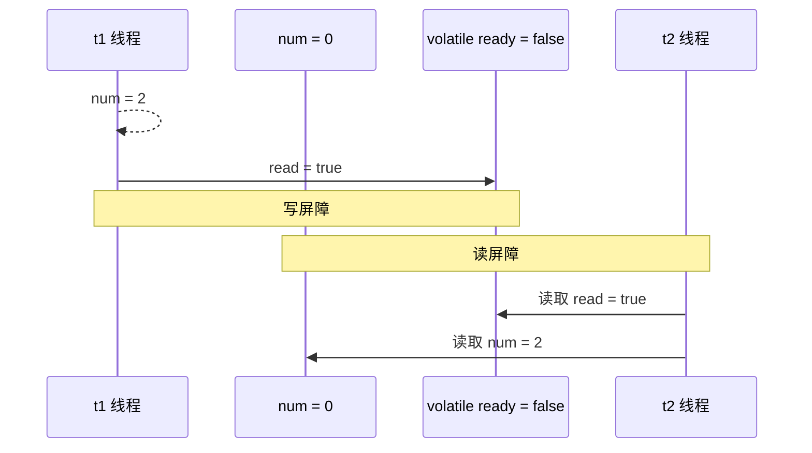
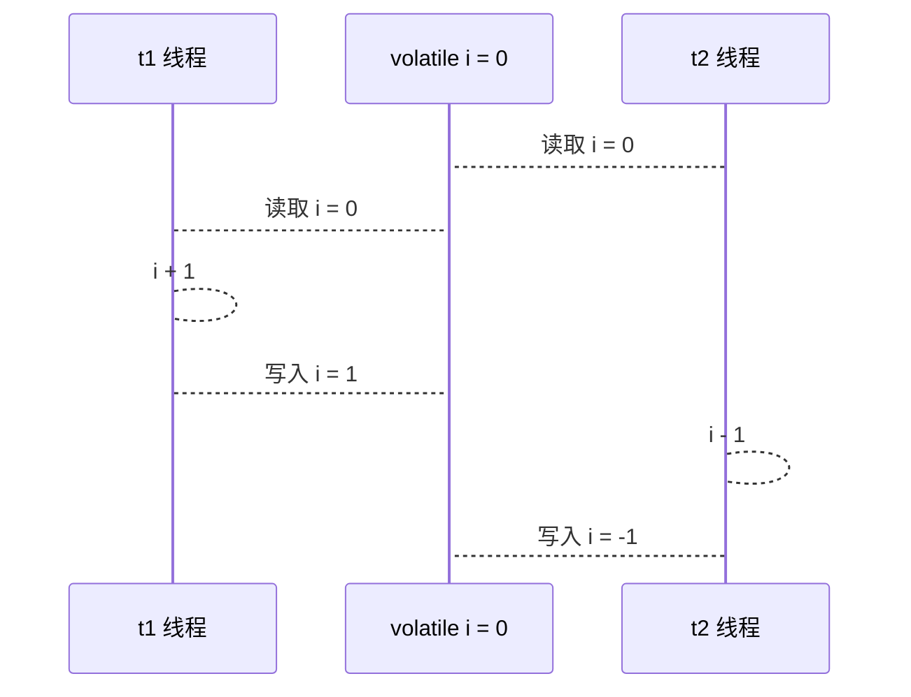
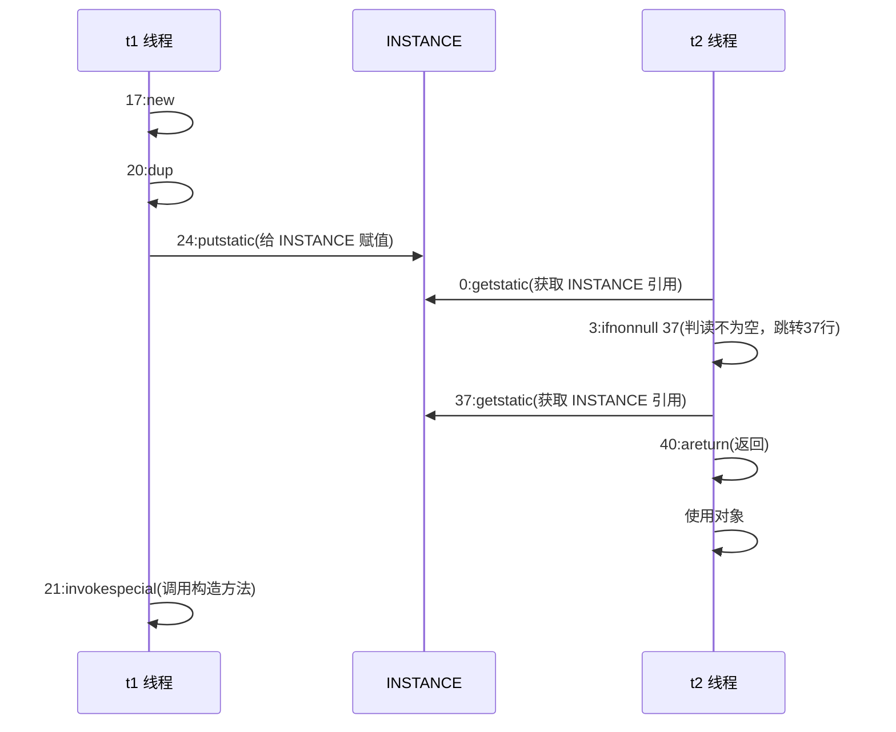
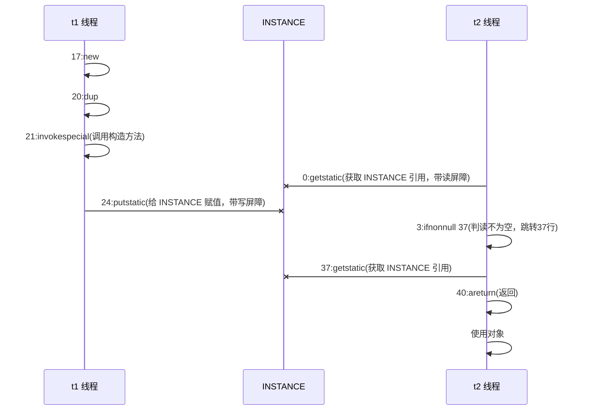

[返回首页](index.md)
[[toc]]

## * 原理之指令级并行

### 名词解释

**Clock Cycle Time** 

主频的概念大家接触的比较多，而 CPU 的 Clock Cycle Time（时钟周期时间），等于主频的倒数，意思是 CPU 能 够识别的最小时间单位，比如说 4G 主频的 CPU 的 Clock Cycle Time 就是 0.25 ns，作为对比，我们墙上挂钟的 Cycle Time 是 1s 

例如，运行一条加法指令一般需要一个时钟周期时间 

**CPI** 

有的指令需要更多的时钟周期时间，所以引出了 CPI （Cycles Per Instruction）指令平均时钟周期数 

**IPC** 

IPC（Instruction Per Clock Cycle） 即 CPI 的倒数，表示每个时钟周期能够运行的指令数 

**CPU 执行时间** 

程序的 CPU 执行时间，即我们前面提到的 user + system 时间，可以用下面的公式来表示

```java
程序 CPU 执行时间 = 指令数 * CPI * Clock Cycle Time
```

**鱼罐头的故事**

加工一条鱼需要 50 分钟，只能一条鱼、一条鱼顺序加工...


可以将每个鱼罐头的加工流程细分为 5 个步骤：

- 去鳞清洗 10分钟
- 蒸煮沥水 10分钟
- 加注汤料 10分钟
- 杀菌出锅 10分钟
- 真空封罐 10分钟


即使只有一个工人，最理想的情况是：他能够在 10 分钟内同时做好这 5 件事，因为对第一条鱼的真空装罐，不会影响对第二条鱼的杀菌出锅...

<br/>

### 指令重排序优化

事实上，现代处理器会设计为一个时钟周期完成一条执行时间最长的 CPU 指令。为什么这么做呢？可以想到指令 还可以再划分成一个个更小的阶段，例如，每条指令都可以分为： `取指令 - 指令译码 - 执行指令 - 内存访问 - 数据写回` 这 5 个阶段。


> **术语参考**： 
>
> - instruction fetch (IF) 
> - instruction decode (ID) 
> - execute (EX) 
> - memory access (MEM) 
> - register write back (WB)

在不改变程序结果的前提下，这些指令的各个阶段可以通过**重排序**和**组合**来实现指令级并行，这一技术在 80's 中叶到 90's 中叶占据了计算架构的重要地位。

> **提示**：分阶段，分工是提升效率的关键！

指令重排的前提是，重排指令不能影响结果，例如

```java
// 可以重排的例子
int a = 10; // 指令1
int b = 20; // 指令2
System.out.println( a + b );
// 不能重排的例子
int a = 10; // 指令1
int b = a - 5; // 指令2
```

> **参考**： 
>
> [Scoreboarding](https://en.wikipedia.org/wiki/Scoreboarding) and the [Tomasulo algorithm](https://en.wikipedia.org/wiki/Tomasulo_algorithm) (which is similar to scoreboarding but makes use of [register renaming](https://en.wikipedia.org/wiki/Register_renaming) )are two of the most common techniques for implementing out-of-order execution and instruction-level parallelism.

<br/>

### 支持流水线的处理器

现代 CPU 支持**多级指令流水线**，例如支持同时执行 `取指令 - 指令译码 - 执行指令 - 内存访问 - 数据写回` 的处理器，就可以称之为**五级指令流水线**。这时 CPU 可以在一个时钟周期内，同时运行五条指令的不同阶段（相当于一 条执行时间最长的复杂指令），IPC = 1，本质上，流水线技术并不能缩短单条指令的执行时间，但它变相地提高了指令地吞吐率。

> **提示**： 
>
> 奔腾四（Pentium 4）支持高达 35 级流水线，但由于功耗太高被废弃


<br/>

### SuperScalar 处理器

大多数处理器包含多个执行单元，并不是所有计算功能都集中在一起，可以再细分为整数运算单元、浮点数运算单元等，这样可以把多条指令也可以做到并行获取、译码等，CPU 可以在一个时钟周期内，执行多于一条指令，IPC > 1。


<br/>

## * 原理之 volatile

### 指令重排

```java
int num = 0;
boolean ready = false;
// 线程1 执行此方法
public void actor1(I_Result r) {
    if(ready) {
        r.r1 = num + num;
    } else {
        r.r1 = 1;
    }
}
// 线程2 执行此方法
public void actor2(I_Result r) { 
    num = 2;
    ready = true; 
}
```

I_Result 是一个对象，有一个属性 r1 用来保存结果，问，可能的结果有几种？ 

有同学这么分析 

情况1：线程1 先执行，这时 ready = false，所以进入 else 分支结果为 1 

情况2：线程2 先执行 num = 2，但没来得及执行 ready = true，线程1 执行，还是进入 else 分支，结果为1 

情况3：线程2 执行到 ready = true，线程1 执行，这回进入 if 分支，结果为 4（因为 num 已经执行过了）

<br/>

但我告诉你，结果还有可能是 0 😁😁😁，信不信吧！ 

这种情况下是：线程2 执行 ready = true，切换到线程1，进入 if 分支，相加为 0，再切回线程2 执行 num = 2 

相信很多人已经晕了 😵😵😵

<br/>

这种现象叫做指令重排，是 JIT 编译器在运行时的一些优化，这个现象需要通过大量测试才能复现： 

借助 java 并发压测工具 jcstress https://wiki.openjdk.java.net/display/CodeTools/jcstress

```sh
mvn archetype:generate -DinteractiveMode=false -DarchetypeGroupId=org.openjdk.jcstress -
DarchetypeArtifactId=jcstress-java-test-archetype -DarchetypeVersion=0.5 -DgroupId=cn.itcast -
DartifactId=ordering -Dversion=1.0 
```

创建 maven 项目，提供如下测试类

```java
@JCStressTest
@Outcome(id = {"1", "4"}, expect = Expect.ACCEPTABLE, desc = "ok")
@Outcome(id = "0", expect = Expect.ACCEPTABLE_INTERESTING, desc = "!!!!")
@State
public class ConcurrencyTest {
    int num = 0;
    boolean ready = false;
    @Actor
    public void actor1(I_Result r) {
        if(ready) {
            r.r1 = num + num;
        } else {
            r.r1 = 1;
        }
    } 
    @Actor
    public void actor2(I_Result r) {
        num = 2;
        ready = true;
    }
}
```

执行

```sh
mvn clean install 
java -jar target/jcstress.jar 
```

会输出我们感兴趣的结果，摘录其中一次结果：

```sh
*** INTERESTING tests 
 Some interesting behaviors observed. This is for the plain curiosity. 
 
 2 matching test results. 
 	[OK] test.ConcurrencyTest 
 	(JVM args: [-XX:-TieredCompilation]) 
    Observed state 	Occurrences 	Expectation Interpretation 
    0 				1,729 			ACCEPTABLE_INTERESTING !!!! 
 	1 				42,617,915 		ACCEPTABLE ok 
 	4 				5,146,627 		ACCEPTABLE ok 
 
 	[OK] test.ConcurrencyTest 
 	(JVM args: []) 
 	Observed state 	Occurrences 	Expectation Interpretation 
 	0 				1,652 			ACCEPTABLE_INTERESTING !!!! 
 	1 				46,460,657 		ACCEPTABLE ok 
 	4 				4,571,072 		ACCEPTABLE ok 
```

可以看到，出现结果为 0 的情况有 638 次，虽然次数相对很少，但毕竟是出现了。

<br/>

### 解决方法

volatile 修饰的变量，可以禁用指令重排

```java
@JCStressTest
@Outcome(id = {"1", "4"}, expect = Expect.ACCEPTABLE, desc = "ok")
@Outcome(id = "0", expect = Expect.ACCEPTABLE_INTERESTING, desc = "!!!!")
@State
public class ConcurrencyTest {
    int num = 0;
    volatile boolean ready = false;
    @Actor
    public void actor1(I_Result r) {
        if(ready) {
            r.r1 = num + num;
        } else {
            r.r1 = 1;
        }
    }
    @Actor
    public void actor2(I_Result r) {
        num = 2;
        ready = true;
    }
}
```

结果为：

```sh
*** INTERESTING tests 
 Some interesting behaviors observed. This is for the plain curiosity. 
 0 matching test results. 
```

<br/>


volatile 的底层实现原理是内存屏障，Memory Barrier（Memory Fence）

- 对 volatile 变量的写指令后会加入写屏障
- 对 volatile 变量的读指令前会加入读屏障

<br/>


### 如何保证可见性

- 写屏障（sfence）保证在该屏障之前的，对共享变量的改动，都同步到主存当中

  ```java
  public void actor2(I_Result r) {
      num = 2;
      ready = true; // ready 是 volatile 赋值带写屏障
      // 写屏障
  }
  ```

- 而读屏障（lfence）保证在该屏障之后，对共享变量的读取，加载的是主存中最新数据

  ```java
  public void actor1(I_Result r) {
      // 读屏障
      // ready 是 volatile 读取值带读屏障
      if(ready) {
          r.r1 = num + num;
      } else {
          r.r1 = 1;
      }
  }
  ```

流水线



### 如何保证有序性

- 写屏障会确保指令重排序时，不会将写屏障之前的代码排在写屏障之后

  ```java
  public void actor2(I_Result r) {
      num = 2;
      ready = true; // ready 是 volatile 赋值带写屏障
      // 写屏障
  }
  ```

- 读屏障会确保指令重排序时，不会将读屏障之后的代码排在读屏障之前

  ```java
  public void actor1(I_Result r) {
      // 读屏障
      // ready 是 volatile 读取值带读屏障
      if(ready) {
          r.r1 = num + num;
      } else {
          r.r1 = 1;
      }
  }
  ```

流程图


<br/>

还是那句话，不能解决指令交错：

- 写屏障仅仅是保证之后的读能够读到最新的结果，但不能保证读跑到它前面去
- 而有序性的保证也只是保证了本线程内相关代码不被重排序



::: warning 💡思考：谈谈你对volatile的理解

volatile是一个关键字，可以修饰类的成员变量、类的静态成员变量，主要有两个功能。

- 保证了线程间的可见性：用 volatile 修饰共享变量，能够防止编译器等优化发生，让一个线程对共享变量的修改对另一个线程可见。
- 禁止进行指令重排序，用 volatile 修饰变量会在读、写共享变量时加入读写屏障，阻止其他读写操作越过屏障，从而达到阻止重排序的效果。

:::

<br/>

### double-checked locking 问题

以著名的 double-checked locking 单例模式为例

```java
public final class Singleton {
    private Singleton() {
    }

    private static Singleton INSTANCE = null;

    public static Singleton getInstance() {
        if (INSTANCE == null) { // t2
            // 首次访问会同步，而之后的使用没有 synchronized
            synchronized (Singleton.class) {
                if (INSTANCE == null) { // t1
                    INSTANCE = new Singleton();
                }
            }
        }
        return INSTANCE;
    }
}
```

以上的实现特点是：

- 懒惰实例化
- 首次使用 getInstance() 才使用 synchronized 加锁，后续使用时无需加锁
- 有隐含的，但很关键的一点：第一个 if 使用了 INSTANCE 变量，是在同步块之外

但在多线程环境下，上面的代码是有问题的，getInstance 方法对应的字节码为：

```sh
public static org.itcast.test.Singleton getInstance();
    descriptor: ()Lorg/itcast/test/Singleton;
    flags: ACC_PUBLIC, ACC_STATIC
    Code:
      stack=2, locals=2, args_size=0
         0: getstatic     #2                  // Field INSTANCE:Lorg/itcast/test/Singleton;
         3: ifnonnull     37
         6: ldc           #3                  // class org/itcast/test/Singleton
         8: dup
         9: astore_0
        10: monitorenter
        11: getstatic     #2                  // Field INSTANCE:Lorg/itcast/test/Singleton;
        14: ifnonnull     27
        17: new           #3                  // class org/itcast/test/Singleton
        20: dup
        21: invokespecial #4                  // Method "<init>":()V
        24: putstatic     #2                  // Field INSTANCE:Lorg/itcast/test/Singleton;
        27: aload_0
        28: monitorexit
        29: goto          37
        32: astore_1
        33: aload_0
        34: monitorexit
        35: aload_1
        36: athrow
        37: getstatic     #2                  // Field INSTANCE:Lorg/itcast/test/Singleton;
        40: areturn
```

其中

- 17 表示创建对象，将对象引用入栈 // new Singleton
- 20 表示复制一份对象引用 // 引用地址
- 21 表示利用一个对象引用，调用构造方法
- 24 表示利用一个对象引用，赋值给 static INSTANCE

也许 jvm 会优化为：先执行 24，再执行 21。如果两个线程 t1，t2 按如下时间序列执行：



关键在于 0: getstatic 这行代码在 monitor 控制之外，它就像之前举例中不守规则的人，可以越过 monitor 读取 INSTANCE 变量的值。这时 t1 还未完全将构造方法执行完毕，如果在构造方法中要执行很多初始化操作，那么 t2 拿到的是将是一个未初始化完毕的单例 。对 INSTANCE 使用 volatile 修饰即可，可以禁用指令重排，但要注意在 JDK 5 以上的版本的 volatile 才会真正有效

<br/>

### double-checked locking 解决

```java
public final class Singleton {
    private Singleton() { }
    private static volatile Singleton INSTANCE = null;
    public static Singleton getInstance() {
        // 实例没创建，才会进入内部的 synchronized代码块
        if (INSTANCE == null) { 
            synchronized (Singleton.class) { // t2
                // 也许有其它线程已经创建实例，所以再判断一次
                if (INSTANCE == null) { // t1
                    INSTANCE = new Singleton();
                }
            }
        }
        return INSTANCE;
    }
}
```

字节码上看不出来 volatile 指令的效果

```java
public static org.itcast.test.Singleton getInstance();
    descriptor: ()Lorg/itcast/test/Singleton;
    flags: ACC_PUBLIC, ACC_STATIC
    Code:
      stack=2, locals=2, args_size=0
         // 加入对 INSTANCE 变量的读屏障
         0: getstatic     #2                  // Field INSTANCE:Lorg/itcast/test/Singleton;
         3: ifnonnull     37
         6: ldc           #3                  // class org/itcast/test/Singleton
         8: dup
         9: astore_0
        //  保证原子性、可见性
        10: monitorenter
        11: getstatic     #2                  // Field INSTANCE:Lorg/itcast/test/Singleton;
        14: ifnonnull     27
        17: new           #3                  // class org/itcast/test/Singleton
        20: dup
        21: invokespecial #4                  // Method "<init>":()V
        //  加入对 INSTANCE 变量的写屏障
        24: putstatic     #2                  // Field INSTANCE:Lorg/itcast/test/Singleton;
        27: aload_0
        //  保证原子性、可见性
        28: monitorexit
        29: goto          37
        32: astore_1
        33: aload_0
        34: monitorexit
        35: aload_1
        36: athrow
        37: getstatic     #2                  // Field INSTANCE:Lorg/itcast/test/Singleton;
        40: areturn
```

如上面的注释内容所示，读写 volatile 变量时会加入内存屏障（Memory Barrier（Memory Fence）），保证下面两点：

- 可见性
    - 写屏障（sfence）保证在该屏障之前的 t1 对共享变量的改动，都同步到主存当中
    - 而读屏障（lfence）保证在该屏障之后 t2 对共享变量的读取，加载的是主存中最新数据
- 有序性
    - 写屏障会确保指令重排序时，不会将写屏障之前的代码排在写屏障之后
    - 读屏障会确保指令重排序时，不会将读屏障之后的代码排在读屏障之前
- 更底层是读写变量时使用 lock 指令来多核 CPU 之间的可见性与有序性

流程图



<br/>

### happens-before

happens-before（先发原则） 规定了对共享变量的写操作对其它线程的读操作可见，它是可见性与有序性的一套规则总结，抛开以下 happens-before 规则，JMM 并不能保证一个线程对共享变量的写，对于其它线程对该共享变量的读可见

- 线程解锁 m 之前对变量的写，对于接下来对 m 加锁的其它线程对该变量的读可见(synchronized关键字的可见性、监视器规则)

  ```java
  static int x;
  static Object m = new Object();
  new Thread(()->{
      synchronized(m) {
          x = 10;
      }
  },"t1").start();
  new Thread(()->{
      synchronized(m) {
          System.out.println(x);
      }
  },"t2").start();
  ```

- 线程对 volatile 变量的写，对接下来其它线程对该变量的读可见(volatile关键字的可见性、volatile规则)

  ```java
  volatile static int x;
  new Thread(()->{
      x = 10;
  },"t1").start();
  new Thread(()->{
      System.out.println(x);
  },"t2").start();
  ```

- 线程 start 前对变量的写，对该线程开始后对该变量的读可见(程序顺序规则+线程启动规则)

  ```java
  static int x;
  x = 10;
  new Thread(()->{
      System.out.println(x);
  },"t2").start();
  ```

- 线程结束前对变量的写，对其它线程得知它结束后的读可见（比如其它线程调用 t1.isAlive() 或 t1.join()等待它结束）(线程终止规则)

  ```java
  static int x;
  Thread t1 = new Thread(()->{
      x = 10;
  },"t1");
  t1.start();
  t1.join();
  System.out.println(x);
  ```

- 线程 t1 打断 t2（interrupt）前对变量的写，对于其他线程得知 t2 被打断后对变量的读可见（通过 t2.interrupted 或 t2.isInterrupted）（线程中断机制）

  ```java
  static int x;
  public static void main(String[] args) {
      Thread t2 = new Thread(()->{
          while(true) {
              if(Thread.currentThread().isInterrupted()) {
                  System.out.println(x);
                  break;
              }
          }
      },"t2");
      t2.start();
      new Thread(()->{
          sleep(1);
          x = 10;
          t2.interrupt();
      },"t1").start();
      while(!t2.isInterrupted()) {
          Thread.yield();
      }
      System.out.println(x);
  }
  ```

- 对变量默认值（0，false，null）的写，对其它线程对该变量的读可见

- 具有传递性，如果 `x -> y` 并且 `y -> z` 那么有 `x -> z` ，配合 volatile 的防指令重排，有下面的例子

  ```java
  volatile static int x;
  static int y;
  new Thread(()->{ 
      y = 10;
      x = 20;
  },"t1").start();
  new Thread(()->{
      // x=20 对 t2 可见, 同时 y=10 也对 t2 可见
      System.out.println(x); 
  },"t2").start();
  ```

  :::tip 💡总结

  在JMM中有一个很重要的概念对于我们了解JMM有很大的帮助，那就是 `happens-before` 规则。`happens-before` 规则非常重要，它是判断数据是否存在竞争、线程是否安全的主要依据。JSR-133S使用 `happens-before` 概念阐述了两个操作之间的内存可见性。在JMM中，如果一个操作的结果需要对另一个操作可见，那么这两个操作则存在happens-before关系。

  那什么是 `happens-before` 呢？在JSR-133中，`happens-before` 关系定义如下：

    1. 如果一个操作 `happens-before` 另一个操作，那么意味着第一个操作的结果对第二个操作可见，而且第一个操作的执行顺序将排在第二个操作的前面。
    2. 两个操作之间存在 `happens-before`关系，并不意味着Java平台的具体实现必须按照`happens-before`关系指定的顺序来执行。如果重排序之后的结果，与按照 `happens-before` 关系来执行的结果一致，那么这种重排序并不非法（也就是说，JMM允许这种重排序）

  happens-before规则如下：

    1. 程序顺序规则：一个线程中的每一个操作，happens-before于该线程中的任意后续操作。
    2. 监视器规则：对一个锁的解锁，happens-before于随后对这个锁的加锁。
    3. volatile规则：对一个volatile变量的写，happens-before于任意后续对一个volatile变量的读。
    4. 传递性：若果A happens-before B，B happens-before C，那么A happens-before C。
    5. 线程启动规则：Thread对象的start()方法，happens-before于这个线程的任意后续操作。
    6. 线程终止规则：线程中的任意操作，happens-before于该线程的终止监测。我们可以通过Thread.join()方法结束、Thread.isAlive()的返回值等手段检测到线程已经终止执行。
    7. 线程中断操作：对线程interrupt()方法的调用，happens-before于被中断线程的代码检测到中断事件的发生，可以通过Thread.interrupted()方法检测到线程是否有中断发生。
    8. 对象终结规则：一个对象的初始化完成，happens-before于这个对象的finalize()方法的开始。

  参考链接：[happens-before规则解析 - 知乎 (zhihu.com)](https://zhuanlan.zhihu.com/p/77157725)

  :::

<br/>

