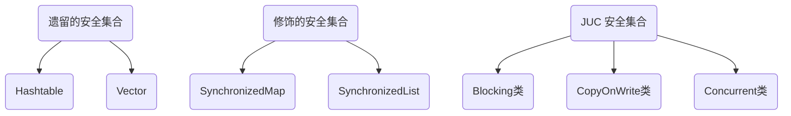
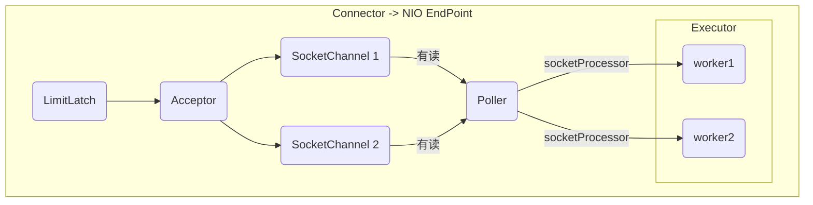

[返回首页](index.md)

[[toc]]

Collections
-----------

线程安全集合类



<br/>

线程安全集合类可以分为三大类： 

- 遗留的线程安全集合如`Hashtable`，` Vector `
- 使用`Collections`装饰的线程安全集合，如： 
  - `Collections.synchronizedCollection `
  - `Collections.synchronizedList `
  - `Collections.synchronizedMap `
  - `Collections.synchronizedSet `
  - `Collections.synchronizedNavigableMap `
  - `Collections.synchronizedNavigableSet  `
  - `Collections.synchronizedSortedMap `
  - `Collections.synchronizedSortedSet `
  - 说明：以上集合均采用修饰模式设计，将非线程安全的集合包装后，在调用方法时包裹了一层synchronized代码块。其并发性并不比遗留的安全集合好。
- java.util.concurrent.*

重点介绍 `java.util.concurrent.* ` 下的线程安全集合类，可以发现它们有规律，里面包含三类关键词： Blocking、CopyOnWrite、Concurrent

- Blocking 大部分实现基于锁，并提供用来阻塞的方法 
- CopyOnWrite 之类容器修改开销相对较重 
- Concurrent 类型的容器
  - 内部很多操作使用 cas 优化，一般可以提供较高吞吐量 
  - 弱一致性
    - 遍历时弱一致性，例如，当利用迭代器遍历时，如果容器发生修改，迭代器仍然可以继续进行遍历，这时内容是旧的 
    - 求大小弱一致性，size 操作未必是 100% 准确 
    - 读取弱一致性

> 遍历时如果发生了修改，对于非安全容器来讲，使用 **fail-fast** 机制也就是让遍历立刻失败，抛出 ConcurrentModificationException，不再继续遍历

<br/>

### ConcurrentHashMap

#### <font color='green'>*应用之分治：单词计数</font>

**搭建练习环境：**

```java
public class Test {
    public static void main(String[] args){
        //初始化文件
        construct();
    }
	
    //开启26个线程，每个线程调用get方法获取map，从对应的文件读取单词并存储到list中，最后调用accept方法进行统计。
    public static <V> void  calculate(Supplier<Map<String,V>> supplier, 
                                      BiConsumer<Map<String,V>, List<String>> consumer) {
        Map<String, V> map = supplier.get();
        CountDownLatch count = new CountDownLatch(26);
        for (int i = 1; i < 27; i++) {
            int k = i;
            new Thread(()->{
                ArrayList<String> list = new ArrayList<>();
                read(list,k);
                consumer.accept(map,list);
                count.countDown();
            }).start();
        }
        try {
            count.await();
        } catch (InterruptedException e) {
            e.printStackTrace();
        }
        System.out.println(map.toString());
    }
	 //读单词方法的实现
    public static void read(List<String> list,int i){
        try{
            String element;
            BufferedReader reader = new BufferedReader(new FileReader(i + ".txt"));
            while((element = reader.readLine()) != null){
                list.add(element);
            }
        }catch (IOException e){

        }
    }
	//生成测试数据
    public void construct(){
        String str = "abcdefghijklmnopqrstuvwxyz";
        ArrayList<String> list = new ArrayList<>();
        for (int i = 0; i < str.length(); i++) {
            for (int j = 0; j < 200; j++) {
                list.add(String.valueOf(str.charAt(i)));
            }
        }
        Collections.shuffle(list);
        for (int i = 0; i < 26; i++) {
            try (PrintWriter out = new PrintWriter(new FileWriter(i + 1 + ".txt"))) {
                String collect = list.subList(i * 200, (i + 1) * 200).stream().collect(Collectors.joining("\n"));
                out.println(collect);
            } catch (IOException e) {
                e.printStackTrace();
            }
        }
    }
}
```

#### 实现一

```java
calculate(
    // 创建 map 集合
    // 创建 ConcurrentHashMap 对不对？
    () -> new ConcurrentHashMap<String, Integer>(),
    // 进行计数
    (map, words) -> {
        for (String word : words) {
            Integer counter = map.get(word);
            int newValue = counter == null ? 1 : counter + 1;
            map.put(word, newValue);
        }
    }
);
```

输出：

```sh
{a=185, b=186, c=153, d=28, e=166, f=58, g=103, h=175, i=126, j=165, k=169, l=185, m=173, n=182, o=155, p=148, q=187, r=191, s=71, t=186, u=96, v=167, w=186, x=160, y=168, z=64}
```

错误原因：

- ConcurrentHashMap虽然每个方法都是线程安全的，但是多个方法的组合并不是线程安全的。


#### 正确答案一

```java
calculate(
    () -> new ConcurrentHashMap<String, LongAdder>(),
    (map, words) -> {
        for (String word : words) {
            // 注意不能使用 putIfAbsent，此方法返回的是上一次的 value，首次调用返回 null
            map.computeIfAbsent(word, (key) -> new LongAdder()).increment();
        }
    }
);
```

说明：

- computIfAbsent方法的作用是：当map中不存在以参数1为key对应的value时，会将参数2函数式接口的返回值作为value，put进map中，然后返回该value。如果存在key，则直接返回value
- 以上两部均是线程安全的。


#### 正确答案二

```java
calculate(
    () -> new ConcurrentHashMap<String, Integer>(),
    (map, words) -> {
        for (String word : words) {
            // 函数式编程，无需原子变量
            map.merge(word, 1, Integer::sum);
        }
    }
);
```

<br/>


### ConcurrentLinkedQueue

ConcurrentLinkedQueue 的设计与 LinkedBlockingQueue 非常像，也是 

- 两把【锁】，同一时刻，可以允许两个线程同时（一个生产者与一个消费者）执行 
- dummy 节点的引入让两把【锁】将来锁住的是不同对象，避免竞争 
- 只是这【锁】使用了 cas 来实现

<br/>

事实上，ConcurrentLinkedQueue 应用还是非常广泛的 

例如之前讲的 Tomcat 的 Connector 结构时，Acceptor 作为生产者向 Poller 消费者传递事件信息时，正是采用了 ConcurrentLinkedQueue 将 SocketChannel 给 Poller 使用



<br/>

#### 模仿 ConcurrentLinkedQueue

初始代码

```java
package cn.itcast.concurrent.thirdpart.test;
import java.util.Collection;
import java.util.Iterator;
import java.util.Queue;
import java.util.concurrent.atomic.AtomicReference;
public class Test3 {
    public static void main(String[] args) {
        MyQueue<String> queue = new MyQueue<>();
        queue.offer("1");
        queue.offer("2");
        queue.offer("3");
        System.out.println(queue);
    }
}
class MyQueue<E> implements Queue<E> {
    @Override
    public String toString() {
        StringBuilder sb = new StringBuilder();
        for (Node<E> p = head; p != null; p = p.next.get()) {
            E item = p.item;
            if (item != null) {
                sb.append(item).append("->");
            }
        }
        sb.append("null");
        return sb.toString();
    }
    @Override
    public int size() {
        return 0;
    }
    @Override
    public boolean isEmpty() {
        return false;
    }
    @Override
    public boolean contains(Object o) {
        return false;
    }
    @Override
    public Iterator<E> iterator() {
        return null;
    }
    @Override
    public Object[] toArray() {
        return new Object[0];
    }
    @Override
    public <T> T[] toArray(T[] a) {
        return null;
    }
    @Override
    public boolean add(E e) {
        return false;
    }
    @Override
    public boolean remove(Object o) {
        return false;
    }
    @Override
    public boolean containsAll(Collection<?> c) {
        return false;
    }
    @Override
    public boolean addAll(Collection<? extends E> c) {
        return false;
    }
    @Override
    public boolean removeAll(Collection<?> c) {
        return false;
    }
    @Override
    public boolean retainAll(Collection<?> c) {
        return false;
    }
    @Override
    public void clear() {
    }
    @Override
    public E remove() {
        return null;
    }
    @Override
    public E element() {
        return null;
    }
    @Override
    public E peek() {
        return null;
    }
    public MyQueue() {
        head = last = new Node<>(null, null);
    }
    private volatile Node<E> last;
    private volatile Node<E> head;
    private E dequeue() {
        /*Node<E> h = head;
 		Node<E> first = h.next;
 		h.next = h;
 		head = first;
        E x = first.item;
 		first.item = null;
 		return x;*/
        return null;
    }
    @Override
    public E poll() {
        return null;
    }
    @Override
    public boolean offer(E e) {
        return true;
    }
    static class Node<E> {
        volatile E item;
        public Node(E item, Node<E> next) {
            this.item = item;
            this.next = new AtomicReference<>(next);
        }
        AtomicReference<Node<E>> next;
    }
}
```

offer

```java
public boolean offer(E e) {
    Node<E> n = new Node<>(e, null);
    while(true) {
        // 获取尾节点
        AtomicReference<Node<E>> next = last.next;
        // S1: 真正尾节点的 next 是 null, cas 从 null 到新节点
        if(next.compareAndSet(null, n)) {
            // 这时的 last 已经是倒数第二, next 不为空了, 其它线程的 cas 肯定失败
            // S2: 更新 last 为倒数第一的节点
            last = n;
            return true;
        }
    }
}
```

<br/>

### CopyOnWriteArrayList

`CopyOnWriteArraySet`是它的马甲底层实现采用了 写入时拷贝 的思想，增删改操作会将底层数组拷贝一份，更 改操作在新数组上执行，这时不影响其它线程的**并发读**，**读写分离**。 以新增为例：

```java
public boolean add(E e) {
    synchronized (lock) {
        // 获取旧的数组
        Object[] es = getArray();
        int len = es.length;
        // 拷贝新的数组（这里是比较耗时的操作，但不影响其它读线程）
        es = Arrays.copyOf(es, len + 1);
        // 添加新元素
        es[len] = e;
        // 替换旧的数组
        setArray(es);
        return true;
    }
}
```

> 这里的源码版本是 Java 11，在 Java 1.8 中使用的是可重入锁而不是 synchronized

其它读操作并未加锁，例如：

```java
public void forEach(Consumer<? super E> action) {
    Objects.requireNonNull(action);
    for (Object x : getArray()) {
        @SuppressWarnings("unchecked") E e = (E) x;
        action.accept(e);
    }
}
```

适合『读多写少』的应用场景 

<br/>

#### get 弱一致性


| 时间点 |             操作             |
| :----: | :--------------------------: |
|   1    |     Thread-0 getArray()      |
|   2    |     Thread-1 getArray()      |
|   3    | Thread-1 setArray(arrayCopy) |
|   4    |    Thread-0 array[index]     |

> 不容易测试，但问题确实存在

<br/>

#### 迭代器弱一致性

```java
CopyOnWriteArrayList<Integer> list = new CopyOnWriteArrayList<>();
list.add(1);
list.add(2);
list.add(3);
Iterator<Integer> iter = list.iterator();
new Thread(() -> {
    list.remove(0);
    System.out.println(list);
}).start();
sleep1s();
//此时主线程的iterator依旧指向旧的数组。
while (iter.hasNext()) {
    System.out.println(iter.next());
}
```

> 不要觉得弱一致性就不好 
>
> - 数据库的 MVCC 都是弱一致性的表现 
> - 并发高和一致性是矛盾的，需要权衡


