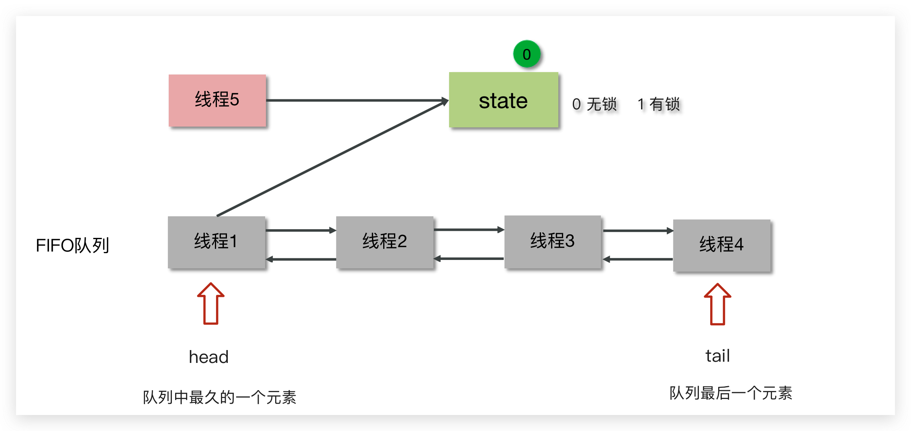
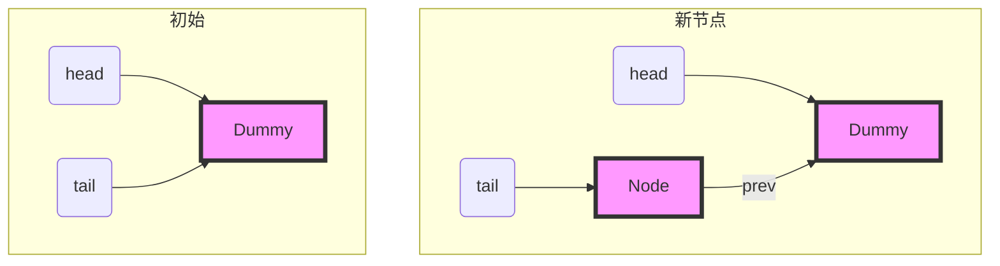
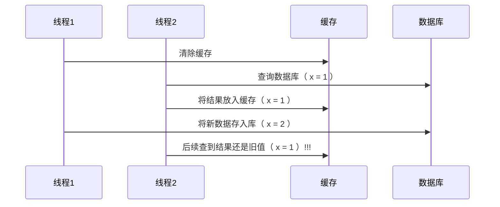
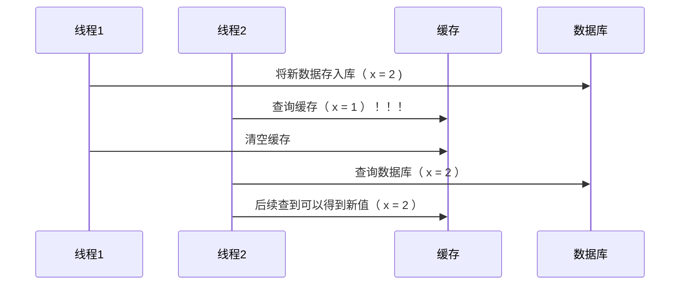
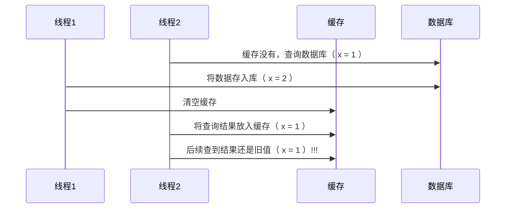

[返回首页](index.md)
[[toc]]

Lock
----

### <font color='blue'>*AQS原理</font>

**概述**

全称是 `AbstractQueuedSynchronizer`，是阻塞式锁和相关的同步器工具的框架（都依赖AQS），它是构建锁或者其他同步组件的基础框架。

<br/>

**AQS与Synchronized的区别**

|         synchronized         |                   AQS                    |
| :--------------------------: | :--------------------------------------: |
|     关键字，c++ 语言实现     |              Java 语言实现               |
|      悲观锁，自动释放锁      |          悲观锁，手动开启和关闭          |
| 锁竞争激烈都是重量级，性能差 | 锁竞争激烈都是重量级，提供了多种解决方案 |

<br/>

**AQS常见的实现类**

- 阻塞式锁：`ReentrantLock ` 
- 信号量：`Semaphore`
- 倒计时锁 `CountDownLatch`

<br/>

工作机制

- 在AQS中维护了一个使用了volatile修饰的state属性来表示资源的状态，0表示无锁，1表示有锁
- 提供了基于 FIFO 的等待队列，类似于 Monitor 的 EntryList
- 条件变量来实现等待、唤醒机制，支持多个条件变量，类似于 Monitor 的 WaitSet


>- 线程0来了以后，去尝试修改state属性，如果发现state属性是0，就修改state状态为1，表示线程0抢锁成功
>- 线程1和线程2也会先尝试修改state属性，发现state的值已经是1了，有其他线程持有锁，它们都会到FIFO队列中进行等待，
>- FIFO是一个双向队列，head属性表示头结点，tail表示尾结点

**如果多个线程共同去抢这个资源是如何保证原子性的呢？**


在去修改state状态的时候，使用的cas自旋锁来保证原子性，确保只能有一个线程修改成功，修改失败的线程将会进入FIFO队列中等待。

**AQS是公平锁吗，还是非公平锁？**



- 新的线程与队列中的线程共同来抢资源，是非公平锁
- 新的线程到队列中等待，只让队列中的head线程获取锁，是公平锁

>比较典型的AQS实现类ReentrantLock，它默认就是非公平锁，新的线程与队列中的线程共同来抢资源

<br/>

**总结** 

- 用 state 属性来表示资源的状态（分独占模式和共享模式），子类需要定义如何维护这个状态，控制如何获取锁和释放锁 
  - getState - 获取 state 状态 
  - setState - 设置 state 状态 
  - compareAndSetState - cas 机制设置 state 状态 ：不会不断重试，重试不成功后会进入等待队列。
  - 独占模式是只有一个线程能够访问资源，而共享模式可以允许多个线程访问资源 
- 提供了基于 FIFO(First In First Out) 的等待队列，类似于 Monitor 的 EntryList 
- 条件变量来实现等待、唤醒机制，<mark>支持多个条件变量</mark>，类似于 Monitor 的 WaitSet

<br/>

子类主要实现这样一些方法（默认抛出 `UnsupportedOperationException`） 

- `tryAcquire `
- `tryRelease `
- `tryAcquireShared `
- `tryReleaseShared `
- `isHeldExclusively`

获取锁的姿势

```java
// 如果获取锁失败
if (!tryAcquire(arg)) {
    // 入队, 可以选择阻塞当前线程 park unpark
}
```

释放锁的姿势

```java
// 如果释放锁成功
if (tryRelease(arg)) {
    // 让阻塞线程恢复运行
}
```

<br/>

#### 实现不可重入锁

##### 自定义同步器

```java
//独占锁
final class MySync extends AbstractQueuedSynchronizer {
    @Override
    protected boolean tryAcquire(int acquires) {
        if (acquires == 1){
            if (compareAndSetState(0, 1)) {
              	//加上了锁，并设置owner为当前线程
                setExclusiveOwnerThread(Thread.currentThread());
                return true;
            }
        }
        return false;
    }
    @Override
    protected boolean tryRelease(int acquires) {
        if(acquires == 1) {
            if(getState() == 0) {
                throw new IllegalMonitorStateException();
            }
            setExclusiveOwnerThread(null);
            //state是可见的，在volatile上面的代码可以防止指令重排
            setState(0);
            return true;
        }
        return false;
    }
    protected Condition newCondition() {
        return new ConditionObject();
    }
  	//是否独占
    @Override
    protected boolean isHeldExclusively() {
        return getState() == 1;
    }
}
```

<br/>

##### 自定义锁

有了自定义同步器，很容易复用 AQS ，实现一个功能完备的自定义锁

```java
class MyLock implements Lock {
    static MySync sync = new MySync();
    @Override
    // 尝试，不成功，进入等待队列
    public void lock() {
        sync.acquire(1);
    }
    @Override
    // 尝试，不成功，进入等待队列，可打断
    public void lockInterruptibly() throws InterruptedException {
        sync.acquireInterruptibly(1);
    }
    @Override
    // 尝试一次，不成功返回，不进入队列
    public boolean tryLock() {
        return sync.tryAcquire(1);
    }
    @Override
    // 尝试，不成功，进入等待队列，有时限
    public boolean tryLock(long time, TimeUnit unit) throws InterruptedException {
        return sync.tryAcquireNanos(1, unit.toNanos(time));
    }
    @Override
    // 释放锁，并唤醒等待线程
    public void unlock() {
        sync.release(1);
    }
    @Override
    // 生成条件变量
    public Condition newCondition() {
        return sync.newCondition();
    }
}
```

测试一下

```java
MyLock lock = new MyLock();
new Thread(() -> {
    lock.lock();
    try {
        log.debug("locking...");
        sleep(1);
    } finally {
        log.debug("unlocking...");
        lock.unlock();
    }
},"t1").start();
new Thread(() -> {
    lock.lock();
    try {
        log.debug("locking...");
    } finally {
        log.debug("unlocking...");
        lock.unlock();
    }
},"t2").start();
```

输出

```sh
22:29:28.727 c.TestAqs [t1] - locking... 
22:29:29.732 c.TestAqs [t1] - unlocking... 
22:29:29.732 c.TestAqs [t2] - locking... 
22:29:29.732 c.TestAqs [t2] - unlocking... 
```

不可重入测试，如果改为下面代码，会发现自己也会被挡住（只会打印一次 locking）

```sh
lock.lock();
log.debug("locking...");
lock.lock();
log.debug("locking...");
```


####  原理

起源:早期程序员会自己通过一种同步器去实现另一种相近的同步器，例如用可重入锁去实现信号量，或反之。这显然不够优雅，于是在 JSR166（java 规范提案）中创建了 AQS，提供了这种通用的同步器机制。

<br/>

##### 目标

AQS 要实现的功能目标 

- 阻塞版本获取锁 acquire 和非阻塞的版本尝试获取锁 tryAcquire 
- 获取锁超时机制
- 通过打断取消机制 
- 独占机制及共享机制 
- 条件不满足时的等待机制

要实现的性能目标 

> Instead, the primary performance goal here is scalability: to predictably maintain efficiency even, or especially, when synchronizers are contended.

<br/>

##### 设计

 AQS 的基本思想其实很简单 

获取锁的逻辑

```java
while(state 状态不允许获取) {
    if(队列中还没有此线程) {
        入队并阻塞
    }
}
当前线程出队
```

释放锁的逻辑

```java
if(state 状态允许了) {
    恢复阻塞的线程(s)
}
```

<br/>

要点 

- 原子维护 state 状态 
- 阻塞及恢复线程 
- 维护队列


1) state 设计 
   - state 使用 volatile 配合 cas 保证其修改时的原子性 
   - state 使用了 32bit int 来维护同步状态，因为当时使用 long 在很多平台下测试的结果并不理想 

2. 阻塞恢复设计 
   - 早期的控制线程暂停和恢复的 api 有 suspend 和 resume，但它们是不可用的，因为如果先调用的 resume  那么 suspend 将感知不到 
   - 解决方法是使用 park & unpark 来实现线程的暂停和恢复，具体原理在之前讲过了，先 unpark 再 park 也没问题 
   - park & unpark 是针对线程的，而不是针对同步器的，因此控制粒度更为精细 
   - park 线程还可以通过 interrupt 打断 
3. 队列设计 
   - 使用了 FIFO 先入先出队列，并不支持优先级队列 
   - 设计时借鉴了 CLH 队列，它是一种单向无锁队列



队列中有 head 和 tail 两个指针节点，都用 volatile 修饰配合 cas 使用，每个节点有 state 维护节点状态入队伪代码，只需要考虑 tail 赋值的原子性

```java
do {
    // 原来的 tail
    Node prev = tail;
    // 用 cas 在原来 tail 的基础上改为 node
} while(tail.compareAndSet(prev, node))
```

出队伪代码

```java
// prev 是上一个节点
while((Node prev=node.prev).state != 唤醒状态) {
}
// 设置头节点
head = node;
```

CLH 好处： 

- 无锁，使用自旋
- 快速，无阻塞

AQS 在一些方面改进了 CLH

```java
private Node enq(final Node node) {
    for (;;) {
        Node t = tail;
        // 队列中还没有元素 tail 为 null
        if (t == null) {
            // 将 head 从 null -> dummy
            if (compareAndSetHead(new Node()))
                tail = head;
        } else {
            // 将 node 的 prev 设置为原来的 tail
            node.prev = t;
            // 将 tail 从原来的 tail 设置为 node
            if (compareAndSetTail(t, node)) {
                // 原来 tail 的 next 设置为 node
                t.next = node;
                return t;
            }
        }
    }
}
```


主要用到 AQS 的并发工具类


### ReentrantLock

ReentrantLock翻译过来是可重入锁，相对于synchronized它具备以下特点：

- 可中断

- 可以设置超时时间

- 可以设置公平锁

- 支持多个条件变量

- 与synchronized一样，都支持重入

```java
ReentrantLock lock = new ReentrantLock();
try {
    // 获取锁
    lock.lock();
} finally {
    // 释放锁
    lock.unlock();
}
```

<br/>

#### 实现原理

ReentrantLock主要利用CAS+AQS队列来实现。它支持公平锁和非公平锁，两者的实现类似

构造方法接受一个可选的公平参数（默认非公平锁），当设置为true时，表示公平锁，否则为非公平锁。公平锁的效率往往没有非公平锁的效率高，在许多线程访问的情况下，公平锁表现出较低的吞吐量。

查看ReentrantLock源码中的构造方法：

```java
/**
* Creates an instance of {@code ReentrantLock}.
* This is equivalent to using {@code ReentrantLock(false)}.
*/
public ReentrantLock() {
	sync = new NonfairSync();
}

/**
* Creates an instance of {@code ReentrantLock} with the
* given fairness policy.
*
* @param fair {@code true} if this lock should use a fair ordering policy
*/
public ReentrantLock(boolean fair) {
	sync = fair ? new FairSync() : new NonfairSync();
}
```

提供了两个构造方法，不带参数的默认为非公平

如果使用带参数的构造函数，并且传的值为true，则是公平锁

其中NonfairSync和FairSync这两个类父类都是Sync

```java
static final class FairSync extends Sync {

}

static final class NonfairSync extends Sync {
     
}
```

而Sync的父类是AQS，所以可以得出ReentrantLock底层主要实现就是基于AQS来实现的

```java
abstract static class Sync extends AbstractQueuedSynchronizer {

}
```

<br/>

#### 工作流程


- 线程来抢锁后使用cas的方式修改state状态，修改状态成功为1，则让exclusiveOwnerThread属性指向当前线程，获取锁成功

- 假如修改状态失败，则会进入双向队列中等待，head指向双向队列头部，tail指向双向队列尾部

- 当exclusiveOwnerThread为null的时候，则会唤醒在双向队列中等待的线程

- 公平锁则体现在按照先后顺序获取锁，非公平体现在不在排队的线程也可以抢锁

<br/>

::: warning 💡思考：介绍一下ReentrantLock的特征

- ReentranLock 是属于并发包下的类，属于 API 层面的锁，和 synchronized 一样都是悲观锁实现互斥
- ReentranLock 通过 lock 方法用来获取锁，unlock 方法释放锁
- ReentranLock 支持可重入，可中断，可超时，可以设置公平锁和多个条件变量
- 底层主要是通过 CAS 和 AQS 队列来实现

💡**思考：ReentrantLock 的工作流程是怎么样的**

- ReentrantLock 是基于 AQS 来实现的，内部维护了一个 STATE 属性来表示资源的状态。

- 当线程来抢锁后使用 CAS 的方式修改 STATE 状态，修改状态成功为1，则让exclusiveOwnerThread 属性指向当前线程，获取锁成功。

- 假如修改状态失败，则会进入双向队列中等待，HEAD 指向双向队列头部，TAIL 指向双向队列尾部

- 当 exclusiveOwnerThread 为 null 的时候，则会唤醒在双向队列中等待的线程

- 公平锁则体现在按照先后顺序获取锁，非公平体现在不在排队的线程也可以抢锁

:::


### ReentrantReadWriteLock

读写锁

当读操作远远高于写操作时，这时候使用`读写锁`让`读-读`可以并发，提高性能。 类似于数据库中的`select ... from ... lock in share mode` 

提供一个`数据容器类`内部分别使用读锁保护数据的 read() 方法，写锁保护数据的 write() 方法

**测试**

```java
class DataContainer {
    private Object data;
    private ReentrantReadWriteLock rw = new ReentrantReadWriteLock();
    private ReentrantReadWriteLock.ReadLock r = rw.readLock();
    private ReentrantReadWriteLock.WriteLock w = rw.writeLock();
    public Object read() {
        log.debug("获取读锁...");
        r.lock();
        try {
            log.debug("读取");
            sleep(1);
            return data;
        } finally {
            log.debug("释放读锁...");
            r.unlock();
        }
    }
    public void write() {
        log.debug("获取写锁...");
        w.lock();
        try {
            log.debug("写入");
            sleep(1);
        } finally {
            log.debug("释放写锁...");
            w.unlock();
        }
    }
}
```

测试`读锁-读锁`可以并发

```java
DataContainer dataContainer = new DataContainer();
new Thread(() -> {
    dataContainer.read();
}, "t1").start();
new Thread(() -> {
    dataContainer.read();
}, "t2").start();
```

输出结果，从这里可以看到 Thread-0 锁定期间，Thread-1 的读操作不受影响

```sh
14:05:14.341 c.DataContainer [t2] - 获取读锁... 
14:05:14.341 c.DataContainer [t1] - 获取读锁... 
14:05:14.345 c.DataContainer [t1] - 读取
14:05:14.345 c.DataContainer [t2] - 读取
14:05:15.365 c.DataContainer [t2] - 释放读锁... 
14:05:15.386 c.DataContainer [t1] - 释放读锁... 
```

测试`读锁-写锁`相互阻塞

```java
DataContainer dataContainer = new DataContainer();
new Thread(() -> {
    dataContainer.read();
}, "t1").start();
Thread.sleep(100);
new Thread(() -> {
    dataContainer.write();
}, "t2").start();
```

输出结果

```java
14:04:21.838 c.DataContainer [t1] - 获取读锁... 
14:04:21.838 c.DataContainer [t2] - 获取写锁... 
14:04:21.841 c.DataContainer [t2] - 写入
14:04:22.843 c.DataContainer [t2] - 释放写锁... 
14:04:22.843 c.DataContainer [t1] - 读取
14:04:23.843 c.DataContainer [t1] - 释放读锁... 
```

`写锁-写锁`也是相互阻塞的，这里就不测试了

<br/>

**注意事项** 

- 读锁不支持条件变量，写锁支持条件变量。
- 重入时升级不支持：即持有读锁的情况下去获取写锁，会导致获取写锁永久等待

```java
r.lock();
try {
    // ...
    w.lock();
    try {
        // ...
    } finally{
        w.unlock();
    }
} finally{
    r.unlock();
}
```

- 重入时降级支持：即持有写锁的情况下去获取读锁

```java
class CachedData {
    Object data;
    // 是否有效，如果失效，需要重新计算 data
    volatile boolean cacheValid;
    final ReentrantReadWriteLock rwl = new ReentrantReadWriteLock();
    void processCachedData() {
        rwl.readLock().lock();
        if (!cacheValid) {
            // 获取写锁前必须释放读锁
            rwl.readLock().unlock();
            rwl.writeLock().lock();
            try {
                // 判断是否有其它线程已经获取了写锁、更新了缓存, 避免重复更新
                if (!cacheValid) {
                    data = ...
                    cacheValid = true;
                }
                // 降级为读锁, 释放写锁, 这样能够让其它线程读取缓存
                rwl.readLock().lock();
            } finally {
                rwl.writeLock().unlock();
            }
        }
        // 自己用完数据, 释放读锁 
        try {
            use(data);
        } finally {
            rwl.readLock().unlock();
        }
    }
}
```

<br/>

#### <font color='green'>* 应用之缓存</font>

##### 缓存更新策略

更新时，是先清缓存还是先更新数据库 

**先清缓存**



**先更新数据库**



<br/>

补充一种情况，假设查询线程 A 查询数据时恰好缓存数据由于时间到期失效，或是第一次查询



> 这种情况的出现几率非常小，见 facebook 论文

##### 读写锁实现一致性缓存

使用读写锁实现一个简单的按需加载缓存,解决在修改数据库和删除缓存之间有数据查询导致数据不准确。

```java
class GenericCachedDao<T> {
    // HashMap 作为缓存非线程安全, 需要保护
    HashMap<SqlPair, T> map = new HashMap<>();
    ReentrantReadWriteLock lock = new ReentrantReadWriteLock(); 
    GenericDao genericDao = new GenericDao();
    public int update(String sql, Object... params) {
        SqlPair key = new SqlPair(sql, params);
        // 加写锁, 防止其它线程对缓存读取和更改
        lock.writeLock().lock();
        try {
            int rows = genericDao.update(sql, params);
            map.clear();
            return rows;
        } finally {
            lock.writeLock().unlock();
        }
    }
    public T queryOne(Class<T> beanClass, String sql, Object... params) {
        SqlPair key = new SqlPair(sql, params);
        // 加读锁, 防止其它线程对缓存更改
        lock.readLock().lock();
        try {
            T value = map.get(key);
            if (value != null) {
                return value;
            }
        } finally {
            lock.readLock().unlock();
        }
        // 加写锁, 防止其它线程对缓存读取和更改
        lock.writeLock().lock();
        try {
            // get 方法上面部分是可能多个线程进来的, 可能已经向缓存填充了数据
            // 为防止重复查询数据库, 再次验证
            T value = map.get(key);
            if (value == null) {
                // 如果没有, 查询数据库
                value = genericDao.queryOne(beanClass, sql, params);
                map.put(key, value);
            }
            return value;
        } finally {
            lock.writeLock().unlock();
        }
    }
    // 作为 key 保证其是不可变的
    class SqlPair {
        private String sql;
        private Object[] params;
        public SqlPair(String sql, Object[] params) {
            this.sql = sql;
            this.params = params;
        }
        @Override
        public boolean equals(Object o) {
            if (this == o) {
                return true;
            }
            if (o == null || getClass() != o.getClass()) {
                return false;
            }
            SqlPair sqlPair = (SqlPair) o;
            return sql.equals(sqlPair.sql) &&
                Arrays.equals(params, sqlPair.params);
        }
        @Override
        public int hashCode() {
            int result = Objects.hash(sql);
            result = 31 * result + Arrays.hashCode(params);
            return result;
        }
    }
}
```

**注意** 

- 以上实现体现的是读写锁的应用，保证缓存和数据库的一致性，但有下面的问题没有考虑 

  - 适合读多写少，如果写操作比较频繁，以上实现性能低 

  - 没有考虑缓存容量 

  - 没有考虑缓存过期 

  - 只适合单机 

  - 并发性还是低，目前只会用一把锁 

  - 更新方法太过简单粗暴，清空了所有 key（考虑按类型分区或重新设计 key） 

- 乐观锁实现：用 CAS 去更新

<br/>

