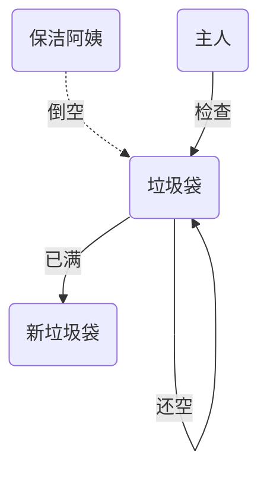
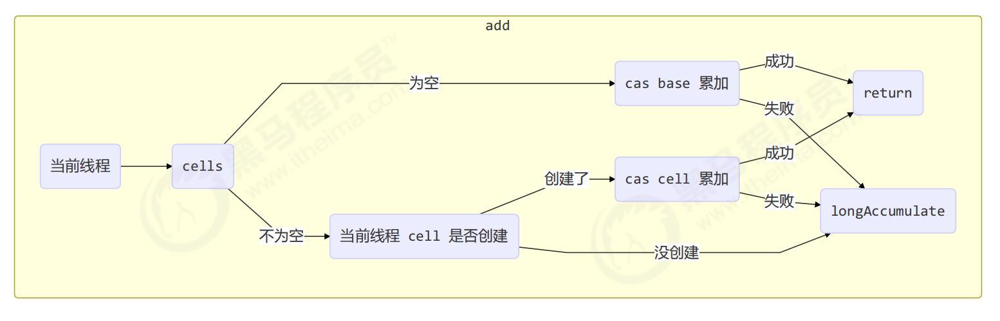
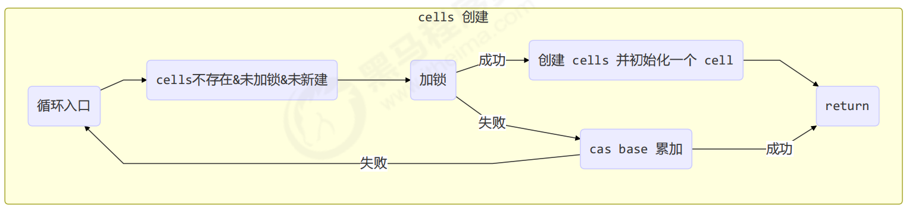
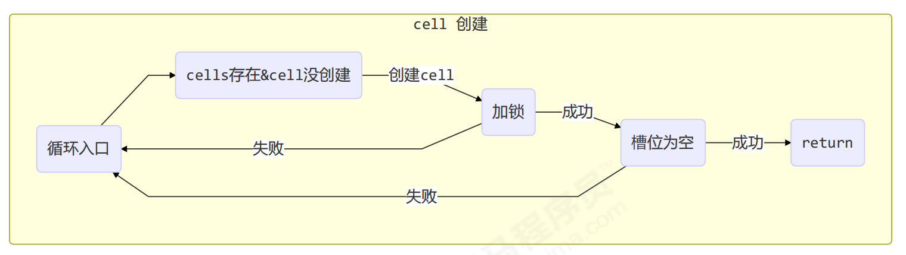
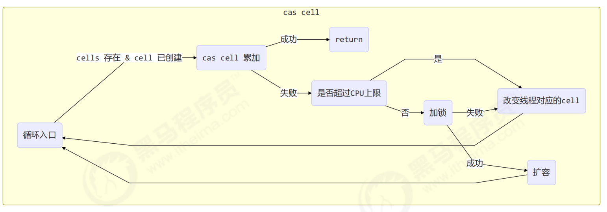
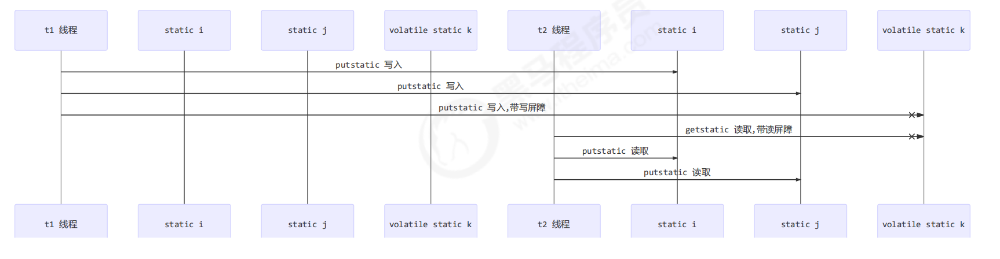

[[toc]]
[返回首页](index.md)
Atomic
------

### 原子整数 

J.U.C 并发包提供了： 

- AtomicBoolean 
- AtomicInteger 
- AtomicLong 

以 AtomicInteger 为例

```java
AtomicInteger i = new AtomicInteger(0);

// 获取并自增（i = 0, 结果 i = 1, 返回 0），类似于 i++
System.out.println(i.getAndIncrement());

// 自增并获取（i = 1, 结果 i = 2, 返回 2），类似于 ++i
System.out.println(i.incrementAndGet());

// 自减并获取（i = 2, 结果 i = 1, 返回 1），类似于 --i
System.out.println(i.decrementAndGet());

// 获取并自减（i = 1, 结果 i = 0, 返回 1），类似于 i--
System.out.println(i.getAndDecrement());

// 获取并加值（i = 0, 结果 i = 5, 返回 0）
System.out.println(i.getAndAdd(5));

// 加值并获取（i = 5, 结果 i = 0, 返回 0）
System.out.println(i.addAndGet(-5));

// 获取并更新（i = 0, p 为 i 的当前值, 结果 i = -2, 返回 0）
// 其中函数中的操作能保证原子，但函数需要无副作用
System.out.println(i.getAndUpdate(p -> p - 2));

// 更新并获取（i = -2, p 为 i 的当前值, 结果 i = 0, 返回 0）
// 其中函数中的操作能保证原子，但函数需要无副作用
System.out.println(i.updateAndGet(p -> p + 2));

// 获取并计算（i = 0, p 为 i 的当前值, x 为参数1, 结果 i = 10, 返回 0）
// 其中函数中的操作能保证原子，但函数需要无副作用
// getAndUpdate 如果在 lambda 中引用了外部的局部变量，要保证该局部变量是 final 的
// getAndAccumulate 可以通过 参数1 来引用外部的局部变量，但因为其不在 lambda 中因此不必是 final
System.out.println(i.getAndAccumulate(10, (p, x) -> p + x));

// 计算并获取（i = 10, p 为 i 的当前值, x 为参数1, 结果 i = 0, 返回 0）
// 其中函数中的操作能保证原子，但函数需要无副作用
System.out.println(i.accumulateAndGet(-10, (p, x) -> p + x));
```

说明：

- 以上方法都是以CAS为基础进行了封装，保证了方法的原子性和变量的可见性。

- updateAndGet方法的手动实现：

  ```java
  public static int updateAndGet(AtomicInteger i, IntUnaryOperator operator){
      while (true){
          int prev = i.get();
          int next = operator.applyAsInt(prev);
          if(i.compareAndSet(prev,next)){
              return next;
          }
      }
  }
  ```


<br/>

### 原子引用

为什么需要原子引用类型？ 

- AtomicReference 
- AtomicMarkableReference 
- AtomicStampedReference 

实际开发的过程中我们使用的不一定是int、long等基本数据类型，也有可能时BigDecimal这样的类型，这时就需要用到原子引用作为容器。原子引用设置值使用的是`unsafe.compareAndSwapObject()`方法。原子引用中表示数据的类型需要重写`equals()`方法。

有如下方法

```java
public interface DecimalAccount {
    // 获取余额
    BigDecimal getBalance();
    // 取款
    void withdraw(BigDecimal amount);
    /**
 * 方法内会启动 1000 个线程，每个线程做 -10 元 的操作
 * 如果初始余额为 10000 那么正确的结果应当是 0
 */
    static void demo(DecimalAccount account) {
        List<Thread> ts = new ArrayList<>();
        for (int i = 0; i < 1000; i++) {
            ts.add(new Thread(() -> {
                account.withdraw(BigDecimal.TEN);
            }));
        }
        ts.forEach(Thread::start);
        ts.forEach(t -> {
            try {
                t.join();
            } catch (InterruptedException e) {
                e.printStackTrace();
            }
        });
        System.out.println(account.getBalance());
    }
}
```

试着提供不同的 DecimalAccount 实现，实现安全的取款操作

<br/>

**不安全实现**

```java
class DecimalAccountUnsafe implements DecimalAccount {
    BigDecimal balance;
    public DecimalAccountUnsafe(BigDecimal balance) {
        this.balance = balance;
    }
    @Override
    public BigDecimal getBalance() {
        return balance;
    }
    @Override
    public void withdraw(BigDecimal amount) {
        BigDecimal balance = this.getBalance();
        this.balance = balance.subtract(amount);
    }
}
```

<br/>

**安全实现-使用锁**

```java
class DecimalAccountSafeLock implements DecimalAccount {
    private final Object lock = new Object();
    BigDecimal balance;
    public DecimalAccountSafeLock(BigDecimal balance) {
        this.balance = balance;
    }
    @Override
    public BigDecimal getBalance() {
        return balance;
    }
    @Override
    public void withdraw(BigDecimal amount) {
        synchronized (lock) {
            BigDecimal balance = this.getBalance();
            this.balance = balance.subtract(amount);
        }
    }
}
```

<br/>

**安全实现-使用 CAS**

```java
class DecimalAccountSafeCas implements DecimalAccount {
    AtomicReference<BigDecimal> ref;
    public DecimalAccountSafeCas(BigDecimal balance) {
        ref = new AtomicReference<>(balance);
    }
    @Override
    public BigDecimal getBalance() {
        return ref.get();
    }
    @Override
    public void withdraw(BigDecimal amount) {
        while (true) {
            BigDecimal prev = ref.get();
            BigDecimal next = prev.subtract(amount);
            if (ref.compareAndSet(prev, next)) {
                break;
            }
        }
    }
}
```

测试代码

```sh
DecimalAccount.demo(new DecimalAccountUnsafe(new BigDecimal("10000")));
DecimalAccount.demo(new DecimalAccountSafeLock(new BigDecimal("10000")));
DecimalAccount.demo(new DecimalAccountSafeCas(new BigDecimal("10000")));
```

运行结果

```sh
4310 cost: 425 ms 
0 cost: 285 ms 
0 cost: 274 ms
```

<br/>

ABA 问题及解决 

```java
static AtomicReference<String> ref = new AtomicReference<>("A");
public static void main(String[] args) throws InterruptedException {
    log.debug("main start...");
    // 获取值 A
    // 这个共享变量被它线程修改过？
    String prev = ref.get();
    other();
    sleep(1);
    // 尝试改为 C
    log.debug("change A->C {}", ref.compareAndSet(prev, "C"));
}
private static void other() {
    new Thread(() -> {
        log.debug("change A->B {}", ref.compareAndSet(ref.get(), "B"));
    }, "t1").start();
    sleep(0.5);
    new Thread(() -> {
        log.debug("change B->A {}", ref.compareAndSet(ref.get(), "A"));
    }, "t2").start();
}
```

输出

```sh
11:29:52.325 c.Test36 [main] - main start... 
11:29:52.379 c.Test36 [t1] - change A->B true 
11:29:52.879 c.Test36 [t2] - change B->A true 
11:29:53.880 c.Test36 [main] - change A->C true
```

主线程仅能判断出共享变量的值与最初值 A 是否相同，不能感知到这种从 A 改为 B 又 改回 A 的情况，如果主线程希望： 

只要有其它线程【动过了】共享变量，那么自己的 cas 就算失败，这时，仅比较值是不够的，需要再加一个版本号


**AtomicStampedReference**

```java
static AtomicStampedReference<String> ref = new AtomicStampedReference<>("A", 0);
public static void main(String[] args) throws InterruptedException {
    log.debug("main start...");
    // 获取值 A
    String prev = ref.getReference();
    // 获取版本号
    int stamp = ref.getStamp();
    log.debug("版本 {}", stamp);
    // 如果中间有其它线程干扰，发生了 ABA 现象
    other();
    sleep(1);
    // 尝试改为 C
    log.debug("change A->C {}", ref.compareAndSet(prev, "C", stamp, stamp + 1));
}
private static void other() {
    new Thread(() -> {
        log.debug("change A->B {}", ref.compareAndSet(ref.getReference(), "B", 
                                                      ref.getStamp(), ref.getStamp() + 1));
        log.debug("更新版本为 {}", ref.getStamp());
    }, "t1").start();
    sleep(0.5);
    new Thread(() -> {
        log.debug("change B->A {}", ref.compareAndSet(ref.getReference(), "A", 
                                                      ref.getStamp(), ref.getStamp() + 1));
        log.debug("更新版本为 {}", ref.getStamp());
    }, "t2").start();
}
```

输出为

```sh
15:41:34.891 c.Test36 [main] - main start... 
15:41:34.894 c.Test36 [main] - 版本 0 
15:41:34.956 c.Test36 [t1] - change A->B true 
15:41:34.956 c.Test36 [t1] - 更新版本为 1 
15:41:35.457 c.Test36 [t2] - change B->A true 
15:41:35.457 c.Test36 [t2] - 更新版本为 2 
15:41:36.457 c.Test36 [main] - change A->C false 
```


AtomicStampedReference 可以给原子引用加上版本号，追踪原子引用整个的变化过程，如： `A -> B -> A -> C` ，通过AtomicStampedReference，我们可以知道，引用变量中途被更改了几次。 

但是有时候，并不关心引用变量更改了几次，只是单纯的关心是否更改过，所以就有了 AtomicMarkableReference



AtomicMarkableReference

```java
class GarbageBag {
    String desc;
    public GarbageBag(String desc) {
        this.desc = desc;
    }
    public void setDesc(String desc) {
        this.desc = desc;
    }
    @Override
    public String toString() {
        return super.toString() + " " + desc;
    }
}
```

```java
@Slf4j
public class TestABAAtomicMarkableReference {
    public static void main(String[] args) throws InterruptedException {
        GarbageBag bag = new GarbageBag("装满了垃圾");
        // 参数2 mark 可以看作一个标记，表示垃圾袋满了
        AtomicMarkableReference<GarbageBag> ref = new AtomicMarkableReference<>(bag, true);
        log.debug("主线程 start...");
        GarbageBag prev = ref.getReference();
        log.debug(prev.toString());
        new Thread(() -> {
            log.debug("打扫卫生的线程 start...");
            bag.setDesc("空垃圾袋");
            while (!ref.compareAndSet(bag, bag, true, false)) {}
            log.debug(bag.toString());
        }).start();
        Thread.sleep(1000);
        log.debug("主线程想换一只新垃圾袋？");
        boolean success = ref.compareAndSet(prev, new GarbageBag("空垃圾袋"), true, false);
        log.debug("换了么？" + success);
        log.debug(ref.getReference().toString());
    }
}
```

输出

```sh
2019-10-13 15:30:09.264 [main] 主线程 start... 
2019-10-13 15:30:09.270 [main] cn.itcast.GarbageBag@5f0fd5a0 装满了垃圾
2019-10-13 15:30:09.293 [Thread-1] 打扫卫生的线程 start... 
2019-10-13 15:30:09.294 [Thread-1] cn.itcast.GarbageBag@5f0fd5a0 空垃圾袋
2019-10-13 15:30:10.294 [main] 主线程想换一只新垃圾袋？
2019-10-13 15:30:10.294 [main] 换了么？false 
2019-10-13 15:30:10.294 [main] cn.itcast.GarbageBag@5f0fd5a0 空垃圾袋
```

可以注释掉打扫卫生线程代码，再观察输出


原子引用只能对引用数据类型进行判断，如果引用数据里面的数据被改变了是无法进行判断的，所以这个时候就需要原子数组来进行操作。


### 原子数组 

- AtomicIntegerArray 
- AtomicLongArray 
- AtomicReferenceArray 

有如下方法

```java
/**
 参数1，提供数组、可以是线程不安全数组或线程安全数组
 参数2，获取数组长度的方法
 参数3，自增方法，回传 array, index
 参数4，打印数组的方法
*/
// supplier 提供者 无中生有 ()->结果
// function 函数 一个参数一个结果 (参数)->结果 , BiFunction (参数1,参数2)->结果
// consumer 消费者 一个参数没结果 (参数)->void, BiConsumer (参数1,参数2)->
private static <T> void demo(
    Supplier<T> arraySupplier,
    Function<T, Integer> lengthFun,
    BiConsumer<T, Integer> putConsumer,
    Consumer<T> printConsumer ) {
    List<Thread> ts = new ArrayList<>();
    T array = arraySupplier.get();
    int length = lengthFun.apply(array);
    for (int i = 0; i < length; i++) {
        // 每个线程对数组作 10000 次操作
        ts.add(new Thread(() -> {
            for (int j = 0; j < 10000; j++) {
                putConsumer.accept(array, j%length);
            }
        }));
    }
    ts.forEach(t -> t.start()); // 启动所有线程
    ts.forEach(t -> {
        try {
            t.join();
        } catch (InterruptedException e) {
            e.printStackTrace();
        }
    }); // 等所有线程结束
    printConsumer.accept(array);
}
```


不安全的数组

```java
demo(
    ()->new int[10],
    (array)->array.length,
    (array, index) -> array[index]++,
    array-> System.out.println(Arrays.toString(array))
);
```

结果

```sh
[9870, 9862, 9774, 9697, 9683, 9678, 9679, 9668, 9680, 9698] 
```


安全的数组

```java
demo(
    ()-> new AtomicIntegerArray(10),
    (array) -> array.length(),
    (array, index) -> array.getAndIncrement(index),
    array -> System.out.println(array)
);
```

结果

```sh
[10000, 10000, 10000, 10000, 10000, 10000, 10000, 10000, 10000, 10000] 
```

<br/>

### 字段更新器 

- AtomicReferenceFieldUpdater // 域 字段 
- AtomicIntegerFieldUpdater 
- AtomicLongFieldUpdater 利用字段更新器，可以针对对象的某个域（Field）进行原子操作，只能配合 volatile 修饰的字段使用，否则会出现 异常

```sh
Exception in thread "main" java.lang.IllegalArgumentException: Must be volatile type
```

cas必须使用volatile保证数据的可见性

```java
public class Test5 {
    private volatile int field;
    public static void main(String[] args) {
        AtomicIntegerFieldUpdater fieldUpdater =
            AtomicIntegerFieldUpdater.newUpdater(Test5.class, "field");
        Test5 test5 = new Test5();
        fieldUpdater.compareAndSet(test5, 0, 10);
        // 修改成功 field = 10
        System.out.println(test5.field);
        // 修改成功 field = 20
        fieldUpdater.compareAndSet(test5, 10, 20);
        System.out.println(test5.field);
        // 修改失败 field = 20
        fieldUpdater.compareAndSet(test5, 10, 30);
        System.out.println(test5.field);
    }
}
```

输出

```sh
10 
20 
20 
```

<br/>

### 原子累加器 

累加器性能比较

```java
private static <T> void demo(Supplier<T> adderSupplier, Consumer<T> action) {
    T adder = adderSupplier.get();
    long start = System.nanoTime();
    List<Thread> ts = new ArrayList<>();
    // 4 个线程，每人累加 50 万
    for (int i = 0; i < 40; i++) {
        ts.add(new Thread(() -> {
            for (int j = 0; j < 500000; j++) {
                action.accept(adder);
            }
        }));
    }
    ts.forEach(t -> t.start());
    ts.forEach(t -> {
        try {
            t.join();
        } catch (InterruptedException e) {
            e.printStackTrace();
        }
    });
    long end = System.nanoTime();
    System.out.println(adder + " cost:" + (end - start)/1000_000);
}
```

比较 AtomicLong 与 LongAdder

```java
for (int i = 0; i < 5; i++) {
    demo(() -> new LongAdder(), adder -> adder.increment());
}
for (int i = 0; i < 5; i++) {
    demo(() -> new AtomicLong(), adder -> adder.getAndIncrement());
}
```

输出

```sh
1000000 cost:43 
1000000 cost:9 
1000000 cost:7 
1000000 cost:7 
1000000 cost:7 
1000000 cost:31 
1000000 cost:27 
1000000 cost:28 
1000000 cost:24 
1000000 cost:22 
```

性能提升的原因很简单，就是在有竞争时，设置多个累加单元，Therad-0 累加 Cell[0]，而 Thread-1 累加 Cell[1]... 最后将结果汇总。这样它们在累加时操作的不同的 Cell 变量，因此减少了 CAS 重试失败，从而提高性能。

<br/>

#### <font color='blue'>\* 源码之 LongAdder</font>

LongAdder 是并发大师 @author Doug Lea （大哥李）的作品，设计的非常精巧 

LongAdder 类有几个关键域

```java
// 累加单元数组, 懒惰初始化
transient volatile Cell[] cells;

// 基础值, 如果没有竞争, 则用 cas 累加这个域
transient volatile long base;

// 在 cells 创建或扩容时, 置为 1, 表示加锁
transient volatile int cellsBusy;
```

自定义cas锁

```java
// 不要用于实践！！！
public class LockCas {
    private AtomicInteger state = new AtomicInteger(0);
    public void lock() {
        while (true) {
            if (state.compareAndSet(0, 1)) {
                break;
            }
        }
    }
    public void unlock() {
        log.debug("unlock...");
        state.set(0);
    }
}
```

测试

```java
LockCas lock = new LockCas();
new Thread(() -> {
    log.debug("begin...");
    lock.lock();
    try {
        log.debug("lock...");
        sleep(1);
    } finally {
        lock.unlock();
    }
}).start();
new Thread(() -> {
    log.debug("begin...");
    lock.lock();
    try {
        log.debug("lock...");
    } finally {
        lock.unlock();
    }
}).start();

```

```sh
18:27:07.198 c.Test42 [Thread-0] - begin... 
18:27:07.202 c.Test42 [Thread-0] - lock... 
18:27:07.198 c.Test42 [Thread-1] - begin... 
18:27:08.204 c.Test42 [Thread-0] - unlock... 
18:27:08.204 c.Test42 [Thread-1] - lock... 
18:27:08.204 c.Test42 [Thread-1] - unlock... 
```

<br/>

#### <font color='blue'>* 原理之伪共享</font>

其中 Cell 即为累加单元

```java
// 防止缓存行伪共享
@sun.misc.Contended
static final class Cell {
    volatile long value;
    Cell(long x) { value = x; }

    // 最重要的方法, 用来 cas 方式进行累加, prev 表示旧值, next 表示新值
    final boolean cas(long prev, long next) {
        return UNSAFE.compareAndSwapLong(this, valueOffset, prev, next);
    }
    // 省略不重要代码
}
```

得从缓存说起 

缓存与内存的速度比较


因为 CPU 与 内存的速度差异很大，需要靠预读数据至缓存来提升效率。 而缓存以缓存行为单位，每个缓存行对应着一块内存，一般是 64 byte（8 个 long）。

缓存的加入会造成数据副本的产生，即同一份数据会缓存在不同核心的缓存行中。CPU 要保证数据的一致性，如果某个 CPU 核心更改了数据，其它 CPU 核心对应的整个缓存行必须失效。


<br/>

因为 Cell 是数组形式，在内存中是连续存储的，一个 Cell 为 24 字节（16 字节的对象头和 8 字节的 value），因 此缓存行可以存下 2 个的 Cell 对象。这样问题来了： 

- Core-0 要修改 Cell[0] 
- Core-1 要修改 Cell[1] 

无论谁修改成功，都会导致对方 Core 的缓存行失效，比如Core-0 中`Cell[0]=6000, Cell[1]=8000`要累加`Cell[0]=6001, Cell[1]=8000` ，这时会让 Core-1 的缓存行失效 

@sun.misc.Contended 用来解决这个问题，它的原理是在使用此注解的对象或字段的前后各增加 128 字节大小的 padding，从而让 CPU 将对象预读至缓存时占用不同的缓存行，这样，不会造成对方缓存行的失效


累加主要调用下面的方法

```java
public void add(long x) {
    // as 为累加单元数组
    // b 为基础值
    // x 为累加值
    Cell[] as; long b, v; int m; Cell a;
    // 进入 if 的两个条件
    // 1. as 有值, 表示已经发生过竞争, 进入 if
    // 2. cas 给 base 累加时失败了, 表示 base 发生了竞争, 进入 if
    if ((as = cells) != null || !casBase(b = base, b + x)) {
        // uncontended 表示 cell 没有竞争
        boolean uncontended = true;
        if (
            // as 还没有创建
            as == null || (m = as.length - 1) < 0 ||
            // 当前线程对应的 cell 还没有
            // getProbe()方法返回的是线程中的threadLocalRandomProbe字段
            // 它是通过随机数生成的一个值，对于一个确定的线程这个值是固定的
            // 除非刻意修改它
            (a = as[getProbe() & m]) == null ||
            // cas 给当前线程的 cell 累加失败 uncontended=false ( a 为当前线程的 cell )
            !(uncontended = a.cas(v = a.value, v + x))
        ) {
            // 进入 cell 数组创建、cell 创建的流程
            longAccumulate(x, null, uncontended);
        }
    }
}
```

总结 ：

- 如果已经`有了累加数组`或`给base累加发生了竞争导致失败`
  - 如果`累加数组没有创建`或者`累加数组长度为1`或者`当前线程还没有对应的cell`或者`累加cell失败`
    - 进入累加数组的创建流程
  - 否者说明累加成功，退出。
- 否则累加成功

add 流程图



```java
final void longAccumulate(long x, LongBinaryOperator fn,
                          boolean wasUncontended) {
    int h;
    // 当前线程还没有对应的 cell, 需要随机生成一个 h 值用来将当前线程绑定到 cell
    if ((h = getProbe()) == 0) {
        // 初始化 probe
        ThreadLocalRandom.current();
        // h 对应新的 probe 值, 用来对应 cell
        h = getProbe();
        wasUncontended = true;
    }
    // collide 为 true 表示最后一个槽非空，需要扩容
    boolean collide = false; 
    for (;;) {
        Cell[] as; Cell a; int n; long v;
        // 已经有了 cells
        if ((as = cells) != null && (n = as.length) > 0) {
            // 还没有 cell
            if ((a = as[(n - 1) & h]) == null) {
                // 为 cellsBusy 加锁, 创建 cell, cell 的初始累加值为 x
                // 成功则 break, 否则继续 continue 循环
                if (cellsBusy == 0) {       // Try to attach new Cell
                    Cell r = new Cell(x);   // Optimistically create
                    if (cellsBusy == 0 && casCellsBusy()) {
                        boolean created = false;
                        try {               // Recheck under lock
                            Cell[] rs; int m, j;
                            if ((rs = cells) != null &&
                                (m = rs.length) > 0 &&
                                rs[j = (m - 1) & h] == null) {
                                rs[j] = r;
                                created = true;
                            }
                        } finally {
                            cellsBusy = 0;
                        }
                        if (created)
                            break;
                        continue;           // Slot is now non-empty
                    }
                }
                collide = false;
            }
            // 有竞争, 改变线程对应的 cell 来重试 cas
            else if (!wasUncontended)
                wasUncontended = true;
            // cas 尝试累加, fn 配合 LongAccumulator 不为 null, 配合 LongAdder 为 null
            else if (a.cas(v = a.value, ((fn == null) ? v + x : fn.applyAsLong(v, x))))
                break;
            // 如果 cells 长度已经超过了最大长度, 或者已经扩容, 改变线程对应的 cell 来重试 cas
            else if (n >= NCPU || cells != as)
                collide = false;
            // 确保 collide 为 false 进入此分支, 就不会进入下面的 else if 进行扩容了
            else if (!collide)
                collide = true;
            // 加锁
            else if (cellsBusy == 0 && casCellsBusy()) {
                // 加锁成功, 扩容
                continue;
            }
            // 改变线程对应的 cell
            h = advanceProbe(h);
        }
        // 还没有 cells, 尝试给 cellsBusy 加锁
        else if (cellsBusy == 0 && cells == as && casCellsBusy()) {
            // 加锁成功, 初始化 cells, 最开始长度为 2, 并填充一个 cell
            // 成功则 break;
            boolean init = false;
            try {                           // Initialize table
                if (cells == as) {
                    Cell[] rs = new Cell[2];
                    rs[h & 1] = new Cell(x);
                    cells = rs;
                    init = true;
                }
            } finally {
                cellsBusy = 0;
            }
            if (init)
                break;
        }
        // 上两种情况失败, 尝试给 base 累加
        else if (casBase(v = base, ((fn == null) ? v + x : fn.applyAsLong(v, x))))
            break;
    }
}
```

<br/>

总结：

- 先判断当前线程有没有对应的Cell

  - 如果没有，随机生成一个值，这个值与当前线程绑定，通过这个值的取模运算定位当前线程Cell的位置。

- 进入for循环

  - if 有Cells累加数组且长度大于0

    - if 如果当前线程没有cell
      - 准备扩容，如果前累加数组不繁忙（正在扩容之类）
        - 将新建的cell放入对应的槽位中，新建Cell成功，进入下一次循环，尝试cas累加。
      - 将collide置为false，表示无需扩容。
    - else if 有竞争
      - 将wasUncontended置为tue，进入分支底部，改变线程对应的cell来cas重试
    - else if cas重试累加成功
      - 退出循环。
    - else if  cells 长度已经超过了最大长度, 或者已经扩容,
      - collide置为false，进入分支底部，改变线程对应的 cell 来重试 cas

    - else if collide为false
      - 将collide置为true（确保 collide 为 false 进入此分支, 就不会进入下面的 else if 进行扩容了）
    - else if 累加数组不繁忙且加锁成功
      - 退出本次循环，进入下一次循环（扩容）
    - 改变线程对应的 cell 来重试 cas

  - else if 数组不繁忙且数组为null且加锁成功

    - 新建数组，在槽位处新建cell，释放锁，退出循环。

  - else if 尝试给base累加成功

    - 退出循环

longAccumulate 流程图





每个线程刚进入 longAccumulate 时，会尝试对应一个 cell 对象（找到一个坑位）



获取最终结果通过 sum 方法

```java
public long sum() {
    Cell[] as = cells; Cell a;
    long sum = base;
    if (as != null) {
        for (int i = 0; i < as.length; ++i) {
            if ((a = as[i]) != null)
                sum += a.value;
        }
    }
    return sum;
}
```

与运算和取模的关系

> **参考链接**：https://www.cnblogs.com/thrillerz/p/4530108.html

<br/>

#### <font color='blue'>* 原理之CPU缓存结构</font>

##### CPU 缓存结构


<br/>

查看 cpu 缓存

```sh
⚡ root@yihang01 ~ lscpu
```

速度比较

| 从cpu到 | 大约需要的时钟周期 |
| :------ | :----------------- |
| 寄存器  | 1 cycle            |
| L1      | 3~4 cycle          |
| L2      | 10~20 cycle        |
| L3      | 40~45 cycle        |
| 内存    | 120~240 cycle      |

查看 cpu 缓存行

```sh
⚡ root@yihang01 ~ cat /sys/devices/system/cpu/cpu0/cache/index0/coherency_line_size
64
```

cpu 拿到的内存地址格式是这样的

```
[高位组标记][低位索引][偏移量]
```


<br/>

##### CPU 缓存读

读取数据流程如下 

- 根据低位，计算在缓存中的索引 
- 判断是否有效 
  - 0 去内存读取新数据更新缓存行 
  - 1 再对比高位组标记是否一致
    - 一致，根据偏移量返回缓存数据 
    - 不一致，去内存读取新数据更新缓存行

<br/>

##### CPU 缓存一致性

MESI 协议 

1. E、S、M 状态的缓存行都可以满足 CPU 的读请求 
2. E 状态的缓存行，有写请求，会将状态改为 M，这时并不触发向主存的写 
3. E 状态的缓存行，必须监听该缓存行的读操作，如果有，要变为 S 状态


4. M 状态的缓存行，必须监听该缓存行的读操作，如果有，先将其它缓存（S 状态）中该缓存行变成 I 状态（即 6. 的流程），写入主存，自己变为 S 状态 
5. S 状态的缓存行，有写请求，走 4. 的流程 
6. S 状态的缓存行，必须监听该缓存行的失效操作，如果有，自己变为 I 状态 
7. I 状态的缓存行，有读请求，必须从主存读取


<br/>

##### 内存屏障

Memory Barrier（Memory Fence）

可见性 

- 写屏障（sfence）保证在该屏障之前的，对共享变量的改动，都同步到主存当中 
- 而读屏障（lfence）保证在该屏障之后，对共享变量的读取，加载的是主存中最新数据 

有序性 

- 写屏障会确保指令重排序时，不会将写屏障之前的代码排在写屏障之后 
- 读屏障会确保指令重排序时，不会将读屏障之后的代码排在读屏障之前



<br/>

### Unsafe

概述 

Unsafe 对象提供了非常底层的，操作内存、线程的方法，Unsafe 对象不能直接调用，只能通过反射获得。jdk8直接调用`Unsafe.getUnsafe()`获得的unsafe不能用。

```java
public class UnsafeAccessor {
    static Unsafe unsafe;
    static {
        try { 
            Field theUnsafe = Unsafe.class.getDeclaredField("theUnsafe");
            theUnsafe.setAccessible(true);
            unsafe = (Unsafe) theUnsafe.get(null);
        } catch (NoSuchFieldException | IllegalAccessException e) {
            throw new Error(e);
        }
    }
    static Unsafe getUnsafe() {
        return unsafe;
    }
}
```

方法：

```java
//以下三个方法只执行一次，成功返回true，不成功返回false
public final native boolean compareAndSwapObject(Object var1, long var2, Object var4, Object var5);

public final native boolean compareAndSwapInt(Object var1, long var2, int var4, int var5);

public final native boolean compareAndSwapLong(Object var1, long var2, long var4, long var6);
//以下方法都是在以上三个方法的基础上进行封装，会循环直到成功为止。
public final int getAndAddInt(Object var1, long var2, int var4) {
    int var5;
    do {
        var5 = this.getIntVolatile(var1, var2);
    } while(!this.compareAndSwapInt(var1, var2, var5, var5 + var4));

    return var5;
}

public final long getAndAddLong(Object var1, long var2, long var4) {
    long var6;
    do {
        var6 = this.getLongVolatile(var1, var2);
    } while(!this.compareAndSwapLong(var1, var2, var6, var6 + var4));

    return var6;
}

public final int getAndSetInt(Object var1, long var2, int var4) {
    int var5;
    do {
        var5 = this.getIntVolatile(var1, var2);
    } while(!this.compareAndSwapInt(var1, var2, var5, var4));

    return var5;
}

public final long getAndSetLong(Object var1, long var2, long var4) {
    long var6;
    do {
        var6 = this.getLongVolatile(var1, var2);
    } while(!this.compareAndSwapLong(var1, var2, var6, var4));

    return var6;
}

public final Object getAndSetObject(Object var1, long var2, Object var4) {
    Object var5;
    do {
        var5 = this.getObjectVolatile(var1, var2);
    } while(!this.compareAndSwapObject(var1, var2, var5, var4));

```

<br/>

#### Unsafe CAS 操作

##### unsafe实现字段更新

```java
@Data
class Student {
    volatile int id;
    volatile String name;
}
```

```java
Unsafe unsafe = UnsafeAccessor.getUnsafe();
Field id = Student.class.getDeclaredField("id");
Field name = Student.class.getDeclaredField("name");
// 获得成员变量的偏移量
long idOffset = UnsafeAccessor.unsafe.objectFieldOffset(id);
long nameOffset = UnsafeAccessor.unsafe.objectFieldOffset(name);
Student student = new Student();
// 使用 cas 方法替换成员变量的值
UnsafeAccessor.unsafe.compareAndSwapInt(student, idOffset, 0, 20); // 返回 true
UnsafeAccessor.unsafe.compareAndSwapObject(student, nameOffset, null, "张三"); // 返回 true
System.out.println(student);
```

输出

```sh
Student(id=20, name=张三) 
```

<br/>

##### unsafe实现原子整数

```java
class AtomicData {
    private volatile int data;
    static final Unsafe unsafe;
    static final long DATA_OFFSET;
    static {
        unsafe = UnsafeAccessor.getUnsafe();
        try {
            // data 属性在 DataContainer 对象中的偏移量，用于 Unsafe 直接访问该属性
            DATA_OFFSET = unsafe.objectFieldOffset(AtomicData.class.getDeclaredField("data"));
        } catch (NoSuchFieldException e) {
            throw new Error(e);
        }
    }
    public AtomicData(int data) {
        this.data = data;
    }
    public void decrease(int amount) {
        int oldValue;
        while(true) {
            // 获取共享变量旧值，可以在这一行加入断点，修改 data 调试来加深理解
            oldValue = data;
            // cas 尝试修改 data 为 旧值 + amount，如果期间旧值被别的线程改了，返回 false
            if (unsafe.compareAndSwapInt(this, DATA_OFFSET, oldValue, oldValue - amount)) {
                return;
            }
        }
    }
    public int getData() {
        return data;
    }
}
```

Account 实现

```java
Account.demo(new Account() {
    AtomicData atomicData = new AtomicData(10000);
    @Override
    public Integer getBalance() {
        return atomicData.getData();
    }
    @Override
    public void withdraw(Integer amount) {
        atomicData.decrease(amount);
    }
});
```

<br/>

##### 手动实现原子整数完整版+测试

```java
public class UnsafeAtomicTest{
    public static void main(String[] args) {
        //赋初始值10000，调用demo后正确的输出结果为0
        AccountImpl account = new AccountImpl(10000);
        //结果正确地输出0
        account.demo();
    }
}

interface Account{
    //获取balance的方法
    int getBalance();
    //取款的方法
    void decrease(int amount);
    //演示多线程取款，检查安全性。
    default void demo(){
        ArrayList<Thread> ts = new ArrayList<>(1000);
        for (int i = 0; i < 1000; i++) {
            ts.add(new Thread(() -> {
                decrease(10);
            }));
        }
        for (Thread t:ts) {
            t.start();
        }
        for (Thread t:ts) {
            try {
                t.join();
            } catch (InterruptedException e) {
                e.printStackTrace();
            }
        }
        System.out.println(getBalance());
    }
}
//实现账户类，使用手动实现的原子整数作为余额类型
class AccountImpl implements Account{

    UnsafeAtomicInteger balance;

    public AccountImpl(int balance){
        this.balance = new UnsafeAtomicInteger(balance);
    }

    @Override
    public int getBalance() {
        return balance.get();
    }

    @Override
    public void decrease(int amount) {
        balance.getAndAccumulate(amount,(x,y) -> y - x);
    }

}
//手动实现原子整数类
class UnsafeAtomicInteger {
    //将value声明为volatile，因为乐观锁需要可见性。
    private volatile int value;
    //需要Unsafe的cas本地方法实现操作。
    private static final Unsafe unsafe;
    //偏移量，这两个变量很重要且通用、不可变，所以均声明为private static final
    private static final long offset;

    static{
        //静态代码块初始化unsafe
        unsafe = UnsafeAccessor.getUnsafe();

        try {
            //获取value在当前类中的偏移量
            offset = unsafe.objectFieldOffset(UnsafeAtomicInteger.class.getDeclaredField("value"));
        } catch (NoSuchFieldException e) {
            e.printStackTrace();
            //待研究
            throw new Error(e);
        }
    }

    public UnsafeAtomicInteger(){

    }

    public UnsafeAtomicInteger(int value){
        this.value = value;
    }

    public final int get(){
        return value;
    }

    public final boolean compareAndSet(int expext,int update){
        return unsafe.compareAndSwapInt(this, offset, expext, update);
    }

    public final int getAndIncrement(){
        //局部变量是必须的，因为多次从主存中读取value的值不可靠。
        int oldValue;
        while (true){
            oldValue = value;
            if(unsafe.compareAndSwapInt(this,offset,oldValue,oldValue + 1)){
                return oldValue;
            }
        }
    }

    public final int incrementAndGet(){
        int oldValue;
        while (true){
            oldValue = value;
            if (unsafe.compareAndSwapInt(this, offset, oldValue, oldValue + 1)) {
                return oldValue + 1;
            }
        }
    }

    public final int getAndDecrement(){
        int oldValue;
        while (true){
            oldValue = value;
            if (unsafe.compareAndSwapInt(this, offset, oldValue, oldValue - 1)) {
                return oldValue;
            }
        }
    }

    public final int decrementAndGet(){
        int oldValue;
        while (true){
            oldValue = value;
            if (unsafe.compareAndSwapInt(this, offset, oldValue, oldValue - 1)) {
                return oldValue - 1;
            }
        }
    }

    public final int getAndUpdate(IntUnaryOperator operator){
        int oldValue;
        int newValue;
        while (true){
            oldValue = value;
            newValue = operator.applyAsInt(oldValue);
            if (unsafe.compareAndSwapInt(this, offset, oldValue, newValue)) {
                return oldValue;
            }
        }
    }

    public final int updateAndGet(IntUnaryOperator operator){
        int oldValue;
        int newValue;
        while (true){
            oldValue = value;
            newValue = operator.applyAsInt(oldValue);
            if (unsafe.compareAndSwapInt(this, offset, oldValue, newValue)) {
                return newValue;
            }
        }
    }

    public final int getAndAccumulate(int x, IntBinaryOperator operator){
        int oldValue;
        int newValue;
        while (true){
            oldValue = value;
            newValue = operator.applyAsInt(x,oldValue);
            if (unsafe.compareAndSwapInt(this, offset, oldValue, newValue)) {
                return newValue;
            }
        }
    }

    public final int accumulateAndGet(int x, IntBinaryOperator operator){
        int oldValue;
        int newValue;
        while (true){
            oldValue = value;
            newValue = operator.applyAsInt(x,oldValue);
            if (unsafe.compareAndSwapInt(this, offset, oldValue, newValue)) {
                return oldValue;
            }
        }
    }
}

class UnsafeAccessor{
    public static Unsafe getUnsafe(){
        Field field;
        Unsafe unsafe = null;
        try {
            field  = Unsafe.class.getDeclaredField("theUnsafe");
            field.setAccessible(true);
            unsafe = (Unsafe)field.get(null);
        } catch (Exception e) {
            e.printStackTrace();
        }
        return unsafe;
    }
}
```

