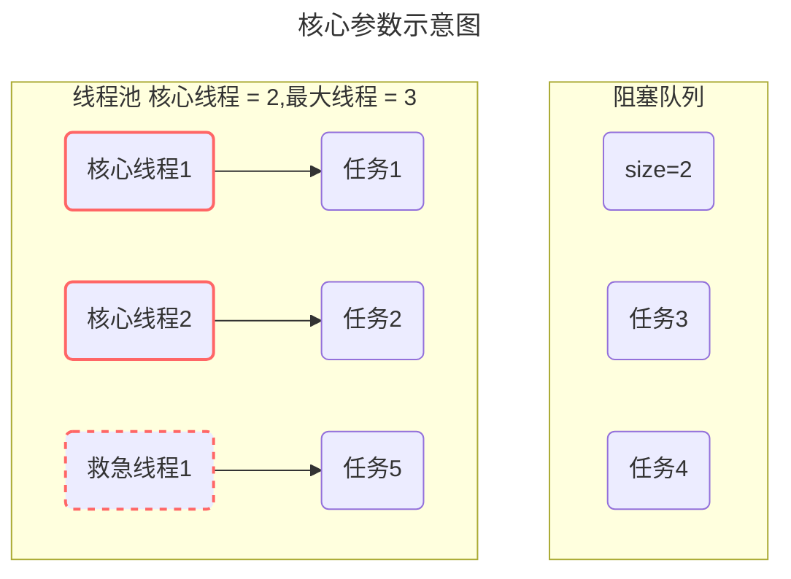
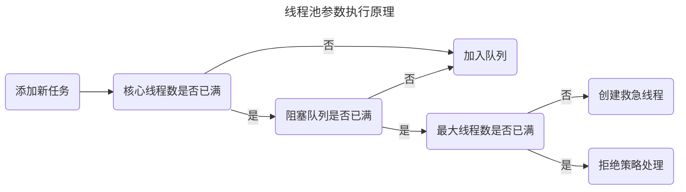
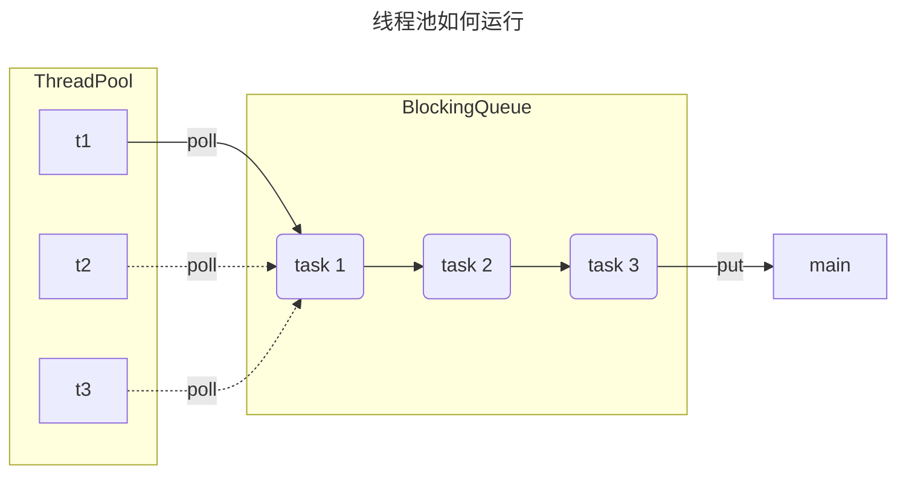
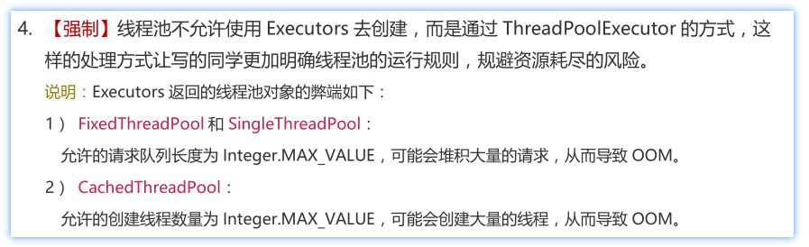
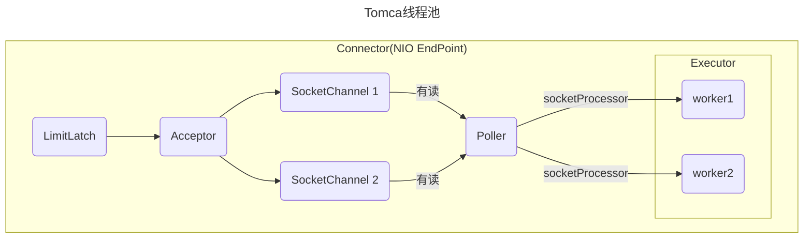
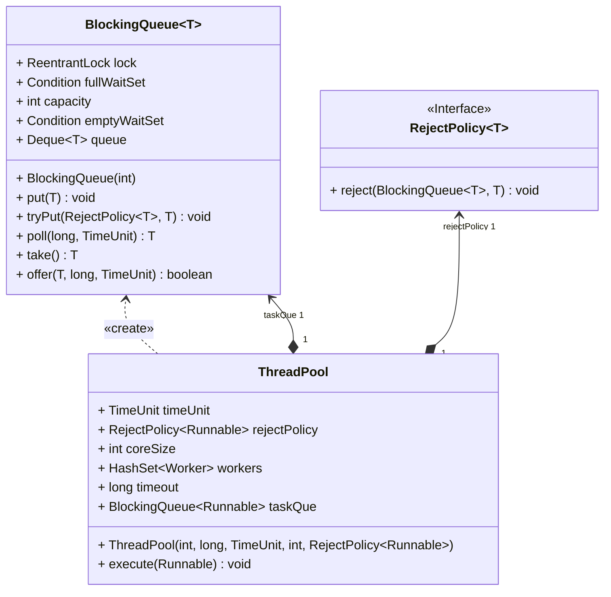
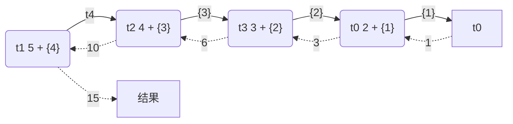
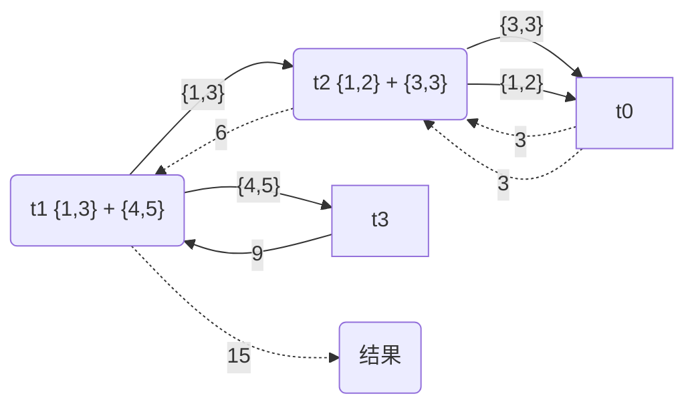

[[toc]]
[返回首页](index.md)
## 线程池

### ThreadPoolExecutor


<br/>

#### 线程池核心参数



```java
public ThreadPoolExecutor(int corePoolSize,
                          int maximumPoolSize,
                          long keepAliveTime,
                          TimeUnit unit,
                          BlockingQueue<Runnable> workQueue,
                          ThreadFactory threadFactory,
                          RejectedExecutionHandler handler)
```

- `corePoolSize` 核心线程数目
- `maximumPoolSize` 最大线程数目 
- `keepAliveTime` 生存时间 - 针对救急线程 
- `unit` 时间单位 - 针对救急线程 
- `workQueue` 阻塞队列 
- `threadFactory` 线程工厂 - 可以为线程创建时起个好名字 
- `handler` 拒绝策略

<br/>




**执行原理**

- 线程池中刚开始没有线程，当一个任务提交给线程池后，线程池会创建一个新线程来执行任务。 

- 当线程数达到 `corePoolSize` 并没有线程空闲，这时再加入任务，新加的任务会被加入workQueue 队列排队，直到有空闲的线程。 

- 如果队列选择了有界队列，那么任务超过了队列大小时，会创建 `maximumPoolSize - corePoolSize`数目的线程来救急。 

- 如果线程到达 `maximumPoolSize` 仍然有新任务这时会执行拒绝策略。

- 当高峰过去后，超过`corePoolSize` 的救急线程如果一段时间没有任务做，需要结束节省资源，这个时间由 keepAliveTime 和 unit 来控制。

<br/>

::: warning 💡思考：线程池是如何提交任务的

1. 任务在提交的时候，首先判断核心线程数是否已满，如果没有满则直接添加到工作线程执行
2. 如果核心线程数满了，则判断阻塞队列是否已满，如果没有满，当前任务存入阻塞队列
3. 如果阻塞队列也满了，则判断最大线程数是否已满，如果没有满，则使用临时线程执行任务
4. 如果最大线程数也满了（核心线程+临时线程），则走拒绝策略

:::

<br/>

**拒绝策略**

拒绝策略 jdk 提供了 4 种实现，其它著名框架也提供了实现


- `AbortPolicy` 让调用者抛出 `RejectedExecutionException` 异常，这是默认策略
- `CallerRunsPolicy `让调用者运行任务 
- `DiscardPolicy` 放弃本次任务 
- `DiscardOldestPolicy` 放弃队列中最早的任务，本任务取而代之 

<br/>

::: tip 📌提示：其他系统拒绝策略如何实现？

- `RPC` 框架 `Dubbo` 的实现，在抛出 `RejectedExecutionException` 异常之前会记录日志，并 dump 线程栈信息，方便定位问题 
- `Netty` 的实现，是创建一个新线程来执行任务 
- `ActiveMQ` 的实现，带超时等待（60s）尝试放入队列，类似我们之前自定义的拒绝策略 
- `PinPoint` 的实现，它使用了一个拒绝策略链，会逐一尝试策略链中每种拒绝策略

:::

<br/>



**代码演示**

```java
public class TestThreadPoolExecutor {

    static class MyTask implements Runnable {
        private final String name;
        private final long duration;

        public MyTask(String name) {
            this(name, 0);
        }

        public MyTask(String name, long duration) {
            this.name = name;
            this.duration = duration;
        }

        @Override
        public void run() {
            try {
                LoggerUtils.get("myThread").debug("running..." + this);
                Thread.sleep(duration);
            } catch (InterruptedException e) {
                e.printStackTrace();
            }
        }

        @Override
        public String toString() {
            return "MyTask(" + name + ")";
        }
    }

    public static void main(String[] args) throws InterruptedException {
        AtomicInteger c = new AtomicInteger(1);
        ArrayBlockingQueue<Runnable> queue = new ArrayBlockingQueue<>(2);
        ThreadPoolExecutor threadPool = new ThreadPoolExecutor(
                2,
                3,
                0,
                TimeUnit.MILLISECONDS,
                queue,
                r -> new Thread(r, "myThread" + c.getAndIncrement()),
                new ThreadPoolExecutor.AbortPolicy());
        showState(queue, threadPool);
        threadPool.submit(new MyTask("1", 3600000));
        showState(queue, threadPool);
        threadPool.submit(new MyTask("2", 3600000));
        showState(queue, threadPool);
        threadPool.submit(new MyTask("3"));
        showState(queue, threadPool);
        threadPool.submit(new MyTask("4"));
        showState(queue, threadPool);
        threadPool.submit(new MyTask("5",3600000));
        showState(queue, threadPool);
        threadPool.submit(new MyTask("6"));
        showState(queue, threadPool);
    }

    private static void showState(ArrayBlockingQueue<Runnable> queue, ThreadPoolExecutor threadPool) {
        try {
            Thread.sleep(300);
        } catch (InterruptedException e) {
            e.printStackTrace();
        }
        List<Object> tasks = new ArrayList<>();
        for (Runnable runnable : queue) {
            try {
                Field callable = FutureTask.class.getDeclaredField("callable");
                callable.setAccessible(true);
                Object adapter = callable.get(runnable);
                Class<?> clazz = Class.forName("java.util.concurrent.Executors$RunnableAdapter");
                Field task = clazz.getDeclaredField("task");
                task.setAccessible(true);
                Object o = task.get(adapter);
                tasks.add(o);
            } catch (Exception e) {
                e.printStackTrace();
            }
        }
        LoggerUtils.main.debug("pool size: {}, queue: {}", threadPool.getPoolSize(), tasks);
    }

}
```

<br/>

#### 常见阻塞队列

线程池中`workQueue` 参数 - 当没有空闲核心线程时，新来任务会加入到此队列排队，队列满会创建救急线程执行任务

比较常见的有4个，用的最多是 `ArrayBlockingQueue`和 `LinkedBlockingQueue`

- `ArrayBlockingQueue`：基于数组结构的有界阻塞队列，FIFO。
- `LinkedBlockingQueue`：基于链表结构的有界阻塞队列，FIFO。
- `SynchronousQueue`：不存储元素的阻塞队列，每个插入操作都必须等待一个移出操作。
- `DelayedWorkQueue` ：是一个优先级队列，它可以保证每次出队的任务都是当前队列中执行时间最靠前的

<br/>

**性能比较**

|       LinkedBlockingQueue        |  ArrayBlockingQueue  |
| :------------------------------: | :------------------: |
|        默认无界，支持有界        |       强制有界       |
|            底层是链表            |      底层是数组      |
| 是懒惰的，创建节点的时候添加数据 | 提前初始化 Node 数组 |
|        入队会生成新 Node         | Node 需要提前创建好  |
|        读写两把锁（头尾）        |    读写共用一把锁    |

左边是`LinkedBlockingQueue`加锁的方式，右边是`ArrayBlockingQueue`加锁的方式

- `LinkedBlockingQueue`读和写各有一把锁，性能相对较好
- `ArrayBlockingQueue`只有一把锁，读和写公用，性能相对于`LinkedBlockingQueue`差一些


<br/>

#### 线程池种类

::: warning 💡思考：线程池的种类有哪些

- `newFixedThreadPool`：创建一个定长线程池，可控制线程最大并发数，超出的线程会在队列中等待。
- `newSingleThreadExecutor`：创建一个单线程化的线程池，它只会用唯一的工作线程来执行任务，保证所有任务按照指定顺序（FIFO）执行。
- `newCachedThreadPool`：创建一个可缓存线程池，如果线程池长度超过处理需要，可灵活回收空闲线程，若无可回收，则新建线程。
- `newScheduledThreadPool`：可以执行延迟任务的线程池，支持定时及周期性任务执行。

:::

根据线程池的构造方法，`JDK Executors` 类中提供了众多工厂方法来创建各种用途的线程池，来方便调用者实现。

#### newFixedThreadPool

```java
// 创建一个固定大小的线程池
public static ExecutorService newFixedThreadPool(int nThreads) {
    return new ThreadPoolExecutor(nThreads, nThreads,
                                  0L, TimeUnit.MILLISECONDS,
                                  new LinkedBlockingQueue<Runnable>());
}
// 内部调用了：ThreadPoolExecutor的一个构造方法
public ThreadPoolExecutor(int corePoolSize,
                          int maximumPoolSize,
                          long keepAliveTime,
                          TimeUnit unit,
                          BlockingQueue<Runnable> workQueue) {
    this(corePoolSize, maximumPoolSize, keepAliveTime, unit, workQueue,
         Executors.defaultThreadFactory(), defaultHandler);
}
```

默认工厂以及默认构造线程的方法：

```java
DefaultThreadFactory() {
    SecurityManager s = System.getSecurityManager();
    group = (s != null) ? s.getThreadGroup() :
    Thread.currentThread().getThreadGroup();
    namePrefix = "pool-" +
        poolNumber.getAndIncrement() +
        "-thread-";
}

public Thread newThread(Runnable r) {
    Thread t = new Thread(group, r,
                          namePrefix + threadNumber.getAndIncrement(),
                          0);
    if (t.isDaemon())
        t.setDaemon(false);
    if (t.getPriority() != Thread.NORM_PRIORITY)
        t.setPriority(Thread.NORM_PRIORITY);
    return t;
}
```

默认拒绝策略：抛出异常

```java
private static final RejectedExecutionHandler defaultHandler = new AbortPolicy();
```

特点 

- 核心线程数 == 最大线程数（没有救急线程被创建），因此也无需超时时间 
- 阻塞队列是无界的，可以放任意数量的任务

> **评价** 适用于任务量已知，相对耗时的任务

代码演示

```java
@Slf4j(topic = "c.TestThreadPoolExecutors")
public class TestThreadPoolExecutors {
    public static void main(String[] args) {
        ExecutorService pool = Executors.newFixedThreadPool(2, new ThreadFactory() {
            private final AtomicInteger t = new AtomicInteger(1);

            @Override
            public Thread newThread(Runnable r) {
                return new Thread(r, "myPool_t" + t.getAndIncrement());
            }
        });

        pool.execute( () -> {
            log.debug("1");
        });

        pool.execute( () -> {
            log.debug("2");
        });

        pool.execute( () -> {
            log.debug("3");
        });
    }
}
```

日志打印

```java
00:05:19 [myPool_t2] c.TestThreadPoolExecutors - 2
00:05:19 [myPool_t1] c.TestThreadPoolExecutors - 1
00:05:19 [myPool_t2] c.TestThreadPoolExecutors - 3
```

<br/>

#### newCachedThreadPool

```java
public static ExecutorService newCachedThreadPool() {
    return new ThreadPoolExecutor(0, Integer.MAX_VALUE,
                                  60L, TimeUnit.SECONDS,
                                  new SynchronousQueue<Runnable>());
}
```

特点 

- 核心线程数是 0， 最大线程数是 Integer.MAX_VALUE，救急线程的空闲生存时间是 60s，
  - 意味着全部都是救急线程（60s 后可以回收）
  - 救急线程可以无限创建
- 队列采用了 SynchronousQueue 实现特点是，它没有容量，没有线程来取是放不进去的（一手交钱、一手交货）

```java
SynchronousQueue<Integer> integers = new SynchronousQueue<>();
new Thread(() -> {
    try {
        log.debug("putting {} ", 1);
        integers.put(1);
        log.debug("{} putted...", 1);
        log.debug("putting...{} ", 2);
        integers.put(2);
        log.debug("{} putted...", 2);
    } catch (InterruptedException e) {
        e.printStackTrace();
    }
},"t1").start();
sleep(1);
new Thread(() -> {
    try {
        log.debug("taking {}", 1);
        integers.take();
    } catch (InterruptedException e) {
        e.printStackTrace();
    }
},"t2").start();
sleep(1);
new Thread(() -> {
    try {
        log.debug("taking {}", 2);
        integers.take();
    } catch (InterruptedException e) {
        e.printStackTrace();
    }
},"t3").start();
```

输出

```sh
11:48:15.500 c.TestSynchronousQueue [t1] - putting 1 
11:48:16.500 c.TestSynchronousQueue [t2] - taking 1 
11:48:16.500 c.TestSynchronousQueue [t1] - 1 putted... 
11:48:16.500 c.TestSynchronousQueue [t1] - putting...2 
11:48:17.502 c.TestSynchronousQueue [t3] - taking 2 
11:48:17.503 c.TestSynchronousQueue [t1] - 2 putted... 
```

> **评价** 
>
> 整个线程池表现为线程数会根据任务量不断增长，没有上限，当任务执行完毕，空闲 1分钟后释放线程。
>
> 适合任务数比较密集，但每个任务执行时间较短的情况

<br/>

#### newSingleThreadExecutor

```java
public static ExecutorService newSingleThreadExecutor() {
    return new FinalizableDelegatedExecutorService
        (new ThreadPoolExecutor(1, 1,
                                0L, TimeUnit.MILLISECONDS,
                                new LinkedBlockingQueue<Runnable>()));
}
```

使用场景： 

希望多个任务排队执行。线程数固定为 1，任务数多于 1 时，会放入无界队列排队。任务执行完毕，这唯一的线程也不会被释放。 

区别：

- 自己创建一个单线程串行执行任务，如果任务执行失败而终止那么没有任何补救措施，而线程池还会新建一个线程，保证池的正常工作
- Executors.newSingleThreadExecutor() 线程个数始终为1，不能修改
  - FinalizableDelegatedExecutorService 应用的是装饰器模式，在调用构造方法时将ThreadPoolExecutor对象传给了内部的ExecutorService接口。只对外暴露了 ExecutorService 接口，因此不能调用 ThreadPoolExecutor 中特有的方法，也不能重新设置线程池的大小。
- Executors.newFixedThreadPool(1) 初始时为1，以后还可以修改
  - 对外暴露的是 ThreadPoolExecutor 对象，可以强转后调用 setCorePoolSize 等方法进行修改

<br/>

::: warning 💡思考：为什么不建议用Executors创建线程池

参考阿里开发手册《Java开发手册-嵩山版》



:::

<br/>

#### ScheduledExecutorService

在『任务调度线程池』功能加入之前(JDK1.3)，可以使用 java.util.Timer 来实现定时功能，Timer 的优点在于简单易用，但由于所有任务都是由同一个线程来调度，因此所有任务都是串行执行的，同一时间只能有一个任务在执行，前一个任务的延迟或异常都将会影响到之后的任务。

```java
public static void main(String[] args) {
    Timer timer = new Timer();
    TimerTask task1 = new TimerTask() {
        @Override
        public void run() {
            log.debug("task 1");
            sleep(2);
        }
    };
    TimerTask task2 = new TimerTask() {
        @Override
        public void run() {
            log.debug("task 2");
        }
    };
    // 使用 timer 添加两个任务，希望它们都在 1s 后执行
    // 但由于 timer 内只有一个线程来顺序执行队列中的任务，因此『任务1』的延时，影响了『任务2』的执行
    timer.schedule(task1, 1000);
    timer.schedule(task2, 1000);
}
```

输出

```sh
20:46:09.444 c.TestTimer [main] - start... 
20:46:10.447 c.TestTimer [Timer-0] - task 1 
20:46:12.448 c.TestTimer [Timer-0] - task 2 
```

使用 `ScheduledExecutorService` 改写：

```java
ScheduledExecutorService executor = Executors.newScheduledThreadPool(2);
// 添加两个任务，希望它们都在 1s 后执行
executor.schedule(() -> {
    System.out.println("任务1，执行时间：" + new Date());
    try { Thread.sleep(2000); } catch (InterruptedException e) { }
}, 1000, TimeUnit.MILLISECONDS);
executor.schedule(() -> {
    System.out.println("任务2，执行时间：" + new Date());
}, 1000, TimeUnit.MILLISECONDS);
```

输出

```sh
任务1，执行时间：Thu Jan 03 12:45:17 CST 2019 
任务2，执行时间：Thu Jan 03 12:45:17 CST 2019 
```

scheduleAtFixedRate 例子：

```java
ScheduledExecutorService pool = Executors.newScheduledThreadPool(1);
log.debug("start...");
pool.scheduleAtFixedRate(() -> {
    log.debug("running...");
}, 1, 1, TimeUnit.SECONDS);
```

输出

```sh
21:45:43.167 c.TestTimer [main] - start... 
21:45:44.215 c.TestTimer [pool-1-thread-1] - running... 
21:45:45.215 c.TestTimer [pool-1-thread-1] - running... 
21:45:46.215 c.TestTimer [pool-1-thread-1] - running... 
21:45:47.215 c.TestTimer [pool-1-thread-1] - running... 
```

scheduleAtFixedRate 例子（任务执行时间超过了间隔时间）：

```java
ScheduledExecutorService pool = Executors.newScheduledThreadPool(1);
log.debug("start...");
pool.scheduleAtFixedRate(() -> {
    log.debug("running...");
    sleep(2);
}, 1, 1, TimeUnit.SECONDS);
```

输出分析：一开始，延时 1s，接下来，由于任务执行时间 > 间隔时间，间隔被『撑』到了 2s

```sh
21:44:30.311 c.TestTimer [main] - start... 
21:44:31.360 c.TestTimer [pool-1-thread-1] - running... 
21:44:33.361 c.TestTimer [pool-1-thread-1] - running... 
21:44:35.362 c.TestTimer [pool-1-thread-1] - running... 
21:44:37.362 c.TestTimer [pool-1-thread-1] - running...
```

scheduleWithFixedDelay 例子：

```java
ScheduledExecutorService pool = Executors.newScheduledThreadPool(1);
log.debug("start...");
pool.scheduleWithFixedDelay(()-> {
    log.debug("running...");
    sleep(2);
}, 1, 1, TimeUnit.SECONDS);
```

输出分析：一开始，延时 1s，scheduleWithFixedDelay 的间隔是 上一个任务结束 <-> 延时 <-> 下一个任务开始 所 以间隔都是 3s

```sh
21:40:55.078 c.TestTimer [main] - start... 
21:40:56.140 c.TestTimer [pool-1-thread-1] - running... 
21:40:59.143 c.TestTimer [pool-1-thread-1] - running... 
21:41:02.145 c.TestTimer [pool-1-thread-1] - running... 
21:41:05.147 c.TestTimer [pool-1-thread-1] - running... 
```

> **评价** 整个线程池表现为：线程数固定，任务数多于线程数时，会放入无界队列排队。任务执行完毕，这些线程也不会被释放。用来执行延迟或反复执行的任务

<br/>

::: warning 💡思考：如何确认核心线程数

我们可以把并发高低，任务长短分为两个维度

- 并发低，任务时间短的是我们系统不需要优化的
- 并发高，任务时间短我们需要减少上下文的切换，CPU核心数 + 1即可
- 并发低，任务时间长则需要判断是IO密集型任务还是计算密集型任务
  - IO密集型一般是文件读写，DB读写，网络请求，核心数 * 2  + 1
  - CPU密集型一般是计算代码，数据转换，排序，CPU核心数  + 1
- 并发高，任务时间长的任务不在于线程数，而在于整体架构的设计，看看这些业务里面某些数据是否能做缓存是第一步，增加服务器是第二步，至于线程池的设置，则参考IO密集型和CPU密集型。

:::

#### 线程池状态

ThreadPoolExecutor 使用 int 的高3位来表示线程池状态，低29位表示线程数量

> 提问：为什么不将状态位和线程池状态区分开。

| 状态名     | 高三位 | 接收新任务 | 处理阻塞队列任务 | 说明                                       |
| :--------- | :----: | :--------: | :--------------: | :----------------------------------------- |
| RUNNING    |  111   |     Y      |        Y         |                                            |
| SHUTDOWN   |  000   |     N      |        Y         | 不会接收新任务，但会处理阻塞队列剩余任务   |
| STOP       |  001   |     N      |        N         | 会中断正在执行的任务，并抛弃阻塞队列任务   |
| TIDYING    |  010   |            |                  | 任务全执行完毕，活动线程为 0 即将进入 终结 |
| TERMINATED |  011   |            |                  | 终结状态                                   |

从数字上比较，`TERMINATED > TIDYING > STOP > SHUTDOWN > RUNNING` （高位的1是负数）

这些信息存储在一个原子变量 ctl 中，目的是将线程池状态与线程个数合二为一，这样就可以用一次 cas 原子操作 进行赋值

```java
// c 为旧值， ctlOf 返回结果为新值
ctl.compareAndSet(c, ctlOf(targetState, workerCountOf(c))));

// rs 为高 3 位代表线程池状态， wc 为低 29 位代表线程个数，ctl 是合并它们
private static int ctlOf(int rs, int wc) { return rs | wc; }
```

<br/>

#### 提交任务

```java
// 执行任务
void execute(Runnable command);

// 提交任务 task，用返回值 Future 获得任务执行结果。使用保护者暂停模式，
<T> Future<T> submit(Callable<T> task);

// 提交 tasks 中所有任务
<T> List<Future<T>> invokeAll(Collection<? extends Callable<T>> tasks) 
  throws InterruptedException;

// 提交 tasks 中所有任务，带超时时间，时间超时后，会放弃执行后面的任务
<T> List<Future<T>> invokeAll(Collection<? extends Callable<T>> tasks, 
                              long timeout, TimeUnit unit)
    throws InterruptedException;

// 提交 tasks 中所有任务，哪个任务先成功执行完毕，返回此任务执行结果，其它任务取消
<T> T invokeAny(Collection<? extends Callable<T>> tasks)
    throws InterruptedException, ExecutionException;

// 提交 tasks 中所有任务，哪个任务先成功执行完毕，返回此任务执行结果，其它任务取消，带超时时间
<T> T invokeAny(Collection<? extends Callable<T>> tasks,
                long timeout, TimeUnit unit)
    throws InterruptedException, ExecutionException, TimeoutException;
```

测试submit

```java
private static void method1(ExecutorService pool) throws InterruptedException, ExecutionException {
    Future<String> future = pool.submit(() -> {
        log.debug("running");
        Thread.sleep(1000);
        return "ok";
    });

    log.debug("{}", future.get());
}
public static void main(String[] args) throws ExecutionException, InterruptedException {
    ExecutorService pool = Executors.newFixedThreadPool(1);
    method1(pool);
}
```

测试结果

```sh
18:36:58.033 c.TestSubmit [pool-1-thread-1] - running
18:36:59.034 c.TestSubmit [main] - ok
```

测试invokeAll

```java
private static void method2(ExecutorService pool) throws InterruptedException {
    List<Future<String>> futures = pool.invokeAll(Arrays.asList(
        () -> {
            log.debug("begin");
            Thread.sleep(1000);
            return "1";
        },
        () -> {
            log.debug("begin");
            Thread.sleep(500);
            return "2";
        },
        () -> {
            log.debug("begin");
            Thread.sleep(2000);
            return "3";
        }
    ));

    futures.forEach( f ->  {
        try {
            log.debug("{}", f.get());
        } catch (InterruptedException | ExecutionException e) {
            e.printStackTrace();
        }
    });
}
public static void main(String[] args) throws ExecutionException, InterruptedException {
    ExecutorService pool = Executors.newFixedThreadPool(1);
    method2(pool);
}
```

测试结果

```java
19:33:16.530 c.TestSubmit [pool-1-thread-1] - begin
19:33:17.530 c.TestSubmit [pool-1-thread-1] - begin
19:33:18.040 c.TestSubmit [pool-1-thread-1] - begin
19:33:20.051 c.TestSubmit [main] - 1
19:33:20.051 c.TestSubmit [main] - 2
19:33:20.051 c.TestSubmit [main] - 3
```

测试invokeAny

```java
private static void method3(ExecutorService pool) throws InterruptedException, ExecutionException {
    String result = pool.invokeAny(Arrays.asList(
        () -> {
            log.debug("begin 1");
            Thread.sleep(1000);
            log.debug("end 1");
            return "1";
        },
        () -> {
            log.debug("begin 2");
            Thread.sleep(500);
            log.debug("end 2");
            return "2";
        },
        () -> {
            log.debug("begin 3");
            Thread.sleep(2000);
            log.debug("end 3");
            return "3";
        }
    ));
    log.debug("{}", result);
}
public static void main(String[] args) throws ExecutionException, InterruptedException {
    ExecutorService pool = Executors.newFixedThreadPool(3);
    //ExecutorService pool = Executors.newFixedThreadPool(1);
    method3(pool);
}
```

测试结果

```sh
19:44:46.314 c.TestSubmit [pool-1-thread-1] - begin 1
19:44:46.314 c.TestSubmit [pool-1-thread-3] - begin 3
19:44:46.314 c.TestSubmit [pool-1-thread-2] - begin 2
19:44:46.817 c.TestSubmit [pool-1-thread-2] - end 2
19:44:46.817 c.TestSubmit [main] - 2

19:47:16.063 c.TestSubmit [pool-1-thread-1] - begin 1
19:47:17.063 c.TestSubmit [pool-1-thread-1] - end 1
19:47:17.063 c.TestSubmit [pool-1-thread-1] - begin 2
19:47:17.063 c.TestSubmit [main] - 1
```

<br/>

#### 关闭线程池

**shutdown**

```java
/*
线程池状态变为 SHUTDOWN
- 不会接收新任务
- 但已提交任务会执行完
- 此方法不会阻塞调用线程的执行
*/
void shutdown();
```

```java
public void shutdown() {
    final ReentrantLock mainLock = this.mainLock;
    mainLock.lock();
    try {
        checkShutdownAccess();
        // 修改线程池状态
        advanceRunState(SHUTDOWN);
        // 仅会打断空闲线程
        interruptIdleWorkers();
        onShutdown(); // 扩展点 ScheduledThreadPoolExecutor
    } finally {
        mainLock.unlock();
    }
    // 尝试终结(没有运行的线程可以立刻终结，如果还有运行的线程也不会等)
    tryTerminate();
}
```

**shutdownNow**

```java
/*
线程池状态变为 STOP
- 不会接收新任务
- 会将队列中的任务返回
- 并用 interrupt 的方式中断正在执行的任务
*/
List<Runnable> shutdownNow();
```

```java
public List<Runnable> shutdownNow() {
    List<Runnable> tasks;
    final ReentrantLock mainLock = this.mainLock;
    mainLock.lock();
    try {
        checkShutdownAccess();
        // 修改线程池状态
        advanceRunState(STOP);
        // 打断所有线程
        interruptWorkers();
        // 获取队列中剩余任务
        tasks = drainQueue();
    } finally {
        mainLock.unlock();
    }
    // 尝试终结
    tryTerminate();
    return tasks;
}
```

**其他方法**

```java
// 不在 RUNNING 状态的线程池，此方法就返回 true
boolean isShutdown();
// 线程池状态是否是 TERMINATED
boolean isTerminated();
// 调用 shutdown 后，由于调用线程并不会等待所有任务运行结束，因此如果它想在线程池 TERMINATED 后做些事情，可以利用此方法等待
// 一般task是Callable类型的时候不用此方法，因为futureTask.get方法自带等待功能。
boolean awaitTermination(long timeout, TimeUnit unit) throws InterruptedException;
```

**测试shutdown、shutdownNow、awaitTermination**

```java
@Slf4j(topic = "c.TestShutDown")
public class TestShutDown {

    public static void main(String[] args) throws ExecutionException, InterruptedException {
        ExecutorService pool = Executors.newFixedThreadPool(2);

        Future<Integer> result1 = pool.submit(() -> {
            log.debug("task 1 running...");
            Thread.sleep(1000);
            log.debug("task 1 finish...");
            return 1;
        });

        Future<Integer> result2 = pool.submit(() -> {
            log.debug("task 2 running...");
            Thread.sleep(1000);
            log.debug("task 2 finish...");
            return 2;
        });

        Future<Integer> result3 = pool.submit(() -> {
            log.debug("task 3 running...");
            Thread.sleep(1000);
            log.debug("task 3 finish...");
            return 3;
        });

        log.debug("shutdown");
        pool.shutdown();
        //        pool.awaitTermination(3, TimeUnit.SECONDS);
        //        List<Runnable> runnables = pool.shutdownNow();
        //        log.debug("other.... {}" , runnables);
    }
}
```

测试结果

```sh
#shutdown依旧会执行剩下的任务
20:09:13.285 c.TestShutDown [main] - shutdown
20:09:13.285 c.TestShutDown [pool-1-thread-1] - task 1 running...
20:09:13.285 c.TestShutDown [pool-1-thread-2] - task 2 running...
20:09:14.293 c.TestShutDown [pool-1-thread-2] - task 2 finish...
20:09:14.293 c.TestShutDown [pool-1-thread-1] - task 1 finish...
20:09:14.293 c.TestShutDown [pool-1-thread-2] - task 3 running...
20:09:15.303 c.TestShutDown [pool-1-thread-2] - task 3 finish...
#shutdownNow立刻停止所有任务
20:11:11.750 c.TestShutDown [main] - shutdown
20:11:11.750 c.TestShutDown [pool-1-thread-1] - task 1 running...
20:11:11.750 c.TestShutDown [pool-1-thread-2] - task 2 running...
20:11:11.750 c.TestShutDown [main] - other.... [java.util.concurrent.FutureTask@66d33a]
```

<br/>

#### 处理异常任务

不论是哪个线程池，在线程执行的任务发生异常后既不会抛出，也不会捕获，这时就需要我们做一定的处理。

**方法1：主动捉异常**

```java
ExecutorService pool = Executors.newFixedThreadPool(1);
pool.submit(() -> {
    try {
        log.debug("task1");
        int i = 1 / 0;
    } catch (Exception e) {
        log.error("error:", e);
    }
});
```

输出

```sh
21:59:04.558 c.TestTimer [pool-1-thread-1] - task1 
21:59:04.562 c.TestTimer [pool-1-thread-1] - error: 
java.lang.ArithmeticException: / by zero 
 at cn.itcast.n8.TestTimer.lambda$main$0(TestTimer.java:28) 
 at java.util.concurrent.Executors$RunnableAdapter.call(Executors.java:511) 
 at java.util.concurrent.FutureTask.run(FutureTask.java:266) 
 at java.util.concurrent.ThreadPoolExecutor.runWorker(ThreadPoolExecutor.java:1149) 
 at java.util.concurrent.ThreadPoolExecutor$Worker.run(ThreadPoolExecutor.java:624) 
 at java.lang.Thread.run(Thread.java:748) 
```

<br/>

**方法2：使用 Future**

说明：

- lambda表达式内要有返回值，编译器才能将其识别为Callable，否则将识别为Runnable，也就不能用FutureTask
- 方法中如果出异常，`futuretask.get`会返回这个异常，否者正常返回。

```java
ExecutorService pool = Executors.newFixedThreadPool(1);
Future<Boolean> f = pool.submit(() -> {
    log.debug("task1");
    int i = 1 / 0;
    return true;
});
log.debug("result:{}", f.get());
```

输出

```sh
21:54:58.208 c.TestTimer [pool-1-thread-1] - task1 
Exception in thread "main" java.util.concurrent.ExecutionException: 
java.lang.ArithmeticException: / by zero 
 at java.util.concurrent.FutureTask.report(FutureTask.java:122) 
 at java.util.concurrent.FutureTask.get(FutureTask.java:192) 
 at cn.itcast.n8.TestTimer.main(TestTimer.java:31) 
Caused by: java.lang.ArithmeticException: / by zero 
 at cn.itcast.n8.TestTimer.lambda$main$0(TestTimer.java:28) 
 at java.util.concurrent.FutureTask.run(FutureTask.java:266) 
 at java.util.concurrent.ThreadPoolExecutor.runWorker(ThreadPoolExecutor.java:1149) 
 at java.util.concurrent.ThreadPoolExecutor$Worker.run(ThreadPoolExecutor.java:624) 
 at java.lang.Thread.run(Thread.java:748) 
```

<br/>

#### Tomcat 线程池

Tomcat 在哪里用到了线程池呢



- `LimitLatch` 用来限流，可以控制最大连接个数，类似 J.U.C 中的 `Semaphore` 后面再讲 
- `Acceptor` 只负责【接收新的 socket 连接】 
- `Poller` 只负责监听 `socket channel` 是否有【可读的 I/O 事件】 
- 一旦可读，封装一个任务对象`（socketProcessor）`，提交给 `Executor` 线程池处理 
- Executor 线程池中的工作线程最终负责【处理请求】

<br/>

`Tomcat` 线程池扩展了 `ThreadPoolExecutor`，行为稍有不同 

- 如果总线程数达到 `maximumPoolSize `
  - 这时不会立刻抛 `RejectedExecutionException` 异常 
  - 而是再次尝试将任务放入队列，如果还失败，才抛出 `RejectedExecutionException` 异常 

源码 tomcat-7.0.42

```java
public void execute(Runnable command, long timeout, TimeUnit unit) {
    submittedCount.incrementAndGet();
    try {
        super.execute(command);
    } catch (RejectedExecutionException rx) {
        if (super.getQueue() instanceof TaskQueue) {
            final TaskQueue queue = (TaskQueue)super.getQueue();
            try {
                if (!queue.force(command, timeout, unit)) {
                    submittedCount.decrementAndGet();
                    throw new RejectedExecutionException("Queue capacity is full.");
                }
            } catch (InterruptedException x) {
                submittedCount.decrementAndGet();
                Thread.interrupted();
                throw new RejectedExecutionException(x);
            }
        } else {
            submittedCount.decrementAndGet();
            throw rx;
        }
    }
}
```

TaskQueue.java

```java
public boolean force(Runnable o, long timeout, TimeUnit unit) throws InterruptedException {
    if ( parent.isShutdown() ) 
        throw new RejectedExecutionException(
        "Executor not running, can't force a command into the queue"
    );
    return super.offer(o,timeout,unit); //forces the item onto the queue, to be used if the task 
    is rejected
}
```

Connector 配置

| 配置项                 | 默认值 | 说明                                   |
| :--------------------- | :----: | :------------------------------------- |
| `acceptorThreadCount ` |   1    | acceptor 线程数量                      |
| `pollerThreadCount`    |   1    | poller 线程数量                        |
| `minSpareThreads`      |   10   | 核心线程数，即 corePoolSize            |
| `maxThreads`           |  200   | 最大线程数，即 maximumPoolSize         |
| `executor`             |   -    | Executor 名称，用来引用下面的 Executor |

Executor 线程配置

| 配置项                    |      默认值       | 说明                                      |
| :------------------------ | :---------------: | :---------------------------------------- |
| `threadPriority`          |         5         | 线程优先级                                |
| `deamon`                  |       true        | 是否守护线程                              |
| `minSpareThreads`         |        25         | 核心线程数，即corePoolSize                |
| `maxThreads`              |        200        | 最大线程数，即 maximumPoolSize            |
| `maxIdleTime`             |       60000       | 线程生存时间，单位是毫秒，默认值即 1 分钟 |
| `maxQueueSize`            | Integer.MAX_VALUE | 队列长度                                  |
| `prestartminSpareThreads` |       false       | 核心线程是否在服务器启动时启动            |

<br/>

### 自定义线程池

思路解析todo

#### 阻塞队列

```java
@Slf4j(topic = "c.BlockingQueue")
public class BlockingQueue<T> {
    // 阻塞队列,存放任务
    private final Deque<T> queue = new ArrayDeque<>();
    //队列的最大容量
    private final int capacity;
    //锁
    private final ReentrantLock lock = new ReentrantLock();
    //生产者条件变量，队列满的时候等待
    private final Condition fullWaitSet = lock.newCondition();
    //消费者条件变量，队列空的时候等待
    private final Condition emptyWaitSet = lock.newCondition();

    public BlockingQueue(int capacity) {
        this.capacity = capacity;
    }

    //消费者，从队列头部获取阻塞队列
    public T take() {
        lock.lock();
        try {
            // 当队列 size == 0 则继续等待
            while (queue.size() == 0) {
                try {
                    emptyWaitSet.await();
                } catch (InterruptedException e) {
                    throw new RuntimeException(e);
                }
            }
            // 将队列放入阻塞队列并唤醒生产者
            T t = queue.pollFirst();
            fullWaitSet.signal();
            return t;
        } finally {
            lock.unlock();
        }
    }

    // 生产者，从队列尾部添加阻塞队列
    public void put(T t) {
        lock.lock();

        try {
            // 如果阻塞队列 size = capacity 则等待
            while (queue.size() == capacity) {
                try {
                    log.debug("等待加入任务队列:{}", t.toString());
                    fullWaitSet.await();
                } catch (InterruptedException e) {
                    e.printStackTrace();
                }
            }
            log.debug("加入任务队列:{}", t.toString());
            queue.addLast(t);
            // 添加阻塞队列 唤醒阻塞消费者
            emptyWaitSet.signal();
        } finally {
            lock.unlock();
        }
    }

}
```

<br/>


#### 线程池

```java
@Slf4j(topic = "c.ThreadPool")
public class ThreadPool {
    // 阻塞队列
    BlockingQueue<Runnable> taskQue;
    // 线程集合
    HashSet<Worker> workers = new HashSet<>();
    // 线程数量
    private final int coreSize;
    // 超时时间
    private final long timeout;
    // 超时单位
    private final TimeUnit timeUnit;

    public ThreadPool(int coreSize, long timeout, TimeUnit timeUnit, int queueCapacity) {
        this.coreSize = coreSize;
        this.timeout = timeout;
        this.timeUnit = timeUnit;
        taskQue = new BlockingQueue<>(queueCapacity);
    }

    // 线程池执行方法
    public void execute(Runnable task) {
        // work类不是线程安全的，需要加锁
        synchronized (workers) {
            // 任务数 超过 线程数，加入任务队列缓存
            if (workers.size() >= coreSize) {
                //死等
                taskQue.put(task);
            } else {
                // 任务数 没有超过 线程数 则直接交给 worker 执行
                Worker worker = new Worker(task);
                log.debug("新增worker:{},task:{}", worker,task);
                workers.add(worker);
                worker.start();
            }
        }
    }


    //工作类
    class Worker extends Thread {
        private Runnable task;

        public Worker(Runnable task) {
            this.task = task;
        }

        @Override
        public void run() {
            while (task != null || (task = taskQue.take()) != null) {
                try {
                    log.debug("正在执行:{}",task);
                    task.run();
                } catch (Exception e) {
                    throw new RuntimeException(e);
                } finally {
                    task = null;
                }
            }

            synchronized (workers) {
                log.debug("worker被移除:{}", this);
                workers.remove(this);
            }
        }

    }

}
```

<br/>

#### take死等

代码测试

```java
@Slf4j(topic = "c.ThreadPoolTest")
public class ThreadPoolTest {
    public static void main(String[] args) {

        ThreadPool threadPool = new ThreadPool(2, 1000, TimeUnit.MILLISECONDS, 10);

        for (int i = 0; i < 5; i++) {
            int j = i;
            threadPool.execute( () -> {
                log.debug("执行任务:{}", j);
            });
        }

    }
}    
```

控制台输出：打印了5个线程后，由于take没有超时时间，导致阻塞队列一直在等待。

```java
23:22:23 [main] c.ThreadPool - 新增worker:Thread[Thread-0,5,main],task:org.itcast.pool.ThreadPoolTest$$Lambda$1/1856426318@256216b3
23:22:23 [main] c.ThreadPool - 新增worker:Thread[Thread-1,5,main],task:org.itcast.pool.ThreadPoolTest$$Lambda$1/1856426318@19bb089b
23:22:23 [main] c.BlockingQueue - 加入任务队列:org.itcast.pool.ThreadPoolTest$$Lambda$1/1856426318@11531931
23:22:23 [main] c.BlockingQueue - 加入任务队列:org.itcast.pool.ThreadPoolTest$$Lambda$1/1856426318@5e025e70
23:22:23 [main] c.BlockingQueue - 加入任务队列:org.itcast.pool.ThreadPoolTest$$Lambda$1/1856426318@1fbc7afb
23:22:23 [Thread-0] c.ThreadPool - 正在执行:org.itcast.pool.ThreadPoolTest$$Lambda$1/1856426318@256216b3
23:22:23 [Thread-1] c.ThreadPool - 正在执行:org.itcast.pool.ThreadPoolTest$$Lambda$1/1856426318@19bb089b
23:22:23 [Thread-0] c.ThreadPoolTest - 执行任务:0
23:22:23 [Thread-0] c.ThreadPool - 正在执行:org.itcast.pool.ThreadPoolTest$$Lambda$1/1856426318@11531931
23:22:23 [Thread-0] c.ThreadPoolTest - 执行任务:2
23:22:23 [Thread-0] c.ThreadPool - 正在执行:org.itcast.pool.ThreadPoolTest$$Lambda$1/1856426318@5e025e70
23:22:23 [Thread-1] c.ThreadPoolTest - 执行任务:1
23:22:23 [Thread-1] c.ThreadPool - 正在执行:org.itcast.pool.ThreadPoolTest$$Lambda$1/1856426318@1fbc7afb
23:22:23 [Thread-1] c.ThreadPoolTest - 执行任务:4
23:22:23 [Thread-0] c.ThreadPoolTest - 执行任务:3
```

> 注意：`while (task != null || (task = taskQue.take()) != null) ` 这里有超时时间或者没有超时时间是没有好坏之分，只是采取的策略不同使用不同的方法。

<br/>

#### poll超时

阻塞队列新增poll超时方法，不用死等策略，该用超时策略

```java
//消费者，获取阻塞队列，超时方法
public T poll(long timeout, TimeUnit unit) {
    lock.lock();

    //将时间转换为纳秒
    long nanoTime = unit.toNanos(timeout);
    try {
        // 当队列 size == 0 则继续等待
        while (queue.size() == 0) {
            try {
                //等待超时依旧没有获取，返回null
                if (nanoTime <= 0) {
                    return null;
                }

                // 返回剩余时间
                nanoTime = emptyWaitSet.awaitNanos(nanoTime);
            } catch (InterruptedException e) {
                throw new RuntimeException(e);
            }
        }

        // 获取阻塞队列，并唤醒生产者
        T t = queue.pollFirst();
        fullWaitSet.signal();
        return t;
    } finally {
        lock.unlock();
    }
}
```

线程池的工作类修改方法

```java
//巧妙的判断 taskQue.poll有参数和没参数是不同的策略
while (task != null || (task = taskQue.poll(timeout, timeUnit)) != null)
```

测试poll超时：当任务执行完后，会将线程池中的worker移除并停止线程池的运行

```java
23:26:24 [main] c.ThreadPool - 新增worker:Thread[Thread-0,5,main],task:org.itcast.pool.ThreadPoolTest$$Lambda$1/1366025231@3d36e4cd
23:26:24 [main] c.ThreadPool - 新增worker:Thread[Thread-1,5,main],task:org.itcast.pool.ThreadPoolTest$$Lambda$1/1366025231@77e4c80f
23:26:24 [main] c.BlockingQueue - 加入任务队列:org.itcast.pool.ThreadPoolTest$$Lambda$1/1366025231@7fe8ea47
23:26:24 [main] c.BlockingQueue - 加入任务队列:org.itcast.pool.ThreadPoolTest$$Lambda$1/1366025231@226a82c4
23:26:24 [main] c.BlockingQueue - 加入任务队列:org.itcast.pool.ThreadPoolTest$$Lambda$1/1366025231@731f8236
23:26:24 [Thread-0] c.ThreadPool - 正在执行:org.itcast.pool.ThreadPoolTest$$Lambda$1/1366025231@3d36e4cd
23:26:24 [Thread-1] c.ThreadPool - 正在执行:org.itcast.pool.ThreadPoolTest$$Lambda$1/1366025231@77e4c80f
23:26:24 [Thread-1] c.ThreadPoolTest - 执行任务:1
23:26:24 [Thread-0] c.ThreadPoolTest - 执行任务:0
23:26:24 [Thread-0] c.ThreadPool - 正在执行:org.itcast.pool.ThreadPoolTest$$Lambda$1/1366025231@226a82c4
23:26:24 [Thread-0] c.ThreadPoolTest - 执行任务:3
23:26:24 [Thread-1] c.ThreadPool - 正在执行:org.itcast.pool.ThreadPoolTest$$Lambda$1/1366025231@7fe8ea47
23:26:24 [Thread-1] c.ThreadPoolTest - 执行任务:2
23:26:24 [Thread-0] c.ThreadPool - 正在执行:org.itcast.pool.ThreadPoolTest$$Lambda$1/1366025231@731f8236
23:26:24 [Thread-0] c.ThreadPoolTest - 执行任务:4
23:26:25 [Thread-0] c.ThreadPool - worker被移除:Thread[Thread-0,5,main]
23:26:25 [Thread-1] c.ThreadPool - worker被移除:Thread[Thread-1,5,main]
```

<br/>

#### 当任务队列满

当需要运行的线程数小于队列容量，不会出现等待。但线程数大于队列容量时，并且队列的任务一直阻塞，主线程会一直等待，需要添加一个超时策略

测试代码

```java
@Slf4j(topic = "c.ThreadPoolTest")
public class ThreadPoolTest {
    public static void main(String[] args) {

        ThreadPool threadPool = new ThreadPool(2, 1000, TimeUnit.MILLISECONDS, 5);

        // 当需要运行的线程数小于队列容量，不会出现等待。
        // 但线程数大于队列容量时，并且队列的任务一直阻塞，主线程会一直等待，需要添加一个超时策略
        for (int i = 0; i < 15; i++) {
            int j = i;
            threadPool.execute(() -> {
                //执行任务的时间要足够长，这样才能让阻塞队列容量占满
                Sleeper.sleep(20);
                log.debug("执行任务:{}", j);
            });
        }

    }

}
```

控制台打印

```java
23:35:38 [main] c.ThreadPool - 新增worker:Thread[Thread-0,5,main],task:org.itcast.pool.ThreadPoolTest$$Lambda$1/1366025231@3d36e4cd
23:35:38 [main] c.ThreadPool - 新增worker:Thread[Thread-1,5,main],task:org.itcast.pool.ThreadPoolTest$$Lambda$1/1366025231@77e4c80f
23:35:38 [main] c.BlockingQueue - 加入任务队列:org.itcast.pool.ThreadPoolTest$$Lambda$1/1366025231@7fe8ea47
23:35:38 [main] c.BlockingQueue - 加入任务队列:org.itcast.pool.ThreadPoolTest$$Lambda$1/1366025231@226a82c4
23:35:38 [main] c.BlockingQueue - 加入任务队列:org.itcast.pool.ThreadPoolTest$$Lambda$1/1366025231@731f8236
23:35:38 [main] c.BlockingQueue - 加入任务队列:org.itcast.pool.ThreadPoolTest$$Lambda$1/1366025231@255b53dc
23:35:38 [main] c.BlockingQueue - 加入任务队列:org.itcast.pool.ThreadPoolTest$$Lambda$1/1366025231@1dd92fe2
23:35:38 [main] c.BlockingQueue - 等待加入任务队列:org.itcast.pool.ThreadPoolTest$$Lambda$1/1366025231@6b53e23f
23:35:38 [Thread-0] c.ThreadPool - 正在执行:org.itcast.pool.ThreadPoolTest$$Lambda$1/1366025231@3d36e4cd
23:35:38 [Thread-1] c.ThreadPool - 正在执行:org.itcast.pool.ThreadPoolTest$$Lambda$1/1366025231@77e4c80f
```

> 注意：阻塞队列只加入了5个队列，而因为put方法没有超时时间，所以主线程一直等待。需要为put方法新增一个超时策略

<br/>

#### offer增强

阻塞队列新增offer超时方法

```java
// 生产者，添加阻塞队列，超时方法
public boolean offer(T t, long timeout, TimeUnit timeUnit) {
    lock.lock();

    try {
        long nanoTime = timeUnit.toNanos(timeout);
        while (queue.size() == capacity) {
            try {
                if (nanoTime <= 0) {
                  	log.debug("超时结束等待:{}", t.toString());
                    return false;
                }
                log.debug("等待加入任务队列:{}", t.toString());
                nanoTime = fullWaitSet.awaitNanos(nanoTime);
            } catch (InterruptedException e) {
                e.printStackTrace();
            }
        }
        log.debug("加入任务队列:{}", t.toString());
        queue.addLast(t);
        emptyWaitSet.signal();
        return true;
    } finally {
        lock.unlock();
    }
}
```

线程池执行方法

```java
// 线程池执行方法
public void execute(Runnable task) {
    // work类不是线程安全的，需要加锁
    synchronized (workers) {
        // 任务数 超过 线程数，加入任务队列缓存
        if (workers.size() >= coreSize) {
            //死等
            //taskQue.put(task);

            //带超时时间的等待
            taskQue.offer(task, 1000, TimeUnit.MILLISECONDS);
        } else {
            // 任务数 没有超过 线程数 则直接交给 worker 执行
            Worker worker = new Worker(task);
            log.debug("新增worker:{},task:{}", worker,task);
            workers.add(worker);
            worker.start();
        }
    }
}
```

日志打印：等待加入队列，超时则

```java
23:45:33 [main] c.ThreadPool - 新增worker:Thread[Thread-0,5,main],task:org.itcast.pool.ThreadPoolTest$$Lambda$1/1366025231@3d36e4cd
23:45:33 [main] c.ThreadPool - 新增worker:Thread[Thread-1,5,main],task:org.itcast.pool.ThreadPoolTest$$Lambda$1/1366025231@77e4c80f
23:45:33 [main] c.BlockingQueue - 加入任务队列:org.itcast.pool.ThreadPoolTest$$Lambda$1/1366025231@7fe8ea47
23:45:33 [Thread-0] c.ThreadPool - 正在执行:org.itcast.pool.ThreadPoolTest$$Lambda$1/1366025231@3d36e4cd
23:45:33 [Thread-1] c.ThreadPool - 正在执行:org.itcast.pool.ThreadPoolTest$$Lambda$1/1366025231@77e4c80f
23:45:33 [main] c.BlockingQueue - 加入任务队列:org.itcast.pool.ThreadPoolTest$$Lambda$1/1366025231@226a82c4
23:45:33 [main] c.BlockingQueue - 加入任务队列:org.itcast.pool.ThreadPoolTest$$Lambda$1/1366025231@731f8236
23:45:33 [main] c.BlockingQueue - 加入任务队列:org.itcast.pool.ThreadPoolTest$$Lambda$1/1366025231@255b53dc
23:45:33 [main] c.BlockingQueue - 加入任务队列:org.itcast.pool.ThreadPoolTest$$Lambda$1/1366025231@1dd92fe2
23:45:33 [main] c.BlockingQueue - 等待加入任务队列:org.itcast.pool.ThreadPoolTest$$Lambda$1/1366025231@6b53e23f
23:45:34 [main] c.BlockingQueue - 超时结束等待:org.itcast.pool.ThreadPoolTest$$Lambda$1/1366025231@6b53e23f
23:45:34 [main] c.BlockingQueue - 等待加入任务队列:org.itcast.pool.ThreadPoolTest$$Lambda$1/1366025231@1b68b9a4
23:45:35 [main] c.BlockingQueue - 超时结束等待:org.itcast.pool.ThreadPoolTest$$Lambda$1/1366025231@1b68b9a4
23:45:35 [main] c.BlockingQueue - 等待加入任务队列:org.itcast.pool.ThreadPoolTest$$Lambda$1/1366025231@4f9a3314
23:45:36 [main] c.BlockingQueue - 超时结束等待:org.itcast.pool.ThreadPoolTest$$Lambda$1/1366025231@4f9a3314
23:45:36 [main] c.BlockingQueue - 等待加入任务队列:org.itcast.pool.ThreadPoolTest$$Lambda$1/1366025231@3b2c72c2
23:45:37 [main] c.BlockingQueue - 超时结束等待:org.itcast.pool.ThreadPoolTest$$Lambda$1/1366025231@3b2c72c2
23:45:37 [main] c.BlockingQueue - 等待加入任务队列:org.itcast.pool.ThreadPoolTest$$Lambda$1/1366025231@491666ad
23:45:38 [main] c.BlockingQueue - 超时结束等待:org.itcast.pool.ThreadPoolTest$$Lambda$1/1366025231@491666ad
23:45:38 [main] c.BlockingQueue - 等待加入任务队列:org.itcast.pool.ThreadPoolTest$$Lambda$1/1366025231@176d53b2
23:45:39 [main] c.BlockingQueue - 超时结束等待:org.itcast.pool.ThreadPoolTest$$Lambda$1/1366025231@176d53b2
23:45:39 [main] c.BlockingQueue - 等待加入任务队列:org.itcast.pool.ThreadPoolTest$$Lambda$1/1366025231@971d0d8
23:45:40 [main] c.BlockingQueue - 超时结束等待:org.itcast.pool.ThreadPoolTest$$Lambda$1/1366025231@971d0d8
23:45:40 [main] c.BlockingQueue - 等待加入任务队列:org.itcast.pool.ThreadPoolTest$$Lambda$1/1366025231@51931956
23:45:41 [main] c.BlockingQueue - 超时结束等待:org.itcast.pool.ThreadPoolTest$$Lambda$1/1366025231@51931956
```

<br/>

#### 拒绝策略

新增拒绝策略接口

```java
//拒绝策略
@FunctionalInterface
public interface RejectPolicy<T>{
    void reject(BlockingQueue<T> queue, T task);
}
```

阻塞队列

```java
// 消费者，从形参接收拒绝策略的put方法
public void tryPut(RejectPolicy<T> rejectPolicy, T task) {
    lock.lock();

    try {
        if (queue.size() == capacity) {
            rejectPolicy.reject(this, task);
        } else {
            log.debug("加入任务队列:{}", task);
            queue.addLast(task);
            emptyWaitSet.signal();
        }
    } finally {
        lock.unlock();
    }
}
```

线程池

```java
// 拒绝策略
private RejectPolicy<Runnable> rejectPolicy;
public ThreadPool(int coreSize, long timeout, TimeUnit timeUnit, int queueCapacity, RejectPolicy<Runnable> rejectPolicy) {
    this.coreSize = coreSize;
    this.timeout = timeout;
    this.timeUnit = timeUnit;
    this.rejectPolicy = rejectPolicy;
    taskQue = new BlockingQueue<>(queueCapacity);
}

// 线程池执行方法
public void execute(Runnable task) {
    // work类不是线程安全的，需要加锁
    synchronized (workers) {
        // 任务数 超过 线程数，加入任务队列缓存
        if (workers.size() >= coreSize) {
            //死等
            //taskQue.put(task);

            //带超时时间的等待
            //taskQue.offer(task, 1000, TimeUnit.MILLISECONDS);

            taskQue.tryPut(rejectPolicy, task);
            /*
            超时策略:使用调用者模式，超时策略由调用者传递，我们代码的实现不写死
                1.死等
                2.带超时时间的等待
                3.让调用者放弃任务执行
                4.让调用者抛出异常
                5.让调用者自己执行任务
            */
        } else {
            // 任务数 没有超过 线程数 则直接交给 worker 执行
            Worker worker = new Worker(task);
            log.debug("新增worker:{},task:{}", worker,task);
            workers.add(worker);
            worker.start();
        }
    }
}
```

测试代码

```java
private static void rejectTest() {
        ThreadPool threadPool = new ThreadPool(1, 1000, TimeUnit.MILLISECONDS, 1, ((queue, task) -> {
            //1.死等
 //           queue.put(task);
            //2.带超时等待  超时时间大于等待时间，可以执行完；超时时间小于等待时间，执行不完所有线程
//            queue.offer(task, 1500, TimeUnit.MILLISECONDS);
            //3.让调用者放弃任务执行
//            log.debug("放弃:{}", task);
            //4.让调用者抛出异常，如果主线程抛异常，剩下的任务根本不会执行
//            throw new RuntimeException("任务执行失败" + task);
            //5.调用者自己执行任务
//            task.run();
        }));

        for (int i = 0; i < 3; i++) {
            int j = i;
            threadPool.execute(() -> {
                System.out.println(Thread.currentThread() + "执行任务：" + j);
                try {
                    Thread.sleep(2000);
                } catch (InterruptedException e) {
                    throw new RuntimeException(e);
                }
            });
        }
    }
```

死等策略

```java
23:53:42 [main] c.ThreadPool - 新增worker:Thread[Thread-0,5,main],task:org.itcast.pool.ThreadPoolTest$$Lambda$2/1849433705@4ec6a292
23:53:42 [main] c.BlockingQueue - 加入任务队列:org.itcast.pool.ThreadPoolTest$$Lambda$2/1849433705@45c8e616
23:53:42 [main] c.BlockingQueue - 等待加入任务队列:org.itcast.pool.ThreadPoolTest$$Lambda$2/1849433705@4cdbe50f
23:53:42 [Thread-0] c.ThreadPool - 正在执行:org.itcast.pool.ThreadPoolTest$$Lambda$2/1849433705@4ec6a292
Thread[Thread-0,5,main]执行任务：0
23:53:44 [main] c.BlockingQueue - 加入任务队列:org.itcast.pool.ThreadPoolTest$$Lambda$2/1849433705@4cdbe50f
23:53:44 [Thread-0] c.ThreadPool - 正在执行:org.itcast.pool.ThreadPoolTest$$Lambda$2/1849433705@45c8e616
Thread[Thread-0,5,main]执行任务：1
23:53:46 [Thread-0] c.ThreadPool - 正在执行:org.itcast.pool.ThreadPoolTest$$Lambda$2/1849433705@4cdbe50f
Thread[Thread-0,5,main]执行任务：2
23:53:49 [Thread-0] c.ThreadPool - worker被移除:Thread[Thread-0,5,main]
```

带超时时间策略：超时时间  > 等待+执行时间，执行完

```java
23:57:15 [main] c.ThreadPool - 新增worker:Thread[Thread-0,5,main],task:org.itcast.pool.ThreadPoolTest$$Lambda$2/572191680@b7f23d9
23:57:15 [main] c.BlockingQueue - 加入任务队列:org.itcast.pool.ThreadPoolTest$$Lambda$2/572191680@255b53dc
23:57:15 [main] c.BlockingQueue - 等待加入任务队列:org.itcast.pool.ThreadPoolTest$$Lambda$2/572191680@1dd92fe2
23:57:15 [Thread-0] c.ThreadPool - 正在执行:org.itcast.pool.ThreadPoolTest$$Lambda$2/572191680@b7f23d9
Thread[Thread-0,5,main]执行任务：0
23:57:17 [Thread-0] c.ThreadPool - 正在执行:org.itcast.pool.ThreadPoolTest$$Lambda$2/572191680@255b53dc
23:57:17 [main] c.BlockingQueue - 加入任务队列:org.itcast.pool.ThreadPoolTest$$Lambda$2/572191680@1dd92fe2
Thread[Thread-0,5,main]执行任务：1
23:57:19 [Thread-0] c.ThreadPool - 正在执行:org.itcast.pool.ThreadPoolTest$$Lambda$2/572191680@1dd92fe2
Thread[Thread-0,5,main]执行任务：2
23:57:22 [Thread-0] c.ThreadPool - worker被移除:Thread[Thread-0,5,main]
```

带超时时间策略：超时时间  < 等待+执行时间，执行不完

```java
23:57:39 [main] c.ThreadPool - 新增worker:Thread[Thread-0,5,main],task:org.itcast.pool.ThreadPoolTest$$Lambda$2/572191680@b7f23d9
23:57:39 [main] c.BlockingQueue - 加入任务队列:org.itcast.pool.ThreadPoolTest$$Lambda$2/572191680@255b53dc
23:57:39 [main] c.BlockingQueue - 等待加入任务队列:org.itcast.pool.ThreadPoolTest$$Lambda$2/572191680@1dd92fe2
23:57:39 [Thread-0] c.ThreadPool - 正在执行:org.itcast.pool.ThreadPoolTest$$Lambda$2/572191680@b7f23d9
Thread[Thread-0,5,main]执行任务：0
23:57:41 [main] c.BlockingQueue - 超时结束等待:org.itcast.pool.ThreadPoolTest$$Lambda$2/572191680@1dd92fe2
23:57:41 [Thread-0] c.ThreadPool - 正在执行:org.itcast.pool.ThreadPoolTest$$Lambda$2/572191680@255b53dc
Thread[Thread-0,5,main]执行任务：1
23:57:44 [Thread-0] c.ThreadPool - worker被移除:Thread[Thread-0,5,main]
```

让调用者放弃任务

```java
23:58:56 [main] c.ThreadPool - 新增worker:Thread[Thread-0,5,main],task:org.itcast.pool.ThreadPoolTest$$Lambda$2/572191680@b7f23d9
23:58:56 [main] c.BlockingQueue - 加入任务队列:org.itcast.pool.ThreadPoolTest$$Lambda$2/572191680@255b53dc
23:58:56 [main] c.ThreadPoolTest - 放弃:org.itcast.pool.ThreadPoolTest$$Lambda$2/572191680@1dd92fe2
23:58:56 [Thread-0] c.ThreadPool - 正在执行:org.itcast.pool.ThreadPoolTest$$Lambda$2/572191680@b7f23d9
Thread[Thread-0,5,main]执行任务：0
23:58:58 [Thread-0] c.ThreadPool - 正在执行:org.itcast.pool.ThreadPoolTest$$Lambda$2/572191680@255b53dc
Thread[Thread-0,5,main]执行任务：1
23:59:01 [Thread-0] c.ThreadPool - worker被移除:Thread[Thread-0,5,main]
```

让调用者抛出异常

```java
23:59:30 [main] c.ThreadPool - 新增worker:Thread[Thread-0,5,main],task:org.itcast.pool.ThreadPoolTest$$Lambda$2/572191680@b7f23d9
23:59:30 [main] c.BlockingQueue - 加入任务队列:org.itcast.pool.ThreadPoolTest$$Lambda$2/572191680@255b53dc
23:59:30 [Thread-0] c.ThreadPool - 正在执行:org.itcast.pool.ThreadPoolTest$$Lambda$2/572191680@b7f23d9
Thread[Thread-0,5,main]执行任务：0
Exception in thread "main" java.lang.RuntimeException: 任务执行失败org.itcast.pool.ThreadPoolTest$$Lambda$2/572191680@1dd92fe2
	at org.itcast.pool.ThreadPoolTest.lambda$rejectTest$2(ThreadPoolTest.java:55)
	at org.itcast.pool.BlockingQueue.tryPut(BlockingQueue.java:135)
	at org.itcast.pool.ThreadPool.execute(ThreadPool.java:51)
	at org.itcast.pool.ThreadPoolTest.rejectTest(ThreadPoolTest.java:62)
	at org.itcast.pool.ThreadPoolTest.main(ThreadPoolTest.java:16)
23:59:32 [Thread-0] c.ThreadPool - 正在执行:org.itcast.pool.ThreadPoolTest$$Lambda$2/572191680@255b53dc
Thread[Thread-0,5,main]执行任务：1
23:59:35 [Thread-0] c.ThreadPool - worker被移除:Thread[Thread-0,5,main]
```

让调用者自己执行

```java
00:00:10 [main] c.ThreadPool - 新增worker:Thread[Thread-0,5,main],task:org.itcast.pool.ThreadPoolTest$$Lambda$2/572191680@b7f23d9
00:00:10 [main] c.BlockingQueue - 加入任务队列:org.itcast.pool.ThreadPoolTest$$Lambda$2/572191680@255b53dc
Thread[main,5,main]执行任务：2
00:00:10 [Thread-0] c.ThreadPool - 正在执行:org.itcast.pool.ThreadPoolTest$$Lambda$2/572191680@b7f23d9
Thread[Thread-0,5,main]执行任务：0
00:00:12 [Thread-0] c.ThreadPool - 正在执行:org.itcast.pool.ThreadPoolTest$$Lambda$2/572191680@255b53dc
Thread[Thread-0,5,main]执行任务：1
00:00:15 [Thread-0] c.ThreadPool - worker被移除:Thread[Thread-0,5,main]
```

<br/>

#### 完整类图




#### 完整代码

::: code-group

```java [拒绝策略]
@FunctionalInterface //拒绝策略
interface RejectPolicy<T>{
    void reject(BlockingQueue<T> queue,T task);
}
```

```java [任务队列]
@Slf4j(topic = "c.BlockingQueue")
public class BlockingQueue<T> {
    // 阻塞队列,存放任务
    private final Deque<T> queue = new ArrayDeque<>();
    //队列的最大容量
    private final int capacity;
    //锁
    private final ReentrantLock lock = new ReentrantLock();
    //生产者条件变量，队列满的时候等待
    private final Condition fullWaitSet = lock.newCondition();
    //消费者条件变量，队列空的时候等待
    private final Condition emptyWaitSet = lock.newCondition();

    public BlockingQueue(int capacity) {
        this.capacity = capacity;
    }

    //消费者，从队列头部获取阻塞队列
    public T take() {
        lock.lock();
        try {
            // 当队列 size == 0 则继续等待
            while (queue.size() == 0) {
                try {
                    emptyWaitSet.await();
                } catch (InterruptedException e) {
                    throw new RuntimeException(e);
                }
            }
            // 将队列放入阻塞队列并唤醒生产者
            T t = queue.pollFirst();
            fullWaitSet.signal();
            return t;
        } finally {
            lock.unlock();
        }
    }


    //消费者，获取阻塞队列，超时方法
    public T poll(long timeout, TimeUnit unit) {
        lock.lock();

        //将时间转换为纳秒
        long nanoTime = unit.toNanos(timeout);
        try {
            // 当队列 size == 0 则继续等待
            while (queue.size() == 0) {
                try {
                    //等待超时依旧没有获取，返回null
                    if (nanoTime <= 0) {
                        return null;
                    }

                    // 返回剩余时间
                    nanoTime = emptyWaitSet.awaitNanos(nanoTime);
                } catch (InterruptedException e) {
                    throw new RuntimeException(e);
                }
            }

            // 获取阻塞队列，并唤醒生产者
            T t = queue.pollFirst();
            fullWaitSet.signal();
            return t;
        } finally {
            lock.unlock();
        }
    }


    // 生产者，从队列尾部添加阻塞队列
    public void put(T t) {
        lock.lock();

        try {
            // 如果阻塞队列 size = capacity 则等待
            while (queue.size() == capacity) {
                try {
                    log.debug("等待加入任务队列:{}", t.toString());
                    fullWaitSet.await();
                } catch (InterruptedException e) {
                    e.printStackTrace();
                }
            }
            log.debug("加入任务队列:{}", t.toString());
            queue.addLast(t);
            // 添加阻塞队列 唤醒阻塞消费者
            emptyWaitSet.signal();
        } finally {
            lock.unlock();
        }
    }

    // 生产者，添加阻塞队列，超时方法
    public boolean offer(T t, long timeout, TimeUnit timeUnit) {
        lock.lock();

        try {
            long nanoTime = timeUnit.toNanos(timeout);
            while (queue.size() == capacity) {
                try {
                    if (nanoTime <= 0) {
                        return false;
                    }
                    log.debug("等待加入任务队列:{}", t.toString());
                    nanoTime = fullWaitSet.awaitNanos(nanoTime);
                } catch (InterruptedException e) {
                    e.printStackTrace();
                }
            }
            log.debug("加入任务队列:{}", t.toString());
            queue.addLast(t);
            emptyWaitSet.signal();
            return true;
        } finally {
            lock.unlock();
        }
    }

    // 消费者，从形参接收拒绝策略的put方法
    public void tryPut(RejectPolicy<T> rejectPolicy, T task) {
        lock.lock();

        try {
            if (queue.size() == capacity) {
                rejectPolicy.reject(this, task);
            } else {
                log.debug("加入任务队列:{}", task);
                queue.addLast(task);
                emptyWaitSet.signal();
            }
        } finally {
            lock.unlock();
        }
    }

}
```

```java [线程池]
@Slf4j(topic = "c.ThreadPool")
public class ThreadPool {
    // 阻塞队列
    BlockingQueue<Runnable> taskQue;
    // 线程集合
    HashSet<Worker> workers = new HashSet<>();
    // 线程数量
    private final int coreSize;
    // 超时时间
    private final long timeout;
    // 超时单位
    private final TimeUnit timeUnit;

    public ThreadPool(int coreSize, long timeout, TimeUnit timeUnit, int queueCapacity) {
        this.coreSize = coreSize;
        this.timeout = timeout;
        this.timeUnit = timeUnit;
        taskQue = new BlockingQueue<>(queueCapacity);
    }

    // 拒绝策略
    private RejectPolicy<Runnable> rejectPolicy;
    public ThreadPool(int coreSize, long timeout, TimeUnit timeUnit, int queueCapacity, RejectPolicy<Runnable> rejectPolicy) {
        this.coreSize = coreSize;
        this.timeout = timeout;
        this.timeUnit = timeUnit;
        this.rejectPolicy = rejectPolicy;
        taskQue = new BlockingQueue<>(queueCapacity);
    }

    // 线程池执行方法
    public void execute(Runnable task) {
        // work类不是线程安全的，需要加锁
        synchronized (workers) {
            // 任务数 超过 线程数，加入任务队列缓存
            if (workers.size() >= coreSize) {
                //死等
                //taskQue.put(task);

                //带超时时间的等待
                //taskQue.offer(task, 1000, TimeUnit.MILLISECONDS);

                taskQue.tryPut(rejectPolicy, task);
                /*
                超时策略:使用调用者模式，超时策略由调用者传递，我们代码的实现不写死
                    1.死等
                    2.带超时时间的等待
                    3.让调用者放弃任务执行
                    4.让调用者抛出异常
                    5.让调用者自己执行任务
                */
            } else {
                // 任务数 没有超过 线程数 则直接交给 worker 执行
                Worker worker = new Worker(task);
                log.debug("新增worker:{},task:{}", worker,task);
                workers.add(worker);
                worker.start();
            }
        }
    }


    //工作类
    class Worker extends Thread {
        private Runnable task;

        public Worker(Runnable task) {
            this.task = task;
        }

        @Override
        public void run() {
            //巧妙的判断 taskQue.poll有参数和没参数是不同的策略
            while (task != null || (task = taskQue.poll(timeout, timeUnit)) != null) {
                try {
                    log.debug("正在执行:{}",task);
                    task.run();
                } catch (Exception e) {
                    throw new RuntimeException(e);
                } finally {
                    task = null;
                }
            }

            synchronized (workers) {
                log.debug("worker被移除:{}", this);
                workers.remove(this);
            }
        }

    }

```

```java [测试类]
package org.itcast.pool;

import lombok.extern.slf4j.Slf4j;
import org.itcast.cur.Sleeper;

import java.util.concurrent.TimeUnit;

@Slf4j(topic = "c.ThreadPoolTest")
public class ThreadPoolTest {
    public static void main(String[] args) {

//        pollTest();

//        offerTest();

        rejectTest();
    }

    private static void pollTest() {
        ThreadPool threadPool = new ThreadPool(2, 1000, TimeUnit.MILLISECONDS, 10);

        for (int i = 0; i < 5; i++) {
            int j = i;
            threadPool.execute(() -> {
                log.debug("执行任务:{}", j);
            });
        }
    }

    private static void offerTest() {
        ThreadPool threadPool = new ThreadPool(2, 1000, TimeUnit.MILLISECONDS, 5);

        // 当需要运行的线程数小于队列容量，不会出现等待。
        // 但线程数大于队列容量时，并且队列的任务一直阻塞，主线程会一直等待，需要添加一个超时策略
        for (int i = 0; i < 15; i++) {
            int j = i;
            threadPool.execute(() -> {
                //执行任务的时间要足够长，这样才能让阻塞队列容量占满
                Sleeper.sleep(2000);
                log.debug("执行任务:{}", j);
            });
        }
    }


    private static void rejectTest() {
        ThreadPool threadPool = new ThreadPool(1, 1000, TimeUnit.MILLISECONDS, 1, ((queue, task) -> {
            //1.死等
//            queue.put(task);
            //2.带超时等待  超时时间大于等待时间，可以执行完；超时时间小于等待时间，执行不完所有线程
//            queue.offer(task, 1500, TimeUnit.MILLISECONDS);
            //3.让调用者放弃任务执行
//            log.debug("放弃:{}", task);
            //4.让调用者抛出异常，如果主线程抛异常，剩下的任务根本不会执行
//            throw new RuntimeException("任务执行失败" + task);
            ////5.调用者自己执行任务
            task.run();
        }));

        for (int i = 0; i < 3; i++) {
            int j = i;
            threadPool.execute(() -> {
                System.out.println(Thread.currentThread() + "执行任务：" + j);
                try {
                    Thread.sleep(2000);
                } catch (InterruptedException e) {
                    throw new RuntimeException(e);
                }
            });
        }
    }
}
```

:::

<br/>

### <font color='green'>\* 应用之定时任务</font>

如何让每周四 18:00:00 定时执行任务？

```java
// 获得当前时间
LocalDateTime now = LocalDateTime.now();
// 获取本周四 18:00:00.000
LocalDateTime thursday = 
    now.with(DayOfWeek.THURSDAY).withHour(18).withMinute(0).withSecond(0).withNano(0);
// 如果当前时间已经超过 本周四 18:00:00.000， 那么找下周四 18:00:00.000
if(now.compareTo(thursday) >= 0) {
    thursday = thursday.plusWeeks(1);
}
// 计算时间差，即延时执行时间
long initialDelay = Duration.between(now, thursday).toMillis();
// 计算间隔时间，即 1 周的毫秒值
long oneWeek = 7 * 24 * 3600 * 1000;
ScheduledExecutorService executor = Executors.newScheduledThreadPool(2);
System.out.println("开始时间：" + new Date());
executor.scheduleAtFixedRate(() -> {
    System.out.println("执行时间：" + new Date());
}, initialDelay, oneWeek, TimeUnit.MILLISECONDS);
```

<br/>

### <font color='orange'>* 异步模式之工作线程</font>

#### 定义

让有限的工作线程（Worker Thread）来轮流异步处理无限多的任务。也可以将其归类为分工模式，它的典型实现就是线程池，也体现了经典设计模式中的享元模式。

例如，海底捞的服务员（线程），轮流处理每位客人的点餐（任务），如果为每位客人都配一名专属的服务员，那 么成本就太高了（对比另一种多线程设计模式：Thread-Per-Message） 

注意，不同任务类型应该使用不同的线程池，这样能够避免饥饿，并能提升效率 

例如，如果一个餐馆的工人既要招呼客人（任务类型A），又要到后厨做菜（任务类型B）显然效率不咋地，分成服务员（线程池A）与厨师（线程池B）更为合理，当然你能想到更细致的分工

<br/>

#### 饥饿

固定大小线程池会有饥饿现象 

- 两个工人是同一个线程池中的两个线程 

- 他们要做的事情是：为客人点餐和到后厨做菜，这是两个阶段的工作 
  - 客人点餐：必须先点完餐，等菜做好，上菜，在此期间处理点餐的工人必须等待 
  - 后厨做菜：没啥说的，做就是了 
- 比如工人A 处理了点餐任务，接下来它要等着 工人B 把菜做好，然后上菜，他俩也配合的蛮好 
- 但现在同时来了两个客人，这个时候工人A 和工人B 都去处理点餐了，这时没人做饭了，饥饿

```java
public class TestDeadLock {
    static final List<String> MENU = Arrays.asList("地三鲜", "宫保鸡丁", "辣子鸡丁", "烤鸡翅");
    static Random RANDOM = new Random();
    static String cooking() {
        return MENU.get(RANDOM.nextInt(MENU.size()));
    }
    public static void main(String[] args) {
        ExecutorService executorService = Executors.newFixedThreadPool(2);
        executorService.execute(() -> {
            log.debug("处理点餐...");
            Future<String> f = executorService.submit(() -> {
                log.debug("做菜");
                return cooking();
            });
            try {
                log.debug("上菜: {}", f.get());
            } catch (InterruptedException | ExecutionException e) {
                e.printStackTrace();
            }
        });
        /*
        executorService.execute(() -> {
            log.debug("处理点餐...");
            Future<String> f = executorService.submit(() -> {
                log.debug("做菜");
                return cooking();
            });
            try {
                log.debug("上菜: {}", f.get());
            } catch (InterruptedException | ExecutionException e) {
                e.printStackTrace();
            }
        });
        */
    }
}
```

输出

```sh
17:21:27.883 c.TestDeadLock [pool-1-thread-1] - 处理点餐...
17:21:27.891 c.TestDeadLock [pool-1-thread-2] - 做菜
17:21:27.891 c.TestDeadLock [pool-1-thread-1] - 上菜: 烤鸡翅
```

当注释取消后，可能的输出 

```sh
17:08:41.339 c.TestDeadLock [pool-1-thread-2] - 处理点餐...  
17:08:41.339 c.TestDeadLock [pool-1-thread-1] - 处理点餐... 
```

解决方法可以增加线程池的大小，不过不是根本解决方案，还是前面提到的，不同的任务类型，采用不同的线程 池，例如：

```java
public class TestDeadLock {
    static final List<String> MENU = Arrays.asList("地三鲜", "宫保鸡丁", "辣子鸡丁", "烤鸡翅");
    static Random RANDOM = new Random();
    static String cooking() {
        return MENU.get(RANDOM.nextInt(MENU.size()));
    }
    public static void main(String[] args) {
        ExecutorService waiterPool = Executors.newFixedThreadPool(1);
        ExecutorService cookPool = Executors.newFixedThreadPool(1);
        waiterPool.execute(() -> {
            log.debug("处理点餐...");
            Future<String> f = cookPool.submit(() -> {
                log.debug("做菜");
                return cooking();
            });
            try {
                log.debug("上菜: {}", f.get());
            } catch (InterruptedException | ExecutionException e) {
                e.printStackTrace();
            }
        });
        waiterPool.execute(() -> {
            log.debug("处理点餐...");
            Future<String> f = cookPool.submit(() -> {
                log.debug("做菜");
                return cooking();
            });
            try {
                log.debug("上菜: {}", f.get());
            } catch (InterruptedException | ExecutionException e) {
                e.printStackTrace();
            }
        });
    }
}
```

输出

```sh
17:25:14.626 c.TestDeadLock [pool-1-thread-1] - 处理点餐... 
17:25:14.630 c.TestDeadLock [pool-2-thread-1] - 做菜
17:25:14.631 c.TestDeadLock [pool-1-thread-1] - 上菜: 地三鲜
17:25:14.632 c.TestDeadLock [pool-1-thread-1] - 处理点餐... 
17:25:14.632 c.TestDeadLock [pool-2-thread-1] - 做菜
17:25:14.632 c.TestDeadLock [pool-1-thread-1] - 上菜: 辣子鸡丁
```

<br/>

::: warning 💡思考：创建多少线程池合适

- 过小会导致程序不能充分地利用系统资源、容易导致饥饿 
- 过大会导致更多的线程上下文切换，占用更多内存

:::

<br/>

### Fork/Join

#### 概念 

Fork/Join 是 JDK 1.7 加入的新的线程池实现，它体现的是一种分治思想，适用于能够进行任务拆分的 cpu 密集型运算 

所谓的任务拆分，是将一个大任务拆分为算法上相同的小任务，直至不能拆分可以直接求解。跟递归相关的一些计算，如归并排序、斐波那契数列、都可以用分治思想进行求解 

Fork/Join 在分治的基础上加入了多线程，可以把每个任务的分解和合并交给不同的线程来完成，进一步提升了运 算效率 

Fork/Join 默认会创建与 cpu 核心数大小相同的线程池

<br/>

#### 使用

提交给 Fork/Join 线程池的任务需要继承 RecursiveTask（有返回值）或 RecursiveAction（没有返回值），例如下 面定义了一个对 1~n 之间的整数求和的任务

```java
@Slf4j(topic = "c.AddTask")
class AddTask1 extends RecursiveTask<Integer> {
    int n;
    public AddTask1(int n) {
        this.n = n;
    }
    @Override
    public String toString() {
        return "{" + n + '}';
    }
    @Override
    protected Integer compute() {
        // 如果 n 已经为 1，可以求得结果了
        if (n == 1) {
            log.debug("join() {}", n);
            return n;
        }

        // 将任务进行拆分(fork)
        AddTask1 t1 = new AddTask1(n - 1);
        t1.fork();
        log.debug("fork() {} + {}", n, t1);

        // 合并(join)结果
        int result = n + t1.join();
        log.debug("join() {} + {} = {}", n, t1, result);
        return result;
    }
}
```

然后提交给 `ForkJoinPool` 来执行

```java
public static void main(String[] args) {
    ForkJoinPool pool = new ForkJoinPool(4);
    System.out.println(pool.invoke(new AddTask1(5)));
}
```

结果

```sh
[ForkJoinPool-1-worker-0] - fork() 2 + {1} 
[ForkJoinPool-1-worker-1] - fork() 5 + {4} 
[ForkJoinPool-1-worker-0] - join() 1 
[ForkJoinPool-1-worker-0] - join() 2 + {1} = 3 
[ForkJoinPool-1-worker-2] - fork() 4 + {3} 
[ForkJoinPool-1-worker-3] - fork() 3 + {2} 
[ForkJoinPool-1-worker-3] - join() 3 + {2} = 6 
[ForkJoinPool-1-worker-2] - join() 4 + {3} = 10 
[ForkJoinPool-1-worker-1] - join() 5 + {4} = 15 
15 
```

用图来表示



改进

```java
class AddTask3 extends RecursiveTask<Integer> {

    int begin;
    int end;
    public AddTask3(int begin, int end) {
        this.begin = begin;
        this.end = end;
    }
    @Override
    public String toString() {
        return "{" + begin + "," + end + '}';
    }
    @Override
    protected Integer compute() {
        // 5, 5
        if (begin == end) {
            log.debug("join() {}", begin);
            return begin;
        }
        // 4, 5
        if (end - begin == 1) {
            log.debug("join() {} + {} = {}", begin, end, end + begin);
            return end + begin;
        }

        // 1 5
        int mid = (end + begin) / 2; // 3
        AddTask3 t1 = new AddTask3(begin, mid); // 1,3
        t1.fork();
        AddTask3 t2 = new AddTask3(mid + 1, end); // 4,5
        t2.fork();
        log.debug("fork() {} + {} = ?", t1, t2);
        int result = t1.join() + t2.join();
        log.debug("join() {} + {} = {}", t1, t2, result);
        return result;
    }
}
```

然后提交给 ForkJoinPool 来执行

```java
public static void main(String[] args) {
    ForkJoinPool pool = new ForkJoinPool(4);
    System.out.println(pool.invoke(new AddTask3(1, 10)));
}
```

结果

```sh
[ForkJoinPool-1-worker-0] - join() 1 + 2 = 3 
[ForkJoinPool-1-worker-3] - join() 4 + 5 = 9 
[ForkJoinPool-1-worker-0] - join() 3 
[ForkJoinPool-1-worker-1] - fork() {1,3} + {4,5} = ? 
[ForkJoinPool-1-worker-2] - fork() {1,2} + {3,3} = ? 
[ForkJoinPool-1-worker-2] - join() {1,2} + {3,3} = 6 
[ForkJoinPool-1-worker-1] - join() {1,3} + {4,5} = 15 
15 
```

用图来表示



### ComputeFuture
