[[toc]]

运行时数据区
------------

Java虚拟机在运行Java程序过程中管理的内存区域，称之为运行时数据区。《Java虚拟机规范》中规定了每一部分的作用。


### 程序计数器

程序计数器（Program Counter Register）也叫PC寄存器，每个线程会通过程序计数器记录当前要执行的的字节码指令的地址。


一个程序计数器的具体案例：

在加载阶段，虚拟机将字节码文件中的指令读取到内存之后，会将原文件中的偏移量转换成内存地址。每一条字节码指令都会拥有一个内存地址。


在代码执行过程中，程序计数器会记录下一行字节码指令的地址。执行完当前指令之后，虚拟机的执行引擎根据程序计数器执行下一行指令。这里为了简单起见，使用偏移量代替，真实内存中执行时保存的应该是地址。

比如当前执行的是偏移量为0的指令，那么程序计数器中保存的就是下一条的地址（偏移量1）。


一路向下执行


一直执行到方法的最后一行指令，此时方法执行return语句，当前方法执行结束，程序计数器中会放入方法出口的地址（栈中讲解，简单来说就是这个B方法结束了，A调用了B，那么要回到A方法）


所以，程序计数器可以控制程序指令的进行，实现分支、跳转、异常等逻辑。不管是分支、跳转、异常，只需要在程序计数器中放入下一行要执行的指令地址即可。

在多线程执行情况下，Java虚拟机需要通过程序计数器记录CPU切换前解释执行到那一句指令并继续解释运行。


#### 程序计数器会出现内存溢出吗？

内存溢出指的是程序在使用某一块内存区域时，存放的数据需要占用的内存大小超过了虚拟机能提供的内存上限。由于每个线程只存储一个固定长度的内存地址，程序计数器是不会发生内存溢出的。程序员无需对程序计数器做任何处理。

### Java虚拟机栈

Java虚拟机栈（Java Virtual Machine Stack）采用栈的数据结构来管理方法调用中的基本数据，先进后出（First In Last Out）,每一个方法的调用使用一个栈帧（Stack Frame）来保存。

```Java
public class MethodDemo {   
    public static void main(String[] args) {        
         study();    
     }

    public static void study(){
        eat();

        sleep();
    }   
    
    public static void eat(){       
         System.out.println("吃饭");   
    }    
    
    public static void sleep(){        
        System.out.println("睡觉");    
        }
  }
```

main方法执行时，会创建main方法的栈帧：


接下来执行study方法，会创建study方法的栈帧


进入eat方法，创建eat方法的栈帧


eat方法执行完之后，会弹出它的栈帧：

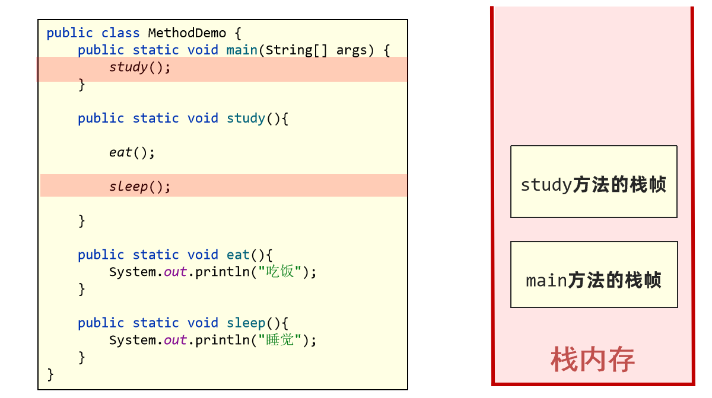

然后调用sleep方法，创建sleep方法栈帧


最后study方法结束之后弹出栈帧，main方法结束之后弹出main的栈帧。

在IDEA中也可以看到对应的栈帧：

```Java
package chapter03.frame;

/**
 * 栈帧测试1
 */
public class FrameDemo {
    public static void main(String[] args) {
        A();
    }

    public static void A() {
        System.out.println("A执行了...");
        B();
    }

    public static void B() {
        System.out.println("B执行了...");
        C();
    }

    public static void C() {
        System.out.println("C执行了...");
        throw new RuntimeException("测试");
    }
}
```

打上断点debug之后会出现栈帧内容：

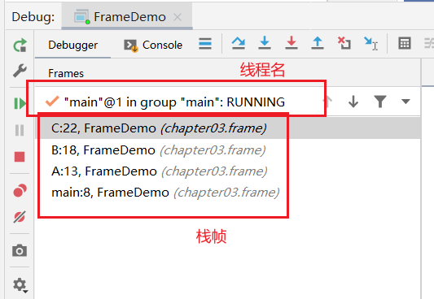

Java虚拟机栈随着线程的创建而创建，而回收则会在线程的销毁时进行。由于方法可能会在不同线程中执行，每个线程都会包含一个自己的虚拟机栈。如下就有两个线程的虚拟机栈，main线程和线程A。


Java虚拟机栈的栈帧中主要包含三方面的内容：

- 局部变量表，局部变量表的作用是在运行过程中存放所有的局部变量
- 操作数栈，操作数栈是栈帧中虚拟机在执行指令过程中用来存放临时数据的一块区域
- 帧数据，帧数据主要包含动态链接、方法出口、异常表的引用

#### 局部变量表

局部变量表的作用是在方法执行过程中存放所有的局部变量。局部变量表分为两种，一种是字节码文件中的，另外一种是栈帧中的也就是保存在内存中。栈帧中的局部变量表是根据字节码文件中的内容生成的。

我们先来看下字节码文件中的局部变量表：编译成字节码文件时就可以确定局部变量表的内容。

```Java
public static void test1(){
    int i = 0;
    long j = 1;
}
```

test1方法的局部变量表如下：

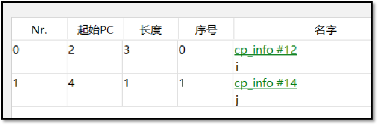

局部变量表中保存了字节码指令生效的偏移量：


比如`i`这个变量，它的起始PC是2，代表从`lconst_1`这句指令开始才能使用`i`，长度为3，也就是2-4这三句指令都可以使用`i`。为什么从2才能使用，因为0和1这两句字节码指令还在处理`int i = 0`这句赋值语句。`j`这个变量只有等3指令执行完之后也就是`long j = 1`代码执行完之后才能使用，所以起始PC为4，只能在4这行字节码指令中使用。

接下来看下栈帧中的局部变量表，栈帧中的局部变量表是一个数组，数组中每一个位置称之为槽(slot) ，long和double类型占用两个槽，其他类型占用一个槽。


`i`占用数组下标为0的位置，`j`占用数组下标1-2的位置。

刚才看到的是静态方法，实例方法中的序号为0的位置存放的是this，指的是当前调用方法的对象，运行时会在内存中存放实例对象的地址。


方法参数也会保存在局部变量表中，其顺序与方法中参数定义的顺序一致。局部变量表保存的内容有：实例方法的this对象，方法的参数，方法体中声明的局部变量。


test3方法中包含两个参数`k`,`m`，这两个参数也会被加入到局部变量表中。

**以下代码的局部变量表中会占用几个槽？**

```Java
public void test4(int k,int m){
    {
        int a = 1;
        int b = 2;
    }
    {
        int c = 1;
    }
    int i = 0;
    long j = 1;
}
```

为了节省空间，局部变量表中的槽是可以复用的，一旦某个局部变量不再生效，当前槽就可以再次被使用。

1、方法执行时，实例对象`this`、`k`、`m` 会被放入局部变量表中，占用3个槽


2、将1的值放入局部变量表下标为3的位置上，相当于给a进行赋值。

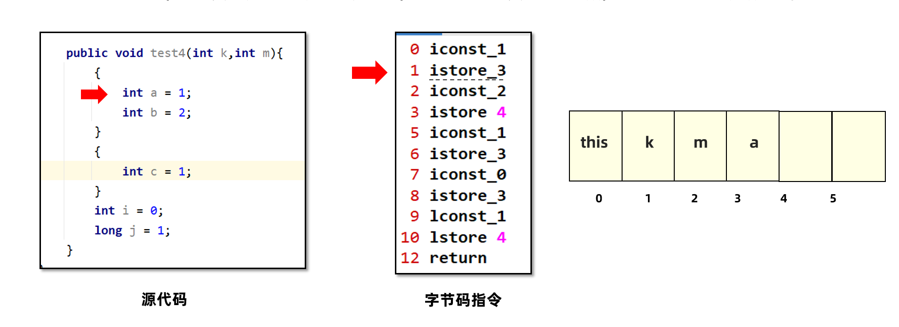

3、将2放入局部变量表下标为4的位置，给b赋值为2。


4、ab已经脱离了生效范围，所以下标为3和4的这两个位置可以复用。此时c的值1就可以放入下标为3的位置。

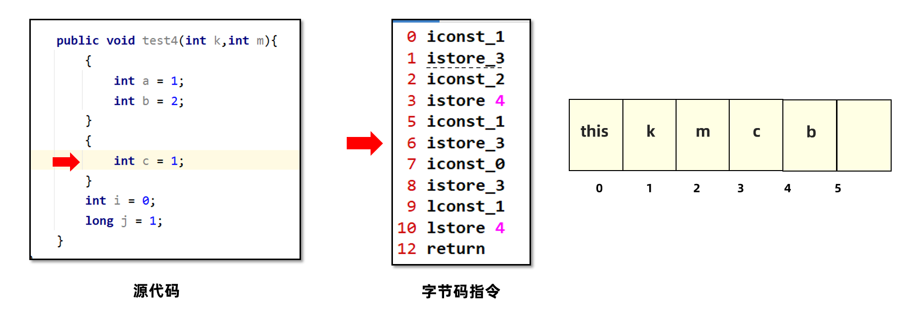

4、脱离c的生效范围之后，给i赋值就可以复用c的位置。


5、最后放入j，j是一个long类型，占用两个槽。但是可以复用b所在的位置，所以占用4和5这两个位置


所以，局部变量表数值的长度为6。这一点在编译期间就可以确定了，运行过程中只需要在栈帧中创建长度为6的数组即可。


#### 操作数栈

操作数栈是栈帧中虚拟机在执行指令过程中用来存放中间数据的一块区域。他是一种栈式的数据结构，如果一条指令将一个值压入操作数栈，则后面的指令可以弹出并使用该值。

在编译期就可以确定操作数栈的最大深度，从而在执行时正确的分配内存大小。


比如之前的相加案例中，操作数栈最大的深入会出现在这个时刻：


所以操作数栈的深度会定义为2。

#### 帧数据

帧数据主要包含动态链接、方法出口、异常表的引用。

##### 动态链接

当前类的字节码指令引用了其他类的属性或者方法时，需要将符号引用（编号）转换成对应的运行时常量池中的内存地址。动态链接就保存了编号到运行时常量池的内存地址的映射关系。


##### 方法出口

方法出口指的是方法在正确或者异常结束时，当前栈帧会被弹出，同时程序计数器应该指向上一个栈帧中的下一条指令的地址。所以在当前栈帧中，需要存储此方法出口的地址。


##### 异常表

异常表存放的是代码中异常的处理信息，包含了异常捕获的生效范围以及异常发生后跳转到的字节码指令位置。

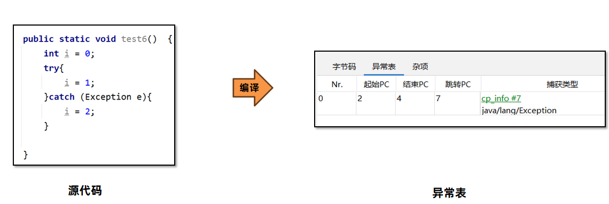

`如下案例：i=1`这行源代码编译成字节码指令之后，会包含偏移量2-4这三行指令。其中2-3是对i进行赋值1的操作，4的没有异常就跳转到10方法结束。如果出现异常的情况下，继续执行到7这行指令，7会将异常对象放入操作数栈中，这样在catch代码块中就可以使用异常对象了。接下来执行8-9，对i进行赋值为2的操作。

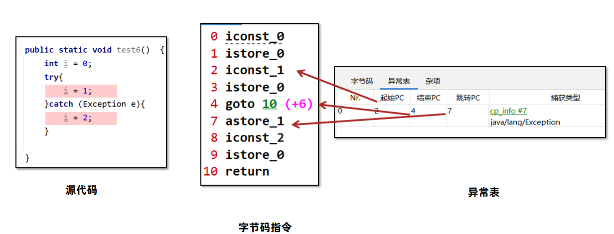

所以异常表中，异常捕获的起始偏移量就是2，结束偏移量是4，在2-4执行过程中抛出了`java.lang.Exception`对象或者子类对象，就会将其捕获，然后跳转到偏移量为7的指令。

#### 栈内存溢出

Java虚拟机栈如果栈帧过多，占用内存超过栈内存可以分配的最大大小就会出现内存溢出。Java虚拟机栈内存溢出时会出现StackOverflowError的错误。


如果我们不指定栈的大小，JVM 将创建一个具有默认大小的栈。大小取决于操作系统和计算机的体系结构。


我们来模拟下栈内存的溢出情况:

```Java
public static int count = 0;
     //递归方法调用自己
     public static void recursion(){
         System.out.println(++count);
         recursion();
     }
```

使用递归让方法调用自身，但是不设置退出条件。定义调用次数的变量，每一次调用让变量加1。查看错误发生时总调用的次数。


执行之后可以打印出溢出时总栈帧的数量，并且发现虚拟机已经抛出了StackOverflow的错误。

要修改Java虚拟机栈的大小，可以使用虚拟机参数 -Xss 。

- 语法：-Xss栈大小
- 单位：字节（默认，必须是 1024 的倍数）、k或者K(KB)、m或者M(MB)、g或者G(GB)

例如：

```Java
-Xss1048576 
-Xss1024K      
-Xss1m
-Xss1g
```

操作步骤如下，不同IDEA版本的设置方式会略有不同：

1、点击修改配置Modify options

2、点击Add VM options

3、添加参数


调成512k之后，明显发现最大栈帧数量减少了：


**注意事项：**

1、与-Xss类似，也可以使用 -XX:ThreadStackSize 调整标志来配置堆栈大小。

格式为： `-XX:ThreadStackSize=1024`

2、HotSpot JVM对栈大小的最大值和最小值有要求：

​      比如测试如下两个参数，会直接报错:

```
-Xss1k
-Xss1025m
```

Windows（64位）下的JDK8测试最小值为`180k`，最大值为`1024m`。

3、局部变量过多、操作数栈深度过大也会影响栈内存的大小。我们在这段代码中添加一些局部变量。

```Java
//递归方法调用自己
public static void recursion() {
    long a,b,c,d,f,g,h,i,j,k;
    System.out.println(++count);
    recursion();
}
```

使用默认大小来测试之后，发现栈帧数量从10000+减少了到8000+


一般情况下，工作中即便使用了递归进行操作，栈的深度最多也只能到几百,不会出现栈的溢出。所以此参数可以手动指定为-Xss256k节省内存。

### 本地方法栈

Java虚拟机栈存储了Java方法调用时的栈帧，而本地方法栈存储的是native本地方法的栈帧。

在Hotspot虚拟机中，Java虚拟机栈和本地方法栈实现上使用了同一个栈空间。本地方法栈会在栈内存上生成一个栈帧，临时保存方法的参数同时方便出现异常时也把本地方法的栈信息打印出来。


比如测试下这段代码：

```Java
/**
 * 本地方法栈
 */
public class NativeDemo1 {
    public static void main(String[] args) {
        try {
            FileOutputStream fileOutputStream = new FileOutputStream("E:\\123.txt");
            fileOutputStream.write(1);
        } catch (FileNotFoundException e) {
            e.printStackTrace();
        } catch (IOException e) {
            e.printStackTrace();
        }
    }
}
```

执行之后发生异常，会打印出所有栈帧的名字：

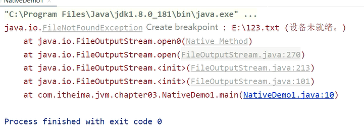

`open0`是一个本地方法，所以创建了本地方法的栈帧。本地方法和Java虚拟机方法的栈帧在一个栈上。

### 堆内存

一般Java程序中堆内存是空间最大的一块内存区域。创建出来的对象都存在于堆上。栈上的局部变量表中，可以存放堆上对象的引用。静态变量也可以存放堆对象的引用，通过静态变量就可以实现对象在线程之间共享。

```Java
public class Test {    
    public static void main(String[] args) {        
        Student s1 = new Student();        
        s1.name = "张三";       
        s1.age = 18;       
        s1.id = 1;
        s1.printTotalScore();        
        s1.printAverageScore();        
        
        Student s2 = new Student();       
        s2.name = "李四";        
        s2.age = 19;        
        s2.id= 2;        
        s2.printTotalScore();        
        s2.printAverageScore();    
    }
}
```

这段代码中通过`new`关键字创建了两个`Student`类的对象，这两个对象会被存放在堆上。在栈上通过`s1`和`s2`两个局部变量保存堆上两个对象的地址，从而实现了引用关系的建立。


#### 堆内存的溢出

通过new关键字不停创建对象，放入集合中，模拟堆内存的溢出，观察堆溢出之后的异常信息。

```Java
package chapter03.heap;

import java.io.IOException;
import java.util.ArrayList;

/**
 * 堆内存的使用和回收
 */
public class Demo1 {
    public static void main(String[] args) throws InterruptedException, IOException {

        ArrayList<Object> objects = new ArrayList<Object>();
        System.in.read();
        while (true){
            objects.add(new byte[1024 * 1024 * 100]);
            Thread.sleep(1000);
        }


    }
}
```

堆内存大小是有上限的，当对象一直向堆中放入对象达到上限之后，就会抛出OutOfMemory错误。在这段代码中，不停创建100M大小的字节数组并放入ArrayList集合中，最终超过了堆内存的上限。抛出如下错误：


#### 三个重要的值

堆空间有三个需要关注的值，used、total、max。used指的是当前已使用的堆内存，total是java虚拟机已经分配的可用堆内存，max是java虚拟机可以分配的最大堆内存。


堆内存used total max三个值可以通过dashboard命令看到。

> 手动指定刷新频率（不指定默认5秒一次）：`dashboard –i  刷新频率(毫秒)`


随着堆中的对象增多，当total可以使用的内存即将不足时，java虚拟机会继续分配内存给堆。


此时used达到了total的大小，Java虚拟机会向操作系统申请更大的内存。


但是这个申请过程不是无限的，total最多只能与max相等。


那么是不是当used = max = total的时候，堆内存就溢出了呢？

不是，堆内存溢出的判断条件比较复杂，在下一章《垃圾回收器》中会详细介绍。

如果不设置任何的虚拟机参数，max默认是系统内存的1/4，total默认是系统内存的1/64。在实际应用中一般都需要设置total和max的值。 Oracle官方文档：https://docs.oracle.com/javase/8/docs/technotes/tools/unix/java.html

#### 设置堆的大小

要修改堆的大小，可以使用虚拟机参数 –Xmx（max最大值）和-Xms (初始的total)。

语法：`-Xmx值 -Xms值`

单位：字节（默认，必须是 1024 的倍数）、k或者K(KB)、m或者M(MB)、g或者G(GB)

限制：Xmx必须大于 2 MB，Xms必须大于1MB

```Java
-Xms6291456
-Xms6144k
-Xms6m
-Xmx83886080
-Xmx81920k
-Xmx80m
```

这样可以将max和初始的total都设置为4g，在启动后就已经获得了最大的堆内存大小。运行过程中不需要向操作系统申请。

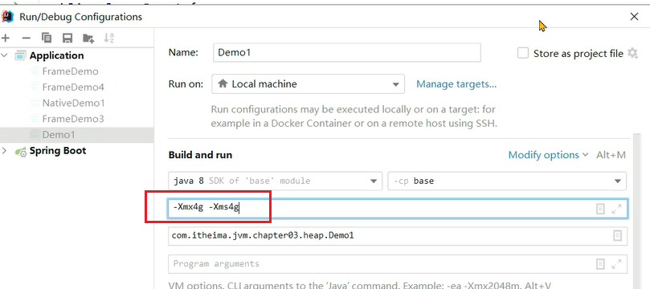

使用`arthas`的`memory`命令同样可以看到：


为什么arthas中显示的heap堆大小与设置的值不一样呢？

arthas中的heap堆内存使用了JMX技术中内存获取方式，这种方式与垃圾回收器有关，计算的是可以分配对象的内存，而不是整个内存。

**建议：**

Java服务端程序开发时，建议将-Xmx和-Xms设置为相同的值，这样在程序启动之后可使用的总内存就是最大内存，而无需向java虚拟机再次申请，减少了申请并分配内存时间上的开销，同时也不会出现内存过剩之后堆收缩的情况。-Xmx具体设置的值与实际的应用程序运行环境有关，在《实战篇》中会给出设置方案。

### 方法区

方法区是存放基础信息的位置，线程共享，主要包含三部分内容：

- 类的元信息，保存了所有类的基本信息
- 运行时常量池，保存了字节码文件中的常量池内容
- 字符串常量池，保存了字符串常量

#### 类的元信息

方法区是用来存储每个类的基本信息（元信息），一般称之为InstanceKlass对象。在类的加载阶段完成。其中就包含了类的字段、方法等字节码文件中的内容，同时还保存了运行过程中需要使用的虚方法表（实现多态的基础）等信息。


#### 运行时常量池

方法区除了存储类的元信息之外，还存放了运行时常量池。常量池中存放的是字节码中的常量池内容。

字节码文件中通过编号查表的方式找到常量，这种常量池称为静态常量池。当常量池加载到内存中之后，可以通过内存地址快速的定位到常量池中的内容，这种常量池称为运行时常量池。


#### 方法区的实现

方法区是《Java虚拟机规范》中设计的虚拟概念，每款Java虚拟机在实现上都各不相同。Hotspot设计如下：

JDK7及之前的版本将方法区存放在堆区域中的永久代空间，堆的大小由虚拟机参数来控制。

JDK8及之后的版本将方法区存放在元空间中，元空间位于操作系统维护的直接内存中，默认情况下只要不超过操作系统承受的上限，可以一直分配。


可以通过arthas的`memory`命令看到方法区的名称以及大小：

- JDK7及之前的版本查看ps_perm_gen属性。


- JDK8及之后的版本查看metaspace属性。


#### 方法区的溢出

通过ByteBuddy框架，动态创建类并将字节码数据加载到内存中。通过死循环不停地加载到方法区，观察方法区是否会出现内存溢出的情况。分别在JDK7和JDK8上运行上述代码。

ByteBuddy是一个基于Java的开源库，用于生成和操作Java字节码。

1.引入依赖

```XML
<dependency>
    <groupId>net.bytebuddy</groupId>
    <artifactId>byte-buddy</artifactId>
    <version>1.12.23</version>
 </dependency>
```

2.创建ClassWriter对象

```Java
 ClassWriter classWriter = new ClassWriter(0);
```

3.调用visit方法，创建字节码数据。

```Java
classWriter.visit(Opcodes.V1_7,Opcodes.ACC_PUBLIC,name,null ,"java/lang/Object",null);
byte[] bytes = classWriter.toByteArray();
```

代码：

```Java
package chapter03.methodarea;

import net.bytebuddy.jar.asm.ClassWriter;
import net.bytebuddy.jar.asm.Opcodes;

import java.io.IOException;

/**
 * 方法区的溢出测试
 */
public class Demo1 extends ClassLoader {
    public static void main(String[] args) throws IOException {
        System.in.read();
        Demo1 demo1 = new Demo1();
        int count = 0;
        while (true) {
            String name = "Class" + count;
            ClassWriter classWriter = new ClassWriter(0);
            classWriter.visit(Opcodes.V1_8, Opcodes.ACC_PUBLIC, name, null
                    , "java/lang/Object", null);
            byte[] bytes = classWriter.toByteArray();
            demo1.defineClass(name, bytes, 0, bytes.length);
            System.out.println(++count);
        }
    }
}
```

实验发现，JDK7上运行大概十几万次，就出现了错误。


在JDK8上运行百万次，程序都没有出现任何错误，但是内存会直线升高。这说明JDK7和JDK8在方法区的存放上，采用了不同的设计。

- JDK7将方法区存放在堆区域中的永久代空间，堆的大小由虚拟机参数-XX:MaxPermSize=值来控制。
- JDK8将方法区存放在元空间中，元空间位于操作系统维护的直接内存中，默认情况下只要不超过操作系统承受的上限，可以一直分配。可以使用-XX:MaxMetaspaceSize=值将元空间最大大小进行限制。

在JDK8中将最大元空间内存设置为256m，再次测试


这次就出现了MetaSpace溢出的错误：


#### 字符串常量池

方法区中除了类的元信息、运行时常量池之外，还有一块区域叫字符串常量池(StringTable)。

字符串常量池存储在代码中定义的常量字符串内容。比如“123” 这个123就会被放入字符串常量池。

如下代码执行时，代码中包含`abc`字符串，就会被直接放入字符串常量池。在堆上创建String对象，并通过局部变量s1引用堆上的对象。

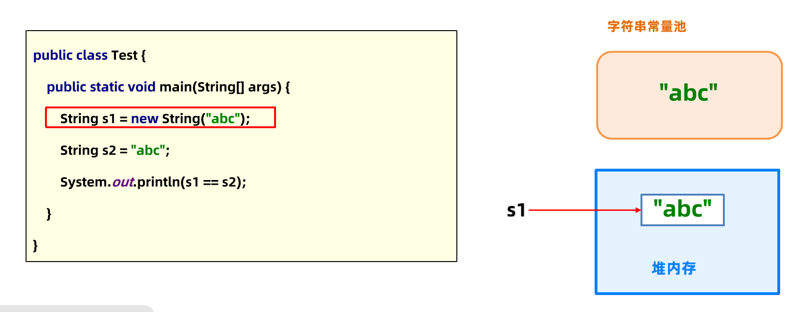

接下来通过s2局部变量引用字符串常量池的`abc`。


所以s1和s2指向的不是同一个对象，打印出`false`。

##### 字符串常量池和运行时常量池有什么关系？

早期设计时，字符串常量池是属于运行时常量池的一部分，他们存储的位置也是一致的。后续做出了调整，将字符串常量池和运行时常量池做了拆分。


##### StringTable的练习题1：

```Java
/**
 * 字符串常量池案例
 */
public class Demo2 {
    public static void main(String[] args) {
        String a = "1";
        String b = "2";
        String c = "12";
        String d = a + b;
        System.out.println(c == d);
    }
}
```

1、首先将`1`放入字符串常量池，通过局部变量a引用字符串常量池中的`1`字符串。


2、同理处理b和c：


3、将a和b指向的字符串进行连接，本质上就是使用StringBuilder进行连接，最后创建了一个新的字符串放入堆中。然后将局部变量d指向堆上的对象。


4、所以c和d指向的不是同一个对象，打印出的结果就是false。

##### StringTable的练习题2：

```Java
package chapter03.stringtable;

/**
 * 字符串常量池案例
 */
public class Demo3 {
    public static void main(String[] args) {
        String a = "1";
        String b = "2";
        String c = "12";
        String d = "1" + "2";
        System.out.println(c == d);
    }
}
```

编译之后的字节码指令如下：

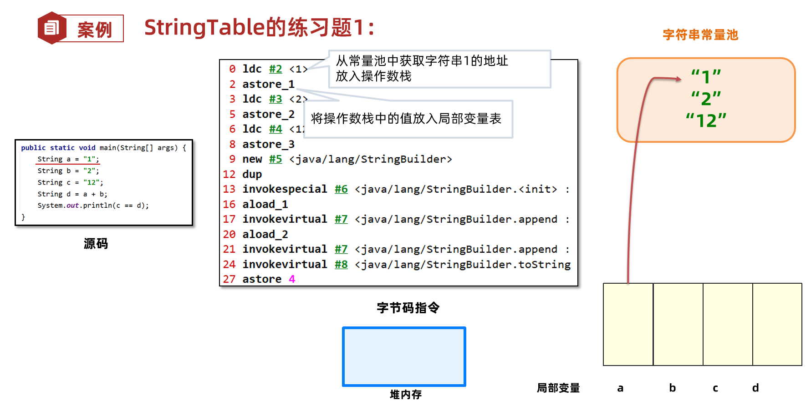

说明在编译阶段，已经将1和2进行连接，最终生成12的字符串常量池中的结果。所以返回结果就是true，c和d都指向字符串常量池中的对象。

总结一下：

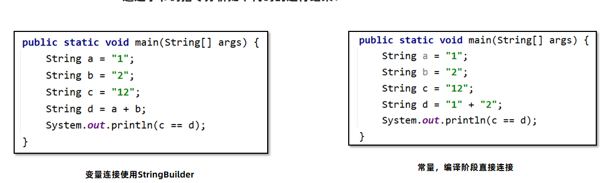

##### 神奇的intern

String.intern()方法是可以手动将字符串放入字符串常量池中，分别在JDK6 JDK8下执行代码，JDK6 中结果是false false ，JDK8中是true false

```Java
package chapter03.stringtable;

/**
 * intern案例
 */
public class Demo4 {
    public static void main(String[] args) {
        String s1 = new StringBuilder().append("think").append("123").toString();

        System.out.println(s1.intern() == s1);
//        System.out.println(s1.intern() == s1.intern());

        String s2 = new StringBuilder().append("ja").append("va").toString();

        System.out.println(s2.intern() == s2);
    }
}
```

先来分析JDK6中，代码执行步骤如下：

1、使用StringBuilder的将`think`和`123`拼接成`think123`，转换成字符串，在堆上创建一个字符串对象。局部变量`s1`指向堆上的对象。

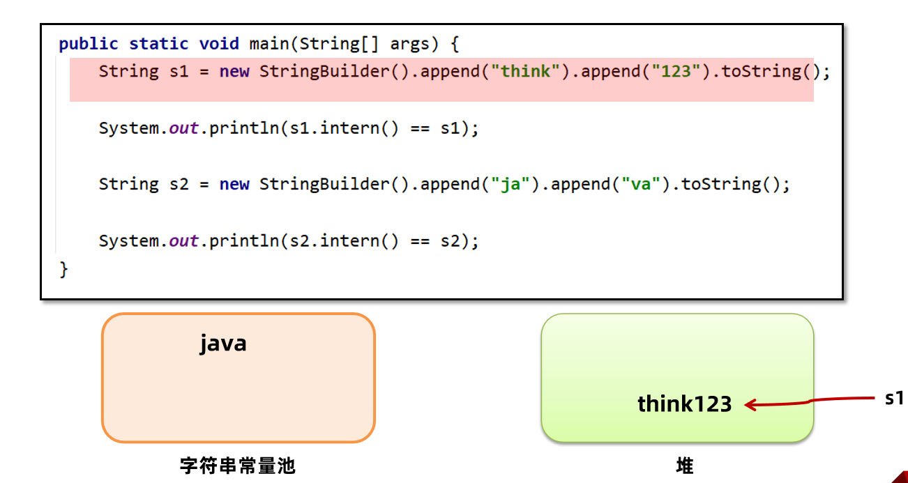

2、调用s1.intern方法，会在字符串常量池中创建think123的对象，最后将对象引用返回。所以s1.intern和s1指向的不是同一个对象。打印出false。


3、同理，通过StringBuilder在堆上创建java字符串对象。这里注意字符串常量池中本来就有一个java字符串对象，这是java虚拟机自身使用的所以启动时就会创建出来。


4、调用s2.intern发现字符串常量池中已经有java字符串对象了，就将引用返回。所以s2.intern指向的是字符串常量池中的对象，而s2指向的是堆中的对象。打印结果为false。


接下来分析JDK7中，JDK7及之后版本中由于字符串常量池在堆上，所以intern () 方法会把第一次遇到的字符串的引用放入字符串常量池。

代码执行步骤如下：

1、执行第二句代码时，由于字符串常量池中没有think123的字符串，所以直接创建一个引用，指向堆中的think123对象。所以s1.intern和s1指向的都是堆上的对象，打印结果为true。


2、s2.intern方法调用时，字符串常量池中已经有java字符串了，所以将引用返回。这样打印出来的结果就是false。


> 后续JDK版本中，如果Java虚拟机不需要使用java字符串，那么字符串常量池中就不会存放`java`。打印结果有可能会出现两个true。

####  面试题：静态变量存储在哪里呢？

- JDK6及之前的版本中，静态变量是存放在方法区中的，也就是永久代。
- JDK7及之后的版本中，静态变量是存放在堆中的Class对象中，脱离了永久代。具体源码可参考虚拟机源码：BytecodeInterpreter针对putstatic指令的处理。

### 直接内存

直接内存（Direct Memory）并不在《Java虚拟机规范》中存在，所以并不属于Java运行时的内存区域。

在 JDK 1.4 中引入了 NIO 机制，使用了直接内存，主要为了解决以下两个问题:

1、Java堆中的对象如果不再使用要回收，回收时会影响对象的创建和使用。

2、IO操作比如读文件，需要先把文件读入直接内存（缓冲区）再把数据复制到Java堆中。

现在直接放入直接内存即可，同时Java堆上维护直接内存的引用，减少了数据复制的开销。写文件也是类似的思路。

使用堆创建对象的过程：


使用直接内存创建对象的过程，不需要进行复制对象，数据直接存放在直接内存中：


#### 使用方法：

要创建直接内存上的数据，可以使用`ByteBuffer`。

语法： `ByteBuffer directBuffer = ByteBuffer.allocateDirect(size);`

注意事项： arthas的memory命令可以查看直接内存大小，属性名direct。


代码：

```Java
package chapter03.direct;

import java.io.IOException;
import java.nio.ByteBuffer;
import java.util.ArrayList;
import java.util.List;

/**
 * 直接内存的使用和回收
 */
public class Demo1 {
    public static int size = 1024 * 1024 * 100; //100mb
    public static List<ByteBuffer> list = new ArrayList<ByteBuffer>();
    public static int count = 0;

    public static void main(String[] args) throws IOException, InterruptedException {
        System.in.read();
        while (true) {
            //1.创建DirectByteBuffer对象并返回
            //2.在DirectByteBuffer构造方法中，向操作系统申请直接内存空间
            ByteBuffer directBuffer = ByteBuffer.allocateDirect(size);
            //directBuffer = null;

            list.add(directBuffer);
            System.out.println(++count);
            Thread.sleep(5000);
        }

    }
}
```

运行之后，用arthas监控发现，每隔5秒直接内存会增长100M：


如果将`Thread.`*`sleep`*`(5000);`注释掉，让直接内存快速大量分配。操作系统内存不足时就会报错：

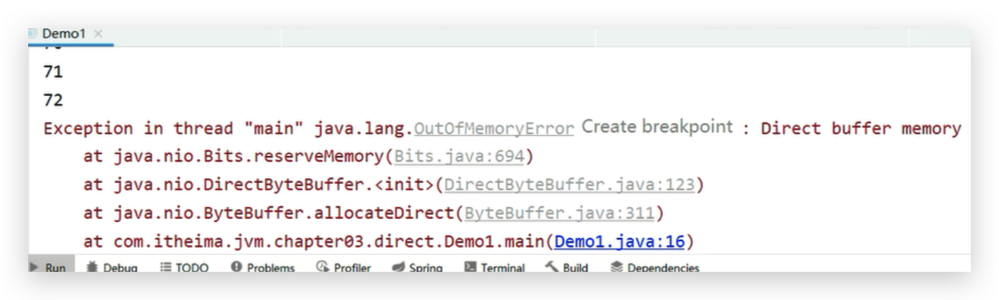

但是工作中服务器上有可能部署了其他应用，为了避免将内存耗尽，需要设置直接内存的最大值。如果需要手动调整直接内存的大小，可以使用`XX:MaxDirectMemorySize=大小`

单位k或K表示千字节，m或M表示兆字节，g或G表示千兆字节。默认不设置该参数情况下，JVM 自动选择 最大分配的大小。

以下示例以不同的单位说明如何将 直接内存大小设置为 1024 KB：

```Java
-XX:MaxDirectMemorySize=1m
-XX:MaxDirectMemorySize=1024k
-XX:MaxDirectMemorySize=1048576
```

在Idea中设置直接内存最大值为1g：


直接循环11次之后，超过最大值就会报错：

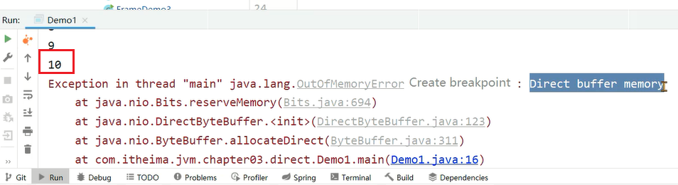


