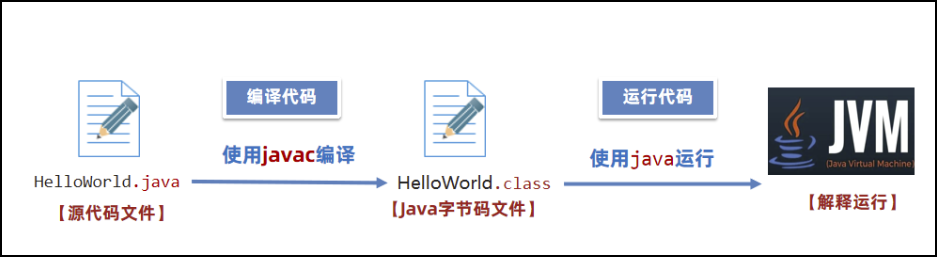
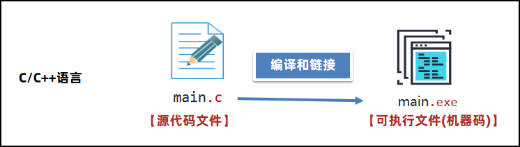
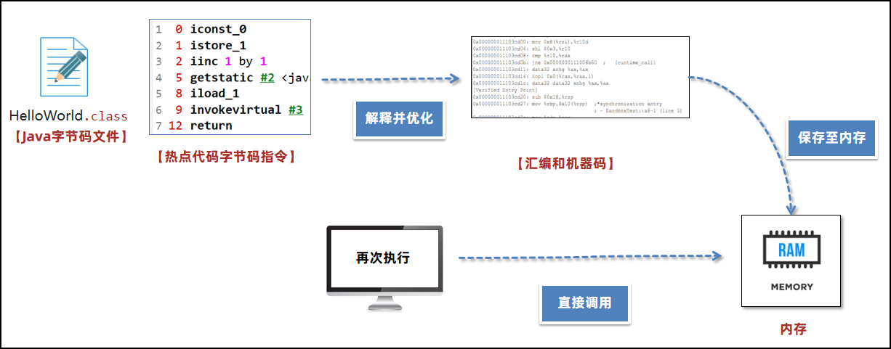

[[toc]]

JVM入门
----------

### 什么是JVM

JVM 全称是 `Java Virtual Machine`，中文译名 Java 虚拟机。JVM 本质上是一个运行在计算机上的程序，他的职责是运行Java字节码文件。

Java源代码执行流程如下：

分为三个步骤：

- 编写 Java 源代码文件。
- 使用 Java 编译器（javac命令）将源代码编译成 Java 字节码文件。
- 使用 Java 虚拟机加载并运行Java 字节码文件，此时会启动一个新的进程。

 

### JVM的功能

> 💡 思考：JVM主要实现了哪些功能

 

#### 解释和运行

对字节码文件中的指令，实时的解释成机器码，让计算机执行。

字节码文件中包含了字节码指令，计算器无法直接执行，Java虚拟机会将字节码文件中的字节码指令实时地解释成机器码，机器码是计算机可以运行的指令。

 

#### 内存管理

- 自动为对象、方法等分配内存
- 自动的垃圾回收机制，回收不再使用的对象

Java虚拟机会帮助程序员为对象分配内存，同时将不用的对象使用垃圾回收器回收掉，这是对比C和C++这些语言的一个优势。在C/C++语言中，对象的回收需要程序员手动去编写代码完成，如果遗漏了这段删除对象的代码，这个对象就会永远占用内存空间，不会再回收。所以JVM的这个功能降低了程序员编写代码的难度。

 

#### 即时编译

对热点代码进行优化，提升执行效率。即时编译可以说是提升Java程序性能最核心的手段。

 

> 思考：为什么 Java 性能低

Java 语言如果不做任何的优化，性能其实是不如 `C/C++` 语言的。主要原因是：

在程序运行过程中，Java 虚拟机需要将字节码指令实时地解释成计算机能识别的机器码，这个过程在运行时可能会反复地执行，所以效率较低。

`C/C++` 语言在执行过程中，只需要将源代码编译成可执行文件，就包含了计算机能识别的机器码，无需在运行过程中再实时地解释，所以性能较高。

Java 为什么要选择一条执行效率比较低的方式呢？主要是为了实现跨平台的特性。Java 的字节码指令，如果希望在不同平台（操作系统+硬件架构），比如在 Windows 或者 Linux上运行。可以使用同一份字节码指令，交给 Windows 和 Linux 上的 Java 虚拟机进行解释，这样就可以获得不同平台上的机器码了。这样就实现了 `Write Once,Run Anywhere` 编写一次，到处运行的目标。

但是 `C/C++` 语言，如果要让程序在不同平台上运行，就需要将一份源代码在不同平台上分别进行编译，相对来说比较麻烦。

再回到即时编译，在 `JDK1.1` 的版本中就推出了即时编译去优化对应的性能。

虚拟机在运行过程中如果发现某一个方法甚至是循环是热点代码（被非常高频调用），即时编译器会优化这段代码并将优化后的机器码保存在内存中，如果第二次再去执行这段代码。Java 虚拟机会将机器码从内存中取出来直接进行调用。这样节省了一次解释的步骤，同时执行的是优化后的代码，效率较高。

Java 通过即时编译器获得了接近 `C/C++` 语言的性能，在某些特定的场景下甚至可以实现超越。

### 常见的JVM

#### Java虚拟机规范

- 《Java虚拟机规范》由Oracle制定，内容主要包含了Java虚拟机在设计和实现时需要遵守的规范，主要包含class字节码文件的定义、类和接口的加载和初始化、指令集等内容。
- 《Java虚拟机规范》是对虚拟机设计的要求，而不是对Java设计的要求，也就是说虚拟机可以运行在其他的语言比如Groovy、Scala生成的class字节码文件之上。
- 官网地址：https://docs.oracle.com/javase/specs/index.html

[eclipse-openj9/openj9: Eclipse OpenJ9: A Java Virtual Machine for OpenJDK that's optimized for small footprint, fast start-up, and high throughput. Builds on Eclipse OMR (https://github.com/eclipse/omr) and combines with the Extensions for OpenJDK for OpenJ9 repo.]()

#### Java虚拟机规范

平时我们最常用的，就是Hotspot虚拟机。

| 名称                                                         | 作者    | 支持版本                  | Github Star | 特性                                                         | 适用场景                             |
| ------------------------------------------------------------ | ------- | ------------------------- | ----------- | ------------------------------------------------------------ | ------------------------------------ |
| HotSpot (Oracle JDK版)                                       | Oracle  | 所有版本                  | 高(闭源)    | 使用最广泛，稳定可靠，社区活跃JIT支持Oracle JDK默认虚拟机    | 默认                                 |
| [HotSpot (Open JDK版)](https://github.com/openjdk/jdk)       | Oracle  | 所有版本                  | 中(16.1k)   | 同上开源，Open JDK默认虚拟机                                 | 默认对JDK有二次开发需求              |
| [GrallVM](https://github.com/oracle/graal)                   | Oracle  | 11, 17,19企业版支持8      | 高（18.7k） | 多语言支持高性能、JIT、AOT支持                               | 微服务、云原生架构需要多语言混合编程 |
| [Dragonwell JDK龙井](https://github.com/dragonwell-project/dragonwell8) | Alibaba | 标准版 8,11,17扩展版11,17 | 低(3.9k)    | 基于OpenJDK的增强高性能、bug修复、安全性提升JWarmup、ElasticHeap、Wisp特性支持 | 电商、物流、金融领域对性能要求比较高 |
| [Eclipse OpenJ9 (原 IBM J9)](https://github.com/eclipse-openj9/openj9) | IBM     | 8,11,17,19,20             | 低(3.1k)    | 高性能、可扩展JIT、AOT特性支持                               | 微服务、云原生架构                   |

 

#### HotSpot的发展历程

**初出茅庐 - 1999年4月**  

源自 1997 年收购的 SmallTalk 语言的虚拟机，HotSpot 虚拟机初次在 JDK 中使用。在JDK1.2中作为附加功能存在，

JDK1.3之后作为默认的虚拟机。

 

**野蛮生长 - 2006年12月**

JDK6 发布，并在虚拟机层面做了大量的优化，这些优化对后续虚拟机的发展产生了深远的影响。

 

**稳步前进 - 2009-2013**

JDK7 中首次推出了G1垃圾收集器。收购了 Sun 公司之后，吸纳了 JRockIt 虚拟机的一些设计思想，JDK8 中引入了 JMC 等工具，去除了永久代。

 

**百家争鸣 - 2018-2019**

JDK11 优化了 G1 垃圾收集器的性能,同时推出了 ZGC 新一代的垃圾回收器，JDK12 推出 Shenan-doah 垃圾回收器。

 

**拥抱云原生 - 2019-至今**

以 Hotspot 为基础的 GraalVM 虚拟机诞生，不仅让解决了单体应用中多语言整合的难题，同时也提升了这些语言运行时的效率。极高的性能、极快的启动速度也更适用于当下的云原生架构。
