[[toc]]

GraalVM
-------

### 什么是GraalVM

GraalVM是Oracle官方推出的一款高性能JDK，使用它享受比OpenJDK或者OracleJDK更好的性能。 GraalVM的官方网址：https://www.graalvm.org/ 官方标语：Build faster, smaller, leaner applications。 更低的CPU、内存使用率

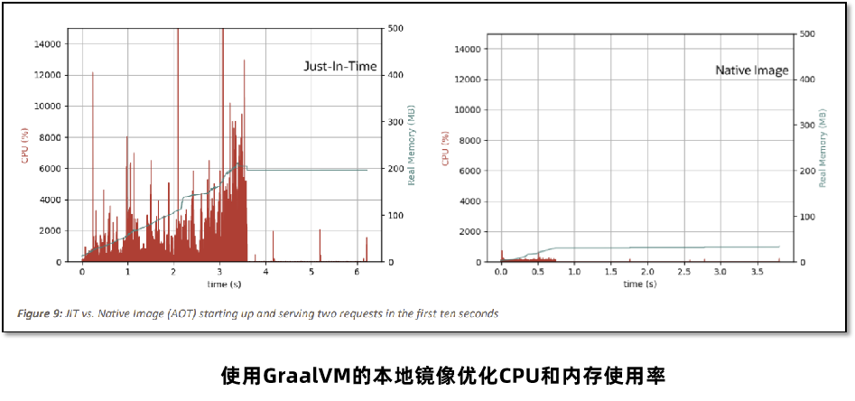

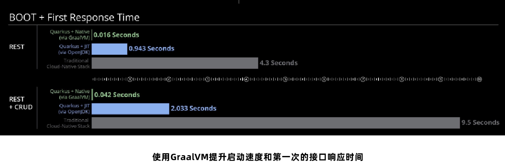

官方标语：Build faster, smaller, leaner applications。

- 更低的CPU、内存使用率
- 更快的启动速度，无需预热即可获得最好的性能
- 更好的安全性、更小的可执行文件
- 支持多种框架Spring Boot、Micronaut、Helidon 和 Quarkus。
- 多家云平台支持。
- 通过Truffle框架运行JS、Python、Ruby等其他语言。

GraalVM分为社区版（Community Edition）和企业版（Enterprise Edition）。企业版相比较社区版，在性能上有更多的优化。

| 特性                                  | 描述                                             | 社区版 | 企业版 |
| ------------------------------------- | ------------------------------------------------ | ------ | ------ |
| 收费                                  | 是否收费                                         | 免费   | 收费   |
| G1**垃圾回收器**                      | 使用**G1垃圾回收器优化垃圾回收性能**             | ×      | √      |
| Profile Guided**Optimization（PGO）** | 运行过程中收集动态数据，进一步优化本地镜像的性能 | ×      | √      |
| 高级优化特性                          | 更多优化技术，降低内存和垃圾回收的开销           | ×      | √      |
| 高级优化参数                          | 更多的高级优化参数可以设置                       | ×      | √      |

需求： 搭建Linux下的GraalVM社区版本环境。 步骤： 1、使用arch查看Linux架构

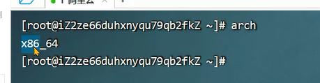

2、根据架构下载社区版的GraalVM：https://www.graalvm.org/downloads/

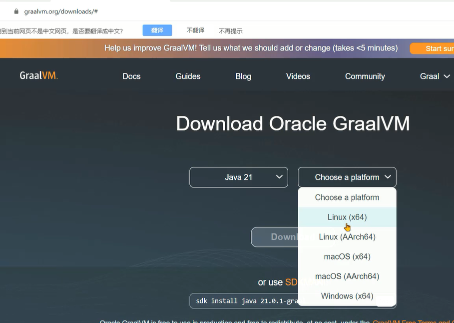

3、安装GraalVM，安装方式与安装JDK相同 解压文件：

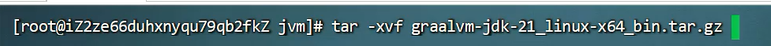

设置环境变量:

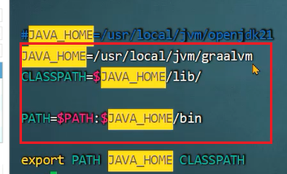

4、使用java -version和HelloWorld测试GraalVM。

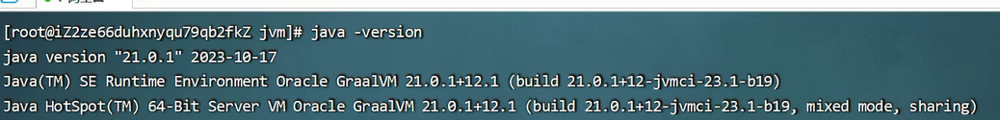

### GraalVM的两种模式

- JIT（ Just-In-Time ）模式 ，即时编译模式
- AOT（Ahead-Of-Time）模式 ，提前编译模式

JIT模式的处理方式与Oracle JDK类似，满足两个特点：

Write Once,Run Anywhere -> 一次编写，到处运行。

预热之后，通过内置的Graal即时编译器优化热点代码，生成比Hotspot JIT更高性能的机器码。

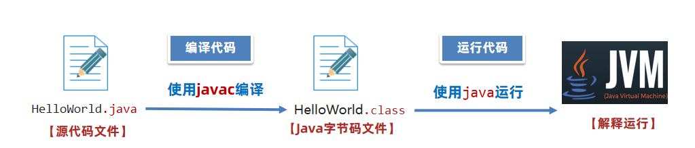

需求：

分别在JDK8 、 JDK21 、 GraalVM 21 Graal即时编译器、GraalVM 21 不开启Graal即时编译器运行Jmh性能测试用例，对比其性能。

步骤：

1、在代码文件夹中找到GraalVM的案例代码，将java-simple-stream-benchmark文件夹下的代码使用maven打包成jar包。

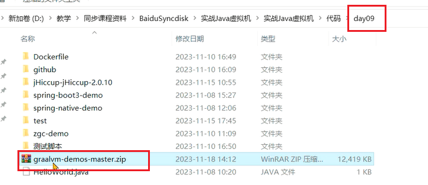

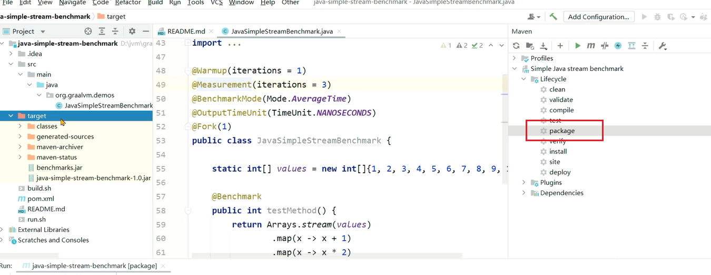

2、将jar包上传到服务器，使用不同的JDK进行测试，对比结果。

注意：

-XX:-UseJVMCICompiler参数可以关闭GraalVM中的Graal编译器。

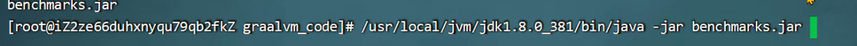

GraalVM开启Graal编译器下的性能还是不错的：

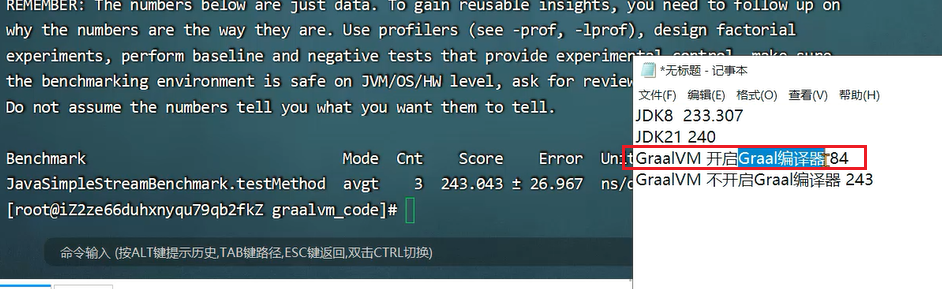

AOT（Ahead-Of-Time）模式 ，提前编译模式

AOT 编译器通过源代码，为特定平台创建可执行文件。比如，在Windows下编译完成之后，会生成exe文件。通过这种方式，达到启动之后获得最高性能的目的。但是不具备跨平台特性，不同平台使用需要单独编译。

这种模式生成的文件称之为Native Image本地镜像。

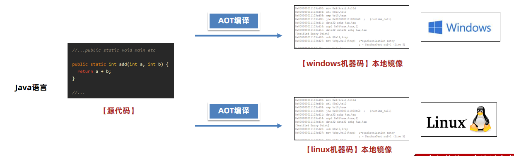

需求： 使用GraalVM AOT模式制作本地镜像并运行。 步骤： 1、安装Linux环境本地镜像制作需要的依赖库： https://www.graalvm.org/latest/reference-manual/native-image/#prerequisites 2、使用 native-image 类名 制作本地镜像。

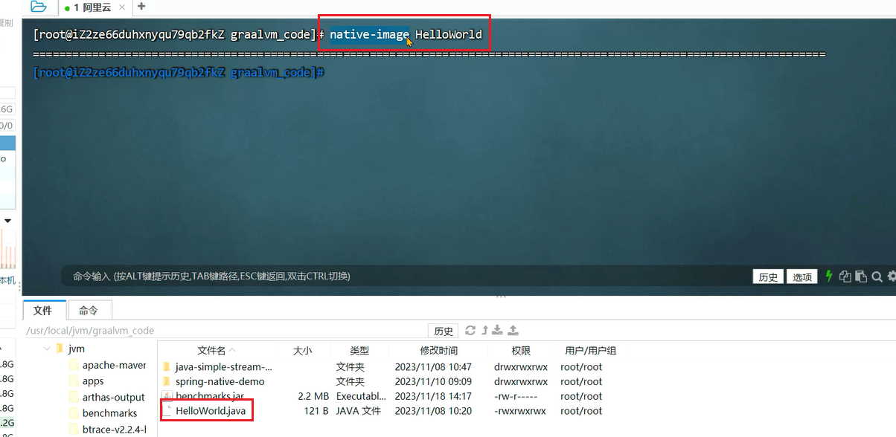

3、运行本地镜像可执行文件。

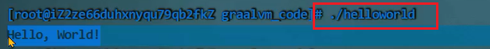

社区版的GraalVM使用本地镜像模式性能不如Hotspot JVM的JIT模式，但是企业版的性能相对会高很多。

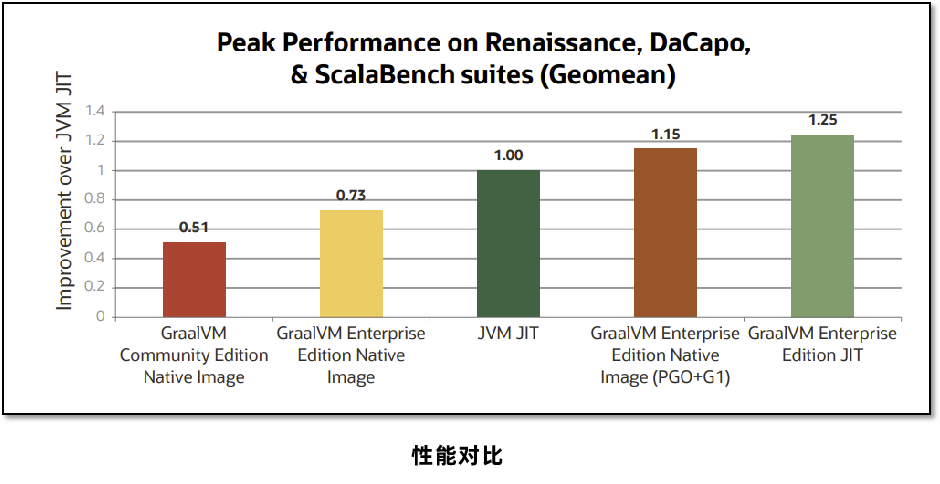

### 应用场景

GraalVM的AOT模式虽然在启动速度、内存和CPU开销上非常有优势，但是使用这种技术会带来几个问题：

1、跨平台问题，在不同平台下运行需要编译多次。编译平台的依赖库等环境要与运行平台保持一致。

2、使用框架之后，编译本地镜像的时间比较长，同时也需要消耗大量的CPU和内存。

3、AOT 编译器在编译时，需要知道运行时所有可访问的所有类。但是Java中有一些技术可以在运行时创建类，例如反射、动态代理等。这些技术在很多框架比如Spring中大量使用，所以框架需要对AOT编译器进行适配解决类似的问题。

解决方案：

1、使用公有云的Docker等容器化平台进行在线编译，确保编译环境和运行环境是一致的，同时解决了编译资源问题。

2、使用SpringBoot3等整合了GraalVM AOT模式的框架版本。

#### SpringBoot搭建GraalVM应用

需求： SpringBoot3对GraalVM进行了完整的适配，所以编写GraalVM服务推荐使用SpringBoot3。 步骤： 1、使用 https://start.spring.io/ spring提供的在线生成器构建项目。

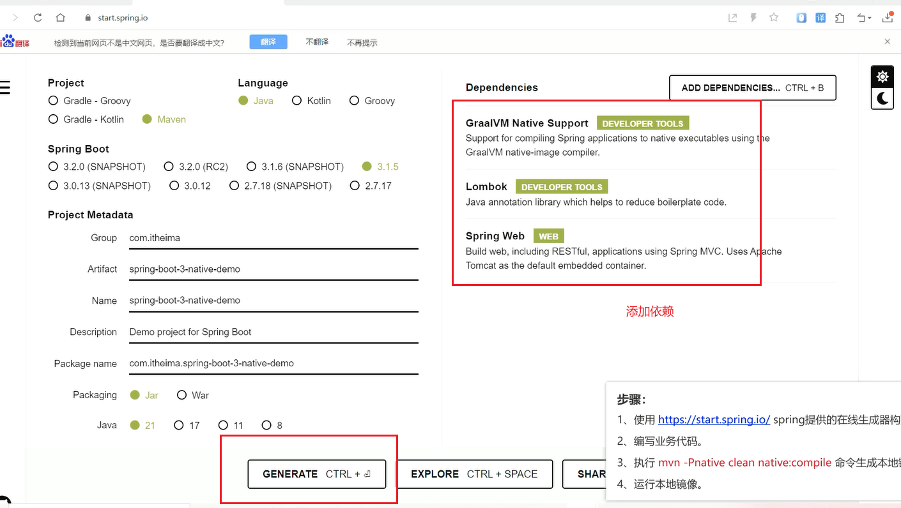

2、编写业务代码，修改原代码将`PostConstructor`注解去掉：

```Java
@Service
public class UserServiceImpl implements UserService, InitializingBean {

    private List<User> users = new ArrayList<>();

    @Autowired
    private UserDao userDao;

    @Override
    public List<UserDetails> getUserDetails() {
        return userDao.findUsers();
    }

    @Override
    public List<User> getUsers() {
        return users;
    }

    @Override
    public void afterPropertiesSet() throws Exception {
        //初始化时生成数据
        for (int i = 1; i <= 10; i++) {
            users.add(new User((long) i, RandomStringUtils.randomAlphabetic(10)));
        }
    }
}
```

3、执行 mvn -Pnative clean native:compile 命令生成本地镜像。

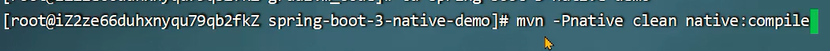

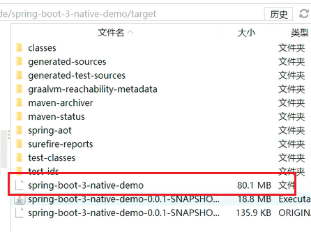

4、运行本地镜像。

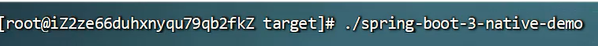

什么场景下需要使用GraalVM呢？

1、对性能要求比较高的场景，可以选择使用收费的企业版提升性能。

2、公有云的部分服务是按照CPU和内存使用量进行计费的，使用GraalVM可以有效地降低费用。

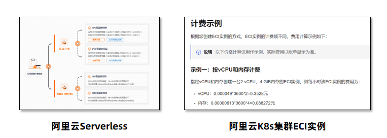

#### 函数计算

传统的系统架构中，服务器等基础设施的运维、安全、高可用等工作都需要企业自行完成，存在两个主要问题：

1、开销大，包括了人力的开销、机房建设的开销。

2、资源浪费，面对一些突发的流量冲击，比如秒杀等活动，必须提前规划好容量准备好大量的服务器，这些服务器在其他时候会处于闲置的状态，造成大量的浪费。

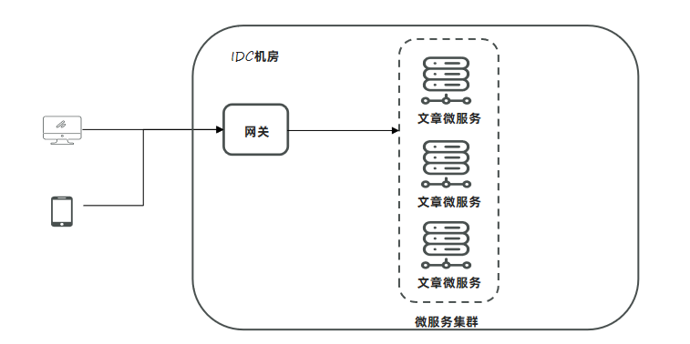

随着虚拟化技术、云原生技术的愈发成熟，云服务商提供了一套称为Serverless无服务器化的架构。企业无需进行服务器的任何配置和部署，完全由云服务商提供。比较典型的有亚马逊AWS、阿里云等。

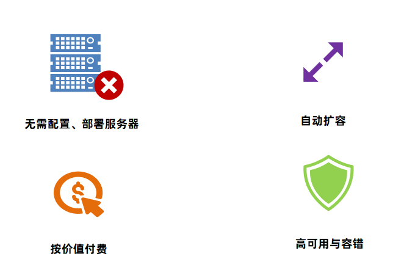

Serverless架构中第一种常见的服务是函数计算（Function as a Service），将一个应用拆分成多个函数，每个函数会以事件驱动的方式触发。典型代表有AWS的Lambda、阿里云的FC。

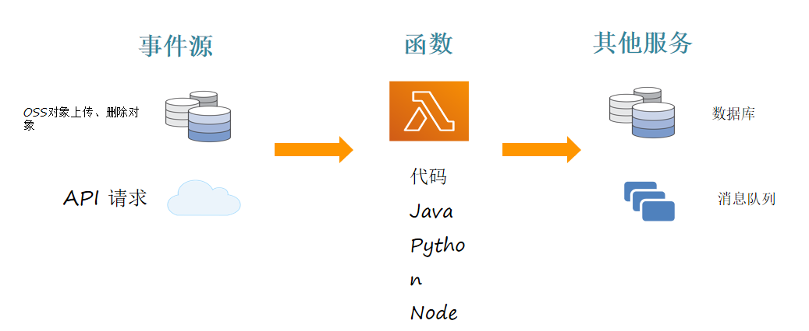

函数计算主要应用场景有如下几种：

小程序、API服务中的接口，此类接口的调用频率不高，使用常规的服务器架构容易产生资源浪费，使用Serverless就可以实现按需付费降低成本，同时支持自动伸缩能应对流量的突发情况。

大规模任务的处理，比如音视频文件转码、审核等，可以利用事件机制当文件上传之后，自动触发对应的任务。

函数计算的计费标准中包含CPU和内存使用量，所以使用GraalVM AOT模式编译出来的本地镜像可以节省更多的成本。

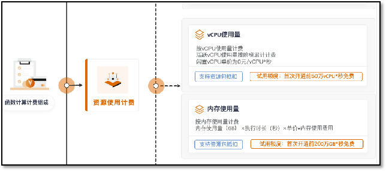

步骤：

1、在项目中编写Dockerfile文件。

```Java
# Using Oracle GraalVM for JDK 17
FROM container-registry.oracle.com/graalvm/native-image:17-ol8 AS builder

# Set the working directory to /home/app
WORKDIR /build

# Copy the source code into the image for building
COPY . /build
RUN chmod 777 ./mvnw

# Build
RUN ./mvnw --no-transfer-progress native:compile -Pnative

# The deployment Image
FROM container-registry.oracle.com/os/oraclelinux:8-slim

EXPOSE 8080

# Copy the native executable into the containers
COPY --from=builder /build/target/spring-boot-3-native-demo app
ENTRYPOINT ["/app"]
```

2、使用服务器制作镜像，这一步会消耗大量的CPU和内存资源，同时GraalVM相关的镜像服务器在国外，建议使用阿里云的镜像服务器制作Docker镜像。


3、使用函数计算将Docker镜像转换成函数服务。

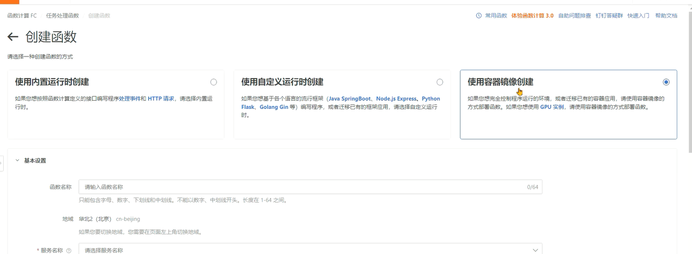

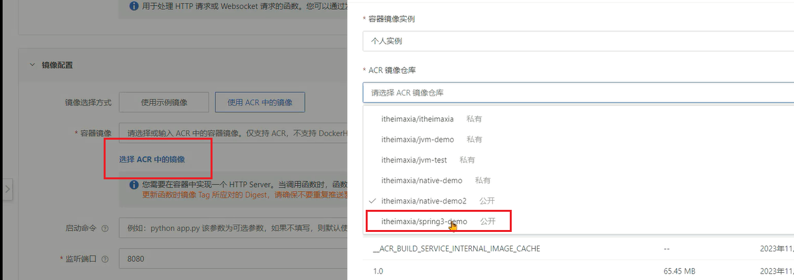

配置触发器：

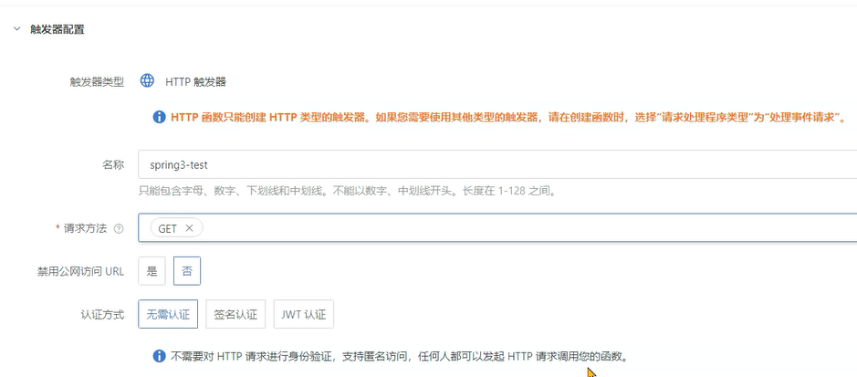

4、绑定域名并进行测试。

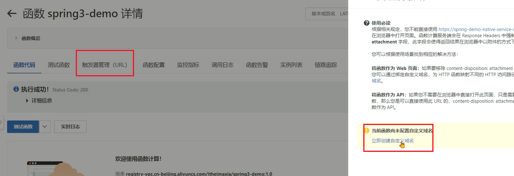

需要准备一个自己的域名：

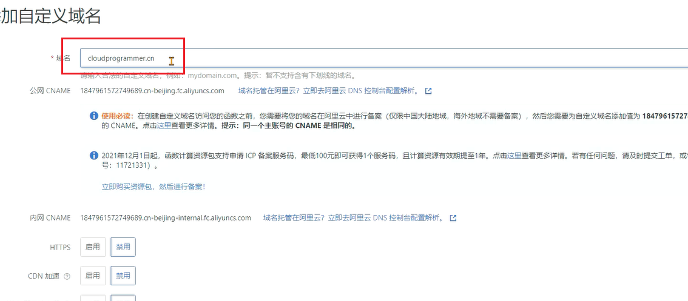

配置接口路径：

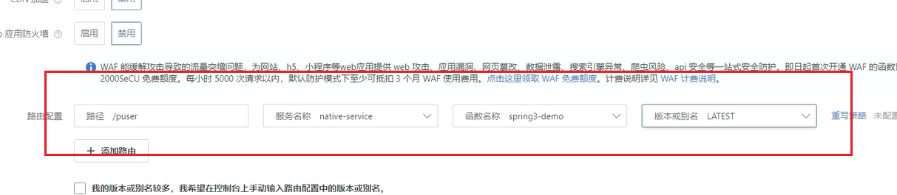

会出现一个错误：

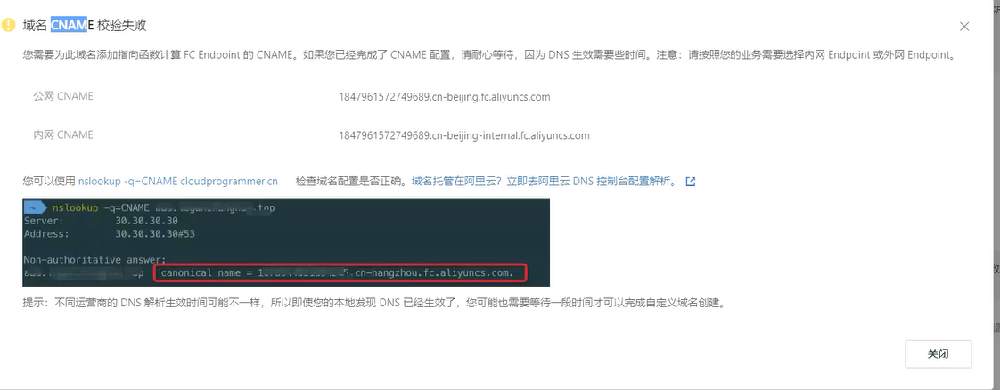

把域名导向阿里云的域名：

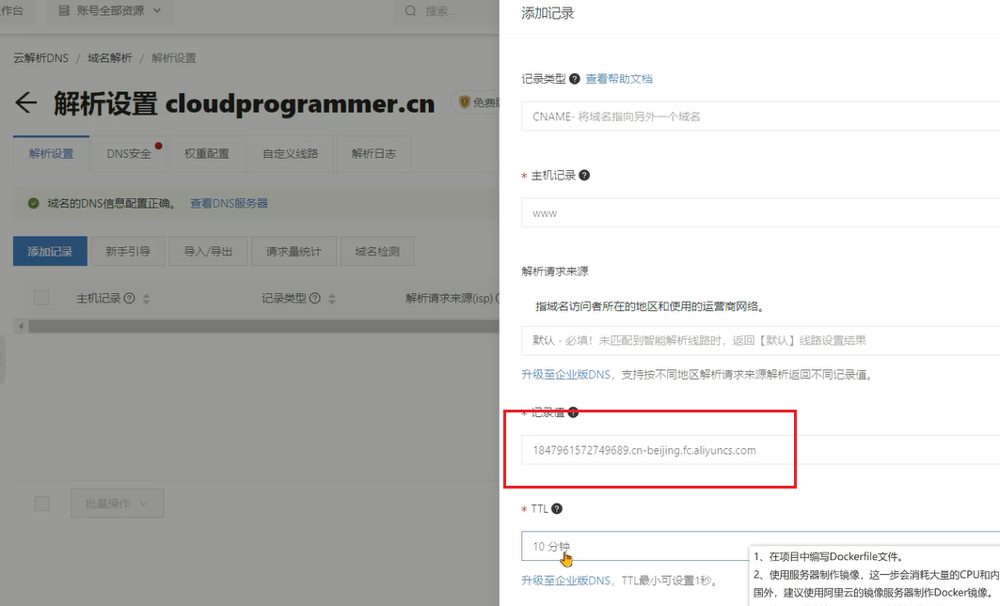

测试成功：

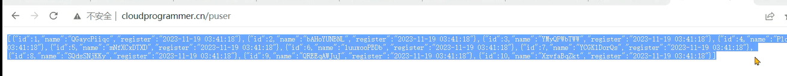

#### Serverless应用

函数计算的服务资源比较受限，比如AWS的Lambda服务一般无法支持超过15分钟的函数执行，所以云服务商提供了另外一套方案：基于容器的Serverless应用，无需手动配置K8s中的Pod、Service等内容，只需选择镜像就可自动生成应用服务。

同样，Serverless应用的计费标准中包含CPU和内存使用量，所以使用GraalVM AOT模式编译出来的本地镜像可以节省更多的成本。

| 服务分类           | 交付模式 | 弹性效率 | 计费模式                  |
| ------------------ | -------- | -------- | ------------------------- |
| 函数计算           | 函数     | 毫秒级   | 调用次数**CPU内存使用量** |
| Serverless**应用** | 镜像容器 | 秒级     | CPU**内存使用量**         |

步骤：

1、在项目中编写Dockerfile文件。

2、使用服务器制作镜像，这一步会消耗大量的CPU和内存资源，同时GraalVM相关的镜像服务器在国外，建议使用阿里云的镜像服务器制作Docker镜像。

前两步同实战案例2

3、配置Serverless应用，选择容器镜像、CPU和内存。

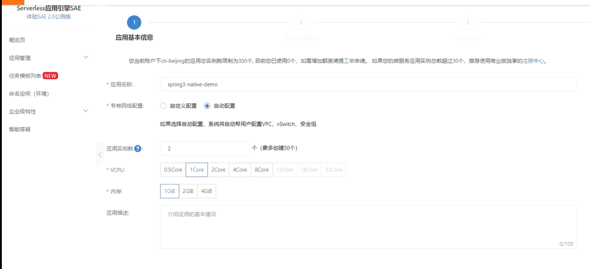

4、绑定外网负载均衡并使用Postman进行测试。

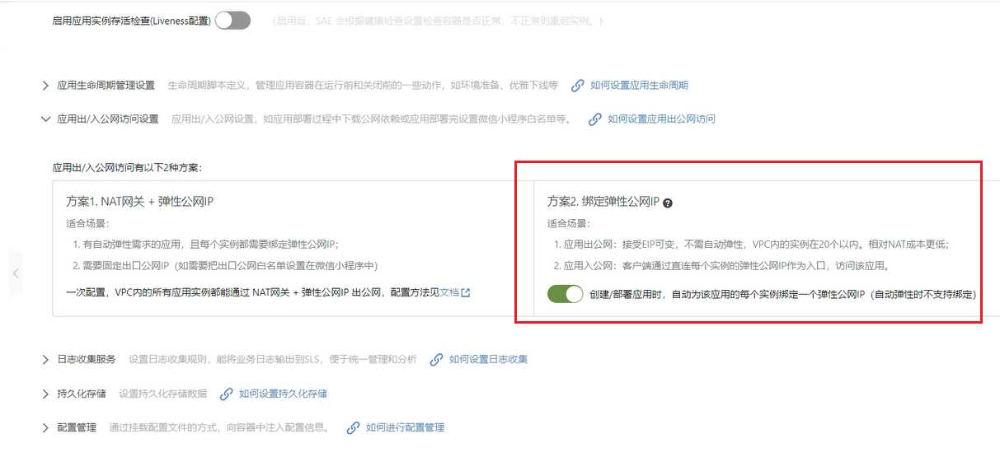

先别急着点确定，需要先创建弹性公网IP:


全选默认，然后创建：

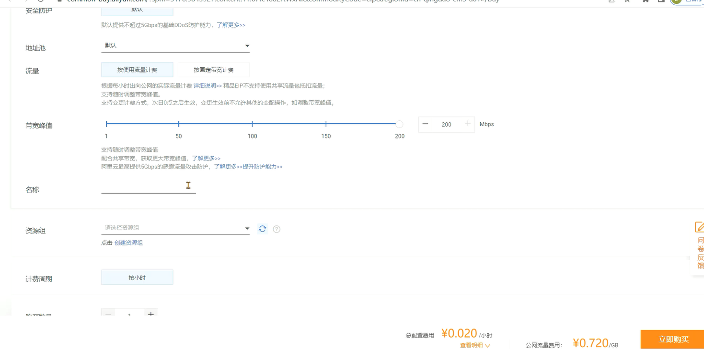

创建SLB负载均衡：

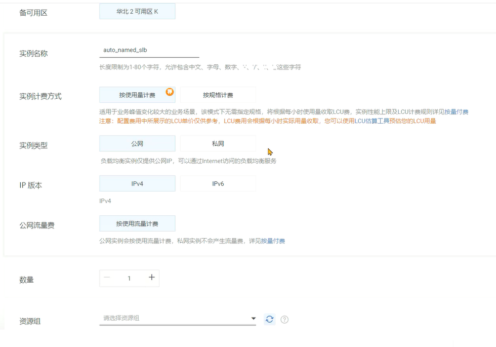

这次就可以成功创建了：

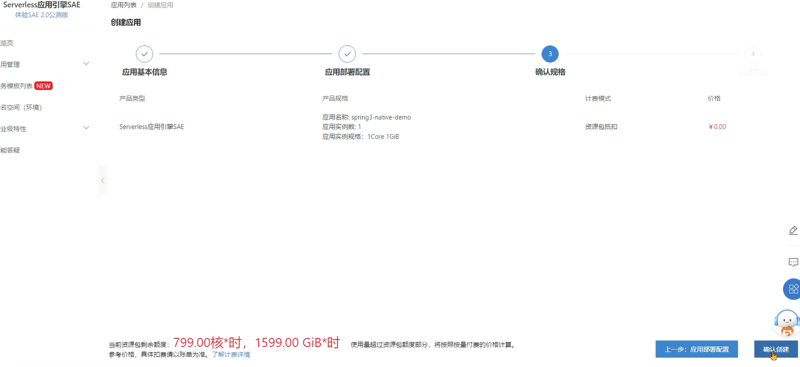

绑定刚才创建的SLB负载均衡：

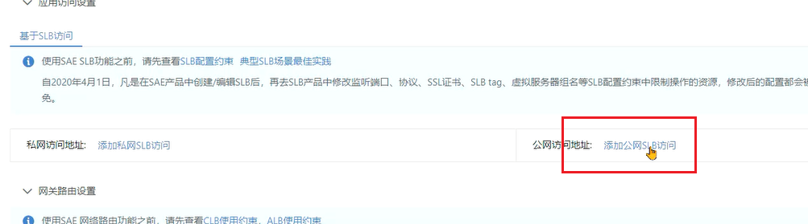

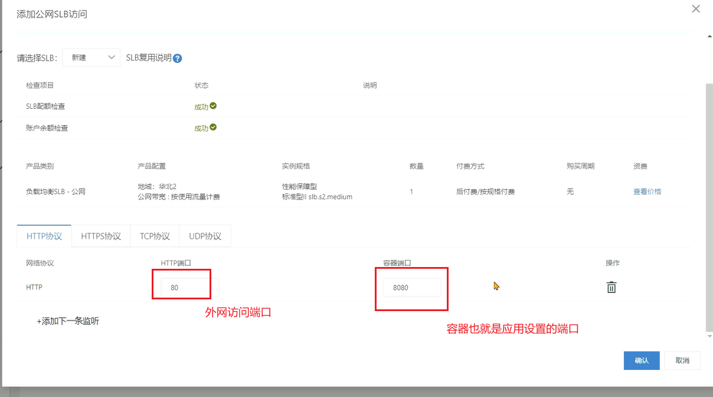

访问公网IP就能处理请求了：

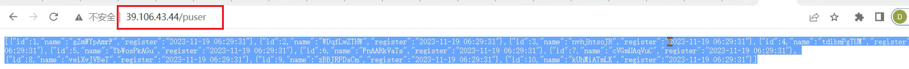

### 参数优化和故障诊断

由于GraalVM是一款独立的JDK，所以大部分HotSpot中的虚拟机参数都不适用。常用的参数参考：官方手册。

- 社区版只能使用串行垃圾回收器（Serial GC），使用串行垃圾回收器的默认最大 Java 堆大小会设置为物理内存大小的 80%，调整方式为使用  -Xmx最大堆大小。如果希望在编译期就指定该大小，可以在编译时添加参数-R:MaxHeapSize=最大堆大小。
- G1垃圾回收器只能在企业版中使用，开启方式为添加--gc=G1参数，有效降低垃圾回收的延迟。
- 另外提供一个Epsilon GC，开启方式：--gc=epsilon ，它不会产生任何的垃圾回收行为所以没有额外的内存、CPU开销。如果在公有云上运行的程序生命周期短暂不产生大量的对象，可以使用该垃圾回收器，以节省最大的资源。

-XX:+PrintGC -XX:+VerboseGC 参数打印垃圾回收详细信息。

添加虚拟机参数：

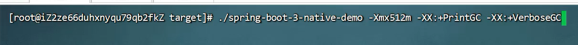

打印出了垃圾回收的信息：

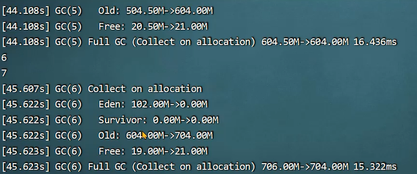

#### 实战案例4：内存快照文件的获取

**需求：**

获得运行中的内存快照文件，使用MAT进行分析。

**步骤：**

1、编译程序时，添加 --enable-monitoring=heapdump，参数添加到pom文件的对应插件中。

```XML
<plugin>
   <groupId>org.graalvm.buildtools</groupId>
   <artifactId>native-maven-plugin</artifactId>
   <configuration>
      <buildArgs>
         <arg>--enable-monitoring=heapdump,jfr</arg>
      </buildArgs>
   </configuration>
</plugin>
```

2、运行中使用 kill -SIGUSR1 进程ID 命令，创建内存快照文件。

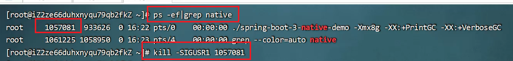

3、使用MAT分析内存快照文件。

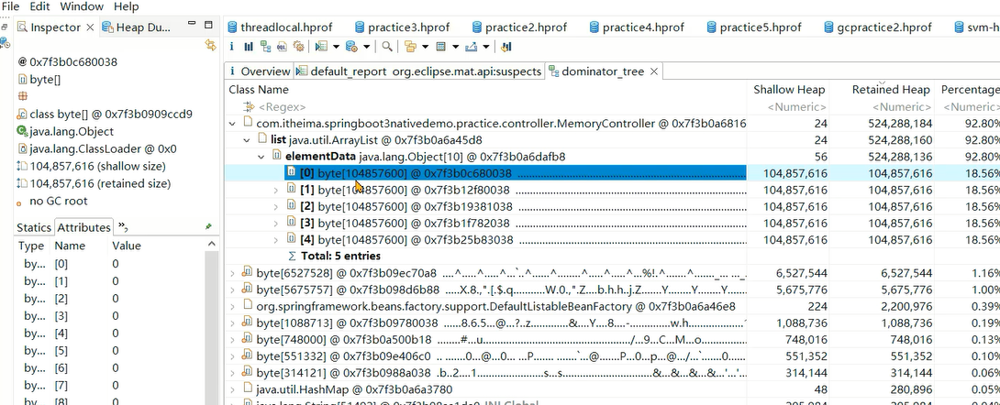

#### 实战案例5：运行时数据的获取

JDK Flight Recorder (JFR) 是一个内置于 JVM 中的工具，可以收集正在运行中的 Java 应用程序的诊断和分析数据，比如线程、异常等内容。GraalVM本地镜像也支持使用JFR生成运行时数据，导出的数据可以使用VisualVM分析。

步骤：

1、编译程序时，添加 --enable-monitoring=jfr，参数添加到pom文件的对应插件中。

```XML
<plugin>
   <groupId>org.graalvm.buildtools</groupId>
   <artifactId>native-maven-plugin</artifactId>
   <configuration>
      <buildArgs>
         <arg>--enable-monitoring=heapdump,jfr</arg>
      </buildArgs>
   </configuration>
</plugin>
```

2、运行程序，添加 -XX:StartFlightRecording=filename=recording.jfr,duration=10s参数。

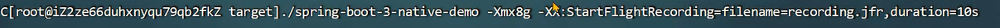

3、使用VisualVM分析JFR记录文件。

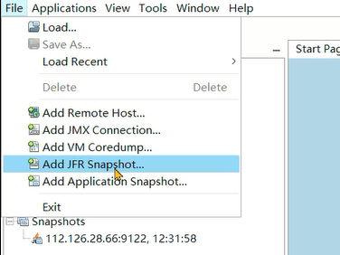

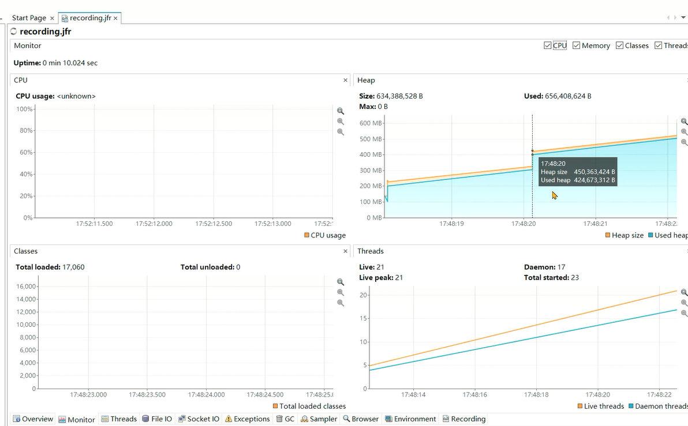

