[[toc]]

揭秘Java工具
---------------

在Java的世界中，除了Java编写的业务系统之外，还有一类程序也需要Java程序员参与编写，这类程序就是Java工具。

常见的Java工具有以下几类：

1、诊断类工具，如Arthas、VisualVM等。

2、开发类工具，如Idea、Eclipse。

3、APM应用性能监测工具，如Skywalking、Zipkin等。

4、热部署工具，如Jrebel等。

### Java工具的核心：Java Agent技术

Java Agent技术是JDK提供的用来编写Java工具的技术，使用这种技术生成一种特殊的jar包，这种jar包可以让Java程序运行其中的代码。

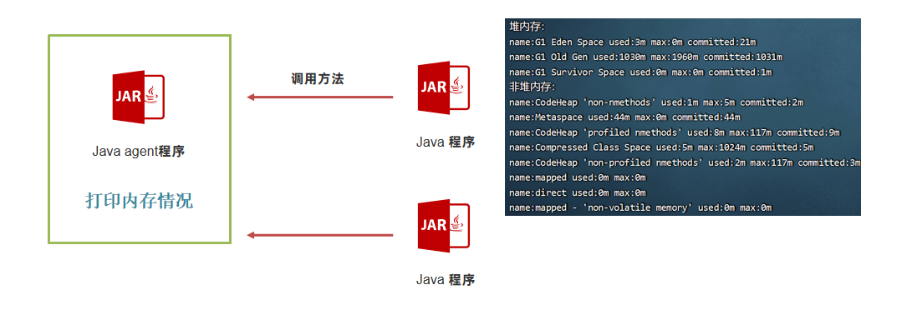

Java Agent技术实现了让Java程序执行独立的Java Agent程序中的代码，执行方式有两种：

- 静态加载模式

静态加载模式可以在程序启动的一开始就执行我们需要执行的代码，适合用APM等性能监测系统从一开始就监控程序的执行性能。静态加载模式需要在Java Agent的项目中编写一个premain的方法，并打包成jar包。


接下来使用以下命令启动Java程序，此时Java虚拟机将会加载agent中的代码并执行。


premain方法会在主线程中执行：


- 动态加载模式

动态加载模式可以随时让java agent代码执行，适用于Arthas等诊断系统。动态加载模式需要在Java Agent的项目中编写一个agentmain的方法，并打包成jar包。


接下来使用以下代码就可以让java agent代码在指定的java进程中执行了。

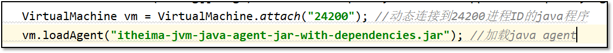

agentmain方法会在独立线程中执行：

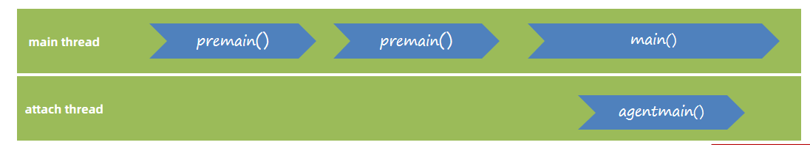

#### 搭建java agent静态加载模式的环境

步骤：

1、创建maven项目，添加maven-assembly-plugin插件，此插件可以打包出java agent的jar包。

```XML
<plugin>
    <groupId>org.apache.maven.plugins</groupId>
    <artifactId>maven-assembly-plugin</artifactId>
    <configuration>
        <descriptorRefs>
            <descriptorRef>jar-with-dependencies</descriptorRef>
        </descriptorRefs>
        <archive>
            <manifestFile>src/main/resources/MANIFEST.MF</manifestFile>
        </archive>
    </configuration>
</plugin>
```

2、编写类和premain方法，premain方法中打印一行信息。

```Java
public class AgentDemo {

    /**
     * 参数添加模式 启动java主程序时添加 -javaangent:agent路径
     * @param agentArgs
     * @param inst
     */
    public static void premain(String agentArgs, Instrumentation inst) {
        System.out.println("java agent执行了...");
    }
}
```

3、编写MANIFEST.MF文件，此文件主要用于描述java agent的配置属性，比如使用哪一个类的premain方法。

```Java
Manifest-Version: 1.0
Premain-Class: com.itheima.jvm.javaagent.AgentDemo
Agent-Class: com.itheima.jvm.javaagent.AgentDemo
Can-Redefine-Classes: true
Can-Retransform-Classes: true
Can-Set-Native-Method-Prefix: true
```

4、使用maven-assembly-plugin进行打包。

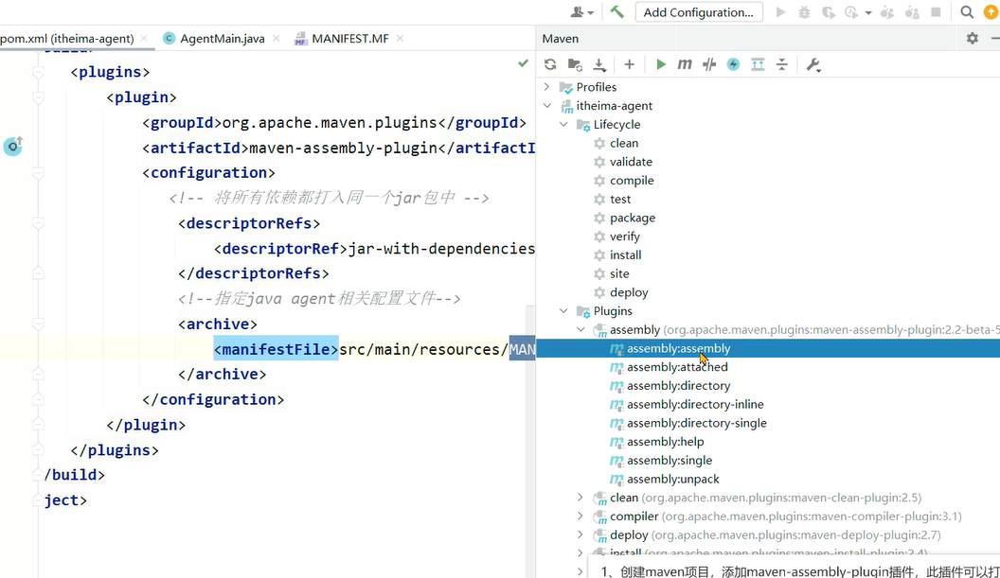

5、创建spring boot应用，并静态加载上一步打包完的java agent。

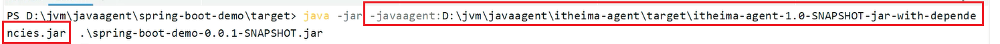

#### 搭建java agent动态加载模式的环境

步骤：

1、创建maven项目，添加maven-assembly-plugin插件，此插件可以打包出java agent的jar包。

2、编写类和agentmain方法， agentmain方法中打印一行信息。

```Java
package com.itheima.jvm.javaagent.demo01;

import java.lang.instrument.Instrumentation;

public class AgentDemo {

    /**
     * 参数添加模式 启动java主程序时添加 -javaangent:agent路径
     * @param agentArgs
     * @param inst
     */
    public static void premain(String agentArgs, Instrumentation inst) {
        System.out.println("java agent执行了...");
    }

    /**
     * attach 挂载模式 java主程序运行之后，随时可以将agent挂载上去
     */

    public static void agentmain(String agentArgs, Instrumentation inst) {
        //打印线程名称
        System.out.println(Thread.currentThread().getName());
        System.out.println("attach模式执行了...");
    }
}
```

3、编写MANIFEST.MF文件，此文件主要用于描述java agent的配置属性，比如使用哪一个类的agentmain方法。

4、使用maven-assembly-plugin进行打包。

5、编写main方法，动态连接到运行中的java程序。

```Java
package com.itheima.jvm.javaagent.demo01;

import com.sun.tools.attach.AgentInitializationException;
import com.sun.tools.attach.AgentLoadException;
import com.sun.tools.attach.AttachNotSupportedException;
import com.sun.tools.attach.VirtualMachine;

import java.io.IOException;

public class AttachMain {
    public static void main(String[] args) throws IOException, AttachNotSupportedException, AgentLoadException, AgentInitializationException {
        VirtualMachine vm = VirtualMachine.attach("24200");
        vm.loadAgent("D:\\jvm-java-agent\\target\\itheima-jvm-java-agent-jar-with-dependencies.jar");
    }
}
```

### 实战案例1：简化版的Arthas

需求：

编写一个简化版的Arthas程序，具备以下几个功能：

1、查看内存使用情况

2、生成堆内存快照

3、打印栈信息

4、打印类加载器

5、打印类的源码

6、打印方法执行的参数和耗时

需求：

该程序是一个独立的Jar包，可以应用于任何Java编写的系统中。

具备以下特点：代码无侵入性、操作简单、性能高。

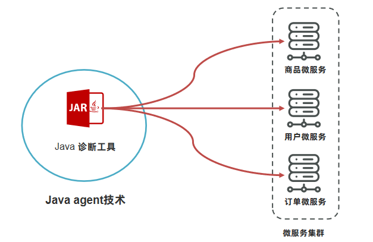

#### 查看内存使用情况

 JDK从1.5开始提供了Java Management Extensions (JMX) 技术，通过Mbean对象的写入和获取，实现：

运行时配置的获取和更改

应用程序运行信息的获取（线程栈、内存、类信息等）

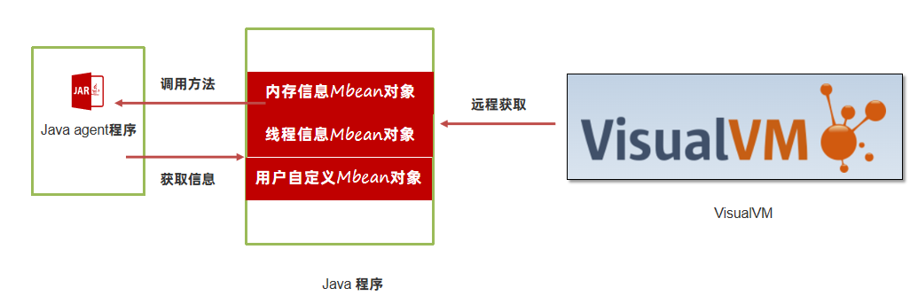

 获取JVM默认提供的Mbean可以通过如下的方式，例如获取内存信息：


ManagementFactory提供了一系列的方法获取各种各样的信息：

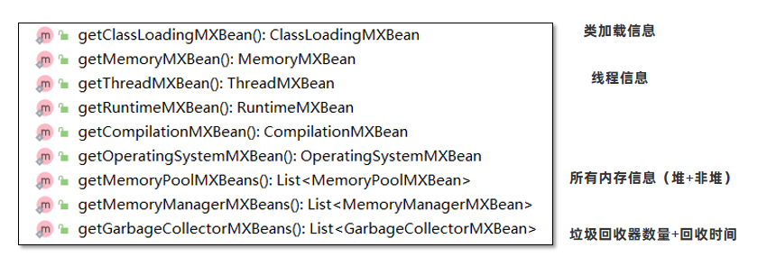

```Java
package com.itheima.jvm.javaagent.demo02;

import java.lang.instrument.Instrumentation;
import java.lang.management.*;
import java.util.List;

/**
 * 1、查询所有进程
 * 2、显示内存相关的信息
 */
public class AgentDemo {

    /**
     * 参数添加模式 启动java主程序时添加 -javaangent:agent路径
     * @param agentArgs
     * @param inst
     */
    public static void premain(String agentArgs, Instrumentation inst) {
        System.out.println("java agent执行了...");
    }

    /**
     * attach 挂载模式 java主程序运行之后，随时可以将agent挂载上去
     */

    //-XX:+UseSerialGC -Xmx1g -Xms512m
    public static void agentmain(String agentArgs, Instrumentation inst) {
        //打印内存的使用情况
        memory();
    }

    //获取内存信息
    private static void memory(){
        List<MemoryPoolMXBean> memoryPoolMXBeans = ManagementFactory.getMemoryPoolMXBeans();

        System.out.println("堆内存：");
        //获取堆内存
        getMemoryInfo(memoryPoolMXBeans, MemoryType.HEAP);

        //获取非堆内存
        System.out.println("非堆内存：");
        getMemoryInfo(memoryPoolMXBeans, MemoryType.NON_HEAP);

        //nio使用的直接内存
        try{
            @SuppressWarnings("rawtypes")
            Class bufferPoolMXBeanClass = Class.forName("java.lang.management.BufferPoolMXBean");
            @SuppressWarnings("unchecked")
            List<BufferPoolMXBean> bufferPoolMXBeans = ManagementFactory.getPlatformMXBeans(bufferPoolMXBeanClass);
            for (BufferPoolMXBean mbean : bufferPoolMXBeans) {
                StringBuilder sb = new StringBuilder();
                sb
                        .append("name:")
                        .append(mbean.getName())

                        .append(" used:")
                        .append(mbean.getMemoryUsed()/ 1024 / 1024)
                        .append("m")

                        .append(" max:")
                        .append(mbean.getTotalCapacity() / 1024 / 1024)
                        .append("m");

                System.out.println(sb);
            }
        }catch (Exception e){
            System.out.println(e);
        }

    }

    private static void getMemoryInfo(List<MemoryPoolMXBean> memoryPoolMXBeans, MemoryType heap) {
        memoryPoolMXBeans.stream().filter(x -> x.getType().equals(heap))
                .forEach(x -> {
                    StringBuilder sb = new StringBuilder();
                    sb
                            .append("name:")
                            .append(x.getName())

                            .append(" used:")
                            .append(x.getUsage().getUsed() / 1024 / 1024)
                            .append("m")

                            .append(" max:")
                            .append(x.getUsage().getMax() / 1024 / 1024)
                            .append("m")

                            .append(" committed:")
                            .append(x.getUsage().getCommitted() / 1024 / 1024)
                            .append("m");

                    System.out.println(sb);
                });
    }

    public static void main(String[] args) {
        memory();
    }
}
```

#### 生成堆内存快照

更多的信息可以通过ManagementFactory.getPlatformMXBeans获取，比如：

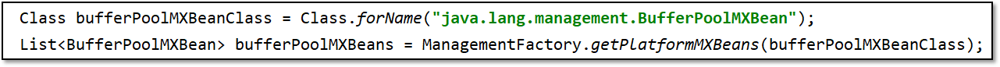

通过这种方式，获取到了Java虚拟机中分配的直接内存和内存映射缓冲区的大小。

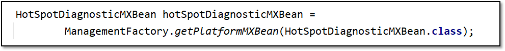

获取到虚拟机诊断用的MXBean，通过这个Bean对象可以生成内存快照。

```Java
public static void heapDump(){
    SimpleDateFormat simpleDateFormat = new SimpleDateFormat("yyyy-MM-dd-HH-mm");
    String filename = simpleDateFormat.format(new Date()) + ".hprof";
    System.out.println("生成内存dump文件，文件名为:" + filename);

    HotSpotDiagnosticMXBean hotSpotDiagnosticMXBean =
            ManagementFactory.getPlatformMXBean(HotSpotDiagnosticMXBean.class);

    try {
        hotSpotDiagnosticMXBean.dumpHeap(filename, true);
    } catch (IOException e) {
        e.printStackTrace();
    }
}
```

#### 打印栈信息

```Java
package com.itheima.jvm.javaagent.demo03;

import java.lang.management.ManagementFactory;
import java.lang.management.ThreadInfo;
import java.lang.management.ThreadMXBean;

public class ThreadCommand {

    public static void printStackInfo(){
        ThreadMXBean threadMXBean = ManagementFactory.getThreadMXBean();
        ThreadInfo[] infos = threadMXBean.dumpAllThreads(threadMXBean.isObjectMonitorUsageSupported(),
                threadMXBean.isSynchronizerUsageSupported());
        for (ThreadInfo info : infos) {
            StringBuilder stringBuilder = new StringBuilder();
            stringBuilder.append("name:")
                    .append(info.getThreadName())
                    .append(" threadId:")
                    .append(info.getThreadId())
                    .append(" state:")
                    .append(info.getThreadState())
            ;
            System.out.println(stringBuilder);

            StackTraceElement[] stackTrace = info.getStackTrace();
            for (StackTraceElement stackTraceElement : stackTrace) {
                System.out.println(stackTraceElement.toString());
            }

            System.out.println();
        }
    }


    public static void main(String[] args) {
        printStackInfo();
    }
}
```

#### 打印类加载器

Java Agent中可以获得Java虚拟机提供的Instumentation对象：

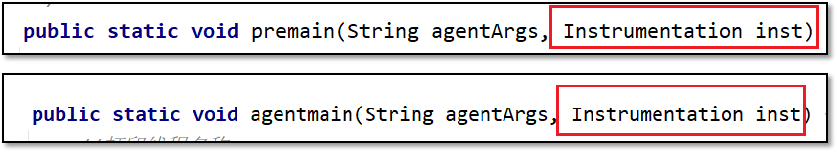

该对象有以下几个作用： 1、redefine，重新设置类的字节码信息。 2、retransform，根据现有类的字节码信息进行增强。 3、获取所有已加载的类信息。 Oracle官方手册： https://docs.oracle.com/javase/17/docs/api/java/lang/instrument/Instrumentation.html

```Java
package com.itheima.jvm.javaagent.demo04;

import org.jd.core.v1.ClassFileToJavaSourceDecompiler;
import org.jd.core.v1.api.loader.Loader;
import org.jd.core.v1.api.loader.LoaderException;
import org.jd.core.v1.api.printer.Printer;

import java.lang.instrument.*;
import java.security.ProtectionDomain;
import java.util.Comparator;
import java.util.HashSet;
import java.util.Scanner;
import java.util.Set;
import java.util.stream.Collectors;

public class ClassCommand {

    //获取所有类加载器
    private static Set<ClassLoader> getAllClassLoader(Instrumentation inst){
        HashSet<ClassLoader> classLoaders = new HashSet<>();
        Class[] allLoadedClasses = inst.getAllLoadedClasses();
        for (Class clazz : allLoadedClasses) {
            ClassLoader classLoader = clazz.getClassLoader();
            classLoaders.add(classLoader);
        }

        return classLoaders;
    }

    public static void printAllClassLoader(Instrumentation inst){
        Set<ClassLoader> allClassLoader = getAllClassLoader(inst);
        String result = allClassLoader.stream().map(x -> {
            if (x ==null) {
                return "BootStrapClassLoader";
            } else {
                return x.toString();
            }
        }).distinct().sorted(String::compareTo).collect(Collectors.joining(","));
        System.out.println(result);
    }

    

}
```

#### 打印类的源码

打印类的源码需要分为以下几个步骤

1、获得内存中的类的字节码信息。利用Instrumentation提供的转换器来获取字节码信息。

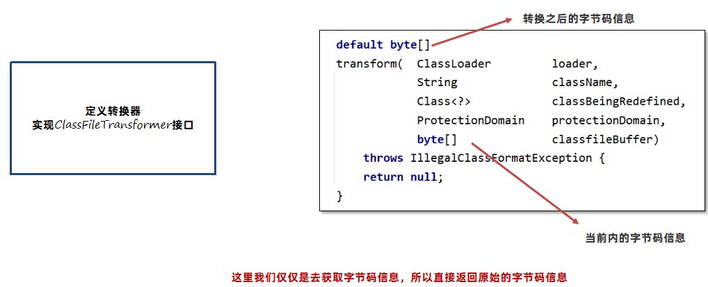


2、通过反编译工具将字节码信息还原成源代码信息。

这里我们会使用jd-core依赖库来完成，github地址：https://github.com/java-decompiler/jd-core

Pom添加依赖:

```java
<dependency>
    <groupId>org.jd</groupId>
    <artifactId>jd-core</artifactId>
    <version>1.1.3</version>
</dependency>
//获取类信息
public static void printClass(Instrumentation inst){
    Scanner scanner = new Scanner(System.in);
    System.out.println("请输入类名:");
    String next = scanner.next();
    Class[] allLoadedClasses = inst.getAllLoadedClasses();
    System.out.println("要查找的类名是:" + next);
    //匹配类名
    for (Class clazz : allLoadedClasses) {
        if(clazz.getName().equals(next)){
            System.out.println("找到了类,类加载器为:" + clazz.getClassLoader());
            ClassFileTransformer transformer = new ClassFileTransformer() {
                @Override
                public byte[] transform(Module module, ClassLoader loader, String className, Class<?> classBeingRedefined, ProtectionDomain protectionDomain, byte[] classfileBuffer) throws IllegalClassFormatException {
                    ClassFileToJavaSourceDecompiler classFileToJavaSourceDecompiler = new ClassFileToJavaSourceDecompiler();

                    Printer printer = new Printer() {
                        protected static final String TAB = "  ";
                        protected static final String NEWLINE = "\n";

                        protected int indentationCount = 0;
                        protected StringBuilder sb = new StringBuilder();

                        @Override public String toString() { return sb.toString(); }

                        @Override public void start(int maxLineNumber, int majorVersion, int minorVersion) {}
                        @Override public void end() {
                            System.out.println(sb.toString());
                        }

                        @Override public void printText(String text) { sb.append(text); }
                        @Override public void printNumericConstant(String constant) { sb.append(constant); }
                        @Override public void printStringConstant(String constant, String ownerInternalName) { sb.append(constant); }
                        @Override public void printKeyword(String keyword) { sb.append(keyword); }
                        @Override public void printDeclaration(int type, String internalTypeName, String name, String descriptor) { sb.append(name); }
                        @Override public void printReference(int type, String internalTypeName, String name, String descriptor, String ownerInternalName) { sb.append(name); }

                        @Override public void indent() { this.indentationCount++; }
                        @Override public void unindent() { this.indentationCount--; }

                        @Override public void startLine(int lineNumber) { for (int i=0; i<indentationCount; i++) sb.append(TAB); }
                        @Override public void endLine() { sb.append(NEWLINE); }
                        @Override public void extraLine(int count) { while (count-- > 0) sb.append(NEWLINE); }

                        @Override public void startMarker(int type) {}
                        @Override public void endMarker(int type) {}
                    };

                    try {
                        classFileToJavaSourceDecompiler.decompile(new Loader() {
                            @Override
                            public boolean canLoad(String s) {
                                return false;
                            }

                            @Override
                            public byte[] load(String s) throws LoaderException {
                                return classfileBuffer;
                            }
                        },printer,className);
                    } catch (Exception e) {
                        e.printStackTrace();
                    }
                    //System.out.println(new String(classfileBuffer));
                    return ClassFileTransformer.super.transform(module, loader, className, classBeingRedefined, protectionDomain, classfileBuffer);
                }
            };

            inst.addTransformer(transformer,true);
            try {
                inst.retransformClasses(clazz);
            } catch (UnmodifiableClassException e) {
                e.printStackTrace();
            }finally {
                inst.removeTransformer(transformer);
            }

        }
    }
}
```

#### 打印方法执行的参数和耗时

**Spring AOP是不是也可以实现类似的功能呢？**

Spring AOP 确实可以实现统计方法执行时间，打印方法参数等功能，但是使用这种方式存在几个问题：

代码有侵入性，AOP代码必须在当前项目中被引入才能完成相应的功能。

无法做到灵活地开启和关闭功能。

与Spring框架强耦合，如果项目没有使用Spring框架就不可以使用。

所以使用Java Agent技术 + 字节码增强技术，就可以解决上述三个问题。

#### ASM字节码增强技术

打印方法执行的参数和耗时需要对原始类的方法进行增强，可以使用类似于Spring AOP这类面向切面编程的方式，但是考虑到并非每个项目都使用了Spring这些框架，所以我们选择的是最基础的字节码增强框架。字节码增强框架是在当前类的字节码信息中插入一部分字节码指令，从而起到增强的作用。

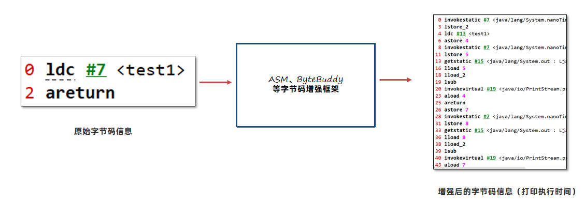

ASM是一个通用的 Java 字节码操作和分析框架。它可用于直接以二进制形式修改现有类或动态生成类。ASM重点关注性能。让操作尽可能小且尽可能快，所以它非常适合在动态系统中使用。ASM的缺点是代码复杂。

ASM的官方网址：https://asm.ow2.io/ 操作步骤： 1、引入依赖

```XML
<dependency>
    <groupId>org.ow2.asm</groupId>
    <artifactId>asm</artifactId>
    <version>9.6</version>
</dependency>
```

2、搭建基础框架，此代码为固定代码。

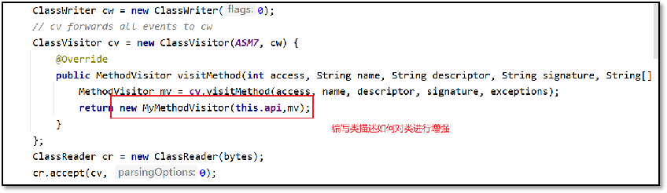

3、编写一个类描述如何去增强类，类需要继承自MethodVisitor

ASM基础案例：

```Java
package com.itheima.jvm.javaagent.demo05;

import org.objectweb.asm.*;

import java.io.IOException;
import java.io.InputStream;
import java.lang.reflect.InvocationTargetException;

import static org.objectweb.asm.Opcodes.*;

public class ASMDemo {

    public static byte[] classASM(byte[] bytes){
        ClassWriter cw = new ClassWriter(0);
        // cv forwards all events to cw
        ClassVisitor cv = new ClassVisitor(ASM7, cw) {
            @Override
            public MethodVisitor visitMethod(int access, String name, String descriptor, String signature, String[] exceptions) {
                MethodVisitor mv = cv.visitMethod(access, name, descriptor, signature, exceptions);
                return new MyMethodVisitor(this.api,mv);
            }
        };
        ClassReader cr = new ClassReader(bytes);
        cr.accept(cv, 0);

        return cw.toByteArray();
    }

    public static void main(String[] args) throws IOException, NoSuchMethodException, InvocationTargetException, InstantiationException, IllegalAccessException {
        InputStream inputStream = ASMDemo.class.getResourceAsStream("/com/itheima/jvm/javaagent/demo05/ASMDemo.class");
        byte[] b1 = inputStream.readAllBytes();

        byte[] b2 = classASM(b1); // b2 represents the same class as b1

        //创建类加载器
        MyClassLoader myClassLoader = new MyClassLoader();
        Class clazz = myClassLoader.defineClass("com.itheima.jvm.javaagent.demo05.ASMDemo", b2);
        clazz.getDeclaredConstructor().newInstance();
    }
}

class MyClassLoader extends ClassLoader {
    public Class defineClass(String name, byte[] b) {
        return defineClass(name, b, 0, b.length);
    }
}

class MyMethodVisitor extends MethodVisitor {

    public MyMethodVisitor(int api, MethodVisitor methodVisitor) {
        super(api, methodVisitor);
    }

    @Override
    public void visitCode() {
        mv.visitFieldInsn(Opcodes.GETSTATIC,"java/lang/System","out","Ljava/io/PrintStream;");
        mv.visitLdcInsn("开始执行");
        mv.visitMethodInsn(INVOKEVIRTUAL,"java/io/PrintStream","println","(Ljava/lang/String;)V",false);
        super.visitCode();
    }

    @Override
    public void visitInsn(int opcode) {
        if(opcode == ARETURN || opcode == RETURN ) {
            mv.visitFieldInsn(Opcodes.GETSTATIC,"java/lang/System","out","Ljava/io/PrintStream;");
            mv.visitLdcInsn("结束执行");
            mv.visitMethodInsn(INVOKEVIRTUAL,"java/io/PrintStream","println","(Ljava/lang/String;)V",false);
        }
        super.visitInsn(opcode);
    }

    @Override
    public void visitEnd() {
        mv.visitMaxs(20,50);
        super.visitEnd();
    }

}
```

####  Byte Buddy字节码增强技术

Byte Buddy 是一个代码生成和操作库，用于在 Java 应用程序运行时创建和修改 Java 类，而无需编译器的帮助。 Byte Buddy底层基于ASM，提供了非常方便的 API。

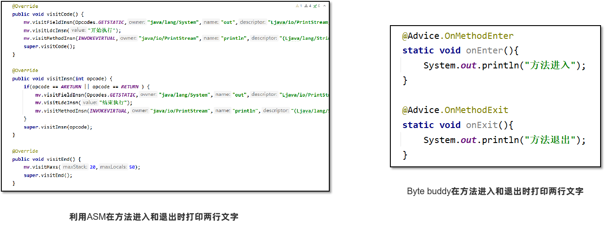

Byte Buddy官网： https://bytebuddy.net/

操作步骤：

1、引入依赖

```XML
<dependency>
    <groupId>net.bytebuddy</groupId>
    <artifactId>byte-buddy</artifactId>
    <version>1.14.10</version>
</dependency>
<dependency>
    <groupId>net.bytebuddy</groupId>
    <artifactId>byte-buddy-agent</artifactId>
    <version>1.14.10</version>
</dependency>
```

2、搭建基础框架，此代码为固定代码

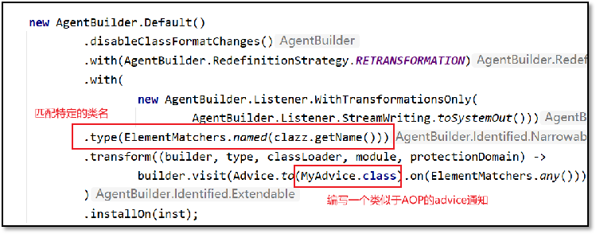

3、编写一个Advice通知描述如何去增强类

```Java
package com.itheima.jvm.javaagent.demo05;

import net.bytebuddy.ByteBuddy;
import net.bytebuddy.agent.ByteBuddyAgent;
import net.bytebuddy.asm.Advice;
import net.bytebuddy.dynamic.DynamicType;
import net.bytebuddy.dynamic.loading.ClassReloadingStrategy;
import net.bytebuddy.matcher.ElementMatchers;

import java.io.IOException;
import java.io.InputStream;
import java.lang.reflect.InvocationTargetException;

public class ByteBuddyDemo {
    public static void main(String[] args) throws IOException, NoSuchMethodException, InvocationTargetException, InstantiationException, IllegalAccessException {

        Foo foo = new Foo();
        MyClassLoader myClassLoader = new MyClassLoader();

        Class<? extends Foo> newClazz = new ByteBuddy()
                .subclass(Foo.class)
                .method(ElementMatchers.any())
                .intercept(Advice.to(MyAdvice.class))
                .make()
                .load(myClassLoader)
                .getLoaded();

        Foo foo1 = newClazz.getDeclaredConstructor().newInstance();
        foo1.test();
    }
}

class MyAdvice {
    @Advice.OnMethodEnter
    static void onEnter(){
        System.out.println("方法进入");
    }

    @Advice.OnMethodExit
    static void onExit(){
        System.out.println("方法退出");
    }

}
```

增强后的代码：

```Java
package com.itheima.jvm.javaagent.demo05;

import net.bytebuddy.agent.builder.AgentBuilder;
import net.bytebuddy.asm.Advice;
import net.bytebuddy.description.method.MethodDescription;
import net.bytebuddy.description.type.TypeDescription;
import net.bytebuddy.dynamic.DynamicType;
import net.bytebuddy.implementation.MethodDelegation;
import net.bytebuddy.matcher.ElementMatchers;
import net.bytebuddy.utility.JavaModule;
import org.jd.core.v1.ClassFileToJavaSourceDecompiler;
import org.jd.core.v1.api.loader.Loader;
import org.jd.core.v1.api.loader.LoaderException;
import org.jd.core.v1.api.printer.Printer;

import java.lang.instrument.ClassFileTransformer;
import java.lang.instrument.IllegalClassFormatException;
import java.lang.instrument.Instrumentation;
import java.lang.instrument.UnmodifiableClassException;
import java.security.ProtectionDomain;
import java.util.Scanner;

import static net.bytebuddy.matcher.ElementMatchers.isMethod;

public class ClassEnhancerCommand {


    //获取类信息
    public static void enhanceClass(Instrumentation inst){
        Scanner scanner = new Scanner(System.in);
        System.out.println("请输入类名:");
        String next = scanner.next();
        Class[] allLoadedClasses = inst.getAllLoadedClasses();
        System.out.println("要查找的类名是:" + next);
        //匹配类名
        for (Class clazz : allLoadedClasses) {
            if(clazz.getName().equals(next)){
                System.out.println("找到了类,类加载器为:" + clazz.getClassLoader());

                new AgentBuilder.Default()
                        .disableClassFormatChanges()
                        .with(AgentBuilder.RedefinitionStrategy.RETRANSFORMATION)
                        .with( //new AgentBuilder.Listener.WithErrorsOnly(
                                new AgentBuilder.Listener.WithTransformationsOnly(
                                        AgentBuilder.Listener.StreamWriting.toSystemOut()))
                        //.type(ElementMatchers.isAnnotatedWith(named("org.springframework.web.bind.annotation.RestController")))
                        .type(ElementMatchers.named(clazz.getName()))
                        .transform((builder, type, classLoader, module, protectionDomain) ->
                                builder.visit(Advice.to(MyAdvice.class).on(ElementMatchers.any()))
//                                builder .method(ElementMatchers.any())
//                                        .intercept(MethodDelegation.to(MyInterceptor.class))
                        )
                        .installOn(inst);
            }
        }
    }
}
package com.itheima.jvm.javaagent.demo07;

import net.bytebuddy.asm.Advice;

class MyAdvice {
    @Advice.OnMethodEnter
    static long enter(@Advice.AllArguments Object[] ary) {
        if(ary != null) {
            for(int i =0 ; i < ary.length ; i++){
                System.out.println("Argument: " + i + " is " + ary[i]);
            }
        }
        return System.nanoTime();
    }

    @Advice.OnMethodExit
    static void exit(@Advice.Enter long value) {
        System.out.println("耗时为：" + (System.nanoTime() - value) + "纳秒");
    }
}
```

最后将整个简化版的arthas进行打包，在服务器上进行测试。使用maven-shade-plugin插件可以将所有依赖打入同一个jar包中并指定入口main方法。

```XML
<!--打包成jar包使用-->

<plugin>
    <groupId>org.apache.maven.plugins</groupId>
    <artifactId>maven-shade-plugin</artifactId>
    <version>1.4</version>
    <executions>
        <execution>
            <phase>package</phase>
            <goals>
                <goal>shade</goal>
            </goals>
            <configuration>
                <finalName>itheima-attach-agent</finalName>
                <transformers>
                    <!--java -jar 默认启动的主类-->
                    <transformer
                            implementation="org.apache.maven.plugins.shade.resource.ManifestResourceTransformer">
                        <mainClass>com.itheima.jvm.javaagent.AttachMain</mainClass>
                    </transformer>
                </transformers>
            </configuration>
        </execution>
    </executions>
</plugin>
```

### 实战案例2：APM系统的数据采集

Application performance monitor (APM) 应用程序性能监控系统是采集运行程序的实时数据并使用可视化的方式展示，使用APM可以确保系统可用性，优化服务性能和响应时间，持续改善用户体验。常用的APM系统有Apache Skywalking、Zipkin等。 Skywalking官方网站: https://skywalking.apache.org/

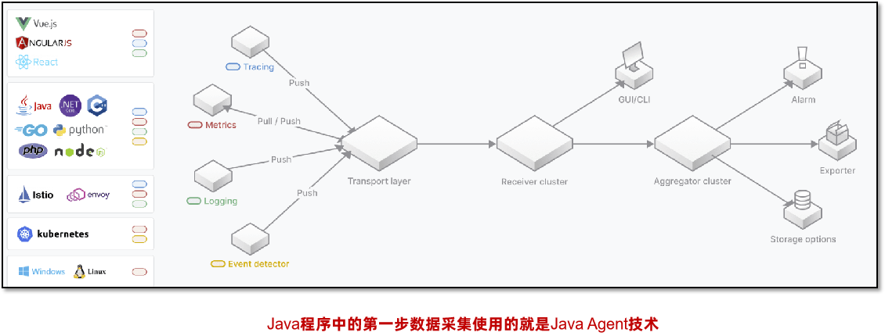

需求：

编写一个简化版的APM数据采集程序，具备以下几个功能：

1、无侵入性获取spring boot应用中，controller层方法的调用时间。

2、将所有调用时间写入文件中。

问题：

Java agent 采用静态加载模式 还是 动态加载模式？

一般程序启动之后就需要持续地进行信息的采集，所以采用静态加载模式。

#### Java Agent参数的获取

在Java Agent中，可以通过如下的方式传递参数：

java -javaagent:./agent.jar=参数 -jar test.jar

接下来通过premain参数中的agentArgs字段获取：

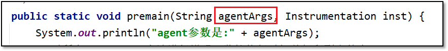

如果有多个参数，可以使用如下方式：

java -javaagent:./agent.jar=param1=value1,param2=value2 -jar test.jar

在Java代码中使用字符串解析出对应的key value。

在Java Agent中如果需要传递参数到Byte Buddy，可以采用如下的方式：

1、绑定Key Value，Key是一个自定义注解，Value是参数的值。

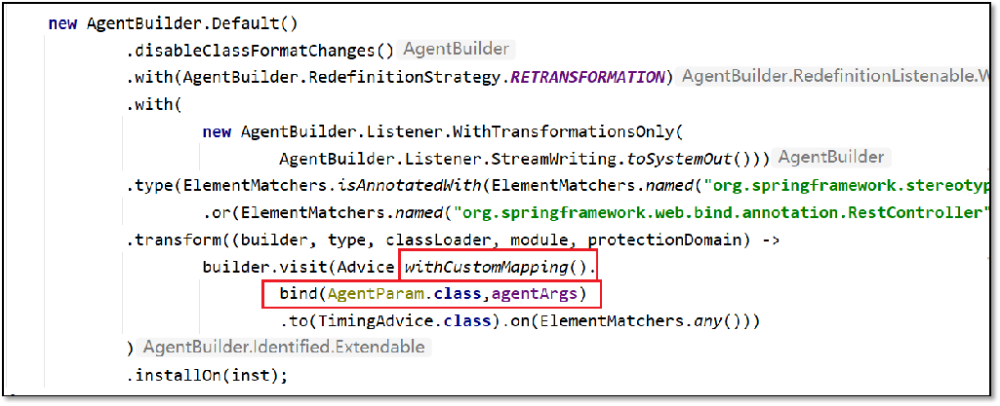

2、自定义注解

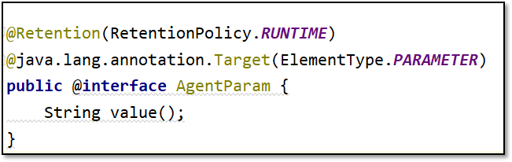

3、通过注解注入

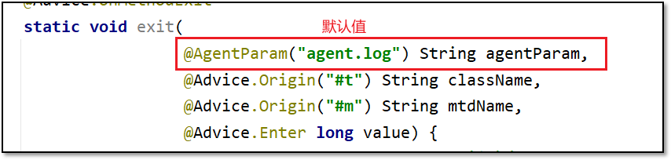

代码：

```Java
package com.itheima.javaagent;

import com.itheima.javaagent.command.ClassCommand;
import com.itheima.javaagent.command.MemoryCommand;
import com.itheima.javaagent.command.ThreadCommand;
import com.itheima.javaagent.enhancer.AgentParam;
import com.itheima.javaagent.enhancer.MyAdvice;
import com.itheima.javaagent.enhancer.TimingAdvice;
import net.bytebuddy.agent.builder.AgentBuilder;
import net.bytebuddy.asm.Advice;
import net.bytebuddy.matcher.ElementMatchers;

import java.lang.instrument.Instrumentation;
import java.util.Scanner;

public class AgentMain {
    //premain方法
    public static void premain(String agentArgs, Instrumentation inst){
        //使用bytebuddy增强类
        new AgentBuilder.Default()
                //禁止byte buddy处理时修改类名
                .disableClassFormatChanges()
                //处理时使用retransform增强
                .with(AgentBuilder.RedefinitionStrategy.RETRANSFORMATION)
                //打印出错误日志
                .with(new AgentBuilder.Listener.WithTransformationsOnly(AgentBuilder.Listener.StreamWriting
                        .toSystemOut()))
                //匹配哪些类
                .type(ElementMatchers.isAnnotatedWith(ElementMatchers.named("org.springframework.web.bind.annotation.RestController")
                        .or(ElementMatchers.named("org.springframework.web.bind.annotation.Controller")))
                )
                //增强，使用MyAdvice通知，对所有方法都进行增强
                .transform((builder, typeDescription, classLoader, module, protectionDomain) ->
                        builder.visit(Advice
                                        .withCustomMapping()
                                        .bind(AgentParam.class,agentArgs)
                                .to(TimingAdvice.class).on(ElementMatchers.any())))
                .installOn(inst);
    }

   

}
package com.itheima.javaagent.enhancer;

import net.bytebuddy.asm.Advice;
import org.apache.commons.io.FileUtils;

import java.io.File;
import java.io.IOException;
import java.nio.charset.StandardCharsets;

//统计耗时，打印方法名、类名
public class TimingAdvice {

    //方法进入时，返回开始时间
    @Advice.OnMethodEnter
    static long enter(){
        return System.nanoTime();
    }

    //方法退出时候，统计方法执行耗时
    @Advice.OnMethodExit
    static void exit(@Advice.Enter long value,
                     @Advice.Origin("#t") String className,
                     @Advice.Origin("#m") String methodName,
                     @AgentParam("agent.log") String fileName){
        String str = methodName + "@" + className + "耗时为: " + (System.nanoTime() - value) + "纳秒\n";
        try {
            FileUtils.writeStringToFile(new File(fileName),str, StandardCharsets.UTF_8,true);
        } catch (IOException e) {
            e.printStackTrace();
        }
    }
}
```

修改jar包名字，并重新打包：

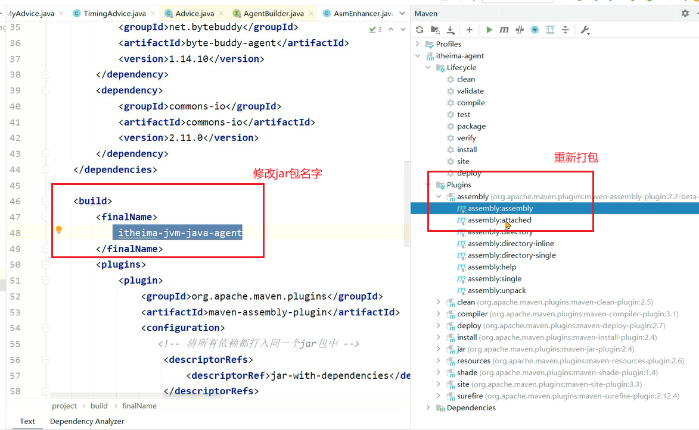

启动spring boot服务时，添加javaagent的路径,并添加文件名参数:


打印结果：

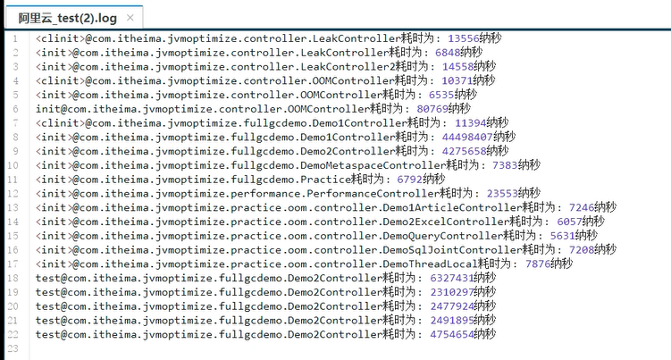

#### 总结：

**Arthas这款工具用到了什么Java技术，有没有了解过？**

回答：

Arthas主要使用了Java Agent技术，这种技术可以让运行中的Java程序执行Agent中编写代码。

Arthas使用了Agent中的动态加载模式，可以选择让某个特定的Java进程加载Agent并执行其中的监控代码。监控方面主要使用的就是JMX提供的一些监控指标，同时使用字节码增强技术，对某些类和某些方法进行增强，从而监控方法的执行耗时、参数等内容。

**APM系统是如何获取到Java程序运行中的性能数据的？**

回答：

APM系统比如Skywalking主要使用了Java Agent技术，这种技术可以让运行中的Java程序执行Agent中编写代码。

Skywalking编写了Java Agent，使用了Agent中的静态加载模式，使用字节码增强技术，对某些类和某些方法进行增强，从而监控方法的执行耗时、参数等内容。比如对Controller层方法增强，获取接口调用的时长信息，对数据库连接增强，获取数据库查询的时长、SQL语句等信息。