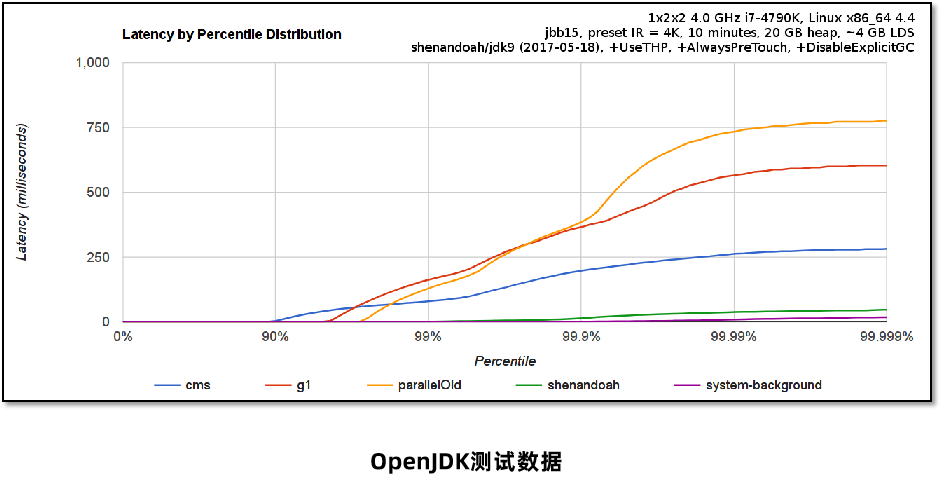
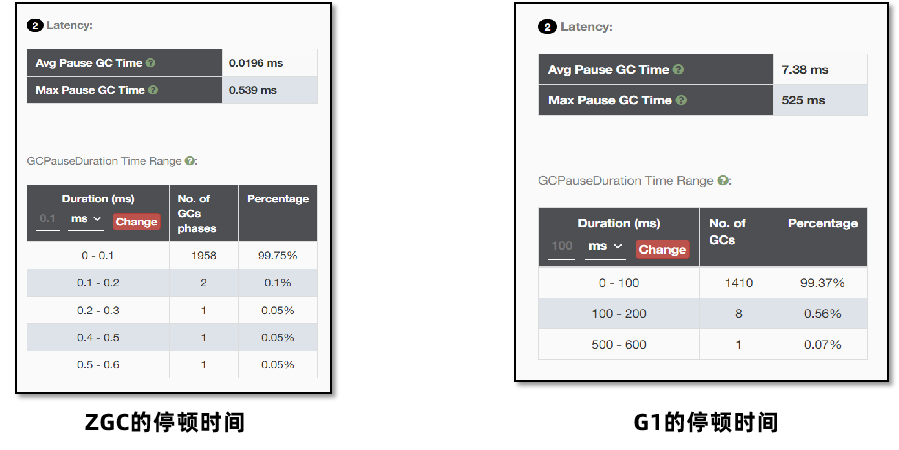

[[toc]]

新一代的GC
-------------

### 垃圾回收器的技术演进


不同的垃圾回收器设计的目标是不同的，如下图所示：


### Shenandoah GC

Shenandoah 是由Red Hat开发的一款低延迟的垃圾收集器，Shenandoah 并发执行大部分 GC 工作，包括并发的整理，堆大小对STW的时间基本没有影响。



1、下载。Shenandoah只包含在OpenJDK中，默认不包含在内需要单独构建，可以直接下载构建好的。 下载地址：https://builds.shipilev.net/openjdk-jdk-shenandoah/ 选择方式如下： {aarch64, arm32-hflt, mipsel, mips64el, ppc64le, s390x, x86_32, x86_64}：架构，使用arch命令选择对应的的架构。 {server,zero}：虚拟机类型，选择server，包含所有GC的功能。 {release, fastdebug, Slowdebug, optimization}：不同的优化级别，选择release，性能最高。 {gcc*-glibc*, msvc*}：编译器的版本，选择较高的版本性能好一些，如果兼容性有问题（无法启动），选择较低的版本。


2、配置。将OpenJDK配置到环境变量中，使用java –version进行测试。打印出如下内容代表成功。


3、添加参数，运行Java程序。

-XX:+UseShenandoahGC  开启Shenandoah GC

-Xlog:gc  打印GC日志


```Java
/*
 * Copyright (c) 2005, 2014, Oracle and/or its affiliates. All rights reserved.
 * DO NOT ALTER OR REMOVE COPYRIGHT NOTICES OR THIS FILE HEADER.
 *
 * This code is free software; you can redistribute it and/or modify it
 * under the terms of the GNU General Public License version 2 only, as
 * published by the Free Software Foundation.  Oracle designates this
 * particular file as subject to the "Classpath" exception as provided
 * by Oracle in the LICENSE file that accompanied this code.
 *
 * This code is distributed in the hope that it will be useful, but WITHOUT
 * ANY WARRANTY; without even the implied warranty of MERCHANTABILITY or
 * FITNESS FOR A PARTICULAR PURPOSE.  See the GNU General Public License
 * version 2 for more details (a copy is included in the LICENSE file that
 * accompanied this code).
 *
 * You should have received a copy of the GNU General Public License version
 * 2 along with this work; if not, write to the Free Software Foundation,
 * Inc., 51 Franklin St, Fifth Floor, Boston, MA 02110-1301 USA.
 *
 * Please contact Oracle, 500 Oracle Parkway, Redwood Shores, CA 94065 USA
 * or visit www.oracle.com if you need additional information or have any
 * questions.
 */

package org.sample;

import com.sun.management.OperatingSystemMXBean;
import org.openjdk.jmh.annotations.*;
import org.openjdk.jmh.infra.Blackhole;
import org.openjdk.jmh.runner.Runner;
import org.openjdk.jmh.runner.RunnerException;
import org.openjdk.jmh.runner.options.Options;
import org.openjdk.jmh.runner.options.OptionsBuilder;

import java.lang.management.ManagementFactory;
import java.lang.management.MemoryMXBean;
import java.lang.management.MemoryUsage;
import java.util.ArrayList;
import java.util.List;
import java.util.concurrent.TimeUnit;

//执行5轮预热，每次持续2秒
@Warmup(iterations = 5, time = 2, timeUnit = TimeUnit.SECONDS)
//输出毫秒单位
@OutputTimeUnit(TimeUnit.MILLISECONDS)
//统计方法执行的平均耗时
@BenchmarkMode(Mode.AverageTime)
//java -jar benchmarks.jar -rf json
@State(Scope.Benchmark)
public class MyBenchmark {

    //每次测试对象大小 4KB和4MB
    @Param({"4","4096"})
    int perSize;

    private void test(Blackhole blackhole){

        //每次循环创建堆内存60%对象 JMX获取到Java运行中的实时数据
        MemoryMXBean memoryMXBean = ManagementFactory.getMemoryMXBean();
        //获取堆内存大小
        MemoryUsage heapMemoryUsage = memoryMXBean.getHeapMemoryUsage();
        //获取到剩余的堆内存大小
        long heapSize = (long) ((heapMemoryUsage.getMax() - heapMemoryUsage.getUsed()) * 0.6);
        //计算循环次数
        long size = heapSize / (1024 * perSize);

        for (int i = 0; i < 4; i++) {
            List<byte[]> objects = new ArrayList<>((int)size);
            for (int j = 0; j < size; j++) {
                objects.add(new byte[1024 * perSize]);
            }
            blackhole.consume(objects);
        }
    }

    @Benchmark
    @Fork(value = 1,jvmArgsAppend = {"-Xms4g","-Xmx4g","-XX:+UseSerialGC"})
    public void serialGC(Blackhole blackhole){
        test(blackhole);
    }
    
    @Benchmark
    @Fork(value = 1,jvmArgsAppend = {"-Xms4g","-Xmx4g","-XX:+UseParallelGC"})
    public void parallelGC(Blackhole blackhole){
        test(blackhole);
    }
    
    @Benchmark
    @Fork(value = 1,jvmArgsAppend = {"-Xms4g","-Xmx4g"})
    public void g1(Blackhole blackhole){
        test(blackhole);
    }

    @Benchmark
    @Fork(value = 1,jvmArgsAppend = {"-Xms4g","-Xmx4g","-XX:+UseShenandoahGC"})
    public void shenandoahGC(Blackhole blackhole){
        test(blackhole);
    }


    public static void main(String[] args) throws RunnerException {

        Options opt = new OptionsBuilder()
                .include(MyBenchmark.class.getSimpleName())
                .forks(1)
                .build();

        new Runner(opt).run();
    }
}
```

测试结果：


Shenandoah GC对小对象的GC停顿很短，但是大对象效果不佳。

### ZGC

ZGC 是一种可扩展的低延迟垃圾回收器。ZGC 在垃圾回收过程中，STW的时间不会超过一毫秒，适合需要低延迟的应用。支持几百兆到16TB 的堆大小，堆大小对STW的时间基本没有影响。

ZGC降低了停顿时间，能降低接口的最大耗时，提升用户体验。但是吞吐量不佳，所以如果Java服务比较关注QPS（每秒的查询次数）那么G1是比较不错的选择。



#### ZGC版本更迭


#### ZGC的使用

OracleJDK和OpenJDK中都支持ZGC，阿里的DragonWell龙井JDK也支持ZGC但属于其自行对OpenJDK 11的ZGC进行优化的版本。

建议使用JDK17之后的版本，延迟较低同时无需手动配置并行线程数。

分代 ZGC添加如下参数启用   -XX:+UseZGC -XX:+ZGenerational

非分代 ZGC通过命令行选项启用 -XX:+UseZGC


#### ZGC的环境搭建

ZGC在设计上做到了自适应，根据运行情况自动调整参数，让用户手动配置的参数最少化。

- 自动设置年轻代大小，无需设置-Xmn参数。

自动晋升阈值（复制中存活多少次才搬运到老年代），无需设置-XX:TenuringThreshold。

JDK17之后支持自动的并行线程数，无需设置-XX:ConcGCThreads。

- 需要设置的参数：
  -  -Xmx 值  最大堆内存大小
  -  这是ZGC最重要的一个参数，必须设置。ZGC在运行过程中会使用一部分内存用来处理垃圾回收，所以尽量保证堆中有足够的空间。设置多少值取决于对象分配的速度，根据测试情况来决定。

- 可以设置的参数：
  -  -XX:SoftMaxHeapSize=值
  -  ZGC会尽量保证堆内存小于该值，这样在内存靠近这个值时会尽早地进行垃圾回收，但是依然有可能会超过该值。
  -  例如，-Xmx5g -XX:SoftMaxHeapSize=4g 这个参数设置，ZGC会尽量保证堆内存小于4GB，最多不会超过5GB。

```Java
@Benchmark
@Fork(value = 1,jvmArgsAppend = {"-Xms4g","-Xmx4g","-XX:+UseZGC","-XX:+UseLargePages"})
public void zGC(Blackhole blackhole){
    test(blackhole);
}

@Benchmark
@Fork(value = 1,jvmArgsAppend = {"-Xms4g","-Xmx4g","-XX:+UseZGC","-XX:+ZGenerational","-XX:+UseLargePages"})
public void zGCGenerational(Blackhole blackhole){
    test(blackhole);
}
```


ZGC整体表现还是非常不错的，分代也让ZGC的停顿时间有更好的表现。

#### ZGC调优

ZGC 中可以使用Linux的Huge Page大页技术优化性能，提升吞吐量、降低延迟。

注意：安装过程需要 root 权限，所以ZGC默认没有开启此功能。

操作步骤：

1、计算所需页数，Linux x86架构中大页大小为2MB，根据所需堆内存的大小估算大页数量。比如堆空间需要16G，预留2G（JVM需要额外的一些非堆空间），那么页数就是18G / 2MB = 9216。

2、配置系统的大页池以具有所需的页数（需要root权限）：

$ echo 9216 > /sys/kernel/mm/hugepages/hugepages-2048kB/nr_hugepages

3、添加参数-XX:+UseLargePages 启动程序进行测试

#### 实战案例

**需求：**

Java服务中存在大量软引用的缓存导致内存不足，测试下g1、Shenandoah、ZGC这三种垃圾回收器在这种场景下的回收情况。

**步骤：**

测试代码:

```Java
package com.itheima.jvmoptimize.fullgcdemo;

import com.github.benmanes.caffeine.cache.Cache;
import com.github.benmanes.caffeine.cache.Caffeine;
import lombok.SneakyThrows;
import org.apache.commons.lang3.RandomStringUtils;
import org.springframework.web.bind.annotation.GetMapping;
import org.springframework.web.bind.annotation.RequestMapping;
import org.springframework.web.bind.annotation.RestController;

import java.time.Duration;
import java.util.ArrayList;
import java.util.List;
import java.util.Random;

@RestController
@RequestMapping("/fullgc")
public class Demo2Controller {

    private Cache cache = Caffeine.newBuilder().weakKeys().softValues().build();
    private List<Object> objs = new ArrayList<>();

    private static final int _1MB = 1024 * 1024;

    //FULLGC测试
    //-Xms8g -Xmx8g -Xss256k -XX:MaxMetaspaceSize=512m  -XX:+DisableExplicitGC -XX:+HeapDumpOnOutOfMemoryError -XX:HeapDumpPath=D:/test.hprof  -verbose:gc -XX:+PrintGCDetails -XX:+PrintGCTimeStamps
    //ps + po 50并发 260ms  100并发 474  200并发 930
    //cms -XX:+UseParNewGC -XX:+UseConcMarkSweepGC 50并发 157ms  200并发 833
    //g1 JDK11 并发200 248
    @GetMapping("/1")
    public void test() throws InterruptedException {
        cache.put(RandomStringUtils.randomAlphabetic(8),new byte[10 * _1MB]);
    }

}
```

1、启动程序，添加不同的虚拟机参数进行测试。


2、使用Apache Benchmark测试工具对本机进行压测。


3、生成GC日志，使用GcEasy进行分析。

4、对比压测之后的结果。

两种垃圾回收器在并行回收时都会使用垃圾回收线程占用CPU资源

在内存足够的情况下，ZGC垃圾回收表现的效果会更好，停顿时间更短。

在内存不是特别充足的情况下， Shenandoah GC表现更好，并行垃圾回收的时间较短，用户请求的执行效率比较高。

