[[toc]]

性能调优
-----------

### 性能调优解决的问题

应用程序在运行过程中经常会出现性能问题，比较常见的性能问题现象是：

1、通过top命令查看CPU占用率高，接近100甚至多核CPU下超过100都是有可能的。


2、请求单个服务处理时间特别长，多服务使用skywalking等监控系统来判断是哪一个环节性能低下。

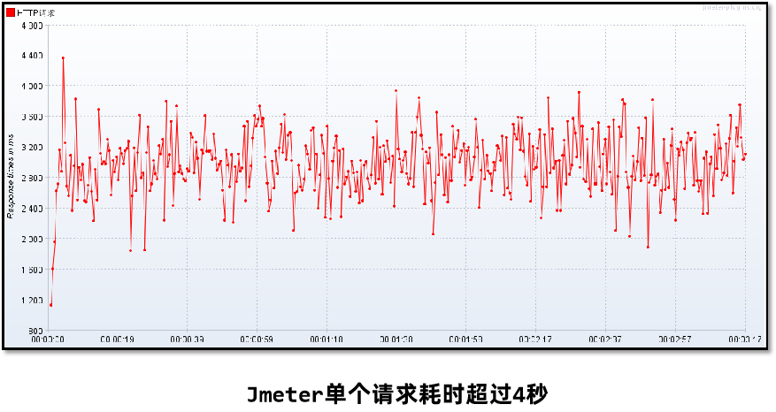

3、程序启动之后运行正常，但是在运行一段时间之后无法处理任何的请求（内存和GC正常）。

### 性能调优的方法

线程转储（Thread Dump）提供了对所有运行中的线程当前状态的快照。线程转储可以通过jstack、visualvm等工具获取。其中包含了线程名、优先级、线程ID、线程状态、线程栈信息等等内容，可以用来解决CPU占用率高、死锁等问题。

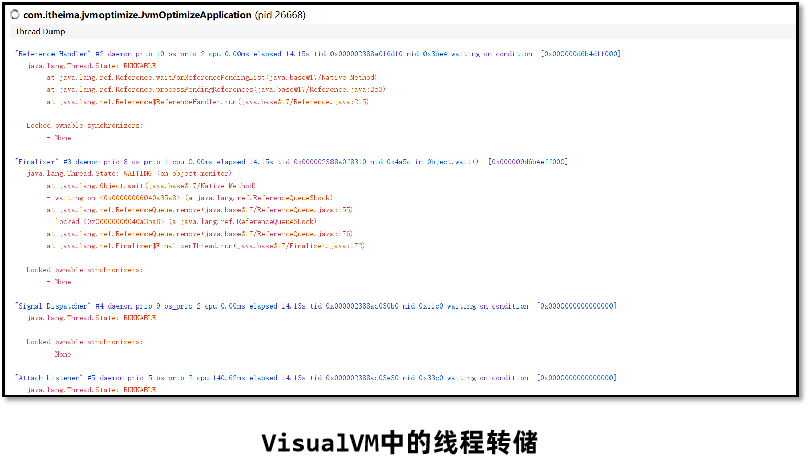

1、通过jps查看进程ID：


2、通过`jstack 进程ID`查看线程栈信息：


3、通过`jstack 进程ID > 文件名`导出线程栈文件


线程转储（Thread Dump）中的几个核心内容： 名称： 线程名称，通过给线程设置合适的名称更容易“见名知意” 优先级（prio）：线程的优先级 Java ID（tid）：JVM中线程的唯一ID 本地 ID (nid)：操作系统分配给线程的唯一ID 状态：线程的状态，分为： NEW – 新创建的线程，尚未开始执行 RUNNABLE –正在运行或准备执行 BLOCKED – 等待获取监视器锁以进入或重新进入同步块/方法 WAITING – 等待其他线程执行特定操作，没有时间限制 TIMED_WAITING – 等待其他线程在指定时间内执行特定操作 TERMINATED – 已完成执行 栈追踪： 显示整个方法的栈帧信息 线程转储的可视化在线分析平台： 1、 https://jstack.review/ 2、 https://fastthread.io/

#### 案例1：解决CPU占用率高的问题

应用程序在运行过程中经常会出现性能问题，比较常见的性能问题现象是：

1、通过top命令查看CPU占用率高，接近100甚至多核CPU下超过100都是有可能的。

2、请求单个服务处理时间特别长，多服务使用skywalking等监控系统来判断是哪一个环节性能低下。

3、程序启动之后运行正常，但是在运行一段时间之后无法处理任何的请求（内存和GC正常）。

问题：

监控人员通过prometheus的告警发现CPU占用率一直处于很高的情况，通过top命令看到是由于Java程序引起的，希望能快速定位到是哪一部分代码导致了性能问题。

解决思路：

1、通过top –c 命令找到CPU占用率高的进程，获取它的进程ID。


2、使用top -p 进程ID单独监控某个进程，按H可以查看到所有的线程以及线程对应的CPU使用率，找到CPU使用率特别高的线程。


3、使用 jstack 进程ID 命令可以查看到所有线程正在执行的栈信息。使用 jstack 进程ID > 文件名 保存到文件中方便查看。

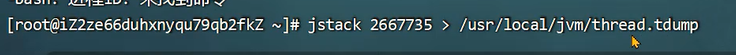

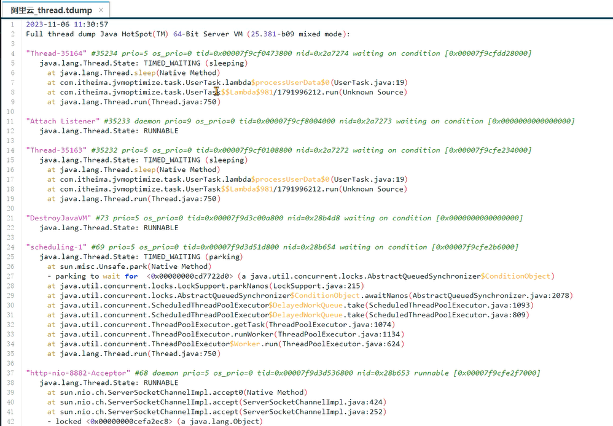

4、找到nid线程ID相同的栈信息，需要将之前记录下的十进制线程号转换成16进制。通过 printf ‘%x\n’ 线程ID 命令直接获得16进制下的线程ID。

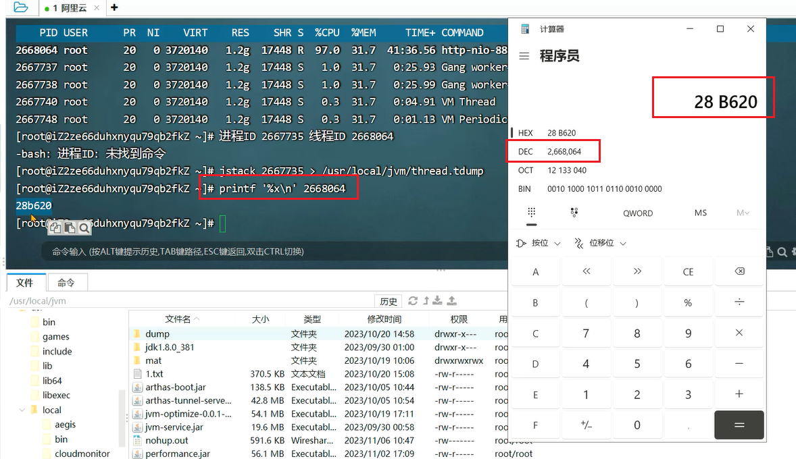


5、找到栈信息对应的源代码，并分析问题产生原因。

在定位CPU占用率高的问题时，比较需要关注的是状态为RUNNABLE的线程。但实际上，有一些线程执行本地方法时并不会消耗CPU，而只是在等待。但 JVM 仍然会将它们标识成“RUNNABLE”状态。


### 案例实战

#### 案例2：接口响应时间很长的问题

问题：

在程序运行过程中，发现有几个接口的响应时间特别长，需要快速定位到是哪一个方法的代码执行过程中出现了性能问题。

解决思路：

已经确定是某个接口性能出现了问题，但是由于方法嵌套比较深，需要借助于arthas定位到具体的方法。

比如调用链是A方法 -> B方法 -> C方法 -> D方法，整体耗时较长。我们需要定位出来是C方法慢导致的问题。


**trace命令监控**

使用arthas的trace命令，可以展示出整个方法的调用路径以及每一个方法的执行耗时。

命令： `trace 类名 方法名`

添加 `--skipJDKMethod false` 参数可以输出JDK核心包中的方法及耗时。

添加 ‘#cost > 毫秒值’ 参数，只会显示耗时超过该毫秒值的调用。

添加 `–n 数值` 参数，最多显示该数值条数的数据。

所有监控都结束之后，输入`stop`结束监控，重置arthas增强的对象。

测试方法：

```
com.itheima.jvmoptimize.performance.PerformanceController.a()
```

1、使用trace命令，监控方法的执行：


2、发起一次请求调用：


3、显示出了方法调用的耗时占比：

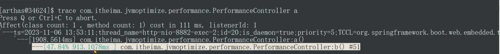

4、添加 `--skipJDKMethod false` 参数可以输出JDK核心包中的方法及耗时：

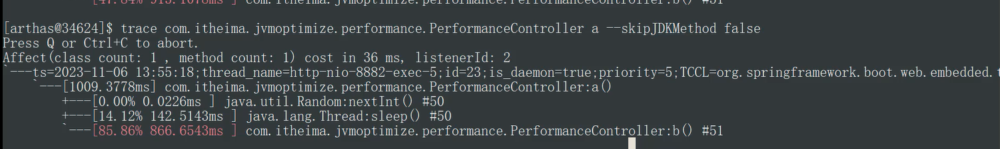

5、添加 ‘#cost > 1000’ 参数，只显示耗时超过1秒的调用。


6、添加 `–n 1` 参数，最多显示1条数据，避免数据太多看起来不清晰。


7、所有监控都结束之后，输入`stop`结束监控，重置arthas增强的对象。避免对性能产生影响。


**watch命令监控**

在使用trace定位到性能较低的方法之后，使用watch命令监控该方法，可以获得更为详细的方法信息。

命令：  

```
watch 类名 方法名 ‘{params, returnObj}’ ‘#cost>毫秒值' -x 2
```

`‘{params, returnObj}‘` 代表打印参数和返回值。

`-x` 代表打印的结果中如果有嵌套（比如对象里有属性），最多只展开2层。允许设置的最大值为4。

测试方法：

```
com.itheima.jvmoptimize.performance.PerformanceController.a()
```

1、执行命令，发起一笔接口调用：


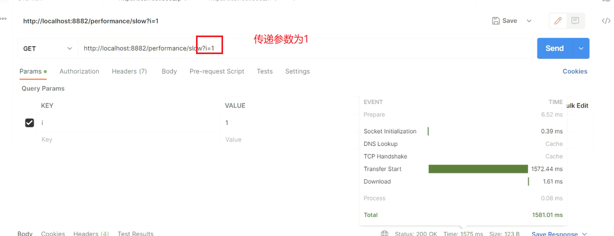

2、cost = 1565ms代表方法执行时间是1.56秒，result = 后边是参数的内容，首先是一个集合（既可以获取返回值，也可以获取参数），第一个数组就是参数，里边只有一个元素是一个整数值为1。


总结：

1、通过arthas的trace命令，首先找到性能较差的具体方法，如果访问量比较大，建议设置最小的耗时，精确的找到耗时比较高的调用。

2、通过watch命令，查看此调用的参数和返回值，重点是参数，这样就可以在开发环境或者测试环境模拟类似的现象，通过debug找到具体的问题根源。

3、使用stop命令将所有增强的对象恢复。

#### 案例3：定位偏底层的性能问题

问题：

有一个接口中使用了for循环向ArrayList中添加数据，但是最终发现执行时间比较长，需要定位是由于什么原因导致的性能低下。

解决思路：

Arthas提供了性能火焰图的功能，可以非常直观地显示所有方法中哪些方法执行时间比较长。

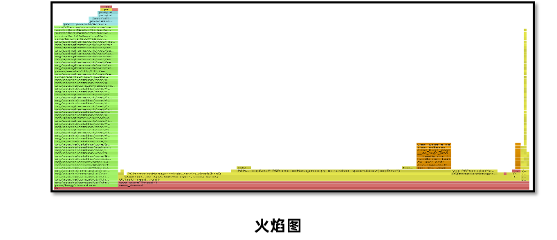

测试方法：

```
com.itheima.jvmoptimize.performance.PerformanceController.test6()
```

使用arthas的profile命令，生成性能监控的火焰图。

命令1：  profiler start  开始监控方法执行性能

命令2：  profiler stop --format html  以HTML的方式生成火焰图

火焰图中一般找绿色部分Java中栈顶上比较平的部分，很可能就是性能的瓶颈。

1、使用命令开始监控：


2、发送请求测试：


3、执行命令结束，并生成火焰图的HTML


4、观察火焰图的结果：

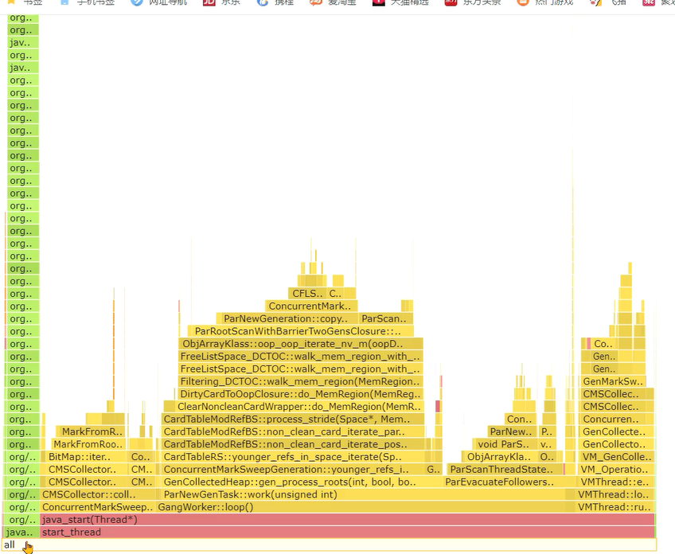

火焰图中重点关注左边部分，是我们自己编写的代码的执行性能，右边是Java虚拟机底层方法的性能。火焰图中会展示出Java虚拟机自身方法执行的时间。

火焰图中越宽的部分代表执行时间越长，比如：

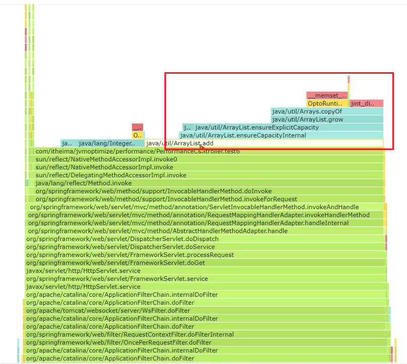

很明显ArrayList类中的add方法调用花费了大量的时间，这其中可以发现一个copyOf方法，数组的拷贝占用时间较多。

观察源码可以知道，频繁的扩容需要多次将老数组中的元素复制到新数组，浪费了大量的时间。


在ArrayList的构造方法中，设置一下最大容量，一开始就让它具备这样的大小，避免频繁扩容带来的影响：

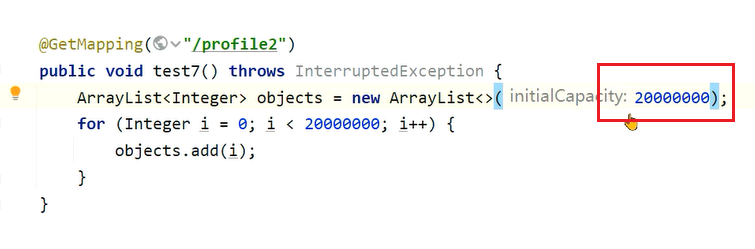

最终这部分开销就没有了，宽度变大是因为我放大了这张图：


总结：

偏底层的性能问题，特别是由于JDK中某些方法被大量调用导致的性能低下，可以使用火焰图非常直观的找到原因。

这个案例中是由于创建ArrayList时没有手动指定容量，导致使用默认的容量而在添加对象过程中发生了多次的扩容，扩容需要将原来数组中的元素复制到新的数组中，消耗了大量的时间。通过火焰图可以看到大量的调用，修复完之后节省了20% ~ 50%的时间。

#### 案例4：线程被耗尽问题

问题：

程序在启动运行一段时间之后，就无法接受任何请求了。将程序重启之后继续运行，依然会出现相同的情况。

解决思路：

线程耗尽问题，一般是由于执行时间过长，分析方法分成两步：

1、检测是否有死锁产生，无法自动解除的死锁会将线程永远阻塞。

2、如果没有死锁，再使用案例1的打印线程栈的方法检测线程正在执行哪个方法，一般这些大量出现的方法就是慢方法。

死锁：两个或以上的线程因为争夺资源而造成互相等待的现象。

死锁问题，学习黑马程序员《JUC并发编程》相关章节。 地址 ： https://www.bilibili.com/video/BV16J411h7Rd?p=115

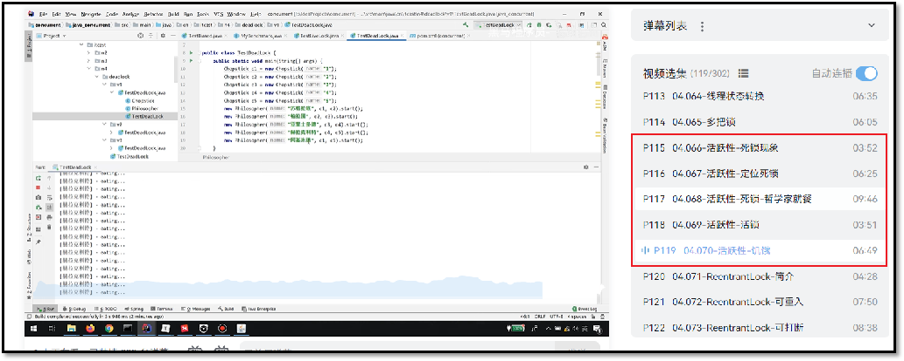

解决方案：

线程死锁可以通过三种方法定位问题：

测试方法：

```
com.itheima.jvmoptimize.performance.PerformanceController.test6()
com.itheima.jvmoptimize.performance.PerformanceController.test7()
```

先调用deadlock1(test6)方法

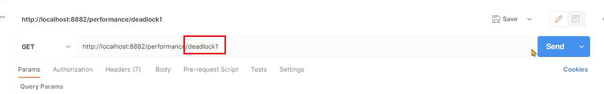

再调用deadlock2(test7)方法，就可以产生死锁


1、 jstack -l 进程ID > 文件名  将线程栈保存到本地。

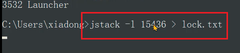

在文件中搜索deadlock即可找到死锁位置：


2、 开发环境中使用visual vm或者Jconsole工具，都可以检测出死锁。使用线程快照生成工具就可以看到死锁的根源。生产环境的服务一般不会允许使用这两种工具连接。


3、使用fastthread自动检测线程问题。 https://fastthread.io/ Fastthread和Gceasy类似，是一款在线的AI自动线程问题检测工具，可以提供线程分析报告。通过报告查看是否存在死锁问题。

在visualvm中保存线程栈：


选择文件并点击分析：

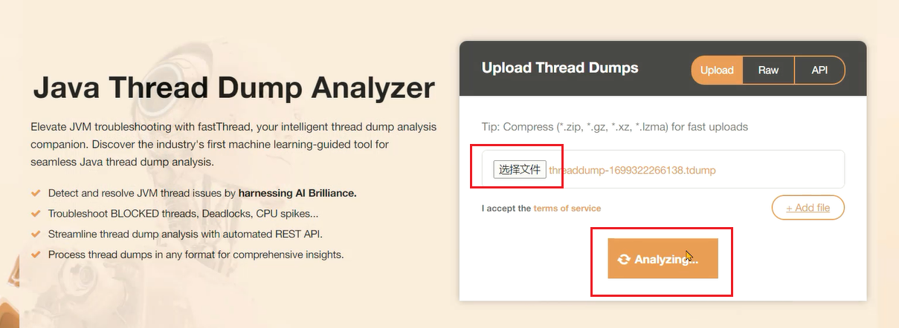

死锁分析报告：


### JMH基准测试框架

面试中容易问到性能测试问题：


Java程序在运行过程中，JIT即时编译器会实时对代码进行性能优化，所以仅凭少量的测试是无法真实反应运行系统最终给用户提供的性能。如下图，随着执行次数的增加，程序性能会逐渐优化。

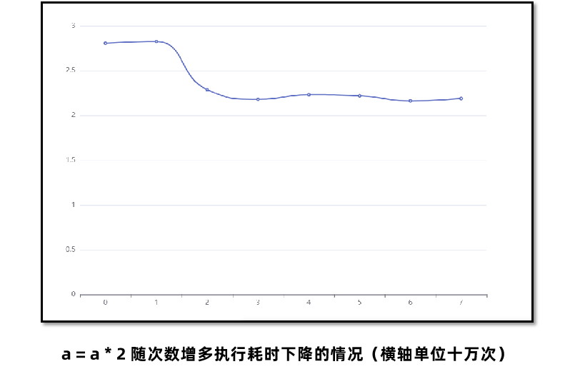

所以简单地打印时间是不准确的，JIT有可能还没有对程序进行性能优化，我们拿到的测试数据和最终用户使用的数据是不一致的。

OpenJDK中提供了一款叫JMH（Java Microbenchmark Harness）的工具，可以准确地对Java代码进行基准测试，量化方法的执行性能。 官网地址：https://github.com/openjdk/jmhc JMH会首先执行预热过程，确保JIT对代码进行优化之后再进行真正的迭代测试，最后输出测试的结果。


#### JMH环境搭建：

创建基准测试项目，在CMD窗口中，使用以下命令创建JMH环境项目：

```Shell
mvn archetype:generate \
-DinteractiveMode=false \
-DarchetypeGroupId=org.openjdk.jmh \
-DarchetypeArtifactId=jmh-java-benchmark-archetype \
-DgroupId=org.sample \
-DartifactId=test \
-Dversion=1.0
```

修改POM文件中的JDK版本号和JMH版本号，JMH最新版本号参考Github。


编写测试方法，几个需要注意的点：

- 死代码问题
- 黑洞的用法

初始代码：

```Java
package org.sample;

import org.openjdk.jmh.annotations.*;
import org.openjdk.jmh.results.format.ResultFormatType;
import org.openjdk.jmh.runner.Runner;
import org.openjdk.jmh.runner.RunnerException;
import org.openjdk.jmh.runner.options.Options;
import org.openjdk.jmh.runner.options.OptionsBuilder;

import java.text.SimpleDateFormat;
import java.time.LocalDateTime;
import java.time.format.DateTimeFormatter;
import java.util.Date;
import java.util.concurrent.TimeUnit;

//执行5轮预热，每次持续1秒
@Warmup(iterations = 5, time = 1, timeUnit = TimeUnit.SECONDS)
//执行一次测试
@Fork(value = 1, jvmArgsAppend = {"-Xms1g", "-Xmx1g"})
//显示平均时间，单位纳秒
@BenchmarkMode(Mode.AverageTime)
@OutputTimeUnit(TimeUnit.NANOSECONDS)
@State(Scope.Benchmark)
public class HelloWorldBench {

    @Benchmark
    public int test1() {
        int i = 0;
        i++;
        return i;
    }

    public static void main(String[] args) throws RunnerException {
        Options opt = new OptionsBuilder()
                .include(HelloWorldBench.class.getSimpleName())
                .resultFormat(ResultFormatType.JSON)
                .forks(1)
                .build();

        new Runner(opt).run();
    }
}
```

如果不降i返回，JIT会直接将这段代码去掉，因为它认为你不会使用*i那么我们对i进行的任何处理都是没有意义的，这种代码无法执行的现象称之为**`死代码`*

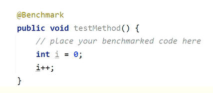

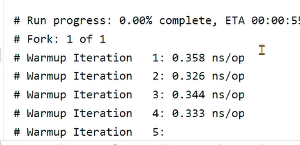

我们可以将i返回，或者添加黑洞来消费这些变量，让JIT无法消除这些代码:

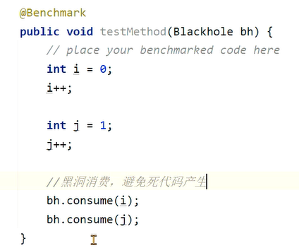


通过maven的verify命令，检测代码问题并打包成jar包。通过 java -jar target/benchmarks.jar 命令执行基准测试。

添加这行参数，可以生成JSON文件，测试结果通过https://jmh.morethan.io/生成可视化的结果。

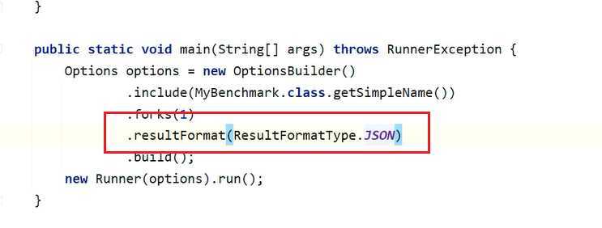

#### 案例：日期格式化方法性能测试 问题：

在JDK8中，可以使用Date进行日期的格式化，也可以使用LocalDateTime进行格式化，使用JMH对比这两种格式化的性能。

**解决思路：**

1、搭建JMH测试环境。

2、编写JMH测试代码。

3、进行测试。

4、比对测试结果。

```Java
package org.sample;

import org.openjdk.jmh.annotations.*;
import org.openjdk.jmh.results.format.ResultFormatType;
import org.openjdk.jmh.runner.Runner;
import org.openjdk.jmh.runner.RunnerException;
import org.openjdk.jmh.runner.options.Options;
import org.openjdk.jmh.runner.options.OptionsBuilder;

import java.text.SimpleDateFormat;
import java.time.LocalDateTime;
import java.time.format.DateTimeFormatter;
import java.util.Date;
import java.util.concurrent.TimeUnit;

//执行5轮预热，每次持续1秒
@Warmup(iterations = 5, time = 1, timeUnit = TimeUnit.SECONDS)
//执行一次测试
@Fork(value = 1, jvmArgsAppend = {"-Xms1g", "-Xmx1g"})
//显示平均时间，单位纳秒
@BenchmarkMode(Mode.AverageTime)
@OutputTimeUnit(TimeUnit.NANOSECONDS)
@State(Scope.Thread)
public class DateBench {


    private static String sDateFormatString = "yyyy-MM-dd HH:mm:ss";
    private Date date = new Date();
    private LocalDateTime localDateTime = LocalDateTime.now();
    private static ThreadLocal<SimpleDateFormat> simpleDateFormatThreadLocal = new ThreadLocal();
    private static final DateTimeFormatter formatter = DateTimeFormatter.ofPattern("yyyy-MM-dd HH:mm:ss");

    @Setup
    public void setUp() {

        SimpleDateFormat sdf = new SimpleDateFormat(sDateFormatString);
        simpleDateFormatThreadLocal.set(sdf);

    }

    @Benchmark
    public String date() {
        SimpleDateFormat simpleDateFormat = new SimpleDateFormat(sDateFormatString);
        return simpleDateFormat.format(date);
    }

    @Benchmark
    public String localDateTime() {
        return localDateTime.format(formatter);
    }
    @Benchmark
    public String localDateTimeNotSave() {
        return localDateTime.format(DateTimeFormatter.ofPattern("yyyy-MM-dd HH:mm:ss"));
    }

    @Benchmark
    public String dateThreadLocal() {
        return simpleDateFormatThreadLocal.get().format(date);
    }


    public static void main(String[] args) throws RunnerException {
        Options opt = new OptionsBuilder()
                .include(DateBench.class.getSimpleName())
                .resultFormat(ResultFormatType.JSON)
                .forks(1)
                .build();

        new Runner(opt).run();
    }
}
```

### 性能调优综合案例

问题：

小李的项目中有一个获取用户信息的接口性能比较差，他希望能对这个接口在代码中进行彻底的优化，提升性能。

解决思路：

1、使用trace分析性能瓶颈。

2、优化代码，反复使用trace测试性能提升的情况。

3、使用JMH在SpringBoot环境中进行测试。

4、比对测试结果。

```Java
package com.itheima.jvmoptimize.performance.practice.controller;

import com.itheima.jvmoptimize.performance.practice.entity.User;
import com.itheima.jvmoptimize.performance.practice.entity.UserDetails;
import com.itheima.jvmoptimize.performance.practice.service.UserService;
import com.itheima.jvmoptimize.performance.practice.vo.UserVO;
import org.springframework.beans.factory.annotation.Autowired;
import org.springframework.web.bind.annotation.GetMapping;
import org.springframework.web.bind.annotation.RequestMapping;
import org.springframework.web.bind.annotation.RestController;

import java.text.SimpleDateFormat;
import java.time.format.DateTimeFormatter;
import java.util.ArrayList;
import java.util.HashMap;
import java.util.List;
import java.util.Map;
import java.util.stream.Collectors;

@RestController
@RequestMapping("/puser")
public class UserController {

    @Autowired
    private UserService userService;

    private final DateTimeFormatter formatter = DateTimeFormatter.ofPattern("yyyy-MM-dd HH:mm:ss");

    //初始代码
    public List<UserVO> user1(){
        //1.从数据库获取前端需要的详情数据
        List<UserDetails> userDetails = userService.getUserDetails();

        //2.获取缓存中的用户数据
        List<User> users = userService.getUsers();

        SimpleDateFormat simpleDateFormat = new SimpleDateFormat("yyyy-MM-dd HH:mm:ss");
        //3.遍历详情集合，从缓存中获取用户名，生成VO进行填充
        ArrayList<UserVO> userVOS = new ArrayList<>();
        for (UserDetails userDetail : userDetails) {
            UserVO userVO = new UserVO();
            //可以使用BeanUtils对象拷贝
            userVO.setId(userDetail.getId());
            userVO.setRegister(simpleDateFormat.format(userDetail.getRegister2()));
            //填充name
            for (User user : users) {
                if(user.getId().equals(userDetail.getId())){
                    userVO.setName(user.getName());
                }
            }
            //加入集合
            userVOS.add(userVO);
        }

        return userVOS;

    }


    //使用HasmMap存放用户名字
    public List<UserVO> user2(){
        //1.从数据库获取前端需要的详情数据
        List<UserDetails> userDetails = userService.getUserDetails();

        //2.获取缓存中的用户数据
        List<User> users = userService.getUsers();
        //将list转换成hashmap
        HashMap<Long, User> map = new HashMap<>();
        for (User user : users) {
            map.put(user.getId(),user);
        }

        SimpleDateFormat simpleDateFormat = new SimpleDateFormat("yyyy-MM-dd HH:mm:ss");
        //3.遍历详情集合，从缓存中获取用户名，生成VO进行填充
        ArrayList<UserVO> userVOS = new ArrayList<>();
        for (UserDetails userDetail : userDetails) {
            UserVO userVO = new UserVO();
            //可以使用BeanUtils对象拷贝
            userVO.setId(userDetail.getId());
            userVO.setRegister(simpleDateFormat.format(userDetail.getRegister2()));
            //填充name
            userVO.setName(map.get(userDetail.getId()).getName());
            //加入集合
            userVOS.add(userVO);
        }

        return userVOS;

    }


    //优化日期格式化
    public List<UserVO> user3(){
        //1.从数据库获取前端需要的详情数据
        List<UserDetails> userDetails = userService.getUserDetails();

        //2.获取缓存中的用户数据
        List<User> users = userService.getUsers();
        //将list转换成hashmap
        HashMap<Long, User> map = new HashMap<>();
        for (User user : users) {
            map.put(user.getId(),user);
        }

        //3.遍历详情集合，从缓存中获取用户名，生成VO进行填充
        ArrayList<UserVO> userVOS = new ArrayList<>();
        for (UserDetails userDetail : userDetails) {
            UserVO userVO = new UserVO();
            //可以使用BeanUtils对象拷贝
            userVO.setId(userDetail.getId());
            userVO.setRegister(userDetail.getRegister().format(formatter));
            //填充name
            userVO.setName(map.get(userDetail.getId()).getName());
            //加入集合
            userVOS.add(userVO);
        }

        return userVOS;

    }

    @GetMapping
    //使用stream流改写for循环
    public List<UserVO> user4(){
        //1.从数据库获取前端需要的详情数据
        List<UserDetails> userDetails = userService.getUserDetails();

        //2.获取缓存中的用户数据
        List<User> users = userService.getUsers();
        //将list转换成hashmap
        Map<Long, User> map = users.stream().collect(Collectors.toMap(User::getId, o -> o));

        //3.遍历详情集合，从缓存中获取用户名，生成VO进行填充
        return userDetails.stream().map(userDetail -> {
            UserVO userVO = new UserVO();
            //可以使用BeanUtils对象拷贝
            userVO.setId(userDetail.getId());
            userVO.setRegister(userDetail.getRegister().format(formatter));
            //填充name
            userVO.setName(map.get(userDetail.getId()).getName());
            return userVO;
        }).collect(Collectors.toList());

    }

    //使用并行流优化性能
    public List<UserVO> user5(){
        //1.从数据库获取前端需要的详情数据
        List<UserDetails> userDetails = userService.getUserDetails();

        //2.获取缓存中的用户数据
        List<User> users = userService.getUsers();
        //将list转换成hashmap
        Map<Long, User> map = users.parallelStream().collect(Collectors.toMap(User::getId, o -> o));

        //3.遍历详情集合，从缓存中获取用户名，生成VO进行填充
        return userDetails.parallelStream().map(userDetail -> {
            UserVO userVO = new UserVO();
            //可以使用BeanUtils对象拷贝
            userVO.setId(userDetail.getId());
            userVO.setRegister(userDetail.getRegister().format(formatter));
            //填充name
            userVO.setName(map.get(userDetail.getId()).getName());
            return userVO;
        }).collect(Collectors.toList());

    }
}
```

在SpringBoot项目中整合JMH:

1、pom文件中添加依赖:

```XML
<dependency>
    <groupId>org.openjdk.jmh</groupId>
    <artifactId>jmh-core</artifactId>
    <version>${jmh.version}</version>
    <scope>test</scope>
</dependency>
<dependency>
    <groupId>org.openjdk.jmh</groupId>
    <artifactId>jmh-generator-annprocess</artifactId>
    <version>${jmh.version}</version>
    <scope>test</scope>
</dependency>
<properties>
    <java.version>8</java.version>
    <jmh.version>1.37</jmh.version>
</properties>
```

2、测试类中编写:

```Java
package com.itheima.jvmoptimize;

import com.itheima.jvmoptimize.performance.practice.controller.UserController;
import org.junit.jupiter.api.Test;
import org.openjdk.jmh.annotations.*;
import org.openjdk.jmh.infra.Blackhole;
import org.openjdk.jmh.results.format.ResultFormatType;
import org.openjdk.jmh.runner.Runner;
import org.openjdk.jmh.runner.RunnerException;
import org.openjdk.jmh.runner.options.OptionsBuilder;
import org.springframework.boot.SpringApplication;
import org.springframework.context.ApplicationContext;

import java.io.IOException;
import java.util.concurrent.TimeUnit;

//执行5轮预热，每次持续1秒
@Warmup(iterations = 5, time = 1, timeUnit = TimeUnit.SECONDS)
//执行一次测试
@Fork(value = 1, jvmArgsAppend = {"-Xms1g", "-Xmx1g"})
//显示平均时间，单位纳秒
@BenchmarkMode(Mode.AverageTime)
@OutputTimeUnit(TimeUnit.MILLISECONDS)
@State(Scope.Benchmark)
public class PracticeBenchmarkTest {

    private UserController userController;
    private ApplicationContext context;

    //初始化将springboot容器启动 端口号随机
    @Setup
    public void setup() {
        this.context = new SpringApplication(JvmOptimizeApplication.class).run();
        userController = this.context.getBean(UserController.class);
    }

    //启动这个测试用例进行测试
    @Test
    public void executeJmhRunner() throws RunnerException, IOException {

        new Runner(new OptionsBuilder()
                .shouldDoGC(true)
                .forks(0)
                .resultFormat(ResultFormatType.JSON)
                .shouldFailOnError(true)
                .build()).run();
    }

    //用黑洞消费数据，避免JIT消除代码
    @Benchmark
    public void test1(final Blackhole bh) {

        bh.consume(userController.user1());
    }

    @Benchmark
    public void test2(final Blackhole bh) {

        bh.consume(userController.user2());
    }

    @Benchmark
    public void test3(final Blackhole bh) {

        bh.consume(userController.user3());
    }

    @Benchmark
    public void test4(final Blackhole bh) {

        bh.consume(userController.user4());
    }

    @Benchmark
    public void test5(final Blackhole bh) {

        bh.consume(userController.user5());
    }
}
```

总结：

1、本案例中性能问题产生的原因是两层for循环导致的循环次数过多，处理时间在循环次数变大的情况下变得非常长，考虑将一层循环拆出去，创建HashMap用来查询提升性能。

2、使用LocalDateTime替代SimpleDateFormat进行日期的格式化。

3、使用stream流改造代码，这一步可能会导致性能下降，主要是为了第四次优化准备。

4、使用并行流利用多核CPU的优势并行执行提升性能。
