[[toc]]

GC调优
------

GC调优指的是对垃圾回收（Garbage Collection）进行调优。GC调优的主要目标是避免由垃圾回收引起程序性能下降。

GC调优的核心分成三部分：

1、通用Jvm参数的设置。

2、特定垃圾回收器的Jvm参数的设置。

3、解决由频繁的FULLGC引起的程序性能问题。

GC调优没有没有唯一的标准答案，如何调优与硬件、程序本身、使用情况均有关系，重点学习调优的工具和方法。

### GC调优的核心指标

所以判断GC是否需要调优，需要从三方面来考虑，与GC算法的评判标准类似：

1.吞吐量(Throughput) 吞吐量分为业务吞吐量和垃圾回收吞吐量

业务吞吐量指的在一段时间内，程序需要完成的业务数量。比如企业中对于吞吐量的要求可能会是这样的：

支持用户每天生成10000笔订单

在晚上8点到10点，支持用户查询50000条商品信息

保证高吞吐量的常规手段有两条：

1、优化业务执行性能，减少单次业务的执行时间

2、优化垃圾回收吞吐量

#### 垃圾回收吞吐量

垃圾回收吞吐量指的是 CPU 用于执行用户代码的时间与 CPU 总执行时间的比值，即吞吐量 = 执行用户代码时间 /（执行用户代码时间 + GC时间）。吞吐量数值越高，垃圾回收的效率就越高，允许更多的CPU时间去处理用户的业务，相应的业务吞吐量也就越高。

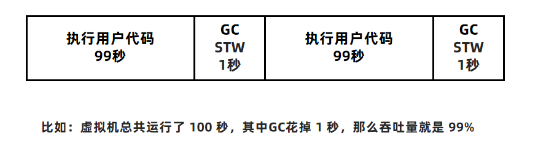


#### 延迟（Latency）

1. 延迟指的是从用户发起一个请求到收到响应这其中经历的时间。比如企业中对于延迟的要求可能会是这样的：

1. 所有的请求必须在5秒内返回给用户结果

1. 延迟 = GC延迟 + 业务执行时间，所以如果GC时间过长，会影响到用户的使用。


#### 内存使用量

1. 内存使用量指的是Java应用占用系统内存的最大值，一般通过Jvm参数调整，在满足上述两个指标的前提下，这个值越小越好。

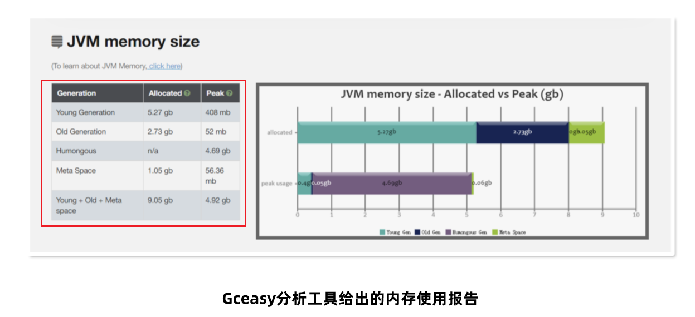

### GC调优的步骤

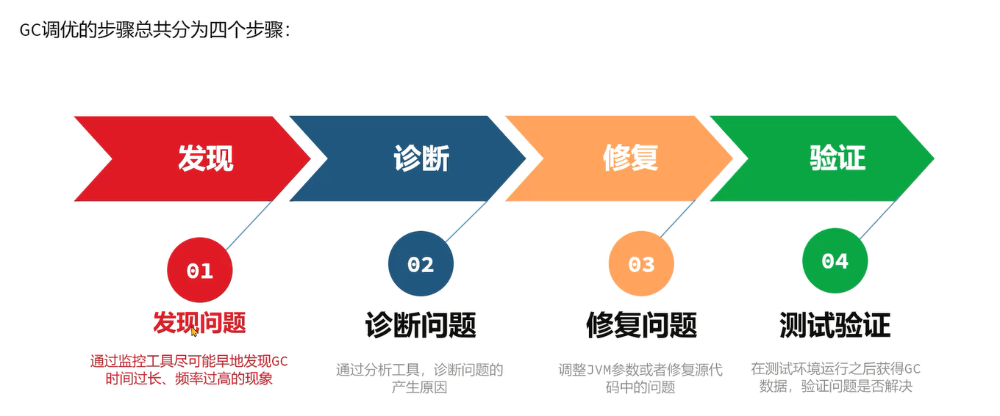

#### 发现问题 - 常用工具

#####  jstat工具

Jstat工具是JDK自带的一款监控工具，可以提供各种垃圾回收、类加载、编译信息

等不同的数据。使用方法为：`jstat -gc 进程ID 每次统计的间隔（毫秒） 统计次数 `


C代表Capacity容量，U代表Used使用量

S – 幸存者区，E – 伊甸园区，O – 老年代，M – 元空间

YGC、YGT：年轻代GC次数和GC耗时（单位：秒）

FGC、FGCT：Full GC次数和Full GC耗时

GCT：GC总耗时

优点：

 操作简单

 无额外的软件安装

缺点：

 无法精确到GC产生的时间，只能用于判断GC是否存在问题 

##### Visualvm插件

VisualVm中提供了一款Visual GC插件，实时监控Java进程的堆内存结构、堆内存变化趋势以及垃圾回收时间的变化趋势。同时还可以监控对象晋升的直方图。

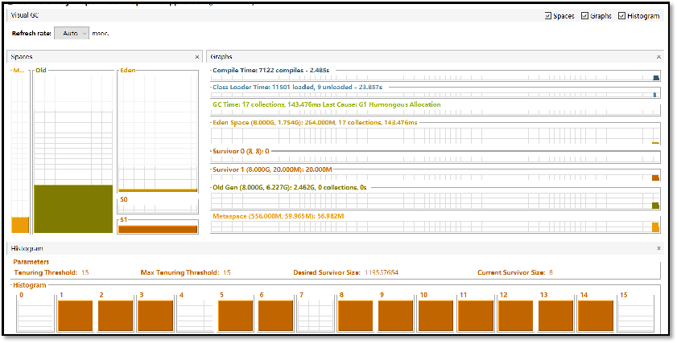

优点：

 适合开发使用，能直观的看到堆内存和GC的变化趋势

缺点：

 对程序运行性能有一定影响

 生产环境程序员一般没有权限进行操作

安装方法：

1、打开插件页面


2、安装Visual GC插件


3、选择标签就可以看到内容：


##### Prometheus + Grafana

Prometheus+Grafana是企业中运维常用的监控方案，其中Prometheus用来采系统或者应用的相关数据，同时具备告警功能。Grafana可以将Prometheus采集到的数据以可视化的方式进行展示。

Java程序员要学会如何读懂Grafana展示的Java虚拟机相关的参数。


优点：

 支持系统级别和应用级别的监控，比如linux操作系统、Redis、MySQL、Java进程。

 支持告警并允许自定义告警指标，通过邮件、短信等方式尽早通知相关人员进行处理

缺点：

 环境搭建较为复杂，一般由运维人员完成

##### GC日志

通过GC日志，可以更好的看到垃圾回收细节上的数据，同时也可以根据每款垃圾回收器的不同特点更好地发现存在的问题。

使用方法（JDK 8及以下）：-XX:+PrintGCDetails  -Xloggc:文件名

使用方法（JDK 9+）：-Xlog:gc*:file=文件名


1、添加虚拟机参数：


2、打开日志文件就可以看到GC日志


3、分析GC日志

**分析GC日志 - GCViewer**

GCViewer是一个将GC日志转换成可视化图表的小工具，github地址： https://github.com/chewiebug/GCViewer 使用方法：java -jar gcviewer_1.3.4.jar 日志文件.log


右下角是基础信息，左边是内存趋势图

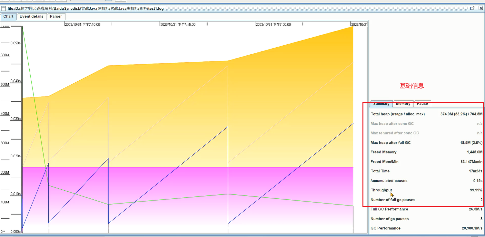

**分析GC日志 - GCEasy**

GCeasy是业界首款使用AI机器学习技术在线进行GC分析和诊断的工具。定位内存泄漏、GC延迟高的问题，提供JVM参数优化建议，支持在线的可视化工具图表展示。 官方网站：https://gceasy.io/ 

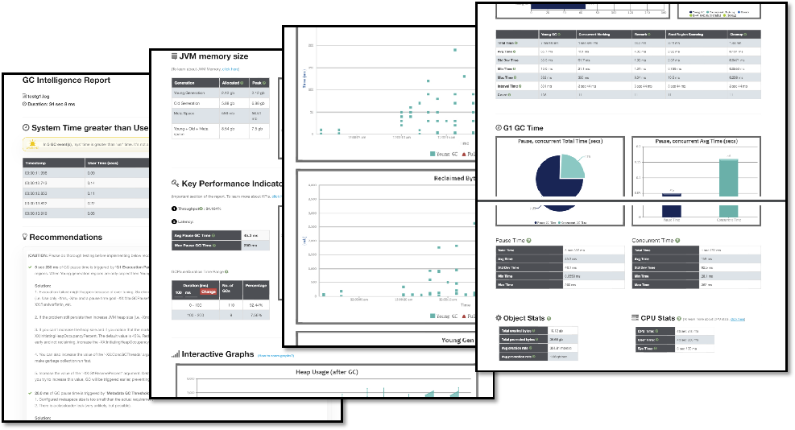

使用方法：

1、选择文件，找到GC日志并上传

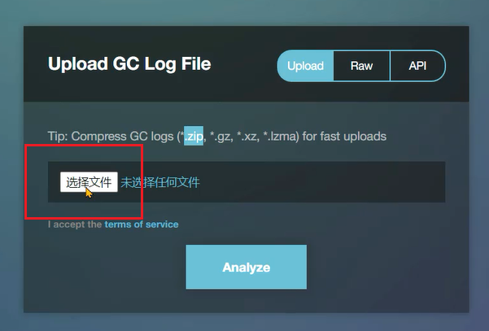

2、点击Analyze分析就可以看到报告，每个账号每个月能免费上传5个GC日志。

建议部分：


内存情况：

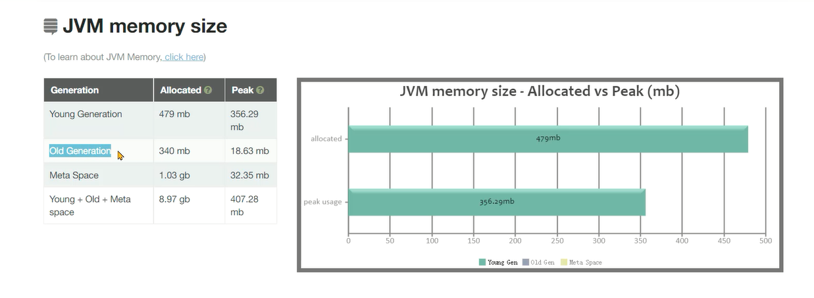

GC关键性指标：

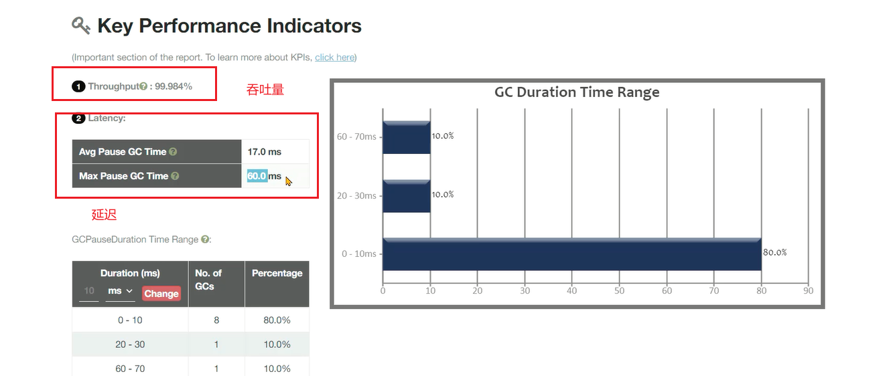

GC的趋势图：


引发GC的原因：


#### 常见的GC模式

根据内存的趋势图，我们可以将GC的情况分成几种模式

##### 正常情况

特点：呈现锯齿状，对象创建之后内存上升，一旦发生垃圾回收之后下降到底部，并且每次下降之后的内存大小接近，存留的对象较少。

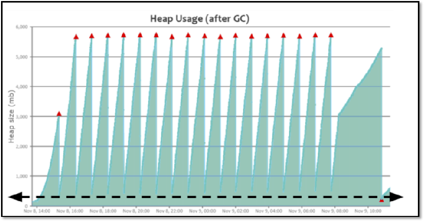

##### 缓存对象过多

特点：呈现锯齿状，对象创建之后内存上升，一旦发生垃圾回收之后下降到底部，并且每次下降之后的内存大小接近，处于比较高的位置。

问题产生原因： 程序中保存了大量的缓存对象，导致GC之后无法释放，可以使用MAT或者HeapHero等工具进行分析内存占用的原因。


##### 内存泄漏

特点：呈现锯齿状，每次垃圾回收之后下降到的内存位置越来越高，最后由于垃圾回收无法释放空间导致对象无法分配产生OutOfMemory的错误。

问题产生原因： 程序中保存了大量的内存泄漏对象，导致GC之后无法释放，可以使用MAT或者HeapHero等工具进行分析是哪些对象产生了内存泄漏。


##### 持续的FullGC

特点：在某个时间点产生多次Full GC，CPU使用率同时飙高，用户请求基本无法处理。一段时间之后恢复正常。

问题产生原因： 在该时间范围请求量激增，程序开始生成更多对象，同时垃圾收集无法跟上对象创建速率，导致持续地在进行FULL GC。GC分析报告


比如如下报告就产生了持续的FULL GC：

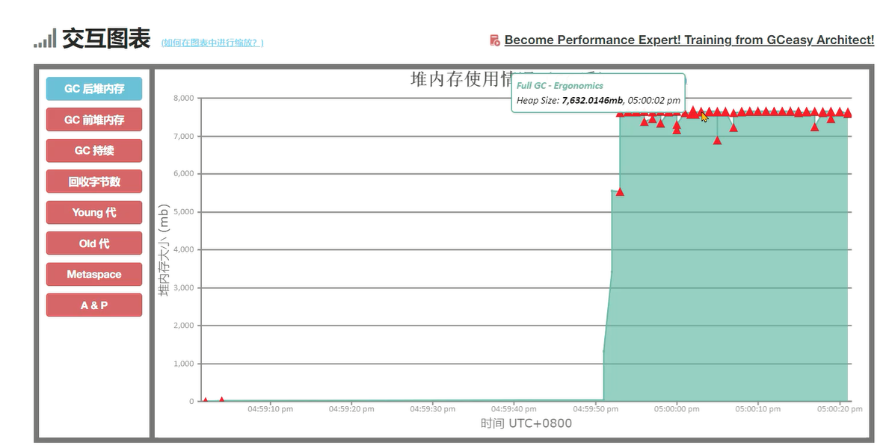

整体的延迟就变得很长：


原因就是老年代满了：

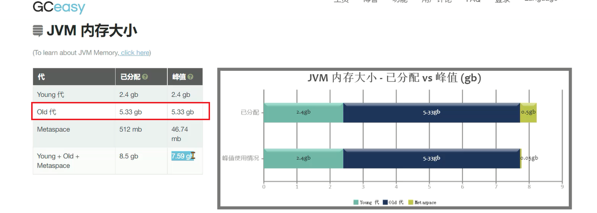

由于分配不了对象，导致频繁的FULLGC：

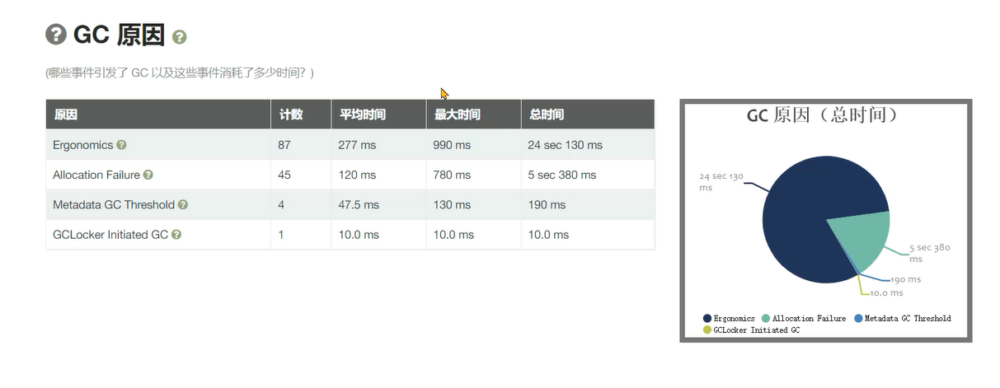

##### 元空间不足导致的FULLGC

特点：堆内存的大小并不是特别大，但是持续发生FULLGC。

问题产生原因： 元空间大小不足，导致持续FULLGC回收元空间的数据。GC分析报告

 元空间并不是满了才触发FULLGC，而是JVM自动会计算一个阈值，如下图中元空间并没有满，但是频繁产生了FULLGC。


停顿时间也比较长：

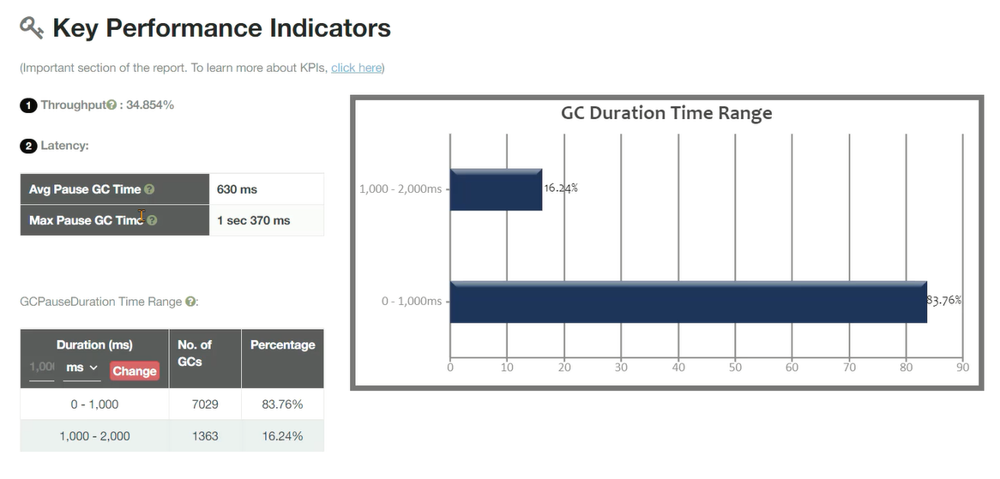

非常频繁的FULLGC:


#### 解决GC问题的手段

解决GC问题的手段中，前三种是比较推荐的手段，第四种仅在前三种无法解决时选用：

- 优化基础JVM参数，基础JVM参数的设置不当，会导致频繁FULLGC的产生
- 减少对象产生，大多数场景下的FULLGC是由于对象产生速度过快导致的，减少对象产生可以有效的缓解FULLGC的发生
- 更换垃圾回收器，选择适合当前业务场景的垃圾回收器，减少延迟、提高吞吐量
- 优化垃圾回收器参数，优化垃圾回收器的参数，能在一定程度上提升GC效率

##### 优化基础JVM参数

**参数1 ： -Xmx 和 –Xms**

-Xmx参数设置的是最大堆内存，但是由于程序是运行在服务器或者容器上，计算可用内存时，要将元空间、操作系统、其它软件占用的内存排除掉。

案例： 服务器内存4G，操作系统+元空间最大值+其它软件占用1.5G，-Xmx可以设置为2g。

最合理的设置方式应该是根据最大并发量估算服务器的配置，然后再根据服务器配置计算最大堆内存的值。

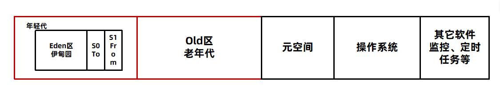

参数1 ： -Xmx 和 –Xms

-Xms用来设置初始堆大小，建议将-Xms设置的和-Xmx一样大，有以下几点好处：

- 运行时性能更好，堆的扩容是需要向操作系统申请内存的，这样会导致程序性能短期下降。
- 可用性问题，如果在扩容时其他程序正在使用大量内存，很容易因为操作系统内存不足分配失败。
- 启动速度更快，Oracle官方文档的原话：如果初始堆太小，Java 应用程序启动会变得很慢，因为 JVM 被迫频繁执行垃圾收集，直到堆增长到更合理的大小。为了获得最佳启动性能，请将初始堆大小设置为与最大堆大小相同。

**参数2 ： -XX:MaxMetaspaceSize 和 –XX:MetaspaceSize**

-XX:MaxMetaspaceSize=值  参数指的是最大元空间大小，默认值比较大，如果出现元空间内存泄漏会让操作系统可用内存不可控，建议根据测试情况设置最大值，一般设置为256m。

-XX:MetaspaceSize=值 参数指的是到达这个值之后会触发FULLGC（网上很多文章的初始元空间大小是错误的），后续什么时候再触发JVM会自行计算。如果设置为和MaxMetaspaceSize一样大，就不会FULLGC，但是对象也无法回收。

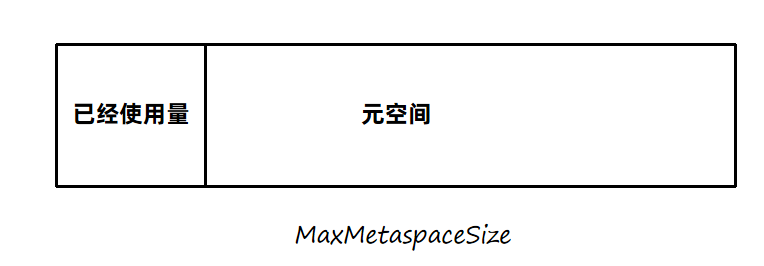

计算出来第一次因元空间触发FULLGC的阈值：


**参数3 ： -Xss虚拟机栈大小**

如果我们不指定栈的大小，JVM 将创建一个具有默认大小的栈。大小取决于操作系统和计算机的体系结构。

比如Linux x86 64位 ： 1MB，如果不需要用到这么大的栈内存，完全可以将此值调小节省内存空间，合理值为256k – 1m之间。

使用：-Xss256k

**参数4 ： 不建议手动设置的参数**

由于JVM底层设计极为复杂，一个参数的调整也许让某个接口得益，但同样有可能影响其他更多接口。

-Xmn 年轻代的大小，默认值为整个堆的1/3，可以根据峰值流量计算最大的年轻代大小，尽量让对象只存放在年轻代，不进入老年代。但是实际的场景中，接口的响应时间、创建对象的大小、程序内部还会有一些定时任务等不确定因素都会导致这个值的大小并不能仅凭计算得出，如果设置该值要进行大量的测试。G1垃圾回收器尽量不要设置该值，G1会动态调整年轻代的大小。

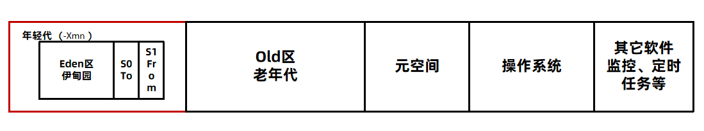

‐XX:SurvivorRatio 伊甸园区和幸存者区的大小比例，默认值为8。

‐XX:MaxTenuringThreshold 最大晋升阈值，年龄大于此值之后，会进入老年代。另外JVM有动态年龄判断机制：将年龄从小到大的对象占据的空间加起来，如果大于survivor区域的50%，然后把等于或大于该年龄的对象，放入到老年代。

比如下图中，年龄1+年龄2+年龄3 = 55m已经超过了S区的50%，所以会将年龄3及以上的对象全部放入老年代。


**其他参数 ：**

 -XX:+DisableExplicitGC

禁止在代码中使用System.gc()， System.gc()可能会引起FULLGC，在代码中尽量不要使用。使用DisableExplicitGC参数可以禁止使用System.gc()方法调用。

-XX:+HeapDumpOnOutOfMemoryError：发生OutOfMemoryError错误时，自动生成hprof内存快照文件。

`-XX:HeapDumpPath=<path>`：指定hprof文件的输出路径。

打印GC日志

JDK8及之前 ： -XX:+PrintGCDetails -XX:+PrintGCDateStamps -Xloggc:文件路径

JDK9及之后 ： -Xlog:gc*:file=文件路径

**JVM参数模板**

```Java
-Xms1g
-Xmx1g
-Xss256k
-XX:MaxMetaspaceSize=512m 
-XX:+DisableExplicitGC-XX:+HeapDumpOnOutOfMemoryError
-XX:HeapDumpPath=/opt/logs/my-service.hprof-XX:+PrintGCDetails 
-XX:+PrintGCDateStamps 
-Xloggc:文件路径
```

注意：

JDK9及之后gc日志输出修改为 -Xlog:gc*:file=文件名

堆内存大小和栈内存大小根据实际情况灵活调整。

##### 垃圾回收器的选择

**背景**：

小李负责的程序在高峰期遇到了性能瓶颈，团队从业务代码入手优化了多次也取得了不错的效果，这次他希望能采用更合理的垃圾回收器优化性能。

**思路：**

编写Jmeter脚本对程序进行压测，同时添加RT响应时间、每秒钟的事务数

等指标进行监控。

选择不同的垃圾回收器进行测试，并发量分别设置50、100、200，观察

数据的变化情况。

3. JDK8 下 ParNew + CMS 组合 ： -XX:+UseParNewGC -XX:+UseConcMarkSweepGC

​                 默认组合 ： PS + PO

​    JDK8使用g1 : -XX:+UseG1GC    JDK11 默认 g1

**测试用代码：**

```
com.itheima.jvmoptimize.fullgcdemo.Demo2Controller
```

1、使用jmeter测试脚本

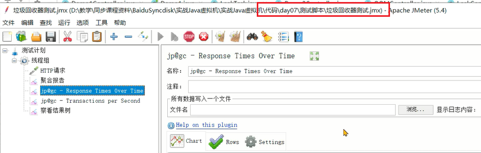

2、添加基础JVM测试参数：

```Java
-Xms8g -Xmx8g -Xss256k -XX:MaxMetaspaceSize=512m  -XX:+DisableExplicitGC -XX:+HeapDumpOnOutOfMemoryError -XX:HeapDumpPath=D:/test.hprof  -verbose:gc -XX:+PrintGCDetails -XX:+PrintGCTimeStamps
```

JDK8默认情况下测试的是PS+PO组合 

测试结果：

| 垃圾回收器 | 参数                                       | 50并发（最大响应时间） | 100并发（最大响应时间） | 200并发（最大响应时间） |
| ---------- | ------------------------------------------ | ---------------------- | ----------------------- | ----------------------- |
| PS+PO      | 默认                                       | 260ms                  | 474ms                   | 930ms                   |
| CMS        | *-XX:+UseParNewGC -XX:+UseConcMarkSweepGC* | 157ms                  | 未测试                  | 833ms                   |
| G1         | JDK11默认                                  | 未测试                 | 未测试                  | 248ms                   |

由此可见使用了JDK11之后使用G1垃圾回收器，性能优化结果还是非常明显的。其他测试数据同学们有兴趣可以自行去测试一下。

#### 优化垃圾回收器的参数

这部分优化效果未必出色，仅当前边的一些手动无效时才考虑。

一个优化的案例：

CMS的并发模式失败（concurrent mode failure）现象。由于CMS的垃圾清理线程和用户线程是并行进行的，如果在并发清理的过程中老年代的空间不足以容纳放入老年代的对象，会产生并发模式失败。


老年代已经满了此时有一些对象要晋升到老年代：


解决方案：

1.减少对象的产生以及对象的晋升。

2.增加堆内存大小

3.优化垃圾回收器的参数，比如-XX:CMSInitiatingOccupancyFraction=值，当老年代大小到达该阈值时，会自动进行CMS垃圾回收，通过控制这个参数提前进行老年代的垃圾回收，减少其大小。

JDK8中默认这个参数值为 -1，根据其他几个参数计算出阈值：

((100 - MinHeapFreeRatio) + (double)(CMSTriggerRatio * MinHeapFreeRatio) / 100.0)

在我本机计算之后的结果是92：

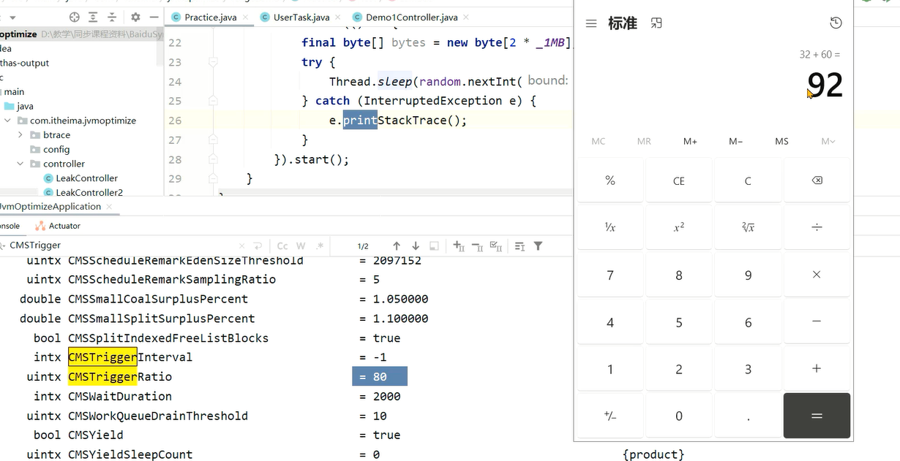

该参数设置完是不会生效的，必须开启-XX:+UseCMSInitiatingOccupancyOnly参数。

调整前和调整之后的效果对比：


很明显FULLGC产生的次数下降了。

#### 案例实战

**背景：**

小李负责的程序在高峰期经常会出现接口调用时间特别长的现象，他希望能优化程序的性能。

**思路：**

生成GC报告，通过Gceasy工具进行分析，判断是否存在GC问题或者内存问题。

存在内存问题，通过jmap或者arthas将堆内存快照保存下来。

通过MAT或者在线的heaphero工具分析内存问题的原因。

修复问题，并发布上线进行测试。

**测试代码**：`com.itheima.jvmoptimize.fullgcdemo.Practice`

JVM参数：

```Java
-Xms1g -Xmx1g -Xss256k    -XX:MaxMetaspaceSize=256m  -XX:+UseParNewGC -XX:+UseConcMarkSweepGC -XX:+PrintGCDateStamps  -XX:+PrintGCDetails -XX:+DisableExplicitGC -Xloggc:D:/test.log
```

1、打开测试脚本：


2、发现有几笔响应时间特别长的请求，怀疑是GC引起的：

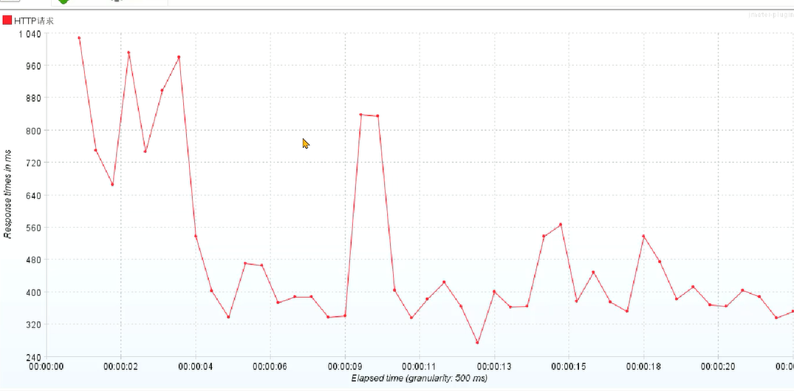

3、把GC日志上传到GCEasy之后发现内存占用情况很严重：

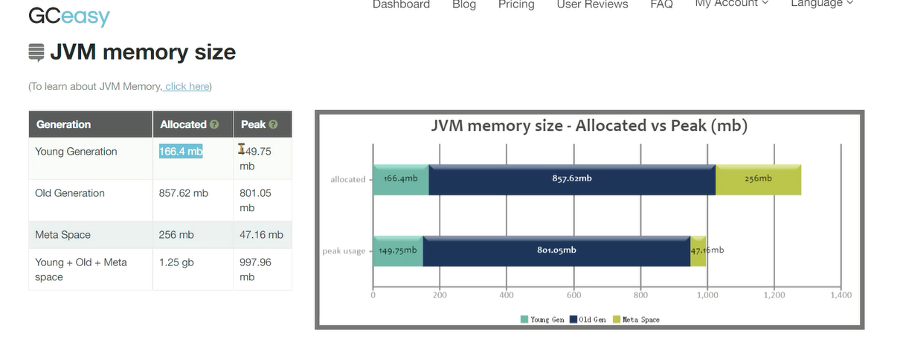

出现了几次FULLGC,并且FULL GC之后，内存占用也有160m左右:


##### 问题1：

发生了连续的FULL GC,堆内存1g如果没有请求的情况下，内存大小在200-300mb之间。

分析：

没有请求的情况下，内存大小并没有处于很低的情况，满足缓存对象过多的情况，怀疑内存种缓存了很多数据。需要将堆内存快照保存下来进行分析。

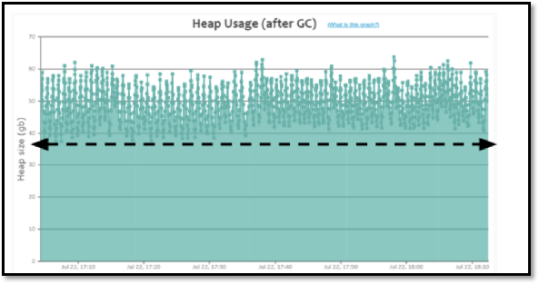

1、在本地测试，通过visualvm将hprof文件保存下来：


2、通过Heap Hero分析文件，操作方式与GCEasy相同，上传的是hprof文件：

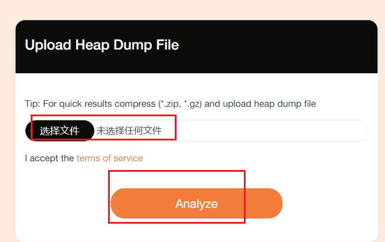

但是我们发现，生成的文件非常小，与接近200m大小不符：

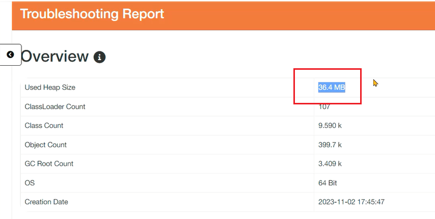

3、怀疑有些对象已经可以回收，所以没有下载下来。使用jmap调整下参数，将live参数去掉，这样即便是垃圾对象也能保存下来：

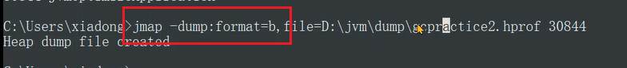

4、在MAT中分析，选择不可达对象直方图：

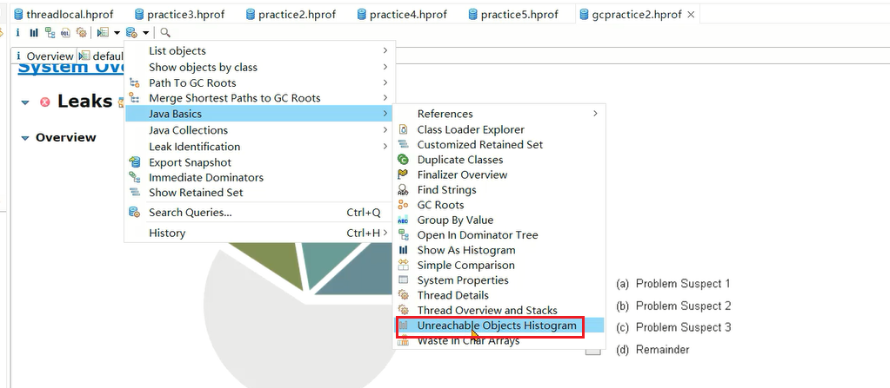

5、大量的对象都是字节数组对象：

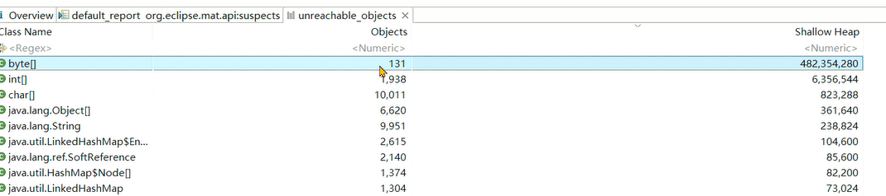

6.那么这些对象是如何产生的呢？继续往下来，捕捉到有大量的线程对象，如果没有发现这个点，只能去查代码看看哪里创建了大量的字节数组了：


##### 问题2：

由于这些对象已经不在引用链上，无法通过支配树等手段分析创建的位置。

分析：

在不可达对象列表中，除了发现大量的byte[]还发现了大量的线程，可以考虑跟踪线程的栈信息来判断对象在哪里创建。

1、在VisualVM中使用采样功能，对内存采样：

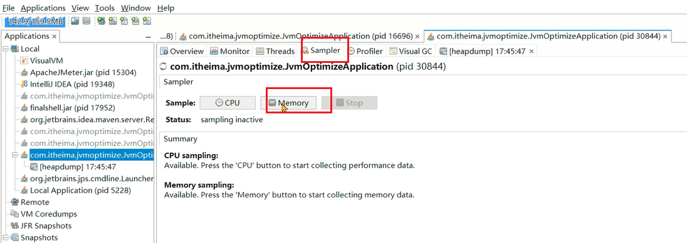

2、观察到这个线程一直在发生变化，说明有线程频繁创建销毁：


3、选择线程功能，保存线程栈：


4、抓到了一个线程，线程后边的ID很大，说明已经创建过很多线程了：


5、通过栈信息找到源代码：


这里有个定时任务，每隔200ms就创建线程。

问题产生原因：

在定时任务中通过线程创建了大量的对象，导致堆内存一直处于比较高的位置。

 

解决方案：

暂时先将这段代码注释掉，测试效果，由于这个服务本身的内存压力比较大，将这段定时任务移动到别的服务中。

##### 问题3：

修复之后内存基本上处于100m左右，但是当请求发生时，依然有频繁FULL GC的发生。

分析：

请求产生的内存大小比当前最大堆内存大，尝试选择配置更高的服务器，将-Xmx和-Xms参数调大一些。

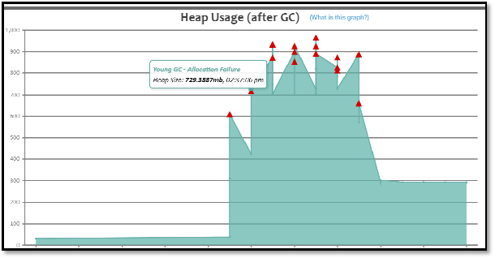

当前的堆内存大小无法支撑请求量，所以要不就将请求量降下来，比如限制tomcat线程数、限流，或者提升服务器配置，增大堆内存。

调整为4G之后的效果，FULLGC数量很少：

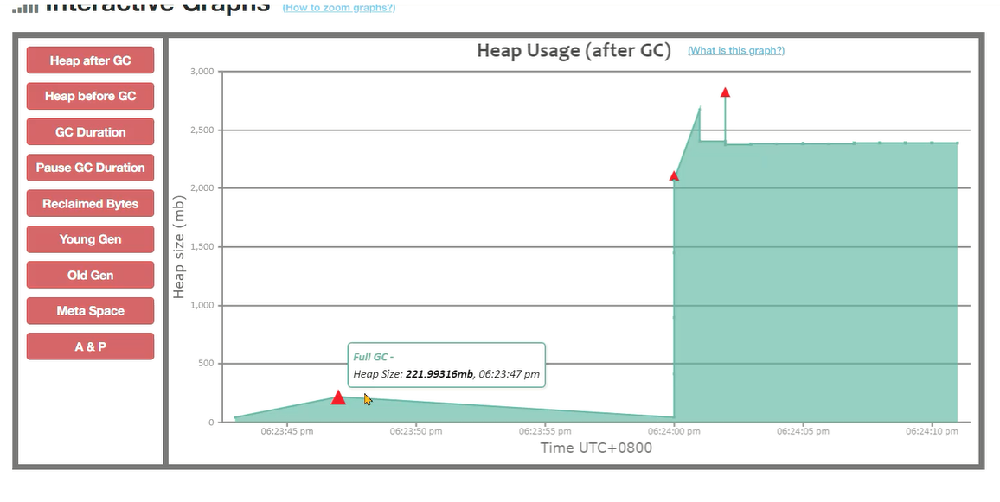

##### 案例总结：

1、压力比较大的服务中，尽量不要存放大量的缓存或者定时任务，会影响到服务的内存使用。

2、内存分析发现有大量线程创建时，可以使用导出线程栈来查看线程的运行情况。

3、如果请求确实创建了大量的内存超过了内存上限，只能考虑减少请求时创建的对象，或者使用更大的内存。

4、推荐使用g1垃圾回收器，并且使用较新的JDK可以获得更好的性能。