[[toc]]

内存调优
-----------

### 内存溢出和内存泄漏

内存泄漏（memory leak）：在Java中如果不再使用一个对象，但是该对象依然在GC ROOT的引用链上，这个对象就不会被垃圾回收器回收，这种情况就称之为内存泄漏。

内存泄漏绝大多数情况都是由堆内存泄漏引起的，所以后续没有特别说明则讨论的都是堆内存泄漏。

比如图中，如果学生对象1不再使用


可以选择将ArrayList到学生对象1的引用删除：


或者将对象A堆ArrayList的引用删除，这样所有的学生对象包括ArrayList都可以回收：

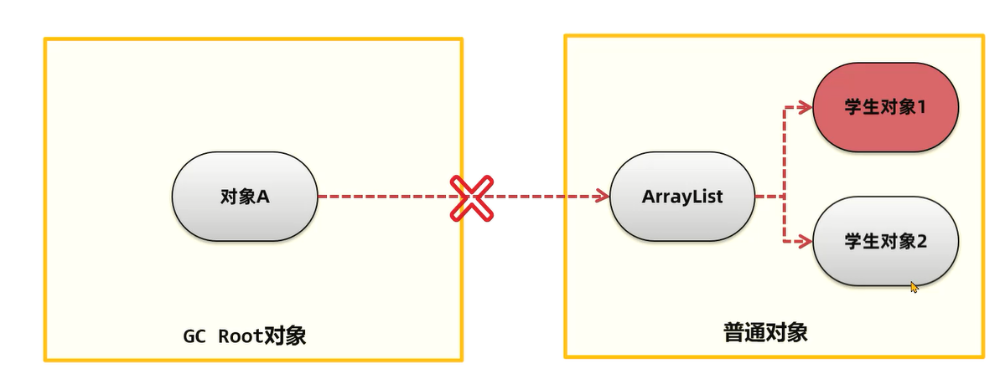

但是如果不移除这两个引用中的任何一个，学生对象1就属于内存泄漏了。

少量的内存泄漏可以容忍，但是如果发生持续的内存泄漏，就像滚雪球雪球越滚越大，不管有多大的内存迟早会被消耗完，最终导致的结果就是内存溢出。但是产生内存溢出并不是只有内存泄漏这一种原因。        

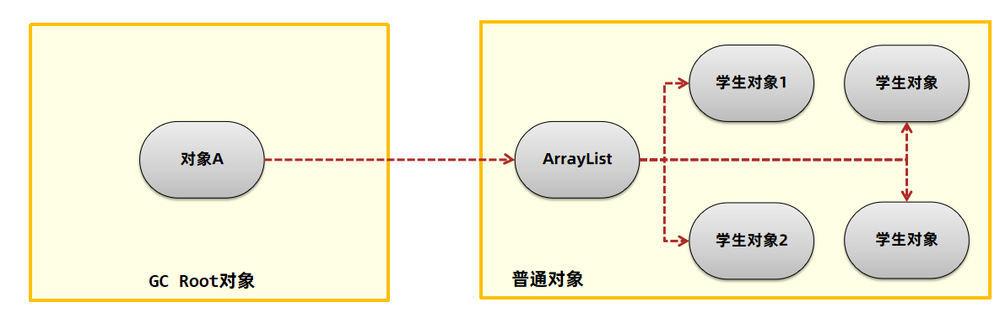

这些学生对象如果都不再使用，越积越多，就会导致超过堆内存的上限出现内存溢出。

正常情况的内存结构图如下：

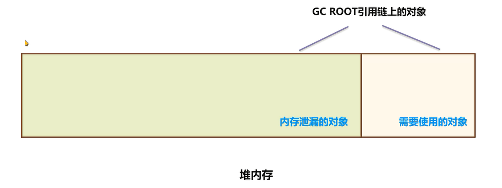

内存溢出出现时如下：


内存泄漏的对象和依然在GC ROOT引用链上需要使用的对象加起来占满了内存空间，无法为新的对象分配内存。

#### 内存泄漏的常见场景：

1、内存泄漏导致溢出的常见场景是大型的Java后端应用中，在处理用户的请求之后，没有及时将用户的数据删除。随着用户请求数量越来越多，内存泄漏的对象占满了堆内存最终导致内存溢出。

这种产生的内存溢出会直接导致用户请求无法处理，影响用户的正常使用。重启可以恢复应用使用，但是在运行一段时间之后依然会出现内存溢出。


代码：

```Java
package com.itheima.jvmoptimize.controller;

import com.itheima.jvmoptimize.entity.UserEntity;
import org.springframework.web.bind.annotation.GetMapping;
import org.springframework.web.bind.annotation.PostMapping;
import org.springframework.web.bind.annotation.RequestMapping;
import org.springframework.web.bind.annotation.RestController;

import java.util.ArrayList;
import java.util.HashMap;
import java.util.List;
import java.util.Map;

@RestController
@RequestMapping("/leak2")
public class LeakController2 {
    private static Map<Long,Object> userCache = new HashMap<>();

    /**
     * 登录接口 放入hashmap中
     */
    @PostMapping("/login")
    public void login(String name,Long id){
        userCache.put(id,new byte[1024 * 1024 * 300]);
    }


    /**
     * 登出接口，删除缓存的用户信息
     */

    @GetMapping("/logout")
    public void logout(Long id){
        userCache.remove(id);
    }

}
```

设置虚拟机参数，将最大堆内存设置为1g:

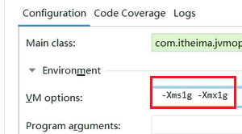

在Postman中测试，登录id为1的用户：

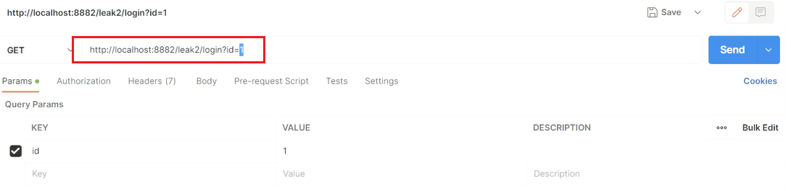

调用logout接口，id为1那么数据会正常删除：

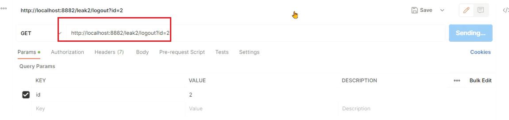

连续调用login传递不同的id，但是不调用logout

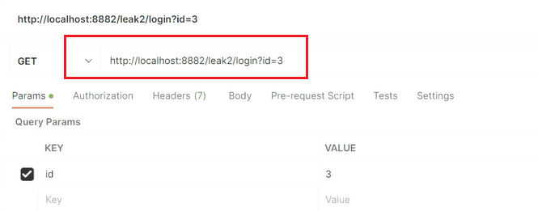

调用几次之后就会出现内存溢出：

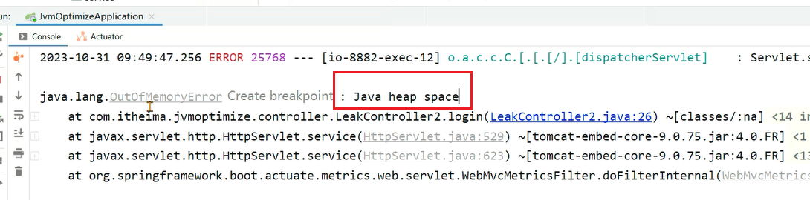

2、第二种常见场景是分布式任务调度系统如Elastic-job、Quartz等进行任务调度时，被调度的Java应用在调度任务结束中出现了内存泄漏，最终导致多次调度之后内存溢出。

这种产生的内存溢出会导致应用执行下次的调度任务执行。同样重启可以恢复应用使用，但是在调度执行一段时间之后依然会出现内存溢出。

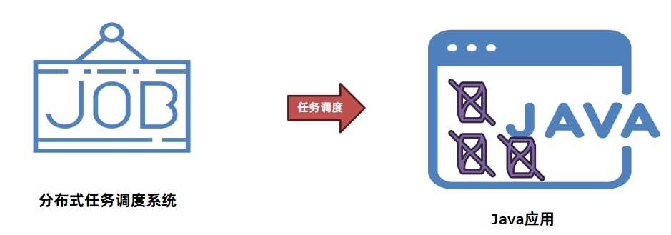

开启定时任务：

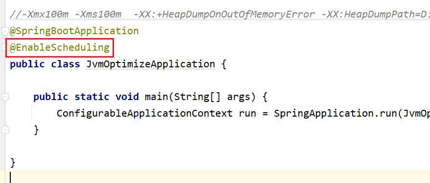

定时任务代码：

```Java
package com.itheima.jvmoptimize.task;

import com.itheima.jvmoptimize.leakdemo.demo4.Outer;
import org.springframework.scheduling.annotation.Scheduled;
import org.springframework.stereotype.Component;

import java.util.ArrayList;
import java.util.List;

@Component
public class LeakTask {

    private int count = 0;
    private List<Object> list = new ArrayList<>();

    @Scheduled(fixedRate = 100L)
    public void test(){
        System.out.println("定时任务调用" + ++count);
        list.add(new Outer().newList());
    }
}
```

启动程序之后很快就出现了内存溢出：


### 解决内存溢出的方法

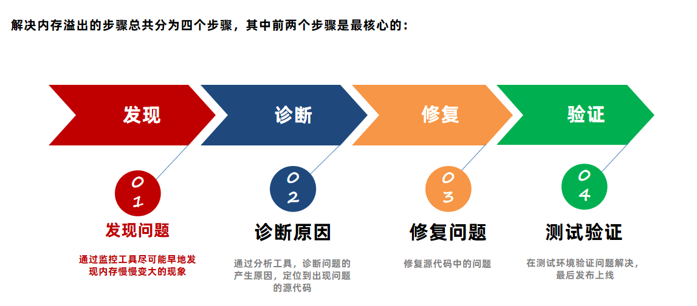

首先要熟悉一些常用的监控工具：

#### 常用监控工具

##### Top命令

top命令是linux下用来查看系统信息的一个命令，它提供给我们去实时地去查看系统的资源，比如执行时的进程、线程和系统参数等信息。进程使用的内存为RES（常驻内存）- SHR（共享内存）

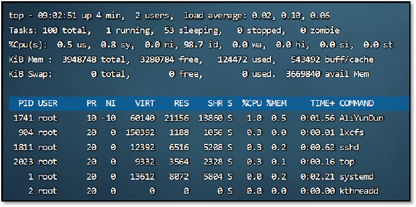

**优点：**

- 操作简单
- 无额外的软件安装

**缺点：**

只能查看最基础的进程信息，无法查看到每个部分的内存占用（堆、方法区、堆外） 

##### VisualVM

VisualVM是多功能合一的Java故障排除工具并且他是一款可视化工具，整合了命令行 JDK 工具和轻量级分析功能，功能非常强大。这款软件在Oracle JDK 6~8 中发布，但是在 Oracle JDK 9 之后不在JDK安装目录下需要单独下载。下载地址：https://visualvm.github.io/


**优点：**

- 功能丰富，实时监控CPU、内存、线程等详细信息
- 支持Idea插件，开发过程中也可以使用

**缺点：**

对大量集群化部署的Java进程需要手动进行管理

如果需要进行远程监控，可以通过jmx方式进行连接。在启动java程序时添加如下参数：

```Java
-Djava.rmi.server.hostname=服务器ip地址
-Dcom.sun.management.jmxremote
-Dcom.sun.management.jmxremote.port=9122
-Dcom.sun.management.jmxremote.ssl=false
-Dcom.sun.management.jmxremote.authenticate=false
```

右键点击remote

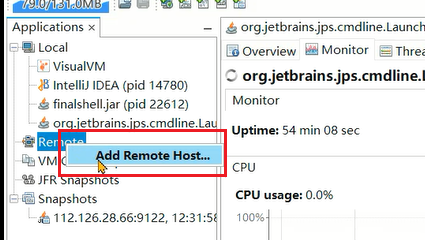

填写服务器的ip地址：

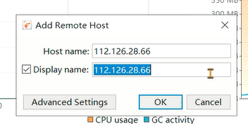

右键添加JMX连接


填写ip地址和端口号，勾选不需要SSL安全验证：


双击成功连接。

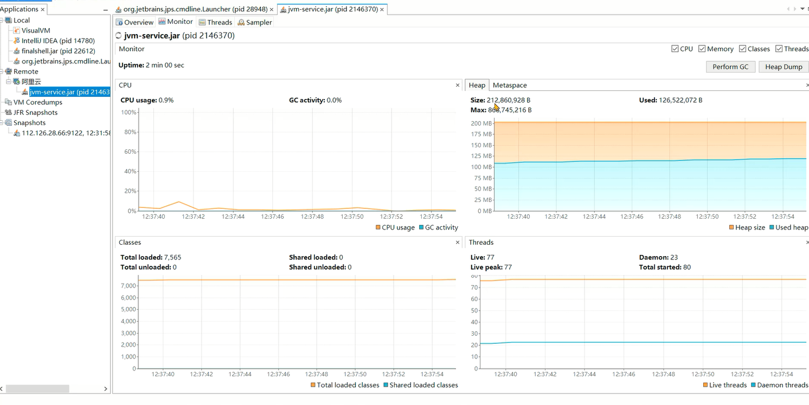

##### Arthas

Arthas 是一款线上监控诊断产品，通过全局视角实时查看应用 load、内存、gc、线程的状态信息，并能在不修改应用代码的情况下，对业务问题进行诊断，包括查看方法调用的出入参、异常，监测方法执行耗时，类加载信息等，大大提升线上问题排查效率。

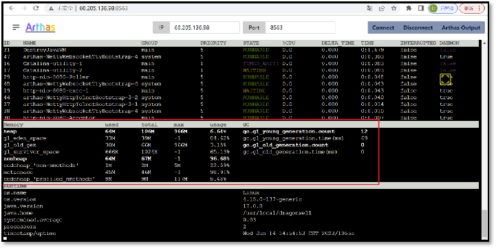

**优点：**

- 功能强大，不止于监控基础的信息，还能监控单个方法的执行耗时等细节内容。
- 支持应用的集群管理

**缺点：**

部分高级功能使用门槛较高

**使用阿里arthas tunnel管理所有的需要监控的程序**

背景：

小李的团队已经普及了arthas的使用，但是由于使用了微服务架构，生产环境上的应用数量非常多，使用arthas还得登录到每一台服务器上再去操作非常不方便。他看到官方文档上可以使用tunnel来管理所有需要监控的程序。


步骤：

在Spring Boot程序中添加arthas的依赖(支持Spring Boot2)，在配置文件中添加tunnel服务端的地址，便于tunnel去监控所有的程序。

2. 将tunnel服务端程序部署在某台服务器上并启动。
3. 启动java程序
4. 打开tunnel的服务端页面，查看所有的进程列表，并选择进程进行arthas的操作。

pom.xml添加依赖：

```XML
<dependency>
    <groupId>com.taobao.arthas</groupId>
    <artifactId>arthas-spring-boot-starter</artifactId>
    <version>3.7.1</version>
</dependency>
```

application.yml中添加配置:

```Properties
arthas:
  #tunnel地址，目前是部署在同一台服务器，正式环境需要拆分
  tunnel-server: ws://localhost:7777/ws
  #tunnel显示的应用名称，直接使用应用名
  app-name: ${spring.application.name}
  #arthas http访问的端口和远程连接的端口
  http-port: 8888
  telnet-port: 9999
```

在资料中找到arthas-tunnel-server.3.7.1-fatjar.jar上传到服务器，并使用

`nohup java -jar -Darthas.enable-detail-pages=true arthas-tunnel-server.3.7.1-fatjar.jar & ` 命令启动该程序。`-Darthas.enable-detail-pages=true`参数作用是可以有一个页面展示内容。通过`服务器ip地址:8080/apps.html`打开页面，目前没有注册上来任何应用。


启动spring boot应用，如果在一台服务器上，注意区分端口。

```Properties
-Dserver.port=tomcat端口号
-Darthas.http-port=arthas的http端口号
-Darthas.telnet-port=arthas的telnet端口号端口号
```

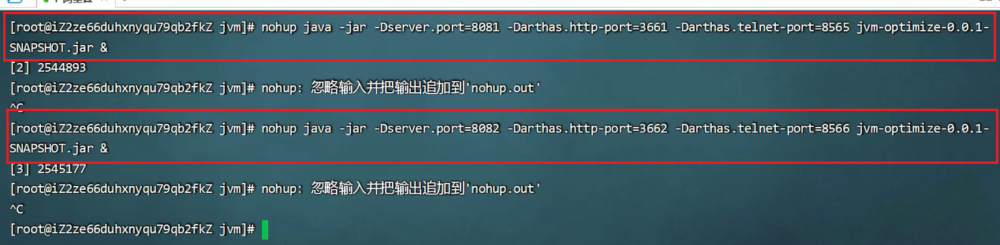

最终就能看到两个应用：

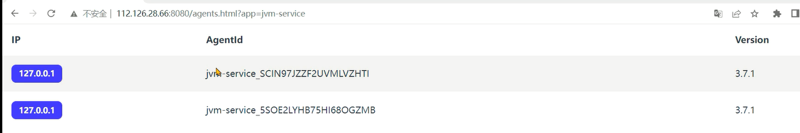

单击应用就可以进入操作arthas了。

##### Prometheus+Grafana

Prometheus+Grafana是企业中运维常用的监控方案，其中Prometheus用来采集系统或者应用的相关数据，同时具备告警功能。Grafana可以将Prometheus采集到的数据以可视化的方式进行展示。

Java程序员要学会如何读懂Grafana展示的Java虚拟机相关的参数。

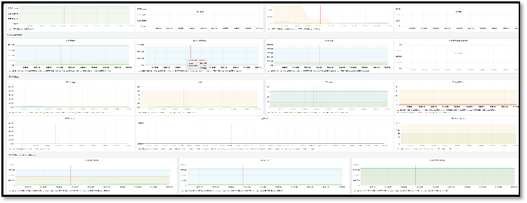

**优点：**

- 支持系统级别和应用级别的监控，比如linux操作系统、Redis、MySQL、Java进程。
- 支持告警并允许自定义告警指标，通过邮件、短信等方式尽早通知相关人员进行处理

**缺点：**

环境搭建较为复杂，一般由运维人员完成

**阿里云环境搭建（了解即可）**

这一小节主要是为了让同学们更好地去阅读监控数据，所以提供一整套最简单的环境搭建方式，觉得困难可以直接跳过。企业中环境搭建的工作由运维人员来完成。

1、在pom文件中添加依赖

```XML
<dependency>
    <groupId>io.micrometer</groupId>
    <artifactId>micrometer-registry-prometheus</artifactId>
    <scope>runtime</scope>
</dependency>
<dependency>
    <groupId>org.springframework.boot</groupId>
    <artifactId>spring-boot-starter-actuator</artifactId>

    <exclusions><!-- 去掉springboot默认配置 -->
        <exclusion>
            <groupId>org.springframework.boot</groupId>
            <artifactId>spring-boot-starter-logging</artifactId>
        </exclusion>
    </exclusions>
</dependency>
```

2、添加配置项

```Properties
management:
  endpoint:
    metrics:
      enabled: true #支持metrics
    prometheus:
      enabled: true #支持Prometheus
  metrics:
    export:
      prometheus:
        enabled: true
    tags:
      application: jvm-test #实例名采集
  endpoints:
    web:
      exposure:
        include: '*' #开放所有端口
```

这两步做完之后，启动程序。

3、通过地址：`ip地址:端口号/actuator/prometheus`访问之后可以看到jvm相关的指标数据。

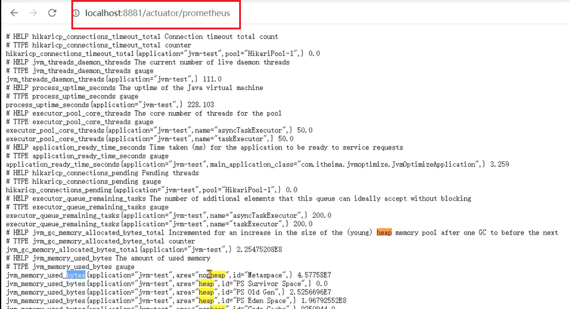

4、创建阿里云Prometheus实例

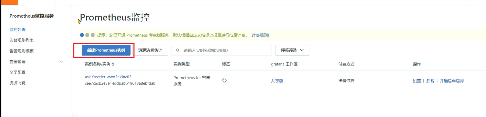

5、选择ECS服务

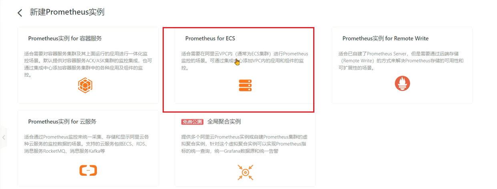

6、在自己的ECS服务器上找到网络和交换机

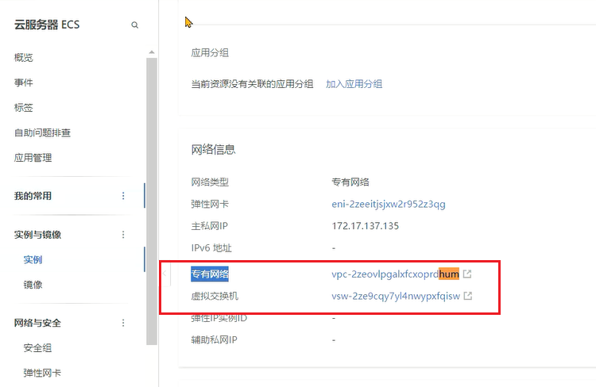

7、选择对应的网络：

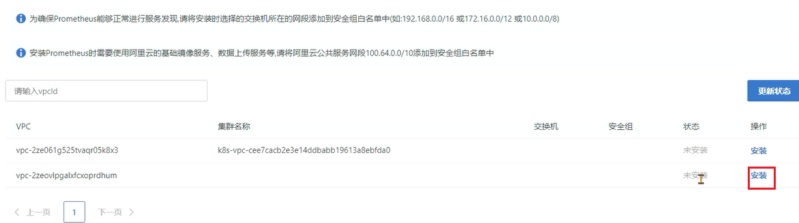

填写内容，与ECS里边的网络设置保持一致

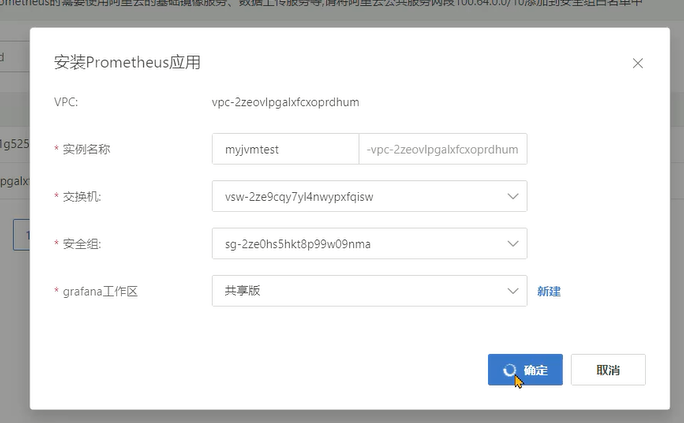

8、选中新的实例，选择MicroMeter

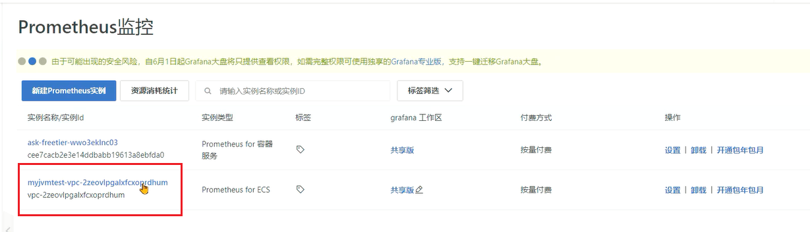


9、给ECS添加标签；

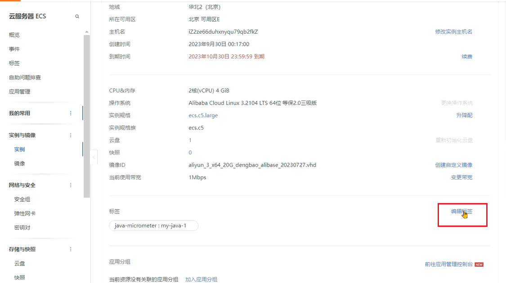

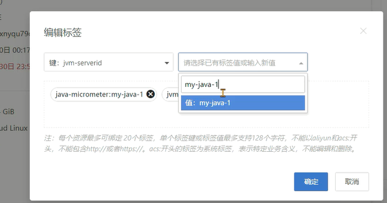

10、填写内容，注意ECS的标签


11、点击大盘就可以看到指标了

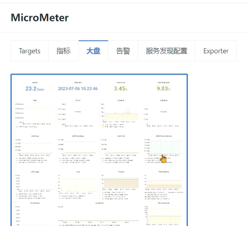

12、指标内容:

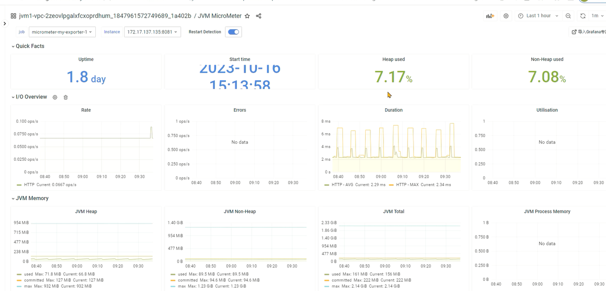

#### 堆内存状况的对比

- 正常情况
  - 处理业务时会出现上下起伏，业务对象频繁创建内存会升高，触发MinorGC之后内存会降下来。
  - 手动执行FULL GC之后，内存大小会骤降，而且每次降完之后的大小是接近的。
  - 长时间观察内存曲线应该是在一个范围内。
  - 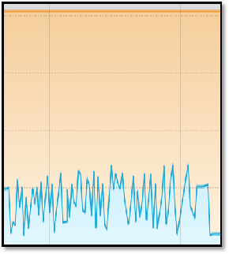
  - 出现内存泄漏
    - 处于持续增长的情况，即使Minor GC也不能把大部分对象回收
    - 手动FULL GC之后的内存量每一次都在增长
    - 长时间观察内存曲线持续增长

#### 产生内存溢出原因一 ：代码中的内存泄漏

总结了6种产生内存泄漏的原因，均来自于java代码的不当处理：

- equals()和hashCode()，不正确的equals()和hashCode()实现导致内存泄漏
- ThreadLocal的使用，由于线程池中的线程不被回收导致的ThreadLocal内存泄漏
- 内部类引用外部类，非静态的内部类和匿名内部类的错误使用导致内存泄漏
- String的intern方法，由于JDK6中的字符串常量池位于永久代，intern被大量调用并保存产生的内存泄漏
- 通过静态字段保存对象，大量的数据在静态变量中被引用，但是不再使用，成为了内存泄漏
- 资源没有正常关闭，由于资源没有调用close方法正常关闭，导致的内存溢出

##### 案例1：equals()和hashCode()导致的内存泄漏

问题：

在定义新类时没有重写正确的equals()和hashCode()方法。在使用HashMap的场景下，如果使用这个类对象作为key，HashMap在判断key是否已经存在时会使用这些方法，如果重写方式不正确，会导致相同的数据被保存多份。

正常情况：

1、以JDK8为例，首先调用hash方法计算key的哈希值，hash方法中会使用到key的hashcode方法。根据hash方法的结果决定存放的数组中位置。

2、如果没有元素，直接放入。如果有元素，先判断key是否相等，会用到equals方法，如果key相等，直接替换value；key不相等，走链表或者红黑树查找逻辑，其中也会使用equals比对是否相同。

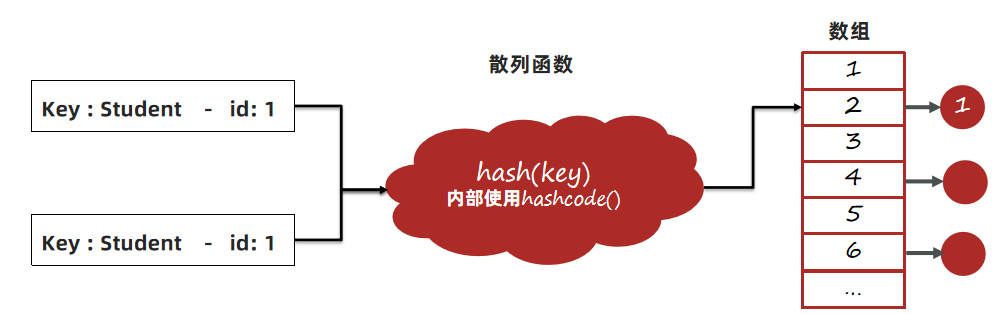

异常情况：

1、hashCode方法实现不正确，会导致相同id的学生对象计算出来的hash值不同，可能会被分到不同的槽中。

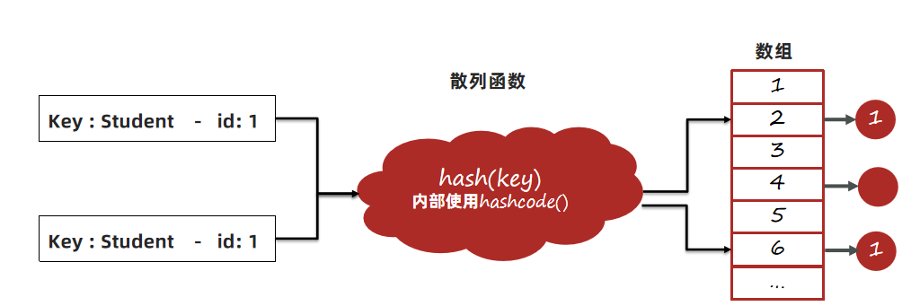

2、equals方法实现不正确，会导致key在比对时，即便学生对象的id是相同的，也被认为是不同的key。

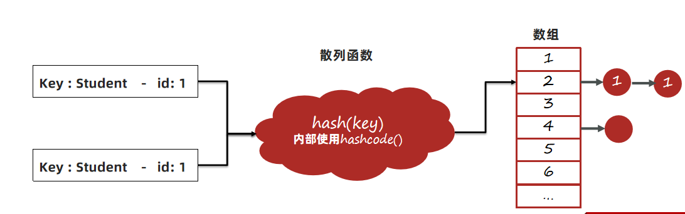

3、长时间运行之后HashMap中会保存大量相同id的学生数据。

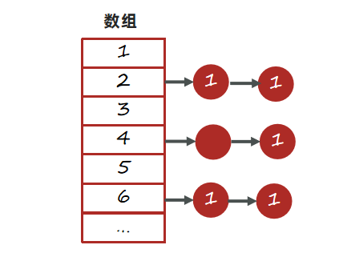

```Java
package com.itheima.jvmoptimize.leakdemo.demo2;

import org.apache.commons.lang3.builder.EqualsBuilder;
import org.apache.commons.lang3.builder.HashCodeBuilder;

import java.util.Objects;

public class Student {
    private String name;
    private Integer id;
    private byte[] bytes = new byte[1024 * 1024];

    public String getName() {
        return name;
    }

    public void setName(String name) {
        this.name = name;
    }

    public Integer getId() {
        return id;
    }

    public void setId(Integer id) {
        this.id = id;
    }

  
}
package com.itheima.jvmoptimize.leakdemo.demo2;

import java.util.HashMap;
import java.util.Map;

public class Demo2 {
    public static long count = 0;
    public static Map<Student,Long> map = new HashMap<>();
    public static void main(String[] args) throws InterruptedException {
        while (true){
            if(count++ % 100 == 0){
                Thread.sleep(10);
            }
            Student student = new Student();
            student.setId(1);
            student.setName("张三");
            map.put(student,1L);
        }
    }
}
```

运行之后通过visualvm观察：

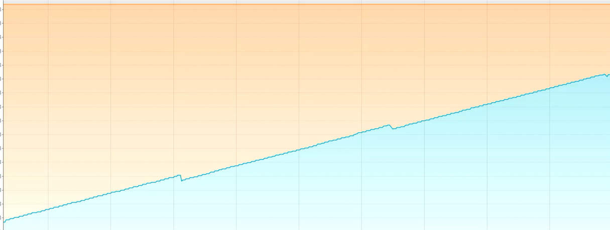

出现内存泄漏的现象。

解决方案：

1、在定义新实体时，始终重写equals()和hashCode()方法。

2、重写时一定要确定使用了唯一标识去区分不同的对象，比如用户的id等。

3、hashmap使用时尽量使用编号id等数据作为key，不要将整个实体类对象作为key存放。

代码：

```Properties
package com.itheima.jvmoptimize.leakdemo.demo2;

import org.apache.commons.lang3.builder.EqualsBuilder;
import org.apache.commons.lang3.builder.HashCodeBuilder;

import java.util.Objects;

public class Student {
    private String name;
    private Integer id;
    private byte[] bytes = new byte[1024 * 1024];

    public String getName() {
        return name;
    }

    public void setName(String name) {
        this.name = name;
    }

    public Integer getId() {
        return id;
    }

    public void setId(Integer id) {
        this.id = id;
    }

    @Override
    public boolean equals(Object o) {
        if (this == o) {
            return true;
        }

        if (o == null || getClass() != o.getClass()) {
            return false;
        }

        Student student = (Student) o;

        return new EqualsBuilder().append(id, student.id).isEquals();
    }

    @Override
    public int hashCode() {
        return new HashCodeBuilder(17, 37).append(id).toHashCode();
    }
}
```

##### 案例2：内部类引用外部类

问题：

1、非静态的内部类默认会持有外部类，尽管代码上不再使用外部类，所以如果有地方引用了这个非静态内部类，会导致外部类也被引用，垃圾回收时无法回收这个外部类。

2、匿名内部类对象如果在非静态方法中被创建，会持有调用者对象，垃圾回收时无法回收调用者。

```Java
package com.itheima.jvmoptimize.leakdemo.demo3;

import java.io.IOException;
import java.util.ArrayList;

public class Outer{
    private byte[] bytes = new byte[1024 * 1024]; //外部类持有数据
    private static String name  = "测试";
    class Inner{
        private String name;
        public Inner() {
            this.name = Outer.name;
        }
    }

    public static void main(String[] args) throws IOException, InterruptedException {
//        System.in.read();
        int count = 0;
        ArrayList<Inner> inners = new ArrayList<>();
        while (true){
            if(count++ % 100 == 0){
                Thread.sleep(10);
            }
            inners.add(new Outer().new Inner());
        }
    }
}
package com.itheima.jvmoptimize.leakdemo.demo4;

import java.io.IOException;
import java.util.ArrayList;
import java.util.List;

public class Outer {
    private byte[] bytes = new byte[1024 * 1024 * 10];
    public List<String> newList() {
        List<String> list = new ArrayList<String>() {{
            add("1");
            add("2");
        }};
        return list;
    }

    public static void main(String[] args) throws IOException {
        System.in.read();
        int count = 0;
        ArrayList<Object> objects = new ArrayList<>();
        while (true){
            System.out.println(++count);
            objects.add(new Outer().newList());
        }
    }
}
```

解决方案：

1、这个案例中，使用内部类的原因是可以直接获取到外部类中的成员变量值，简化开发。如果不想持有外部类对象，应该使用静态内部类。

2、使用静态方法，可以避免匿名内部类持有调用者对象。

```Java
package com.itheima.jvmoptimize.leakdemo.demo3;

import java.io.IOException;
import java.util.ArrayList;

public class Outer{
    private byte[] bytes = new byte[1024 * 1024]; //外部类持有数据
    private static String name  = "测试";
    static class Inner{
        private String name;
        public Inner() {
            this.name = Outer.name;
        }
    }

    public static void main(String[] args) throws IOException, InterruptedException {
//        System.in.read();
        int count = 0;
        ArrayList<Inner> inners = new ArrayList<>();
        while (true){
            if(count++ % 100 == 0){
                Thread.sleep(10);
            }
            inners.add(new Inner());
        }
    }
}
package com.itheima.jvmoptimize.leakdemo.demo4;

import java.io.IOException;
import java.util.ArrayList;
import java.util.List;

public class Outer {
    private byte[] bytes = new byte[1024 * 1024 * 10];
    public static List<String> newList() {
        List<String> list = new ArrayList<String>() {{
            add("1");
            add("2");
        }};
        return list;
    }

    public static void main(String[] args) throws IOException {
        System.in.read();
        int count = 0;
        ArrayList<Object> objects = new ArrayList<>();
        while (true){
            System.out.println(++count);
            objects.add(newList());
        }
    }
}
```

##### 案例3：ThreadLocal的使用

问题：

如果仅仅使用手动创建的线程，就算没有调用ThreadLocal的remove方法清理数据，也不会产生内存泄漏。因为当线程被回收时，ThreadLocal也同样被回收。但是如果使用线程池就不一定了。

```Java
package com.itheima.jvmoptimize.leakdemo.demo5;

import java.util.concurrent.*;

public class Demo5 {
    public static ThreadLocal<Object> threadLocal = new ThreadLocal<>();

    public static void main(String[] args) throws InterruptedException {
        ThreadPoolExecutor threadPoolExecutor = new ThreadPoolExecutor(Integer.MAX_VALUE, Integer.MAX_VALUE,
                0, TimeUnit.DAYS, new SynchronousQueue<>());
        int count = 0;
        while (true) {
            System.out.println(++count);
            threadPoolExecutor.execute(() -> {
                threadLocal.set(new byte[1024 * 1024]);
            });
            Thread.sleep(10);
        }


    }
}
```

解决方案：

线程方法执行完，一定要调用ThreadLocal中的remove方法清理对象。

```Java
package com.itheima.jvmoptimize.leakdemo.demo5;

import java.util.concurrent.*;

public class Demo5 {
    public static ThreadLocal<Object> threadLocal = new ThreadLocal<>();

    public static void main(String[] args) throws InterruptedException {
        ThreadPoolExecutor threadPoolExecutor = new ThreadPoolExecutor(Integer.MAX_VALUE, Integer.MAX_VALUE,
                0, TimeUnit.DAYS, new SynchronousQueue<>());
        int count = 0;
        while (true) {
            System.out.println(++count);
            threadPoolExecutor.execute(() -> {
                threadLocal.set(new byte[1024 * 1024]);
                threadLocal.remove();
            });
            Thread.sleep(10);
        }


    }
}
```

##### 案例4：String的intern方法

问题：

JDK6中字符串常量池位于堆内存中的Perm Gen永久代中，如果不同字符串的intern方法被大量调用，字符串常量池会不停的变大超过永久代内存上限之后就会产生内存溢出问题。

```Java
package com.itheima.jvmoptimize.leakdemo.demo6;

import org.apache.commons.lang3.RandomStringUtils;

import java.util.ArrayList;
import java.util.List;

public class Demo6 {
    public static void main(String[] args) {
        while (true){
            List<String> list = new ArrayList<String>();
            int i = 0;
            while (true) {
                //String.valueOf(i++).intern(); //JDK1.6 perm gen 不会溢出
                list.add(String.valueOf(i++).intern()); //溢出
            }
        }
    }
}
```

解决方案：

1、注意代码中的逻辑，尽量不要将随机生成的字符串加入字符串常量池

2、增大永久代空间的大小，根据实际的测试/估算结果进行设置-XX:MaxPermSize=256M

##### 案例5：通过静态字段保存对象

问题：

如果大量的数据在静态变量中被长期引用，数据就不会被释放，如果这些数据不再使用，就成为了内存泄漏。

解决方案：

1、尽量减少将对象长时间的保存在静态变量中，如果不再使用，必须将对象删除（比如在集合中）或者将静态变量设置为null。

2、使用单例模式时，尽量使用懒加载，而不是立即加载。

```Java
package com.itheima.jvmoptimize.leakdemo.demo7;

import org.springframework.context.annotation.Lazy;
import org.springframework.stereotype.Component;

@Lazy //懒加载
@Component
public class TestLazy {
    private byte[] bytes = new byte[1024 * 1024 * 1024];
}
```

3、Spring的Bean中不要长期存放大对象，如果是缓存用于提升性能，尽量设置过期时间定期失效。

```Java
package com.itheima.jvmoptimize.leakdemo.demo7;

import com.github.benmanes.caffeine.cache.Cache;
import com.github.benmanes.caffeine.cache.Caffeine;

import java.time.Duration;

public class CaffineDemo {
    public static void main(String[] args) throws InterruptedException {
        Cache<Object, Object> build = Caffeine.newBuilder()
        //设置100ms之后就过期
                 .expireAfterWrite(Duration.ofMillis(100))
                .build();
        int count = 0;
        while (true){
            build.put(count++,new byte[1024 * 1024 * 10]);
            Thread.sleep(100L);
        }
    }
}
```

##### 案例6：资源没有正常关闭

问题：

连接和流这些资源会占用内存，如果使用完之后没有关闭，这部分内存不一定会出现内存泄漏，但是会导致close方法不被执行。

```Java
package com.itheima.jvmoptimize.leakdemo.demo1;

import java.io.FileInputStream;
import java.io.IOException;
import java.io.InputStream;
import java.net.URL;
import java.net.URLConnection;
import java.sql.*;

//-Xmx50m -Xms50m
public class Demo1 {

    // JDBC driver name and database URL
    static final String JDBC_DRIVER = "com.mysql.cj.jdbc.Driver";
    static final String DB_URL = "jdbc:mysql:///bank1";

    //  Database credentials
    static final String USER = "root";
    static final String PASS = "123456";

    public static void leak() throws SQLException {
        //Connection conn = null;
        Statement stmt = null;
        Connection conn = DriverManager.getConnection(DB_URL, USER, PASS);

        // executes a valid query
        stmt = conn.createStatement();
        String sql;
        sql = "SELECT id, account_name FROM account_info";
        ResultSet rs = stmt.executeQuery(sql);

        //STEP 4: Extract data from result set
        while (rs.next()) {
            //Retrieve by column name
            int id = rs.getInt("id");
            String name = rs.getString("account_name");

            //Display values
            System.out.print("ID: " + id);
            System.out.print(", Name: " + name + "\n");
        }

    }

    public static void main(String[] args) throws InterruptedException, SQLException {
        while (true) {
            leak();
        }
    }
}
```

同学们可以测试一下这段代码会不会产生内存泄漏，应该是不会的。但是这个结论不是确定的，所以建议编程时养成良好的习惯，尽量关闭不再使用的资源。

解决方案：

1、为了防止出现这类的资源对象泄漏问题，必须在finally块中关闭不再使用的资源。

2、从 Java 7 开始，使用try-with-resources语法可以用于自动关闭资源。

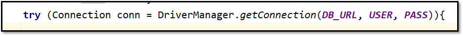

#### 产生内存溢出原因二 ： 并发请求问题

通过发送请求向Java应用获取数据，正常情况下Java应用将数据返回之后，这部分数据就可以在内存中被释放掉。

接收到请求时创建对象:


响应返回之后，对象就可以被回收掉：


并发请求问题指的是由于用户的并发请求量有可能很大，同时处理数据的时间很长，导致大量的数据存在于内存中，最终超过了内存的上限，导致内存溢出。这类问题的处理思路和内存泄漏类似，首先要定位到对象产生的根源。


那么怎么模拟并发请求呢？

使用Apache Jmeter软件可以进行并发请求测试。

Apache Jmeter是一款开源的测试软件，使用Java语言编写，最初是为了测试Web程序，目前已经发展成支持数据库、消息队列、邮件协议等不同类型内容的测试工具。

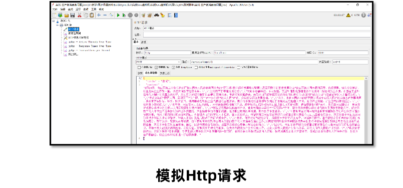

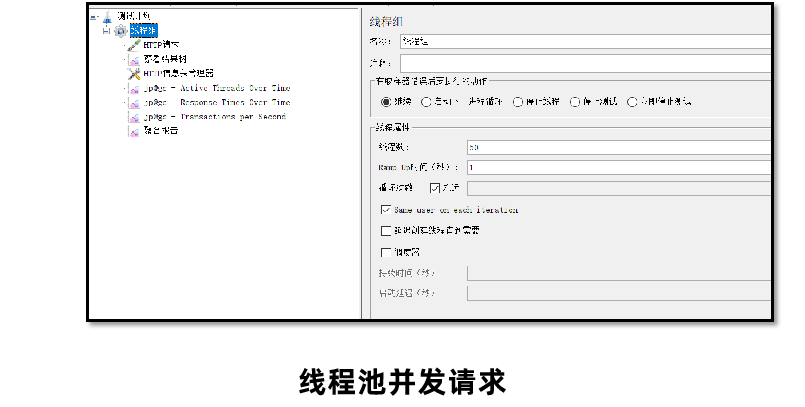

Apache Jmeter支持插件扩展，生成多样化的测试结果。


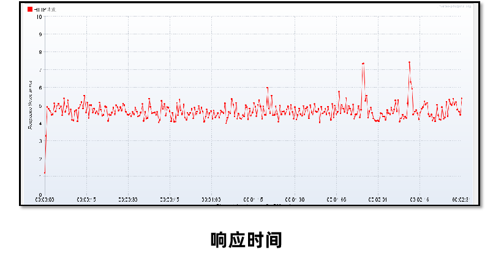

##### 使用Jmeter进行并发测试，发现内存溢出问题

背景：

小李的团队发现有一个微服务在晚上8点左右用户使用的高峰期会出现内存溢出的问题，于是他们希望在自己的开发环境能重现类似的问题。

步骤：

1、安装Jmeter软件，添加线程组。

打开资料中的Jmeter，找到bin目录，双击`jmeter.bat`启动程序。

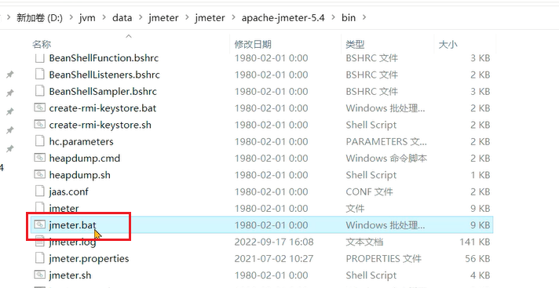

2. 在线程组中增加Http请求，添加随机参数。

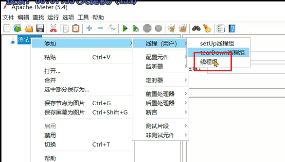

添加线程组参数：

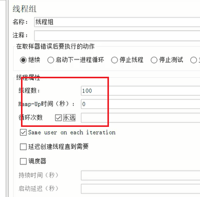

添加Http请求：

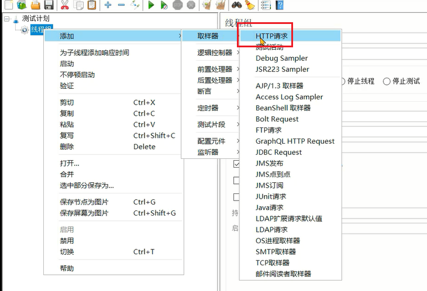

添加http参数：

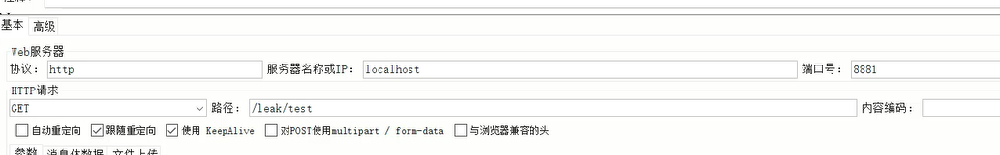

接口代码：

```Java
/**
 * 大量数据 + 处理慢
 */
@GetMapping("/test")
public void test1() throws InterruptedException {
    byte[] bytes = new byte[1024 * 1024 * 100];//100m
    Thread.sleep(10 * 1000L);
}
```

3. 在线程组中添加监听器 – 聚合报告，用来展示最终结果。

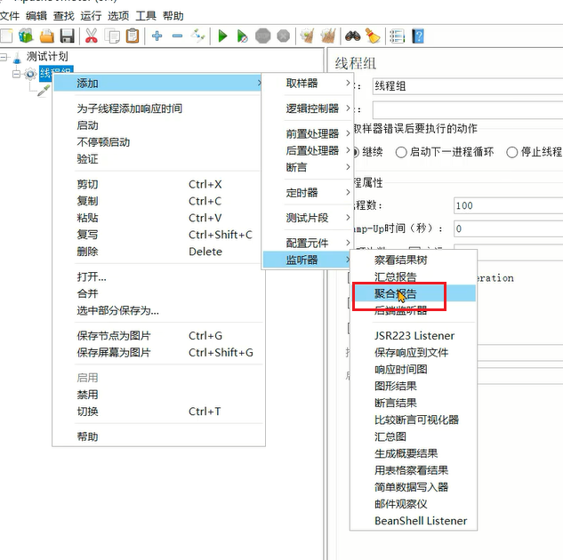

4. 启动程序，运行线程组并观察程序是否出现内存溢出。

添加虚拟机参数：

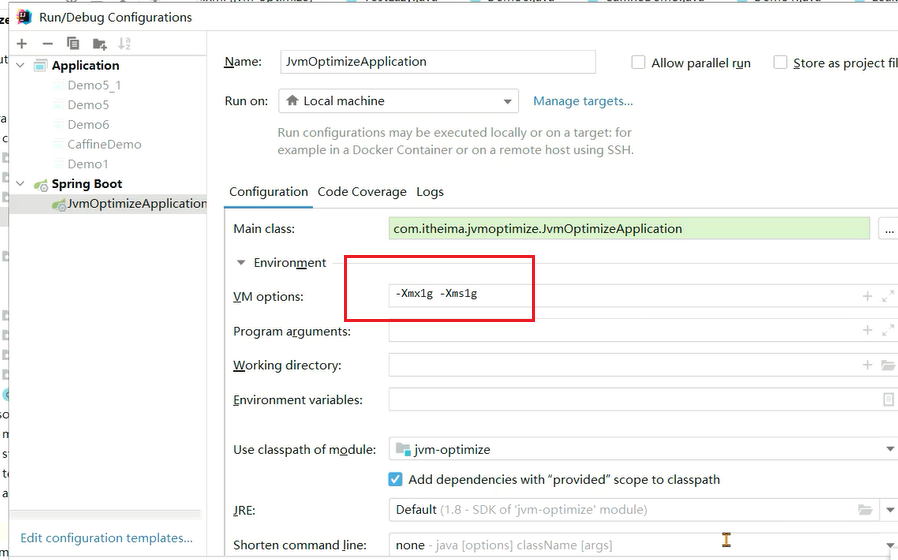

点击运行：

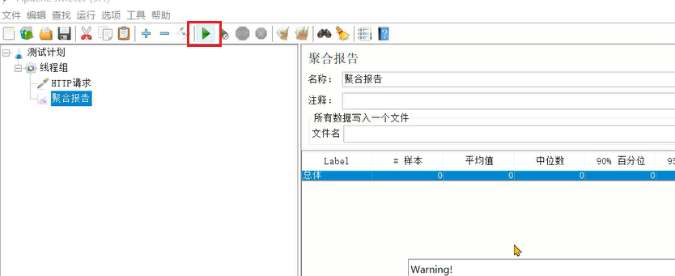

很快就出现了内存溢出：

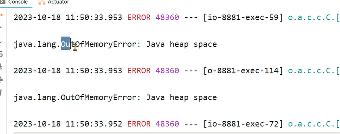

再来看一个案例：

1、设置线程池参数：

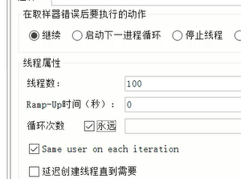

2、设置http接口参数

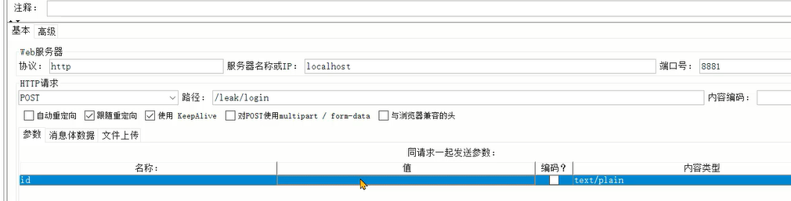

3、代码：

```Java
/**
 * 登录接口 传递名字和id,放入hashmap中
 */
@PostMapping("/login")
public void login(String name,Long id){
    userCache.put(id,new UserEntity(id,name));
}
```

4、我们想生成随机的名字和id,选择函数助手对话框

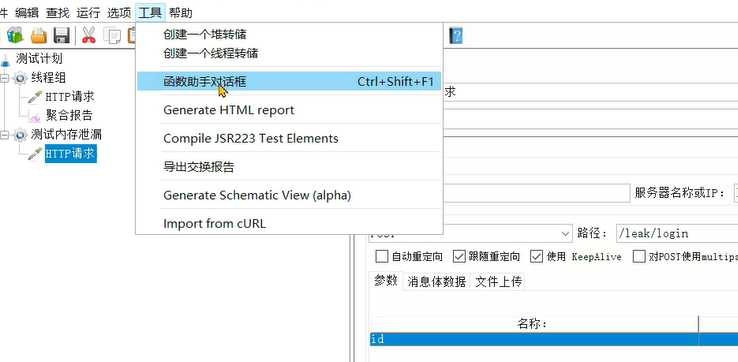

5、选择Random随机数生成器

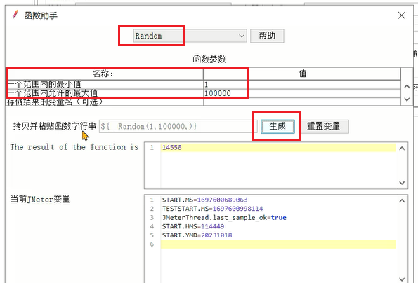

6、让随机数生成器生效，值中直接ctrl + v就行，已经被复制到粘贴板了。


7、字符串也是同理的设置方法：

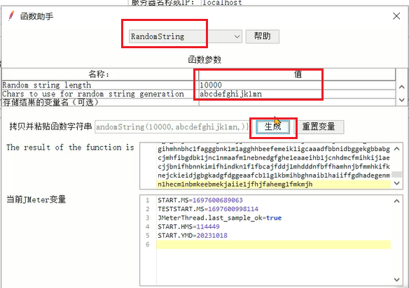

8、添加name字段：

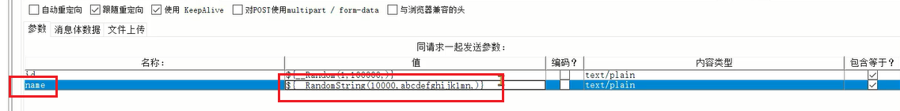

9、点击测试，一段时间之后同样出现了内存溢出：

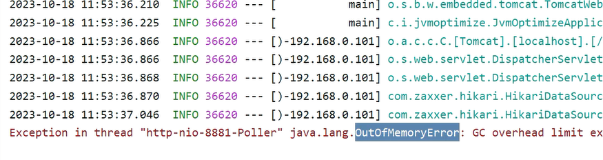

### 诊断

#### 内存快照

当堆内存溢出时，需要在堆内存溢出时将整个堆内存保存下来，生成内存快照(Heap Profile )文件。

使用MAT打开hprof文件，并选择内存泄漏检测功能，MAT会自行根据内存快照中保存的数据分析内存泄漏的根源。

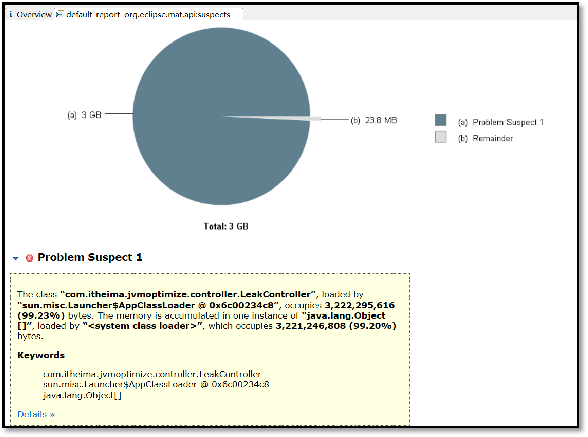

生成内存快照的Java虚拟机参数：

​    `-XX:+HeapDumpOnOutOfMemoryError`：发生OutOfMemoryError错误时，自动生成hprof内存快照文件。

​    `-XX:HeapDumpPath=<path>`：指定hprof文件的输出路径。

使用MAT打开hprof文件，并选择内存泄漏检测功能，MAT会自行根据内存快照中保存的数据分析内存泄漏的根源。

在程序中添加jvm参数：

```Java
-Xmx256m -Xms256m -XX:+HeapDumpOnOutOfMemoryError -XX:HeapDumpPath=D:\jvm\dump\test1.hprof
```

运行程序之后：

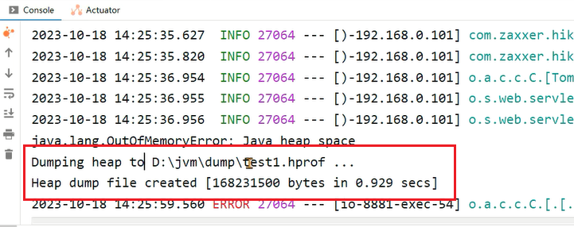

使用MAT打开hprof文件（操作步骤见前文GC Root小节），首页就展示了MAT检测出来的内存泄漏问题原因。

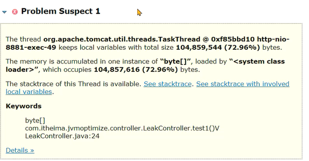

点击Details查看详情，这个线程持有了大量的字节数组：

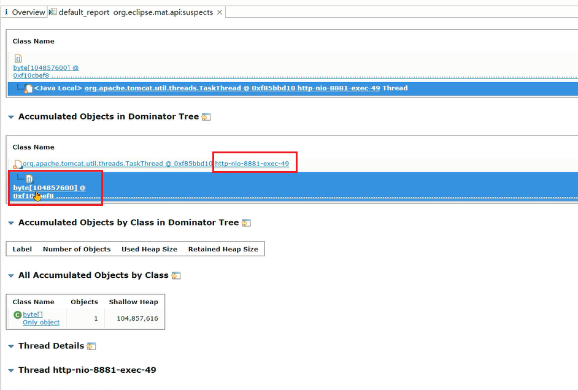

继续往下来，还可以看到溢出时线程栈，通过栈信息也可以怀疑下是否是因为这句代码创建了大量的对象：

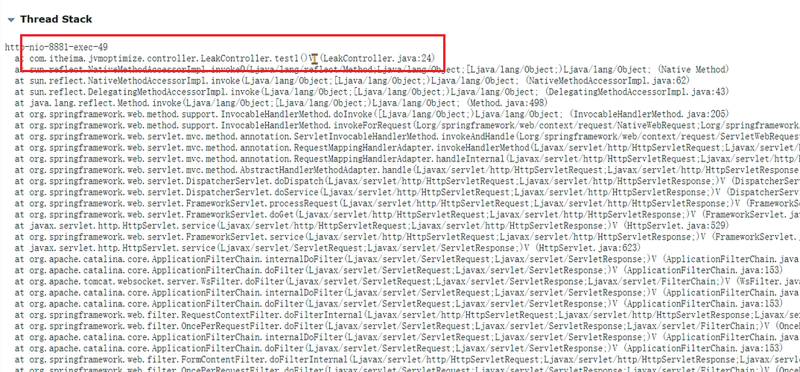

#### MAT内存泄漏检测的原理

MAT提供了称为支配树（Dominator Tree）的对象图。支配树展示的是对象实例间的支配关系。在对象引用图中，所有指向对象B的路径都经过对象A，则认为对象A支配对象B。

如下图，A引用B、C，B、C引用D, C引用E，D、E引用F，转成支配树之后。由于E只有C引用，所以E挂在C上。接下来B、C、D、F都由其他至少1个对象引用，所以追溯上去，只有A满足支配它们的条件。

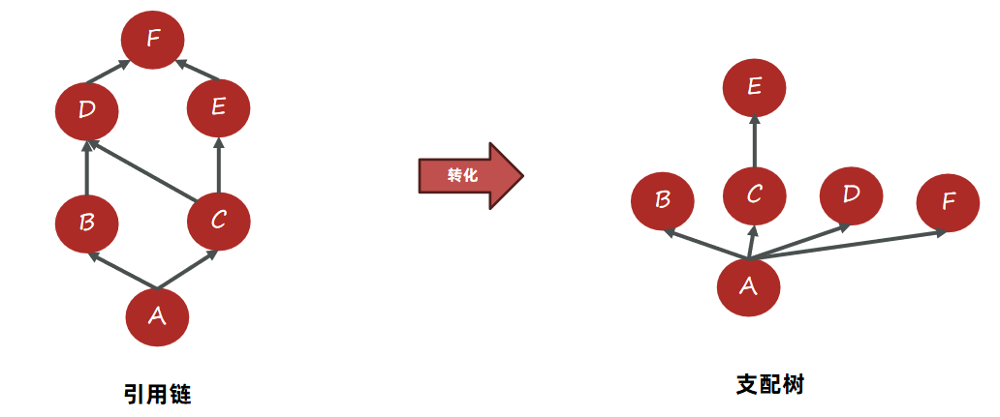

支配树中对象本身占用的空间称之为浅堆(Shallow Heap）。

支配树中对象的子树就是所有被该对象支配的内容，这些内容组成了对象的深堆（Retained Heap），也称之为保留集（ Retained Set ） 。深堆的大小表示该对象如果可以被回收，能释放多大的内存空间。

如下图：C自身包含一个浅堆，而C底下挂了E，所以C+E占用的空间大小代表C的深堆。

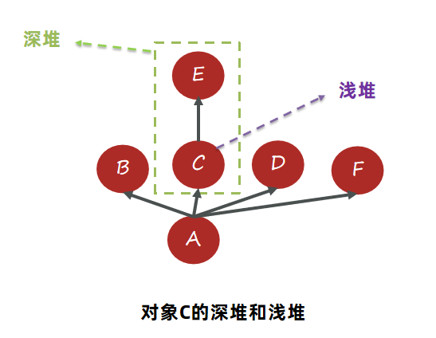

需求：

使用如下代码生成内存快照，并分析TestClass对象的深堆和浅堆。

如何在不内存溢出情况下生成堆内存快照？-XX:+HeapDumpBeforeFullGC可以在FullGC之前就生成内存快照。

```Java
package com.itheima.jvmoptimize.matdemo;

import org.openjdk.jol.info.ClassLayout;

import java.util.ArrayList;
import java.util.List;

//-XX:+HeapDumpBeforeFullGC -XX:HeapDumpPath=D:/jvm/dump/mattest.hprof
public class HeapDemo {
    public static void main(String[] args) {
        TestClass a1 = new TestClass();
        TestClass a2 = new TestClass();
        TestClass a3 = new TestClass();
        String s1 = "itheima1";
        String s2 = "itheima2";
        String s3 = "itheima3";

        a1.list.add(s1);

        a2.list.add(s1);
        a2.list.add(s2);

        a3.list.add(s3);

        //System.out.print(ClassLayout.parseClass(TestClass.class).toPrintable());
        s1 = null;
        s2 = null;
        s3 = null;
        System.gc();
    }
}

class TestClass {
    public List<String> list = new ArrayList<>(10);
}
```

上面代码的引用链如下：

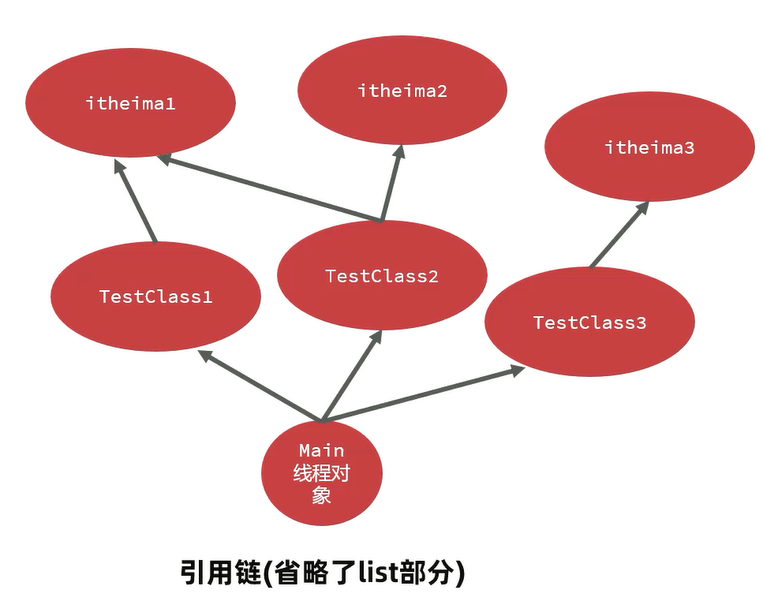

转换成支配树，`TestClass`简称为tc。tc1 tc2 tc3都是直接挂在main线程对象上，itheima2 itheima3都只能通过tc2和tc3访问，所以直接挂上。itheima1不同，他可以由tc1 tc2访问，所以他要挂载他们的上级也就是main线程对象上：

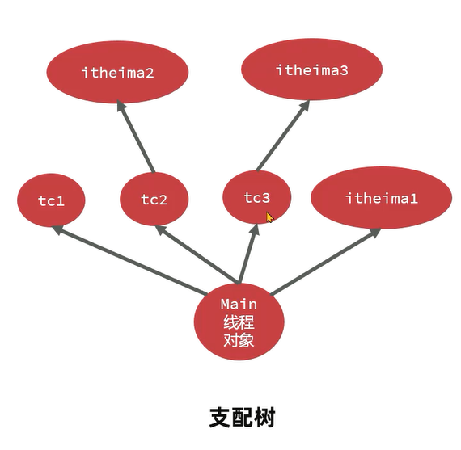

使用mat来分析，添加虚拟机参数：

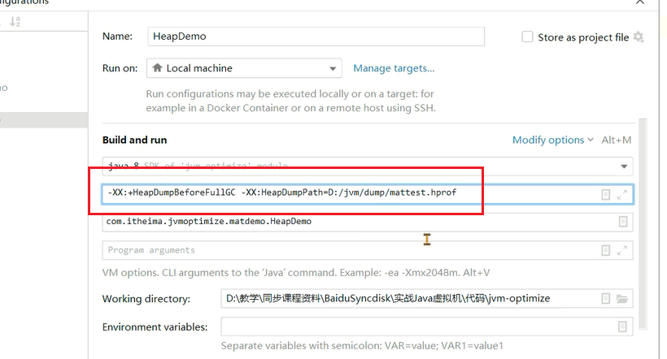

在FullGC之后产生了内存快照文件：

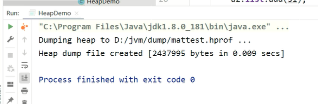

直接查看MAT的支配树功能：

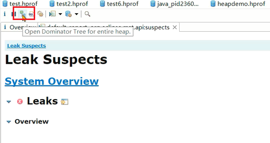

输入main进行搜索：

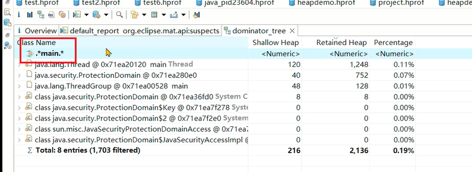

可以看到结构与之前分析的是一致的：

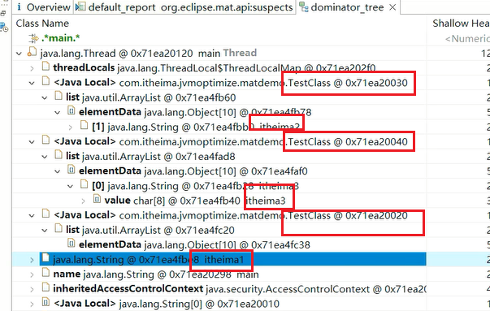

 同时可以看到字符串的浅堆大小和深堆大小：

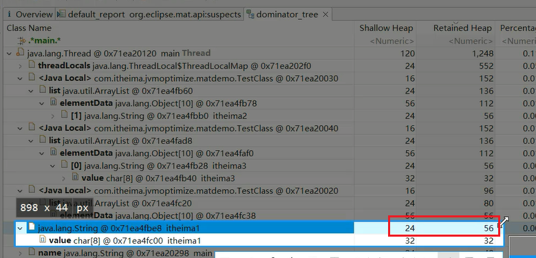

为什么字符串对象的浅堆大小是24字节，深堆大小是56字节呢？首先字符串对象引用了字符数组，字符数组的字节大小底下有展示是32字节，那我们只需要搞清楚浅堆大小也就是他自身为什么是24字节就可以了。使用`jol`框架打印下对象大小（原理篇会详细展开讲解，这里先有个基本的认知）。

添加依赖：

```XML
<dependency>
    <groupId>org.openjdk.jol</groupId>
    <artifactId>jol-core</artifactId>
    <version>0.9</version>
</dependency>
```

使用代码打印：

```Java
public class StringSize {
    public static void main(String[] args) {
        //使用JOL打印String对象
        System.out.print(ClassLayout.parseClass(String.class).toPrintable());
    }
}
```

结果如下：

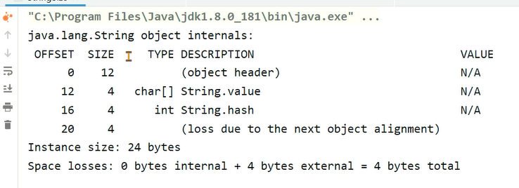

对象头占用了12字节，value字符数组的引用占用了4字节，int类型的hash字段占用4字节，还有4字节是对象填充，所以加起来是24字节。至于对象填充、对象头是做什么用的，在《原理篇》中会详细讲解。

MAT就是根据支配树，从叶子节点向根节点遍历，如果发现深堆的大小超过整个堆内存的一定比例阈值，就会将其标记成内存泄漏的“嫌疑对象”。

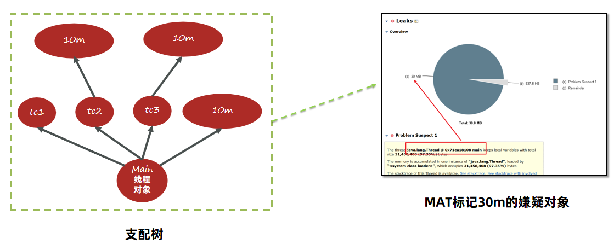

#### 服务器上的内存快照导出和分析

刚才我们都是在本地导出内存快照的，并且是程序已经出现了内存溢出，接下来我们要做到防范于未然，一旦看到内存大量增长就去分析内存快照，那此时内存还没溢出，怎么样去获得内存快照文件呢？

**背景：**

小李的团队通过监控系统发现有一个服务内存在持续增长，希望尽快通过内存快照分析增长的原因，由于并未产生内存溢出所以不能通过HeapDumpOnOutOfMemoryError参数生成内存快照。

**思路：**

导出运行中系统的内存快照，比较简单的方式有两种，注意只需要导出标记为存活的对象：

通过JDK自带的jmap命令导出，格式为：

​      jmap -dump:live,format=b,file=文件路径和文件名 进程ID

通过arthas的heapdump命令导出，格式为：

​      heapdump --live  文件路径和文件名 

先使用`jps`或者`ps -ef`查看进程ID:

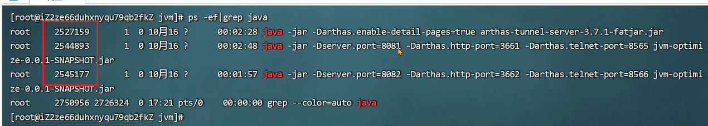

 通过`jmap`命令导出内存快照文件，live代表只保存存活对象，format=b用二进制方式保存：

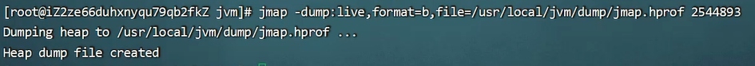

也可以在arthas中输出`heapdump`命令：


接下来下载到本地分析即可。

**大文件的处理**

在程序员开发用的机器内存范围之内的快照文件，直接使用MAT打开分析即可。但是经常会遇到服务器上的程序占用的内存达到10G以上，开发机无法正常打开此类内存快照，此时需要下载服务器操作系统对应的MAT。下载地址：https://eclipse.dev/mat/downloads.php 通过MAT中的脚本生成分析报告：

 **./ParseHeapDump.sh 快照文件路径 org.eclipse.mat.api:suspects org.eclipse.mat.api:overview org.eclipse.mat.api:top_components**

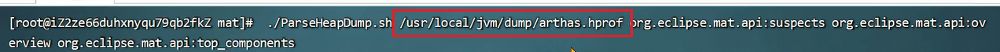

> 注意：默认MAT分析时只使用了1G的堆内存，如果快照文件超过1G，需要修改MAT目录下的MemoryAnalyzer.ini配置文件调整最大堆内存。

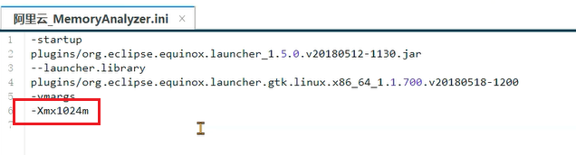

最终会生成报告文件：

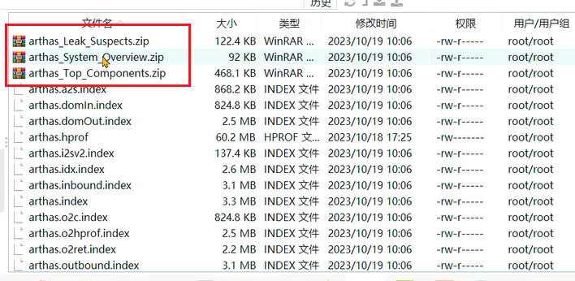

将这些文件下载到本地，解压之后打开index.html文件：

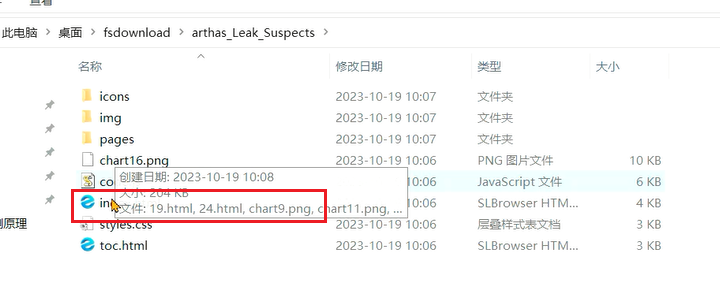

同样可以看到类似的报告：

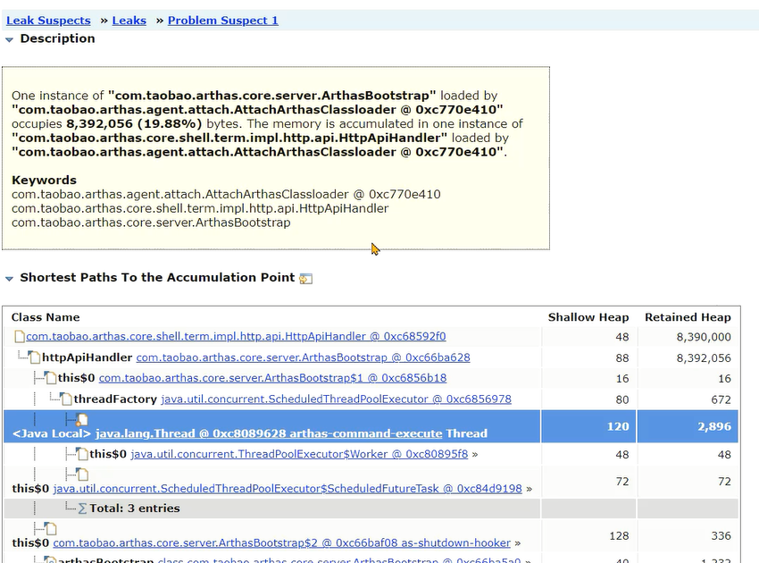

#### 案例1 - 分页查询文章接口的内存溢出：

背景：

小李负责的新闻资讯类项目采用了微服务架构，其中有一个文章微服务，这个微服务在业务高峰期出现了内存溢出的现象。

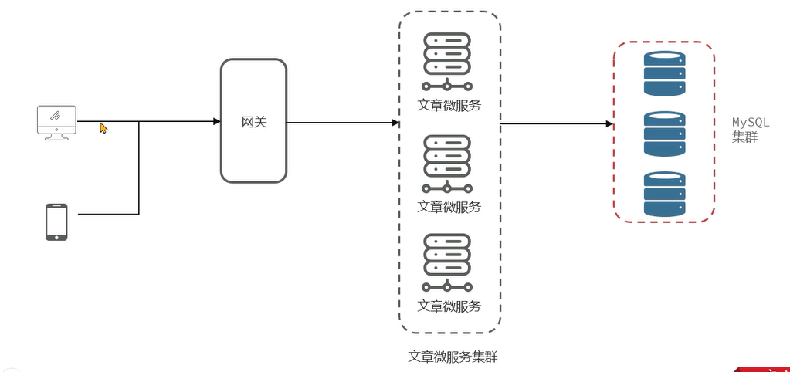

解决思路：

1、服务出现OOM内存溢出时，生成内存快照。

2、使用MAT分析内存快照，找到内存溢出的对象。

3、尝试在开发环境中重现问题，分析代码中问题产生的原因。

4、修改代码。

5、测试并验证结果。

代码使用的是`com.itheima.jvmoptimize.practice.oom.controller.DemoQueryController`：

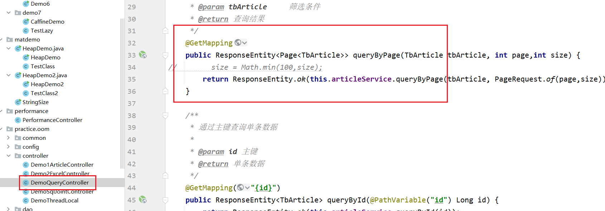

首先将项目打包，放到服务器上，同时使用如下启动命令启动。设置了最大堆内存为512m，同时堆内存溢出时会生成hprof文件：

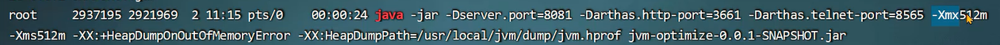

编写JMeter脚本进行压测，size数据量一次性获取10000条，线程150，每个线程执行10次方法调用：

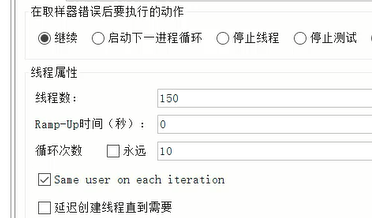

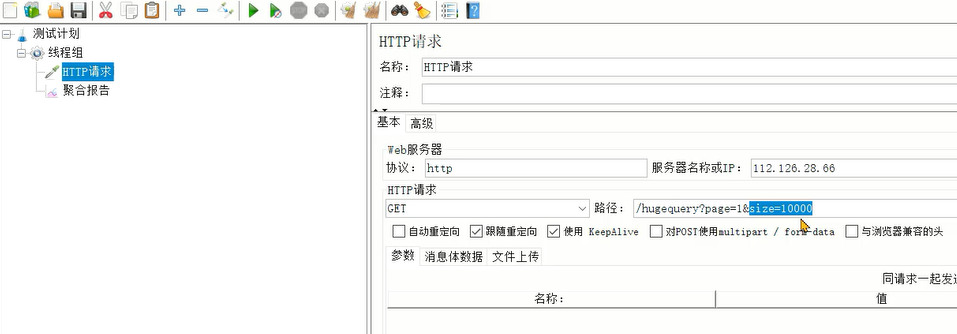

执行之后可以发现服务器上已经生成了`hprof`文件：

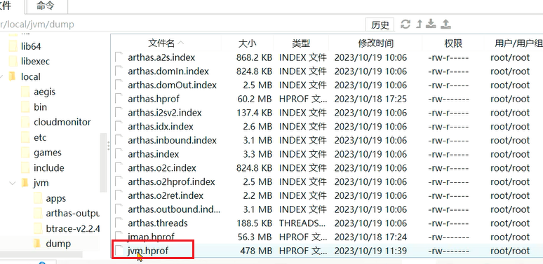

将其下载到本地，通过MAT分析发现是Mysql返回的ResultSet存在大量的数据：

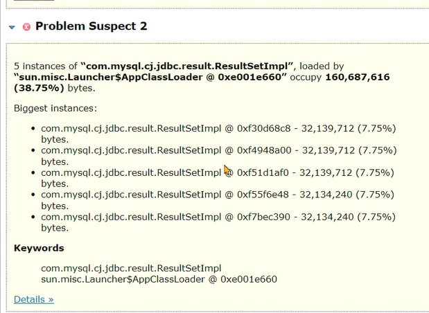

通过支配树，可以发现里边包含的数据，如果数据有一些特殊的标识，其实就可以判断出来是哪个接口产生的数据：

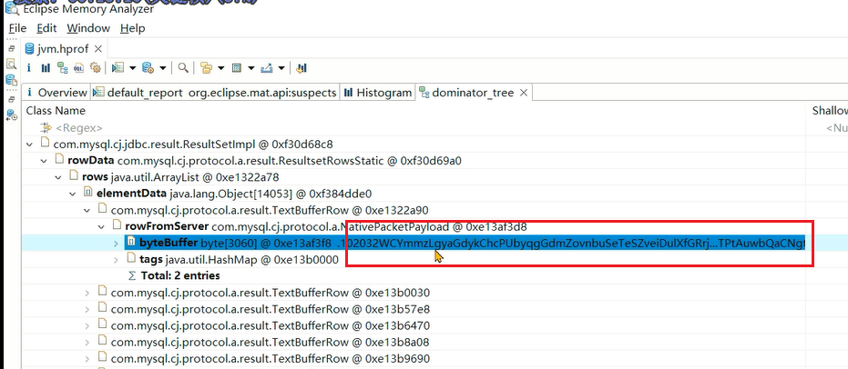

如果想知道每个线程在执行哪个方法，先找到spring的HandlerMethod对象：

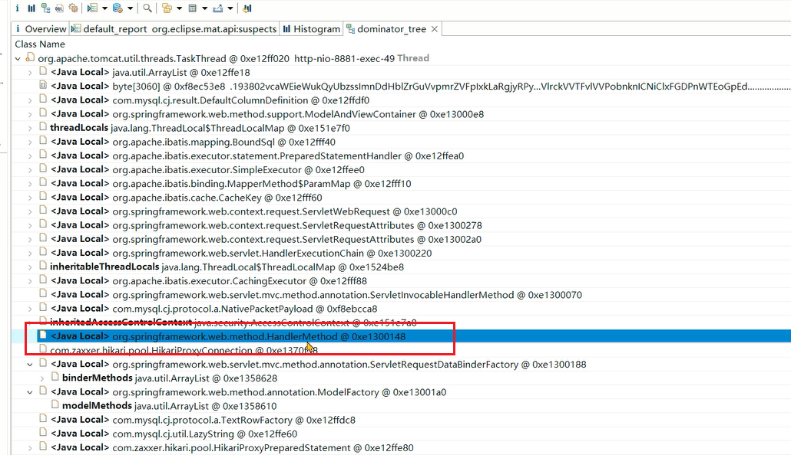

接着去找引用关系：

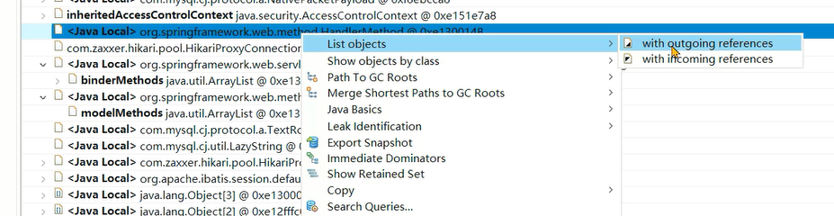

通过描述信息就可以看到接口：

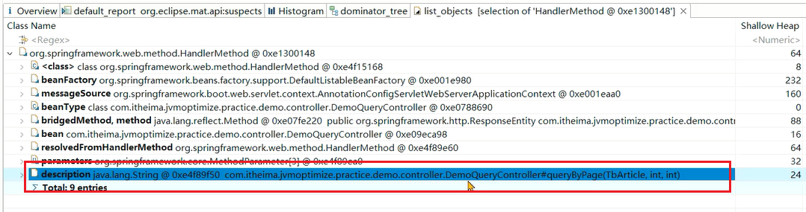

通过直方图的查找功能，也可以找到项目里哪些对象比较多：


**问题根源：**

文章微服务中的分页接口没有限制最大单次访问条数，并且单个文章对象占用的内存量较大，在业务高峰期并发量较大时这部分从数据库获取到内存之后会占用大量的内存空间。

**解决思路：**

1、与产品设计人员沟通，限制最大的单次访问条数。

以下代码，限制了每次访问的最大条数为100条

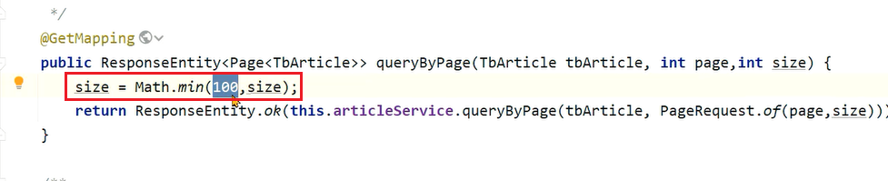

2、分页接口如果只是为了展示文章列表，不需要获取文章内容，可以大大减少对象的大小。

把文章内容去掉，减少对象大小：

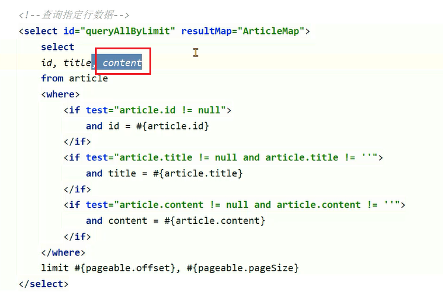

3、在高峰期对微服务进行限流保护。

#### 案例2 - Mybatis导致的内存溢出：

背景：

小李负责的文章微服务进行了升级，新增加了一个判断id是否存在的接口，第二天业务高峰期再次出现了内存溢出，小李觉得应该和新增加的接口有关系。

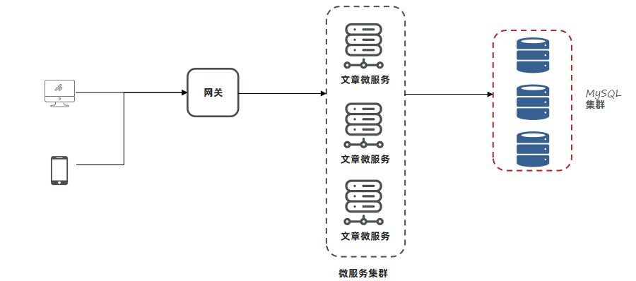

解决思路：

1、服务出现OOM内存溢出时，生成内存快照。

2、使用MAT分析内存快照，找到内存溢出的对象。

3、尝试在开发环境中重现问题，分析代码中问题产生的原因。

4、修改代码。

5、测试并验证结果。

通过分析hprof发现调用的方法，但是这个仅供参考：

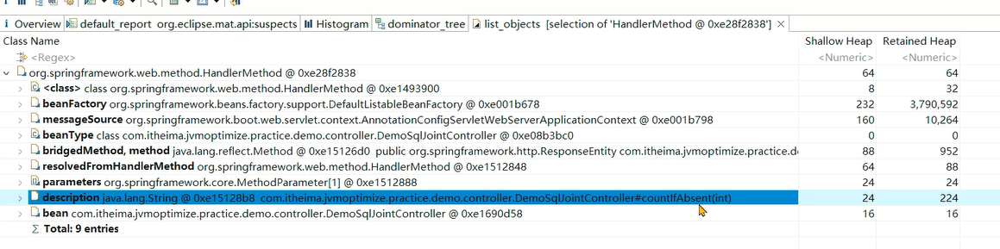

分析支配树，找到大对象来源，是一些字符串，里边还包含SQL

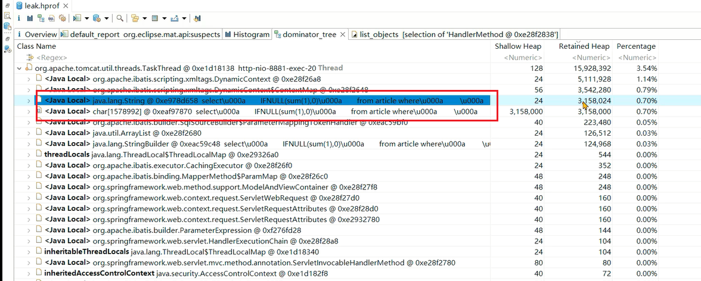

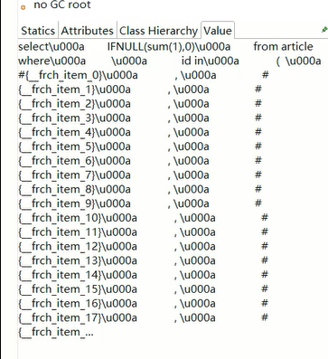

通过SQL内容搜索下可以找到对应的方法：

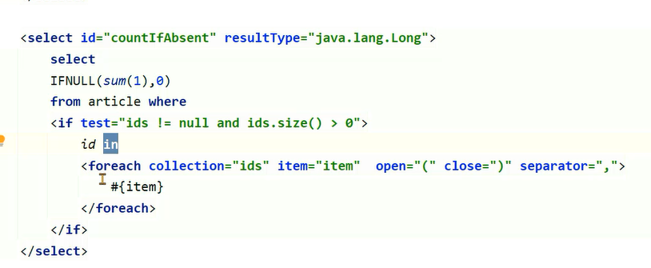

发现里边用了foreach，如果循环内容很大，会产生特别大的一个SQL语句。

直接打开jmeter，打开测试脚本进行测试:

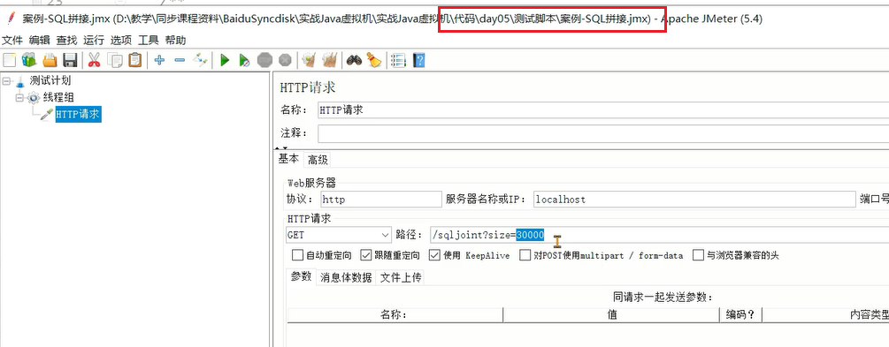

本地测试之后，出现了内存溢出：

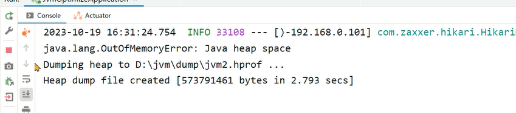

问题根源：

Mybatis在使用foreach进行sql拼接时，会在内存中创建对象，如果foreach处理的数组或者集合元素个数过多，会占用大量的内存空间。

解决思路：

1、限制参数中最大的id个数。

2、将id缓存到redis或者内存缓存中，通过缓存进行校验。

#### 案例3 - 导出大文件内存溢出

小李团队使用的是k8s将管理系统部署到了容器中，所以这一次我们使用阿里云的k8s环境还原场景，并解决问题。阿里云的k8s整体规划如下：

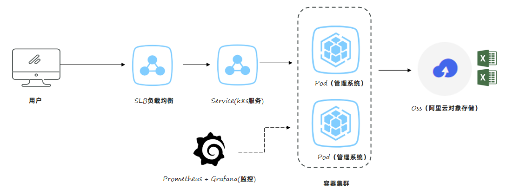

##### **K8S环境搭建（了解即可）**

1、创建镜像仓库

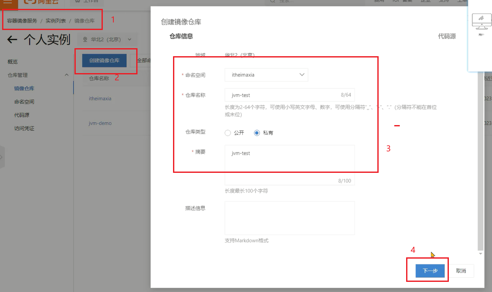

2、项目中添加Dockerfile文件

```Dockerfile
FROM openjdk:8-jre

MAINTAINER xiadong <xiadong@itcast.cn>

RUN ln -sf /usr/share/zoneinfo/Asia/Shanghai /etc/localtime

ADD jvm-optimize-0.0.1-SNAPSHOT.jar /app/

CMD ["java", "-Xmx512m", "-Xms512m", "-Dfile.encoding=UTF-8", "-XX:+HeapDumpOnOutOfMemoryError","-XX:HeapDumpPath=/opt/dump/heapdump.hprof","-jar", "/app/jvm-optimize-0.0.1-SNAPSHOT.jar"]

EXPOSE 8881
```

3、完全按照阿里云的教程执行命令：

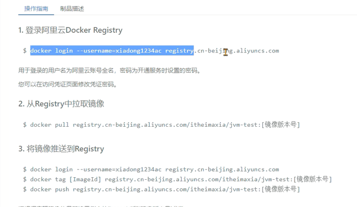

4、推送成功之后，镜像仓库中已经出现了镜像：

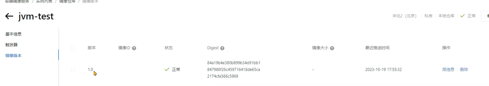

5、通过镜像构建k8s中的pod:

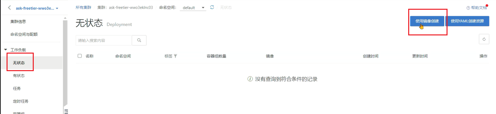

6、选择刚才的镜像：

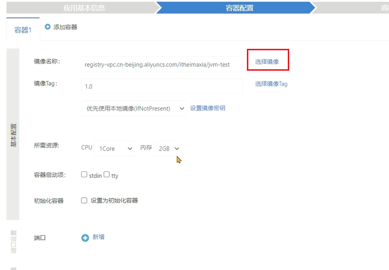

7、在OSS中创建一个Bucket：


8、创建存储声明，选择刚才的Bucket：

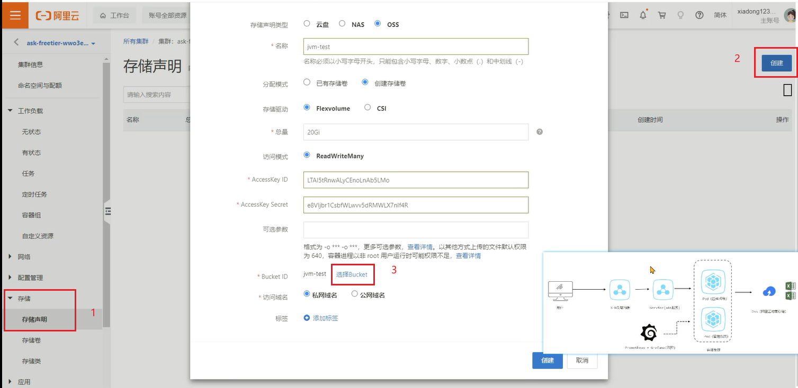

9、选择这个存储声明，并添加hprof文件生成的路径映射，要和Dockerfile中虚拟机参数里的路径相同：


10、创建一个service，填写配置，方便外网进行访问。

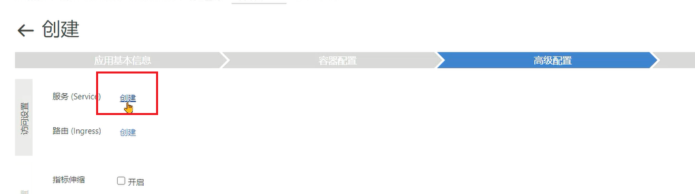

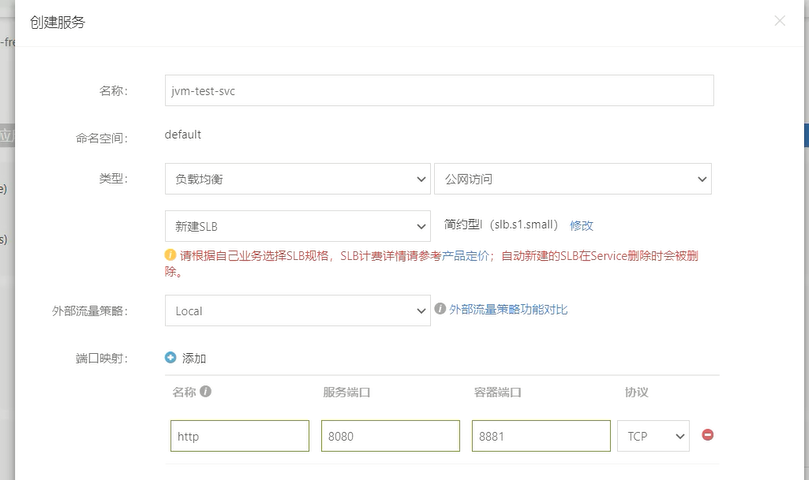

11、打开jmeter文件并测试：

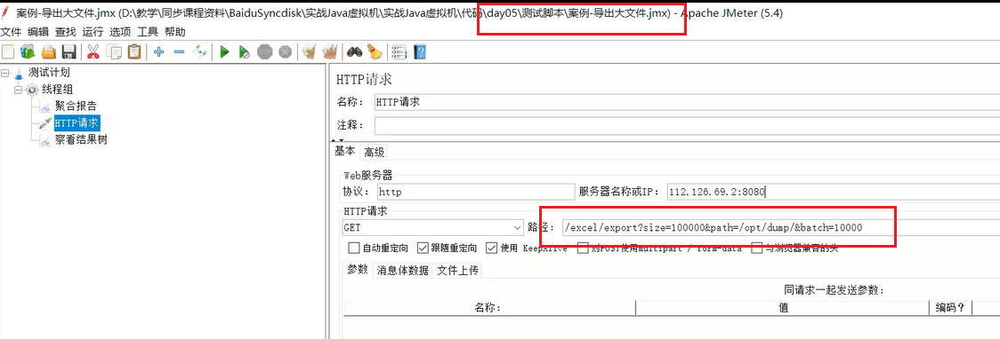

12、OSS中出现了这个hprof文件：

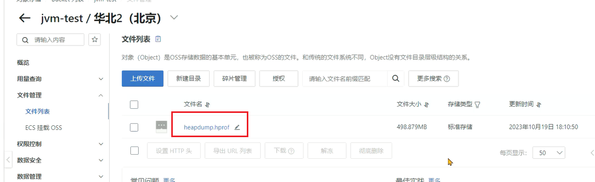

13、从直方图就可以看到是导出文件导致的内存溢出：

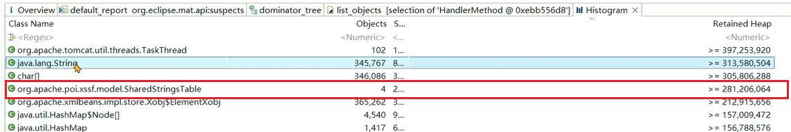

问题根源：

Excel文件导出如果使用POI的XSSFWorkbook，在大数据量（几十万）的情况下会占用大量的内存。

代码：`com.itheima.jvmoptimize.practice.oom.controller.Demo2ExcelController`

解决思路：

1、使用poi的SXSSFWorkbook。

2、hutool提供的BigExcelWriter减少内存开销。

```Dockerfile
 //http://www.hutool.cn/docs/#/poi/Excel%E5%A4%A7%E6%95%B0%E6%8D%AE%E7%94%9F%E6%88%90-BigExcelWriter
    @GetMapping("/export_hutool")
    public void export_hutool(int size, String path) throws IOException {


        List<List<?>> rows = new ArrayList<>();
        for (int i = 0; i < size; i++) {
           rows.add( CollUtil.newArrayList(RandomStringUtils.randomAlphabetic(1000)));
        }

        BigExcelWriter writer= ExcelUtil.getBigWriter(path + RandomStringUtils.randomAlphabetic(10) + ".xlsx");
// 一次性写出内容，使用默认样式
        writer.write(rows);
// 关闭writer，释放内存
        writer.close();


    }
```

3、使用easy excel，对内存进行了大量的优化。

```Dockerfile
//https://easyexcel.opensource.alibaba.com/docs/current/quickstart/write#%E9%87%8D%E5%A4%8D%E5%A4%9A%E6%AC%A1%E5%86%99%E5%85%A5%E5%86%99%E5%88%B0%E5%8D%95%E4%B8%AA%E6%88%96%E8%80%85%E5%A4%9A%E4%B8%AAsheet
@GetMapping("/export_easyexcel")
public void export_easyexcel(int size, String path,int batch) throws IOException {

    // 方法1: 如果写到同一个sheet
    String fileName = path + RandomStringUtils.randomAlphabetic(10) + ".xlsx";
    // 这里注意 如果同一个sheet只要创建一次
    WriteSheet writeSheet = EasyExcel.writerSheet("测试").build();
    // 这里 需要指定写用哪个class去写
    try (ExcelWriter excelWriter = EasyExcel.write(fileName, DemoData.class).build()) {
        // 分100次写入
        for (int i = 0; i < batch; i++) {
            // 分页去数据库查询数据 这里可以去数据库查询每一页的数据
            List<DemoData> datas = new ArrayList<>();
            for (int j = 0; j < size / batch; j++) {
                DemoData demoData = new DemoData();
                demoData.setString(RandomStringUtils.randomAlphabetic(1000));
                datas.add(demoData);
            }
            excelWriter.write(datas, writeSheet);
            //写入之后datas数据就可以释放了
        }
    }

}
```

#### 案例4 – ThreadLocal使用时占用大量内存

背景：

小李负责了一个微服务，但是他发现系统在没有任何用户使用时，也占用了大量的内存。导致可以使用的内存大大减少。

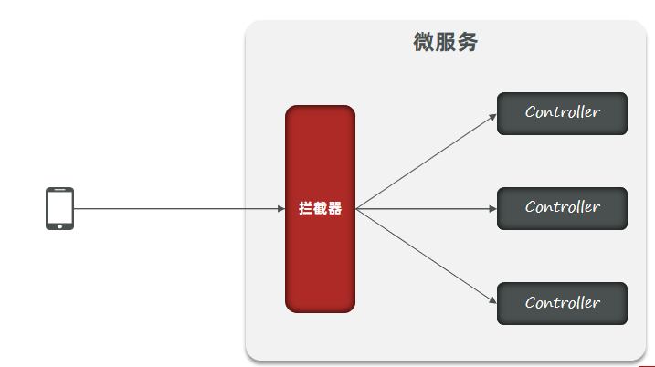

1、打开jmeter测试脚本

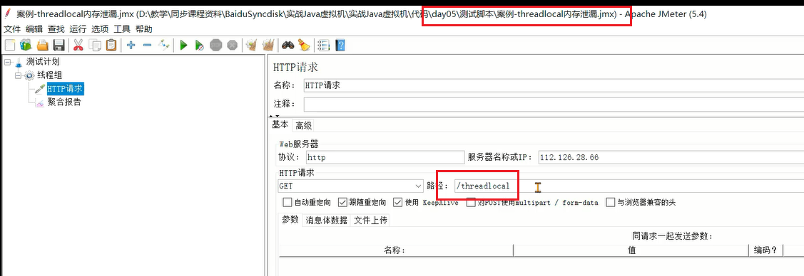

2、内存有增长，但是没溢出。所以通过jmap命令导出hprof文件


3、MAT分析之后发现每个线程中都包含了大量的对象：

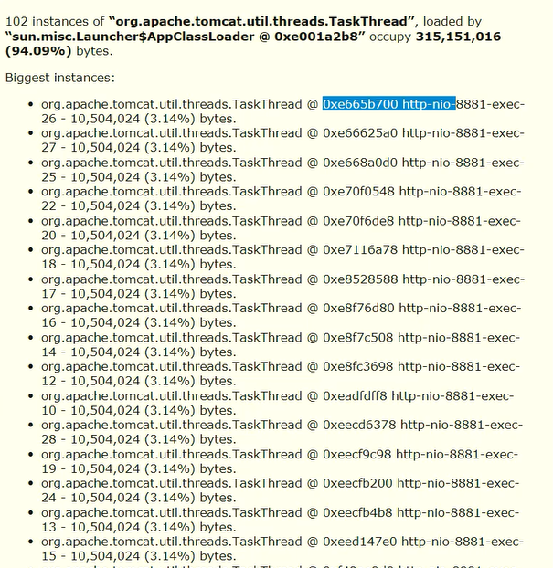

4、在支配树中可以发现是ThreadLocalMap导致的内存增长：

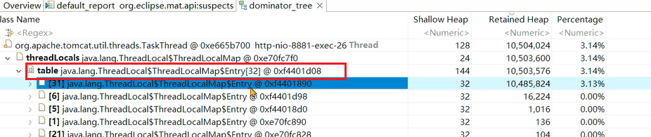

5、ThreadLocalMap就是ThreadLocal对象保存数据的地方，所以只要分析ThreadLocal代码即可。在拦截器中，ThreadLocal清理的代码被错误的放在postHandle中，如果接口发生了异常，这段代码不会调用到，这样就产生了内存泄漏，将其移动到afterCompletion就可以了。

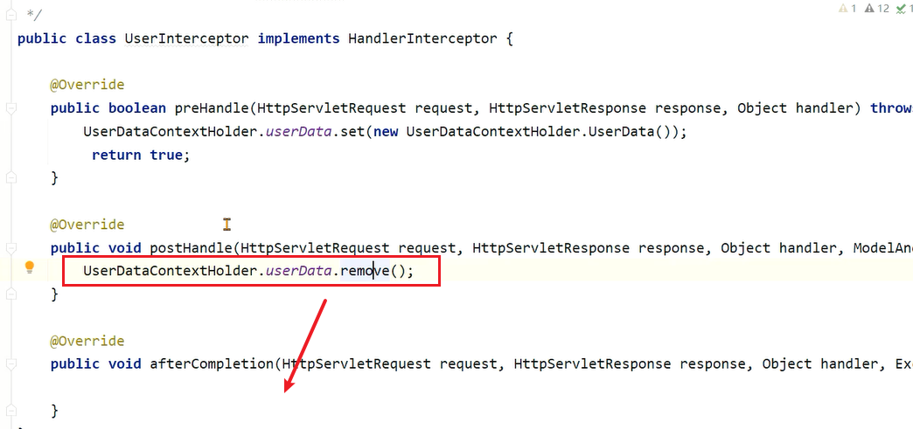

问题根源和解决思路：

很多微服务会选择在拦截器preHandle方法中去解析请求头中的数据，并放入一些数据到ThreadLocal中方便后续使用。在拦截器的afterCompletion方法中，必须要将ThreadLocal中的数据清理掉。

#### 案例5 – 文章内容审核接口的内存问题

背景：

文章微服务中提供了文章审核接口，会调用阿里云的内容安全接口进行文章中文字和图片的审核，在自测过程中出现内存占用较大的问题。

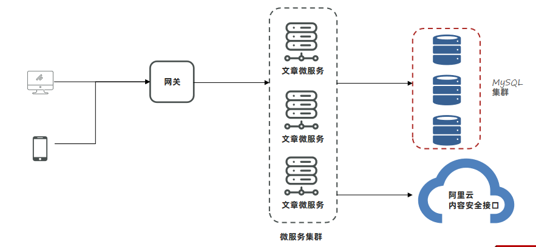

##### 设计1：使用SpringBoot中的@Async注解进行异步的审核。

##### `com.itheima.jvmoptimize.practice.oom.controller.Demo1ArticleController`类中的`article1`方法

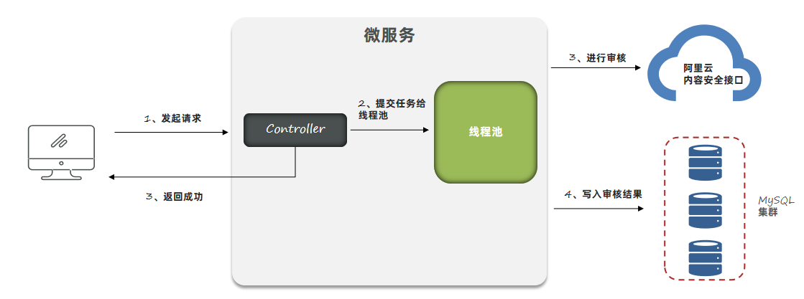

1、打开jmeter脚本，已经准好了一段测试用的文本。

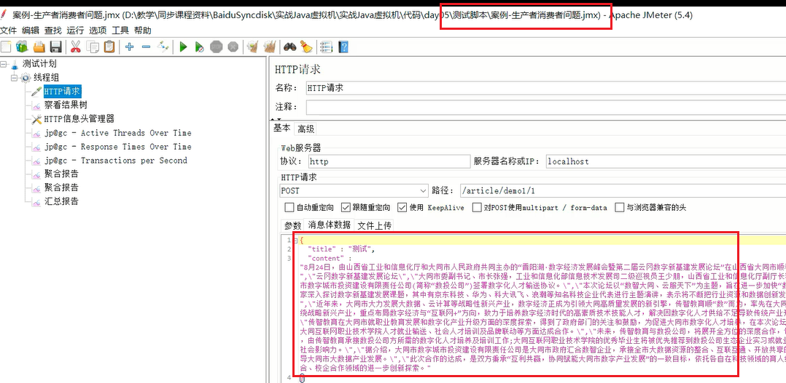

2、运行测试，发现线程数一直在增加：

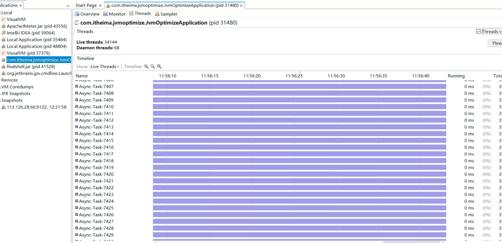

3、发现是因为异步线程池的最大线程数设置了Integer的最大值，所以只要没到上限就一直创建线程：

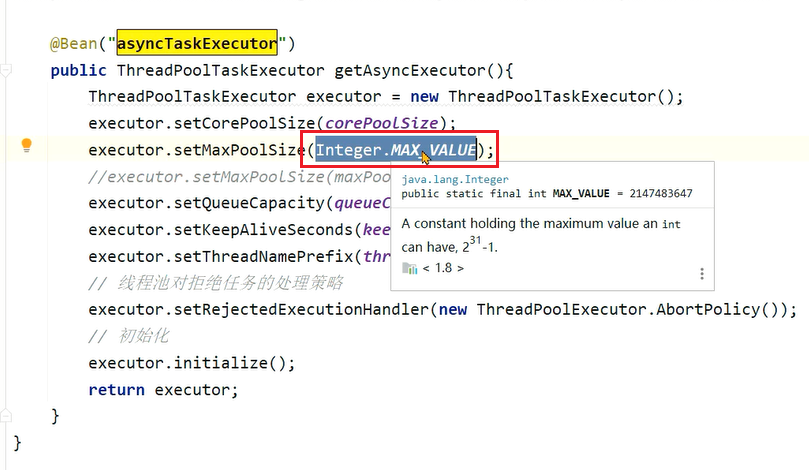

4、接下来修改为100，再次测试：


5、这次线程数相对来说比较正常：

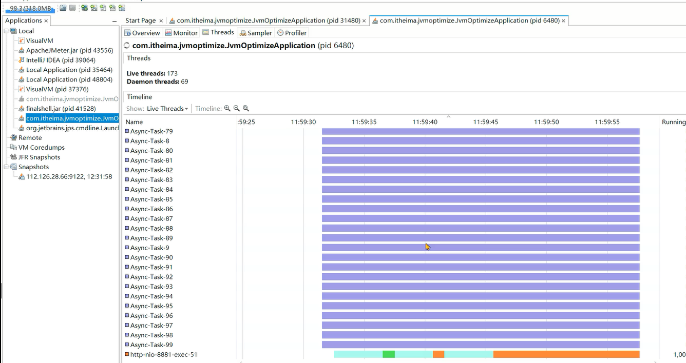

存在问题：

1、线程池参数设置不当，会导致大量线程的创建或者队列中保存大量的数据。

2、任务没有持久化，一旦走线程池的拒绝策略或者服务宕机、服务器掉电等情况很有可能会丢失任务。

##### 设计2：使用生产者和消费者模式进行处理，队列数据可以实现持久化到数据库。

代码实现：article2方法

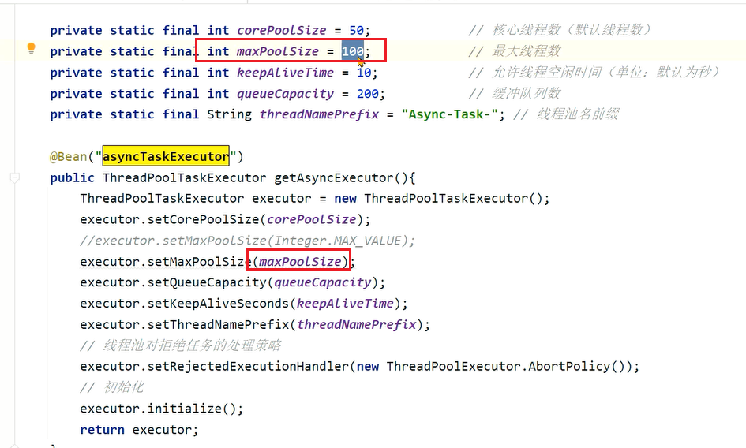

1、测试之后发现，出现内存泄漏问题(其实并不是泄漏，而是内存中存放了太多的对象，但是从图上看着像内存泄漏了)：

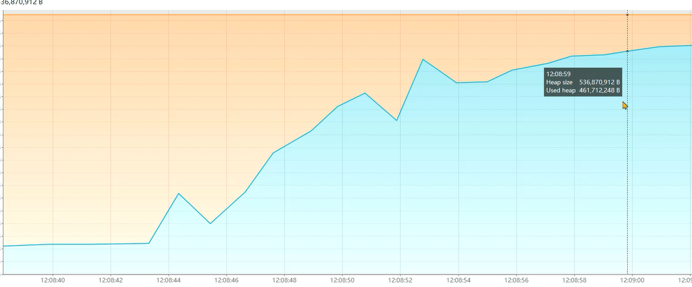

2、每次接口调用之后，都会将数据放入队列中。

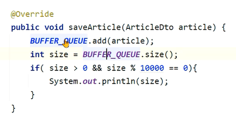

3、而这个队列没有设置上限：

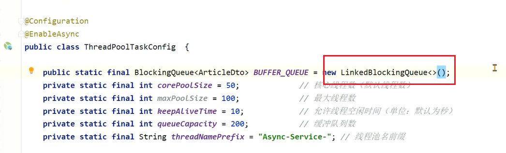

4、调整一下上限设置为2000：

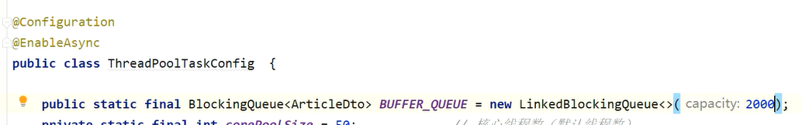

5、这次就没有出现内存泄漏问题了：

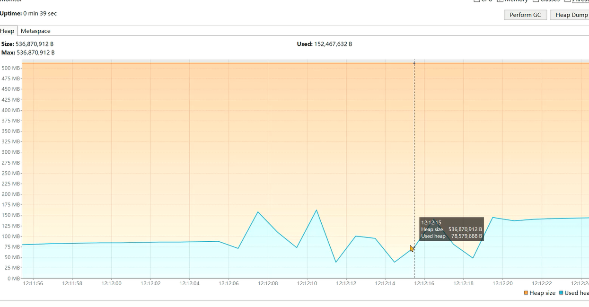

存在问题：

1、队列参数设置不正确，会保存大量的数据。

2、实现复杂，需要自行实现持久化的机制，否则数据会丢失。

##### 设计3：使用mq消息队列进行处理，由mq来保存文章的数据。发送消息的服务和拉取消息的服务可以是同一个，也可以不是同一个。

代码方法：article3

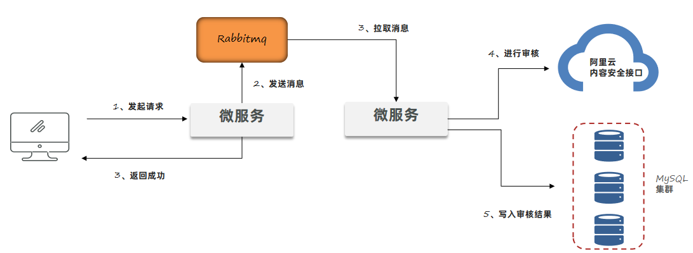

测试结果：

内存没有出现膨胀的情况

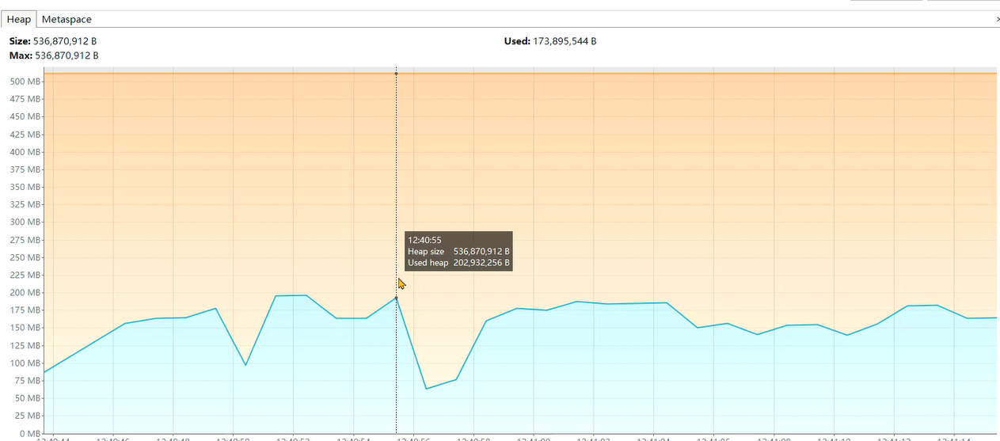

问题根源和解决思路：

在项目中如果要使用异步进行业务处理，或者实现生产者 – 消费者的模型，如果在Java代码中实现，会占用大量的内存去保存中间数据。

尽量使用Mq消息队列，可以很好地将中间数据单独进行保存，不会占用Java的内存。同时也可以将生产者和消费者拆分成不同的微服务。

#### 在线定位问题

诊断问题有两种方法，之前我们介绍的是第一种：

- 生成内存快照并分析。

优点：

   通过完整的内存快照准确地判断出问题产生的原因

缺点：

 内存较大时，生成内存快照较慢，这个过程中会影响用户的使用

 通过MAT分析内存快照，至少要准备1.5 – 2倍大小的内存空间

- 在线定位问题

优点：

   无需生成内存快照，整个过程对用户的影响较小

缺点：

 无法查看到详细的内存信息

 需要通过arthas或者btrace工具调测发现问题产生的原因，需要具备一定的经验

##### 安装Jmeter插件

为了监控响应时间RT、每秒事务数TPS等指标，需要在Jmeter上安装gc插件。

1、打开资料中的插件包并解压。

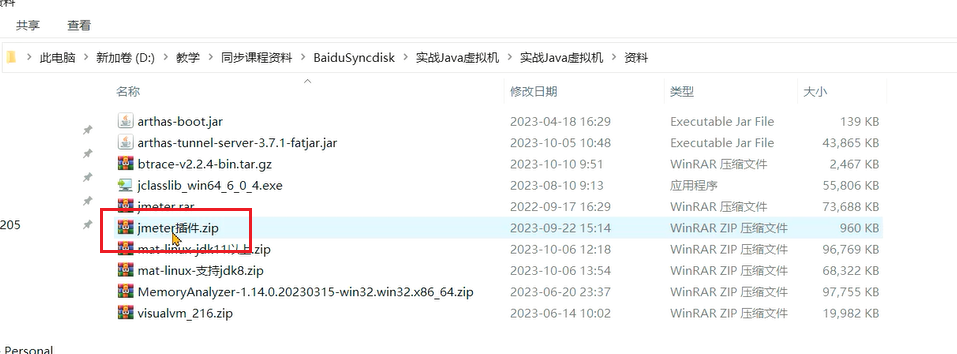

2、按插件包中的目录，复制到jmeter安装目录的lib目录下。

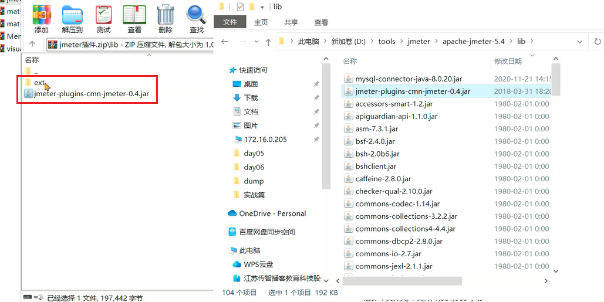

3、重启之后就可以在监听器中看到三个选项，分别是活跃线程数、响应时间RT、每秒事务数TPS。

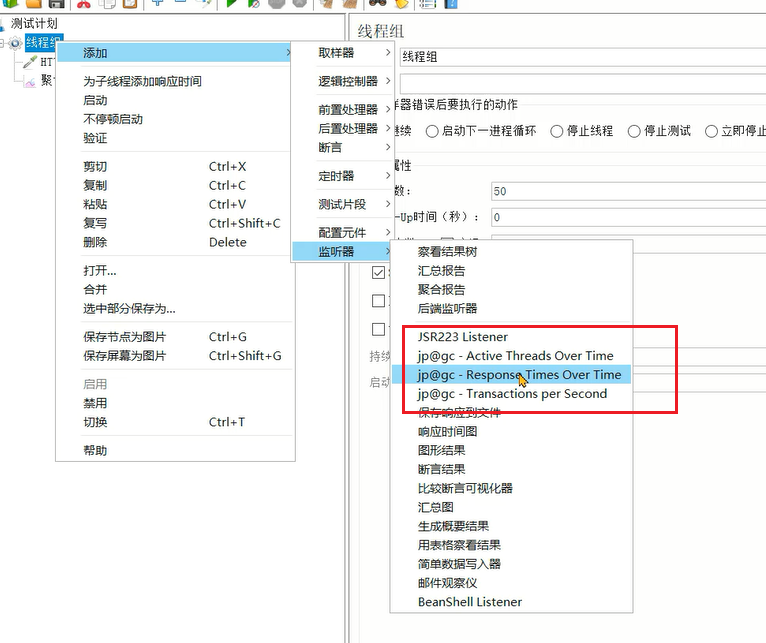

##### Arthas stack命令在线定位步骤

1、使用jmap -histo:live 进程ID > 文件名 命令将内存中存活对象以直方图的形式保存到文件中，这个过程会影响用户的时间，但是时间比较短暂。

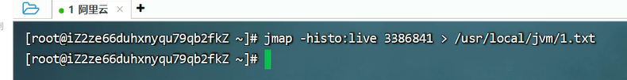

2、分析内存占用最多的对象，一般这些对象就是造成内存泄 打开1.txt文件，从图中可以看到，有一个UserEntity对象占用非常多的内存。

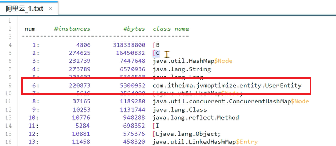

漏的原因。

3、使用arthas的stack命令，追踪对象创建的方法被调用的调用路径，找到对象创建的根源。也可以使用btrace工具编写脚本追踪方法执行的过程。

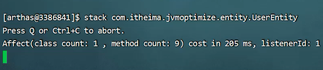

接下来启动jmeter脚本，会发现有大量的方法调用这样不利于观察。

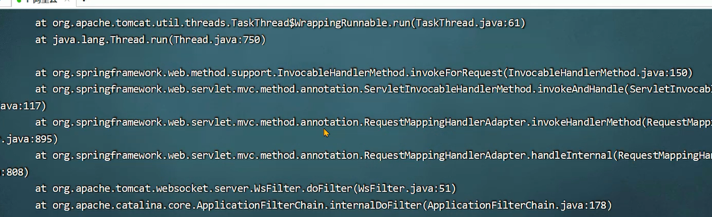

加上 `-n 1 ` 参数，限制只查看一笔调用：

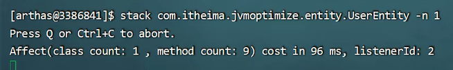

这样就定位到了是`login`接口中创建的对象：


##### btrace在线定位问题步骤

相比较arthas的stack命令，btrace允许我们自己编写代码获取感兴趣的内容，灵活性更高。

BTrace 是一个在Java 平台上执行的追踪工具，可以有效地用于线上运行系统的方法追踪，具有侵入性小、对性能的影响微乎其微等特点。 项目中可以使用btrace工具，打印出方法被调用的栈信息。 使用方法： 1、下载btrace工具， 官方地址：https://github.com/btraceio/btrace/releases/latest

在资料中也给出了：

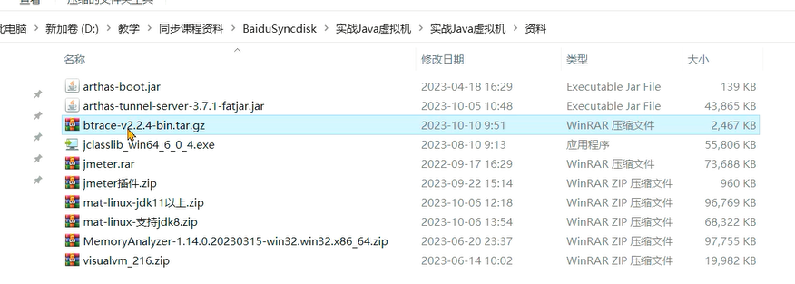

2、编写btrace脚本，通常是一个java文件 依赖：

```XML
<dependencies>
        <dependency>
            <groupId>org.openjdk.btrace</groupId>
            <artifactId>btrace-agent</artifactId>
            <version>${btrace.version}</version>
            <scope>system</scope>
            <systemPath>D:\tools\btrace-v2.2.4-bin\libs\btrace-agent.jar</systemPath>
        </dependency>

        <dependency>
            <groupId>org.openjdk.btrace</groupId>
            <artifactId>btrace-boot</artifactId>
            <version>${btrace.version}</version>
            <scope>system</scope>
            <systemPath>D:\tools\btrace-v2.2.4-bin\libs\btrace-boot.jar</systemPath>
        </dependency>

        <dependency>
            <groupId>org.openjdk.btrace</groupId>
            <artifactId>btrace-client</artifactId>
            <version>${btrace.version}</version>
            <scope>system</scope>
            <systemPath>D:\tools\btrace-v2.2.4-bin\libs\btrace-client.jar</systemPath>
        </dependency>
    </dependencies>
```

代码：

代码非常简单，就是打印出栈信息。clazz指定类，method指定监控的方法。

```Java
import org.openjdk.btrace.core.annotations.*;

import static org.openjdk.btrace.core.BTraceUtils.jstack;
import static org.openjdk.btrace.core.BTraceUtils.println;

@BTrace
public class TracingUserEntity {
        @OnMethod(
            clazz="com.itheima.jvmoptimize.entity.UserEntity",
            method="/.*/")
        public static void traceExecute(){
                jstack();
        }
}
```

3、将btrace工具和脚本上传到服务器，在服务器上运行 `btrace 进程ID 脚本文件名` 。

配置btrace环境变量，与JDK配置方式基本相同：

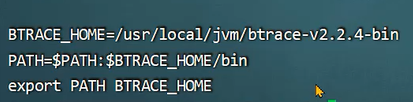

在服务器上运行 `btrace 进程ID 脚本文件名`:

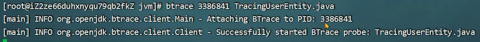

4、观察执行结果。 启动jmeter之后，同样获取到了栈信息：

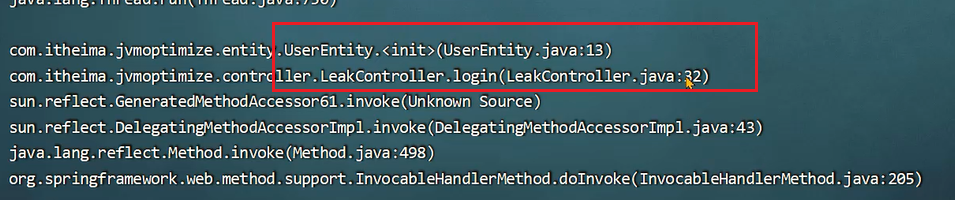

