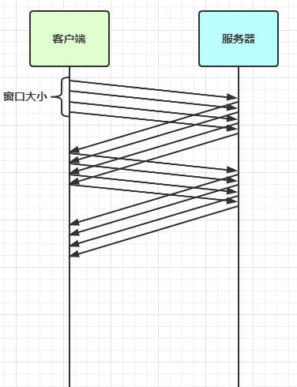
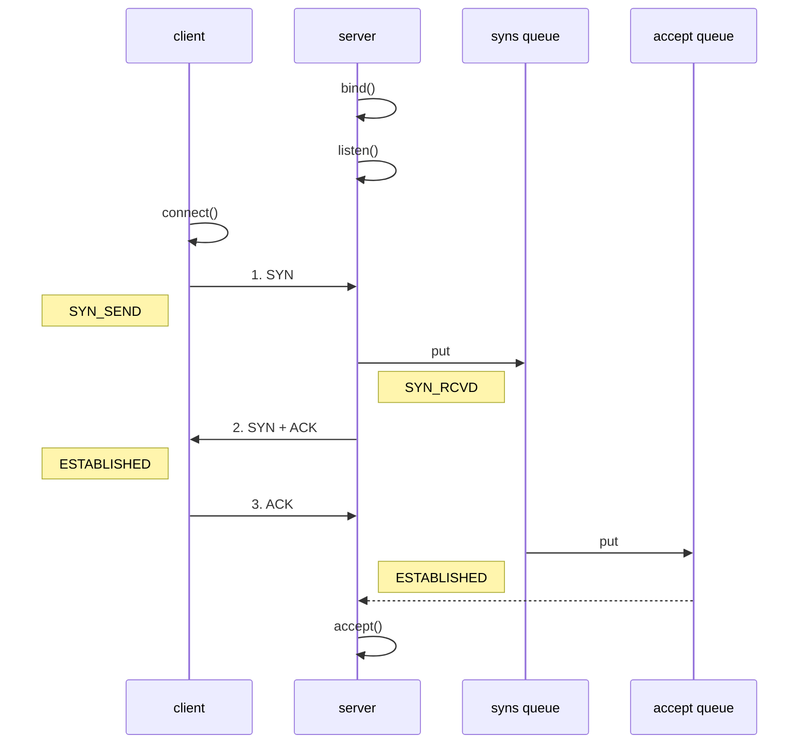

# Netty 高级

[[toc]]

## 粘包与半包

### 粘包现象

服务端代码

```java
public class HelloWorldServer {
    static final Logger log = LoggerFactory.getLogger(HelloWorldServer.class);
    void start() {
        NioEventLoopGroup boss = new NioEventLoopGroup(1);
        NioEventLoopGroup worker = new NioEventLoopGroup();
        try {
            ServerBootstrap serverBootstrap = new ServerBootstrap();
            serverBootstrap.channel(NioServerSocketChannel.class);
            serverBootstrap.group(boss, worker);
            serverBootstrap.childHandler(new ChannelInitializer<SocketChannel>() {
                @Override
                protected void initChannel(SocketChannel ch) throws Exception {
                    ch.pipeline().addLast(new LoggingHandler(LogLevel.DEBUG));
                    ch.pipeline().addLast(new ChannelInboundHandlerAdapter() {
                        @Override
                        public void channelActive(ChannelHandlerContext ctx) throws Exception {
                            log.debug("connected {}", ctx.channel());
                            super.channelActive(ctx);
                        }

                        @Override
                        public void channelInactive(ChannelHandlerContext ctx) throws Exception {
                            log.debug("disconnect {}", ctx.channel());
                            super.channelInactive(ctx);
                        }
                    });
                }
            });
            ChannelFuture channelFuture = serverBootstrap.bind(8080);
            log.debug("{} binding...", channelFuture.channel());
            channelFuture.sync();
            log.debug("{} bound...", channelFuture.channel());
            channelFuture.channel().closeFuture().sync();
        } catch (InterruptedException e) {
            log.error("server error", e);
        } finally {
            boss.shutdownGracefully();
            worker.shutdownGracefully();
            log.debug("stoped");
        }
    }

    public static void main(String[] args) {
        new HelloWorldServer().start();
    }
}
```

客户端代码希望发送 10 个消息，每个消息是 16 字节

```java
public class HelloWorldClient {
    static final Logger log = LoggerFactory.getLogger(HelloWorldClient.class);
    public static void main(String[] args) {
        NioEventLoopGroup worker = new NioEventLoopGroup();
        try {
            Bootstrap bootstrap = new Bootstrap();
            bootstrap.channel(NioSocketChannel.class);
            bootstrap.group(worker);
            bootstrap.handler(new ChannelInitializer<SocketChannel>() {
                @Override
                protected void initChannel(SocketChannel ch) throws Exception {
                    log.debug("connetted...");
                    ch.pipeline().addLast(new ChannelInboundHandlerAdapter() {
                        @Override
                        public void channelActive(ChannelHandlerContext ctx) throws Exception {
                            log.debug("sending...");
                            Random r = new Random();
                            char c = 'a';
                            for (int i = 0; i < 10; i++) {
                                ByteBuf buffer = ctx.alloc().buffer();
                                buffer.writeBytes(new byte[]{0, 1, 2, 3, 4, 5, 6, 7, 8, 9, 10, 11, 12, 13, 14, 15});
                                ctx.writeAndFlush(buffer);
                            }
                        }
                    });
                }
            });
            ChannelFuture channelFuture = bootstrap.connect("127.0.0.1", 8080).sync();
            channelFuture.channel().closeFuture().sync();

        } catch (InterruptedException e) {
            log.error("client error", e);
        } finally {
            worker.shutdownGracefully();
        }
    }
}
```

服务器端的某次输出，可以看到一次就接收了 160 个字节，而非分 10 次接收

```
08:24:46 [DEBUG] [main] c.i.n.HelloWorldServer - [id: 0x81e0fda5] binding...
08:24:46 [DEBUG] [main] c.i.n.HelloWorldServer - [id: 0x81e0fda5, L:/0:0:0:0:0:0:0:0:8080] bound...
08:24:55 [DEBUG] [nioEventLoopGroup-3-1] i.n.h.l.LoggingHandler - [id: 0x94132411, L:/127.0.0.1:8080 - R:/127.0.0.1:58177] REGISTERED
08:24:55 [DEBUG] [nioEventLoopGroup-3-1] i.n.h.l.LoggingHandler - [id: 0x94132411, L:/127.0.0.1:8080 - R:/127.0.0.1:58177] ACTIVE
08:24:55 [DEBUG] [nioEventLoopGroup-3-1] c.i.n.HelloWorldServer - connected [id: 0x94132411, L:/127.0.0.1:8080 - R:/127.0.0.1:58177]
08:24:55 [DEBUG] [nioEventLoopGroup-3-1] i.n.h.l.LoggingHandler - [id: 0x94132411, L:/127.0.0.1:8080 - R:/127.0.0.1:58177] READ: 160B
         +-------------------------------------------------+
         |  0  1  2  3  4  5  6  7  8  9  a  b  c  d  e  f |
+--------+-------------------------------------------------+----------------+
|00000000| 00 01 02 03 04 05 06 07 08 09 0a 0b 0c 0d 0e 0f |................|
|00000010| 00 01 02 03 04 05 06 07 08 09 0a 0b 0c 0d 0e 0f |................|
|00000020| 00 01 02 03 04 05 06 07 08 09 0a 0b 0c 0d 0e 0f |................|
|00000030| 00 01 02 03 04 05 06 07 08 09 0a 0b 0c 0d 0e 0f |................|
|00000040| 00 01 02 03 04 05 06 07 08 09 0a 0b 0c 0d 0e 0f |................|
|00000050| 00 01 02 03 04 05 06 07 08 09 0a 0b 0c 0d 0e 0f |................|
|00000060| 00 01 02 03 04 05 06 07 08 09 0a 0b 0c 0d 0e 0f |................|
|00000070| 00 01 02 03 04 05 06 07 08 09 0a 0b 0c 0d 0e 0f |................|
|00000080| 00 01 02 03 04 05 06 07 08 09 0a 0b 0c 0d 0e 0f |................|
|00000090| 00 01 02 03 04 05 06 07 08 09 0a 0b 0c 0d 0e 0f |................|
+--------+-------------------------------------------------+----------------+
08:24:55 [DEBUG] [nioEventLoopGroup-3-1] i.n.h.l.LoggingHandler - [id: 0x94132411, L:/127.0.0.1:8080 - R:/127.0.0.1:58177] READ COMPLETE
```


### 半包现象

客户端代码希望发送 1 个消息，这个消息是 160 字节，代码改为

```java
ByteBuf buffer = ctx.alloc().buffer();
for (int i = 0; i < 10; i++) {
    buffer.writeBytes(new byte[]{0, 1, 2, 3, 4, 5, 6, 7, 8, 9, 10, 11, 12, 13, 14, 15});
}
ctx.writeAndFlush(buffer);
```

为现象明显，服务端修改一下接收缓冲区，其它代码不变

```java
serverBootstrap.option(ChannelOption.SO_RCVBUF, 10);
```

服务器端的某次输出，可以看到接收的消息被分为两节，第一次 20 字节，第二次 140 字节

```
08:43:49 [DEBUG] [main] c.i.n.HelloWorldServer - [id: 0x4d6c6a84] binding...
08:43:49 [DEBUG] [main] c.i.n.HelloWorldServer - [id: 0x4d6c6a84, L:/0:0:0:0:0:0:0:0:8080] bound...
08:44:23 [DEBUG] [nioEventLoopGroup-3-1] i.n.h.l.LoggingHandler - [id: 0x1719abf7, L:/127.0.0.1:8080 - R:/127.0.0.1:59221] REGISTERED
08:44:23 [DEBUG] [nioEventLoopGroup-3-1] i.n.h.l.LoggingHandler - [id: 0x1719abf7, L:/127.0.0.1:8080 - R:/127.0.0.1:59221] ACTIVE
08:44:23 [DEBUG] [nioEventLoopGroup-3-1] c.i.n.HelloWorldServer - connected [id: 0x1719abf7, L:/127.0.0.1:8080 - R:/127.0.0.1:59221]
08:44:24 [DEBUG] [nioEventLoopGroup-3-1] i.n.h.l.LoggingHandler - [id: 0x1719abf7, L:/127.0.0.1:8080 - R:/127.0.0.1:59221] READ: 20B
         +-------------------------------------------------+
         |  0  1  2  3  4  5  6  7  8  9  a  b  c  d  e  f |
+--------+-------------------------------------------------+----------------+
|00000000| 00 01 02 03 04 05 06 07 08 09 0a 0b 0c 0d 0e 0f |................|
|00000010| 00 01 02 03                                     |....            |
+--------+-------------------------------------------------+----------------+
08:44:24 [DEBUG] [nioEventLoopGroup-3-1] i.n.h.l.LoggingHandler - [id: 0x1719abf7, L:/127.0.0.1:8080 - R:/127.0.0.1:59221] READ COMPLETE
08:44:24 [DEBUG] [nioEventLoopGroup-3-1] i.n.h.l.LoggingHandler - [id: 0x1719abf7, L:/127.0.0.1:8080 - R:/127.0.0.1:59221] READ: 140B
         +-------------------------------------------------+
         |  0  1  2  3  4  5  6  7  8  9  a  b  c  d  e  f |
+--------+-------------------------------------------------+----------------+
|00000000| 04 05 06 07 08 09 0a 0b 0c 0d 0e 0f 00 01 02 03 |................|
|00000010| 04 05 06 07 08 09 0a 0b 0c 0d 0e 0f 00 01 02 03 |................|
|00000020| 04 05 06 07 08 09 0a 0b 0c 0d 0e 0f 00 01 02 03 |................|
|00000030| 04 05 06 07 08 09 0a 0b 0c 0d 0e 0f 00 01 02 03 |................|
|00000040| 04 05 06 07 08 09 0a 0b 0c 0d 0e 0f 00 01 02 03 |................|
|00000050| 04 05 06 07 08 09 0a 0b 0c 0d 0e 0f 00 01 02 03 |................|
|00000060| 04 05 06 07 08 09 0a 0b 0c 0d 0e 0f 00 01 02 03 |................|
|00000070| 04 05 06 07 08 09 0a 0b 0c 0d 0e 0f 00 01 02 03 |................|
|00000080| 04 05 06 07 08 09 0a 0b 0c 0d 0e 0f             |............    |
+--------+-------------------------------------------------+----------------+
08:44:24 [DEBUG] [nioEventLoopGroup-3-1] i.n.h.l.LoggingHandler - [id: 0x1719abf7, L:/127.0.0.1:8080 - R:/127.0.0.1:59221] READ COMPLETE
```

> **注意**
>
> serverBootstrap.option(ChannelOption.SO_RCVBUF, 10) 影响的底层接收缓冲区（即滑动窗口）大小，仅决定了 netty 读取的最小单位，netty 实际每次读取的一般是它的整数倍


### 现象分析

粘包

* 现象，发送 abc def，接收 abcdef
* 原因
  * 应用层：接收方 ByteBuf 设置太大（Netty 默认 1024）
  * TCP层：滑动窗口：假设发送方 256 bytes 表示一个完整报文，但由于接收方处理不及时且窗口大小足够大，这 256 bytes 字节就会缓冲在接收方的滑动窗口中，当滑动窗口中缓冲了多个报文就会粘包
  * TCP层：Nagle 算法：会造成粘包

半包

* 现象，发送 abcdef，接收 abc def
* 原因
  * 应用层：接收方 ByteBuf 小于实际发送数据量
  * TCP层：滑动窗口：假设接收方的窗口只剩了 128 bytes，发送方的报文大小是 256 bytes，这时放不下了，只能先发送前 128 bytes，等待 ack 后才能发送剩余部分，这就造成了半包
  * 链路层：MSS 限制（localhost没有限制，局域网会限制）：当发送的数据超过 MSS 限制后，会将数据切分发送，就会造成半包


本质是因为 TCP 是流式协议，消息无边界


> 滑动窗口
>
> * TCP 以一个段（segment）为单位，每发送一个段就需要进行一次确认应答（ack）处理，但如果这么做，缺点是包的往返时间越长性能就越差
>
>   
>
> 
>
> * 为了解决此问题，引入了窗口概念，窗口大小即决定了无需等待应答而可以继续发送的数据最大值
>
>   
>
> * 窗口实际就起到一个缓冲区的作用，同时也能起到流量控制的作用
>
>   * 图中深色的部分即要发送的数据，高亮的部分即窗口
>   * 窗口内的数据才允许被发送，当应答未到达前，窗口必须停止滑动
>   * 如果 1001~2000 这个段的数据 ack 回来了，窗口就可以向前滑动
>   * 接收方也会维护一个窗口，只有落在窗口内的数据才能允许接收
>


>  MSS 限制
>
>  * 链路层对一次能够发送的最大数据有限制，这个限制称之为 MTU（maximum transmission unit），不同的链路设备的 MTU 值也有所不同，例如
>
>   * 以太网的 MTU 是 1500
>   * FDDI（光纤分布式数据接口）的 MTU 是 4352
>   * 本地回环地址的 MTU 是 65535 - 本地测试不走网卡
>
>  * MSS 是最大段长度（maximum segment size），它是 MTU 刨去 tcp 头和 ip 头后剩余能够作为数据传输的字节数
>
>   * ipv4 tcp 头占用 20 bytes，ip 头占用 20 bytes，因此以太网 MSS 的值为 1500 - 40 = 1460
>   * TCP 在传递大量数据时，会按照 MSS 大小将数据进行分割发送
>   * MSS 的值在三次握手时通知对方自己 MSS 的值，然后在两者之间选择一个小值作为 MSS
>
>   <assets src="assets/0031.jpg" style="zoom:50%;" />


> Nagle 算法
>
> * 即使发送一个字节，也需要加入 tcp 头和 ip 头，也就是总字节数会使用 41 bytes，非常不经济。因此为了提高网络利用率，tcp 希望尽可能发送足够大的数据，这就是 Nagle 算法产生的缘由
> * 该算法是指发送端即使还有应该发送的数据，但如果这部分数据很少的话，则进行延迟发送
>   * 如果 SO_SNDBUF 的数据达到 MSS，则需要发送
>   * 如果 SO_SNDBUF 中含有 FIN（表示需要连接关闭）这时将剩余数据发送，再关闭
>   * 如果 TCP_NODELAY = true，则需要发送
>   * 已发送的数据都收到 ack 时，则需要发送
>   * 上述条件不满足，但发生超时（一般为 200ms）则需要发送
>   * 除上述情况，延迟发送


### 解决方案

1. 短链接，发一个包建立一次连接，这样连接建立到连接断开之间就是消息的边界，缺点效率太低
2. 每一条消息采用固定长度，缺点浪费空间
3. 每一条消息采用分隔符，例如 \n，缺点需要转义
4. 每一条消息分为 head 和 body，head 中包含 body 的长度


#### 短链接

以解决粘包为例

```java
public class HelloWorldClient {
    static final Logger log = LoggerFactory.getLogger(HelloWorldClient.class);

    public static void main(String[] args) {
        // 分 10 次发送
        for (int i = 0; i < 10; i++) {
            send();
        }
    }

    private static void send() {
        NioEventLoopGroup worker = new NioEventLoopGroup();
        try {
            Bootstrap bootstrap = new Bootstrap();
            bootstrap.channel(NioSocketChannel.class);
            bootstrap.group(worker);
            bootstrap.handler(new ChannelInitializer<SocketChannel>() {
                @Override
                protected void initChannel(SocketChannel ch) throws Exception {
                    log.debug("conneted...");
                    ch.pipeline().addLast(new LoggingHandler(LogLevel.DEBUG));
                    ch.pipeline().addLast(new ChannelInboundHandlerAdapter() {
                        @Override
                        public void channelActive(ChannelHandlerContext ctx) throws Exception {
                            log.debug("sending...");
                            ByteBuf buffer = ctx.alloc().buffer();
                            buffer.writeBytes(new byte[]{0, 1, 2, 3, 4, 5, 6, 7, 8, 9, 10, 11, 12, 13, 14, 15});
                            ctx.writeAndFlush(buffer);
                            // 发完即关
                            ctx.close();
                        }
                    });
                }
            });
            ChannelFuture channelFuture = bootstrap.connect("localhost", 8080).sync();
            channelFuture.channel().closeFuture().sync();

        } catch (InterruptedException e) {
            log.error("client error", e);
        } finally {
            worker.shutdownGracefully();
        }
    }
}
```

输出，略

> 半包用这种办法还是不好解决，因为接收方的缓冲区大小是有限的


#### 固定长度

让所有数据包长度固定（假设长度为 8 字节），服务器端加入

```java
ch.pipeline().addLast(new FixedLengthFrameDecoder(8));
```

客户端测试代码，注意, 采用这种方法后，客户端什么时候 flush 都可以

```java
public class HelloWorldClient {
    static final Logger log = LoggerFactory.getLogger(HelloWorldClient.class);

    public static void main(String[] args) {
        NioEventLoopGroup worker = new NioEventLoopGroup();
        try {
            Bootstrap bootstrap = new Bootstrap();
            bootstrap.channel(NioSocketChannel.class);
            bootstrap.group(worker);
            bootstrap.handler(new ChannelInitializer<SocketChannel>() {
                @Override
                protected void initChannel(SocketChannel ch) throws Exception {
                    log.debug("connetted...");
                    ch.pipeline().addLast(new LoggingHandler(LogLevel.DEBUG));
                    ch.pipeline().addLast(new ChannelInboundHandlerAdapter() {
                        @Override
                        public void channelActive(ChannelHandlerContext ctx) throws Exception {
                            log.debug("sending...");
                            // 发送内容随机的数据包
                            Random r = new Random();
                            char c = 'a';
                            ByteBuf buffer = ctx.alloc().buffer();
                            for (int i = 0; i < 10; i++) {
                                byte[] bytes = new byte[8];
                                for (int j = 0; j < r.nextInt(8); j++) {
                                    bytes[j] = (byte) c;
                                }
                                c++;
                                buffer.writeBytes(bytes);
                            }
                            ctx.writeAndFlush(buffer);
                        }
                    });
                }
            });
            ChannelFuture channelFuture = bootstrap.connect("192.168.0.103", 9090).sync();
            channelFuture.channel().closeFuture().sync();

        } catch (InterruptedException e) {
            log.error("client error", e);
        } finally {
            worker.shutdownGracefully();
        }
    }
}
```

客户端输出

```
12:07:00 [DEBUG] [nioEventLoopGroup-2-1] c.i.n.HelloWorldClient - connetted...
12:07:00 [DEBUG] [nioEventLoopGroup-2-1] i.n.h.l.LoggingHandler - [id: 0x3c2ef3c2] REGISTERED
12:07:00 [DEBUG] [nioEventLoopGroup-2-1] i.n.h.l.LoggingHandler - [id: 0x3c2ef3c2] CONNECT: /192.168.0.103:9090
12:07:00 [DEBUG] [nioEventLoopGroup-2-1] i.n.h.l.LoggingHandler - [id: 0x3c2ef3c2, L:/192.168.0.103:53155 - R:/192.168.0.103:9090] ACTIVE
12:07:00 [DEBUG] [nioEventLoopGroup-2-1] c.i.n.HelloWorldClient - sending...
12:07:00 [DEBUG] [nioEventLoopGroup-2-1] i.n.h.l.LoggingHandler - [id: 0x3c2ef3c2, L:/192.168.0.103:53155 - R:/192.168.0.103:9090] WRITE: 80B
         +-------------------------------------------------+
         |  0  1  2  3  4  5  6  7  8  9  a  b  c  d  e  f |
+--------+-------------------------------------------------+----------------+
|00000000| 61 61 61 61 00 00 00 00 62 00 00 00 00 00 00 00 |aaaa....b.......|
|00000010| 63 63 00 00 00 00 00 00 64 00 00 00 00 00 00 00 |cc......d.......|
|00000020| 00 00 00 00 00 00 00 00 66 66 66 66 00 00 00 00 |........ffff....|
|00000030| 67 67 67 00 00 00 00 00 68 00 00 00 00 00 00 00 |ggg.....h.......|
|00000040| 69 69 69 69 69 00 00 00 6a 6a 6a 6a 00 00 00 00 |iiiii...jjjj....|
+--------+-------------------------------------------------+----------------+
12:07:00 [DEBUG] [nioEventLoopGroup-2-1] i.n.h.l.LoggingHandler - [id: 0x3c2ef3c2, L:/192.168.0.103:53155 - R:/192.168.0.103:9090] FLUSH
```

服务端输出

```
12:06:51 [DEBUG] [main] c.i.n.HelloWorldServer - [id: 0xe3d9713f] binding...
12:06:51 [DEBUG] [main] c.i.n.HelloWorldServer - [id: 0xe3d9713f, L:/192.168.0.103:9090] bound...
12:07:00 [DEBUG] [nioEventLoopGroup-3-1] i.n.h.l.LoggingHandler - [id: 0xd739f137, L:/192.168.0.103:9090 - R:/192.168.0.103:53155] REGISTERED
12:07:00 [DEBUG] [nioEventLoopGroup-3-1] i.n.h.l.LoggingHandler - [id: 0xd739f137, L:/192.168.0.103:9090 - R:/192.168.0.103:53155] ACTIVE
12:07:00 [DEBUG] [nioEventLoopGroup-3-1] c.i.n.HelloWorldServer - connected [id: 0xd739f137, L:/192.168.0.103:9090 - R:/192.168.0.103:53155]
12:07:00 [DEBUG] [nioEventLoopGroup-3-1] i.n.h.l.LoggingHandler - [id: 0xd739f137, L:/192.168.0.103:9090 - R:/192.168.0.103:53155] READ: 8B
         +-------------------------------------------------+
         |  0  1  2  3  4  5  6  7  8  9  a  b  c  d  e  f |
+--------+-------------------------------------------------+----------------+
|00000000| 61 61 61 61 00 00 00 00                         |aaaa....        |
+--------+-------------------------------------------------+----------------+
12:07:00 [DEBUG] [nioEventLoopGroup-3-1] i.n.h.l.LoggingHandler - [id: 0xd739f137, L:/192.168.0.103:9090 - R:/192.168.0.103:53155] READ: 8B
         +-------------------------------------------------+
         |  0  1  2  3  4  5  6  7  8  9  a  b  c  d  e  f |
+--------+-------------------------------------------------+----------------+
|00000000| 62 00 00 00 00 00 00 00                         |b.......        |
+--------+-------------------------------------------------+----------------+
12:07:00 [DEBUG] [nioEventLoopGroup-3-1] i.n.h.l.LoggingHandler - [id: 0xd739f137, L:/192.168.0.103:9090 - R:/192.168.0.103:53155] READ: 8B
         +-------------------------------------------------+
         |  0  1  2  3  4  5  6  7  8  9  a  b  c  d  e  f |
+--------+-------------------------------------------------+----------------+
|00000000| 63 63 00 00 00 00 00 00                         |cc......        |
+--------+-------------------------------------------------+----------------+
12:07:00 [DEBUG] [nioEventLoopGroup-3-1] i.n.h.l.LoggingHandler - [id: 0xd739f137, L:/192.168.0.103:9090 - R:/192.168.0.103:53155] READ: 8B
         +-------------------------------------------------+
         |  0  1  2  3  4  5  6  7  8  9  a  b  c  d  e  f |
+--------+-------------------------------------------------+----------------+
|00000000| 64 00 00 00 00 00 00 00                         |d.......        |
+--------+-------------------------------------------------+----------------+
12:07:00 [DEBUG] [nioEventLoopGroup-3-1] i.n.h.l.LoggingHandler - [id: 0xd739f137, L:/192.168.0.103:9090 - R:/192.168.0.103:53155] READ: 8B
         +-------------------------------------------------+
         |  0  1  2  3  4  5  6  7  8  9  a  b  c  d  e  f |
+--------+-------------------------------------------------+----------------+
|00000000| 00 00 00 00 00 00 00 00                         |........        |
+--------+-------------------------------------------------+----------------+
12:07:00 [DEBUG] [nioEventLoopGroup-3-1] i.n.h.l.LoggingHandler - [id: 0xd739f137, L:/192.168.0.103:9090 - R:/192.168.0.103:53155] READ: 8B
         +-------------------------------------------------+
         |  0  1  2  3  4  5  6  7  8  9  a  b  c  d  e  f |
+--------+-------------------------------------------------+----------------+
|00000000| 66 66 66 66 00 00 00 00                         |ffff....        |
+--------+-------------------------------------------------+----------------+
12:07:00 [DEBUG] [nioEventLoopGroup-3-1] i.n.h.l.LoggingHandler - [id: 0xd739f137, L:/192.168.0.103:9090 - R:/192.168.0.103:53155] READ: 8B
         +-------------------------------------------------+
         |  0  1  2  3  4  5  6  7  8  9  a  b  c  d  e  f |
+--------+-------------------------------------------------+----------------+
|00000000| 67 67 67 00 00 00 00 00                         |ggg.....        |
+--------+-------------------------------------------------+----------------+
12:07:00 [DEBUG] [nioEventLoopGroup-3-1] i.n.h.l.LoggingHandler - [id: 0xd739f137, L:/192.168.0.103:9090 - R:/192.168.0.103:53155] READ: 8B
         +-------------------------------------------------+
         |  0  1  2  3  4  5  6  7  8  9  a  b  c  d  e  f |
+--------+-------------------------------------------------+----------------+
|00000000| 68 00 00 00 00 00 00 00                         |h.......        |
+--------+-------------------------------------------------+----------------+
12:07:00 [DEBUG] [nioEventLoopGroup-3-1] i.n.h.l.LoggingHandler - [id: 0xd739f137, L:/192.168.0.103:9090 - R:/192.168.0.103:53155] READ: 8B
         +-------------------------------------------------+
         |  0  1  2  3  4  5  6  7  8  9  a  b  c  d  e  f |
+--------+-------------------------------------------------+----------------+
|00000000| 69 69 69 69 69 00 00 00                         |iiiii...        |
+--------+-------------------------------------------------+----------------+
12:07:00 [DEBUG] [nioEventLoopGroup-3-1] i.n.h.l.LoggingHandler - [id: 0xd739f137, L:/192.168.0.103:9090 - R:/192.168.0.103:53155] READ: 8B
         +-------------------------------------------------+
         |  0  1  2  3  4  5  6  7  8  9  a  b  c  d  e  f |
+--------+-------------------------------------------------+----------------+
|00000000| 6a 6a 6a 6a 00 00 00 00                         |jjjj....        |
+--------+-------------------------------------------------+----------------+
12:07:00 [DEBUG] [nioEventLoopGroup-3-1] i.n.h.l.LoggingHandler - [id: 0xd739f137, L:/192.168.0.103:9090 - R:/192.168.0.103:53155] READ COMPLETE
```

缺点是，数据包的大小不好把握

* 长度定的太大，浪费
* 长度定的太小，对某些数据包又显得不够


#### 固定分隔符

服务端加入，默认以 \n 或 \r\n 作为分隔符，如果超出指定长度仍未出现分隔符，则抛出异常

```java
ch.pipeline().addLast(new LineBasedFrameDecoder(1024));
```

客户端在每条消息之后，加入 \n 分隔符

```java
public class HelloWorldClient {
    static final Logger log = LoggerFactory.getLogger(HelloWorldClient.class);

    public static void main(String[] args) {
        NioEventLoopGroup worker = new NioEventLoopGroup();
        try {
            Bootstrap bootstrap = new Bootstrap();
            bootstrap.channel(NioSocketChannel.class);
            bootstrap.group(worker);
            bootstrap.handler(new ChannelInitializer<SocketChannel>() {
                @Override
                protected void initChannel(SocketChannel ch) throws Exception {
                    log.debug("connetted...");
                    ch.pipeline().addLast(new LoggingHandler(LogLevel.DEBUG));
                    ch.pipeline().addLast(new ChannelInboundHandlerAdapter() {
                        @Override
                        public void channelActive(ChannelHandlerContext ctx) throws Exception {
                            log.debug("sending...");
                            Random r = new Random();
                            char c = 'a';
                            ByteBuf buffer = ctx.alloc().buffer();
                            for (int i = 0; i < 10; i++) {
                                for (int j = 1; j <= r.nextInt(16)+1; j++) {
                                    buffer.writeByte((byte) c);
                                }
                                // 加入换行
                                buffer.writeByte(10);
                                c++;
                            }
                            ctx.writeAndFlush(buffer);
                        }
                    });
                }
            });
            ChannelFuture channelFuture = bootstrap.connect("192.168.0.103", 9090).sync();
            channelFuture.channel().closeFuture().sync();

        } catch (InterruptedException e) {
            log.error("client error", e);
        } finally {
            worker.shutdownGracefully();
        }
    }
}
```

客户端输出

```
14:08:18 [DEBUG] [nioEventLoopGroup-2-1] c.i.n.HelloWorldClient - connetted...
14:08:18 [DEBUG] [nioEventLoopGroup-2-1] i.n.h.l.LoggingHandler - [id: 0x1282d755] REGISTERED
14:08:18 [DEBUG] [nioEventLoopGroup-2-1] i.n.h.l.LoggingHandler - [id: 0x1282d755] CONNECT: /192.168.0.103:9090
14:08:18 [DEBUG] [nioEventLoopGroup-2-1] i.n.h.l.LoggingHandler - [id: 0x1282d755, L:/192.168.0.103:63641 - R:/192.168.0.103:9090] ACTIVE
14:08:18 [DEBUG] [nioEventLoopGroup-2-1] c.i.n.HelloWorldClient - sending...
14:08:18 [DEBUG] [nioEventLoopGroup-2-1] i.n.h.l.LoggingHandler - [id: 0x1282d755, L:/192.168.0.103:63641 - R:/192.168.0.103:9090] WRITE: 60B
         +-------------------------------------------------+
         |  0  1  2  3  4  5  6  7  8  9  a  b  c  d  e  f |
+--------+-------------------------------------------------+----------------+
|00000000| 61 0a 62 62 62 0a 63 63 63 0a 64 64 0a 65 65 65 |a.bbb.ccc.dd.eee|
|00000010| 65 65 65 65 65 65 65 0a 66 66 0a 67 67 67 67 67 |eeeeeee.ff.ggggg|
|00000020| 67 67 0a 68 68 68 68 0a 69 69 69 69 69 69 69 0a |gg.hhhh.iiiiiii.|
|00000030| 6a 6a 6a 6a 6a 6a 6a 6a 6a 6a 6a 0a             |jjjjjjjjjjj.    |
+--------+-------------------------------------------------+----------------+
14:08:18 [DEBUG] [nioEventLoopGroup-2-1] i.n.h.l.LoggingHandler - [id: 0x1282d755, L:/192.168.0.103:63641 - R:/192.168.0.103:9090] FLUSH
```


服务端输出

```
14:08:18 [DEBUG] [nioEventLoopGroup-3-5] c.i.n.HelloWorldServer - connected [id: 0xa4b3be43, L:/192.168.0.103:9090 - R:/192.168.0.103:63641]
14:08:18 [DEBUG] [nioEventLoopGroup-3-5] i.n.h.l.LoggingHandler - [id: 0xa4b3be43, L:/192.168.0.103:9090 - R:/192.168.0.103:63641] READ: 1B
         +-------------------------------------------------+
         |  0  1  2  3  4  5  6  7  8  9  a  b  c  d  e  f |
+--------+-------------------------------------------------+----------------+
|00000000| 61                                              |a               |
+--------+-------------------------------------------------+----------------+
14:08:18 [DEBUG] [nioEventLoopGroup-3-5] i.n.h.l.LoggingHandler - [id: 0xa4b3be43, L:/192.168.0.103:9090 - R:/192.168.0.103:63641] READ: 3B
         +-------------------------------------------------+
         |  0  1  2  3  4  5  6  7  8  9  a  b  c  d  e  f |
+--------+-------------------------------------------------+----------------+
|00000000| 62 62 62                                        |bbb             |
+--------+-------------------------------------------------+----------------+
14:08:18 [DEBUG] [nioEventLoopGroup-3-5] i.n.h.l.LoggingHandler - [id: 0xa4b3be43, L:/192.168.0.103:9090 - R:/192.168.0.103:63641] READ: 3B
         +-------------------------------------------------+
         |  0  1  2  3  4  5  6  7  8  9  a  b  c  d  e  f |
+--------+-------------------------------------------------+----------------+
|00000000| 63 63 63                                        |ccc             |
+--------+-------------------------------------------------+----------------+
14:08:18 [DEBUG] [nioEventLoopGroup-3-5] i.n.h.l.LoggingHandler - [id: 0xa4b3be43, L:/192.168.0.103:9090 - R:/192.168.0.103:63641] READ: 2B
         +-------------------------------------------------+
         |  0  1  2  3  4  5  6  7  8  9  a  b  c  d  e  f |
+--------+-------------------------------------------------+----------------+
|00000000| 64 64                                           |dd              |
+--------+-------------------------------------------------+----------------+
14:08:18 [DEBUG] [nioEventLoopGroup-3-5] i.n.h.l.LoggingHandler - [id: 0xa4b3be43, L:/192.168.0.103:9090 - R:/192.168.0.103:63641] READ: 10B
         +-------------------------------------------------+
         |  0  1  2  3  4  5  6  7  8  9  a  b  c  d  e  f |
+--------+-------------------------------------------------+----------------+
|00000000| 65 65 65 65 65 65 65 65 65 65                   |eeeeeeeeee      |
+--------+-------------------------------------------------+----------------+
14:08:18 [DEBUG] [nioEventLoopGroup-3-5] i.n.h.l.LoggingHandler - [id: 0xa4b3be43, L:/192.168.0.103:9090 - R:/192.168.0.103:63641] READ: 2B
         +-------------------------------------------------+
         |  0  1  2  3  4  5  6  7  8  9  a  b  c  d  e  f |
+--------+-------------------------------------------------+----------------+
|00000000| 66 66                                           |ff              |
+--------+-------------------------------------------------+----------------+
14:08:18 [DEBUG] [nioEventLoopGroup-3-5] i.n.h.l.LoggingHandler - [id: 0xa4b3be43, L:/192.168.0.103:9090 - R:/192.168.0.103:63641] READ: 7B
         +-------------------------------------------------+
         |  0  1  2  3  4  5  6  7  8  9  a  b  c  d  e  f |
+--------+-------------------------------------------------+----------------+
|00000000| 67 67 67 67 67 67 67                            |ggggggg         |
+--------+-------------------------------------------------+----------------+
14:08:18 [DEBUG] [nioEventLoopGroup-3-5] i.n.h.l.LoggingHandler - [id: 0xa4b3be43, L:/192.168.0.103:9090 - R:/192.168.0.103:63641] READ: 4B
         +-------------------------------------------------+
         |  0  1  2  3  4  5  6  7  8  9  a  b  c  d  e  f |
+--------+-------------------------------------------------+----------------+
|00000000| 68 68 68 68                                     |hhhh            |
+--------+-------------------------------------------------+----------------+
14:08:18 [DEBUG] [nioEventLoopGroup-3-5] i.n.h.l.LoggingHandler - [id: 0xa4b3be43, L:/192.168.0.103:9090 - R:/192.168.0.103:63641] READ: 7B
         +-------------------------------------------------+
         |  0  1  2  3  4  5  6  7  8  9  a  b  c  d  e  f |
+--------+-------------------------------------------------+----------------+
|00000000| 69 69 69 69 69 69 69                            |iiiiiii         |
+--------+-------------------------------------------------+----------------+
14:08:18 [DEBUG] [nioEventLoopGroup-3-5] i.n.h.l.LoggingHandler - [id: 0xa4b3be43, L:/192.168.0.103:9090 - R:/192.168.0.103:63641] READ: 11B
         +-------------------------------------------------+
         |  0  1  2  3  4  5  6  7  8  9  a  b  c  d  e  f |
+--------+-------------------------------------------------+----------------+
|00000000| 6a 6a 6a 6a 6a 6a 6a 6a 6a 6a 6a                |jjjjjjjjjjj     |
+--------+-------------------------------------------------+----------------+
14:08:18 [DEBUG] [nioEventLoopGroup-3-5] i.n.h.l.LoggingHandler - [id: 0xa4b3be43, L:/192.168.0.103:9090 - R:/192.168.0.103:63641] READ COMPLETE
```

缺点，处理字符数据比较合适，但如果内容本身包含了分隔符（字节数据常常会有此情况），那么就会解析错误


#### 预设长度

在发送消息前，先约定用定长字节表示接下来数据的长度

服务器代码

```java
// 最大长度，长度偏移，长度占用字节，长度调整，剥离字节数
ch.pipeline().addLast(new LengthFieldBasedFrameDecoder(1024, 0, 1, 0, 1));
channel.pipeline().addLast(new LoggingHandler(LogLevel.DEBUG));
```

客户端代码

```java
public class HelloWorldClient {
    static final Logger log = LoggerFactory.getLogger(HelloWorldClient.class);

    public static void main(String[] args) {
        NioEventLoopGroup worker = new NioEventLoopGroup();
        try {
            Bootstrap bootstrap = new Bootstrap();
            bootstrap.channel(NioSocketChannel.class);
            bootstrap.group(worker);
            bootstrap.handler(new ChannelInitializer<SocketChannel>() {
                @Override
                protected void initChannel(SocketChannel ch) throws Exception {
                    log.debug("connetted...");
                    ch.pipeline().addLast(new LoggingHandler(LogLevel.DEBUG));
                    ch.pipeline().addLast(new ChannelInboundHandlerAdapter() {
                        @Override
                        public void channelActive(ChannelHandlerContext ctx) throws Exception {
                            log.debug("sending...");
                            Random r = new Random();
                            char c = 'a';
                            ByteBuf buffer = ctx.alloc().buffer();
                            for (int i = 0; i < 10; i++) {
                                byte length = (byte) (r.nextInt(16) + 1);
                                // 先写入长度
                                buffer.writeByte(length);
                                // 再
                                for (int j = 1; j <= length; j++) {
                                    buffer.writeByte((byte) c);
                                }
                                c++;
                            }
                            ctx.writeAndFlush(buffer);
                        }
                    });
                }
            });
            ChannelFuture channelFuture = bootstrap.connect("192.168.0.103", 9090).sync();
            channelFuture.channel().closeFuture().sync();

        } catch (InterruptedException e) {
            log.error("client error", e);
        } finally {
            worker.shutdownGracefully();
        }
    }
}
```


客户端输出

```
14:37:10 [DEBUG] [nioEventLoopGroup-2-1] c.i.n.HelloWorldClient - connetted...
14:37:10 [DEBUG] [nioEventLoopGroup-2-1] i.n.h.l.LoggingHandler - [id: 0xf0f347b8] REGISTERED
14:37:10 [DEBUG] [nioEventLoopGroup-2-1] i.n.h.l.LoggingHandler - [id: 0xf0f347b8] CONNECT: /192.168.0.103:9090
14:37:10 [DEBUG] [nioEventLoopGroup-2-1] i.n.h.l.LoggingHandler - [id: 0xf0f347b8, L:/192.168.0.103:49979 - R:/192.168.0.103:9090] ACTIVE
14:37:10 [DEBUG] [nioEventLoopGroup-2-1] c.i.n.HelloWorldClient - sending...
14:37:10 [DEBUG] [nioEventLoopGroup-2-1] i.n.h.l.LoggingHandler - [id: 0xf0f347b8, L:/192.168.0.103:49979 - R:/192.168.0.103:9090] WRITE: 97B
         +-------------------------------------------------+
         |  0  1  2  3  4  5  6  7  8  9  a  b  c  d  e  f |
+--------+-------------------------------------------------+----------------+
|00000000| 09 61 61 61 61 61 61 61 61 61 09 62 62 62 62 62 |.aaaaaaaaa.bbbbb|
|00000010| 62 62 62 62 06 63 63 63 63 63 63 08 64 64 64 64 |bbbb.cccccc.dddd|
|00000020| 64 64 64 64 0f 65 65 65 65 65 65 65 65 65 65 65 |dddd.eeeeeeeeeee|
|00000030| 65 65 65 65 0d 66 66 66 66 66 66 66 66 66 66 66 |eeee.fffffffffff|
|00000040| 66 66 02 67 67 02 68 68 0e 69 69 69 69 69 69 69 |ff.gg.hh.iiiiiii|
|00000050| 69 69 69 69 69 69 69 09 6a 6a 6a 6a 6a 6a 6a 6a |iiiiiii.jjjjjjjj|
|00000060| 6a                                              |j               |
+--------+-------------------------------------------------+----------------+
14:37:10 [DEBUG] [nioEventLoopGroup-2-1] i.n.h.l.LoggingHandler - [id: 0xf0f347b8, L:/192.168.0.103:49979 - R:/192.168.0.103:9090] FLUSH
```


服务端输出

```
14:36:50 [DEBUG] [main] c.i.n.HelloWorldServer - [id: 0xdff439d3] binding...
14:36:51 [DEBUG] [main] c.i.n.HelloWorldServer - [id: 0xdff439d3, L:/192.168.0.103:9090] bound...
14:37:10 [DEBUG] [nioEventLoopGroup-3-1] i.n.h.l.LoggingHandler - [id: 0x744f2b47, L:/192.168.0.103:9090 - R:/192.168.0.103:49979] REGISTERED
14:37:10 [DEBUG] [nioEventLoopGroup-3-1] i.n.h.l.LoggingHandler - [id: 0x744f2b47, L:/192.168.0.103:9090 - R:/192.168.0.103:49979] ACTIVE
14:37:10 [DEBUG] [nioEventLoopGroup-3-1] c.i.n.HelloWorldServer - connected [id: 0x744f2b47, L:/192.168.0.103:9090 - R:/192.168.0.103:49979]
14:37:10 [DEBUG] [nioEventLoopGroup-3-1] i.n.h.l.LoggingHandler - [id: 0x744f2b47, L:/192.168.0.103:9090 - R:/192.168.0.103:49979] READ: 9B
         +-------------------------------------------------+
         |  0  1  2  3  4  5  6  7  8  9  a  b  c  d  e  f |
+--------+-------------------------------------------------+----------------+
|00000000| 61 61 61 61 61 61 61 61 61                      |aaaaaaaaa       |
+--------+-------------------------------------------------+----------------+
14:37:10 [DEBUG] [nioEventLoopGroup-3-1] i.n.h.l.LoggingHandler - [id: 0x744f2b47, L:/192.168.0.103:9090 - R:/192.168.0.103:49979] READ: 9B
         +-------------------------------------------------+
         |  0  1  2  3  4  5  6  7  8  9  a  b  c  d  e  f |
+--------+-------------------------------------------------+----------------+
|00000000| 62 62 62 62 62 62 62 62 62                      |bbbbbbbbb       |
+--------+-------------------------------------------------+----------------+
14:37:10 [DEBUG] [nioEventLoopGroup-3-1] i.n.h.l.LoggingHandler - [id: 0x744f2b47, L:/192.168.0.103:9090 - R:/192.168.0.103:49979] READ: 6B
         +-------------------------------------------------+
         |  0  1  2  3  4  5  6  7  8  9  a  b  c  d  e  f |
+--------+-------------------------------------------------+----------------+
|00000000| 63 63 63 63 63 63                               |cccccc          |
+--------+-------------------------------------------------+----------------+
14:37:10 [DEBUG] [nioEventLoopGroup-3-1] i.n.h.l.LoggingHandler - [id: 0x744f2b47, L:/192.168.0.103:9090 - R:/192.168.0.103:49979] READ: 8B
         +-------------------------------------------------+
         |  0  1  2  3  4  5  6  7  8  9  a  b  c  d  e  f |
+--------+-------------------------------------------------+----------------+
|00000000| 64 64 64 64 64 64 64 64                         |dddddddd        |
+--------+-------------------------------------------------+----------------+
14:37:10 [DEBUG] [nioEventLoopGroup-3-1] i.n.h.l.LoggingHandler - [id: 0x744f2b47, L:/192.168.0.103:9090 - R:/192.168.0.103:49979] READ: 15B
         +-------------------------------------------------+
         |  0  1  2  3  4  5  6  7  8  9  a  b  c  d  e  f |
+--------+-------------------------------------------------+----------------+
|00000000| 65 65 65 65 65 65 65 65 65 65 65 65 65 65 65    |eeeeeeeeeeeeeee |
+--------+-------------------------------------------------+----------------+
14:37:10 [DEBUG] [nioEventLoopGroup-3-1] i.n.h.l.LoggingHandler - [id: 0x744f2b47, L:/192.168.0.103:9090 - R:/192.168.0.103:49979] READ: 13B
         +-------------------------------------------------+
         |  0  1  2  3  4  5  6  7  8  9  a  b  c  d  e  f |
+--------+-------------------------------------------------+----------------+
|00000000| 66 66 66 66 66 66 66 66 66 66 66 66 66          |fffffffffffff   |
+--------+-------------------------------------------------+----------------+
14:37:10 [DEBUG] [nioEventLoopGroup-3-1] i.n.h.l.LoggingHandler - [id: 0x744f2b47, L:/192.168.0.103:9090 - R:/192.168.0.103:49979] READ: 2B
         +-------------------------------------------------+
         |  0  1  2  3  4  5  6  7  8  9  a  b  c  d  e  f |
+--------+-------------------------------------------------+----------------+
|00000000| 67 67                                           |gg              |
+--------+-------------------------------------------------+----------------+
14:37:10 [DEBUG] [nioEventLoopGroup-3-1] i.n.h.l.LoggingHandler - [id: 0x744f2b47, L:/192.168.0.103:9090 - R:/192.168.0.103:49979] READ: 2B
         +-------------------------------------------------+
         |  0  1  2  3  4  5  6  7  8  9  a  b  c  d  e  f |
+--------+-------------------------------------------------+----------------+
|00000000| 68 68                                           |hh              |
+--------+-------------------------------------------------+----------------+
14:37:10 [DEBUG] [nioEventLoopGroup-3-1] i.n.h.l.LoggingHandler - [id: 0x744f2b47, L:/192.168.0.103:9090 - R:/192.168.0.103:49979] READ: 14B
         +-------------------------------------------------+
         |  0  1  2  3  4  5  6  7  8  9  a  b  c  d  e  f |
+--------+-------------------------------------------------+----------------+
|00000000| 69 69 69 69 69 69 69 69 69 69 69 69 69 69       |iiiiiiiiiiiiii  |
+--------+-------------------------------------------------+----------------+
14:37:10 [DEBUG] [nioEventLoopGroup-3-1] i.n.h.l.LoggingHandler - [id: 0x744f2b47, L:/192.168.0.103:9090 - R:/192.168.0.103:49979] READ: 9B
         +-------------------------------------------------+
         |  0  1  2  3  4  5  6  7  8  9  a  b  c  d  e  f |
+--------+-------------------------------------------------+----------------+
|00000000| 6a 6a 6a 6a 6a 6a 6a 6a 6a                      |jjjjjjjjj       |
+--------+-------------------------------------------------+----------------+
14:37:10 [DEBUG] [nioEventLoopGroup-3-1] i.n.h.l.LoggingHandler - [id: 0x744f2b47, L:/192.168.0.103:9090 - R:/192.168.0.103:49979] READ COMPLETE

```


## 协议设计与解析

### 为什么需要协议？

TCP/IP 中消息传输基于流的方式，没有边界。

协议的目的就是划定消息的边界，制定通信双方要共同遵守的通信规则

例如：在网络上传输

```
下雨天留客天留我不留
```

是中文一句著名的无标点符号句子，在没有标点符号情况下，这句话有数种拆解方式，而意思却是完全不同，所以常被用作讲述标点符号的重要性

一种解读

```
下雨天留客，天留，我不留
```

另一种解读

```
下雨天，留客天，留我不？留
```


如何设计协议呢？其实就是给网络传输的信息加上“标点符号”。但通过分隔符来断句不是很好，因为分隔符本身如果用于传输，那么必须加以区分。因此，下面一种协议较为常用

``` 
定长字节表示内容长度 + 实际内容
```

例如，假设一个中文字符长度为 3，按照上述协议的规则，发送信息方式如下，就不会被接收方弄错意思了

```
0f下雨天留客06天留09我不留
```


> 小故事
>
> 很久很久以前，一位私塾先生到一家任教。双方签订了一纸协议：“无鸡鸭亦可无鱼肉亦可白菜豆腐不可少不得束修金”。此后，私塾先生虽然认真教课，但主人家则总是给私塾先生以白菜豆腐为菜，丝毫未见鸡鸭鱼肉的款待。私塾先生先是很不解，可是后来也就想通了：主人把鸡鸭鱼肉的钱都会换为束修金的，也罢。至此双方相安无事。
>
> 年关将至，一个学年段亦告结束。私塾先生临行时，也不见主人家为他交付束修金，遂与主家理论。然主家亦振振有词：“有协议为证——无鸡鸭亦可，无鱼肉亦可，白菜豆腐不可少，不得束修金。这白纸黑字明摆着的，你有什么要说的呢？”
>
> 私塾先生据理力争：“协议是这样的——无鸡，鸭亦可；无鱼，肉亦可；白菜豆腐不可，少不得束修金。”
>
> 双方唇枪舌战，你来我往，真个是不亦乐乎！
>
> 这里的束修金，也作“束脩”，应当是泛指教师应当得到的报酬


### redis 协议举例

```java
@Slf4j
public class TestRedisProtocol {
  public static void main(String[] args) {
    NioEventLoopGroup worker = new NioEventLoopGroup();
    byte[] LINE = {13, 10};//回车和换行
    try {
      Bootstrap bootstrap = new Bootstrap();
      bootstrap.channel(NioSocketChannel.class);
      bootstrap.group(worker);
      bootstrap.handler(new ChannelInitializer<SocketChannel>() {
        @Override
        protected void initChannel(SocketChannel ch) {
          ch.pipeline().addLast(new LoggingHandler());
          ch.pipeline().addLast(new ChannelInboundHandlerAdapter() {
            // 会在连接 channel 建立成功后，会触发 active 事件
            @Override
            public void channelActive(ChannelHandlerContext ctx) {
              set(ctx);
              get(ctx);
            }

            private void get(ChannelHandlerContext ctx) {
              ByteBuf buf = ctx.alloc().buffer();
              buf.writeBytes("*2".getBytes());
              buf.writeBytes(LINE);
              buf.writeBytes("$3".getBytes());
              buf.writeBytes(LINE);
              buf.writeBytes("get".getBytes());
              buf.writeBytes(LINE);
              buf.writeBytes("$3".getBytes());
              buf.writeBytes(LINE);
              buf.writeBytes("aaa".getBytes());
              buf.writeBytes(LINE);
              ctx.writeAndFlush(buf);
            }

            private void set(ChannelHandlerContext ctx) {
              ByteBuf buf = ctx.alloc().buffer();
              buf.writeBytes("*3".getBytes());
              buf.writeBytes(LINE);
              buf.writeBytes("$3".getBytes());
              buf.writeBytes(LINE);
              buf.writeBytes("set".getBytes());
              buf.writeBytes(LINE);
              buf.writeBytes("$3".getBytes());
              buf.writeBytes(LINE);
              buf.writeBytes("aaa".getBytes());
              buf.writeBytes(LINE);
              buf.writeBytes("$3".getBytes());
              buf.writeBytes(LINE);
              buf.writeBytes("bbb".getBytes());
              buf.writeBytes(LINE);
              ctx.writeAndFlush(buf);
            }

            @Override
            public void channelRead(ChannelHandlerContext ctx, Object msg) throws Exception {
              ByteBuf buf = (ByteBuf) msg;
              System.out.println(buf.toString(Charset.defaultCharset()));
            }
          });
        }
      });
      ChannelFuture channelFuture = bootstrap.connect("localhost", 6379).sync();
      channelFuture.channel().closeFuture().sync();
    } catch (InterruptedException e) {
      log.error("client error", e);
    } finally {
      worker.shutdownGracefully();
    }
  }
}

```


### http 协议举例

```java
@Slf4j
public class TestHttpProtocol {
  public static void main(String[] args) {
    NioEventLoopGroup boss = new NioEventLoopGroup();
    NioEventLoopGroup worker = new NioEventLoopGroup();
    try {
      ServerBootstrap serverBootstrap = new ServerBootstrap();
      serverBootstrap.channel(NioServerSocketChannel.class);
      serverBootstrap.group(boss, worker);
      serverBootstrap.childHandler(new ChannelInitializer<SocketChannel>() {
        @Override
        protected void initChannel(SocketChannel ch) throws Exception {
          ch.pipeline().addLast(new LoggingHandler(LogLevel.DEBUG));
          ch.pipeline().addLast(new HttpServerCodec());
          ch.pipeline().addLast(new SimpleChannelInboundHandler<HttpRequest>() {
            @Override
            protected void channelRead0(ChannelHandlerContext ctx, HttpRequest msg) throws Exception {
              // 获取请求
              log.debug(msg.uri());

              // 返回响应
              DefaultFullHttpResponse response =
                new DefaultFullHttpResponse(msg.protocolVersion(), HttpResponseStatus.OK);

              byte[] bytes = "<h1>Hello, world!</h1>".getBytes();

              response.headers().setInt(CONTENT_LENGTH, bytes.length);
              response.content().writeBytes(bytes);

              // 写回响应
              ctx.writeAndFlush(response);
            }
          });
          /*ch.pipeline().addLast(new ChannelInboundHandlerAdapter() {
                @Override
                public void channelRead(ChannelHandlerContext ctx, Object msg) throws Exception {
                    log.debug("{}", msg.getClass());

                    if (msg instanceof HttpRequest) { // 请求行，请求头

                    } else if (msg instanceof HttpContent) { //请求体

                    }
                }
            });*/
        }
      });
      ChannelFuture channelFuture = serverBootstrap.bind(8080).sync();
      channelFuture.channel().closeFuture().sync();
    } catch (InterruptedException e) {
      log.error("server error", e);
    } finally {
      boss.shutdownGracefully();
      worker.shutdownGracefully();
    }
  }
}
```


### 自定义协议要素

* 魔数，用来在第一时间判定是否是无效数据包
* 版本号，可以支持协议的升级
* 序列化算法，消息正文到底采用哪种序列化反序列化方式，可以由此扩展，例如：json、protobuf、hessian、jdk
* 指令类型，是登录、注册、单聊、群聊... 跟业务相关
* 请求序号，为了双工通信，提供异步能力
* 正文长度
* 消息正文：


#### 编解码器

根据上面的要素，设计一个登录请求消息和登录响应消息，并使用 Netty 完成收发

```java
@Slf4j
public class MessageCodec extends ByteToMessageCodec<Message> {

    @Override
    protected void encode(ChannelHandlerContext ctx, Message msg, ByteBuf out) throws Exception {
        // 1. 4 字节的魔数
        out.writeBytes(new byte[]{1, 2, 3, 4});
        // 2. 1 字节的版本,
        out.writeByte(1);
        // 3. 1 字节的序列化方式 jdk 0 , json 1
        out.writeByte(0);
        // 4. 1 字节的指令类型
        out.writeByte(msg.getMessageType());
        // 5. 4 个字节
        out.writeInt(msg.getSequenceId());
        // 无意义，对齐填充
        out.writeByte(0xff);
        // 6. 获取内容的字节数组
        ByteArrayOutputStream bos = new ByteArrayOutputStream();
        ObjectOutputStream oos = new ObjectOutputStream(bos);
        oos.writeObject(msg);
        byte[] bytes = bos.toByteArray();
        // 7. 长度
        out.writeInt(bytes.length);
        // 8. 写入内容
        out.writeBytes(bytes);
    }

    @Override
    protected void decode(ChannelHandlerContext ctx, ByteBuf in, List<Object> out) throws Exception {
        int magicNum = in.readInt();
        byte version = in.readByte();
        byte serializerType = in.readByte();
        byte messageType = in.readByte();
        int sequenceId = in.readInt();
        in.readByte();
        int length = in.readInt();
        byte[] bytes = new byte[length];
        in.readBytes(bytes, 0, length);
        ObjectInputStream ois = new ObjectInputStream(new ByteArrayInputStream(bytes));
        Message message = (Message) ois.readObject();
        log.debug("{}, {}, {}, {}, {}, {}", magicNum, version, serializerType, messageType, sequenceId, length);
        log.debug("{}", message);
        out.add(message);
    }
}
```

测试

```java
EmbeddedChannel channel = new EmbeddedChannel(
    new LoggingHandler(),
    new LengthFieldBasedFrameDecoder(
        1024, 12, 4, 0, 0),
    new MessageCodec()
);
// encode
LoginRequestMessage message = new LoginRequestMessage("zhangsan", "123", "张三");
//        channel.writeOutbound(message);
// decode
ByteBuf buf = ByteBufAllocator.DEFAULT.buffer();
new MessageCodec().encode(null, message, buf);

ByteBuf s1 = buf.slice(0, 100);
ByteBuf s2 = buf.slice(100, buf.readableBytes() - 100);
s1.retain(); // 引用计数 2
channel.writeInbound(s1); // release 1
channel.writeInbound(s2);
```


解读


#### 💡 什么时候可以加 @Sharable

* 当 handler 不保存状态时，就可以安全地在多线程下被共享
* 注意对于编解码器类，不能继承 ByteToMessageCodec或CombinedChannelDuplexHandler 父类，他们的构造方法对 @Sharable 有限制
* 如果能确保编解码器不会保存状态，可以继承 MessageToMessageCodec 父类

```java
@Slf4j
@ChannelHandler.Sharable
/**
 * 必须和 LengthFieldBasedFrameDecoder 一起使用，确保接到的 ByteBuf 消息是完整的
 */
public class MessageCodecSharable extends MessageToMessageCodec<ByteBuf, Message> {
    @Override
    protected void encode(ChannelHandlerContext ctx, Message msg, List<Object> outList) throws Exception {
        ByteBuf out = ctx.alloc().buffer();
        // 1. 4 字节的魔数
        out.writeBytes(new byte[]{1, 2, 3, 4});
        // 2. 1 字节的版本,
        out.writeByte(1);
        // 3. 1 字节的序列化方式 jdk 0 , json 1
        out.writeByte(0);
        // 4. 1 字节的指令类型
        out.writeByte(msg.getMessageType());
        // 5. 4 个字节
        out.writeInt(msg.getSequenceId());
        // 无意义，对齐填充
        out.writeByte(0xff);
        // 6. 获取内容的字节数组
        ByteArrayOutputStream bos = new ByteArrayOutputStream();
        ObjectOutputStream oos = new ObjectOutputStream(bos);
        oos.writeObject(msg);
        byte[] bytes = bos.toByteArray();
        // 7. 长度
        out.writeInt(bytes.length);
        // 8. 写入内容
        out.writeBytes(bytes);
        outList.add(out);
    }

    @Override
    protected void decode(ChannelHandlerContext ctx, ByteBuf in, List<Object> out) throws Exception {
        int magicNum = in.readInt();
        byte version = in.readByte();
        byte serializerType = in.readByte();
        byte messageType = in.readByte();
        int sequenceId = in.readInt();
        in.readByte();
        int length = in.readInt();
        byte[] bytes = new byte[length];
        in.readBytes(bytes, 0, length);
        ObjectInputStream ois = new ObjectInputStream(new ByteArrayInputStream(bytes));
        Message message = (Message) ois.readObject();
        log.debug("{}, {}, {}, {}, {}, {}", magicNum, version, serializerType, messageType, sequenceId, length);
        log.debug("{}", message);
        out.add(message);
    }
}
```


## 聊天室案例

### 聊天室业务介绍

```java
/**
 * 用户管理接口
 */
public interface UserService {

    /**
     * 登录
     * @param username 用户名
     * @param password 密码
     * @return 登录成功返回 true, 否则返回 false
     */
    boolean login(String username, String password);
}
```


```java
/**
 * 会话管理接口
 */
public interface Session {

    /**
     * 绑定会话
     * @param channel 哪个 channel 要绑定会话
     * @param username 会话绑定用户
     */
    void bind(Channel channel, String username);

    /**
     * 解绑会话
     * @param channel 哪个 channel 要解绑会话
     */
    void unbind(Channel channel);

    /**
     * 获取属性
     * @param channel 哪个 channel
     * @param name 属性名
     * @return 属性值
     */
    Object getAttribute(Channel channel, String name);

    /**
     * 设置属性
     * @param channel 哪个 channel
     * @param name 属性名
     * @param value 属性值
     */
    void setAttribute(Channel channel, String name, Object value);

    /**
     * 根据用户名获取 channel
     * @param username 用户名
     * @return channel
     */
    Channel getChannel(String username);
}
```


```java
/**
 * 聊天组会话管理接口
 */
public interface GroupSession {

    /**
     * 创建一个聊天组, 如果不存在才能创建成功, 否则返回 null
     * @param name 组名
     * @param members 成员
     * @return 成功时返回组对象, 失败返回 null
     */
    Group createGroup(String name, Set<String> members);

    /**
     * 加入聊天组
     * @param name 组名
     * @param member 成员名
     * @return 如果组不存在返回 null, 否则返回组对象
     */
    Group joinMember(String name, String member);

    /**
     * 移除组成员
     * @param name 组名
     * @param member 成员名
     * @return 如果组不存在返回 null, 否则返回组对象
     */
    Group removeMember(String name, String member);

    /**
     * 移除聊天组
     * @param name 组名
     * @return 如果组不存在返回 null, 否则返回组对象
     */
    Group removeGroup(String name);

    /**
     * 获取组成员
     * @param name 组名
     * @return 成员集合, 没有成员会返回 empty set
     */
    Set<String> getMembers(String name);

    /**
     * 获取组成员的 channel 集合, 只有在线的 channel 才会返回
     * @param name 组名
     * @return 成员 channel 集合
     */
    List<Channel> getMembersChannel(String name);
}
```


### 聊天室业务-登录

```java
@Slf4j
public class ChatServer {
    public static void main(String[] args) {
        NioEventLoopGroup boss = new NioEventLoopGroup();
        NioEventLoopGroup worker = new NioEventLoopGroup();
        LoggingHandler LOGGING_HANDLER = new LoggingHandler(LogLevel.DEBUG);
        MessageCodecSharable MESSAGE_CODEC = new MessageCodecSharable();
        try {
            ServerBootstrap serverBootstrap = new ServerBootstrap();
            serverBootstrap.channel(NioServerSocketChannel.class);
            serverBootstrap.group(boss, worker);
            serverBootstrap.childHandler(new ChannelInitializer<SocketChannel>() {
                @Override
                protected void initChannel(SocketChannel ch) throws Exception {
                    ch.pipeline().addLast(new ProcotolFrameDecoder());
                    ch.pipeline().addLast(LOGGING_HANDLER);
                    ch.pipeline().addLast(MESSAGE_CODEC);
                    ch.pipeline().addLast(new SimpleChannelInboundHandler<LoginRequestMessage>() {
                        @Override
                        protected void channelRead0(ChannelHandlerContext ctx, LoginRequestMessage msg) throws Exception {
                            String username = msg.getUsername();
                            String password = msg.getPassword();
                            boolean login = UserServiceFactory.getUserService().login(username, password);
                            LoginResponseMessage message;
                            if(login) {
                                message = new LoginResponseMessage(true, "登录成功");
                            } else {
                                message = new LoginResponseMessage(false, "用户名或密码不正确");
                            }
                            ctx.writeAndFlush(message);
                        }
                    });
                }
            });
            Channel channel = serverBootstrap.bind(8080).sync().channel();
            channel.closeFuture().sync();
        } catch (InterruptedException e) {
            log.error("server error", e);
        } finally {
            boss.shutdownGracefully();
            worker.shutdownGracefully();
        }
    }
}
```


```java
@Slf4j
public class ChatClient {
    public static void main(String[] args) {
        NioEventLoopGroup group = new NioEventLoopGroup();
        LoggingHandler LOGGING_HANDLER = new LoggingHandler(LogLevel.DEBUG);
        MessageCodecSharable MESSAGE_CODEC = new MessageCodecSharable();
        CountDownLatch WAIT_FOR_LOGIN = new CountDownLatch(1);
        AtomicBoolean LOGIN = new AtomicBoolean(false);
        try {
            Bootstrap bootstrap = new Bootstrap();
            bootstrap.channel(NioSocketChannel.class);
            bootstrap.group(group);
            bootstrap.handler(new ChannelInitializer<SocketChannel>() {
                @Override
                protected void initChannel(SocketChannel ch) throws Exception {
                    ch.pipeline().addLast(new ProcotolFrameDecoder());
//                    ch.pipeline().addLast(LOGGING_HANDLER);
                    ch.pipeline().addLast(MESSAGE_CODEC);
                    ch.pipeline().addLast("client handler", new ChannelInboundHandlerAdapter() {
                        // 接收响应消息
                        @Override
                        public void channelRead(ChannelHandlerContext ctx, Object msg) throws Exception {
                            log.debug("msg: {}", msg);
                            if ((msg instanceof LoginResponseMessage)) {
                                LoginResponseMessage response = (LoginResponseMessage) msg;
                                if (response.isSuccess()) {
                                    // 如果登录成功
                                    LOGIN.set(true);
                                }
                                // 唤醒 system in 线程
                                WAIT_FOR_LOGIN.countDown();
                            }
                        }

                        // 在连接建立后触发 active 事件
                        @Override
                        public void channelActive(ChannelHandlerContext ctx) throws Exception {
                            // 负责接收用户在控制台的输入，负责向服务器发送各种消息
                            new Thread(() -> {
                                Scanner scanner = new Scanner(System.in);
                                System.out.println("请输入用户名:");
                                String username = scanner.nextLine();
                                System.out.println("请输入密码:");
                                String password = scanner.nextLine();
                                // 构造消息对象
                                LoginRequestMessage message = new LoginRequestMessage(username, password);
                                // 发送消息
                                ctx.writeAndFlush(message);
                                System.out.println("等待后续操作...");
                                try {
                                    WAIT_FOR_LOGIN.await();
                                } catch (InterruptedException e) {
                                    e.printStackTrace();
                                }
                                // 如果登录失败
                                if (!LOGIN.get()) {
                                    ctx.channel().close();
                                    return;
                                }
                                while (true) {
                                    System.out.println("==================================");
                                    System.out.println("send [username] [content]");
                                    System.out.println("gsend [group name] [content]");
                                    System.out.println("gcreate [group name] [m1,m2,m3...]");
                                    System.out.println("gmembers [group name]");
                                    System.out.println("gjoin [group name]");
                                    System.out.println("gquit [group name]");
                                    System.out.println("quit");
                                    System.out.println("==================================");
                                    String command = scanner.nextLine();
                                    String[] s = command.split(" ");
                                    switch (s[0]){
                                        case "send":
                                            ctx.writeAndFlush(new ChatRequestMessage(username, s[1], s[2]));
                                            break;
                                        case "gsend":
                                            ctx.writeAndFlush(new GroupChatRequestMessage(username, s[1], s[2]));
                                            break;
                                        case "gcreate":
                                            Set<String> set = new HashSet<>(Arrays.asList(s[2].split(",")));
                                            set.add(username); // 加入自己
                                            ctx.writeAndFlush(new GroupCreateRequestMessage(s[1], set));
                                            break;
                                        case "gmembers":
                                            ctx.writeAndFlush(new GroupMembersRequestMessage(s[1]));
                                            break;
                                        case "gjoin":
                                            ctx.writeAndFlush(new GroupJoinRequestMessage(username, s[1]));
                                            break;
                                        case "gquit":
                                            ctx.writeAndFlush(new GroupQuitRequestMessage(username, s[1]));
                                            break;
                                        case "quit":
                                            ctx.channel().close();
                                            return;
                                    }
                                }
                            }, "system in").start();
                        }
                    });
                }
            });
            Channel channel = bootstrap.connect("localhost", 8080).sync().channel();
            channel.closeFuture().sync();
        } catch (Exception e) {
            log.error("client error", e);
        } finally {
            group.shutdownGracefully();
        }
    }
}
```


### 聊天室业务-单聊

服务器端将 handler 独立出来

登录 handler

```java
@ChannelHandler.Sharable
public class LoginRequestMessageHandler extends SimpleChannelInboundHandler<LoginRequestMessage> {
    @Override
    protected void channelRead0(ChannelHandlerContext ctx, LoginRequestMessage msg) throws Exception {
        String username = msg.getUsername();
        String password = msg.getPassword();
        boolean login = UserServiceFactory.getUserService().login(username, password);
        LoginResponseMessage message;
        if(login) {
            SessionFactory.getSession().bind(ctx.channel(), username);
            message = new LoginResponseMessage(true, "登录成功");
        } else {
            message = new LoginResponseMessage(false, "用户名或密码不正确");
        }
        ctx.writeAndFlush(message);
    }
}
```

单聊 handler

```java
@ChannelHandler.Sharable
public class ChatRequestMessageHandler extends SimpleChannelInboundHandler<ChatRequestMessage> {
    @Override
    protected void channelRead0(ChannelHandlerContext ctx, ChatRequestMessage msg) throws Exception {
        String to = msg.getTo();
        Channel channel = SessionFactory.getSession().getChannel(to);
        // 在线
        if(channel != null) {
            channel.writeAndFlush(new ChatResponseMessage(msg.getFrom(), msg.getContent()));
        }
        // 不在线
        else {
            ctx.writeAndFlush(new ChatResponseMessage(false, "对方用户不存在或者不在线"));
        }
    }
}
```


### 聊天室业务-群聊

创建群聊

```java
@ChannelHandler.Sharable
public class GroupCreateRequestMessageHandler extends SimpleChannelInboundHandler<GroupCreateRequestMessage> {
    @Override
    protected void channelRead0(ChannelHandlerContext ctx, GroupCreateRequestMessage msg) throws Exception {
        String groupName = msg.getGroupName();
        Set<String> members = msg.getMembers();
        // 群管理器
        GroupSession groupSession = GroupSessionFactory.getGroupSession();
        Group group = groupSession.createGroup(groupName, members);
        if (group == null) {
            // 发生成功消息
            ctx.writeAndFlush(new GroupCreateResponseMessage(true, groupName + "创建成功"));
            // 发送拉群消息
            List<Channel> channels = groupSession.getMembersChannel(groupName);
            for (Channel channel : channels) {
                channel.writeAndFlush(new GroupCreateResponseMessage(true, "您已被拉入" + groupName));
            }
        } else {
            ctx.writeAndFlush(new GroupCreateResponseMessage(false, groupName + "已经存在"));
        }
    }
}
```

群聊

```java
@ChannelHandler.Sharable
public class GroupChatRequestMessageHandler extends SimpleChannelInboundHandler<GroupChatRequestMessage> {
    @Override
    protected void channelRead0(ChannelHandlerContext ctx, GroupChatRequestMessage msg) throws Exception {
        List<Channel> channels = GroupSessionFactory.getGroupSession()
                .getMembersChannel(msg.getGroupName());

        for (Channel channel : channels) {
            channel.writeAndFlush(new GroupChatResponseMessage(msg.getFrom(), msg.getContent()));
        }
    }
}
```

加入群聊

```java
@ChannelHandler.Sharable
public class GroupJoinRequestMessageHandler extends SimpleChannelInboundHandler<GroupJoinRequestMessage> {
    @Override
    protected void channelRead0(ChannelHandlerContext ctx, GroupJoinRequestMessage msg) throws Exception {
        Group group = GroupSessionFactory.getGroupSession().joinMember(msg.getGroupName(), msg.getUsername());
        if (group != null) {
            ctx.writeAndFlush(new GroupJoinResponseMessage(true, msg.getGroupName() + "群加入成功"));
        } else {
            ctx.writeAndFlush(new GroupJoinResponseMessage(true, msg.getGroupName() + "群不存在"));
        }
    }
}
```

退出群聊

```java
@ChannelHandler.Sharable
public class GroupQuitRequestMessageHandler extends SimpleChannelInboundHandler<GroupQuitRequestMessage> {
    @Override
    protected void channelRead0(ChannelHandlerContext ctx, GroupQuitRequestMessage msg) throws Exception {
        Group group = GroupSessionFactory.getGroupSession().removeMember(msg.getGroupName(), msg.getUsername());
        if (group != null) {
            ctx.writeAndFlush(new GroupJoinResponseMessage(true, "已退出群" + msg.getGroupName()));
        } else {
            ctx.writeAndFlush(new GroupJoinResponseMessage(true, msg.getGroupName() + "群不存在"));
        }
    }
}
```

查看成员

```java
@ChannelHandler.Sharable
public class GroupMembersRequestMessageHandler extends SimpleChannelInboundHandler<GroupMembersRequestMessage> {
    @Override
    protected void channelRead0(ChannelHandlerContext ctx, GroupMembersRequestMessage msg) throws Exception {
        Set<String> members = GroupSessionFactory.getGroupSession()
                .getMembers(msg.getGroupName());
        ctx.writeAndFlush(new GroupMembersResponseMessage(members));
    }
}
```


### 聊天室业务-退出

```java
@Slf4j
@ChannelHandler.Sharable
public class QuitHandler extends ChannelInboundHandlerAdapter {

    // 当连接断开时触发 inactive 事件
    @Override
    public void channelInactive(ChannelHandlerContext ctx) throws Exception {
        SessionFactory.getSession().unbind(ctx.channel());
        log.debug("{} 已经断开", ctx.channel());
    }

	// 当出现异常时触发
    @Override
    public void exceptionCaught(ChannelHandlerContext ctx, Throwable cause) throws Exception {
        SessionFactory.getSession().unbind(ctx.channel());
        log.debug("{} 已经异常断开 异常是{}", ctx.channel(), cause.getMessage());
    }
}
```


### 聊天室业务-空闲检测

#### 连接假死

原因

* 网络设备出现故障，例如网卡，机房等，底层的 TCP 连接已经断开了，但应用程序没有感知到，仍然占用着资源。
* 公网网络不稳定，出现丢包。如果连续出现丢包，这时现象就是客户端数据发不出去，服务端也一直收不到数据，就这么一直耗着
* 应用程序线程阻塞，无法进行数据读写

问题

* 假死的连接占用的资源不能自动释放
* 向假死的连接发送数据，得到的反馈是发送超时

服务器端解决

* 怎么判断客户端连接是否假死呢？如果能收到客户端数据，说明没有假死。因此策略就可以定为，每隔一段时间就检查这段时间内是否接收到客户端数据，没有就可以判定为连接假死

```java
// 用来判断是不是 读空闲时间过长，或 写空闲时间过长
// 5s 内如果没有收到 channel 的数据，会触发一个 IdleState#READER_IDLE 事件
ch.pipeline().addLast(new IdleStateHandler(5, 0, 0));
// ChannelDuplexHandler 可以同时作为入站和出站处理器
ch.pipeline().addLast(new ChannelDuplexHandler() {
    // 用来触发特殊事件
    @Override
    public void userEventTriggered(ChannelHandlerContext ctx, Object evt) throws Exception{
        IdleStateEvent event = (IdleStateEvent) evt;
        // 触发了读空闲事件
        if (event.state() == IdleState.READER_IDLE) {
            log.debug("已经 5s 没有读到数据了");
            ctx.channel().close();
        }
    }
});
```


客户端定时心跳

* 客户端可以定时向服务器端发送数据，只要这个时间间隔小于服务器定义的空闲检测的时间间隔，那么就能防止前面提到的误判，客户端可以定义如下心跳处理器

```java
// 用来判断是不是 读空闲时间过长，或 写空闲时间过长
// 3s 内如果没有向服务器写数据，会触发一个 IdleState#WRITER_IDLE 事件
ch.pipeline().addLast(new IdleStateHandler(0, 3, 0));
// ChannelDuplexHandler 可以同时作为入站和出站处理器
ch.pipeline().addLast(new ChannelDuplexHandler() {
    // 用来触发特殊事件
    @Override
    public void userEventTriggered(ChannelHandlerContext ctx, Object evt) throws Exception{
        IdleStateEvent event = (IdleStateEvent) evt;
        // 触发了写空闲事件
        if (event.state() == IdleState.WRITER_IDLE) {
            //log.debug("3s 没有写数据了，发送一个心跳包");
            ctx.writeAndFlush(new PingMessage());
        }
    }
});
```


## 优化案例

### 扩展序列化算法

序列化，反序列化主要用在消息正文的转换上

* 序列化时，需要将 Java 对象变为要传输的数据（可以是 byte[]，或 json 等，最终都需要变成 byte[]）
* 反序列化时，需要将传入的正文数据还原成 Java 对象，便于处理

目前的代码仅支持 Java 自带的序列化，反序列化机制，核心代码如下

```java
// 反序列化
byte[] body = new byte[bodyLength];
byteByf.readBytes(body);
ObjectInputStream in = new ObjectInputStream(new ByteArrayInputStream(body));
Message message = (Message) in.readObject();
message.setSequenceId(sequenceId);

// 序列化
ByteArrayOutputStream out = new ByteArrayOutputStream();
new ObjectOutputStream(out).writeObject(message);
byte[] bytes = out.toByteArray();
```

为了支持更多序列化算法，抽象一个 Serializer 接口

```java
public interface Serializer {

    // 反序列化方法
    <T> T deserialize(Class<T> clazz, byte[] bytes);

    // 序列化方法
    <T> byte[] serialize(T object);

}
```

提供两个实现，我这里直接将实现加入了枚举类 Serializer.Algorithm 中

```java
enum SerializerAlgorithm implements Serializer {
	// Java 实现
    Java {
        @Override
        public <T> T deserialize(Class<T> clazz, byte[] bytes) {
            try {
                ObjectInputStream in = 
                    new ObjectInputStream(new ByteArrayInputStream(bytes));
                Object object = in.readObject();
                return (T) object;
            } catch (IOException | ClassNotFoundException e) {
                throw new RuntimeException("SerializerAlgorithm.Java 反序列化错误", e);
            }
        }

        @Override
        public <T> byte[] serialize(T object) {
            try {
                ByteArrayOutputStream out = new ByteArrayOutputStream();
                new ObjectOutputStream(out).writeObject(object);
                return out.toByteArray();
            } catch (IOException e) {
                throw new RuntimeException("SerializerAlgorithm.Java 序列化错误", e);
            }
        }
    }, 
    // Json 实现(引入了 Gson 依赖)
    Json {
        @Override
        public <T> T deserialize(Class<T> clazz, byte[] bytes) {
            return new Gson().fromJson(new String(bytes, StandardCharsets.UTF_8), clazz);
        }

        @Override
        public <T> byte[] serialize(T object) {
            return new Gson().toJson(object).getBytes(StandardCharsets.UTF_8);
        }
    };

    // 需要从协议的字节中得到是哪种序列化算法
    public static SerializerAlgorithm getByInt(int type) {
        SerializerAlgorithm[] array = SerializerAlgorithm.values();
        if (type < 0 || type > array.length - 1) {
            throw new IllegalArgumentException("超过 SerializerAlgorithm 范围");
        }
        return array[type];
    }
}
```

增加配置类和配置文件

```java
public abstract class Config {
    static Properties properties;
    static {
        try (InputStream in = Config.class.getResourceAsStream("/application.properties")) {
            properties = new Properties();
            properties.load(in);
        } catch (IOException e) {
            throw new ExceptionInInitializerError(e);
        }
    }
    public static int getServerPort() {
        String value = properties.getProperty("server.port");
        if(value == null) {
            return 8080;
        } else {
            return Integer.parseInt(value);
        }
    }
    public static Serializer.Algorithm getSerializerAlgorithm() {
        String value = properties.getProperty("serializer.algorithm");
        if(value == null) {
            return Serializer.Algorithm.Java;
        } else {
            return Serializer.Algorithm.valueOf(value);
        }
    }
}
```


配置文件

```properties
serializer.algorithm=Json
```


修改编解码器

```java
/**
 * 必须和 LengthFieldBasedFrameDecoder 一起使用，确保接到的 ByteBuf 消息是完整的
 */
public class MessageCodecSharable extends MessageToMessageCodec<ByteBuf, Message> {
    @Override
    public void encode(ChannelHandlerContext ctx, Message msg, List<Object> outList) throws Exception {
        ByteBuf out = ctx.alloc().buffer();
        // 1. 4 字节的魔数
        out.writeBytes(new byte[]{1, 2, 3, 4});
        // 2. 1 字节的版本,
        out.writeByte(1);
        // 3. 1 字节的序列化方式 jdk 0 , json 1
        out.writeByte(Config.getSerializerAlgorithm().ordinal());
        // 4. 1 字节的指令类型
        out.writeByte(msg.getMessageType());
        // 5. 4 个字节
        out.writeInt(msg.getSequenceId());
        // 无意义，对齐填充
        out.writeByte(0xff);
        // 6. 获取内容的字节数组
        byte[] bytes = Config.getSerializerAlgorithm().serialize(msg);
        // 7. 长度
        out.writeInt(bytes.length);
        // 8. 写入内容
        out.writeBytes(bytes);
        outList.add(out);
    }

    @Override
    protected void decode(ChannelHandlerContext ctx, ByteBuf in, List<Object> out) throws Exception {
        int magicNum = in.readInt();
        byte version = in.readByte();
        byte serializerAlgorithm = in.readByte(); // 0 或 1
        byte messageType = in.readByte(); // 0,1,2...
        int sequenceId = in.readInt();
        in.readByte();
        int length = in.readInt();
        byte[] bytes = new byte[length];
        in.readBytes(bytes, 0, length);

        // 找到反序列化算法
        Serializer.Algorithm algorithm = Serializer.Algorithm.values()[serializerAlgorithm];
        // 确定具体消息类型
        Class<? extends Message> messageClass = Message.getMessageClass(messageType);
        Message message = algorithm.deserialize(messageClass, bytes);
//        log.debug("{}, {}, {}, {}, {}, {}", magicNum, version, serializerType, messageType, sequenceId, length);
//        log.debug("{}", message);
        out.add(message);
    }
}
```


其中确定具体消息类型，可以根据 `消息类型字节` 获取到对应的 `消息 class`

```java
@Data
public abstract class Message implements Serializable {

    /**
     * 根据消息类型字节，获得对应的消息 class
     * @param messageType 消息类型字节
     * @return 消息 class
     */
    public static Class<? extends Message> getMessageClass(int messageType) {
        return messageClasses.get(messageType);
    }

    private int sequenceId;

    private int messageType;

    public abstract int getMessageType();

    public static final int LoginRequestMessage = 0;
    public static final int LoginResponseMessage = 1;
    public static final int ChatRequestMessage = 2;
    public static final int ChatResponseMessage = 3;
    public static final int GroupCreateRequestMessage = 4;
    public static final int GroupCreateResponseMessage = 5;
    public static final int GroupJoinRequestMessage = 6;
    public static final int GroupJoinResponseMessage = 7;
    public static final int GroupQuitRequestMessage = 8;
    public static final int GroupQuitResponseMessage = 9;
    public static final int GroupChatRequestMessage = 10;
    public static final int GroupChatResponseMessage = 11;
    public static final int GroupMembersRequestMessage = 12;
    public static final int GroupMembersResponseMessage = 13;
    public static final int PingMessage = 14;
    public static final int PongMessage = 15;
    private static final Map<Integer, Class<? extends Message>> messageClasses = new HashMap<>();

    static {
        messageClasses.put(LoginRequestMessage, LoginRequestMessage.class);
        messageClasses.put(LoginResponseMessage, LoginResponseMessage.class);
        messageClasses.put(ChatRequestMessage, ChatRequestMessage.class);
        messageClasses.put(ChatResponseMessage, ChatResponseMessage.class);
        messageClasses.put(GroupCreateRequestMessage, GroupCreateRequestMessage.class);
        messageClasses.put(GroupCreateResponseMessage, GroupCreateResponseMessage.class);
        messageClasses.put(GroupJoinRequestMessage, GroupJoinRequestMessage.class);
        messageClasses.put(GroupJoinResponseMessage, GroupJoinResponseMessage.class);
        messageClasses.put(GroupQuitRequestMessage, GroupQuitRequestMessage.class);
        messageClasses.put(GroupQuitResponseMessage, GroupQuitResponseMessage.class);
        messageClasses.put(GroupChatRequestMessage, GroupChatRequestMessage.class);
        messageClasses.put(GroupChatResponseMessage, GroupChatResponseMessage.class);
        messageClasses.put(GroupMembersRequestMessage, GroupMembersRequestMessage.class);
        messageClasses.put(GroupMembersResponseMessage, GroupMembersResponseMessage.class);
    }
}
```


### 参数调优

#### CONNECT_TIMEOUT_MILLIS

* 属于 SocketChannal 参数
* 用在客户端建立连接时，如果在指定毫秒内无法连接，会抛出 timeout 异常

* SO_TIMEOUT 主要用在阻塞 IO，阻塞 IO 中 accept，read 等都是无限等待的，如果不希望永远阻塞，使用它调整超时时间

```java
@Slf4j
public class TestConnectionTimeout {
    public static void main(String[] args) {
        NioEventLoopGroup group = new NioEventLoopGroup();
        try {
            Bootstrap bootstrap = new Bootstrap()
                    .group(group)
                    .option(ChannelOption.CONNECT_TIMEOUT_MILLIS, 300)
                    .channel(NioSocketChannel.class)
                    .handler(new LoggingHandler());
            ChannelFuture future = bootstrap.connect("127.0.0.1", 8080);
            future.sync().channel().closeFuture().sync(); // 断点1
        } catch (Exception e) {
            e.printStackTrace();
            log.debug("timeout");
        } finally {
            group.shutdownGracefully();
        }
    }
}
```

另外源码部分 `io.netty.channel.nio.AbstractNioChannel.AbstractNioUnsafe#connect`

```java
@Override
public final void connect(
        final SocketAddress remoteAddress, final SocketAddress localAddress, final ChannelPromise promise) {
    // ...
    // Schedule connect timeout.
    int connectTimeoutMillis = config().getConnectTimeoutMillis();
    if (connectTimeoutMillis > 0) {
        connectTimeoutFuture = eventLoop().schedule(new Runnable() {
            @Override
            public void run() {                
                ChannelPromise connectPromise = AbstractNioChannel.this.connectPromise;
                ConnectTimeoutException cause =
                    new ConnectTimeoutException("connection timed out: " + remoteAddress); // 断点2
                if (connectPromise != null && connectPromise.tryFailure(cause)) {
                    close(voidPromise());
                }
            }
        }, connectTimeoutMillis, TimeUnit.MILLISECONDS);
    }
	// ...
}
```


#### SO_BACKLOG

* 属于 ServerSocketChannal 参数



1. 第一次握手，client 发送 SYN 到 server，状态修改为 SYN_SEND，server 收到，状态改变为 SYN_REVD，并将该请求放入 sync queue 队列
2. 第二次握手，server 回复 SYN + ACK 给 client，client 收到，状态改变为 ESTABLISHED，并发送 ACK 给 server
3. 第三次握手，server 收到 ACK，状态改变为 ESTABLISHED，将该请求从 sync queue 放入 accept queue

其中

* 在 linux 2.2 之前，backlog 大小包括了两个队列的大小，在 2.2 之后，分别用下面两个参数来控制

* sync queue - 半连接队列
  * 大小通过 /proc/sys/net/ipv4/tcp_max_syn_backlog 指定，在 `syncookies` 启用的情况下，逻辑上没有最大值限制，这个设置便被忽略
* accept queue - 全连接队列
  * 其大小通过 /proc/sys/net/core/somaxconn 指定，在使用 listen 函数时，内核会根据传入的 backlog 参数与系统参数，取二者的较小值
  * 如果 accpet queue 队列满了，server 将发送一个拒绝连接的错误信息到 client


netty 中

可以通过  option(ChannelOption.SO_BACKLOG, 值) 来设置大小


可以通过下面源码查看默认大小

```java
public class DefaultServerSocketChannelConfig extends DefaultChannelConfig
                                              implements ServerSocketChannelConfig {

    private volatile int backlog = NetUtil.SOMAXCONN;
    // ...
}
```


课堂调试关键断点为：`io.netty.channel.nio.NioEventLoop#processSelectedKey`


oio 中更容易说明，不用 debug 模式

```java
public class Server {
    public static void main(String[] args) throws IOException {
        ServerSocket ss = new ServerSocket(8888, 2);
        Socket accept = ss.accept();
        System.out.println(accept);
        System.in.read();
    }
}
```

客户端启动 4 个

```java
public class Client {
    public static void main(String[] args) throws IOException {
        try {
            Socket s = new Socket();
            System.out.println(new Date()+" connecting...");
            s.connect(new InetSocketAddress("localhost", 8888),1000);
            System.out.println(new Date()+" connected...");
            s.getOutputStream().write(1);
            System.in.read();
        } catch (IOException e) {
            System.out.println(new Date()+" connecting timeout...");
            e.printStackTrace();
        }
    }
}
```

第 1，2，3 个客户端都打印，但除了第一个处于 accpet 外，其它两个都处于 accept queue 中

```java
Tue Apr 21 20:30:28 CST 2020 connecting...
Tue Apr 21 20:30:28 CST 2020 connected...
```

第 4 个客户端连接时

```
Tue Apr 21 20:53:58 CST 2020 connecting...
Tue Apr 21 20:53:59 CST 2020 connecting timeout...
java.net.SocketTimeoutException: connect timed out
```


#### ulimit -n

* 属于操作系统参数


#### TCP_NODELAY

* 属于 SocketChannal 参数


#### SO_SNDBUF & SO_RCVBUF

* SO_SNDBUF 属于 SocketChannal 参数
* SO_RCVBUF 既可用于 SocketChannal 参数，也可以用于 ServerSocketChannal 参数（建议设置到 ServerSocketChannal 上）


#### ALLOCATOR

* 属于 SocketChannal 参数
* 用来分配 ByteBuf， ctx.alloc()


#### RCVBUF_ALLOCATOR

* 属于 SocketChannal 参数
* 控制 netty 接收缓冲区大小
* 负责入站数据的分配，决定入站缓冲区的大小（并可动态调整），统一采用 direct 直接内存，具体池化还是非池化由 allocator 决定


### RPC 框架

#### 准备工作

这些代码可以认为是现成的，无需从头编写练习

为了简化起见，在原来聊天项目的基础上新增 Rpc 请求和响应消息

```java
@Data
public abstract class Message implements Serializable {

    // 省略旧的代码

    public static final int RPC_MESSAGE_TYPE_REQUEST = 101;
    public static final int  RPC_MESSAGE_TYPE_RESPONSE = 102;

    static {
        // ...
        messageClasses.put(RPC_MESSAGE_TYPE_REQUEST, RpcRequestMessage.class);
        messageClasses.put(RPC_MESSAGE_TYPE_RESPONSE, RpcResponseMessage.class);
    }

}
```

请求消息

```java
@Getter
@ToString(callSuper = true)
public class RpcRequestMessage extends Message {

    /**
     * 调用的接口全限定名，服务端根据它找到实现
     */
    private String interfaceName;
    /**
     * 调用接口中的方法名
     */
    private String methodName;
    /**
     * 方法返回类型
     */
    private Class<?> returnType;
    /**
     * 方法参数类型数组
     */
    private Class[] parameterTypes;
    /**
     * 方法参数值数组
     */
    private Object[] parameterValue;

    public RpcRequestMessage(int sequenceId, String interfaceName, String methodName, Class<?> returnType, Class[] parameterTypes, Object[] parameterValue) {
        super.setSequenceId(sequenceId);
        this.interfaceName = interfaceName;
        this.methodName = methodName;
        this.returnType = returnType;
        this.parameterTypes = parameterTypes;
        this.parameterValue = parameterValue;
    }

    @Override
    public int getMessageType() {
        return RPC_MESSAGE_TYPE_REQUEST;
    }
}
```

响应消息

```java
@Data
@ToString(callSuper = true)
public class RpcResponseMessage extends Message {
    /**
     * 返回值
     */
    private Object returnValue;
    /**
     * 异常值
     */
    private Exception exceptionValue;

    @Override
    public int getMessageType() {
        return RPC_MESSAGE_TYPE_RESPONSE;
    }
}
```

服务器架子

```java
@Slf4j
public class RpcServer {
    public static void main(String[] args) {
        NioEventLoopGroup boss = new NioEventLoopGroup();
        NioEventLoopGroup worker = new NioEventLoopGroup();
        LoggingHandler LOGGING_HANDLER = new LoggingHandler(LogLevel.DEBUG);
        MessageCodecSharable MESSAGE_CODEC = new MessageCodecSharable();
        
        // rpc 请求消息处理器，待实现
        RpcRequestMessageHandler RPC_HANDLER = new RpcRequestMessageHandler();
        try {
            ServerBootstrap serverBootstrap = new ServerBootstrap();
            serverBootstrap.channel(NioServerSocketChannel.class);
            serverBootstrap.group(boss, worker);
            serverBootstrap.childHandler(new ChannelInitializer<SocketChannel>() {
                @Override
                protected void initChannel(SocketChannel ch) throws Exception {
                    ch.pipeline().addLast(new ProcotolFrameDecoder());
                    ch.pipeline().addLast(LOGGING_HANDLER);
                    ch.pipeline().addLast(MESSAGE_CODEC);
                    ch.pipeline().addLast(RPC_HANDLER);
                }
            });
            Channel channel = serverBootstrap.bind(8080).sync().channel();
            channel.closeFuture().sync();
        } catch (InterruptedException e) {
            log.error("server error", e);
        } finally {
            boss.shutdownGracefully();
            worker.shutdownGracefully();
        }
    }
}
```

客户端架子

```java
public class RpcClient {
    public static void main(String[] args) {
        NioEventLoopGroup group = new NioEventLoopGroup();
        LoggingHandler LOGGING_HANDLER = new LoggingHandler(LogLevel.DEBUG);
        MessageCodecSharable MESSAGE_CODEC = new MessageCodecSharable();
        
        // rpc 响应消息处理器，待实现
        RpcResponseMessageHandler RPC_HANDLER = new RpcResponseMessageHandler();
        try {
            Bootstrap bootstrap = new Bootstrap();
            bootstrap.channel(NioSocketChannel.class);
            bootstrap.group(group);
            bootstrap.handler(new ChannelInitializer<SocketChannel>() {
                @Override
                protected void initChannel(SocketChannel ch) throws Exception {
                    ch.pipeline().addLast(new ProcotolFrameDecoder());
                    ch.pipeline().addLast(LOGGING_HANDLER);
                    ch.pipeline().addLast(MESSAGE_CODEC);
                    ch.pipeline().addLast(RPC_HANDLER);
                }
            });
            Channel channel = bootstrap.connect("localhost", 8080).sync().channel();
            channel.closeFuture().sync();
        } catch (Exception e) {
            log.error("client error", e);
        } finally {
            group.shutdownGracefully();
        }
    }
}
```

服务器端的 service 获取

```java
public class ServicesFactory {

    static Properties properties;
    static Map<Class<?>, Object> map = new ConcurrentHashMap<>();

    static {
        try (InputStream in = Config.class.getResourceAsStream("/application.properties")) {
            properties = new Properties();
            properties.load(in);
            Set<String> names = properties.stringPropertyNames();
            for (String name : names) {
                if (name.endsWith("Service")) {
                    Class<?> interfaceClass = Class.forName(name);
                    Class<?> instanceClass = Class.forName(properties.getProperty(name));
                    map.put(interfaceClass, instanceClass.newInstance());
                }
            }
        } catch (IOException | ClassNotFoundException | InstantiationException | IllegalAccessException e) {
            throw new ExceptionInInitializerError(e);
        }
    }

    public static <T> T getService(Class<T> interfaceClass) {
        return (T) map.get(interfaceClass);
    }
}
```

相关配置 application.properties

```
serializer.algorithm=Json
cn.itcast.server.service.HelloService=cn.itcast.server.service.HelloServiceImpl
```


#### 服务器 handler

```java
@Slf4j
@ChannelHandler.Sharable
public class RpcRequestMessageHandler extends SimpleChannelInboundHandler<RpcRequestMessage> {

    @Override
    protected void channelRead0(ChannelHandlerContext ctx, RpcRequestMessage message) {
        RpcResponseMessage response = new RpcResponseMessage();
        response.setSequenceId(message.getSequenceId());
        try {
            // 获取真正的实现对象
            HelloService service = (HelloService)
                    ServicesFactory.getService(Class.forName(message.getInterfaceName()));
            
            // 获取要调用的方法
            Method method = service.getClass().getMethod(message.getMethodName(), message.getParameterTypes());
            
            // 调用方法
            Object invoke = method.invoke(service, message.getParameterValue());
            // 调用成功
            response.setReturnValue(invoke);
        } catch (Exception e) {
            e.printStackTrace();
            // 调用异常
            response.setExceptionValue(e);
        }
        // 返回结果
        ctx.writeAndFlush(response);
    }
}
```


#### 客户端代码第一版

只发消息

```java
@Slf4j
public class RpcClient {
    public static void main(String[] args) {
        NioEventLoopGroup group = new NioEventLoopGroup();
        LoggingHandler LOGGING_HANDLER = new LoggingHandler(LogLevel.DEBUG);
        MessageCodecSharable MESSAGE_CODEC = new MessageCodecSharable();
        RpcResponseMessageHandler RPC_HANDLER = new RpcResponseMessageHandler();
        try {
            Bootstrap bootstrap = new Bootstrap();
            bootstrap.channel(NioSocketChannel.class);
            bootstrap.group(group);
            bootstrap.handler(new ChannelInitializer<SocketChannel>() {
                @Override
                protected void initChannel(SocketChannel ch) throws Exception {
                    ch.pipeline().addLast(new ProcotolFrameDecoder());
                    ch.pipeline().addLast(LOGGING_HANDLER);
                    ch.pipeline().addLast(MESSAGE_CODEC);
                    ch.pipeline().addLast(RPC_HANDLER);
                }
            });
            Channel channel = bootstrap.connect("localhost", 8080).sync().channel();

            ChannelFuture future = channel.writeAndFlush(new RpcRequestMessage(
                    1,
                    "cn.itcast.server.service.HelloService",
                    "sayHello",
                    String.class,
                    new Class[]{String.class},
                    new Object[]{"张三"}
            )).addListener(promise -> {
                if (!promise.isSuccess()) {
                    Throwable cause = promise.cause();
                    log.error("error", cause);
                }
            });

            channel.closeFuture().sync();
        } catch (Exception e) {
            log.error("client error", e);
        } finally {
            group.shutdownGracefully();
        }
    }
}
```


#### 客户端 handler 第一版

```java
@Slf4j
@ChannelHandler.Sharable
public class RpcResponseMessageHandler extends SimpleChannelInboundHandler<RpcResponseMessage> {
    @Override
    protected void channelRead0(ChannelHandlerContext ctx, RpcResponseMessage msg) throws Exception {
        log.debug("{}", msg);
    }
}
```


#### 客户端代码 第二版

包括 channel 管理，代理，接收结果

```java
@Slf4j
public class RpcClientManager {


    public static void main(String[] args) {
        HelloService service = getProxyService(HelloService.class);
        System.out.println(service.sayHello("zhangsan"));
//        System.out.println(service.sayHello("lisi"));
//        System.out.println(service.sayHello("wangwu"));
    }

    // 创建代理类
    public static <T> T getProxyService(Class<T> serviceClass) {
        ClassLoader loader = serviceClass.getClassLoader();
        Class<?>[] interfaces = new Class[]{serviceClass};
        //                                                            sayHello  "张三"
        Object o = Proxy.newProxyInstance(loader, interfaces, (proxy, method, args) -> {
            // 1. 将方法调用转换为 消息对象
            int sequenceId = SequenceIdGenerator.nextId();
            RpcRequestMessage msg = new RpcRequestMessage(
                    sequenceId,
                    serviceClass.getName(),
                    method.getName(),
                    method.getReturnType(),
                    method.getParameterTypes(),
                    args
            );
            // 2. 将消息对象发送出去
            getChannel().writeAndFlush(msg);

            // 3. 准备一个空 Promise 对象，来接收结果             指定 promise 对象异步接收结果线程
            DefaultPromise<Object> promise = new DefaultPromise<>(getChannel().eventLoop());
            RpcResponseMessageHandler.PROMISES.put(sequenceId, promise);

//            promise.addListener(future -> {
//                // 线程
//            });

            // 4. 等待 promise 结果
            promise.await();
            if(promise.isSuccess()) {
                // 调用正常
                return promise.getNow();
            } else {
                // 调用失败
                throw new RuntimeException(promise.cause());
            }
        });
        return (T) o;
    }

    private static Channel channel = null;
    private static final Object LOCK = new Object();

    // 获取唯一的 channel 对象
    public static Channel getChannel() {
        if (channel != null) {
            return channel;
        }
        synchronized (LOCK) { //  t2
            if (channel != null) { // t1
                return channel;
            }
            initChannel();
            return channel;
        }
    }

    // 初始化 channel 方法
    private static void initChannel() {
        NioEventLoopGroup group = new NioEventLoopGroup();
        LoggingHandler LOGGING_HANDLER = new LoggingHandler(LogLevel.DEBUG);
        MessageCodecSharable MESSAGE_CODEC = new MessageCodecSharable();
        RpcResponseMessageHandler RPC_HANDLER = new RpcResponseMessageHandler();
        Bootstrap bootstrap = new Bootstrap();
        bootstrap.channel(NioSocketChannel.class);
        bootstrap.group(group);
        bootstrap.handler(new ChannelInitializer<SocketChannel>() {
            @Override
            protected void initChannel(SocketChannel ch) throws Exception {
                ch.pipeline().addLast(new ProcotolFrameDecoder());
                ch.pipeline().addLast(LOGGING_HANDLER);
                ch.pipeline().addLast(MESSAGE_CODEC);
                ch.pipeline().addLast(RPC_HANDLER);
            }
        });
        try {
            channel = bootstrap.connect("localhost", 8080).sync().channel();
            channel.closeFuture().addListener(future -> {
                group.shutdownGracefully();
            });
        } catch (Exception e) {
            log.error("client error", e);
        }
    }
}
```


#### 客户端 handler 第二版

```java
@Slf4j
@ChannelHandler.Sharable
public class RpcResponseMessageHandler extends SimpleChannelInboundHandler<RpcResponseMessage> {

    //                       序号      用来接收结果的 promise 对象
    public static final Map<Integer, Promise<Object>> PROMISES = new ConcurrentHashMap<>();

    @Override

    protected void channelRead0(ChannelHandlerContext ctx, RpcResponseMessage msg) throws Exception {
        log.debug("{}", msg);
        // 拿到空的 promise
        Promise<Object> promise = PROMISES.remove(msg.getSequenceId());
        if (promise != null) {
            Object returnValue = msg.getReturnValue();
            Exception exceptionValue = msg.getExceptionValue();
            if(exceptionValue != null) {
                promise.setFailure(exceptionValue);
            } else {
                promise.setSuccess(returnValue);
            }
        }
    }
}
```


