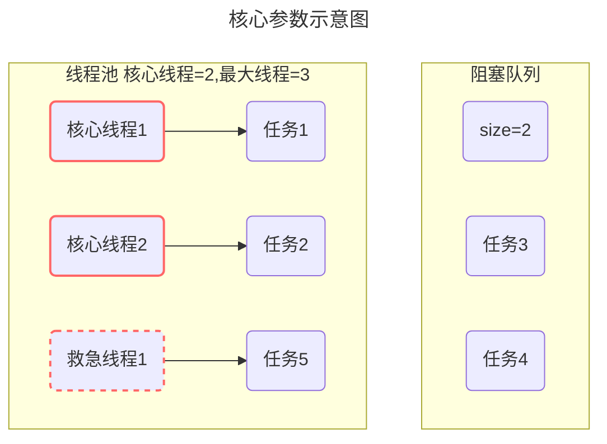
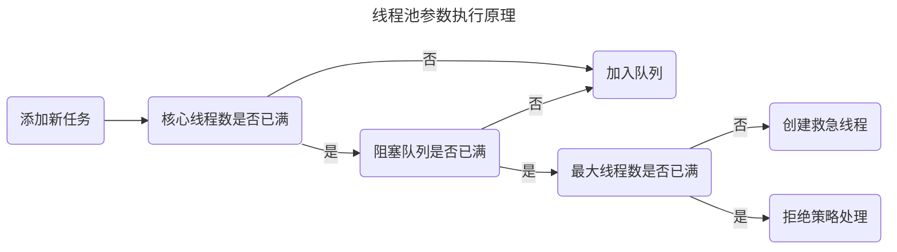
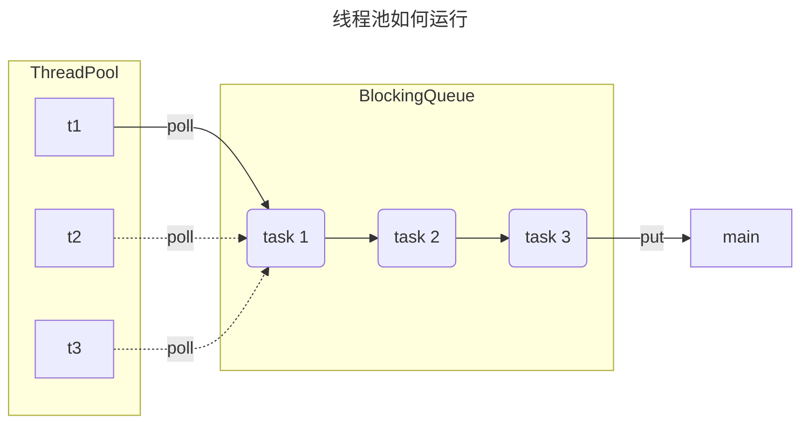

# 并发编程篇
[返回首页](index.md)

[[toc]]

[并发编程入门到精通](../../base/juc/index.md)

## 基础知识

### 线程和进程的区别？

**进程**

- 程序由指令和数据组成，但这些指令要运行，数据要读写，就必须将指令加载至 CPU，数据加载至内存。在指令运行过程中还需要用到磁盘、网络等设备。进程就是用来加载指令、管理内存、管理 IO 的 。
- 当一个程序被运行，从磁盘加载这个程序的代码至内存，这时就开启了一个进程。
- 进程就可以视为程序的一个实例。大部分程序可以同时运行多个实例进程（例如记事本、画图、浏览器 等），也有的程序只能启动一个实例进程（例如网易云音乐、360 安全卫士等）


<br/>

**线程**

- 一个进程之内可以分为一到多个线程。
- 一个线程就是一个指令流，将指令流中的一条条指令以一定的顺序交给 CPU 执行
- Java 中，线程作为最小调度单位，进程作为资源分配的最小单位。 在 windows 中进程是不活动的，只是作 为线程的容器


<br/>

**二者对比**

- 进程是正在运行程序的实例，进程中包含了线程，每个线程执行不同的任务
- 不同的进程使用不同的内存空间，在当前进程下的所有线程可以共享内存空间
- 线程更轻量，线程上下文切换成本一般上要比进程上下文切换低

<br/>

:::warning 💡思考：线程和进程的区别

- 进程是正在运行程序的实例，进程中包含了线程，每个线程执行不同的任务。
- 不同的进程使用不同的内存空间，当前进程下的所有线程可以共享内存空间。
- 线程更轻量，线程上下文切换成本比进程上下文切换要低。

:::

<br/>

### 并行和并发的区别？

单核CPU

- 单核CPU下线程实际还是串行执行的

- 操作系统中有一个组件叫做任务调度器，将cpu的时间片（windows下时间片最小约为 15 毫秒）分给不同的程序使用，只是由于cpu在线程间（时间片很短）的切换非常快，人类感觉是同时运行的 。

- 总结为一句话就是： 微观串行，宏观并行

一般会将这种线程轮流使用CPU的做法称为并发（concurrent）


<br/>

**多核CPU**

每个核（core）都可以调度运行线程，这时候线程可以是并行的。


<br/>

**并发（concurrent）是同一时间应对（dealing with）多件事情的能力**

**并行（parallel）是同一时间动手做（doing）多件事情的能力**

举例：

- 家庭主妇做饭、打扫卫生、给孩子喂奶，她一个人轮流交替做这多件事，这时就是并发

- 家庭主妇雇了个保姆，她们一起这些事，这时既有并发，也有并行（这时会产生竞争，例如锅只有一口，一个人用锅时，另一个人就得等待）

- 雇了3个保姆，一个专做饭、一个专打扫卫生、一个专喂奶，互不干扰，这时是并行

<br/>

::: warning 💡思考：并行与并发的区别

- 并发是同一时间应对多件事情的能力，一个CPU轮流执行多个线程，在微观上是串行，在宏观上是并行。
- 并行是同一时间处理多件事情的能力，多个CPU同时处理多个线程。

举个例子：食堂一个阿姨给两个队伍同时打饭，就是并发。食堂两个阿姨给两个队伍打饭就是并行

:::

<br/>

### 创建线程有哪些方式？

共有四种方式可以创建线程，分别是：继承Thread类、实现runnable接口、实现Callable接口、线程池创建线程

详细创建方式参考下面代码：

<br/>

 **继承Thread类**

```java
public class MyThread extends Thread {

    @Override
    public void run() {
        System.out.println("MyThread...run...");
    }

    
    public static void main(String[] args) {

        // 创建MyThread对象
        MyThread t1 = new MyThread() ;
        MyThread t2 = new MyThread() ;

        // 调用start方法启动线程
        t1.start();
        t2.start();

    }
    
}
```

<br/>

 **实现runnable接口**

```java
public class MyRunnable implements Runnable{

    @Override
    public void run() {
        System.out.println("MyRunnable...run...");
    }

    public static void main(String[] args) {

        // 创建MyRunnable对象
        MyRunnable mr = new MyRunnable() ;

        // 创建Thread对象
        Thread t1 = new Thread(mr) ;
        Thread t2 = new Thread(mr) ;

        // 调用start方法启动线程
        t1.start();
        t2.start();

    }

}
```

<br/>

**实现Callable接口**

```java
public class MyCallable implements Callable<String> {

    @Override
    public String call() throws Exception {
        System.out.println("MyCallable...call...");
        return "OK";
    }

    public static void main(String[] args) throws ExecutionException, InterruptedException {

        // 创建MyCallable对象
        MyCallable mc = new MyCallable() ;

        // 创建F
        FutureTask<String> ft = new FutureTask<String>(mc) ;

        // 创建Thread对象
        Thread t1 = new Thread(ft) ;
        Thread t2 = new Thread(ft) ;

        // 调用start方法启动线程
        t1.start();

        // 调用ft的get方法获取执行结果
        String result = ft.get();

        // 输出
        System.out.println(result);

    }

}
```

<br/>

**线程池创建线程**

```java
public class MyExecutors implements Runnable{

    @Override
    public void run() {
        System.out.println("MyRunnable...run...");
    }

    public static void main(String[] args) {
        // 创建线程池对象
        ExecutorService threadPool = Executors.newFixedThreadPool(3);
        threadPool.submit(new MyExecutors()) ;

        // 关闭线程池
        threadPool.shutdown();
    }
}
```

<br/>

::: warning 💡思考：创建的线程有哪些方式？

- 继承Thread类并重写run方法，调用start方法启动线程。
- 重写Runnale的run方法，创建Thread类放入到Runnable类中，调用start方法启动线程。
- 重写Callable的call方法，将Callable类放入到创建的FutureTask类中，再将FutureTask类放入到创建的Thread类中，调用调用start方法启动线程。可以通过调用FutureTask的get方法来获取执行结果。
- 通过线程池创建对象，调用submit方法来开启线程，通过shutdown来关闭线程池。

<br/>

💡**思考：Runnable 和 Callable 有什么区别？**

- Runnable 接口run方法没有返回值；Callable接口call方法有返回值，是个泛型，和Future、FutureTask配合可以用来获取异步执行的结果
- Callalbe接口支持返回执行结果，需要调用FutureTask.get()得到，此方法会阻塞主进程的继续往下执行，如果不调用不会阻塞。
- Callable接口的call()方法允许抛出异常；而Runnable接口的run方法的异常只能在内部消化，不能继续上抛

<br/>

💡**思考：线程的 run()和 start()有什么区别？**

- start方法用来启动线程，通过该线程调用run方法，执行run方法中的代码，并且start方法只能调用一次。
- run方法封装了要被线程执行的代码，可以被调用多次。
- start方法将线程的new状态切换为了RUNNABLE状态，run方法执行完就从RUNNABLE状态切换成TERMINATED。

:::

<br/>

### 线程之间的状态是如何切换的？

线程的状态可以参考JDK中的Thread类中的枚举State

```java
public enum State {
    /**
     * 尚未启动的线程的线程状态
     */
    NEW,

    /**
     * 可运行线程的线程状态。处于可运行状态的线程正在 Java 虚拟机中执行，但它可能正在等待来自操作系统的其他资源，例如处理器。
     */
    RUNNABLE,

    /**
     * 线程阻塞等待监视器锁的线程状态。处于阻塞状态的线程正在等待监视器锁进入同步块/方法或在调用Object.wait后重新进入同步块/方法。
     */
    BLOCKED,

    /**
     * 等待线程的线程状态。由于调用以下方法之一，线程处于等待状态：
     * Object.wait没有超时
     * 没有超时的Thread.join
     * LockSupport.park
     * 处于等待状态的线程正在等待另一个线程执行特定操作。
     * 例如，一个对对象调用Object.wait()的线程正在等待另一个线程对该对象调用Object.notify()或Object.notifyAll() 。已调用Thread.join()的线程正在等待指定线程终止。
     */
    WAITING,

    /**
     * 具有指定等待时间的等待线程的线程状态。由于以指定的正等待时间调用以下方法之一，线程处于定时等待状态：
     * Thread.sleep
     * Object.wait超时
     * Thread.join超时
     * LockSupport.parkNanos
     * LockSupport.parkUntil
     * </ul>
     */
    TIMED_WAITING,

    /**
     * 已终止线程的线程状态。线程已完成执行
     */
    TERMINATED
}
```

状态之间是如何变化的


分别是

* 新建
  * 当一个线程对象被创建，但还未调用 start 方法时处于**新建**状态
  * 此时未与操作系统底层线程关联
* 可运行
  * 调用了 start 方法，就会由**新建**进入**可运行**
  * 此时与底层线程关联，由操作系统调度执行
* 终结
  * 线程内代码已经执行完毕，由**可运行**进入**终结**
  * 此时会取消与底层线程关联
* 阻塞
  * 当获取锁失败后，由**可运行**进入 Monitor 的阻塞队列**阻塞**，此时不占用 cpu 时间
  * 当持锁线程释放锁时，会按照一定规则唤醒阻塞队列中的**阻塞**线程，唤醒后的线程进入**可运行**状态
* 等待
  * 当获取锁成功后，但由于条件不满足，调用了 wait() 方法，此时从**可运行**状态释放锁进入 Monitor 等待集合**等待**，同样不占用 cpu 时间
  * 当其它持锁线程调用 notify() 或 notifyAll() 方法，会按照一定规则唤醒等待集合中的**等待**线程，恢复为**可运行**状态
* 有时限等待
  * 当获取锁成功后，但由于条件不满足，调用了 wait(long) 方法，此时从**可运行**状态释放锁进入 Monitor 等待集合进行**有时限等待**，同样不占用 cpu 时间
  * 当其它持锁线程调用 notify() 或 notifyAll() 方法，会按照一定规则唤醒等待集合中的**有时限等待**线程，恢复为**可运行**状态，并重新去竞争锁
  * 如果等待超时，也会从**有时限等待**状态恢复为**可运行**状态，并重新去竞争锁
  * 还有一种情况是调用 sleep(long) 方法也会从**可运行**状态进入**有时限等待**状态，但与 Monitor 无关，不需要主动唤醒，超时时间到自然恢复为**可运行**状态

<br/>

::: warning 💡思考：线程包括哪些状态，状态之间是如何变化的？

在JDK中的Thread类中有枚举State里面定义了六种状态，分别为新建，可运行，终结，阻塞，等待，有限等待。

- 当一个线程对象被创建，还没有调用 start 方法时处于新建状态，调用了 start 方法则从新建状态进入了可运行状态，如果线程内的代码执行完了，则会由可运行状态进入终结状态。这是一个线程正常的状态。
- 如果线程获取锁失败，则会从可运行状态进入 Monitor 的阻塞队列阻塞，只有当持有锁的线程释放了，就会按照一定的规则唤醒阻塞队列中的线程，唤醒后的线程则进入可运行状态。
- 如果线程获取锁成功，但是由于条件不满足，调用了 wait 方法，从可运行状态释放锁进入了等待状态，当持有线程的锁调用了 notify 方法或 notifyAll 方法后会进入去重新竞争锁。如果是调用了带参的 wait 方法，则会在等待时间结束以后通过唤醒去重新竞争锁。
- 还有另一种情况是调用 sleep 的带参方法也会从可运行状态进入有限等待状态，不需要主动唤醒，超时时间到了自然恢复到可运行状态。

:::

<br/>

### wait ()和 sleep() 有什么区别？ 

参考回答：

共同点

* wait() ，wait(long) 和 sleep(long) 的效果都是让当前线程暂时放弃 CPU 的使用权，进入阻塞状态

不同点

* 方法归属不同
  * sleep(long) 是 Thread 的静态方法
  * 而 wait()，wait(long) 都是 Object 的 成员方法，每个对象都有

* 醒来时机不同
  * 执行 sleep(long) 和 wait(long) 的线程都会在等待相应毫秒后醒来
  * wait(long) 和 wait() 还可以被 notify 唤醒，wait() 如果不唤醒就一直等下去
  * 它们都可以被打断唤醒

* 锁特性不同（重点）
  * wait 方法的调用必须先获取 wait 对象的锁，而 sleep 则无此限制
  * wait 方法执行后会释放对象锁，允许其它线程获得该对象锁（我放弃 cpu，但你们还可以用）
  * 而 sleep 如果在 synchronized 代码块中执行，并不会释放对象锁（我放弃 cpu，你们也用不了）

代码示例：

```java
package org.itcast.thread;

import lombok.extern.slf4j.Slf4j;

@Slf4j(topic = "c.TestWaitAndSleep")
public class TestWaitAndSleep {
    static final Object LOCK = new Object();

    public static void main(String[] args) throws InterruptedException {
        waiting();
        sleeping();
    }

    private static void waiting() throws InterruptedException {
        Thread t1 = new Thread(() -> {
            synchronized (LOCK) {
                try {
                    log.debug("waiting...");
                    LOCK.wait(5000L);
                } catch (InterruptedException e) {
                    log.debug("interrupted...");
                    e.printStackTrace();
                }
            }
        }, "t1");
        t1.start();

        Thread.sleep(1000);
        synchronized (LOCK) {
            log.debug("other...");
        }

    }

    private static void sleeping() throws InterruptedException {
        Thread t1 = new Thread(() -> {
            synchronized (LOCK) {
                try {
                    log.debug("sleeping...");
                    Thread.sleep(5000L);
                } catch (InterruptedException e) {
                    log.debug("interrupted...");
                    e.printStackTrace();
                }
            }
        }, "t1");
        t1.start();

        Thread.sleep(100);
        synchronized (LOCK) {
            log.debug("other...");
        }
    }
}

```

输出

```sh {2,4}
22:28:45 [t1] c.TestWaitAndSleep - waiting...
22:28:46 [main] c.TestWaitAndSleep - other...
22:28:46 [t1] c.TestWaitAndSleep - sleeping...
22:28:51 [main] c.TestWaitAndSleep - other...
```

<br/>

::: warning 💡 思考：`sleep(long n)` 和 `wait(long n)` 的相同与区别

相同点

- `sleep(long n)` 和 `wait(long n)` 的效果都是让当前线程放弃CPU的使用权，进入等待状态。
- `sleep(long n)` 和 `wait(long n)` 都可以清除打断状态

不同点

- 方法归属不同：`sleep(long n)` 属于静态方法， `wait(long n)` 属于Object成员方法
- 醒来时机不同：`sleep(long n)` 和 `wait(long n)` 虽然都会等待相应毫秒后醒来，但是`wait(long n)`  和 `wait()`  都可以通过 `notify()` 唤醒，并且`wait()` 不唤醒就会一直等待下去
- 锁特性不同： 
  - `wait()` 方法的调用必须获取 `wait()`对象的锁，而`sleep()`没有此限制
  - `wait()` 方法执行后会释放对象锁，允许其它线程获取该对象锁。（我放弃CPU，你们还可以用）
  - `sleep(long n)` 如果在 synchronized 代码块中执行，并不会释放对象锁。（我放弃CPU，但是你们也不能用）

:::

<br/>

### 如何停止一个正在运行的线程？

参考回答：

有三种方式可以停止线程

- 使用退出标志，使线程正常退出，也就是当run方法完成后线程终止
- 使用stop方法强行终止（不推荐，方法已作废）
- 使用interrupt方法中断线程

<br/>

代码参考如下：

**使用退出标志，使线程正常退出**。

```java
public class MyInterrupt1 extends Thread {

    volatile boolean flag = false ;     // 线程执行的退出标记

    @Override
    public void run() {
        while(!flag) {
            System.out.println("MyThread...run...");
            try {
                Thread.sleep(3000);
            } catch (InterruptedException e) {
                e.printStackTrace();
            }
        }
    }

    public static void main(String[] args) throws InterruptedException {

        // 创建MyThread对象
        MyInterrupt1 t1 = new MyInterrupt1() ;
        t1.start();

        // 主线程休眠6秒
        Thread.sleep(6000);

        // 更改标记为true
        t1.flag = true ;

    }
}
```

<br/> 

**使用stop方法强行终止**

```java
public class MyInterrupt2 extends Thread {

    volatile boolean flag = false ;     // 线程执行的退出标记

    @Override
    public void run() {
        while(!flag) {
            System.out.println("MyThread...run...");
            try {
                Thread.sleep(3000);
            } catch (InterruptedException e) {
                e.printStackTrace();
            }
        }
    }

    public static void main(String[] args) throws InterruptedException {

        // 创建MyThread对象
        MyInterrupt2 t1 = new MyInterrupt2() ;
        t1.start();

        // 主线程休眠2秒
        Thread.sleep(6000);

        // 调用stop方法
        t1.stop();

    }
}
```

<br/>

**使用interrupt方法中断线程**。

```java
package com.itheima.basic;

public class MyInterrupt3 {

    public static void main(String[] args) throws InterruptedException {

        //1.打断阻塞的线程
        /*Thread t1 = new Thread(()->{
            System.out.println("t1 正在运行...");
            try {
                Thread.sleep(5000);
            } catch (InterruptedException e) {
                e.printStackTrace();
            }
        }, "t1");
        t1.start();
        Thread.sleep(500);
        t1.interrupt();
        System.out.println(t1.isInterrupted());*/


        //2.打断正常的线程
        Thread t2 = new Thread(()->{
            while(true) {
                Thread current = Thread.currentThread();
                boolean interrupted = current.isInterrupted();
                if(interrupted) {
                    System.out.println("打断状态："+interrupted);
                    break;
                }
            }
        }, "t2");
        t2.start();
        Thread.sleep(500);
//        t2.interrupt();

    }
}
```

<br/>

::: warning 💡 思考：如何终止一个正在运行的线程

- 使用线程的interrupt方法中断线程，内部其实也是使用中断标记来中断线程。
- 使用退出标志和volatile，使线程正常退出，就是当run方法完成后线程终止。
- 使用线程的stop方法强行终止，但是这个方法在JDK中已经作废，不推荐使用。

:::

<br/>

### 如何保证线程按照顺序执行？

在多线程中有多种方法让线程按特定顺序执行，你可以用线程类的**join**()方法在一个线程中启动另一个线程，另外一个线程完成该线程继续执行。

代码举例：

为了确保三个线程的顺序你应该先启动最后一个(T3调用T2，T2调用T1)，这样T1就会先完成而T3最后完成

```java
public class JoinTest {

    public static void main(String[] args) {

        // 创建线程对象
        Thread t1 = new Thread(() -> {
            System.out.println("t1");
        }) ;

        Thread t2 = new Thread(() -> {
            try {
                t1.join();                          // 加入线程t1,只有t1线程执行完毕以后，再次执行该线程
            } catch (InterruptedException e) {
                e.printStackTrace();
            }
            System.out.println("t2");
        }) ;


        Thread t3 = new Thread(() -> {
            try {
                t2.join();                              // 加入线程t2,只有t2线程执行完毕以后，再次执行该线程
            } catch (InterruptedException e) {
                e.printStackTrace();
            }
            System.out.println("t3");
        }) ;

        // 启动线程
        t1.start();
        t2.start();
        t3.start();

    }

}
```

<br/>

::: warning 💡 思考：新建 T1、T2、T3 三个线程，如何保证它们按顺序执行？

使用join方法，T3调用T2，T2调用T1，这样就能确保T1就会先完成而T3最后完成

:::


## 线程安全

### 你谈谈 JMM（Java 内存模型） 

JMM(Java Memory Model)Java内存模型,是java虚拟机规范中所定义的一种内存模型。

Java内存模型(Java Memory Model)描述了Java程序中各种变量(线程共享变量)的访问规则，以及在JVM中将变量存储到内存和从内存中读取变量这样的底层细节。


<br/>

特点：

1. 所有的共享变量都存储于主内存(计算机的RAM)这里所说的变量指的是实例变量和类变量。不包含局部变量，因为局部变量是线程私有的，因此不存在竞争问题。
2. 每一个线程还存在自己的工作内存，线程的工作内存，保留了被线程使用的变量的工作副本。
3. 线程对变量的所有的操作(读，写)都必须在工作内存中完成，而不能直接读写主内存中的变量，不同线程之间也不能直接访问对方工作内存中的变量，线程间变量的值的传递需要通过主内存完成。

<br/>

::: warning 💡思考：什么是Java内存模型，如何理解?

- `JMM(Java Memory Model)` Java内存模型，定义了共享内存中多线程程序读写操作的行为规范，通过这些规则来规范对内存的读写操作从而保证指令的正确性
- `JMM` 把内存分为两块，一块是私有线程的工作区域（工作内存），一块是所有线程的共享区域（主内存）
- 线程跟线程之间是相互隔离，线程跟线程交互需要通过主内存

:::

<br/>

### 请谈谈你对 volatile 的理解

一旦一个共享变量（类的成员变量、类的静态成员变量）被volatile修饰之后，那么就具备了两层语义：

<br/>

**保证线程间的可见性**

保证了不同线程对这个变量进行操作时的可见性，即一个线程修改了某个变量的值，这新值对其他线程来说是立即可见的,volatile关键字会强制将修改的值立即写入主存。

一个典型的例子：永不停止的循环

```java
package com.itheima.basic;


// 可见性例子
// -Xint
public class ForeverLoop {
    static boolean stop = false;

    public static void main(String[] args) {
        new Thread(() -> {
            try {
                Thread.sleep(100);
            } catch (InterruptedException e) {
                e.printStackTrace();
            }
            stop = true;
            System.out.println("modify stop to true...");
        }).start();
        foo();
    }

    static void foo() {
        int i = 0;
        while (!stop) {
            i++;
        }
        System.out.println("stopped... c:"+ i);
    }
}
```

当执行上述代码的时候，发现foo()方法中的循环是结束不了的，也就说读取不到共享变量的值结束循环。

主要是因为在JVM虚拟机中有一个JIT（即时编辑器）给代码做了优化。

<br/>

上述代码

```java
while (!stop) {
	i++;
}
```

在很短的时间内，这个代码执行的次数太多了，当达到了一个阈值，JIT就会优化此代码，如下：

```java
while (true) {
	i++;
}
```

当把代码优化成这样子以后，及时`stop`变量改变为了`false`也依然停止不了循环

<br/>

解决方案：

第一：在程序运行的时候加入vm参数`-Xint`表示禁用即时编辑器，不推荐，得不偿失（其他程序还要使用）

第二：在修饰`stop`变量的时候加上`volatile`,表示当前代码禁用了即时编辑器，问题就可以解决，代码如下：

```java
static volatile boolean stop = false;
```

<br/>

**禁止进行指令重排序**

用 volatile 修饰共享变量会在读、写共享变量时加入不同的屏障，阻止其他读写操作越过屏障，从而达到阻止重排序的效果

```java
@JCStressTest
@Outcome(id = {"0, 0", "1, 1", "0, 1"}, expect = Expect.ACCEPTABLE, desc = "ACCEPTABLE")
@Outcome(id = "1, 0", expect = Expect.ACCEPTABLE_INTERESTING, desc = "INTERESTING")
@State
public class ReorderTest {

    int x;
    int y;

    @Actor
    public void actor1() {
        x = 1;
        y = 1;
    }

    @Actor
    public void actor2(II_Result r) {
        r.r1 = y;
        r.r2 = x;
    }
}
```

在去获取上面的结果的时候，有可能会出现4种情况

- 情况一：先执行actor2获取结果 --->0,0 (正常)
- 情况二：先执行actor1中的第一行代码，然后执行actor2获取结果 --->0,1 (正常)
- 情况三：先执行actor1中所有代码，然后执行actor2获取结果 --->1,1 (正常)
- 情况四：先执行actor1中第二行代码，然后执行actor2获取结果 ---> <mark>1,0(发生了指令重排序，影响结果)</mark>

<br/>

**解决方案**

在变量上添加volatile，禁止指令重排序，则可以解决问题

```java {8}
@JCStressTest
@Outcome(id = {"0, 0", "1, 1", "0, 1"}, expect = Expect.ACCEPTABLE, desc = "ACCEPTABLE")
@Outcome(id = "1, 0", expect = Expect.ACCEPTABLE_INTERESTING, desc = "INTERESTING")
@State
public class ReorderTest {

    int x;
    volatile int y;

    @Actor
    public void actor1() {
        x = 1;
        y = 1;
    }

    @Actor
    public void actor2(II_Result r) {
        r.r1 = y;
        r.r2 = x;
    }
}
```

屏障添加的示意图


- 写操作加的屏障是阻止上方其它写操作越过屏障排到volatile变量写之下
- 读操作加的屏障是阻止下方其它读操作越过屏障排到volatile变量读之上

<br/>

**其他补充**

我们上面的解决方案是把volatile加在了int y这个变量上，我们能不能把它加在int x这个变量上呢？

下面代码使用volatile修饰了x变量

```java {7}
@JCStressTest
@Outcome(id = {"0, 0", "1, 1", "0, 1"}, expect = Expect.ACCEPTABLE, desc = "ACCEPTABLE")
@Outcome(id = "1, 0", expect = Expect.ACCEPTABLE_INTERESTING, desc = "INTERESTING")
@State
public class ReorderTest {

    volatile int x;
    int y;

    @Actor
    public void actor1() {
        x = 1;
        y = 1;
    }

    @Actor
    public void actor2(II_Result r) {
        r.r1 = y;
        r.r2 = x;
    }
}
```

屏障添加的示意图


这样显然是不行的，主要是因为下面两个原则：

- 写操作加的屏障是阻止上方其它写操作越过屏障排到volatile变量写之下
- 读操作加的屏障是阻止下方其它读操作越过屏障排到volatile变量读之上

所以，现在我们就可以总结一个volatile使用的小妙招：

- 写变量让volatile修饰的变量的在代码最后位置
- 读变量让volatile修饰的变量的在代码最开始位置

<br/>

::: warning 💡思考：谈谈你对volatile的理解

volatile是一个关键字，可以修饰类的成员变量、类的静态成员变量，主要有两个功能。

- 保证了线程间的可见性：用 volatile 修饰共享变量，能够防止编译器等优化发生，让一个线程对共享变量的修改对另一个线程可见。
- 禁止进行指令重排序，用 volatile 修饰变量会在读、写共享变量时加入读写屏障，阻止其他读写操作越过屏障，从而达到阻止重排序的效果。

:::

<br/>

### 导致并发程序出现问题的根本原因是什么

::: tip 📌 提示： 实现线程安全的方法，有多种手段可以达到目的。 

- 阻塞式的解决方案：`synchronized`，`ReentrantLock` 
- 非阻塞式的解决方案：CAS + volatile，Atomic类
- 无同步方案：栈封闭，线程本地存储，可重入代码，无状态，不可变

:::

Java并发编程三大特性

- 原子性
- 可见性
- 有序性

<br/>

**原子性**

一个线程在CPU中操作不可暂停，也不可中断，要不执行完成，要不不执行

比如，如下代码能保证原子性吗？

```java
public class TicketDemo {

    static Object lock = new Object();
    int ticketNum = 10;


    public  void getTicket() {
        if (ticketNum <= 0) {
            return;
        }
        System.out.println(Thread.currentThread().getName() + "抢到一张票,剩余:" + ticketNum);
        // 非原子性操作
        ticketNum--;
        
    }

    public static void main(String[] args) {
        TicketDemo ticketDemo = new TicketDemo();
        for (int i = 0; i < 20; i++) {
            new Thread(() -> {
                ticketDemo.getTicket();
            }).start();
        }
    }


}
```

以上代码会出现超卖或者是一张票卖给同一个人，执行并不是原子性的

<br/>

**解决方案**

- synchronized：同步加锁
- JUC里面的lock：加锁

```java {7}
public class TicketDemo {

    static Object lock = new Object();
    int ticketNum = 10;


    public synchronized void getTicket() {
        if (ticketNum <= 0) {
            return;
        }
        System.out.println(Thread.currentThread().getName() + "抢到一张票,剩余:" + ticketNum);
        // 非原子性操作
        ticketNum--;
        
    }

    public static void main(String[] args) {
        TicketDemo ticketDemo = new TicketDemo();
        for (int i = 0; i < 20; i++) {
            new Thread(() -> {
                ticketDemo.getTicket();
            }).start();
        }
    }


}
```

<br/>

**可见性**

内存可见性：让一个线程对共享变量的修改对另一个线程可见

比如，以下代码不能保证内存可见性

```java
public class VolatileDemo {
    private static boolean flag = false;
    static Object lock = new Object();

    public static void main(String[] args) throws InterruptedException {

        new Thread(()->{
            synchronized (lock){
                try {
                    lock.wait();
                } catch (InterruptedException e) {
                    e.printStackTrace();
                }
                while(!flag){
                }
                System.out.println("第一个线程执行完毕...");
            }
        }).start();

        Thread.sleep(100);

        new Thread(()->{
            synchronized (lock){
                flag = true;//思考：第一个线程会不会跳槽while循环，输出System.out.println("第一个线程执行完毕...");
                System.out.println("第二线程执行完毕...");
            }

        }).start();

    }

}
```

解决方案：

- synchronized
- volatile（推荐）
- LOCK

<br/>

**有序性**

指令重排：处理器为了提高程序运行效率，可能会对输入代码进行优化，它不保证程序中各个语句的执行先后顺序同代码中的顺序一致，但是它会保证程序最终执行结果和代码顺序执行的结果是一致的

还是之前的例子，如下代码：

```java
public class ReorderTest {

    int x;
    int y;

    @Actor
    public void actor1() {
        x = 1;
        y = 1;
    }

    @Actor
    public void actor2(II_Result r) {
        r.r1 = y;
        r.r2 = x;
    }
}
```

解决方案：

- volatile

<br/>

:::warning 💡 **思考：导致并发问题的原因是什么，如何解决？**

导致并发编程的原因有三个，原子性，可见性，有序性。

- 线程切换带来的原子性问题
- 处理器缓存导致的可见性问题
- 编译优化带来的有序性问题

解决并发问题的方法有

- 可见性问题是编译器优化造成的，有序性问题是CPU指令重排导致的，都可以通过volatile关键字来解决
- 原子性问题是线程切换导致的，可以通过CAS解决
- 加锁可以简单粗暴的解决这三种问题

:::

<br/>

### synchronized的原理是什么？

如下抢票的代码，如果不加锁，就会出现超卖或者一张票卖给多个人

Synchronized【对象锁】采用互斥的方式让同一时刻至多只有一个线程能持有【对象锁】，其它线程再想获取这个【对象锁】时就会阻塞住。

```java
public class TicketDemo {

    static Object lock = new Object();
    int ticketNum = 10;


    public synchronized void getTicket() {
        synchronized (this) {
            if (ticketNum <= 0) {
                return;
            }
            System.out.println(Thread.currentThread().getName() + "抢到一张票,剩余:" + ticketNum);
            // 非原子性操作
            ticketNum--;
        }
    }

    public static void main(String[] args) {
        TicketDemo ticketDemo = new TicketDemo();
        for (int i = 0; i < 20; i++) {
            new Thread(() -> {
                ticketDemo.getTicket();
            }).start();
        }
    }


}
```

<br/>

**Monitor**

Monitor 被翻译为监视器，是由jvm提供，C++语言实现

在代码中想要体现monitor需要借助javap命令查看clsss的字节码，比如以下代码：

```java
public class SyncTest {

    static final Object lock = new Object();
    static int counter = 0;
    public static void main(String[] args) {
        synchronized (lock) {
            counter++;
        }
    }
}
```

找到这个类的class文件，在class文件目录下执行`javap -v SyncTest.class`，反编译效果如下：

```java {9,15,19}
  public static void main(java.lang.String[]);
    descriptor: ([Ljava/lang/String;)V
    flags: ACC_PUBLIC, ACC_STATIC
    Code:
      stack=2, locals=3, args_size=1
         0: getstatic     #2                  // Field lock:Ljava/lang/Object;
         3: dup
         4: astore_1
         5: monitorenter							
         6: getstatic     #3                  // Field counter:I
         9: iconst_1
        10: iadd
        11: putstatic     #3                  // Field counter:I
        14: aload_1
        15: monitorexit											
        16: goto          24
        19: astore_2
        20: aload_1
        21: monitorexit												
        22: aload_2
        23: athrow
        24: return
      Exception table:
         from    to  target type
             6    16    19   any
            19    22    19   any
      LineNumberTable:
        line 8: 0
        line 9: 6
        line 10: 14
        line 11: 24
```

- `monitorenter`：上锁开始的地方
- `monitorexit`：解锁的地方
- 其中被 `monitorenter` 和 `monitorexit `包围住的指令就是上锁的代码
- 有两个 `monitorexit` 的原因，第二个 `monitorexit` 是为了防止锁住的代码抛异常后不能及时释放锁

在使用了 `synchornized` 代码块时需要指定一个对象，所以 `synchornized` 也被称为对象锁

`monitor` 主要就是跟这个对象产生关联，如下图


`Monitor` 内部具体的存储结构：

- `Owner`：存储当前获取锁的线程的，只能有一个线程可以获取
- `EntryList`：关联没有抢到锁的线程，处于Blocked状态的线程
- `WaitSet`：关联调用了wait方法的线程，处于Waiting状态的线程

<br/>

具体的流程：

- 代码进入 `synchorized` 代码块，先让 `lock`（对象锁）关联的 `monitor`，然后判断 `Owne`r是否有线程持有
- 如果没有线程持有，则让当前线程持有，表示该线程获取锁成功
- 如果有线程持有，则让当前线程进入 `entryList` 进行阻塞，如果 `Owner` 持有的线程已经释放了锁，在`EntryList` 中的线程去竞争锁的持有权（非公平）
- 如果代码块中调用了`wait()`方法，则会进去 `WaitSet`中进行等待

<br/>

::: warning 💡思考：synchronized关键字的底层原理

- synchronized 是基于悲观锁设计的，并且依赖于 JVM 级别的 Monitor，性能相对比较低
- Monitor 对象存在于每个Java对象的对象头中，synchronized 锁就是通过这种方式获取的，所以 Java 任意对象都可以作为锁
- Monitor 内部维护了三个变量，WaitSet 保存了等待状态的线程，EntryList 保存处于阻塞状态的线程，Owner表示持有锁的线程
- 线程获取锁的标准就是 Monitor 中设置成功了 Owner，并且一个 Monitor 中只能有一个 Owner
- 在上锁的过程中如果有其他线程也来抢锁，则进入 EntryList 进行阻塞，当获得锁的线程执行完并释放了锁，就会唤醒 EntryList 中等待的线程来竞争锁，竞争的时候是非公平的。
- 在 WaitSet 中的线程在被唤醒或者等待时间结束则会进入 EntryList 进行重新竞争。

:::

<br/>

### synchronized的锁优化是什么？

Monitor实现的锁属于重量级锁，你了解过锁升级吗？

- Monitor实现的锁属于重量级锁，里面涉及到了用户态和内核态的切换、进程的上下文切换，成本较高，性能比较低。

- 在JDK 1.6引入了两种新型锁机制：偏向锁和轻量级锁，它们的引入是为了解决在没有多线程竞争或基本没有竞争的场景下因使用传统锁机制带来的性能开销问题。

<br/>

**对象的内存结构**

在HotSpot虚拟机中，对象在内存中存储的布局可分为3块区域：对象头（Header）、实例数据（Instance Data）和对齐填充


我们需要重点分析MarkWord对象头

<br/>

**MarkWord**


- `hashcode`：25位的对象标识Hash码
- `age`：对象分代年龄占4位
- `biased_lock`：偏向锁标识，占1位 ，0表示没有开始偏向锁，1表示开启了偏向锁
- `thread`：持有偏向锁的线程ID，占23位
- `epoch`：偏向时间戳，占2位
- `ptr_to_lock_record`：轻量级锁状态下，指向栈中锁记录的指针，占30位
- `ptr_to_heavyweight_monitor`：重量级锁状态下，指向对象监视器Monitor的指针，占30位

<br/>

我们可以通过lock的标识，来判断是哪一种锁的等级

- 后三位是001表示无锁
- 后三位是101表示偏向锁
- 后两位是00表示轻量级锁
- 后两位是10表示重量级锁

<br/>

**再说Monitor重量级锁**

每个 Java 对象都可以关联一个 Monitor 对象，如果使用 synchronized 给对象上锁（重量级）之后，**该对象头的Mark Word 中就被设置指向 Monitor 对象的指针**


简单说就是：每个对象的对象头都可以设置monoitor的指针，让对象与monitor产生关联

<br/>

**轻量级锁**

在很多的情况下，在Java程序运行时，同步块中的代码都是不存在竞争的，不同的线程交替的执行同步块中的代码。这种情况下，用重量级锁是没必要的。因此JVM引入了轻量级锁的概念。

```java
static final Object obj = new Object();

public static void method1() {
    synchronized (obj) {
        // 同步块 A
        method2();
    }
}

public static void method2() {
    synchronized (obj) {
        // 同步块 B
    }
}
```

<br/>

**加锁的流程**

1.在线程栈中创建一个Lock Record，将其obj字段指向锁对象。


2.通过CAS指令将Lock Record的地址存储在对象头的mark word中（数据进行交换），如果对象处于无锁状态则修改成功，代表该线程获得了轻量级锁。


3.如果是当前线程已经持有该锁了，代表这是一次锁重入。设置Lock Record第一部分为null，起到了一个重入计数器的作用。


4.如果CAS修改失败，说明发生了竞争，需要膨胀为重量级锁。

<br/>

**解锁过程**

1.遍历线程栈,找到所有obj字段等于当前锁对象的Lock Record。

2.如果Lock Record的Mark Word为null，代表这是一次重入，将obj设置为null后continue。


3.如果Lock Record 的 Mark Word不为null，则利用CAS指令将对象头的mark word恢复成为无锁状态。如果失败则膨胀为重量级锁。


<br/>

**偏向锁**

轻量级锁在没有竞争时（就自己这个线程），每次重入仍然需要执行 CAS 操作。

Java 6 中引入了偏向锁来做进一步优化：只有第一次使用 CAS 将线程 ID 设置到对象的 Mark Word 头，之后发现

这个线程 ID 是自己的就表示没有竞争，不用重新 CAS。以后只要不发生竞争，这个对象就归该线程所有

```java
static final Object obj = new Object();

public static void m1() {
    synchronized (obj) {
        // 同步块 A
        m2();
    }
}

public static void m2() {
    synchronized (obj) {
        // 同步块 B
        m3();
    }
}

public static void m3() {
    synchronized (obj) {

    }
}
```

<br/>

**加锁的流程**

1.在线程栈中创建一个Lock Record，将其obj字段指向锁对象。


2.通过CAS指令将Lock Record的**线程id**存储在对象头的mark word中，同时也设置偏向锁的标识为101，如果对象处于无锁状态则修改成功，代表该线程获得了偏向锁。


3.如果是当前线程已经持有该锁了，代表这是一次锁重入。设置Lock Record第一部分为null，起到了一个重入计数器的作用。与轻量级锁不同的时，这里不会再次进行cas操作，只是判断对象头中的线程id是否是自己，因为缺少了cas操作，性能相对轻量级锁更好一些


解锁流程参考轻量级锁

<br/>

::: warning 💡思考: synchronized 的锁升级的情况了解

Java中的synchronized有偏向锁、轻量级锁、重量级锁三种形式，分别对应了锁只被一个线程持有、不同线程交替持有锁、多线程竞争锁三种情况。

- 偏向锁：一段很长的时间内都只被一个线程使用锁，可以使用了偏向锁，在第一次获得锁时，会有一个CAS操作，之后该线程再获取锁，只需要判断mark word中是否是自己的线程id即可，而不是开销相对较大的CAS命令。
- 轻量级锁：线程加锁的时间是错开的（也就是没有竞争），可以使用轻量级锁来优化。轻量级修改了对象头的锁标志，相对重量级锁性能提升很多。每次修改都是CAS操作，保证原子性。
- 重量级锁：底层使用的Monitor实现，里面涉及到了用户态和内核态的切换、进程的上下文切换，成本较高，性能比较低。一旦锁发生了竞争，都会升级为重量级锁，性能都会受到很大影响，在高并发下，我们可以采用ReentrantLock来加锁。

:::

<br/>

### CAS 你知道吗？

CAS的全称是： Compare And Swap(比较再交换)，它体现的一种乐观锁的思想，在无锁情况下保证线程操作共享数据的原子性。

在 JUC（ java.util.concurrent ）包下实现的很多类都用到了CAS操作

- AbstractQueuedSynchronizer（AQS框架）

- AtomicXXX类

<br/>

例子：我们还是基于刚才学习过的JMM内存模型进行说明

- 线程1与线程2都从主内存中获取变量int a = 100,同时放到各个线程的工作内存中


>一个当前内存值V、旧的预期值A、即将更新的值B，当且仅当旧的预期值A和内存值V相同时，将内存值修改为B并返回true，否则什么都不做，并返回false。如果CAS操作失败，通过自旋的方式等待并再次尝试，直到成功

<br/>

线程1操作：V：int a = 100，A：int a = 100，B：修改后的值：int a = 101 (a++)

- 线程1拿A的值与主内存V的值进行比较，判断是否相等
- 如果相等，则把B的值101更新到主内存中


<br/>

线程2操作：V：int a = 100，A：int a = 100，B：修改后的值：int a = 99(a--)

- 线程2拿A的值与主内存V的值进行比较，判断是否相等(目前不相等，因为线程1已更新V的值99)
- 不相等，则线程2更新失败


<br/>

自旋锁操作

- 因为没有加锁，所以线程不会陷入阻塞，效率较高
- 如果竞争激烈，重试频繁发生，效率会受影响

```java
while (true) {
    int 旧值A = 共享变量V;
    int 结果B = 旧值 + 1;
    if (compareAndSwap(旧值A,结果B)) {
        // 成功，退出循环
    }
}
```

需要不断尝试获取共享内存V中最新的值，然后再在新的值的基础上进行更新操作，如果失败就继续尝试获取新的值，直到更新成功

<br/>

**CAS 底层实现**

CAS 底层依赖于一个 Unsafe 类来直接调用操作系统底层的 CAS 指令

```java
public final class Unsafe {
    public final native boolean compareAndSwapObject(Object var1, 
                                                     long var2,
                                                     Object var4, 
                                                     Object var5);

    public final native boolean compareAndSwapInt(Object var1, 
                                                  long var2, 
                                                  int var4, 
                                                  int var5);

    public final native boolean compareAndSwapLong(Object var1, 
                                                   long var2, 
                                                   long var4, 
                                                   long var6);
}
```

<br/>

都是 native 修饰的方法，由系统提供的接口执行，并非 Java 代码实现，一般的思路也都是自旋锁实现

```java
while (true) {
    int 旧值A = 共享变量V;
    int 结果B = 旧值 + 1;
    if (compareAndSwap(旧值A,结果B)) {
        // 成功，退出循环
    }
}
```

在 Java 中比较常见使用有很多，比如 ReentrantLock 和 Atomic 开头的线程安全类，都调用了 Unsafe 中的方法

<br/>

- ReentrantLock 中的一段 CAS 代码

  ```java
  protected final boolean compareAndSetState(int expect, int update) {
      // this 当前值
      // stateOffset 当前释放存在线程运行
    	// expect 期望的值
    	// update 更新后的值
      return unsafe.compareAndSwapInt(this, stateOffset, expect, update);
  }
  ```

<br/>

**乐观锁和悲观锁**

- CAS 是基于乐观锁的思想：最乐观的估计，不怕别的线程来修改共享变量，就算改了也没关系，我吃亏点再重试呗。

- synchronized 是基于悲观锁的思想：最悲观的估计，得防着其它线程来修改共享变量，我上了锁你们都别想改，我改完了解开锁，你们才有机会。

<br/>

::: warning 💡思考: CAS 你知道吗？

- CAS 全称 Compare And Swap 比较在交换；体现的是一种乐观锁思想，在无锁状态下保证线程操作数据的原子性。
- CAS 的底层是调用的 Unsafe 类中的方法，由操作系统提供实现。

<br/>

💡**思考：CAS 的具体流程是怎么样的**

我们举个例子，主内存存在一个共享变量为100，现在有两个线程，线程一将共享变量从主内存复制一份做`count++`操作，线程二将共享变量从主内存复制一份做 `count --` 操作。线程一复制的共享变量副本为100，`count ++` 以后变为了 101，这时我们将共享变量的副本与共享变量的值相等，则将共享变量的值修改为 101。这时线程二复制的共享变量也为100，`count--` 以后变为了 99，将共享变量副本与共享变量最新的值做对比，100 <> 101，修改失败。这时则会进入自旋操作。

<br/>

💡**思考：乐观锁和悲观锁的区别？**

- 乐观锁：CAS 基于乐观锁的思想，是最乐观的估计，不怕别人来修改共享变量，就算修改了也没关系，可以吃亏点在重试。
- 悲观锁：synchronized 是基于悲观锁的思想，是最悲观的估计，防着其它线程来修改共享变量，我上锁了你们都别想修改，我修改成功后解开锁，其他线程才有机会修改。

:::

<br/>

### 什么是AQS？

全称是 AbstractQueuedSynchronizer，是阻塞式锁和相关的同步器工具的框架，它是构建锁或者其他同步组件的基础框架

<br/>

**AQS与Synchronized的区别**

|         synchronized         |                   AQS                    |
| :--------------------------: | :--------------------------------------: |
|     关键字，c++ 语言实现     |              Java 语言实现               |
|      悲观锁，自动释放锁      |          悲观锁，手动开启和关闭          |
| 锁竞争激烈都是重量级，性能差 | 锁竞争激烈都是重量级，提供了多种解决方案 |

<br/>

AQS常见的实现类

- 阻塞式锁：`ReentrantLock ` 
- 信号量：`Semaphore`
- 倒计时锁 `CountDownLatch`

<br/>

**工作机制**

- 在AQS中维护了一个使用了 volatile 修饰的 state 性来表示资源的状态，0表示无锁，1表示有锁
- 提供了基于 FIFO 的等待队列，类似于 Monitor 的 EntryList
- 条件变量来实现等待、唤醒机制，支持多个条件变量，类似于 Monitor 的 WaitSet

<br/>

**工作流程**

- 线程0来了以后，去尝试修改state属性，如果发现state属性是0，就修改state状态为1，表示线程0抢锁成功
- 线程1和线程2也会先尝试修改state属性，发现state的值已经是1了，有其他线程持有锁，它们都会到FIFO队列中进行等待，
- FIFO是一个双向队列，head属性表示头结点，tail表示尾结点


<br/>

**如果多个线程共同去抢这个资源是如何保证原子性的呢？**

在去修改state状态的时候，使用的cas自旋锁来保证原子性，确保只能有一个线程修改成功，修改失败的线程将会进入FIFO队列中等待。

<br/>

**AQS是公平锁吗，还是非公平锁？**

- 新的线程与队列中的线程共同来抢资源，是非公平锁

- 新的线程到队列中等待，只让队列中的head线程获取锁，是公平锁

>比较典型的AQS实现类ReentrantLock，它默认就是非公平锁，新的线程与队列中的线程共同来抢资源


### ReentrantLock的实现原理

ReentrantLock翻译过来是可重入锁，相对于synchronized它具备以下特点：

- 可中断
- 可以设置超时时间
- 可以设置公平锁
- 支持多个条件变量
- 与synchronized一样，都支持重入

```java
ReentrantLock lock = new ReentrantLock();
try {
    // 获取锁
    lock.lock();
} finally {
    // 释放锁
    lock.unlock();
}
```

<br/>

**实现原理**

ReentrantLock主要利用CAS+AQS队列来实现。它支持公平锁和非公平锁，两者的实现类似

构造方法接受一个可选的公平参数（默认非公平锁），当设置为true时，表示公平锁，否则为非公平锁。公平锁的效率往往没有非公平锁的效率高，在许多线程访问的情况下，公平锁表现出较低的吞吐量。

<br/>

查看ReentrantLock源码中的构造方法：

```java
/**
* Creates an instance of {@code ReentrantLock}.
* This is equivalent to using {@code ReentrantLock(false)}.
*/
public ReentrantLock() {
	sync = new NonfairSync();
}

/**
* Creates an instance of {@code ReentrantLock} with the
* given fairness policy.
*
* @param fair {@code true} if this lock should use a fair ordering policy
*/
public ReentrantLock(boolean fair) {
	sync = fair ? new FairSync() : new NonfairSync();
}
```

提供了两个构造方法，不带参数的默认为非公平

如果使用带参数的构造函数，并且传的值为true，则是公平锁

<br/>

其中NonfairSync和FairSync这两个类父类都是Sync

```java
static final class FairSync extends Sync {

}

static final class NonfairSync extends Sync {
     
}
```

<br/>

而 Sync 的父类是AQS，所以可以得出 ReentrantLock 底层主要实现就是基于 AQS 来实现的

```java
abstract static class Sync extends AbstractQueuedSynchronizer {

}
```

<br/>

**工作流程**


- 线程来抢锁后使用 cas 的方式修改 state 状态，修改状态成功为1，则让 exclusiveOwnerThread 属性指向当前线程，获取锁成功
- 假如修改状态失败，则会进入双向队列中等待，head指 向双向队列头部，tail 指向双向队列尾部
- 当 exclusiveOwnerThread 为 null 的时候，则会唤醒在双向队列中等待的线程
- 公平锁则体现在按照先后顺序获取锁，非公平体现在不在排队的线程也可以抢锁

<br/>

::: warning 💡思考：介绍一下ReentrantLock的特征

- ReentranLock 是属于并发包下的类，属于 API 层面的锁，和 synchronized 一样都是悲观锁实现互斥
- ReentranLock 通过 lock 方法用来获取锁，unlock 方法释放锁
- ReentranLock 支持可重入，可中断，可超时，可以设置公平锁和多个条件变量
- 底层主要是通过 CAS 和 AQS 队列来实现

<br/>

💡**思考：ReentrantLock 的工作流程是怎么样的**

- ReentrantLock 是基于 AQS 来实现的，内部维护了一个 STATE 属性来表示资源的状态。

- 当线程来抢锁后使用 CAS 的方式修改 STATE 状态，修改状态成功为1，则让exclusiveOwnerThread 属性指向当前线程，获取锁成功。

- 假如修改状态失败，则会进入双向队列中等待，HEAD 指向双向队列头部，TAIL 指向双向队列尾部

- 当 exclusiveOwnerThread 为 null 的时候，则会唤醒在双向队列中等待的线程

- 公平锁则体现在按照先后顺序获取锁，非公平体现在不在排队的线程也可以抢锁

:::

<br/>

### synchronized 和 Lock 有什么区别 ? 

参考回答

* 语法层面
  * synchronized 是关键字，源码在 jvm 中，用 c++ 语言实现
  * Lock 是接口，源码由 jdk 提供，用 java 语言实现
  * 使用 synchronized 时，退出同步代码块锁会自动释放，而使用 Lock 时，需要手动调用 unlock 方法释放锁
* 功能层面
  * 二者均属于悲观锁、都具备基本的互斥、同步、锁重入功能
  * Lock 提供了许多 synchronized 不具备的功能，例如获取等待状态、公平锁、可打断、可超时、多条件变量
  * Lock 有适合不同场景的实现，如 ReentrantLock， ReentrantReadWriteLock。
* 性能层面
  * 在没有竞争时，synchronized 做了很多优化，如偏向锁、轻量级锁，性能不赖。
  * 在竞争激烈时，Lock 的实现通常会提供更好的性能。

```java
package org.itcast.thread;

import lombok.extern.slf4j.Slf4j;

import java.util.concurrent.TimeUnit;
import java.util.concurrent.locks.Condition;
import java.util.concurrent.locks.ReentrantLock;

@Slf4j(topic = "c.TestReentrantLock")
public class TestReentrantLock {
    private static final ReentrantLock lock = new ReentrantLock();
    private static final Condition c1 = lock.newCondition();
    private static final Condition c2 = lock.newCondition();

    public static void main(String[] args) throws InterruptedException {
        // 可打断
        lockInterrupt();

        // 可超时
        timeOutLock();

        // 多条件变量
        conditionTest();
    }

    /**
     * 可打断
     *
     * @throws InterruptedException
     */
    private static void lockInterrupt() throws InterruptedException {
        Thread t1 = new Thread(() -> {
            try {
                // 开启可打断的锁
                lock.lockInterruptibly();
            } catch (InterruptedException e) {
                e.printStackTrace();
                log.debug("等待的过程中被打断");
            } finally {
                lock.unlock();
            }

            try {
                log.debug("{}:获得了锁", Thread.currentThread().getName());
            } finally {
                lock.unlock();
            }

        }, "t1");

        lock.lock();
        log.debug("主线程获得了锁");
        t1.start();

        try {
            Thread.sleep(1000);
            t1.interrupt();
            t1.interrupt(); // [!code --]
            log.debug("执行打断");
        } finally {
            lock.unlock();
        }
    }


    /**
     * 可超时
     *
     * @throws InterruptedException
     */
    private static void timeOutLock() throws InterruptedException {
        Thread t1 = new Thread(() -> {
            //尝试获取锁，如果获取锁成功，返回true，否则返回false
            try {
                if (!lock.tryLock(2, TimeUnit.SECONDS)) {
                    log.debug("t1-获取锁失败");
                    return;
                }
            } catch (InterruptedException e) {
                e.printStackTrace();
            }
            try {
                log.debug("t1线程-获得了锁");
            } finally {
                lock.unlock();
            }
        }, "t1");

        lock.lock();
        log.debug("主线程获得了锁");
        t1.start();
        try {
            Thread.sleep(3000);
            Thread.sleep(1000);// [!code --]
        } finally {
            lock.unlock();
        }
    }

    /**
     * 多条件变量
     */
    private static void conditionTest() {
        new Thread(() -> {
            lock.lock();
            try {
                //进入c1条件的等待
                c1.await();
                log.debug(Thread.currentThread().getName() + ",acquire lock...");
                Thread.sleep(1000);
            } catch (InterruptedException e) {
                e.printStackTrace();
            } finally {
                lock.unlock();
            }
        }, "t1").start();

        new Thread(() -> {
            lock.lock();
            try {
                //进入c2条件的等待
                c1.await();
                log.debug(Thread.currentThread().getName() + ",acquire lock...");
                Thread.sleep(1000);
            } catch (InterruptedException e) {
                e.printStackTrace();
            } finally {
                lock.unlock();
            }
        }, "t2").start();

        new Thread(() -> {
            lock.lock();
            try {
                //唤醒c1条件的线程
                c1.signalAll();
                //唤醒c2条件的线程
                c2.signal(); // [!code --]
                log.debug(Thread.currentThread().getName() + ",acquire lock...");
                Thread.sleep(1000);
            } catch (InterruptedException e) {
                e.printStackTrace();
            } finally {
                lock.unlock();
            }
        }, "t3").start();
    }
}

```

<br/>

:::warning 💡思考： `synchoronized`  和  `Lock` 有什么区别

**语法层面：**

- `synchronized` 是关键字，源码在 JVM 中，用 C++ 语言实现
- `Lock` 是接口，源码由 JDK 提供，用 Java 语言实现
- 使用 `synchronized` 时，退出同步代码块锁会自动释放，Lock 需要手动调用 unlock 方法释放

**功能层面：**

- 二者都属于悲观锁，都具备基本的互斥，同步，锁重入功能。
- `Lock` 提供了许多 `synchronized` 不具备的功能，例如可打断，锁超时，公平锁，多条件变量。
- Lock 有适合不同场景的实现，比如可重入锁 `ReentrantLock`，读写锁 `ReentrantReadWriteLock`

**性能层面：**

- 在没有竞争时，synchronized 做了很多优化，如锁偏向，轻量级锁，性能不差
- 在竞争激烈时，Lock 的实现通常会提供更好的性能。

:::

<br/>

### 如何控制并发访问线程的数量？

Semaphore [ˈsɛməˌfɔr] 信号量，是JUC包下的一个工具类，我们可以通过其限制执行的线程数量，达到限流的效果

当一个线程执行时先通过其方法进行获取许可操作，获取到许可的线程继续执行业务逻辑，当线程执行完成后进行释放许可操作，未获取达到许可的线程进行等待或者直接结束。

<br/>

Semaphore两个重要的方法

- `isemaphore.acquire()`： 请求一个信号量，这时候的信号量个数`-1`（一旦没有可使用的信号量，也即信号量个数变为负数时，再次请求的时候就会阻塞，直到其他线程释放了信号量）
- `isemaphore.release()`：释放一个信号量，此时信号量个数`+1`

<br/>

线程任务类：

```java
public class SemaphoreCase {
    public static void main(String[] args) {
        // 1. 创建 semaphore 对象
        Semaphore semaphore = new Semaphore(3);
        // 2. 10个线程同时运行
        for (int i = 0; i < 10; i++) {
            new Thread(() -> {

                try {
                    // 3. 获取许可
                    semaphore.acquire();
                } catch (InterruptedException e) {
                    e.printStackTrace();
                }
                try {
                    System.out.println("running...");
                    try {
                        Thread.sleep(1000);
                    } catch (InterruptedException e) {
                        e.printStackTrace();
                    }
                    System.out.println("end...");
                } finally {
                    // 4. 释放许可
                    semaphore.release();
                }
            }).start();
        }
    }

}
```

:::warning 💡思考：如何控制某一个方法允许并发访问线程的数量？

在JDK的并发包下的AQS中提供了一个 `Semaphore` 提供了两个方法，

- `semaphore.acquire() `请求信号量，可以限制线程的个数，是一个正数，如果信号量是`-1`,就代表已经用完了信号量，其他线程需要阻塞了
- `semaphore.release()`，代表是释放一个信号量，此时信号量的个数`+1`

:::

<br/>

### 死锁产生的条件是什么？

**死锁**：一个线程需要同时获取多把锁，这时就容易发生死锁

例如：

- t1 线程获得A对象锁，接下来想获取B对象的锁
- t2 线程获得B对象锁，接下来想获取A对象的锁 

<br/>

代码如下：

```java
package com.itheima.basic;

import static java.lang.Thread.sleep;

public class Deadlock {

    public static void main(String[] args) {
        Object A = new Object();
        Object B = new Object();
        Thread t1 = new Thread(() -> {
            synchronized (A) {
                System.out.println("lock A");
                try {
                    sleep(1000);
                } catch (InterruptedException e) {
                    throw new RuntimeException(e);
                }
                synchronized (B) {
                    System.out.println("lock B");
                    System.out.println("操作...");
                }
            }
        }, "t1");

        Thread t2 = new Thread(() -> {
            synchronized (B) {
                System.out.println("lock B");
                try {
                    sleep(500);
                } catch (InterruptedException e) {
                    throw new RuntimeException(e);
                }
                synchronized (A) {
                    System.out.println("lock A");
                    System.out.println("操作...");
                }
            }
        }, "t2");
        t1.start();
        t2.start();
    }
}
```

控制台输出结果

```sh
13:55:38 [t1] c.Deadlock - lock A
13:55:38 [t2] c.Deadlock - lock B
```

此时程序并没有结束，这种现象就是死锁现象...线程t1持有A的锁等待获取B锁，线程t2持有B的锁等待获取A的锁。

<br/>

:::warning 💡思考：死锁产生的条件是什么？

一个线程需要同时获取多把锁，这时就容易发生死锁，举个例子来说：

- T1 线程获得 A 对象锁，接下来想获取 B 对象的锁

- T2 线程获得 B 对象锁，接下来想获取 A 对象的锁 


这个时候 T1 线程和 T2 线程都在互相等待对方的锁，就产生了死锁

:::

<br/>

### 如何进行死锁诊断？

当程序出现了死锁现象，我们可以使用 JDK 自带的工具：JPS 和 Jstack

步骤如下：

第一：查看运行的线程

```sh
[mousse@MacBookAir thread]$ jps
3286 Launcher
30326 
3287 Deadlock
64175 
3311 Jps
```

第二：使用jstack查看线程运行的情况，下图是截图的关键信息

运行命令：`jstack -l 46032`


<br/>

**其他解决工具，可视化工具**

- jconsole

用于对jvm的内存，线程，类 的监控，是一个基于 jmx 的 GUI 性能监控工具

打开方式：java 安装目录 bin目录下 直接启动 jconsole.exe 就行

- VisualVM：故障处理工具

能够监控线程，内存情况，查看方法的CPU时间和内存中的对 象，已被GC的对象，反向查看分配的堆栈

打开方式：java 安装目录 bin目录下 直接启动 jvisualvm.exe就行

<br/>

::: warning 💡思考：如何进行死锁诊断？

通过 Java 命令 JPS 来查看当前 Java 程序运行的进程 ID

然后通过 JSTACK 来查看这个进程id，就能展示出来死锁的问题，并且，可以定位代码的具体行号范围，我们再去找到对应的代码进行排查就行了。

:::

<br/>

### 谈谈你对ThreadLocal的理解

ThreadLocal 是多线程中对于解决线程安全的一个操作类，它会为每个线程都分配一个独立的线程副本从而解决了变量并发访问冲突的问题。ThreadLocal 同时实现了线程内的资源共享

案例：使用 JDBC 操作数据库时，会将每一个线程的 Connection 放入各自的 ThreadLocal 中，从而保证每个线程都在各自的 Connection 上进行数据库的操作，避免 A线程 关闭了 B线程 的连接。


**基本使用**

三个主要方法：

- set(value) 设置值
- get() 获取值
- remove() 清除值

```java
public class ThreadLocalTest {
    static ThreadLocal<String> threadLocal = new ThreadLocal<>();

    public static void main(String[] args) {
        new Thread(() -> {
            String name = Thread.currentThread().getName();
            threadLocal.set("itcast");
            print(name);
            System.out.println(name + "-after remove : " + threadLocal.get());
        }, "t1").start();
        new Thread(() -> {
            String name = Thread.currentThread().getName();
            threadLocal.set("itheima");
            print(name);
            System.out.println(name + "-after remove : " + threadLocal.get());
        }, "t2").start();
    }

    static void print(String str) {
        //打印当前线程中本地内存中本地变量的值
        System.out.println(str + " :" + threadLocal.get());
        //清除本地内存中的本地变量
        threadLocal.remove();
    }

}
```

<br/>

**源码解析**

ThreadLocal 本质来说就是一个线程内部存储类，从而让多个线程只操作自己内部的值，从而实现线程数据隔离


在 ThreadLocal 中有一个内部类叫做 ThreadLocalMap，类似于 HashMap

ThreadLocalMap 中有一个属性 table 数组，这个是真正存储数据的位置

<br/>

**set方法**


<Br/>

**get方法/remove方法**


<br/>

**内存泄露问题**

Java对象中的四种引用类型：强引用、软引用、弱引用、虚引用

- 强引用：最为普通的引用方式，表示一个对象处于有用且必须的状态，如果一个对象具有强引用，则GC并不会回收它。即便堆中内存不足了，宁可出现OOM，也不会对其进行回收

  ```java
  User user = new User();
  ```

- 弱引用：表示一个对象处于可能有用且非必须的状态。在GC线程扫描内存区域时，一旦发现弱引用，就会回收到弱引用相关联的对象。对于弱引用的回收，无关内存区域是否足够，一旦发现则会被回收

  ```java
  User user = new User();
  WeakReference weakReference = new WeakReference(user)
  ```

每一个Thread维护一个ThreadLocalMap，在ThreadLocalMap中的Entry对象继承了WeakReference。其中key为使用弱引用的ThreadLocal实例，value为线程变量的副本


在使用ThreadLocal的时候，强烈建议：**务必手动remove**

<br/>

::: warning 💡思考：谈谈你对 `ThreadLocal` 理解

`ThreadLocal` 主要有两个功能，第一是实现资源对象的线程隔离，让每个线程各用各的资源对象，避免争用引发的线程安全问题。第二是线程内的资源共享。

<br/>

💡**思考：那 `ThreadLocal` 的底层是如何实现的**

在 `ThreadLocal` 内部维护了一个一个 `ThreadLocalMap` 类型的成员变量，用来存储资源对象。

- 调用 set 方法就是以 `ThreadLocal` 自己作为 key ，资源对象作为 value，放入当前线程的 `ThreadLocalMap` 集合中。
- 调用 get 方法就是以 `ThreadLocal` 自己作为 key，在 `ThreadLocalMap` 中查找资源对象
- 调用 remove 方法就是以 `ThreadLocal` 自己作为 key，在 `ThreadLocalMap` 中移除资源对象

<br/>

💡**思考：为什么 `ThreadLocal` 会导致内存溢出**

因为 ThreadLocalMap 中的 key 被设置为弱引用，一旦被GC就会被回收，但是只有 key 会得到内存释放，value 是作为强引用不会被 GC 回收。所以我们在使用 ThreadLocal 的时候需要主动使用 remove 方法释放 key，这样就能避免内存溢出。

:::

<br/>

### ConcurrentHashMap 

ConcurrentHashMap 是一种线程安全的高效Map集合

底层数据结构：

- JDK1.7底层采用分段的数组+链表实现

- JDK1.8 采用的数据结构跟HashMap1.8的结构一样，数组+链表/红黑二叉树。

<br/>

**JDK1.7中concurrentHashMap**

数据结构


- 提供了一个segment数组，在初始化ConcurrentHashMap 的时候可以指定数组的长度，默认是16，一旦初始化之后中间不可扩容
- 在每个segment中都可以挂一个HashEntry数组，数组里面可以存储具体的元素，HashEntry数组是可以扩容的
- 在HashEntry存储的数组中存储的元素，如果发生冲突，则可以挂单向链表

<br/>

**存储流程**


- 先去计算key的hash值，然后确定segment数组下标
- 再通过hash值确定hashEntry数组中的下标存储数据
- 在进行操作数据的之前，会先判断当前segment对应下标位置是否有线程进行操作，为了线程安全使用的是ReentrantLock进行加锁，如果获取锁是被会使用cas自旋锁进行尝试

<br/>

**JDK1.8中concurrentHashMap**

在JDK1.8中，放弃了Segment臃肿的设计，数据结构跟HashMap的数据结构是一样的：数组+红黑树+链表

采用 CAS + Synchronized来保证并发安全进行实现

- CAS控制数组节点的添加

- synchronized只锁定当前链表或红黑二叉树的首节点，只要hash不冲突，就不会产生并发的问题 , 效率得到提升


<br/>

:::warning 💡思考：ConcurrentHashMap的原理吗？

ConcurrentHashMap 是一种线程安全的高效Map集合，jdk1.7和1.8也做了很多调整。

- JDK1.7 的底层采用是**分段的数组**+**链表** 实现
- JDK1.8 采用的数据结构跟 HashMap1.8 的结构一样，数组+链表/红黑二叉树。

在jdk1.7中 ConcurrentHashMap 里包含一个 Segment 数组。Segment 的结构和HashMap类似，是一种数组和链表结构，一个 Segment 包含一个 HashEntry 数组，每个 HashEntry 是一个链表结构的元素，每个 Segment 守护着一个HashEntry数组里的元素，当对 HashEntry 数组的数据进行修改时，必须首先获得对应的 Segment的锁。

Segment 是一种可重入的锁 ReentrantLock，每个 Segment 守护一个HashEntry 数组里得元 素，当对 HashEntry 数组的数据进行修改时，必须首先获得对应的 Segment 锁

在JDK1.8中的ConcurrentHashMap 做了较大的优化，性能提升了不少。首先是它的数据结构与jdk1.8的 hashMap 数据结构完全一致。其次是放弃了Segment臃肿的设计，取而代之的是采用 Node + CAS + Synchronized 来保证并发安全进行实现，synchronized只锁定当前链表或红黑二叉树的首节点，这样只要 hash 不冲突，就不会产生并发 , 效率得到提升。
:::


## 线程池

### 说一下线程池的核心参数

线程池核心参数主要参考ThreadPoolExecutor这个类的7个参数的构造函数

```java
public ThreadPoolExecutor(int corePoolSize,
                          int maximumPoolSize,
                          long keepAliveTime,
                          TimeUnit unit,
                          BlockingQueue<Runnable> workQueue,
                          ThreadFactory threadFactory,
                          RejectedExecutionHandler handler)
```

- `corePoolSize` 核心线程数目
- `maximumPoolSize` 最大线程数目 = (核心线程+救急线程的最大数目)
- `keepAliveTime` 生存时间 - 救急线程的生存时间，生存时间内没有新任务，此线程资源会释放
- `unit` 时间单位 - 救急线程的生存时间单位，如秒、毫秒等
- `workQueue` - 当没有空闲核心线程时，新来任务会加入到此队列排队，队列满会创建救急线程执行任务
- `threadFactory` 线程工厂 - 可以定制线程对象的创建，例如设置线程名字、是否是守护线程等
- `handler` 拒绝策略 - 当所有线程都在繁忙，workQueue 也放满时，会触发拒绝策略

<br/>



<br/>

**执行原理**



<br/>

- 任务在提交的时候，首先判断核心线程数是否已满，如果没有满则直接添加到工作线程执行
- 如果核心线程数满了，则判断阻塞队列是否已满，如果没有满，当前任务存入阻塞队列
- 如果阻塞队列也满了，则判断最大线程数是否已满，如果没有满，则使用临时线程执行任务
- 如果最大线程数也满了（核心线程+临时线程），则走拒绝策略

<br/>

**拒绝策略**

拒绝策略 jdk 提供了 4 种实现，其它著名框架也提供了实现


- `AbortPolicy` 让调用者抛出 `RejectedExecutionException` 异常，这是默认策略
- `CallerRunsPolicy`让调用者运行任务 
- `DiscardPolicy` 放弃本次任务 
- `DiscardOldestPolicy` 放弃队列中最早的任务，本任务取而代之 

<br/>

参考代码：




```java
package org.itcast.thread;

import lombok.extern.slf4j.Slf4j;

import java.lang.reflect.Field;
import java.util.ArrayList;
import java.util.List;
import java.util.concurrent.ArrayBlockingQueue;
import java.util.concurrent.FutureTask;
import java.util.concurrent.ThreadPoolExecutor;
import java.util.concurrent.TimeUnit;
import java.util.concurrent.atomic.AtomicInteger;

@Slf4j(topic = "c.TestThreadPoolExecutor")
public class TestThreadPoolExecutor {
    public static void main(String[] args) {
        AtomicInteger c = new AtomicInteger(1);
        ArrayBlockingQueue<Runnable> queue = new ArrayBlockingQueue<>(2);
        ThreadPoolExecutor threadPool = new ThreadPoolExecutor(
                2,
                3,
                0,
                TimeUnit.MINUTES,
                queue,
                r -> new Thread(r, "myThread" + c.getAndIncrement()),
                new ThreadPoolExecutor.AbortPolicy()
        );

        showState(queue, threadPool);
        threadPool.submit(new MyTask("1", 3600000));
        showState(queue, threadPool);
        threadPool.submit(new MyTask("2", 3600000));
        showState(queue, threadPool);
        threadPool.submit(new MyTask("3"));
        showState(queue, threadPool);
        threadPool.submit(new MyTask("4"));
        showState(queue, threadPool);
        threadPool.submit(new MyTask("5",3600000));
        showState(queue, threadPool);
        threadPool.submit(new MyTask("6"));
        showState(queue, threadPool);
    }

    /**
     * 展示线程状态
     *
     * @param queue      阻塞队列
     * @param threadPool 线程池
     */
    private static void showState(ArrayBlockingQueue<Runnable> queue, ThreadPoolExecutor threadPool) {
        try {
            Thread.sleep(300);
        } catch (InterruptedException e) {
            e.printStackTrace();
        }
        ArrayList<Object> tasks = new ArrayList<>();
        for (Runnable runnable : queue) {
            try {
                Field callable = FutureTask.class.getDeclaredField("callable");
                callable.setAccessible(true);
                Object adapter = callable.get(runnable);
                Class<?> clazz = Class.forName("java.util.concurrent.Executors$RunnableAdapter");
                Field task = clazz.getDeclaredField("task");
                task.setAccessible(true);
                Object o = task.get(adapter);
                tasks.add(o);
            } catch (Exception e) {
                e.printStackTrace();
            }
        }
        log.debug("pool size: {}, queue: {}", threadPool.getPoolSize(), tasks);
    }

    static class MyTask implements Runnable {
        private final String name;
        private final long duration;

        public MyTask(String name, long duration) {
            this.name = name;
            this.duration = duration;
        }

        public MyTask(String name) {
            this(name, 0);
        }

        @Override
        public void run() {
            try {
                log.debug("running:{}", this);
                Thread.sleep(duration);
            } catch (InterruptedException e) {
                throw new RuntimeException(e);
            }
        }

        @Override
        public String toString() {
            return "MyTask(" + name + ")";
        }
    }
}

```

控制台输出

```sh
23:42:52 [main] c.TestThreadPoolExecutor - pool size: 0, queue: []
23:42:52 [myThread1] c.TestThreadPoolExecutor - running:MyTask(1)
23:42:52 [main] c.TestThreadPoolExecutor - pool size: 1, queue: []
23:42:52 [myThread2] c.TestThreadPoolExecutor - running:MyTask(2)
23:42:53 [main] c.TestThreadPoolExecutor - pool size: 2, queue: []
23:42:53 [main] c.TestThreadPoolExecutor - pool size: 2, queue: [MyTask(3)]
23:42:53 [main] c.TestThreadPoolExecutor - pool size: 2, queue: [MyTask(3), MyTask(4)]
23:42:53 [myThread3] c.TestThreadPoolExecutor - running:MyTask(5)
23:42:53 [main] c.TestThreadPoolExecutor - pool size: 3, queue: [MyTask(3), MyTask(4)]
Exception in thread "main" java.util.concurrent.RejectedExecutionException: Task java.util.concurrent.FutureTask@11531931 rejected from java.util.concurrent.ThreadPoolExecutor@5e025e70[Running, pool size = 3, active threads = 3, queued tasks = 2, completed tasks = 0]
	at java.util.concurrent.ThreadPoolExecutor$AbortPolicy.rejectedExecution(ThreadPoolExecutor.java:2063)
	at java.util.concurrent.ThreadPoolExecutor.reject(ThreadPoolExecutor.java:830)
	at java.util.concurrent.ThreadPoolExecutor.execute(ThreadPoolExecutor.java:1379)
	at java.util.concurrent.AbstractExecutorService.submit(AbstractExecutorService.java:112)
	at org.itcast.thread.TestThreadPoolExecutor.main(TestThreadPoolExecutor.java:40)
```

<br/>

::: warning 💡思考：线程池的核心参数有哪些？

- 核心线程数目：线程池池中会保留的最多线程数
- 最大线程数目：核心线程 + 救急线程的最大数目
- 生存时间：救急线程的生存时间，生存时间内没有新任务，此线程资源会释放
- 时间单位：救急线程的生存时间单位，如秒、毫秒等
- 阻塞队列：当没有空闲核心线程时，新来任务会加入到此队列排队，队列满会创建救急线程执行任务
- 线程工厂：可以定制线程对象的创建，例如设置线程名字、是否是守护线程等
- 拒绝策略：当所有线程都在繁忙，阻塞队列也放满时，会触发拒绝策略
  - 在拒绝策略中又有4中拒绝策略：当线程数过多以后，第一种是抛异常、第二种是由调用者执行任务、第三是丢弃当前的任务，第四是丢弃最早排队任务。默认是直接抛异常。

💡**思考：线程池是如何提交任务的**

1. 任务在提交的时候，首先判断核心线程数是否已满，如果没有满则直接添加到工作线程执行
2. 如果核心线程数满了，则判断阻塞队列是否已满，如果没有满，当前任务存入阻塞队列
3. 如果阻塞队列也满了，则判断最大线程数是否已满，如果没有满，则使用救急线程执行任务
4. 如果最大线程数也满了（核心线程+临时线程），则走拒绝策略

:::

<br/>

### 线程池中有哪些常见的阻塞队列

- 线程池中`workQueue` 参数 - 当没有空闲核心线程时，新来任务会加入到此队列排队，队列满会创建救急线程执行任务

  比较常见的有4个，用的最多是 `ArrayBlockingQueue`和 `LinkedBlockingQueue`

  - `ArrayBlockingQueue`：基于数组结构的有界阻塞队列，FIFO。
  - `LinkedBlockingQueue`：基于链表结构的有界阻塞队列，FIFO。
  - `SynchronousQueue`：不存储元素的阻塞队列，每个插入操作都必须等待一个移出操作。
  - `DelayedWorkQueue` ：是一个优先级队列，它可以保证每次出队的任务都是当前队列中执行时间最靠前的

<br/>

**性能比较**

|       LinkedBlockingQueue        |  ArrayBlockingQueue  |
| :------------------------------: | :------------------: |
|        默认无界，支持有界        |       强制有界       |
|            底层是链表            |      底层是数组      |
| 是懒惰的，创建节点的时候添加数据 | 提前初始化 Node 数组 |
|        入队会生成新 Node         | Node 需要提前创建好  |
|        读写两把锁（头尾）        |    读写共用一把锁    |

左边是`LinkedBlockingQueue`加锁的方式，右边是`ArrayBlockingQueue`加锁的方式

- `LinkedBlockingQueue`读和写各有一把锁，性能相对较好
- `ArrayBlockingQueue`只有一把锁，读和写公用，性能相对于`LinkedBlockingQueue`差一些


<br/>

### 如何确定核心线程

在设置核心线程数之前，需要先熟悉一些执行线程池执行任务的类型

- IO密集型任务

一般来说：文件读写、DB读写、网络请求等

推荐：核心线程数大小设置为2N+1    （N为计算机的CPU核数）

<br/>

- CPU密集型任务

一般来说：计算型代码、Bitmap转换、Gson转换等

推荐：核心线程数大小设置为N+1    （N为计算机的CPU核数）

<br/>

Java代码查看CPU核数

```java
public static void main(String[] args) {
    System.out.println(Runtime.getRuntime().availableProcessors());
}
```

<br/>

::: warning 💡思考：如何确认核心线程数

我们可以把并发高低，任务长短分为两个维度

- 并发低，任务时间短的是我们系统不需要优化的
- 并发高，任务时间短我们需要减少上下文的切换，CPU核心数 + 1即可
- 并发低，任务时间长则需要判断是IO密集型任务还是计算密集型任务
  - IO密集型一般是文件读写，DB读写，网络请求，核心数 * 2  + 1
  - CPU密集型一般是计算代码，数据转换，排序，CPU核心数  + 1
- 并发高，任务时间长的任务不在于线程数，而在于整体架构的设计，看看这些业务里面某些数据是否能做缓存是第一步，增加服务器是第二步，至于线程池的设置，则参考IO密集型和CPU密集型。

:::

<br/>

### 线程池的种类有哪些

在java.util.concurrent.Executors类中提供了大量创建连接池的静态方法，常见就有四种

一、创建使用固定线程数的线程池

```java
// 创建一个固定大小的线程池
public static ExecutorService newFixedThreadPool(int nThreads) {
    return new ThreadPoolExecutor(nThreads, nThreads,
                                  0L, TimeUnit.MILLISECONDS,
                                  new LinkedBlockingQueue<Runnable>());
}

// 内部调用了：ThreadPoolExecutor的一个构造方法
public ThreadPoolExecutor(int corePoolSize,
                          int maximumPoolSize,
                          long keepAliveTime,
                          TimeUnit unit,
                          BlockingQueue<Runnable> workQueue) {
    this(corePoolSize, maximumPoolSize, keepAliveTime, unit, workQueue,
         Executors.defaultThreadFactory(), defaultHandler);
}
```

- 核心线程数与最大线程数一样，没有救急线程

- 阻塞队列是LinkedBlockingQueue，最大容量为Integer.MAX_VALUE

- 适用场景：<mark>适用于任务量已知，相对耗时的任务</mark>

- 案例：

  ```java
  public class FixedThreadPoolCase {
  
      static class FixedThreadDemo implements Runnable{
          @Override
          public void run() {
              String name = Thread.currentThread().getName();
              for (int i = 0; i < 2; i++) {
                  System.out.println(name + ":" + i);
              }
          }
      }
  
      public static void main(String[] args) throws InterruptedException {
          //创建一个固定大小的线程池，核心线程数和最大线程数都是3
          ExecutorService executorService = Executors.newFixedThreadPool(3);
  
          for (int i = 0; i < 5; i++) {
              executorService.submit(new FixedThreadDemo());
              Thread.sleep(10);
          }
  
          executorService.shutdown();
      }
  
  }
  ```


<br/>

二、单线程化的线程池，它只会用唯一的工作线程来执行任 务，保证所有任务按照指定顺序(FIFO)执行

```java
public static ExecutorService newSingleThreadExecutor() {
    return new FinalizableDelegatedExecutorService
        (new ThreadPoolExecutor(1, 1,
                                0L, TimeUnit.MILLISECONDS,
                                new LinkedBlockingQueue<Runnable>()));
}
```

- 核心线程数和最大线程数都是1

- 阻塞队列是LinkedBlockingQueue，最大容量为Integer.MAX_VALUE

- 适用场景：<mark>适用于按照顺序执行的任务</mark>

- 案例：

  ```java
  public class NewSingleThreadCase {
  
      static int count = 0;
  
      static class Demo implements Runnable {
          @Override
          public void run() {
              count++;
              System.out.println(Thread.currentThread().getName() + ":" + count);
          }
      }
  
      public static void main(String[] args) throws InterruptedException {
          //单个线程池，核心线程数和最大线程数都是1
          ExecutorService exec = Executors.newSingleThreadExecutor();
  
          for (int i = 0; i < 10; i++) {
              exec.execute(new Demo());
              Thread.sleep(5);
          }
          exec.shutdown();
      }
  
  }
  ```


<br/>

三、可缓存线程池

```java
public static ExecutorService newCachedThreadPool() {
    return new ThreadPoolExecutor(0, Integer.MAX_VALUE,
                                  60L, TimeUnit.SECONDS,
                                  new SynchronousQueue<Runnable>());
}
```

- 核心线程数为0

- 最大线程数是Integer.MAX_VALUE

- 阻塞队列为SynchronousQueue:不存储元素的阻塞队列，每个插入操作都必须等待一个移出操作。

- 适用场景：<mark>适合任务数比较密集，但每个任务执行时间较短的情况</mark>

- 案例：

  ```java
  public class CachedThreadPoolCase {
  
      static class Demo implements Runnable {
          @Override
          public void run() {
              String name = Thread.currentThread().getName();
              try {
                  //修改睡眠时间，模拟线程执行需要花费的时间
                  Thread.sleep(100);
  
                  System.out.println(name + "执行完了");
              } catch (InterruptedException e) {
                  e.printStackTrace();
              }
          }
      }
  
      public static void main(String[] args) throws InterruptedException {
          //创建一个缓存的线程，没有核心线程数，最大线程数为Integer.MAX_VALUE
          ExecutorService exec = Executors.newCachedThreadPool();
          for (int i = 0; i < 10; i++) {
              exec.execute(new Demo());
              Thread.sleep(1);
          }
          exec.shutdown();
      }
  
  }
  ```


<br/>

四、提供了“延迟”和“周期执行”功能的ThreadPoolExecutor。

```java
/**
 * Creates a new {@code ScheduledThreadPoolExecutor} with the
 * given core pool size.
 *
 * @param corePoolSize the number of threads to keep in the pool, even
 *        if they are idle, unless {@code allowCoreThreadTimeOut} is set
 * @throws IllegalArgumentException if {@code corePoolSize < 0}
 */
public ScheduledThreadPoolExecutor(int corePoolSize) {
    super(corePoolSize, Integer.MAX_VALUE, 0, NANOSECONDS,ew DelayedWorkQueue());
}
```

- 适用场景：有定时和延迟执行的任务

- 案例：

  ```java
  public class ScheduledThreadPoolCase {
  
      static class Task implements Runnable {
          @Override
          public void run() {
              try {
                  String name = Thread.currentThread().getName();
  
                  System.out.println(name + ", 开始：" + new Date());
                  Thread.sleep(1000);
                  System.out.println(name + ", 结束：" + new Date());
  
              } catch (InterruptedException e) {
                  e.printStackTrace();
              }
          }
      }
  
      public static void main(String[] args) throws InterruptedException {
          //按照周期执行的线程池，核心线程数为2，最大线程数为Integer.MAX_VALUE
          ScheduledExecutorService scheduledThreadPool = Executors.newScheduledThreadPool(2);
          System.out.println("程序开始：" + new Date());
  
          /**
           * schedule 提交任务到线程池中
           * 第一个参数：提交的任务
           * 第二个参数：任务执行的延迟时间
           * 第三个参数：时间单位
           */
          scheduledThreadPool.schedule(new Task(), 0, TimeUnit.SECONDS);
          scheduledThreadPool.schedule(new Task(), 1, TimeUnit.SECONDS);
          scheduledThreadPool.schedule(new Task(), 5, TimeUnit.SECONDS);
  
          Thread.sleep(5000);
  
          // 关闭线程池
          scheduledThreadPool.shutdown();
  
      }
  
  }
  ```

<br/>

::: warning 💡思考：线程池的种类有哪些

- `newFixedThreadPool`：创建一个定长线程池，适合任务量已知，相对耗时的任务。
- `newSingleThreadExecutor`：创建一个单线程化的线程池，适用于按照顺序执行的任务。
- `newCachedThreadPool`：创建一个可缓存线程池，适用于任务密集，但任务执行时间短的情况。
- `newScheduledThreadPool`：可以执行延迟任务的线程池，支持定时及周期性任务执行。

💡**思考：为什么不建议用Executors创建线程池**

参考阿里开发手册《Java开发手册-嵩山版》


:::

## 场景问题

#### CountDownLatch

CountDownLatch（闭锁/倒计时锁）用来进行线程同步协作，等待所有线程完成倒计时（一个或者多个线程，等待其他多个线程完成某件事情之后才能执行）

- 其中构造参数用来初始化等待计数值
- await() 用来等待计数归零
- countDown() 用来让计数减一


<br/>

案例代码：

```java
public class CountDownLatchDemo {

    public static void main(String[] args) throws InterruptedException {
        //初始化了一个倒计时锁 参数为 3
        CountDownLatch latch = new CountDownLatch(3);

        new Thread(() -> {
            System.out.println(Thread.currentThread().getName()+"-begin...");
            try {
                Thread.sleep(1000);
            } catch (InterruptedException e) {
                throw new RuntimeException(e);
            }
            //count--
            latch.countDown();
            System.out.println(Thread.currentThread().getName()+"-end..." +latch.getCount());
        }).start();
        new Thread(() -> {
            System.out.println(Thread.currentThread().getName()+"-begin...");
            try {
                Thread.sleep(2000);
            } catch (InterruptedException e) {
                throw new RuntimeException(e);
            }
            //count--
            latch.countDown();
            System.out.println(Thread.currentThread().getName()+"-end..." +latch.getCount());
        }).start();
        new Thread(() -> {
            System.out.println(Thread.currentThread().getName()+"-begin...");
            try {
                Thread.sleep(1500);
            } catch (InterruptedException e) {
                throw new RuntimeException(e);
            }
            //count--
            latch.countDown();
            System.out.println(Thread.currentThread().getName()+"-end..." +latch.getCount());
        }).start();
        String name = Thread.currentThread().getName();
        System.out.println(name + "-waiting...");
        //等待其他线程完成
        latch.await();
        System.out.println(name + "-wait end...");
    }
    
}
```


#### 案例一（ES数据批量导入）

在我们项目上线之前，我们需要把数据库中的数据一次性的同步到es索引库中，但是当时的数据好像是1000万左右，一次性读取数据肯定不行（oom异常），当时我就想到可以使用线程池的方式导入，利用CountDownLatch来控制，就能避免一次性加载过多，防止内存溢出

整体流程就是通过CountDownLatch+线程池配合去执行


<br/>

详细实现流程：


>详细实现代码，请查看当天代码

声明线程池

```java
package com.itheima.cdl.config;

import org.springframework.context.annotation.Bean;
import org.springframework.context.annotation.Configuration;

import java.util.concurrent.ExecutorService;
import java.util.concurrent.LinkedBlockingQueue;
import java.util.concurrent.ThreadPoolExecutor;
import java.util.concurrent.TimeUnit;
import java.util.concurrent.atomic.AtomicInteger;

@Configuration
public class ThreadPoolConfig {

    /**
     * 核心线程池大小
     */
    private static final int CORE_POOL_SIZE = 17;

    /**
     * 最大可创建的线程数
     */
    private static final int MAX_POOL_SIZE = 50;

    /**
     * 队列最大长度
     */
    private static final int QUEUE_CAPACITY = 1000;

    /**
     * 线程池维护线程所允许的空闲时间
     */
    private static final int KEEP_ALIVE_SECONDS = 500;

    @Bean("taskExecutor")
    public ExecutorService executorService(){
        AtomicInteger c = new AtomicInteger(1);
        LinkedBlockingQueue<Runnable> queue = new LinkedBlockingQueue<Runnable>(QUEUE_CAPACITY);
        return new ThreadPoolExecutor(
                CORE_POOL_SIZE,
                MAX_POOL_SIZE,
                KEEP_ALIVE_SECONDS,
                TimeUnit.MILLISECONDS,
                queue,
                r -> new Thread(r, "itheima-pool-" + c.getAndIncrement()),
                new ThreadPoolExecutor.DiscardPolicy()
        );
    }
}
```

具体实现类

```java
@Service
@Transactional
@Slf4j
public class ApArticleServiceImpl implements ApArticleService {

    @Autowired
    private ApArticleMapper apArticleMapper;

    @Autowired
    private RestHighLevelClient client;

    @Autowired
    private ExecutorService executorService;

    private static final String ARTICLE_ES_INDEX = "app_info_article";

    private static final int PAGE_SIZE = 2000;

    /**
     * 批量导入
     */
    @SneakyThrows
    @Override
    public void importAll() {

        //总条数
        int count = apArticleMapper.selectCount();
        //总页数
        int totalPageSize = count % PAGE_SIZE == 0 ? count / PAGE_SIZE : count / PAGE_SIZE + 1;
        //开始执行时间
        long startTime = System.currentTimeMillis();
        //一共有多少页，就创建多少个CountDownLatch的计数
        CountDownLatch countDownLatch = new CountDownLatch(totalPageSize);

        int fromIndex;
        List<SearchArticleVo> articleList = null;

        for (int i = 0; i < totalPageSize; i++) {
            //起始分页条数
            fromIndex = i * PAGE_SIZE;
            //查询文章
            articleList = apArticleMapper.loadArticleList(fromIndex, PAGE_SIZE);
            //创建线程，做批量插入es数据操作
            TaskThread taskThread = new TaskThread(articleList, countDownLatch);
            //执行线程
            executorService.execute(taskThread);
        }

        //调用await()方法,用来等待计数归零
        countDownLatch.await();

        long endTime = System.currentTimeMillis();
        log.info("es索引数据批量导入共:{}条,共消耗时间:{}秒", count, (endTime - startTime) / 1000);
    }

    class TaskThread implements Runnable {

        List<SearchArticleVo> articleList;
        CountDownLatch cdl;

        public TaskThread(List<SearchArticleVo> articleList, CountDownLatch cdl) {
            this.articleList = articleList;
            this.cdl = cdl;
        }

        @SneakyThrows
        @Override
        public void run() {
            //批量导入
            BulkRequest bulkRequest = new BulkRequest(ARTICLE_ES_INDEX);

            for (SearchArticleVo searchArticleVo : articleList) {
                bulkRequest.add(new IndexRequest().id(searchArticleVo.getId().toString())
                        .source(JSON.toJSONString(searchArticleVo), XContentType.JSON));
            }
            //发送请求，批量添加数据到es索引库中
            client.bulk(bulkRequest, RequestOptions.DEFAULT);

            //让计数减一
            cdl.countDown();
        }
    }
}

```


#### 案例二（数据汇总）

在一个电商网站中，用户下单之后，需要查询数据，数据包含了三部分：订单信息、包含的商品、物流信息；这三块信息都在不同的微服务中进行实现的，我们如何完成这个业务呢？


>详细实现代码，请查看当天代码

- 在实际开发的过程中，难免需要调用多个接口来汇总数据，如果所有接口（或部分接口）的没有依赖关系，就可以使用线程池 + future来提升性能

- 报表汇总

  

示例代码

```java
package com.itheima.cdl.controller;

import lombok.SneakyThrows;
import lombok.extern.slf4j.Slf4j;
import org.springframework.beans.factory.annotation.Autowired;
import org.springframework.web.bind.annotation.GetMapping;
import org.springframework.web.bind.annotation.RequestMapping;
import org.springframework.web.bind.annotation.RestController;
import org.springframework.web.client.RestTemplate;

import java.util.HashMap;
import java.util.Map;
import java.util.concurrent.ExecutorService;
import java.util.concurrent.Future;


@RestController
@RequestMapping("/order_detail")
@Slf4j
public class OrderDetailController {

    @Autowired
    private RestTemplate restTemplate;

    @Autowired
    private ExecutorService executorService;


    @SneakyThrows
    @GetMapping("/get/detail_new/{id}")
    public Map<String, Object> getOrderDetailNew() {

        long startTime = System.currentTimeMillis();

        Future<Map<String, Object>> f1 = executorService.submit(() -> {
            Map<String, Object> r =
                    restTemplate.getForObject("http://localhost:9991/order/get/{id}", Map.class, 1);
            return r;
        });
        Future<Map<String, Object>> f2 = executorService.submit(() -> {
            Map<String, Object> r =
                    restTemplate.getForObject("http://localhost:9991/product/get/{id}", Map.class, 1);
            return r;
        });

        Future<Map<String, Object>> f3 = executorService.submit(() -> {
            Map<String, Object> r =
                    restTemplate.getForObject("http://localhost:9991/logistics/get/{id}", Map.class, 1);
            return r;
        });


        Map<String, Object> resultMap = new HashMap<>();
        resultMap.put("order", f1.get());
        resultMap.put("product", f2.get());
        resultMap.put("logistics", f3.get());

        long endTime = System.currentTimeMillis();

        log.info("接口调用共耗时:{}毫秒",endTime-startTime);
        return resultMap;
    }

    @SneakyThrows
    @GetMapping("/get/detail/{id}")
    public Map<String, Object> getOrderDetail() {

        long startTime = System.currentTimeMillis();

        Map<String, Object> order = restTemplate.getForObject("http://localhost:9991/order/get/{id}", Map.class, 1);

        Map<String, Object> product = restTemplate.getForObject("http://localhost:9991/product/get/{id}", Map.class, 1);

        Map<String, Object> logistics = restTemplate.getForObject("http://localhost:9991/logistics/get/{id}", Map.class, 1);

        long endTime = System.currentTimeMillis();


        Map<String, Object> resultMap = new HashMap<>();
        resultMap.put("order", order);
        resultMap.put("product", product);
        resultMap.put("logistics", logistics);

        log.info("接口调用共耗时:{}毫秒",endTime-startTime);
        return resultMap;
    }


}
```

代码优化 CompletableFuture 异步编排

```

```


#### 案例三（异步调用）


在进行搜索的时候，需要保存用户的搜索记录，而搜索记录不能影响用户的正常搜索，我们通常会开启一个线程去执行历史记录的保存，在新开启的线程在执行的过程中，可以利用线程提交任务。


> **面试官**：你在项目中哪里用了多线程？
>
> **候选人**：
>
> 嗯~~，我想一下当时的场景[根据自己简历上的模块设计多线程场景]
>
> 参考场景一：
>
> es数据批量导入
>
> 在我们项目上线之前，我们需要把数据量的数据一次性的同步到es索引库中，但是当时的数据好像是1000万左右，一次性读取数据肯定不行（oom异常），如果分批执行的话，耗时也太久了。所以，当时我就想到可以使用线程池的方式导入，利用CountDownLatch+Future来控制，就能大大提升导入的时间。
>
> 参考场景二：
>
> 在我做那个xx电商网站的时候，里面有一个数据汇总的功能，在用户下单之后需要查询订单信息，也需要获得订单中的商品详细信息（可能是多个），还需要查看物流发货信息。因为它们三个对应的分别三个微服务，如果一个一个的操作的话，互相等待的时间比较长。所以，我当时就想到可以使用线程池，让多个线程同时处理，最终再汇总结果就可以了，当然里面需要用到Future来获取每个线程执行之后的结果才行
>
> 参考场景三：
>
> 《黑马头条》项目中使用的
>
> 我当时做了一个文章搜索的功能，用户输入关键字要搜索文章，同时需要保存用户的搜索记录（搜索历史），这块我设计的时候，为了不影响用户的正常搜索，我们采用的异步的方式进行保存的，为了提升性能，我们加入了线程池，也就说在调用异步方法的时候，直接从线程池中获取线程使用。


> 
