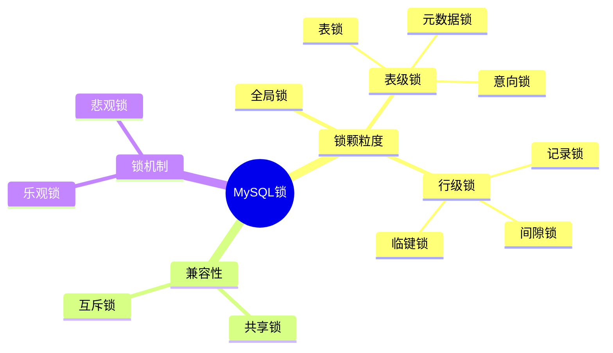

# 数据库总结
[返回首页](index.md)
- 基础
- 架构
  - 说一下MySQL体系结构
  - 一条SQL是如何运行的
  - InnoDB 引擎与 MyISAM 引擎的区别
  - 如何选择存储引擎
- 索引
  - 索引的底层数据结构了解过嘛 ? 
  - B树和B+树的区别是什么呢？
  - 什么是聚簇索引什么是非聚簇索引 ?
  - 知道什么是回表查询嘛 ?
  - 知道什么叫覆盖索引嘛 ? 
  - 什么情况下索引会失效 ?
  - 索引创建原则有哪些？
- 锁
- InnoDB
  - 事务的特性是什么？可以详细说一下吗？
  - 怎么解决这些问题呢？
  - MySQL的默认隔离级别是？
  - 事务中的隔离性是如何保证的呢？(你解释一下MVCC)
- 运维
  - 主从同步原理 
  - 你们项目用过分库分表吗？
  - 数据库如何优化？

[MySQL入门到精通](../base/mysql/index.md)

基础
----------

架构
----------

### 体系结构

MySQL体系结构


1. 连接层

   最上层是一些客户端和链接服务，包含本地 sock 通信和大多数基于客户端/服务端工具实现的类似于 TCP/IP 的通信。主要完成一些类似于连接处理、授权认证、及相关的安全方案。在该层上引入了线程池的概念，为通过认证安全接入的客户端提供线程。同样在该层上可以实现基于 SSL 的安全链接。服务器也会为安全接入的每个客户端验证它所具有的操作权限。

2. 服务层

   第二层架构主要完成大多数的核心服务功能，如 SQL 接口，并完成缓存的查询，SQL的分析和优化，部分内置函数的执行。所有跨存储引擎的功能也在这一层实现，如过程、函数等。在该层，服务器会解析询并创建相应的内部解析树，并对其完成相应的优化如确定表的查询的顺序，是否利用索引等，最后生成相应的执行操作。如果是 Select 语句，服务器还会查询内部的缓存，如果缓存空间足够大，这样在解决大量读操作的环境中能够很好的提升系统的性能。

3. 引擎层

   存储引擎层，存储引擎真正的负责了MySQL中数据的存储和提取，服务器通过API和存储引擎进行通信。不同的存储引擎具有不同的功能，这样我们可以根据自己的需要，来选取合适的存储引擎。数据库中的索引是在存储引擎层实现的。

4. 数据存储层

   主要是将数据(如 : redolog、undolog、数据、索引、二进制日志、错误日志、查询日志、慢查询日志等)存储在文件系统之上，并完成与存储引擎的交互。

<br/>

:::warning 💡思考：说一下MySQL体系结构

:::

<br/>

### 存储引擎

> 思考：MySQL中有哪些常见的索引

存储引擎就是存储数据、建立索引、更新/查询数据等技术的实现方式 。存储引擎是基于表的，而不是基于库的，所以存储引擎也可被称为表类型。


<br/>

**innodb**

介绍：

- InnoDB是一种兼顾高可靠性和高性能的通用存储引擎，在MySQL5.5之后作为MySQL默认存储引擎。

特点：

- DML操作遵循ACID模型，支持事务。
- 行级锁，提高并发访问性能
- 支持外键约束，保证数据的完整性和正确性

文件

- xxx.ibd：xxx代表的是表名，innoDB 引擎的每张表都会对应这样一个表空间文件，存储该表的表结构（frm、sdi）、数据和索引。
- xxx.frm 存储表结构（MySQL8.0时，合并在表名.ibd中）

```sh
tb_sku.frm
tb_sku.ibd
user_role.frm
user_role.ibd
```

<br/>

:::warning 💡思考：如何选择存储引擎？

- InnoDB：是 MySQL 的默认存储引擎，支持事务、外键。如果应用对事务的完整性有比较高的要求，在并发条件下要求数据的一致性，数据操作除了插入和查询之外，还包含很多的更新、删除操作，那么InnoDB存储引擎是比较合适的选择。
- MyISAM：如果应用是以读操作和插入操作为主，只有很少的更新和删除操作，并且对事务的完整性、并发性要求不是很高，那么选择这个存储引擎是非常合适的。
- Memory：将所有数据保存在内存中，访问速度快，通常用于临时表及缓存。  MEMORY的缺陷就是对表的大小有限制，太大的表无法缓存在内存中，而且无法保障数据的安全性。

<br/>

💡**思考：InnoDB 引擎与 MyISAM 引擎的区别 ?** 

- InnoDB引擎, 支持事务, 而MyISAM不支持。

- InnoDB引擎, 支持行锁和表锁, 而MyISAM仅支持表锁, 不支持行锁。

- InnoDB引擎, 支持外键, 而MyISAM是不支持的。

:::

索引
----

> 面试官：什么是索引？了解过索引吗？

索引（index）是帮助MySQL高效获取数据的数据结构(有序)。在数据之外，数据库系统还维护着满足特定查找算法的数据结构（B+树），这些数据结构以某种方式引用（指向）数据， 这样就可以在这些数据结构上实现高级查找算法，这种数据结构就是索引。

<br/>

### 数据结构

> 索引的底层数据结构了解过吗？

MySQL默认使用的索引底层数据结构是B+树。再聊B+树之前，我们先聊聊二叉树和B树。


<br/>

B-Tree，B树是一种多叉路衡查找树，相对于二叉树，B树每个节点可以有多个分支，即多叉。以一颗最大度数（max-degree）为 5阶的 B-tree为例，那这个B树每个节点最多存储4个key。


<br/>

B+Tree 是在 B-Tree 基础上的一种优化，使其更适合实现外存储索引结构，InnoDB 存储引擎就是用B+Tree 实现其索引结构。


<br/>

B树与B+树对比:

1. 磁盘读写代价B+树更低；
2. 查询效率B+树更加稳定；
3. B+树便于扫库和区间查询

<br/>

:::warning 💡思考：什么是索引？

- 索引是帮助MySQL高效获取数据的数据结构
- 通过索引不需要进行全表扫描，提高数据检索的效率，降低数据IO成本
- 通过索引列对数据进行排序，降低数据排序的成本，降低CPU的消耗

<br/>

💡思考：索引的底层数据结构了解过嘛 ? 

MySQL的默认的存储引擎 InnoDB 采用的 B+ 树的数据结构来存储索引，选择 B+ 树的主要的原因是：

- 相对于二叉树，层级更少，搜索效率更高
- 相对于 B-Tree，B+Tree 磁盘读写效率更高，叶子节点存储数据，非叶子节点只存储指针。
- 相对于 Hash 索引，B+Tree 支持范围匹配及排序操作；

<br/>

💡思考：B-Tree 和 B+Tree 的区别是什么呢？

- 在查询的时候，B+Tree 查找效率更加稳定。在 B-Tree 中，非叶子节点和叶子节点都会存放数据，而B+树的所有的数据都会出现在叶子节点，

- 在进行范围查询的时候，B+树效率更高，因为B+树都在叶子节点存储，并且叶子节点是一个双向链表。

:::

<br/>

### 索引分类

在MySQL数据库，将索引的具体类型主要分为以下几类：主键索引、唯一索引、常规索引、全文索引。

| 分类     | 含义                                                  | 特点                       | 关键字   |
| -------- | ----------------------------------------------------- | -------------------------- | -------- |
| 主键索引 | 针对于表中主键创建的索引                              | 默认自动创建 , 只能 有一个 | PRIMARY  |
| 唯一索引 | 避免同一个表中某数据列中的值重复                      | 可以有多个                 | UNIQUE   |
| 常规索引 | 快速定位特定数据                                      | 可以有多个                 |          |
| 全文索引 | 全文索引查找的是文本中的关键词，而不是比 较索引中的值 | 可以有多个                 | FULLTEXT |

<br/>

而在InnoDB存储引擎中，根据索引的存储形式，又可以分为以下两种：

| 分类                      | 含义                                                     | 特点                 |
| ------------------------- | -------------------------------------------------------- | -------------------- |
| 聚集索引(ClusteredIndex)  | 将数据与索引一块存储，索引结构的叶子节点保存了行数据     | 必须有 ,而且只有一个 |
| 二级索引 (SecondaryIndex) | 将数据与索引分开存储，索引结构的叶子节点保存了对应的主键 | 可以存在多个         |

<br/>

聚集索引选取规则:

- 如果存在主键，主键索引就是聚集索引。
- 如果不存在主键，将使用第一个唯一索引作为聚集索引。
- 如果表没有主键，或没有合适的唯一索引，则InnoDB会自动生成一个rowid作为隐藏的聚集索引。

<br/>

聚簇索引和非聚簇索引

- 聚集索引的叶子节点下挂的是这一行的数据
- 二级索引的叶子节点下挂的是该字段值对应的主键值


<br/>

回表查询具体过程如下: 

1. 由于是根据name字段进行查询，所以先根据name='Arm'到name字段的二级索引中进行匹配查找。但是在二级索引中只能查找到 Arm 对应的主键值 10。
2. 由于查询返回的数据是*，所以此时，还需要根据主键值10，到聚集索引中查找10对应的记录，最终找到10对应的行row。 
3. 最终拿到这一行的数据，直接返回即可。

> 回表查询：先到二级索引中查找数据，找到主键值，然后再到聚集索引中根据主键值，获取数据的方式


<br/>

覆盖索引是指查询使用了索引，并且需要返回的列，在该索引中已经全部能够找到 。


接下来，我们来分析一下，当我们执行如下的SQL语句时，具体的查找过程是什么样子的


<br/>

:::warning 💡思考：什么是聚簇索引什么是非聚簇索引 ?

- 聚簇索引主要是指数据与索引放到一块，B+树的叶子节点保存了整行数据，有且只有一个，一般情况下主键在作为聚簇索引的
- 非聚簇索引值的是数据与索引分开存储，B+树的叶子节点保存对应的主键，可以有多个，一般我们自己定义的索引都是非聚簇索引

<br/>

💡 **思考：知道什么是回表查询嘛 ?**

- 通过二级索引找到对应的主键值，然后再通过主键值找到聚集索引中所对应的整行数据，这个过程就是回表

<br/>

💡**思考：知道什么叫覆盖索引嘛 ?** 

覆盖索引是指 select 查询语句使用了索引，并且返回的列能够在索引中全部找到

- 如果我们使用 id 查询，它会直接走聚集索引查询，一次索引扫描，直接返回数据，性能高。

- 如果按照二级索引查询数据的时候，返回的列中没有创建索引，有可能会触发回表查询，尽量避免使用 select *，尽量在返回的列中都包含添加索引的字段


:::

<br/>

### 创建索引

> 面试官：索引创建的原则有哪些

- 先陈述自己工作中是怎么用的
- 主键索引，唯一索引，复合索引

<br/>

索引创建的原则有哪些

1. 针对于数据量较大，且查询比较频繁的表建立索引。
2. 针对于常作为查询条件、排序、分组操作的字段建立索引。
3. 尽量选择区分度高的列作为索引，尽量建立唯一索引，区分度越高，使用索引的效率越高。
4. 如果是字符串类型的字段，字段的长度较长，可以针对于字段的特点，建立前缀索引。
5. 尽量使用联合索引，减少单列索引，节省存储空间。查询时，联合索引很多时候可以走覆盖索引，避免回表，提高查询效率。
6. 要控制索引的数量，索引并不是多多益善，索引越多，维护索引结构的代价也就越大，会影响增删改的效率。
7. 如果索引列不能存储NULL值，请在创建表时使用NOT NULL约束它。当优化器知道每列是否包含NULL值时，它可以更好地确定哪个索引最有效地用于查询。

<br/>

### 性能分析

> 思考：SQL语句执行很慢，如何分析？

- 聚合查询，多表查询，表数据量过大则通过SQL执行计划找到慢的原因。

```sql
-- 直接在select语句之前加上关键字  explain / desc 
EXPLAIN SELECT 字段列表 FROM 表名 WHERE 条件 ;

mysql>  desc select * from tb_user where id = 1 \G;
*************************** 1. row ***************************
           id: 1
  select_type: SIMPLE
        table: tb_user
   partitions: NULL
         type: const
possible_keys: PRIMARY
          key: PRIMARY
      key_len: 4
          ref: const
         rows: 1
     filtered: 100.00
        Extra: NULL
1 row in set, 1 warning (0.01 sec)
```

- `type`：这条SQL的连接类型，性能由好到差为`null、system、const、eq_ref、ref、range、index、all`
  - `system`:查询系统中的表
  - `const`:根据主键查询
  - `eq_ref`:主键索引查询或者唯一索引查询
  - `ref`:索引查询
  - `range`:范围查询
  - `index`:索引树扫描
  - `all`:全盘扫描
- `possible_keys`:当前SQL可能会使用到的索引
- `key`:当前SQL实际命中的索引
- `key_len`:索引占用的大小
  - 通过`key`和`key_len`查看是否可能会命中索引
- `Extra`:额外的优化建议
  - `Using where`：where条件，但是不能使用索引或者使用索引后仍需扫描全表或者索引树判断条件的情况，简单来说，有效的where条件就Using where。
  - `Using Index`：查找使用了索引，需要的数据都在索引中能查到，不需要回表查询数据
  - `Using filesort` : 通过表的索引或全表扫描，读取满足条件的数据行，然后在排序缓冲区sort buffer中完成排序操作，不是通过索引直接返回排序结果的排序都叫 FileSort 排序。
  - `Using index condition`：查找使用了索引，但是需要回表查询。【索引条件下推】
  - `Using temporary`：查找使用了临时表


<br/>

:::warning 💡思考：SQL语句执行很慢，如何分析的方法

- 通过 key 和 key_len 检查是否命中了索引（索引本身存在是否有失效的情况）
- 通过 type 字段查看 SQL 是否有进一步的优化空间，是否存在全索引扫描或全盘扫描
- 通过 extra 建议判断，是否出现了回表的情况，如果出现了，可以尝试添加索引或修改返回字段来修复

:::

<br/>

### 索引失效

> 面试官：什么情况下会索引失效？

索引失效的情况有很多，可以说一些自己遇到过的，不要张口就得得得说一堆背诵好的面试题（适当的思考一下，回想一下，更真实）？

- 违反最左前缀法则会造成索引失效。
- 联合索引中，出现范围查询(>,<)，范围查询后面的列索引失效。
  在业务允许的情况下，尽可能的使用类似于 >= 或 <= 这类的范围查询，而避免使用 > 或 < 。
- 不要在索引列上进行运算操作，这会导致索引失效。
- 字符串不加单引号，造成索引失效。
  - 由于在查询是没有对字符串加单引号， MySQL的查询优化器，会自动的进行类型转换，造成索引失效。
- or 连接的查询条件只有条件两边都有索引才生效。
- 避免使用 <> 或者 != 操作符。不等于操作符会导致查询引擎放弃查询索引，引起全表扫描
  - 通过把不等于操作符改成 or，可以使用索引，避免全表扫描
- 以%开头的Like模糊查询，索引失效。
  - 如果仅仅是尾部模糊匹配，索引不会失效。如果是头部模糊匹配，索引失效。
- 避免在where子句中对字段进行表达式操作和函数操作，会导致索引失效。

<br/>

### 索引下推

锁
--

> MySQL中有哪几种锁，列举一下？



<br/>

锁按照颗粒度划分有三种

- 全局锁：锁定数据库中的所有表。
- 表级锁：每次操作锁住整张表。
- 行级锁：每次操作锁住对应的行数据。

<br/>

按照兼容性区分

- 共享锁（S Lock），也叫读锁（read lock），相互不阻塞。
- 排他锁（X Lock），也叫写锁（write lock），排它锁是阻塞的，在一定时间内，只有一个请求能执行写入，并阻止其它锁读取正在写入的数据。

<br/>

按加锁机制区分

- 悲观锁：悲观的认为数据随时有可能被改动。一个事务拿到悲观锁后，其他任何事物都不能对该数据进行修改，只能等待锁被释放才可以执行。
  - 数据库中的表锁，行锁，共享锁，互斥锁均为悲观锁。
- 乐观锁：乐观锁认为数据的变动不会太频繁。
  - 在表中增加一个版本号，通常由开发者实现。

<br/>

### 全局锁

全局锁就是对整个数据库实例加锁，加锁后整个实例就处于只读状态，后续的DML的写语句，DDL语句，已经更新操作的事务提交语句都将被阻塞。

**其典型的使用场景是做全库的逻辑备份**，对所有的表进行锁定，从而获取一致性视图，保证数据的完整性。

<br/>

数据库中加全局锁，是一个比较重的操作，存在以下问题：

- 如果在主库上备份，那么在备份期间都不能执行更新，业务基本上就得停摆。
- 如果在从库上备份，那么在备份期间从库不能执行主库同步过来的二进制日志（binlog），会导致主从延迟。

在InnoDB引擎中，我们可以在备份时加上参数 `--single-transaction` 参数来完成不加锁的一致性数据备份,通过快照读实现的。

```sql
mysqldump --single-transaction -uroot –p123456 itcast > itcast.sql
```

<br/>

### 表级锁

>  表级锁有哪些，实现哪些功能

表级锁，每次操作锁住整张表。锁定粒度大，发生锁冲突的概率最高，并发度最低。应用在MyISAM、InnoDB、BDB等存储引擎中。

对于表级锁，主要分为以下三类：

- 表锁
- 元数据锁
- 意向锁

<br/>

#### 表锁

每次操作锁住整张表。锁定粒度大，发生锁冲突的概率最高，并发度最低。应用在MyISAM、InnoDB存储引擎中。

表锁分为表共享锁和表互斥锁

<br/>

表共享锁：<mark>只允许读，不允许写</mark>


左侧为客户端一，对指定表加了读锁，不会影响右侧客户端二的读，但是会阻塞右侧客户端的写。

<br/>

表互斥锁：<mark>只允许一个客户端的读写</mark>


左侧为客户端一，对指定表加了写锁，会阻塞右侧客户端的读和写。

<br/>

#### 元数据锁

meta data lock , 元数据锁，简写MDL。

MDL加锁过程是系统自动控制，无需显式使用，在访问一张表的时候会自动加上。MDL锁主要作用是维护表元数据的数据一致性，在表上有活动事务的时候，不可以对元数据进行写入操作。**为了避免DML与DDL冲突**，保证读写的正确性。

这里的元数据，大家可以简单理解为就是一张表的表结构。 也就是说，某一张表涉及到未提交的事务时，是不能够修改这张表的表结构的。

在MySQL5.5中引入了MDL，当对一张表进行增删改查的时候，加MDL读锁(共享)；当对表结构进行变更操作的时候，加MDL写锁(排他)。

<br/>

#### 意向锁

意向锁解决的是行锁和表锁的冲突问题。

为了避免 DML 在执行时，加的行锁与表锁的冲突，在 InnoDB 中引入了意向锁，使得表锁不用检查每行数据是否加锁，使用意向锁来减少表锁的检查。

<br/>

假如没有意向锁，客户端一对表加了行锁后，客户端二如何给表加表锁呢，来通过示意图简单分析一下：首先客户端一，开启一个事务，然后执行DML操作，在执行DML语句时，会对涉及到的行加行锁。


<br/>

当客户端二，想对这张表加表锁时，会检查当前表是否有对应的行锁，如果没有，则添加表锁，此时就会从第一行数据，检查到最后一行数据，效率较低。


<br/>

有了意向锁之后 :客户端一，在执行DML操作时，会对涉及的行加行锁，同时也会对该表加上意向锁。


<br/>

而其他客户端，在对这张表加表锁的时候，会根据该表上所加的意向锁来判定是否可以成功加表锁，而不用逐行判断行锁情况了。


<br/>

意向锁分类：

- 意向共享锁(IS): 由语句`select ... lock in share mode`添加 。 与表锁共享锁(read)兼容，与表锁排他锁(write)互斥。
- 意向排他锁(IX): 由`insert、update、delete、select...for update`添加 。与表锁共享锁(read)及排他锁(write)都互斥，意向锁之间不会互斥。

> 一旦事务提交了，意向共享锁、意向排他锁，都会自动释放。

<br/>

:::warning 💡思考：元数据锁是什么？

**元数据锁** 主要是维护 **表元数据** 的一致性。当一张表进行增删改查的时候，加入 **元数据共享锁**，对表结构修改互斥；当对表结构进行变更的时候，加入 **元数据排他锁**，不让增删改查影响到数据变更，保证了数据读写的正确性。

<br/>

💡**思考：意向锁实现了什么功能？**

意向锁的出现是为了支持 InnoDB 的多粒度锁，解决的是表锁和行锁共存的问题。

为了避免 DML 在执行时，加的行锁与表锁的冲突，在 InnoDB 中引入了意向锁，使得表锁不用检查每行数据是否加锁，使用意向锁来减少表锁的检查。

- 假如没有意向锁，那么我们就得遍历表中所有数据行来判断有没有行锁；
- 有了意向锁这个表级锁之后，则我们直接判断一次就知道表中是否有数据行被锁定了。

:::

<br/>

### 行级锁

行级锁，每次操作锁住对应的行数据。锁定粒度最小，发生锁冲突的概率最低，并发度最高。应用在InnoDB存储引擎中。

InnoDB的数据是基于索引组织的，行锁是通过对索引上的索引项加锁来实现的，而不是对记录加的锁。对于行级锁，主要分为以下三类：

- 行锁（Record Lock）：锁定单个行记录的锁，防止其他事务对此行进行 Update 和 Delete。在RC、RR隔离级别下都支持。

  

- 间隙锁（Gap Lock）：锁定索引记录间隙（不含该记录），确保索引记录间隙不变，防止其他事务在这个间隙进行 Insert，产生幻读。在RR隔离级别下都支持。

  

- 临键锁（Next-Key Lock）：行锁和间隙锁组合，同时锁住数据，并锁住数据前面的间隙Gap。 在RR隔离级别下支持。

  

  - 举例：查询的条件为 `id<=34`
    - 如果34之后没有数据 ，则临键锁的范围为 `[-∞,34]`
    - 如果34之后有一个ID为25的数据，则临键锁的范围为 `[-∞,25]，(25,34]`

  - 查询的条件为 `id < 34`
    - 如果34之后没有数据，则临键锁的范围为 `[-∞,34)`
    - 如果34之后有一个ID为25的数据，则临键锁的范围为 `[-∞,25]，(25,34)`


<br/>

#### 行锁

InnoDB实现了以下两种类型的行锁：

- 共享锁（S）：允许一个事务去读一行，阻止其他事务获得相同数据集的排它锁。
- 排他锁（X）：允许获取排他锁的事务更新数据，阻止其他事务获得相同数据集的共享锁和排他锁。

两种行锁的兼容情况如下:


常见的SQL语句，在执行时，所加的行锁如下：

| SQL                          | 行锁类型   | 说明                                    |
| ---------------------------- | ---------- | --------------------------------------- |
| INSERT ...                   | 排他锁     | 自动加锁                                |
| UPDATE ...                   | 排他锁     | 自动加锁                                |
| DELETE ...                   | 排他锁     | 自动加锁                                |
| SELECT (正常)                | 不加任何锁 |                                         |
| SELECT ... LOCK IN SHAREMODE | 共享锁     | 需要手动在SELECT之后加LOCK IN SHAREMODE |
| SELECT ... FOR UPDATE        | 排他锁     | 需要手动在SELECT之后加FOR UPDATE        |

<br/>

默认情况下，InnoDB在 REPEATABLE READ事务隔离级别运行，InnoDB使用临键锁进行搜索和索引扫描，以防止幻读。

- 针对唯一索引进行检索时，对已存在的记录进行等值匹配时，将会自动优化为行锁。
- InnoDB的行锁是针对于索引加的锁，不通过索引条件检索数据，那么InnoDB将对表中的所有记录加锁，此时就会升级为表锁。

<br/>

#### 间隙锁&临键锁

默认情况下，InnoDB在 REPEATABLE READ事务隔离级别运行，InnoDB使用临键锁进行搜索和索引扫描，以防止幻读。

- 索引上的等值查询(唯一索引)，给不存在的记录加锁时, 优化为间隙锁 。
- 索引上的等值查询(非唯一普通索引)，向右遍历时最后一个值不满足查询需求时，临键锁退化为间隙锁。
- 索引上的范围查询(唯一索引)--会访问到不满足条件的第一个值为止。

> 注意：间隙锁唯一目的是防止其他事务插入间隙。间隙锁是通过插入间隙锁实现的共存，一个事务采用的间隙锁不会阻止另一个事务在同一间隙上采用间隙锁。

<br/>

:::warning 💡思考：InnoDB中行级锁是如何实现的。

- 一个事务在查询，查询条件为大于等于19，如果有ID为19的数据，则会对19这条数据加行锁，大于19的数据如果没有，则会在没有的数据大于19的数据加入间隙锁。行锁加上间隙锁的集合就是临键锁。

- 当其他事物在查询的时候是不会阻塞的，执行DML语句不在临键锁范围内的数据也不会阻塞。但是当要修改ID为19这条数据或插入19以后的数据则会阻塞。只有当事务提交之后才可以执行。

- 如果ID为19的数据不存在，则会优化为间隙锁，如果查询不带条件，则会升级为表锁。

:::

InnoDB
----------

### 存储结构

InnoDB的逻辑存储结构如下图所示：


1. 表空间

   表空间是InnoDB存储引擎逻辑结构的最高层， 如果用户启用了参数 innodb_file_per_table(在8.0版本中默认开启) ，则每张表都会有一个表空间（xxx.ibd），一个mysql实例可以对应多个表空间，用于存储记录、索引等数据。

2. 段

   段，分为数据段（Leaf node segment）、索引段（Non-leaf node segment）、回滚段(Rollback segment），InnoDB是索引组织表，数据段就是B+树的叶子节点， 索引段即为B+树的非叶子节点。段用来管理多个Extent（区）。

3. 区

   区，表空间的单元结构，每个区的大小为1M。 默认情况下， InnoDB存储引擎页大小为16K， 即一个区中一共有64个连续的页。

4. 页

   页，是InnoDB 存储引擎磁盘管理的最小单元，每个页的大小默认为 16KB。为了保证页的连续性，InnoDB 存储引擎每次从磁盘申请 4-5 个区。

5. 行

   行，InnoDB 存储引擎数据是按行进行存放的。在行中，默认有两个隐藏字段：

   - Trx_id：每次对某条记录进行改动时，都会把对应的事务id赋值给trx_id隐藏列。

   - Roll_pointer：每次对某条引记录进行改动时，都会把旧的版本写入到undo日志中，然后这个隐藏列就相当于一个指针，可以通过它来找到该记录修改前的信息。


<br/>

总结


<br/>

### 事务特性

> 面试官：事务的特性是什么？可以详细说一下吗？

事务是一组操作的集合，它是一个不可分割的工作单位，事务会把所有的操作作为一个整体一起向系统提交或撤销操作请求，即这些操作要么同时成功，要么同时失败。

- 原子性（Atomicity）：事务是不可分割的最小操作单元，要么全部成功，要么全部失败。
- 一致性（Consistency）：事务完成时，必须使所有的数据都保持一致状态。
- 隔离性（Isolation）：数据库系统提供的隔离机制，保证事务在不受外部并发操作影响的独立环境下运行。
- 持久性（Durability）：事务一旦提交或回滚，它对数据库中的数据的改变就是永久的。

<br/>

:::warning 💡思考：事务的特性是什么？可以详细说一下吗？

ACID，分别指的是：原子性、一致性、隔离性、持久性；我举个例子：

- A向B转账500，转账成功，A扣除500元，B增加500元，原子操作体现在要么都成功，要么都失败

- 在转账的过程中，数据要一致，A扣除了500，B必须增加500

- 在转账的过程中，隔离性体现在A像B转账，不能受其他事务干扰

- 在转账的过程中，持久性体现在事务提交后，要把数据持久化（可以说是落盘操作）

<br/>

💡**思考：事务的实现原理是什么？**

`redo log`保证了事务的持久性，`undo log` 保证了事务的原子性和一致性，MVCC 和锁保证了事务的隔离性。

:::

<br/>

### 隔离级别

> 面试官：并发事务带来哪些问题？怎么解决这些问题呢？MySQL的默认隔离级别是？

- 并发事务问题：脏读、不可重复读、幻读
- 隔离级别：读未提交、读已提交、可重复读、串行化

<br/>

**事务并发问题**

脏读：一个事务读到另外一个事务还没有提交的数据。


<br/>

不可重复读：一个事务先后读取同一条记录，但两次读取的数据不同，称之为不可重复读。


<br/>

幻读：事务在还没提交之前第一次查询的数据和第二次查询的数据结果集不相同。


<br/>

如何解决并发事务问题呢？

解决方案：对事务进行隔离


注意：事务隔离级别越高，数据越安全，但是性能越低。

<br/>

:::warning 💡思考：并发事务带来哪些问题？

我们在项目开发中，多个事务并发进行是经常发生的，并发也是必然的，有可能导致一些问题

- 第一是脏读， 当一个事务正在访问数据并且对数据进行了修改，而这种修改还没有提交到数据库中，这时另外一个事务也访问了这个数据，因为这个数据是还没有提交的数据，那么另外一个事务读到的这个数据是“脏数据”，依据“脏数据”所做的操作可能是不正确的。

- 第二是不可重复读：比如在一个事务内多次读同一数据。在这个事务还没有结束时，另一个事务也访问该数据。那么，在第一个事务中的两次读数据之间，由于第二个事务的修改导致第一个事务两次读取的数据可能不太一样。这就发生了在一个事务内两次读到的数据是不一样的情况，因此称为不可重复读。

- 第三是幻读（Phantom read）：幻读与不可重复读类似。它发生在一个事务（T1）读取了几行数据，接着另一个并发事务（T2）插入了一些数据时。在随后的查询中，第一个事务（T1）就会发现多了一些原本不存在的记录，就好像发生了幻觉一样，所以称为幻读。

<br/>

💡**思考：怎么解决这些问题呢？**

解决方案是对事务进行隔离。MySQL支持四种隔离级别，分别有：

- 第一个是，未提交读（read uncommitted）它解决不了刚才提出的所有问题，一般项目中也不用这个。
- 第二个是读已提交（read committed）它能解决脏读的问题的，但是解决不了不可重复读和幻读。
- 第三个是可重复读（repeatable read）它能解决脏读和不可重复读，但是解决不了幻读，这个也是mysql默认的隔离级别。
- 第四个是串行化（serializable）它可以解决刚才提出来的所有问题，但是由于让是事务串行执行的，性能比较低。
- 所以，我们一般使用的都是mysql默认的隔离级别:可重复读

:::

<br/>

### 事务原理

> 思考：那事务是如何实现的呢？

那实际上，我们研究事务的原理，就是研究MySQL的InnoDB引擎是如何保证事务的这四大特性的。而对于这四大特性，实际上分为两个部分。 其中的原子性、一致性、持久化，实际上是由InnoDB中的两份日志来保证的，一份是redo log日志，一份是undo log日志。 而隔离性是通过数据库的锁，加上MVCC来保证的。


我们在讲解事务原理的时候，主要就是来研究一下redolog，undolog以及MVCC。 

<br/>

#### 日志

> 思考：undo log 和redo log 区别

要了解这两个日志的区别，我们需要先知道一些基本的概念

- 缓冲池（buffer pool）：主内存中的一个区域，里面可以缓存磁盘上经常操作的真实数据，在执行增删改查操作时，先操作缓冲池中的数据（若缓冲池没有数据，则从磁盘加载并缓存），以一定频率刷新到磁盘，从而减少磁盘IO，加快处理速度。

- 数据页（page）：是InnoDB 存储引擎磁盘管理的最小单元，每个页的大小默认为 16KB。页中存储的是行数据。

  

- 重做日志（redo log）：记录的是事务提交时数据页的物理修改，是用来实现事务的持久性。

  - 该日志文件由两部分组成：重做日志缓冲（redo log buffer）以及重做日志文件（redo log file）,前者是在内存中，后者在磁盘中。当事务提交之后会把所有修改信息都存到该日志文件中, 用于在刷新脏页到磁盘,发生错误时, 进行数据恢复使用。

    

- 回滚日志（undo log）：用于记录数据被修改前的信息 , 作用包含两个 : 提供回滚 和 MVCC(多版本并发控制) 。undo log和redo log记录物理日志不一样，它是逻辑日志。

  - 可以认为当delete一条记录时，undo log中会记录一条对应的insert记录，反之亦然，当update一条记录时，它记录一条对应相反的update记录。当执行rollback时，就可以从undo log中的逻辑记录读取到相应的内容并进行回滚。

<br/>

#### MVCC

> 思考：MVCC是如何实现的？

全称 Multi-Version Concurrency Control，多版本并发控制。指维护一个数据的多个版本，使得读写操作没有冲突。

MVCC的具体实现，主要依赖于数据库记录中的<mark>隐式字段、undo log日志、readView</mark>

<br/>

**隐藏字段**

记录中的隐藏字段


<br/>

**undo log**

会滚日志在insert、update、delete的时候产生的便于数据回滚的日志。

- 当insert的时候，产生的undo log日志只在回滚时需要，在事务提交后，可被立即删除。
- 而update、delete的时候，产生的undo log日志不仅在回滚时需要，mvcc版本访问也需要，不会立即被删除。

undo log 版本链：不同事务或相同事务对同一条记录进行修改，会导致该记录的undolog生成一条记录版本链表，链表的头部是最新的旧记录，链表尾部是最早的旧记录。


<br/>

**ReadView**

读视图是<mark>快照读</mark>SQL执行时MVCC提取数据的依据，记录并维护系统当前活跃的事务（未提交的）id。

- 当前读：读取的是记录的<mark>最新版本</mark>，读取时还要保证其他并发事务不能修改当前记录，会对读取的记录进行加锁。对于我们日常的操作，
  - 如：select ... lock in share mode(共享锁)，select ... for update、update、insert、delete(排他锁)都是一种当前读。
- 快照读：简单的select（不加锁）就是快照读，快照读，读取的是记录数据的可见版本，有可能是历史数据，不加锁，是非阻塞读。
  - Read Committed：每次select，都生成一个快照读。
  - Repeatable Read：开启事务后第一个select语句才是快照读的地方。

<br/>

举例：

当前读：第一次和第二次查询的数据不同。读取的是最新版本，事务A的第二个Select读取的是事务B提交的事务。

快照读RC：其他事务提交后的数据。

快照读RR：每次查询都是第一次查询的数据。


<br/>

ReadView中包含了四个核心字段

| **字段**       | **含义**                                             |
| -------------- | ---------------------------------------------------- |
| m_ids          | 当前活跃的事务ID集合                                 |
| min_trx_id     | 最小活跃事务ID                                       |
| max_trx_id     | 预分配事务ID，当前最大事务ID+1（因为事务ID是自增的） |
| creator_trx_id | ReadView创建者的事务ID                               |

<br/>

数据访问规则


<br/>

不同的隔离级别，生成ReadView的时机不同：

- READ COMMITTED ：在事务中每一次执行快照读时生成ReadView。
- REPEATABLE READ：仅在事务中第一次执行快照读时生成ReadView，后续复用该ReadView。


<br/>

举例：在RC下数据读取规则。当前ReadView最终读取到的数据为事务ID为2的数据。


<br/>

当前ReadView最终读取到的数据为事务ID为3的数据。


<br/>

在RR隔离级别下，仅在事务中第一次执行快照读时生成ReadView，后续复用该ReadView。


<br/>

:::warning 💡思考：undo log和redo log的区别

- redo log 日志记录的是数据页的物理变化，服务宕机可用来同步数据
- undo log 是逻辑日志，当事务回滚时，通过逆操作恢复原来的数据，比如我们删除一条数据的时候，就会在undo log日志文件中新增一条delete语句，如果发生回滚就执行逆操作；

<br/>

💡**思考：事务中的隔离性是如何保证的呢？**

**事务的隔离性是由锁和 MVCC 实现的。**

- 其中 mvcc 的意思是多版本并发控制。指维护一个数据的多个版本，使得读写操作没有冲突，它的底层实现主要是分为了三个部分，第一个是隐藏字段，第二个是undo log日志，第三个是readView读视图

- 隐藏字段是指：在mysql中给每个表都设置了隐藏字段，有一个是trx_id(事务id)，记录每一次操作的事务id，是自增的；另一个字段是roll_pointer(回滚指针)，指向上一个版本的事务版本记录地址

- undo log主要的作用是记录回滚日志，存储老版本数据，在内部会形成一个版本链，在多个事务并行操作某一行记录，记录不同事务修改数据的版本，通过roll_pointer指针形成一个链表

- readView解决的是一个事务查询选择版本的问题，在内部定义了一些匹配规则和当前的一些事务id判断该访问那个版本的数据，不同的隔离级别快照读是不一样的，最终的访问的结果不一样。如果是rc隔离级别，每一次执行快照读时生成ReadView，如果是rr隔离级别仅在事务中第一次执行快照读时生成ReadView，后续复用。

:::

运维
----------

数据库日志

### 慢查询定位

> 思考：MySQL中如何定位慢查询？

- 聚合查询
- 多表查询
- 表数据量过大查询
- 深度分页查询

表象：页面加载过慢、接口压测响应时间过长（超过1秒）

<br/>

方案一：开源工具

- 调试工具：Arthas
- 运维工具：Prometheus、Skywalking


<br/>

方案二：MySQL自带慢日志

慢查询日志记录了所有执行时间超过指定参数（long_query_time，单位：秒，默认10秒）的所有SQL语句的日志如果要开启慢查询日志，需要在MySQL的配置文件（/etc/my.cnf）中配置如下信息：

```properties
# 开启MySQL慢日志查询开关
slow_query_log=1
# 设置慢日志的时间为2秒，SQL语句执行时间超过2秒，就会视为慢查询，记录慢查询日志
long_query_time=2
```

配置完毕之后，通过以下指令重新启动MySQL服务器进行测试，查看慢日志文件中记录的信息 

`/var/lib/mysql/localhost-slow.log`


<br/>

回答如何定位慢查询的方法

1. 介绍当时生产问题的场景（我们当时的一个接口测试的时候非常的慢，压测的结果大概5秒钟）
2. 我们系统中当时采用了运维工具（Skywalking），可以监测出哪个接口，最终以为SQL的问题
3. 在mysql中开启了慢日志查询，我们设置的值就是2秒，一旦sql执行超过2秒就会记录到日志中（调试阶段）

<br/>

:::warning 💡思考：MySQL中，如何定位慢查询?

我们当时做压测的时候有的接口非常的慢，接口的响应时间超过了2秒以上，因为我们当时的系统部署了运维的监控系统Skywalking ，在展示的报表中可以看到是哪一个接口比较慢，并且可以分析这个接口哪部分比较慢，这里可以看到SQL的具体的执行时间，所以可以定位是哪个sql出了问题

如果，项目中没有这种运维的监控系统，其实在MySQL中也提供了慢日志查询的功能，可以在MySQL的系统配置文件中开启这个慢日志的功能，并且也可以设置SQL执行超过多少时间来记录到一个日志文件中，我记得上一个项目配置的是2秒，只要SQL执行的时间超过了2秒就会记录到日志文件中，我们就可以在日志文件找到执行比较慢的SQL了。

:::

<br/>

### SQL优化

> 数据库中如何优化你的SQL？

#### 插入优化

**insert**

如果我们需要一次性往数据库表中插入多条记录，可以从以下三个方面进行优化。

```sql
insert into tb_test values(1,'tom'); 
insert into tb_test values(2,'cat'); 
insert into tb_test values(3,'jerry');
```

<br/>

优化方案一：批量插入数据

```sql
Insert into tb_test values(1,'Tom'),(2,'Cat'),(3,'Jerry');
```

<br/>

优化方案二：手动控制事务

```sql
start transaction; 
insert into tb_test values(1,'Tom'),(2,'Cat'),(3,'Jerry'); 
insert into tb_test values(4,'Tom'),(5,'Cat'),(6,'Jerry'); 
insert into tb_test values(7,'Tom'),(8,'Cat'),(9,'Jerry'); 
commit;
```

<br/>

优化方案三：主键顺序插入，性能要高于乱序插入。

```sh
主键乱序插入 : 8 1 9 21 88 2 4 15 89 5 7 3
主键顺序插入 : 1 2 3 4 5 7 8 9 15 21 88 89
```

<br/>

**批量insert**

如果一次性需要插入大批量数据(比如: 几百万的记录)，使用insert语句插入性能较低，此时可以使用MySQL数据库提供的load指令进行插入。

插入100w的记录，10几秒就完成了，性能很好。

<br/>

#### 主键优化 

主键设计原则

- 满足业务需求的情况下，尽量降低主键的长度。
- 插入数据时，尽量选择顺序插入，选择使用AUTO_INCREMENT自增主键。
- 尽量不要使用UUID做主键或者是其他自然主键，如身份证号，这会导致频繁的页分裂。
- 对删除的数据做逻辑删除，频繁的删除会导致页合并，可以对必要删除的数据做历史化。
- 业务操作时，避免对主键的修改。

<br/>


#### 排序优化

排序优化原则

- 根据排序字段建立合适的索引，多字段排序时，也遵循最左前缀法则。
- 尽量使用覆盖索引。
- 多字段排序, 一个升序一个降序，此时需要注意联合索引在创建时的规则（ASC/DESC）。
- 如果不可避免的出现filesort，大数据量排序时，可以适当增大排序缓冲区大小，sort_buffer_size(默认256k)。 

<br/>

#### 分组优化

在分组操作中，我们需要通过以下两点进行优化，以提升性能：

- 在分组操作时，可以通过索引来提高效率。
- 分组操作时，索引的使用也是满足最左前缀法则的。

<br/>

#### count优化

在之前的测试中，我们发现，如果数据量很大，在执行count操作时，是非常耗时的

- MyISAM 引擎把一个表的总行数存在了磁盘上，因此执行 count(*) 的时候会直接返回这个数，效率很高； 但是如果是带条件的count，MyISAM也慢。
- InnoDB 引擎就麻烦了，它执行 count(*) 的时候，需要把数据一行一行地从引擎里面读出来，然后累积计数。

如果说要大幅度提升InnoDB表的count效率，主要的优化思路：自己计数(可以借助于redis这样的数据库进行,但是如果是带条件的count又比较麻烦了)

<br/>

**count用法**

`count()` 是一个聚合函数，对于返回的结果集，一行行地判断，如果 count 函数的参数不是 NULL，累计值就加 1，否则不加，最后返回累计值。

- `count(主键)`：InnoDB 引擎会遍历整张表，把每一行的 主键id 值都取出来，返回给服务层。 服务层拿到主键后，直接按行进行累加(主键不可能为null)。
- `count(字段)`：没有not null 约束  : InnoDB 引擎会遍历整张表把每一行的字段值都取出来，返回给服务层，服务层判断是否为null，不为null，计数累加。有not null 约束：  InnoDB 引擎会遍历整张表把每一行的字段值都取出来，返 回给服务层，直接按行进行累加。
- `count(数字)`：InnoDB 引擎遍历整张表，但不取值。服务层对于返回的每一行，放一个数字“1” 进去，直接按行进行累加。
- `count(*)`：InnoDB引擎并不会把全部字段取出来，而是专门做了优化，不取值，服务层直接按行进行累加。

> 按照效率排序的话，count(字段) < count(主键 id) < count(1) ≈ count(\*)，所以尽量使用 count(\*)。

<br/>

#### 更新优化

我们主要需要注意一下update语句执行时的注意事项。

```sql
update course set name = 'javaEE' where id = 1 ;
```

当我们在执行删除的SQL语句时，会锁定id为1这一行的数据，然后事务提交之后，行锁释放。

<br/>

但是当我们在执行如下SQL时。

```sql
update course set name = 'SpringBoot' where name = 'PHP' ;
```

当我们开启多个事务，在执行上述的SQL时，我们发现行锁升级为了表锁。 导致该update语句的性能大大降低。

> InnoDB的行锁是针对索引加的锁，不是针对记录加的锁 ,并且该索引不能失效，否则会从行锁升级为表锁 。

<br/>

#### 分页优化

在数据量比较大时，如果进行limit分页查询，在查询时，越往后，分页查询效率越低。

我们一起来看看执行limit分页查询耗时对比：

```sh
mysql> select * from tb_sku limit 0,10;
10 rows in set (0.00 sec)

mysql> select * from tb_sku limit 9000000,10;
10 rows in set (11.05 sec)
```

因为，当在进行分页查询时，如果执行 limit 9000000,10 ，此时需要MySQL排序前9000010 记录，仅仅返回 9000000 - 9000010 的记录，其他记录丢弃，查询排序的代价非常大 。

<br/>

优化思路: 一般分页查询时，通过创建 <mark>覆盖索引</mark> 能够比较好地提高性能，可以通过<mark>覆盖索引</mark>加<mark>子查询</mark>形式进行优化。

```sql
mysql> select *
from tb_sku t,
     (select id from tb_sku order by id limit 9000000,10) a
where t.id = a.id;
10 rows in set (1.90 sec)
```

<br/>

:::warning 💡思考：MYSQL超大分页怎么处理 ?

超大分页一般都是在数据量比较大时，我们使用了limit分页查询，并且需要对数据进行排序，这个时候效率就很低，我们可以采用覆盖索引和子查询来解决，先分页查询数据的id字段，确定了id之后，再用子查询来过滤，只查询这个id列表中的数据就可以了，因为查询id的时候，走的覆盖索引，所以效率可以提升很多

:::


### 主从同步

MySQL主从复制的核心就是二进制日志。

二进制日志（BINLOG）记录了所有的 DDL（数据定义语言）语句和 DML（数据操纵语言）语句，但不包括数据查询（SELECT、SHOW）语句。


复制分成三步：

1. Master 主库在事务提交时，会把数据变更记录在二进制日志文件 Binlog 中。
2. 从库读取主库的二进制日志文件 Binlog ，写入到从库的中继日志 Relay Log 。
3. Slave 重做中继日志中的事件，将改变反映它自己的数据。

<br/>

:::warning 💡思考：MySQL主从同步原理 

MySQL主从复制的核心就是二进制日志中的DDL 语句和 DML 语句，但是不包括 SELECT 和 SHOW 语句，它的步骤是这样的

- 主库在事务提交时，会把数据变更记录在二进制日志文件Binlog中，并且创建一个Dump线程向从库推送Binlog
- 从库创建一个 IO线程接收 Binlog，并记录到Relay Log 中继日志中。
- 从库开启一个 SQL 线程读取 Relay log中继日志中的事件，完成数据的同步。

:::

<br/>

### 分库分表

> 面试官：你们项目用过分库分表吗


分库分表的时机：

1. 前提：项目业务数据逐渐增多，或业务发展比较迅速。单表数据量达到1000w或者20G以后
2. 优化已经解决不了性能问题（主从读写分离、创建索引）
3. IO瓶颈（磁盘IO，网络IO），CPU瓶颈（聚合查询、连接数太多）

<br/>

拆分策略


<br/>

#### 垂直分库

以表为依据，根据业务将不同表拆分到不同库中。

特点：

1. 按业务对数据分级管理、维护、监控、扩展
2. 在高并发下，提高磁盘IO和连接量和连接数


<br/>

#### 垂直分表

以字段为依据，根据字段属性不同将不同字段拆分到不同表中

特点

1. 冷热数据分离
2. 减少IO过渡争抢，两表互不影响


<br/>

#### 水平分库

将一个库的数据拆分到多个库中。

特点

1. 解决了单库大数据量，高并发的性能瓶颈问题
2. 提高了系统的稳定性和可用性


<br/>

#### 水平分表

将一个表的数据分到多个表中（可以在同一个库中）

特点

- 避免单一数据量过大而产生的性能问题；
- 避免IO争抢并减少锁表的几率；


<br/>

新方法带来的新问题


<br/>

:::warning 💡思考：你们项目用过MySQL的分库分表吗？

项目背景 当项目业务数据逐渐增多，业务发展迅速，单表数据量达到1000w或20G以后，磁盘IO，网络IO，文件IO太多导致IO遇到瓶颈；聚合查询，连接数太多导致CPU遇到瓶颈，优化已经解决不了性能问题（主从读写分离，创建索引）。

拆分的策略

- 垂直分库：以表为依据，根据不同业务将不同表拆分到不同库中，在高并发的情况下提升了磁盘IO和连接数。
- 垂直分表：以字段为依据，根据字段属性不同将不同字段拆分到不同表中，使冷热数据分离，减少IO过渡争抢，两表互不影响。
- 水平分库：将一个库的数据拆分到多个库中，解决了单库数据量大，高并发的性能瓶颈问题，提高了系统的稳定性和可用性。
- 水平分表：将一个表的数据拆分到多个表中，避免单一数据量过大而产生的性能问题，可以减少由于IO争抢导致锁表的几率。

分库之后带来的问题：分布式事务一致性问题，跨界点关联问题，跨界点分页、排序函数，主键重复等问题。

:::

<br/>

### 优化经验

> 思考：谈谈你对数据库的优化经验

- 表的设计优化
- 表的索引优化
- SQL语句优化
- 主从复制、读写分离
- 分库分表

<br/>

**表的设计优化（参考阿里开发手册《嵩山版》）**

1. 比如设置合适的数值（tinyint   int   bigint），要根据实际情况选择
2. 比如设置合适的字符串类型（char和varchar）char定长效率高，varchar可变长度，效率稍低

<br/>

**SQL语句优化**

1. SQL语句优化SELECT语句务必指明字段名称（避免直接使用select * ），避免回表查询

2. SQL语句要避免造成索引失效的写法。

   - 联合索引如果出现范围查询`(>,<)`，则范围查询后面的索引列将会失效，尽可能的使用 `<=` 或 ` >=`。
   - 违反最左前缀法则会造成索引失效，最左前缀与联合索引顺序有关，与SQL条件编写的先后顺序无关。
   - 不能再索引列上做运算操作，会造成索引失效。
   - 不在字符串上加单引号，MySQL查询优化器会自动类型转换，造成索引失效。
   - 避免使用 <> 或者 != 操作符。不等于操作符会导致查询引擎放弃查询索引，引起全表扫描。通过把不等于操作符改成 or，可以使用索引，避免全表扫描
   - 如果仅仅是尾部模糊匹配，索引不会失效。如果是头部模糊匹配，索引失效。
   - 避免在where子句中对字段进行表达式操作和函数操作，会导致索引失效。

3. 尽量用union all代替union，union会多一次过滤，效率低

   ```sql
   select * from t_user where id > 2
   union all  | union
   select * from t_user where id < 5
   ```

4. Join优化能用 inner join 就不用 left join right join，如必须使用一定要以小表为驱动，内连接会对两个表进行优化，优先把小表放到外边，把大表放到里边。left join 或 right join，不会重新调整顺序

   ```java
   for (int i = 0; i < 3; i++) {
     for (int j = 0; j < 1000; j++) {
     }
   }
   ```

<br/>

**主从复制、读写分离**

如果数据库的使用场景读的操作比较多的时候，为了避免写的操作所造成的性能影响 可以采用读写分离的架构。读写分离解决的是，数据库的写入，影响了查询的效率。


<br/>

:::warning 💡思考：说说你对数据库优化的经验

数据库的优化可以考虑这几个方面，合理的表设计和字段、索引优化、SQL语句优化、读写分离，如果数据量超过2000w则可以考虑分库分表

<br/>

💡**思考：创建表的时候，你们是如何优化的呢？**

这个我们主要参考的阿里出的那个开发手册《嵩山版》，就比如，在定义字段的时候需要结合字段的内容来选择合适的类型，如果是数值的话，像tinyint、int 、bigint这些类型，要根据实际情况选择。如果是字符串类型，也是结合存储的内容来选择char和varchar或者text类型

<br/>

💡**思考：创建表的时候，你们是如何优化的呢？**

- 针对于数据量较大，且查询比较频繁的表建立索引。
- 针对于常作为查询条件、排序、分组操作的字段建立索引。
- 尽量选择区分度高的列作为索引，尽量建立唯一索引，区分度越高，使用索引的效率越高。
- 如果是字符串类型的字段，字段的长度较长，可以针对于字段的特点，建立前缀索引。
- 尽量使用联合索引，减少单列索引，查询时，联合索引很多时候可以覆盖索引，节省存储空间，避免回表，提高查询效率。
- 要控制索引的数量，索引并不是多多益善，索引越多，维护索引结构的代价也就越大，会影响增删改的效率
- 如果索引列不能存储NULL值，请在创建表时使用NOT NULL约束它。当优化器知道每列是否包含NULL值时，它可以更好地确定哪个索引最有效地用于查询。

<br/>

💡**思考：你平时对 SQL 语句做了哪些优化呢？**

- SQL语句优化SELECT语句务必指明字段名称（避免直接使用select * ），避免回表查询
- SQL语句要避免造成索引失效的写法。
  - 联合索引如果出现范围查询`(>,<)`，则范围查询后面的索引列将会失效，尽可能的使用 `<=` 或 ` >=`。
  - 违反最左前缀法则会造成索引失效，最左前缀与联合索引顺序有关，与SQL条件编写的先后顺序无关。
  - 不能再索引列上做运算操作，会造成索引失效。
  - 不在字符串上加单引号，MySQL查询优化器会自动类型转换，造成索引失效。
  - 避免使用 <> 或者 != 操作符。不等于操作符会导致查询引擎放弃查询索引，引起全表扫描。通过把不等于操作符改成 or，可以使用索引，避免全表扫描
  - 如果仅仅是尾部模糊匹配，索引不会失效。如果是头部模糊匹配，索引失效。
  - 避免在where子句中对字段进行表达式操作和函数操作，会导致索引失效。
- 尽量用union all代替union，union会多一次过滤，效率低

- Join优化能用 inner join 就不用 left join right join，如必须使用一定要以小表为驱动，内连接会对两个表进行优化，优先把小表放到外边，把大表放到里边。left join 或 right join，不会重新调整顺序。

:::
