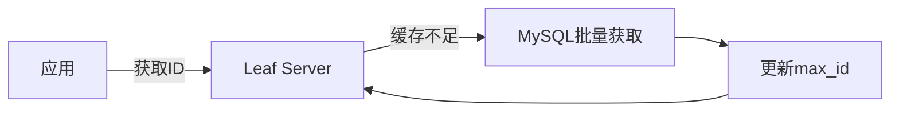
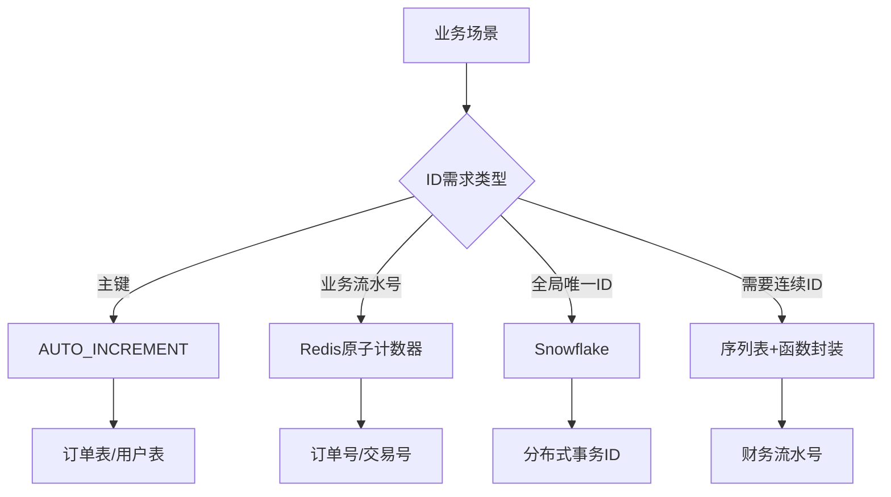
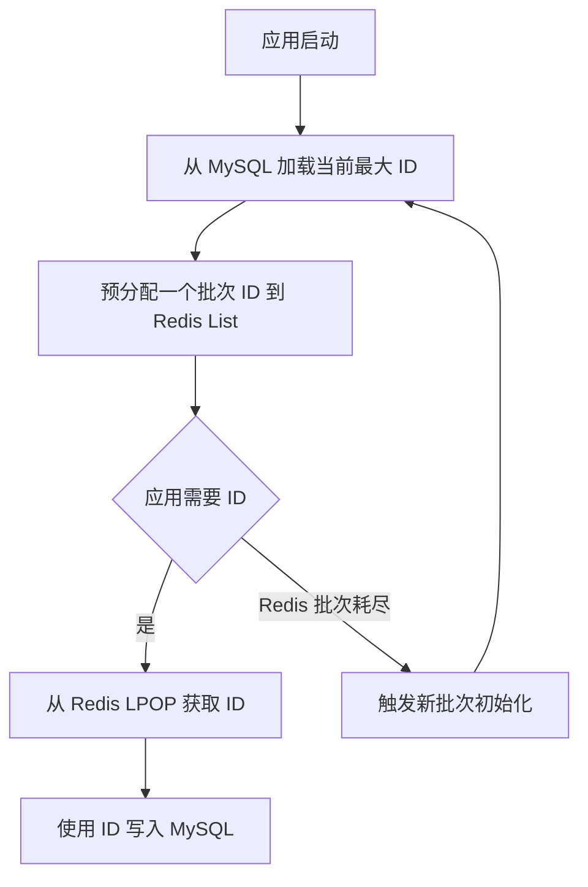
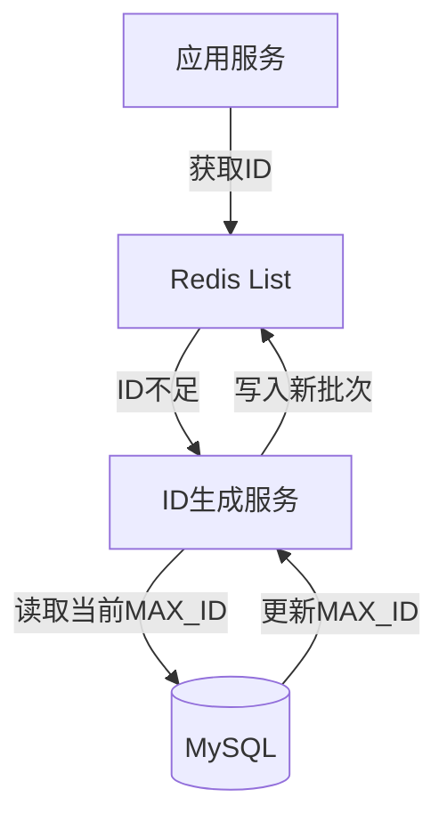
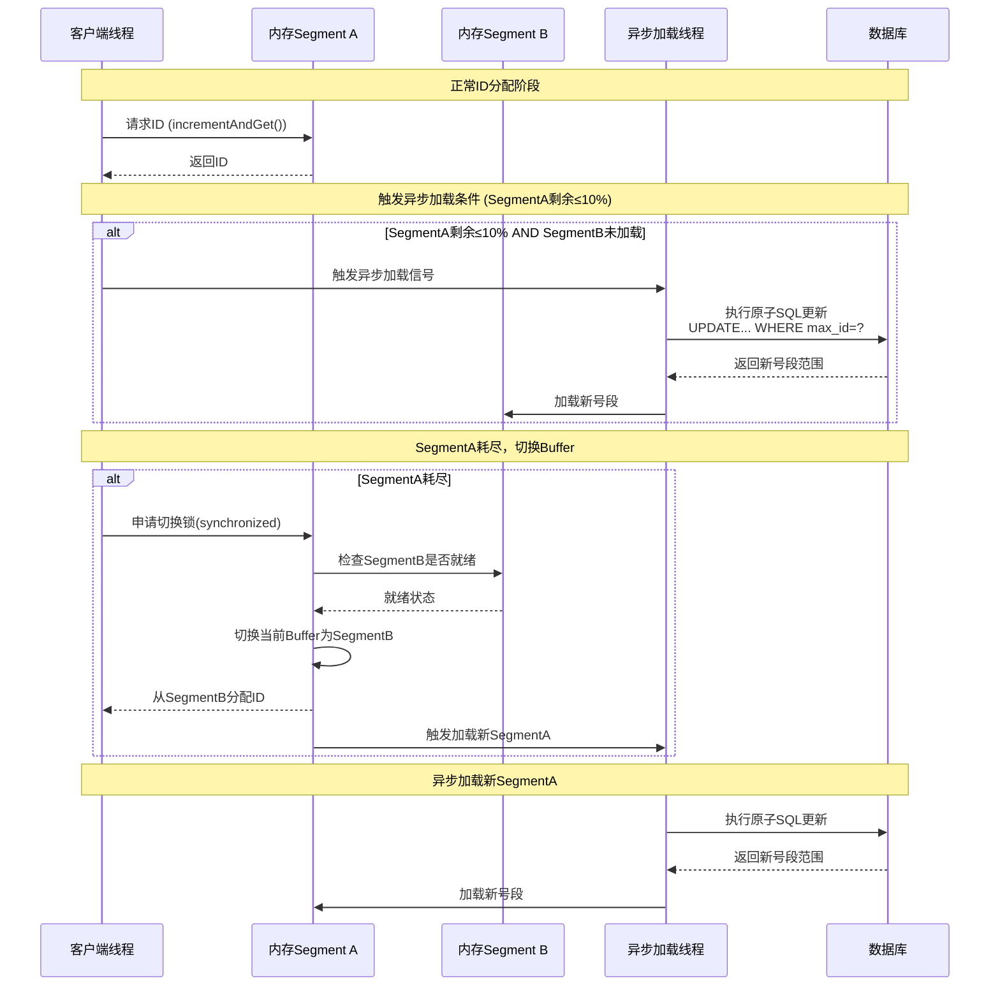

## 信创序列化改造

基于 DeepSeek 提问得到的方案

问题一：


### 技术选型

在将 Oracle 迁移到 MySQL 的过程中，序列化（Sequence）功能的改造是关键挑战之一。以下是五种主流改造方案，每种方案都包含详细实现和适用场景分析：

------

#### 方案 1：单表自增

**适用场景**：单表主键自增需求

```sql
-- 建表时定义自增主键
CREATE TABLE orders (
  id BIGINT PRIMARY KEY AUTO_INCREMENT,  -- 自增列
  order_no VARCHAR(20) NOT NULL
);

-- 插入数据（无需指定ID）
INSERT INTO orders (order_no) VALUES ('ORD20230714001');
SELECT LAST_INSERT_ID();  -- 获取刚插入的ID
```

**优点**：

- 原生支持，零开发成本
- 高性能（InnoDB优化）
- 保证单表内连续递增

**缺点**：

- 无法跨表共享序列
- 分布式环境下需特殊处理（步长设置）
- 批量插入时无法获取所有ID

------

#### 方案 2：序列模拟表（通用方案）

**适用场景**：需要跨表共享序列

```sql
-- 创建序列管理表
CREATE TABLE sequences (
  name VARCHAR(50) PRIMARY KEY,
  value BIGINT NOT NULL DEFAULT 1000,
  step INT NOT NULL DEFAULT 1
);

-- 插入订单序列
INSERT INTO sequences(name) VALUES ('order_seq');
```

**Java 获取下一个序列值**：

```sql
public Long nextVal(String seqName) {
    jdbcTemplate.update(
        "UPDATE sequences SET value = LAST_INSERT_ID(value + step) WHERE name = ?", 
        seqName
    );
    return jdbcTemplate.queryForObject(
        "SELECT LAST_INSERT_ID()", Long.class
    );
}
```

**优点**：

- 完美模拟Oracle序列行为
- 支持跨业务共享
- 可自定义步长

**缺点**：

- 高并发下有锁竞争
- 需额外维护序列表

------

#### 方案 3：分布式ID生成器（高并发方案）

**适用场景**：分布式系统、高并发场景

##### 3.1 Snowflake 算法实现

```java
public class SnowflakeIdGenerator {
    private final long datacenterId;
    private final long workerId;
    private long sequence = 0L;
    
    public synchronized long nextId() {
        long timestamp = System.currentTimeMillis();
        // 41位时间戳 | 5位数据中心 | 5位机器ID | 12位序列号
        return ((timestamp - 1288834974657L) << 22) 
               | (datacenterId << 17) 
               | (workerId << 12) 
               | (sequence++ & 4095);
    }
}
```

##### 3.2 美团Leaf方案（DB+缓存）



**优点**：

- 完全分布式，无单点瓶颈
- 高性能（10万+/秒）
- 时间有序

**缺点**：

- 实现复杂度高
- Snowflake依赖时钟同步

------

#### 方案 4：Redis 原子计数器（高性能方案）

**适用场景**：需要极高吞吐量的ID生成

```java
public class RedisSequence {
    private final RedisTemplate<String, Long> redisTemplate;
    
    public Long nextVal(String bizType) {
        String key = "seq:" + bizType;
        return redisTemplate.opsForValue().increment(key, 1);
    }
    
    // 批量获取
    public List<Long> nextBatch(String bizType, int size) {
        String key = "seq:" + bizType;
        Long end = redisTemplate.opsForValue().increment(key, size);
        return LongStream.rangeClosed(end - size + 1, end)
                         .boxed().collect(Collectors.toList());
    }
}
```

**持久化保障**：

```bash
# Redis配置
appendonly yes
appendfsync everysec
```

**优点**：

- 超高性能（10万+ QPS）
- 支持批量获取
- 原子操作保证唯一性

**缺点**：

- 引入新组件依赖
- 宕机可能导致序列断层

------

#### 方案 5：数据库函数模拟（兼容方案）

**适用场景**：需要最大程度兼容Oracle语法

```SQL
-- 创建序列函数
DELIMITER $$
CREATE FUNCTION nextval(seq_name VARCHAR(50)) 
RETURNS BIGINT
BEGIN
    UPDATE sequences 
    SET value = @next_val := value + step 
    WHERE name = seq_name;
    RETURN @next_val;
END$$
DELIMITER ;

-- 使用方式（类似Oracle）
INSERT INTO orders (id, order_no)
VALUES (nextval('order_seq'), 'ORD20230714001');
```

**优点**：

- 语法级兼容
- 无需修改应用代码
- 保持事务一致性

**缺点**：

- 函数调用有性能开销
- 高并发下仍有锁竞争

------

### 方案对比决策表

| **维度**   | 自增主键 | 序列表   | 分布式ID | Redis  | 函数模拟 |
| :--------- | :------- | :------- | :------- | :----- | :------- |
| 性能       | ★★★★☆    | ★★☆☆☆    | ★★★★★    | ★★★★★  | ★★☆☆☆    |
| 分布式支持 | ✘        | ✘        | ✔        | ✔      | ✘        |
| 跨表共享   | ✘        | ✔        | ✔        | ✔      | ✔        |
| 连续性保证 | ✔        | ✔        | ✘        | ✘      | ✔        |
| 迁移成本   | 低       | 中       | 高       | 中     | 低       |
| 适用QPS    | < 1k     | < 500    | > 10万   | > 10万 | < 300    |
| 典型场景   | 单表主键 | 中小系统 | 微服务   | 高并发 | 兼容迁移 |


### 混合实施方案（推荐）



**实施建议**：

1. **主键字段**：优先使用 `AUTO_INCREMENT`
2. **业务流水号**：
   - 高并发：Redis 原子计数器
   - 低并发：序列表 + 函数封装
3. **分布式ID**：Snowflake/Leaf 方案
4. **财务系统**：严格连续场景使用序列表 + 悲观锁


**迁移注意事项**

```sql
-- 从Oracle导入序列当前值
INSERT INTO sequences(name, value)
SELECT 'order_seq', last_number 
FROM oracle_sequences 
WHERE sequence_name = 'ORDER_SEQ';
```


## 方案选择

**Redis 批量预生成**：将 Oracle 的序列（Sequence）迁移到 MySQL 时，改用 Redis 批量缓存序列号（预生成一批 ID 存入 Redis，应用使用时直接从中分配）是一种常见优化策略，但其利弊需要结合场景权衡：


### 方案优劣

**优势**

1. **性能大幅提升**
   - Redis 基于内存操作，分配 ID 的速度远高于 MySQL 的自增字段或模拟序列（如 `AUTO_INCREMENT` 或 `LAST_INSERT_ID()`）。
   - **适用场景**：高并发业务（如订单号生成、秒杀系统），可避免数据库成为瓶颈。
2. **解决 MySQL 自增 ID 的局限性**
   - MySQL 的 `AUTO_INCREMENT` 在分布式环境下难以保证全局唯一（需分库分表），而 Redis 可通过原子操作（`INCRBY`）生成全局唯一批次号，结合预分配机制实现高效分发。
3. **降低数据库压力**
   - 批量初始化后，短时间内的 ID 分配无需访问 MySQL，减少磁盘 I/O 和连接数消耗。
4. **灵活控制 ID 规则**
   - 可自定义 ID 格式（如时间戳+序列号），而不仅限于数字，Redis 的灵活性优于数据库原生序列。


**劣势**

1. **数据一致性与可靠性风险**
   - **Redis 数据丢失**：若未配置持久化（AOF/RDB），宕机可能导致未使用的序列号丢失，造成 ID 断层（业务是否容忍？）。
   - **双写一致性问题**：Redis 分配的 ID 最终需写入 MySQL，需确保 Redis 与 MySQL 之间的状态同步（如：Redis 分配 ID 后业务失败，MySQL 未插入，导致 ID 浪费）。
2. **复杂度增加**
   - **系统复杂性**：需额外维护 Redis 集群和高可用机制（哨兵/集群模式），增加运维成本。
   - **初始化逻辑**：需实现批次号预生成服务（如从 MySQL 获取起始值，计算批次范围），逻辑比直接使用数据库序列更复杂。
3. **批量分配策略的挑战**
   - **批次大小难权衡**：
     - 批次过大 → Redis 内存占用高，且服务重启时浪费更多 ID。
     - 批次过小 → 频繁访问 MySQL 初始化新批次，丧失性能优势。
   - **动态调整**：需根据业务流量动态调整批次大小（如低峰期减少预生成量）。
4. **分布式环境下的并发问题**
   - 多实例应用同时从 Redis 取号时，需用 `LPOP`（列表） 或 `INCR`（原子计数）确保线程安全，避免重复分配。
   - 跨服务部署时，需保证 Redis 集群的全局可用性。


### 关键决策建议

**适合使用 Redis 方案的情况：**

- 业务对 **ID 连续性无严格要求**（允许少量断层）。
- 并发量高（如 QPS > 1k），数据库压力成为瓶颈。
- 已存在 Redis 基础设施，团队具备运维能力。

**应谨慎或避免的情况：**

- 金融/交易系统要求 **严格连续的 ID**（如对账依赖连续流水号）。
- 系统容忍度低，无法接受 ID 丢失或重复（需引入更复杂的分布式事务方案）。
- 资源有限，无法保证 Redis 高可用。


### 优化实践方案




1. **初始化批次**

   ```sql
   -- MySQL 中管理批次起始值
   REPLACE INTO id_generator(biz_type, max_id) VALUES ('order', 10000);
   ```

   程序

   ```java
   // 应用初始化：从 MySQL 获取 max_id，预分配 1000 个 ID 到 Redis
   Long startId = mysql.getMaxId("order");
   redis.lpush("order_ids", generateIds(startId, 1000)); // 生成 [startId+1, startId+1000]
   mysql.updateMaxId("order", startId + 1000); // 更新 MySQL
   ```

2. **ID 分配与容灾**

   - 使用 Redis 的 `LPOP` 分配 ID（线程安全）。
   - 通过 **异步任务** 监控 Redis 剩余 ID 量，低于阈值时自动补充批次。
   - 配置 Redis **AOF 持久化** + **RDB 备份**，减少数据丢失风险。

3. **异常处理**

   - Redis 宕机时，**降级到 MySQL 临时分配**（性能下降但服务可用）。
   - 定期扫描 MySQL 与 Redis 的 ID 使用差距，修复不一致。


## 具体实现

下面是一个基于 Spring Boot + Redis + MySQL 实现的分布式序列服务完整代码示例，包含初始化、分配、批次补充和容错机制

### 架构设计




### 核心代码

#### 1. MySQL 表结构

```sql
CREATE TABLE id_generator (
  id BIGINT NOT NULL AUTO_INCREMENT,
  biz_type VARCHAR(50) NOT NULL COMMENT '业务类型',
  max_id BIGINT NOT NULL COMMENT '当前最大ID',
  step INT NOT NULL COMMENT '批次大小',
  update_time TIMESTAMP DEFAULT CURRENT_TIMESTAMP,
  PRIMARY KEY (id),
  UNIQUE KEY uniq_biz_type (biz_type)
) ENGINE=InnoDB;

-- 初始化示例数据
INSERT INTO id_generator(biz_type, max_id, step) 
VALUES ('order', 10000, 1000);
```

#### 2. Spring Boot 应用配置

**pom.xml 依赖**

```xml
<dependencies>
    <dependency>
        <groupId>org.springframework.boot</groupId>
        <artifactId>spring-boot-starter-data-redis</artifactId>
    </dependency>
    <dependency>
        <groupId>org.springframework.boot</groupId>
        <artifactId>spring-boot-starter-jdbc</artifactId>
    </dependency>
    <dependency>
        <groupId>mysql</groupId>
        <artifactId>mysql-connector-java</artifactId>
    </dependency>
</dependencies>
```

**application.yml**

```yaml
spring:
  redis:
    host: localhost
    port: 6379
    timeout: 2000
  datasource:
    url: jdbc:mysql://localhost:3306/id_db?useSSL=false
    username: root
    password: root
    driver-class-name: com.mysql.cj.jdbc.Driver
```

#### 3. 核心服务实现

```java
@Service
public class DistributedIdService {

    private static final Logger log = LoggerFactory.getLogger(DistributedIdService.class);
    private static final String ID_PREFIX = "id:%s";
    private static final int DEFAULT_STEP = 1000;
    private static final int LOW_WATER_MARK = 200; // 低水位阈值

    @Autowired
    private StringRedisTemplate redisTemplate;
    
    @Autowired
    private JdbcTemplate jdbcTemplate;
    
    private final Map<String, Boolean> loadingMap = new ConcurrentHashMap<>();
    
    /**
     * 获取下一个ID
     */
    public long nextId(String bizType) {
        String key = String.format(ID_PREFIX, bizType);
        
        // 尝试从Redis获取ID
        Long id = redisTemplate.opsForList().leftPop(key);
        
        if (id != null) {
            // 检查是否需要异步补充批次
            checkAndRefill(bizType, key);
            return id;
        }
        
        // 同步加载新批次
        return syncLoadBatch(bizType);
    }
    
    /**
     * 检查并异步补充批次
     */
    private void checkAndRefill(String bizType, String key) {
        Long remain = redisTemplate.opsForList().size(key);
        if (remain != null && remain <= LOW_WATER_MARK) {
            // 异步加载新批次
            CompletableFuture.runAsync(() -> {
                // 如果 Key 不存在则添加 Key，并加载数据
                if (loadingMap.putIfAbsent(bizType, true) == null) {
                    try {
                        loadBatchToRedis(bizType);
                    } finally {
                        loadingMap.remove(bizType);
                    }
                }
            });
        }
    }
    
    /**
     * 同步加载批次（阻塞式）
     */
    private long syncLoadBatch(String bizType) {
      	// 此处的锁不是分布式锁，可能会存在多个服务器同时加载批次号。
        synchronized (bizType.intern()) {
            // 双重检查，避免重复初始化，提升性能。
            Long id = redisTemplate.opsForList().leftPop(
                String.format(ID_PREFIX, bizType));
            if (id != null) return id;
            
            // 加载新批次
            loadBatchToRedis(bizType);
            
            // 再次尝试获取
            id = redisTemplate.opsForList().leftPop(
                String.format(ID_PREFIX, bizType));
            if (id != null) return id;
            
            throw new RuntimeException("ID生成失败，请重试");
        }
    }
    
    /**
     * 核心：加载批次到Redis，分布式锁来保证数据的一致性。
     */
    private void loadBatchToRedis(String bizType) {
        // 1. 从数据库获取当前最大ID和步长
        IdRange range = fetchNextRange(bizType);
        
        // 2. 生成ID列表
        List<Long> idList = LongStream.rangeClosed(
            range.startId, range.endId)
            .boxed()
            .collect(Collectors.toList());
        Collections.reverse(idList); // 保证LPOP顺序正确
        
        // 3. 批量写入Redis
        String key = String.format(ID_PREFIX, bizType);
        redisTemplate.opsForList().rightPushAll(key, 
            idList.stream().map(String::valueOf).toArray(String[]::new));
        
        log.info("Loaded {} IDs for {} [{} - {}]", 
            idList.size(), bizType, range.startId, range.endId);
    }
    
    /**
     * 数据库获取下一个ID范围（带分布式锁）
     */
    private IdRange fetchNextRange(String bizType) {
        return jdbcTemplate.execute((ConnectionCallback<IdRange>) conn -> {
            try {
                // 开启事务
                conn.setAutoCommit(false);
                
                // 使用SELECT FOR UPDATE加锁
                String sql = "SELECT max_id, step FROM id_generator "
                    + "WHERE biz_type = ? FOR UPDATE";
                PreparedStatement ps = conn.prepareStatement(sql);
                ps.setString(1, bizType);
                ResultSet rs = ps.executeQuery();
                
                if (!rs.next()) {
                    throw new RuntimeException("未找到业务类型: " + bizType);
                }
                
                long currentMax = rs.getLong("max_id");
                int step = rs.getInt("step");
                if (step <= 0) step = DEFAULT_STEP;
                
                long newMax = currentMax + step;
                
                // 更新数据库
                String updateSql = "UPDATE id_generator SET max_id = ? "
                    + "WHERE biz_type = ?";
                try (PreparedStatement ups = conn.prepareStatement(updateSql)) {
                    ups.setLong(1, newMax);
                    ups.setString(2, bizType);
                    ups.executeUpdate();
                }
                
                conn.commit();
                
                return new IdRange(currentMax + 1, newMax);
            } catch (SQLException e) {
                conn.rollback();
                throw new RuntimeException("获取ID范围失败", e);
            }
        });
    }
    
    // ID范围对象
    private static class IdRange {
        final long startId;
        final long endId;
        
        IdRange(long startId, long endId) {
            this.startId = startId;
            this.endId = endId;
        }
    }
}
```

#### 4. 容错增强处理

```java
@Component
public class IdGeneratorHealthCheck {

    @Autowired
    private DistributedIdService idService;
    @Autowired
    private StringRedisTemplate redisTemplate;
    
    @Scheduled(fixedRate = 300_000) // 每5分钟检查一次
    public void checkIdUsage() {
        checkBusinessType("order");
        // 添加其他业务类型...
    }
    
    private void checkBusinessType(String bizType) {
        String key = String.format("id:%s", bizType);
        Long remain = redisTemplate.opsForList().size(key);
        
        // Redis中无ID时直接加载批次
        if (remain == null || remain == 0) {
            idService.loadBatchToRedis(bizType);
            return;
        }
        
        // 检查MySQL与Redis的ID差距
        Long maxIdInRedis = getMaxIdInRedis(key);
        Long dbMaxId = getDbMaxId(bizType);
        
        // 如果Redis中的最大ID接近数据库记录值，提前加载
        if (dbMaxId - maxIdInRedis < 500) { 
            idService.loadBatchToRedis(bizType);
        }
    }
    
    private Long getMaxIdInRedis(String key) {
        // 获取Redis中最大ID（最后一个元素）
        String lastId = redisTemplate.opsForList().index(key, -1);
        return lastId != null ? Long.parseLong(lastId) : 0L;
    }
    
    private Long getDbMaxId(String bizType) {
        String sql = "SELECT max_id FROM id_generator WHERE biz_type = ?";
        return jdbcTemplate.queryForObject(sql, Long.class, bizType);
    }
}
```

#### 5. 降级策略（Spring Cloud Hystrix）

```java
@Service
public class FallbackIdService {
    
    @Autowired
    private DistributedIdService distributedIdService;
    
    // 本地自增作为降级方案
    private final AtomicLong fallbackCounter = new AtomicLong(100_000_000L);
    
    @HystrixCommand(fallbackMethod = "localNextId")
    public long getNextId(String bizType) {
        return distributedIdService.nextId(bizType);
    }
    
    // 降级方法：使用本地计数器+随机数
    private long localNextId(String bizType) {
        log.warn("Using local ID generator for {}", bizType);
        return System.currentTimeMillis() * 10000 + 
               fallbackCounter.incrementAndGet() % 10000;
    }
  
  
  
  
}
```

### 使用示例

```java
@RestController
@RequestMapping("/order")
public class OrderController {
    
    @Autowired
    private FallbackIdService idService;
    
    @PostMapping
    public Order createOrder(@RequestBody Order order) {
        // 获取分布式ID
        long orderId = idService.getNextId("order");
        order.setId(orderId);
        // 保存到数据库...
        return order;
    }
}
```


## 美团 Leaf 方案

美团Leaf是美团点评开源的高性能分布式ID生成系统，旨在解决分布式环境下全局唯一ID的生成问题。其设计兼顾高可用、低延迟和易扩展性，支持两种核心模式：**号段模式（Segment）**和**雪花模式（Snowflake）**。以下从核心架构、工作原理、优化策略到实践部署进行详细解析

------

### ⚙️ 一、核心架构与模式

#### 1. **号段模式（Segment Mode）**

**核心思想**：通过批量预加载ID区间（号段）到内存，减少数据库访问频率。

- **数据库设计**：
  创建表`leaf_alloc`管理各业务的号段分配：

  ```sql
  CREATE TABLE `leaf_alloc` (
    `biz_tag` VARCHAR(128) PRIMARY KEY,  -- 业务标识（如订单、用户）
    `max_id` BIGINT NOT NULL,           -- 当前最大ID
    `step` INT NOT NULL,                -- 号段长度（每次申请的ID数量）
    `description` VARCHAR(256),
    `update_time` TIMESTAMP DEFAULT CURRENT_TIMESTAMP
  );
  ```
  
- **工作流程**：

  1. **加载号段**：服务启动时，执行原子操作更新并获取号段：

     ```sql
      BEGIN;
     UPDATE leaf_alloc SET max_id = max_id + step WHERE biz_tag = 'order_tag';
     SELECT biz_tag, max_id, step FROM leaf_alloc WHERE biz_tag = 'order_tag';
     COMMIT;
     ```
     
  2. **双Buffer机制**：

     - 当前号段消耗至10%时，异步预加载下一个号段。
   - 双Buffer交替使用，确保DB故障时仍有一个Buffer可分配ID。
  
  3. **动态调整Step**：根据号段消耗周期（T）自动调整步长：

     - T < 15min → `step = step * 2`
   - T > 30min → `step = step / 2`

#### 2. **雪花模式（Snowflake Mode）**

**核心思想**：基于Twitter Snowflake算法，完全分布式生成趋势递增的64位ID3912。

- **ID结构**：1位（符号位）  41位（时间戳）  5位（机房ID）  5位（机器ID）  12位（序列号）
  - 时间戳：当前时间减去固定起始时间（如2020-01-01）。
  - 机器ID：通过ZooKeeper分配或手动配置，保证全局唯一。
- **关键问题解决**：
  - **时钟回拨**：
    - 短时间回拨（≤2秒）：等待时钟同步912。
    - 长时间回拨：抛出异常，需人工介入。
  - **机器ID管理**：
    - 首次启动从ZooKeeper获取并缓存至本地文件，实现弱依赖。

------

### ⚡ 二、高性能与高可用优化

#### 1. **号段模式优化**

- **双Buffer异步加载**：
  - 避免号段耗尽时才同步阻塞更新DB，将DB访问耗时（TP99）从百毫秒级降至毫秒内。
- **动态Step调整**：
  - 根据QPS自动伸缩号段长度，使号段消耗周期稳定在15-30分钟。
- **容灾能力**：
  - 推荐号段长度 = 高峰期QPS × 600（支撑10分钟），即使DB宕机服务仍可持续运行。

#### 2. **Snowflake模式优化**

- **弱依赖ZK**：首次获取workerID后本地缓存，避免ZK故障影响服务。
- **NTP强制时钟同步**：所有节点必须启用NTP服务，禁止手动修改时间。

#### 3. **MySQL高可用**

- **半同步复制 + MHA**：确保主从切换时数据一致性。
- **多机房部署**：跨机房同步数据，防止单机房故障。

------

### 🚀 三、部署与使用

#### 1. **快速部署（以Docker为例）**

```bash
git clone https://github.com/Meituan-Dianping/Leaf.git
cd leaf/leaf-docker
chmod +x build.sh && ./build.sh
docker-compose up -d
```

#### 2. **配置说明（leaf.properties）**

```properties
# 号段模式配置
leaf.segment.enable=true
leaf.jdbc.url=jdbc:mysql://localhost:3306/leaf_db
leaf.jdbc.username=root
leaf.jdbc.password=123456

# Snowflake模式配置
leaf.snowflake.enable=true
leaf.snowflake.zk.address=127.0.0.1:2181
```

#### 3. **API调用示例**

- **号段模式**：

  ```bash
  curl http://localhost:8080/api/segment/get/order_tag
  ```
  
- **Snowflake模式**：

  ```bash
  curl http://localhost:8080/api/snowflake/get/test
  ```

#### 4. **Spring Boot集成**

```xml
<dependency>
    <groupId>com.sankuai.inf.leaf</groupId>
    <artifactId>leaf-core</artifactId>
    <version>1.0.0-RELEASE</version>
</dependency>
```

------

### 📊 四、适用场景对比

| **维度**       | **号段模式**                 | **Snowflake模式**                  |
| :------------- | :--------------------------- | :--------------------------------- |
| **性能**       | 10万+ QPS（TP99≈0.3ms）      | 50万+ QPS（TP99≈0.1ms）            |
| **数据库依赖** | 强依赖（需MySQL高可用）      | 无依赖                             |
| **ID连续性**   | 趋势递增                     | 趋势递增                           |
| **适用场景**   | 订单ID、用户ID（容忍DB依赖） | 日志追踪、实时消息（极致性能需求） |
| **安全性**     | ID可预测（需业务层加密）     | 时间戳暴露业务时间                 |

------

### 🔧 五、生产环境最佳实践

1. **号段长度设置**：
   - 公式：`step = max(1000, 峰值QPS × 600)` 。
   - 例：QPS=1万 → step=60万（支撑10分钟）。
2. **监控与告警**：
   - 通过Leaf内置Web界面实时查看号段水位（如`http://localhost:8080/cache`）。
   - 集成Prometheus监控ID生成速率、剩余号段占比。
3. **高可用部署**：
   - 至少部署3节点，通过Nginx负载均衡。
   - 多机房部署数据库实例，防止网络分区故障。

------

### 💎 总结

Leaf通过 **号段模式** 和 **Snowflake模式** 的互补设计，覆盖了从高并发业务到无状态服务的全场景需求：

- **号段模式**以数据库为基石，通过双Buffer和动态Step优化，实现高可用与低延迟的平衡；
- **Snowflake模式**以去中心化架构达成极致性能，通过弱依赖ZK和时钟回拨处理保障稳定性3912。

> **开源地址**：[Meituan-Dianping/Leaf](https://github.com/Meituan-Dianping/Leaf)
> **扩展建议**：金融类业务可组合使用两种模式——Snowflake生成日志追踪ID，号段模式生成需严格连续的订单ID。


## 号段模式的线程安全问题

美团Leaf的号段模式通过“双Buffer机制 + 分段锁 + 原子操作”的组合策略解决线程安全问题，确保高并发下ID分发的正确性。具体实现如下：

------

### ⚙️ **1. 双Buffer机制（核心隔离策略）**

- **设计原理**：
  - 内存中维护**两个号段缓存区（Segment Buffer）**：当前使用的`Buffer`（Segment A）和预备`Buffer`（Segment B）。
  - 当Segment A消耗至 **10%**（如1000个ID消耗100个）时，**异步触发**Segment B的号段加载，与主线程解耦247。
- **线程安全作用**：
  - **读写分离**：主线程仅从Segment A分配ID，异步线程独立加载Segment B，避免加载过程阻塞ID分配。
  - **无缝切换**：当Segment A耗尽时，直接切换到已准备好的Segment B，无需等待数据库响应（切换过程通过锁控制，见下文）。

------

### 🔒 **2. 分段锁（同步控制）**

- **关键场景**：
  - **号段切换**：当Segment A耗尽需切换至Segment B时，通过`synchronized`或`ReentrantLock`对切换逻辑加锁，确保同一时刻只有一个线程执行切换37。
  - **异步加载防重**：异步线程加载新号段前，通过`ConcurrentHashMap`记录加载状态（如`loadingMap.putIfAbsent(biz_tag, true)`），防止并发重复加载7。
- **锁粒度**：以业务标签`biz_tag`为维度加锁，不同业务互不影响。

------

### ⚛️ **3. 原子操作（ID分配）**

- **本地ID分发**：
  - 每个号段在内存中使用`AtomicLong`生成自增ID（如从`startId`到`endId`）。
  - 通过`incrementAndGet()`实现线程安全的递增值分配，避免并发冲突67。

------

### 🛡️ **4. 数据库更新隔离（分布式一致性）**

- **乐观锁保证唯一性**：

  - 加载新号段时，执行原子SQL操作：

    sql

    ```
    UPDATE leaf_alloc SET max_id = max_id + step 
    WHERE biz_tag = #{tag} AND max_id = #{old_max_id}
    ```

    通过`max_id = #{old_max_id}`条件实现乐观锁，若更新失败则重试，避免多节点或线程分配重叠号段68。

- **事务隔离**：更新与查询在同一个事务中完成（`BEGIN; UPDATE... SELECT... COMMIT;`），确保数据一致性28。

------

### 🧪5. 线程安全流程示例




#### 关键流程说明：

1. **正常分配阶段**：

   - 客户端直接从 Segment A 获取 ID（使用 `AtomicLong.incrementAndGet()`）
   - 无锁操作，性能最优路径

2. **异步加载触发**：

   - 当 Segment A 剩余 ID ≤ 10% 时触发
   - 异步线程独立执行数据库操作（使用乐观锁）
   - 主分配线程不受影响

3. **安全切换阶段**：

   - 当 Segment A 耗尽时需切换 Buffer
   - 通过 `synchronized` 加锁保证切换原子性
   - 检查 Segment B 是否已加载就绪

4. **无缝切换**：

   - 切换完成后立即从 Segment B 分配 ID
   - 同时触发异步加载新 Segment A

5. **异步加载**：

   - 独立线程执行数据库操作
   - 使用乐观锁保证号段全局唯一
   - 加载完成后 Segment A 重新可用

   

#### 线程安全保证点：

1. **ID分配原子性**：

   ```java
   // 使用AtomicLong保证单号段内ID分配安全
   public long nextId() {
       long current = currentValue.incrementAndGet();
       if (current <= endId) {
           return current;
       }
       // 切换逻辑...
   }
   ```

2. **Buffer切换锁**：

   ```java
   // 基于biz_tag的分段锁
   private final Object switchLock = new Object();
   
   public long nextId() {
       // ...
       synchronized (switchLock) {
           // 1. 双重检查
           // 2. 切换Buffer
           // 3. 触发异步加载
       }
   }
   ```

3. **异步加载防重**：

   ```java
   private final ConcurrentHashMap<String, Boolean> loadingMap = new ConcurrentHashMap<>();
   
   void asyncLoadSegment() {
       if (loadingMap.putIfAbsent(bizTag, true) == null) {
           try {
               // 加载号段
           } finally {
               loadingMap.remove(bizTag);
           }
       }
   }
   ```

4. **数据库乐观锁**：

   ```java
   UPDATE leaf_alloc 
   SET max_id = max_id + step 
   WHERE biz_tag = 'order' AND max_id = #{oldMaxId}
   -- 更新影响行数为0时重试
   ```

这种设计实现了：

- 无锁分配（99%时间）
- 安全切换（1%时间加锁）
- 零阻塞等待
- 分布式环境下的号段唯一性

------

### 💎 **总结：方案优势**

| **机制**         | **解决的核心问题**     | **性能影响**             |
| :--------------- | :--------------------- | :----------------------- |
| 双Buffer         | 异步加载与ID分配解耦   | 无阻塞分配，TP99≤1ms2    |
| 分段锁           | 切换Buffer时的竞态条件 | 仅切换时短暂加锁         |
| 原子操作(Atomic) | 内存ID分配的并发冲突   | 无锁快路径，支持10万+QPS |
| 数据库乐观锁     | 分布式环境号段唯一性   | 数据库压力降至1/step     |

> 该方案在美团内部支撑金融、外卖等高并发场景，单节点QPS可达5万+，且数据库宕机时仍能通过双Buffer维持10-20分钟服务48。


