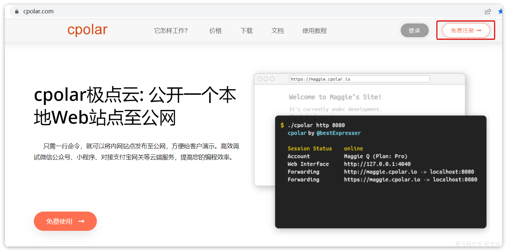
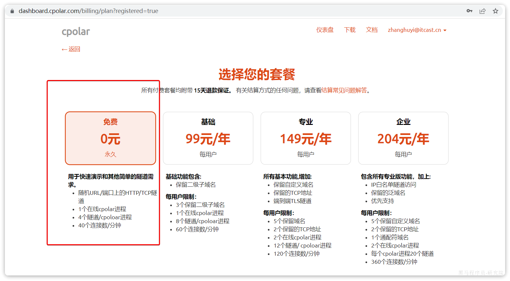
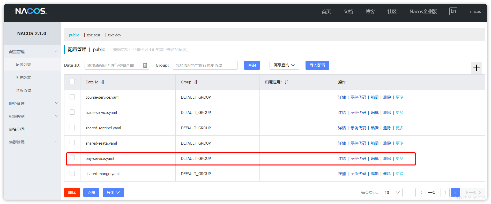
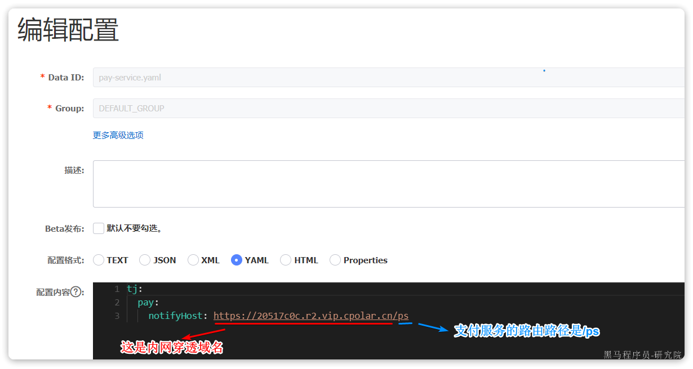

# 0.背景说明

项目中的支付模块在于第三方支付服务通信时，为了确保支付、退款等业务能及时得到业务执行结果，支持两种业务模式：

- 基于第三方的回调通知
- 主动轮询

以上两种模式默认都已开启，但是回调模式依赖于内网穿透，需要大家配置内网穿透信息。当然，如果不配置也可以，此时走轮询模式，查询支付或退款结果可能会有一定的延时（一般延时不超过30秒）。

接下来，我们介绍一下项目中的内网穿透配置方式。

# 1.注册并开通隧道

项目中采用的内网穿透工具是Cpolar，完全免费：

https://www.cpolar.com/

大家首先登陆该网站，并注册一个账号：



注册成功后，会跳转到套餐购买页面：



选择免费套装，然后确定：


然后，会跳转到控制台页面：


**注意**，第三步的**authtoken**是你的账户唯一标示，非常重要。**其它几步大家无需操作**，我已经在虚拟机中给大家安装好了cpolar.

# 2.配置cpolar

在我给大家提供的虚拟机环境中，已经安装好了cpolar，大家只需要完成token授权即可。

在虚拟机中执行命令：

```Bash
# 注意，将后面的token换成你的真实token
cpolar authtoken MGYZYzBmMjTtM2E30C00MZjO....xxxx
```

然后配置cpolar开启自启：

```Bash
systemcmtl enable cpolar
```

接着，启动cpolar

```Bash
systemctl start cpolar
```

然后，访问Cpolar的控制台页面：http://192.168.150.101:9500，会进入一个登录页面：


使用你自己的Cpolar账号登录即可。

然后进入控制台， 访问《状态》-《在线隧道状态》，即可看到我提前配置好的隧道以及对应的域名：


上图中，https://20517c0c.r2.vip.cpolar.cn这个域名就映射到了http://localhost:10010，也就是本地的网关微服务。也就是说，以后我们访问这个域名就是在访问网关了，只要加上对应的接口路径，即可实现对微服务的访问。

注意，由于我们是免费的隧道，所以每次重启该域名都会变化。

# 3.设置穿透域名

最后，我们还需要把内网穿透域名配置到支付微服务的配置参数（notif-url）中。由于我们是免费的隧道，所以每次重启该域名都会变化，都需要重新配置支付的参数。

为了便于大家配置，我将这个配置交给了Nacos管理：



点击编辑，进入配置：



以后，每次重启虚拟机，都应该去cpolar的控制台查看最新的内网穿透域名，然后修改到这里。