Day05-问答系统
==============

一个人学习总是孤独的，而且往往难以åšæŒã€‚

所以我们的系统设计了一些学习辅助的功能，å¢å¼ºå­¦ä¹ çš„氛围感。包括：

- 互动问答系统
- 学习笔记系统
- 学习评测系统
- 学习积分系统
- 榜å•æ’å系统

<br/>

通过这套系统让用户感觉到自己ä¸æ˜¯ä¸€ä¸ªäººåœ¨å­¦ä¹ ï¼Œæœ‰äº’助ã€æœ‰ç«äº‰ã€æœ‰è¯„测，刺激用户æŒç»­å­¦ä¹ ï¼Œæå‡å­¦ä¹ æ•ˆæœå’Œç”¨æˆ·ç²˜åº¦ã€‚

<br/>

这套系统中包å«äº†å¾ˆå¤šä¼ä¸šä¸­é常å®ç”¨çš„解决方案和技术手段，å¯ä»¥ä¸ºå¤§å®¶ä»¥å的工作æ供很大帮助。例如：

- 互动问答功能：在社交类å‹ã€å­¦ä¹ ç±»å‹çš„互è”网项目中都有用到
- 点èµåŠŸèƒ½ï¼šç”µå•†ã€ç¤¾äº¤ã€å­¦ä¹ ç­‰ç­‰éƒ½ä¼šç”¨åˆ°
- 积分系统：电商ã€ç¤¾äº¤ã€å­¦ä¹ ç­‰é¡¹ç›®ä¸­ç”¨åˆ°
- æ’行榜系统：游æˆã€ç¤¾äº¤ã€å­¦ä¹ ç­‰é¡¹ç›®ä¸­éƒ½æœ‰ç”¨åˆ°
- 学习评测系统：考试ã€å­¦ä¹ ç±»å‹çš„项目会用到

在这些解决方案中你能解é”Redisã€MQ等热门中间件的å„ç§å„样的使用方å¼ã€‚

<br/>

今天我们首先æ¥çœ‹çœ‹äº’动问答系统的设计ä¸å®ç°ã€‚


## 需求分æ

ç»è¿‡å‡ å¤©å­¦ä¹ ï¼Œç›¸ä¿¡å¤§å®¶å¯¹äºä¸šåŠ¡å¼€å‘å·²ç»è½»è½¦ç†Ÿè·¯äº†ï¼Œæ•´ä½“æµç¨‹ä¸ä»¥å¾€ä¸€æ ·ï¼š

- 需求和åŸå‹å›¾åˆ†æ
- æ¥å£ç»Ÿè®¡å’Œè®¾è®¡
- æ•°æ®ç»“æ„设计
- æ¥å£çš„å®ç°

<br/>

### 产å“åŸå‹

我们首先看看ä¸äº’动问答有关的åŸå‹é¡µé¢ã€‚

<br/>

#### 课程详情页

在用户已ç»ç™»å½•çš„情况下，如æœç”¨æˆ·è´­ä¹°äº†è¯¾ç¨‹ï¼Œåœ¨è¯¾ç¨‹è¯¦æƒ…页å¯ä»¥çœ‹åˆ°ä¸€ä¸ªäº’动问答的选项å¡ï¼š


问答选项å¡å¦‚下：

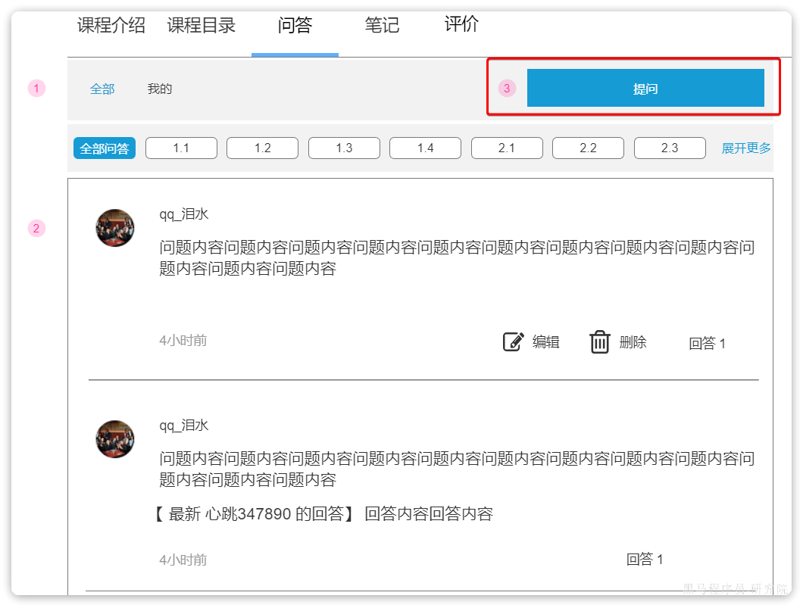

<br/>

:::warning 💡 问答列表

- 问答列表å¯ä»¥é€‰æ‹©`全部问题`还是`我的问题`，选择`我的问题`则åªå±•ç¤ºæˆ‘æ问的问题。默认是全部
- 选择章节åºå·ï¼Œæ ¹æ®ç« èŠ‚å·æŸ¥çœ‹ç« èŠ‚下对应问答。默认展示所有章节的问题
- 对äºæˆ‘æ问的问题，å¯ä»¥åšåˆ é™¤ã€ä¿®æ”¹æ“作

<br/>

💡  **跳转逻辑**

- 点击æ问按钮，进入问题编辑页é¢
- 点击问题标题，进入问题详情页
- 点击问题下的å›ç­”，进入å›ç­”表å•

:::

<br/>

点击æ问或编辑按钮会进入问题编辑页é¢ï¼š


<br/>

:::warning 💡 表å•å†…容

- 课程：问题一定关è”æ问时所在的课程，无需选择
- 章节：å¯ä»¥é€‰æ‹©æ问知识点对应的章节，也å¯ä»¥ä¸é€‰
- 问题标题：一个概括性æè¿°
- 问题详情：详细问题信æ¯ï¼Œå¯Œæ–‡æœ¬
- 是å¦åŒ¿å：用户å¯ä»¥é€‰æ‹©åŒ¿åæ问，其它用户ä¸å¯è§æ问者信æ¯

:::

<br/>

点击æŸä¸ªé—®é¢˜ï¼Œåˆ™ä¼šè¿›å…¥é—®é¢˜è¯¦æƒ…页é¢ï¼š


<br/>

:::warning 💡 页é¢å†…容

- 顶部展示问题相关详细信æ¯
- 任何人都å¯ä»¥å¯¹é—®é¢˜åšå›å¤ï¼Œä¹Ÿå¯ä»¥å¯¹ä»–人的å›ç­”å†æ¬¡å›å¤ï¼Œæ— é™å æ¥¼ã€‚
- 也没渲染åªåˆ†ä¸¤å±‚：
  - 对问题的一级å›å¤ï¼Œç§°ä¸ºå›ç­”
  - 对å›ç­”çš„å›å¤ã€å¯¹å›å¤çš„å›å¤ï¼Œä½œä¸ºç¬¬äºŒçº§ï¼Œç§°ä¸ºè¯„论
- 问题详情页下é¢å±•ç¤ºé—®é¢˜ä¸‹çš„所有å›ç­”
- 点击å›ç­”下的详情æ‰å±•ç¤ºäºŒçº§è¯„论
- å¯ä»¥å¯¹è¯„论ã€å›ç­”点èµ

:::

<br/>

#### 视频学习页

å¦å¤–，在视频学习页é¢ä¸­åŒæ ·å¯ä»¥çœ‹åˆ°äº’动问答功能：


这个页é¢ä¸è¯¾ç¨‹è¯¦æƒ…页功能类似，åªä¸è¿‡æ˜¯åœ¨è§‚看视频的过程中æ“作。用户产生学习疑问是å¯ä»¥å¿«é€Ÿæ问，ä¸ç”¨é€€å›åˆ°è¯¾ç¨‹è¯¦æƒ…页，用户体验较好。

<br/>

**页é¢é€»è¾‘**

- 默认展示视频播放å°èŠ‚下的问答
- 用户å¯ä»¥åœ¨è¿™é‡Œæ问问题，自动ä¸å½“å‰è¯¾ç¨‹ã€å½“å‰è§†é¢‘对应章节关è”。其它å‚æ•°ä¸è¯¾ç¨‹è¯¦æƒ…页的问题表å•ç±»ä¼¼ã€‚
- 问答列表默认åªæ˜¾ç¤ºé—®é¢˜ï¼Œç‚¹å‡»å进入问题详情页æ‰èƒ½æŸ¥çœ‹å…·ä½“答案

<br/>

#### 管ç†ç«¯é—®ç­”管ç†é¡µ

除了用户端以外，管ç†ç«¯ä¹Ÿå¯ä»¥ç®¡ç†äº’动问答，首先是一个列表页：

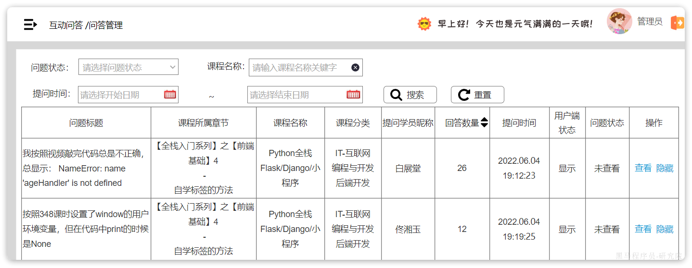

**æœç´¢**

- 管ç†å‘˜å¯ä»¥æœç´¢ç”¨æˆ·æ出的所有问题
- æœç´¢ç»“æœå¯ä»¥åŸºäºé¡µé¢è¿‡æ»¤æ¡ä»¶åšè¿‡æ»¤
  - 问题状æ€ï¼šå·²æŸ¥çœ‹ã€æœªæŸ¥çœ‹ä¸¤ç§ã€‚标示是å¦å·²ç»è¢«ç®¡ç†å‘˜æŸ¥çœ‹è¿‡ã€‚æ¯å½“学员在问题下评论，状æ€é‡ç½®ä¸ºæœªæŸ¥çœ‹
  - 课程å称：由äºé—®é¢˜æ˜¯æ问在课程下的，所以会跟课程关è”。管ç†å‘˜è¾“入课程å称，æœç´¢è¯¥è¯¾ç¨‹ä¸‹çš„所有问题
  - æ问时间：æ出问题的时间

<br/>

**页é¢åˆ—表**

- 默认按照æ问时间倒åºæ’列；点击å›ç­”æ•°é‡æ—¶å¯ä»¥æ ¹æ®å›ç­”æ•°é‡æ’åº
- 课程分类：需è¦å±•ç¤ºé—®é¢˜æ‰€å±è¯¾ç¨‹çš„三级分类的å称的拼æ¥
- 课程所å±ç« èŠ‚：如æœæ˜¯åœ¨è§†é¢‘页é¢æ问，则问题会ä¸è§†é¢‘对应的章ã€èŠ‚å…³è”，则此处显示章å称ã€èŠ‚å称。
- 课程å称：æ问是针对æŸä¸ªè¯¾ç¨‹çš„，因此此处显示对应的课程å称
- å›ç­”æ•°é‡ï¼šè¯¥é—®é¢˜ä¸‹çš„一级å›å¤ï¼Œç§°ä¸ºå›ç­”。此处显示问题下的å›ç­”çš„æ•°é‡ï¼Œå…¶å®ƒè¯„论ä¸ç»Ÿè®¡ã€‚
- 用户端状æ€ï¼šéšè—/显示。表示是å¦åœ¨ç”¨æˆ·ç«¯å±•ç¤ºï¼Œå¯¹äºä¸€äº›æ•æ„Ÿè¯é¢˜ï¼Œç®¡ç†å‘˜å¯ä»¥ç›´æ¥éšè—问题。

<br/>

**æ“作**

- 点击查看：会将该问题标记为已查看状æ€ï¼Œå¹¶ä¸”跳转到问题详情页
- 点击éšè—或显示：æ§åˆ¶è¯¥é—®é¢˜æ˜¯å¦åœ¨ç”¨æˆ·ç«¯æ˜¾ç¤ºã€‚éšè—问题，则问题下的所有å›ç­”å’Œæ¢å¤éƒ½è¢«éšè—

<br/>

点击查看按钮，会进入一个问题详情页é¢ï¼š


<br/>

问题详情

- 页é¢é¡¶éƒ¨æ˜¯é—®é¢˜è¯¦æƒ…，展示信æ¯ä¸é—®é¢˜åˆ—表页基本一致
- 点击评论，è€å¸ˆå¯ä»¥å›ç­”问题
- 点击éšè—/显示，å¯ä»¥éšè—或显示问题

å›ç­”列表

- 分页展示问题下的å›ç­”（一级å›å¤ï¼‰
- å¯ä»¥å¯¹å›ç­”点èµã€è¯„论ã€éšè—
- 点击查看，则进入å›ç­”详情页

<br/>

继续点击查看更多按钮，å¯ä»¥è¿›å…¥å›ç­”详情页：


**å›ç­”详情**

- 页é¢é¡¶éƒ¨æ˜¯å›ç­”详情，展示信æ¯ä¸å›ç­”列表页基本一致
- 点击我æ¥è¯„论，è€å¸ˆå¯ä»¥è¯„论该å›ç­”
- 点击éšè—/显示，å¯ä»¥éšè—或显示该å›ç­”，该å›ç­”下的所有评论也都会被éšè—或显示

**评论列表**

- 分页展示å›ç­”下的评论
- å¯ä»¥å¯¹è¯„论点èµã€å›å¤ã€éšè—

<br/>

#### æµç¨‹æ€»ç»“

整体æ¥è¯´ï¼Œæµç¨‹æ˜¯è¿™æ ·çš„：

- 学员在学习的过程中å¯ä»¥éšæ—¶æ问问题
- è€å¸ˆã€å…¶ä»–学员都å¯ä»¥å›ç­”问题
- è€å¸ˆã€å­¦å‘˜ä¹Ÿéƒ½å¯ä»¥å¯¹å›ç­”多次å›å¤
- è€å¸ˆã€å­¦å‘˜ä¹Ÿéƒ½å¯ä»¥å¯¹è¯„论多次å›å¤
- è€å¸ˆå¯ä»¥åœ¨ç®¡ç†ç«¯ç®¡ç†é—®é¢˜ã€å›ç­”ã€è¯„论的状æ€

业务æµç¨‹å¹¶ä¸å¤æ‚。

<br/>

### æ¥å£ç»Ÿè®¡

ç†è®ºä¸Šæˆ‘们应该先设计所有æ¥å£ï¼Œå†ç»§ç»­è®¾è®¡æ¥å£å¯¹åº”的表结æ„。ä¸è¿‡ç”±äºæ¥å£è¾ƒå¤šï¼Œè¿™é‡Œæˆ‘们先对æ¥å£åšç®€å•ç»Ÿè®¡ã€‚然åç›´æ¥è®¾è®¡æ•°æ®åº“，最å边设计æ¥å£ï¼Œè¾¹å®ç°æ¥å£ã€‚

#### 问题的CRUD

首先第一个页é¢ï¼Œåˆ—表展示页：


结åˆåŸå‹è®¾è®¡å›¾æˆ‘们å¯ä»¥çœ‹åˆ°è¿™é‡ŒåŒ…å«4个æ¥å£ï¼š

- 带æ¡ä»¶è¿‡æ»¤çš„分页查询
- æ–°å¢æé—®
- 修改æé—®
- 删除æé—®

这些都是基本的CRUD，应该ä¸éš¾ã€‚

<br/>

#### 问题的å›ç­”和评论

进入问答详情页å†çœ‹ï¼š


å¯ä»¥çœ‹åˆ°é¡µé¢ä¸­åŒ…å«5个æ¥å£ï¼š

- æ ¹æ®id查询问题详情
- 分页查询问题下的所有å›ç­”
- 分页查询å›ç­”下的评论
- 点èµ/å–消点èµæŸä¸ªå›ç­”或评论
- å›ç­”æŸä¸ªæé—®ã€è¯„论他人å›ç­”

<br/>

除了点èµåŠŸèƒ½å¤–，其它æ¥å£ä¹Ÿéƒ½æ˜¯åŸºæœ¬çš„å¢åˆ æ”¹æŸ¥ï¼Œå¹¶ä¸å¤æ‚。

<br/>

#### 管ç†ç«¯æ¥å£

刚æ‰åˆ†æ的都是用户端的相关æ¥å£ï¼Œè¿™äº›æ¥å£éƒ¨åˆ†å¯ä»¥ä¸ç®¡ç†ç«¯å…±ç”¨ï¼Œä½†ç®¡ç†ç«¯ä¹Ÿæœ‰è‡ªå·±çš„特有需求。

管ç†ç«¯ä¹Ÿå¯ä»¥åˆ†é¡µæŸ¥è¯¢é—®é¢˜åˆ—表，而且过滤æ¡ä»¶ã€æŸ¥è¯¢ç»“æœä¼šæœ‰å¾ˆå¤§ä¸åŒï¼š

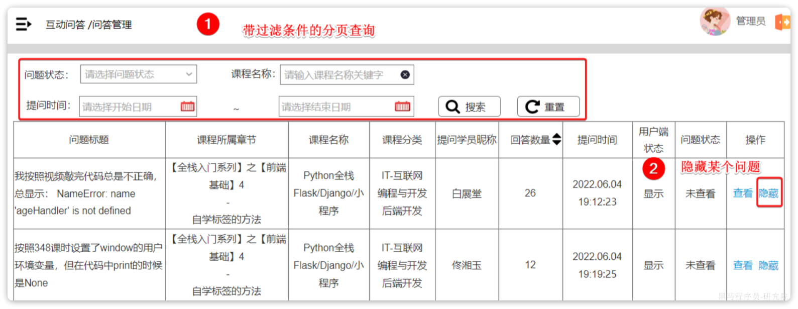

<br/>

比较æ˜æ˜¾çš„有两个æ¥å£ï¼š

- 管ç†ç«¯åˆ†é¡µæŸ¥è¯¢é—®é¢˜åˆ—表：ä¸ç”¨æˆ·ç«¯åˆ†é¡µæŸ¥è¯¢ä¸é€šç”¨ï¼ŒåŠŸèƒ½æ›´å¤æ‚，查询æ¡ä»¶æ›´å¤š
- éšè—或显示指定问题

<br/>

除此以外，这里有一个问题状æ€å­—段，表示管ç†å‘˜æ˜¯å¦æŸ¥çœ‹äº†è¯¥é—®é¢˜ä»¥åŠé—®é¢˜ä¸­çš„å›ç­”。默认是未查看状æ€ï¼›å½“管ç†å‘˜ç‚¹å‡»æŸ¥çœ‹å，状æ€ä¼šå˜åŒ–为已查看；当**学员**å†æ¬¡å›ç­”或评论，状æ€ä¼šå†æ¬¡å˜ä¸ºæœªæŸ¥çœ‹ã€‚

<br/>

因此，需è¦æ³¨æ„的是：

- æ¯å½“用户点击查看按钮，需è¦æ ¹æ®æ ¹æ®id查询问题详情，此时应标记问题状æ€ä¸ºå·²æŸ¥çœ‹
- æ¯å½“**学员**å›ç­”或评论时，需è¦å°†é—®é¢˜æ ‡è®°ä¸ºæœªæŸ¥çœ‹

<br/>

管ç†ç«¯ä¹Ÿä¼šæœ‰å›ç­”列表ã€è¯„论列表。å¦å¤–，å›ç­”和评论åŒæ ·æœ‰éšè—功能。

问题详情和å›ç­”列表：


<br/>

还有评论列表：


<br/>

总结一下，å›ç­”和评论包å«çš„æ¥å£æœ‰ï¼š

- 管ç†ç«¯æ ¹æ®id查询问题详情
- 分页查询问题下的å›ç­”
- 分页查询å›ç­”下的评论
- 点èµ/å–消点èµæŸä¸ªå›ç­”或评论
- éšè—/显示指定å›ç­”或评论
- å›ç­”æŸä¸ªæé—®ã€è¯„论他人å›ç­”ã€è¯„论（ä¸ç”¨æˆ·ç«¯å…±ç”¨ï¼‰

<br/>

#### 总结

综上，ä¸é—®ç­”系统有关的æ¥å£æœ‰ï¼š


## æ•°æ®ç»“æ„

ä»åŸå‹å›¾ä¸éš¾çœ‹å‡ºï¼Œè¿™éƒ¨åˆ†åŠŸèƒ½ä¸»è¦æ¶‰åŠä¸¤ä¸ªå®ä½“：

- 问题
- å›ç­”/评论：å›ç­”ã€è¯„论å¯ä»¥çœ‹åšä¸€ç±»å®ä½“

因此核心è¦è®¾è®¡çš„就是这两张表。

<br/>

### ER图

#### 问题

首先是`问题`，通过新å¢æ问的表å•å¯ä»¥çœ‹å‡º`问题`包å«çš„å±æ€§ï¼š

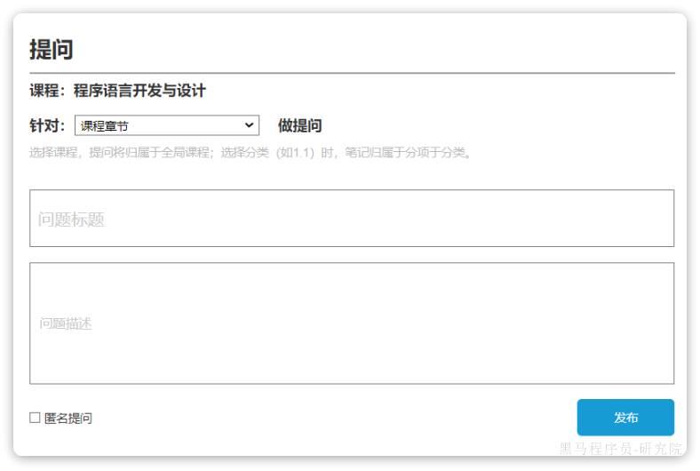

基本å±æ€§ï¼š

- 标题
- æè¿°

å…³è”ä¿¡æ¯ï¼š

- 用户id：也就是æ问的人
- 课程id
- ç« id
- 节id

功能字段：

- 是å¦æ˜¯åŒ¿å

<br/>

å¦å¤–，在问题列表中，需è¦çŸ¥é“问题最新的一个å›ç­”çš„ä¿¡æ¯ï¼š

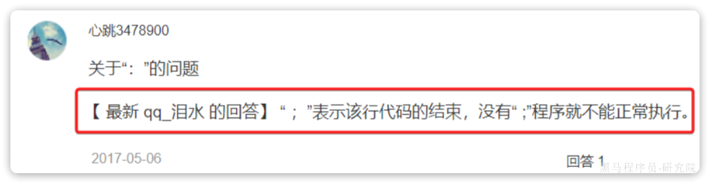

如æœæ¯æ¬¡åˆ†é¡µæŸ¥è¯¢é—®é¢˜çš„时候å†å»ç»Ÿè®¡æœ€æ–°çš„å›ç­”是哪个，效ç‡æ¯”较ä½ã€‚我们å¯ä»¥ç›´æ¥åœ¨æ¯æ¬¡æœ‰æ–°å›ç­”时将这个id记录到问题表中。因此问题表中需è¦æ·»åŠ è¿™æ ·ä¸€ä¸ªå­—段：

- 最新一次å›ç­”çš„id

<br/>

除了这些字段以外，管ç†ç«¯åˆ†é¡µæŸ¥è¯¢é—®é¢˜åˆ—表时也有一些功能字段：

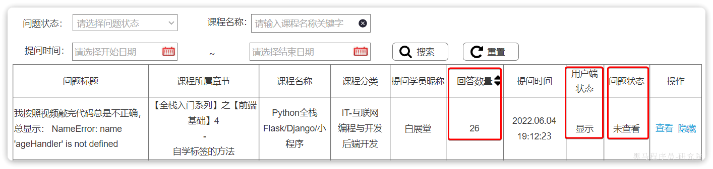

功能字段：

- 问题下的å›ç­”æ•°é‡
- 用户端显示状æ€ï¼šæ˜¯å¦è¢«éšè—
- 问题状æ€ï¼šç®¡ç†ç«¯æ˜¯å¦å·²ç»æŸ¥çœ‹

<br/>

综上，问题的ER图如下：

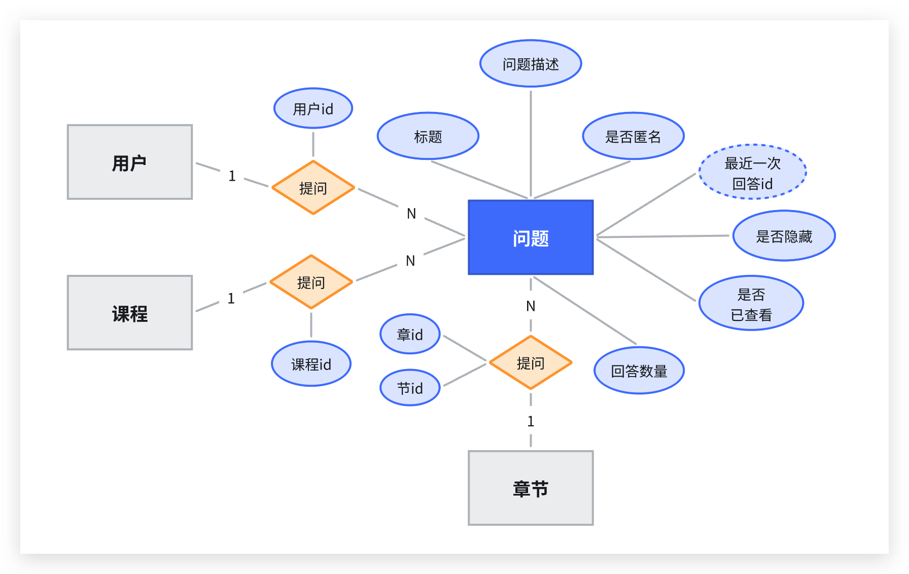

<br/>

#### å›ç­”ã€è¯„论

å›ç­”和评论的å±æ€§åŸºæœ¬ä¸€è‡´ï¼Œå·®åˆ«å°±æ˜¯ï¼š

- å›ç­”的对象是问题
- 评论的对象是其它å›ç­”或评论

æ¥çœ‹ä¸‹åŸå‹å›¾ï¼š

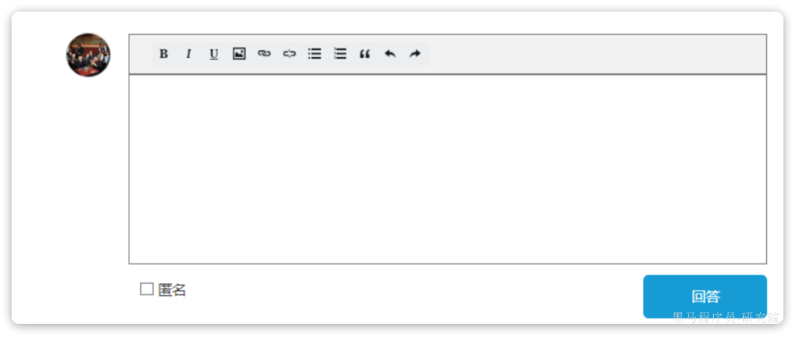

首先是基本å±æ€§ï¼š

- å›ç­”的内容

功能字段：

- 是å¦æ˜¯åŒ¿å
- 点èµæ•°é‡

然å是关è”ä¿¡æ¯ï¼š

- 用户id：也就是å›ç­”的人
- 问题id：无论是å›ç­”ã€è¯„论，都å±äºæŸä¸ªé—®é¢˜

æ¥ä¸‹æ¥æ˜¯è¯„论的特有å±æ€§ï¼š

- å›ç­”id：一个å›ç­”下会有很多评论，评论之间也会相互评论，但我们把å›ç­”下所有评论作为一层æ¥å±•ç¤ºã€‚因此该å›ç­”下的所有评论都应记ä½æ‰€å±çš„å›ç­”çš„id
- 目标用户id：评论针对的目标用户，页é¢æ˜¾ç¤ºä¸º `张三评论了æå››`
- 目标评论id：评论针对的目标评论的id

<br/>

综上，评论的ER图为：

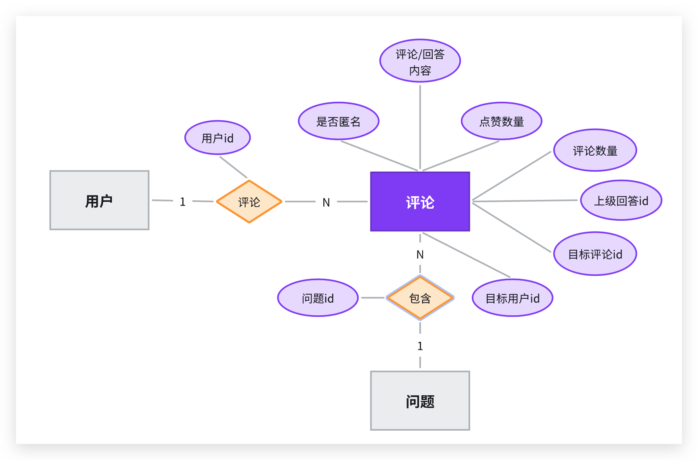

<br/>

### æ•°æ®åº“表

结åˆER图，表结æ„å°±é常清楚了，会包å«ä¸¤å¼ è¡¨ï¼š

- 问题表
- å›å¤è¡¨ï¼šå›ç­”和评论都是å›å¤ï¼Œåœ¨ä¸€å¼ è¡¨

<br/>

#### 问题表

首先是问题表：

```SQL
CREATE TABLE IF NOT EXISTS `interaction_question` (
  `id` bigint NOT NULL COMMENT '主键，互动问题的id',
  `title` varchar(255) CHARACTER SET utf8mb4 COLLATE utf8mb4_0900_ai_ci NOT NULL COMMENT '互动问题的标题',
  `description` varchar(2048) CHARACTER SET utf8mb4 COLLATE utf8mb4_0900_ai_ci NOT NULL DEFAULT '' COMMENT '问题æè¿°ä¿¡æ¯',
  `course_id` bigint NOT NULL COMMENT '所å±è¯¾ç¨‹id',
  `chapter_id` bigint NOT NULL COMMENT '所å±è¯¾ç¨‹ç« id',
  `section_id` bigint NOT NULL COMMENT '所å±è¯¾ç¨‹èŠ‚id',
  `user_id` bigint NOT NULL COMMENT 'æ问学员id',
  `latest_answer_id` bigint DEFAULT NULL COMMENT '最新的一个å›ç­”çš„id',
  `answer_times` int unsigned NOT NULL DEFAULT '0' COMMENT '问题下的å›ç­”æ•°é‡',
  `anonymity` bit(1) NOT NULL DEFAULT b'0' COMMENT '是å¦åŒ¿å，默认false',
  `hidden` bit(1) NOT NULL DEFAULT b'0' COMMENT '是å¦è¢«éšè—，默认false',
  `status` tinyint DEFAULT '0' COMMENT '管ç†ç«¯é—®é¢˜çŠ¶æ€ï¼š0-未查看，1-已查看',
  `create_time` datetime NOT NULL DEFAULT CURRENT_TIMESTAMP COMMENT 'æ问时间',
  `update_time` datetime NOT NULL DEFAULT CURRENT_TIMESTAMP ON UPDATE CURRENT_TIMESTAMP COMMENT '更新时间',
  PRIMARY KEY (`id`) USING BTREE,
  KEY `idx_course_id` (`course_id`) USING BTREE,
  KEY `section_id` (`section_id`),
  KEY `user_id` (`user_id`)
) ENGINE=InnoDB DEFAULT CHARSET=utf8mb4 COLLATE=utf8mb4_0900_ai_ci ROW_FORMAT=DYNAMIC COMMENT='互动æ问的问题表';
```

<br/>

#### å›ç­”或评论

å›ç­”和评论åˆä¸ºä¸€å¼ è¡¨ï¼Œç§°ä¸ºè¯„论表：

```SQL
CREATE TABLE IF NOT EXISTS `interaction_reply` (
  `id` bigint NOT NULL COMMENT '互动问题的å›ç­”id',
  `question_id` bigint NOT NULL COMMENT '互动问题问题id',
  `answer_id` bigint DEFAULT '0' COMMENT 'å›å¤çš„上级å›ç­”id',
  `user_id` bigint NOT NULL COMMENT 'å›ç­”者id',
  `content` varchar(255) CHARACTER SET utf8mb4 COLLATE utf8mb4_0900_ai_ci NOT NULL COMMENT 'å›ç­”内容',
  `target_user_id` bigint DEFAULT '0' COMMENT 'å›å¤çš„目标用户id',
  `target_reply_id` bigint DEFAULT '0' COMMENT 'å›å¤çš„目标å›å¤id',
  `reply_times` int NOT NULL DEFAULT '0' COMMENT '评论数é‡',
  `liked_times` int NOT NULL DEFAULT '0' COMMENT '点èµæ•°é‡',
  `hidden` bit(1) NOT NULL DEFAULT b'0' COMMENT '是å¦è¢«éšè—，默认false',
  `anonymity` bit(1) NOT NULL DEFAULT b'0' COMMENT '是å¦åŒ¿å，默认false',
  `create_time` datetime NOT NULL DEFAULT CURRENT_TIMESTAMP COMMENT '创建时间',
  `update_time` datetime NOT NULL DEFAULT CURRENT_TIMESTAMP ON UPDATE CURRENT_TIMESTAMP COMMENT '更新时间',
  PRIMARY KEY (`id`) USING BTREE,
  KEY `idx_question_id` (`question_id`) USING BTREE
) ENGINE=InnoDB DEFAULT CHARSET=utf8mb4 COLLATE=utf8mb4_0900_ai_ci ROW_FORMAT=DYNAMIC COMMENT='互动问题的å›ç­”或评论';
```

<br/>

### 代ç ç”Ÿæˆ

æ¥ä¸‹æ¥ï¼Œåˆ©ç”¨MPæ’件自动代ç ç”Ÿæˆå¯¹åº”的代ç ã€‚ä¸è¿‡åœ¨è¿™ä¹‹å‰ï¼Œä¸è¦å¿˜äº†åˆ›å»ºæ–°çš„功能分支。这里我们是互动问答功能，我们在dev分支基础上创建一个问答分支：`feature-qa`

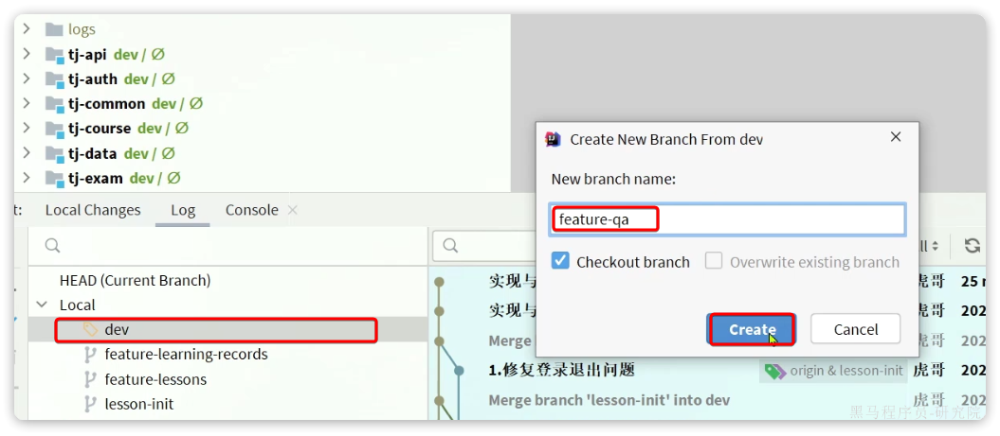

然åå†ç”Ÿæˆä»£ç å³å¯ã€‚

<br/>

#### controller

注æ„把controller路径修改为Restfulé£æ ¼ï¼š


<br/>

#### IDç­–ç•¥

问题和评论的id都采用雪花算法：


评论：


<br/>

#### 状æ€æšä¸¾

问题存在已查看和未查看两ç§çŠ¶æ€ï¼Œæˆ‘们定义出一个æšä¸¾æ¥æ ‡ç¤ºï¼š


具体代ç ï¼š

```Java
@Getter
public enum QuestionStatus implements BaseEnum {
    UN_CHECK(0, "未查看"),
    CHECKED(1, "已查看"),
    ;
    @JsonValue
    @EnumValue
    int value;
    String desc;

    QuestionStatus(int value, String desc) {
        this.value = value;
        this.desc = desc;
    }

    @JsonCreator(mode = JsonCreator.Mode.DELEGATING)
    public static QuestionStatus of(Integer value){
        if (value == null) {
            return null;
        }
        for (QuestionStatus status : values()) {
            if (status.equalsValue(value)) {
                return status;
            }
        }
        return null;
    }
}
```

然å把`InteractionQuestion`类中的状æ€ä¿®æ”¹ä¸ºæšä¸¾ç±»å‹ï¼š

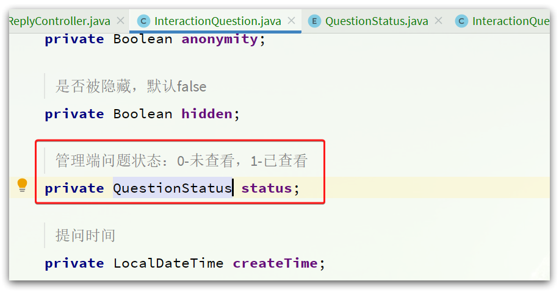

<br/>

## 问题相关æ¥å£

问题相关æ¥å£åœ¨ç®¡ç†ç«¯å’Œç”¨æˆ·ç«¯å­˜åœ¨ä¸€äº›å·®å¼‚，在设计æ¥å£æ—¶ä¸€å®šè¦ç•™æ„。å¦å¤–，此处我们åªå¸¦å¤§å®¶å®ç°å…¶ä¸­çš„部分æ¥å£ï¼š

- æ–°å¢äº’动问题
- 用户端分页查询问题
- æ ¹æ®id查询问题详情
- 管ç†ç«¯åˆ†é¡µæŸ¥è¯¢é—®é¢˜

其它的æ¥å£ç•™ç»™å¤§å®¶ä½œä¸ºç»ƒä¹ ï¼ŒåŒ…括：

- 管ç†ç«¯æ ¹æ®id查询问题详情
- 修改问题
- 删除问题
- 管ç†ç«¯éšè—或显示问题
- æ–°å¢å›ç­”或评论
- 分页查询å›ç­”或评论
- 管ç†ç«¯åˆ†é¡µæŸ¥è¯¢å›ç­”或评论
- 管ç†ç«¯éšè—或显示å›ç­”ã€è¯„论

<br/>

### æ–°å¢é—®é¢˜

#### æ¥å£åˆ†æ

首先还是看åŸå‹å›¾ï¼Œæ–°å¢çš„表å•å¦‚下：


通过新å¢çš„问题的表å•å³å¯åˆ†æ出æ¥å£çš„请求å‚æ•°ä¿¡æ¯äº†ï¼Œç„¶å按照Restfulçš„é£æ ¼è®¾è®¡å³å¯ï¼š

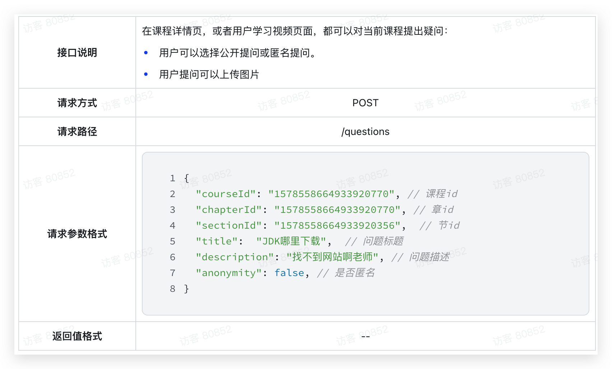

<br/>

#### å®ä½“ç±»

æ–°å¢ä¸šåŠ¡ä¸­æ— è¿”å›å€¼ï¼Œåªéœ€è¦è®¾è®¡å‡ºå…¥å‚对应的DTOå³å¯ï¼Œåœ¨è¯¾å‰èµ„料中已ç»æ供好了：


å¤åˆ¶åˆ°`tj-learning`模å—下的`domain`下的`dto`包下：


<br/>

#### 代ç å®ç°

首先是`tj-learning`中的`InteractionQuestionController`：

```Java
@RestController
@RequestMapping("/questions")
@RequiredArgsConstructor
public class InteractionQuestionController {

    private final IInteractionQuestionService questionService;

    @ApiOperation("æ–°å¢æé—®")
    @PostMapping
    public void saveQuestion(@Valid @RequestBody QuestionFormDTO questionDTO){
        questionService.saveQuestion(questionDTO);
    }
}
```

<br/>

然å是 `tj-learning` 中的 `IInteractionQuestionService` æ¥å£ï¼š

```Java
public interface IInteractionQuestionService extends IService<InteractionQuestion> {
    void saveQuestion(QuestionFormDTO questionDTO);
}
```

<br/>

最å是`tj-learning`中的`InteractionQuestionServiceImpl`å®ç°ç±»ï¼š

```Java
@Service
@RequiredArgsConstructor
public class InteractionQuestionServiceImpl extends ServiceImpl<InteractionQuestionMapper, InteractionQuestion> implements IInteractionQuestionService {
    
    private final IInteractionQuestionDetailService detailService;

    @Override
    @Transactional
    public void saveQuestion(QuestionFormDTO questionDTO) {
        // 1.è·å–登录用户
        Long userId = UserContext.getUser();
        // 2.æ•°æ®è½¬æ¢
        InteractionQuestion question = BeanUtils.toBean(questionDTO, InteractionQuestion.class);
        // 3.补充数æ®
        question.setUserId(userId);
        // 4.ä¿å­˜é—®é¢˜
        save(question);

        // 5.问题详情
        InteractionQuestionDetail detail = new InteractionQuestionDetail();
        detail.setId(question.getId());
        detail.setDescription(questionDTO.getDescription());
        detailService.save(detail);
    }
}
```

<br/>

### 修改问题（练习）

#### æ¥å£åˆ†æ

修改ä¸æ–°å¢è¡¨å•åŸºæœ¬ç±»ä¼¼ï¼Œæ­¤å¤„ä¸å†åˆ†æ。我们å¯ä»¥å‚考新å¢çš„æ¥å£ï¼Œç„¶å按照Restfulçš„é£æ ¼è®¾è®¡ä¸ºæ›´æ–°å³å¯ï¼š

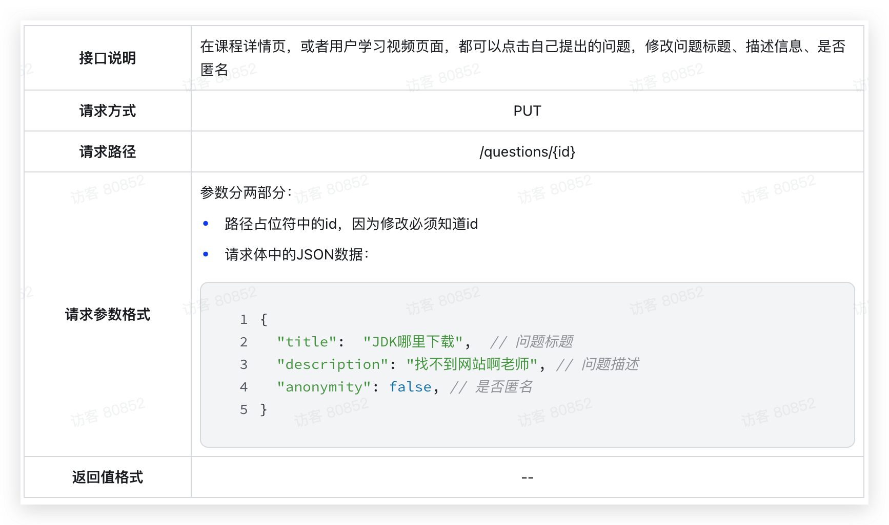

虽然修改问题时æ交的JSONå‚数会少一些，ä¸è¿‡ä¾ç„¶å¯ä»¥æ²¿ç”¨æ–°å¢æ—¶çš„DTO.

#### 代ç å®ç°ï¼ˆç»ƒä¹ ï¼‰

<br/>

### 用户端分页查询问题

#### æ¥å£åˆ†æ

先看åŸå‹å›¾ï¼š


这就是一个典å‹çš„分页查询。主è¦åˆ†æ请求å‚数和返å›å€¼å°±è¡Œäº†ã€‚

<br/>

请求å‚数就是过滤æ¡ä»¶ï¼Œé¡µé¢å¯ä»¥çœ‹åˆ°çš„æ¡ä»¶æœ‰ï¼š

- 分页æ¡ä»¶
- 全部å›ç­”/我的å›ç­”：也就是è¦ä¸è¦åŸºäºç”¨æˆ·id过滤
- 课程id：éšå«æ¡ä»¶ï¼Œå› ä¸ºé—®é¢˜åˆ—表是在æŸè¯¾ç¨‹è¯¦æƒ…页é¢æŸ¥çœ‹çš„，所以一定è¦ä»¥è¯¾ç¨‹id为æ¡ä»¶
- 章节id：å¯é€‰æ¡ä»¶ï¼Œå½“用户点击å°èŠ‚时传递

<br/>

è¿”å›å€¼æ ¼å¼ï¼Œä»é¡µé¢å¯ä»¥çœ‹åˆ°å±æ€§æœ‰ï¼š

- 是å¦åŒ¿å：如æœæ交问题是选择了匿å，则页é¢ä¸èƒ½å±•ç¤ºç”¨æˆ·ä¿¡æ¯
- 用户id：匿å则ä¸æ˜¾ç¤º
- 用户头åƒï¼šåŒ¿å则ä¸æ˜¾ç¤º
- 用户å称：匿å则ä¸æ˜¾ç¤º
- 问题标题
- æ问时间
- å›ç­”æ•°é‡
- 最近一次å›ç­”çš„ä¿¡æ¯ï¼š
  - å›ç­”人å称
  - å›ç­”内容

<br/>

综上，按照Restfulæ¥è®¾è®¡æ¥å£ï¼Œä¿¡æ¯å¦‚下：


<br/>

#### å®ä½“ç±»

首先是请求å‚数，查询类å‹æˆ‘们定义为Query，在课å‰èµ„料中已ç»æ供了：

```java
@EqualsAndHashCode(callSuper = true)
@Data
@ApiModel(description = "互动问题分页查询æ¡ä»¶")
public class QuestionPageQuery extends PageQuery {
    // 用户端查询æ¡ä»¶
    @ApiModelProperty(value = "课程id")
    private Long courseId;
    
    @ApiModelProperty(value = "å°èŠ‚id", example = "1")
    private Long sectionId;
    
    @ApiModelProperty(value = "是å¦åªæŸ¥è¯¢æˆ‘的问题", example = "1")
    private Boolean onlyMine = false;
}
```

需è¦æ³¨æ„的是，`QuestionPageQuery`是继承自`tj-common`中通用的`PageQuery`，这样就无需é‡å¤å®šä¹‰åˆ†é¡µæŸ¥è¯¢å‚数了：

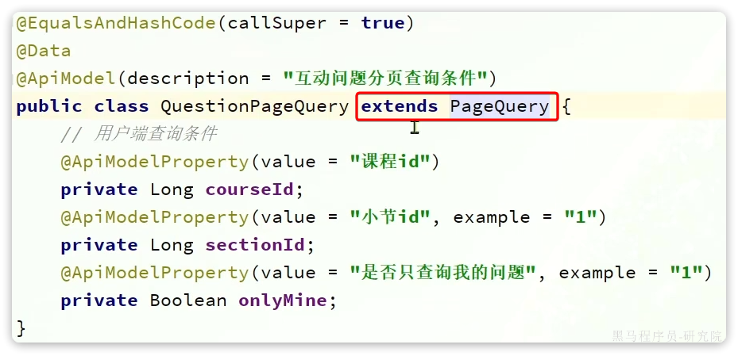

然å是返å›å€¼ï¼Œé¡µé¢è§†å›¾å¯¹è±¡ï¼Œæˆ‘们定义为VO，在课å‰èµ„料中已ç»æ供了：


我们将VOå’ŒQueryå®ä½“分别放到domain包的vo包和query包下：

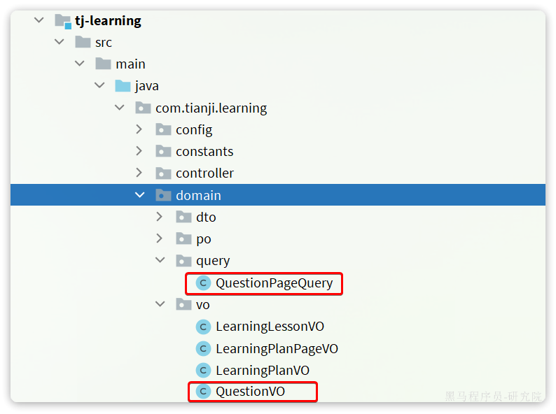

<br/>

#### 声æ˜æ¥å£

首先是`tj-learning`中的`com.tianji.learning.controller.InteractionQuestionController`

```Java
package com.tianji.learning.controller;


import com.tianji.common.domain.dto.PageDTO;
import com.tianji.learning.domain.query.QuestionPageQuery;
import com.tianji.learning.domain.vo.QuestionVO;
import com.tianji.learning.service.IInteractionQuestionService;
import io.swagger.annotations.Api;
import io.swagger.annotations.ApiOperation;
import io.swagger.annotations.ApiParam;
import lombok.RequiredArgsConstructor;
import org.springframework.web.bind.annotation.*;

/**
 * <p>
 * 互动æ问的问题表 å‰ç«¯æ§åˆ¶å™¨
 * </p>
 */
@RestController
@RequestMapping("/questions")
@Api(tags = "互动问答相关æ¥å£")
@RequiredArgsConstructor
public class InteractionQuestionController {

    private final IInteractionQuestionService questionService;

    @ApiOperation("分页查询互动问题")
    @GetMapping("page")
    public PageDTO<QuestionVO> queryQuestionPage(QuestionPageQuery query){
        return questionService.queryQuestionPage(query);
    }

}
```

然å是`tj-learning`中的`com.tianji.learning.service.IInteractionQuestionService`æ¥å£ï¼š

```Java
package com.tianji.learning.service;

import com.baomidou.mybatisplus.extension.service.IService;
import com.tianji.common.domain.dto.PageDTO;
import com.tianji.learning.domain.query.QuestionPageQuery;
import com.tianji.learning.domain.vo.QuestionVO;

/**
 * <p>
 * 互动æ问的问题表 æœåŠ¡ç±»
 * </p>
 */
public interface IInteractionQuestionService extends IService<InteractionQuestion> {

    PageDTO<QuestionVO> queryQuestionPage(QuestionPageQuery query);
}
```

最å是`tj-learning`中的`com.tianji.learning.service.impl.InteractionQuestionServiceImpl`å®ç°ç±»ï¼š

```Java
package com.tianji.learning.service.impl;

import com.tianji.learning.domain.query.QuestionPageQuery;
import com.tianji.learning.domain.vo.QuestionVO;
import com.tianji.learning.service.IInteractionQuestionService;
import org.springframework.stereotype.Service;

import java.time.LocalDateTime;
import java.util.*;

/**
 * <p>
 * 互动æ问的问题表 æœåŠ¡å®ç°ç±»
 * </p>
 */
@Service
@RequiredArgsConstructor
public class InteractionQuestionServiceImpl extends ServiceImpl<InteractionQuestionMapper, InteractionQuestion> implements IInteractionQuestionService {

    @Override
    public PageDTO<QuestionVO> queryQuestionPage(QuestionPageQuery query) {
        
        return null;
    }
}
```

<br/>

#### 查询用户信æ¯

ç”±äºé¡µé¢VO中需è¦æ问者信æ¯ã€æœ€è¿‘一次å›ç­”ä¿¡æ¯ï¼Œéƒ½éœ€è¦æŸ¥è¯¢å‡ºç”¨æˆ·æ˜µç§°ã€å¤´åƒç­‰ã€‚而数æ®åº“中仅仅ä¿å­˜äº†æ问人的idã€å›ç­”人的id。

这就è¦æ±‚我们能够根æ®ç”¨æˆ·idå»æŸ¥è¯¢å‡ºç”¨æˆ·çš„详细信æ¯ã€‚

<br/>

而用户信æ¯å…¨éƒ¨éƒ½åœ¨`tj-user`模å—对应的`user-service`æœåŠ¡ä¸­ã€‚所以我们需è¦è¿œç¨‹è°ƒç”¨`user-service`以è·å–这些数æ®ã€‚

<br/>

好在user-serviceå·²ç»æ供了查询用户的Feign客户端，并且统一定义到了`tj-api`模å—中：

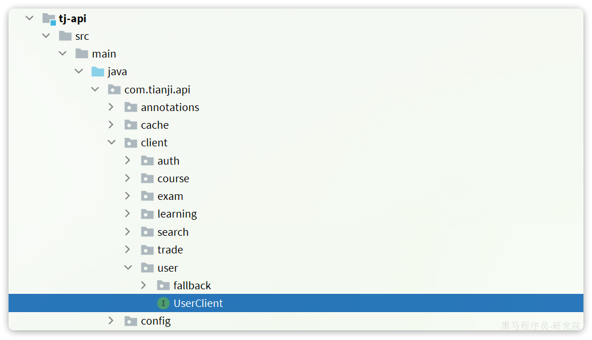

<br/>

其中有这样的一个API：

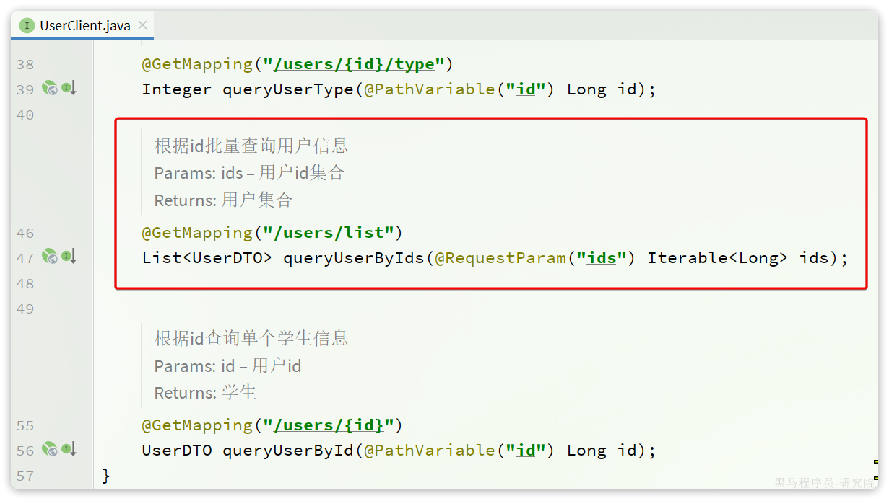

æ°å¥½å°±èƒ½å®ç°æ ¹æ®id集åˆæŸ¥è¯¢ç”¨æˆ·ä¿¡æ¯é›†åˆçš„功能。

<br/>

而且返å›çš„UserDTO中数æ®é常丰富，完全能够满足我们的需è¦ï¼š

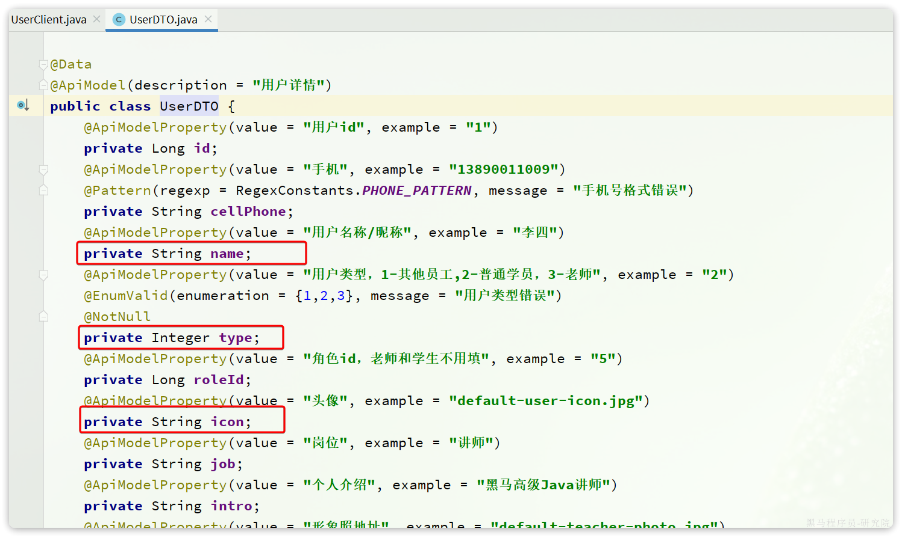

<br/>

#### å®ç°æŸ¥è¯¢é€»è¾‘

查询的å®ç°é€»è¾‘如下：

```Java
package com.tianji.learning.service.impl;

import com.baomidou.mybatisplus.core.conditions.query.QueryWrapper;
import com.baomidou.mybatisplus.extension.plugins.pagination.Page;
import com.baomidou.mybatisplus.extension.service.impl.ServiceImpl;
import com.tianji.api.cache.CategoryCache;
import com.tianji.api.client.user.UserClient;
import com.tianji.api.dto.user.UserDTO;
import com.tianji.common.domain.dto.PageDTO;
import com.tianji.common.exceptions.BadRequestException;
import com.tianji.common.utils.BeanUtils;
import com.tianji.common.utils.CollUtils;
import com.tianji.common.utils.StringUtils;
import com.tianji.common.utils.UserContext;
import com.tianji.learning.domain.po.InteractionQuestion;
import com.tianji.learning.domain.po.InteractionReply;
import com.tianji.learning.domain.query.QuestionPageQuery;
import com.tianji.learning.domain.vo.QuestionVO;
import com.tianji.learning.mapper.InteractionQuestionMapper;
import com.tianji.learning.mapper.InteractionReplyMapper;
import com.tianji.learning.service.IInteractionQuestionService;
import lombok.RequiredArgsConstructor;
import org.springframework.stereotype.Service;

import java.time.LocalDateTime;
import java.util.*;
import java.util.stream.Collectors;

/**
 * <p>
 * 互动æ问的问题表 æœåŠ¡å®ç°ç±»
 * </p>
 *
 * @author è™å“¥
 */
@Service
@RequiredArgsConstructor
public class InteractionQuestionServiceImpl extends ServiceImpl<InteractionQuestionMapper, InteractionQuestion> implements IInteractionQuestionService {

    private final InteractionReplyMapper replyMapper;
    private final UserClient userClient;
    
    @Override
    public PageDTO<QuestionVO> queryQuestionPage(QuestionPageQuery query) {
        // 1.å‚数校验，课程idå’Œå°èŠ‚idä¸èƒ½éƒ½ä¸ºç©º
        Long courseId = query.getCourseId();
        Long sectionId = query.getSectionId();
        if (courseId == null && sectionId == null) {
            throw new BadRequestException("课程idå’Œå°èŠ‚idä¸èƒ½éƒ½ä¸ºç©º");
        }
        // 2.分页查询
        Page<InteractionQuestion> page = lambdaQuery()
                .select(InteractionQuestion.class, info -> !info.getProperty().equals("description"))
                .eq(query.getOnlyMine(), InteractionQuestion::getUserId, UserContext.getUser())
                .eq(courseId != null, InteractionQuestion::getCourseId, courseId)
                .eq(sectionId != null, InteractionQuestion::getSectionId, sectionId)
                .eq(InteractionQuestion::getHidden, false)
                .page(query.toMpPageDefaultSortByCreateTimeDesc());
        List<InteractionQuestion> records = page.getRecords();
        if (CollUtils.isEmpty(records)) {
            return PageDTO.empty(page);
        }
        // 3.æ ¹æ®id查询æ问者和最近一次å›ç­”çš„ä¿¡æ¯
        Set<Long> userIds = new HashSet<>();
        Set<Long> answerIds = new HashSet<>();
        // 3.1.得到问题当中的æ问者id和最近一次å›ç­”çš„id
        for (InteractionQuestion q : records) {
            if(!q.getAnonymity()) { // åªæŸ¥è¯¢é匿å的问题
                userIds.add(q.getUserId());
            }
            answerIds.add(q.getLatestAnswerId());
        }
        // 3.2.æ ¹æ®id查询最近一次å›ç­”
        answerIds.remove(null);
        Map<Long, InteractionReply> replyMap = new HashMap<>(answerIds.size());
        if(CollUtils.isNotEmpty(answerIds)) {
            List<InteractionReply> replies = replyMapper.selectBatchIds(answerIds);
            for (InteractionReply reply : replies) {
                replyMap.put(reply.getId(), reply);
                if(!reply.getAnonymity()){ // 匿å用户ä¸åšæŸ¥è¯¢
                    userIds.add(reply.getUserId());
                }
            }
        }

        // 3.3.æ ¹æ®id查询用户信æ¯ï¼ˆæ问者）
        userIds.remove(null);
        Map<Long, UserDTO> userMap = new HashMap<>(userIds.size());
        if(CollUtils.isNotEmpty(userIds)) {
            List<UserDTO> users = userClient.queryUserByIds(userIds);
            userMap = users.stream()
                    .collect(Collectors.toMap(UserDTO::getId, u -> u));
        }

        // 4.å°è£…VO
        List<QuestionVO> voList = new ArrayList<>(records.size());
        for (InteractionQuestion r : records) {
            // 4.1.将PO转为VO
            QuestionVO vo = BeanUtils.copyBean(r, QuestionVO.class);
            voList.add(vo);
            // 4.2.å°è£…æ问者信æ¯
            if(!r.getAnonymity()){
                UserDTO userDTO = userMap.get(r.getUserId());
                if (userDTO != null) {
                    vo.setUserName(userDTO.getName());
                    vo.setUserIcon(userDTO.getIcon());
                }
            }

            // 4.3.å°è£…最近一次å›ç­”çš„ä¿¡æ¯
            InteractionReply reply = replyMap.get(r.getLatestAnswerId());
            if (reply != null) {
                vo.setLatestReplyContent(reply.getContent());
                if(!reply.getAnonymity()){// 匿å用户直æ¥å¿½ç•¥
                    UserDTO user = userMap.get(reply.getUserId());
                    vo.setLatestReplyUser(user.getName());
                }

            }
        }

        return PageDTO.of(page, voList);
    }
}
```

<br/>

### æ ¹æ®id查询问题详情

#### æ¥å£åˆ†æ

先看下详情页åŸå‹å›¾ï¼š


由此å¯ä»¥çœ‹å‡ºè¯¦æƒ…页所需è¦çš„ä¿¡æ¯ç›¸æ¯”分页时，主è¦å¤šäº†é—®é¢˜è¯¦æƒ…，主è¦å­—段有：

- 是å¦åŒ¿å
- 用户id：匿å则ä¸æ˜¾ç¤º
- 用户头åƒï¼šåŒ¿å则ä¸æ˜¾ç¤º
- 用户 å称：匿å则ä¸æ˜¾ç¤º
- 问题标题
- æ问时间
- å›ç­”æ•°é‡
- **问题æ述详情**

<br/>

而请求å‚数则更加简å•äº†ï¼Œå°±æ˜¯é—®é¢˜çš„id

然å，å†æŒ‰ç…§Restfulé£æ ¼è®¾è®¡ï¼Œæ¥å£å°±å‡ºæ¥äº†ï¼š

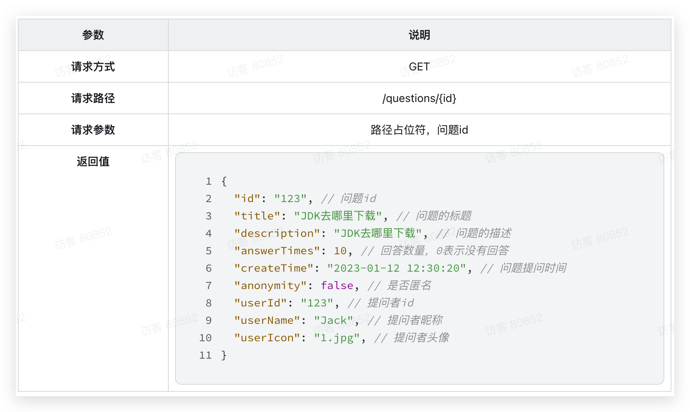

<br/>

#### å®ä½“ç±»

既然仅仅比分页时多了一个字段，我们å¯ä»¥æ²¿ç”¨ä¹‹å‰åˆ†é¡µæŸ¥è¯¢æ—¶çš„VO对象，添加一个新å±æ€§å³å¯ï¼š


<br/>

#### 代ç å®ç°

首先是`tj-learning`中的`InteractionQuestionController`：

```Java
@ApiOperation("æ ¹æ®id查询问题详情")
@GetMapping("/{id}")
public QuestionVO queryQuestionById(@ApiParam(value = "问题id", example = "1") @PathVariable("id") Long id){
    return questionService.queryQuestionById(id);
}
```

<br/>

然å是 `tj-learning` 中的 `IInteractionQuestionService` æ¥å£ï¼š

```Java
QuestionVO queryQuestionById(Long id);
```

<br/>

最å是 `tj-learning `中的 `InteractionQuestionServiceImpl `å®ç°ç±»ï¼š

```Java
@Override
public QuestionVO queryQuestionById(Long id) {
    // 1.æ ¹æ®id查询数æ®
    InteractionQuestion question = getById(id);
    // 2.æ•°æ®æ ¡éªŒ
    if(question == null || question.getHidden()){
        // 没有数æ®æˆ–者是被éšè—了
        return null;
    }
    // 3.查询æ问者信æ¯
    UserDTO user = null;
    if(!question.getAnonymity()){
        user = userClient.queryUserById(question.getUserId());
    }
    // 4.å°è£…VO
    QuestionVO vo = BeanUtils.copyBean(question, QuestionVO.class);
    if (user != null) {
        vo.setUserName(user.getName());
        vo.setUserIcon(user.getIcon());
    }
    return vo;
}
```

<br/>

### 删除我的问题（练习）

#### æ¥å£åˆ†æ

用户å¯ä»¥åˆ é™¤è‡ªå·±æ问的问题，如图：

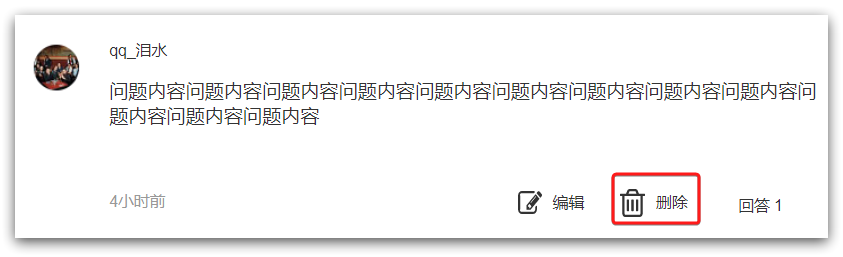

需è¦æ³¨æ„的是，当用户删除æŸä¸ªé—®é¢˜æ—¶ï¼Œä¹Ÿéœ€è¦åˆ é™¤é—®é¢˜ä¸‹çš„å›ç­”ã€è¯„论。

整体业务æµç¨‹å¦‚下：

- 查询问题是å¦å­˜åœ¨
- 判断是å¦æ˜¯å½“å‰ç”¨æˆ·æ问的
- 如æœä¸æ˜¯åˆ™æŠ¥é”™
- 如æœæ˜¯åˆ™åˆ é™¤é—®é¢˜
- 然å删除问题下的å›ç­”åŠè¯„论

æ¥å£ä¿¡æ¯å¦‚下：

- **æ¥å£åœ°å€**:`/questions/{id}`
- **请求方å¼**:`DELETE`
- **请求å‚æ•°**: 基äºè·¯å¾„å ä½ç¬¦ï¼Œé—®é¢˜id

#### 代ç å®ç°ï¼ˆç»ƒä¹ ï¼‰

<br/>

### 管ç†ç«¯åˆ†é¡µæŸ¥è¯¢é—®é¢˜

#### æ¥å£åˆ†æ

在管ç†ç«¯åå°å­˜åœ¨é—®ç­”管ç†åˆ—表页，ä¸ç”¨æˆ·ç«¯ç±»ä¼¼éƒ½æ˜¯åˆ†é¡µæŸ¥è¯¢ï¼Œä½†æ˜¯è¯·æ±‚å‚数和返å›å€¼æœ‰è¾ƒå¤§å·®åˆ«ï¼š

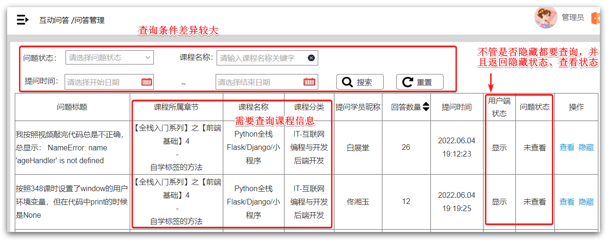

ä»è¯·æ±‚å‚æ•°æ¥çœ‹ï¼Œé™¤äº†åˆ†é¡µå‚数，还包å«3个：

- 问题的查看状æ€
- 课程å称
- æ问时间

ä»è¿”å›å€¼æ¥çœ‹ï¼Œæ¯”用户端多了一些字段：

- 是å¦åŒ¿å: 管ç†ç«¯ä¸å…³å¿ƒï¼Œå…¨éƒ½å±•ç¤º
- æ问者信æ¯ï¼š
  - 用户id
  - 用户头åƒï¼šåŒ¿å则ä¸æ˜¾ç¤º
  - 用户 å称：匿å则ä¸æ˜¾ç¤º
- 问题标题
- æ问时间
- å›ç­”æ•°é‡
- 最近一次å›ç­”çš„ä¿¡æ¯ï¼š
  - å›ç­”人å称
  - å›ç­”内容
- 问题关è”的课程å称
- 问题关è”çš„ç« ã€èŠ‚å称
- 问题关è”课程的分类å称

<br/>

ç”±äºè¯·æ±‚å…¥å‚和返å›å€¼ä¸ç”¨æˆ·ç«¯æœ‰è¾ƒå¤§å·®å¼‚，因此我们需è¦è®¾è®¡ä¸€ä¸ªæ–°çš„æ¥å£ï¼š

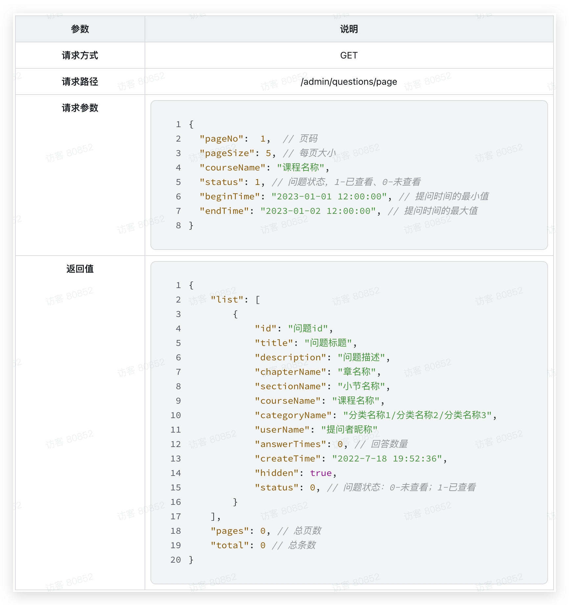

<br/>

#### å®ä½“ç±»

ä¸ç”¨æˆ·ç«¯åˆ†é¡µæŸ¥è¯¢é—®é¢˜ç±»ä¼¼ï¼Œè¿™é‡Œä¹Ÿéœ€è¦å®šä¹‰Queryå®ä½“ã€VOå®ä½“。课å‰èµ„料中已ç»æ供好了：

首先是Query：


然å是VO：

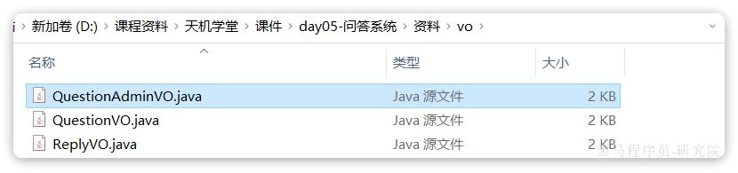

<br/>

#### æ¥å£å£°æ˜

为了ä¸ç”¨æˆ·ç«¯åŠ ä»¥åŒºåˆ†ï¼Œæˆ‘们定义一个新的controller：


代ç å¦‚下：

```Java
package com.tianji.learning.controller;


import com.tianji.common.domain.dto.PageDTO;
import com.tianji.learning.domain.query.QuestionAdminPageQuery;
import com.tianji.learning.domain.vo.QuestionAdminVO;
import com.tianji.learning.service.IInteractionQuestionService;
import io.swagger.annotations.Api;
import io.swagger.annotations.ApiOperation;
import io.swagger.annotations.ApiParam;
import lombok.RequiredArgsConstructor;
import org.springframework.web.bind.annotation.*;

/**
 * <p>
 * 互动æ问的问题表 å‰ç«¯æ§åˆ¶å™¨
 * </p>
 *
 * @author è™å“¥
 */
@RestController
@RequestMapping("/admin/questions")
@Api(tags = "互动问答相关æ¥å£")
@RequiredArgsConstructor
public class InteractionQuestionAdminController {

    private final IInteractionQuestionService questionService;

    @ApiOperation("管ç†ç«¯åˆ†é¡µæŸ¥è¯¢äº’动问题")
    @GetMapping("page")
    public PageDTO<QuestionAdminVO> queryQuestionPageAdmin(QuestionAdminPageQuery query){
        return questionService.queryQuestionPageAdmin(query);
    }
}
```

<br/>

然å在`tj-learning`çš„`com.tianji.learning.service.IInteractionQuestionService`中添加方法声æ˜ï¼š

```Java
PageDTO<QuestionAdminVO> queryQuestionPageAdmin(QuestionAdminPageQuery query);
```

<br/>

在å®ç°ç±»`com.tianji.learning.service.impl.InteractionQuestionServiceImpl`中å®ç°æ–¹æ³•ï¼š

```Java
@Override
public PageDTO<QuestionAdminVO> queryQuestionsPageForAdmin(QuestionAdminPageQuery query) {
    // TODO
    return null;
}
```

<br/>

#### 课程å称模糊æœç´¢

在管ç†ç«¯çš„查询æ¡ä»¶ä¸­æœ‰ä¸€ä¸ªæ ¹æ®è¯¾ç¨‹å称æœç´¢ï¼š

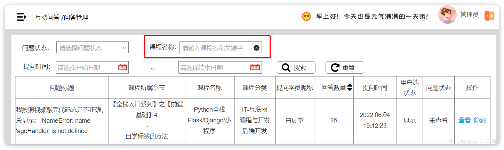

但是，在 interaction_question 表中，并没有课程å称字段，åªæœ‰è¯¾ç¨‹id：


那我们该如何å®ç°æ¨¡ç³Šæœç´¢å‘¢ï¼Ÿ

<br/>

在天机学堂项目中，所有上线的课程数æ®éƒ½ä¼šå­˜å‚¨åˆ°`Elasticsearch`中，方便用户检索课程。并且在`tj-search`模å—中æ供了相关的查询æ¥å£ã€‚

其中就有根æ®è¯¾ç¨‹å称æœç´¢è¯¾ç¨‹ä¿¡æ¯çš„功能，并且这个功能还对外开放了一个Feign客户端方便我们调用：

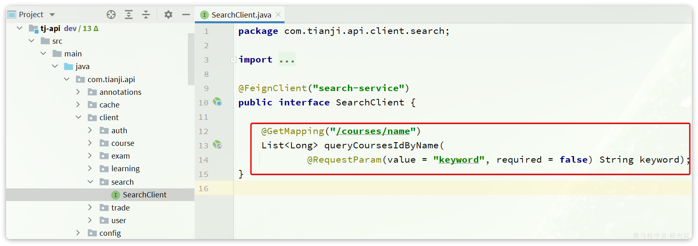

这个æ¥å£çš„请求å‚数就是课程**å称关键字**，其内部会利用elasticsearch的全文检索功能帮我们查询相关课程，并返å›è¯¾ç¨‹id集åˆã€‚è¿™ä¸æ­£æ˜¯æˆ‘们所需è¦çš„嘛ï¼

<br/>

因此，如æœå‰ç«¯ä¼ é€’了课程å称关键字，我们的æœç´¢æµç¨‹å¦‚下：

- 首先调用SearchClientæ¥å£ï¼Œæ ¹æ®å称关键字æœç´¢ï¼Œè·å–courseId集åˆ
- 判断结æœæ˜¯å¦ä¸ºç©º
  - 如æœä¸ºç©ºï¼Œç›´æ¥ç»“æŸï¼Œä»£è¡¨æ²¡æœ‰æœç´¢åˆ°
  - 如æœä¸ä¸ºç©ºï¼Œåˆ™æŠŠå¾—到的courseId集åˆä½œä¸ºæ¡ä»¶ï¼Œç»“åˆå…¶å®ƒæ¡ä»¶ï¼Œåˆ†é¡µæŸ¥è¯¢é—®é¢˜å³å¯

<br/>

#### 课程分类数æ®

**查询æ€è·¯åˆ†æ**

å‰é¢åˆ†æ过，管ç†ç«¯é™¤äº†è¦æŸ¥è¯¢åˆ°é—®é¢˜ï¼Œè¿˜éœ€è¦è¿”å›é—®é¢˜æ‰€å±çš„一系列信æ¯ï¼š


这些数æ®å¯¹åº”到interaction_question表中，åªåŒ…å«ä¸€äº›id字段：


那么我们该如何è·å–å…¶å称数æ®å‘¢ï¼Ÿ

- 课程å称：根æ®course_id到课程微æœåŠ¡æŸ¥è¯¢
- 章节å称：根æ®chapter_idå’Œsection_id到课程微æœåŠ¡æŸ¥è¯¢
- **分类**：未知
- æ问者å称：根æ®user_id到用户微æœåŠ¡æŸ¥è¯¢

其中，课程ã€ç« èŠ‚ã€æ问者等信æ¯çš„查询在以往的业务中我们已ç»æ¶‰åŠåˆ°ï¼Œä¸å†èµ˜è¿°ã€‚但是课程分类信æ¯ä»¥å‰æ²¡æœ‰æŸ¥è¯¢è¿‡ã€‚

<br/>

课程分类在首页就能看到，共分为3级：

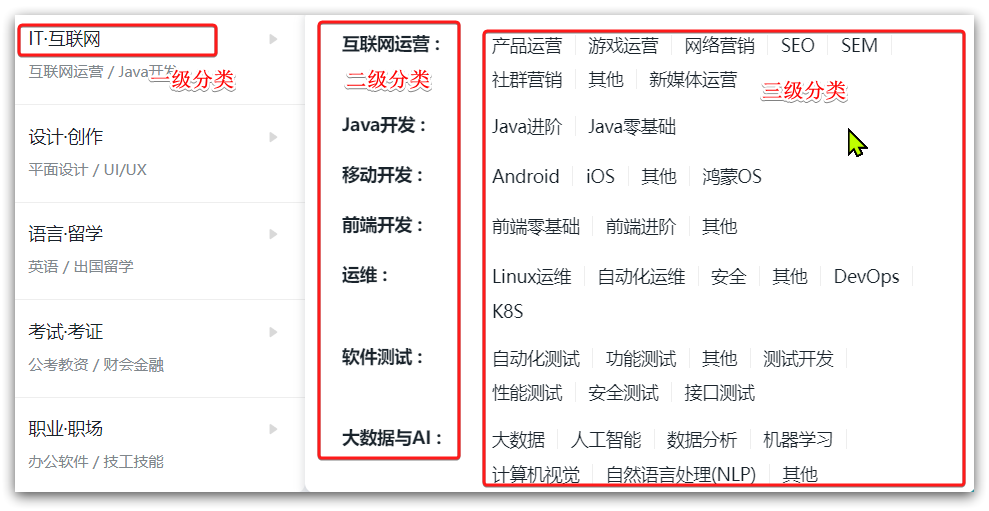

æ¯ä¸€ä¸ªè¯¾ç¨‹éƒ½ä¸ç¬¬ä¸‰çº§åˆ†ç±»å…³è”，因此å‘上级追溯，也有对应的二级ã€ä¸€çº§åˆ†ç±»ã€‚在课程微æœåŠ¡æ供的查询课程的æ¥å£ä¸­ï¼Œå¯ä»¥çœ‹åˆ°è¿”å›çš„课程信æ¯ä¸­å°±åŒ…å«äº†å…³è”的一级ã€äºŒçº§ã€ä¸‰çº§åˆ†ç±»ï¼š

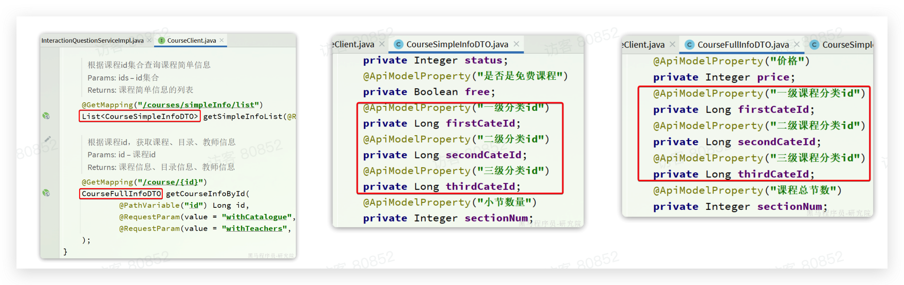

因此，**åªè¦æˆ‘们查询到了问题所å±çš„课程，就能知é“课程关è”的三级分类id**，æ¥ä¸‹æ¥åªéœ€è¦æ ¹æ®åˆ†ç±»id查询出分类å称å³å¯ã€‚

<br/>

而在course-serviceæœåŠ¡ä¸­æ供了一个æ¥å£ï¼Œå¯ä»¥æŸ¥è¯¢åˆ°æ‰€æœ‰çš„分类：

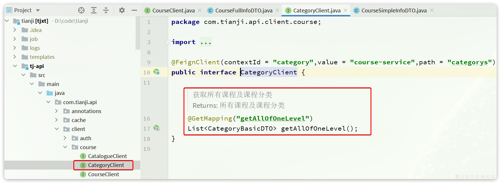

需è¦æ³¨æ„的是：这个返å›çš„是所有课程分类的集åˆï¼Œè€Œè¯¾ç¨‹ä¸­åªåŒ…å«3个分类id。因此我们需è¦è‡ªå·±ä»æ‰€æœ‰åˆ†ç±»é›†åˆä¸­æ‰¾å‡ºè¯¾ç¨‹æœ‰å…³çš„这三个。

分æ到这里大家应该知é“如何åšäº†ã€‚ä¸è¿‡è¿™é‡Œæœ‰ä¸€ä¸ªå€¼å¾—æ€è€ƒçš„点：

- 课程分类数æ®åœ¨å¾ˆå¤šä¸šåŠ¡ä¸­éƒ½éœ€è¦æŸ¥è¯¢ï¼Œè¿™æ ·çš„æ•°æ®å¦‚此频ç¹çš„查询，有没有性能优化的åŠæ³•å‘¢ï¼Ÿ

<br/>

##### 多级缓存

相信很多åŒå­¦éƒ½èƒ½æƒ³åˆ°å€ŸåŠ©äºRedis缓存æ¥æ高性能，å‡å°‘æ•°æ®åº“å‹åŠ›ã€‚é常好ï¼ä¸è¿‡ï¼ŒRedis虽然能æ高性能，但æ¯æ¬¡æŸ¥è¯¢ç¼“存还是会**å¢åŠ ç½‘络带宽消耗**，也会存在**网络延迟**。

而分类数æ®å…·å¤‡ä¸¤å¤§ç‰¹ç‚¹ï¼š

- æ•°æ®é‡å°
- 长时间ä¸ä¼šå‘生å˜åŒ–。

åƒè¿™æ ·çš„æ•°æ®ï¼Œé™¤äº†å»ºç«‹Redis缓存以外，还é常适åˆåšæœ¬åœ°ç¼“存（Local Cache）。这样就å¯ä»¥å½¢æˆå¤šçº§ç¼“存机制：

- æ•°æ®æŸ¥è¯¢æ—¶ä¼˜å…ˆæŸ¥è¯¢æœ¬åœ°ç¼“å­˜
- 本地缓存ä¸å­˜åœ¨ï¼Œå†æŸ¥è¯¢Redis缓存
- Redisä¸å­˜åœ¨ï¼Œå†å»æŸ¥è¯¢æ•°æ®åº“。

如图：

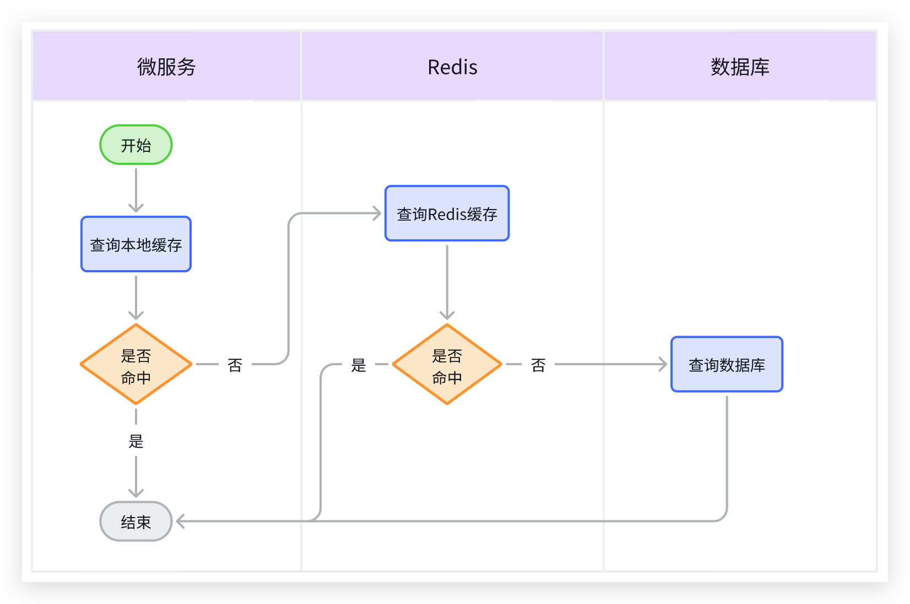

那么，本地缓存究竟是什么呢？åˆè¯¥å¦‚何å®ç°å‘¢ï¼Ÿ

<br/>

本地缓存简å•æ¥è¯´å°±æ˜¯JVM内存的缓存，比如你建立一个HashMap，把数æ®åº“查询的数æ®å­˜å…¥è¿›å»ã€‚以å优先ä»è¿™ä¸ªHashMap查询，一个本地缓存就建立好了。

本地缓存优点：

- 读å–本地内存，没有网络开销，速度更快

本地缓存缺点：

- æ•°æ®åŒæ­¥å›°éš¾ï¼Œä¸€èˆ¬é‡‡ç”¨è‡ªåŠ¨è¿‡æœŸæ–¹æ¡ˆ
- 存储容é‡æœ‰é™ã€å¯é æ€§è¾ƒä½ã€æ— æ³•å…±äº«

<br/>

本地缓存由äºæ— éœ€ç½‘络查询，速度é常快。ä¸è¿‡ç”±äºä¸Šè¿°ç¼ºç‚¹ï¼Œæœ¬åœ°ç¼“存往往适用äº**æ•°æ®é‡å°**ã€**æ›´æ–°ä¸é¢‘ç¹**çš„æ•°æ®ã€‚而课程分类æ°å¥½ç¬¦åˆã€‚

<br/>

##### Caffeine

当然，我们真正创建本地缓存的时候并ä¸æ˜¯ç›´æ¥ä½¿ç”¨HashMap之类的集åˆï¼Œå› ä¸ºç»´æŠ¤èµ·æ¥ä¸å¤ªæ–¹ä¾¿ã€‚而且内存淘汰机制å®ç°èµ·æ¥ä¹Ÿæ¯”较麻烦。

所以，我们会使用æˆç†Ÿçš„框æ¶æ¥å®Œæˆï¼Œæ¯”如Caffeine：

**Caffeine**是一个基äºJava8å¼€å‘的，æ供了近ä¹æœ€ä½³å‘½ä¸­ç‡çš„高性能的本地缓存库。目å‰Spring内部的缓存使用的就是Caffeine。GitHub地å€ï¼šhttps://github.com/ben-manes/caffeine

Caffeine的性能é常好，下图是官方给出的几ç§å¸¸è§çš„本地缓存å®ç°æ–¹æ¡ˆçš„性能对比：

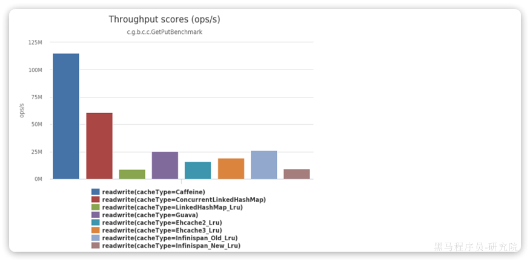

å¯ä»¥çœ‹åˆ°Caffeine的性能é¥é¥é¢†å…ˆï¼

<br/>

缓存使用的基本API：

```Java
@Test
void testBasicOps() {
    // æ„建cache对象
    Cache<String, String> cache = Caffeine.newBuilder().build();

    // 存数æ®
    cache.put("gf", "迪丽热巴");

    // å–æ•°æ®
    String gf = cache.getIfPresent("gf");
    System.out.println("gf = " + gf);

    // å–æ•°æ®ï¼ŒåŒ…å«ä¸¤ä¸ªå‚数：
    // å‚数一：缓存的key
    // å‚数二：Lambda表达å¼ï¼Œè¡¨è¾¾å¼å‚数就是缓存的key，方法体是查询数æ®åº“的逻辑
    // 优先根æ®key查询JVM缓存，如æœæœªå‘½ä¸­ï¼Œåˆ™æ‰§è¡Œå‚数二的Lambda表达å¼
    String defaultGF = cache.get("defaultGF", key -> {
        // æ ¹æ®keyå»æ•°æ®åº“查询数æ®
        return "柳岩";
    });
    System.out.println("defaultGF = " + defaultGF);
}
```

Caffeine既然是缓存的一ç§ï¼Œè‚¯å®šéœ€è¦æœ‰ç¼“存的清除策略，ä¸ç„¶çš„è¯å†…存总会有耗尽的时候。

<br/>

Caffeineæ供了三ç§ç¼“存驱é€ç­–略：

-  **基äºå®¹é‡**：设置缓存的数é‡ä¸Šé™ 

```Java
// 创建缓存对象
Cache<String, String> cache = Caffeine.newBuilder()
    .maximumSize(1) // 设置缓存大å°ä¸Šé™ä¸º 1
    .build();
```

 <br/>

-  **基äºæ—¶é—´**：设置缓存的有效时间 

```Java
// 创建缓存对象
Cache<String, String> cache = Caffeine.newBuilder()
    // 设置缓存有效期为 10 秒，ä»æœ€å一次写入开始计时 
    .expireAfterWrite(Duration.ofSeconds(10)) 
    .build();
```

 <br/>

-  **基äºå¼•ç”¨**：设置缓存为软引用或弱引用，利用GCæ¥å›æ”¶ç¼“存数æ®ã€‚性能较差，ä¸å»ºè®®ä½¿ç”¨ã€‚ 

<br/>

**注æ„**：在默认情况下，当一个缓存元素过期的时候，Caffeineä¸ä¼šè‡ªåŠ¨ç«‹å³å°†å…¶æ¸…ç†å’Œé©±é€ã€‚而是在一次读或写æ“作å，或者在空闲时间完æˆå¯¹å¤±æ•ˆæ•°æ®çš„驱é€ã€‚

<br/>

##### 课程分类的本地缓存

å…¶å®ï¼Œåœ¨ `tj-api` 模å—中，已ç»å®šä¹‰å¥½äº†å•†å“分类的本地缓存：


其中`CategoryCacheConfig`是Caffeine的缓存é…置：

```Java
package com.tianji.api.config;

import com.github.benmanes.caffeine.cache.Cache;
import com.github.benmanes.caffeine.cache.Caffeine;
import com.tianji.api.cache.CategoryCache;
import com.tianji.api.client.course.CategoryClient;
import com.tianji.api.dto.course.CategoryBasicDTO;
import org.springframework.context.annotation.Bean;

import java.time.Duration;
import java.util.Map;

public class CategoryCacheConfig {
    /**
     * 课程分类的caffeine缓存
     */
    @Bean
    public Cache<String, Map<Long, CategoryBasicDTO>> categoryCaches(){
        return Caffeine.newBuilder()
                .initialCapacity(1) // 容é‡é™åˆ¶
                .maximumSize(10_000) // 最大内存é™åˆ¶
                .expireAfterWrite(Duration.ofMinutes(30)) // 有效期
                .build();
    }
    /**
     * 课程分类的缓存工具类
     */
    @Bean
    public CategoryCache categoryCache(
            Cache<String, Map<Long, CategoryBasicDTO>> categoryCaches, CategoryClient categoryClient){
        return new CategoryCache(categoryCaches, categoryClient);
    }
}
```

而`CategoryCache`则是缓存使用的工具类。由äºå•†å“分类ç»å¸¸éœ€è¦æ ¹æ®id查询，因此我根æ®id查询分类的å„ç§API：

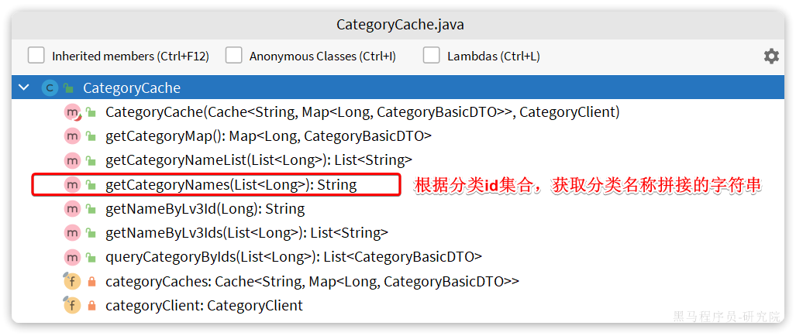

这样，在任何微æœåŠ¡ä¸­ï¼Œåªè¦å¼•å…¥`tj-api`，我们就能é常方便并且高性能的è·å–分类å称了。

<br/>

:::warning 💡 **注æ„**：

在CategoryCache中我们åªåˆ©ç”¨Caffeineå®ç°äº†æœ¬åœ°ç¼“存。当缓存未命中时，我们会å»è°ƒç”¨course-serviceæ供的CategoryClientæ供的方法查询分类数æ®ï¼Œè€Œä¸æ˜¯å»æŸ¥è¯¢Redis。

如æœè¦å®ç°å¤šçº§ç¼“存，å¯ä»¥åœ¨course-serviceæœåŠ¡ä¸­å®ç°åˆ†ç±»æŸ¥è¯¢çš„æ¥å£å†…添加Redis缓存，大家å¯ä»¥è‡ªè¡Œå®ç°ã€‚

:::

<br/>

##### å®ç°åˆ†é¡µæŸ¥è¯¢

最终，`InteractionQuestionServiceImpl`代ç å¦‚下：

```Java
@Override
public PageDTO<QuestionAdminVO> queryQuestionPageAdmin(QuestionAdminPageQuery query) {
    // 1.处ç†è¯¾ç¨‹å称，得到课程id
    List<Long> courseIds = null;
    if (StringUtils.isNotBlank(query.getCourseName())) {
        courseIds = searchClient.queryCoursesIdByName(query.getCourseName());
        if (CollUtils.isEmpty(courseIds)) {
            return PageDTO.empty(0L, 0L);
        }
    }
    // 2.分页查询
    Integer status = query.getStatus();
    LocalDateTime begin = query.getBeginTime();
    LocalDateTime end = query.getEndTime();
    Page<InteractionQuestion> page = lambdaQuery()
            .in(courseIds != null, InteractionQuestion::getCourseId, courseIds)
            .eq(status != null, InteractionQuestion::getStatus, status)
            .gt(begin != null, InteractionQuestion::getCreateTime, begin)
            .lt(end != null, InteractionQuestion::getCreateTime, end)
            .page(query.toMpPageDefaultSortByCreateTimeDesc());
    List<InteractionQuestion> records = page.getRecords();
    if (CollUtils.isEmpty(records)) {
        return PageDTO.empty(page);
    }

    // 3.准备VO需è¦çš„æ•°æ®ï¼šç”¨æˆ·æ•°æ®ã€è¯¾ç¨‹æ•°æ®ã€ç« èŠ‚æ•°æ®
    Set<Long> userIds = new HashSet<>();
    Set<Long> cIds = new HashSet<>();
    Set<Long> cataIds = new HashSet<>();
    // 3.1.è·å–å„ç§æ•°æ®çš„id集åˆ
    for (InteractionQuestion q : records) {
        userIds.add(q.getUserId());
        cIds.add(q.getCourseId());
        cataIds.add(q.getChapterId());
        cataIds.add(q.getSectionId());
    }
    // 3.2.æ ¹æ®id查询用户
    List<UserDTO> users = userClient.queryUserByIds(userIds);
    Map<Long, UserDTO> userMap = new HashMap<>(users.size());
    if (CollUtils.isNotEmpty(users)) {
        userMap = users.stream().collect(Collectors.toMap(UserDTO::getId, u -> u));
    }

    // 3.3.æ ¹æ®id查询课程
    List<CourseSimpleInfoDTO> cInfos = courseClient.getSimpleInfoList(cIds);
    Map<Long, CourseSimpleInfoDTO> cInfoMap = new HashMap<>(cInfos.size());
    if (CollUtils.isNotEmpty(cInfos)) {
        cInfoMap = cInfos.stream().collect(Collectors.toMap(CourseSimpleInfoDTO::getId, c -> c));
    }

    // 3.4.æ ¹æ®id查询章节
    List<CataSimpleInfoDTO> catas = catalogueClient.batchQueryCatalogue(cataIds);
    Map<Long, String> cataMap = new HashMap<>(catas.size());
    if (CollUtils.isNotEmpty(catas)) {
        cataMap = catas.stream()
                .collect(Collectors.toMap(CataSimpleInfoDTO::getId, CataSimpleInfoDTO::getName));
    }


    // 4.å°è£…VO
    List<QuestionAdminVO> voList = new ArrayList<>(records.size());
    for (InteractionQuestion q : records) {
        // 4.1.å°†PO转VO，å±æ€§æ‹·è´
        QuestionAdminVO vo = BeanUtils.copyBean(q, QuestionAdminVO.class);
        voList.add(vo);
        // 4.2.用户信æ¯
        UserDTO user = userMap.get(q.getUserId());
        if (user != null) {
            vo.setUserName(user.getName());
        }
        // 4.3.课程信æ¯ä»¥åŠåˆ†ç±»ä¿¡æ¯
        CourseSimpleInfoDTO cInfo = cInfoMap.get(q.getCourseId());
        if (cInfo != null) {
            vo.setCourseName(cInfo.getName());
            vo.setCategoryName(categoryCache.getCategoryNames(cInfo.getCategoryIds()));
        }
        // 4.4.章节信æ¯
        vo.setChapterName(cataMap.getOrDefault(q.getChapterId(), ""));
        vo.setSectionName(cataMap.getOrDefault(q.getSectionId(), ""));
    }
    return PageDTO.of(page, voList);
```

<br/>

### 管ç†ç«¯éšè—或显示问题（练习）

#### æ¥å£åˆ†æ

在管ç†ç«¯çš„互动问题列表中，管ç†å‘˜å¯ä»¥éšè—æŸä¸ªé—®é¢˜ï¼Œè¿™æ ·å°±ä¸ä¼šåœ¨ç”¨æˆ·ç«¯é¡µé¢å±•ç¤ºäº†ï¼š


ç”±äº`interaction_question`表中有一个`hidden`字段æ¥è¡¨ç¤ºæ˜¯å¦éšè—：

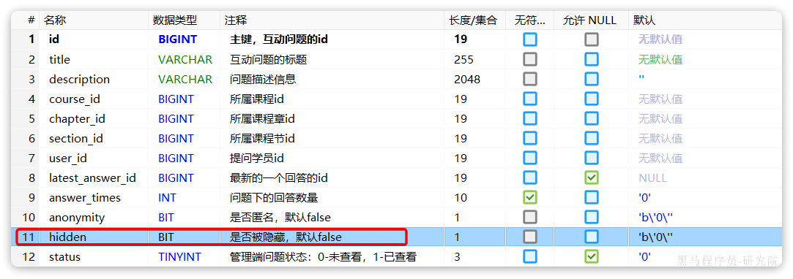

因此，本质æ¥è¯´ï¼Œè¿™ä¸ªæ¥å£æ˜¯ä¸€ä¸ªä¿®æ”¹æŸå­—段值的æ¥å£ï¼Œå¹¶ä¸å¤æ‚。

我们按照Restfulçš„é£æ ¼æ¥è®¾å®šï¼Œæ¥å£ä¿¡æ¯å¦‚下：

- **æ¥å£åœ°å€**:`/admin/questions/{id}/hidden/{hidden}`
- **请求方å¼**:`PUT`
- **请求å‚æ•°**: 路径å ä½ç¬¦å‚æ•°
  - id：问题id
  - hidden：是å¦éšè—

<br/>

#### 代ç å®ç°ï¼ˆç»ƒä¹ ï¼‰

<br/>

### 管ç†ç«¯æ ¹æ®id查询问题详情（练习）

#### æ¥å£åˆ†æ

在管ç†ç«¯çš„问题管ç†é¡µé¢ï¼Œç‚¹å‡»æŸ¥çœ‹æŒ‰é’®å°±ä¼šè¿›å…¥é—®é¢˜è¯¦æƒ…页：


问题详情页如下：


å¯ä»¥çœ‹åˆ°ï¼Œè¿™é‡Œéœ€è¦æŸ¥è¯¢çš„æ•°æ®è¿˜æ˜¯æ¯”较多的，包å«ï¼š

- 问题标题
- 问题æè¿°
- æ问者信æ¯
  - id
  - 昵称
  - 头åƒ
- 课程三级分类
- 课程å称
- **课程负责è€å¸ˆ**
- 课程所å±ç« èŠ‚
- å›ç­”æ•°é‡
- 用户端是å¦æ˜¾ç¤º

<br/>

è¿”å›å€¼ä¸ç®¡ç†ç«¯åˆ†é¡µæŸ¥è¯¢åŸºæœ¬ä¸€è‡´ï¼Œå¤šäº†ä¸€ä¸ªè¯¾ç¨‹è´Ÿè´£è€å¸ˆä¿¡æ¯ã€‚所以我们沿用之å‰çš„`QuestionAdminVO`å³å¯ã€‚但是需è¦æ·»åŠ ä¸€ä¸ªè¯¾ç¨‹è´Ÿè´£è€å¸ˆçš„字段：

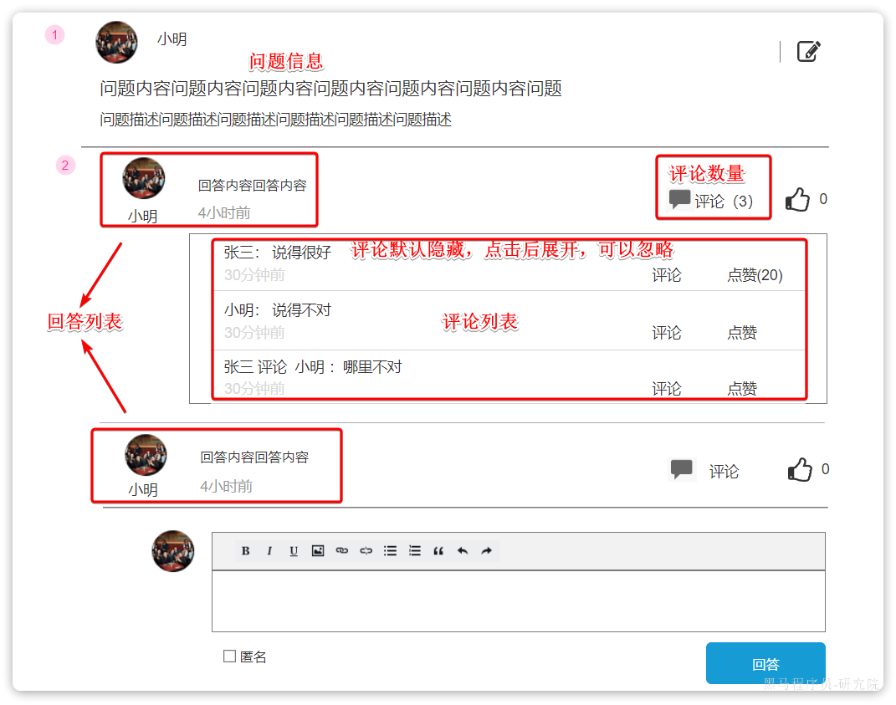

虽然用户端也有根æ®id查询问题，但是返å›å€¼ä¸ç”¨æˆ·ç«¯å­˜åœ¨è¾ƒå¤§å·®å¼‚，所以我们需è¦å¦å¤–设计一个æ¥å£ã€‚

按照Restfulé£æ ¼ï¼Œæ¥å£ä¿¡æ¯å¦‚下：

- **æ¥å£åœ°å€**: `/admin/questions/{id}`
- **请求方å¼**: `GET`
- **请求å‚æ•°**: 路径å ä½ç¬¦æ ¼å¼
- **è¿”å›å€¼**：ä¸åˆ†é¡µæŸ¥è¯¢å…±äº«VO，这里ä¸å†èµ˜è¿°

<br/>

**注æ„**：

问题表中有一个status字段，标记管ç†å‘˜æ˜¯å¦å·²ç»æŸ¥çœ‹è¿‡è¯¥é—®é¢˜ã€‚å› æ­¤æ¯å½“调用根æ®id查询问题æ¥å£ï¼Œæˆ‘们å¯ä»¥è®¤ä¸ºç®¡ç†å‘˜æŸ¥çœ‹äº†è¯¥é—®é¢˜ï¼Œåº”该将问题status标记为**已查看**。

#### 代ç å®ç°ï¼ˆç»ƒä¹ ï¼‰

## 评论相关æ¥å£ï¼ˆç»ƒä¹ ï¼‰

评论相关æ¥å£æœ‰å››ä¸ªï¼š

- æ–°å¢å›ç­”或评论
- 分页查询å›ç­”或评论
- 管ç†ç«¯åˆ†é¡µæŸ¥è¯¢å›ç­”或评论
- 管ç†ç«¯éšè—或显示å›ç­”或评论

### æ–°å¢å›ç­”或评论（练习）

#### æ¥å£åˆ†æ

å…ˆæ¥çœ‹ä¸‹å›ç­”或评论的表å•åŸå‹å›¾ï¼š

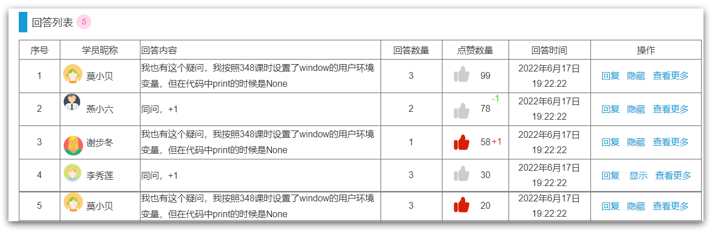

å›å¤æœ¬èº«åªæœ‰ä¸€ä¸ªç®€å•å±æ€§ï¼š

- å›å¤å†…容

一个功能å±æ€§ï¼š

- 是å¦åŒ¿å

一个关è”å±æ€§ï¼š

- 问题id：å›ç­”è¦å…³è”æŸä¸ªé—®é¢˜

<br/>

如æœæ˜¯é’ˆå¯¹æŸä¸ªå›ç­”å‘表的评论，则有新的关è”å±æ€§ï¼š

- å›ç­”id：评论是在哪个å›ç­”下é¢çš„
- 目标评论id：当å‰è¯„论是针对哪一æ¡è¯„论的
- 目标用户id：当å‰è¯„论是针对哪一个用户的

<br/>

如æœæ˜¯å›ç­”，则åªéœ€è¦å‰3个å±æ€§å³å¯ã€‚如æœæ˜¯è¯„论，则还需è¦è¡¥å……最åçš„3个å±æ€§ã€‚

ç”±äºæˆ‘们把会å›ç­”和评论æ¥å£åˆå¹¶ï¼Œå› æ­¤ä»¥ä¸Šå±æ€§éƒ½åº”该作为表å•å‚数。

<br/>

需è¦æ³¨æ„的是，在新å¢å›ç­”或评论时，除了è¦æŠŠæ•°æ®å†™å…¥`interaction_reply`表，还有几件事情è¦åšï¼š

- 判断当å‰æ交的是å¦æ˜¯å›ç­”，如æœæ˜¯éœ€è¦åœ¨`interaction_question`中记录最新一次å›ç­”çš„id
- 判断æ交评论的用户是å¦æ˜¯å­¦ç”Ÿï¼Œå¦‚æœæ˜¯æ ‡è®°é—®é¢˜çŠ¶æ€ä¸ºæœªæŸ¥çœ‹

因此我们的业务æµç¨‹åº”该是这样的：

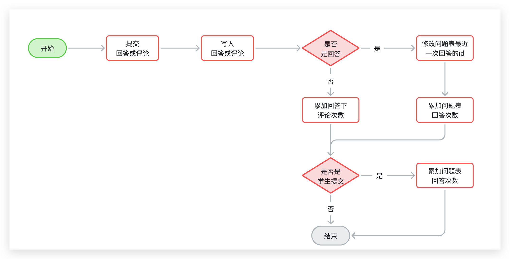

为了方便判断是å¦æ˜¯å­¦ç”Ÿæ交的å›ç­”，我们å¯ä»¥åœ¨å‰ç«¯ä¼ é€’一个å‚数：

- isStudent：标记当å‰å›ç­”是å¦æ˜¯å­¦ç”Ÿæ交的

<br/>

综上，按照Restful的规范设计，æ¥å£ä¿¡æ¯å¦‚下：


<br/>

#### å®ä½“ç±»

按照å‰é¢çš„æ¥å£åˆ†æ，首先定义请求å‚æ•°DTO，在课å‰èµ„料中已ç»æ供了：

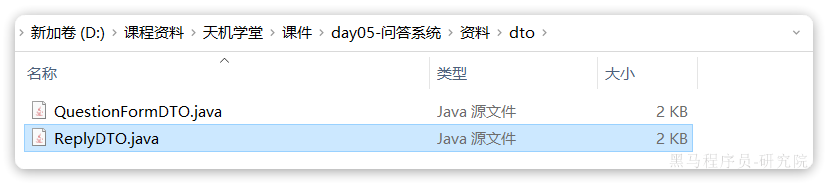

#### 代ç å®ç°


### 分页查询å›ç­”或评论列表（练习）

#### æ¥å£åˆ†æ

问题详情页，除了展示问题详情外，最é‡è¦çš„就是å›ç­”列表了，åŸå‹å›¾å¦‚下：


我们先æ¥åˆ†æå›ç­”列表，需è¦å±•ç¤ºçš„内容包括：

- å›ç­”id
- å›ç­”内容
- 是å¦åŒ¿å
- å›ç­”人信æ¯ï¼ˆå¦‚æœæ˜¯åŒ¿å，则无需返å›ï¼‰
  - id
  - 昵称
  - 头åƒ
- å›ç­”时间
- 评论数é‡
- 点èµæ•°é‡

请求å‚数就是问题的id。ä¸è¿‡éœ€è¦æ³¨æ„的是，一个问题下的å›ç­”比较多，所以一次åªèƒ½å±•ç¤ºä¸€éƒ¨åˆ†ï¼Œæ›´å¤šæ•°æ®ä¼šé‡‡ç”¨æ»šåŠ¨æ‡’加载模å¼ã€‚简å•æ¥è¯´è¯´å°±æ˜¯åˆ†é¡µæŸ¥è¯¢ï¼Œæ‰€ä»¥ä¹Ÿè¦å¸¦ä¸Šåˆ†é¡µå‚数。

<br/>

å†æ¥çœ‹ä¸€ä¸‹å›ç­”下的评论列表：


仔细观察åå¯ä»¥å‘ç°ï¼Œéœ€è¦å±•ç¤ºçš„æ•°æ®ä¸å›ç­”åŠå…¶ç›¸ä¼¼ï¼Œéƒ½åŒ…括：

- 评论id
- 评论内容
- 是å¦åŒ¿å
- 评论人信æ¯ï¼ˆå¦‚æœæ˜¯åŒ¿å，则无需返å›ï¼‰
  - id
  - 昵称
  - 头åƒ
- å›ç­”时间
- 评论数é‡(无）
- 点èµæ•°é‡
- **目标用户昵称（评论特有）**

ä»è¿”å›ç»“æœæ¥çœ‹ï¼šç›¸æ¯”å›ç­”列表，评论无需展示评论下的评论数é‡ï¼Œä½†æ˜¯éœ€è¦å±•ç¤ºç›®æ ‡ç”¨æˆ·çš„昵称，因为评论是针对æŸä¸ªç›®æ ‡çš„。

ä»æŸ¥è¯¢å‚æ•°æ¥çœ‹ï¼šæŸ¥è¯¢è¯„论需è¦çŸ¥é“å›ç­”çš„id，这点ä¸æŸ¥è¯¢å›ç­”列表ä¸å¤ªä¸€æ ·ã€‚

综上，按照Restful的规范设计，æ¥å£ä¿¡æ¯å¦‚下：

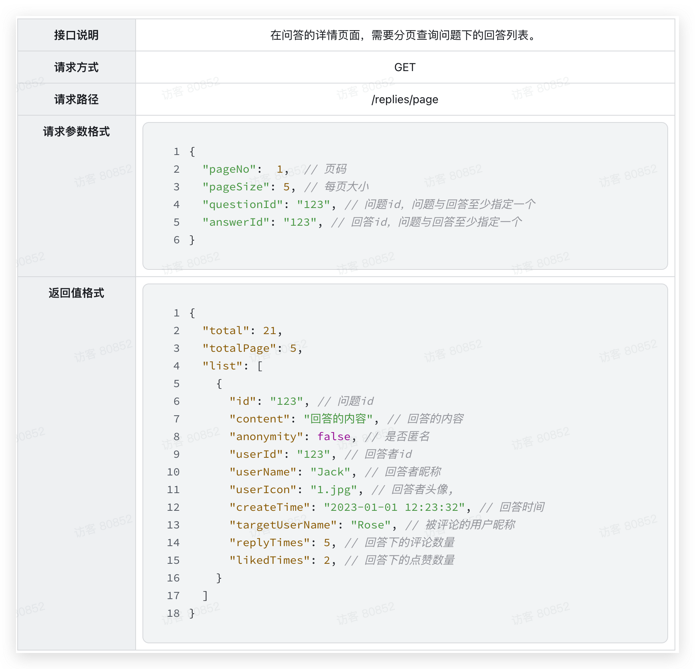

:::warning 💡注æ„：

分页查询时默认è¦æŒ‰ç…§ç‚¹èµæ¬¡æ•°æ’åºã€‚

页é¢å±•ç¤ºç‚¹èµæŒ‰é’®æ—¶ï¼Œå¦‚æœç‚¹èµè¿‡ä¼šé«˜äº®æ˜¾ç¤ºã€‚因此我们è¦åœ¨è¿”å›å€¼ä¸­æ ‡è®°å½“å‰ç”¨æˆ·æ˜¯å¦ç‚¹èµè¿‡è¿™æ¡è¯„论或å›ç­”。

但点èµåŠŸèƒ½æˆ‘们暂未å®ç°ï¼Œè¿™ä¸¤éƒ¨åˆ†å¤§å®¶æš‚时无需å®ç°ã€‚

:::

<br/>

#### å®ä½“ç±»

请求入å‚，是一个Queryå®ä½“，在课å‰èµ„料的query目录下：


è¿”å›å€¼ï¼Œæ˜¯ä¸€ä¸ªVOå®ä½“，在课å‰èµ„料的vo目录下：

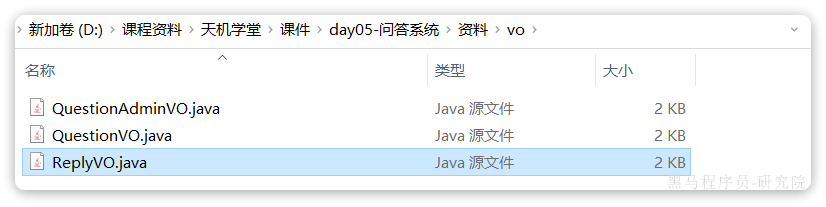

#### 代ç å®ç°

### 管ç†ç«¯åˆ†é¡µæŸ¥è¯¢å›ç­”或评论列表（练习）

#### æ¥å£åˆ†æ

管ç†ç«¯æŸ¥è¯¢å›ç­”列表åŸå‹å¦‚下：


å¯ä»¥çœ‹åˆ°ï¼Œè¿”å›çš„æ•°æ®æ ¼å¼åŒ…å«ï¼š

- 评论id
- 评论内容
- 评论人信æ¯
  - id
  - 昵称
  - 头åƒ
  - ç±»å‹
- å›ç­”时间
- 评论数é‡ï¼ˆå›ç­”时有）
- 点èµæ•°é‡
- 目标用户昵称（评论特有）
- **是å¦è¢«éšè—（管ç†ç«¯ç‰¹æœ‰ï¼‰**

ä¸ç”¨æˆ·ç«¯æŸ¥è¯¢å‡ ä¹å®Œå…¨ä¸€è‡´ã€‚

那有åŒå­¦ä¼šæœ‰ç–‘问了，这里为什么ä¸ä½¿ç”¨åŒä¸€ä¸ªæ¥å£ï¼Ÿ

<br/>

åŸå› æœ‰ä¸¤ç‚¹ï¼š

- 管ç†ç«¯åœ¨ç»Ÿè®¡è¯„论数é‡çš„时候，被éšè—的评论也è¦ç»Ÿè®¡ï¼ˆç”¨æˆ·ç«¯ä¸ç»Ÿè®¡éšè—å›ç­”）
- 管ç†ç«¯æ— è§†åŒ¿å，所有评论都è¦è¿”å›ç”¨æˆ·ä¿¡æ¯ï¼›ç”¨æˆ·ç«¯åŒ¿å评论ä¸è¿”å›ç”¨æˆ·ä¿¡æ¯ã€‚

所以大家在å®ç°çš„时候，基本逻辑å¯ä»¥ä¸ç”¨æˆ·ç«¯åˆ†é¡µä¸€è‡´ï¼Œä½†ç»Ÿè®¡è¯„论数é‡ã€å¤„ç†ç”¨æˆ·ä¿¡æ¯æ—¶ï¼Œéœ€è¦åŒºåˆ«å¯¹å¾…。

<br/>

**为了å‡å°‘代ç é‡å¤ï¼Œå¤§å®¶å¯ä»¥å¯¹ä»£ç åšæ”¹é€ æŠ½å–，ä¸è¦é‡å¤copy代ç **。

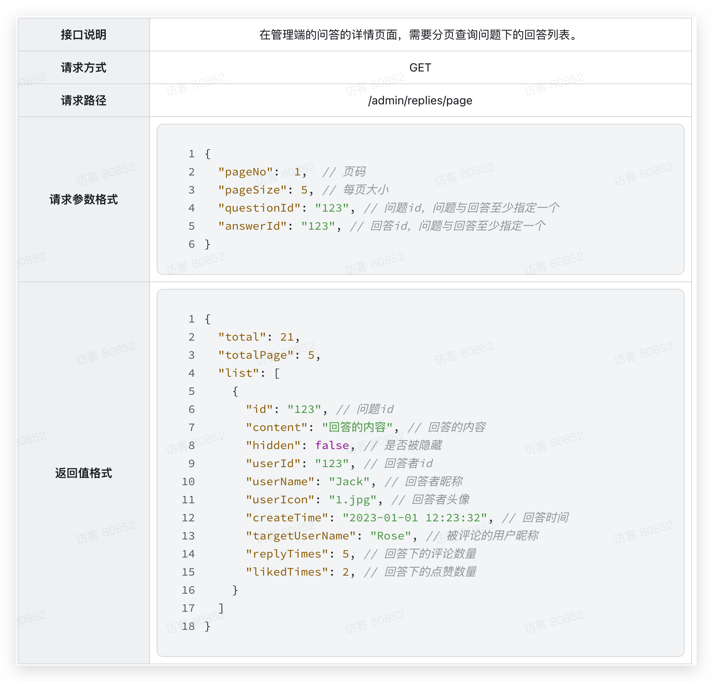

<br/>

#### å®ä½“

请求å‚数和返å›å€¼å®ä½“ä¸ç”¨æˆ·ç«¯åˆ†é¡µæŸ¥è¯¢åŸºæœ¬ä¸€è‡´ï¼Œå› æ­¤è¿™é‡Œä¸å†é‡å¤å®šä¹‰å®ä½“。ä¸è¿‡è¿”å›å€¼VO中è¦æ·»åŠ `hidden`字段，标示评论是å¦è¢«éšè—。

<br/>

### 管ç†ç«¯æ˜¾ç¤ºæˆ–éšè—评论（练习）

#### æ¥å£åˆ†æ

ä¸é—®é¢˜ç±»ä¼¼ï¼Œç®¡ç†å‘˜ä¹Ÿå¯ä»¥æ˜¾ç¤ºæˆ–éšè—æŸä¸ªè¯„论或评论：

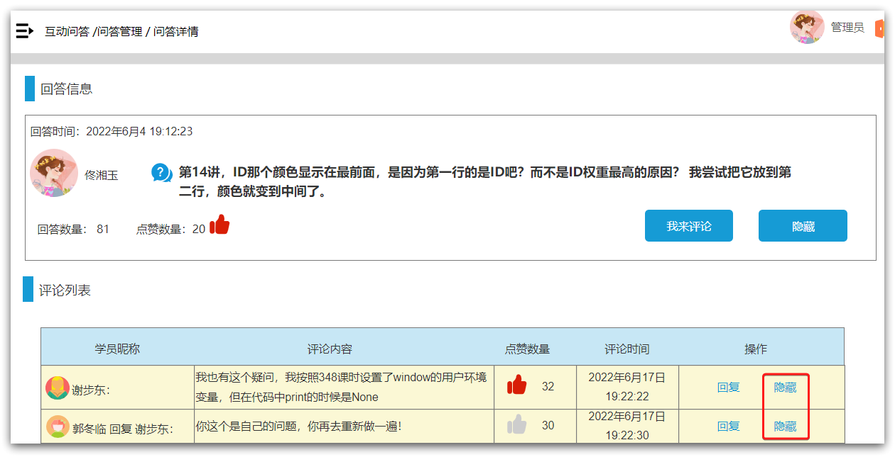

ä¸éšè—问题类似，åŒæ ·æ˜¯ä¿®æ”¹hidden字段。因此按照Restfulé£æ ¼è®¾è®¡æ¥å£å¦‚下：

<br/>

- **æ¥å£åœ°å€ï¼š**`/admin/replies/{id}/hidden/{hidden}`
- **请求方å¼ï¼š**`PUT`
- **请求å‚数：**路径å ä½ç¬¦å‚æ•°
  - id：å›ç­”或评论id
  - hidden：是å¦è¢«éšè—

**注æ„**：如æœéšè—的是å›ç­”，则å›ç­”下的评论也è¦éšè—

#### 代ç å®ç°ï¼ˆç»ƒä¹ ï¼‰
