Day08-排行榜功能
================

在昨天的学习中，我们实现了积分功能，并且也将用户的积分明细保存到了数据库。但是并没有形成排行榜。

那么排行榜该如何实现呢？

是不是简单的SQL查询就可以形成榜单呢？

今天我们就一起来分析一下。

## 实时排行榜

榜单分为两类：

- 实时榜单：也就是本赛季的榜单
- 历史榜单：也就是历史赛季的榜单

本节我们先分析一下实现实时榜单功能。

💡思考：

### 思路分析

目前，我们有一个积分记录明细表，结构如下：

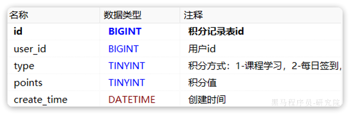

一个用户可能产生很多条积分记录，数据结构大概像这样：

| **id** | **userId** | **type** | **points** | **c_time** |
| :----: | :--------: | :------: | :--------: | :--------: |
|   1    |    9527    |    1     |     10     |            |
|   2    |    9528    |    4     |     3      |            |
|   3    |    9529    |    2     |     1      |            |
|   4    |    9528    |    2     |     7      |            |
|   5    |    9529    |    4     |     3      |            |
|   6    |    9528    |    2     |     1      |            |
|   7    |    9527    |    1     |     10     |            |
|   8    |    9529    |    4     |     3      |            |
|   9    |    9527    |    3     |     5      |            |

要想形成排行榜，我们在查询数据库时，需要先对用户分组，再对积分求和，最终按照积分和排序，Sql语句是这样：

```SQL
SELECT user_id, SUM(points) 
FROM points_record 
GROUP BY user_id ORDER BY SUM(points)
```

要知道，每个用户都可能会有数十甚至上百条积分记录，当用户规模达到百万规模，可能产生的积分记录就是数以**亿**计。

要在每次查询排行榜时，在内存中对这么多数据做分组、求和、排序，对内存和CPU的占用会非常恐怖，不太靠谱。

那该怎么办呢？

<br/>

在这里给大家介绍两种不同的实现思路：

- 方案一：基于MySQL的离线排序
- 方案二：基于Redis的SortedSet

<br/>

首先说方案一：简单来说，就是将数据库中的数据查询出来，在内存中自己利用算法实现排序，而后将排序得到的榜单保存到数据库中。但由于这个排序比较复杂，我们无法实时更新排行榜，而是每隔几分钟计算一次排行榜。这种方案实现起来比较复杂，而且实时性较差。不过优点是不会一直占用系统资源。

<br/>

再说方案二：Redis的SortedSet底层采用了跳表的数据结构，因此可以非常高效的实现排序功能，百万用户排序轻松搞定。而且每当用户积分发生变更时，我们可以实时更新Redis中的用户积分，而SortedSet也会实时更新排名。实现起来简单、高效，实时性也非常好。缺点就是需要一直占用Redis的内存，当用户量达到数千万万时，性能有一定的下降。

当系统用户量规模达到数千万，乃至数亿时，我们可以采用分治的思想，将用户数据按照积分范围划分为多个桶，例如：

0 ~ 100分、101 ~ 200分、201 ~ 300分、301 ~ 500分、501 ~ 800分、801 ~ 1200分、1201 ~ 1500分、1501 ~ 2000分

在Redis内为每个桶创建一个SortedSet类型的key，这样就可以将数据分散，减少单个KEY的数据规模了。而要计算排名时，只需要按照范围查询出用户积分所在的桶，再累加分值比他高的桶的用户数量即可。依然非常简单、高效。

<br/>

综上，我们推荐基于Redis的SortedSet来实现排行榜功能。

SortedSet的常用命令，可以参考官网：https://redis.io/commands/?group=sorted-set

<br/>

### 生成实时榜单

既然要使用Redis的SortedSet来实现排行榜，就需要在**用户每次积分变更时，累加积分到Redis的SortedSet中**。因此，我们要对之前的新增积分功能做简单改造，如图中绿色部分：

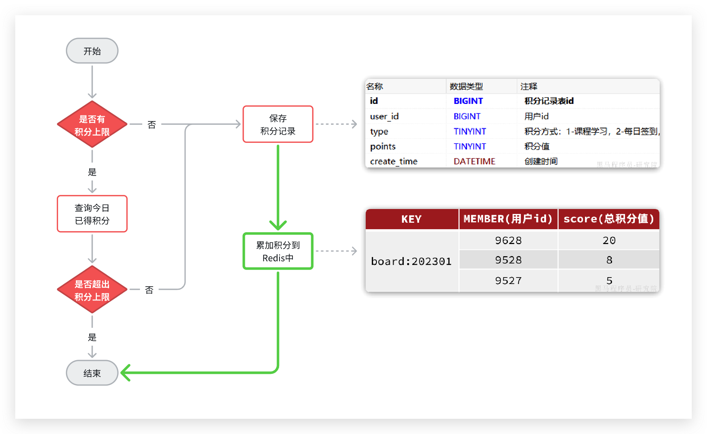

在Redis中，使用SortedSet结构，**以赛季的日期为key，以用户id为member，以积分和为score. 每当用户新增积分，就累加到score中**，SortedSet排名就会实时更新。这样一个实时的当前赛季榜单就出现了。

<br/>

#### 定义Redis的KEY前缀

在`tj-learning`的`RedisConstants`中定义一个新的KEY前缀：

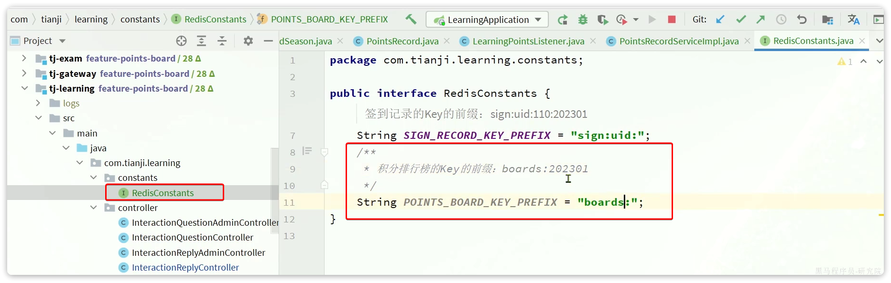

注意，KEY的后缀是时间戳，我们最好定义一个`DateTimeFormatter`，方便后期使用。因此，我们需要修改`tj-commom`中的`DateUtils`，添加一个`DateTimeFormatter`的常量：

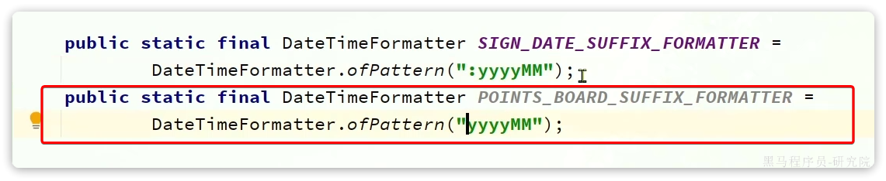

<br/>

#### 更新积分到Redis

接下来，我们改造tj-learning中的`com.tianji.learning.service.impl.PointsRecordServiceImpl`，首先注入`StringRedisTemplate`：

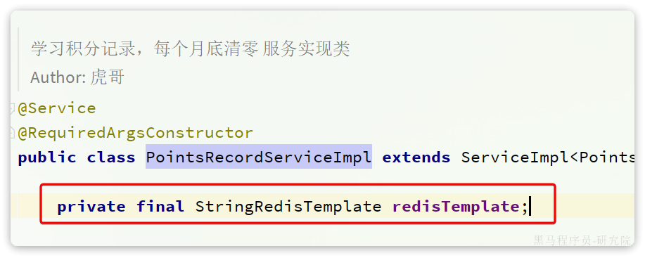

<br/>

然后，改造其中的`addPointsRecord`方法，添加积分到Redis中：

```Java
@Override
public void addPointsRecord(Long userId, int points, PointsRecordType type) {
    LocalDateTime now = LocalDateTime.now();
    int maxPoints = type.getMaxPoints();
    // 1.判断当前方式有没有积分上限
    int realPoints = points;
    if(maxPoints > 0) {
        // 2.有，则需要判断是否超过上限
        LocalDateTime begin = DateUtils.getDayStartTime(now);
        LocalDateTime end = DateUtils.getDayEndTime(now);
        // 2.1.查询今日已得积分
        int currentPoints = queryUserPointsByTypeAndDate(userId, type, begin, end);
        // 2.2.判断是否超过上限
        if(currentPoints >= maxPoints) {
            // 2.3.超过，直接结束
            return;
        }
        // 2.4.没超过，保存积分记录
        if(currentPoints + points > maxPoints){
            realPoints = maxPoints - currentPoints;
        }
    }
    // 3.没有，直接保存积分记录
    PointsRecord p = new PointsRecord();
    p.setPoints(realPoints);
    p.setUserId(userId);
    p.setType(type);
    save(p);
    // 4.更新总积分到Redis
    String key = RedisConstants.POINTS_BOARD_KEY_PREFIX + now.format(DateUtils.POINTS_BOARD_SUFFIX_FORMATTER);
    redisTemplate.opsForZSet().incrementScore(key, userId.toString(), realPoints);
}
```

<br/>

### 查询积分榜

 在个人中心，学生可以查看指定赛季积分排行榜（只显示前100 ），还可以查看自己总积分和排名。而且排行榜分为本赛季榜单和历史赛季榜单。

我们可以在一个接口中同时实现这两类榜单的查询。

<br/>

#### 分析和设计接口

首先，我们来看一下页面原型（这里我给出的是原型对应的设计稿，也就是最终前端设计的页面效果）：

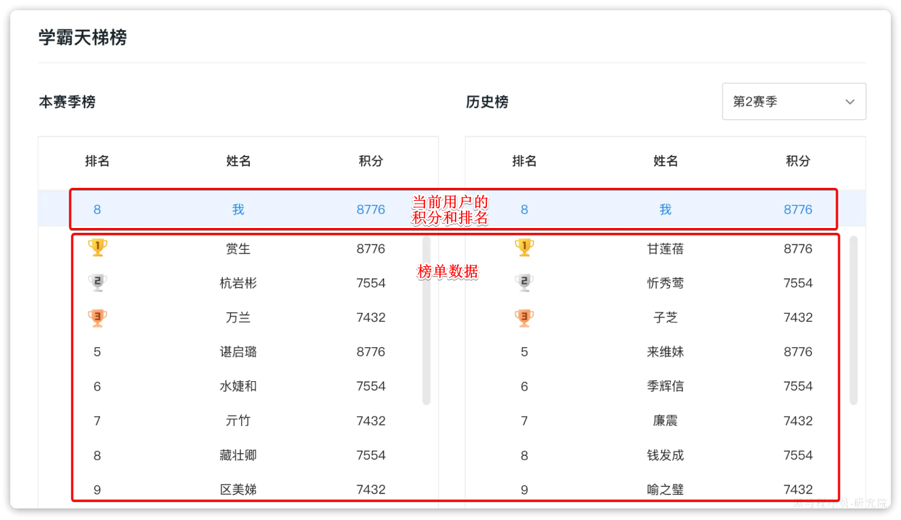

首先我们分析一下请求参数：

- 榜单数据非常多，不可能一次性查询出来，因此这里一定是分页查询（滚动分页），需要分页参数。
- 由于要查询历史榜单需要知道赛季，因此参数中需要指定赛季id。当赛季id为空，我们认定是查询当前赛季。这样就可以把两个接口合二为一。

然后是返回值，无论是历史榜单还是当前榜单，结构都一样。分为两部分：

- 当前用户的积分和排名。当前用户不一定上榜，因此需要单独查询
- 榜单数据。就是N个用户的积分、排名形成的集合。

<br/>

综上，接口信息如下：

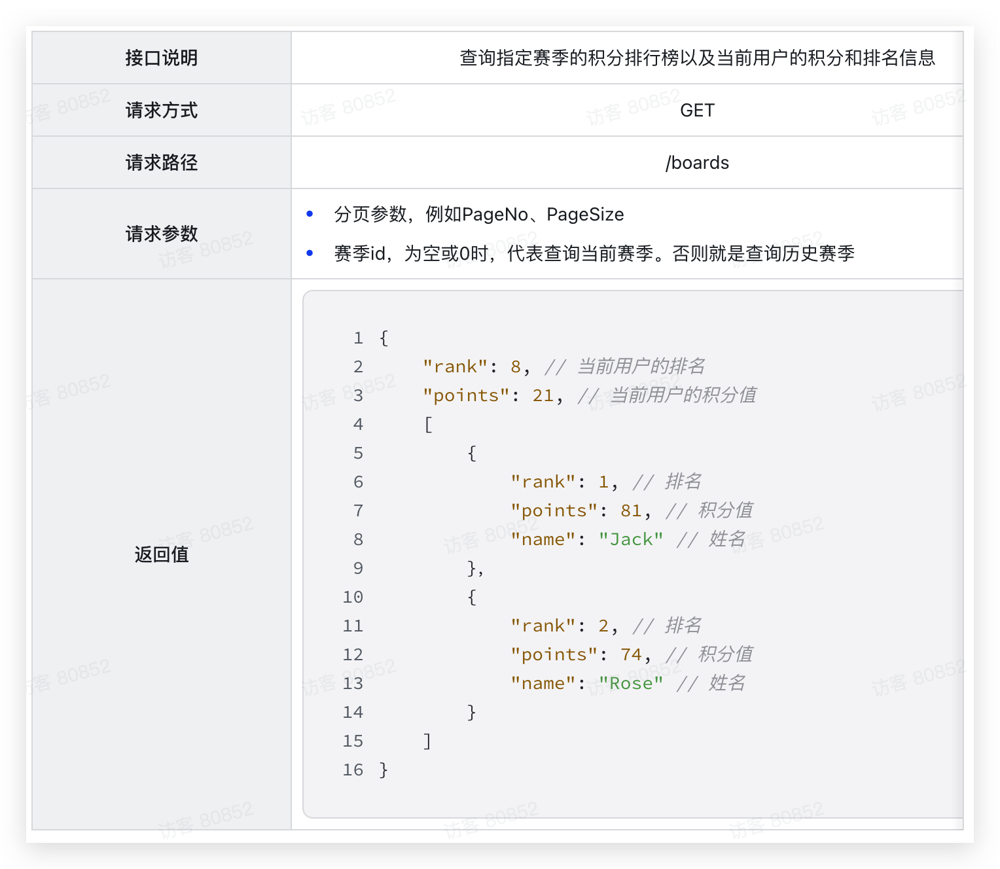
<br/>

#### 实体类

查询积分排行榜接口中包括3个实体：

- 查询条件QUERY实体
- 分页返回结果VO实体
- 分页中每一条数据的VO实体

这些在课前资料中都提供好了。

首先是QUERY实体：

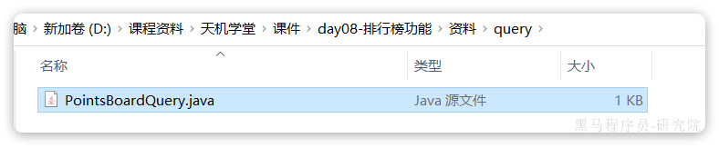

然后是分页VO实体、分页条目VO实体：

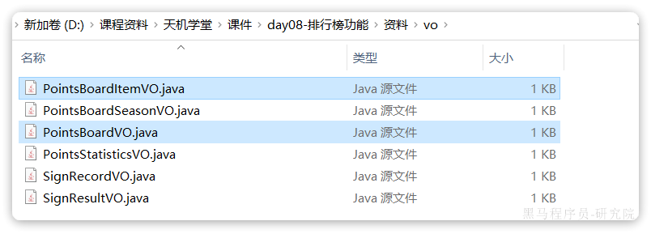

<br/>

#### 实现接口

首先，在`tj-learning`的`com.tianji.learning.controller.PointsBoardController`中定义接口：

```Java
package com.tianji.learning.controller;

import com.tianji.common.utils.BeanUtils;
import com.tianji.common.utils.CollUtils;
import com.tianji.learning.domain.po.PointsBoardSeason;
import com.tianji.learning.domain.query.PointsBoardQuery;
import com.tianji.learning.domain.vo.PointsBoardVO;
import com.tianji.learning.service.IPointsBoardService;
import io.swagger.annotations.Api;
import io.swagger.annotations.ApiOperation;
import lombok.RequiredArgsConstructor;
import org.springframework.web.bind.annotation.GetMapping;
import org.springframework.web.bind.annotation.RequestMapping;
import org.springframework.web.bind.annotation.RestController;

import java.time.LocalDateTime;
import java.util.List;

/**
 * <p>
 * 学霸天梯榜 控制器
 * </p>
 */
@RestController
@RequiredArgsConstructor
@RequestMapping("/boards")
@Api(tags = "积分相关接口")
public class PointsBoardController {

    private final IPointsBoardService pointsBoardService;

    @GetMapping
    @ApiOperation("分页查询指定赛季的积分排行榜")
    public PointsBoardVO queryPointsBoardBySeason(PointsBoardQuery query){
        return pointsBoardService.queryPointsBoardBySeason(query);
    }

}
```

<br/>

然后，在`com.tianji.learning.service.IPointsBoardService`中定义service方法：

```Java
package com.tianji.learning.service;

import com.baomidou.mybatisplus.extension.service.IService;
import com.tianji.learning.domain.po.PointsBoard;
import com.tianji.learning.domain.query.PointsBoardQuery;
import com.tianji.learning.domain.vo.PointsBoardVO;

import java.util.List;

/**
 * <p>
 * 学霸天梯榜 服务类
 * </p>
 */
public interface IPointsBoardService extends IService<PointsBoard> {
    PointsBoardVO queryPointsBoardBySeason(PointsBoardQuery query);
}
```

<br/>

然后，在`com.tianji.learning.service.impl.PointsBoardServiceImpl`中实现方法：

```Java
package com.tianji.learning.service.impl;

import com.baomidou.mybatisplus.extension.plugins.pagination.Page;
import com.baomidou.mybatisplus.extension.service.impl.ServiceImpl;
import com.tianji.api.client.user.UserClient;
import com.tianji.api.dto.user.UserDTO;
import com.tianji.common.utils.CollUtils;
import com.tianji.common.utils.DateUtils;
import com.tianji.common.utils.UserContext;
import com.tianji.learning.constants.RedisConstants;
import com.tianji.learning.domain.po.PointsBoard;
import com.tianji.learning.domain.query.PointsBoardQuery;
import com.tianji.learning.domain.vo.PointsBoardItemVO;
import com.tianji.learning.domain.vo.PointsBoardVO;
import com.tianji.learning.mapper.PointsBoardMapper;
import com.tianji.learning.service.IPointsBoardService;
import com.tianji.learning.utils.TableInfoContext;
import lombok.RequiredArgsConstructor;
import org.springframework.data.redis.core.BoundZSetOperations;
import org.springframework.data.redis.core.StringRedisTemplate;
import org.springframework.data.redis.core.ZSetOperations;
import org.springframework.stereotype.Service;

import java.time.LocalDateTime;
import java.util.*;
import java.util.stream.Collectors;

import static com.tianji.learning.constants.LearningConstants.POINTS_BOARD_TABLE_PREFIX;

/**
 * <p>
 * 学霸天梯榜 服务实现类
 * </p>
 *
 * @author 虎哥
 */
@Service
@RequiredArgsConstructor
public class PointsBoardServiceImpl extends ServiceImpl<PointsBoardMapper, PointsBoard> implements IPointsBoardService {

    private final StringRedisTemplate redisTemplate;

    private final UserClient userClient;

    @Override
    public PointsBoardVO queryPointsBoardBySeason(PointsBoardQuery query) {
        // 1.判断是否是查询当前赛季
        Long season = query.getSeason();
        boolean isCurrent = season == null || season == 0;
        // 2.获取Redis的Key
        LocalDateTime now = LocalDateTime.now();
        String key = RedisConstants.POINTS_BOARD_KEY_PREFIX + now.format(DateUtils.POINTS_BOARD_SUFFIX_FORMATTER);
        // 2.查询我的积分和排名
        PointsBoard myBoard = isCurrent ?
                queryMyCurrentBoard(key) : // 查询当前榜单（Redis）
                queryMyHistoryBoard(season); // 查询历史榜单（MySQL）
        // 3.查询榜单列表
        List<PointsBoard> list = isCurrent ?
                queryCurrentBoardList(key, query.getPageNo(), query.getPageSize()) :
                queryHistoryBoardList(query);
        // 4.封装VO
        PointsBoardVO vo = new PointsBoardVO();
        // 4.1.处理我的信息
        if (myBoard != null) {
            vo.setPoints(myBoard.getPoints());
            vo.setRank(myBoard.getRank());
        }
        if (CollUtils.isEmpty(list)) {
            return vo;
        }
        // 4.2.查询用户信息
        Set<Long> uIds = list.stream().map(PointsBoard::getUserId).collect(Collectors.toSet());
        List<UserDTO> users = userClient.queryUserByIds(uIds);
        Map<Long, String> userMap = new HashMap<>(uIds.size());
        if(CollUtils.isNotEmpty(users)) {
            userMap = users.stream().collect(Collectors.toMap(UserDTO::getId, UserDTO::getName));
        }
        // 4.3.转换VO
        List<PointsBoardItemVO> items = new ArrayList<>(list.size());
        for (PointsBoard p : list) {
            PointsBoardItemVO v = new PointsBoardItemVO();
            v.setPoints(p.getPoints());
            v.setRank(p.getRank());
            v.setName(userMap.get(p.getUserId()));
            items.add(v);
        }
        vo.setBoardList(items);
        return vo;
    }

    private List<PointsBoard> queryHistoryBoardList(PointsBoardQuery query) {
        // TODO
        return null;
    }

    public List<PointsBoard> queryCurrentBoardList(String key, Integer pageNo, Integer pageSize) {
        // 1.计算分页
        int from = (pageNo - 1) * pageSize;
        // 2.查询
        Set<ZSetOperations.TypedTuple<String>> tuples = redisTemplate.opsForZSet()
                .reverseRangeWithScores(key, from, from + pageSize - 1);
        if (CollUtils.isEmpty(tuples)) {
            return CollUtils.emptyList();
        }
        // 3.封装
        int rank = from + 1;
        List<PointsBoard> list = new ArrayList<>(tuples.size());
        for (ZSetOperations.TypedTuple<String> tuple : tuples) {
            String userId = tuple.getValue();
            Double points = tuple.getScore();
            if (userId == null || points == null) {
                continue;
            }
            PointsBoard p = new PointsBoard();
            p.setUserId(Long.valueOf(userId));
            p.setPoints(points.intValue());
            p.setRank(rank++);
            list.add(p);
        }
        return list;
    }

    private PointsBoard queryMyHistoryBoard(Long season) {
        // TODO
        return null;
    }

    private PointsBoard queryMyCurrentBoard(String key) {
        // 1.绑定key
        BoundZSetOperations<String, String> ops = redisTemplate.boundZSetOps(key);
        // 2.获取当前用户信息
        String userId = UserContext.getUser().toString();
        // 3.查询积分
        Double points = ops.score(userId);
        // 4.查询排名
        Long rank = ops.reverseRank(userId);
        // 5.封装返回
        PointsBoard p = new PointsBoard();
        p.setPoints(points == null ? 0 : points.intValue());
        p.setRank(rank == null ? 0 : rank.intValue() + 1);
        return p;
    }
}
```


## 历史排行榜

在天机学堂项目中，积分排行榜是分赛季的，每一个月是一个赛季。因此每到每个月的月初，就会进入一个新的赛季。所有用户的积分应该清零，重新累积。

但是，我们能把Redis中的榜单数据直接清空吗？显然不行！Redis中的榜单数据是上个月的数据，属于历史榜单了，直接清空就丢失了一个赛季的数据。

因此，我们必须将Redis中的历史数据持久化到数据库中，然后再清零。如图：

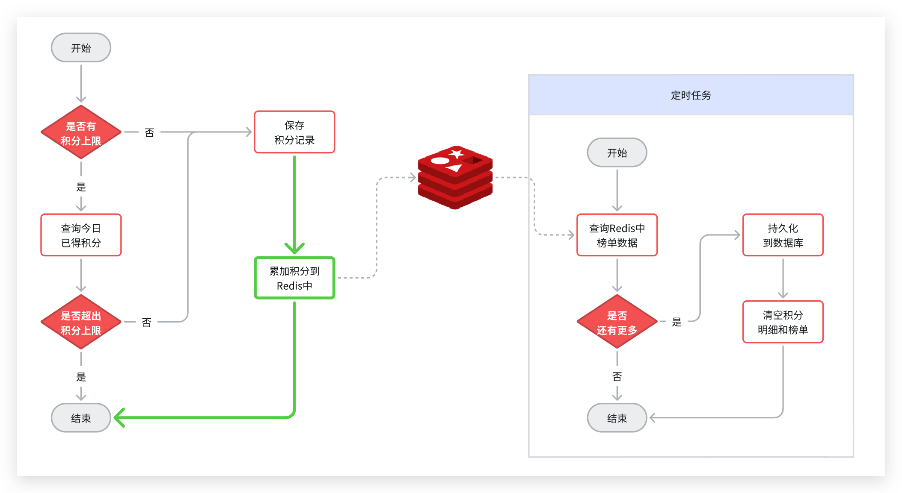

不过，这里就有一个问题需要解决：

假如有数百万用户，这就意味着每个赛季榜单都有数百万数据。随着时间推移，历史赛季越来越多，如果全部保存到一张表中，数据量会非常恐怖！

该怎么办呢？

<br/>

### 海量数据存储策略

对于数据库的海量数据存储，方案有很多，常见的有：

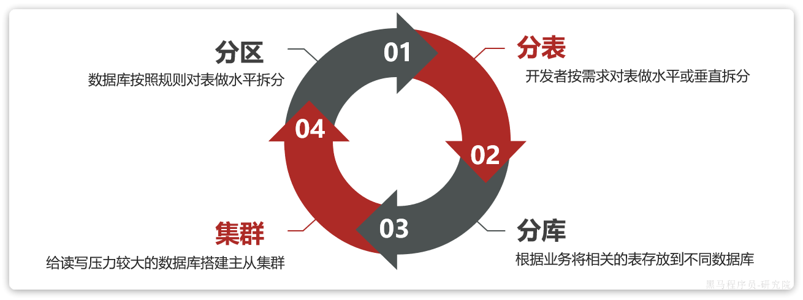

<br/>

#### 分区

 表分区（Partition）是一种数据存储方案，可以解决单表数据较多的问题。MySQL5.1开始支持表分区功能。

<br/>

数据库的表最终肯定是保存在磁盘中，对于InoDB引擎，一张表的数据在磁盘上对应一个ibd文件。如图，我们的积分榜单表对应的文件：

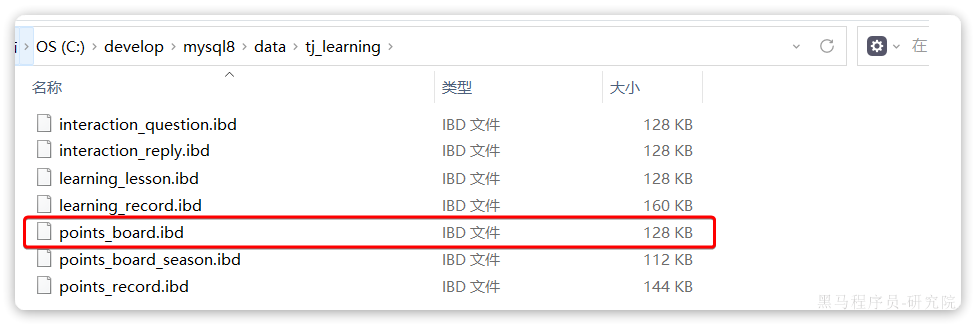

<br/>

如果表数据过多，就会导致文件体积非常大。文件就会跨越多个磁盘分区，数据检索时的速度就会非常慢。

<br/>

为了解决这个问题，MySQL在5.1版本引入表分区功能。简单来说，就是按照某种规则，把表数据对应的ibd文件拆分成多个文件来存储。从物理上来看，一张表的数据被拆到多个表文件存储了；从逻辑上来看，他们对外表现是一张表。

例如，我们的历史榜单数据，可以按照赛季切分：

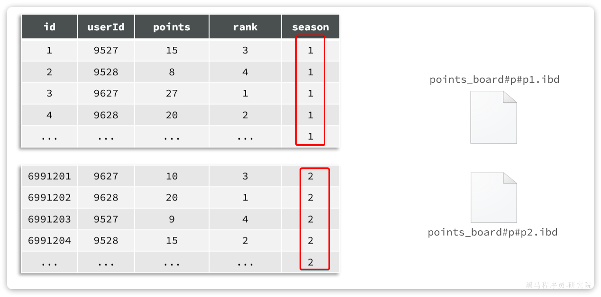

此时，赛季榜单表的磁盘文件就被分成了两个文件。但逻辑上还是一张表。增删改查的方式不会有什么变化，只不过底层MySQL底层的处理上会有变更。例如检索时可以只检索某个文件，而不是全部。

<br/>

这样做有几个好处：

- 可以存储更多的数据，突破单表上限。甚至可以存储到不同磁盘，突破磁盘上限
- 查询时可以根据规则只检索某一个文件，提高查询效率
- 数据统计时，可以多文件并行统计，最后汇总结果，提高统计效率
- 对于一些历史数据，如果不需要时，可以直接删除分区文件，提高删除效率

<br/>

表分区的本质是对数据的**水平拆分**，而拆分的方式也有多种，常见的有：

- Range分区：按照指定字段的取值范围分区
- List分区：按照指定字段的枚举值分区，必须提前指定好所有的分区值，如果数据找不到分区会报错
- Hash分区：基于字段做hash运算后分区，一般做hash运算的字段都是数值类型
- Key分区：根据指定字段的值做运算的结果分区，与hash分区类似，但不限定字段类型

<br/>

对于赛季榜单来说，最合适的分区方式是基于赛季值分区，我们希望同一个赛季放到一个分区。这就只能使用List分区，而List分区却需要枚举出所有可能的分区值。但是赛季分区id是无限的，无法全部枚举，所以就非常尴尬。

<br/>

MySQL的表分区详细信息可参考下面的文档：

https://www.cnblogs.com/wenxuehai/p/15901779.html

<br/>

#### 分表

**分表**是一种表设计方案，由开发者在创建表时按照自己的业务需求拆分表。也就是说这是开发者自己对表的处理，与数据库无关。

<br/>

而且，一旦做了分表，无论是逻辑上，还是物理上，就从一张表变成了多张表！增删改查的方式就发生了变化，必须自己考虑要去哪张表做数据处理。

分区则在逻辑上是同一张表，增删改查与以前没有区别。这就是分区和分表最大的一种区别。

<br/>

**水平分表**

例如，对于赛季榜单，我们可以按照赛季拆分为多张表，**每一个赛季一张新的表**。如图：

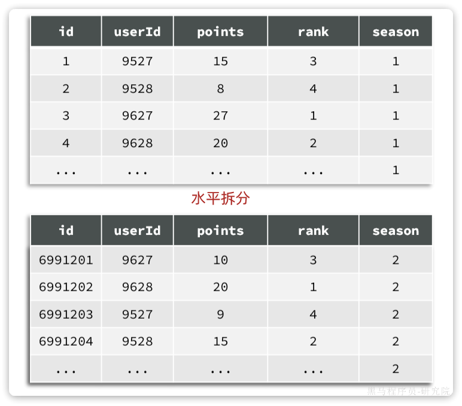

这种方式就是水平分表，**表结构不变**，仅仅是每张表**数据不同**。查询赛季1，就找第一张表。查询赛季2，就找第二张表。

由于分表是开发者的行为，因此拆分方式更加灵活。除了水平分表，也可以做**垂直分表**。

<br/>

**垂直分表**

什么是垂直分表呢？

如果一张表的字段非常多，比如达到30个以上，这样的表我们称为**宽表**。宽表由于字段太多，单行数据体积就会非常大，虽然数据不多，但可能表体积也会非常大！从而影响查询效率。

例如一个用户信息表，除了用户基本信息，还包含很多其它功能信息：

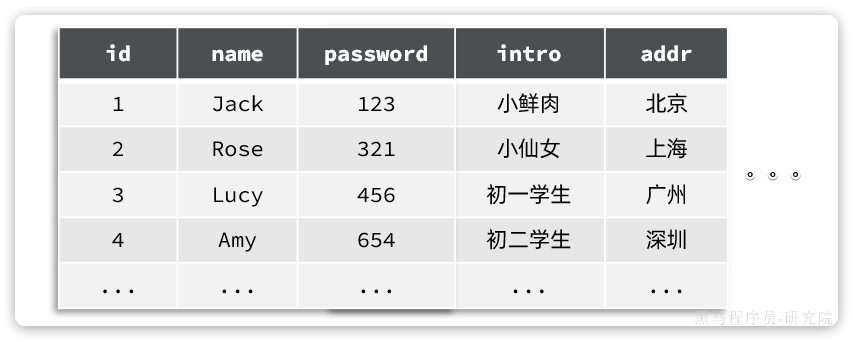

这个时候，我们就可以把其中的一些不常用字段拆分出去。一张表中包含登录常用字段，另一张表包含其它字段：

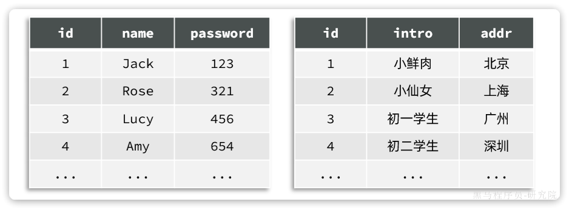

这个时候一张表就变成了两张表。而且两张表的**结构不同**，**数据也不同**。这种按照字段拆分表的方式，称为**垂直拆分**。

<br/>

**优缺点**

分表方案与分区方案相比有一些优点：

- 拆分方式更加灵活
- 而且可以解决单表字段过多的问题

但是也有一些确定：

- 增删改查时，需要自己判断访问哪张表
- 垂直拆分还会导致事务问题及数据关联问题：原本一张表的操作，变为多张表操作。

<br/>

不过，在开发中我们很多情况下业务需求复杂，更看重分表的灵活性。因此，我们大多数情况下都会选择分表方案。

<br/>

#### 分库和集群

无论是分区，还是分表，我们刚才的分析都是建立在单个数据库的基础上。但是单个数据库也存在一些问题：

- 单点故障问题：数据库发生故障，整个系统就会瘫痪
- 单库的性能瓶颈问题：单库受服务器限制，其网络带宽、CPU、连接数都有瓶颈
- 单库的存储瓶颈问题：单库的磁盘空间有上限，如果磁盘过大，数据检索的速度又会变慢

<br/>

综上，在大型系统中，我们除了要做分表、还需要对数据做分库，建立综合集群。

<br/>

首先，在微服务项目中，我们会按照项目模块，每个微服务使用独立的数据库，因此每个库的表是不同的，这种分库模式成为**垂直分库**。

而为了保证单节点的高可用性，我们会给数据库建立主从集群，主节点向从节点同步数据。两者结构一样，可以看做是**水平扩展**。

<br/>

这个时候就会出现垂直分库、水平扩展的综合集群，如图：

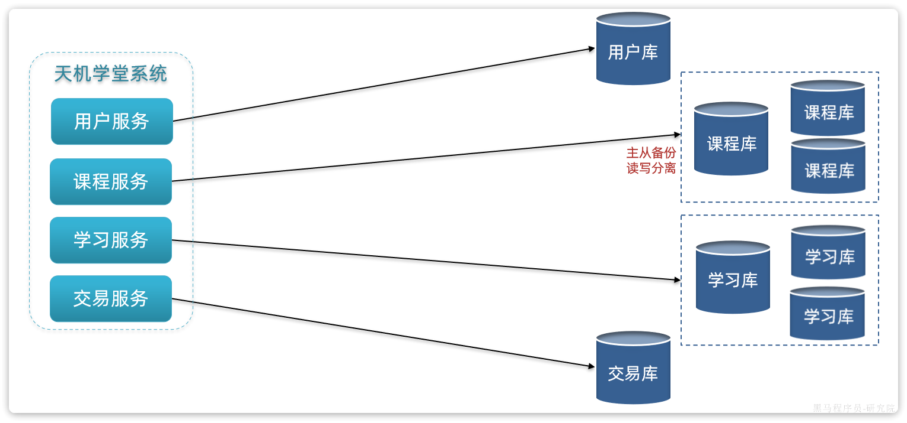

<br/>

这种模式的优缺点：

优点：

- 解决了海量数据存储问题，突破了单机存储瓶颈
- 提高了并发能力，突破了单机性能瓶颈
- 避免了单点故障

缺点：

- 成本非常高
- 数据聚合统计比较麻烦
- 主从同步的一致性问题
- 分布式事务问题

<br/>

### 历史榜单的存储策略

天机学堂项目是一个教育类项目，用户规模并不会很高，一般在十多万到百万级别。因此最终的数据规模也并不会非常庞大。

综合之前的分析，结合天机学堂的项目情况，我们可以对榜单数据做分表，但是暂时不需要做分库和集群。

<br/>

由于我们要解决的是数据过多问题，因此分表的方式选择**水平分表**。具体来说，就是按照赛季拆分，每一个赛季是一个独立的表，如图：

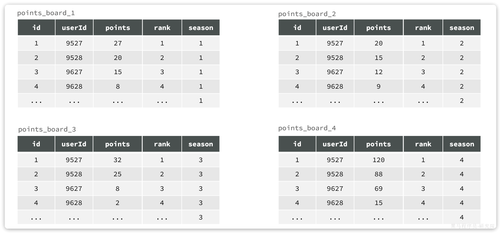

不过这里我们可以做一些简化：

- 我们可以将id采用自增id，那么id就是排名，排名字段就不需要了。
- 不同赛季用不同表，那么赛季字段就不需要了。

综上，最终表结构可以是这样：

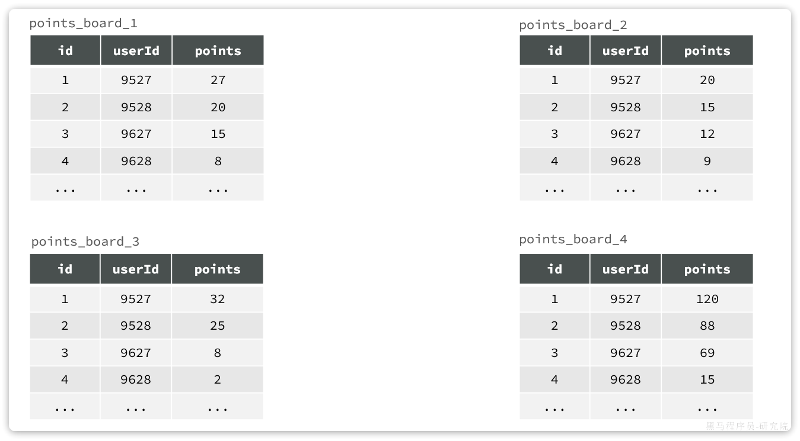

不过这就存在一个问题，每个赛季要有不同的表，这些表什么时候创建呢？

<br/>

显然，应该在每个赛季刚开始的时候（月初）来创建新的赛季榜单表。每个月的月初执行一个创建表的任务，我们可以利用定时任务来实现。

由于表的名称中包含赛季id，因此在定时任务中我们还要先查询赛季信息，获取赛季id，拼接得到表名，最后创建表。

<br/>

大概流程如图：

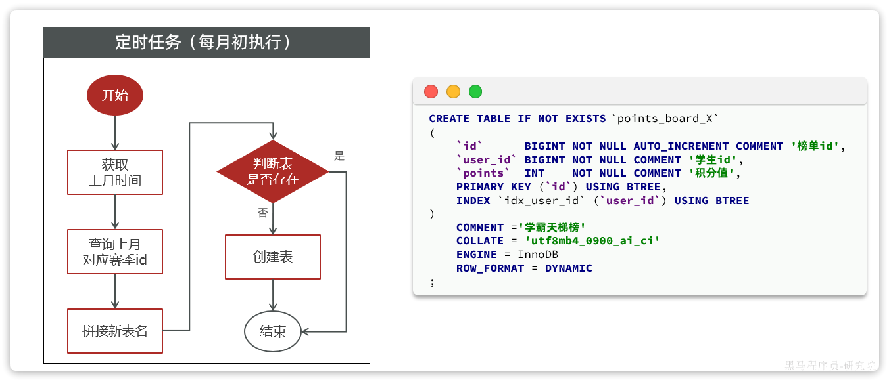

<br/>

表结构如下：

```SQL
 CREATE TABLE IF NOT EXISTS `points_board_X`
 (
    `id`      BIGINT NOT NULL AUTO_INCREMENT COMMENT '榜单id',
    `user_id` BIGINT NOT NULL COMMENT '学生id',
    `points`  INT    NOT NULL COMMENT '积分值',
    PRIMARY KEY (`id`) USING BTREE,
    INDEX `idx_user_id` (`user_id`) USING BTREE
 )
    COMMENT ='学霸天梯榜'
    COLLATE = 'utf8mb4_0900_ai_ci'
    ENGINE = InnoDB
    ROW_FORMAT = DYNAMIC
 ;
```

<br/>

表名称的前缀是`points_board_`，我们应该将其定义为常量。在`tj-learning`模块中定义：

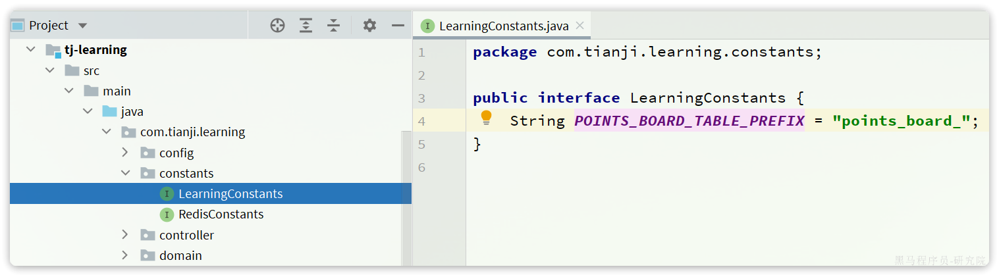

<br/>

同时，表中的字段少了2个（rank、season），因此我们需要修改对应的实体类：

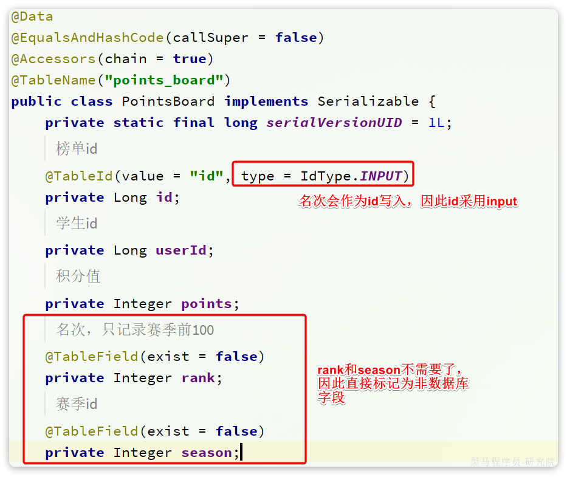

<br/>

### 定时任务生成榜单表

接下来，我们通过SpringTask定义一个定时任务，在每月初动态生成赛季榜单表。

<br/>

#### 定时任务

首先，在`tj-learning`模块下定义一个任务处理类：

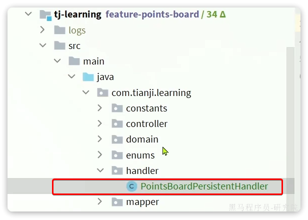

代码如下：

```Java
package com.tianji.learning.handler;

import com.tianji.common.utils.CollUtils;
import com.tianji.common.utils.DateUtils;
import com.tianji.learning.service.IPointsBoardSeasonService;
import com.tianji.learning.service.IPointsBoardService;
import lombok.RequiredArgsConstructor;
import org.springframework.stereotype.Component;

import java.time.LocalDateTime;
import java.util.List;

import static com.tianji.learning.constants.LearningConstants.POINTS_BOARD_TABLE_PREFIX;

@Component
@RequiredArgsConstructor
public class PointsBoardPersistentHandler {

    private final IPointsBoardSeasonService seasonService;

    private final IPointsBoardService pointsBoardService;

    @Scheduled(cron = "0 0 3 1 * ?") // 每月1号，凌晨3点执行
    public void createPointsBoardTableOfLastSeason(){
        // 1.获取上月时间
        LocalDateTime time = LocalDateTime.now().minusMonths(1);
        // 2.查询赛季id
        Integer season = seasonService.querySeasonByTime(time);
        if (season == null) {
            // 赛季不存在
            return;
        }
        // 3.创建表
        pointsBoardService.createPointsBoardTableBySeason(season);
    }
}
```

这里调用了两个service的方法，一个是查询赛季，一个是创建表。

<br/>

#### 查询赛季id

首先，我们在`tj-learning`模块的`com.tianji.learning.service.IPointsBoardSeasonService`中定义查询赛季的方法：

```Java
package com.tianji.learning.service;

import com.baomidou.mybatisplus.extension.service.IService;
import com.tianji.learning.domain.po.PointsBoardSeason;

import java.time.LocalDateTime;

/**
 * <p>
 *  服务类
 * </p>
 */
public interface IPointsBoardSeasonService extends IService<PointsBoardSeason> {

    Integer querySeasonByTime(LocalDateTime time);
}
```

<br/>

然后在`com.tianji.learning.service.impl.PointsBoardSeasonServiceImpl`中实现该方法：

```Java
package com.tianji.learning.service.impl;

import com.baomidou.mybatisplus.extension.service.impl.ServiceImpl;
import com.tianji.learning.domain.po.PointsBoardSeason;
import com.tianji.learning.mapper.PointsBoardSeasonMapper;
import com.tianji.learning.service.IPointsBoardSeasonService;
import org.springframework.stereotype.Service;

import java.time.LocalDateTime;
import java.util.Optional;

/**
 * <p>
 *  服务实现类
 * </p>
 */
@Service
public class PointsBoardSeasonServiceImpl extends ServiceImpl<PointsBoardSeasonMapper, PointsBoardSeason> implements IPointsBoardSeasonService {

    @Override
    public Integer querySeasonByTime(LocalDateTime time) {
        Optional<PointsBoardSeason> optional = lambdaQuery()
                .le(PointsBoardSeason::getBeginTime, time)
                .ge(PointsBoardSeason::getEndTime, time)
                .oneOpt();
        return optional.map(PointsBoardSeason::getId).orElse(null);
    }
}
```

<br/>

#### 创建表

在`tj-learning`模块的`com.tianji.learning.service.IPointsBoardService`中定义创建表的方法：

```Java
package com.tianji.learning.service;

import com.baomidou.mybatisplus.extension.service.IService;
import com.tianji.learning.domain.po.PointsBoard;
import com.tianji.learning.domain.query.PointsBoardQuery;
import com.tianji.learning.domain.vo.PointsBoardVO;

import java.util.List;

/**
 * <p>
 * 学霸天梯榜 服务类
 * </p>
 */
public interface IPointsBoardService extends IService<PointsBoard> {
    PointsBoardVO queryPointsBoardBySeason(PointsBoardQuery query);

    void createPointsBoardTableBySeason(Integer season);
}
```

<br/>

然后在`com.tianji.learning.service.impl.PointsBoardServiceImpl`中实现该方法：

```Java
@Override
public void createPointsBoardTableBySeason(Integer season) {
    getBaseMapper().createPointsBoardTable(POINTS_BOARD_TABLE_PREFIX + season);
}
```

<br/>

这里的建表语句肯定是自定义SQL，需要现在在`com.tianji.learning.mapper.PointsBoardMapper`中定义出方法：

```Java
package com.tianji.learning.mapper;

import com.baomidou.mybatisplus.core.mapper.BaseMapper;
import com.tianji.learning.domain.po.PointsBoard;
import org.apache.ibatis.annotations.Param;

/**
 * <p>
 * 学霸天梯榜 Mapper 接口
 * </p>
 */
public interface PointsBoardMapper extends BaseMapper<PointsBoard> {

    void createPointsBoardTable(@Param("tableName") String tableName);
}
```

<br/>

然后在`tj-learning`模块的`src/resources/mapper/PointsBoardMapper.xml`中编写SQL：

```XML
<?xml version="1.0" encoding="UTF-8"?>
<!DOCTYPE mapper PUBLIC "-//mybatis.org//DTD Mapper 3.0//EN" "http://mybatis.org/dtd/mybatis-3-mapper.dtd">
<mapper namespace="com.tianji.learning.mapper.PointsBoardMapper">

    <insert id="createPointsBoardTable" parameterType="java.lang.String">
        CREATE TABLE `${tableName}`
        (
            `id`      BIGINT NOT NULL AUTO_INCREMENT COMMENT '榜单id',
            `user_id` BIGINT NOT NULL COMMENT '学生id',
            `points`  INT    NOT NULL COMMENT '积分值',
            PRIMARY KEY (`id`) USING BTREE,
            INDEX `idx_user_id` (`user_id`) USING BTREE
        )
            COMMENT ='学霸天梯榜'
            COLLATE = 'utf8mb4_0900_ai_ci'
            ENGINE = InnoDB
            ROW_FORMAT = DYNAMIC
    </insert>
</mapper>
```

<br/>

### 分布式任务调度

目前，我们的定时任务都是基于SpringTask来实现的。但是SpringTask存在一些问题：

- 当微服务多实例部署时，定时任务会被执行多次。而事实上我们只需要这个任务被执行一次即可。
- 我们除了要定时创建表，还要定时持久化Redis数据到数据库，我们希望这多个定时任务能够按照顺序依次执行，SpringTask无法控制任务顺序

<br/>

不仅仅是SpringTask，其它单机使用的定时任务工具，都无法实现像这种任务执行者的调度、任务执行顺序的编排、任务监控等功能。这些功能必须要用到分布式任务调度组件。

<br/>

#### 分布式任务调度原理

那么分布式任务调度是如何实现任务调度和编排的呢？

我们先来看看普通定时任务的实现原理，一般定时任务中会有两个组件：

- 任务：要执行的代码
- 任务触发器：基于定义好的规则触发任务

<br/>

因此在多实例部署的时候，每个启动的服务实例都会有自己的**任务触发器**，这样就会导致各个实例各自运行，无法统一控制：

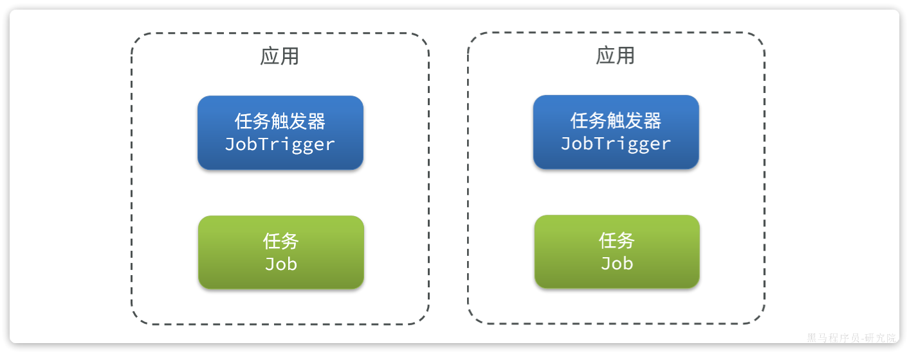

那如果我们想要统一控制各个服务实例的任务执行和调度该怎么办？

<br/>

大家应该能想到：就是要把任务触发器提取到各个服务实例之外，去做统一的触发、统一的调度。

事实上，大多数的分布式任务调度组件都是这样做的：

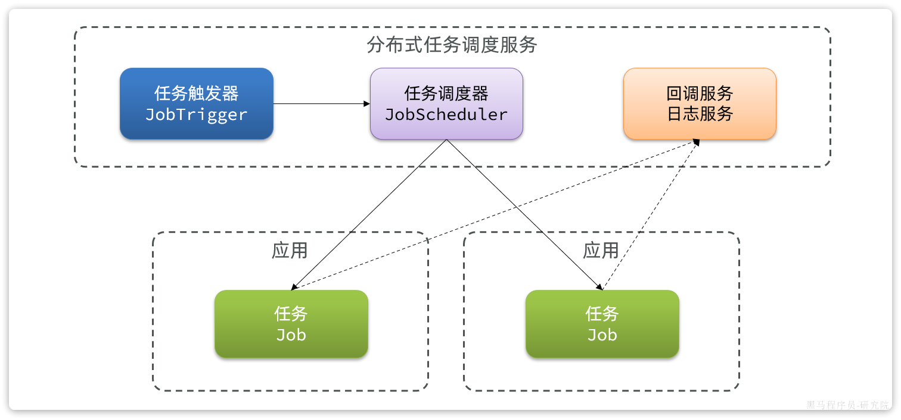

<br/>

这样一来，具体哪个任务该执行，什么时候执行，交给哪个应用实例来执行，全部都有统一的任务调度服务来统一控制。并且执行过程中的任务结果还可以通过回调接口返回，让我们方便的查看任务执行状态、执行日志。这样的服务就是**分布式调度服务**了。

<br/>

#### 分布式任务调度技术对比

能够实现分布式任务调度的技术有很多，常见的有：

|                  | **Quartz** |   **XXL-Job**    |       **SchedulerX**       |           **PowerJob**           |
| :--------------: | :--------: | :--------------: | :------------------------: | :------------------------------: |
|   **定时类型**   |    CRON    | 频率、间隔、CRON | 频率、间隔、CRON、OpenAPI  |    频率、间隔、CRON、OpenAPI     |
|   **任务类型**   |    Java    |    多语言脚本    |         多语言脚本         |            多语言脚本            |
| **任务调度方式** |    随机    |    单机、分片    | 单机、广播、Map、MapReduce | 单机、广播、分片、Map、MapReduce |
|  **管理控制台**  |     无     |       支持       |            支持            |               支持               |
|   **日志白屏**   |     无     |       支持       |            支持            |               支持               |
|   **报警监控**   |     无     |       支持       |            支持            |               支持               |
|    **工作流**    |     无     |       有限       |            支持            |               支持               |

其中：

- Quartz由于功能相对比较落后，现在已经很少被使用了。
- SchedulerX是阿里巴巴的云产品，收费。
- PowerJob是阿里员工自己开源的一个组件，功能非常强大，不过目前市值占比还不高，还需要等待市场检验。
- XXL-JOB：开源免费，功能虽然不如PowerJob，不过目前市场占比最高，稳定性有保证。

<br/>

我们课堂中会选择XXL-JOB这个组件，如果你们企业具备探索精神，而且需要一些分布式运算功能，推荐使用PowerJob。

<br/>

#### XXL-JOB介绍

官网地址：https://www.xuxueli.com/xxl-job/

XXL-JOB的运行原理和架构如图：

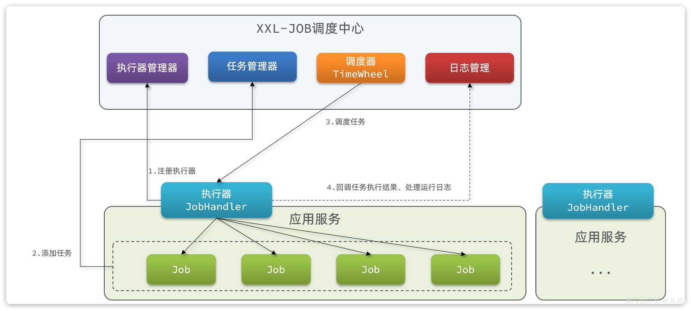

XXL-JOB分为两部分：

- **执行器**：我们的服务引入一个XXL-JOB的依赖，就可以通过配置创建一个执行器。负责与XXL-JOB调度中心交互，执行本地任务。
- **调度中心**：一个独立服务，负责管理执行器、管理任务、任务执行的调度、任务结果和日志收集。

<br/>

#### XXL-JOB定时创建榜单表

接下来，我们就来一个XXL-JOB的快速入门，顺便改造一下之前用SpringTask实现的定时创建榜单表的功能。

<Br/>

**部署调度中心**

调度中心在我们提供的虚拟机开发环境中已经部署完成了。访问：[http://xxljob.tianji.com](http://xxljob.tianji.com/)即可查看调度中心控制台页面。默认的账号密码是：admin/123456

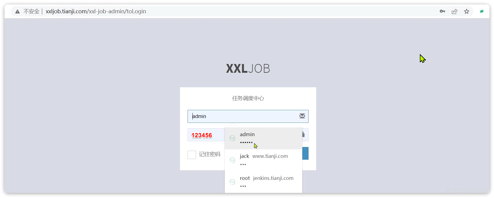

如果要自己部署，分为两步：

- 运行初始化SQL，创建数据库表
- 利用Docker命令，创建并运行容器

课前资料已经给出了脚本：

<br/>

Docker启动命令

```sh
docker run \
-e PARAMS="--spring.datasource.url=jdbc:mysql://192.168.150.101:3306/xxl_job?Unicode=true&characterEncoding=UTF-8 \
--spring.datasource.username=root \
--spring.datasource.password=123" \
--restart=always \
-p 28080:8080 \
-v xxl-job-admin-applogs:/data/applogs \
--name xxl-job-admin \
-d \
xuxueli/xxl-job-admin:2.3.0
```


最终XXL-JOB的表结构如下：

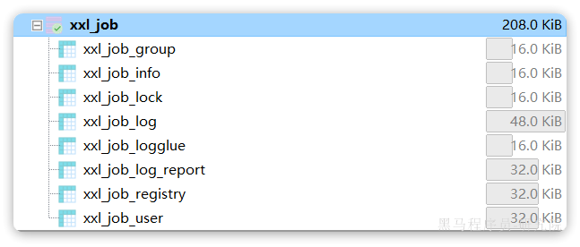

说明：

- xxl_job_lock：任务调度锁表；
- xxl_job_group：执行器信息表，维护任务执行器信息；
- xxl_job_info：调度扩展信息表： 用于保存XXL-JOB调度任务的扩展信息，如任务分组、任务名、机器地址、执行器、执行入参和报警邮件等等；
- xxl_job_log：调度日志表： 用于保存XXL-JOB任务调度的历史信息，如调度结果、执行结果、调度入参、调度机器和执行器等等；
- xxl_job_log_report：调度日志报表：用户存储XXL-JOB任务调度日志的报表，调度中心报表功能页面会用到；
- xxl_job_logglue：任务GLUE日志：用于保存GLUE更新历史，用于支持GLUE的版本回溯功能；
- xxl_job_registry：执行器注册表，维护在线的执行器和调度中心机器地址信息；
- xxl_job_user：系统用户表；

<Br/>

**微服务集成执行器**

首先需要在tj-learning服务引入依赖：

```XML
<!--xxl-job-->
<dependency>
    <groupId>com.xuxueli</groupId>
    <artifactId>xxl-job-core</artifactId>
</dependency>
```

然后还需要配置执行器，下面是一个配置执行器的示例：

```Java
@Bean
public XxlJobSpringExecutor xxlJobExecutor() {
    logger.info(">>>>>>>>>>> xxl-job config init.");
    XxlJobSpringExecutor xxlJobSpringExecutor = new XxlJobSpringExecutor();
    xxlJobSpringExecutor.setAdminAddresses(adminAddresses);
    xxlJobSpringExecutor.setAppname(appname);
    xxlJobSpringExecutor.setIp(ip);
    xxlJobSpringExecutor.setPort(port);
    xxlJobSpringExecutor.setAccessToken(accessToken);
    xxlJobSpringExecutor.setLogPath(logPath);
    xxlJobSpringExecutor.setLogRetentionDays(logRetentionDays);

    return xxlJobSpringExecutor;
}
```

参数说明：

- adminAddress：调度中心地址，天机学堂中就是填虚拟机地址
- appname：微服务名称
- ip和port：当前执行器的ip和端口，无需配置，自动获取
- accessToken：访问令牌，在调度中心中配置令牌，所有执行器访问时都必须携带该令牌，否则无法访问。咱们项目的令牌已经配好，就是`tianji`。如果要修改，可以到虚拟机的`/usr/local/src/xxl-job/application.properties`文件中，修改`xxl.job.accessToken`属性，然后重启XXL-JOB即可。
- logPath：任务运行日志的保存目录
- logRetentionDays：日志最长保留时长

<br/>

但是呢，大家完全不需要自己配置调度器了，因为在天机学堂的tj-common模块已经实现了XXL-JOB的自动装配： 

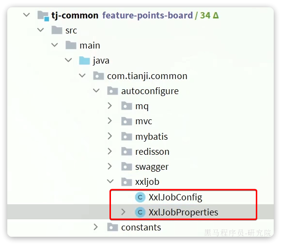

配置中的关键属性都已经在Nacos中共享了：

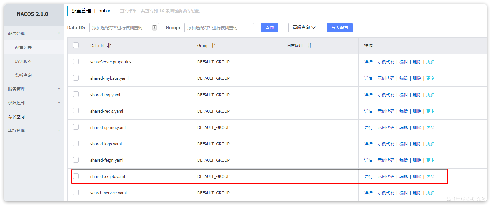

<br/>

所以，我们项目的微服务模块只要引入`了tj-common`，并且引入了XXL-JOB的依赖，就可以直接使用了。

```yml {27,28}
server:
  port: 8090  #端口
  tomcat:
    uri-encoding: UTF-8   #服务编码
spring:
  profiles:
    active: dev
  application:
    name: learning-service
  cloud:
    nacos:
      config:
        file-extension: yaml
        shared-configs: # 共享配置
          - data-id: shared-spring.yaml # 共享spring配置
            refresh: false
          - data-id: shared-redis.yaml # 共享redis配置
            refresh: false
          - data-id: shared-mybatis.yaml # 共享mybatis配置
            refresh: false
          - data-id: shared-logs.yaml # 共享日志配置
            refresh: false
          - data-id: shared-feign.yaml # 共享feign配置
            refresh: false
          - data-id: shared-mq.yaml # 共享mq配置
            refresh: false
          - data-id: shared-xxljob.yaml # 共享mq配置
            refresh: false
```

<br/>

**定义任务**

 接下来，把之前的SpringTask任务改成XXL-JOB的任务。

我们修改tj-learning模块下的`com.tianji.learning.handler.PointsBoardPersistentHandler`，将原本的`@Scheduled`注解替换为`@XXLJob`注解：

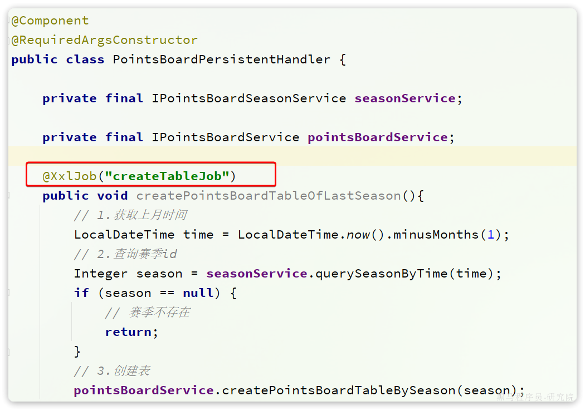

其中，`@XxlJob`注解中定义的就是当前**任务的名称**。

<br/>

注册执行器

接下来，重启`tj-learning`服务，登录XXL-JOB控制台，注册执行器。

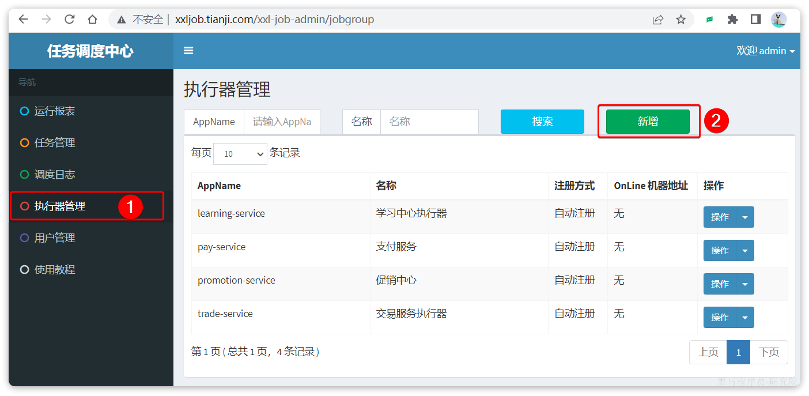

在弹出的窗口中填写信息：

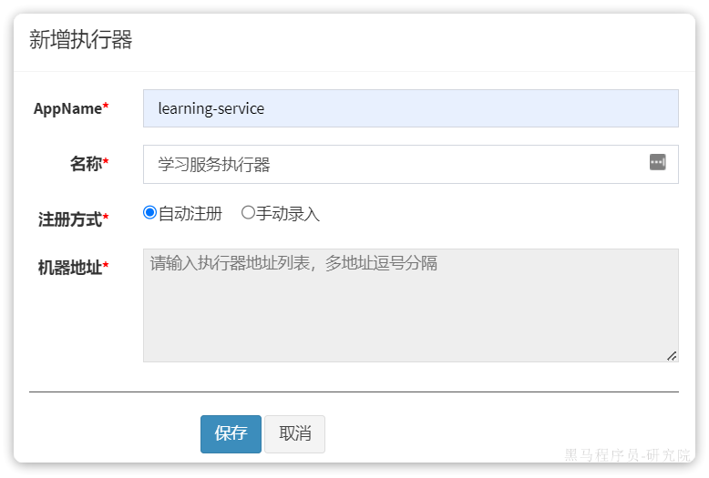

等待一段时间，会发现`learning-service`已经成功注册了：

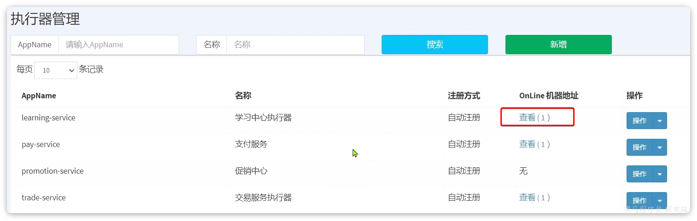

<br/>

**配置任务调度**

现在，执行器已经成功注册，任务也已经注册到调度中心。接下来，我们就可以来做任务调度了，也就是：

- 分配任务什么时候执行
- 如果有多个执行器，应该由哪个执行器执行（路由策略）

<br/>

我们进入任务管理菜单，选中学习中心执行器，然后新增任务：

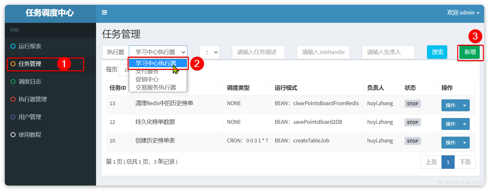

<br/>

在弹出表单中，填写任务调度信息：

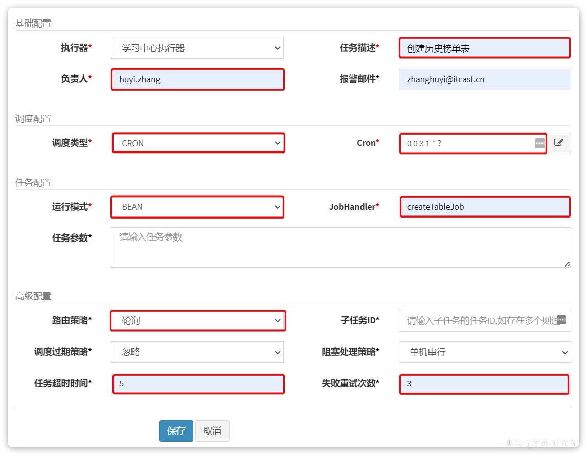

其中比较关键的几个配置：

- 调度配置：也就是什么时候执行，一般选择cron表达式
- 任务配置：采用BEAN模式，指定JobHandler，这里指定的就是在项目中`@XxlJob`注解中的任务名称
- 路由策略：就是指如果有多个任务执行器，该由谁执行？这里支持的策略非常多：
  
  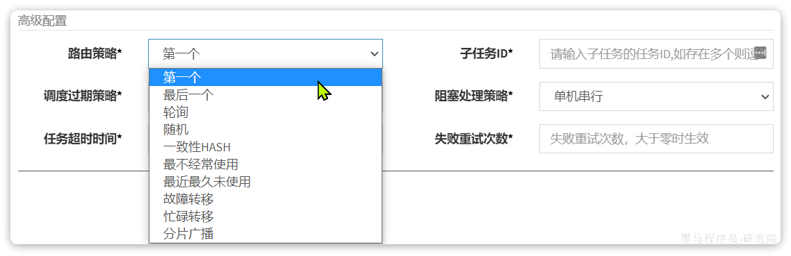

<br/>

路由策略说明：

- FIRST（第一个）：固定选择第一个执行器；
- LAST（最后一个）：固定选择最后一个执行器；
- ROUND（轮询）：在线的执行器按照轮询策略选择一个执行
- RANDOM（随机）：随机选择在线的执行器；
- CONSISTENT_HASH（一致性HASH）：每个任务按照Hash算法固定选择某一台执行器，且所有任务均匀散列在不同执行器上。
- LEAST_FREQUENTLY_USED（最不经常使用）：使用频率最低的执行器优先被选举；
- LEAST_RECENTLY_USED（最近最久未使用）：最久未使用的执行器优先被选举；
- FAILOVER（故障转移）：按照顺序依次进行心跳检测，第一个心跳检测成功的执行器选定为目标执行器并发起调度；
- BUSYOVER（忙碌转移）：按照顺序依次进行空闲检测，第一个空闲检测成功的执行器选定为目标执行器并发起调度；
- SHARDING_BROADCAST(分片广播)：广播触发对应集群中所有执行器执行一次任务，同时系统自动传递分片参数；可根据分片参数开发分片任务

<Br/>

**执行一次**

当任务配置完成后，就会按照设置的调度策略，定期去执行了。不过，我们想要测试的话也可以手动执行一次任务。

在任务管理界面，点击要执行的任务后面的`操作`按钮，点击`执行一次`：

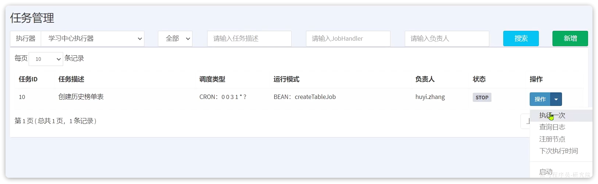

然后在弹出的窗口中，直接点保存即可执行：

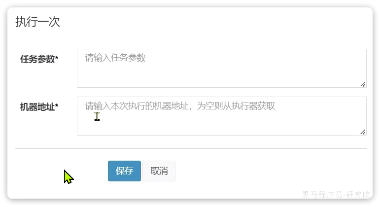

注意，如果是分片广播模式， 这里还可以填写一些任务参数。

然后在调度日志中，可以看到执行成功的日志信息：

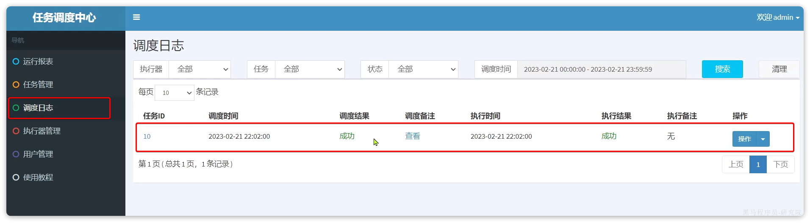

<br/>

### 榜单持久化

榜单持久化的基本流程是这样的：

- 创建表
- 持久化Redis数据到数据库
- 清理Redis数据

<br/>

现在，创建表的动作已经完成，接下来就轮到Redis数据的持久化了。持久化的步骤如下：

- 读取Redis数据
- 判断数据是否存在
  - 不存在，直接结束
  - 存在，则继续
- 保存数据到数据库

<br/>

不过，Redis的数据结构如图：

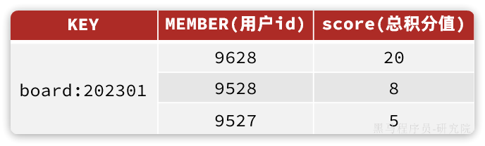

其KEY中包含一个上赛季对应的日期，因此要读取Redis数据，我们必须先得到上赛季的日期。

另外，我们采用了水平分表的策略，每一个赛季都是一个独立表。那么在写数据到数据库时，必须先知道表名称。

<br/>

综上，最终持久化的业务流程如图：

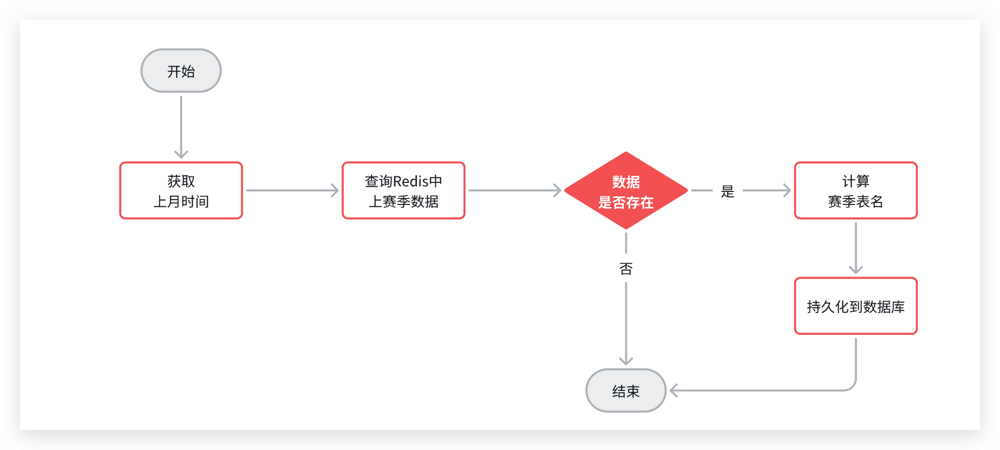

<br/>

#### 动态表名

持久化的流程中存在一个问题，我们的数据库持久化采用的是MybatisPlus来实现的。而MybatisPlus读取表名的方式是通过实体类上的`@Table`注解，而注解往往是写死的：

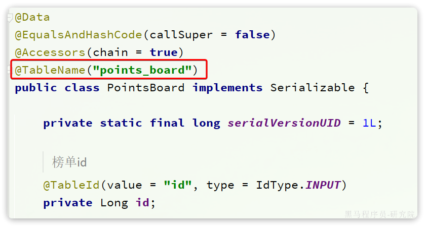

那我们该如何让MybatisPlus在执行的时候改变数据写入的表名称呢？

<br/>

**动态表名插件**

MybatisPlus中提供了一个动态表名的插件：

https://baomidou.com/pages/2a45ff/#dynamictablenameinnerinterceptor

插件的部分源码如下：

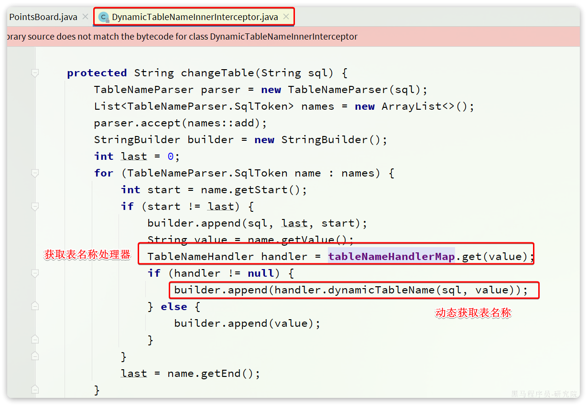

可见表名称动态获取就是依赖于tableNameHandlerMapping中的具体的TableNameHandler，这个Map如图：

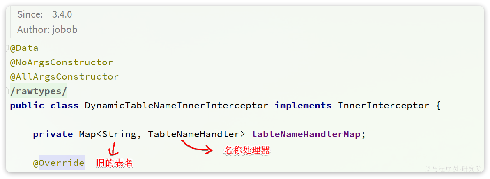

这个Map的key是旧的表名称，value是TableNameHandler，就是表的名称处理器，用于根据旧名称获取新名称。

<br/>

TableNameHandler的源码如下：

```Java
public interface TableNameHandler {

    /**
     * 生成动态表名
     *
     * @param sql       当前执行 SQL
     * @param tableName 表名
     * @return String
     */
    String dynamicTableName(String sql, String tableName);
}
```

OK，因此我们要做的事情就很简单了，定义`DynamicTableNameInnterInterceptor`，向其中添加一个`TableNameHandler`，将`points_board`这个表名，替换为`points_board_赛季id`的名称。

<br/>

不过，新的问题来了，这个插件中的TableNameHandler该如何获取赛季对应的表名称呢？

计算表名的方式是获取获取上赛季时间，查询数据库中上赛季信息，得到上赛季id。然后拼接得到表名。

<br/>

当我们批量的写数据到数据库时，**如果每次插入都计算一次表名，那性能也太差了**。因此，我们肯定是希望一次计算，在TableNameHandler中可以随时获取。

那么该如何实现呢？

<br/>

**传递表名**

我们先回顾一下整体业务流程：

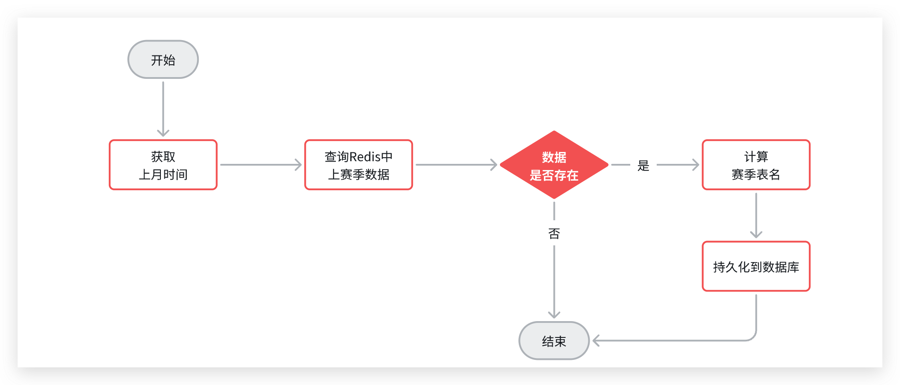

流程中，我们会先计算表名，然后去执行持久化，而动态表名插件就会生效，去替换表名。

因此，一旦我们计算完表名，以某种方式传递给插件中的TableNameHandler，那么就无需重复计算表名了。

不过，问题来了：要知道动态表名称插件，以及TableNameHandler，都是由MybatisPlus内部调用的。我们无法传递参数。

那么该如何传递表名称呢？

<br/>

虽然无法传参，但是从计算表名，到动态表名插件执行，调用TableNameHandler，都是在一个线程内完成的。要在一个线程内实现数据共享，该用什么呢？

大家应该很容易想到，就是ThreadLocal.

我们可以在定时任务中计算完动态表名后，将表名存入ThreadLocal，然后在插件中从ThreadLocal中读取即可：

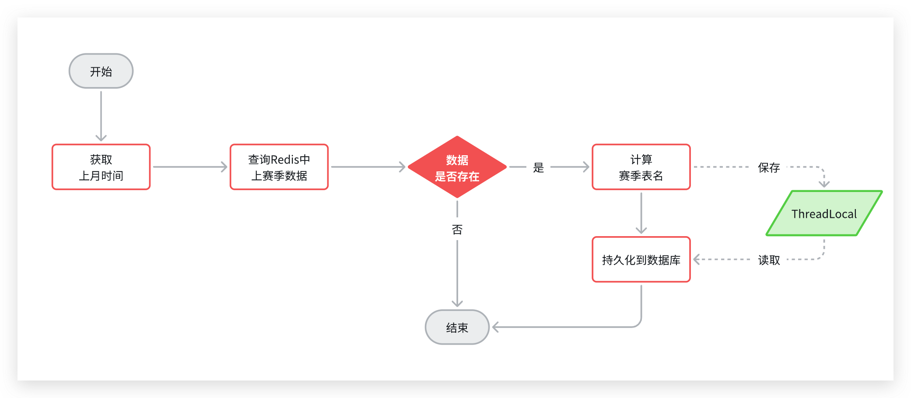

<br/>

我们在`tj-learning`的`com.tianji.learning.utils`包下定义一个传递表名称的工具：

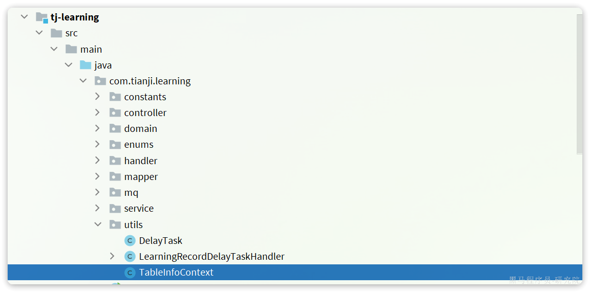

具体代码如下：

```Java
package com.tianji.learning.utils;

public class TableInfoContext {
    private static final ThreadLocal<String> TL = new ThreadLocal<>();

    public static void setInfo(String info) {
        TL.set(info);
    }

    public static String getInfo() {
        return TL.get();
    }

    public static void remove() {
        TL.remove();
    }
}
```

<br/>

然后在`tj-learning`模块下定义一个配置类，用于定义`DynamicTableNameInnterInterceptor`插件：

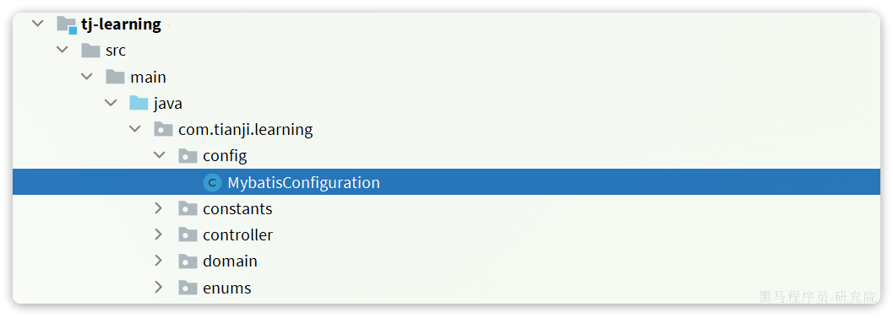

具体代码如下：

```Java
package com.tianji.learning.config;

import com.baomidou.mybatisplus.extension.plugins.handler.TableNameHandler;
import com.baomidou.mybatisplus.extension.plugins.inner.DynamicTableNameInnerInterceptor;
import com.tianji.learning.utils.TableInfoContext;
import org.springframework.context.annotation.Bean;
import org.springframework.context.annotation.Configuration;

import java.util.HashMap;
import java.util.Map;

@Configuration
public class MybatisConfiguration {

    @Bean
    public DynamicTableNameInnerInterceptor dynamicTableNameInnerInterceptor() {
        // 准备一个Map，用于存储TableNameHandler
        Map<String, TableNameHandler> map = new HashMap<>(1);
        // 存入一个TableNameHandler，用来替换points_board表名称
        // 替换方式，就是从TableInfoContext中读取保存好的动态表名
        map.put("points_board", (sql, tableName) -> TableInfoContext.getInfo());
        return new DynamicTableNameInnerInterceptor(map);
    }
}
```

<br/>

插件虽然定义好了，但是该如何继承到MybatisPlus中呢？

在天机学堂项目中的tj-common模块中，已经实现了MybatisPlus的自动装配，并且定义了很多的MP插件。如果我们在自己的项目中重新定义MP配置，就会导致tj-common中的插件失效。

<br/>

所以，我们应该修改`tj-common`中的MP配置，将`DynamicTableNameInnerInterceptor`配置进去。找到`tj-common`模块下的`MybatisConfig`配置：

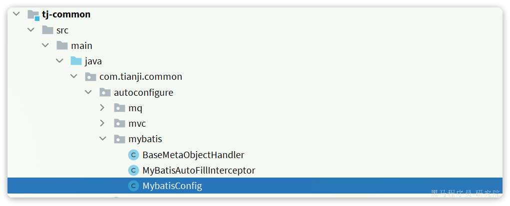

修改其中的拦截器配置：

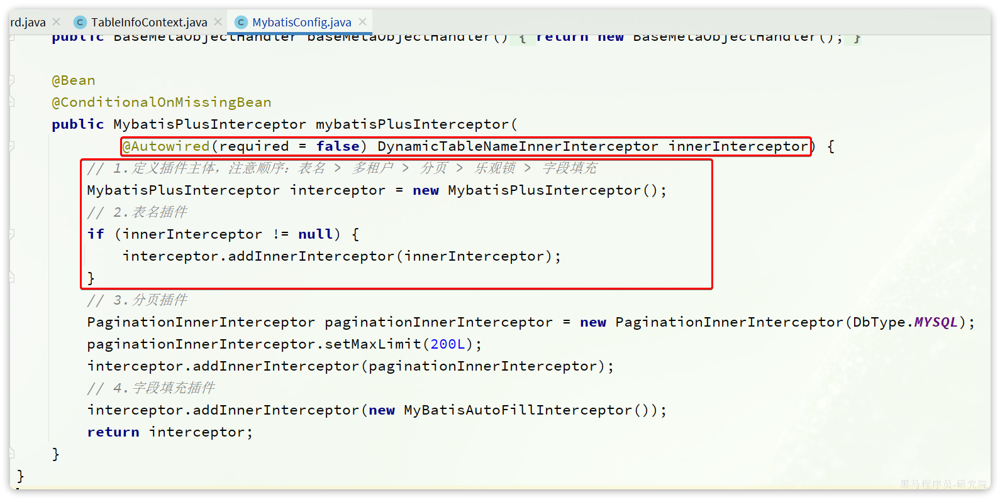

**注意**：

- 由于`DynamicTableNameInnerInterceptor`并不是每一个微服务都用了，所以这里加入了@Autowired(required= false)，避免未定义该拦截器的微服务报错。
- MybatisPlus的插件定义顺序非常重要，必须按照一定的顺序来定义。参考：https://baomidou.com/pages/2976a3/#innerinterceptor

<br/>

#### 定时持久化任务

动态表名已经准备就绪，接下来我们就可以去定义定时任务，实现榜单持久化了。

在`tj-learning`模块的`com.tianji.learning.handler.PointsBoardPersistentHandler`中添加一个定时任务：

```Java
@XxlJob("savePointsBoard2DB")
public void savePointsBoard2DB(){
    // 1.获取上月时间
    LocalDateTime time = LocalDateTime.now().minusMonths(1);

    // 2.计算动态表名
    // 2.1.查询赛季信息
    Integer season = seasonService.querySeasonByTime(time);
    // 2.2.将表名存入ThreadLocal
    TableInfoContext.setInfo(POINTS_BOARD_TABLE_PREFIX + season);

    // 3.查询榜单数据
    // 3.1.拼接KEY
    String key = RedisConstants.POINTS_BOARD_KEY_PREFIX + time.format(DateUtils.POINTS_BOARD_SUFFIX_FORMATTER);
    // 3.2.查询数据
    int pageNo = 1;
    int pageSize = 1000;
    while (true) {
        List<PointsBoard> boardList = pointsBoardService.queryCurrentBoardList(key, pageNo, pageSize);
        if (CollUtils.isEmpty(boardList)) {
            break;
        }
        // 4.持久化到数据库
        // 4.1.把排名信息写入id
        boardList.forEach(b -> {
            b.setId(b.getRank().longValue());
            b.setRank(null);
        });
        // 4.2.持久化
        pointsBoardService.saveBatch(boardList);
        // 5.翻页
        pageNo++;
    }
    // 任务结束，移除动态表名
    TableInfoContext.remove();
}
```

<br/>

需要注意的，由于榜单数据非常多，不可能一次性查完，因此这里采用的是分页查询的方式。而分页查询调用的是`com.tianji.learning.service.IPointsBoardService`中的`queryCurrentBoardList`方法。这个方法在service实现类中本来就有，只不过没有抽取到service接口。

因此这里要在`com.tianji.learning.service.IPointsBoardService`中抽取这个接口：

```Java
package com.tianji.learning.service;

import com.baomidou.mybatisplus.extension.service.IService;
import com.tianji.learning.domain.po.PointsBoard;
import com.tianji.learning.domain.query.PointsBoardQuery;
import com.tianji.learning.domain.vo.PointsBoardVO;

import java.util.List;

/**
 * <p>
 * 学霸天梯榜 服务类
 * </p>
 */
public interface IPointsBoardService extends IService<PointsBoard> {
    PointsBoardVO queryPointsBoardBySeason(PointsBoardQuery query);

    void createPointsBoardTableBySeason(Integer season);

    List<PointsBoard> queryCurrentBoardList(String key, Integer pageNo, Integer pageSize);
}
```

<br/>

把`com.tianji.learning.service.impl.PointsBoardServiceImpl`中的方法改为public：

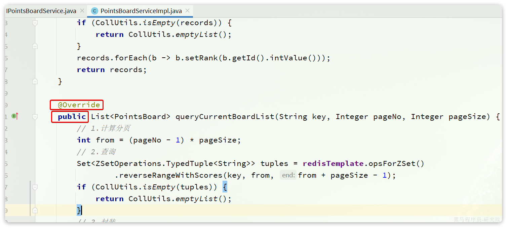

<br/>

#### XXL-JOB任务分片

刚才定义的定时持久化任务，通过while死循环，不停的查询数据，直到把所有数据都持久化为止。这样如果数据量达到数百万，交给一个任务执行器来处理会耗费非常多时间。

因此，将来肯定会将学习服务多实例部署，这样就会有多个执行器并行执行。**但是，**如果交给多个任务执行器，大家执行相同代码，都从第1页逐页处理数据，又会出现重复处理的情况。

怎么办？

这就要用到任务分片的方案了。

<br/>

怎样才能确保任务不重复呢？我们可以参考扑克牌发牌的原理：

- 逐一给每个人发牌
- 发完一圈后，再回头给第一个人发
- 重复上述动作，直到牌发完为止

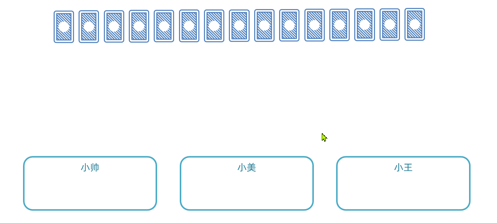

与此类似，比如我们启动了3个服务实例，就有3个执行器。我们可以把执行器当做打牌的人，然后把每一页数据作为一张牌：

- 把每页数据逐一分发给每个执行器，
- 发完一圈后，再回到第一个执行器。
- 直到所有页数据都发放完毕。

那么数据分发的过程如图：

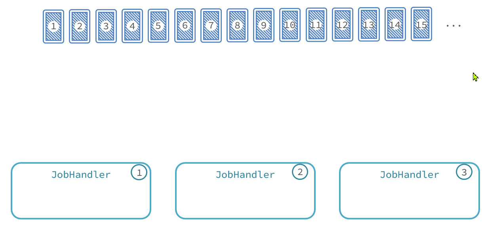

最终，每个执行器处理的数据页情况：

- 执行器1：处理第1、4、7、10、13、...页数据
- 执行器2：处理第2、5、8、11、14、...页数据
- 执行器3：处理第3、6、9、12、15、...页数据

<br/>

要想知道每一个执行器执行哪些页数据，只要弄清楚两个关键参数即可：

- 起始页码：pageNo
- 下一页的跨度：step

<br/>

而这两个参数是有规律的：

- 起始页码：执行器编号是多少，起始页码就是多少
- 页跨度：执行器有几个，跨度就是多少。也就是说你要跳过别人读取过的页码

<br/>

因此，现在的关键就是获取两个数据：

- 执行器编号
- 执行器数量

这两个参数XXL-JOB作为任务调度中心，肯定是知道的，而且也提供了API帮助我们获取：

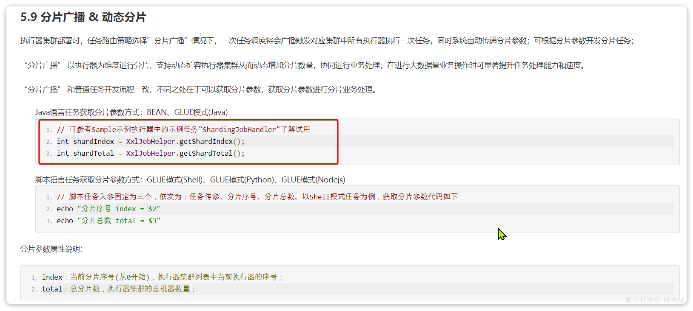

<br/>

这里的分片序号其实就是执行器序号，不过是从0开始，那我们只要对序号+1，就可以作为起始页码了。

<br/>

因此，最终我们改造代码，实现数据分片如图：

```Java
@XxlJob("savePointsBoard2DB")
public void savePointsBoard2DB(){
    // 1.获取上月时间
    LocalDateTime time = LocalDateTime.now().minusMonths(1);

    // 2.计算动态表名
    // 2.1.查询赛季信息
    Integer season = seasonService.querySeasonByTime(time);
    // 2.2.存入ThreadLocal
    TableInfoContext.setInfo(POINTS_BOARD_TABLE_PREFIX + season);

    // 3.查询榜单数据
    // 3.1.拼接KEY
    String key = RedisConstants.POINTS_BOARD_KEY_PREFIX + time.format(DateUtils.POINTS_BOARD_SUFFIX_FORMATTER);
    // 3.2.查询数据
    int index = XxlJobHelper.getShardIndex();
    int total = XxlJobHelper.getShardTotal();
    int pageNo = index + 1; // 起始页，就是分片序号+1
    int pageSize = 10;
    while (true) {
        List<PointsBoard> boardList = pointsBoardService.queryCurrentBoardList(key, pageNo, pageSize);
        if (CollUtils.isEmpty(boardList)) {
            break;
        }
        // 4.持久化到数据库
        // 4.1.把排名信息写入id
        boardList.forEach(b -> {
            b.setId(b.getRank().longValue());
            b.setRank(null);
        });
        // 4.2.持久化
        pointsBoardService.saveBatch(boardList);
        // 5.翻页，跳过N个页，N就是分片数量
        pageNo+=total;
    }

    TableInfoContext.remove();
}
```

<br/>

#### 清理Redis缓存任务

当任务持久化以后，我们还要清理Redis中的上赛季的榜单数据，避免过多的内存占用。

在`tj-learning`模块的`com.tianji.learning.handler.PointsBoardPersistentHandler`中添加一个定时任务：

```Java
package com.tianji.learning.handler;

import com.tianji.common.utils.CollUtils;
import com.tianji.common.utils.DateUtils;
import com.tianji.learning.constants.RedisConstants;
import com.tianji.learning.domain.po.PointsBoard;
import com.tianji.learning.service.IPointsBoardSeasonService;
import com.tianji.learning.service.IPointsBoardService;
import com.tianji.learning.utils.TableInfoContext;
import com.xxl.job.core.context.XxlJobHelper;
import com.xxl.job.core.handler.annotation.XxlJob;
import lombok.RequiredArgsConstructor;
import org.springframework.data.redis.core.StringRedisTemplate;
import org.springframework.stereotype.Component;

import java.time.LocalDateTime;
import java.util.List;

import static com.tianji.learning.constants.LearningConstants.POINTS_BOARD_TABLE_PREFIX;

@Component
@RequiredArgsConstructor
public class PointsBoardPersistentHandler {

    private final IPointsBoardSeasonService seasonService;

    private final IPointsBoardService pointsBoardService;

    private final StringRedisTemplate redisTemplate;

    // ... 略

    @XxlJob("clearPointsBoardFromRedis")
    public void clearPointsBoardFromRedis(){
        // 1.获取上月时间
        LocalDateTime time = LocalDateTime.now().minusMonths(1);
        // 2.计算key
        String key = RedisConstants.POINTS_BOARD_KEY_PREFIX + time.format(DateUtils.POINTS_BOARD_SUFFIX_FORMATTER);
        // 3.删除
        redisTemplate.unlink(key);
    }
}
```

<br/>

#### 任务链

现在，所有任务都已经定义完毕。接下来就给配置任务调度了。

我们最终期望的任务执行顺序是这样的：

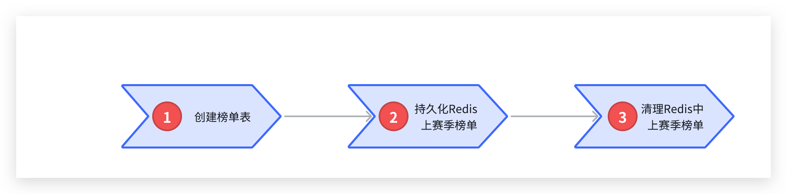

但问题来了，我们该如何控制三个任务的执行顺序呢？

这就要借助于XXL-JOB中的子任务功能了。

<br/>

首先，我们把持久化榜单数据、清理Redis中历史榜单的任务也在XXL-JOB中定义出来。

首先是持久化榜单：

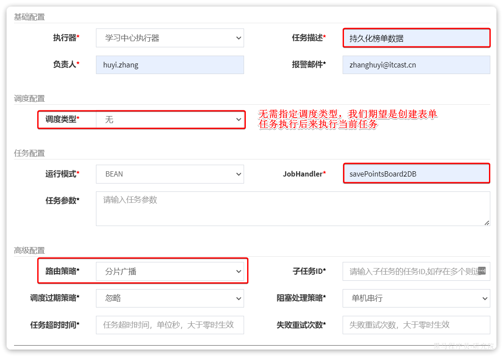

<br/>

然后是清理Redis的任务：

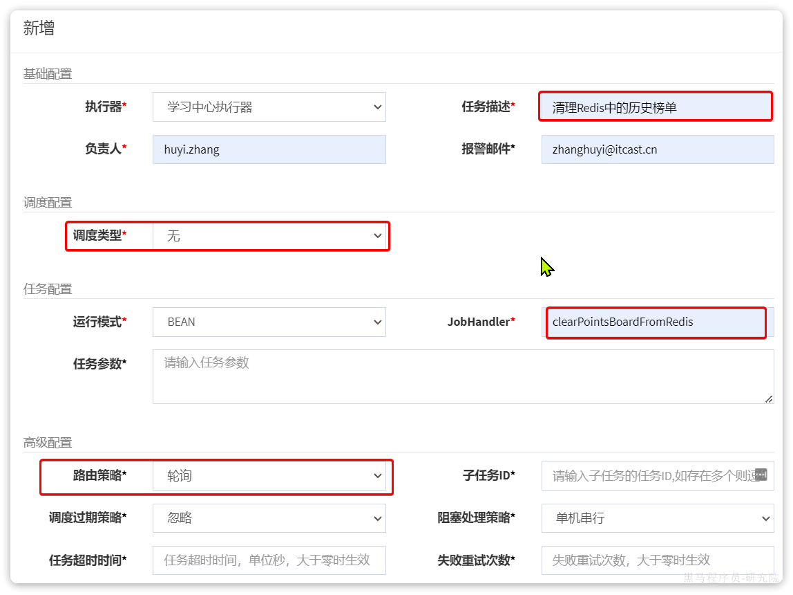

<br/>

接下来，回到任务管理页面，会看到3个任务都添加成功，并且每个任务都有自己的ID：

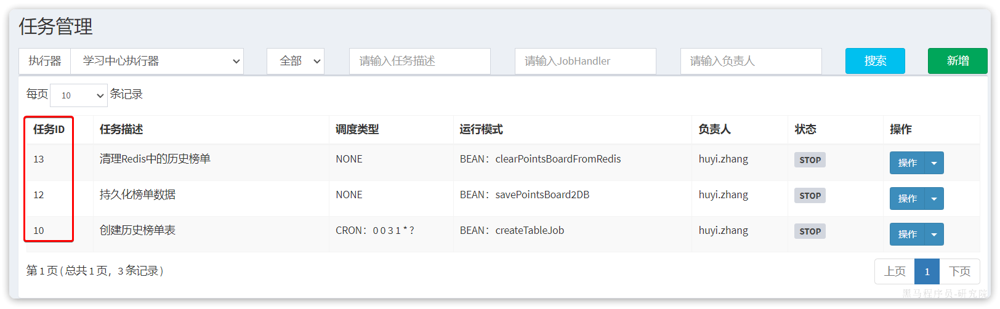

要想让任务A、B依次执行，其实就是配置任务B作为任务A的子任务。因此，我们按照下面方式配置：

- 创建历史榜单表（10）的子任务是持久化榜单数据任务（12）
- 持久化榜单数据任务（12）的子任务是清理Redis中的历史榜单（13）

<br/>

也就是说：10的子任务是12,  12的子任务是13

<br/>

首先，点击创建历史绑定表后面的操作，然后编辑：

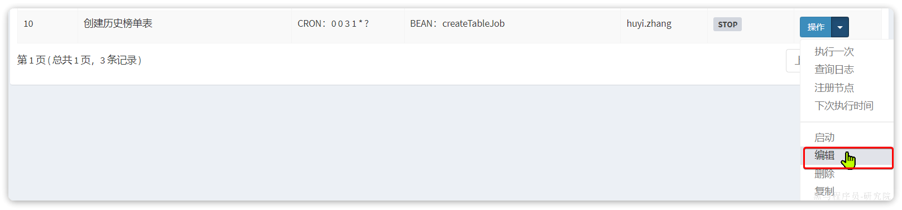

<br/>

然后在子任务中，填写持久化榜单数据任务的id，本例中是12：

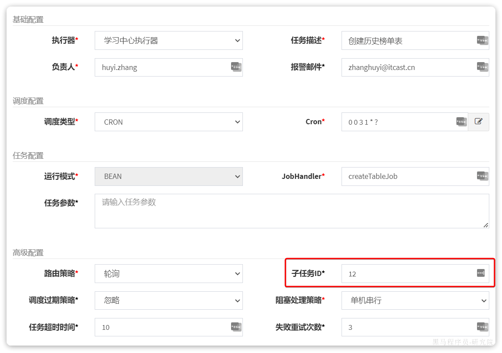

保存。

<br/>

然后点击持久化榜单数据任务后面的操作，编辑：

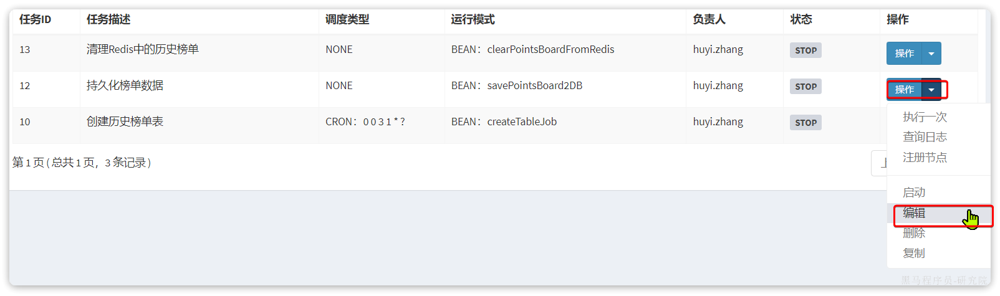

<br/>

然后在子任务一栏，填写清理Redis中的历史榜单的任务id，本例中是13：

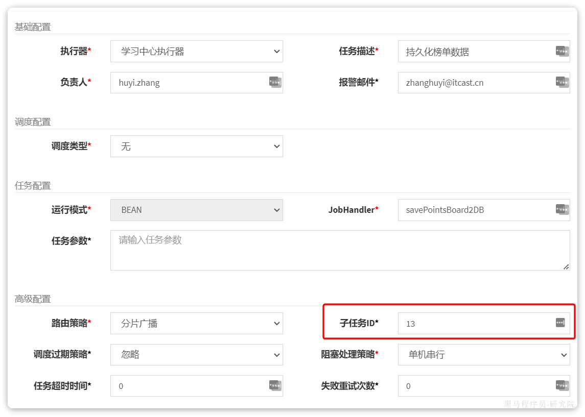

好了，任务链形成了。

<br/>

接下来，执行一次创建榜单表任务，就会发现后续的两个任务也依次执行了。

## 练习

### 查询积分榜

完善查询学霸积分榜功能，课堂中只实现了对当前赛季榜单的查询，大家需要完善对历史榜单数据的查询。

注意：历史榜单数据在不同的表中。

<br/>

### 清理积分明细

积分明细数据比积分榜单数据量更大，全部放到一张表中不太合适。建议按照赛季的日期对积分明细数据做水平拆分：

- 当前赛季的数据依然保存在points_record表不变
- 每个历史赛季的积分明细需要从points_record表迁移到一张独立的表中
- 表名称规则points_record_xx，这里的xx就是赛季id

通过一个定时任务在每月初完成数据迁移。

<br/>

## 总结

:::warning  💡思考：你在项目中负责积分排行榜功能，说说看你们排行榜怎么设计实现的？

答：我们的排行榜功能分为两部分：一个是当前赛季排行榜，一个是历史排行榜。

因为我们的产品设计是每个月为一个赛季，月初清零积分记录，这样学员就有持续的动力去学习。这就有了赛季的概念，因此也就有了当前赛季榜单和历史榜单的区分，其实现思路也不一样。

首先说当前赛季榜单，我们采用了Redis的SortedSet来实现。member是用户id，score就是当月积分总值。每当用户产生积分行为的时候，获取积分时，就会更新score值。这样Redis就会自动形成榜单了。非常方便且高效。

然后再说历史榜单，历史榜单肯定是保存到数据库了。不过由于数据过多，所以需要对数据做水平拆分，我们目前的思路是按照赛季来拆分，也就是每一个赛季的榜单单独一张表。这样做有几个好处：

- 拆分数据时比较自然，无需做额外处理
- 查询数据时往往都是按照赛季来查询，这样一次只需要查一张表，不存在跨表查询问题

因此我们就不需要用到分库分表的插件了，直接在业务层利用MybatisPlus就可以实现动态表名，动态插入了。简单高效。

我们会利用一个定时任务在每月初生成上赛季的榜单表，然后再用一个定时任务读取Redis中的上赛季榜单数据，持久化到数据库中。最后再有一个定时任务清理Redis中的历史数据。

这里要说明一下，这里三个任务是有关联的，之所以让任务分开定义，是为了避免任务耦合。这样在部分任务失败时，可以单独重试，无需所有任务从头重试。

当然，最终我们肯定要确保这三个任务的执行顺序，一定是依次执行的。

<br/>

💡**思考：你们使用Redis的SortedSet来保存榜单数据，如果用户量非常多怎么办？**

首先Redis的SortedSet底层利用了跳表机制，性能还是非常不错的。即便有百万级别的用户量，利用SortedSet也没什么问题，性能上也能得到保证。在我们的项目用户量下，完全足够。

当系统用户量规模达到数千万，乃至数亿时，我们可以采用分治的思想，将用户数据按照积分范围划分为多个桶。

然后为每个桶创建一个SortedSet类型的key，这样就可以将数据分散，减少单个KEY的数据规模了。

而要计算排名时，只需要按照范围查询出用户积分所在的桶，再累加分值范围比他高的桶的用户数量即可。依然非常简单、高效。

<br/>

💡**思考：你们使用历史榜单采用的定时任务框架是哪个？处理数百万的榜单数据时任务是如何分片的？你们是如何确保多个任务依次执行的呢？**

答：我们采用的是XXL-JOB框架。

XXL-JOB自带任务分片广播机制，每一个任务执行器都能通过API得到自己的分片编号、总分片数量。在做榜单数据批处理时，我们是按照分页查询的方式：

- 每个执行器的读取的起始页都是自己的分片编号+1，例如第一个执行器，其起始页就是1，第二个执行器，其起始页就是2，以此类推
- 然后不是逐页查询，而是有一个页的跨度，跨度值就是分片总数量。例如分了3片，那么跨度就是3

此时，第一个分片处理的数据就是第1、4、7、10、13等几页数据，第二个分片处理的就是第2、5、8、11、14等页的数据，第三个分片处理的就是第3、6、9、12、15等页的数据。

这样就能确保所有数据都会被处理，而且每一个执行器都执行的是不同的数据了。

最后，要确保多个任务的执行顺序，可以利用XXL-JOB中的子任务功能。比如有任务A、B、C，要按照字母顺序依次执行，我们就可以将C设置为B的子任务，再将B设置为A的子任务。然后给A设置一个触发器。

这样，当A触发时，就会依次执行这三个任务了。

:::
