路线服务
========

[[toc]]

## 课程安排

- 路线规划需求分析
- 路线规划实现方案分析
- Neo4j的快速入门
- 学习Cypher入门
- 学习Spring Data Neo4j

## 背景说明

在实现运费微服务中，介于你出色的表现，现在项目三组承接了一个新的开发任务，需要开发运输路线微服务，这将是一个全新微服务，开发经理决定让你来负责这个微服务的开发。


## 需求分析

首先想个问题，用户小王在神领物流用户端下了个订单，是从上海发往北京的包裹，神领物流接收这个单子后，是如何进行运输的呢？是直接开一辆车去送吗？还是需要中转？需要中转多少次呢？怎么样的中转成本是最低的？


### 路线分析

假设神领物流系统有这些运输路线数据：

| **编号** | **名称**         | **起点**         | **终点**         |
| -------- | ---------------- | ---------------- | ---------------- |
| 1001     | 迪士尼到浦东转运 | 迪士尼营业部     | 浦东新区转运中心 |
| 1002     | 浦东到上海转运   | 浦东新区转运中心 | 上海转运中心     |
| 1003     | 闵行到上海转运   | 闵行区转运中心   | 上海转运中心     |
| 1004     | 莘庄到闵行转运   | 莘庄营业部       | 闵行区转运中心   |
| 1005     | 京沪线           | 上海转运中心     | 北京转运中心     |
| 1006     | 沪杭线           | 上海转运中心     | 杭州转运中心     |
| 1007     | 北京到昌平       | 北京转运中心     | 昌平区转运中心   |
| 1008     | 昌平到金燕龙     | 昌平区转运中心   | 金燕龙营业部     |
| 1009     | 昌平到回龙观     | 昌平区转运中心   | 回龙观营业部     |
| 1010     | 北京到海淀       | 北京转运中心     | 海淀区转运中心   |
| 1011     | 杭州到北京       | 杭州转运中心     | 北京转运中心     |
| ……       | ……               | ……               | ……               |

按照上面的订单，是由【上海浦东迪士尼】发往【北京昌平金燕龙】，有直达的路线吗？其实是没有的，实际上很少会有【网点↔网点】的直达路线的，这样成本太高了，所以完成一次运输都是通过各个【转运】完成的。
如果参考上面的路线数据，可以找出两条转运路线：
:::info
路线1：迪士尼营业部 -> 浦东新区转运中心 -> 上海转运中心 -> 北京转运中心 -> 昌平区转运中心 -> 金燕龙营业部
路线2：迪士尼营业部-> 浦东新区转运中心 -> 上海转运中心 -> 杭州转运中心 -> 北京转运中心 -> 昌平区转运中心 -> 金燕龙营业部
:::
你找的路线结果是这样的吗？你是如何找出的？

### 问题分析

如果我们基于上面的数据表进行查找路线时，基本上都是一条一条的数据过，看是否能够【链接】起来，直到目的地。
这样的查找有什么问题吗？
想象一下，如果这个表的数据变的很大的时候呢？比如说，有100、1000、10000、……条数据的时候，查找会非常慢，而且我们编写代码也会非常的复杂。
显然，这个并不是好的解决方案。有没有什么好的解决呢？

### 问题解决

如果将上述的路线数据把表格的形式转化成图的形式，看是否能够解决问题：

可以看出，如果将表格的数据用图形的方式展现出来的话，就很容易能找到两条运输路线。
:::info
路线1：迪士尼营业部 -> 浦东新区转运中心 -> 上海转运中心 -> 北京转运中心 -> 昌平区转运中心 -> 金燕龙营业部
路线2：迪士尼营业部-> 浦东新区转运中心 -> 上海转运中心 -> 杭州转运中心 -> 北京转运中心 -> 昌平区转运中心 -> 金燕龙营业部
:::
想一想，哪条路线好一些呢？显然，路线1要优于路线2，因为路线1比路线2的转运次数更少一些。
可见，使用图形的方式要比表达的方式展现更清晰一些，就是所谓的“一图胜千言万语”，这就给我们解决问题带来了新的思路，如果数据能够按照图形的方式存储，那么对于运输路线的计算就会更高效一些。
有没有一种技术是以“图”的方式存储数据呢？ 答案是有的，那就是图数据库。

## Neo4j快速入门

### 什么是Neo4j？

Neo4j是用Java实现的开源NoSQL图数据库。从2003年开始开发，2007年正式发布第一版，其源码托管于GitHtb。Neo4j作为图数据库中的代表产品，已经在众多的行业项目中进行了应用，如：网络管理、软件分析、组织和项目管理、社交项目等方面。
官网：
Neo4j实现了专业数据库级别的图数据模型的存储，提供了完整的数据库特性，包括ACID事务的支持、集群的支持、备份和故障转移等。
Neo4j提供了申明式的查询语言Cypher，它类似于关系型数据库中的SQL语言，其具有表现力丰富、使用简单、查询效率高、高扩展性等特点。
它存储的数据大致是这样的：

其中，紫色圆圈是【人】数据，橙色圆圈是【电影】数据，表示人与电影之间参演或导演的数据关系。

### 版本说明

Neo4j有两个不同的版本，分别是：

- 社区版（Community Edition）
  - 具备了基本功能的版本，功能较为完整，没有提供企业服务。
- 企业版（Experience Edition）
  - 企业版相对于社区版而言，增加了一些功能，如：集群、高级监控、高级缓存、在线备份等功能。
    :::info
    建议：开发环境使用社区版，生产环境使用企业版。
    说明：企业版从3.2版本开始支持集群，无地理位置限制并且可以做到事务的ACID特性。
    :::
    Neo4j企业·参考：[http://neo4j.com.cn/topic/59b0a3f59fe13f5e0a2212b2](http://neo4j.com.cn/topic/59b0a3f59fe13f5e0a2212b2)
    

### 部署安装

Neo4j支持众多平台的部署安装，如：Windows、Mac、Linux等系统。Neo4j是基于Java平台的，所以部署安装前先保证已经安装了Java虚拟机。
在神领物流项目中，我们采用docker的方式进行安装。安装命令如下：

```shell
docker run \
-d \
--restart=always \
--name neo4j \
-p 7474:7474 \
-p 7687:7687 \
-v neo4j:/data \
neo4j:4.4.5

## 7474是web管理工具的端口，7687是neo4j协议端口进行数据通信
```

打开浏览器，输入地址：[http://neo4j.sl-express.com/browser/](http://neo4j.sl-express.com/browser/)
已经将登录密码改成了：neo4j123

如果是第一次登录，默认密码是：neo4j，首次登录需要重置密码：

登录成功后可以看到如下界面：


### Neo4j web 工具介绍

Neo4j提供了web工具，可以对neo4j进行CRUD的操作。


### 体验Neo4j

下面我们通过官方提供的电影数据体验下Neo4j：


#### 加载数据


创建数据语句会自动写入到Cypher语句输入框中，点击运行：

创建成功：


#### 查询数据

查询【Tom Hanks】参演了哪些电影：

```cypher
MATCH (tom:Person {name: "Tom Hanks"})-[:ACTED_IN]->(tomHanksMovies) RETURN tom,tomHanksMovies
```

查询结果：


### 数据结构

Neo4j中采用节点、属性、关系、标签来存储数据。如下：


- 节点
  - 存储实体数据，在上图中，演员、电影都是节点。
  - 可以理解为关系型数据库中的表。
- 关系
  - 存储节点之间的关系。
  - 关系只能有一个类型，必须有开始节点和结束节点以及指向。
  - 关系可以自我循环引用，但是两头永远不能为空。
- 属性
  - 节点和关系都可以有属性，它是由键值对组成的。
  - 节点的属性可以理解为关系型数据库中的字段。
  - 关系中的属性进一步的明确了关系。
- 标签
  - 标签是对节点的分类，这样使得构建Neo4j数据模型更加简单。
  - 在上面的电影案例中，Movie、Person就是标签。

## Cypher入门

Cypher是Neo4j的查询语言，类似与关系型数据库中的SQL，一些关键词来源于SQL，比如：CREATE、WHERE、RETRUN等。下面我们一起学习Cypher的基本语句。
:::info
Cypher语句的关键字对大小写不敏感。
:::

### 创建数据

在Neo4j中使用CREATE命令来创建节点、关系、属性数据。语法如下：

```cypher
//查询所有数据
MATCH (n) RETURN n
//删除所有节点和关系，慎用！
MATCH (n) DETACH DELETE n

CREATE (n {name: $value}) RETURN n   //创建节点,该节点具备name属性，n为该节点的变量,创建完成后返回该节点
CREATE (n:$Tag {name: $value}) //创建节点，指定标签
CREATE (n)-[r:KNOWS]->(m)  //创建n指向m的关系，并且指定关系类型为：KNOWS
                 
//示例
CREATE (n {name:'迪士尼营业部'})
CREATE (n:AGENCY {name:'航头营业部'})

//创建浦东新区转运中心、上海转运中心节点，并且创建关系为：IN_LINE，创建完成后返回节点和关系
//TLT -> Two Level Transport（二级转运中心）
//OLT -> One Level Transport（一级转运中心）
CREATE (n:TLT {name:'浦东新区转运中心'}) -[r:IN_LINE]-> (m:OLT {name:'上海转运中心'}) RETURN n,r,m

//关系也是可以反向，并且可以为关系中指定属性
CREATE (n:TLT {name:'浦东新区转运中心'}) <-[r:OUT_LINE]- (m:OLT {name:'上海转运中心'}) RETURN n,r,m
```

### 查询数据

Cypher查询语法如下：

```cypher
[MATCH WHERE]  //条件查询
[WITH [ORDER BY] [SKIP] [LIMIT]] //查询的结果以管道的形式传递给下面的语句，聚合查询必须使用WITH
RETURN [ORDER BY] [SKIP] [LIMIT] //返回、排序、跳过、返回个数
```

#### 构造数据

```cypher
CREATE (北京市转运中心:OLT {bid: 8001, name: "北京市转运中心", address: "北京市转运中心", location : point({latitude:39.904179, longitude:116.407387})})
CREATE (上海市转运中心:OLT {bid: 8002, name: "上海市转运中心", address: "上海市转运中心", location : point({latitude:31.230525, longitude:121.473667})})
CREATE (南京市转运中心:OLT {bid: 8003, name: "南京市转运中心", address: "南京市转运中心", location : point({latitude:32.059344, longitude:118.796624})})
CREATE (太原市转运中心:OLT {bid: 8004, name: "太原市转运中心", address: "太原市转运中心", location : point({latitude:37.870451, longitude:112.549656})})
CREATE (郑州市转运中心:OLT {bid: 8005, name: "郑州市转运中心", address: "郑州市转运中心", location : point({latitude:34.745551, longitude:113.624321})})

CREATE
    (北京市转运中心)-[:IN_LINE {cost:10684.9}]->(上海市转运中心),
    (北京市转运中心)<-[:OUT_LINE {cost:10684.9}]-(上海市转运中心),
    (北京市转运中心)-[:IN_LINE {cost:8993.1}]->(南京市转运中心),
    (北京市转运中心)<-[:OUT_LINE {cost:8993.1}]-(南京市转运中心),
    (南京市转运中心)-[:IN_LINE {cost:2699.4}]->(上海市转运中心),
    (南京市转运中心)<-[:OUT_LINE {cost:2699.4}]-(上海市转运中心),
    (太原市转运中心)-[:IN_LINE {cost:3609.7}]->(郑州市转运中心),
    (太原市转运中心)<-[:OUT_LINE {cost:3609.7}]-(郑州市转运中心),
    (郑州市转运中心)-[:IN_LINE {cost:5659.7}]->(南京市转运中心),
    (郑州市转运中心)<-[:OUT_LINE {cost:5659.7}]-(南京市转运中心)

CREATE (昌平区转运中心:TLT {bid: 90001, name: "昌平区转运中心", address: "昌平区转运中心", location : point({latitude:40.220952, longitude:116.231034})})
CREATE (北京市昌平区新龙城:AGENCY {bid: 100260, name: "北京市昌平区新龙城", address: "龙跃苑四区3号楼底商", phone : "010-53049073,010-53576707", location : point({latitude:40.07544443596149, longitude:116.3470535709328})})
CREATE
    (北京市昌平区新龙城)-[:IN_LINE {cost:189.7}]->(昌平区转运中心),
    (北京市昌平区新龙城)<-[:OUT_LINE {cost:189.7}]-(昌平区转运中心)
CREATE (北京市昌平区定泗路:AGENCY {bid: 100280, name: "北京市昌平区定泗路", address: "北七家镇定泗路苍龙街交叉口", phone : "010-86392987", location : point({latitude:40.11765281246394, longitude:116.37212849638287})})
CREATE
    (北京市昌平区定泗路)-[:IN_LINE {cost:166.2}]->(昌平区转运中心),
    (北京市昌平区定泗路)<-[:OUT_LINE {cost:166.2}]-(昌平区转运中心)
CREATE (海淀区转运中心:TLT {bid: 90002, name: "海淀区转运中心", address: "海淀区转运中心", location : point({latitude:39.959893, longitude:116.2977})})
CREATE (北京市海淀区小营:AGENCY {bid: 100347, name: "北京市海淀区小营", address: "北京市昌平区回龙观街道金燕龙大厦停车场", phone : "010-86483817,010-86483817,010-86483817", location : point({latitude:40.06177798692319, longitude:116.32706587559049})})
CREATE
    (北京市海淀区小营)-[:IN_LINE {cost:116.1}]->(海淀区转运中心),
    (北京市海淀区小营)<-[:OUT_LINE {cost:116.1}]-(海淀区转运中心)
CREATE (北京市海淀区万泉河:AGENCY {bid: 100227, name: "北京市海淀区万泉河", address: "北京市海淀区四季青镇杏石口路47号院", phone : "18521852356", location : point({latitude:39.94882822425318, longitude:116.25707017441161})})
CREATE
    (北京市海淀区万泉河)-[:IN_LINE {cost:36.8}]->(海淀区转运中心),
    (北京市海淀区万泉河)<-[:OUT_LINE {cost:36.8}]-(海淀区转运中心)
CREATE
    (昌平区转运中心)-[:IN_LINE {cost:383.3}]->(北京市转运中心),
    (昌平区转运中心)<-[:OUT_LINE {cost:383.3}]-(北京市转运中心),
    (海淀区转运中心)-[:IN_LINE {cost:112.3}]->(北京市转运中心),
    (海淀区转运中心)<-[:OUT_LINE {cost:112.3}]-(北京市转运中心)
CREATE (浦东新区转运中心:TLT {bid: 90003, name: "浦东新区转运中心", address: "浦东新区转运中心", location : point({latitude:31.221461, longitude:121.544346})})
CREATE (上海市浦东新区南汇:AGENCY {bid: 210057, name: "上海市浦东新区南汇", address: "园春路8号", phone : "18821179169", location : point({latitude:31.035240152911637, longitude:121.73459966751048})})
CREATE
    (上海市浦东新区南汇)-[:IN_LINE {cost:275.4}]->(浦东新区转运中心),
    (上海市浦东新区南汇)<-[:OUT_LINE {cost:275.4}]-(浦东新区转运中心)
CREATE (上海市浦东新区周浦:AGENCY {bid: 210127, name: "上海市浦东新区周浦", address: "川周公路3278-8号", phone : "021-68060322", location : point({latitude:31.132409729356993, longitude:121.59815370294322})})
CREATE
    (上海市浦东新区周浦)-[:IN_LINE {cost:111.6}]->(浦东新区转运中心),
    (上海市浦东新区周浦)<-[:OUT_LINE {cost:111.6}]-(浦东新区转运中心)
CREATE (奉贤区转运中心:TLT {bid: 90004, name: "奉贤区转运中心", address: "奉贤区转运中心", location : point({latitude:30.918406, longitude:121.473945})})
CREATE (上海市奉贤区东部:AGENCY {bid: 210017, name: "上海市奉贤区东部", address: "上上海市奉贤区洪庙镇洪兰路351", phone : "021-57171717", location : point({latitude:30.917752751719863, longitude:121.67587819184698})})
CREATE
    (上海市奉贤区东部)-[:IN_LINE {cost:192.9}]->(奉贤区转运中心),
    (上海市奉贤区东部)<-[:OUT_LINE {cost:192.9}]-(奉贤区转运中心)
CREATE (上海市奉贤区青村:AGENCY {bid: 210442, name: "上海市奉贤区青村", address: "姚家村1127号", phone : "021-57566663,021-57566606", location : point({latitude:30.916946897994983, longitude:121.57954144207972})})
CREATE
    (上海市奉贤区青村)-[:IN_LINE {cost:100.9}]->(奉贤区转运中心),
    (上海市奉贤区青村)<-[:OUT_LINE {cost:100.9}]-(奉贤区转运中心)
CREATE
    (浦东新区转运中心)-[:IN_LINE {cost:68.0}]->(上海市转运中心),
    (浦东新区转运中心)<-[:OUT_LINE {cost:68.0}]-(上海市转运中心),
    (奉贤区转运中心)-[:IN_LINE {cost:347.4}]->(上海市转运中心),
    (奉贤区转运中心)<-[:OUT_LINE {cost:347.4}]-(上海市转运中心)
CREATE (玄武区转运中心:TLT {bid: 90004, name: "玄武区转运中心" , location : point({latitude:32.048644, longitude:118.797779})})
CREATE (江苏省南京市玄武区紫金墨香苑:AGENCY {bid: 25073, name: "江苏省南京市玄武区紫金墨香苑", address: "栖霞区燕尧路100号", phone : "025-58765331,025-83241955,025-83241881", location : point({latitude:32.117016089520305, longitude:118.86319310255513})})
CREATE
    (江苏省南京市玄武区紫金墨香苑)-[:IN_LINE {cost:98.0}]->(玄武区转运中心),
    (江苏省南京市玄武区紫金墨香苑)<-[:OUT_LINE {cost:98.0}]-(玄武区转运中心)
CREATE (江苏省南京市玄武区长江路:AGENCY {bid: 25023, name: "江苏省南京市玄武区长江路", address: "观音阁10号", phone : "18521133265,18695799166", location : point({latitude:32.04803554410631, longitude:118.79190455263355})})
CREATE
    (江苏省南京市玄武区长江路)-[:IN_LINE {cost:5.6}]->(玄武区转运中心),
    (江苏省南京市玄武区长江路)<-[:OUT_LINE {cost:5.6}]-(玄武区转运中心)
CREATE
    (玄武区转运中心)-[:IN_LINE {cost:12.0}]->(南京市转运中心),
    (玄武区转运中心)<-[:OUT_LINE {cost:12.0}]-(南京市转运中心)

CREATE (小店区转运中心:TLT {bid: 90005, name: "小店区转运中心" , location : point({latitude:37.736865, longitude:112.565524})})
CREATE (山西省太原市青龙:AGENCY {bid: 351068, name: "山西省太原市青龙", address: "长治路33号经典家园停车场内13号商铺", phone : "0351-2025888", location : point({latitude:37.83589608758359, longitude:112.56059258109424})})
CREATE
    (山西省太原市青龙)-[:IN_LINE {cost:110.3}]->(小店区转运中心),
    (山西省太原市青龙)<-[:OUT_LINE {cost:110.3}]-(小店区转运中心)
CREATE (山西省太原市长风街:AGENCY {bid: 351045, name: "山西省太原市长风街", address: "平阳路104号省农机公司院内", phone : "18636100730", location : point({latitude:37.809964384001226, longitude:112.55299317699505})})
CREATE
    (山西省太原市长风街)-[:IN_LINE {cost:82.1}]->(小店区转运中心),
    (山西省太原市长风街)<-[:OUT_LINE {cost:82.1}]-(小店区转运中心)
CREATE
    (小店区转运中心)-[:IN_LINE {cost:149.4}]->(太原市转运中心),
    (小店区转运中心)<-[:OUT_LINE {cost:149.4}]-(太原市转运中心)

CREATE (中原区转运中心:TLT {bid: 90006, name: "中原区转运中心" , location : point({latitude:34.74828, longitude:113.612966})})
CREATE (河南省郑州市郑上路:AGENCY {bid: 371067, name: "河南省郑州市郑上路", address: "中原西路西四环西北角", phone : "0371-55116757,0371-68014786", location : point({latitude:34.74753024533005, longitude:113.57428550005442})})
CREATE
    (河南省郑州市郑上路)-[:IN_LINE {cost:35.4}]->(中原区转运中心),
    (河南省郑州市郑上路)<-[:OUT_LINE {cost:35.4}]-(中原区转运中心)
CREATE (河南省郑州市颍河路:AGENCY {bid: 371086, name: "河南省郑州市颍河路", address: "航海西路与西三环交叉口向南300米路西中贸商务", phone : "19139415556", location : point({latitude:34.71593280680163, longitude:113.60398506929064})})
CREATE
    (河南省郑州市颍河路)-[:IN_LINE {cost:36.9}]->(中原区转运中心),
    (河南省郑州市颍河路)<-[:OUT_LINE {cost:36.9}]-(中原区转运中心)
CREATE
    (中原区转运中心)-[:IN_LINE {cost:11.5}]->(郑州市转运中心),
    (中原区转运中心)<-[:OUT_LINE {cost:11.5}]-(郑州市转运中心)
```

#### 基本查询

```cypher
MATCH (n) RETURN n  //查询所有的数据，数据量大是勿用
MATCH (n:AGENCY) RETURN n  //查询所有的网点（AGENCY）
MATCH (n:OLT {name: "北京市转运中心"}) -- (m) RETURN n,m //查询所有与“北京市转运中心”有关系的节点
MATCH (n:OLT {name:"北京市转运中心"}) --> (m:OLT) RETURN n,m //查询所有"北京市转运中心"关联的一级转运中心
MATCH (n:OLT {name:"北京市转运中心"}) -[r:IN_LINE]- (m) RETURN n,r,m //可以指定关系标签查询
MATCH p = (n:OLT {name:"北京市转运中心"}) --> (m:OLT) RETURN p //将查询赋值与变量
//通过 type()函数查询关系类型
MATCH (n:OLT {name:"北京市转运中心"}) -[r]-> (m:OLT {name:"南京市转运中心"}) RETURN type(r)


```

#### 关系深度查询

可以指定关系的深度进行查询，语法格式：`-[:TYPE*minHops..maxHops]->`
:::info
六度分隔（Six Degrees of Separation）理论。
1967年，哈佛大学的心理学教授Stanley Milgram（1933~1984）想要描绘一个连结人与社区的人际连系网。做过一次连锁信实验，结果发现了“六度分隔”现象。简单地说：“你和任何一个陌生人之间所间隔的人不会超过六个，也就是说，最多通过六个人你就能够认识任何一个陌生人。”
:::

```cypher
//查询【北京市转运中心】关系中深度为1~2层关系的节点
MATCH (n:OLT {name:"北京市转运中心"}) -[*1..2]->(m) RETURN *
//也可以这样
MATCH (n:OLT {name:"北京市转运中心"}) -[*..2]->(m) RETURN *
//也可以通过变量的方式查询
MATCH path = (n:OLT {name:"北京市转运中心"}) -[*..2]->(m)
RETURN path

//查询关系，relationships()获取结果中的关系，WITH向后传递数据
MATCH path = (n:OLT {name:"北京市转运中心"}) -[*..2]->(m)
WITH n,m, relationships(path) AS r
RETURN r

//查询两个网点之间所有的路线，最大深度为6，可以查询到2条路线
MATCH path = (n:AGENCY) -[*..6]->(m:AGENCY)
WHERE n.name = "北京市昌平区定泗路" AND m.name = "上海市浦东新区南汇"
RETURN path

//查询两个网点之间最短路径，查询深度最大为10
MATCH path = shortestPath((n:AGENCY) -[*..10]->(m:AGENCY))
WHERE n.name = "北京市昌平区定泗路" AND m.name = "上海市浦东新区南汇"
RETURN path

//查询两个网点之间所有的路线中成本最低的路线，最大深度为10（如果成本相同，转运节点最少）
MATCH path = (n:AGENCY) -[*..10]->(m:AGENCY)
WHERE n.name = "北京市昌平区定泗路" AND m.name = "上海市浦东新区南汇"
UNWIND relationships(path) AS r
WITH sum(r.cost) AS cost, path
RETURN path ORDER BY cost ASC, LENGTH(path) ASC LIMIT 1

//UNWIND是将列表数据展开操作
//sum()是聚合统计函数，类似还有：avg()、max()、min()等
```

#### 分页查询

```cypher
//分页查询网点，按照bid正序排序，每页查询2条数据，第一页
MATCH (n:AGENCY) 
RETURN n ORDER BY n.bid ASC SKIP 0 LIMIT 2

//第二页
MATCH (n:AGENCY) 
RETURN n ORDER BY n.bid ASC SKIP 2 LIMIT 2

//……
```

### 更新数据

更新数据是使用SET语句进行标签、属性的更新。SET操作是幂等性的。

```cypher
// 更新/设置 属性
MATCH (n:AGENCY {name:"北京市昌平区新龙城"})
SET n.address = "龙跃苑四区3号楼底商101号"
RETURN n

//通过remove移除属性
MATCH (n:AGENCY {name:"北京市昌平区新龙城"}) REMOVE n.address RETURN n

//没有address属性的增加属性
MATCH (n:AGENCY) WHERE n.address IS NULL SET n.address = "暂无地址" RETURN n
```

### 删除数据

删除数据通过DELETE、DETACH DELETE完成。其中DELETE不能删除有关系的节点，删除关系就需要DETACH DELETE了。

```cypher
//删除节点
MATCH (n:AGENCY {name:"航头营业部"}) DELETE n
//有关系的节点是不能直接删除的
MATCH (n:AGENCY {name:"北京市昌平区新龙城"}) DELETE n
//删除节点和关系
MATCH (n:AGENCY {name:"北京市昌平区新龙城"}) DETACH DELETE n

//删除所有节点和关系，慎用！
MATCH (n) DETACH DELETE n
```

### 索引

在Neo4j中同样也支持索引，对字段做索引可以提升查询速度。

```cypher
//创建索引语法：
//OPTIONS子句指定索引提供程序和配置。
CREATE [TEXT] INDEX [index_name] [IF NOT EXISTS]
FOR (n:LabelName)
ON (n.propertyName)
[OPTIONS "{" option: value[, ...] "}"]

//示例：
CREATE TEXT INDEX agency_index_bid IF NOT EXISTS FOR (n:AGENCY) ON (n.bid)

//删除索引语法：
DROP INDEX index_name

//示例：
DROP INDEX agency_index_bid
```

## SDN快速入门

Spring Data Neo4j简称SDN，是Spring对Neo4j数据库操作的封装，其底层基于`neo4j-java-driver`实现。
我们使用的版本为：6.2.3，官方文档：
下面我们将基于项目中的运输路线业务进行学习，例如：
:::info
【迪士尼营业部】-> 【浦东区转运中心】 -> 【上海转运中心】 -> 【北京转运中心】-> 【昌平区转运中心】-> 【金燕龙营业部】
:::

### 创建工程

创建工程，sl-express-sdn，导入依赖：

```xml
<?xml version="1.0" encoding="UTF-8"?>
<project xmlns="http://maven.apache.org/POM/4.0.0"
         xmlns:xsi="http://www.w3.org/2001/XMLSchema-instance"
         xsi:schemaLocation="http://maven.apache.org/POM/4.0.0 http://maven.apache.org/xsd/maven-4.0.0.xsd">
    <modelVersion>4.0.0</modelVersion>

    <parent>
        <groupId>com.sl-express</groupId>
        <artifactId>sl-express-parent</artifactId>
        <version>1.4</version>
    </parent>

    <groupId>com.sl-express.sdn</groupId>
    <artifactId>sl-express-sdn</artifactId>
    <version>1.0-SNAPSHOT</version>

    <properties>
        <maven.compiler.source>11</maven.compiler.source>
        <maven.compiler.target>11</maven.compiler.target>
        <sl-express-common.version>1.2-SNAPSHOT</sl-express-common.version>
    </properties>

    <dependencies>
        <dependency>
            <groupId>com.sl-express.common</groupId>
            <artifactId>sl-express-common</artifactId>
            <version>${sl-express-common.version}</version>
        </dependency>
        <!--SDN依赖-->
        <dependency>
            <groupId>org.springframework.boot</groupId>
            <artifactId>spring-boot-starter-data-neo4j</artifactId>
        </dependency>
    </dependencies>

</project>
```

### 编写配置文件

```yaml
server:
  port: 9902
logging:
  level:
    org.springframework.data.neo4j: debug
spring:
  application:
    name: sl-express-sdn
  mvc:
    pathmatch:
      #解决异常：swagger Failed to start bean 'documentationPluginsBootstrapper'; nested exception is java.lang.NullPointerException
      #因为Springfox使用的路径匹配是基于AntPathMatcher的，而Spring Boot 2.6.X使用的是PathPatternMatcher
      matching-strategy: ant_path_matcher
  data:
    neo4j:
      database: neo4j
  neo4j:
    authentication:
      username: neo4j
      password: neo4j123
    uri: neo4j://192.168.150.101:7687
```

### 基础代码

#### SDNApplication

编写启动类：

```java
package com.sl.sdn;

import org.springframework.boot.SpringApplication;
import org.springframework.boot.autoconfigure.SpringBootApplication;

@SpringBootApplication
public class SDNApplication {

    public static void main(String[] args) {
        SpringApplication.run(SDNApplication.class, args);
    }
}
```

#### Entity

编写实体，在物流中，会存在网点、二级转运中心、一级转运中心，我们分别用Agency、TLT、OLT表示。
由于以上三个机构的属性是相同的，但在Neo4j中的标签是不一样的，所以既要保证不同的类，也有相同的属性，这种场景比较适合将属性写到父类中，自己继承父类来实现，这里我们采用抽象类的来实现。

```java
package com.sl.sdn.entity.node;

import com.sl.sdn.enums.OrganTypeEnum;
import io.swagger.annotations.ApiModelProperty;
import lombok.AllArgsConstructor;
import lombok.Data;
import lombok.NoArgsConstructor;
import lombok.experimental.SuperBuilder;
import org.springframework.data.geo.Point;
import org.springframework.data.neo4j.core.schema.GeneratedValue;
import org.springframework.data.neo4j.core.schema.Id;

@Data
@SuperBuilder(toBuilder = true)
@NoArgsConstructor
@AllArgsConstructor
public abstract class BaseEntity {

    @Id
    @GeneratedValue
    @ApiModelProperty(value = "Neo4j ID", hidden = true)
    private Long id;
    @ApiModelProperty(value = "业务id", required = true)
    private Long bid;
    @ApiModelProperty(value = "名称", required = true)
    private String name;
    @ApiModelProperty(value = "电话", required = true)
    private String phone;
    @ApiModelProperty(value = "地址", required = true)
    private String address;
    @ApiModelProperty(value = "位置坐标, x: 纬度，y: 经度", required = true)
    private Point location;

    //机构类型
    public abstract OrganTypeEnum getAgencyType();

}

```

机构枚举：

```java
package com.sl.sdn.enums;

import cn.hutool.core.util.EnumUtil;
import com.sl.transport.common.enums.BaseEnum;

/**
 * 机构类型枚举
 */
public enum OrganTypeEnum implements BaseEnum {

    OLT(1, "一级转运中心"),
    TLT(2, "二级转运中心"),
    AGENCY(3, "网点");

    /**
     * 类型编码
     */
    private final Integer code;

    /**
     * 类型值
     */
    private final String value;

    OrganTypeEnum(Integer code, String value) {
        this.code = code;
        this.value = value;
    }

    public Integer getCode() {
        return code;
    }

    public String getValue() {
        return value;
    }

    public static OrganTypeEnum codeOf(Integer code) {
        return EnumUtil.getBy(OrganTypeEnum::getCode, code);
    }
}

```

```java
package com.sl.sdn.entity.node;

import com.sl.sdn.enums.OrganTypeEnum;
import lombok.Data;
import lombok.NoArgsConstructor;
import lombok.ToString;
import lombok.experimental.SuperBuilder;
import org.springframework.data.neo4j.core.schema.Node;

/**
 * 网点实体
 */
@Node("AGENCY")
@Data
@ToString(callSuper = true)
@SuperBuilder(toBuilder = true)
@NoArgsConstructor
public class AgencyEntity extends BaseEntity {

    @Override
    public OrganTypeEnum getAgencyType() {
        return OrganTypeEnum.AGENCY;
    }
}

```

```java
package com.sl.sdn.entity.node;

import com.sl.sdn.enums.OrganTypeEnum;
import lombok.Data;
import lombok.NoArgsConstructor;
import lombok.ToString;
import lombok.experimental.SuperBuilder;
import org.springframework.data.neo4j.core.schema.Node;

/**
 * 一级转运中心实体 (OneLevelTransportEntity)
 */
@Node("OLT")
@Data
@ToString(callSuper = true)
@SuperBuilder(toBuilder = true)
@NoArgsConstructor
public class OLTEntity extends BaseEntity {

    @Override
    public OrganTypeEnum getAgencyType() {
        return OrganTypeEnum.OLT;
    }
}

```

```java
package com.sl.sdn.entity.node;

import com.sl.sdn.enums.OrganTypeEnum;
import lombok.Data;
import lombok.NoArgsConstructor;
import lombok.ToString;
import lombok.experimental.SuperBuilder;
import org.springframework.data.neo4j.core.schema.Node;

/**
 * 二级转运中心实体(TwoLevelTransportEntity)
 */
@Node("TLT")
@Data
@ToString(callSuper = true)
@SuperBuilder(toBuilder = true)
@NoArgsConstructor
public class TLTEntity extends BaseEntity {

    @Override
    public OrganTypeEnum getAgencyType() {
        return OrganTypeEnum.TLT;
    }
}

```

```java
package com.sl.sdn.entity.line;

import lombok.AllArgsConstructor;
import lombok.Builder;
import lombok.Data;
import lombok.NoArgsConstructor;

/**
 * 运输路线实体
 */
@Data
@Builder
@NoArgsConstructor
@AllArgsConstructor
public class TransportLine {

    private Long id;
    private Double cost; //成本

}

```

#### DTO

DTO用于服务间的数据传输，会用到`OrganDTO`、`TransportLineNodeDTO`。

```java
package com.sl.sdn.dto;

import cn.hutool.core.annotation.Alias;
import io.swagger.annotations.ApiModelProperty;
import lombok.Data;

import javax.validation.constraints.NotNull;

/**
 * 机构数据对象，网点、一级转运、二级转运都是看作是机构
 * BaseEntity中的location无法序列化，需要将经纬度拆开封装对象
 */
@Data
public class OrganDTO {

    @Alias("bid") //业务id作为id进行封装
    @ApiModelProperty(value = "机构id", required = true)
    private Long id;
    @ApiModelProperty(value = "名称", required = true)
    private String name;
    @ApiModelProperty(value = "类型，1:一级转运，2：二级转运，3:网点", required = true)
    private Integer type;
    @ApiModelProperty(value = "电话", required = true)
    private String phone;
    @ApiModelProperty(value = "地址", required = true)
    private String address;
    @ApiModelProperty(value = "纬度", required = true)
    private Double latitude;
    @ApiModelProperty(value = "经度", required = true)
    private Double longitude;

}

```

```java
package com.sl.sdn.dto;

import io.swagger.annotations.ApiModelProperty;
import lombok.Data;

import java.util.ArrayList;
import java.util.List;

/**
 * 运输路线对象
 */
@Data
public class TransportLineNodeDTO {

    @ApiModelProperty(value = "节点列表", required = true)
    private List<OrganDTO> nodeList = new ArrayList<>();
    @ApiModelProperty(value = "路线成本", required = true)
    private Double cost = 0d;

}

```

### Repository

SDN也是遵循了Spring Data JPA规范，同时也提供了Neo4jRepository，该接口中提供了基本的CRUD操作，我们定义Repository需要继承该接口。

#### AgencyRepository

```java
package com.sl.sdn.repository;

import com.sl.sdn.entity.node.AgencyEntity;
import org.springframework.data.neo4j.repository.Neo4jRepository;

/**
 * 网点操作
 */
public interface AgencyRepository extends Neo4jRepository<AgencyEntity, Long> {

    /**
     * 根据bid查询
     *
     * @param bid 业务id
     * @return 网点数据
     */
    AgencyEntity findByBid(Long bid);

    /**
     * 根据bid删除
     *
     * @param bid 业务id
     * @return 删除的数据条数
     */
    Long deleteByBid(Long bid);

}

```

测试：

```java
package com.sl.sdn.repository;

import com.sl.sdn.entity.node.AgencyEntity;
import org.junit.jupiter.api.Test;
import org.springframework.boot.test.context.SpringBootTest;
import org.springframework.data.domain.*;

import javax.annotation.Resource;
import java.util.List;

@SpringBootTest
class AgencyRepositoryTest {

    @Resource
    private AgencyRepository agencyRepository;

    @Test
    public void testFindByBid() {
        AgencyEntity agencyEntity = this.agencyRepository.findByBid(9001L);
        System.out.println(agencyEntity);
    }

    @Test
    public void testSave() {
        AgencyEntity agencyEntity = new AgencyEntity();
        agencyEntity.setAddress("测试数据地址");
        agencyEntity.setBid(9001L);
        agencyEntity.setName("测试节点");
        agencyEntity.setPhone("1388888888888");

        this.agencyRepository.save(agencyEntity);
        System.out.println(agencyEntity);
    }


    @Test
    public void testUpdate() {
        AgencyEntity agencyEntity = this.agencyRepository.findByBid(9001L);
        agencyEntity.setName("测试节点1");

        this.agencyRepository.save(agencyEntity);
        System.out.println(agencyEntity);
    }

    @Test
    public void testDeleteByBid() {
        Long count = this.agencyRepository.deleteByBid(9001L);
        System.out.println(count);
    }

    /**
     * 查询全部
     */
    @Test
    public void testFindAll() {
        List<AgencyEntity> list = this.agencyRepository.findAll();
        for (AgencyEntity agencyEntity : list) {
            System.out.println(agencyEntity);
        }
    }

    /**
     * 分页查询
     */
    @Test
    public void testPage() {
        //设置分页、排序条件，page从0开始
        PageRequest pageRequest = PageRequest.of(1, 2, Sort.by(Sort.Order.desc("bid")));
        Page<AgencyEntity> page = this.agencyRepository.findAll(pageRequest);
        page.getContent().forEach(agencyEntity -> {
            System.out.println(agencyEntity);
        });
    }

}
```

#### JPA自定义方法规则

使用jpa中的规则，进行自定义查询：

| Keyword                 | Sample                                                       | Cypher snippet                                               |
| ----------------------- | ------------------------------------------------------------ | ------------------------------------------------------------ |
| After                   | findByLaunchDateAfter(Date date)                             | n.launchDate > date                                          |
| Before                  | findByLaunchDateBefore(Date date)                            | n.launchDate < date                                          |
| Containing (String)     | findByNameContaining(String namePart)                        | n.name CONTAINS namePart                                     |
| Containing (Collection) | findByEmailAddressesContains(Collection  addresses) findByEmailAddressesContains(String  address) | ANY(collectionFields IN [addresses] WHERE  collectionFields in n.emailAddresses) ANY(collectionFields IN address WHERE collectionFields  in n.emailAddresses) |
| In                      | findByNameIn(Iterable  names)                                | n.name IN names                                              |
| Between                 | findByScoreBetween(double min, double  max) findByScoreBetween(Range  range) | n.score >= min AND n.score <=  max Depending on the Range definition n.score >=  min AND n.score <= max or n.score > min AND n.score <  max |
| StartingWith            | findByNameStartingWith(String  nameStart)                    | n.name STARTS WITH nameStart                                 |
| EndingWith              | findByNameEndingWith(String nameEnd)                         | n.name ENDS WITH nameEnd                                     |
| Exists                  | findByNameExists()                                           | EXISTS(n.name)                                               |
| True                    | findByActivatedIsTrue()                                      | n.activated = true                                           |
| False                   | findByActivatedIsFalse()                                     | NOT(n.activated = true)                                      |
| Is                      | findByNameIs(String name)                                    | n.name = name                                                |
| NotNull                 | findByNameNotNull()                                          | NOT(n.name IS NULL)                                          |
| Null                    | findByNameNull()                                             | n.name IS NULL                                               |
| GreaterThan             | findByScoreGreaterThan(double score)                         | n.score > score                                              |
| GreaterThanEqual        | findByScoreGreaterThanEqual(double  score)                   | n.score >= score                                             |
| LessThan                | findByScoreLessThan(double score)                            | n.score < score                                              |
| LessThanEqual           | findByScoreLessThanEqual(double score)                       | n.score <= score                                             |
| Like                    | findByNameLike(String name)                                  | n.name =~ name                                               |
| NotLike                 | findByNameNotLike(String name)                               | NOT(n.name =~ name)                                          |
| Near                    | findByLocationNear(Distance distance, Point  point)          | distance( point(n),point({latitude:lat,  longitude:lon}) ) < distance |
| Regex                   | findByNameRegex(String regex)                                | n.name =~ regex                                              |
| And                     | findByNameAndDescription(String name, String  description)   | n.name = name AND n.description =  description               |
| Or                      | findByNameOrDescription(String name, String  description)    | n.name = name OR n.description = description  (Cannot be used to OR nested properties) |

#### OLTRepository

```java
package com.sl.sdn.repository;

import com.sl.sdn.entity.node.OLTEntity;
import org.springframework.data.neo4j.repository.Neo4jRepository;

/**
 * 一级转运中心数据操作
 */
public interface OLTRepository extends Neo4jRepository<OLTEntity, Long> {

    /**
     * 根据bid查询
     *
     * @param bid 业务id
     * @return 一级转运中心数据
     */
    OLTEntity findByBid(Long bid);

    /**
     * 根据bid删除
     *
     * @param bid 业务id
     * @return 删除的数据条数
     */
    Long deleteByBid(Long bid);

}

```

#### OrganRepository

```java
package com.sl.sdn.repository;

import com.sl.sdn.dto.OrganDTO;

import java.util.List;

/**
 * 通用机构查询
 */
public interface OrganRepository {

    /**
     * 无需指定type，根据id查询
     *
     * @param bid 业务id
     * @return 机构数据
     */
    OrganDTO findByBid(Long bid);

    /**
     * 查询所有的机构，如果name不为空的按照name模糊查询
     *
     * @param name 机构名称
     * @return 机构列表
     */
    List<OrganDTO> findAll(String name);
}

```

#### TLTRepository

```java
package com.sl.sdn.repository;

import com.sl.sdn.entity.node.TLTEntity;
import org.springframework.data.neo4j.repository.Neo4jRepository;

/**
 * 二级转运中心数据操作
 */
public interface TLTRepository extends Neo4jRepository<TLTEntity, Long> {

    /**
     * 根据bid查询
     *
     * @param bid 业务id
     * @return 二级转运中心数据
     */
    TLTEntity findByBid(Long bid);

    /**
     * 根据bid删除
     *
     * @param bid 业务id
     * @return 删除的数据条数
     */
    Long deleteByBid(Long bid);

}

```

### 复杂查询

通过继承Neo4jRepository实现简单的查询是非常方便的，如果要实现复杂的查询就需要定义Cypher查询实现了，需要通过Neo4jClient进行查询操作，下面我们以查询两个网点间最短运输路线为例进行查询。

#### 定义Repository

```java
package com.sl.sdn.repository;

import com.sl.sdn.dto.TransportLineNodeDTO;
import com.sl.sdn.entity.node.AgencyEntity;

/**
 * 运输路线相关操作
 */
public interface TransportLineRepository {

    /**
     * 查询两个网点之间最短的路线，查询深度为：10
     *
     * @param start 开始网点
     * @param end   结束网点
     * @return 路线
     */
    TransportLineNodeDTO findShortestPath(AgencyEntity start, AgencyEntity end);

}

```

#### 编写实现

```java
package com.sl.sdn.repository.impl;

import cn.hutool.core.bean.BeanUtil;
import cn.hutool.core.collection.CollUtil;
import cn.hutool.core.convert.Convert;
import cn.hutool.core.util.NumberUtil;
import cn.hutool.core.util.StrUtil;
import com.sl.sdn.dto.OrganDTO;
import com.sl.sdn.dto.TransportLineNodeDTO;
import com.sl.sdn.entity.node.AgencyEntity;
import com.sl.sdn.enums.OrganTypeEnum;
import com.sl.sdn.repository.TransportLineRepository;
import org.neo4j.driver.internal.value.PathValue;
import org.neo4j.driver.types.Path;
import org.springframework.data.neo4j.core.Neo4jClient;
import org.springframework.data.neo4j.core.schema.Node;
import org.springframework.stereotype.Component;

import javax.annotation.Resource;
import java.util.Map;
import java.util.Optional;

@Component
public class TransportLineRepositoryImpl implements TransportLineRepository {

    @Resource
    private Neo4jClient neo4jClient;

    @Override
    public TransportLineNodeDTO findShortestPath(AgencyEntity start, AgencyEntity end) {
        //获取网点数据在Neo4j中的类型
        String type = AgencyEntity.class.getAnnotation(Node.class).value()[0];
        //构造查询语句
        String cypherQuery = StrUtil.format("MATCH path = shortestPath((start:{}) -[*..10]-> (end:{}))\n" +
                "WHERE start.bid = $startId AND end.bid = $endId \n" +
                "RETURN path", type, type);

        //执行查询
        Optional<TransportLineNodeDTO> optional = this.neo4jClient.query(cypherQuery)
                .bind(start.getBid()).to("startId") //设置参数
                .bind(end.getBid()).to("endId")//设置参数
                .fetchAs(TransportLineNodeDTO.class) //设置响应数据类型
                .mappedBy((typeSystem, record) -> { //对结果进行封装处理
                    PathValue pathValue = (PathValue) record.get(0);
                    Path path = pathValue.asPath();
                    TransportLineNodeDTO dto = new TransportLineNodeDTO();
                    // 读取节点数据
                    path.nodes().forEach(node -> {
                        Map<String, Object> map = node.asMap();
                        OrganDTO organDTO = BeanUtil.toBeanIgnoreError(map, OrganDTO.class);

                        //取第一个标签作为类型
                        organDTO.setType(OrganTypeEnum.valueOf(CollUtil.getFirst(node.labels())).getCode());
                        //查询出来的数据，x：经度，y：纬度
                        organDTO.setLatitude(BeanUtil.getProperty(map.get("location"), "y"));
                        organDTO.setLongitude(BeanUtil.getProperty(map.get("location"), "x"));

                        dto.getNodeList().add(organDTO);
                    });

                    //提取关系中的 cost 数据，进行求和计算，算出该路线的总成本
                    path.relationships().forEach(relationship -> {
                        Map<String, Object> objectMap = relationship.asMap();
                        double cost = Convert.toDouble(objectMap.get("cost"), 0d);
                        dto.setCost(NumberUtil.add(cost, dto.getCost().doubleValue()));
                    });

                    //取2位小数
                    dto.setCost(NumberUtil.round(dto.getCost(), 2).doubleValue());
                    return dto;
                }).one();

        return optional.orElse(null);
    }
}

```

#### 测试

编写测试用例：

```java
package com.sl.sdn.repository;

import com.sl.sdn.dto.TransportLineNodeDTO;
import com.sl.sdn.entity.node.AgencyEntity;
import com.sl.sdn.repository.TransportLineRepository;
import org.junit.jupiter.api.Test;
import org.springframework.boot.test.context.SpringBootTest;

import javax.annotation.Resource;

import static org.junit.jupiter.api.Assertions.*;

@SpringBootTest
class TransportLineRepositoryTest {

    @Resource
    private TransportLineRepository transportLineRepository;

    @Test
    void findShortestPath() {
        AgencyEntity start = AgencyEntity.builder().bid(100280L).build();
        AgencyEntity end = AgencyEntity.builder().bid(210057L).build();
        TransportLineNodeDTO transportLineNodeDTO = this.transportLineRepository.findShortestPath(start, end);
        System.out.println(transportLineNodeDTO);
    }
}
```

测试结果：
:::tips
TransportLineNodeDTO(nodeList=[OrganDTO(id=100280, name=北京市昌平区定泗路, type=3, phone=010-86392987, address=北七家镇定泗路苍龙街交叉口, latitude=40.11765281246394, longitude=116.37212849638287), OrganDTO(id=90001, name=昌平区转运中心, type=2, phone=null, address=昌平区转运中心, latitude=40.220952, longitude=116.231034), OrganDTO(id=8001, name=北京市转运中心, type=1, phone=null, address=北京市转运中心, latitude=39.904179, longitude=116.407387), OrganDTO(id=8002, name=上海市转运中心, type=1, phone=null, address=上海市转运中心, latitude=31.230525, longitude=121.473667), OrganDTO(id=90003, name=浦东新区转运中心, type=2, phone=null, address=浦东新区转运中心, latitude=31.221461, longitude=121.544346), OrganDTO(id=210057, name=上海市浦东新区南汇, type=3, phone=18821179169, address=园春路8号, latitude=31.035240152911637, longitude=121.73459966751048)], cost=11577.8)
:::

## 练习

### 练习1

练习内容：官方电影数据示例学习，在前面体验了电影数据，其他的操作自行学习体验。

### 练习2

练习内容：实现成本优先的路线查询。

## 面试连环问

:::info
面试官问：

- 你所做的物流项目中，运输路线错综复杂，你们如何进行计算路线的？是距离优先还是成本优先？
- 为什么选择使用Neo4j图数据库存储路线？
- 路线运输模型在Neo4j中是如何设计的？
- 在Neo4j中如何设置关系的查询深度？
- 在SDN中如何自定义Cypher查询？可以直接定义JPA方法，为什么还要自定义查询？
  :::


## 课程安排

- 路线规划需求分析
- 熟悉路线规划项目工程
- 实现机构数据同步
- 实现路线管理
- 综合功能测试

## 背景说明

通过前面的Neo4j的学习，你已经基本掌握了Neo4j的使用，接下来就需要应用Neo4j来实现路线规划微服务了。
目前路线规划微服务中的代码框架基本上已经写好了，但是具体的实现并没有编写，所以就需要你来填充这些关键核心的代码。


## 需求分析

对于运输路线规划，总的需求有两个，一个是机构管理，一个是路线管理。
其中，机构的管理是需要与【权限管家】系统中的【组织管理】中的数据进行同步，该同步是需要通过MQ完成的。

路线管理，主要提供路线的维护，最核心的服务是提供路线规划查询服务。


:::danger
需要说明的是，一个完整的运输路线是由多个转运节点组合完成的，并且每一个转运路线都是双向往返的，也就是A与B节点直接的路线必须是成对创建的。
:::

## 项目工程

### 拉取代码

拉取`sl-express-ms-transport`相关的代码：

| 工程名                          | git地址                                                      |
| ------------------------------- | ------------------------------------------------------------ |
| sl-express-ms-transport-api     | [http://git.sl-express.com/sl/sl-express-ms-transport-api](http://git.sl-express.com/sl/sl-express-ms-transport-api) |
| sl-express-ms-transport-domain  | [http://git.sl-express.com/sl/sl-express-ms-transport-domain.git](http://git.sl-express.com/sl/sl-express-ms-transport-domain.git) |
| sl-express-ms-transport-service | [http://git.sl-express.com/sl/sl-express-ms-transport-service.git](http://git.sl-express.com/sl/sl-express-ms-transport-service.git) |


### 配置文件

在配置文件中引入了如下共享配置：

| 文件名                     | 说明                                                       |
| -------------------------- | ---------------------------------------------------------- |
| shared-spring-rabbitmq.yml | 关于rabbitmq的统一配置，其中有对于消息消费失败处理的配置项 |
| shared-spring-eaglemap.yml | 自研对接地图服务商的中台服务EagleMap的配置                 |
| shared-spring-neo4j.yml    | neo4j的相关配置                                            |

#### shared-spring-rabbitmq.yml

```yaml
#rabbitmq的基础配置
spring:
  rabbitmq: #mq的配置
    host: 192.168.150.101
    port: 5672
    username: sl
    password: sl321
    virtual-host: /dispatch
    publisher-confirm-type: correlated #发送消息的异步回调，记录消息是否发送成功
    publisher-returns: true #开启publish-return功能，消息到达交换机，但是没有到达对列表
    template:
      mandatory: true #消息路由失败时的策略, true: 调用ReturnCallback, false：丢弃消息
    listener:
      simple:
        acknowledge-mode: auto #，出现异常时返回nack，消息回滚到mq；没有异常，返回ack
        retry:
          enabled: true ## 开启消费者失败重试
          initial-interval: 1000 ## 初识的失败等待时长为1秒
          multiplier: 1 ## 失败的等待时长倍数，下次等待时长 = multiplier * last-interval
          max-attempts: 3 ## 最大重试次数
          stateless: true ## true无状态；false有状态。如果业务中包含事务，这里改为false
```

#### shared-spring-eaglemap.yml

:::info
关于EagleMap使用，在后面讲解。
:::

```yaml
eagle:
  host: 192.168.150.101 #EagleMap服务地址
  port: 8484 #EagleMap服务端口
  timeout: 20000 #http请求的超时时间
```

#### shared-spring-neo4j.yml

```yaml
spring:
  data:
    neo4j:
      database: ${neo4j.database}
  neo4j:
    authentication:
      username: ${neo4j.username}
      password: ${neo4j.password}
    uri: ${neo4j.uri}
```

具体的参数值在`sl-express-transport.properties`文件中：

```properties
neo4j.uri=neo4j://192.168.150.101:7687
neo4j.username=neo4j
neo4j.password=neo4j123
neo4j.database=neo4j

jdbc.url = jdbc:mysql://192.168.150.101:3306/sl_transport?useUnicode=true&characterEncoding=utf8&autoReconnect=true&allowMultiQueries=true&useSSL=false
jdbc.username = root
jdbc.password = 123

#权限系统对接的交换机
rabbitmq.exchange = itcast-auth
```

### 代码结构

下面是路线规划微服务代码结构，主要是实现下面选中的部分：
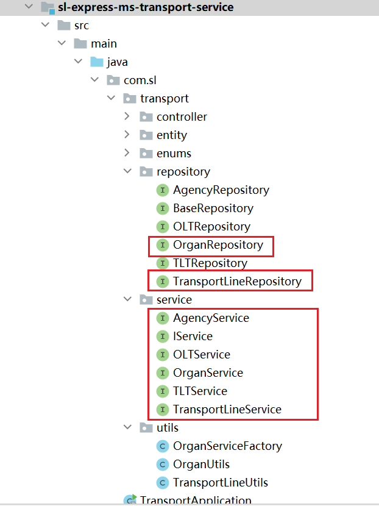
:::danger
关于Entity，与sl-express-sdn工程的类似，只是属性多了一些，按照项目的业务需求制定的。
:::
Feign接口定义：

domain定义：


### sl-express-mq

在项目中，为了统一使用RabbitMQ，所以将MQ的使用进行了封装，使用方法参考文档《[sl-express-mq使用手册](https://sl-express.itheima.net/#/zh-cn/modules/sl-express-mq)
》

#### 发送消息

对于发送消息的场景，正常情况没有问题，直接发送即可：

如果是非正常情况就需要特殊处理了，一般会有三种非正常情况需要处理：

- 第一种情况，消息发送到交换机（exchange），但是没有队列与交换机绑定，消息会丢失。
  
- 第二种情况，在消息的发送后进行确认，如果发送失败需要将消息持久化，例如：发送的交换机不存在的情况。
  
- 第三种情况，由于网络、MQ服务宕机等原因导致消息没有发送到MQ服务器。
  

**第一种情况：**
对于消息只是到了交换机，并没有到达队列，这种情况记录日志即可，因为我们也不确定哪个队列需要这个消息。
配置如下（nacos中的`shared-spring-rabbitmq.yml`文件）：


```java
package com.sl.mq.config;

import cn.hutool.core.util.StrUtil;
import com.sl.transport.common.constant.Constants;
import lombok.extern.slf4j.Slf4j;
import org.springframework.amqp.rabbit.core.RabbitTemplate;
import org.springframework.beans.BeansException;
import org.springframework.context.ApplicationContext;
import org.springframework.context.ApplicationContextAware;
import org.springframework.context.annotation.Configuration;

@Slf4j
@Configuration
public class MessageConfig implements ApplicationContextAware {

    /**
     * 发送者回执 没有路由到队列的情况
     *
     * @param applicationContext 应用上下文
     * @throws BeansException 异常
     */
    @Override
    public void setApplicationContext(ApplicationContext applicationContext) throws BeansException {
        // 获取RabbitTemplate
        RabbitTemplate rabbitTemplate = applicationContext.getBean(RabbitTemplate.class);
        // 设置ReturnCallback
        rabbitTemplate.setReturnsCallback(message -> {
            if (StrUtil.contains(message.getExchange(), Constants.MQ.DELAYED_KEYWORD)) {
                //延迟消息没有发到队列是正常情况，无需记录日志
                return;
            }
            // 投递失败，记录日志
            log.error("消息没有投递到队列，应答码：{}，原因：{}，交换机：{}，路由键：{},消息：{}",
                    message.getReplyCode(), message.getReplyText(), message.getExchange(), message.getRoutingKey(), message.getMessage());
        });
    }

}

```

**第二种情况：**
在配文件中开启配置`publisher-confirm-type`，即可在发送消息时添加回调方法：
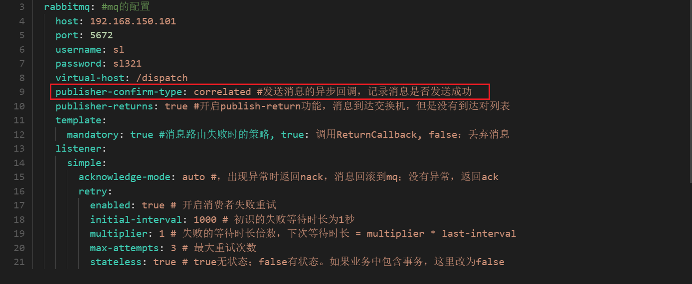
在代码中进行处理，将消息数据持久化到数据库中，后续通过xxl-job进行处理，将消息进行重新发送。

同样，如果出现异常情况也是将消息持久化：

**第三种情况：**
将发送消息的代码进行try{}catch{}处理，如果出现异常会通过Spring-retry机制进重试，最多重试3次，如果依然失败就将消息数据进行持久化：

设置重试：
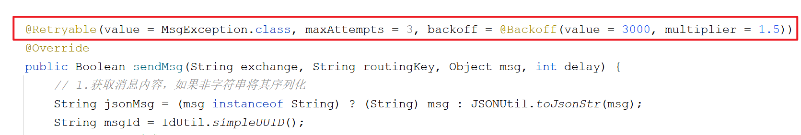
最终的落库操作：

xxl-job任务，主要负责从数据库中查询出错误消息数据然后进行重试：

```java
package com.sl.mq.job;

import cn.hutool.core.collection.CollUtil;
import com.baomidou.mybatisplus.core.conditions.query.LambdaQueryWrapper;
import com.sl.mq.entity.FailMsgEntity;
import com.sl.mq.service.FailMsgService;
import com.sl.mq.service.MQService;
import com.xxl.job.core.handler.annotation.XxlJob;
import lombok.extern.slf4j.Slf4j;
import org.springframework.boot.autoconfigure.condition.ConditionalOnBean;
import org.springframework.stereotype.Component;

import javax.annotation.Resource;
import java.util.List;

/**
 * 失败消息的处理任务
 */
@Slf4j
@Component
@ConditionalOnBean({MQService.class, FailMsgService.class})
public class FailMsgJob {

    @Resource
    private FailMsgService failMsgService;
    @Resource
    private MQService mqService;

    @XxlJob("failMsgJob")
    public void execute() {
        //查询失败的数据，每次最多处理100条错误消息
        LambdaQueryWrapper<FailMsgEntity> queryWrapper = new LambdaQueryWrapper<FailMsgEntity>()
                .orderByAsc(FailMsgEntity::getCreated)
                .last("limit 100");
        List<FailMsgEntity> failMsgEntityList = this.failMsgService.list(queryWrapper);
        if (CollUtil.isEmpty(failMsgEntityList)) {
            return;
        }

        for (FailMsgEntity failMsgEntity : failMsgEntityList) {
            try {
                //发送消息
                this.mqService.sendMsg(failMsgEntity.getExchange(), failMsgEntity.getRoutingKey(), failMsgEntity.getMsg());
                //删除数据
                this.failMsgService.removeById(failMsgEntity.getId());
            } catch (Exception e) {
                log.error("处理错误消息失败, failMsgEntity = {}", failMsgEntity);
            }
        }
    }
}

```

xxl-job中的任务调度：
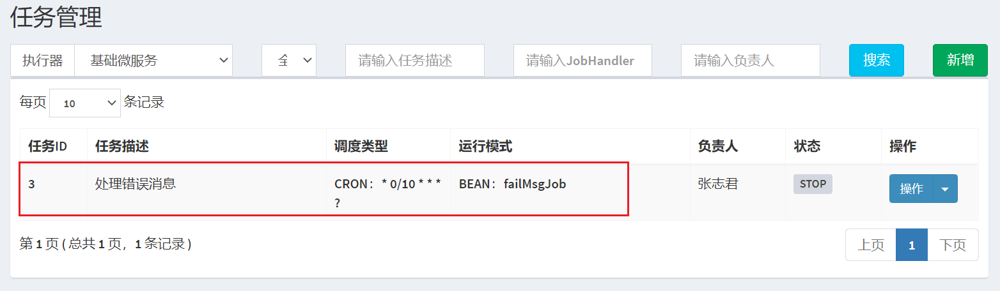

#### 消费消息

对于消息的消费，首先采用的自动确认策略：

如果出现消费错误，会进行重试，最多重试3次：

如果3次后依然失败，需要将消息发送到指定的队列，为了区分不同的微服务，所以会针对不同微服务创建不同的队列，但是交换机是同一个：

```java
package com.sl.mq.config;

import com.sl.transport.common.constant.Constants;
import org.springframework.amqp.core.Binding;
import org.springframework.amqp.core.BindingBuilder;
import org.springframework.amqp.core.Queue;
import org.springframework.amqp.core.TopicExchange;
import org.springframework.amqp.rabbit.core.RabbitTemplate;
import org.springframework.amqp.rabbit.retry.MessageRecoverer;
import org.springframework.amqp.rabbit.retry.RepublishMessageRecoverer;
import org.springframework.beans.factory.annotation.Value;
import org.springframework.context.annotation.Bean;
import org.springframework.context.annotation.Configuration;

@Configuration
public class ErrorMessageConfig {

    @Value("${spring.application.name}") //获取微服务的名称
    private String appName;

    @Bean
    public TopicExchange errorMessageExchange() {
        //定义错误消息的交换机，类型为：topic
        return new TopicExchange(Constants.MQ.Exchanges.ERROR, true, false);
    }

    @Bean
    public Queue errorQueue() {
        //【前缀+微服务】名作为错误消息存放的队列名称，并且开启了持久化
        return new Queue(Constants.MQ.Queues.ERROR_PREFIX + appName, true);
    }

    @Bean
    public Binding errorBinding(Queue errorQueue, TopicExchange errorMessageExchange) {
        //完成绑定关系
        return BindingBuilder.bind(errorQueue).to(errorMessageExchange).with(appName);
    }

    @Bean
    public MessageRecoverer republishMessageRecoverer(RabbitTemplate rabbitTemplate) {
        //设置全部重试失败后进行重新发送消息，指定了交换机以及路由key
        //需要注意的是，路由key是应用名称，与上述的绑定关系中的路由key一致
        return new RepublishMessageRecoverer(rabbitTemplate, Constants.MQ.Exchanges.ERROR, appName);
    }
}

```

最终会以微服务名称创建队列：
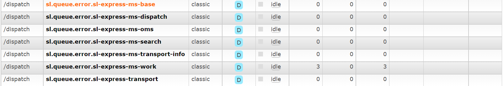
其绑定关系如下：
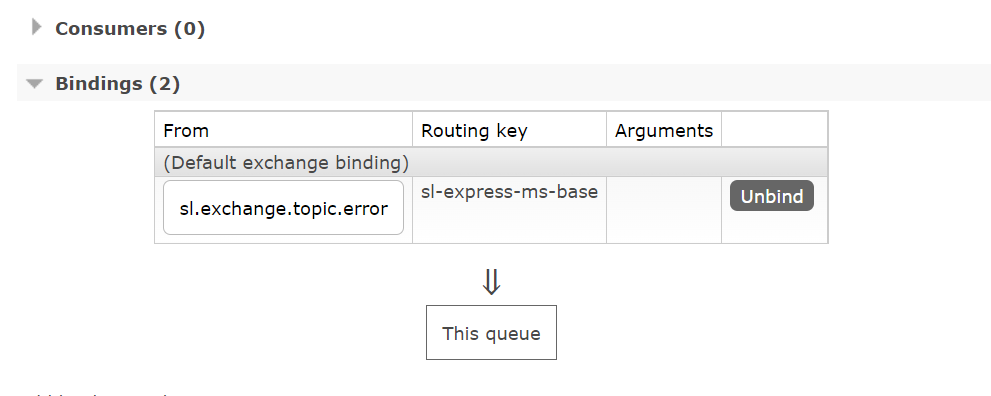

#### 统一封装

为了在各个微服务中方便发送消息，所以在`sl-express-ms-base`微服务中进行了封装，使用时`com.sl.ms.base.api.common.MQFeign`调用即可。
在base微服务中添加了配置以及启用Spring-retry机制：


使用示例如下：


> **发送时指定交换机、路由key、消息内容、延时时间（毫秒）即可。**

## 机构同步

机构的新增、更新、删除是在权限管家中完成的，需要是操作后同步到路线规划微服务中，这里采用的是MQ消息通知的方式。

### 业务流程


### 权限管家配置

权限管家的MQ配置是在 `/itcast/itcast-auth-server/application-test.properties`文件中，如下：

可以看出，消息发往的交换机为：itcast-auth，交换机的类型为：topic
发送消息的规则如下：
:::info

- 消息为json字符串
  - 如：{"type":"ORG","content":[{"managerId":"1","parentId":"0","name":"测试组织","id":"973902113476182273","status":true}]
    ,"operation":"UPDATE"}
- type表示变更的对象，比如组织：ORG
- content为更改对象列表
- operation类型列表
  - 新增-ADD
  - 修改-UPDATE
  - 删除-DEL
    :::
    所以，对应的在`sl-express-transport.properties`中配置相同的交换机。

### 业务规范


上图是在权限管家中新增组织的界面，可以从界面中看出，添加的组织并没有标识是【网点】还是【转运中心】，所以，在这里我们做一下约定，按照机构名称的后缀进行区分，具体规则如下：

- xxx转运中心 → 一级转运中心（OLT）
- xxx分拣中心 → 二级转运中心 （TLT）
- xxx营业部 → 网点（AGENCY）

### 具体实现

```java
package com.sl.transport.mq;

import cn.hutool.core.util.StrUtil;
import cn.hutool.json.JSONObject;
import cn.hutool.json.JSONUtil;
import com.sl.transport.common.constant.Constants;
import com.sl.transport.entity.node.AgencyEntity;
import com.sl.transport.entity.node.BaseEntity;
import com.sl.transport.entity.node.OLTEntity;
import com.sl.transport.entity.node.TLTEntity;
import com.sl.transport.enums.OrganTypeEnum;
import com.sl.transport.service.IService;
import com.sl.transport.utils.OrganServiceFactory;
import lombok.extern.slf4j.Slf4j;
import org.springframework.amqp.core.ExchangeTypes;
import org.springframework.amqp.core.TopicExchange;
import org.springframework.amqp.rabbit.annotation.Exchange;
import org.springframework.amqp.rabbit.annotation.Queue;
import org.springframework.amqp.rabbit.annotation.QueueBinding;
import org.springframework.amqp.rabbit.annotation.RabbitListener;
import org.springframework.beans.factory.annotation.Value;
import org.springframework.context.annotation.Bean;
import org.springframework.stereotype.Component;

/**
 * 对于权限管家系统消息的处理
 */
@Slf4j
@Component
public class AuthMQListener {

    @RabbitListener(bindings = @QueueBinding(
            value = @Queue(name = Constants.MQ.Queues.AUTH_TRANSPORT),
            exchange = @Exchange(name = "${rabbitmq.exchange}", type = ExchangeTypes.TOPIC),
            key = "#"
    ))
    public void listenAgencyMsg(String msg) {
        //{"type":"ORG","operation":"ADD","content":[{"id":"977263044792942657","name":"55","parentId":"0","managerId":null,"status":true}]}
        log.info("接收到消息 -> {}", msg);
        JSONObject jsonObject = JSONUtil.parseObj(msg);
        String type = jsonObject.getStr("type");
        if (!StrUtil.equalsIgnoreCase(type, "ORG")) {
            //非机构消息
            return;
        }
        String operation = jsonObject.getStr("operation");
        JSONObject content = (JSONObject) jsonObject.getJSONArray("content").getObj(0);
        String name = content.getStr("name");
        Long parentId = content.getLong("parentId");

        IService iService;
        BaseEntity entity;
        if (StrUtil.endWith(name, "转运中心")) {
            //一级转运中心
            iService = OrganServiceFactory.getBean(OrganTypeEnum.OLT.getCode());
            entity = new OLTEntity();
            entity.setParentId(0L);
        } else if (StrUtil.endWith(name, "分拣中心")) {
            //二级转运中心
            iService = OrganServiceFactory.getBean(OrganTypeEnum.TLT.getCode());
            entity = new TLTEntity();
            entity.setParentId(parentId);
        } else if (StrUtil.endWith(name, "营业部")) {
            //网点
            iService = OrganServiceFactory.getBean(OrganTypeEnum.AGENCY.getCode());
            entity = new AgencyEntity();
            entity.setParentId(parentId);
        } else {
            return;
        }

        //设置参数
        entity.setBid(content.getLong("id"));
        entity.setName(name);
        entity.setStatus(content.getBool("status"));

        switch (operation) {
            case "ADD": {
                iService.create(entity);
                break;
            }
            case "UPDATE": {
                iService.update(entity);
                break;
            }
            case "DEL": {
                iService.deleteByBid(entity.getBid());
                break;
            }
        }

    }

}

```

:::danger
由于Service还没有具体实现，暂时不对代码测试，后面实现后进行测试。
:::

## IService

在Service中一些方法是通用的，比如新增、更新、删除等，这个通用的方法可以写到一个Service中，其他的Service继承该Service即可。

### IService

接口定义：

```java
package com.sl.transport.service;

import com.sl.transport.entity.node.BaseEntity;

/**
 * 基础服务实现
 */
public interface IService<T extends BaseEntity> {

    /**
     * 根据业务id查询数据
     *
     * @param bid 业务id
     * @return 节点数据
     */
    T queryByBid(Long bid);

    /**
     * 新增节点
     *
     * @param t 节点数据
     * @return 新增的节点数据
     */
    T create(T t);

    /**
     * 更新节点
     *
     * @param t 节点数据
     * @return 更新的节点数据
     */
    T update(T t);

    /**
     * 根据业务id删除数据
     *
     * @param bid 业务id
     * @return 是否删除成功
     */
    Boolean deleteByBid(Long bid);

}

```

### ServiceImpl

下面编写具体的实现类：

```java
package com.sl.transport.service.impl;

import cn.hutool.core.bean.BeanUtil;
import cn.hutool.core.bean.copier.CopyOptions;
import com.sl.transport.common.util.ObjectUtil;
import com.sl.transport.entity.node.BaseEntity;
import com.sl.transport.repository.BaseRepository;
import com.sl.transport.service.IService;
import org.springframework.beans.factory.annotation.Autowired;

/**
 * 基础服务的实现
 */
public class ServiceImpl<R extends BaseRepository, T extends BaseEntity> implements IService<T> {

    @Autowired
    private R repository;

    @Override
    public T queryByBid(Long bid) {
        return (T) this.repository.findByBid(bid).orElse(null);
    }

    @Override
    public T create(T t) {
        t.setId(null);//id由neo4j自动生成
        return (T) this.repository.save(t);
    }

    @Override
    public T update(T t) {
        //先查询，再更新
        T tData = this.queryByBid(t.getBid());
        if (ObjectUtil.isEmpty(tData)) {
            return null;
        }
        BeanUtil.copyProperties(t, tData, CopyOptions.create().ignoreNullValue().setIgnoreProperties("id", "bid"));
        return (T) this.repository.save(tData);
    }

    @Override
    public Boolean deleteByBid(Long bid) {
        return this.repository.deleteByBid(bid) > 0;
    }
}

```

### AgencyServiceImpl

网点服务实现类：

```java
package com.sl.transport.service.impl;

import com.sl.transport.entity.node.AgencyEntity;
import com.sl.transport.repository.AgencyRepository;
import com.sl.transport.service.AgencyService;
import org.springframework.stereotype.Service;

@Service
public class AgencyServiceImpl extends ServiceImpl<AgencyRepository, AgencyEntity> implements AgencyService {

}

```

### OLTServiceImpl

一级转运中心服务实现类：

```java
package com.sl.transport.service.impl;

import com.sl.transport.entity.node.OLTEntity;
import com.sl.transport.repository.OLTRepository;
import com.sl.transport.service.OLTService;
import org.springframework.stereotype.Service;

@Service
public class OLTServiceImpl extends ServiceImpl<OLTRepository, OLTEntity>
        implements OLTService {
}

```

### TLTServiceImpl

二级转运中心服务实现类：

```java
package com.sl.transport.service.impl;

import com.sl.transport.entity.node.TLTEntity;
import com.sl.transport.repository.TLTRepository;
import com.sl.transport.service.TLTService;
import org.springframework.stereotype.Service;

@Service
public class TLTServiceImpl extends ServiceImpl<TLTRepository, TLTEntity>
        implements TLTService {

}

```

### 单元测试

编写测试用例：

```java
package com.sl.transport.service;

import com.sl.transport.entity.node.AgencyEntity;
import org.junit.jupiter.api.Test;
import org.springframework.boot.test.context.SpringBootTest;

import javax.annotation.Resource;

@SpringBootTest
class AgencyServiceTest {

    @Resource
    private AgencyService agencyService;

    @Test
    public void testQueryByBid(){
        AgencyEntity agencyEntity = this.agencyService.queryByBid(25073L);
        System.out.println(agencyEntity);
		//AgencyEntity(super=BaseEntity(id=18, parentId=null, bid=25073, name=江苏省南京市玄武区紫金墨香苑, managerName=null, phone=025-58765331,025-83241955,025-83241881, address=栖霞区燕尧路100号, location=Point [x=32.117016, y=118.863193], status=null, extra=null))
    }

}
```

> 🚨注意：需要将OrganController、TransportLineController中的@RestController注释掉才能测试，否则会抛出异常。

### 测试机构同步

将Neo4j中的数据全部删除：`MATCH (n) DETACH DELETE n`
创建机构：

可以看到对应的Neo4j中已经有数据：

同理可以测试更新、删除操作。

## 机构管理

按照业务系统的需求，会通过bid查询机构，无需指定type，也就是说，我们需要将网点和转运中心都看作是机构，需要实现两个查询方法：

- 根据bid查询
- 查询机构列表

### 接口定义

```java
package com.sl.transport.service;

import com.sl.transport.domain.OrganDTO;

import java.util.List;

/**
 * @author zzj
 * @version 1.0
 */
public interface OrganService {

    /**
     * 无需指定type，根据id查询
     *
     * @param bid 机构id
     * @return 机构信息
     */
    OrganDTO findByBid(Long bid);

    /**
     * 无需指定type，根据ids查询
     *
     * @param bids 机构ids
     * @return 机构信息
     */
    List<OrganDTO> findByBids(List<Long> bids);

    /**
     * 查询所有的机构，如果name不为空的按照name模糊查询
     *
     * @param name 机构名称
     * @return 机构列表
     */
    List<OrganDTO> findAll(String name);

    /**
     * 查询机构树
     * @return 机构树
     */
    String findAllTree();
}

```

### 具体实现

```java
package com.sl.transport.service.impl;

import cn.hutool.core.bean.BeanUtil;
import cn.hutool.core.collection.CollUtil;
import cn.hutool.core.lang.tree.Tree;
import cn.hutool.core.lang.tree.TreeUtil;
import cn.hutool.core.util.ObjectUtil;
import com.fasterxml.jackson.core.JsonProcessingException;
import com.fasterxml.jackson.databind.ObjectMapper;
import com.sl.transport.common.exception.SLException;
import com.sl.transport.domain.OrganDTO;
import com.sl.transport.enums.ExceptionEnum;
import com.sl.transport.repository.OrganRepository;
import com.sl.transport.service.OrganService;
import org.springframework.stereotype.Service;

import javax.annotation.Resource;
import java.util.List;

@Service
public class OrganServiceImpl implements OrganService {
    @Resource
    private OrganRepository organRepository;
    @Resource
    private ObjectMapper objectMapper;

    @Override
    public OrganDTO findByBid(Long bid) {
        OrganDTO organDTO = this.organRepository.findByBid(bid);
        if (ObjectUtil.isNotEmpty(organDTO)) {
            return organDTO;
        }
        throw new SLException(ExceptionEnum.ORGAN_NOT_FOUND);
    }

    @Override
    public List<OrganDTO> findByBids(List<Long> bids) {
        List<OrganDTO> organDTOS = this.organRepository.findByBids(bids);
        if (ObjectUtil.isNotEmpty(organDTOS)) {
            return organDTOS;
        }
        throw new SLException(ExceptionEnum.ORGAN_NOT_FOUND);
    }

    @Override
    public List<OrganDTO> findAll(String name) {
        return this.organRepository.findAll(name);
    }

    @Override
    public String findAllTree() {
        return "";
    }
}

```

### OrganRepositoryImpl

下面对于OrganRepository接口进行实现：

```java
package com.sl.transport.repository.impl;

import cn.hutool.core.bean.BeanUtil;
import cn.hutool.core.collection.CollUtil;
import cn.hutool.core.collection.ListUtil;
import cn.hutool.core.util.ObjectUtil;
import cn.hutool.core.util.StrUtil;
import com.sl.transport.domain.OrganDTO;
import com.sl.transport.enums.OrganTypeEnum;
import com.sl.transport.repository.OrganRepository;
import org.neo4j.driver.internal.InternalPoint2D;
import org.springframework.data.neo4j.core.Neo4jClient;
import org.springframework.stereotype.Component;

import javax.annotation.Resource;
import java.util.List;
import java.util.Map;

@Component
public class OrganRepositoryImpl implements OrganRepository {

    @Resource
    private Neo4jClient neo4jClient;

    @Override
    public OrganDTO findByBid(Long bid) {
        String cypherQuery = StrUtil.format("MATCH (n)\n" +
                "WHERE n.bid = {}\n" +
                "RETURN n", bid);
        return CollUtil.getFirst(executeQuery(cypherQuery));
    }

    @Override
    public List<OrganDTO> findByBids(List<Long> bids) {
        String cypherQuery = StrUtil.format("MATCH (n)\n" +
                "WHERE n.bid in {}\n" +
                "RETURN n", bids);
        return executeQuery(cypherQuery);
    }

    @Override
    public List<OrganDTO> findAll(String name) {
        name = StrUtil.removeAll(name, '\'', '"');
        String cypherQuery = StrUtil.isEmpty(name) ?
                "MATCH (n) RETURN n" :
                StrUtil.format("MATCH (n) WHERE n.name CONTAINS '{}' RETURN n", name);
        return executeQuery(cypherQuery);
    }

    private List<OrganDTO> executeQuery(String cypherQuery) {
        return ListUtil.toList(this.neo4jClient.query(cypherQuery)
                .fetchAs(OrganDTO.class) //设置响应的类型
                .mappedBy((typeSystem, record) -> { //对结果进行封装处理
                    Map<String, Object> map = record.get("n").asMap();
                    OrganDTO organDTO = BeanUtil.toBean(map, OrganDTO.class);
                    InternalPoint2D location = (InternalPoint2D) map.get("location");
                    if (ObjectUtil.isNotEmpty(location)) {
                        organDTO.setLongitude(location.x());
                        organDTO.setLatitude(location.y());
                    }
                    //获取类型
                    String type = CollUtil.getFirst(record.get("n").asNode().labels());
                    organDTO.setType(OrganTypeEnum.valueOf(type).getCode());
                    return organDTO;
                }).all());
    }
}

```

### 测试用例

```java
package com.sl.transport.service;

import com.sl.transport.domain.OrganDTO;
import org.junit.jupiter.api.Test;
import org.springframework.boot.test.context.SpringBootTest;

import javax.annotation.Resource;

import java.util.List;

import static org.junit.jupiter.api.Assertions.*;

@SpringBootTest
class OrganServiceTest {

    @Resource
    private OrganService organService;

    @Test
    void findByBid() {
		//bid值要改成自己neo4j中的值
        OrganDTO organDTO = this.organService.findByBid(1012479939628238305L);
        System.out.println(organDTO);
    }

    @Test
    void findAll() {
		//查询包含“上海”关键字的机构
        List<OrganDTO> list = this.organService.findAll("上海");
        list.forEach(System.out::println);
    }
}
```

### 整合测试

基于swagger接口进行测试：[http://127.0.0.1:18083/doc.html](http://127.0.0.1:18083/doc.html)
:::danger
测试时，由于部分Service还没有实现，会导致启动报错，所以需要将报错Controller中的@RestController注释掉。
:::


### 树形结构

在后台系统中，对于机构数据的展现需要通过树形结构展现，如下：

所以在`com.sl.transport.service.OrganService`中`findAllTree()`方法中封装了树形结构。
具体的封装逻辑采用hutool工具包中的TreeUtil，参考文档：[点击查看](https://www.hutool.cn/docs/#/core/%E8%AF%AD%E8%A8%80%E7%89%B9%E6%80%A7/%E6%A0%91%E7%BB%93%E6%9E%84/%E6%A0%91%E7%BB%93%E6%9E%84%E5%B7%A5%E5%85%B7-TreeUtil)
代码实现如下：

```java
    @Override
    public String findAllTree() {
        List<OrganDTO> organList = this.findAll(null);
        if (CollUtil.isEmpty(organList)) {
            return "";
        }

        //构造树结构
        List<Tree<Long>> treeNodes = TreeUtil.build(organList, 0L,
                (organDTO, tree) -> {
                    tree.setId(organDTO.getId());
                    tree.setParentId(organDTO.getParentId());
                    tree.putAll(BeanUtil.beanToMap(organDTO));
                    tree.remove("bid");
                });

        try {
            return this.objectMapper.writeValueAsString(treeNodes);
        } catch (JsonProcessingException e) {
            throw new SLException("序列化json出错！", e);
        }
    }
```

数据类似这样：

```json
[
  {
    "id": "1012438698496623009",
    "parentId": "0",
    "name": "上海市转运中心",
    "type": 1,
    "phone": null,
    "address": null,
    "latitude": null,
    "longitude": null,
    "managerName": null,
    "extra": null,
    "status": true,
    "children": [
      {
        "id": "1012479939628238305",
        "parentId": "1012438698496623009",
        "name": "浦东区分拣中心",
        "type": 2,
        "phone": null,
        "address": null,
        "latitude": null,
        "longitude": null,
        "managerName": null,
        "extra": null,
        "status": true
      }
    ]
  },
  {
    "id": "1012479716659037537",
    "parentId": "0",
    "name": "北京市转运中心",
    "type": 1,
    "phone": null,
    "address": null,
    "latitude": null,
    "longitude": null,
    "managerName": null,
    "extra": null,
    "status": true
  }
]
```

功能测试：


> 🔔如果测试没有数据，需要自行在权限管家中创建相对应的网点、转运中心等数据，进行测试。

### 编辑机构

在后台系统中可以对机构数据进行编辑，主要是填充一些属性数据，例如：经纬度、详细地址。如下：

经纬度是如何计算出来的呢？这里使用的是高德地图的API进行查询的，将中文字段转化为经纬度值，我们是直接调用的高德地图的API吗，不是的，我们是通过EagleMap调用的。

#### EagleMap介绍

EagleMap是黑马程序员研究院自研的地图中台服务，它可以对接多个地图服务商，目前已经完成百度地图和高德地图的对接。
目前EagleMap已经部署安装在101机器中，配置文件所在的位置：`/itcast/eaglemap/app/application.yml`
:::danger
在这里强烈建议将高德地图的ak改成自己的，不要使用默认的，因为使用人多了可能会被封号，将不能正常使用。更改了ak后，要记得重启EagleMap服务`docker restart eagle-map-server`
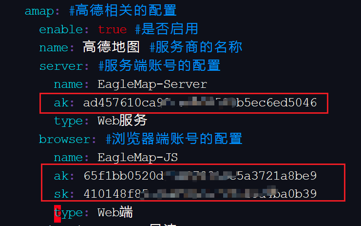
**web API的申请：**[https://lbs.amap.com/dev/key](https://lbs.amap.com/dev/key)
**申请时注意【服务平台】选项，需要申请【Web端(JS API)】和【Web服务】的key。**
:::
具体的使用，参考sdk使用手册：

## 路线管理

路线管理是在路线规划中核心的功能，用户在下单时、订单转运单时会进行调用路线规划，后台系统对路线进行维护管理。路线类型如下：

- **干线**
  - 一级转运中心到一级转运中心
- **支线**
  - 一级转运中心与二级转运中心之间线路
- **接驳路线**
  - 二级转运中心到网点
- **专线（暂时不支持）**
  - 任务城市到任意城市
- **临时线路（暂时不支持）**
  - 任意转运中心到任意转运中心
    :::danger
    新增路线业务规则：干线：起点终点无顺序，支线：起点必须是二级转运中心，接驳路线：起点必须是网点  
    :::

### 业务流程


### Repository

#### 接口定义

```java
package com.sl.transport.repository;

import com.sl.transport.common.util.PageResponse;
import com.sl.transport.domain.TransportLineNodeDTO;
import com.sl.transport.domain.TransportLineSearchDTO;
import com.sl.transport.entity.line.TransportLine;
import com.sl.transport.entity.node.AgencyEntity;
import com.sl.transport.entity.node.BaseEntity;

import java.util.List;

/**
 * 运输路线查询
 */
public interface TransportLineRepository {

    /**
     * 查询两个网点之间最短的路线，查询深度为：10
     *
     * @param start 开始网点
     * @param end   结束网点
     * @return 路线
     */
    TransportLineNodeDTO findShortestPath(AgencyEntity start, AgencyEntity end);

    /**
     * 查询两个网点之间最短的路线，最大查询深度为：10
     *
     * @param start 开始网点
     * @param end   结束网点
     * @param depth 查询深度，最大为：10
     * @return 路线
     */
    TransportLineNodeDTO findShortestPath(AgencyEntity start, AgencyEntity end, int depth);

    /**
     * 查询两个网点之间的路线列表，成本优先 > 转运节点优先
     *
     * @param start 开始网点
     * @param end   结束网点
     * @param depth 查询深度
     * @param limit 返回路线的数量
     * @return 路线
     */
    List<TransportLineNodeDTO> findPathList(AgencyEntity start, AgencyEntity end, int depth, int limit);

    /**
     * 查询数据节点之间的关系数量
     *
     * @param firstNode  第一个节点
     * @param secondNode 第二个节点
     * @return 数量
     */
    Long queryCount(BaseEntity firstNode, BaseEntity secondNode);

    /**
     * 新增路线
     *
     * @param firstNode     第一个节点
     * @param secondNode    第二个节点
     * @param transportLine 路线数据
     * @return 新增关系的数量
     */
    Long create(BaseEntity firstNode, BaseEntity secondNode, TransportLine transportLine);

    /**
     * 更新路线
     *
     * @param transportLine 路线数据
     * @return 更新的数量
     */
    Long update(TransportLine transportLine);

    /**
     * 删除路线
     *
     * @param lineId 关系id
     * @return 删除关系的数量
     */
    Long remove(Long lineId);

    /**
     * 分页查询路线
     *
     * @param transportLineSearchDTO 搜索参数
     * @return 路线列表
     */
    PageResponse<TransportLine> queryPageList(TransportLineSearchDTO transportLineSearchDTO);


    /**
     * 根据ids批量查询路线
     *
     * @param ids id列表
     * @return 路线列表
     */
    List<TransportLine> queryByIds(Long... ids);

    /**
     * 根据id查询路线
     *
     * @param id 路线id
     * @return 路线数据
     */
    TransportLine queryById(Long id);
}

```

#### 接口实现

```java
package com.sl.transport.repository.impl;

import cn.hutool.core.bean.BeanUtil;
import cn.hutool.core.collection.CollUtil;
import cn.hutool.core.collection.ListUtil;
import cn.hutool.core.convert.Convert;
import cn.hutool.core.map.MapUtil;
import cn.hutool.core.util.ObjectUtil;
import cn.hutool.core.util.PageUtil;
import cn.hutool.core.util.StrUtil;
import com.sl.transport.common.util.PageResponse;
import com.sl.transport.domain.TransportLineNodeDTO;
import com.sl.transport.domain.TransportLineSearchDTO;
import com.sl.transport.entity.line.TransportLine;
import com.sl.transport.entity.node.AgencyEntity;
import com.sl.transport.entity.node.BaseEntity;
import com.sl.transport.repository.TransportLineRepository;
import com.sl.transport.utils.TransportLineUtils;
import org.neo4j.driver.Record;
import org.neo4j.driver.internal.value.PathValue;
import org.neo4j.driver.types.Relationship;
import org.springframework.data.neo4j.core.Neo4jClient;
import org.springframework.data.neo4j.core.schema.Node;
import org.springframework.stereotype.Component;

import javax.annotation.Resource;
import java.util.Collection;
import java.util.List;
import java.util.Map;
import java.util.Optional;

/**
 * 对于路线的各种操作
 */
@Component
public class TransportLineRepositoryImpl implements TransportLineRepository {

    @Resource
    private Neo4jClient neo4jClient;

    @Override
    public TransportLineNodeDTO findShortestPath(AgencyEntity start, AgencyEntity end) {
        return this.findShortestPath(start, end, 10);
    }

    @Override
    public TransportLineNodeDTO findShortestPath(AgencyEntity start, AgencyEntity end, int depth) {
        //获取网点数据在Neo4j中的类型
        String type = AgencyEntity.class.getAnnotation(Node.class).value()[0];
        //构造查询语句
        String cypherQuery = StrUtil.format(
                "MATCH path = shortestPath((start:{}) -[*..{}]-> (end:{}))\n" +
                        "WHERE start.bid = $startId AND end.bid = $endId AND start.status = true AND end.status = true\n" +
                        "RETURN path", type, depth, type);
        Collection<TransportLineNodeDTO> transportLineNodeDTOS = this.executeQueryPath(cypherQuery, start, end);
        if (CollUtil.isEmpty(transportLineNodeDTOS)) {
            return null;
        }
        for (TransportLineNodeDTO transportLineNodeDTO : transportLineNodeDTOS) {
            return transportLineNodeDTO;
        }
        return null;
    }

    private List<TransportLineNodeDTO> executeQueryPath(String cypherQuery, AgencyEntity start, AgencyEntity end) {
        return ListUtil.toList(this.neo4jClient.query(cypherQuery)
                .bind(start.getBid()).to("startId") //设置参数
                .bind(end.getBid()).to("endId") //设置参数
                .fetchAs(TransportLineNodeDTO.class) //设置响应的类型
                .mappedBy((typeSystem, record) -> { //对结果进行封装处理
                    PathValue pathValue = (PathValue) record.get(0);
                    return TransportLineUtils.convert(pathValue);
                }).all());
    }

    @Override
    public List<TransportLineNodeDTO> findPathList(AgencyEntity start, AgencyEntity end, int depth, int limit) {
        //获取网点数据在Neo4j中的类型
        String type = AgencyEntity.class.getAnnotation(Node.class).value()[0];
        //构造查询语句
        String cypherQuery = StrUtil.format(
                "MATCH path = (start:{}) -[*..{}]-> (end:{})\n" +
                        "WHERE start.bid = $startId AND end.bid = $endId AND start.status = true AND end.status = true\n" +
                        "UNWIND relationships(path) AS r\n" +
                        "WITH sum(r.cost) AS cost, path\n" +
                        "RETURN path ORDER BY cost ASC, LENGTH(path) ASC LIMIT {}", type, depth, type, limit);
        return this.executeQueryPath(cypherQuery, start, end);
    }

    @Override
    public Long queryCount(BaseEntity firstNode, BaseEntity secondNode) {
        String firstNodeType = firstNode.getClass().getAnnotation(Node.class).value()[0];
        String secondNodeType = secondNode.getClass().getAnnotation(Node.class).value()[0];
        String cypherQuery = StrUtil.format(
                "MATCH (m:{}) -[r]- (n:{})\n" +
                        "WHERE m.bid = $firstBid AND n.bid = $secondBid\n" +
                        "RETURN count(r) AS c", firstNodeType, secondNodeType);
        Optional<Long> optional = this.neo4jClient.query(cypherQuery)
                .bind(firstNode.getBid()).to("firstBid")
                .bind(secondNode.getBid()).to("secondBid")
                .fetchAs(Long.class)
                .mappedBy((typeSystem, record) -> Convert.toLong(record.get("c")))
                .one();
        return optional.orElse(0L);
    }

    @Override
    public Long create(BaseEntity firstNode, BaseEntity secondNode, TransportLine transportLine) {
        String firstNodeType = firstNode.getClass().getAnnotation(Node.class).value()[0];
        String secondNodeType = secondNode.getClass().getAnnotation(Node.class).value()[0];
        String cypherQuery = StrUtil.format(
                "MATCH (m:{} {bid : $firstBid})\n" +
                        "WITH m\n" +
                        "MATCH (n:{} {bid : $secondBid})\n" +
                        "WITH m,n\n" +
                        "CREATE\n" +
                        " (m) -[r:IN_LINE {cost:$cost, number:$number, type:$type, name:$name, distance:$distance, time:$time, extra:$extra, startOrganId:$startOrganId, endOrganId:$endOrganId,created:$created, updated:$updated}]-> (n),\n" +
                        " (m) <-[:OUT_LINE {cost:$cost, number:$number, type:$type, name:$name, distance:$distance, time:$time, extra:$extra, startOrganId:$endOrganId, endOrganId:$startOrganId, created:$created, updated:$updated}]- (n)\n" +
                        "RETURN count(r) AS c", firstNodeType, secondNodeType);
        Optional<Long> optional = this.neo4jClient.query(cypherQuery)
                .bindAll(BeanUtil.beanToMap(transportLine))
                .bind(firstNode.getBid()).to("firstBid")
                .bind(secondNode.getBid()).to("secondBid")
                .fetchAs(Long.class)
                .mappedBy((typeSystem, record) -> Convert.toLong(record.get("c")))
                .one();
        return optional.orElse(0L);
    }

    @Override
    public Long update(TransportLine transportLine) {
        String cypherQuery = "MATCH () -[r]-> ()\n" +
                "WHERE id(r) = $id\n" +
                "SET r.cost = $cost , r.number = $number, r.name = $name ,r.distance = $distance ,r.time = $time, r.startOrganId = $startOrganId, r.endOrganId = $endOrganId, r.updated = $updated , r.extra = $extra \n" +
                "RETURN count(r) AS c";
        Optional<Long> optional = this.neo4jClient.query(cypherQuery)
                .bindAll(BeanUtil.beanToMap(transportLine))
                .fetchAs(Long.class)
                .mappedBy((typeSystem, record) -> Convert.toLong(record.get("c")))
                .one();
        return optional.orElse(0L);
    }

    @Override
    public Long remove(Long lineId) {
        String cypherQuery = "MATCH () -[r]-> ()\n" +
                "WHERE id(r) = $lineId\n" +
                "DETACH DELETE r\n" +
                "RETURN count(r) AS c";
        Optional<Long> optional = this.neo4jClient.query(cypherQuery)
                .bind(lineId).to("lineId")
                .fetchAs(Long.class)
                .mappedBy((typeSystem, record) -> Convert.toLong(record.get("c")))
                .one();
        return optional.orElse(0L);
    }

    @Override
    public PageResponse<TransportLine> queryPageList(TransportLineSearchDTO transportLineSearchDTO) {
        int page = Math.max(transportLineSearchDTO.getPage(), 1);
        int pageSize = transportLineSearchDTO.getPageSize();
        int skip = (page - 1) * pageSize;
        Map<String, Object> searchParam = BeanUtil.beanToMap(transportLineSearchDTO, false, true);
        MapUtil.removeAny(searchParam, "page", "pageSize");
        //构建查询语句，第一个是查询数据，第二个是查询数量
        String[] cyphers = this.buildPageQueryCypher(searchParam);
        String cypherQuery = cyphers[0];

        //数据
        List<TransportLine> list = ListUtil.toList(this.neo4jClient.query(cypherQuery)
                .bind(skip).to("skip")
                .bind(pageSize).to("limit")
                .bindAll(searchParam)
                .fetchAs(TransportLine.class)
                .mappedBy((typeSystem, record) -> {
                    //封装数据
                    return this.toTransportLine(record);
                }).all());

        // 数据总数
        String countCypher = cyphers[1];
        Long total = this.neo4jClient.query(countCypher)
                .bindAll(searchParam)
                .fetchAs(Long.class)
                .mappedBy((typeSystem, record) -> Convert.toLong(record.get("c")))
                .one().orElse(0L);

        PageResponse<TransportLine> pageResponse = new PageResponse<>();
        pageResponse.setPage(page);
        pageResponse.setPageSize(pageSize);
        pageResponse.setItems(list);
        pageResponse.setCounts(total);
        Long pages = Convert.toLong(PageUtil.totalPage(Convert.toInt(total), pageSize));
        pageResponse.setPages(pages);

        return pageResponse;
    }

    private String[] buildPageQueryCypher(Map<String, Object> searchParam) {
        String queryCypher;
        String countCypher;
        if (CollUtil.isEmpty(searchParam)) {
            //无参数
            queryCypher = "MATCH (m) -[r]-> (n) RETURN m,r,n ORDER BY id(r) DESC SKIP $skip LIMIT $limit";
            countCypher = "MATCH () -[r]-> () RETURN count(r) AS c";
        } else {
            //有参数
            String cypherPrefix = "MATCH (m) -[r]-> (n)";
            StringBuilder sb = new StringBuilder();
            sb.append(cypherPrefix).append(" WHERE 1=1 ");
            for (String key : searchParam.keySet()) {
                Object value = searchParam.get(key);
                if (value instanceof String) {
                    if (StrUtil.isNotBlank(Convert.toStr(value))) {
                        sb.append(StrUtil.format("AND r.{} CONTAINS ${} \n", key, key));
                    }
                } else {
                    sb.append(StrUtil.format("AND r.{} = ${} \n", key, key));
                }
            }
            String cypher = sb.toString();
            queryCypher = cypher + "RETURN m,r,n ORDER BY id(r) DESC SKIP $skip LIMIT $limit";
            countCypher = cypher + "RETURN count(r) AS c";
        }
        return new String[]{queryCypher, countCypher};
    }

    @Override
    public List<TransportLine> queryByIds(Long... ids) {
        String cypherQuery = "MATCH (m) -[r]-> (n)\n" +
                "WHERE id(r) in $ids\n" +
                "RETURN m,r,n";
        return ListUtil.toList(this.neo4jClient.query(cypherQuery)
                .bind(ids).to("ids")
                .fetchAs(TransportLine.class)
                .mappedBy((typeSystem, record) -> {
                    //封装数据
                    return this.toTransportLine(record);
                }).all());
    }

    private TransportLine toTransportLine(Record record) {
        org.neo4j.driver.types.Node startNode = record.get("m").asNode();
        org.neo4j.driver.types.Node endNode = record.get("n").asNode();
        Relationship relationship = record.get("r").asRelationship();
        Map<String, Object> map = relationship.asMap();

        TransportLine transportLine = BeanUtil.toBeanIgnoreError(map, TransportLine.class);
        transportLine.setStartOrganName(startNode.get("name").asString());
        transportLine.setStartOrganId(startNode.get("bid").asLong());
        transportLine.setEndOrganName(endNode.get("name").asString());
        transportLine.setEndOrganId(endNode.get("bid").asLong());
        transportLine.setId(relationship.id());
        return transportLine;
    }

    @Override
    public TransportLine queryById(Long id) {
        List<TransportLine> transportLines = this.queryByIds(id);
        if (CollUtil.isNotEmpty(transportLines)) {
            return transportLines.get(0);
        }
        return null;
    }

}

```

### 路线Service

#### 接口定义

```java
package com.sl.transport.service;

import com.sl.transport.common.util.PageResponse;
import com.sl.transport.domain.TransportLineNodeDTO;
import com.sl.transport.domain.TransportLineSearchDTO;
import com.sl.transport.entity.line.TransportLine;

import java.util.List;

/**
 * 计算路线相关业务
 */
public interface TransportLineService {

    /**
     * 新增路线
     *
     * @param transportLine 路线数据
     * @return 是否成功
     */
    Boolean createLine(TransportLine transportLine);

    /**
     * 更新路线
     *
     * @param transportLine 路线数据
     * @return 是否成功
     */
    Boolean updateLine(TransportLine transportLine);

    /**
     * 删除路线
     *
     * @param id 路线id
     * @return 是否成功
     */
    Boolean deleteLine(Long id);

    /**
     * 分页查询路线
     *
     * @param transportLineSearchDTO 搜索参数
     * @return 路线列表
     */
    PageResponse<TransportLine> queryPageList(TransportLineSearchDTO transportLineSearchDTO);

    /**
     * 查询两个网点之间最短的路线，最大查询深度为：10
     *
     * @param startId 开始网点id
     * @param endId   结束网点id
     * @return 路线
     */
    TransportLineNodeDTO queryShortestPath(Long startId, Long endId);

    /**
     * 查询两个网点之间成本最低的路线，最大查询深度为：10
     *
     * @param startId 开始网点id
     * @param endId   结束网点id
     * @return 路线集合
     */
    TransportLineNodeDTO findLowestPath(Long startId, Long endId);

    /**
     * 根据调度策略查询路线
     *
     * @param startId 开始网点id
     * @param endId   结束网点id
     * @return 路线
     */
    TransportLineNodeDTO queryPathByDispatchMethod(Long startId, Long endId);

    /**
     * 根据ids批量查询路线
     *
     * @param ids id列表
     * @return 路线列表
     */
    List<TransportLine> queryByIds(Long... ids);

    /**
     * 根据id查询路线
     *
     * @param id 路线id
     * @return 路线数据
     */
    TransportLine queryById(Long id);

}

```

#### 接口实现

```java
package com.sl.transport.service.impl;

import cn.hutool.core.bean.BeanUtil;
import cn.hutool.core.bean.copier.CopyOptions;
import cn.hutool.core.collection.CollUtil;
import cn.hutool.core.convert.Convert;
import cn.hutool.core.map.MapUtil;
import cn.hutool.core.util.NumberUtil;
import cn.hutool.core.util.ObjectUtil;
import cn.hutool.core.util.StrUtil;
import cn.hutool.json.JSONObject;
import cn.hutool.json.JSONUtil;
import com.itheima.em.sdk.EagleMapTemplate;
import com.itheima.em.sdk.enums.ProviderEnum;
import com.itheima.em.sdk.vo.Coordinate;
import com.sl.transport.common.exception.SLException;
import com.sl.transport.common.util.PageResponse;
import com.sl.transport.domain.*;
import com.sl.transport.entity.line.TransportLine;
import com.sl.transport.entity.node.AgencyEntity;
import com.sl.transport.entity.node.BaseEntity;
import com.sl.transport.entity.node.OLTEntity;
import com.sl.transport.entity.node.TLTEntity;
import com.sl.transport.enums.DispatchMethodEnum;
import com.sl.transport.enums.ExceptionEnum;
import com.sl.transport.enums.TransportLineEnum;
import com.sl.transport.repository.TransportLineRepository;
import com.sl.transport.service.CostConfigurationService;
import com.sl.transport.service.DispatchConfigurationService;
import com.sl.transport.service.OrganService;
import com.sl.transport.service.TransportLineService;
import org.springframework.stereotype.Service;

import javax.annotation.Resource;
import java.util.List;
import java.util.Map;
import java.util.stream.Collectors;

/**
 * 路线相关业务
 *
 * @author zzj
 * @version 1.0
 */
@Service
public class TransportLineServiceImpl implements TransportLineService {

    @Resource
    private TransportLineRepository transportLineRepository;
    @Resource
    private EagleMapTemplate eagleMapTemplate;
    @Resource
    private OrganService organService;
    @Resource
    private DispatchConfigurationService dispatchConfigurationService;
    @Resource
    private CostConfigurationService costConfigurationService;

    // 新增路线业务规则：干线：起点终点无顺序，支线：起点必须是二级转运中心，接驳路线：起点必须是网点
    @Override
    public Boolean createLine(TransportLine transportLine) {
        TransportLineEnum transportLineEnum = TransportLineEnum.codeOf(transportLine.getType());
        if (null == transportLineEnum) {
            throw new SLException(ExceptionEnum.TRANSPORT_LINE_TYPE_ERROR);
        }

        if (ObjectUtil.equal(transportLine.getStartOrganId(), transportLine.getEndOrganId())) {
            //起点终点不能相同
            throw new SLException(ExceptionEnum.TRANSPORT_LINE_ORGAN_CANNOT_SAME);
        }

        BaseEntity firstNode;
        BaseEntity secondNode;
        switch (transportLineEnum) {
            case TRUNK_LINE: {
                // 干线
                firstNode = OLTEntity.builder().bid(transportLine.getStartOrganId()).build();
                secondNode = OLTEntity.builder().bid(transportLine.getEndOrganId()).build();
                break;
            }
            case BRANCH_LINE: {
                // 支线，起点必须是 二级转运中心
                firstNode = TLTEntity.builder().bid(transportLine.getStartOrganId()).build();
                secondNode = OLTEntity.builder().bid(transportLine.getEndOrganId()).build();
                break;
            }
            case CONNECT_LINE: {
                // 接驳路线，起点必须是 网点
                firstNode = AgencyEntity.builder().bid(transportLine.getStartOrganId()).build();
                secondNode = TLTEntity.builder().bid(transportLine.getEndOrganId()).build();
                break;
            }
            default: {
                throw new SLException(ExceptionEnum.TRANSPORT_LINE_TYPE_ERROR);
            }
        }

        if (ObjectUtil.hasEmpty(firstNode, secondNode)) {
            throw new SLException(ExceptionEnum.START_END_ORGAN_NOT_FOUND);
        }

        //判断路线是否已经存在
        Long count = this.transportLineRepository.queryCount(firstNode, secondNode);
        if (count > 0) {
            throw new SLException(ExceptionEnum.TRANSPORT_LINE_ALREADY_EXISTS);
        }

        transportLine.setId(null);
        transportLine.setCreated(System.currentTimeMillis());
        transportLine.setUpdated(transportLine.getCreated());
        //补充信息
        this.infoFromMap(firstNode, secondNode, transportLine);

        count = this.transportLineRepository.create(firstNode, secondNode, transportLine);
        return count > 0;
    }

    /**
     * 通过地图查询距离、时间，计算成本
     *
     * @param firstNode     开始节点
     * @param secondNode    结束节点
     * @param transportLine 路线对象
     */
    private void infoFromMap(BaseEntity firstNode, BaseEntity secondNode, TransportLine transportLine) {
        //查询节点数据
        OrganDTO startOrgan = this.organService.findByBid(firstNode.getBid());
        if (ObjectUtil.hasEmpty(startOrgan, startOrgan.getLongitude(), startOrgan.getLatitude())) {
            throw new SLException("请先完善机构信息");
        }
        OrganDTO endOrgan = this.organService.findByBid(secondNode.getBid());
        if (ObjectUtil.hasEmpty(endOrgan, endOrgan.getLongitude(), endOrgan.getLatitude())) {
            throw new SLException("请先完善机构信息");
        }

        //查询地图服务商
        Coordinate origin = new Coordinate(startOrgan.getLongitude(), startOrgan.getLatitude());
        Coordinate destination = new Coordinate(endOrgan.getLongitude(), endOrgan.getLatitude());
        //设置高德地图参数，默认是不返回预计耗时的，需要额外设置参数
        Map<String, Object> param = MapUtil.<String, Object>builder().put("show_fields", "cost").build();
        String driving = this.eagleMapTemplate.opsForDirection().driving(ProviderEnum.AMAP, origin, destination, param);
        if (StrUtil.isEmpty(driving)) {
            return;
        }
        JSONObject jsonObject = JSONUtil.parseObj(driving);
        //时间，单位：秒
        Long duration = Convert.toLong(jsonObject.getByPath("route.paths[0].cost.duration"), -1L);
        transportLine.setTime(duration);
        //距离，单位：米
        Double distance = Convert.toDouble(jsonObject.getByPath("route.paths[0].distance"), -1d);
        transportLine.setDistance(NumberUtil.round(distance, 0).doubleValue());

        // 总成本 = 每公里平均成本 * 距离（单位：米） / 1000
        Double cost = costConfigurationService.findCostByType(transportLine.getType());
        transportLine.setCost(NumberUtil.round(cost * distance / 1000, 2).doubleValue());
    }

    @Override
    public Boolean updateLine(TransportLine transportLine) {
        // 先查后改
        TransportLine transportLineData = this.queryById(transportLine.getId());
        if (null == transportLineData) {
            throw new SLException(ExceptionEnum.TRANSPORT_LINE_NOT_FOUND);
        }

        //拷贝数据，忽略null值以及不能修改的字段
        BeanUtil.copyProperties(transportLine, transportLineData, CopyOptions.create().setIgnoreNullValue(true)
                .setIgnoreProperties("type", "startOrganId", "startOrganName", "endOrganId", "endOrganName"));

        transportLineData.setUpdated(System.currentTimeMillis());
        Long count = this.transportLineRepository.update(transportLineData);
        return count > 0;
    }

    @Override
    public Boolean deleteLine(Long id) {
        Long count = this.transportLineRepository.remove(id);
        return count > 0;
    }

    @Override
    public PageResponse<TransportLine> queryPageList(TransportLineSearchDTO transportLineSearchDTO) {
        return this.transportLineRepository.queryPageList(transportLineSearchDTO);
    }

    @Override
    public TransportLineNodeDTO queryShortestPath(Long startId, Long endId) {
        AgencyEntity start = AgencyEntity.builder().bid(startId).build();
        AgencyEntity end = AgencyEntity.builder().bid(endId).build();
        if (ObjectUtil.hasEmpty(start, end)) {
            throw new SLException(ExceptionEnum.START_END_ORGAN_NOT_FOUND);
        }
        return this.transportLineRepository.findShortestPath(start, end);
    }

    @Override
    public TransportLineNodeDTO findLowestPath(Long startId, Long endId) {
        AgencyEntity start = AgencyEntity.builder().bid(startId).build();
        AgencyEntity end = AgencyEntity.builder().bid(endId).build();

        if (ObjectUtil.hasEmpty(start, end)) {
            throw new SLException(ExceptionEnum.START_END_ORGAN_NOT_FOUND);
        }

        List<TransportLineNodeDTO> pathList = this.transportLineRepository.findPathList(start, end, 10, 1);
        if (CollUtil.isNotEmpty(pathList)) {
            return pathList.get(0);
        }
        return null;
    }

    /**
     * 根据调度策略查询路线
     *
     * @param startId 开始网点id
     * @param endId   结束网点id
     * @return 路线
     */
    @Override
    public TransportLineNodeDTO queryPathByDispatchMethod(Long startId, Long endId) {
        //调度方式配置
        DispatchConfigurationDTO configuration = this.dispatchConfigurationService.findConfiguration();
        int method = configuration.getDispatchMethod();

        //调度方式，1转运次数最少，2成本最低
        if (ObjectUtil.equal(DispatchMethodEnum.SHORTEST_PATH.getCode(), method)) {
            return this.queryShortestPath(startId, endId);
        } else {
            return this.findLowestPath(startId, endId);
        }
    }

    @Override
    public List<TransportLine> queryByIds(Long... ids) {
        return this.transportLineRepository.queryByIds(ids);
    }

    @Override
    public TransportLine queryById(Long id) {
        return this.transportLineRepository.queryById(id);
    }
}

```

### 路线成本

#### 需求

在后台系统中，可以针对路线成本进行设置：

计算路线成本：距离 * 每公里平均成本

#### Controller

```java
package com.sl.transport.controller;

import com.sl.transport.domain.CostConfigurationDTO;
import com.sl.transport.service.CostConfigurationService;
import io.swagger.annotations.Api;
import io.swagger.annotations.ApiOperation;
import org.springframework.validation.annotation.Validated;
import org.springframework.web.bind.annotation.*;

import javax.annotation.Resource;
import java.util.List;

/**
 * 成本配置相关业务对外提供接口服务
 */
@Api(tags = "成本配置")
@RequestMapping("cost-configuration")
@Validated
@RestController
public class CostConfigurationController {
    @Resource
    private CostConfigurationService costConfigurationService;

    @ApiOperation(value = "查询成本配置")
    @GetMapping
    public List<CostConfigurationDTO> findConfiguration() {
        return costConfigurationService.findConfiguration();
    }

    @ApiOperation(value = "保存成本配置")
    @PostMapping
    public void saveConfiguration(@RequestBody List<CostConfigurationDTO> dto) {
        costConfigurationService.saveConfiguration(dto);
    }
}

```

#### Service

```java
package com.sl.transport.service;

import com.sl.transport.domain.CostConfigurationDTO;

import java.util.List;

/**
 * 成本配置相关业务
 */
public interface CostConfigurationService {
    /**
     * 查询成本配置
     *
     * @return 成本配置
     */
    List<CostConfigurationDTO> findConfiguration();

    /**
     * 保存成本配置
     * @param dto 成本配置
     */
    void saveConfiguration(List<CostConfigurationDTO> dto);

    /**
     * 查询成本根据类型
     * @param type 类型
     * @return 成本
     */
    Double findCostByType(Integer type);
}

```

#### ServiceImpl

```java
package com.sl.transport.service.impl;

import cn.hutool.core.convert.Convert;
import cn.hutool.core.util.ObjectUtil;
import com.sl.transport.common.exception.SLException;
import com.sl.transport.domain.CostConfigurationDTO;
import com.sl.transport.enums.ExceptionEnum;
import com.sl.transport.enums.TransportLineEnum;
import com.sl.transport.service.CostConfigurationService;
import org.springframework.data.redis.core.StringRedisTemplate;
import org.springframework.stereotype.Service;

import javax.annotation.Resource;
import java.util.List;
import java.util.Map;
import java.util.stream.Collectors;

/**
 * 成本配置相关业务
 */
@Service
public class CostConfigurationServiceImpl implements CostConfigurationService {

    /**
     * 成本配置 redis key
     */
    private static final String SL_TRANSPORT_COST_REDIS_KEY = "SL_TRANSPORT_COST_CONFIGURATION";

    /**
     * 默认成本配置
     */
    private static final Map<Object, Object> DEFAULT_COST = Map.of(
            TransportLineEnum.TRUNK_LINE.getCode(), 0.8,
            TransportLineEnum.BRANCH_LINE.getCode(), 1.2,
            TransportLineEnum.CONNECT_LINE.getCode(), 1.5);

    @Resource
    private StringRedisTemplate stringRedisTemplate;

    /**
     * 查询成本配置
     *
     * @return 成本配置
     */
    @Override
    public List<CostConfigurationDTO> findConfiguration() {
        Map<Object, Object> entries = stringRedisTemplate.opsForHash().entries(SL_TRANSPORT_COST_REDIS_KEY);
        if (ObjectUtil.isEmpty(entries)) {
            // 使用默认值
            entries = DEFAULT_COST;
        }
        // 返回
        return entries.entrySet().stream()
                .map(v -> new CostConfigurationDTO(Convert.toInt(v.getKey()), Convert.toDouble(v.getValue())))
                .collect(Collectors.toList());
    }

    /**
     * 保存成本配置
     *
     * @param dto 成本配置
     */
    @Override
    public void saveConfiguration(List<CostConfigurationDTO> dto) {
        Map<Object, Object> map = dto.stream().collect(Collectors.toMap(v -> v.getTransportLineType().toString(), v -> v.getCost().toString()));
        stringRedisTemplate.opsForHash().putAll(SL_TRANSPORT_COST_REDIS_KEY, map);
    }

    /**
     * 查询成本根据类型
     *
     * @param type 类型
     * @return 成本
     */
    @Override
    public Double findCostByType(Integer type) {
        if (ObjectUtil.isEmpty(type)) {
            throw new SLException(ExceptionEnum.TRANSPORT_LINE_TYPE_ERROR);
        }
        // 查询redis
        Object o = stringRedisTemplate.opsForHash().get(SL_TRANSPORT_COST_REDIS_KEY, type.toString());
        if (ObjectUtil.isNotEmpty(o)) {
            return Convert.toDouble(o);
        }
        // 返回默认值
        return Convert.toDouble(DEFAULT_COST.get(type));
    }
}

```

###  

### 测试

新增路线：

新增成功：

同理可以测试其他类型路线。
查询路线列表：

查询到数据：


## 综合测试

### 功能测试

下面我们可以整合到后台管理系统中进行测试。
查询路线：

新增路线：

:::danger
新增路线时路线的距离和成本系统会自动进行计算，距离是通过高德地图服务查询的实际距离，成本按照所设置的成本进行计算（同一标准在计算路线时是可行的，但是不能作为真实的成本进行利润计算），在编辑路线时可以修改距离和成本。
:::

完善下数据：

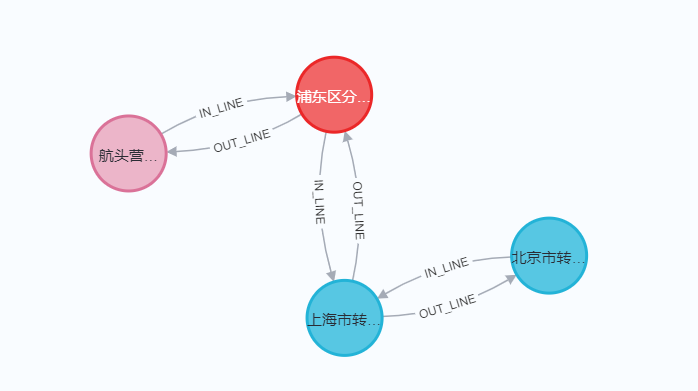

### Jenkins构建任务

如果在路线下没有service的构建任务，就需要创建一个构建任务：

点击新建任务：
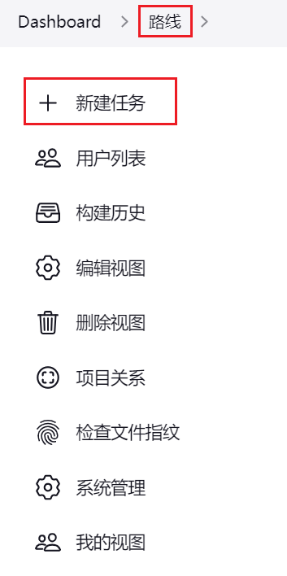
输入任务名称，名称与工程名一致：

选择复制一个已有的任务：

设置描述：

端口设置为：18083：

设置名称：
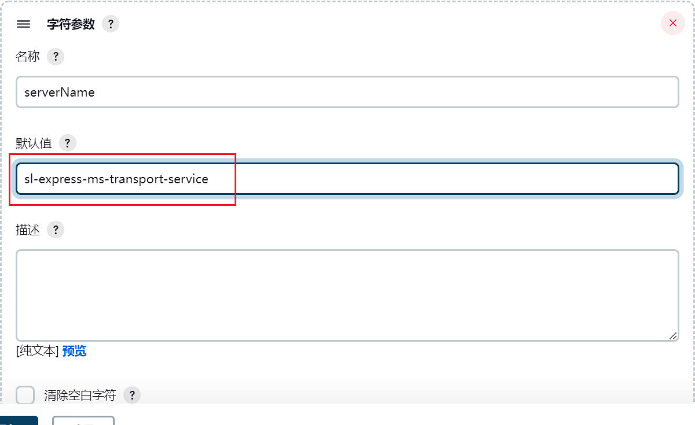
设置git地址：
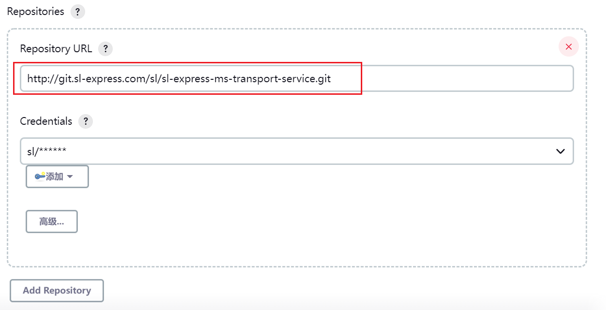
点击保存：

测试构建：

测试：[http://192.168.150.101:18083/doc.html](http://192.168.150.101:18083/doc.html)
可以正常查询到数据：


### 导入数据

前面都是基于测试数据进行测试的，实际上我们已经构造了一些初始数据，可以直接导入使用，具体命令如下：

```shell
#停止neo4j微服务
docker stop neo4j

#将数据文件neo4j.dump上传到挂载目录下：/var/lib/docker/volumes/neo4j/_data

#执行如下命令进行导入
#参数：--from：指定dump文件路径，--force：强制替换现有库
docker run -it --rm -v neo4j:/data neo4j:4.4.5 neo4j-admin load --from=/data/neo4j.dump --force

#启动neo4j微服务
docker start neo4j

#在管理工具中查询：match (n) return n

#如果需要备份数据，可以用dump命令进行导出数据（导出也是需要先停止服务），示例如下：
docker run -it --rm -v neo4j:/data neo4j:4.4.5 neo4j-admin dump --to=/data/neo4j2.dump --database=neo4j
```

导入的数据如下：


> 由于导入数据会覆盖之前插入的测试数据，会导致数据只存在权限系统中，出现脏数据，需要手动删除权限系统中对应的测试数据。

## 练习

### 练习1

今日代码量较大，动手编写代码实现相关的业务功能。

### 练习2

自己构造数据，进一步的完善数据和熟悉业务流程。

## 面试连环问

:::info
面试官问：

- 你们物流项目中的路线规划是怎么做的？
- 如何确定路线的成本和距离？成本计算规则是什么？该成本会计算到公司利润核算中吗？
- 对于路线的往返你们是怎么设计的？为什么成对创建的？
- 路线支持修改起点或终点机构吗？请说明理由。
  :::

