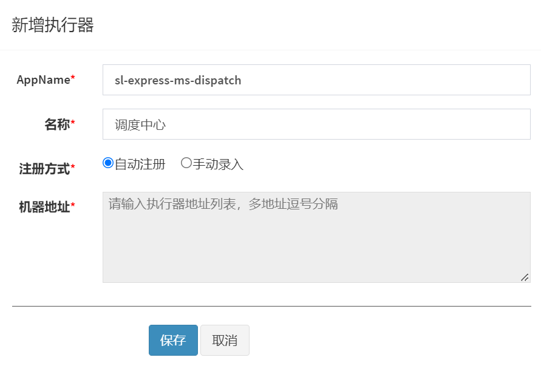
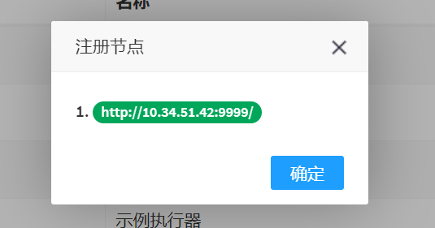
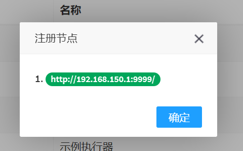
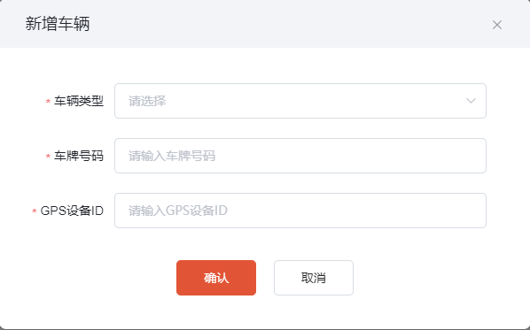
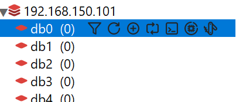
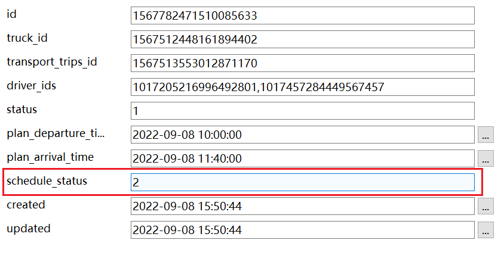
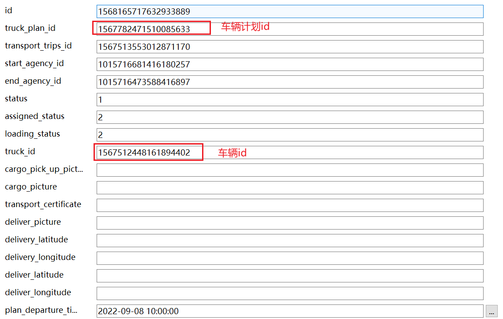
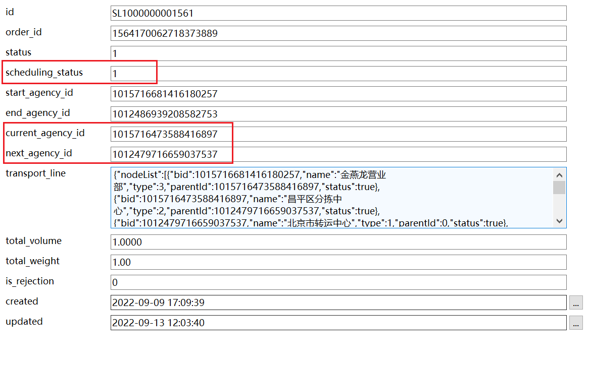

运输服务
========

[[toc]]

## 课程安排

- 智能调度生成运输任务
- 实现运输任务相关业务
- 实现司机入库业务

## 背景说明

通过前面的学习，已经可以将相同转运节点的运单合并，合并之后就需要进行调度计算，按照车辆的运力生成运输任务，以及司机的作业单，这样的话就可以进入到司机与车辆的运输环节了。


## 任务调度

### 分析

通过前面的实现，已经将相同转运节点的写入到了Redis的队列中，谁来处理呢？这就需要调度任务进行处理了，基本的思路是：

> 查询待分配任务的车辆 -> 计算运力 -> 分配运单 -> 生成运输任务 -> 生成司机作业单
> **也就是说，调度是站在车辆角度推进的。**

处理具体的处理业务流程如下：

:::info
线路、车辆、车次操作关系查看文档：
:::

### 实现

这里采用的是xxl-job的分片式任务调度，主要目的是为了并行多处理车辆，提升调度处理效率。

#### 调度入口

```java
    @Resource
    private TransportOrderDispatchMQListener transportOrderDispatchMQListener;
    @Resource
    private StringRedisTemplate stringRedisTemplate;
    @Resource
    private RedissonClient redissonClient;
    @Resource
    private TruckPlanFeign truckPlanFeign;
    @Resource
    private MQFeign mqFeign;

    @Value("${sl.volume.ratio:0.95}")
    private Double volumeRatio;
    @Value("${sl.weight.ratio:0.95}")
    private Double weightRatio;

    /**
     * 分片广播方式处理运单，生成运输任务
     */
    @XxlJob("transportTask")
    public void transportTask() {
        // 分片参数
        int shardIndex = XxlJobHelper.getShardIndex();
        int shardTotal = XxlJobHelper.getShardTotal();

        //根据分片参数 2小时内并且可用状态车辆
        // List<TruckPlanDto> truckDtoList = this.queryTruckPlanDtoList(shardIndex, shardTotal);
        List<TruckPlanDto> truckDtoList = this.truckPlanFeign.pullUnassignedPlan(shardTotal, shardIndex);
        if (CollUtil.isEmpty(truckDtoList)) {
            return;
        }

        // 对每一个车辆都进行处理
        // 为了相同目的地的运单尽可能的分配在一个运输任务中，所以需要在读取数据时进行锁定，一个车辆处理完成后再开始下一个车辆处理
        // 在这里，使用redis的分布式锁实现
        for (TruckPlanDto truckPlanDto : truckDtoList) {
            //校验车辆计划对象
            if (ObjectUtil.hasEmpty(truckPlanDto.getStartOrganId(), truckPlanDto.getEndOrganId(),
                    truckPlanDto.getTransportTripsId(), truckPlanDto.getId())) {
                log.error("车辆计划对象数据不符合要求， truckPlanDto -> {}", truckPlanDto);
                continue;
            }
            //根据该车辆的开始、结束机构id，来确定要处理的运单数据集合
            Long startOrganId = truckPlanDto.getStartOrganId();
            Long endOrganId = truckPlanDto.getEndOrganId();
            String redisKey = this.transportOrderDispatchMQListener.getListRedisKey(startOrganId, endOrganId);
            String lockRedisKey = Constants.LOCKS.DISPATCH_LOCK_PREFIX + redisKey;
            //获取锁
            RLock lock = this.redissonClient.getFairLock(lockRedisKey);
            List<DispatchMsgDTO> dispatchMsgDTOList = new ArrayList<>();
            try {
                //锁定，一直等待锁，一定要获取到锁，因为查询到车辆的调度状态设置为：已分配
                lock.lock();
                //计算车辆运力、合并运单
                this.executeTransportTask(redisKey, truckPlanDto.getTruckDto(), dispatchMsgDTOList);
            } finally {
                lock.unlock();
            }
            //生成运输任务
            this.createTransportTask(truckPlanDto, startOrganId, endOrganId, dispatchMsgDTOList);
        }

        //发送消息通过车辆已经完成调度
        this.completeTruckPlan(truckDtoList);
    }
```

#### 运单处理

递归处理运单，需要考虑到车辆的运力：

```java
    private void executeTransportTask(String redisKey, TruckDto truckDto, List<DispatchMsgDTO> dispatchMsgDTOList) {
        String redisData = this.stringRedisTemplate.opsForList().rightPop(redisKey);
        if (StrUtil.isEmpty(redisData)) {
            //该车辆没有运单需要运输
            return;
        }
        DispatchMsgDTO dispatchMsgDTO = JSONUtil.toBean(redisData, DispatchMsgDTO.class);

        //计算该车辆已经分配的运单，是否超出其运力，载重 或 体积超出，需要将新拿到的运单加进去后进行比较
        BigDecimal totalWeight = NumberUtil.add(NumberUtil.toBigDecimal(dispatchMsgDTOList.stream()
                .mapToDouble(DispatchMsgDTO::getTotalWeight)
                .sum()), dispatchMsgDTO.getTotalWeight());

        BigDecimal totalVolume = NumberUtil.add(NumberUtil.toBigDecimal(dispatchMsgDTOList.stream()
                .mapToDouble(DispatchMsgDTO::getTotalVolume)
                .sum()), dispatchMsgDTO.getTotalVolume());

        //车辆最大的容积和载重要留有余量，否则可能会超重 或 装不下
        BigDecimal maxAllowableLoad = NumberUtil.mul(truckDto.getAllowableLoad(), weightRatio);
        BigDecimal maxAllowableVolume = NumberUtil.mul(truckDto.getAllowableVolume(), volumeRatio);

        if (NumberUtil.isGreaterOrEqual(totalWeight, maxAllowableLoad)
                || NumberUtil.isGreaterOrEqual(totalVolume, maxAllowableVolume)) {
            //超出车辆运力，需要取货的运单再放回去，放到最右边，以便保证运单处理的顺序
            this.stringRedisTemplate.opsForList().rightPush(redisKey, redisData);
            return;
        }

        //没有超出运力，将该运单加入到集合中
        dispatchMsgDTOList.add(dispatchMsgDTO);
        //递归处理运单
        executeTransportTask(redisKey, truckDto, dispatchMsgDTOList);
    }
```

#### 消息通知生成运输任务

```java
    private void createTransportTask(TruckPlanDto truckPlanDto, Long startOrganId, Long endOrganId, List<DispatchMsgDTO> dispatchMsgDTOList) {
        //将运单合并的结果以消息的方式发送出去
        //key-> 车辆id，value ->  运单id列表
        //{"driverId":123, "truckPlanId":456, "truckId":1210114964812075008,"totalVolume":4.2,"endOrganId":90001,"totalWeight":7,"transportOrderIdList":[320733749248,420733749248],"startOrganId":100280}
        List<String> transportOrderIdList = CollUtil.getFieldValues(dispatchMsgDTOList, "transportOrderId", String.class);
        //司机列表确保不为null
        List<Long> driverIds = CollUtil.isNotEmpty(truckPlanDto.getDriverIds()) ? truckPlanDto.getDriverIds() : ListUtil.empty();
        Map<String, Object> msgResult = MapUtil.<String, Object>builder()
                .put("truckId", truckPlanDto.getTruckId()) //车辆id
                .put("driverIds", driverIds) //司机id
                .put("truckPlanId", truckPlanDto.getId()) //车辆计划id
                .put("transportTripsId", truckPlanDto.getTransportTripsId()) //车次id
                .put("startOrganId", startOrganId) //开始机构id
                .put("endOrganId", endOrganId) //结束机构id
                //运单id列表
                .put("transportOrderIdList", transportOrderIdList)
                //总重量
                .put("totalWeight", dispatchMsgDTOList.stream()
                        .mapToDouble(DispatchMsgDTO::getTotalWeight)
                        .sum())
                //总体积
                .put("totalVolume", dispatchMsgDTOList.stream()
                        .mapToDouble(DispatchMsgDTO::getTotalVolume)
                        .sum())
                .build();

        //发送消息
        String jsonMsg = JSONUtil.toJsonStr(msgResult);
        this.mqFeign.sendMsg(Constants.MQ.Exchanges.TRANSPORT_TASK,
                Constants.MQ.RoutingKeys.TRANSPORT_TASK_CREATE, jsonMsg);

        if (CollUtil.isNotEmpty(transportOrderIdList)) {
            //删除redis中set存储的运单数据
            String setRedisKey = this.transportOrderDispatchMQListener.getSetRedisKey(startOrganId, endOrganId);
            this.stringRedisTemplate.opsForSet().remove(setRedisKey, transportOrderIdList.toArray());
        }

    }
```

#### 消息通知完成车辆计划

通过消息的方式通知base微服务，完成车辆计划。

```java
    private void completeTruckPlan(List<TruckPlanDto> truckDtoList) {
        //{"ids":[1,2,3], "created":123456}
        Map<String, Object> msg = MapUtil.<String, Object>builder()
                .put("ids", CollUtil.getFieldValues(truckDtoList, "id", Long.class))
                .put("created", System.currentTimeMillis()).build();
        String jsonMsg = JSONUtil.toJsonStr(msg);
        //发送消息
        this.mqFeign.sendMsg(Constants.MQ.Exchanges.TRUCK_PLAN,
                Constants.MQ.RoutingKeys.TRUCK_PLAN_COMPLETE, jsonMsg);
    }
```

### xxl-job任务

编写完任务调度代码之后，需要在xxl-job中创建定时任务。地址：[http://xxl-job.sl-express.com/xxl-job-admin/](http://xxl-job.sl-express.com/xxl-job-admin/)
第一步，设置执行器，AppName为：`sl-express-ms-dispatch`


第二步，创建任务，任务的分发方式为分片式调度（每5分钟执行一次）：


创建完成：


### 测试

#### 测试xxl-job

将`sl-express-ms-dispatch`服务启动，发现在xxl-job中已经注册了服务：


:::danger
在这里一定要注意，注册的这个ip地址与101机器是否能通信，就上面的情况，显然是不能通信的，所以需要需要在配置文件中指定注册的ip地址。
如果可以通信就不需要指定。
:::
指定xxl-job中注册任务的ip地址：

```properties
xxl:
  job:
    executor:
      ip: 192.168.150.1
```

重新启动，这样就可以通信了，如下：


点击执行一次，进行测试看是否会触发代码的执行：


可以看到已经执行了：


#### 添加车辆车次

在前面的测试中，查询可用车辆是空的，所以我们需要添加车辆、车次。
:::info
需要将必要的微服务启动，如果已经启动请忽略。如果没有服务，请先在Jenkins中进行部署。
docker start sl-express-gateway
docker start sl-express-ms-base-service
docker start sl-express-ms-transport-service
docker start sl-express-ms-web-manager
docker start sl-express-ms-driver-service
:::
首先需要在权限系统中添加司机，系统中要求一个车辆至少配置2个司机，所以至少要创建2个司机，为司机完善好排班之后，还需要完善司机的驾驶证信息：

> 完善司机驾驶证信息需要上传图片，上传图片需要先nacos中的`sl-express-ms-web-manager.properties`配置oss相关的配置项，否则不能正常上传图片。


为司机设置排班，如果司机休息也是不可以进行调度的：


排班：


创建车型：


新增车辆：



:::danger
**请注意：**
添加车辆时，需要为车辆设置行驶证信息，否则是无法配置的，配置行驶证信息需要上传图片，上传图片需要先nacos中的`sl-express-ms-web-manager.properties`配置oss相关的配置项，否则不能正常上传图片。
:::
为司机配置车辆：


为线路添加车次与车辆（确保添加车次是测试数据中转运的路线，否则没有数据可以处理）：


另外，一定要注意，设置车次的时间要比当前测试时间+2小时要小才能查询到数据，否则查询不到。

#### 完整测试

现在就可以查询到车次数据，通过xxl-job的调度进行测试。
车辆计划数据的状态要为1，调度状态为0，才能获取到车次数据。


Redis中存在队列数据：


获取到数据：


调度执行后，redis数据被处理掉了，车辆的计划调度状态也改为了【已调度】状态：




另外，生成运输任务的消息已经发出了，只是我们还没有监听处理消息，在后面我们将实现对该消息的处理，就可以生成运输任务了。

## 运输任务

运输任务是针对于车辆的一次运输生成的，每一个运输任务都有对应的司机作业单。
例如：张三发了一个从北京金燕龙营业部发往上海浦东航头营业部的快递，它的转运路线是：`金燕龙营业部 → 昌平区分拣中心 → 北京转运中心 → 上海转运中心 → 浦东区分拣中心 → 航头营业部`，在此次的转运中一共会产生5个运输任务和至少10个司机作业单（一个车辆至少配备2个司机）。
需要注意的是，一个运输任务中包含了多个运单，就是一辆车拉了一车的快件，是一对多的关系。

### 表结构

运输任务在work微服务中，主要涉及到2张表，分别是：`sl_transport_task（运输任务表）`、`sl_transport_order_task（运输任务与运单关系表）`。司机作业单是存储在司机微服务中的`sl_driver_job（司机作业单）`表中。

```sql
CREATE TABLE `sl_transport_task` (
  `id` bigint NOT NULL COMMENT 'id',
  `truck_plan_id` bigint DEFAULT NULL COMMENT '车辆计划id',
  `transport_trips_id` bigint DEFAULT NULL COMMENT '车次id',
  `start_agency_id` bigint NOT NULL COMMENT '起始机构id',
  `end_agency_id` bigint NOT NULL COMMENT '目的机构id',
  `status` int NOT NULL COMMENT '任务状态，1为待执行（对应 未发车）、2为进行中（对应在途）、3为待确认（保留状态）、4为已完成（对应 已交付）、5为已取消',
  `assigned_status` tinyint NOT NULL COMMENT '任务分配状态(1未分配2已分配3待人工分配)',
  `loading_status` int NOT NULL COMMENT '满载状态(1.半载2.满载3.空载)',
  `truck_id` varchar(20) CHARACTER SET utf8mb4 COLLATE utf8mb4_general_ci DEFAULT NULL COMMENT '车辆id',
  `cargo_pick_up_picture` varchar(1000) CHARACTER SET utf8mb4 COLLATE utf8mb4_0900_ai_ci DEFAULT NULL COMMENT '提货凭证',
  `cargo_picture` varchar(1000) CHARACTER SET utf8mb4 COLLATE utf8mb4_0900_ai_ci DEFAULT NULL COMMENT '货物照片',
  `transport_certificate` varchar(1000) CHARACTER SET utf8mb4 COLLATE utf8mb4_0900_ai_ci DEFAULT NULL COMMENT '运回单凭证',
  `deliver_picture` varchar(1000) CHARACTER SET utf8mb4 COLLATE utf8mb4_0900_ai_ci DEFAULT NULL COMMENT '交付货物照片',
  `delivery_latitude` varchar(255) CHARACTER SET utf8mb4 COLLATE utf8mb4_general_ci DEFAULT NULL COMMENT '提货纬度值',
  `delivery_longitude` varchar(255) CHARACTER SET utf8mb4 COLLATE utf8mb4_general_ci DEFAULT NULL COMMENT '提货经度值',
  `deliver_latitude` varchar(255) CHARACTER SET utf8mb4 COLLATE utf8mb4_general_ci DEFAULT NULL COMMENT '交付纬度值',
  `deliver_longitude` varchar(255) CHARACTER SET utf8mb4 COLLATE utf8mb4_general_ci DEFAULT NULL COMMENT '交付经度值',
  `plan_departure_time` datetime DEFAULT NULL COMMENT '计划发车时间',
  `actual_departure_time` datetime DEFAULT NULL COMMENT '实际发车时间',
  `plan_arrival_time` datetime DEFAULT NULL COMMENT '计划到达时间',
  `actual_arrival_time` datetime DEFAULT NULL COMMENT '实际到达时间',
  `mark` varchar(50) CHARACTER SET utf8mb4 COLLATE utf8mb4_general_ci DEFAULT NULL COMMENT '备注',
  `distance` double DEFAULT NULL COMMENT '距离，单位：米',
  `created` datetime DEFAULT NULL COMMENT '创建时间',
  `updated` datetime DEFAULT NULL COMMENT '更新时间',
  PRIMARY KEY (`id`) USING BTREE,
  KEY `transport_trips_id` (`truck_plan_id`) USING BTREE,
  KEY `status` (`status`) USING BTREE,
  KEY `created` (`created`) USING BTREE
) ENGINE=InnoDB DEFAULT CHARSET=utf8mb4 COLLATE=utf8mb4_general_ci ROW_FORMAT=DYNAMIC COMMENT='运输任务表';
```

```sql
CREATE TABLE `sl_transport_order_task` (
  `id` bigint NOT NULL COMMENT 'id',
  `transport_order_id` varchar(18) CHARACTER SET utf8mb4 COLLATE utf8mb4_general_ci NOT NULL COMMENT '运单id',
  `transport_task_id` bigint NOT NULL COMMENT '运输任务id',
  `created` datetime DEFAULT NULL COMMENT '创建时间',
  `updated` datetime DEFAULT NULL COMMENT '更新时间',
  PRIMARY KEY (`id`) USING BTREE,
  KEY `transport_order_id` (`transport_order_id`) USING BTREE,
  KEY `transport_task_id` (`transport_task_id`) USING BTREE
) ENGINE=InnoDB DEFAULT CHARSET=utf8mb4 COLLATE=utf8mb4_general_ci ROW_FORMAT=DYNAMIC COMMENT='运单与运输任务关联表';
```

```sql
CREATE TABLE `sl_driver_job` (
  `id` bigint NOT NULL COMMENT 'id',
  `start_agency_id` bigint DEFAULT NULL COMMENT '起始机构id',
  `end_agency_id` bigint DEFAULT NULL COMMENT '目的机构id',
  `status` int DEFAULT NULL COMMENT '作业状态，1为待执行（对应 待提货）、2为进行中（对应在途）、3为改派（对应 已交付）、4为已完成（对应 已交付）、5为已作废',
  `driver_id` bigint DEFAULT NULL COMMENT '司机id',
  `transport_task_id` bigint DEFAULT NULL COMMENT '运输任务id',
  `start_handover` varchar(20) CHARACTER SET utf8mb4 COLLATE utf8mb4_general_ci DEFAULT NULL COMMENT '提货对接人',
  `finish_handover` varchar(20) CHARACTER SET utf8mb4 COLLATE utf8mb4_general_ci DEFAULT NULL COMMENT '交付对接人',
  `plan_departure_time` datetime DEFAULT NULL COMMENT '计划发车时间',
  `actual_departure_time` datetime DEFAULT NULL COMMENT '实际发车时间',
  `plan_arrival_time` datetime DEFAULT NULL COMMENT '计划到达时间',
  `actual_arrival_time` datetime DEFAULT NULL COMMENT '实际到达时间',
  `created` datetime DEFAULT NULL COMMENT '创建时间',
  `updated` datetime DEFAULT NULL COMMENT '更新时间',
  PRIMARY KEY (`id`) USING BTREE,
  KEY `task_transport_id` (`transport_task_id`) USING BTREE,
  KEY `created` (`created`) USING BTREE
) ENGINE=InnoDB DEFAULT CHARSET=utf8mb4 COLLATE=utf8mb4_general_ci ROW_FORMAT=DYNAMIC COMMENT='司机作业单';
```

### 编码实现

#### 监听消息

```java
    @Resource
    private DriverJobFeign driverJobFeign;
    @Resource
    private TruckPlanFeign truckPlanFeign;
    @Resource
    private TransportLineFeign transportLineFeign;
    @Resource
    private TransportTaskService transportTaskService;
    @Resource
    private TransportOrderTaskService transportOrderTaskService;
    @Resource
    private TransportOrderService transportOrderService;

	@RabbitListener(bindings = @QueueBinding(
            value = @Queue(name = Constants.MQ.Queues.WORK_TRANSPORT_TASK_CREATE),
            exchange = @Exchange(name = Constants.MQ.Exchanges.TRANSPORT_TASK, type = ExchangeTypes.TOPIC),
            key = Constants.MQ.RoutingKeys.TRANSPORT_TASK_CREATE
    ))
    public void listenTransportTaskMsg(String msg) {
        //解析消息 {"driverIds":[123,345], "truckPlanId":456, "truckId":1210114964812075008,"totalVolume":4.2,"endOrganId":90001,"totalWeight":7,"transportOrderIdList":[320733749248,420733749248],"startOrganId":100280}
        JSONObject jsonObject = JSONUtil.parseObj(msg);
        //获取到司机id列表
        JSONArray driverIds = jsonObject.getJSONArray("driverIds");
        // 分配状态
        TransportTaskAssignedStatus assignedStatus = CollUtil.isEmpty(driverIds) ? TransportTaskAssignedStatus.MANUAL_DISTRIBUTED : TransportTaskAssignedStatus.DISTRIBUTED;
        //创建运输任务
        Long transportTaskId = this.createTransportTask(jsonObject, assignedStatus);

        if (CollUtil.isEmpty(driverIds)) {
            log.info("生成司机作业单，司机列表为空，需要手动设置司机作业单 -> msg = {}", msg);
            return;
        }
        for (Object driverId : driverIds) {
            //生成司机作业单
            this.driverJobFeign.createDriverJob(transportTaskId, Convert.toLong(driverId));
        }
    }
```

#### 创建运输任务

```java
    @Transactional
    public Long createTransportTask(JSONObject jsonObject, TransportTaskAssignedStatus assignedStatus) {
        //根据车辆计划id查询预计发车时间和预计到达时间
        Long truckPlanId = jsonObject.getLong("truckPlanId");
        TruckPlanDto truckPlanDto = truckPlanFeign.findById(truckPlanId);

        //创建运输任务
        TransportTaskEntity transportTaskEntity = new TransportTaskEntity();
        transportTaskEntity.setTruckPlanId(jsonObject.getLong("truckPlanId"));
        transportTaskEntity.setTruckId(jsonObject.getLong("truckId"));
        transportTaskEntity.setStartAgencyId(jsonObject.getLong("startOrganId"));
        transportTaskEntity.setEndAgencyId(jsonObject.getLong("endOrganId"));
        transportTaskEntity.setTransportTripsId(jsonObject.getLong("transportTripsId"));
        transportTaskEntity.setAssignedStatus(assignedStatus); //任务分配状态
        transportTaskEntity.setPlanDepartureTime(truckPlanDto.getPlanDepartureTime()); //计划发车时间
        transportTaskEntity.setPlanArrivalTime(truckPlanDto.getPlanArrivalTime()); //计划到达时间
        transportTaskEntity.setStatus(TransportTaskStatus.PENDING); //设置运输任务状态

        // TODO 完善满载状态
        if (CollUtil.isEmpty(jsonObject.getJSONArray("transportOrderIdList"))) {
            transportTaskEntity.setLoadingStatus(TransportTaskLoadingStatus.EMPTY);
        } else {
            transportTaskEntity.setLoadingStatus(TransportTaskLoadingStatus.FULL);
        }

        //查询路线距离
        TransportLineSearchDTO transportLineSearchDTO = new TransportLineSearchDTO();
        transportLineSearchDTO.setPage(1);
        transportLineSearchDTO.setPageSize(1);
        transportLineSearchDTO.setStartOrganId(transportTaskEntity.getStartAgencyId());
        transportLineSearchDTO.setEndOrganId(transportTaskEntity.getEndAgencyId());
        PageResponse<TransportLineDTO> transportLineResponse = this.transportLineFeign.queryPageList(transportLineSearchDTO);
        TransportLineDTO transportLineDTO = CollUtil.getFirst(transportLineResponse.getItems());
        if (ObjectUtil.isNotEmpty(transportLineDTO)) {
            //设置距离
            transportTaskEntity.setDistance(transportLineDTO.getDistance());
        }

        //保存数据
        this.transportTaskService.save(transportTaskEntity);

        //创建运输任务与运单之间的关系
        this.createTransportOrderTask(transportTaskEntity.getId(), jsonObject);
        return transportTaskEntity.getId();
    }
```

#### 创建运单关系

```java
    private void createTransportOrderTask(final Long transportTaskId, final JSONObject jsonObject) {
        //创建运输任务与运单之间的关系
        JSONArray transportOrderIdList = jsonObject.getJSONArray("transportOrderIdList");
        if (CollUtil.isEmpty(transportOrderIdList)) {
            return;
        }

        //将运单id列表转成运单实体列表
        List<TransportOrderTaskEntity> resultList = transportOrderIdList.stream()
                .map(o -> {
                    TransportOrderTaskEntity transportOrderTaskEntity = new TransportOrderTaskEntity();
                    transportOrderTaskEntity.setTransportTaskId(transportTaskId);
                    transportOrderTaskEntity.setTransportOrderId(Convert.toStr(o));
                    return transportOrderTaskEntity;
                }).collect(Collectors.toList());

        //批量保存运输任务与运单的关联表
        this.transportOrderTaskService.batchSaveTransportOrder(resultList);

        //批量标记运单为已调度状态
        List<TransportOrderEntity> list = transportOrderIdList.stream()
                .map(o -> {
                    TransportOrderEntity transportOrderEntity = new TransportOrderEntity();
                    transportOrderEntity.setId(Convert.toStr(o));
                    //状态设置为已调度
                    transportOrderEntity.setSchedulingStatus(TransportOrderSchedulingStatus.SCHEDULED);
                    return transportOrderEntity;
                }).collect(Collectors.toList());
        this.transportOrderService.updateBatchById(list);
    }
```

### 测试

基于调度中心进行测试，需要`sl-express-ms-dispatch-service`、`sl-express-ms-work-service`、sl-`express-ms-oms-service`服务跑起来进行测试。
可以看到队列已经绑定到交换机：


经过测试发现已经生成了运输任务：


运输任务与运单的关系数据：


生成的司机作业单：


司机作业单对应的是两条数据，每个司机会有对应的一条作业单。

### 根据运输任务查询运单

在TransportOrderService中，需要根据运输任务id查询运单列表，下面我们来完善pageQueryByTaskId()方法：

```java
    /**
     * 根据运输任务id分页查询运单信息
     *
     * @param page             页码
     * @param pageSize         页面大小
     * @param taskId           运输任务id
     * @param transportOrderId 运单id
     * @return 运单对象分页数据
     */
    @Override
    public PageResponse<TransportOrderDTO> pageQueryByTaskId(Integer page, Integer pageSize, String taskId, String transportOrderId) {
        //构建分页查询条件
        Page<TransportOrderTaskEntity> transportOrderTaskPage = new Page<>(page, pageSize);
        LambdaQueryWrapper<TransportOrderTaskEntity> queryWrapper = new LambdaQueryWrapper<>();
        queryWrapper.eq(ObjectUtil.isNotEmpty(taskId), TransportOrderTaskEntity::getTransportTaskId, taskId)
                .like(ObjectUtil.isNotEmpty(transportOrderId), TransportOrderTaskEntity::getTransportOrderId, transportOrderId)
                .orderByDesc(TransportOrderTaskEntity::getCreated);

        //根据运输任务id、运单id查询运输任务与运单关联关系表
        Page<TransportOrderTaskEntity> pageResult = transportOrderTaskMapper.selectPage(transportOrderTaskPage, queryWrapper);
        if (ObjectUtil.isEmpty(pageResult.getRecords())) {
            return new PageResponse<>(pageResult);
        }

        //根据运单id查询运单，并转化为dto
        List<String> transportOrderIds = pageResult.getRecords().stream().map(TransportOrderTaskEntity::getTransportOrderId).collect(Collectors.toList());
        List<TransportOrderEntity> entities = baseMapper.selectBatchIds(transportOrderIds);

        //构建分页结果
        return PageResponse.of(BeanUtil.copyToList(entities, TransportOrderDTO.class), page, pageSize, pageResult.getPages(), pageResult.getTotal());
    }
```

## 司机入库

司机入库业务是非常核心的业务，司机入库就意味着车辆入库，也就是此次运输结束，需要开始下一个运输、结束此次运输任务、完成司机作业单等操作。
司机入库的流程是在`sl-express-ms-driver-service`微服务中完成的，基本的逻辑已经实现，现在需要我们实现运单向下一个节点的转运，即：开始新的转运工作。

### 业务实现

业务代码是在`sl-express-ms-driver-service`微服务中。

```java
    /**
     * 司机入库，修改运单的当前节点和下个节点 以及 修改运单为待调度状态，结束运输任务
     *
     * @param driverDeliverDTO 司机作业单id
     */
    @Override
    @GlobalTransactional
    public void intoStorage(DriverDeliverDTO driverDeliverDTO) {
        //1.司机作业单，获取运输任务id
        DriverJobEntity driverJob = super.getById(driverDeliverDTO.getId());
        if (ObjectUtil.isEmpty(driverJob)) {
            throw new SLException(DriverExceptionEnum.DRIVER_JOB_NOT_FOUND);
        }
        if (ObjectUtil.notEqual(driverJob.getStatus(), DriverJobStatus.PROCESSING)) {
            throw new SLException(DriverExceptionEnum.DRIVER_JOB_STATUS_UNKNOWN);
        }

        //运输任务id
        Long transportTaskId = driverJob.getTransportTaskId();

        //2.更新运输任务状态为完成
        //加锁，只能有一个司机操作，任务已经完成的话，就不需要进行流程流转，只要完成司机自己的作业单即可
        String lockRedisKey = Constants.LOCKS.DRIVER_JOB_LOCK_PREFIX + transportTaskId;
        //2.1获取锁
        RLock lock = this.redissonClient.getFairLock(lockRedisKey);
        if (lock.tryLock()) {
            //2.2获取到锁
            try {
                //2.3查询运输任务
                TransportTaskDTO transportTask = this.transportTaskFeign.findById(transportTaskId);
                //2.4判断任务是否已结束，不能再修改流转
                if (!ObjectUtil.equalsAny(transportTask.getStatus(), TransportTaskStatus.CANCELLED, TransportTaskStatus.COMPLETED)) {
                    //2.5修改运单流转节点，修改当前节点和下一个节点
                    this.transportOrderFeign.updateByTaskId(String.valueOf(transportTaskId));

                    //2.6结束运输任务
                    TransportTaskCompleteDTO transportTaskCompleteDTO = BeanUtil.toBean(driverDeliverDTO, TransportTaskCompleteDTO.class);
                    transportTaskCompleteDTO.setTransportTaskId(String.valueOf(transportTaskId));
                    this.transportTaskFeign.completeTransportTask(transportTaskCompleteDTO);
                }
            } finally {
                lock.unlock();
            }
        } else {
            throw new SLException(DriverExceptionEnum.DRIVER_JOB_INTO_STORAGE_ERROR);
        }

        //3.修改所有与运输任务id相关联的司机作业单状态和实际到达时间
        LambdaUpdateWrapper<DriverJobEntity> updateWrapper = new LambdaUpdateWrapper<>();
        updateWrapper.eq(ObjectUtil.isNotEmpty(transportTaskId), DriverJobEntity::getTransportTaskId, transportTaskId)
                .set(DriverJobEntity::getStatus, DriverJobStatus.DELIVERED)
                .set(DriverJobEntity::getActualArrivalTime, LocalDateTime.now());
        this.update(updateWrapper);
    }
```

可以看到，大部分的业务逻辑已经时间，我们只需要实现`transportOrderFeign`中的`updateByTaskId()`方法，也就是实现work微服务中`com.sl.ms.work.service.impl.TransportOrderServiceImpl#updateByTaskId()`的方法即可。

### 运单流转

实现的关键点：

- 设置当前所在网点id为下一个网点id（司机入库，说明已经到达目的地）
- 解析完整运输链路，找出下一个转运节点，需要考虑到拒收、最后一个节点等情况
- 发送消息通知，参与新的调度或生成快递员的取派件任务
- 发送物流信息的消息（先TODO）

代码实现：

```java
    @Override
    public boolean updateByTaskId(Long taskId) {
        //通过运输任务查询运单id列表
        List<String> transportOrderIdList = this.transportTaskService.queryTransportOrderIdListById(taskId);
        if (CollUtil.isEmpty(transportOrderIdList)) {
            return false;
        }
        //查询运单列表
        List<TransportOrderEntity> transportOrderList = super.listByIds(transportOrderIdList);
        for (TransportOrderEntity transportOrder : transportOrderList) {
            //获取将发往的目的地机构
            OrganDTO organDTO = organFeign.queryById(transportOrder.getNextAgencyId());

            //构建消息实体类
            String info = CharSequenceUtil.format("快件到达【{}】", organDTO.getName());
            String transportInfoMsg = TransportInfoMsg.builder()
                    .transportOrderId(transportOrder.getId())//运单id
                    .status("运送中")//消息状态
                    .info(info)//消息详情
                    .created(DateUtil.current())//创建时间
                    .build().toJson();
            //发送运单跟踪消息
            this.mqFeign.sendMsg(Constants.MQ.Exchanges.TRANSPORT_INFO, Constants.MQ.RoutingKeys.TRANSPORT_INFO_APPEND, transportInfoMsg);

            //设置当前所在机构id为下一个机构id
            transportOrder.setCurrentAgencyId(transportOrder.getNextAgencyId());
            //解析完整的运输链路，找到下一个机构id
            String transportLine = transportOrder.getTransportLine();
            JSONObject jsonObject = JSONUtil.parseObj(transportLine);
            Long nextAgencyId = 0L;
            JSONArray nodeList = jsonObject.getJSONArray("nodeList");
            //这里反向循环主要是考虑到拒收的情况，路线中会存在相同的节点，始终可以查找到后面的节点
            //正常：A B C D E ，拒收：A B C D E D C B A
            for (int i = nodeList.size() - 1; i >= 0; i--) {
                JSONObject node = (JSONObject) nodeList.get(i);
                Long agencyId = node.getLong("bid");
                if (ObjectUtil.equal(agencyId, transportOrder.getCurrentAgencyId())) {
                    if (i == nodeList.size() - 1) {
                        //已经是最后一个节点了，也就是到最后一个机构了
                        nextAgencyId = agencyId;
                        transportOrder.setStatus(TransportOrderStatus.ARRIVED_END);
                        //发送消息更新状态
                        this.sendUpdateStatusMsg(ListUtil.toList(transportOrder.getId()), TransportOrderStatus.ARRIVED_END);
                    } else {
                        //后面还有节点
                        nextAgencyId = ((JSONObject) nodeList.get(i + 1)).getLong("bid");
                        //设置运单状态为待调度
                        transportOrder.setSchedulingStatus(TransportOrderSchedulingStatus.TO_BE_SCHEDULED);
                    }
                    break;
                }
            }
            //设置下一个节点id
            transportOrder.setNextAgencyId(nextAgencyId);

            //如果运单没有到达终点，需要发送消息到运单调度的交换机中
            //如果已经到达最终网点，需要发送消息，进行分配快递员作业
            if (ObjectUtil.notEqual(transportOrder.getStatus(), TransportOrderStatus.ARRIVED_END)) {
                this.sendTransportOrderMsgToDispatch(transportOrder);
            } else {
                //发送消息生成派件任务
                this.sendDispatchTaskMsgToDispatch(transportOrder);
            }
        }
        //批量更新运单
        return super.updateBatchById(transportOrderList);
    }
```

### 测试

编写测试用例：

```java
@SpringBootTest
class TransportOrderServiceTest {

    @Resource
    private TransportOrderService transportOrderService;

    @Test
    void updateByTaskId() {
        //设置运输任务id
        this.transportOrderService.updateByTaskId(1568165717632933889L);
    }
}
```

测试之前，观察当前机构、下个机构：


测试之后，发现调度状态、当前机构、下个机构都已经更新，并且会发送消息再次进行调度：


消息内容（`sl.queue.dispatch.mergeTransportOrder`）：


## 练习

难度系数：★★★☆☆
需求：阅读司机微服务中的【司机出库】业务功能，主要阅读代码逻辑如下：

- 理解多个司机只能有一个更新运单状态，其他只是可以修改自己的作业单状态
- 使用分布式事务确保业务的一致性

## 面试连环问

:::info
面试官问：

- 能说一下xxl-job的分片式调度是在什么场景下使用的吗？这样做的好处是什么？
- 不同的运单流转节点是不一样的，你们如何将运单合并？如何确保redis的高可用？
- 你们系统中，车辆、车次和路线之间是什么关系？车辆有司机数量限制吗？
  :::
