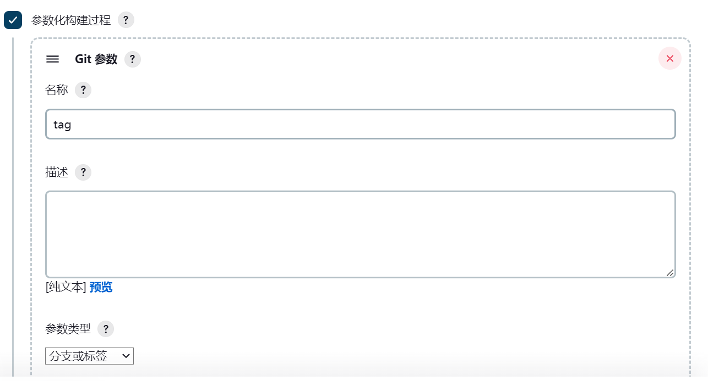
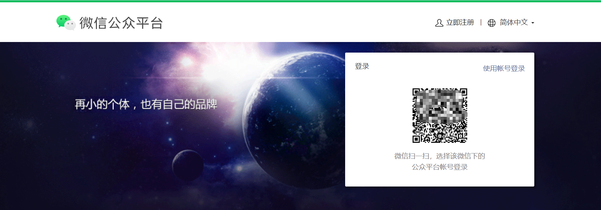
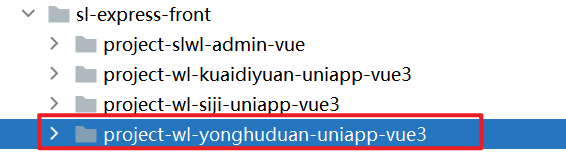
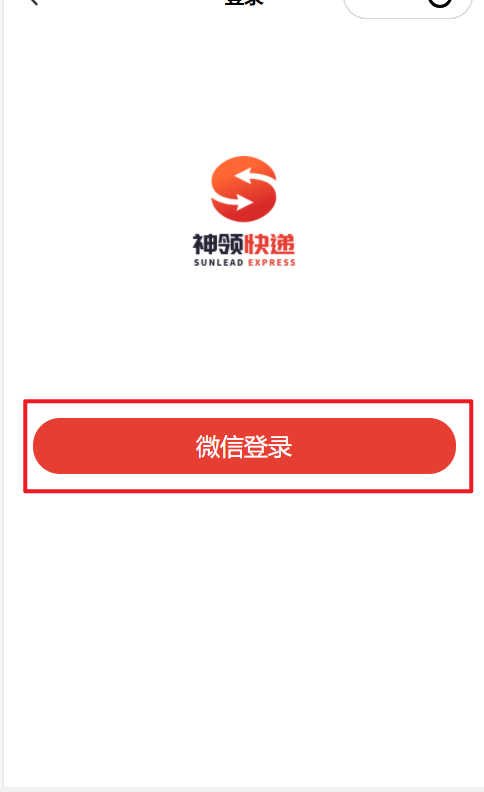
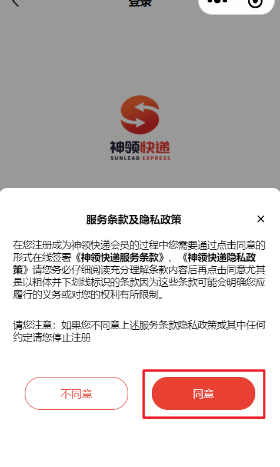
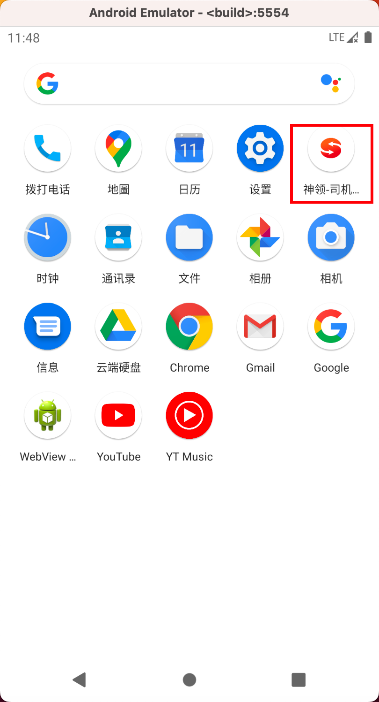

持续集成
========

[[toc]]

## Jenkins介绍


Jenkins 是一款流行的开源持续集成（Continuous Integration）工具，广泛用于项目开发，具有自动化构建、测试和部署等功能。官网： [http://jenkins-ci.org/](http://jenkins-ci.org/)。
Jenkins的特征：

- 开源的 Java语言开发持续集成工具，支持持续集成，持续部署。
- 易于安装部署配置：可通过 yum安装,或下载war包以及通过docker容器等快速实现安装部署，可方便web界面配置管理。
- 消息通知及测试报告：集成 RSS/E-mail通过RSS发布构建结果或当构建完成时通过e-mail通知，生成JUnit/TestNG测试报告。
- 分布式构建：支持 Jenkins能够让多台计算机一起构建/测试。
- 文件识别： Jenkins能够跟踪哪次构建生成哪些jar，哪次构建使用哪个版本的jar等。
- 丰富的插件支持：支持扩展插件，你可以开发适合自己团队使用的工具，如 git，svn，maven，docker等。

Jenkins安装和持续集成环境配置


- 首先，开发人员每天进行代码提交，提交到Git仓库
- 然后，Jenkins作为持续集成工具，使用Git工具到Git仓库拉取代码到集成服务器，再配合JDK，Maven等软件完成代码编译，代码测试与审查，测试，打包等工作，在这个过程中每一步出错，都重新再执行一次整个流程。
- 最后，Jenkins把生成的jar或war包分发到测试服务器或者生产服务器，测试人员或用户就可以访问应用。

## 部署安装

在神领物流项目中采用Docker方式部署Jenkins，部署脚本如下：

```shell
docker run -d \
-p 8090:8080 \
-p 50000:50000 \
-v /usr/local/src/jenkins:/var/jenkins_home \
-v  /maven:/maven \
-v /etc/localtime:/etc/localtime \
-v /usr/bin/docker:/usr/bin/docker \
-v /var/run/docker.sock:/var/run/docker.sock \
--privileged \
--name jenkins \
-e TZ=Asia/Shanghai \
--restart=always \
--add-host=git.sl-express.com:192.168.150.101 \
--add-host=maven.sl-express.com:192.168.150.101 \
jenkins/jenkins:lts-jdk11
```

在部署脚本中指定了时区、hosts并且将宿主机的docker服务映射到容器内部。
访问地址：[http://jenkins.sl-express.com/](http://jenkins.sl-express.com/)  用户名密码为：root/123

## 系统配置

Jenkins安装完成后，需要进行一些配置才能正常使用。

### 配置Maven


在【系统管理】中的【全局工具配置】中进行配置。
指定Maven配置文件：

配置文件内容如下：

```xml
<?xml version="1.0" encoding="UTF-8"?>
<settings
    xmlns="http://maven.apache.org/SETTINGS/1.0.0"
    xmlns:xsi="http://www.w3.org/2001/XMLSchema-instance"
          xsi:schemaLocation="http://maven.apache.org/SETTINGS/1.0.0 http://maven.apache.org/xsd/settings-1.0.0.xsd">
    
   <localRepository>/maven/repository</localRepository>

    <pluginGroups></pluginGroups>
    <proxies></proxies>

    <servers>
        <server>
            <id>sl-releases</id>
            <username>deployment</username>
            <password>deployment123</password>
        </server>
        <server>
            <id>sl-snapshots</id>
            <username>deployment</username>
            <password>deployment123</password>
        </server>
    </servers>
    
	<mirrors>
        <mirror>
            <id>mirror</id>
            <mirrorOf>central,jcenter,!sl-releases,!sl-snapshots</mirrorOf>
            <name>mirror</name>
            <url>https://maven.aliyun.com/nexus/content/groups/public</url>
        </mirror>
    </mirrors>
    
	<profiles>
        <profile>
            <id>sl</id>
            <properties>
                <altReleaseDeploymentRepository>
					sl-releases::default::http://maven.sl-express.com/nexus/content/repositories/releases/
				</altReleaseDeploymentRepository>
                <altSnapshotDeploymentRepository>
					sl-snapshots::default::http://maven.sl-express.com/nexus/content/repositories/snapshots/
				</altSnapshotDeploymentRepository>
            </properties>
        </profile>
    </profiles>
    
	<activeProfiles>
        <activeProfile>sl</activeProfile>
    </activeProfiles>

</settings>

```

### 配置Git


### 安装Gogs插件

我们使用的Git管理工具是Gogs，需要在用户提交代码之后触发自动构建，需要安装Gogs插件。

搜索Gogs安装即可。

在Gogs中的仓库设置钩子，例如：

格式：`http://jenkins.sl-express.com/gogs-webhook/?job=xxxx`

## 构建任务

在提供的虚拟机环境中虽然已经创建好了构建任务，如果不满足需求，可以执行创建任务，可以通过复制的方式完成。
首先点击【新建任务】：

输入任务的名称，建议名称就是微服务的名字。

选择已有的构建任务：

输入任务的名称：

设置Gogs钩子：

设置构建参数，主要用于构建时的脚本使用：

设置git地址，每个项目都不一样，一定要修改！

设置构建开始前将workspace删除，确保没有之前编译产物的干扰：

设置ssh执行命令，主要是宿主机安装的docker服务具备权限，可以在容器内执行：

设置maven打包命令：

设置部署的ssh脚本，主要是完成微服务打包成docker镜像进行部署：

执行命令如下：

```shell
#!/bin/bash
## 微服务名称
SERVER_NAME=${serverName}

## 服务版本
SERVER_VERSION=${version}

## 服务版本
SERVER_PORT=${port}

## 源jar名称，mvn打包之后，target目录下的jar包名称
JAR_NAME=$SERVER_NAME-$SERVER_VERSION

## jenkins下的目录
JENKINS_HOME=/var/jenkins_home/workspace/$SERVER_NAME

cd $JENKINS_HOME

## 修改文件权限
chmod 755 target/$JAR_NAME.jar

docker -v

echo "---------停止容器（$SERVER_NAME）---------"
docker stop $SERVER_NAME

echo "---------删除容器（$SERVER_NAME）---------"
docker rm $SERVER_NAME

echo "---------删除镜像（$SERVER_NAME:$SERVER_VERSION）---------"
docker rmi $SERVER_NAME:$SERVER_VERSION

echo "---------打包镜像（$SERVER_NAME:$SERVER_VERSION）---------"
docker build -t $SERVER_NAME:$SERVER_VERSION .

echo "---------运行服务---------"
docker run -d -p $SERVER_PORT:8080 --name $SERVER_NAME -e SERVER_PORT=8080 -e SPRING_CLOUD_NACOS_DISCOVERY_IP=${SPRING_CLOUD_NACOS_DISCOVERY_IP} -e  SPRING_CLOUD_NACOS_DISCOVERY_PORT=${port} -e SPRING_PROFILES_ACTIVE=stu $SERVER_NAME:$SERVER_VERSION
```

最后，保存即可。


前端部署
------------

### 说明

前端包括4个端，分别是：

- 用户端（微信小程序）
- 快递员端（安卓app）
- 司机端（安卓app）
- 后台管理端（pc web）

#### 用户端

### 开发者工具

用户端是基于微信小程序开发的，首先需要下载并安装微信开发者工具：

可以使用课程资料中提供的安装包或在线下载，[点击下载](https://developers.weixin.qq.com/miniprogram/dev/devtools/stable.html)

### 申请测试账号

接下来，申请微信小程序的测试账号，[点击申请](https://mp.weixin.qq.com/wxamp/sandbox)，通过手机微信扫码进行操作。

申请成功后，进行登录，[点击登录](https://mp.weixin.qq.com/)，如下：

通过手机微信进行扫码登录：

即可看到测试账号信息：


需要将AppID和AppSecret保存到nacos配置中心的 `sl-express-ms-web-customer.properties`中：


### 导入代码

从git拉取代码，地址：[http://git.sl-express.com/sl/project-wl-yonghuduan-uniapp-vue3](http://git.sl-express.com/sl/project-wl-yonghuduan-uniapp-vue3)

打开微信开发者工具（需要通过手机上的微信客户端进行扫码登录，不要使用游客身份登录），导入代码，注意导入的目录为：`project-wl-yonghuduan-uniapp-vue3\unpackage\dist\dev\mp-weixin`，使用测试账号：

导入完成后，需要修改`env.js`配置文件，将`baseUrl`变量设置为：`http://api.sl-express.com/customer`，此链接为与后端服务交互的地址，入口为网关地址：（修改完成后需要点击【编译】按钮进行重新编译）

如果需要完成登录，需要确保如下服务保持启动状态：

测试登录：



登录成功：


#### 快递员端

司机和快递员端都是安卓app的，可以安装在手机或通过模拟器进行使用，这里介绍模拟器的方式进行使用。（如果使用手机的话，需要通过内网穿透的方式访问网关）

### 模拟器

#### 联想模拟器

在Windows平台推荐使用【联想模拟器】，安装包在`资料\软件包\模拟器`中找到。（如果联想模拟器不能正常使用也可以使用其他的模拟器）
安装完成后，设置分辨率为【手机 720 * 1280】：

效果如下：（安装apk直接拖入即可）

模拟器中的共享目录：

在模拟器的定位功能中可以设定位置信息，主要用于app中获取定位，在项目用于车辆位置上报等场景：


#### 官方模拟器

如果使用的是苹果Mac电脑并且是M1、M2芯片的同学，可以安装官方的模拟器进行使用。
在资料文件夹中找到`android-emulator-m1-preview-v3.dmg`安装包，进行安装。
安装完成后，还不能安装apk，需要安装android-sdk，这里通过brew命令安装，首先安装brew，在命令控制台输入命令：
`/bin/zsh -c "$(curl -fsSL https://gitee.com/cunkai/HomebrewCN/raw/master/Homebrew.sh)" `
推荐使用2号安装：


> 如果没有安装git，在提示框中选择安装即可。


执行命令立即生效：`source /Users/tianze/.zprofile`
接下来安装android-sdk：

```shell
#先安装android-sdk，再安装android-platform-tools
brew install --cask android-sdk

brew install android-platform-tools

#查看
brew list android-sdk
brew list android-platform-tools
```

可以看到在`/opt/homebrew/Caskroom`目录下有`android-platform-tools`和`android-sdk`两个文件夹：

在模拟器中设置adb路径：`/opt/homebrew/Caskroom/android-platform-tools/34.0.1/platform-tools/adb`

设置完成后，即可拖入apk进行安装：


### 启动服务

测试登录的话，需要确保如下的服务处于启动状态：


### 快递员端

在app中设置接口地址：`http://192.168.150.101:9527/courier`


使用正确的用户密码即可登录：


### 司机端

司机端与快递员端类似，需要配置url为：`http://192.168.150.101:9527/driver`
输入正确的用户名密码即可登录成功：


#### pc管理端

pc管理端是需要将前端开发的vue进行编译，发布成html，然后通过nginx进行访问，这个过程已经在Jenkins中配置，执行点击发布即可。
地址：[http://jenkins.sl-express.com/view/%E5%89%8D%E7%AB%AF/job/project-slwl-admin-vue/](http://jenkins.sl-express.com/view/%E5%89%8D%E7%AB%AF/job/project-slwl-admin-vue/)

vue打包命令：

将打包后的html等静态文件拷贝到指定目录下：

nginx中的配置：

nginx所在目录：`/usr/local/src/nginx/conf`
输入地址进行测试：[http://admin.sl-express.com/#/login](http://admin.sl-express.com/#/login)

确保如下服务是启动状态：

