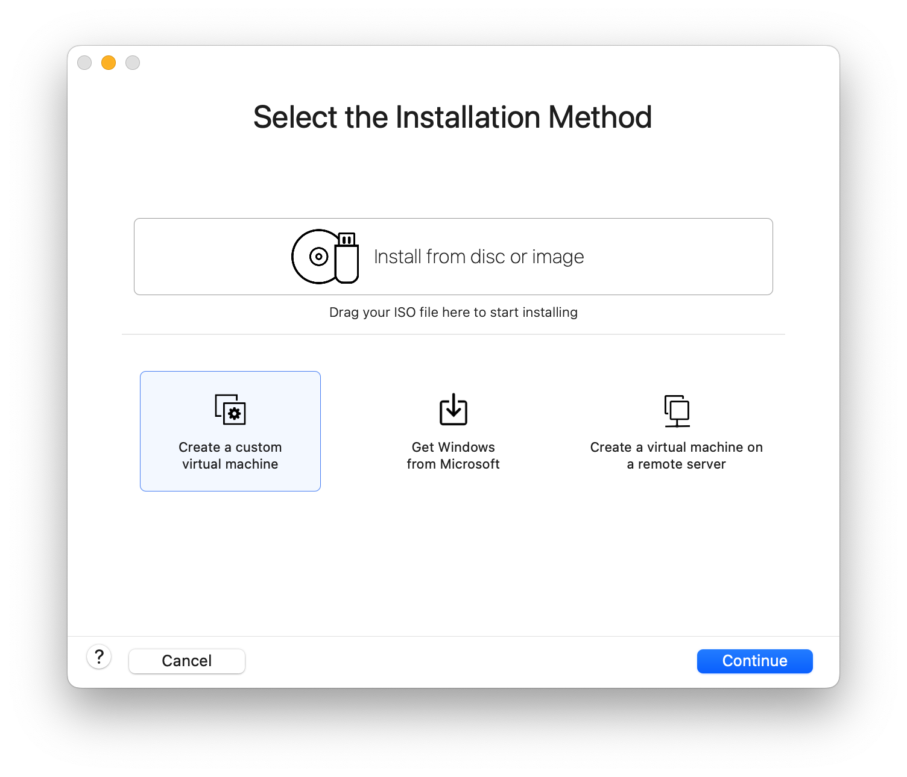

# 自定义服务

| 序号 | 软件名        | 镜像名                            |
| :--- | :------------ | :-------------------------------- |
| 1    | JDK           | openjdk:11.0-jre-buster           |
| 2    | MySQL         | mysql:8.0.45                      |
| 3    | Nacos         | nacos/nacos-server:v2.1.0-slim    |
| 4    | Seata         | seataio/seata-server:v2.0.0-slim  |
| 5    | XXL-JOB       | xuxueli/xxl-job-admin:2.3.0       |
| 6    | Gogs          | gogs/gogs:0.12                    |
| 7    | Jenkins       | jenkins/jenkins:2.361.1-lts-jdk11 |
| 8    | Nginx         | nginx:1.21.6                      |
| 9    | Redis         | redis:7.0.0                       |
|      |               |                                   |
| 11   | Elasticsearch | elasticsearch:7.13.1              |


## 资料


[Mac(M1)安装CentOS7 - 掘金 (juejin.cn)](https://juejin.cn/post/7216707319643471930)

[CentOS 7更换yum源详细教程-腾讯云开发者社区-腾讯云 (tencent.com)](https://cloud.tencent.com/developer/article/2160459)

[Jenkins中使用execute shell script on remote host using ssh-CSDN博客](https://blog.csdn.net/qq_33808440/article/details/120666231)

[详解五种Docker容器的网络模式 - 知乎 (zhihu.com)](https://zhuanlan.zhihu.com/p/682597159)


### 常见问题

解决让Docker配置的容器nginx用主机的IP

Jenkins无法使用 ssh命令和 nginx无法使用 localhost都是因为这是属于Docker的容器，对环境进行了隔离。

```sh
# 查看镜像版本
docker image inspect seataio/seata-server:1.5.1|grep -i version
# 加载镜像
docker load -i 

tar -zcvf jenkins.tar.gz jenkins
tar -zxvf jenkins.tar.gz
```


## 环境准备

### **安装Centos7**

此方案适用于新款苹果MacBook的M系列芯片电脑，需要在电脑中安装VMware Fusion，建议版本为13.x以上。

- 安装地址：[VMware Fusion安装地址](https://download3.vmware.com/software/FUS-1350/VMware-Fusion-13.5.0-22583790_universal.dmg)


网盘文件是分卷压缩的文件，先用cat命令合并文件

```sh
cat CentOS-7-aarch64-08191738.iso.zip* > CentOS-7-aarch64-08191738.iso.zip
```

在解压文件

```sh
unzip CentOS-7-aarch64-08191738.iso.zip
```

<br/>

#### 配置网络

在VMware中配置网络信息，新增网络，允许虚拟机使用 NAT，并设置 DHCP


通过命令行修改 Mac 网络配置

```sh
sudo vi /Library/Preferences/VMware\ Fusion/networking
```

主要修改两个点：

- 对应的网络名称为 VNET_2
- IP地址为：`192.168.150.101`，固定IP地址为：`192.168.150.102`

<br/>

修改完成后，退出VMware Fusion，然后重新打开VMware Fusion软件。

<br/>

以上操作完成后，检查网关是否正确，如果显示`192.168.150.2`表示设置成功，查看命令（修改成自己的网络名称）：

```Shell
sudo vi /Library/Preferences/VMware\ Fusion/vmnet2/nat.conf
```


#### 创建虚拟机

创建自定义虚拟机



选择虚拟机为 Linux 的 ARM 版本


创建新的虚拟机


自定义设置


设置虚拟机的处理器，网络适配器，磁盘分配大小，SATA


内存为 4 核 8G


网络适配器为 vmnet2


磁盘大小酌情处理，要点击 Apply


#### 系统配置

点击 Install CentOS 7


选择语言为简体中文


一次设置网络和主机名，时间和日期，安装目的地，根密码


设置以太网，打开以太网，设置主机名


设置时区，并打开网络时间


自定义本地标准磁盘


新增手动分区，挂载分区方案为 LVM


按照图示分配文件大小，设置完成后点击完成


接受更改


设置根密码，如果根密码简单需要确认两次


#### 设置网络

查询虚拟机局域网IP，网关、子网掩码、DNS，修改网络配置文件

```sh
vi /etc/sysconfig/network-scripts/ifcfg-ens160
```

添加配置项IPADDR、GATEWAY、DNS1

```sh
IPADDR="192.168.150.102"
GATEWAY="192.168.150.2"
DNS1="192.168.150.2"
```


#### 设置环境

重启网络，测试是否能 PING 通

```sh
service network restart
```

使用 Terminal 连接


开启shhd、关闭防火墙

```sh
[root@centos ~]# service sshd start
Redirecting to /bin/systemctl start sshd.service
[root@centos ~]# systemctl stop firewalld
[root@centos ~]# systemctl status firewalld
● firewalld.service - firewalld - dynamic firewall daemon
   Loaded: loaded (/usr/lib/systemd/system/firewalld.service; enabled; vendor preset: enabled)
   Active: inactive (dead) since Wed 2024-02-28 01:59:31 CST; 6s ago
     Docs: man:firewalld(1)
  Process: 939 ExecStart=/usr/sbin/firewalld --nofork --nopid $FIREWALLD_ARGS (code=exited, status=0/SUCCESS)
 Main PID: 939 (code=exited, status=0/SUCCESS)

Feb 28 01:33:19 centos systemd[1]: Starting firewalld - dynamic firewall da.....
Feb 28 01:33:19 centos systemd[1]: Started firewalld - dynamic firewall daemon.
Feb 28 01:33:19 centos firewalld[939]: WARNING: AllowZoneDrifting is enable...w.
Feb 28 01:33:19 centos firewalld[939]: WARNING: Failed to load nf_conntrack...e:
Feb 28 01:33:19 centos firewalld[939]: ERROR: Failed to read file "/proc/sy…per'
Feb 28 01:33:19 centos firewalld[939]: WARNING: Failed to get and parse nf_...ng
Feb 28 01:33:19 centos firewalld[939]: WARNING: ip6tables not usable, disab...l.
Feb 28 01:33:19 centos firewalld[939]: WARNING: ebtables not usable, disabl...l.
Feb 28 01:59:31 centos systemd[1]: Stopping firewalld - dynamic firewall da.....
Feb 28 01:59:31 centos systemd[1]: Stopped firewalld - dynamic firewall daemon.
Hint: Some lines were ellipsized, use -l to show in full.
```

#### 设置yum源

安装wget

```sh
yum install wget -y
```

备份yum配置文件

```sh
mv /etc/yum.repos.d/CentOS-Base.repo \
	 /etc/yum.repos.d/CentOS-Base.repo_bak
```

下载阿里云yum配置文件

```sh
wget http://mirrors.aliyun.com/repo/Centos-altarch-7.repo -O \
		 /etc/yum.repos.d/CentOS-Base.repo
```

更新yum缓存

```sh
yum makecache
```

安装一些常用工具

```sh
yum install -y gcc automake autoconf libtool make vim net-tools
```


### 安装Docker

[安装Docker资料](../../struct/cloud/00操作篇-安装Docker.md)

首先需要大家虚拟机联网，安装yum工具

```sh
yum install -y yum-utils \
           device-mapper-persistent-data \
           lvm2 --skip-broken
```

<br/>

然后更新本地镜像源

```shell
yum-config-manager \
    --add-repo \
    https://mirrors.aliyun.com/docker-ce/linux/centos/docker-ce.repo
    
sed -i 's/download.docker.com/mirrors.aliyun.com\/docker-ce/g' /etc/yum.repos.d/docker-ce.repo
```

<br/>

创建元数据缓存，提升搜索安装 yum 速度

```sh
yum makecache fast
```

<br/>

然后输入命令：

```shell
yum install -y docker-ce
```

docker-ce 为社区免费版本。稍等片刻，docker即可安装成功。

<br/>

**启动Docker**

Docker应用需要用到各种端口，逐一去修改防火墙设置。非常麻烦，因此建议大家直接关闭防火墙！

启动docker前，一定要关闭防火墙后！！

启动docker前，一定要关闭防火墙后！！

启动docker前，一定要关闭防火墙后！！

```sh
# 关闭
systemctl stop firewalld
# 禁止开机启动防火墙
systemctl disable firewalld
# 查看防火墙状态
systemctl status firewalld
# 开机自启动
systemctl enable docker
```

<br/>

通过命令启动docker：

```sh
# 启动docker服务
sudo systemctl start docker 
# 停止docker服务
sudo systemctl stop docker 
 # 重启docker服务
sudo systemctl restart docker 
```

<br/>

然后输入命令，可以查看docker版本：

```sh
docker -v 
```

<br/>

**创建Docker网络**

```sh
docker network create hmtt
```

<br/>

**配置镜像加速**

docker官方镜像仓库网速较差，我们需要设置国内镜像服务：

参考阿里云的镜像加速文档：https://cr.console.aliyun.com/cn-hangzhou/instances/mirrors

```sh
sudo mkdir -p /etc/docker
sudo tee /etc/docker/daemon.json <<-'EOF'
{
  "registry-mirrors": ["https://hwud7scp.mirror.aliyuncs.com"]
}
EOF
sudo systemctl daemon-reload
sudo systemctl restart docker
```

<br/>

**设置Docker命令重命名**

```sh
[root@centos ~]# vim .bashrc 
# .bashrc

# User specific aliases and functions

alias rm='rm -i'
alias cp='cp -i'
alias mv='mv -i'
alias dps='docker ps --format "table{{.ID}}\t{{.Names}}\t{{.Status}}\t{{.Ports}}"'
alias dc='docker-compose'
alias dis='docker images'
alias dexe='docker exec -it'
alias dlog='docker logs'
# Source global definitions
if [ -f /etc/bashrc ]; then
	. /etc/bashrc
fi
[root@centos ~]# source .bashrc 
[root@centos ~]# dps
CONTAINER ID   NAMES     STATUS    PORTS
```

<br/>

**安装DockerCompose**

DockerCompose安装地址：https://github.com/docker/compose/releases

<br/>

Linux下需要通过命令下载：

```sh
# 安装
curl -L \
https://github.com/docker/compose/releases/download/1.23.1/docker-compose-`uname -s`-`uname -m` > \
/usr/local/bin/docker-compose
```

<br/>

如果下载速度较慢，或者下载失败，可以使用 `docker-compose` 文件，上传到`/usr/local/bin/`目录。

:::warning 注意： `docker-compose` 分为 `x64` 版本 和  `aarch64` 版本

:::

<br/>

修改文件权限：

```sh
# 修改权限
chmod +x /usr/local/bin/docker-compose
```

<br/>

Base自动补全命令

```sh
# 补全命令
curl -L \
https://raw.githubusercontent.com/docker/compose/1.29.1/contrib/completion/bash/docker-compose > \
/etc/bash_completion.d/docker-compose
```

<br/>

如果这里出现错误，需要修改自己的hosts文件：

```sh
echo "199.232.68.133 raw.githubusercontent.com" >> /etc/hosts
```

<br/>

查看是否安装成功

```sh
[root@centos bin]# docker-compose --version
Docker Compose version v2.1.1
```

<br/>

### 安装JDK

官网下载地址：[Java 11 | Oracle](https://www.oracle.com/java/technologies/downloads/#java11)


<br/>

上传到某个目录，然后解压缩。例如：`/usr/local/src/`

```sh
[root@centos7 src]# pwd
/usr/local/src
[root@centos src]# tar -xvf jdk-11.0.22_linux-aarch64_bin.tar.gz 
[root@centos src]# rm -rf jdk-11.0.22_linux-aarch64_bin.tar.gz 
[root@centos src]# mv jdk-11.0.22/ java/
[root@centos src]# ll
总用量 0
drwxr-xr-x. 9 root root 126 2月  28 02:50 java
```

<br/>

配置环境变量

```sh
[root@centos7 src]# vim /etc/profile
export JAVA_HOME=/usr/local/src/java
export PATH=$PATH:$JAVA_HOME/bin
[root@centos src]# source /etc/profile
```

<br/>

查看环境变量

```sh
[root@centos src]# java -version
java version "11.0.22" 2024-01-16 LTS
Java(TM) SE Runtime Environment 18.9 (build 11.0.22+9-LTS-219)
Java HotSpot(TM) 64-Bit Server VM 18.9 (build 11.0.22+9-LTS-219, mixed mode)
```

<br/>

### 安装Nginx

Docker命令行启动

```sh
$ docker run -d --name nginx -d nginx:1.21.6
```

复制 nginx 的 conf 和 html

```sh
$ mkdir -p /usr/local/src/nginx
$ docker cp nginx:/etc/nginx /usr/local/src/nginx/conf
$ docker cp nginx:/usr/share/nginx/html /usr/local/src/nginx/
```

删除容器

```sh
$ docker stop nginx
$ docker rm nginx
```

重新启动

```sh
$ docker run -d \
--name nginx \
--restart=always \
--network=hmtt \
-v /usr/local/src/nginx/conf/:/etc/nginx/ \
-v /usr/local/src/nginx/html/:/usr/share/nginx/html \
-p 80:80 \
nginx:1.21.6
```

配置信息 

```nginx
#user  nobody;
worker_processes  1;

#error_log  logs/error.log;
#error_log  logs/error.log  notice;
#error_log  logs/error.log  info;

#pid        logs/nginx.pid;


events {
    worker_connections  1024;
}


http {
    include       mime.types;
    default_type  application/octet-stream;

    log_format  main  '$remote_addr - $remote_user [$time_local] "$request" '
                      '$status $body_bytes_sent "$http_referer" '
                      '"$http_user_agent" "$http_x_forwarded_for"';

    #access_log  logs/access.log  main;

    sendfile        on;
    #tcp_nopush     on;

    #keepalive_timeout  0;
    keepalive_timeout  65;

    #gzip  on;

    server {
        listen       80;
        server_name  localhost;

        #charset koi8-r;

        #access_log  logs/host.access.log  main;

        location / {
            root   html;
            index  index.html index.htm;
        }

        #error_page  404              /404.html;

        # redirect server error pages to the static page /50x.html
        #
        error_page   500 502 503 504  /50x.html;
        location = /50x.html {
            root   html;
        }
    }
  
    server {
       listen       80;
       server_name  git.hmtt.com;
       location / {
            proxy_pass http://192.168.150.102:10880;
       }
    }
    server {
       listen       80;
       server_name  jenkins.hmtt.com;
       location / {
            proxy_pass http://192.168.150.102:18080;
       }
    }
    server {
       listen       80;
       server_name  mq.hmtt.com;
       location / {
            proxy_pass http://192.168.150.102:15672;
       }
    }
    server {
       listen       80;
       server_name  nacos.hmtt.com;
       location / {
            rewrite /(.*)  /nacos/$1 break;
            proxy_pass http://192.168.150.102:8848;
       }
    }
    server {
       listen       80;
       server_name  xxljob.hmtt.com;
       location / {
            rewrite /  /xxl-job-admin break;
            proxy_pass http://192.168.150.102:8880;
       }
       location /xxl-job-admin {
            proxy_pass http://192.168.150.102:8880;
       }
    }
    
    server {
       listen       80;
       server_name  es.hmtt.com;
       location / {
            proxy_pass http://192.168.150.102:5601;
       }
    }
    server {
       listen       80;
       server_name  api.hmtt.com;
       location / {
            proxy_set_header Host       $host; # 传递原始Host头
            proxy_pass http://192.168.150.102:10010;
            # proxy_pass http://192.168.150.1:10010; # 由于要修改网关在本地测试，所以代理到本地IP
       }
    }
    server {
       listen       80;
       server_name  www.hmtt.com;
       location / {
            root /usr/local/src/tj-portal;
            index  index.html index.htm;
          #   proxy_pass http://192.168.150.1:18082;
       }
       location /img-tx {
            rewrite /img-tx/(.*)  /$1 break;
            proxy_pass http://wisehub-1312394356.cos.ap-shanghai.myqcloud.com;
       }
    }
    server {
       listen       80;
       server_name  manage.hmtt.com;
       location / {
            root /usr/local/src/tj-admin;
            index  index.html index.htm;
          #   proxy_pass http://192.168.150.2:18081;
       }
       location /img-tx {
            rewrite /img-tx/(.*)  /$1 break;
            proxy_pass http://wisehub-1312394356.cos.ap-shanghai.myqcloud.com;
       }
    }
}
```


### 安装MySQL

[MySQL Tags | Docker Hub](https://hub.docker.com/_/mysql/tags?page=1&name=8.0.34)


<br/>

创建 conf 文件夹和 data 文件夹

```sh
[root@centos src]# mkdir -p /usr/local/src/mysql/conf
[root@centos src]# mkdir -p /usr/local/src/mysql/data
```

<br/>

`/urs/local/src/mysql/conf/init.cnf`

```properties
[mysqld]
skip-name-resolve
character_set_server=utf8
datadir=/var/lib/mysql
server-id=1000
```

<br/>

命令行启动

```sh
docker run -d \
  --name mysql \
  --restart=always \
  --network=hmtt \
  -e TZ=Asia/Shanghai \
  -e MYSQL_ROOT_PASSWORD=abc123 \
  -p 3306:3306 \
  -v /usr/local/src/mysql/conf/:/etc/mysql/conf.d/ \
  -v /usr/local/src/mysql/data:/var/lib/mysql \
  mysql:8.0.34
```

<br/>

验证是否正确启动

```sh
[root@centos src]# docker exec -it mysql mysql -uroot -pabc123

Type 'help;' or '\h' for help. Type '\c' to clear the current input statement.

mysql> show variables like "%character%";
+--------------------------+--------------------------------+
| Variable_name            | Value                          |
+--------------------------+--------------------------------+
| character_set_client     | latin1                         |
| character_set_connection | latin1                         |
| character_set_database   | utf8mb4                        |
| character_set_filesystem | binary                         |
| character_set_results    | latin1                         |
| character_set_server     | utf8mb4                        |
| character_set_system     | utf8mb3                        |
| character_sets_dir       | /usr/share/mysql-8.0/charsets/ |
+--------------------------+--------------------------------+
8 rows in set (0.00 sec)
```

创建 compose 文件

```sh
[root@hmtt mysql]# vim docker-compose.yml
version: "3.2"

services:
  mysql:
    image: mysql:
    container_name: mysql
    ports:
      - "3306:3306"
    environment:
      TZ: Asia/Shanghai
      MYSQL_ROOT_PASSWORD: abc123
    volumes:
      - "/usr/local/src/mysql/conf:/etc/mysql/conf.d"
      - "/usr/local/src/mysql/data:/var/lib/mysql"
    restart: always
    networks:
      - new
networks:
  new:
    name: hmtt
```

<br/>

docker-compose启动

```sh
docker-compose up -d
```


### 安装Redis

复制 nginx 的 conf 和 html

```sh
$ mkdir -p /usr/local/src/redis/
```

:::details redis.conf

```sh
# Redis configuration file example.
#
# Note that in order to read the configuration file, Redis must be
# started with the file path as first argument:
#
# ./redis-server /path/to/redis.conf

# Note on units: when memory size is needed, it is possible to specify
# it in the usual form of 1k 5GB 4M and so forth:
#
# 1k => 1000 bytes
# 1kb => 1024 bytes
# 1m => 1000000 bytes
# 1mb => 1024*1024 bytes
# 1g => 1000000000 bytes
# 1gb => 1024*1024*1024 bytes
#
# units are case insensitive so 1GB 1Gb 1gB are all the same.

################################## INCLUDES ###################################

# Include one or more other config files here.  This is useful if you
# have a standard template that goes to all Redis servers but also need
# to customize a few per-server settings.  Include files can include
# other files, so use this wisely.
#
# Note that option "include" won't be rewritten by command "CONFIG REWRITE"
# from admin or Redis Sentinel. Since Redis always uses the last processed
# line as value of a configuration directive, you'd better put includes
# at the beginning of this file to avoid overwriting config change at runtime.
#
# If instead you are interested in using includes to override configuration
# options, it is better to use include as the last line.
#
# include /path/to/local.conf
# include /path/to/other.conf

################################## MODULES #####################################

# Load modules at startup. If the server is not able to load modules
# it will abort. It is possible to use multiple loadmodule directives.
#
# loadmodule /path/to/my_module.so
# loadmodule /path/to/other_module.so

################################## NETWORK #####################################

# By default, if no "bind" configuration directive is specified, Redis listens
# for connections from all available network interfaces on the host machine.
# It is possible to listen to just one or multiple selected interfaces using
# the "bind" configuration directive, followed by one or more IP addresses.
# Each address can be prefixed by "-", which means that redis will not fail to
# start if the address is not available. Being not available only refers to
# addresses that does not correspond to any network interfece. Addresses that
# are already in use will always fail, and unsupported protocols will always BE
# silently skipped.
#
# Examples:
#
# bind 192.168.1.100 10.0.0.1     # listens on two specific IPv4 addresses
# bind 127.0.0.1 ::1              # listens on loopback IPv4 and IPv6
# bind * -::*                     # like the default, all available interfaces
#
# ~~~ WARNING ~~~ If the computer running Redis is directly exposed to the
# internet, binding to all the interfaces is dangerous and will expose the
# instance to everybody on the internet. So by default we uncomment the
# following bind directive, that will force Redis to listen only on the
# IPv4 and IPv6 (if available) loopback interface addresses (this means Redis
# will only be able to accept client connections from the same host that it is
# running on).
#
# IF YOU ARE SURE YOU WANT YOUR INSTANCE TO LISTEN TO ALL THE INTERFACES
# JUST COMMENT OUT THE FOLLOWING LINE.
# ~~~~~~~~~~~~~~~~~~~~~~~~~~~~~~~~~~~~~~~~~~~~~~~~~~~~~~~~~~~~~~~~~~~~~~~~
bind 0.0.0.0 -::1

# Protected mode is a layer of security protection, in order to avoid that
# Redis instances left open on the internet are accessed and exploited.
#
# When protected mode is on and if:
#
# 1) The server is not binding explicitly to a set of addresses using the
#    "bind" directive.
# 2) No password is configured.
#
# The server only accepts connections from clients connecting from the
# IPv4 and IPv6 loopback addresses 127.0.0.1 and ::1, and from Unix domain
# sockets.
#
# By default protected mode is enabled. You should disable it only if
# you are sure you want clients from other hosts to connect to Redis
# even if no authentication is configured, nor a specific set of interfaces
# are explicitly listed using the "bind" directive.
protected-mode yes

# Accept connections on the specified port, default is 6379 (IANA #815344).
# If port 0 is specified Redis will not listen on a TCP socket.
port 6379

# TCP listen() backlog.
#
# In high requests-per-second environments you need a high backlog in order
# to avoid slow clients connection issues. Note that the Linux kernel
# will silently truncate it to the value of /proc/sys/net/core/somaxconn so
# make sure to raise both the value of somaxconn and tcp_max_syn_backlog
# in order to get the desired effect.
tcp-backlog 511

# Unix socket.
#
# Specify the path for the Unix socket that will be used to listen for
# incoming connections. There is no default, so Redis will not listen
# on a unix socket when not specified.
#
# unixsocket /run/redis.sock
# unixsocketperm 700

# Close the connection after a client is idle for N seconds (0 to disable)
timeout 0

# TCP keepalive.
#
# If non-zero, use SO_KEEPALIVE to send TCP ACKs to clients in absence
# of communication. This is useful for two reasons:
#
# 1) Detect dead peers.
# 2) Force network equipment in the middle to consider the connection to be
#    alive.
#
# On Linux, the specified value (in seconds) is the period used to send ACKs.
# Note that to close the connection the double of the time is needed.
# On other kernels the period depends on the kernel configuration.
#
# A reasonable value for this option is 300 seconds, which is the new
# Redis default starting with Redis 3.2.1.
tcp-keepalive 300

################################# TLS/SSL #####################################

# By default, TLS/SSL is disabled. To enable it, the "tls-port" configuration
# directive can be used to define TLS-listening ports. To enable TLS on the
# default port, use:
#
# port 0
# tls-port 6379

# Configure a X.509 certificate and private key to use for authenticating the
# server to connected clients, masters or cluster peers.  These files should be
# PEM formatted.
#
# tls-cert-file redis.crt 
# tls-key-file redis.key
#
# If the key file is encrypted using a passphrase, it can be included here
# as well.
#
# tls-key-file-pass secret

# Normally Redis uses the same certificate for both server functions (accepting
# connections) and client functions (replicating from a master, establishing
# cluster bus connections, etc.).
#
# Sometimes certificates are issued with attributes that designate them as
# client-only or server-only certificates. In that case it may be desired to use
# different certificates for incoming (server) and outgoing (client)
# connections. To do that, use the following directives:
#
# tls-client-cert-file client.crt
# tls-client-key-file client.key
#
# If the key file is encrypted using a passphrase, it can be included here
# as well.
#
# tls-client-key-file-pass secret

# Configure a DH parameters file to enable Diffie-Hellman (DH) key exchange:
#
# tls-dh-params-file redis.dh

# Configure a CA certificate(s) bundle or directory to authenticate TLS/SSL
# clients and peers.  Redis requires an explicit configuration of at least one
# of these, and will not implicitly use the system wide configuration.
#
# tls-ca-cert-file ca.crt
# tls-ca-cert-dir /etc/ssl/certs

# By default, clients (including replica servers) on a TLS port are required
# to authenticate using valid client side certificates.
#
# If "no" is specified, client certificates are not required and not accepted.
# If "optional" is specified, client certificates are accepted and must be
# valid if provided, but are not required.
#
# tls-auth-clients no
# tls-auth-clients optional

# By default, a Redis replica does not attempt to establish a TLS connection
# with its master.
#
# Use the following directive to enable TLS on replication links.
#
# tls-replication yes

# By default, the Redis Cluster bus uses a plain TCP connection. To enable
# TLS for the bus protocol, use the following directive:
#
# tls-cluster yes

# By default, only TLSv1.2 and TLSv1.3 are enabled and it is highly recommended
# that older formally deprecated versions are kept disabled to reduce the attack surface.
# You can explicitly specify TLS versions to support.
# Allowed values are case insensitive and include "TLSv1", "TLSv1.1", "TLSv1.2",
# "TLSv1.3" (OpenSSL >= 1.1.1) or any combination.
# To enable only TLSv1.2 and TLSv1.3, use:
#
# tls-protocols "TLSv1.2 TLSv1.3"

# Configure allowed ciphers.  See the ciphers(1ssl) manpage for more information
# about the syntax of this string.
#
# Note: this configuration applies only to <= TLSv1.2.
#
# tls-ciphers DEFAULT:!MEDIUM

# Configure allowed TLSv1.3 ciphersuites.  See the ciphers(1ssl) manpage for more
# information about the syntax of this string, and specifically for TLSv1.3
# ciphersuites.
#
# tls-ciphersuites TLS_CHACHA20_POLY1305_SHA256

# When choosing a cipher, use the server's preference instead of the client
# preference. By default, the server follows the client's preference.
#
# tls-prefer-server-ciphers yes

# By default, TLS session caching is enabled to allow faster and less expensive
# reconnections by clients that support it. Use the following directive to disable
# caching.
#
# tls-session-caching no

# Change the default number of TLS sessions cached. A zero value sets the cache
# to unlimited size. The default size is 20480.
#
# tls-session-cache-size 5000

# Change the default timeout of cached TLS sessions. The default timeout is 300
# seconds.
#
# tls-session-cache-timeout 60

################################# GENERAL #####################################

# By default Redis does not run as a daemon. Use 'yes' if you need it.
# Note that Redis will write a pid file in /var/run/redis.pid when daemonized.
# When Redis is supervised by upstart or systemd, this parameter has no impact.
daemonize no

# If you run Redis from upstart or systemd, Redis can interact with your
# supervision tree. Options:
#   supervised no      - no supervision interaction
#   supervised upstart - signal upstart by putting Redis into SIGSTOP mode
#                        requires "expect stop" in your upstart job config
#   supervised systemd - signal systemd by writing READY=1 to $NOTIFY_SOCKET
#                        on startup, and updating Redis status on a regular
#                        basis.
#   supervised auto    - detect upstart or systemd method based on
#                        UPSTART_JOB or NOTIFY_SOCKET environment variables
# Note: these supervision methods only signal "process is ready."
#       They do not enable continuous pings back to your supervisor.
#
# The default is "no". To run under upstart/systemd, you can simply uncomment
# the line below:
#
# supervised auto

# If a pid file is specified, Redis writes it where specified at startup
# and removes it at exit.
#
# When the server runs non daemonized, no pid file is created if none is
# specified in the configuration. When the server is daemonized, the pid file
# is used even if not specified, defaulting to "/var/run/redis.pid".
#
# Creating a pid file is best effort: if Redis is not able to create it
# nothing bad happens, the server will start and run normally.
#
# Note that on modern Linux systems "/run/redis.pid" is more conforming
# and should be used instead.
pidfile /var/run/redis_6379.pid

# Specify the server verbosity level.
# This can be one of:
# debug (a lot of information, useful for development/testing)
# verbose (many rarely useful info, but not a mess like the debug level)
# notice (moderately verbose, what you want in production probably)
# warning (only very important / critical messages are logged)
loglevel notice

# Specify the log file name. Also the empty string can be used to force
# Redis to log on the standard output. Note that if you use standard
# output for logging but daemonize, logs will be sent to /dev/null
logfile "redis.log"

# To enable logging to the system logger, just set 'syslog-enabled' to yes,
# and optionally update the other syslog parameters to suit your needs.
# syslog-enabled no

# Specify the syslog identity.
# syslog-ident redis

# Specify the syslog facility. Must be USER or between LOCAL0-LOCAL7.
# syslog-facility local0

# To disable the built in crash log, which will possibly produce cleaner core
# dumps when they are needed, uncomment the following:
#
# crash-log-enabled no

# To disable the fast memory check that's run as part of the crash log, which
# will possibly let redis terminate sooner, uncomment the following:
#
# crash-memcheck-enabled no

# Set the number of databases. The default database is DB 0, you can select
# a different one on a per-connection basis using SELECT <dbid> where
# dbid is a number between 0 and 'databases'-1
databases 1

# By default Redis shows an ASCII art logo only when started to log to the
# standard output and if the standard output is a TTY and syslog logging is
# disabled. Basically this means that normally a logo is displayed only in
# interactive sessions.
#
# However it is possible to force the pre-4.0 behavior and always show a
# ASCII art logo in startup logs by setting the following option to yes.
always-show-logo no

# By default, Redis modifies the process title (as seen in 'top' and 'ps') to
# provide some runtime information. It is possible to disable this and leave
# the process name as executed by setting the following to no.
set-proc-title yes

# When changing the process title, Redis uses the following template to construct
# the modified title.
#
# Template variables are specified in curly brackets. The following variables are
# supported:
#
# {title}           Name of process as executed if parent, or type of child process.
# {listen-addr}     Bind address or '*' followed by TCP or TLS port listening on, or
#                   Unix socket if only that's available.
# {server-mode}     Special mode, i.e. "[sentinel]" or "[cluster]".
# {port}            TCP port listening on, or 0.
# {tls-port}        TLS port listening on, or 0.
# {unixsocket}      Unix domain socket listening on, or "".
# {config-file}     Name of configuration file used.
#
proc-title-template "{title} {listen-addr} {server-mode}"

################################ SNAPSHOTTING  ################################

# Save the DB to disk.
#
# save <seconds> <changes>
#
# Redis will save the DB if both the given number of seconds and the given
# number of write operations against the DB occurred.
#
# Snapshotting can be completely disabled with a single empty string argument
# as in following example:
#
# save ""
#
# Unless specified otherwise, by default Redis will save the DB:
#   * After 3600 seconds (an hour) if at least 1 key changed
#   * After 300 seconds (5 minutes) if at least 100 keys changed
#   * After 60 seconds if at least 10000 keys changed
#
# You can set these explicitly by uncommenting the three following lines.
#
# save 3600 1
# save 300 100
# save 60 10000

# By default Redis will stop accepting writes if RDB snapshots are enabled
# (at least one save point) and the latest background save failed.
# This will make the user aware (in a hard way) that data is not persisting
# on disk properly, otherwise chances are that no one will notice and some
# disaster will happen.
#
# If the background saving process will start working again Redis will
# automatically allow writes again.
#
# However if you have setup your proper monitoring of the Redis server
# and persistence, you may want to disable this feature so that Redis will
# continue to work as usual even if there are problems with disk,
# permissions, and so forth.
stop-writes-on-bgsave-error yes

# Compress string objects using LZF when dump .rdb databases?
# By default compression is enabled as it's almost always a win.
# If you want to save some CPU in the saving child set it to 'no' but
# the dataset will likely be bigger if you have compressible values or keys.
rdbcompression yes

# Since version 5 of RDB a CRC64 checksum is placed at the end of the file.
# This makes the format more resistant to corruption but there is a performance
# hit to pay (around 10%) when saving and loading RDB files, so you can disable it
# for maximum performances.
#
# RDB files created with checksum disabled have a checksum of zero that will
# tell the loading code to skip the check.
rdbchecksum yes

# Enables or disables full sanitation checks for ziplist and listpack etc when
# loading an RDB or RESTORE payload. This reduces the chances of a assertion or
# crash later on while processing commands.
# Options:
#   no         - Never perform full sanitation
#   yes        - Always perform full sanitation
#   clients    - Perform full sanitation only for user connections.
#                Excludes: RDB files, RESTORE commands received from the master
#                connection, and client connections which have the
#                skip-sanitize-payload ACL flag.
# The default should be 'clients' but since it currently affects cluster
# resharding via MIGRATE, it is temporarily set to 'no' by default.
#
# sanitize-dump-payload no

# The filename where to dump the DB
dbfilename dump.rdb

# Remove RDB files used by replication in instances without persistence
# enabled. By default this option is disabled, however there are environments
# where for regulations or other security concerns, RDB files persisted on
# disk by masters in order to feed replicas, or stored on disk by replicas
# in order to load them for the initial synchronization, should be deleted
# ASAP. Note that this option ONLY WORKS in instances that have both AOF
# and RDB persistence disabled, otherwise is completely ignored.
#
# An alternative (and sometimes better) way to obtain the same effect is
# to use diskless replication on both master and replicas instances. However
# in the case of replicas, diskless is not always an option.
rdb-del-sync-files no

# The working directory.
#
# The DB will be written inside this directory, with the filename specified
# above using the 'dbfilename' configuration directive.
#
# The Append Only File will also be created inside this directory.
#
# Note that you must specify a directory here, not a file name.
dir /tmp

################################# REPLICATION #################################

# Master-Replica replication. Use replicaof to make a Redis instance a copy of
# another Redis server. A few things to understand ASAP about Redis replication.
#
#   +------------------+      +---------------+
#   |      Master      | ---> |    Replica    |
#   | (receive writes) |      |  (exact copy) |
#   +------------------+      +---------------+
#
# 1) Redis replication is asynchronous, but you can configure a master to
#    stop accepting writes if it appears to be not connected with at least
#    a given number of replicas.
# 2) Redis replicas are able to perform a partial resynchronization with the
#    master if the replication link is lost for a relatively small amount of
#    time. You may want to configure the replication backlog size (see the next
#    sections of this file) with a sensible value depending on your needs.
# 3) Replication is automatic and does not need user intervention. After a
#    network partition replicas automatically try to reconnect to masters
#    and resynchronize with them.
#
# replicaof <masterip> <masterport>

# If the master is password protected (using the "requirepass" configuration
# directive below) it is possible to tell the replica to authenticate before
# starting the replication synchronization process, otherwise the master will
# refuse the replica request.
#
# masterauth <master-password>
#
# However this is not enough if you are using Redis ACLs (for Redis version
# 6 or greater), and the default user is not capable of running the PSYNC
# command and/or other commands needed for replication. In this case it's
# better to configure a special user to use with replication, and specify the
# masteruser configuration as such:
#
# masteruser <username>
#
# When masteruser is specified, the replica will authenticate against its
# master using the new AUTH form: AUTH <username> <password>.

# When a replica loses its connection with the master, or when the replication
# is still in progress, the replica can act in two different ways:
#
# 1) if replica-serve-stale-data is set to 'yes' (the default) the replica will
#    still reply to client requests, possibly with out of date data, or the
#    data set may just be empty if this is the first synchronization.
#
# 2) If replica-serve-stale-data is set to 'no' the replica will reply with
#    an error "SYNC with master in progress" to all commands except:
#    INFO, REPLICAOF, AUTH, PING, SHUTDOWN, REPLCONF, ROLE, CONFIG, SUBSCRIBE,
#    UNSUBSCRIBE, PSUBSCRIBE, PUNSUBSCRIBE, PUBLISH, PUBSUB, COMMAND, POST,
#    HOST and LATENCY.
#
replica-serve-stale-data yes

# You can configure a replica instance to accept writes or not. Writing against
# a replica instance may be useful to store some ephemeral data (because data
# written on a replica will be easily deleted after resync with the master) but
# may also cause problems if clients are writing to it because of a
# misconfiguration.
#
# Since Redis 2.6 by default replicas are read-only.
#
# Note: read only replicas are not designed to be exposed to untrusted clients
# on the internet. It's just a protection layer against misuse of the instance.
# Still a read only replica exports by default all the administrative commands
# such as CONFIG, DEBUG, and so forth. To a limited extent you can improve
# security of read only replicas using 'rename-command' to shadow all the
# administrative / dangerous commands.
replica-read-only yes

# Replication SYNC strategy: disk or socket.
#
# New replicas and reconnecting replicas that are not able to continue the
# replication process just receiving differences, need to do what is called a
# "full synchronization". An RDB file is transmitted from the master to the
# replicas.
#
# The transmission can happen in two different ways:
#
# 1) Disk-backed: The Redis master creates a new process that writes the RDB
#                 file on disk. Later the file is transferred by the parent
#                 process to the replicas incrementally.
# 2) Diskless: The Redis master creates a new process that directly writes the
#              RDB file to replica sockets, without touching the disk at all.
#
# With disk-backed replication, while the RDB file is generated, more replicas
# can be queued and served with the RDB file as soon as the current child
# producing the RDB file finishes its work. With diskless replication instead
# once the transfer starts, new replicas arriving will be queued and a new
# transfer will start when the current one terminates.
#
# When diskless replication is used, the master waits a configurable amount of
# time (in seconds) before starting the transfer in the hope that multiple
# replicas will arrive and the transfer can be parallelized.
#
# With slow disks and fast (large bandwidth) networks, diskless replication
# works better.
repl-diskless-sync no

# When diskless replication is enabled, it is possible to configure the delay
# the server waits in order to spawn the child that transfers the RDB via socket
# to the replicas.
#
# This is important since once the transfer starts, it is not possible to serve
# new replicas arriving, that will be queued for the next RDB transfer, so the
# server waits a delay in order to let more replicas arrive.
#
# The delay is specified in seconds, and by default is 5 seconds. To disable
# it entirely just set it to 0 seconds and the transfer will start ASAP.
repl-diskless-sync-delay 5

# -----------------------------------------------------------------------------
# WARNING: RDB diskless load is experimental. Since in this setup the replica
# does not immediately store an RDB on disk, it may cause data loss during
# failovers. RDB diskless load + Redis modules not handling I/O reads may also
# cause Redis to abort in case of I/O errors during the initial synchronization
# stage with the master. Use only if you know what you are doing.
# -----------------------------------------------------------------------------
#
# Replica can load the RDB it reads from the replication link directly from the
# socket, or store the RDB to a file and read that file after it was completely
# received from the master.
#
# In many cases the disk is slower than the network, and storing and loading
# the RDB file may increase replication time (and even increase the master's
# Copy on Write memory and salve buffers).
# However, parsing the RDB file directly from the socket may mean that we have
# to flush the contents of the current database before the full rdb was
# received. For this reason we have the following options:
#
# "disabled"    - Don't use diskless load (store the rdb file to the disk first)
# "on-empty-db" - Use diskless load only when it is completely safe.
# "swapdb"      - Keep a copy of the current db contents in RAM while parsing
#                 the data directly from the socket. note that this requires
#                 sufficient memory, if you don't have it, you risk an OOM kill.
repl-diskless-load disabled

# Replicas send PINGs to server in a predefined interval. It's possible to
# change this interval with the repl_ping_replica_period option. The default
# value is 10 seconds.
#
# repl-ping-replica-period 10

# The following option sets the replication timeout for:
#
# 1) Bulk transfer I/O during SYNC, from the point of view of replica.
# 2) Master timeout from the point of view of replicas (data, pings).
# 3) Replica timeout from the point of view of masters (REPLCONF ACK pings).
#
# It is important to make sure that this value is greater than the value
# specified for repl-ping-replica-period otherwise a timeout will be detected
# every time there is low traffic between the master and the replica. The default
# value is 60 seconds.
#
# repl-timeout 60

# Disable TCP_NODELAY on the replica socket after SYNC?
#
# If you select "yes" Redis will use a smaller number of TCP packets and
# less bandwidth to send data to replicas. But this can add a delay for
# the data to appear on the replica side, up to 40 milliseconds with
# Linux kernels using a default configuration.
#
# If you select "no" the delay for data to appear on the replica side will
# be reduced but more bandwidth will be used for replication.
#
# By default we optimize for low latency, but in very high traffic conditions
# or when the master and replicas are many hops away, turning this to "yes" may
# be a good idea.
repl-disable-tcp-nodelay no

# Set the replication backlog size. The backlog is a buffer that accumulates
# replica data when replicas are disconnected for some time, so that when a
# replica wants to reconnect again, often a full resync is not needed, but a
# partial resync is enough, just passing the portion of data the replica
# missed while disconnected.
#
# The bigger the replication backlog, the longer the replica can endure the
# disconnect and later be able to perform a partial resynchronization.
#
# The backlog is only allocated if there is at least one replica connected.
#
# repl-backlog-size 1mb

# After a master has no connected replicas for some time, the backlog will be
# freed. The following option configures the amount of seconds that need to
# elapse, starting from the time the last replica disconnected, for the backlog
# buffer to be freed.
#
# Note that replicas never free the backlog for timeout, since they may be
# promoted to masters later, and should be able to correctly "partially
# resynchronize" with other replicas: hence they should always accumulate backlog.
#
# A value of 0 means to never release the backlog.
#
# repl-backlog-ttl 3600

# The replica priority is an integer number published by Redis in the INFO
# output. It is used by Redis Sentinel in order to select a replica to promote
# into a master if the master is no longer working correctly.
#
# A replica with a low priority number is considered better for promotion, so
# for instance if there are three replicas with priority 10, 100, 25 Sentinel
# will pick the one with priority 10, that is the lowest.
#
# However a special priority of 0 marks the replica as not able to perform the
# role of master, so a replica with priority of 0 will never be selected by
# Redis Sentinel for promotion.
#
# By default the priority is 100.
replica-priority 100

# -----------------------------------------------------------------------------
# By default, Redis Sentinel includes all replicas in its reports. A replica
# can be excluded from Redis Sentinel's announcements. An unannounced replica
# will be ignored by the 'sentinel replicas <master>' command and won't be
# exposed to Redis Sentinel's clients.
#
# This option does not change the behavior of replica-priority. Even with
# replica-announced set to 'no', the replica can be promoted to master. To
# prevent this behavior, set replica-priority to 0.
#
# replica-announced yes

# It is possible for a master to stop accepting writes if there are less than
# N replicas connected, having a lag less or equal than M seconds.
#
# The N replicas need to be in "online" state.
#
# The lag in seconds, that must be <= the specified value, is calculated from
# the last ping received from the replica, that is usually sent every second.
#
# This option does not GUARANTEE that N replicas will accept the write, but
# will limit the window of exposure for lost writes in case not enough replicas
# are available, to the specified number of seconds.
#
# For example to require at least 3 replicas with a lag <= 10 seconds use:
#
# min-replicas-to-write 3
# min-replicas-max-lag 10
#
# Setting one or the other to 0 disables the feature.
#
# By default min-replicas-to-write is set to 0 (feature disabled) and
# min-replicas-max-lag is set to 10.

# A Redis master is able to list the address and port of the attached
# replicas in different ways. For example the "INFO replication" section
# offers this information, which is used, among other tools, by
# Redis Sentinel in order to discover replica instances.
# Another place where this info is available is in the output of the
# "ROLE" command of a master.
#
# The listed IP address and port normally reported by a replica is
# obtained in the following way:
#
#   IP: The address is auto detected by checking the peer address
#   of the socket used by the replica to connect with the master.
#
#   Port: The port is communicated by the replica during the replication
#   handshake, and is normally the port that the replica is using to
#   listen for connections.
#
# However when port forwarding or Network Address Translation (NAT) is
# used, the replica may actually be reachable via different IP and port
# pairs. The following two options can be used by a replica in order to
# report to its master a specific set of IP and port, so that both INFO
# and ROLE will report those values.
#
# There is no need to use both the options if you need to override just
# the port or the IP address.
#
# replica-announce-ip 5.5.5.5
# replica-announce-port 1234

############################### KEYS TRACKING #################################

# Redis implements server assisted support for client side caching of values.
# This is implemented using an invalidation table that remembers, using
# a radix key indexed by key name, what clients have which keys. In turn
# this is used in order to send invalidation messages to clients. Please
# check this page to understand more about the feature:
#
#   https://redis.io/topics/client-side-caching
#
# When tracking is enabled for a client, all the read only queries are assumed
# to be cached: this will force Redis to store information in the invalidation
# table. When keys are modified, such information is flushed away, and
# invalidation messages are sent to the clients. However if the workload is
# heavily dominated by reads, Redis could use more and more memory in order
# to track the keys fetched by many clients.
#
# For this reason it is possible to configure a maximum fill value for the
# invalidation table. By default it is set to 1M of keys, and once this limit
# is reached, Redis will start to evict keys in the invalidation table
# even if they were not modified, just to reclaim memory: this will in turn
# force the clients to invalidate the cached values. Basically the table
# maximum size is a trade off between the memory you want to spend server
# side to track information about who cached what, and the ability of clients
# to retain cached objects in memory.
#
# If you set the value to 0, it means there are no limits, and Redis will
# retain as many keys as needed in the invalidation table.
# In the "stats" INFO section, you can find information about the number of
# keys in the invalidation table at every given moment.
#
# Note: when key tracking is used in broadcasting mode, no memory is used
# in the server side so this setting is useless.
#
# tracking-table-max-keys 1000000

################################## SECURITY ###################################

# Warning: since Redis is pretty fast, an outside user can try up to
# 1 million passwords per second against a modern box. This means that you
# should use very strong passwords, otherwise they will be very easy to break.
# Note that because the password is really a shared secret between the client
# and the server, and should not be memorized by any human, the password
# can be easily a long string from /dev/urandom or whatever, so by using a
# long and unguessable password no brute force attack will be possible.

# Redis ACL users are defined in the following format:
#
#   user <username> ... acl rules ...
#
# For example:
#
#   user worker +@list +@connection ~jobs:* on >ffa9203c493aa99
#
# The special username "default" is used for new connections. If this user
# has the "nopass" rule, then new connections will be immediately authenticated
# as the "default" user without the need of any password provided via the
# AUTH command. Otherwise if the "default" user is not flagged with "nopass"
# the connections will start in not authenticated state, and will require
# AUTH (or the HELLO command AUTH option) in order to be authenticated and
# start to work.
#
# The ACL rules that describe what a user can do are the following:
#
#  on           Enable the user: it is possible to authenticate as this user.
#  off          Disable the user: it's no longer possible to authenticate
#               with this user, however the already authenticated connections
#               will still work.
#  skip-sanitize-payload    RESTORE dump-payload sanitation is skipped.
#  sanitize-payload         RESTORE dump-payload is sanitized (default).
#  +<command>   Allow the execution of that command
#  -<command>   Disallow the execution of that command
#  +@<category> Allow the execution of all the commands in such category
#               with valid categories are like @admin, @set, @sortedset, ...
#               and so forth, see the full list in the server.c file where
#               the Redis command table is described and defined.
#               The special category @all means all the commands, but currently
#               present in the server, and that will be loaded in the future
#               via modules.
#  +<command>|subcommand    Allow a specific subcommand of an otherwise
#                           disabled command. Note that this form is not
#                           allowed as negative like -DEBUG|SEGFAULT, but
#                           only additive starting with "+".
#  allcommands  Alias for +@all. Note that it implies the ability to execute
#               all the future commands loaded via the modules system.
#  nocommands   Alias for -@all.
#  ~<pattern>   Add a pattern of keys that can be mentioned as part of
#               commands. For instance ~* allows all the keys. The pattern
#               is a glob-style pattern like the one of KEYS.
#               It is possible to specify multiple patterns.
#  allkeys      Alias for ~*
#  resetkeys    Flush the list of allowed keys patterns.
#  &<pattern>   Add a glob-style pattern of Pub/Sub channels that can be
#               accessed by the user. It is possible to specify multiple channel
#               patterns.
#  allchannels  Alias for &*
#  resetchannels            Flush the list of allowed channel patterns.
#  ><password>  Add this password to the list of valid password for the user.
#               For example >mypass will add "mypass" to the list.
#               This directive clears the "nopass" flag (see later).
#  <<password>  Remove this password from the list of valid passwords.
#  nopass       All the set passwords of the user are removed, and the user
#               is flagged as requiring no password: it means that every
#               password will work against this user. If this directive is
#               used for the default user, every new connection will be
#               immediately authenticated with the default user without
#               any explicit AUTH command required. Note that the "resetpass"
#               directive will clear this condition.
#  resetpass    Flush the list of allowed passwords. Moreover removes the
#               "nopass" status. After "resetpass" the user has no associated
#               passwords and there is no way to authenticate without adding
#               some password (or setting it as "nopass" later).
#  reset        Performs the following actions: resetpass, resetkeys, off,
#               -@all. The user returns to the same state it has immediately
#               after its creation.
#
# ACL rules can be specified in any order: for instance you can start with
# passwords, then flags, or key patterns. However note that the additive
# and subtractive rules will CHANGE MEANING depending on the ordering.
# For instance see the following example:
#
#   user alice on +@all -DEBUG ~* >somepassword
#
# This will allow "alice" to use all the commands with the exception of the
# DEBUG command, since +@all added all the commands to the set of the commands
# alice can use, and later DEBUG was removed. However if we invert the order
# of two ACL rules the result will be different:
#
#   user alice on -DEBUG +@all ~* >somepassword
#
# Now DEBUG was removed when alice had yet no commands in the set of allowed
# commands, later all the commands are added, so the user will be able to
# execute everything.
#
# Basically ACL rules are processed left-to-right.
#
# For more information about ACL configuration please refer to
# the Redis web site at https://redis.io/topics/acl

# ACL LOG
#
# The ACL Log tracks failed commands and authentication events associated
# with ACLs. The ACL Log is useful to troubleshoot failed commands blocked 
# by ACLs. The ACL Log is stored in memory. You can reclaim memory with 
# ACL LOG RESET. Define the maximum entry length of the ACL Log below.
acllog-max-len 128

# Using an external ACL file
#
# Instead of configuring users here in this file, it is possible to use
# a stand-alone file just listing users. The two methods cannot be mixed:
# if you configure users here and at the same time you activate the external
# ACL file, the server will refuse to start.
#
# The format of the external ACL user file is exactly the same as the
# format that is used inside redis.conf to describe users.
#
# aclfile /etc/redis/users.acl

# IMPORTANT NOTE: starting with Redis 6 "requirepass" is just a compatibility
# layer on top of the new ACL system. The option effect will be just setting
# the password for the default user. Clients will still authenticate using
# AUTH <password> as usually, or more explicitly with AUTH default <password>
# if they follow the new protocol: both will work.
#
# The requirepass is not compatable with aclfile option and the ACL LOAD
# command, these will cause requirepass to be ignored.
#
requirepass leadnews

# New users are initialized with restrictive permissions by default, via the
# equivalent of this ACL rule 'off resetkeys -@all'. Starting with Redis 6.2, it
# is possible to manage access to Pub/Sub channels with ACL rules as well. The
# default Pub/Sub channels permission if new users is controlled by the 
# acl-pubsub-default configuration directive, which accepts one of these values:
#
# allchannels: grants access to all Pub/Sub channels
# resetchannels: revokes access to all Pub/Sub channels
#
# To ensure backward compatibility while upgrading Redis 6.0, acl-pubsub-default
# defaults to the 'allchannels' permission.
#
# Future compatibility note: it is very likely that in a future version of Redis
# the directive's default of 'allchannels' will be changed to 'resetchannels' in
# order to provide better out-of-the-box Pub/Sub security. Therefore, it is
# recommended that you explicitly define Pub/Sub permissions for all users
# rather then rely on implicit default values. Once you've set explicit
# Pub/Sub for all existing users, you should uncomment the following line.
#
# acl-pubsub-default resetchannels

# Command renaming (DEPRECATED).
#
# ------------------------------------------------------------------------
# WARNING: avoid using this option if possible. Instead use ACLs to remove
# commands from the default user, and put them only in some admin user you
# create for administrative purposes.
# ------------------------------------------------------------------------
#
# It is possible to change the name of dangerous commands in a shared
# environment. For instance the CONFIG command may be renamed into something
# hard to guess so that it will still be available for internal-use tools
# but not available for general clients.
#
# Example:
#
# rename-command CONFIG b840fc02d524045429941cc15f59e41cb7be6c52
#
# It is also possible to completely kill a command by renaming it into
# an empty string:
#
# rename-command CONFIG ""
#
# Please note that changing the name of commands that are logged into the
# AOF file or transmitted to replicas may cause problems.

################################### CLIENTS ####################################

# Set the max number of connected clients at the same time. By default
# this limit is set to 10000 clients, however if the Redis server is not
# able to configure the process file limit to allow for the specified limit
# the max number of allowed clients is set to the current file limit
# minus 32 (as Redis reserves a few file descriptors for internal uses).
#
# Once the limit is reached Redis will close all the new connections sending
# an error 'max number of clients reached'.
#
# IMPORTANT: When Redis Cluster is used, the max number of connections is also
# shared with the cluster bus: every node in the cluster will use two
# connections, one incoming and another outgoing. It is important to size the
# limit accordingly in case of very large clusters.
#
# maxclients 10000

############################## MEMORY MANAGEMENT ################################

# Set a memory usage limit to the specified amount of bytes.
# When the memory limit is reached Redis will try to remove keys
# according to the eviction policy selected (see maxmemory-policy).
#
# If Redis can't remove keys according to the policy, or if the policy is
# set to 'noeviction', Redis will start to reply with errors to commands
# that would use more memory, like SET, LPUSH, and so on, and will continue
# to reply to read-only commands like GET.
#
# This option is usually useful when using Redis as an LRU or LFU cache, or to
# set a hard memory limit for an instance (using the 'noeviction' policy).
#
# WARNING: If you have replicas attached to an instance with maxmemory on,
# the size of the output buffers needed to feed the replicas are subtracted
# from the used memory count, so that network problems / resyncs will
# not trigger a loop where keys are evicted, and in turn the output
# buffer of replicas is full with DELs of keys evicted triggering the deletion
# of more keys, and so forth until the database is completely emptied.
#
# In short... if you have replicas attached it is suggested that you set a lower
# limit for maxmemory so that there is some free RAM on the system for replica
# output buffers (but this is not needed if the policy is 'noeviction').
#
# maxmemory <bytes>

# MAXMEMORY POLICY: how Redis will select what to remove when maxmemory
# is reached. You can select one from the following behaviors:
#
# volatile-lru -> Evict using approximated LRU, only keys with an expire set.
# allkeys-lru -> Evict any key using approximated LRU.
# volatile-lfu -> Evict using approximated LFU, only keys with an expire set.
# allkeys-lfu -> Evict any key using approximated LFU.
# volatile-random -> Remove a random key having an expire set.
# allkeys-random -> Remove a random key, any key.
# volatile-ttl -> Remove the key with the nearest expire time (minor TTL)
# noeviction -> Don't evict anything, just return an error on write operations.
#
# LRU means Least Recently Used
# LFU means Least Frequently Used
#
# Both LRU, LFU and volatile-ttl are implemented using approximated
# randomized algorithms.
#
# Note: with any of the above policies, when there are no suitable keys for
# eviction, Redis will return an error on write operations that require
# more memory. These are usually commands that create new keys, add data or
# modify existing keys. A few examples are: SET, INCR, HSET, LPUSH, SUNIONSTORE,
# SORT (due to the STORE argument), and EXEC (if the transaction includes any
# command that requires memory).
#
# The default is:
#
# maxmemory-policy noeviction

# LRU, LFU and minimal TTL algorithms are not precise algorithms but approximated
# algorithms (in order to save memory), so you can tune it for speed or
# accuracy. By default Redis will check five keys and pick the one that was
# used least recently, you can change the sample size using the following
# configuration directive.
#
# The default of 5 produces good enough results. 10 Approximates very closely
# true LRU but costs more CPU. 3 is faster but not very accurate.
#
# maxmemory-samples 5

# Eviction processing is designed to function well with the default setting.
# If there is an unusually large amount of write traffic, this value may need to
# be increased.  Decreasing this value may reduce latency at the risk of 
# eviction processing effectiveness
#   0 = minimum latency, 10 = default, 100 = process without regard to latency
#
# maxmemory-eviction-tenacity 10

# Starting from Redis 5, by default a replica will ignore its maxmemory setting
# (unless it is promoted to master after a failover or manually). It means
# that the eviction of keys will be just handled by the master, sending the
# DEL commands to the replica as keys evict in the master side.
#
# This behavior ensures that masters and replicas stay consistent, and is usually
# what you want, however if your replica is writable, or you want the replica
# to have a different memory setting, and you are sure all the writes performed
# to the replica are idempotent, then you may change this default (but be sure
# to understand what you are doing).
#
# Note that since the replica by default does not evict, it may end using more
# memory than the one set via maxmemory (there are certain buffers that may
# be larger on the replica, or data structures may sometimes take more memory
# and so forth). So make sure you monitor your replicas and make sure they
# have enough memory to never hit a real out-of-memory condition before the
# master hits the configured maxmemory setting.
#
# replica-ignore-maxmemory yes

# Redis reclaims expired keys in two ways: upon access when those keys are
# found to be expired, and also in background, in what is called the
# "active expire key". The key space is slowly and interactively scanned
# looking for expired keys to reclaim, so that it is possible to free memory
# of keys that are expired and will never be accessed again in a short time.
#
# The default effort of the expire cycle will try to avoid having more than
# ten percent of expired keys still in memory, and will try to avoid consuming
# more than 25% of total memory and to add latency to the system. However
# it is possible to increase the expire "effort" that is normally set to
# "1", to a greater value, up to the value "10". At its maximum value the
# system will use more CPU, longer cycles (and technically may introduce
# more latency), and will tolerate less already expired keys still present
# in the system. It's a tradeoff between memory, CPU and latency.
#
# active-expire-effort 1

############################# LAZY FREEING ####################################

# Redis has two primitives to delete keys. One is called DEL and is a blocking
# deletion of the object. It means that the server stops processing new commands
# in order to reclaim all the memory associated with an object in a synchronous
# way. If the key deleted is associated with a small object, the time needed
# in order to execute the DEL command is very small and comparable to most other
# O(1) or O(log_N) commands in Redis. However if the key is associated with an
# aggregated value containing millions of elements, the server can block for
# a long time (even seconds) in order to complete the operation.
#
# For the above reasons Redis also offers non blocking deletion primitives
# such as UNLINK (non blocking DEL) and the ASYNC option of FLUSHALL and
# FLUSHDB commands, in order to reclaim memory in background. Those commands
# are executed in constant time. Another thread will incrementally free the
# object in the background as fast as possible.
#
# DEL, UNLINK and ASYNC option of FLUSHALL and FLUSHDB are user-controlled.
# It's up to the design of the application to understand when it is a good
# idea to use one or the other. However the Redis server sometimes has to
# delete keys or flush the whole database as a side effect of other operations.
# Specifically Redis deletes objects independently of a user call in the
# following scenarios:
#
# 1) On eviction, because of the maxmemory and maxmemory policy configurations,
#    in order to make room for new data, without going over the specified
#    memory limit.
# 2) Because of expire: when a key with an associated time to live (see the
#    EXPIRE command) must be deleted from memory.
# 3) Because of a side effect of a command that stores data on a key that may
#    already exist. For example the RENAME command may delete the old key
#    content when it is replaced with another one. Similarly SUNIONSTORE
#    or SORT with STORE option may delete existing keys. The SET command
#    itself removes any old content of the specified key in order to replace
#    it with the specified string.
# 4) During replication, when a replica performs a full resynchronization with
#    its master, the content of the whole database is removed in order to
#    load the RDB file just transferred.
#
# In all the above cases the default is to delete objects in a blocking way,
# like if DEL was called. However you can configure each case specifically
# in order to instead release memory in a non-blocking way like if UNLINK
# was called, using the following configuration directives.

lazyfree-lazy-eviction no
lazyfree-lazy-expire no
lazyfree-lazy-server-del no
replica-lazy-flush no

# It is also possible, for the case when to replace the user code DEL calls
# with UNLINK calls is not easy, to modify the default behavior of the DEL
# command to act exactly like UNLINK, using the following configuration
# directive:

lazyfree-lazy-user-del no

# FLUSHDB, FLUSHALL, and SCRIPT FLUSH support both asynchronous and synchronous
# deletion, which can be controlled by passing the [SYNC|ASYNC] flags into the
# commands. When neither flag is passed, this directive will be used to determine
# if the data should be deleted asynchronously.

lazyfree-lazy-user-flush no

################################ THREADED I/O #################################

# Redis is mostly single threaded, however there are certain threaded
# operations such as UNLINK, slow I/O accesses and other things that are
# performed on side threads.
#
# Now it is also possible to handle Redis clients socket reads and writes
# in different I/O threads. Since especially writing is so slow, normally
# Redis users use pipelining in order to speed up the Redis performances per
# core, and spawn multiple instances in order to scale more. Using I/O
# threads it is possible to easily speedup two times Redis without resorting
# to pipelining nor sharding of the instance.
#
# By default threading is disabled, we suggest enabling it only in machines
# that have at least 4 or more cores, leaving at least one spare core.
# Using more than 8 threads is unlikely to help much. We also recommend using
# threaded I/O only if you actually have performance problems, with Redis
# instances being able to use a quite big percentage of CPU time, otherwise
# there is no point in using this feature.
#
# So for instance if you have a four cores boxes, try to use 2 or 3 I/O
# threads, if you have a 8 cores, try to use 6 threads. In order to
# enable I/O threads use the following configuration directive:
#
# io-threads 4
#
# Setting io-threads to 1 will just use the main thread as usual.
# When I/O threads are enabled, we only use threads for writes, that is
# to thread the write(2) syscall and transfer the client buffers to the
# socket. However it is also possible to enable threading of reads and
# protocol parsing using the following configuration directive, by setting
# it to yes:
#
# io-threads-do-reads no
#
# Usually threading reads doesn't help much.
#
# NOTE 1: This configuration directive cannot be changed at runtime via
# CONFIG SET. Aso this feature currently does not work when SSL is
# enabled.
#
# NOTE 2: If you want to test the Redis speedup using redis-benchmark, make
# sure you also run the benchmark itself in threaded mode, using the
# --threads option to match the number of Redis threads, otherwise you'll not
# be able to notice the improvements.

############################ KERNEL OOM CONTROL ##############################

# On Linux, it is possible to hint the kernel OOM killer on what processes
# should be killed first when out of memory.
#
# Enabling this feature makes Redis actively control the oom_score_adj value
# for all its processes, depending on their role. The default scores will
# attempt to have background child processes killed before all others, and
# replicas killed before masters.
#
# Redis supports three options:
#
# no:       Don't make changes to oom-score-adj (default).
# yes:      Alias to "relative" see below.
# absolute: Values in oom-score-adj-values are written as is to the kernel.
# relative: Values are used relative to the initial value of oom_score_adj when
#           the server starts and are then clamped to a range of -1000 to 1000.
#           Because typically the initial value is 0, they will often match the
#           absolute values.
oom-score-adj no

# When oom-score-adj is used, this directive controls the specific values used
# for master, replica and background child processes. Values range -2000 to
# 2000 (higher means more likely to be killed).
#
# Unprivileged processes (not root, and without CAP_SYS_RESOURCE capabilities)
# can freely increase their value, but not decrease it below its initial
# settings. This means that setting oom-score-adj to "relative" and setting the
# oom-score-adj-values to positive values will always succeed.
oom-score-adj-values 0 200 800


#################### KERNEL transparent hugepage CONTROL ######################

# Usually the kernel Transparent Huge Pages control is set to "madvise" or
# or "never" by default (/sys/kernel/mm/transparent_hugepage/enabled), in which
# case this config has no effect. On systems in which it is set to "always",
# redis will attempt to disable it specifically for the redis process in order
# to avoid latency problems specifically with fork(2) and CoW.
# If for some reason you prefer to keep it enabled, you can set this config to
# "no" and the kernel global to "always".

disable-thp yes

############################## APPEND ONLY MODE ###############################

# By default Redis asynchronously dumps the dataset on disk. This mode is
# good enough in many applications, but an issue with the Redis process or
# a power outage may result into a few minutes of writes lost (depending on
# the configured save points).
#
# The Append Only File is an alternative persistence mode that provides
# much better durability. For instance using the default data fsync policy
# (see later in the config file) Redis can lose just one second of writes in a
# dramatic event like a server power outage, or a single write if something
# wrong with the Redis process itself happens, but the operating system is
# still running correctly.
#
# AOF and RDB persistence can be enabled at the same time without problems.
# If the AOF is enabled on startup Redis will load the AOF, that is the file
# with the better durability guarantees.
#
# Please check https://redis.io/topics/persistence for more information.

appendonly yes

# The name of the append only file (default: "appendonly.aof")

appendfilename "appendonly.aof"

# The fsync() call tells the Operating System to actually write data on disk
# instead of waiting for more data in the output buffer. Some OS will really flush
# data on disk, some other OS will just try to do it ASAP.
#
# Redis supports three different modes:
#
# no: don't fsync, just let the OS flush the data when it wants. Faster.
# always: fsync after every write to the append only log. Slow, Safest.
# everysec: fsync only one time every second. Compromise.
#
# The default is "everysec", as that's usually the right compromise between
# speed and data safety. It's up to you to understand if you can relax this to
# "no" that will let the operating system flush the output buffer when
# it wants, for better performances (but if you can live with the idea of
# some data loss consider the default persistence mode that's snapshotting),
# or on the contrary, use "always" that's very slow but a bit safer than
# everysec.
#
# More details please check the following article:
# http://antirez.com/post/redis-persistence-demystified.html
#
# If unsure, use "everysec".

# appendfsync always
appendfsync everysec
# appendfsync no

# When the AOF fsync policy is set to always or everysec, and a background
# saving process (a background save or AOF log background rewriting) is
# performing a lot of I/O against the disk, in some Linux configurations
# Redis may block too long on the fsync() call. Note that there is no fix for
# this currently, as even performing fsync in a different thread will block
# our synchronous write(2) call.
#
# In order to mitigate this problem it's possible to use the following option
# that will prevent fsync() from being called in the main process while a
# BGSAVE or BGREWRITEAOF is in progress.
#
# This means that while another child is saving, the durability of Redis is
# the same as "appendfsync none". In practical terms, this means that it is
# possible to lose up to 30 seconds of log in the worst scenario (with the
# default Linux settings).
#
# If you have latency problems turn this to "yes". Otherwise leave it as
# "no" that is the safest pick from the point of view of durability.

no-appendfsync-on-rewrite no

# Automatic rewrite of the append only file.
# Redis is able to automatically rewrite the log file implicitly calling
# BGREWRITEAOF when the AOF log size grows by the specified percentage.
#
# This is how it works: Redis remembers the size of the AOF file after the
# latest rewrite (if no rewrite has happened since the restart, the size of
# the AOF at startup is used).
#
# This base size is compared to the current size. If the current size is
# bigger than the specified percentage, the rewrite is triggered. Also
# you need to specify a minimal size for the AOF file to be rewritten, this
# is useful to avoid rewriting the AOF file even if the percentage increase
# is reached but it is still pretty small.
#
# Specify a percentage of zero in order to disable the automatic AOF
# rewrite feature.

auto-aof-rewrite-percentage 100
auto-aof-rewrite-min-size 64mb

# An AOF file may be found to be truncated at the end during the Redis
# startup process, when the AOF data gets loaded back into memory.
# This may happen when the system where Redis is running
# crashes, especially when an ext4 filesystem is mounted without the
# data=ordered option (however this can't happen when Redis itself
# crashes or aborts but the operating system still works correctly).
#
# Redis can either exit with an error when this happens, or load as much
# data as possible (the default now) and start if the AOF file is found
# to be truncated at the end. The following option controls this behavior.
#
# If aof-load-truncated is set to yes, a truncated AOF file is loaded and
# the Redis server starts emitting a log to inform the user of the event.
# Otherwise if the option is set to no, the server aborts with an error
# and refuses to start. When the option is set to no, the user requires
# to fix the AOF file using the "redis-check-aof" utility before to restart
# the server.
#
# Note that if the AOF file will be found to be corrupted in the middle
# the server will still exit with an error. This option only applies when
# Redis will try to read more data from the AOF file but not enough bytes
# will be found.
aof-load-truncated yes

# When rewriting the AOF file, Redis is able to use an RDB preamble in the
# AOF file for faster rewrites and recoveries. When this option is turned
# on the rewritten AOF file is composed of two different stanzas:
#
#   [RDB file][AOF tail]
#
# When loading, Redis recognizes that the AOF file starts with the "REDIS"
# string and loads the prefixed RDB file, then continues loading the AOF
# tail.
aof-use-rdb-preamble yes

################################ LUA SCRIPTING  ###############################

# Max execution time of a Lua script in milliseconds.
#
# If the maximum execution time is reached Redis will log that a script is
# still in execution after the maximum allowed time and will start to
# reply to queries with an error.
#
# When a long running script exceeds the maximum execution time only the
# SCRIPT KILL and SHUTDOWN NOSAVE commands are available. The first can be
# used to stop a script that did not yet call any write commands. The second
# is the only way to shut down the server in the case a write command was
# already issued by the script but the user doesn't want to wait for the natural
# termination of the script.
#
# Set it to 0 or a negative value for unlimited execution without warnings.
lua-time-limit 5000

################################ REDIS CLUSTER  ###############################

# Normal Redis instances can't be part of a Redis Cluster; only nodes that are
# started as cluster nodes can. In order to start a Redis instance as a
# cluster node enable the cluster support uncommenting the following:
#
# cluster-enabled yes

# Every cluster node has a cluster configuration file. This file is not
# intended to be edited by hand. It is created and updated by Redis nodes.
# Every Redis Cluster node requires a different cluster configuration file.
# Make sure that instances running in the same system do not have
# overlapping cluster configuration file names.
#
# cluster-config-file nodes-6379.conf

# Cluster node timeout is the amount of milliseconds a node must be unreachable
# for it to be considered in failure state.
# Most other internal time limits are a multiple of the node timeout.
#
# cluster-node-timeout 15000

# A replica of a failing master will avoid to start a failover if its data
# looks too old.
#
# There is no simple way for a replica to actually have an exact measure of
# its "data age", so the following two checks are performed:
#
# 1) If there are multiple replicas able to failover, they exchange messages
#    in order to try to give an advantage to the replica with the best
#    replication offset (more data from the master processed).
#    Replicas will try to get their rank by offset, and apply to the start
#    of the failover a delay proportional to their rank.
#
# 2) Every single replica computes the time of the last interaction with
#    its master. This can be the last ping or command received (if the master
#    is still in the "connected" state), or the time that elapsed since the
#    disconnection with the master (if the replication link is currently down).
#    If the last interaction is too old, the replica will not try to failover
#    at all.
#
# The point "2" can be tuned by user. Specifically a replica will not perform
# the failover if, since the last interaction with the master, the time
# elapsed is greater than:
#
#   (node-timeout * cluster-replica-validity-factor) + repl-ping-replica-period
#
# So for example if node-timeout is 30 seconds, and the cluster-replica-validity-factor
# is 10, and assuming a default repl-ping-replica-period of 10 seconds, the
# replica will not try to failover if it was not able to talk with the master
# for longer than 310 seconds.
#
# A large cluster-replica-validity-factor may allow replicas with too old data to failover
# a master, while a too small value may prevent the cluster from being able to
# elect a replica at all.
#
# For maximum availability, it is possible to set the cluster-replica-validity-factor
# to a value of 0, which means, that replicas will always try to failover the
# master regardless of the last time they interacted with the master.
# (However they'll always try to apply a delay proportional to their
# offset rank).
#
# Zero is the only value able to guarantee that when all the partitions heal
# the cluster will always be able to continue.
#
# cluster-replica-validity-factor 10

# Cluster replicas are able to migrate to orphaned masters, that are masters
# that are left without working replicas. This improves the cluster ability
# to resist to failures as otherwise an orphaned master can't be failed over
# in case of failure if it has no working replicas.
#
# Replicas migrate to orphaned masters only if there are still at least a
# given number of other working replicas for their old master. This number
# is the "migration barrier". A migration barrier of 1 means that a replica
# will migrate only if there is at least 1 other working replica for its master
# and so forth. It usually reflects the number of replicas you want for every
# master in your cluster.
#
# Default is 1 (replicas migrate only if their masters remain with at least
# one replica). To disable migration just set it to a very large value or
# set cluster-allow-replica-migration to 'no'.
# A value of 0 can be set but is useful only for debugging and dangerous
# in production.
#
# cluster-migration-barrier 1

# Turning off this option allows to use less automatic cluster configuration.
# It both disables migration to orphaned masters and migration from masters
# that became empty.
#
# Default is 'yes' (allow automatic migrations).
#
# cluster-allow-replica-migration yes

# By default Redis Cluster nodes stop accepting queries if they detect there
# is at least a hash slot uncovered (no available node is serving it).
# This way if the cluster is partially down (for example a range of hash slots
# are no longer covered) all the cluster becomes, eventually, unavailable.
# It automatically returns available as soon as all the slots are covered again.
#
# However sometimes you want the subset of the cluster which is working,
# to continue to accept queries for the part of the key space that is still
# covered. In order to do so, just set the cluster-require-full-coverage
# option to no.
#
# cluster-require-full-coverage yes

# This option, when set to yes, prevents replicas from trying to failover its
# master during master failures. However the replica can still perform a
# manual failover, if forced to do so.
#
# This is useful in different scenarios, especially in the case of multiple
# data center operations, where we want one side to never be promoted if not
# in the case of a total DC failure.
#
# cluster-replica-no-failover no

# This option, when set to yes, allows nodes to serve read traffic while the
# the cluster is in a down state, as long as it believes it owns the slots. 
#
# This is useful for two cases.  The first case is for when an application 
# doesn't require consistency of data during node failures or network partitions.
# One example of this is a cache, where as long as the node has the data it
# should be able to serve it. 
#
# The second use case is for configurations that don't meet the recommended  
# three shards but want to enable cluster mode and scale later. A 
# master outage in a 1 or 2 shard configuration causes a read/write outage to the
# entire cluster without this option set, with it set there is only a write outage.
# Without a quorum of masters, slot ownership will not change automatically. 
#
# cluster-allow-reads-when-down no

# In order to setup your cluster make sure to read the documentation
# available at https://redis.io web site.

########################## CLUSTER DOCKER/NAT support  ########################

# In certain deployments, Redis Cluster nodes address discovery fails, because
# addresses are NAT-ted or because ports are forwarded (the typical case is
# Docker and other containers).
#
# In order to make Redis Cluster working in such environments, a static
# configuration where each node knows its public address is needed. The
# following four options are used for this scope, and are:
#
# * cluster-announce-ip
# * cluster-announce-port
# * cluster-announce-tls-port
# * cluster-announce-bus-port
#
# Each instructs the node about its address, client ports (for connections
# without and with TLS) and cluster message bus port. The information is then
# published in the header of the bus packets so that other nodes will be able to
# correctly map the address of the node publishing the information.
#
# If cluster-tls is set to yes and cluster-announce-tls-port is omitted or set
# to zero, then cluster-announce-port refers to the TLS port. Note also that
# cluster-announce-tls-port has no effect if cluster-tls is set to no.
#
# If the above options are not used, the normal Redis Cluster auto-detection
# will be used instead.
#
# Note that when remapped, the bus port may not be at the fixed offset of
# clients port + 10000, so you can specify any port and bus-port depending
# on how they get remapped. If the bus-port is not set, a fixed offset of
# 10000 will be used as usual.
#
# Example:
#
# cluster-announce-ip 10.1.1.5
# cluster-announce-tls-port 6379
# cluster-announce-port 0
# cluster-announce-bus-port 6380

################################## SLOW LOG ###################################

# The Redis Slow Log is a system to log queries that exceeded a specified
# execution time. The execution time does not include the I/O operations
# like talking with the client, sending the reply and so forth,
# but just the time needed to actually execute the command (this is the only
# stage of command execution where the thread is blocked and can not serve
# other requests in the meantime).
#
# You can configure the slow log with two parameters: one tells Redis
# what is the execution time, in microseconds, to exceed in order for the
# command to get logged, and the other parameter is the length of the
# slow log. When a new command is logged the oldest one is removed from the
# queue of logged commands.

# The following time is expressed in microseconds, so 1000000 is equivalent
# to one second. Note that a negative number disables the slow log, while
# a value of zero forces the logging of every command.
slowlog-log-slower-than 10000

# There is no limit to this length. Just be aware that it will consume memory.
# You can reclaim memory used by the slow log with SLOWLOG RESET.
slowlog-max-len 128

################################ LATENCY MONITOR ##############################

# The Redis latency monitoring subsystem samples different operations
# at runtime in order to collect data related to possible sources of
# latency of a Redis instance.
#
# Via the LATENCY command this information is available to the user that can
# print graphs and obtain reports.
#
# The system only logs operations that were performed in a time equal or
# greater than the amount of milliseconds specified via the
# latency-monitor-threshold configuration directive. When its value is set
# to zero, the latency monitor is turned off.
#
# By default latency monitoring is disabled since it is mostly not needed
# if you don't have latency issues, and collecting data has a performance
# impact, that while very small, can be measured under big load. Latency
# monitoring can easily be enabled at runtime using the command
# "CONFIG SET latency-monitor-threshold <milliseconds>" if needed.
latency-monitor-threshold 0

############################# EVENT NOTIFICATION ##############################

# Redis can notify Pub/Sub clients about events happening in the key space.
# This feature is documented at https://redis.io/topics/notifications
#
# For instance if keyspace events notification is enabled, and a client
# performs a DEL operation on key "foo" stored in the Database 0, two
# messages will be published via Pub/Sub:
#
# PUBLISH __keyspace@0__:foo del
# PUBLISH __keyevent@0__:del foo
#
# It is possible to select the events that Redis will notify among a set
# of classes. Every class is identified by a single character:
#
#  K     Keyspace events, published with __keyspace@<db>__ prefix.
#  E     Keyevent events, published with __keyevent@<db>__ prefix.
#  g     Generic commands (non-type specific) like DEL, EXPIRE, RENAME, ...
#  $     String commands
#  l     List commands
#  s     Set commands
#  h     Hash commands
#  z     Sorted set commands
#  x     Expired events (events generated every time a key expires)
#  e     Evicted events (events generated when a key is evicted for maxmemory)
#  t     Stream commands
#  d     Module key type events
#  m     Key-miss events (Note: It is not included in the 'A' class)
#  A     Alias for g$lshzxetd, so that the "AKE" string means all the events
#        (Except key-miss events which are excluded from 'A' due to their
#         unique nature).
#
#  The "notify-keyspace-events" takes as argument a string that is composed
#  of zero or multiple characters. The empty string means that notifications
#  are disabled.
#
#  Example: to enable list and generic events, from the point of view of the
#           event name, use:
#
#  notify-keyspace-events Elg
#
#  Example 2: to get the stream of the expired keys subscribing to channel
#             name __keyevent@0__:expired use:
#
#  notify-keyspace-events Ex
#
#  By default all notifications are disabled because most users don't need
#  this feature and the feature has some overhead. Note that if you don't
#  specify at least one of K or E, no events will be delivered.
notify-keyspace-events ""

############################### GOPHER SERVER #################################

# Redis contains an implementation of the Gopher protocol, as specified in
# the RFC 1436 (https://www.ietf.org/rfc/rfc1436.txt).
#
# The Gopher protocol was very popular in the late '90s. It is an alternative
# to the web, and the implementation both server and client side is so simple
# that the Redis server has just 100 lines of code in order to implement this
# support.
#
# What do you do with Gopher nowadays? Well Gopher never *really* died, and
# lately there is a movement in order for the Gopher more hierarchical content
# composed of just plain text documents to be resurrected. Some want a simpler
# internet, others believe that the mainstream internet became too much
# controlled, and it's cool to create an alternative space for people that
# want a bit of fresh air.
#
# Anyway for the 10nth birthday of the Redis, we gave it the Gopher protocol
# as a gift.
#
# --- HOW IT WORKS? ---
#
# The Redis Gopher support uses the inline protocol of Redis, and specifically
# two kind of inline requests that were anyway illegal: an empty request
# or any request that starts with "/" (there are no Redis commands starting
# with such a slash). Normal RESP2/RESP3 requests are completely out of the
# path of the Gopher protocol implementation and are served as usual as well.
#
# If you open a connection to Redis when Gopher is enabled and send it
# a string like "/foo", if there is a key named "/foo" it is served via the
# Gopher protocol.
#
# In order to create a real Gopher "hole" (the name of a Gopher site in Gopher
# talking), you likely need a script like the following:
#
#   https://github.com/antirez/gopher2redis
#
# --- SECURITY WARNING ---
#
# If you plan to put Redis on the internet in a publicly accessible address
# to server Gopher pages MAKE SURE TO SET A PASSWORD to the instance.
# Once a password is set:
#
#   1. The Gopher server (when enabled, not by default) will still serve
#      content via Gopher.
#   2. However other commands cannot be called before the client will
#      authenticate.
#
# So use the 'requirepass' option to protect your instance.
#
# Note that Gopher is not currently supported when 'io-threads-do-reads'
# is enabled.
#
# To enable Gopher support, uncomment the following line and set the option
# from no (the default) to yes.
#
# gopher-enabled no

############################### ADVANCED CONFIG ###############################

# Hashes are encoded using a memory efficient data structure when they have a
# small number of entries, and the biggest entry does not exceed a given
# threshold. These thresholds can be configured using the following directives.
hash-max-ziplist-entries 512
hash-max-ziplist-value 64

# Lists are also encoded in a special way to save a lot of space.
# The number of entries allowed per internal list node can be specified
# as a fixed maximum size or a maximum number of elements.
# For a fixed maximum size, use -5 through -1, meaning:
# -5: max size: 64 Kb  <-- not recommended for normal workloads
# -4: max size: 32 Kb  <-- not recommended
# -3: max size: 16 Kb  <-- probably not recommended
# -2: max size: 8 Kb   <-- good
# -1: max size: 4 Kb   <-- good
# Positive numbers mean store up to _exactly_ that number of elements
# per list node.
# The highest performing option is usually -2 (8 Kb size) or -1 (4 Kb size),
# but if your use case is unique, adjust the settings as necessary.
list-max-ziplist-size -2

# Lists may also be compressed.
# Compress depth is the number of quicklist ziplist nodes from *each* side of
# the list to *exclude* from compression.  The head and tail of the list
# are always uncompressed for fast push/pop operations.  Settings are:
# 0: disable all list compression
# 1: depth 1 means "don't start compressing until after 1 node into the list,
#    going from either the head or tail"
#    So: [head]->node->node->...->node->[tail]
#    [head], [tail] will always be uncompressed; inner nodes will compress.
# 2: [head]->[next]->node->node->...->node->[prev]->[tail]
#    2 here means: don't compress head or head->next or tail->prev or tail,
#    but compress all nodes between them.
# 3: [head]->[next]->[next]->node->node->...->node->[prev]->[prev]->[tail]
# etc.
list-compress-depth 0

# Sets have a special encoding in just one case: when a set is composed
# of just strings that happen to be integers in radix 10 in the range
# of 64 bit signed integers.
# The following configuration setting sets the limit in the size of the
# set in order to use this special memory saving encoding.
set-max-intset-entries 512

# Similarly to hashes and lists, sorted sets are also specially encoded in
# order to save a lot of space. This encoding is only used when the length and
# elements of a sorted set are below the following limits:
zset-max-ziplist-entries 128
zset-max-ziplist-value 64

# HyperLogLog sparse representation bytes limit. The limit includes the
# 16 bytes header. When an HyperLogLog using the sparse representation crosses
# this limit, it is converted into the dense representation.
#
# A value greater than 16000 is totally useless, since at that point the
# dense representation is more memory efficient.
#
# The suggested value is ~ 3000 in order to have the benefits of
# the space efficient encoding without slowing down too much PFADD,
# which is O(N) with the sparse encoding. The value can be raised to
# ~ 10000 when CPU is not a concern, but space is, and the data set is
# composed of many HyperLogLogs with cardinality in the 0 - 15000 range.
hll-sparse-max-bytes 3000

# Streams macro node max size / items. The stream data structure is a radix
# tree of big nodes that encode multiple items inside. Using this configuration
# it is possible to configure how big a single node can be in bytes, and the
# maximum number of items it may contain before switching to a new node when
# appending new stream entries. If any of the following settings are set to
# zero, the limit is ignored, so for instance it is possible to set just a
# max entries limit by setting max-bytes to 0 and max-entries to the desired
# value.
stream-node-max-bytes 4096
stream-node-max-entries 100

# Active rehashing uses 1 millisecond every 100 milliseconds of CPU time in
# order to help rehashing the main Redis hash table (the one mapping top-level
# keys to values). The hash table implementation Redis uses (see dict.c)
# performs a lazy rehashing: the more operation you run into a hash table
# that is rehashing, the more rehashing "steps" are performed, so if the
# server is idle the rehashing is never complete and some more memory is used
# by the hash table.
#
# The default is to use this millisecond 10 times every second in order to
# actively rehash the main dictionaries, freeing memory when possible.
#
# If unsure:
# use "activerehashing no" if you have hard latency requirements and it is
# not a good thing in your environment that Redis can reply from time to time
# to queries with 2 milliseconds delay.
#
# use "activerehashing yes" if you don't have such hard requirements but
# want to free memory asap when possible.
activerehashing yes

# The client output buffer limits can be used to force disconnection of clients
# that are not reading data from the server fast enough for some reason (a
# common reason is that a Pub/Sub client can't consume messages as fast as the
# publisher can produce them).
#
# The limit can be set differently for the three different classes of clients:
#
# normal -> normal clients including MONITOR clients
# replica  -> replica clients
# pubsub -> clients subscribed to at least one pubsub channel or pattern
#
# The syntax of every client-output-buffer-limit directive is the following:
#
# client-output-buffer-limit <class> <hard limit> <soft limit> <soft seconds>
#
# A client is immediately disconnected once the hard limit is reached, or if
# the soft limit is reached and remains reached for the specified number of
# seconds (continuously).
# So for instance if the hard limit is 32 megabytes and the soft limit is
# 16 megabytes / 10 seconds, the client will get disconnected immediately
# if the size of the output buffers reach 32 megabytes, but will also get
# disconnected if the client reaches 16 megabytes and continuously overcomes
# the limit for 10 seconds.
#
# By default normal clients are not limited because they don't receive data
# without asking (in a push way), but just after a request, so only
# asynchronous clients may create a scenario where data is requested faster
# than it can read.
#
# Instead there is a default limit for pubsub and replica clients, since
# subscribers and replicas receive data in a push fashion.
#
# Both the hard or the soft limit can be disabled by setting them to zero.
client-output-buffer-limit normal 0 0 0
client-output-buffer-limit replica 256mb 64mb 60
client-output-buffer-limit pubsub 32mb 8mb 60

# Client query buffers accumulate new commands. They are limited to a fixed
# amount by default in order to avoid that a protocol desynchronization (for
# instance due to a bug in the client) will lead to unbound memory usage in
# the query buffer. However you can configure it here if you have very special
# needs, such us huge multi/exec requests or alike.
#
# client-query-buffer-limit 1gb

# In the Redis protocol, bulk requests, that are, elements representing single
# strings, are normally limited to 512 mb. However you can change this limit
# here, but must be 1mb or greater
#
# proto-max-bulk-len 512mb

# Redis calls an internal function to perform many background tasks, like
# closing connections of clients in timeout, purging expired keys that are
# never requested, and so forth.
#
# Not all tasks are performed with the same frequency, but Redis checks for
# tasks to perform according to the specified "hz" value.
#
# By default "hz" is set to 10. Raising the value will use more CPU when
# Redis is idle, but at the same time will make Redis more responsive when
# there are many keys expiring at the same time, and timeouts may be
# handled with more precision.
#
# The range is between 1 and 500, however a value over 100 is usually not
# a good idea. Most users should use the default of 10 and raise this up to
# 100 only in environments where very low latency is required.
hz 10

# Normally it is useful to have an HZ value which is proportional to the
# number of clients connected. This is useful in order, for instance, to
# avoid too many clients are processed for each background task invocation
# in order to avoid latency spikes.
#
# Since the default HZ value by default is conservatively set to 10, Redis
# offers, and enables by default, the ability to use an adaptive HZ value
# which will temporarily raise when there are many connected clients.
#
# When dynamic HZ is enabled, the actual configured HZ will be used
# as a baseline, but multiples of the configured HZ value will be actually
# used as needed once more clients are connected. In this way an idle
# instance will use very little CPU time while a busy instance will be
# more responsive.
dynamic-hz yes

# When a child rewrites the AOF file, if the following option is enabled
# the file will be fsync-ed every 32 MB of data generated. This is useful
# in order to commit the file to the disk more incrementally and avoid
# big latency spikes.
aof-rewrite-incremental-fsync yes

# When redis saves RDB file, if the following option is enabled
# the file will be fsync-ed every 32 MB of data generated. This is useful
# in order to commit the file to the disk more incrementally and avoid
# big latency spikes.
rdb-save-incremental-fsync yes

# Redis LFU eviction (see maxmemory setting) can be tuned. However it is a good
# idea to start with the default settings and only change them after investigating
# how to improve the performances and how the keys LFU change over time, which
# is possible to inspect via the OBJECT FREQ command.
#
# There are two tunable parameters in the Redis LFU implementation: the
# counter logarithm factor and the counter decay time. It is important to
# understand what the two parameters mean before changing them.
#
# The LFU counter is just 8 bits per key, it's maximum value is 255, so Redis
# uses a probabilistic increment with logarithmic behavior. Given the value
# of the old counter, when a key is accessed, the counter is incremented in
# this way:
#
# 1. A random number R between 0 and 1 is extracted.
# 2. A probability P is calculated as 1/(old_value*lfu_log_factor+1).
# 3. The counter is incremented only if R < P.
#
# The default lfu-log-factor is 10. This is a table of how the frequency
# counter changes with a different number of accesses with different
# logarithmic factors:
#
# +--------+------------+------------+------------+------------+------------+
# | factor | 100 hits   | 1000 hits  | 100K hits  | 1M hits    | 10M hits   |
# +--------+------------+------------+------------+------------+------------+
# | 0      | 104        | 255        | 255        | 255        | 255        |
# +--------+------------+------------+------------+------------+------------+
# | 1      | 18         | 49         | 255        | 255        | 255        |
# +--------+------------+------------+------------+------------+------------+
# | 10     | 10         | 18         | 142        | 255        | 255        |
# +--------+------------+------------+------------+------------+------------+
# | 100    | 8          | 11         | 49         | 143        | 255        |
# +--------+------------+------------+------------+------------+------------+
#
# NOTE: The above table was obtained by running the following commands:
#
#   redis-benchmark -n 1000000 incr foo
#   redis-cli object freq foo
#
# NOTE 2: The counter initial value is 5 in order to give new objects a chance
# to accumulate hits.
#
# The counter decay time is the time, in minutes, that must elapse in order
# for the key counter to be divided by two (or decremented if it has a value
# less <= 10).
#
# The default value for the lfu-decay-time is 1. A special value of 0 means to
# decay the counter every time it happens to be scanned.
#
# lfu-log-factor 10
# lfu-decay-time 1

########################### ACTIVE DEFRAGMENTATION #######################
#
# What is active defragmentation?
# -------------------------------
#
# Active (online) defragmentation allows a Redis server to compact the
# spaces left between small allocations and deallocations of data in memory,
# thus allowing to reclaim back memory.
#
# Fragmentation is a natural process that happens with every allocator (but
# less so with Jemalloc, fortunately) and certain workloads. Normally a server
# restart is needed in order to lower the fragmentation, or at least to flush
# away all the data and create it again. However thanks to this feature
# implemented by Oran Agra for Redis 4.0 this process can happen at runtime
# in a "hot" way, while the server is running.
#
# Basically when the fragmentation is over a certain level (see the
# configuration options below) Redis will start to create new copies of the
# values in contiguous memory regions by exploiting certain specific Jemalloc
# features (in order to understand if an allocation is causing fragmentation
# and to allocate it in a better place), and at the same time, will release the
# old copies of the data. This process, repeated incrementally for all the keys
# will cause the fragmentation to drop back to normal values.
#
# Important things to understand:
#
# 1. This feature is disabled by default, and only works if you compiled Redis
#    to use the copy of Jemalloc we ship with the source code of Redis.
#    This is the default with Linux builds.
#
# 2. You never need to enable this feature if you don't have fragmentation
#    issues.
#
# 3. Once you experience fragmentation, you can enable this feature when
#    needed with the command "CONFIG SET activedefrag yes".
#
# The configuration parameters are able to fine tune the behavior of the
# defragmentation process. If you are not sure about what they mean it is
# a good idea to leave the defaults untouched.

# Enabled active defragmentation
# activedefrag no

# Minimum amount of fragmentation waste to start active defrag
# active-defrag-ignore-bytes 100mb

# Minimum percentage of fragmentation to start active defrag
# active-defrag-threshold-lower 10

# Maximum percentage of fragmentation at which we use maximum effort
# active-defrag-threshold-upper 100

# Minimal effort for defrag in CPU percentage, to be used when the lower
# threshold is reached
# active-defrag-cycle-min 1

# Maximal effort for defrag in CPU percentage, to be used when the upper
# threshold is reached
# active-defrag-cycle-max 25

# Maximum number of set/hash/zset/list fields that will be processed from
# the main dictionary scan
# active-defrag-max-scan-fields 1000

# Jemalloc background thread for purging will be enabled by default
jemalloc-bg-thread yes

# It is possible to pin different threads and processes of Redis to specific
# CPUs in your system, in order to maximize the performances of the server.
# This is useful both in order to pin different Redis threads in different
# CPUs, but also in order to make sure that multiple Redis instances running
# in the same host will be pinned to different CPUs.
#
# Normally you can do this using the "taskset" command, however it is also
# possible to this via Redis configuration directly, both in Linux and FreeBSD.
#
# You can pin the server/IO threads, bio threads, aof rewrite child process, and
# the bgsave child process. The syntax to specify the cpu list is the same as
# the taskset command:
#
# Set redis server/io threads to cpu affinity 0,2,4,6:
# server_cpulist 0-7:2
#
# Set bio threads to cpu affinity 1,3:
# bio_cpulist 1,3
#
# Set aof rewrite child process to cpu affinity 8,9,10,11:
# aof_rewrite_cpulist 8-11
#
# Set bgsave child process to cpu affinity 1,10,11
# bgsave_cpulist 1,10-11

# In some cases redis will emit warnings and even refuse to start if it detects
# that the system is in bad state, it is possible to suppress these warnings
# by setting the following config which takes a space delimited list of warnings
# to suppress
#
# ignore-warnings ARM64-COW-BUG
```

:::

Docker命令行启动

```sh
docker run -d \
--name redis \
--restart=always \
--network=hmtt \
-v /usr/local/src/redis/conf/redis.conf:/usr/local/etc/redis/redis.conf \
-v /usr/local/src/redis/data:/tmp \
-p 6379:6379 \
redis redis-server /etc/redis/redis.conf
```


Docker测试是否正常启动

```sh
[root@hmtt redis]# docker restart redis
redis
[root@hmtt redis]# docker exec -it redis /bin/bash
root@d2a5504d5c82:/data# redis-cli
127.0.0.1:6379> ping
PONG
```


DockerCompose

```yaml
version: "3.2"

services:
  redis:
    image: redis
    container_name: redis
    ports:
      - "6379:6379"
    volumes:
      - "/usr/local/src/redis/conf:/usr/local/etc/redis"
      - "/usr/local/src/redis/data:/tmp"
    networks:
      - new
    restart: always
    entrypoint: [ "redis-server", "/usr/local/etc/redis/redis.conf" ]
networks:
  new:
    name: hmtt
```


服务组件
----------

### 安装Nacos

[nacos/nacos-server - Docker Image | Docker Hub](https://hub.docker.com/r/nacos/nacos-server)

[Release 2.1.0 (Apr 29, 2022) · alibaba/nacos (github.com)](https://github.com/alibaba/nacos/releases/tag/2.1.0)

创建用户

```sh
CREATE USER 'nacos'@'%' IDENTIFIED BY 'nacos';

GRANT ALL PRIVILEGES ON nacos.* TO 'nacos'@'%';
FLUSH PRIVILEGES;

SELECT user FROM mysql.user WHERE User = 'nacos';
```

登录nacos用户，执行脚本：[nacos/distribution/conf/nacos-mysql.sql at 2.1.0 · alibaba/nacos (github.com)](https://github.com/alibaba/nacos/blob/2.1.0/distribution/conf/nacos-mysql.sql)

```sql
DROP DATABASE IF EXISTS nacos;

CREATE DATABASE IF NOT EXISTS nacos DEFAULT CHARACTER SET = utf8;
USE `nacos`;

/******************************************/
/*   数据库全名 = nacos_config   */
/*   表名称 = config_info   */
/******************************************/


CREATE TABLE `config_info` (
  `id` bigint(20) NOT NULL AUTO_INCREMENT COMMENT 'id',
  `data_id` varchar(255) NOT NULL COMMENT 'data_id',
  `group_id` varchar(255) DEFAULT NULL,
  `content` longtext NOT NULL COMMENT 'content',
  `md5` varchar(32) DEFAULT NULL COMMENT 'md5',
  `gmt_create` datetime NOT NULL DEFAULT CURRENT_TIMESTAMP COMMENT '创建时间',
  `gmt_modified` datetime NOT NULL DEFAULT CURRENT_TIMESTAMP COMMENT '修改时间',
  `src_user` text COMMENT 'source user',
  `src_ip` varchar(50) DEFAULT NULL COMMENT 'source ip',
  `app_name` varchar(128) DEFAULT NULL,
  `tenant_id` varchar(128) DEFAULT '' COMMENT '租户字段',
  `c_desc` varchar(256) DEFAULT NULL,
  `c_use` varchar(64) DEFAULT NULL,
  `effect` varchar(64) DEFAULT NULL,
  `type` varchar(64) DEFAULT NULL,
  `c_schema` text,
  `encrypted_data_key` text NOT NULL COMMENT '秘钥',
  PRIMARY KEY (`id`),
  UNIQUE KEY `uk_configinfo_datagrouptenant` (`data_id`,`group_id`,`tenant_id`)
) ENGINE=InnoDB DEFAULT CHARSET=utf8 COLLATE=utf8_bin COMMENT='config_info';

/******************************************/
/*   数据库全名 = nacos_config   */
/*   表名称 = config_info_aggr   */
/******************************************/
CREATE TABLE `config_info_aggr` (
  `id` bigint(20) NOT NULL AUTO_INCREMENT COMMENT 'id',
  `data_id` varchar(255) NOT NULL COMMENT 'data_id',
  `group_id` varchar(255) NOT NULL COMMENT 'group_id',
  `datum_id` varchar(255) NOT NULL COMMENT 'datum_id',
  `content` longtext NOT NULL COMMENT '内容',
  `gmt_modified` datetime NOT NULL COMMENT '修改时间',
  `app_name` varchar(128) DEFAULT NULL,
  `tenant_id` varchar(128) DEFAULT '' COMMENT '租户字段',
  PRIMARY KEY (`id`),
  UNIQUE KEY `uk_configinfoaggr_datagrouptenantdatum` (`data_id`,`group_id`,`tenant_id`,`datum_id`)
) ENGINE=InnoDB DEFAULT CHARSET=utf8 COLLATE=utf8_bin COMMENT='增加租户字段';


/******************************************/
/*   数据库全名 = nacos_config   */
/*   表名称 = config_info_beta   */
/******************************************/
CREATE TABLE `config_info_beta` (
  `id` bigint(20) NOT NULL AUTO_INCREMENT COMMENT 'id',
  `data_id` varchar(255) NOT NULL COMMENT 'data_id',
  `group_id` varchar(128) NOT NULL COMMENT 'group_id',
  `app_name` varchar(128) DEFAULT NULL COMMENT 'app_name',
  `content` longtext NOT NULL COMMENT 'content',
  `beta_ips` varchar(1024) DEFAULT NULL COMMENT 'betaIps',
  `md5` varchar(32) DEFAULT NULL COMMENT 'md5',
  `gmt_create` datetime NOT NULL DEFAULT CURRENT_TIMESTAMP COMMENT '创建时间',
  `gmt_modified` datetime NOT NULL DEFAULT CURRENT_TIMESTAMP COMMENT '修改时间',
  `src_user` text COMMENT 'source user',
  `src_ip` varchar(50) DEFAULT NULL COMMENT 'source ip',
  `tenant_id` varchar(128) DEFAULT '' COMMENT '租户字段',
  `encrypted_data_key` text NOT NULL COMMENT '秘钥',
  PRIMARY KEY (`id`),
  UNIQUE KEY `uk_configinfobeta_datagrouptenant` (`data_id`,`group_id`,`tenant_id`)
) ENGINE=InnoDB DEFAULT CHARSET=utf8 COLLATE=utf8_bin COMMENT='config_info_beta';

/******************************************/
/*   数据库全名 = nacos_config   */
/*   表名称 = config_info_tag   */
/******************************************/
CREATE TABLE `config_info_tag` (
  `id` bigint(20) NOT NULL AUTO_INCREMENT COMMENT 'id',
  `data_id` varchar(255) NOT NULL COMMENT 'data_id',
  `group_id` varchar(128) NOT NULL COMMENT 'group_id',
  `tenant_id` varchar(128) DEFAULT '' COMMENT 'tenant_id',
  `tag_id` varchar(128) NOT NULL COMMENT 'tag_id',
  `app_name` varchar(128) DEFAULT NULL COMMENT 'app_name',
  `content` longtext NOT NULL COMMENT 'content',
  `md5` varchar(32) DEFAULT NULL COMMENT 'md5',
  `gmt_create` datetime NOT NULL DEFAULT CURRENT_TIMESTAMP COMMENT '创建时间',
  `gmt_modified` datetime NOT NULL DEFAULT CURRENT_TIMESTAMP COMMENT '修改时间',
  `src_user` text COMMENT 'source user',
  `src_ip` varchar(50) DEFAULT NULL COMMENT 'source ip',
  PRIMARY KEY (`id`),
  UNIQUE KEY `uk_configinfotag_datagrouptenanttag` (`data_id`,`group_id`,`tenant_id`,`tag_id`)
) ENGINE=InnoDB DEFAULT CHARSET=utf8 COLLATE=utf8_bin COMMENT='config_info_tag';

/******************************************/
/*   数据库全名 = nacos_config   */
/*   表名称 = config_tags_relation   */
/******************************************/
CREATE TABLE `config_tags_relation` (
  `id` bigint(20) NOT NULL COMMENT 'id',
  `tag_name` varchar(128) NOT NULL COMMENT 'tag_name',
  `tag_type` varchar(64) DEFAULT NULL COMMENT 'tag_type',
  `data_id` varchar(255) NOT NULL COMMENT 'data_id',
  `group_id` varchar(128) NOT NULL COMMENT 'group_id',
  `tenant_id` varchar(128) DEFAULT '' COMMENT 'tenant_id',
  `nid` bigint(20) NOT NULL AUTO_INCREMENT,
  PRIMARY KEY (`nid`),
  UNIQUE KEY `uk_configtagrelation_configidtag` (`id`,`tag_name`,`tag_type`),
  KEY `idx_tenant_id` (`tenant_id`)
) ENGINE=InnoDB DEFAULT CHARSET=utf8 COLLATE=utf8_bin COMMENT='config_tag_relation';

/******************************************/
/*   数据库全名 = nacos_config   */
/*   表名称 = group_capacity   */
/******************************************/
CREATE TABLE `group_capacity` (
  `id` bigint(20) unsigned NOT NULL AUTO_INCREMENT COMMENT '主键ID',
  `group_id` varchar(128) NOT NULL DEFAULT '' COMMENT 'Group ID，空字符表示整个集群',
  `quota` int(10) unsigned NOT NULL DEFAULT '0' COMMENT '配额，0表示使用默认值',
  `usage` int(10) unsigned NOT NULL DEFAULT '0' COMMENT '使用量',
  `max_size` int(10) unsigned NOT NULL DEFAULT '0' COMMENT '单个配置大小上限，单位为字节，0表示使用默认值',
  `max_aggr_count` int(10) unsigned NOT NULL DEFAULT '0' COMMENT '聚合子配置最大个数，，0表示使用默认值',
  `max_aggr_size` int(10) unsigned NOT NULL DEFAULT '0' COMMENT '单个聚合数据的子配置大小上限，单位为字节，0表示使用默认值',
  `max_history_count` int(10) unsigned NOT NULL DEFAULT '0' COMMENT '最大变更历史数量',
  `gmt_create` datetime NOT NULL DEFAULT CURRENT_TIMESTAMP COMMENT '创建时间',
  `gmt_modified` datetime NOT NULL DEFAULT CURRENT_TIMESTAMP COMMENT '修改时间',
  PRIMARY KEY (`id`),
  UNIQUE KEY `uk_group_id` (`group_id`)
) ENGINE=InnoDB DEFAULT CHARSET=utf8 COLLATE=utf8_bin COMMENT='集群、各Group容量信息表';

/******************************************/
/*   数据库全名 = nacos_config   */
/*   表名称 = his_config_info   */
/******************************************/
CREATE TABLE `his_config_info` (
  `id` bigint(64) unsigned NOT NULL,
  `nid` bigint(20) unsigned NOT NULL AUTO_INCREMENT,
  `data_id` varchar(255) NOT NULL,
  `group_id` varchar(128) NOT NULL,
  `app_name` varchar(128) DEFAULT NULL COMMENT 'app_name',
  `content` longtext NOT NULL,
  `md5` varchar(32) DEFAULT NULL,
  `gmt_create` datetime NOT NULL DEFAULT CURRENT_TIMESTAMP,
  `gmt_modified` datetime NOT NULL DEFAULT CURRENT_TIMESTAMP,
  `src_user` text,
  `src_ip` varchar(50) DEFAULT NULL,
  `op_type` char(10) DEFAULT NULL,
  `tenant_id` varchar(128) DEFAULT '' COMMENT '租户字段',
  `encrypted_data_key` text NOT NULL COMMENT '秘钥',
  PRIMARY KEY (`nid`),
  KEY `idx_gmt_create` (`gmt_create`),
  KEY `idx_gmt_modified` (`gmt_modified`),
  KEY `idx_did` (`data_id`)
) ENGINE=InnoDB DEFAULT CHARSET=utf8 COLLATE=utf8_bin COMMENT='多租户改造';


/******************************************/
/*   数据库全名 = nacos_config   */
/*   表名称 = tenant_capacity   */
/******************************************/
CREATE TABLE `tenant_capacity` (
  `id` bigint(20) unsigned NOT NULL AUTO_INCREMENT COMMENT '主键ID',
  `tenant_id` varchar(128) NOT NULL DEFAULT '' COMMENT 'Tenant ID',
  `quota` int(10) unsigned NOT NULL DEFAULT '0' COMMENT '配额，0表示使用默认值',
  `usage` int(10) unsigned NOT NULL DEFAULT '0' COMMENT '使用量',
  `max_size` int(10) unsigned NOT NULL DEFAULT '0' COMMENT '单个配置大小上限，单位为字节，0表示使用默认值',
  `max_aggr_count` int(10) unsigned NOT NULL DEFAULT '0' COMMENT '聚合子配置最大个数',
  `max_aggr_size` int(10) unsigned NOT NULL DEFAULT '0' COMMENT '单个聚合数据的子配置大小上限，单位为字节，0表示使用默认值',
  `max_history_count` int(10) unsigned NOT NULL DEFAULT '0' COMMENT '最大变更历史数量',
  `gmt_create` datetime NOT NULL DEFAULT CURRENT_TIMESTAMP COMMENT '创建时间',
  `gmt_modified` datetime NOT NULL DEFAULT CURRENT_TIMESTAMP COMMENT '修改时间',
  PRIMARY KEY (`id`),
  UNIQUE KEY `uk_tenant_id` (`tenant_id`)
) ENGINE=InnoDB DEFAULT CHARSET=utf8 COLLATE=utf8_bin COMMENT='租户容量信息表';


CREATE TABLE `tenant_info` (
  `id` bigint(20) NOT NULL AUTO_INCREMENT COMMENT 'id',
  `kp` varchar(128) NOT NULL COMMENT 'kp',
  `tenant_id` varchar(128) default '' COMMENT 'tenant_id',
  `tenant_name` varchar(128) default '' COMMENT 'tenant_name',
  `tenant_desc` varchar(256) DEFAULT NULL COMMENT 'tenant_desc',
  `create_source` varchar(32) DEFAULT NULL COMMENT 'create_source',
  `gmt_create` bigint(20) NOT NULL COMMENT '创建时间',
  `gmt_modified` bigint(20) NOT NULL COMMENT '修改时间',
  PRIMARY KEY (`id`),
  UNIQUE KEY `uk_tenant_info_kptenantid` (`kp`,`tenant_id`),
  KEY `idx_tenant_id` (`tenant_id`)
) ENGINE=InnoDB DEFAULT CHARSET=utf8 COLLATE=utf8_bin COMMENT='tenant_info';

CREATE TABLE `users` (
	`username` varchar(50) NOT NULL PRIMARY KEY,
	`password` varchar(500) NOT NULL,
	`enabled` boolean NOT NULL
);

CREATE TABLE `roles` (
	`username` varchar(50) NOT NULL,
	`role` varchar(50) NOT NULL,
	UNIQUE INDEX `idx_user_role` (`username` ASC, `role` ASC) USING BTREE
);

CREATE TABLE `permissions` (
    `role` varchar(50) NOT NULL,
    `resource` varchar(255) NOT NULL,
    `action` varchar(8) NOT NULL,
    UNIQUE INDEX `uk_role_permission` (`role`,`resource`,`action`) USING BTREE
);

INSERT INTO users (username, password, enabled) VALUES ('nacos', '$2a$10$EuWPZHzz32dJN7jexM34MOeYirDdFAZm2kuWj7VEOJhhZkDrxfvUu', TRUE);

INSERT INTO roles (username, role) VALUES ('nacos', 'ROLE_ADMIN');
```

Docker脚本执行

```sh
docker run -d \
  --name nacos \
  --restart=always \
  --network=hmtt \
  -e MODE=standalone \
  -e JVM_XMS=512m \
  -e JVM_XMX=512m \
  -e MYSQL_SERVICE_HOST=mysql \
  -e MYSQL_SERVICE_USER=nacos \
  -e MYSQL_SERVICE_PASSWORD=nacos \
  -e MYSQL_SERVICE_DB_NAME=nacos \
  -e SPRING_DATASOURCE_PLATFORM=mysql \
  -v /usr/local/src/nacos/logs:/home/nacos/logs \
  -p 8848:8848 \
  nacos/nacos-server:v2.1.0-slim
```

参数说明：


查看启动：[Nacos](http://192.168.150.102:8848/nacos/#/login)

账号密码：nacos/nacos


进去

```sh
docker exec -it nacos /bin/bash
cd /home/nacos/conf
```

docker-compose.yml

```yml
version: "3.2"

services:
  nacos:
    image: nacos/nacos-server:v2.1.0-slim
    container_name: nacos
    environment:
      - MODE=standalone
      - JVM_XMS=512m
      - JVM_XMX=512m
      - MYSQL_SERVICE_HOST=mysql
      - MYSQL_SERVICE_USER=root
      - MYSQL_SERVICE_PASSWORD=abc123
      - MYSQL_SERVICE_DB_NAME=nacos
      - SPRING_DATASOURCE_PLATFORM=mysql
    volumes:
      - "/usr/local/src/nacos/logs:/home/nacos/logs"
    ports:
      - "8848:8848"
    restart: always
    networks:
      - new
networks:
  new:
    name: hmtt
```


### 安装Seata

[Docker部署 | Apache Seata](https://seata.apache.org/zh-cn/docs/ops/deploy-by-docker)

https://seata.apache.org/zh-cn/docs/ops/deploy-by-docker-compose/

[seataio/seata-server Tags | Docker Hub](https://hub.docker.com/r/seataio/seata-server/tags?page=1&name=2.0.0)


执行脚本：[incubator-seata/script/server/db at v2.0.0 · apache/incubator-seata (github.com)](https://github.com/apache/incubator-seata/tree/v2.0.0/script/server/db)

```sql
create database seata;
use seata;

-- -------------------------------- The script used when storeMode is 'db' --------------------------------
-- the table to store GlobalSession data
CREATE TABLE IF NOT EXISTS `global_table`
(
    `xid`                       VARCHAR(128) NOT NULL,
    `transaction_id`            BIGINT,
    `status`                    TINYINT      NOT NULL,
    `application_id`            VARCHAR(32),
    `transaction_service_group` VARCHAR(32),
    `transaction_name`          VARCHAR(128),
    `timeout`                   INT,
    `begin_time`                BIGINT,
    `application_data`          VARCHAR(2000),
    `gmt_create`                DATETIME,
    `gmt_modified`              DATETIME,
    PRIMARY KEY (`xid`),
    KEY `idx_status_gmt_modified` (`status` , `gmt_modified`),
    KEY `idx_transaction_id` (`transaction_id`)
) ENGINE = InnoDB
  DEFAULT CHARSET = utf8mb4;

-- the table to store BranchSession data
CREATE TABLE IF NOT EXISTS `branch_table`
(
    `branch_id`         BIGINT       NOT NULL,
    `xid`               VARCHAR(128) NOT NULL,
    `transaction_id`    BIGINT,
    `resource_group_id` VARCHAR(32),
    `resource_id`       VARCHAR(256),
    `branch_type`       VARCHAR(8),
    `status`            TINYINT,
    `client_id`         VARCHAR(64),
    `application_data`  VARCHAR(2000),
    `gmt_create`        DATETIME(6),
    `gmt_modified`      DATETIME(6),
    PRIMARY KEY (`branch_id`),
    KEY `idx_xid` (`xid`)
) ENGINE = InnoDB
  DEFAULT CHARSET = utf8mb4;

-- the table to store lock data
CREATE TABLE IF NOT EXISTS `lock_table`
(
    `row_key`        VARCHAR(128) NOT NULL,
    `xid`            VARCHAR(128),
    `transaction_id` BIGINT,
    `branch_id`      BIGINT       NOT NULL,
    `resource_id`    VARCHAR(256),
    `table_name`     VARCHAR(32),
    `pk`             VARCHAR(36),
    `status`         TINYINT      NOT NULL DEFAULT '0' COMMENT '0:locked ,1:rollbacking',
    `gmt_create`     DATETIME,
    `gmt_modified`   DATETIME,
    PRIMARY KEY (`row_key`),
    KEY `idx_status` (`status`),
    KEY `idx_branch_id` (`branch_id`),
    KEY `idx_xid` (`xid`)
) ENGINE = InnoDB
  DEFAULT CHARSET = utf8mb4;

CREATE TABLE IF NOT EXISTS `distributed_lock`
(
    `lock_key`       CHAR(20) NOT NULL,
    `lock_value`     VARCHAR(20) NOT NULL,
    `expire`         BIGINT,
    primary key (`lock_key`)
) ENGINE = InnoDB
  DEFAULT CHARSET = utf8mb4;

INSERT INTO `distributed_lock` (lock_key, lock_value, expire) VALUES ('AsyncCommitting', ' ', 0);
INSERT INTO `distributed_lock` (lock_key, lock_value, expire) VALUES ('RetryCommitting', ' ', 0);
INSERT INTO `distributed_lock` (lock_key, lock_value, expire) VALUES ('RetryRollbacking', ' ', 0);
INSERT INTO `distributed_lock` (lock_key, lock_value, expire) VALUES ('TxTimeoutCheck', ' ', 0);
```


Docker启动

```sh
docker run -d\
 --name seata \
 -p 8091:8091 \
 -p 7091:7091 \
 seataio/seata-server:2.0.0-slim
```

复制 `seata-server/resources` 中的配置文件

```sh
docker cp seata:/seata-server/resources /usr/local/src/seata
```


新增命名空间


在 dev 的配置列表中 新增配置


在 nacos 中配置 seataServer.properties

```properties
# 数据存储方式，db代表数据库
store.mode=db
store.db.datasource=druid
store.db.dbType=mysql
store.db.driverClassName=com.mysql.cj.jdbc.Driver
store.db.url=jdbc:mysql://mysql:3306/seata?useUnicode=true&characterEncoding=UTF-8&autoReconnect=true&serverTimezone=Asia/Shanghai&rewriteBatchedStatements=true
store.db.user=root
store.db.password=abc123
store.db.minConn=5
store.db.maxConn=30
store.db.globalTable=global_table
store.db.branchTable=branch_table
store.db.queryLimit=100
store.db.lockTable=lock_table
store.db.maxWait=5000

# 事务、日志等配置
server.recovery.committingRetryPeriod=1000
server.recovery.asynCommittingRetryPeriod=1000
server.recovery.rollbackingRetryPeriod=1000
server.recovery.timeoutRetryPeriod=1000
server.maxCommitRetryTimeout=-1
server.maxRollbackRetryTimeout=-1
server.rollbackRetryTimeoutUnlockEnable=false
server.undo.logSaveDays=7
server.undo.logDeletePeriod=86400000

# 客户端与服务端传输方式
transport.serialization=seata
transport.compressor=none

# 关闭metrics功能，提高性能
metrics.enabled=false
metrics.registryType=compact
metrics.exporterList=prometheus
metrics.exporterPrometheusPort=9898
```


根据 `application.example.yml` 事例修改 `application.yml` 配置

```yml
server:
  port: 7091

spring:
  application:
    name: seata-server

logging:
  config: classpath:logback-spring.xml
  file:
    path: ${log.home:${user.home}/logs/seata}
  extend:
    logstash-appender:
      destination: 127.0.0.1:4560
    kafka-appender:
      bootstrap-servers: 127.0.0.1:9092
      topic: logback_to_logstash

console:
  user:
    username: admin
    password: admin

seata:
  config:
    # support: nacos 、 consul 、 apollo 、 zk  、 etcd3
    type: nacos
    nacos:
      server-addr: 127.0.0.1:8848
      namespace:
      group: SEATA_GROUP
      username:
      password:
      context-path:
      ##if use MSE Nacos with auth, mutex with username/password attribute
      #access-key:
      #secret-key:
      data-id: seataServer.properties
  registry:
    # support: nacos 、 eureka 、 redis 、 zk  、 consul 、 etcd3 、 sofa
    type: nacos
    preferred-networks: 30.240.*
    nacos:
      application: seata-server
      server-addr: nacos:8848
      group: SEATA_GROUP
      namespace: "dbf4a6ae-0292-4e73-ae38-0df835b183c1"
      cluster: default
      username: "nacos"
      password: "nacos"
  security:
    secretKey: SeataSecretKey0c382ef121d778043159209298fd40bf3850a017
    tokenValidityInMilliseconds: 1800000
    ignore:
      urls: /,/**/*.css,/**/*.js,/**/*.html,/**/*.map,/**/*.svg,/**/*.png,/**/*.ico,/console-fe/public/**,/api/v1/auth/login
  store:
    # support: file 、 db 、 redis 、 raft
    mode: db
    session:
      mode: db
    lock:
      mode: db
    db:
      datasource: druid
      db-type: mysql
      driver-class-name: com.mysql.jdbc.Driver
      url: jdbc:mysql://127.0.0.1:3306/seata?rewriteBatchedStatements=true
      user: root
      password: abc123
      min-conn: 10
      max-conn: 100
      global-table: global_table
      branch-table: branch_table
      lock-table: lock_table
      distributed-lock-table: distributed_lock
      query-limit: 1000
      max-wait: 5000
  metrics:
    enabled: false
    registry-type: compact
    exporter-list: prometheus
    exporter-prometheus-port: 9898
  transport:
    rpc-tc-request-timeout: 15000
    enable-tc-server-batch-send-response: false
    shutdown:
      wait: 3
    thread-factory:
      boss-thread-prefix: NettyBoss
      worker-thread-prefix: NettyServerNIOWorker
      boss-thread-size: 1
```

删除镜像

```sh
$ docker stop seata
$ docker rm seata
```

重新启动

```sh
docker run -d \
  --name seata \
  --restart=always \
  --network=hmtt \
  -v /usr/local/src/seata:/seata-server/resources \
  -e SEATA_IP=192.168.150.102 \
  -p 8091:8091 \
  -p 7091:7091 \
  seataio/seata-server:2.0.0-slim
```

查看 nacos 服务列表注册成功


Docker-Compose安装

```YAML
version: "3.2"

services:
  seata:
    image: seataio/seata-server:1.5.1
    container_name: seata
    ports:
      - "8099:8099"
      - "7099:7099"
    environment:
      SEATA_IP: 192.168.150.102
    volumes:
      - "/usr/local/src/seata:/seata-server/resources"
    networks:
      - new
    restart: always
networks:
  new:
    name: hmtt
```


### 安装XXLJOB

SQL 脚本

```sql
#
# XXL-JOB v2.3.0
# Copyright (c) 2015-present, xuxueli.

CREATE database if NOT EXISTS `xxl_job` default character set utf8mb4 collate utf8mb4_unicode_ci;
use `xxl_job`;

SET NAMES utf8mb4;

CREATE TABLE `xxl_job_info` (
  `id` int(11) NOT NULL AUTO_INCREMENT,
  `job_group` int(11) NOT NULL COMMENT '执行器主键ID',
  `job_desc` varchar(255) NOT NULL,
  `add_time` datetime DEFAULT NULL,
  `update_time` datetime DEFAULT NULL,
  `author` varchar(64) DEFAULT NULL COMMENT '作者',
  `alarm_email` varchar(255) DEFAULT NULL COMMENT '报警邮件',
  `schedule_type` varchar(50) NOT NULL DEFAULT 'NONE' COMMENT '调度类型',
  `schedule_conf` varchar(128) DEFAULT NULL COMMENT '调度配置，值含义取决于调度类型',
  `misfire_strategy` varchar(50) NOT NULL DEFAULT 'DO_NOTHING' COMMENT '调度过期策略',
  `executor_route_strategy` varchar(50) DEFAULT NULL COMMENT '执行器路由策略',
  `executor_handler` varchar(255) DEFAULT NULL COMMENT '执行器任务handler',
  `executor_param` varchar(512) DEFAULT NULL COMMENT '执行器任务参数',
  `executor_block_strategy` varchar(50) DEFAULT NULL COMMENT '阻塞处理策略',
  `executor_timeout` int(11) NOT NULL DEFAULT '0' COMMENT '任务执行超时时间，单位秒',
  `executor_fail_retry_count` int(11) NOT NULL DEFAULT '0' COMMENT '失败重试次数',
  `glue_type` varchar(50) NOT NULL COMMENT 'GLUE类型',
  `glue_source` mediumtext COMMENT 'GLUE源代码',
  `glue_remark` varchar(128) DEFAULT NULL COMMENT 'GLUE备注',
  `glue_updatetime` datetime DEFAULT NULL COMMENT 'GLUE更新时间',
  `child_jobid` varchar(255) DEFAULT NULL COMMENT '子任务ID，多个逗号分隔',
  `trigger_status` tinyint(4) NOT NULL DEFAULT '0' COMMENT '调度状态：0-停止，1-运行',
  `trigger_last_time` bigint(13) NOT NULL DEFAULT '0' COMMENT '上次调度时间',
  `trigger_next_time` bigint(13) NOT NULL DEFAULT '0' COMMENT '下次调度时间',
  PRIMARY KEY (`id`)
) ENGINE=InnoDB DEFAULT CHARSET=utf8mb4;

CREATE TABLE `xxl_job_log` (
  `id` bigint(20) NOT NULL AUTO_INCREMENT,
  `job_group` int(11) NOT NULL COMMENT '执行器主键ID',
  `job_id` int(11) NOT NULL COMMENT '任务，主键ID',
  `executor_address` varchar(255) DEFAULT NULL COMMENT '执行器地址，本次执行的地址',
  `executor_handler` varchar(255) DEFAULT NULL COMMENT '执行器任务handler',
  `executor_param` varchar(512) DEFAULT NULL COMMENT '执行器任务参数',
  `executor_sharding_param` varchar(20) DEFAULT NULL COMMENT '执行器任务分片参数，格式如 1/2',
  `executor_fail_retry_count` int(11) NOT NULL DEFAULT '0' COMMENT '失败重试次数',
  `trigger_time` datetime DEFAULT NULL COMMENT '调度-时间',
  `trigger_code` int(11) NOT NULL COMMENT '调度-结果',
  `trigger_msg` text COMMENT '调度-日志',
  `handle_time` datetime DEFAULT NULL COMMENT '执行-时间',
  `handle_code` int(11) NOT NULL COMMENT '执行-状态',
  `handle_msg` text COMMENT '执行-日志',
  `alarm_status` tinyint(4) NOT NULL DEFAULT '0' COMMENT '告警状态：0-默认、1-无需告警、2-告警成功、3-告警失败',
  PRIMARY KEY (`id`),
  KEY `I_trigger_time` (`trigger_time`),
  KEY `I_handle_code` (`handle_code`)
) ENGINE=InnoDB DEFAULT CHARSET=utf8mb4;

CREATE TABLE `xxl_job_log_report` (
  `id` int(11) NOT NULL AUTO_INCREMENT,
  `trigger_day` datetime DEFAULT NULL COMMENT '调度-时间',
  `running_count` int(11) NOT NULL DEFAULT '0' COMMENT '运行中-日志数量',
  `suc_count` int(11) NOT NULL DEFAULT '0' COMMENT '执行成功-日志数量',
  `fail_count` int(11) NOT NULL DEFAULT '0' COMMENT '执行失败-日志数量',
  `update_time` datetime DEFAULT NULL,
  PRIMARY KEY (`id`),
  UNIQUE KEY `i_trigger_day` (`trigger_day`) USING BTREE
) ENGINE=InnoDB DEFAULT CHARSET=utf8mb4;

CREATE TABLE `xxl_job_logglue` (
  `id` int(11) NOT NULL AUTO_INCREMENT,
  `job_id` int(11) NOT NULL COMMENT '任务，主键ID',
  `glue_type` varchar(50) DEFAULT NULL COMMENT 'GLUE类型',
  `glue_source` mediumtext COMMENT 'GLUE源代码',
  `glue_remark` varchar(128) NOT NULL COMMENT 'GLUE备注',
  `add_time` datetime DEFAULT NULL,
  `update_time` datetime DEFAULT NULL,
  PRIMARY KEY (`id`)
) ENGINE=InnoDB DEFAULT CHARSET=utf8mb4;

CREATE TABLE `xxl_job_registry` (
  `id` int(11) NOT NULL AUTO_INCREMENT,
  `registry_group` varchar(50) NOT NULL,
  `registry_key` varchar(255) NOT NULL,
  `registry_value` varchar(255) NOT NULL,
  `update_time` datetime DEFAULT NULL,
  PRIMARY KEY (`id`),
  KEY `i_g_k_v` (`registry_group`,`registry_key`,`registry_value`)
) ENGINE=InnoDB DEFAULT CHARSET=utf8mb4;

CREATE TABLE `xxl_job_group` (
  `id` int(11) NOT NULL AUTO_INCREMENT,
  `app_name` varchar(64) NOT NULL COMMENT '执行器AppName',
  `title` varchar(12) NOT NULL COMMENT '执行器名称',
  `address_type` tinyint(4) NOT NULL DEFAULT '0' COMMENT '执行器地址类型：0=自动注册、1=手动录入',
  `address_list` text COMMENT '执行器地址列表，多地址逗号分隔',
  `update_time` datetime DEFAULT NULL,
  PRIMARY KEY (`id`)
) ENGINE=InnoDB DEFAULT CHARSET=utf8mb4;

CREATE TABLE `xxl_job_user` (
  `id` int(11) NOT NULL AUTO_INCREMENT,
  `username` varchar(50) NOT NULL COMMENT '账号',
  `password` varchar(50) NOT NULL COMMENT '密码',
  `role` tinyint(4) NOT NULL COMMENT '角色：0-普通用户、1-管理员',
  `permission` varchar(255) DEFAULT NULL COMMENT '权限：执行器ID列表，多个逗号分割',
  PRIMARY KEY (`id`),
  UNIQUE KEY `i_username` (`username`) USING BTREE
) ENGINE=InnoDB DEFAULT CHARSET=utf8mb4;

CREATE TABLE `xxl_job_lock` (
  `lock_name` varchar(50) NOT NULL COMMENT '锁名称',
  PRIMARY KEY (`lock_name`)
) ENGINE=InnoDB DEFAULT CHARSET=utf8mb4;

INSERT INTO `xxl_job_group`(`id`, `app_name`, `title`, `address_type`, `address_list`, `update_time`) VALUES (1, 'xxl-job-executor-sample', '示例执行器', 0, NULL, '2018-11-03 22:21:31' );
INSERT INTO `xxl_job_info`(`id`, `job_group`, `job_desc`, `add_time`, `update_time`, `author`, `alarm_email`, `schedule_type`, `schedule_conf`, `misfire_strategy`, `executor_route_strategy`, `executor_handler`, `executor_param`, `executor_block_strategy`, `executor_timeout`, `executor_fail_retry_count`, `glue_type`, `glue_source`, `glue_remark`, `glue_updatetime`, `child_jobid`) VALUES (1, 1, '测试任务1', '2018-11-03 22:21:31', '2018-11-03 22:21:31', 'XXL', '', 'CRON', '0 0 0 * * ? *', 'DO_NOTHING', 'FIRST', 'demoJobHandler', '', 'SERIAL_EXECUTION', 0, 0, 'BEAN', '', 'GLUE代码初始化', '2018-11-03 22:21:31', '');
INSERT INTO `xxl_job_user`(`id`, `username`, `password`, `role`, `permission`) VALUES (1, 'admin', 'e10adc3949ba59abbe56e057f20f883e', 1, NULL);
INSERT INTO `xxl_job_lock` ( `lock_name`) VALUES ( 'schedule_lock');

commit;
```

docker命令行启动

```sh
docker run -d \
  --name xxljob \
  --restart=always \
  --network=hmtt \
  -v /usr/local/src/xxl-job/logs:/data/applogs \
  -v /usr/local/src/xxl-job/conf/:/config/application.properties \
  -p 8880:8880 \
  h295203236/xxl-job-admin:2.3.0
# xuxueli/xxl-job-admin:2.3.0
```

docker-compose.yml启动

```yaml
version: "3.2"

services:
  xxl-job:
      image: xuxueli/xxl-job-admin:2.3.0
      container_name: xxljob
      ports:
        - "8880:8880"
      volumes:
        - "/usr/local/src/xxl-job/logs:/data/applogs"
        - "/usr/local/src/xxl-job/application.properties:/config/application.properties"
      networks:
        - new
      restart: always
      depends_on:
        - mysql
```

`application.properties`

```properties
### web
server.port=8880
server.servlet.context-path=/xxl-job-admin

### actuator
management.server.servlet.context-path=/actuator
management.health.mail.enabled=false

### resources
spring.mvc.servlet.load-on-startup=0
spring.mvc.static-path-pattern=/static/**
spring.resources.static-locations=classpath:/static/

### freemarker
spring.freemarker.templateLoaderPath=classpath:/templates/
spring.freemarker.suffix=.ftl
spring.freemarker.charset=UTF-8
spring.freemarker.request-context-attribute=request
spring.freemarker.settings.number_format=0.##########

### mybatis
mybatis.mapper-locations=classpath:/mybatis-mapper/*Mapper.xml
#mybatis.type-aliases-package=com.xxl.job.admin.core.model

### xxl-job, datasource
spring.datasource.url=jdbc:mysql://mysql:3306/xxl_job?useUnicode=true&characterEncoding=UTF-8&autoReconnect=true&serverTimezone=Asia/Shanghai
spring.datasource.username=root
spring.datasource.password=abc123
spring.datasource.driver-class-name=com.mysql.cj.jdbc.Driver

### datasource-pool
spring.datasource.type=com.zaxxer.hikari.HikariDataSource
spring.datasource.hikari.minimum-idle=10
spring.datasource.hikari.maximum-pool-size=30
spring.datasource.hikari.auto-commit=true
spring.datasource.hikari.idle-timeout=30000
spring.datasource.hikari.pool-name=HikariCP
spring.datasource.hikari.max-lifetime=900000
spring.datasource.hikari.connection-timeout=10000
spring.datasource.hikari.connection-test-query=SELECT 1
spring.datasource.hikari.validation-timeout=1000

### xxl-job, email
spring.mail.host=smtp.qq.com
spring.mail.port=25
spring.mail.username=xxx@qq.com
spring.mail.from=xxx@qq.com
spring.mail.password=xxx
spring.mail.properties.mail.smtp.auth=true
spring.mail.properties.mail.smtp.starttls.enable=true
spring.mail.properties.mail.smtp.starttls.required=true
spring.mail.properties.mail.smtp.socketFactory.class=javax.net.ssl.SSLSocketFactory

### xxl-job, access token
xxl.job.accessToken=tianji

### xxl-job, i18n (default is zh_CN, and you can choose "zh_CN", "zh_TC" and "en")
xxl.job.i18n=zh_CN

## xxl-job, triggerpool max size
xxl.job.triggerpool.fast.max=200
xxl.job.triggerpool.slow.max=100

### xxl-job, log retention days
xxl.job.logretentiondays=30
```


### 安装Minio

安装启动   

我们提供的镜像中已经有minio的环境，我们可以使用docker进行环境部署和启动

```sh
docker run -d --name minio \
  --restart=always \
  --net=host \
  -e "MINIO_ACCESS_KEY=minio" \
  -e "MINIO_SECRET_KEY=minio123" \
  -e "MINIO_BROWSER_REDIRECT_URL=http://192.168.150.102:9090/" \
  -v /usr/local/src/minio/data:/data \
  -v /usr/local/src/minio/config:/root/.minio \
  -p 9000:9000 -p 9090:9090 \
  minio/minio:RELEASE.2022-12-12T19-27-27Z server \
  /data --console-address ":9090" -address ":9000"
```

注意：需要在最后加上 `--console-address ":9090" -address ":9000"` 否则无法进入管理控制台

解决方案：[Docker 搭建 Minio 容器 (完整详细版)_docker minio_Touch&的博客-CSDN博客](https://blog.csdn.net/BThinker/article/details/125412751)


管理控制台   

假设我们的服务器地址为http://192.168.150.102:9090，我们在地址栏输入即可进入登录界面。

Username为minio   Password为minio123    进入系统后可以看到主界面


进入主界面后点击Indentity下的Users子菜单进行创建用户


创建用户名和密码为miniouser的用户，选中所有权限并且保存


点击Indentity下的Users子菜单，用户miniouser创建成功


点击Identity下的Groups子菜单进行创建组


创建Group Name为group_minio_user的组名称并选中miniouser


进入Access Keys创建 access key


自动创建成功


将Access Key和Secret Key保存


点击Buckets菜单并创建Bucket


将Bucket命名为topnews


创建topnews成功，查看topnews bucket服务情况


查看topnews bucket服务情况，并上传文件


点击上传文件


上传文件成功


### 安装Kafka

[docker遇到的错误:Get https://registry-1.docker.io/v2/: dial tcp: lookup ](https://blog.csdn.net/qq_43416157/article/details/116788106)

Kafka对于zookeeper是强依赖，保存kafka相关的节点数据，所以安装Kafka之前必须先安装zookeeper

- Docker安装zookeeper

下载镜像：

```sh
docker pull zookeeper:3.4.12
```

创建容器

```shell
docker run -d --name zookeeper \
-v /etc/localtime:/etc/localtime \
-p 2181:2181 \
zookeeper:3.4.12
```

- Docker安装kafka

下载镜像：

```shell
docker pull wurstmeister/kafka:2.12-2.3.1
```

创建容器

```shell
docker run -d \
--name kafka \
--net=host \
-e KAFKA_ADVERTISED_HOST_NAME=192.168.150.102 \
-e KAFKA_ZOOKEEPER_CONNECT=192.168.150.102:2181 \
-e KAFKA_ADVERTISED_LISTENERS=PLAINTEXT://192.168.150.102:9092 \
-e KAFKA_LISTENERS=PLAINTEXT://0.0.0.0:9092 \
-e KAFKA_HEAP_OPTS="-Xmx256M -Xms256M" \
wurstmeister/kafka:2.12-2.3.1
```


### 安装ELK

Docker命令行

DockerCompose

```yaml
version: "3.2"

services:
  es:
    image: elasticsearch:7.13.1
    container_name: es
    ports:
      - "9200:9200"
      - "9300:9300"
    environment:
      - "ES_JAVA_OPTS=-Xms512m -Xmx512m"
      - "discovery.type=single-node"
    volumes:
      - "/usr/local/src/es/data:/usr/share/elasticsearch/data"
      - "/usr/local/src/es/plugins:/usr/share/elasticsearch/plugins"
    restart: always
    networks:
      - new
networks:
  new:
    name: hmtt
```


持续集成
--------

### 安装Gogs

[gogs/gogs Tags | Docker Hub](https://hub.docker.com/r/gogs/gogs/tags?page=1&name=0.12)


创建目录

```sh
mkdir /usr/local/src/gogs/git -p
mkdir /usr/local/src/gogs/gogs -p
mkdir /usr/local/src/gogs/ssh -p
chmod -R 777 /usr/local/src/gogs/
```

Docker命令行安装

```sh
docker run -d \
  --name=gogs \
  --privileged=true \
  --restart=always \
  --network=hmtt \
  -e TZ=Asia/Shanghai \
  -v /usr/local/src/gogs:/data \
  -p 10022:22 \
  -p 10880:3000 \
  gogs/gogs:0.13
```

启动地址：http://192.168.150.102:10880/

创建数据库

```sql
CREATE DATABASE gogs CHARACTER SET utf8mb4 COLLATE utf8mb4_general_ci;
```


应用URL应该为 10880


重新进入：http://192.168.150.102:10880/

用户名密码：gogs/abc123

<br/>

DockerCompose安装

```sh
version: "3.2"

services:
  gogs:
    image: gogs/gogs:0.12
    container_name: gogs
    ports:
      - "10022:22"
      - "10880:3000"
    environment:
      TZ: Asia/Shanghai
    volumes:
      - "/usr/local/src/gogs:/data"
    networks:
      - new
    restart: always
networks:
  new:
    name: hmtt
```


### 安装Jenkins

[jenkins/jenkins Tags | Docker Hub](https://hub.docker.com/r/jenkins/jenkins/tags?page=1&name=2.361.1-)


创建 Jenkins 用户，Jenkis不能加Root用户，并且Jenkins用户 id要在 1000

```sh
useradd -U -m jenkins
usermod -aG docker jenkins
usermod -aG root jenkins
chmod 777 /var/run/docker.sock
mkdir -p /usr/local/src/jenkins
sudo chown -R 1000:1000 /usr/local/src/jenkins
```

将插件放入 plugins目录中，并修改目录权限


Docker 命令行启动

```sh
docker run -d \
  --name=jenkins \
  --privileged=true \
  --restart=always \
  --network=hmtt \
  -e JAVA_OPTS="-server -Xms1024m -Xmx1024m -XX:PermSize=256m -XX:MaxPermSize=512m" \
  -e PHP_TZ="Asia/Shanghai" \
  -v /usr/local/src/jenkins:/var/jenkins_home \
  -v /usr/bin/docker:/usr/bin/docker \
  -v /var/run/docker.sock:/var/run/docker.sock \
  -p 18080:8080 \
  -p 50000:50000 \
  jenkins/jenkins:2.361.1-lts-jdk11
```

打开宿主机 Jenkins 工作目录下的 `hudson.model.UpdateCenter.xml` 文件。

```sh
vim /usr/local/src/jenkins/hudson.model.UpdateCenter.xml
```

原始内容如下：

```xml
<?xml version='1.1' encoding='UTF-8'?>
<sites>
  <site>
    <id>default</id>
    <url>https://updates.jenkins.io/update-center.json</url>
  </site>
</sites>
```

url 修改为国内的清华大学官方镜像地址，最终内容如下：

```xml
<?xml version='1.1' encoding='UTF-8'?>
<sites>
  <site>
    <id>default</id>
    <url>https://mirrors.tuna.tsinghua.edu.cn/jenkins/updates/dynamic-2.361/update-center.json</url>
  </site>
</sites>
```

修改 default.json 

```sh
find / -name default.json
cd /usr/local/src/jenkins/updates/

# 下载
wget https://mirrors.tuna.tsinghua.edu.cn/jenkins/updates/dynamic-2.346/update-center.json

# 改名
mv update-center.json default.json
```

重启  Jenkins，登录 Jenkins 进行配置：http://192.168.150.102:18080/


复制本地密码

```sh
cat /usr/local/src/jenkins/secrets/initialAdminPassword 
```

Docker Compose 

```yaml
version: "3.2"

services:
  jenkins:
    image: jenkins/jenkins:2.361.1-lts-jdk11
    container_name: jenkins
    ports:
      - "18080:8080"
      - "50000:50000"
    environment:
      - "JAVA_OPTS=-server -Xms1024m -Xmx1024m -XX:PermSize=256m -XX:MaxPermSize=512m"
    volumes:
      - "/usr/local/src/jenkins:/var/jenkins_home"
      - "/usr/bin/docker:/usr/bin/docker"
      - "/var/run/docker.sock:/var/run/docker.sock"
    restart: always
```


#### 配置 Jenkins

**主机 SSH 配置**

Jenkins 是通过 Docker 启动的，而 Jenkins 需要执行 Shell 脚本则需要远程主机 SSH 配置

```sh
ssh-keygen
ssh-copy-id -i /root/.ssh/id_rsa.pub root@192.168.150.102
cp /root/.ssh/id_rsa /usr/local/src/jenkins/.ssh/
cp /root/.ssh/known_hosts /usr/local/src/jenkins/.ssh/
sudo chown -R 1000:1000 /usr/local/src/jenkins
```

<br/>

**系统管理**


全局工具配置


```xml
<?xml version="1.0" encoding="UTF-8"?>

<!--
Licensed to the Apache Software Foundation (ASF) under one
or more contributor license agreements.  See the NOTICE file
distributed with this work for additional information
regarding copyright ownership.  The ASF licenses this file
to you under the Apache License, Version 2.0 (the
"License"); you may not use this file except in compliance
with the License.  You may obtain a copy of the License at

    http://www.apache.org/licenses/LICENSE-2.0

Unless required by applicable law or agreed to in writing,
software distributed under the License is distributed on an
"AS IS" BASIS, WITHOUT WARRANTIES OR CONDITIONS OF ANY
KIND, either express or implied.  See the License for the
specific language governing permissions and limitations
under the License.
-->

<!--
 | This is the configuration file for Maven. It can be specified at two levels:
 |
 |  1. User Level. This settings.xml file provides configuration for a single user,
 |                 and is normally provided in ${user.home}/.m2/settings.xml.
 |
 |                 NOTE: This location can be overridden with the CLI option:
 |
 |                 -s /path/to/user/settings.xml
 |
 |  2. Global Level. This settings.xml file provides configuration for all Maven
 |                 users on a machine (assuming they're all using the same Maven
 |                 installation). It's normally provided in
 |                 ${maven.conf}/settings.xml.
 |
 |                 NOTE: This location can be overridden with the CLI option:
 |
 |                 -gs /path/to/global/settings.xml
 |
 | The sections in this sample file are intended to give you a running start at
 | getting the most out of your Maven installation. Where appropriate, the default
 | values (values used when the setting is not specified) are provided.
 |
 |-->
<settings xmlns="http://maven.apache.org/SETTINGS/1.2.0"
          xmlns:xsi="http://www.w3.org/2001/XMLSchema-instance"
          xsi:schemaLocation="http://maven.apache.org/SETTINGS/1.2.0 https://maven.apache.org/xsd/settings-1.2.0.xsd">
  <!-- localRepository
   | The path to the local repository maven will use to store artifacts.
   |
   | Default: ${user.home}/.m2/repository
  <localRepository>/path/to/local/repo</localRepository>
  -->

  <!-- interactiveMode
   | This will determine whether maven prompts you when it needs input. If set to false,
   | maven will use a sensible default value, perhaps based on some other setting, for
   | the parameter in question.
   |
   | Default: true
  <interactiveMode>true</interactiveMode>
  -->

  <!-- offline
   | Determines whether maven should attempt to connect to the network when executing a build.
   | This will have an effect on artifact downloads, artifact deployment, and others.
   |
   | Default: false
  <offline>false</offline>
  -->

  <!-- pluginGroups
   | This is a list of additional group identifiers that will be searched when resolving plugins by their prefix, i.e.
   | when invoking a command line like "mvn prefix:goal". Maven will automatically add the group identifiers
   | "org.apache.maven.plugins" and "org.codehaus.mojo" if these are not already contained in the list.
   |-->
  <pluginGroups>
    <!-- pluginGroup
     | Specifies a further group identifier to use for plugin lookup.
    <pluginGroup>com.your.plugins</pluginGroup>
    -->
  </pluginGroups>

  <!-- TODO Since when can proxies be selected as depicted? -->
  <!-- proxies
   | This is a list of proxies which can be used on this machine to connect to the network.
   | Unless otherwise specified (by system property or command-line switch), the first proxy
   | specification in this list marked as active will be used.
   |-->
  <proxies>
    <!-- proxy
     | Specification for one proxy, to be used in connecting to the network.
     |
    <proxy>
      <id>optional</id>
      <active>true</active>
      <protocol>http</protocol>
      <username>proxyuser</username>
      <password>proxypass</password>
      <host>proxy.host.net</host>
      <port>80</port>
      <nonProxyHosts>local.net|some.host.com</nonProxyHosts>
    </proxy>
    -->
  </proxies>

  <!-- servers
   | This is a list of authentication profiles, keyed by the server-id used within the system.
   | Authentication profiles can be used whenever maven must make a connection to a remote server.
   |-->
  <servers>
    <!-- server
     | Specifies the authentication information to use when connecting to a particular server, identified by
     | a unique name within the system (referred to by the 'id' attribute below).
     |
     | NOTE: You should either specify username/password OR privateKey/passphrase, since these pairings are
     |       used together.
     |
    <server>
      <id>deploymentRepo</id>
      <username>repouser</username>
      <password>repopwd</password>
    </server>
    -->

    <!-- Another sample, using keys to authenticate.
    <server>
      <id>siteServer</id>
      <privateKey>/path/to/private/key</privateKey>
      <passphrase>optional; leave empty if not used.</passphrase>
    </server>
    -->
  </servers>

  <!-- mirrors
   | This is a list of mirrors to be used in downloading artifacts from remote repositories.
   |
   | It works like this: a POM may declare a repository to use in resolving certain artifacts.
   | However, this repository may have problems with heavy traffic at times, so people have mirrored
   | it to several places.
   |
   | That repository definition will have a unique id, so we can create a mirror reference for that
   | repository, to be used as an alternate download site. The mirror site will be the preferred
   | server for that repository.
   |-->
  <mirrors>
    <!-- mirror
     | Specifies a repository mirror site to use instead of a given repository. The repository that
     | this mirror serves has an ID that matches the mirrorOf element of this mirror. IDs are used
     | for inheritance and direct lookup purposes, and must be unique across the set of mirrors.
     |
    <mirror>
      <id>mirrorId</id>
      <mirrorOf>repositoryId</mirrorOf>
      <name>Human Readable Name for this Mirror.</name>
      <url>http://my.repository.com/repo/path</url>
    </mirror>
     -->
      <mirror>
        <id>aliyunmaven</id>
        <mirrorOf>*</mirrorOf>
        <name>阿里云公共仓库</name>
        <url>https://maven.aliyun.com/repository/public</url>
   	</mirror>
  </mirrors>

  <!-- profiles
   | This is a list of profiles which can be activated in a variety of ways, and which can modify
   | the build process. Profiles provided in the settings.xml are intended to provide local machine-
   | specific paths and repository locations which allow the build to work in the local environment.
   |
   | For example, if you have an integration testing plugin - like cactus - that needs to know where
   | your Tomcat instance is installed, you can provide a variable here such that the variable is
   | dereferenced during the build process to configure the cactus plugin.
   |
   | As noted above, profiles can be activated in a variety of ways. One way - the activeProfiles
   | section of this document (settings.xml) - will be discussed later. Another way essentially
   | relies on the detection of a property, either matching a particular value for the property,
   | or merely testing its existence. Profiles can also be activated by JDK version prefix, where a
   | value of '1.4' might activate a profile when the build is executed on a JDK version of '1.4.2_07'.
   | Finally, the list of active profiles can be specified directly from the command line.
   |
   | NOTE: For profiles defined in the settings.xml, you are restricted to specifying only artifact
   |       repositories, plugin repositories, and free-form properties to be used as configuration
   |       variables for plugins in the POM.
   |
   |-->
  <profiles>
    <!-- profile
     | Specifies a set of introductions to the build process, to be activated using one or more of the
     | mechanisms described above. For inheritance purposes, and to activate profiles via <activatedProfiles/>
     | or the command line, profiles have to have an ID that is unique.
     |
     | An encouraged best practice for profile identification is to use a consistent naming convention
     | for profiles, such as 'env-dev', 'env-test', 'env-production', 'user-jdcasey', 'user-brett', etc.
     | This will make it more intuitive to understand what the set of introduced profiles is attempting
     | to accomplish, particularly when you only have a list of profile id's for debug.
     |
     | This profile example uses the JDK version to trigger activation, and provides a JDK-specific repo.
    <profile>
      <id>jdk-1.4</id>

      <activation>
        <jdk>1.4</jdk>
      </activation>

      <repositories>
        <repository>
          <id>jdk14</id>
          <name>Repository for JDK 1.4 builds</name>
          <url>http://www.myhost.com/maven/jdk14</url>
          <layout>default</layout>
          <snapshotPolicy>always</snapshotPolicy>
        </repository>
      </repositories>
    </profile>
    -->

    <!--
     | Here is another profile, activated by the property 'target-env' with a value of 'dev', which
     | provides a specific path to the Tomcat instance. To use this, your plugin configuration might
     | hypothetically look like:
     |
     | ...
     | <plugin>
     |   <groupId>org.myco.myplugins</groupId>
     |   <artifactId>myplugin</artifactId>
     |
     |   <configuration>
     |     <tomcatLocation>${tomcatPath}</tomcatLocation>
     |   </configuration>
     | </plugin>
     | ...
     |
     | NOTE: If you just wanted to inject this configuration whenever someone set 'target-env' to
     |       anything, you could just leave off the <value/> inside the activation-property.
     |
    <profile>
      <id>env-dev</id>

      <activation>
        <property>
          <name>target-env</name>
          <value>dev</value>
        </property>
      </activation>

      <properties>
        <tomcatPath>/path/to/tomcat/instance</tomcatPath>
      </properties>
    </profile>
    -->
  </profiles>

  <!-- activeProfiles
   | List of profiles that are active for all builds.
   |
  <activeProfiles>
    <activeProfile>alwaysActiveProfile</activeProfile>
    <activeProfile>anotherAlwaysActiveProfile</activeProfile>
  </activeProfiles>
  -->
</settings>
```


#### 构建 Maven 项目


设置 Web 钩子，密码为 abc123


添加 Credentials


```sh
ssh root@192.168.150.102 "cd /usr/local/src/script && rm -rf * && cp ../jenkins/workspace/hmtt-dev-build/Dockerfile . && cp ../jenkins/workspace/hmtt-dev-build/startup.sh . && chmod a+x startup.sh"
```


**Dockerfile**

```sh
FROM openjdk:11.0-jre-buster
LABEL maintainer="研究院研发组 <research-maint@itcast.cn>"
ENV JAVA_OPTS=""
# 设定时区
ENV TZ=Asia/Shanghai
RUN ln -snf /usr/share/zoneinfo/$TZ /etc/localtime && echo $TZ > /etc/timezone

WORKDIR /app
ADD app.jar /app/app.jar

ENTRYPOINT ["sh","-c","java  -jar $JAVA_OPTS /app/app.jar"]
```

**startup.sh**

```sh
#! /bin/sh
cd /usr/local/src/script || exit 1
BASE_PATH='/usr/local/src/jenkins/workspace/hmtt-dev-build'
PROJECT_NAME=""
PROJECT_PATH=''
CONTAINER_NAME=""
JAVA_OPTS="-Xms300m -Xmx300m"
PORT=8080
DEBUG_PORT=0
while getopts "c:n:d:p:o:a:" opt; do
    case $opt in
         c)
            CONTAINER_NAME=$OPTARG
          ;;
         n)
            PROJECT_NAME=$OPTARG
          ;;
         d)
            PROJECT_PATH=$OPTARG
          ;;
         p)
            PORT=$OPTARG
          ;;
         o)
            [ -n "$OPTARG" ] && JAVA_OPTS=$OPTARG
          ;;
         a)
            [ -n "$OPTARG" ] && DEBUG_PORT=$OPTARG
          ;;
         ?)
            echo "unkonw argument"
            exit 1
          ;;
    esac
done
if [ "$DEBUG_PORT" = "0" ]; then
  JAVA_OPTS=$JAVA_OPTS
else
  JAVA_OPTS="-agentlib:jdwp=transport=dt_socket,server=y,suspend=n,address=*:5005"
fi
IMAGE_NAME="${CONTAINER_NAME}:latest"
echo "copy xx.jar from ${BASE_PATH}/${PROJECT_PATH}"
rm -f app.jar
cp ${BASE_PATH}/${PROJECT_PATH}/target/${PROJECT_NAME}.jar ./app.jar ||  exit 1

echo "begin to build ${PROJECT_NAME} image ！！"

[ -n "`docker ps -a | grep ${CONTAINER_NAME}`" ] && docker rm -f ${CONTAINER_NAME}
[ -n "`docker images | grep ${CONTAINER_NAME}`" ] && docker rmi ${IMAGE_NAME}

docker build -t ${IMAGE_NAME} . || exit 1
echo "${PROJECT_NAME} image build success，java_opts = $JAVA_OPTS ！！^_^"

echo "begin to create container ${CONTAINER_NAME}，port: ${PORT} ！！"

if [ "$DEBUG_PORT" = "0" ]; then
  echo "run in normal mode"
  docker run -d --name ${CONTAINER_NAME} \
   -p "${PORT}:${PORT}" \
   -e JAVA_OPTS="${JAVA_OPTS}" \
   --memory 300m --memory-swap -1 \
   --network hmtt ${IMAGE_NAME} \
  || exit 1
else
  echo "run in debug mode"
  docker run -d --name ${CONTAINER_NAME} \
   -p "${PORT}:${PORT}" \
   -p ${DEBUG_PORT}:5005 \
   -e JAVA_OPTS="${JAVA_OPTS}" \
   --network hmtt ${IMAGE_NAME} \
  || exit 1
fi
echo "container is running now !! ^_^"
exit 0
```


### 设置 Web 钩子

在 gogs 中设置 Web 钩子，密钥文本就是对应 Jenkins 中设置钩子，这样每当有代码提交 gogs 都会自动更新。


环境配置

## 前端集成

### 前端项目部署思路

nginx配置


通过nginx来进行配置，功能如下

- 通过nginx的反向代理功能访问后台的网关资源
- 通过nginx的静态服务器功能访问前端静态页面


### 配置 Nginx

①：解压资料文件夹中的压缩包nginx-1.18.0.zip

②：解压资料文件夹中的前端项目app-web.zip

③：配置nginx.conf文件

在nginx安装的conf目录下新建一个文件夹`leadnews.conf`,在当前文件夹中新建`heima-leadnews-app.conf`文件

heima-leadnews-app.conf配置如下：


#### app服务

```nginx
server {
    listen       80;
    server_name  app.hmtt.com;

    location / {
         root /usr/share/nginx/html/app-web;
         index  index.html index.htm;
    }

    location ~/app/(.*) {
        proxy_pass http://192.168.150.102:51601/$1; # 服务器测试
    	  # proxy_pass http://192.168.150.102:51601/$1; # 本地测试
        proxy_set_header HOST $host;  # 不改变源请求头的值
        proxy_pass_request_body on;  # 开启获取请求体
        proxy_pass_request_headers on;  # 开启获取请求头
        proxy_set_header X-Real-IP $remote_addr;   # 记录真实发出请求的客户端IP
        proxy_set_header X-Forwarded-For $proxy_add_x_forwarded_for;  #记录代理信息
     }
}
```


```nginx
upstream  heima-app-gateway{
    server 192.168.150.102:51601; 	 # 服务器测试
    # server 192.168.150.102:51601;  # 本地测试
}

server {
    listen       80;
    server_name  www.hmtt.com;

    location / {
         root /usr/share/nginx/html/app-web;
         index  index.html index.htm;
    }

    location ~/app/(.*) {
        proxy_pass http://heima-app-gateway/$1;
        proxy_set_header HOST $host;  # 不改变源请求头的值
        proxy_pass_request_body on;  # 开启获取请求体
        proxy_pass_request_headers on;  #开启获取请求头
        proxy_set_header X-Real-IP $remote_addr;   # 记录真实发出请求的客户端IP
        proxy_set_header X-Forwarded-For $proxy_add_x_forwarded_for;  #记录代理信息
     }
}
```

nginx.conf   把里面注释的内容和静态资源配置相关删除，引入heima-leadnews-app.conf文件加载

```nginx
#user  nobody;
worker_processes  1;

events {
    worker_connections  1024;
}
http {
    include       			mime.types;
    default_type  			application/octet-stream;
    sendfile        		on;
    keepalive_timeout  	65;
	  # 引入自定义配置文件
 	  include /etc/nginx/leadnews/*.conf;
}
```

④ ：启动nginx

​    在nginx安装包中使用命令提示符打开，输入命令nginx启动项目

​    可查看进程，检查nginx是否启动

​	重新加载配置文件：`nginx -s reload`

⑤：打开前端项目进行测试  -- >  http://localhost:8801

​     用谷歌浏览器打开，调试移动端模式进行访问


#### media前台搭建

通过nginx的虚拟主机功能，使用同一个nginx访问多个项目


搭建步骤：

①：资料中找到wemedia-web.zip解压

②：在nginx中leadnews.conf目录中新增heima-leadnews-wemedia.conf文件

- 网关地址修改（localhost:51602）

- 前端项目目录修改（wemedia-web解压的目录）

- 访问端口修改(8802)

```nginx
upstream  heima-wemedia-gateway{
   # server 192.168.150.102:51601; #服务器测试
  	server 192.168.150.1:51602;		#本地测试
}

server {
   	listen       80;
    server_name  media.hmtt.com;
   	location / {
      	root /usr/share/nginx/html/wemedia-web/;
   			index index.html;
		}

   	location ~/wemedia/MEDIA/(.*) {
      	proxy_pass http://heima-wemedia-gateway/$1;
      	proxy_set_header HOST $host;  # 不改变源请求头的值
      	proxy_pass_request_body on;  #开启获取请求体
      	proxy_pass_request_headers on;  #开启获取请求头
      	proxy_set_header X-Real-IP $remote_addr;   # 记录真实发出请求的客户端IP
      	proxy_set_header X-Forwarded-For $proxy_add_x_forwarded_for;  #记录代理信息
   }
}
```

③：启动nginx，启动自媒体微服务和对应网关

④：联调测试登录功能


