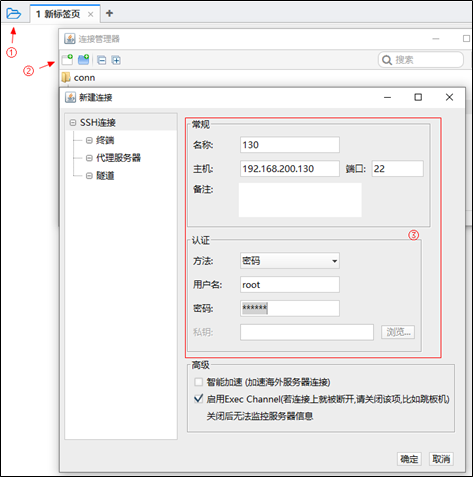

虚拟机导入
==========

Windows 10
-------

### 虚拟机镜像准备

1. 打开当天资料文件中的镜像，拷贝到一个地方，然后解压

2. 解压后，双击ContOS7-hmtt.vmx文件，前提是电脑上已经安装了VMware

3) -修改虚拟网络地址（NAT）

​		                                                        ①，选中VMware中的编辑

​		                                                        ②，选择虚拟网络编辑器

​		                                                        ③，找到NAT网卡，把网段改为200（当前挂载的虚拟机已固定ip地址）

4. 修改虚拟机的网络模式为NAT

5. 启动虚拟机，**用户名：root  密码：itcast**，当前虚拟机的ip已手动固定（静态IP）, 地址为：**192.168.200.130**

6. 使用FinalShell客户端链接

MacOS M1芯片
------------

