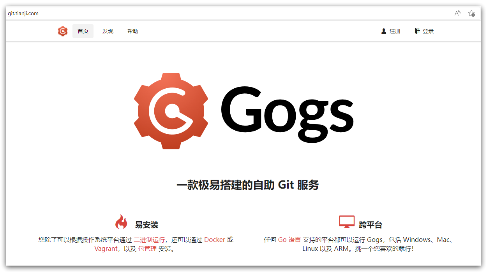
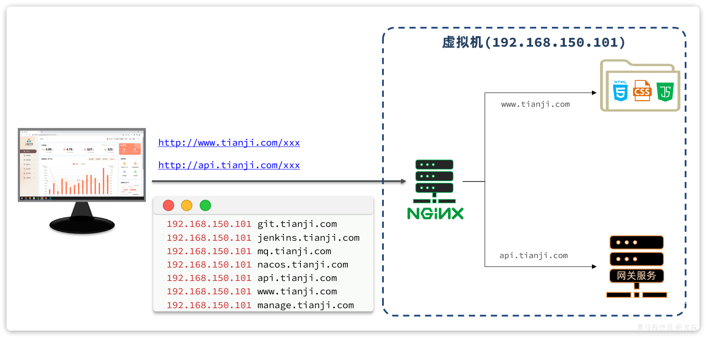
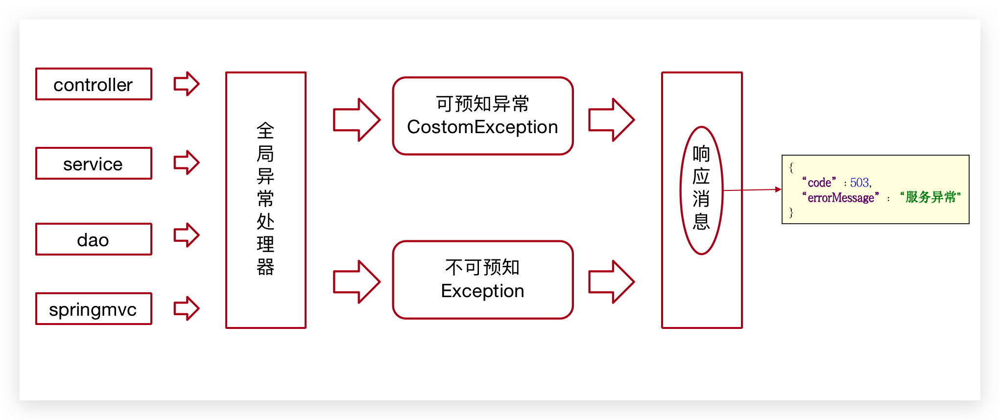
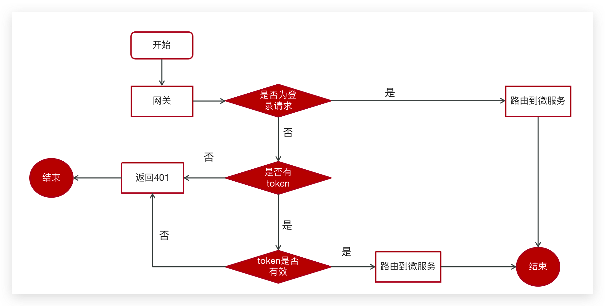

# 初识项目

[[toc]]


## 项目介绍


:::tip 🔖 能让你收获什么

- 综合知识的运用
  - SpringCloud
  - Nacos
  - Seata
  - Redis
  - Docker
  - Kafka
  - ElasticSearch
- 技术解决的方案
  - 分布式事务
  - 分布式任务调度
  - 延迟队列
  - 异步线程
  - 热数据统计
  - 评论系统
  - 点赞系统
- 编程思想的提升
  - 业务分析
  - 设计
  - 编码
  - 测试
  - 部署

:::


**项目课程大纲**


<br/>

### 项目概述

随着智能手机的普及，人们更加习惯于通过手机来看新闻。由于生活节奏的加快，很多人只能利用碎片时间来获取信息，因此，对于移动资讯客户端的需求也越来越高。黑马头条项目正是在这样背景下开发出来。黑马头条项目采用当下火热的微服务+大数据技术架构实现。本项目主要着手于获取最新最热新闻资讯，通过大数据分析用户喜好精确推送咨询新闻


<br/>

### 项目术语


<br/>

### 业务说明


项目演示地址：

- 平台管理：[http://heima-admin-java.research.itcast.cn](http://heima-admin-java.research.itcast.cn/)

- 自媒体：[http://heime-media-java.research.itcast.cn ](http://heime-media-java.research.itcast.cn/)

- app端：[http://heima-app-java.research.itcast.cn](http://heima-app-java.research.itcast.cn/)

平台管理与自媒体为PC端，用电脑浏览器打开即可。

<br/>

其中app端为移动端，打开方式有两种：

- 谷歌浏览器打开，调成移动端模式

- 手机浏览器打开或扫描右侧二维码

<br/>


### 技术栈


- Spring-Cloud-Gateway : 微服务之前架设的网关服务，实现服务注册中的API请求路由，以及控制流速控制和熔断处理都是常用的架构手段，而这些功能Gateway天然支持
- 运用Spring Boot快速开发框架，构建项目工程；并结合Spring Cloud全家桶技术，实现后端个人中心、自媒体、管理中心等微服务。
- 运用Spring Cloud Alibaba Nacos作为项目中的注册中心和配置中心
- 运用mybatis-plus作为持久层提升开发效率
- 运用Kafka完成内部系统消息通知；与客户端系统消息通知；以及实时数据计算
- 运用Redis缓存技术，实现热数据的计算，提升系统性能指标
- 使用Mysql存储用户数据，以保证上层数据查询的高性能
- 使用Mongo存储用户热数据，以保证用户热数据高扩展和高性能指标
- 使用Minio作为静态资源存储器，在其上实现热静态资源缓存、淘汰等功能
- 运用Hbase技术，存储系统中的冷数据，保证系统数据的可靠性
- 运用ES搜索技术，对冷数据、文章数据建立索引，以保证冷数据、文章查询性能
- 运用AI技术，来完成系统自动化功能，以提升效率及节省成本。比如实名认证自动化
- PMD&P3C : 静态代码扫描工具，在项目中扫描项目代码，检查异常点、优化点、代码规范等，为开发团队提供规范统一，提升项目代码质量


## 工程搭建

### 开发模式

在企业开发中，微服务项目非常庞大，往往有十几个，甚至数十个，数百个微服务。而这些微服务也会交给不同的开发组去完成开发。你可能只参与其中的某几个微服务开发，那么问题来了：

如果我的微服务需要访问其它微服务怎么办？

难道说我需要把所有的微服务都部署到自己的电脑吗？

<br/>

很明显，这样做是不现实的。第一，不是所有的代码你都有访问的权限；第二，你的电脑可能无法运行这数十、数百的微服务。

<br/>

因此，企业往往会提供一个通用的公共开发、测试环境，在其中部署很多公共服务，以及其它团队开发好的、开发中的微服务。

而我们大多数情况下只在本地运行正在开发的微服务，此时我们就需要一些其它的测试手段：

- 单元测试：测试最小的可测试单元
- 集成测试：验证某些功能接口，是否能与其它微服务正确交互
- 组件测试：验证微服务组件
- 端对端联调：验证整个系统

<br/>

> **单元测试**

单元测试一般是在项目的test目录下自己编写的测试，可以针对具体到每一个方法的测试。

<br/>

> **集成测试**

接口开发完成后，可能需要调用其它微服务接口，此时可以调用开发环境中的其它微服务，测试接口功能是否正常工作。

<br/>

> **组件测试**

将自己团队开发的微服务部署到开发环境，作为一个微服务组件，与开发环境中的其它微服务联调，测试整个微服务是否正常工作。

<br/>

> **端对端测试**

在测试环境部署前端、后端微服务群，直接进行前后端的联调测试。

<br/>

当然，实际中我们可以把集成测试与组件测试合并，开发完成后直接与开发环境的其它微服务联调，测试服务工作状态。


### 导入虚拟机

为了模拟企业中的开发环境，我们利用虚拟机搭建了一套开发环境，其中部署了开发常用的组件：

<br/>

**服务组件**

- Nacos：服务注册与配置
- Seata：分布式事务系统
- XXL-JOB：分布式任务系统
- MySQL：数据库
- Redis：缓存库
- ELK：索引库
- Kafka：消息队列


<br/>

**持续集成**

- Gogs：Git私服，代码管理仓库
- Jenkins：自动部署与持续集成

<br/>

导入方式有三种，从简单到复杂，都能实现同样的效果

- 方式一：下载完整虚拟机并导入，参考文档[《虚拟机导入》](00-虚拟机导入.md)
- 方式二：下载基础 DockerCompose 文件，Docker镜像压缩包，数据压缩包，利用脚本一件部署。参考文档[《自定义部署》](00-自定义部署.md)
- 方式三：通过 Docker 启动脚本，对服务组件和持续集成功能进行部署和配置，虽然繁琐，但是能对环境部署有着清晰的认识。参考文档[《自定义服务》](00-自定义服务.md)

<br/>

**配置本机 Hosts**

为了模拟使用域名访问，我们需要在本地配置 Hosts

```sh
192.168.150.102 git.hmtt.com
192.168.150.102 jenkins.hmtt.com
192.168.150.102 mq.hmtt.com
192.168.150.102 nacos.hmtt.com
192.168.150.102 xxljob.hmtt.com
192.168.150.102 es.hmtt.com
192.168.150.102 api.hmtt.com
192.168.150.102 www.hmtt.com
192.168.150.102 manage.hmtt.com
```

:::warning 💡注意

- 在 Mac/Linux 系统中 hosts 文件目录为  `/etc/hosts`
- 在 Windows 系统中 hosts 文件目录为 `C:\WINDOWS\system32\drivers\etc`

:::


//todo

我们访问上述域名时，请求实际是发送到了虚拟机，而虚拟机中的Nginx会对这些域名做反向代理，这样我们就能请求到对应的组件了：


在浏览器中输入对应域名，即可查看到对应服务，例如Git私服地址：http://git.tianji.com



每个域名对应的服务列表如下：

| 名称             | 域名               | 账号         | 端口  |
| :--------------- | :----------------- | :----------- | :---- |
| Git私服          | git.tianji.com     | tjxt/123321  | 10880 |
| Jenkins持续集成  | jenkins.tianji.com | root/123     | 18080 |
| RabbitMQ         | mq.tianji.com      | tjxt/123321  | 15672 |
| Nacos控制台      | nacos.tianji.com   | nacos/nacos  | 8848  |
| xxl-job控制台    | xxljob.tianji.com  | admin/123456 | 8880  |
| ES的Kibana控制台 | es.tianji.com      | -            | 5601  |
| 微服务网关       | api.tianji.com     | -            | 10010 |
| 用户端入口       | www.tianji.com     | -            | 18081 |
| 管理端入口       | manage.tianji.com  | -            | 18082 |

同样，我们访问用户端或者管理端页面时，也会被Nginx反向代理：



当我们访问www.tianji.com时，请求会被代理到虚拟机中的` /usr/local/src/tj-portal`目录中的静态资源

当页面访问api.tianji.com时，请求会被代理到虚拟机中的网关服务。


### 项目部署

//todo


## 项目规范

熟悉项目的第一步是熟悉项目的结构、用到的技术、编码的一些规范等。

<br/>

### 项目结构

我们先来看看项目结构，目前企业微服务开发项目结构有两种模式：

- 1）项目下的每一个微服务，都创建为一个独立的Project，有独立的Git仓库，尽可能降低耦合
- 2）项目创建一个Project，项目下的每一个微服务都是一个Module，方便管理

方案一更适合于大型项目，架构更为复杂，管理和维护成本都比较高；

方案二更适合中小型项目，架构更为简单，管理和维护成本都比较低；

<br/>

天机学堂采用的正是第二种模式，结构如图


<br/>

**网关工程结构**


**服务工程结构**

todo


详细结构说明

```sh
heima-leadnews
├── heima-leadnews-basic
│   ├── heima-leadnews-minio
│   └── heima-leadnews-seata
├── heima-leadnews-common
├── heima-leadnews-feign-api
├── heima-leadnews-gateway
│   ├── heima-leadnews-admin-gateway
│   ├── heima-leadnews-app-gateway
│   └── heima-leadnews-wemedia-gateway
├── heima-leadnews-model
├── heima-leadnews-service
│   ├── heima-leadnews-admin
│   ├── heima-leadnews-article
│   ├── heima-leadnews-behavior
│   ├── heima-leadnews-comment
│   ├── heima-leadnews-schedule
│   ├── heima-leadnews-search
│   ├── heima-leadnews-user
│   └── heima-leadnews-wemedia
├── heima-leadnews-test
└── heima-leadnews-utils
```


### 熟悉项目

#### 实体类

在天机学堂项目中，所有实体类按照所处领域不同，划分为4种不同类型：

- DTO：数据传输对象，在客户端与服务端间传递数据，例如微服务之间的请求参数和返回值、前端提交的表单
- PO：持久层对象，与数据库表一一对应，作为查询数据库时的返回值
- VO：视图对象，返回给前端用于封装页面展示的数据
- QUERY：查询对象，一般是用于封装复杂查询条件

例如：todo


#### 依赖注入


#### 异常处理

全局异常方法



在项目运行过程中，或者业务代码流程中，可能会出现各种类型异常，为了加以区分，我们定义了一些枚举类型对应不同场景：

```java
public enum AppHttpCodeEnum {
    // 成功段0
    SUCCESS(200, "操作成功"),

    // 登录段1~50
    NEED_LOGIN(1, "需要登录后操作"),
    LOGIN_PASSWORD_ERROR(2, "密码错误"),

    // TOKEN50~100
    TOKEN_INVALID(50, "无效的TOKEN"),
    TOKEN_EXPIRE(51, "TOKEN已过期"),
    TOKEN_REQUIRE(52, "TOKEN是必须的"),

    // SIGN验签 100~120
    SIGN_INVALID(100, "无效的SIGN"),
    SIG_TIMEOUT(101, "SIGN已过期"),

    // 参数错误 500~1000
    PARAM_REQUIRE(500, "缺少参数"),
    PARAM_INVALID(501, "无效参数"),
    PARAM_IMAGE_FORMAT_ERROR(502, "图片格式有误"),
    SERVER_ERROR(503, "服务器内部错误"),

    // 数据错误 1000~2000
    DATA_EXIST(1000, "数据已经存在"),
    AP_USER_DATA_NOT_EXIST(1001, "ApUser数据不存在"),
    DATA_NOT_EXIST(1002, "数据不存在"),

    // 数据错误 3000~3500
    NO_OPERATOR_AUTH(3000, "无权限操作"),
    NEED_ADMIND(3001, "需要管理员权限"),
    MATERIASL_REFERENCE_FAIL(501, "素材引用失效"),
    DELETE_FILE_INVALID(501, "文件删除失败"),
    DELETE_NEWS_INVALID(501, "文章已经上架，不能删除"),
    ;

    int code;
    String errorMessage;

    AppHttpCodeEnum(int code, String errorMessage) {
        this.code = code;
        this.errorMessage = errorMessage;
    }

    public int getCode() {
        return code;
    }

    public String getErrorMessage() {
        return errorMessage;
    }
}
```

在开发业务的过程中，如果出现对应类型的问题，应该优先使用这些自定义异常。

<br/>

当微服务抛出这些异常时，需要一个统一的异常处理类，同样在 `heima-leadnews-common` 模块中定义了：

```java
@ControllerAdvice  //控制器增强类
@Slf4j
public class ExceptionCatch {

    /**
     * 处理不可控异常
     *
     * @param e
     * @return
     */
    @ExceptionHandler(Exception.class)
    @ResponseBody
    public ResponseResult exception(Exception e) {
        e.printStackTrace();
        log.error("catch exception:{}", e.getMessage());

        return ResponseResult.errorResult(AppHttpCodeEnum.SERVER_ERROR);
    }

    /**
     * 处理可控异常  自定义异常
     *
     * @param e
     * @return
     */
    @ExceptionHandler(CustomException.class)
    @ResponseBody
    public ResponseResult exception(CustomException e) {
        log.error("catch exception:{}", e);
        return ResponseResult.errorResult(e.getAppHttpCodeEnum());
    }
}

```


### 接口工具 

#### Postman

Postman是一款功能强大的网页调试与发送网页HTTP请求的Chrome插件。postman被500万开发者和超100,000家公司用于每月访问1.3亿个API。

官方网址：https://www.postman.com/

解压资料文件夹中的软件，安装即可


通常的接口测试查看请求和响应，下面是登录请求的测试


#### Swagger

前后分离开发：项目基于前后端分离的架构进行开发，前后端分离架构上总体上包括前端和服务器，通常是多人协作开发。


简介

Swagger 是一个规范和完整的框架，用于生成、描述、调用和可视化 RESTful 风格的 Web 服务(<https://swagger.io/>)。 它的主要作用是：

1. 使得前后端分离开发更加方便，有利于团队协作

2. 接口的文档在线自动生成，降低后端开发人员编写接口文档的负担

3. 功能测试

   Spring已经将Swagger纳入自身的标准，建立了Spring-swagger项目，现在叫Springfox。通过在项目中引入Springfox ，即可非常简单快捷的使用Swagger。

(2)SpringBoot集成Swagger

- 引入依赖,在heima-leadnews-model和heima-leadnews-common模块中引入该依赖

  ```xml
  <dependency>
      <groupId>io.springfox</groupId>
      <artifactId>springfox-swagger2</artifactId>
  </dependency>
  <dependency>
      <groupId>io.springfox</groupId>
      <artifactId>springfox-swagger-ui</artifactId>
  </dependency>
  ```

只需要在heima-leadnews-common中进行配置即可，因为其他微服务工程都直接或间接依赖即可。

- 在heima-leadnews-common工程中添加一个配置类

新增：com.heima.common.swagger.SwaggerConfiguration

```java
package com.heima.common.swagger;

import org.springframework.context.annotation.Bean;
import org.springframework.context.annotation.Configuration;
import springfox.documentation.builders.ApiInfoBuilder;
import springfox.documentation.builders.PathSelectors;
import springfox.documentation.builders.RequestHandlerSelectors;
import springfox.documentation.service.ApiInfo;
import springfox.documentation.service.Contact;
import springfox.documentation.spi.DocumentationType;
import springfox.documentation.spring.web.plugins.Docket;
import springfox.documentation.swagger2.annotations.EnableSwagger2;

@Configuration
@EnableSwagger2
public class SwaggerConfiguration {

   @Bean
   public Docket buildDocket() {
      return new Docket(DocumentationType.SWAGGER_2)
              .apiInfo(buildApiInfo())
              .select()
              // 要扫描的API(Controller)基础包
              .apis(RequestHandlerSelectors.basePackage("com.heima"))
              .paths(PathSelectors.any())
              .build();
   }

   private ApiInfo buildApiInfo() {
      Contact contact = new Contact("黑马程序员","","");
      return new ApiInfoBuilder()
              .title("黑马头条-平台管理API文档")
              .description("黑马头条后台api")
              .contact(contact)
              .version("1.0.0").build();
   }
}
```

在heima-leadnews-common模块中的resources目录中新增以下目录和文件

文件：resources/META-INF/Spring.factories

```java
org.springframework.boot.autoconfigure.EnableAutoConfiguration=\
  com.heima.common.swagger.SwaggerConfiguration
```

（3）Swagger常用注解

在Java类中添加Swagger的注解即可生成Swagger接口文档，常用Swagger注解如下：

​	@Api：修饰整个类，描述Controller的作用

​	@ApiOperation：描述一个类的一个方法，或者说一个接口

​	@ApiParam：单个参数的描述信息

​	@ApiModel：用对象来接收参数

​	@ApiModelProperty：用对象接收参数时，描述对象的一个字段

​	@ApiResponse：HTTP响应其中1个描述

​	@ApiResponses：HTTP响应整体描述

​	@ApiIgnore：使用该注解忽略这个API

​	@ApiError ：发生错误返回的信息

​	@ApiImplicitParam：一个请求参数

​	@ApiImplicitParams：多个请求参数的描述信息


@ApiImplicitParam属性：

| 属性         | 取值   | 作用                                          |
| ------------ | ------ | --------------------------------------------- |
| paramType    |        | 查询参数类型                                  |
|              | path   | 以地址的形式提交数据                          |
|              | query  | 直接跟参数完成自动映射赋值                    |
|              | body   | 以流的形式提交 仅支持POST                     |
|              | header | 参数在request headers 里边提交                |
|              | form   | 以form表单的形式提交 仅支持POST               |
| dataType     |        | 参数的数据类型 只作为标志说明，并没有实际验证 |
|              | Long   |                                               |
|              | String |                                               |
| name         |        | 接收参数名                                    |
| value        |        | 接收参数的意义描述                            |
| required     |        | 参数是否必填                                  |
|              | true   | 必填                                          |
|              | false  | 非必填                                        |
| defaultValue |        | 默认值                                        |


#### Knife4j

(1)简介

knife4j是为Java MVC框架集成Swagger生成Api文档的增强解决方案,前身是swagger-bootstrap-ui,取名kni4j是希望它能像一把匕首一样小巧,轻量,并且功能强悍!

gitee地址：https://gitee.com/xiaoym/knife4j

官方文档：https://doc.xiaominfo.com/

效果演示：http://knife4j.xiaominfo.com/doc.html

(2)核心功能

该UI增强包主要包括两大核心功能：文档说明 和 在线调试

- 文档说明：根据Swagger的规范说明，详细列出接口文档的说明，包括接口地址、类型、请求示例、请求参数、响应示例、响应参数、响应码等信息，使用swagger-bootstrap-ui能根据该文档说明，对该接口的使用情况一目了然。
- 在线调试：提供在线接口联调的强大功能，自动解析当前接口参数,同时包含表单验证，调用参数可返回接口响应内容、headers、Curl请求命令实例、响应时间、响应状态码等信息，帮助开发者在线调试，而不必通过其他测试工具测试接口是否正确,简介、强大。
- 个性化配置：通过个性化ui配置项，可自定义UI的相关显示信息
- 离线文档：根据标准规范，生成的在线markdown离线文档，开发者可以进行拷贝生成markdown接口文档，通过其他第三方markdown转换工具转换成html或pdf，这样也可以放弃swagger2markdown组件
- 接口排序：自1.8.5后，ui支持了接口排序功能，例如一个注册功能主要包含了多个步骤,可以根据swagger-bootstrap-ui提供的接口排序规则实现接口的排序，step化接口操作，方便其他开发者进行接口对接

(3)快速集成

- 在heima-leadnews-common模块中的`pom.xml`文件中引入`knife4j`的依赖,如下：

```xml
<dependency>
     <groupId>com.github.xiaoymin</groupId>
     <artifactId>knife4j-spring-boot-starter</artifactId>
</dependency>
```

- 创建Swagger配置文件

在heima-leadnews-common模块中新建配置类

新建Swagger的配置文件`SwaggerConfiguration.java`文件,创建springfox提供的Docket分组对象,代码如下：

```java
package com.heima.common.knife4j;

import com.github.xiaoymin.knife4j.spring.annotations.EnableKnife4j;
import org.springframework.context.annotation.Bean;
import org.springframework.context.annotation.Configuration;
import org.springframework.context.annotation.Import;
import springfox.bean.validators.configuration.BeanValidatorPluginsConfiguration;
import springfox.documentation.builders.ApiInfoBuilder;
import springfox.documentation.builders.PathSelectors;
import springfox.documentation.builders.RequestHandlerSelectors;
import springfox.documentation.service.ApiInfo;
import springfox.documentation.spi.DocumentationType;
import springfox.documentation.spring.web.plugins.Docket;
import springfox.documentation.swagger2.annotations.EnableSwagger2;

@Configuration
@EnableSwagger2
@EnableKnife4j
@Import(BeanValidatorPluginsConfiguration.class)
public class Swagger2Configuration {

    @Bean(value = "defaultApi2")
    public Docket defaultApi2() {
        Docket docket=new Docket(DocumentationType.SWAGGER_2)
                .apiInfo(apiInfo())
                //分组名称
                .groupName("1.0")
                .select()
                //这里指定Controller扫描包路径
                .apis(RequestHandlerSelectors.basePackage("com.heima"))
                .paths(PathSelectors.any())
                .build();
        return docket;
    }
    private ApiInfo apiInfo() {
        return new ApiInfoBuilder()
                .title("黑马头条API文档")
                .description("黑马头条API文档")
                .version("1.0")
                .build();
    }
}
```

以上有两个注解需要特别说明，如下表：

| 注解              | 说明                                                         |
| ----------------- | ------------------------------------------------------------ |
| `@EnableSwagger2` | 该注解是Springfox-swagger框架提供的使用Swagger注解，该注解必须加 |
| `@EnableKnife4j`  | 该注解是`knife4j`提供的增强注解,Ui提供了例如动态参数、参数过滤、接口排序等增强功能,如果你想使用这些增强功能就必须加该注解，否则可以不用加 |

- 添加配置

在Spring.factories中新增配置

```java
org.springframework.boot.autoconfigure.EnableAutoConfiguration=\
  com.heima.common.exception.ExceptionCatch,\
  com.heima.common.knife4j.Swagger2Configuration, \
  com.heima.common.swagger.SwaggerConfiguration
```

- 访问

在浏览器输入地址：http://127.0.0.1:51801/doc.html


### 配置文件

配置文件提示


### 请求链路


### 阅读源码


### 远程调试


### 分支管理

一般我们不建议大家直接在Dev分支直接修改代码。在企业中都有一套分支管理机制，称为GitFlow，大概如图所示：


说明：

- **Master**：主分支，用于正式发布的分支。不可直接基于该分支提交。只有经过严格审核测试后的Develop或Hotfix分支可以合并到master
- **Develop**：开发分支，从Master创建得来。功能开发的基础分支。
- **Feature**：功能分支，从Develop分支创建得来。开发测试完成后会合并到Develop分支。
- **Release**：预发布分支，当Develop上积累了一定的功能特性后，从Develop分支创建一个Release分支，做一些发布前的准备工作，不可开发功能。最终合并到Master分支和Develop分支。
- **Hotfix**：热修复分支，当Master出现紧急BUG时，基于Master临时创建的分支，修复完成后合并到Develop和Master分支。

在咱们项目中，master分支用来给大家提供完整版本代码了，而lesson-init分支作为初始化分支。因此一般不使用master分支，而是把lesson-init当做master分支来用。开发用的dev分支就等于GitFlow中的Develop分支。

因此，这里建议大家在dev分支基础上创建一个Hotfix分支，用以修改BUG，可以通过命令来创建该分支：

```sh
git checkout -b hotfix-delete-order-error
```


### 测试部署


## 用户登录

### 需求分析


- 用户点击**开始使用**

  登录后的用户权限较大，可以查看，也可以操作（点赞，关注，评论）

- 用户点击**不登录，先看看**

  游客只有查看的权限


### 数据结构

关于app端用户相关的内容较多，可以单独设置一个库 leadnews_user


登录需要用到的是ap_user表，表结构如下：


执行 leadnews_user 的 SQL 脚本

```sql
CREATE DATABASE IF NOT EXISTS leadnews_user DEFAULT CHARACTER SET utf8mb4 COLLATE utf8mb4_unicode_ci;
USE leadnews_user;
SET NAMES utf8;


SET FOREIGN_KEY_CHECKS=0;

-- ----------------------------
-- Table structure for ap_user
-- ----------------------------
DROP TABLE IF EXISTS `ap_user`;
CREATE TABLE `ap_user` (
  `id` int(11) unsigned NOT NULL AUTO_INCREMENT COMMENT '主键',
  `salt` varchar(32) COLLATE utf8mb4_unicode_ci DEFAULT NULL COMMENT '密码、通信等加密盐',
  `name` varchar(20) COLLATE utf8mb4_unicode_ci DEFAULT NULL COMMENT '用户名',
  `password` varchar(32) COLLATE utf8mb4_unicode_ci DEFAULT NULL COMMENT '密码,md5加密',
  `phone` varchar(11) COLLATE utf8mb4_unicode_ci DEFAULT NULL COMMENT '手机号',
  `image` varchar(255) COLLATE utf8mb4_unicode_ci DEFAULT NULL COMMENT '头像',
  `sex` tinyint(1) unsigned DEFAULT NULL COMMENT '性别：0 男 ；1 女；未知',
  `is_certification` tinyint(1) unsigned DEFAULT NULL COMMENT '是否认证：0 未；1 是',
  `is_identity_authentication` tinyint(1) DEFAULT NULL COMMENT '是否身份认证',
  `status` tinyint(1) unsigned DEFAULT NULL COMMENT '状态：0 正常；1锁定',
  `flag` tinyint(1) unsigned DEFAULT NULL COMMENT '用户类型：0 普通用户；1 自媒体人；2 大V',
  `created_time` datetime DEFAULT NULL COMMENT '注册时间',
  PRIMARY KEY (`id`) USING BTREE
) ENGINE=InnoDB AUTO_INCREMENT=7 DEFAULT CHARSET=utf8mb4 COLLATE=utf8mb4_unicode_ci ROW_FORMAT=DYNAMIC COMMENT='APP用户信息表';

-- ----------------------------
-- Records of ap_user
-- ----------------------------
INSERT INTO `ap_user` VALUES ('1', 'abc', 'zhangsan', 'abc', '13511223453', null, '1', null, null, '1', '1', '2020-03-19 23:22:07');
INSERT INTO `ap_user` VALUES ('2', 'abc', 'lisi', 'abc', '13511223454', '', '1', null, null, '1', '1', '2020-03-19 23:22:07');
INSERT INTO `ap_user` VALUES ('3', 'sdsa', 'wangwu', 'wangwu', '13511223455', null, null, null, null, null, '1', null);
INSERT INTO `ap_user` VALUES ('4', '123abc', 'admin', '81e158e10201b6d7aee6e35eaf744796', '13511223456', null, '1', null, null, '1', '1', '2020-03-30 16:36:32');
INSERT INTO `ap_user` VALUES ('5', '123', 'suwukong', 'suwukong', '13511223458', null, '1', null, null, '1', '1', '2020-08-01 11:09:57');
INSERT INTO `ap_user` VALUES ('6', null, null, null, null, null, null, null, null, null, null, null);

-- ----------------------------
-- Table structure for ap_user_fan
-- ----------------------------
DROP TABLE IF EXISTS `ap_user_fan`;
CREATE TABLE `ap_user_fan` (
  `id` int(11) unsigned NOT NULL AUTO_INCREMENT COMMENT '主键',
  `user_id` int(11) unsigned DEFAULT NULL COMMENT '用户ID',
  `fans_id` int(11) unsigned DEFAULT NULL COMMENT '粉丝ID',
  `fans_name` varchar(20) COLLATE utf8mb4_unicode_ci DEFAULT NULL COMMENT '粉丝昵称',
  `level` tinyint(1) unsigned DEFAULT NULL COMMENT '粉丝忠实度：0 正常；1 潜力股；2 勇士；3 铁杆；4 老铁',
  `created_time` datetime DEFAULT NULL COMMENT '创建时间',
  `is_display` tinyint(1) unsigned DEFAULT NULL COMMENT '是否可见我动态',
  `is_shield_letter` tinyint(1) unsigned DEFAULT NULL COMMENT '是否屏蔽私信',
  `is_shield_comment` tinyint(1) unsigned DEFAULT NULL COMMENT '是否屏蔽评论',
  PRIMARY KEY (`id`) USING BTREE
) ENGINE=InnoDB DEFAULT CHARSET=utf8mb4 COLLATE=utf8mb4_unicode_ci ROW_FORMAT=DYNAMIC COMMENT='APP用户粉丝信息表';

-- ----------------------------
-- Records of ap_user_fan
-- ----------------------------

-- ----------------------------
-- Table structure for ap_user_follow
-- ----------------------------
DROP TABLE IF EXISTS `ap_user_follow`;
CREATE TABLE `ap_user_follow` (
  `id` int(11) unsigned NOT NULL AUTO_INCREMENT COMMENT '主键',
  `user_id` int(11) unsigned DEFAULT NULL COMMENT '用户ID',
  `follow_id` int(11) unsigned DEFAULT NULL COMMENT '关注作者ID',
  `follow_name` varchar(20) COLLATE utf8mb4_unicode_ci DEFAULT NULL COMMENT '粉丝昵称',
  `level` tinyint(1) unsigned DEFAULT NULL COMMENT '关注度：0 偶尔感兴趣；1 一般；2 经常；3 高度',
  `is_notice` tinyint(1) unsigned DEFAULT NULL COMMENT '是否动态通知',
  `created_time` datetime DEFAULT NULL COMMENT '创建时间',
  PRIMARY KEY (`id`) USING BTREE
) ENGINE=InnoDB DEFAULT CHARSET=utf8mb4 COLLATE=utf8mb4_unicode_ci ROW_FORMAT=DYNAMIC COMMENT='APP用户关注信息表';

-- ----------------------------
-- Records of ap_user_follow
-- ----------------------------

-- ----------------------------
-- Table structure for ap_user_realname
-- ----------------------------
DROP TABLE IF EXISTS `ap_user_realname`;
CREATE TABLE `ap_user_realname` (
  `id` int(11) unsigned NOT NULL AUTO_INCREMENT COMMENT '主键',
  `user_id` int(11) unsigned DEFAULT NULL COMMENT '账号ID',
  `name` varchar(20) CHARACTER SET utf8mb4 DEFAULT NULL COMMENT '用户名称',
  `idno` varchar(20) COLLATE utf8mb4_unicode_ci DEFAULT NULL COMMENT '资源名称',
  `font_image` varchar(100) COLLATE utf8mb4_unicode_ci DEFAULT NULL COMMENT '正面照片',
  `back_image` varchar(100) COLLATE utf8mb4_unicode_ci DEFAULT NULL COMMENT '背面照片',
  `hold_image` varchar(100) COLLATE utf8mb4_unicode_ci DEFAULT NULL COMMENT '手持照片',
  `live_image` varchar(255) COLLATE utf8mb4_unicode_ci DEFAULT NULL COMMENT '活体照片',
  `status` tinyint(1) unsigned DEFAULT NULL COMMENT '状态：0 创建中；1 待审核；2 审核失败；9 审核通过',
  `reason` varchar(50) COLLATE utf8mb4_unicode_ci DEFAULT NULL COMMENT '拒绝原因',
  `created_time` datetime DEFAULT NULL COMMENT '创建时间',
  `submited_time` datetime DEFAULT NULL COMMENT '提交时间',
  `updated_time` datetime DEFAULT NULL COMMENT '更新时间',
  PRIMARY KEY (`id`) USING BTREE
) ENGINE=InnoDB AUTO_INCREMENT=6 DEFAULT CHARSET=utf8mb4 COLLATE=utf8mb4_unicode_ci ROW_FORMAT=DYNAMIC COMMENT='APP实名认证信息表';

-- ----------------------------
-- Records of ap_user_realname
-- ----------------------------
INSERT INTO `ap_user_realname` VALUES ('1', '1', 'zhangsan', '512335455602781278', 'http://161.189.111.227/group1/M00/00/00/rBFwgF9bbHSAQlqFAAXIZNzAq9E126.jpg', 'http://161.189.111.227/group1/M00/00/00/rBFwgF9bbF6AR16RAAZB2e1EsOg460.jpg', 'http://161.189.111.227/group1/M00/00/00/rBFwgF9bbDeAH2qoAAbD_WiUJfk745.jpg', 'http://161.189.111.227/group1/M00/00/00/rBFwgF9ba9qANVEdAAS25KJlEVE291.jpg', '9', '', '2019-07-30 14:34:28', '2019-07-30 14:34:30', '2019-07-12 06:48:04');
INSERT INTO `ap_user_realname` VALUES ('2', '2', 'lisi', '512335455602781279', 'http://161.189.111.227/group1/M00/00/00/rBFwgF9bbHSAQlqFAAXIZNzAq9E126.jpg', 'http://161.189.111.227/group1/M00/00/00/rBFwgF9bbF6AR16RAAZB2e1EsOg460.jpg', 'http://161.189.111.227/group1/M00/00/00/rBFwgF9bbDeAH2qoAAbD_WiUJfk745.jpg', 'http://161.189.111.227/group1/M00/00/00/rBFwgF9ba9qANVEdAAS25KJlEVE291.jpg', '1', '', '2019-07-11 17:21:18', '2019-07-11 17:21:20', '2019-07-12 06:48:04');
INSERT INTO `ap_user_realname` VALUES ('3', '3', 'wangwu6666', '512335455602781276', 'http://161.189.111.227/group1/M00/00/00/rBFwgF9bbHSAQlqFAAXIZNzAq9E126.jpg', 'http://161.189.111.227/group1/M00/00/00/rBFwgF9bbF6AR16RAAZB2e1EsOg460.jpg', 'http://161.189.111.227/group1/M00/00/00/rBFwgF9bbDeAH2qoAAbD_WiUJfk745.jpg', 'http://161.189.111.227/group1/M00/00/00/rBFwgF9ba9qANVEdAAS25KJlEVE291.jpg', '9', '', '2019-07-11 17:21:18', '2019-07-11 17:21:20', '2019-07-12 06:48:04');
INSERT INTO `ap_user_realname` VALUES ('5', '5', 'suwukong', '512335455602781279', 'http://161.189.111.227/group1/M00/00/00/rBFwgF9bbHSAQlqFAAXIZNzAq9E126.jpg', 'http://161.189.111.227/group1/M00/00/00/rBFwgF9bbF6AR16RAAZB2e1EsOg460.jpg', 'http://161.189.111.227/group1/M00/00/00/rBFwgF9bbDeAH2qoAAbD_WiUJfk745.jpg', 'http://161.189.111.227/group1/M00/00/00/rBFwgF9ba9qANVEdAAS25KJlEVE291.jpg', '1', '', '2020-08-01 11:10:31', '2020-08-01 11:10:34', '2020-08-01 11:10:36');
```

<br/>

### 服务搭建

`heima-leadnews-service` 依赖信息说明


<br/>

在 `heima-leadnews-service` 下创建工程 `heima-leadnews-user`


在天机学堂项目中，我们使用的是Mybatis作为持久层框架，并且引入了MybatisPlus来简化开发。因此，在创建据库以后，就需要创建对应的实体类、mapper、service等。

这些代码格式固定，编写起来又比较费时。好在IDEA中提供了一个MP插件，可以生成这些重复代码：


安装完成以后，我们在菜单栏的 Other 下的 Config Database 中配置一下数据库地址：


然后在 Other 下的 Code Generator下设置项目名称，包名称


点击 `code generator`  自动生成代码

<div align="center">
  
</div>

然后是配置文件：`bootstrap.yml`

```YAML
server:
  port: 51801
spring:
  profiles:
    active: dev
  application:
    name: leadnews-user
  cloud:
    nacos:
      config:
        file-extension: yaml
        shared-configs:
          - data-id: shared-mybatis.yaml

hmtt:
  jdbc:
    database: leadnews_user

# 设置Mapper接口所对应的XML文件位置，如果你在Mapper接口中有自定义方法，需要进行该配置
mybatis-plus:
  mapper-locations: classpath*:mapper/*.xml
  # 设置别名包扫描路径，通过该属性可以给包中的类注册别名
  type-aliases-package: com.heima.model.user.pojos
```

接着是`bootstrap-dev.yml`:

```YAML
spring:
  cloud:
    nacos:
      server-addr: 192.168.150.102:8848
      discovery:
        namespace: dbf4a6ae-0292-4e73-ae38-0df835b183c1
        group: DEFAULT_GROUP
        ip: 192.168.150.102
logging:
  level:
    com.heima: debug
```

然后是`bootstrap-local.yml`:

```YAML
spring:
  cloud:
    nacos:
      server-addr: 192.168.150.102:8848
      discovery:
        namespace: dbf4a6ae-0292-4e73-ae38-0df835b183c1
        group: DEFAULT_GROUP
        ip: 192.168.150.1
logging:
  level:
    com.heima: debug
```

新建一个启动类：

```Java
package com.heima.user;

import org.mybatis.spring.annotation.MapperScan;
import org.springframework.boot.SpringApplication;
import org.springframework.boot.autoconfigure.SpringBootApplication;
import org.springframework.cloud.client.discovery.EnableDiscoveryClient;


@SpringBootApplication
@EnableDiscoveryClient
@MapperScan("com.heima.user.mapper")
public class UserApplication {

    public static void main(String[] args) {
        SpringApplication.run(UserApplication.class,args);
    }
}
```

将 pojos 下的实体类移动到 `heima-leadnews-model` 下，最终目录结构如下

<div align="center">
  
</div>

为了方便本地启动测试，最后给 `heima-leadnews-user` 添加一个SpringBoot启动项：


### 接口定义

|          | **说明**                 |
| -------- | ------------------------ |
| 接口路径 | /api/v1/login/login_auth |
| 请求方式 | POST                     |
| 参数     | LoginDto                 |
| 响应结果 | ResponseResult           |

```java
@Data
public class LoginDto {

    /**
     * 手机号
     */
    @ApiModelProperty(value="手机号",required = true)
    private String phone;

    /**
     * 密码
     */
    @ApiModelProperty(value="密码",required = true)
    private String password;
}
```


### 思路分析

MD5是不可逆加密，但是 MD5 相同的密码每次加密都一样，不太安全，可以暴力破解。所以在 MD5 的基础上手动加盐 （salt） 处理。

**注册**


<br/>

**登录**


具体流程


1. 用户输入了用户名和密码进行登录，校验成功后返回jwt(基于当前用户的id生成)
2. 用户游客登录，生成jwt返回(基于默认值0生成)


### 具体实现

:::details

在 `heima-leadnews-model` 下创建 `user.dtos` 包

```java
package com.heima.model.user.dtos;

import io.swagger.annotations.ApiModelProperty;
import lombok.Data;

@Data
public class LoginDto {

    /**
     * 手机号
     */
    @ApiModelProperty(value="手机号",required = true)
    private String phone;

    /**
     * 密码
     */
    @ApiModelProperty(value="密码",required = true)
    private String password;
}
```

<br/>

**控制层**

```java
package com.heima.user.controller.v1;

import com.heima.model.common.dtos.ResponseResult;
import com.heima.model.user.dtos.LoginDto;
import com.heima.user.service.ApUserService;
import org.springframework.beans.factory.annotation.Autowired;
import org.springframework.web.bind.annotation.PostMapping;
import org.springframework.web.bind.annotation.RequestBody;
import org.springframework.web.bind.annotation.RequestMapping;
import org.springframework.web.bind.annotation.RestController;

@RestController
@RequestMapping("/api/v1/login")
public class ApUserLoginController {

    @Autowired
    private ApUserService apUserService;

    @PostMapping("/login_auth")
    public ResponseResult login(@RequestBody LoginDto dto) {
        return apUserService.login(dto);
    }
}
```

<br/>

**业务层**

```java
package com.heima.user.service;

import com.baomidou.mybatisplus.extension.service.IService;
import com.heima.model.common.dtos.ResponseResult;
import com.heima.model.user.dtos.LoginDto;
import com.heima.model.user.pojos.ApUser;

public interface ApUserService extends IService<ApUser>{

    /**
     * app端登录
     * @param dto
     * @return
     */
    public ResponseResult login(LoginDto dto);
   
}
```

<br/>

**实现类**

```java
package com.heima.user.service.impl;

import com.baomidou.mybatisplus.core.toolkit.Wrappers;
import com.baomidou.mybatisplus.extension.service.impl.ServiceImpl;
import com.heima.model.common.dtos.ResponseResult;
import com.heima.model.common.enums.AppHttpCodeEnum;
import com.heima.model.user.dtos.LoginDto;
import com.heima.model.user.pojos.ApUser;
import com.heima.user.mapper.ApUserMapper;
import com.heima.user.service.IApUserService;
import com.heima.utils.common.AppJwtUtil;
import org.apache.commons.lang3.StringUtils;
import org.springframework.stereotype.Service;
import org.springframework.util.DigestUtils;

import java.util.HashMap;
import java.util.Map;


@Service
public class ApUserServiceImpl extends ServiceImpl<ApUserMapper, ApUser> implements IApUserService {

    @Override
    public ResponseResult login(LoginDto dto) {

        //1.正常登录（手机号+密码登录）
        if (!StringUtils.isBlank(dto.getPhone()) && !StringUtils.isBlank(dto.getPassword())) {
            //1.1查询用户
            ApUser apUser = getOne(Wrappers.<ApUser>lambdaQuery().eq(ApUser::getPhone, dto.getPhone()));
            if (apUser == null) {
                return ResponseResult.errorResult(AppHttpCodeEnum.DATA_NOT_EXIST,"用户不存在");
            }

            //1.2 比对密码
            String salt = apUser.getSalt();
            String pswd = dto.getPassword();
            pswd = DigestUtils.md5DigestAsHex((pswd + salt).getBytes());
            if (!pswd.equals(apUser.getPassword())) {
                return ResponseResult.errorResult(AppHttpCodeEnum.LOGIN_PASSWORD_ERROR);
            }
            //1.3 返回数据  jwt
            Map<String, Object> map = new HashMap<>();
            map.put("token", AppJwtUtil.getToken(apUser.getId().longValue()));
            apUser.setSalt("");
            apUser.setPassword("");
            map.put("user", apUser);
            return ResponseResult.okResult(map);
        } else {
            //2.游客  同样返回token  id = 0
            Map<String, Object> map = new HashMap<>();
            map.put("token", AppJwtUtil.getToken(0l));
            return ResponseResult.okResult(map);
        }
    }
}
```

:::

<br/>


## 网关服务

网关工作流程


项目中网关的服务工程结构


<br/>

### 创建网关服务

项目中网关的服务工程在 `heima-leadnews-gateway` 导入以下依赖

**pom文件**

```xml
<dependencies>
    <dependency>
        <groupId>org.springframework.cloud</groupId>
        <artifactId>spring-cloud-starter-gateway</artifactId>
    </dependency>
    <dependency>
        <groupId>com.alibaba.cloud</groupId>
        <artifactId>spring-cloud-starter-alibaba-nacos-discovery</artifactId>
    </dependency>
    <dependency>
        <groupId>com.alibaba.cloud</groupId>
        <artifactId>spring-cloud-starter-alibaba-nacos-config</artifactId>
    </dependency>
    <dependency>
        <groupId>io.jsonwebtoken</groupId>
        <artifactId>jjwt</artifactId>
    </dependency>
    <dependency>
        <groupId>javax.xml.bind</groupId>
        <artifactId>jaxb-api</artifactId>
        <version>2.3.0</version>
    </dependency>
    <dependency>
        <groupId>com.sun.xml.bind</groupId>
        <artifactId>jaxb-impl</artifactId>
        <version>2.3.0</version>
    </dependency>
    <dependency>
        <groupId>com.sun.xml.bind</groupId>
        <artifactId>jaxb-core</artifactId>
        <version>2.3.0</version>
    </dependency>
    <dependency>
        <groupId>javax.activation</groupId>
        <artifactId>activation</artifactId>
        <version>1.1.1</version>
    </dependency>
</dependencies>
```

<br/>

在 `heima-leadnews-gateway` 下创建 `heima-leadnews-app-gateway` 微服务


**引导类**

```java
package com.heima.app.gateway;

import org.springframework.boot.SpringApplication;
import org.springframework.boot.autoconfigure.SpringBootApplication;
import org.springframework.cloud.client.discovery.EnableDiscoveryClient;

@SpringBootApplication
@EnableDiscoveryClient  //开启注册中心
public class AppGatewayApplication {

    public static void main(String[] args) {
        SpringApplication.run(AppGatewayApplication.class,args);
    }
}
```

<br/>

**配置内容**

bootstrap.yml

```yaml
server:
  port: 51601
  tomcat:
    uri-encoding: UTF-8
spring:
  profiles:
    active: dev
  application:
    name: leadnews-app-gateway
  cloud:
    gateway:
      globalcors:
        add-to-simple-url-handler-mapping: true
        corsConfigurations:
          '[/**]':
            allowedHeaders: "*"
            allowedOrigins: "*"
            allowedMethods:
              - GET
              - POST
              - DELETE
              - PUT
              - OPTION
      routes:
        # 用户微服务
        - id: user
          uri: lb://leadnews-user
          predicates:
            - Path=/user/**
          filters:
            - StripPrefix= 1
```

bootstrap-dev.yml

```yml
spring:
  cloud:
    nacos:
      server-addr: 192.168.150.102:8848
      discovery:
        namespace: dbf4a6ae-0292-4e73-ae38-0df835b183c1
        group: DEFAULT_GROUP
        ip: 192.168.150.102
logging:
  level:
    com.heima: debug
```

bootstrap-local.yml

```yml
spring:
  cloud:
    nacos:
      server-addr: 192.168.150.102:8848
      discovery:
        namespace: dbf4a6ae-0292-4e73-ae38-0df835b183c1
        group: DEFAULT_GROUP
        ip: 192.168.150.1
logging:
  level:
    com.heima: debug
```

环境搭建完成以后，启动项目网关和用户两个服务，使用postman进行测试

请求地址：http://localhost:51601/user/api/v1/login/login_auth

<br/>

### 实现全局过滤器

**具体流程**



**思路分析**

1. 用户进入网关开始登陆，网关过滤器进行判断，如果是登录，则路由到后台管理微服务进行登录
2. 用户登录成功，后台管理微服务签发 JWT TOKEN 信息返回给用户
3. 用户再次进入网关开始访问，网关过滤器接收用户携带的 TOKEN
4. 网关过滤器解析 TOKEN ，判断是否有权限，如果有，则放行，如果没有则返回未认证错误

<br/>

:::details 具体实现

第一：在认证过滤器中需要用到 JWT 的解析，所以需要把 `heima-leadnews-utils` 的 AppJwtUtil 工具类拷贝一份到网关微服务

第二：在网关微服务中新建全局过滤器

```java
package com.heima.app.gateway.filter;


import com.heima.app.gateway.util.AppJwtUtil;
import io.jsonwebtoken.Claims;
import lombok.extern.slf4j.Slf4j;
import org.apache.commons.lang.StringUtils;
import org.springframework.cloud.gateway.filter.GatewayFilterChain;
import org.springframework.cloud.gateway.filter.GlobalFilter;
import org.springframework.core.Ordered;
import org.springframework.http.HttpStatus;
import org.springframework.http.server.reactive.ServerHttpRequest;
import org.springframework.http.server.reactive.ServerHttpResponse;
import org.springframework.stereotype.Component;
import org.springframework.web.server.ServerWebExchange;
import reactor.core.publisher.Mono;

@Component
@Slf4j
public class AuthorizeFilter implements Ordered, GlobalFilter {
    @Override
    public Mono<Void> filter(ServerWebExchange exchange, GatewayFilterChain chain) {
        //1.获取request和response对象
        ServerHttpRequest request = exchange.getRequest();
        ServerHttpResponse response = exchange.getResponse();

        //2.判断是否是登录
        if(request.getURI().getPath().contains("/login")){
            //放行
            return chain.filter(exchange);
        }


        //3.获取token
        String token = request.getHeaders().getFirst("token");

        //4.判断token是否存在
        if(StringUtils.isBlank(token)){
            response.setStatusCode(HttpStatus.UNAUTHORIZED);
            return response.setComplete();
        }

        //5.判断token是否有效
        try {
            Claims claimsBody = AppJwtUtil.getClaimsBody(token);
            //是否是过期
            int result = AppJwtUtil.verifyToken(claimsBody);
            if(result == 1 || result  == 2){
                response.setStatusCode(HttpStatus.UNAUTHORIZED);
                return response.setComplete();
            }
        }catch (Exception e){
            e.printStackTrace();
            response.setStatusCode(HttpStatus.UNAUTHORIZED);
            return response.setComplete();
        }

        //6.放行
        return chain.filter(exchange);
    }

    /**
     * 优先级设置  值越小  优先级越高
     * @return
     */
    @Override
    public int getOrder() {
        return 0;
    }
}
```

:::

<br/>

**实现测试**

在本地启动

启动user服务，继续访问其他微服务，会提示需要认证才能访问，这个时候需要在heads中设置设置token才能正常访问。
