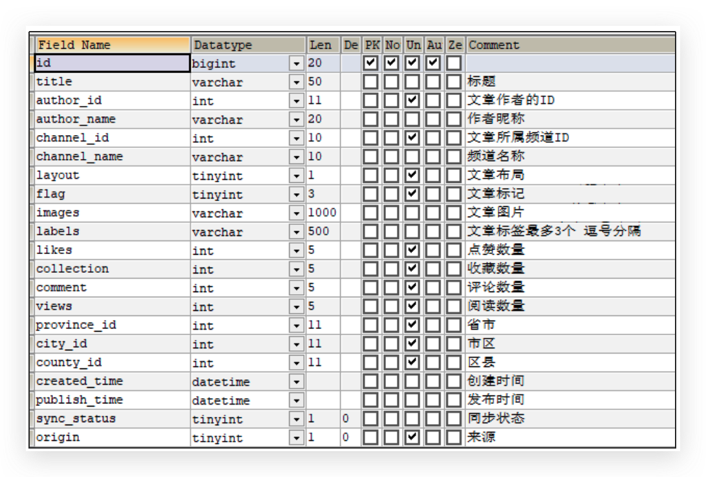
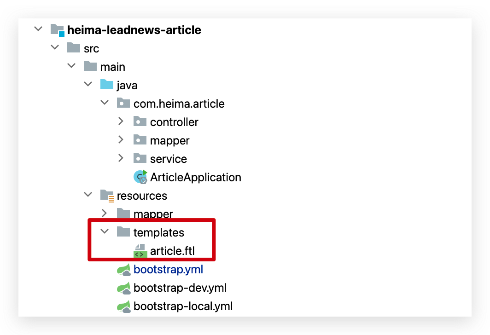

Day02-文章查看
==============

[[toc]]

## 学习内容


今日内容


文章列表


文章详情


## 文章列表

### 需求分析

文章布局展示


### 数据结构


:::details   导入文章数据库

```sql
CREATE DATABASE IF NOT EXISTS leadnews_article DEFAULT CHARACTER SET utf8mb4 COLLATE utf8mb4_unicode_ci;
USE leadnews_article;
SET NAMES utf8;


SET FOREIGN_KEY_CHECKS=0;

-- ----------------------------
-- Table structure for ap_article
-- ----------------------------
DROP TABLE IF EXISTS `ap_article`;
CREATE TABLE `ap_article` (
  `id` bigint(20) unsigned NOT NULL AUTO_INCREMENT,
  `title` varchar(50) COLLATE utf8mb4_unicode_ci DEFAULT NULL COMMENT '标题',
  `author_id` int(11) unsigned DEFAULT NULL COMMENT '文章作者的ID',
  `author_name` varchar(20) COLLATE utf8mb4_unicode_ci DEFAULT NULL COMMENT '作者昵称',
  `channel_id` int(10) unsigned DEFAULT NULL COMMENT '文章所属频道ID',
  `channel_name` varchar(10) COLLATE utf8mb4_unicode_ci DEFAULT NULL COMMENT '频道名称',
  `layout` tinyint(1) unsigned DEFAULT NULL COMMENT '文章布局            0 无图文章            1 单图文章            2 多图文章',
  `flag` tinyint(3) unsigned DEFAULT NULL COMMENT '文章标记            0 普通文章            1 热点文章            2 置顶文章            3 精品文章            4 大V 文章',
  `images` varchar(1000) COLLATE utf8mb4_unicode_ci DEFAULT NULL COMMENT '文章图片            多张逗号分隔',
  `labels` varchar(500) COLLATE utf8mb4_unicode_ci DEFAULT NULL COMMENT '文章标签最多3个 逗号分隔',
  `likes` int(5) unsigned DEFAULT NULL COMMENT '点赞数量',
  `collection` int(5) unsigned DEFAULT NULL COMMENT '收藏数量',
  `comment` int(5) unsigned DEFAULT NULL COMMENT '评论数量',
  `views` int(5) unsigned DEFAULT NULL COMMENT '阅读数量',
  `province_id` int(11) unsigned DEFAULT NULL COMMENT '省市',
  `city_id` int(11) unsigned DEFAULT NULL COMMENT '市区',
  `county_id` int(11) unsigned DEFAULT NULL COMMENT '区县',
  `created_time` datetime DEFAULT NULL COMMENT '创建时间',
  `publish_time` datetime DEFAULT NULL COMMENT '发布时间',
  `sync_status` tinyint(1) DEFAULT '0' COMMENT '同步状态',
  `origin` tinyint(1) unsigned DEFAULT '0' COMMENT '来源',
  `static_url` varchar(150) COLLATE utf8mb4_unicode_ci DEFAULT NULL,
  PRIMARY KEY (`id`) USING BTREE
) ENGINE=InnoDB AUTO_INCREMENT=1383828014629179394 DEFAULT CHARSET=utf8mb4 COLLATE=utf8mb4_unicode_ci ROW_FORMAT=DYNAMIC COMMENT='文章信息表，存储已发布的文章';

-- ----------------------------
-- Records of ap_article
-- ----------------------------
INSERT INTO `ap_article` VALUES ('1302862387124125698', '什么是Java语言', '4', 'admin', '1', 'java', '1', null, 'group1/M00/00/00/wKjIgl9V2CqAZe18AAOoOOsvWPc041.png', null, null, null, null, null, null, null, null, '2020-09-07 14:52:54', '2020-09-07 14:56:18', '0', '0', null);
INSERT INTO `ap_article` VALUES ('1302864436297482242', 'Java语言跨平台原理', '4', 'admin', '1', 'java', '1', null, 'group1/M00/00/00/wKjIgl9V2n6AArZsAAGMmaPdt7w502.png', null, null, null, null, null, null, null, null, '2020-09-07 15:01:02', '2020-09-07 15:01:02', '0', '0', null);
INSERT INTO `ap_article` VALUES ('1302864730402078722', '我是一个测试标题', '4', 'admin', '1', 'java', '1', null, 'group1/M00/00/00/wKjIgl892wqAANwOAAJW8oQUlAc087.jpg', null, null, null, null, null, null, null, null, '2020-09-07 15:02:12', '2020-09-07 15:02:12', '0', '0', null);
INSERT INTO `ap_article` VALUES ('1302865008438296577', '过山车故障20名游客倒挂空中', '4', 'admin', '1', 'java', '3', null, 'group1/M00/00/00/wKjIgl892wqAANwOAAJW8oQUlAc087.jpg,group1/M00/00/00/wKjIgl892xmAG_yjAAB6OkkuJd4819.jpg,group1/M00/00/00/wKjIgl892wKAZLhtAASZUi49De0836.jpg', null, null, null, null, null, null, null, null, '2020-09-07 15:03:19', '2020-09-07 15:03:19', '0', '0', null);
INSERT INTO `ap_article` VALUES ('1302865306489733122', '武汉高校开学典礼万人歌唱祖国', '4', 'admin', '1', 'java', '3', null, 'group1/M00/00/00/wKjIgl892vuAXr_MAASCMYD0yzc919.jpg,group1/M00/00/00/wKjIgl892xGANV6qAABzWOH8KDY775.jpg,group1/M00/00/00/wKjIgl892wqAANwOAAJW8oQUlAc087.jpg', null, null, null, null, null, null, null, null, '2020-09-07 15:04:30', '2020-09-07 15:04:30', '0', '0', null);
INSERT INTO `ap_article` VALUES ('1302865474094120961', '天降铁球砸死女婴整栋楼被判赔', '4', 'admin', '1', 'java', '1', null, 'group1/M00/00/00/wKjIgl892tyAFc60AAMUNUuOKPA619.jpg', null, null, null, null, null, null, null, null, '2020-09-07 15:05:10', '2020-09-07 15:05:10', '0', '0', null);
INSERT INTO `ap_article` VALUES ('1302977178887004162', '央视曝光境外医疗豪华旅游套路', '4', 'admin', '1', 'java', '0', null, 'group1/M00/00/00/wKjIgl892wqAANwOAAJW8oQUlAc087.jpg', null, null, null, null, null, null, null, null, '2020-09-07 22:29:02', '2020-09-07 22:29:02', '0', '0', null);
INSERT INTO `ap_article` VALUES ('1302977458215067649', '10多名陌生人合力托举悬窗女童', '4', 'admin', '1', 'java', '1', null, 'group1/M00/00/00/wKjIgl892vOASiunAAGzs3UZ1Cg252.jpg', null, null, null, null, null, null, null, null, '2020-09-07 22:30:09', '2020-09-07 22:30:09', '0', '0', null);
INSERT INTO `ap_article` VALUES ('1302977558807060482', '杨澜回应一秒变脸', '4', 'admin', '1', 'java', '1', null, 'group1/M00/00/00/wKjIgl892wKAZLhtAASZUi49De0836.jpg', null, null, null, null, null, null, null, null, '2020-09-07 22:30:33', '2020-09-07 22:30:33', '0', '0', null);
INSERT INTO `ap_article` VALUES ('1302977754114826241', '黄龄工作室发视频回应', '4', 'admin', '4', 'Python', '1', null, 'group1/M00/00/00/wKjIgl892vuAXr_MAASCMYD0yzc919.jpg', null, null, null, null, null, null, null, null, '2020-09-07 22:31:19', '2020-09-07 22:31:19', '0', '0', null);
INSERT INTO `ap_article` VALUES ('1302977754114826242', '黄龄工作室发视频回应', '4', 'admin', '4', 'Python', '1', null, 'group1/M00/00/00/wKjIgl892vuAXr_MAASCMYD0yzc919.jpg', '', null, null, null, null, null, null, null, '2020-09-07 22:31:19', '2020-09-07 22:31:19', '0', '0', null);
INSERT INTO `ap_article` VALUES ('1302977754114826243', '黄龄工作室发视频回应', '4', 'admin', '4', 'Python', '1', null, 'group1/M00/00/00/wKjIgl892vuAXr_MAASCMYD0yzc919.jpg', '', null, null, null, null, null, null, null, '2020-09-07 22:31:19', '2020-09-07 22:31:19', '0', '0', null);
INSERT INTO `ap_article` VALUES ('1303156149041758210', '全国抗击新冠肺炎疫情表彰大会', '4', 'admin', '1', 'java', '1', null, 'group1/M00/00/00/wKjIgl9W6iOAD2doAAFY4E1K7-g384.png', null, null, null, null, null, null, null, null, '2020-09-08 10:20:12', '2020-09-08 10:20:12', '0', '0', null);
INSERT INTO `ap_article` VALUES ('1383827787629252610', 'Kafka文件的存储机制', '4', 'admin', '1', 'java', '1', null, 'http://192.168.200.130:9000/leadnews/2021/4/20210418/4a498d9cf3614570ac0cb2da3e51c164.jpg', null, null, null, null, null, null, null, null, '2021-04-19 01:00:29', '2021-04-19 00:20:17', '0', '0', null);
INSERT INTO `ap_article` VALUES ('1383827888816836609', '为什么项目经理不喜欢重构？', '4', 'admin', '1', 'java', '1', null, 'http://192.168.200.130:9000/leadnews/2021/4/20210418/4a498d9cf3614570ac0cb2da3e51c164.jpg', null, null, null, null, null, null, null, null, '2021-04-19 01:00:54', '2021-04-19 00:19:09', '0', '0', null);
INSERT INTO `ap_article` VALUES ('1383827911810011137', 'Base64编解码原理', '4', 'admin', '1', 'java', '1', null, 'http://192.168.200.130:9000/leadnews/2021/4/20210418/b44c65376f12498e873223d9d6fdf523.jpg', null, null, null, null, null, null, null, null, '2021-04-19 01:00:59', '2021-04-19 00:17:42', '0', '0', null);
INSERT INTO `ap_article` VALUES ('1383827952326987778', '工作线程数是不是设置的越大越好', '4', 'admin', '1', 'java', '1', null, 'http://192.168.200.130:9000/leadnews/2021/4/20210418/a3f0bc438c244f788f2df474ed8ecdc1.jpg', null, null, null, null, null, null, null, null, '2021-04-19 01:01:09', '2021-04-19 00:16:52', '0', '0', null);
INSERT INTO `ap_article` VALUES ('1383827976310018049', '小白如何辨别其真与伪&好与坏？', '4', 'admin', '1', 'java', '1', null, 'http://192.168.200.130:9000/leadnews/2021/4/20210418/1818283261e3401892e1383c1bd00596.jpg', null, null, null, null, null, null, null, null, '2021-04-19 01:01:14', '2021-04-19 00:14:58', '0', '0', null);
INSERT INTO `ap_article` VALUES ('1383827995813531650', '学IT，为什么要学项目课程？', '4', 'admin', '1', 'java', '3', null, 'http://192.168.200.130:9000/leadnews/2021/4/20210418/7d0911a41a3745efa8509a87f234813c.jpg,http://192.168.200.130:9000/leadnews/2021/4/20210418/c7c3d36d25504cf6aecdcd5710261773.jpg,http://192.168.200.130:9000/leadnews/2021/4/20210418/e8113ad756a64ea6808f91130a6cd934.jpg', null, null, null, null, null, null, null, null, '2021-04-19 01:01:19', '2021-04-19 00:10:48', '0', '0', null);
INSERT INTO `ap_article` VALUES ('1383828014629179393', '“真”项目课程对找工作有什么帮助？', '4', 'admin', '1', 'java', '1', null, 'http://192.168.200.130:9000/leadnews/2021/4/20210418/7d0911a41a3745efa8509a87f234813c.jpg', null, null, null, null, null, null, null, null, '2021-04-19 01:01:24', '2021-04-19 00:08:05', '0', '0', null);

-- ----------------------------
-- Table structure for ap_article_config
-- ----------------------------
DROP TABLE IF EXISTS `ap_article_config`;
CREATE TABLE `ap_article_config` (
  `id` bigint(20) unsigned NOT NULL AUTO_INCREMENT COMMENT '主键',
  `article_id` bigint(20) unsigned DEFAULT NULL COMMENT '文章ID',
  `is_comment` tinyint(1) unsigned DEFAULT NULL COMMENT '是否可评论',
  `is_forward` tinyint(1) unsigned DEFAULT NULL COMMENT '是否转发',
  `is_down` tinyint(1) unsigned DEFAULT NULL COMMENT '是否下架',
  `is_delete` tinyint(1) unsigned DEFAULT NULL COMMENT '是否已删除',
  PRIMARY KEY (`id`) USING BTREE,
  KEY `idx_article_id` (`article_id`) USING BTREE
) ENGINE=InnoDB AUTO_INCREMENT=1383828014645956610 DEFAULT CHARSET=utf8mb4 COLLATE=utf8mb4_unicode_ci ROW_FORMAT=DYNAMIC COMMENT='APP已发布文章配置表';

-- ----------------------------
-- Records of ap_article_config
-- ----------------------------
INSERT INTO `ap_article_config` VALUES ('1302862387933626369', '1302862387124125698', '1', '1', '0', '0');
INSERT INTO `ap_article_config` VALUES ('1302864437425750018', '1302864436297482242', '1', '1', '0', '0');
INSERT INTO `ap_article_config` VALUES ('1302864731203190785', '1302864730402078722', '1', '1', '0', '0');
INSERT INTO `ap_article_config` VALUES ('1302865009533009922', '1302865008438296577', '1', '1', '0', '0');
INSERT INTO `ap_article_config` VALUES ('1302865307408285697', '1302865306489733122', '1', '1', '0', '0');
INSERT INTO `ap_article_config` VALUES ('1302865475297886209', '1302865474094120961', '1', '1', '0', '0');
INSERT INTO `ap_article_config` VALUES ('1302977180199821313', '1302977178887004162', '1', '1', '0', '0');
INSERT INTO `ap_article_config` VALUES ('1302977459322363905', '1302977458215067649', '1', '1', '0', '0');
INSERT INTO `ap_article_config` VALUES ('1302977559788527618', '1302977558807060482', '1', '1', '0', '0');
INSERT INTO `ap_article_config` VALUES ('1302977754882383873', '1302977754114826241', '1', '1', '0', '0');
INSERT INTO `ap_article_config` VALUES ('1302977754882383874', '1302977754114826242', '1', '1', '0', '0');
INSERT INTO `ap_article_config` VALUES ('1302977754882383875', '1302977754114826243', '1', '1', '0', '0');
INSERT INTO `ap_article_config` VALUES ('1303156149909979137', '1303156149041758210', '1', '1', '0', '0');
INSERT INTO `ap_article_config` VALUES ('1383827787704750082', '1383827787629252610', '1', '1', '0', '0');
INSERT INTO `ap_article_config` VALUES ('1383827888829419522', '1383827888816836609', '1', '1', '0', '0');
INSERT INTO `ap_article_config` VALUES ('1383827911822594049', '1383827911810011137', '1', '1', '0', '0');
INSERT INTO `ap_article_config` VALUES ('1383827952326987779', '1383827952326987778', '1', '1', '0', '0');
INSERT INTO `ap_article_config` VALUES ('1383827976322600962', '1383827976310018049', '1', '1', '0', '0');
INSERT INTO `ap_article_config` VALUES ('1383827995821920257', '1383827995813531650', '1', '1', '0', '0');
INSERT INTO `ap_article_config` VALUES ('1383828014645956609', '1383828014629179393', '1', '1', '0', '0');

-- ----------------------------
-- Table structure for ap_article_content
-- ----------------------------
DROP TABLE IF EXISTS `ap_article_content`;
CREATE TABLE `ap_article_content` (
  `id` bigint(20) unsigned NOT NULL AUTO_INCREMENT COMMENT '主键',
  `article_id` bigint(20) unsigned DEFAULT NULL COMMENT '文章ID',
  `content` longtext COLLATE utf8mb4_unicode_ci COMMENT '文章内容',
  PRIMARY KEY (`id`) USING BTREE,
  KEY `idx_article_id` (`article_id`) USING BTREE
) ENGINE=InnoDB AUTO_INCREMENT=1383828014650150915 DEFAULT CHARSET=utf8mb4 COLLATE=utf8mb4_unicode_ci ROW_FORMAT=DYNAMIC COMMENT='APP已发布文章内容表';

-- ----------------------------
-- Records of ap_article_content
-- ----------------------------
INSERT INTO `ap_article_content` VALUES ('1302862388957036545', '1302862387124125698', '[{\"type\":\"text\",\"value\":\"Java语言是美国Sun公司（Stanford University Network），在1995年推出的高级的编程语言。所谓编程语言，是计算机的语言，人们可以使用编程语言对计算机下达命令，让计算机完成人们需要的功能。\\n\\n2009年，Sun公司被甲骨文公司收购，所以我们现在访问oracle官网即可：https://www.oracle.com\\nJava语言共同创始人之一：詹姆斯·高斯林 （James Gosling），被称为“Java之父”\\n\"},{\"type\":\"image\",\"value\":\"http://192.168.200.130/group1/M00/00/00/wKjIgl9V2CqAZe18AAOoOOsvWPc041.png\"},{\"type\":\"text\",\"value\":\"Java语言发展历史\\n\\n- 1995年Sun公司推出Java语言\\n- 1996年发布Java 1.0版本\\n- 1997年发布Java 1.1版本\\n- 1998年发布Java 1.2版本\\n- 2000年发布Java 1.3版本\\n- 2002年发布Java 1.4版本\\n- 2004年发布Java 5.0版本\\n- 2006年发布Java 6.0版本\\n- 2009年Oracle甲骨文公司收购Sun公司\\n- 2011年发布Java 7.0版本\\n- 2014年发布Java 8.0版本\\n- 2017年9月发布Java 9.0版本\\n- 2018年3月发布Java 10.0版本\\n- 2018年9月发布Java 11.0版本\\n\"},{\"type\":\"text\",\"value\":\"Java 语言的三个版本\\n\\n- JavaSE：标准版，用于桌面应用的开发，是其他两个版本的基础。\\n  - 学习JavaSE的目的, 是为了就业班要学习的JavaEE打基础.\\n\"},{\"type\":\"image\",\"value\":\"http://192.168.200.130/group1/M00/00/00/wKjIgl9V2F6AdQxAAAGyaOdp4gk784.png\"},{\"type\":\"text\",\"value\":\"- JavaEE：企业版，用于Web方向的网站开发\\n  - 网站：网页 + 后台服务器\\n\\nJava语言主要应用在互联网程序的开发领域。常见的互联网程序比如天猫、京东、物流系统、网银系统等，以及服务器后台处理大数据的存储、查询、数据挖掘等也有很多应用。\\n\"}]');
INSERT INTO `ap_article_content` VALUES ('1302864438885367810', '1302864436297482242', '[{\"type\":\"text\",\"value\":\"Java虚拟机——JVM\\n\\n- JVM（Java Virtual Machine ）：Java虚拟机，简称JVM，是运行所有Java程序的假想计算机，是Java程序的运行环境，是Java 最具吸引力的特性之一。我们编写的Java代码，都运行在JVM 之上。\\n- 跨平台：任何软件的运行，都必须要运行在操作系统之上，而我们用Java编写的软件可以运行在任何的操作系统上，这个特性称为Java语言的跨平台特性。该特性是由JVM实现的，我们编写的程序运行在JVM上，而JVM运行在操作系统上。\\n\"},{\"type\":\"image\",\"value\":\"http://192.168.200.130/group1/M00/00/00/wKjIgl9V2n6AArZsAAGMmaPdt7w502.png\"},{\"type\":\"text\",\"value\":\"如图所示，Java的虚拟机本身不具备跨平台功能的，每个操作系统下都有不同版本的虚拟机。\\n\\n问题1: Java 是如何实现跨平台的呢？\\n\\n- 答：因为在不同操作系统中都安装了对应版本的 JVM 虚拟机\\n- 注意: Java程序想要运行, 必须依赖于JVM虚拟机.\\n\\n问题2: JVM 本身是否允许跨平台呢？\\n\\n- 答：不允许，允许跨平台的是 Java 程序，而不是虚拟机。\\n\"}]');
INSERT INTO `ap_article_content` VALUES ('1302864732679585794', '1302864730402078722', '[{\"type\":\"text\",\"value\":\"这些都是测试这些都是测试这些都是测试这些都是测试这些都是测试这些都是测试\"},{\"type\":\"image\",\"value\":\"http://192.168.200.130/group1/M00/00/00/wKjIgl892wqAANwOAAJW8oQUlAc087.jpg\"},{\"type\":\"text\",\"value\":\"这些都是测试这些都是测试这些都是测试这些都是测试\"}]');
INSERT INTO `ap_article_content` VALUES ('1302865011026182145', '1302865008438296577', '[{\"type\":\"text\",\"value\":\"过山车故障20名游客倒挂空中过山车故障20名游客倒挂空中过山车故障20名游客倒挂空中过山车故障20名游客倒挂空中过山车故障20名游客倒挂空中过山车故障20名游客倒挂空中过山车故障20名游客倒挂空中过山车故障20名游客倒挂空中过山车故障20名游客倒挂空中过山车故障20名游客倒挂空中\"},{\"type\":\"image\",\"value\":\"http://192.168.200.130/group1/M00/00/00/wKjIgl892uyAR12rAADi7UxPXeM267.jpg\"},{\"type\":\"text\",\"value\":\"过山车故障20名游客倒挂空中过山车故障20名游客倒挂空中过山车故障20名游客倒挂空中过山车故障20名游客倒挂空中过山车故障20名游客倒挂空中过山车故障20名游客倒挂空中过山车故障20名游客倒挂空中\"},{\"type\":\"text\",\"value\":\"请在这里输入正文\"}]');
INSERT INTO `ap_article_content` VALUES ('1302865308704325633', '1302865306489733122', '[{\"type\":\"text\",\"value\":\"武汉高校开学典礼万人歌唱祖国武汉高校开学典礼万人歌唱祖国武汉高校开学典礼万人歌唱祖国武汉高校开学典礼万人歌唱祖国武汉高校开学典礼万人歌唱祖国武汉高校开学典礼万人歌唱祖国武汉高校开学典礼万人歌唱祖国武汉高校开学典礼万人歌唱祖国武汉高校开学典礼万人歌唱祖国武汉高校开学典礼万人歌唱祖国武汉高校开学典礼万人歌唱祖国武汉高校开学典礼万人歌唱祖国武汉高校开学典礼万人歌唱祖国武汉高校开学典礼万人歌唱祖国武汉高校开学典礼万人歌唱祖国武汉高校开学典礼万人歌唱祖国武汉高校开学典礼万人歌唱祖国武汉高校开学典礼万人歌唱祖国武汉高校开学典礼万人歌唱祖国武汉高校开学典礼万人歌唱祖国武汉高校开学典礼万人歌唱祖国武汉高校开学典礼万人歌唱祖国\"},{\"type\":\"image\",\"value\":\"http://192.168.200.130/group1/M00/00/00/wKjIgl892vuAXr_MAASCMYD0yzc919.jpg\"},{\"type\":\"text\",\"value\":\"武汉高校开学典礼万人歌唱祖国武汉高校开学典礼万人歌唱祖国武汉高校开学典礼万人歌唱祖国武汉高校开学典礼万人歌唱祖国武汉高校开学典礼万人歌唱祖国武汉高校开学典礼万人歌唱祖国武汉高校开学典礼万人歌唱祖国武汉高校开学典礼万人歌唱祖国武汉高校开学典礼万人歌唱祖国武汉高校开学典礼万人歌唱祖国武汉高校开学典礼万人歌唱祖国武汉高校开学典礼万人歌唱祖国武汉高校开学典礼万人歌唱祖国武汉高校开学典礼万人歌唱祖国武汉高校开学典礼万人歌唱祖国v\"}]');
INSERT INTO `ap_article_content` VALUES ('1302865476799447041', '1302865474094120961', '[{\"type\":\"text\",\"value\":\"天降铁球砸死女婴整栋楼被判赔天降铁球砸死女婴整栋楼被判赔天降铁球砸死女婴整栋楼被判赔天降铁球砸死女婴整栋楼被判赔天降铁球砸死女婴整栋楼被判赔天降铁球砸死女婴整栋楼被判赔天降铁球砸死女婴整栋楼被判赔天降铁球砸死女婴整栋楼被判赔天降铁球砸死女婴整栋楼被判赔天降铁球砸死女婴整栋楼被判赔天降铁球砸死女婴整栋楼被判赔天降铁球砸死女婴整栋楼被判赔天降铁球砸死女婴整栋楼被判赔天降铁球砸死女婴整栋楼被判赔天降铁球砸死女婴整栋楼被判赔天降铁球砸死女婴整栋楼被判赔天降铁球砸死女婴整栋楼被判赔天降铁球砸死女婴整栋楼被判赔天降铁球砸死女婴整栋楼被判赔天降铁球砸死女婴整栋楼被判赔天降铁球砸死女婴整栋楼被判赔天降铁球砸死女婴整栋楼被判赔天降铁球砸死女婴整栋楼被判赔天降铁球砸死女婴整栋楼被判赔天降铁球砸死女婴整栋楼被判赔天降铁球砸死女婴整栋楼被判赔天降铁球砸死女婴整栋楼被判赔天降铁球砸死女婴整栋楼被判赔天降铁球砸死女婴整栋楼被判赔\"},{\"type\":\"image\",\"value\":\"http://192.168.200.130/group1/M00/00/00/wKjIgl892tyAFc60AAMUNUuOKPA619.jpg\"},{\"type\":\"text\",\"value\":\"天降铁球砸死女婴整栋楼被判赔天降铁球砸死女婴整栋楼被判赔天降铁球砸死女婴整栋楼被判赔天降铁球砸死女婴整栋楼被判赔天降铁球砸死女婴整栋楼被判赔天降铁球砸死女婴整栋楼被判赔天降铁球砸死女婴整栋楼被判赔天降铁球砸死女婴整栋楼被判赔天降铁球砸死女婴整栋楼被判赔天降铁球砸死女婴整栋楼被判赔vv\"},{\"type\":\"text\",\"value\":\"请在这里输入正文\"}]');
INSERT INTO `ap_article_content` VALUES ('1302977181835599873', '1302977178887004162', '[{\"type\":\"text\",\"value\":\"央视曝光境外医疗豪华旅游套路央视曝光境外医疗豪华旅游套路央视曝光境外医疗豪华旅游套路央视曝光境外医疗豪华旅游套路央视曝光境外医疗豪华旅游套路央视曝光境外医疗豪华旅游套路央视曝光境外医疗豪华旅游套路央视曝光境外医疗豪华旅游套路央视曝光境外医疗豪华旅游套路央视曝光境外医疗豪华旅游套路央视曝光境外医疗豪华旅游套路央视曝光境外医疗豪华旅游套路\"},{\"type\":\"image\",\"value\":\"http://192.168.200.130/group1/M00/00/00/wKjIgl892wqAANwOAAJW8oQUlAc087.jpg\"}]');
INSERT INTO `ap_article_content` VALUES ('1302977460907810818', '1302977458215067649', '[{\"type\":\"text\",\"value\":\"510多名陌生人合力托举悬窗女童10多名陌生人合力托举悬窗女童10多名陌生人合力托举悬窗女童10多名陌生人合力托举悬窗女童10多名陌生人合力托举悬窗女童10多名陌生人合力托举悬窗女童10多名陌生人合力托举悬窗女童10多名陌生人合力托举悬窗女童10多名陌生人合力托举悬窗女童10多名陌生人合力托举悬窗女童10多名陌生人合力托举悬窗女童10多名陌生人合力托举悬窗女童10多名陌生人合力托举悬窗女童10多名陌生人合力托举悬窗女童10多名陌生人合力托举悬窗女童10多名陌生人合力托举悬窗女童10多名陌生人合力托举悬窗女童10多名陌生人合力托举悬窗女童10多名陌生人合力托举悬窗女童10多名陌生人合力托举悬窗女童10多名陌生人合力托举悬窗女童10多名陌生人合力托举悬窗女童10多名陌生人合力托举悬窗女童10多名陌生人合力托举悬窗女童10多名陌生人合力托举悬窗女童10多名陌生人合力托举悬窗女童10多名陌生人合力托举悬窗女童10多名陌生人合力托举悬窗女童10多名陌生人合力托举悬窗女童10多名陌生人合力托举悬窗女童10多名陌生人合力托举悬窗女童10多名陌生人合力托举悬窗女童10多名陌生人合力托举悬窗女童10多名陌生人合力托举悬窗女童10多名陌生人合力托举悬窗女童10多名陌生人合力托举悬窗女童10多名陌生人合力托举悬窗女童10多名陌生人合力托举悬窗女童10多名陌生人合力托举悬窗女童\"},{\"type\":\"image\",\"value\":\"http://192.168.200.130/group1/M00/00/00/wKjIgl892vOASiunAAGzs3UZ1Cg252.jpg\"},{\"type\":\"image\",\"value\":\"http://192.168.200.130/group1/M00/00/00/wKjIgl892uyAR12rAADi7UxPXeM267.jpg\"},{\"type\":\"text\",\"value\":\"10多名陌生人合力托举悬窗女童10多名陌生人合力托举悬窗女童10多名陌生人合力托举悬窗女童10多名陌生人合力托举悬窗女童10多名陌生人合力托举悬窗女童10多名陌生人合力托举悬窗女童10多名陌生人合力托举悬窗女童10多名陌生人合力托举悬窗女童10多名陌生人合力托举悬窗女童10多名陌生人合力托举悬窗女童10多名陌生人合力托举悬窗女童10多名陌生人合力托举悬窗女童10多名陌生人合力托举悬窗女童10多名陌生人合力托举悬窗女童10多名陌生人合力托举悬窗女童10多名陌生人合力托举悬窗女童10多名陌生人合力托举悬窗女童10多名陌生人合力托举悬窗女童10多名陌生人合力托举悬窗女童10多名陌生人合力托举悬窗女童10多名陌生人合力托举悬窗女童10多名陌生人合力托举悬窗女童v\"},{\"type\":\"text\",\"value\":\"请10多名陌生人合力托举悬窗女童10多名陌生人合力托举悬窗女童10多名陌生人合力托举悬窗女童10多名陌生人合力托举悬窗女童10多名陌生人合力托举悬窗女童10多名陌生人合力托举悬窗女童v\"}]');
INSERT INTO `ap_article_content` VALUES ('1302977561034235906', '1302977558807060482', '[{\"type\":\"text\",\"value\":\"杨澜回应一秒变脸杨澜回应一秒变脸杨澜回应一秒变脸杨澜回应一秒变脸杨澜回应一秒变脸杨澜回应一秒变脸\"},{\"type\":\"image\",\"value\":\"http://192.168.200.130/group1/M00/00/00/wKjIgl892wKAZLhtAASZUi49De0836.jpg\"},{\"type\":\"text\",\"value\":\"杨澜回应一秒变脸杨澜回应一秒变脸杨澜回应一秒变脸杨澜回应一秒变脸杨澜回应一秒变脸杨澜回应一秒变脸杨澜回应一秒变脸杨澜回应一秒变脸\"},{\"type\":\"text\",\"value\":\"请在这里输入正文\"}]');
INSERT INTO `ap_article_content` VALUES ('1302977755742216193', '1302977754114826241', '[{\"type\":\"text\",\"value\":\"3黄龄工作室发视频回应黄龄工作室发视频回应黄龄工作室发视频回应黄龄工作室发视频回应黄龄工作室发视频回应黄龄工作室发视频回应黄龄工作室发视频回应黄龄工作室发视频回应黄龄工作室发视频回应黄龄工作室发视频回应黄龄工作室发视频回应黄龄工作室发视频回应黄龄工作室发视频回应黄龄工作室发视频回应黄龄工作室发视频回应\"},{\"type\":\"image\",\"value\":\"http://192.168.200.130/group1/M00/00/00/wKjIgl892vuAXr_MAASCMYD0yzc919.jpg\"},{\"type\":\"text\",\"value\":\"请在这里输入正文黄龄工作室发视频回应黄龄工作室发视频回应黄龄工作室发视频回应黄龄工作室发视频回应黄龄工作室发视频回应黄龄工作室发视频回应黄龄工作室发视频回应黄龄工作室发视频回应黄龄工作室发视频回应黄龄工作室发视频回应黄龄工作室发视频回应黄龄工作室发视频回应\"}]');
INSERT INTO `ap_article_content` VALUES ('1303156151151493121', '1303156149041758210', '[{\"type\":\"image\",\"value\":\"http://192.168.200.130/group1/M00/00/00/wKjIgl9W6iOAD2doAAFY4E1K7-g384.png\"},{\"type\":\"text\",\"value\":\"全国抗击新冠肺炎疫情表彰大会开始15家“文化会客厅”展现产业发展的集群效应全球疫情简报:印度新冠确诊病例超420万 升至全球第二中方提出《全球数据安全倡议》\"}]');
INSERT INTO `ap_article_content` VALUES ('1383827787742498817', '1383827787629252610', '[{\"type\":\"text\",\"value\":\"Kafka文件的存储机制Kafka文件的存储机制Kafka文件的存储机制Kafka文件的存储机制Kafka文件的存储机制Kafka文件的存储机制Kafka文件的存储机制Kafka文件的存储机制Kafka文件的存储机制Kafka文件的存储机制\"},{\"type\":\"image\",\"value\":\"http://192.168.200.130:9000/leadnews/2021/4/20210418/4a498d9cf3614570ac0cb2da3e51c164.jpg\"},{\"type\":\"text\",\"value\":\"请在这里输入正文\"}]');
INSERT INTO `ap_article_content` VALUES ('1383827888833613826', '1383827888816836609', '[{\"type\":\"text\",\"value\":\"经常听到开发人员抱怨 ，“这么烂的代码，我来重构一下！”，“这代码怎么能这么写呢？谁来重构一下？”，“这儿有个坏味道，重构吧！”\\n\\n作为一名项目经理，每次听到“重构”两个字，既想给追求卓越代码的开发人员点个赞，同时又会感觉非常紧张，为什么又要重构？马上就要上线了，怎么还要改？是不是应该阻止开发人员做重构？\\n\\n重构几乎是开发人员最喜欢的一项实践了，可项目经理们却充满了顾虑，那么为什么项目经理不喜欢重构呢？\\n\\n老功能被破坏\\n不止一次遇到这样的场景，某一天一个老功能突然被破坏了，项目经理们感到奇怪，产品这块儿的功能已经很稳定了，也没有在这部分开发什么新功能，为什么突然出问题了呢？\"},{\"type\":\"image\",\"value\":\"http://192.168.200.130:9000/leadnews/2021/4/20210418/e8113ad756a64ea6808f91130a6cd934.jpg\"},{\"type\":\"image\",\"value\":\"http://192.168.200.130:9000/leadnews/2021/4/20210418/4a498d9cf3614570ac0cb2da3e51c164.jpg\"},{\"type\":\"text\",\"value\":\"请在这里输入正文\"}]');
INSERT INTO `ap_article_content` VALUES ('1383827911826788353', '1383827911810011137', '[{\"type\":\"text\",\"value\":\"我在面试过程中，问过很多高级java工程师，是否了解Base64？部分人回答了解，部分人直接回答不了解。而说了解的那部分人却回答不上来它的原理。\\n\\nBase64 的由来\\nBase64是网络上最常见的用于传输8Bit字节代码的编码方式之一，大家可以查看RFC2045～RFC2049，上面有MIME的详细规范。它是一种基于用64个可打印字符来表示二进制数据的表示方法。它通常用作存储、传输一些二进制数据编码方法！也是MIME（多用途互联网邮件扩展，主要用作电子邮件标准）中一种可打印字符表示二进制数据的常见编码方法！它其实只是定义用可打印字符传输内容一种方法，并不会产生新的字符集！\\n\\n传统的邮件只支持可见字符的传送，像ASCII码的控制字符就 不能通过邮件传送。这样用途就受到了很大的限制，比如图片二进制流的每个字节不可能全部是可见字符，所以就传送不了。最好的方法就是在不改变传统协议的情 况下，做一种扩展方案来支持二进制文件的传送。把不可打印的字符也能用可打印字符来表示，问题就解决了。Base64编码应运而生，Base64就是一种 基于64个可打印字符来表示二进制数据的表示方法。\"},{\"type\":\"image\",\"value\":\"http://192.168.200.130:9000/leadnews/2021/4/20210418/b44c65376f12498e873223d9d6fdf523.jpg\"},{\"type\":\"text\",\"value\":\"请在这里输入正文\"}]');
INSERT INTO `ap_article_content` VALUES ('1383827952335376385', '1383827952326987778', '[{\"type\":\"text\",\"value\":\"根据经验来看，jdk api 一般推荐的线程数为CPU核数的2倍。但是有些书籍要求可以设置为CPU核数的8倍，也有的业务设置为CPU核数的32倍。\\n“工作线程数”的设置依据是什么，到底设置为多少能够最大化CPU性能，是本文要讨论的问题。\\n\\n工作线程数是不是设置的越大越好\\n显然不是的。使用java.lang.Thread类或者java.lang.Runnable接口编写代码来定义、实例化和启动新线程。\\n一个Thread类实例只是一个对象，像Java中的任何其他对象一样，具有变量和方法，生死于堆上。\\nJava中，每个线程都有一个调用栈，即使不在程序中创建任何新的线程，线程也在后台运行着。\\n一个Java应用总是从main()方法开始运行，main()方法运行在一个线程内，它被称为主线程。\\n一旦创建一个新的线程，就产生一个新的调用栈。\"},{\"type\":\"image\",\"value\":\"http://192.168.200.130:9000/leadnews/2021/4/20210418/a3f0bc438c244f788f2df474ed8ecdc1.jpg\"}]');
INSERT INTO `ap_article_content` VALUES ('1383827976322600963', '1383827976310018049', '[{\"type\":\"text\",\"value\":\"通过上篇《IT培训就业艰难，行业乱象频发，如何破解就业难题?》一文，相信大家已初步了解“项目课程”对程序员能否就业且高薪就业的重要性。\\n\\n　　因此，小白在选择IT培训机构时，关注的重点就在于所学“项目课程”能否真正帮你增加就业筹码。当然，前提必须是学到“真”项目。\"},{\"type\":\"image\",\"value\":\"http://192.168.200.130:9000/leadnews/2021/4/20210418/1818283261e3401892e1383c1bd00596.jpg\"}]');
INSERT INTO `ap_article_content` VALUES ('1383827995834503170', '1383827995813531650', '[{\"type\":\"text\",\"value\":\"在选择IT培训机构时，你应该有注意到，很多机构都将“项目课程”作为培训中的重点。那么，为什么要学习项目课程?为什么项目课程才是IT培训课程的核心?\\n\\n　　1\\n\\n　　在这个靠“技术经验说话”的IT行业里，假如你是一个计算机或IT相关专业毕业生，在没有实际项目开发经验的情况下，“找到第一份全职工作”可能是你职业生涯中遇到的最大挑战。\\n\\n　　为什么说找第一份工作很难?\\n\\n　　主要在于：实际企业中用到的软件开发知识和在学校所学的知识是完全不同的。假设你已经在学校和同学做过周期长达2-3个月的项目，但真正工作中的团队协作与你在学校中经历的协作也有很多不同。\"},{\"type\":\"image\",\"value\":\"http://192.168.200.130:9000/leadnews/2021/4/20210418/e8113ad756a64ea6808f91130a6cd934.jpg\"},{\"type\":\"text\",\"value\":\"在实际团队中，每一位成员彼此团结一致，为项目的交付而努力，这也意味着你必须要理解好在项目中负责的那部分任务，在规定时间交付还需确保你负责的功能，在所有环境中都能很好地发挥作用，而不仅仅是你的本地机器。\\n\\n　　这需要你对项目中的每一行代码严谨要求。学校练习的项目中，对bug的容忍度很大，而在实际工作中是绝对不能容忍的。项目中的任何一个环节都涉及公司利益，任何一个bug都可能影响公司的收入及形象。\"},{\"type\":\"image\",\"value\":\"http://192.168.200.130:9000/leadnews/2021/4/20210418/c7c3d36d25504cf6aecdcd5710261773.jpg\"}]');
INSERT INTO `ap_article_content` VALUES ('1383828014650150914', '1383828014629179393', '[{\"type\":\"text\",\"value\":\"找工作，企业重点问的是项目经验，更是HR筛选的“第一门槛”，直接决定了你是否有机会进入面试环节。\\n\\n　　项目经验更是评定“个人能力/技能”真实性的“证据”，反映了求职者某个方面的实际动手能力、对某个领域或某种技能的掌握程度。\"},{\"type\":\"image\",\"value\":\"http://192.168.200.130:9000/leadnews/2021/4/20210418/7d0911a41a3745efa8509a87f234813c.jpg\"},{\"type\":\"text\",\"value\":\"很多经过培训期望快速上岗的程序员，靠着培训机构“辅导”顺利经过面试官对于“项目经验”的考核上岗后，在面对“有限时间”“复杂业务”“新项目需求”等多项标签加持的工作任务，却往往不知从何下手或开发进度极其缓慢。最终结果就是：熬不过试用期。\\n\\n　　从而也引发了企业对于“培训出身程序员”的“有色眼光”。你甚至也一度怀疑“IT培训班出来的人真的不行吗?”\"}]');

-- ----------------------------
-- Table structure for ap_author
-- ----------------------------
DROP TABLE IF EXISTS `ap_author`;
CREATE TABLE `ap_author` (
  `id` int(11) unsigned NOT NULL AUTO_INCREMENT COMMENT '主键',
  `name` varchar(20) DEFAULT NULL COMMENT '作者名称',
  `type` tinyint(1) unsigned DEFAULT NULL COMMENT '0 爬取数据            1 签约合作商            2 平台自媒体人            ',
  `user_id` int(11) unsigned DEFAULT NULL COMMENT '社交账号ID',
  `created_time` datetime DEFAULT NULL COMMENT '创建时间',
  `wm_user_id` int(11) unsigned DEFAULT NULL COMMENT '自媒体账号',
  PRIMARY KEY (`id`),
  UNIQUE KEY `idx_type_name` (`type`,`name`)
) ENGINE=InnoDB AUTO_INCREMENT=5 DEFAULT CHARSET=utf8 COMMENT='APP文章作者信息表';

-- ----------------------------
-- Records of ap_author
-- ----------------------------
INSERT INTO `ap_author` VALUES ('1', 'zhangsan', '2', '1', '2020-03-19 23:43:54', null);
INSERT INTO `ap_author` VALUES ('2', 'lisi', '2', '2', '2020-03-19 23:47:44', null);
INSERT INTO `ap_author` VALUES ('3', 'wangwu', '2', '3', '2020-03-19 23:50:09', null);
INSERT INTO `ap_author` VALUES ('4', 'admin', '2', '4', '2020-03-30 16:36:41', null);

-- ----------------------------
-- Table structure for ap_collection
-- ----------------------------
DROP TABLE IF EXISTS `ap_collection`;
CREATE TABLE `ap_collection` (
  `id` bigint(20) unsigned NOT NULL AUTO_INCREMENT,
  `entry_id` int(11) unsigned DEFAULT NULL COMMENT '实体ID',
  `article_id` bigint(20) unsigned DEFAULT NULL COMMENT '文章ID',
  `type` tinyint(1) unsigned DEFAULT NULL COMMENT '点赞内容类型            0文章            1动态',
  `collection_time` datetime DEFAULT NULL COMMENT '创建时间',
  `published_time` datetime DEFAULT NULL COMMENT '发布时间',
  PRIMARY KEY (`id`) USING BTREE,
  KEY `idx_user_type` (`entry_id`,`article_id`)
) ENGINE=InnoDB AUTO_INCREMENT=2 DEFAULT CHARSET=utf8mb4 COLLATE=utf8mb4_unicode_ci ROW_FORMAT=DYNAMIC COMMENT='APP收藏信息表';

-- ----------------------------
-- Records of ap_collection
-- ----------------------------
INSERT INTO `ap_collection` VALUES ('1', '1', '1303156149041758210', '0', '2020-04-07 23:46:47', '2020-04-07 23:46:50');
```

:::

<br/>

文章基本信息表：ap_article  



文章配置表：ap_article_config  


文章内容表：ap_article_content 


三张表关系分析


<br/>

:::tip 💡思考：为什么要对表进行拆分

垂直分表：将一个表的字段分散到多个表中，每个表存储其中一部分字段。

优势：

- 减少IO争抢，减少锁表的几率，查看文章概述与文章详情互不影响。
- 充分发挥高频数据的操作效率，对文章概述数据操作的高效率不会被操作文章详情数据的低效率所拖累。

拆分规则：

- 把不常用的字段单独放在一张表中。
- 把text，blob等大字段拆分出来单独放在一张表中。
- 经常组合查询等字段单独放在一张表中。

:::

<br/>

### 实现思路


1. 在默认频道展示10条文章信息
2. 可以切换频道查看不同种类文章
3. 当用户下拉可以加载最新的文章（分页）本页文章列表中发布时间为最大的时间为依据
4. 当用户上拉可以加载更多的文章信息（按照发布时间）本页文章列表中发布时间最小的时间为依据
5. 如果是当前频道的首页，前端传递默认参数：
   - maxBehotTime：0（毫秒）
   - minBehotTime：20000000000000（毫秒）--->2063年

<font color='red'>优化建议，文章ID是相对时间有序，注意查询时可用直接根据id查询，速度快并且没有发布时间相同的问题</font>

<br/>

### 接口定义

|          | **加载首页**         | **加载更多**             | **加载最新**            |
| -------- | -------------------- | ------------------------ | ----------------------- |
| 接口路径 | /api/v1/article/load | /api/v1/article/loadmore | /api/v1/article/loadnew |
| 请求方式 | POST                 | POST                     | POST                    |
| 参数     | ArticleHomeDto       | ArticleHomeDto           | ArticleHomeDto          |
| 响应结果 | ResponseResult       | ResponseResult           | ResponseResult          |

**ArticleHomeDto**

```java
package com.heima.model.article.dtos;

import lombok.Data;

import java.util.Date;

@Data
public class ArticleHomeDto {

    // 最大时间
    Date maxBehotTime;
    // 最小时间
    Date minBehotTime;
    // 分页size
    Integer size;
    // 频道ID
    String tag;
}
```

<br/>

**文章列表步骤**

1. 创建 heima-leadnews-article 微服务，并对服务 bootstrap.yml 进行设置
2. 通过代码生成工具生成基础代码
3. 设置控制层的请求路径
4. 编写文章表与文章配置表多表查询
5. 编写业务层代码
6. 编写控制器代码
7. 通过 Swagger 测试或前后端联调测试

<br/>

### 导入工程

创建 `heima-leadnews-article` 微服务


代码生成，先配置需要生成代码的数据库，然后修改 module 配置和 package 配置。


代码生成完后，将实体类移动到 `heima-leadnews-model` 模块下，并创建 `article.dtos` 包

根据 `hiema-leadnew-user` 为参考新增配置文件  `bootstrap.yml`、`bootstrap-dev.yml`、`bootstrap-local.yml`

<br/>

:::details 具体实现

**设置启动类**

```java
@SpringBootApplication
@EnableDiscoveryClient
@MapperScan("com.heima.article.mapper")
public class ArticleApplication {

    public static void main(String[] args) {
        SpringApplication.run(ArticleApplication.class, args);
    }

}
```

<br/>

**控制层**

```java
package com.heima.article.controller.v1;

import com.heima.model.article.dtos.ArticleHomeDto;
import com.heima.model.common.dtos.ResponseResult;
import org.springframework.web.bind.annotation.PostMapping;
import org.springframework.web.bind.annotation.RequestBody;
import org.springframework.web.bind.annotation.RequestMapping;
import org.springframework.web.bind.annotation.RestController;

@RestController
@RequestMapping("/api/v1/article")
public class ArticleHomeController {


    @PostMapping("/load")
    public ResponseResult load(@RequestBody ArticleHomeDto dto) {
        return null;
    }

    @PostMapping("/loadmore")
    public ResponseResult loadMore(@RequestBody ArticleHomeDto dto) {
        return null;
    }

    @PostMapping("/loadnew")
    public ResponseResult loadNew(@RequestBody ArticleHomeDto dto) {
        return null;
    }
}
```

<br/>

**Mapper**

```java
package com.heima.article.mapper;

import com.baomidou.mybatisplus.core.mapper.BaseMapper;
import com.heima.model.article.dtos.ArticleHomeDto;
import com.heima.model.article.pojos.ApArticle;
import org.apache.ibatis.annotations.Mapper;
import org.apache.ibatis.annotations.Param;

import java.util.List;

@Mapper
public interface ApArticleMapper extends BaseMapper<ApArticle> {

    public List<ApArticle> loadArticleList(@Param("dto") ArticleHomeDto dto, @Param("type") Short type);

}
```

<br/>

**Mapper.xml**

```xml
<?xml version="1.0" encoding="UTF-8"?>
<!DOCTYPE mapper PUBLIC "-//mybatis.org//DTD Mapper 3.0//EN" "http://mybatis.org/dtd/mybatis-3-mapper.dtd">
<mapper namespace="com.heima.article.mapper.ApArticleMapper">


    <select id="loadArticleList" resultType="com.heima.model.article.pojos.ApArticle">
        SELECT
        aa.*
        FROM
        `ap_article` aa
        LEFT JOIN ap_article_config aac ON aa.id = aac.article_id
        <where>
            and aac.is_delete != 1
            and aac.is_down != 1
            <!-- loadmore -->
            <if test="type != null and type == 1">
                and aa.publish_time <![CDATA[<]]> #{dto.minBehotTime}
            </if>
            <if test="type != null and type == 2">
                and aa.publish_time <![CDATA[>]]> #{dto.maxBehotTime}
            </if>
            <if test="dto.tag != '__all__'">
                and aa.channel_id = #{dto.tag}
            </if>
        </where>
        order by aa.publish_time desc
        limit #{dto.size}
    </select>
</mapper>
```

<br/>

**常量类**

```java
package com.heima.common.constants;

public class ArticleConstants {
    public static final Short LOADTYPE_LOAD_MORE = 1;
    public static final Short LOADTYPE_LOAD_NEW = 2;
    public static final String DEFAULT_TAG = "__all__";

}
```

<br/>

**业务层**

```java
package com.heima.article.service;

import com.heima.model.article.dtos.ArticleHomeDto;
import com.heima.model.article.pojos.ApArticle;
import com.baomidou.mybatisplus.extension.service.IService;
import com.heima.model.common.dtos.ResponseResult;

/**
 * <p>
 * 文章信息表，存储已发布的文章 服务类
 * </p>
 *
 * @author mousse
 * @since 2024-03-04
 */
public interface IApArticleService extends IService<ApArticle> {

    /**
     * 根据参数加载文章列表
     * @param loadtype 1为加载更多  2为加载最新
     * @param dto
     * @return
     */
    ResponseResult load(Short loadtype, ArticleHomeDto dto);

}

```

<br/>

**实现类**

```java
package com.heima.article.service.impl;

import com.baomidou.mybatisplus.extension.service.impl.ServiceImpl;
import com.heima.article.mapper.ApArticleMapper;
import com.heima.article.service.IApArticleService;
import com.heima.common.constants.ArticleConstants;
import com.heima.model.article.dtos.ArticleHomeDto;

import com.heima.model.article.pojos.ApArticle;
import com.heima.model.common.dtos.ResponseResult;
import lombok.extern.slf4j.Slf4j;
import org.apache.commons.lang3.StringUtils;
import org.springframework.beans.factory.annotation.Autowired;
import org.springframework.stereotype.Service;
import org.springframework.transaction.annotation.Transactional;

import java.util.Date;
import java.util.List;


/**
 * <p>
 * 文章信息表，存储已发布的文章 服务实现类
 * </p>
 *
 * @author mousse
 * @since 2024-03-04
 */
@Service
@Transactional
@Slf4j
public class ApArticleServiceImpl extends ServiceImpl<ApArticleMapper, ApArticle> implements IApArticleService {

    // 单页最大加载的数字
    private final static short MAX_PAGE_SIZE = 50;

    @Autowired
    private ApArticleMapper apArticleMapper;

    @Override
    public ResponseResult load(Short loadtype, ArticleHomeDto dto) {
        //1.校验参数
        Integer size = dto.getSize();
        if(size == null || size == 0){
            size = 10;
        }
        size = Math.min(size,MAX_PAGE_SIZE);
        dto.setSize(size);

        //类型参数检验
        if(!loadtype.equals(ArticleConstants.LOADTYPE_LOAD_MORE)&&!loadtype.equals(ArticleConstants.LOADTYPE_LOAD_NEW)){
            loadtype = ArticleConstants.LOADTYPE_LOAD_MORE;
        }
        //文章频道校验
        if(StringUtils.isEmpty(dto.getTag())){
            dto.setTag(ArticleConstants.DEFAULT_TAG);
        }

        //时间校验
        if(dto.getMaxBehotTime() == null) dto.setMaxBehotTime(new Date());
        if(dto.getMinBehotTime() == null) dto.setMinBehotTime(new Date());
        //2.查询数据
        List<ApArticle> apArticles = apArticleMapper.loadArticleList(dto, loadtype);

        //3.结果封装
        ResponseResult responseResult = ResponseResult.okResult(apArticles);
        return responseResult;
    }
}
```

<br/>

**控制层修改**

```java
package com.heima.article.controller.v1;

import com.heima.article.service.ApArticleService;
import com.heima.common.constants.ArticleConstants;
import com.heima.model.article.dtos.ArticleHomeDto;
import com.heima.model.common.dtos.ResponseResult;
import org.springframework.beans.factory.annotation.Autowired;
import org.springframework.web.bind.annotation.PostMapping;
import org.springframework.web.bind.annotation.RequestBody;
import org.springframework.web.bind.annotation.RequestMapping;
import org.springframework.web.bind.annotation.RestController;

@RestController
@RequestMapping("/api/v1/article")
public class ArticleHomeController {


    @Autowired
    private ApArticleService apArticleService;

    @PostMapping("/load")
    public ResponseResult load(@RequestBody ArticleHomeDto dto) {
        return apArticleService.load(ArticleConstants.LOADTYPE_LOAD_MORE,dto);
    }

    @PostMapping("/loadmore")
    public ResponseResult loadMore(@RequestBody ArticleHomeDto dto) {
        return apArticleService.load(ArticleConstants.LOADTYPE_LOAD_MORE,dto);
    }

    @PostMapping("/loadnew")
    public ResponseResult loadNew(@RequestBody ArticleHomeDto dto) {
        return apArticleService.load(ArticleConstants.LOADTYPE_LOAD_NEW,dto);
    }
}
```

:::

<br/>

### 联调测试

第一：在app网关的微服务的nacos的配置中心添加文章微服务的路由，完整配置如下：

```yaml {32-38}
server:
  port: 51601
  tomcat:
    uri-encoding: UTF-8
spring:
  profiles:
    active: dev
  application:
    name: leadnews-app-gateway
  cloud:
    gateway:
      globalcors:
        add-to-simple-url-handler-mapping: true
        corsConfigurations:
          '[/**]':
            allowedHeaders: "*"
            allowedOrigins: "*"
            allowedMethods:
              - GET
              - POST
              - DELETE
              - PUT
              - OPTION
      routes:
        # 用户微服务
        - id: user
          uri: lb://leadnews-user
          predicates:
            - Path=/user/**
          filters:
            - StripPrefix= 1
        # 文章微服务
        - id: article
          uri: lb://leadnews-article
          predicates:
            - Path=/article/**
          filters:
            - StripPrefix= 1
```

<br/>

第二：启动 `heima-leadnews-articl` 服务，并配置 Actice Profiles 为 local，通过登录后能正常的查看文章列表。


## 模版引擎

### 技术介绍

FreeMarker 是一款 模板引擎： 即一种基于模板和要改变的数据， 并用来生成输出文本(HTML网页，电子邮件，配置文件，源代码等)的通用工具。 它不是面向最终用户的，而是一个Java类库，是一款程序员可以嵌入他们所开发产品的组件。

模板编写为FreeMarker Template Language (FTL)。它是简单的，专用的语言， *不是* 像PHP那样成熟的编程语言。 那就意味着要准备数据在真实编程语言中来显示，比如数据库查询和业务运算， 之后模板显示已经准备好的数据。在模板中，你可以专注于如何展现数据， 而在模板之外可以专注于要展示什么数据。 


<br/>

**技术选型对比**

| **技术**   | **说明**                                                     |
| ---------- | ------------------------------------------------------------ |
| Jsp        | Jsp 为 Servlet 专用，不能单独进行使用                        |
| Velocity   | Velocity从2010年更新完 2.0 版本后，7年没有更新。Spring Boot 官方在 1.4 版本后对此也不在支持 |
| thmeleaf   | 新技术，功能较为强大，但是执行的效率比较低                   |
| freemarker | 性能好，强大的模板语言、轻量                                 |

<br/>

### 快速入门

freemarker作为springmvc一种视图格式，默认情况下SpringMVC支持freemarker视图格式。

需要创建Spring Boot+Freemarker工程用于测试模板。


<br/>

**创建测试工程**

创建一个 freemarker-demo 的测试工程专门用于 freemarker 的功能测试与模板的测试。

pom.xml如下

```xml
<?xml version="1.0" encoding="UTF-8"?>
<project xmlns="http://maven.apache.org/POM/4.0.0"
         xmlns:xsi="http://www.w3.org/2001/XMLSchema-instance"
         xsi:schemaLocation="http://maven.apache.org/POM/4.0.0 http://maven.apache.org/xsd/maven-4.0.0.xsd">
    <parent>
        <artifactId>heima-leadnews-test</artifactId>
        <groupId>com.heima</groupId>
        <version>1.0-SNAPSHOT</version>
    </parent>
    <modelVersion>4.0.0</modelVersion>

    <artifactId>freemarker-demo</artifactId>

    <properties>
        <maven.compiler.source>8</maven.compiler.source>
        <maven.compiler.target>8</maven.compiler.target>
    </properties>

    <dependencies>
        <dependency>
            <groupId>org.springframework.boot</groupId>
            <artifactId>spring-boot-starter-web</artifactId>
        </dependency>
        <dependency>
            <groupId>org.springframework.boot</groupId>
            <artifactId>spring-boot-starter-freemarker</artifactId>
        </dependency>

        <dependency>
            <groupId>org.springframework.boot</groupId>
            <artifactId>spring-boot-starter-test</artifactId>
        </dependency>
        <!-- lombok -->
        <dependency>
            <groupId>org.projectlombok</groupId>
            <artifactId>lombok</artifactId>
        </dependency>

        <!-- apache 对 java io 的封装工具库 -->
        <dependency>
            <groupId>org.apache.commons</groupId>
            <artifactId>commons-io</artifactId>
            <version>1.3.2</version>
        </dependency>
    </dependencies>

</project>
```

<br/>

**配置文件**：application.yml

```yaml
server:
  port: 8881 #服务端口
spring:
  application:
    name: freemarker-demo #指定服务名
  freemarker:
    cache: false  #关闭模板缓存，方便测试
    settings:
      template_update_delay: 0 #检查模板更新延迟时间，设置为0表示立即检查，如果时间大于0会有缓存不方便进行模板测试
    suffix: .ftl               #指定Freemarker模板文件的后缀名
```

<br/>

**创建模型类**：在freemarker的测试工程下创建模型类型用于测试

```java
package com.heima.freemarker.entity;

import lombok.Data;

import java.util.Date;

@Data
public class Student {
    private String name;//姓名
    private int age;//年龄
    private Date birthday;//生日
    private Float money;//钱包
}
```

<br/>

**创建模板**

在resources下创建templates，此目录为freemarker的默认模板存放目录。

在templates下创建模板文件 01-basic.ftl ，模板中的插值表达式最终会被freemarker替换成具体的数据。

```html
<!DOCTYPE html>
<html>
<head>
    <meta charset="utf-8">
    <title>Hello World!</title>
</head>
<body>
<b>普通文本 String 展示：</b><br><br>
Hello ${name} <br>
<hr>
<b>对象Student中的数据展示：</b><br/>
姓名：${stu.name}<br/>
年龄：${stu.age}
<hr>
</body>
</html>
```

<br/>

**创建控制层**：向Map中添加name，最后返回模板文件。

```java
package com.heima.freemarker.controller;

import com.heima.freemarker.entity.Student;
import org.springframework.stereotype.Controller;
import org.springframework.ui.Model;
import org.springframework.web.bind.annotation.GetMapping;

@Controller
public class HelloController {

    @GetMapping("/basic")
    public String test(Model model) {
        //1.纯文本形式的参数
        model.addAttribute("name", "freemarker");
        
        //2.实体类相关的参数
        Student student = new Student();
        student.setName("小明");
        student.setAge(18);
        model.addAttribute("stu", student);

        return "01-basic";
    }
}
```

<br/>

**创建启动类**

```java
package com.heima.freemarker;

import org.springframework.boot.SpringApplication;
import org.springframework.boot.autoconfigure.SpringBootApplication;

@SpringBootApplication
public class FreemarkerDemotApplication {
    public static void main(String[] args) {
        SpringApplication.run(FreemarkerDemotApplication.class,args);
    }
}
```

<br/>

**测试请求**：http://localhost:8881/basic


<br/>

### 语法基础

#### 基础语法种类

  1、注释，即<#--  -->，介于其之间的内容会被freemarker忽略

```html
<#--我是一个freemarker注释-->
```

  2、插值（Interpolation）：即 **`${..}`** 部分,freemarker会用真实的值代替 **`${..}`**

```html
Hello ${name}
```

  3、FTL指令：和HTML标记类似，名字前加#予以区分，Freemarker会解析标签中的表达式或逻辑。

```html
<# >FTL指令</#> 
```

  4、文本，仅文本信息，这些不是freemarker的注释、插值、FTL指令的内容会被freemarker忽略解析，直接输出内容。

```html
<#--freemarker中的普通文本-->
我是一个普通的文本
```

<br/>

#### 集合指令(List和Map）

1、数据模型：

在HelloController中新增如下方法：

```java
@GetMapping("/list")
public String list(Model model){

    //------------------------------------
    Student stu1 = new Student();
    stu1.setName("小强");
    stu1.setAge(18);
    stu1.setMoney(1000.86f);
    stu1.setBirthday(new Date());

    //小红对象模型数据
    Student stu2 = new Student();
    stu2.setName("小红");
    stu2.setMoney(200.1f);
    stu2.setAge(19);

    //将两个对象模型数据存放到List集合中
    List<Student> stus = new ArrayList<>();
    stus.add(stu1);
    stus.add(stu2);

    //向model中存放List集合数据
    model.addAttribute("stus",stus);

    //------------------------------------

    //创建Map数据
    HashMap<String,Student> stuMap = new HashMap<>();
    stuMap.put("stu1",stu1);
    stuMap.put("stu2",stu2);
    // 3.1 向model中存放Map数据
    model.addAttribute("stuMap", stuMap);

    return "02-list";
}
```

2、模板：

在templates中新增`02-list.ftl`文件

```html
<!DOCTYPE html>
<html>
<head>
    <meta charset="utf-8">
    <title>Hello World!</title>
</head>
<body>
    
<#-- list 数据的展示 -->
<b>展示list中的stu数据:</b>
<br>
<br>
<table>
    <tr>
        <td>序号</td>
        <td>姓名</td>
        <td>年龄</td>
        <td>钱包</td>
    </tr>
</table>
<hr>
    
<#-- Map 数据的展示 -->
<b>map数据的展示：</b>
<br/><br/>
<a href="###">方式一：通过map['keyname'].property</a><br/>
输出stu1的学生信息：<br/>
姓名：<br/>
年龄：<br/>
<br/>
<a href="###">方式二：通过map.keyname.property</a><br/>
输出stu2的学生信息：<br/>
姓名：<br/>
年龄：<br/>

<br/>
<a href="###">遍历map中两个学生信息：</a><br/>
<table>
    <tr>
        <td>序号</td>
        <td>姓名</td>
        <td>年龄</td>
        <td>钱包</td> 
    </tr>
</table>
<hr>
 
</body>
</html>
```

实例代码：

```html
<!DOCTYPE html>
<html>
<head>
    <meta charset="utf-8">
    <title>Hello World!</title>
</head>
<body>
    
<#-- list 数据的展示 -->
<b>展示list中的stu数据:</b>
<br>
<br>
<table>
    <tr>
        <td>序号</td>
        <td>姓名</td>
        <td>年龄</td>
        <td>钱包</td>
    </tr>
    <#list stus as stu>
        <tr>
            <td>${stu_index+1}</td>
            <td>${stu.name}</td>
            <td>${stu.age}</td>
            <td>${stu.money}</td>
        </tr>
    </#list>

</table>
<hr>
    
<#-- Map 数据的展示 -->
<b>map数据的展示：</b>
<br/><br/>
<a href="###">方式一：通过map['keyname'].property</a><br/>
输出stu1的学生信息：<br/>
姓名：${stuMap['stu1'].name}<br/>
年龄：${stuMap['stu1'].age}<br/>
<br/>
<a href="###">方式二：通过map.keyname.property</a><br/>
输出stu2的学生信息：<br/>
姓名：${stuMap.stu2.name}<br/>
年龄：${stuMap.stu2.age}<br/>

<br/>
<a href="###">遍历map中两个学生信息：</a><br/>
<table>
    <tr>
        <td>序号</td>
        <td>姓名</td>
        <td>年龄</td>
        <td>钱包</td>
    </tr>
    <#list stuMap?keys as key >
        <tr>
            <td>${key_index}</td>
            <td>${stuMap[key].name}</td>
            <td>${stuMap[key].age}</td>
            <td>${stuMap[key].money}</td>
        </tr>
    </#list>
</table>
<hr>
 
</body>
</html>
```

👆上面代码解释：

`${k_index}`：

​	`index`：得到循环的下标，使用方法是在stu后边加"_index"，它的值是从0开始

<br/>

#### if指令

​	 if 指令即判断指令，是常用的FTL指令，freemarker在解析时遇到if会进行判断，条件为真则输出if中间的内容，否则跳过内容不再输出。

- 指令格式

```html
<#if ></if>
```

<br/>

1、数据模型：

使用list指令中测试数据模型，判断名称为小红的数据字体显示为红色。

2、模板：

```html
<table>
    <tr>
        <td>姓名</td>
        <td>年龄</td>
        <td>钱包</td>
    </tr>
    <#list stus as stu>
        <tr>
            <td >${stu.name}</td>
            <td>${stu.age}</td>
            <td >${stu.mondy}</td>
        </tr>
    </#list>

</table>
```

<br/>

实例代码：

```html
<table>
    <tr>
        <td>姓名</td>
        <td>年龄</td>
        <td>钱包</td>
    </tr>
    <#list stus as stu >
        <#if stu.name='小红'>
            <tr style="color: red">
                <td>${stu_index}</td>
                <td>${stu.name}</td>
                <td>${stu.age}</td>
                <td>${stu.money}</td>
            </tr>
            <#else >
            <tr>
                <td>${stu_index}</td>
                <td>${stu.name}</td>
                <td>${stu.age}</td>
                <td>${stu.money}</td>
            </tr>
        </#if>
    </#list>
</table>
```

<br/>

#### 运算符

##### 1.算数运算符

FreeMarker表达式中完全支持算术运算,FreeMarker支持的算术运算符包括:

- 加法： `+`
- 减法： `-`
- 乘法： `*`
- 除法： `/`
- 求模 (求余)： `%`

<br/>

模板代码

```html
<b>算数运算符</b>
<br/><br/>
    100+5 运算：  ${100 + 5 }<br/>
    100 - 5 * 5运算：${100 - 5 * 5}<br/>
    5 / 2运算：${5 / 2}<br/>
    12 % 10运算：${12 % 10}<br/>
<hr>
```

除了 + 运算以外，其他的运算只能和 number 数字类型的计算。

<br/>

##### 2.比较运算符

| **比较运算符** | **说明**                     |
| -------------- | ---------------------------- |
| =或者==        | 判断两个值是否相等           |
| !=             | 判断两个值是否不等           |
| >或者gt        | 判断左边值是否大于右边值     |
| >=或者gte      | 判断左边值是否大于等于右边值 |
| <或者lt        | 判断左边值是否小于右边值     |
| <=或者lte      | 判断左边值是否小于等于右边值 |

<br/>

**比较运算符注意**

- **`=`**和**`!=`**可以用于字符串、数值和日期来比较是否相等
- **`=`**和**`!=`**两边必须是相同类型的值,否则会产生错误
- 字符串 **`"x"`** 、**`"x "`** 、**`"X"`**比较是不等的.因为FreeMarker是精确比较
- 其它的运行符可以作用于数字和日期,但不能作用于字符串
- 使用**`gt`**等字母运算符代替**`>`**会有更好的效果,因为 FreeMarker会把**`>`**解释成FTL标签的结束字符
- 可以使用括号来避免这种情况,如:**`<#if (x>y)>`**

= 和 == 模板代码

```html
<!DOCTYPE html>
<html>
<head>
    <meta charset="utf-8">
    <title>Hello World!</title>
</head>
<body>

    <b>比较运算符</b>
    <br/>
    <br/>

    <dl>
        <dt> =/== 和 != 比较：</dt>
        <dd>
            <#if "xiaoming" == "xiaoming">
                字符串的比较 "xiaoming" == "xiaoming"
            </#if>
        </dd>
        <dd>
            <#if 10 != 100>
                数值的比较 10 != 100
            </#if>
        </dd>
    </dl>


    <dl>
        <dt>其他比较</dt>
        <dd>
            <#if 10 gt 5 >
                形式一：使用特殊字符比较数值 10 gt 5
            </#if>
        </dd>
        <dd>
            <#-- 日期的比较需要通过?date将属性转为data类型才能进行比较 -->
            <#if (date1?date >= date2?date)>
                形式二：使用括号形式比较时间 date1?date >= date2?date
            </#if>
        </dd>
    </dl>

    <br/>
<hr>
</body>
</html>
```

Controller 的 数据模型代码

```java
@GetMapping("operation")
public String testOperation(Model model) {
    //构建 Date 数据
    Date now = new Date();
    model.addAttribute("date1", now);
    model.addAttribute("date2", now);
    
    return "03-operation";
}
```

<br/>

##### 3.逻辑运算符

- 逻辑与:&& 
- 逻辑或:|| 
- 逻辑非:! 

逻辑运算符只能作用于布尔值,否则将产生错误 。

<br/>

模板代码

```html
<b>逻辑运算符</b>
    <br/>
    <br/>
    <#if (10 lt 12 )&&( 10  gt  5 )  >
        (10 lt 12 )&&( 10  gt  5 )  显示为 true
    </#if>
    <br/>
    <br/>
    <#if !false>
        false 取反为true
    </#if>
<hr>
```

<br/>

#### 空值处理

**1、判断某变量是否存在使用 “??”**

用法为:variable??,如果该变量存在,返回true,否则返回false 

例：为防止stus为空报错可以加上判断如下：

```html
    <#if stus??>
    <#list stus as stu>
    	......
    </#list>
    </#if>
```

<br/>

**2、缺失变量默认值使用 “!”**

- 使用!要以指定一个默认值，当变量为空时显示默认值

  例：  ${name!''}表示如果name为空显示空字符串。

- 如果是嵌套对象则建议使用（）括起来

  例： ${(stu.bestFriend.name)!''}表示，如果stu或bestFriend或name为空默认显示空字符串。

<br/>

#### 内建函数

内建函数语法格式： `变量+?+函数名称`  

**1、和到某个集合的大小**

- `${集合名?size}`

<br/>

**2、日期格式化**

- 显示年月日: `${today?date}` 

- 显示时分秒：`${today?time}` 

- 显示日期+时间：`${today?datetime}`   

- 自定义格式化：  `${today?string("yyyy年MM月")}`

<br/>


**3、内建函数`c`**

model.addAttribute("point", 102920122);

point是数字型，使用${point}会显示这个数字的值，每三位使用逗号分隔。

如果不想显示为每三位分隔的数字，可以使用c函数将数字型转成字符串输出

**`${point?c}`**

<br/>

**4、将json字符串转成对象**

一个例子：

其中用到了 assign标签，assign的作用是定义一个变量。

```html
<#assign text="{'bank':'工商银行','account':'10101920201920212'}" />
<#assign data=text?eval />
开户行：${data.bank}  账号：${data.account}
```

<br/>

模板代码：

````HTML
<!DOCTYPE html>
<html>
<head>
    <meta charset="utf-8">
    <title>inner Function</title>
</head>
<body>

    <b>获得集合大小</b><br>

    集合大小：
    <hr>


    <b>获得日期</b><br>

    显示年月日:      <br>

    显示时分秒：<br>

    显示日期+时间：<br>

    自定义格式化：  <br>

    <hr>

    <b>内建函数C</b><br>
    没有C函数显示的数值： <br>

    有C函数显示的数值：

    <hr>

    <b>声明变量assign</b><br>


<hr>
</body>
</html>
````

<br/>

内建函数模板页面：

```html
<!DOCTYPE html>
<html>
<head>
    <meta charset="utf-8">
    <title>inner Function</title>
</head>
<body>

    <b>获得集合大小</b><br>

    集合大小：${stus?size}
    <hr>


    <b>获得日期</b><br>

    显示年月日: ${today?date}       <br>

    显示时分秒：${today?time}<br>

    显示日期+时间：${today?datetime}<br>

    自定义格式化：  ${today?string("yyyy年MM月")}<br>

    <hr>

    <b>内建函数C</b><br>
    没有C函数显示的数值：${point} <br>

    有C函数显示的数值：${point?c}

    <hr>

    <b>声明变量assign</b><br>
    <#assign text="{'bank':'工商银行','account':'10101920201920212'}" />
    <#assign data=text?eval />
    开户行：${data.bank}  账号：${data.account}

<hr>
</body>
</html>
```

<br/>

内建函数Controller数据模型：

```java
@GetMapping("innerFunc")
public String testInnerFunc(Model model) {
    //1.1 小强对象模型数据
    Student stu1 = new Student();
    stu1.setName("小强");
    stu1.setAge(18);
    stu1.setMoney(1000.86f);
    stu1.setBirthday(new Date());
    //1.2 小红对象模型数据
    Student stu2 = new Student();
    stu2.setName("小红");
    stu2.setMoney(200.1f);
    stu2.setAge(19);
    //1.3 将两个对象模型数据存放到List集合中
    List<Student> stus = new ArrayList<>();
    stus.add(stu1);
    stus.add(stu2);
    model.addAttribute("stus", stus);
    // 2.1 添加日期
    Date date = new Date();
    model.addAttribute("today", date);
    // 3.1 添加数值
    model.addAttribute("point", 102920122);
    return "04-innerFunc";
}
```

<br/>

### 静态化测试

之前的测试都是SpringMVC将Freemarker作为视图解析器（ViewReporter）来集成到项目中，工作中，有的时候需要使用Freemarker原生Api来生成静态内容，下面一起来学习下原生Api生成文本文件。

<br/>

#### 需求分析

使用freemarker原生Api将页面生成html文件，本节测试html文件生成的方法：


<br/>

#### 静态化测试 

根据模板文件生成html文件

1. 修改application.yml文件，添加以下模板存放位置的配置信息，完整配置如下：

```yaml
server:
  port: 8881 #服务端口
spring:
  application:
    name: freemarker-demo #指定服务名
  freemarker:
    cache: false  #关闭模板缓存，方便测试
    settings:
      template_update_delay: 0 #检查模板更新延迟时间，设置为0表示立即检查，如果时间大于0会有缓存不方便进行模板测试
    suffix: .ftl               #指定Freemarker模板文件的后缀名
    template-loader-path: classpath:/templates   #模板存放位置
```

2. 在test下创建测试类

```java
package com.heima.freemarker.test;


import com.heima.freemarker.FreemarkerDemoApplication;
import com.heima.freemarker.entity.Student;
import freemarker.template.Configuration;
import freemarker.template.Template;
import freemarker.template.TemplateException;
import org.junit.Test;
import org.junit.runner.RunWith;
import org.springframework.beans.factory.annotation.Autowired;
import org.springframework.boot.test.context.SpringBootTest;
import org.springframework.test.context.junit4.SpringRunner;

import java.io.FileWriter;
import java.io.IOException;
import java.util.*;

@SpringBootTest(classes = FreemarkerDemoApplication.class)
@RunWith(SpringRunner.class)
public class FreemarkerTest {

    @Autowired
    private Configuration configuration;

    @Test
    public void test() throws IOException, TemplateException {
        //freemarker的模板对象，获取模板
        Template template = configuration.getTemplate("02-list.ftl");
        Map params = getData();
        //合成
        //第一个参数 数据模型
        //第二个参数  输出流
        template.process(params, new FileWriter("d:/list.html"));
    }

    private Map getData() {
        Map<String, Object> map = new HashMap<>();

        //小强对象模型数据
        Student stu1 = new Student();
        stu1.setName("小强");
        stu1.setAge(18);
        stu1.setMoney(1000.86f);
        stu1.setBirthday(new Date());

        //小红对象模型数据
        Student stu2 = new Student();
        stu2.setName("小红");
        stu2.setMoney(200.1f);
        stu2.setAge(19);

        //将两个对象模型数据存放到List集合中
        List<Student> stus = new ArrayList<>();
        stus.add(stu1);
        stus.add(stu2);

        //向map中存放List集合数据
        map.put("stus", stus);


        //创建Map数据
        HashMap<String, Student> stuMap = new HashMap<>();
        stuMap.put("stu1", stu1);
        stuMap.put("stu2", stu2);
        //向map中存放Map数据
        map.put("stuMap", stuMap);

        //返回Map
        return map;
    }
}
```


## 对象存储

### MinIO简介   

**对象存储的方式对比**


<br/>

**分布式文件系统**


<br/>

**MinIO概述**

MinIO基于Apache License v2.0开源协议的对象存储服务，可以做为云存储的解决方案用来保存海量的图片，视频，文档。由于采用Golang实现，服务端可以工作在Windows,Linux, OS X和FreeBSD上。配置简单，基本是复制可执行程序，单行命令可以运行起来。

MinIO兼容亚马逊S3云存储服务接口，非常适合于存储大容量非结构化的数据，例如图片、视频、日志文件、备份数据和容器/虚拟机镜像等，而一个对象文件可以是任意大小，从几kb到最大5T不等。

**S3 （ Simple Storage Service简单存储服务）**

基本概念

- bucket – 类比于文件系统的目录
- Object – 类比文件系统的文件
- Keys – 类比文件名

官网文档：http://docs.minio.org.cn/docs/

<br/>

**MinIO概述**

MinIO基于Apache License v2.0开源协议的对象存储服务，可以做为云存储的解决方案用来保存海量的图片，视频，文档。由于采用Golang实现，服务端可以工作在Windows,Linux, OS X和FreeBSD上。配置简单，基本是复制可执行程序，单行命令可以运行起来。

MinIO兼容亚马逊S3云存储服务接口，非常适合于存储大容量非结构化的数据，例如图片、视频、日志文件、备份数据和容器/虚拟机镜像等，而一个对象文件可以是任意大小，从几kb到最大5T不等。

<br/>

**S3 （ Simple Storage Service简单存储服务）**

基本概念

- bucket – 类比于文件系统的目录
- Object – 类比文件系统的文件
- Keys – 类比文件名

官网文档：http://docs.minio.org.cn/docs/

<br/>

### MinIO特点 

- 数据保护：Minio使用Minio Erasure Code（纠删码）来防止硬件故障。即便损坏一半以上的driver，但是仍然可以从中恢复。
- 高性能：作为高性能对象存储，在标准硬件条件下它能达到55GB/s的读、35GB/s的写速率
- 可扩容：不同MinIO集群可以组成联邦，并形成一个全局的命名空间，并跨越多个数据中心
- SDK支持：基于Minio轻量的特点，它得到类似Java、Python或Go等语言的sdk支持
- 有操作页面：面向用户友好的简单操作界面，非常方便的管理Bucket及里面的文件资源
- 功能简单：这一设计原则让MinIO不容易出错、更快启动
- 丰富的API：支持文件资源的分享连接及分享链接的过期策略、存储桶操作、文件列表访问及文件上传下载的基本功能等。
- 文件变化主动通知：存储桶（Bucket）如果发生改变,比如上传对象和删除对象，可以使用存储桶事件通知机制进行监控，并通过以下方式发布出去:AMQP、MQTT、Elasticsearch、Redis、NATS、MySQL、Kafka、Webhooks等。

<br/>

### MinIO安装

参考资料：[安装Minio](00-自定义服务#安装minio)

<br/>

### 快速入门

官方文档：[Java Quickstart Guide — MinIO Object Storage for Linux](https://min.io/docs/minio/linux/developers/java/minio-java.html#minio-java-quickstart)

创建 minio-demo,并导入对应pom

```xml
<dependencies>
    <dependency>
        <groupId>io.minio</groupId>
        <artifactId>minio</artifactId>
        <version>7.1.0</version>
    </dependency>
    <dependency>
        <groupId>org.springframework.boot</groupId>
        <artifactId>spring-boot-starter-web</artifactId>
    </dependency>

    <dependency>
        <groupId>org.springframework.boot</groupId>
        <artifactId>spring-boot-starter-test</artifactId>
    </dependency>
</dependencies>
```

引导类：com.heima.minio.MinIOApplication

```java
package com.heima.minio;

import org.springframework.boot.SpringApplication;
import org.springframework.boot.autoconfigure.SpringBootApplication;


@SpringBootApplication
public class MinIOApplication {

    public static void main(String[] args) {
        SpringApplication.run(MinIOApplication.class,args);
    }
}
```

创建测试类：com.heima.minio.test.MinIOTest

上传html文件 

```java
package com.heima.minio.test;

import io.minio.BucketExistsArgs;
import io.minio.MakeBucketArgs;
import io.minio.MinioClient;
import io.minio.PutObjectArgs;

import java.io.FileInputStream;
import java.io.IOException;

public class MinIOTest {

    public static void main(String[] args) throws IOException {

        try (FileInputStream fileInputStream = new FileInputStream("D:\\topnews\\export\\list.html")) {

            //1.创建minio链接客户端
            MinioClient minioClient = MinioClient.builder()
                    .endpoint("http://192.168.200.130:9000")
                    .credentials("RlqTXh0pGwcSEuDcBDuQ", "9TqWv0cBNByeOMzyORIR3jwrzkQNkwQKbPWJI4i3")
                    .build();

            boolean found = minioClient.bucketExists(BucketExistsArgs.builder().bucket("topnews").build());

            if (!found) {
                minioClient.makeBucket(MakeBucketArgs.builder().bucket("topnews").build());
            } else {
                System.out.println("Bucket 'leadnews' already exists.");
            }
            //2.上传
            PutObjectArgs putObjectArgs = PutObjectArgs.builder().object("list.html")//文件名
                    .contentType("text/html")//文件类型
                    .bucket("topnews")//桶名词  与minio创建的名词一致
                    .stream(fileInputStream, fileInputStream.available(), -1) //文件流
                    .build();
            minioClient.putObject(putObjectArgs);

            System.out.println("http://192.168.200.130:9000/topnews/list.html");

        } catch (Exception ex) {
            ex.printStackTrace();
        }
    }

}
```

<br/>

### 封装MinIO

:::warning 封装步骤

1. 在 `heima-leadnews` 下创建 `heima-leadnews-basic`

   在 `heima-leadnews-basic` 下创建 `heima-leadnews-minio` 文件管理 

2. 在项目中继承导入文件管理依赖

   添加 minio 配置文件，在Spring 管理的 bean中注入 `FileStorageService`


:::

<br/>

**创建模块**

先创建 `heima-leadnews-basic` 模块，并在basic 模块下创建 `heima-leadnews-minio` 模块并导入依赖

```xml
<dependencies>
    <dependency>
        <groupId>org.springframework.boot</groupId>
        <artifactId>spring-boot-autoconfigure</artifactId>
    </dependency>
    <dependency>
        <groupId>io.minio</groupId>
        <artifactId>minio</artifactId>
        <version>7.1.0</version>
    </dependency>
    <dependency>
        <groupId>org.springframework.boot</groupId>
        <artifactId>spring-boot-starter</artifactId>
    </dependency>
    <dependency>
        <groupId>org.springframework.boot</groupId>
        <artifactId>spring-boot-configuration-processor</artifactId>
        <optional>true</optional>
    </dependency>
    <dependency>
        <groupId>org.springframework.boot</groupId>
        <artifactId>spring-boot-starter-actuator</artifactId>
    </dependency>
</dependencies>
```

<br/>

**配置类**

MinIOConfigProperties

```java
package com.heima.file.config;


import lombok.Data;
import org.springframework.boot.context.properties.ConfigurationProperties;

import java.io.Serializable;

@Data
@ConfigurationProperties(prefix = "minio")  // 文件上传 配置前缀file.oss
public class MinIOConfigProperties implements Serializable {

    private String accessKey;
    private String secretKey;
    private String bucket;
    private String endpoint;
    private String readPath;
}
```

MinIOConfig

```java
package com.heima.file.config;

import com.heima.file.service.FileStorageService;
import io.minio.MinioClient;
import lombok.Data;
import org.springframework.beans.factory.annotation.Autowired;
import org.springframework.boot.autoconfigure.condition.ConditionalOnClass;
import org.springframework.boot.context.properties.EnableConfigurationProperties;
import org.springframework.context.annotation.Bean;
import org.springframework.context.annotation.Configuration;


@Data
@Configuration
@EnableConfigurationProperties({MinIOConfigProperties.class})
//当引入FileStorageService接口时
@ConditionalOnClass(FileStorageService.class)
public class MinIOConfig {

   @Autowired
   private MinIOConfigProperties minIOConfigProperties;

    @Bean
    public MinioClient buildMinioClient(){
        return MinioClient
                .builder()
                .credentials(minIOConfigProperties.getAccessKey(), minIOConfigProperties.getSecretKey())
                .endpoint(minIOConfigProperties.getEndpoint())
                .build();
    }
}
```

<br/>

**封装操作minIO类**：FileStorageService

```java
package com.heima.file.service;

import java.io.InputStream;

/**
 * @author itheima
 */
public interface FileStorageService {


    /**
     *  上传图片文件
     * @param prefix  文件前缀
     * @param filename  文件名
     * @param inputStream 文件流
     * @return  文件全路径
     */
    public String uploadImgFile(String prefix, String filename,InputStream inputStream);

    /**
     *  上传html文件
     * @param prefix  文件前缀
     * @param filename   文件名
     * @param inputStream  文件流
     * @return  文件全路径
     */
    public String uploadHtmlFile(String prefix, String filename,InputStream inputStream);

    /**
     * 删除文件
     * @param pathUrl  文件全路径
     */
    public void delete(String pathUrl);

    /**
     * 下载文件
     * @param pathUrl  文件全路径
     * @return
     *
     */
    public byte[]  downLoadFile(String pathUrl);

}
```

<br/>

**MinIOFileStorageService**

```java
package com.heima.file.service.impl;


import com.heima.file.config.MinIOConfig;
import com.heima.file.config.MinIOConfigProperties;
import com.heima.file.service.FileStorageService;
import io.minio.GetObjectArgs;
import io.minio.MinioClient;
import io.minio.PutObjectArgs;
import io.minio.RemoveObjectArgs;
import lombok.extern.slf4j.Slf4j;
import org.springframework.beans.factory.annotation.Autowired;
import org.springframework.boot.context.properties.EnableConfigurationProperties;
import org.springframework.context.annotation.Import;
import org.springframework.util.StringUtils;

import java.io.ByteArrayOutputStream;
import java.io.IOException;
import java.io.InputStream;
import java.text.SimpleDateFormat;
import java.util.Date;

@Slf4j
@EnableConfigurationProperties(MinIOConfigProperties.class)
@Import(MinIOConfig.class)
public class MinIOFileStorageService implements FileStorageService {

    @Autowired
    private MinioClient minioClient;

    @Autowired
    private MinIOConfigProperties minIOConfigProperties;

    private final static String separator = "/";

    /**
     * @param dirPath
     * @param filename  yyyy/mm/dd/file.jpg
     * @return
     */
    public String builderFilePath(String dirPath,String filename) {
        StringBuilder stringBuilder = new StringBuilder(50);
        if(!StringUtils.isEmpty(dirPath)){
            stringBuilder.append(dirPath).append(separator);
        }
        SimpleDateFormat sdf = new SimpleDateFormat("yyyy/MM/dd");
        String todayStr = sdf.format(new Date());
        stringBuilder.append(todayStr).append(separator);
        stringBuilder.append(filename);
        return stringBuilder.toString();
    }

    /**
     *  上传图片文件
     * @param prefix  文件前缀
     * @param filename  文件名
     * @param inputStream 文件流
     * @return  文件全路径
     */
    @Override
    public String uploadImgFile(String prefix, String filename,InputStream inputStream) {
        String filePath = builderFilePath(prefix, filename);
        try {
            PutObjectArgs putObjectArgs = PutObjectArgs.builder()
                    .object(filePath)
                    .contentType("image/jpg")
                    .bucket(minIOConfigProperties.getBucket()).stream(inputStream,inputStream.available(),-1)
                    .build();
            minioClient.putObject(putObjectArgs);
            StringBuilder urlPath = new StringBuilder(minIOConfigProperties.getReadPath());
            urlPath.append(separator+minIOConfigProperties.getBucket());
            urlPath.append(separator);
            urlPath.append(filePath);
            return urlPath.toString();
        }catch (Exception ex){
            log.error("minio put file error.",ex);
            throw new RuntimeException("上传文件失败");
        }
    }

    /**
     *  上传html文件
     * @param prefix  文件前缀
     * @param filename   文件名
     * @param inputStream  文件流
     * @return  文件全路径
     */
    @Override
    public String uploadHtmlFile(String prefix, String filename,InputStream inputStream) {
        String filePath = builderFilePath(prefix, filename);
        try {
            PutObjectArgs putObjectArgs = PutObjectArgs.builder()
                    .object(filePath)
                    .contentType("text/html")
                    .bucket(minIOConfigProperties.getBucket()).stream(inputStream,inputStream.available(),-1)
                    .build();
            minioClient.putObject(putObjectArgs);
            StringBuilder urlPath = new StringBuilder(minIOConfigProperties.getReadPath());
            urlPath.append(separator+minIOConfigProperties.getBucket());
            urlPath.append(separator);
            urlPath.append(filePath);
            return urlPath.toString();
        }catch (Exception ex){
            log.error("minio put file error.",ex);
            ex.printStackTrace();
            throw new RuntimeException("上传文件失败");
        }
    }

    /**
     * 删除文件
     * @param pathUrl  文件全路径
     */
    @Override
    public void delete(String pathUrl) {
        String key = pathUrl.replace(minIOConfigProperties.getEndpoint()+"/","");
        int index = key.indexOf(separator);
        String bucket = key.substring(0,index);
        String filePath = key.substring(index+1);
        // 删除Objects
        RemoveObjectArgs removeObjectArgs = RemoveObjectArgs.builder().bucket(bucket).object(filePath).build();
        try {
            minioClient.removeObject(removeObjectArgs);
        } catch (Exception e) {
            log.error("minio remove file error.  pathUrl:{}",pathUrl);
            e.printStackTrace();
        }
    }


    /**
     * 下载文件
     * @param pathUrl  文件全路径
     * @return  文件流
     *
     */
    @Override
    public byte[] downLoadFile(String pathUrl)  {
        String key = pathUrl.replace(minIOConfigProperties.getEndpoint()+"/","");
        int index = key.indexOf(separator);
        String bucket = key.substring(0,index);
        String filePath = key.substring(index+1);
        InputStream inputStream = null;
        try {
            inputStream = minioClient.getObject(GetObjectArgs.builder().bucket(minIOConfigProperties.getBucket()).object(filePath).build());
        } catch (Exception e) {
            log.error("minio down file error.  pathUrl:{}",pathUrl);
            e.printStackTrace();
        }

        ByteArrayOutputStream byteArrayOutputStream = new ByteArrayOutputStream();
        byte[] buff = new byte[100];
        int rc = 0;
        while (true) {
            try {
                if (!((rc = inputStream.read(buff, 0, 100)) > 0)) break;
            } catch (IOException e) {
                e.printStackTrace();
            }
            byteArrayOutputStream.write(buff, 0, rc);
        }
        return byteArrayOutputStream.toByteArray();
    }
}
```

<br/>

**对外加入自动配置**

在resources中新建`META-INF/spring.factories`

```properties
org.springframework.boot.autoconfigure.EnableAutoConfiguration=\
  com.heima.file.service.impl.MinIOFileStorageService
```

<br/>

**其他微服务使用**

第一，测试在 `minio-test` 模块使用，导入 `heima-file-starter` 的依赖

第二，在微服务中添加minio所需要的配置

```yaml
minio:
  accessKey: tpcqu47z2L1bPGOR
  secretKey: u5IM5MPCCuTK4gaJAacPA5CvVKtBE4nB
  bucket: topnews
  # 特别注意：上传端口为9000，控制器端口为9090
  endpoint: http://192.168.150.102:9000
  readPath: http://192.168.150.102:9000
```

第三，在对应使用的业务类中注入 `FileStorageService`，样例如下：

```java
package com.heima.minio.test;


import com.heima.file.service.FileStorageService;
import com.heima.minio.MinioApplication;
import org.junit.Test;
import org.junit.runner.RunWith;
import org.springframework.beans.factory.annotation.Autowired;
import org.springframework.boot.test.context.SpringBootTest;
import org.springframework.test.context.junit4.SpringRunner;

import java.io.FileInputStream;
import java.io.FileNotFoundException;

@SpringBootTest(classes = MinioApplication.class)
@RunWith(SpringRunner.class)
public class MinioTest {

    @Autowired
    private FileStorageService fileStorageService;

    @Test
    public void testUpdateImgFile() {
        try {
            FileInputStream fileInputStream = new FileInputStream("E:\\tmp\\ak47.jpg");
            String filePath = fileStorageService.uploadImgFile("", "ak47.jpg", fileInputStream);
            System.out.println(filePath);
        } catch (FileNotFoundException e) {
            e.printStackTrace();
        }
    }
}
```


## 文章详情

### 需求分析


### 实现方案

方案一

用户某一条文章，根据文章的id去查询文章内容表，返回渲染页面


方案二


### 实现步骤

1.在 artile 微服务中添加 MinIO 和 freemarker 的支持，参考测试项目

2.资料中找到模板文件（article.ftl）拷贝到article微服务下



3.资料中找到index.js和index.css两个文件按照目录手动上传到MinIO中

4.在文章微服务中导入依赖

```xml
<dependencies>
    <dependency>
        <groupId>org.springframework.boot</groupId>
        <artifactId>spring-boot-starter-freemarker</artifactId>
    </dependency>
    <dependency>
        <groupId>com.heima</groupId>
        <artifactId>heima-file-starter</artifactId>
        <version>1.0-SNAPSHOT</version>
    </dependency>
</dependencies>
```

5.生成 `ApArticleContent` 代码，并将实体类移动到 `model`模块中

6.在artile微服务中新增测试类：`com.heima.article.test.ArticleFreemarkerTest`

（后期新增文章的时候创建详情静态页，目前暂时手动生成）

```java
package com.heima.article.test;


import com.alibaba.fastjson.JSONArray;
import com.baomidou.mybatisplus.core.toolkit.Wrappers;
import com.heima.article.ArticleApplication;
import com.heima.article.mapper.ApArticleContentMapper;
import com.heima.article.mapper.ApArticleMapper;
import com.heima.file.service.FileStorageService;
import com.heima.model.article.pojos.ApArticle;
import com.heima.model.article.pojos.ApArticleContent;
import freemarker.template.Configuration;
import freemarker.template.Template;
import org.apache.commons.lang3.StringUtils;
import org.junit.Test;
import org.junit.runner.RunWith;
import org.springframework.beans.factory.annotation.Autowired;
import org.springframework.boot.test.context.SpringBootTest;
import org.springframework.test.context.junit4.SpringRunner;

import java.io.ByteArrayInputStream;
import java.io.InputStream;
import java.io.StringWriter;
import java.util.HashMap;
import java.util.Map;

@SpringBootTest(classes = ArticleApplication.class)
@RunWith(SpringRunner.class)
public class ArticleFreemarkerTest {

    @Autowired
    private Configuration configuration;

    @Autowired
    private FileStorageService fileStorageService;

    @Autowired
    private ApArticleMapper apArticleMapper;

    @Autowired
    private ApArticleContentMapper apArticleContentMapper;

    @Test
    public void createStaticUrlTest() throws Exception {
        //1.获取文章内容
        ApArticleContent apArticleContent = apArticleContentMapper.selectOne(Wrappers.<ApArticleContent>lambdaQuery().eq(ApArticleContent::getArticleId, 1390536764510310401L));
        if(apArticleContent != null && StringUtils.isNotBlank(apArticleContent.getContent())){
            //2.文章内容通过freemarker生成html文件
            StringWriter out = new StringWriter();
            Template template = configuration.getTemplate("article.ftl");

            Map<String, Object> params = new HashMap<>();
            params.put("content", JSONArray.parseArray(apArticleContent.getContent()));

            template.process(params, out);
            InputStream is = new ByteArrayInputStream(out.toString().getBytes());

            //3.把html文件上传到minio中
            String path = fileStorageService.uploadHtmlFile("", apArticleContent.getArticleId() + ".html", is);

            //4.修改ap_article表，保存static_url字段
            ApArticle article = new ApArticle();
            article.setId(apArticleContent.getArticleId());
            article.setStaticUrl(path);
            apArticleMapper.updateById(article);

        }
    }
}
```


学习总结
--------
