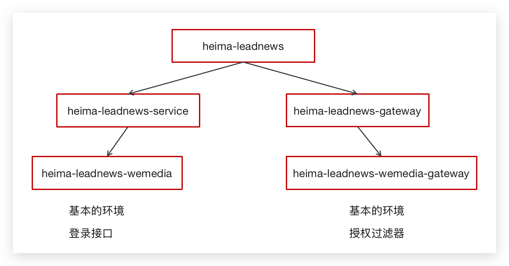
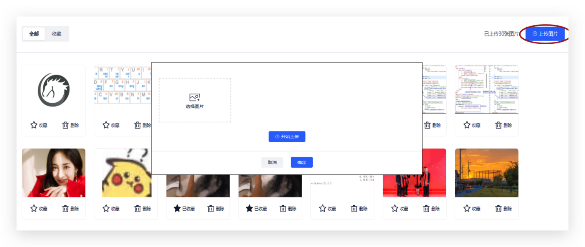
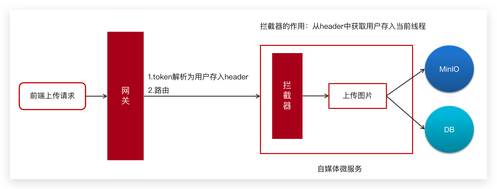
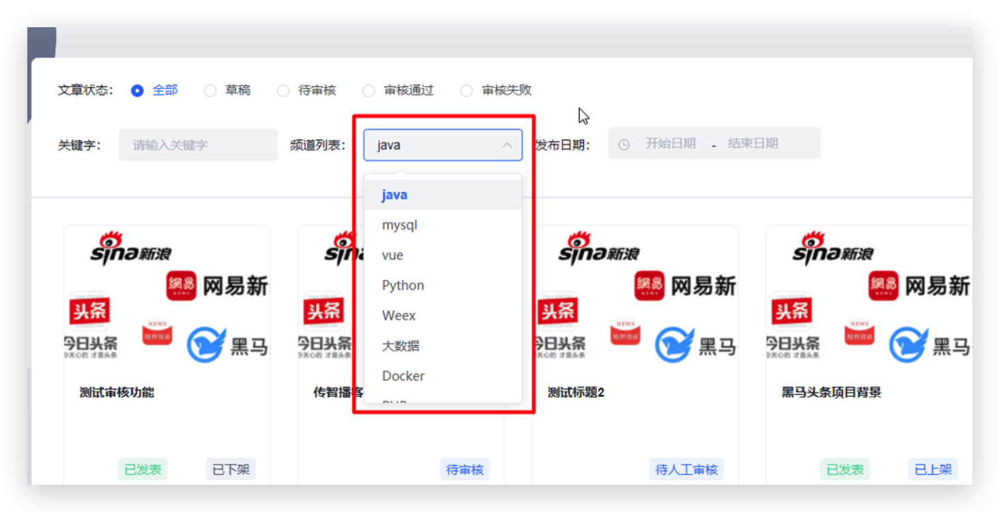
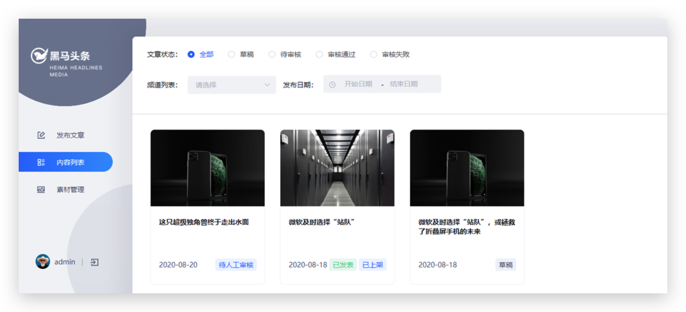
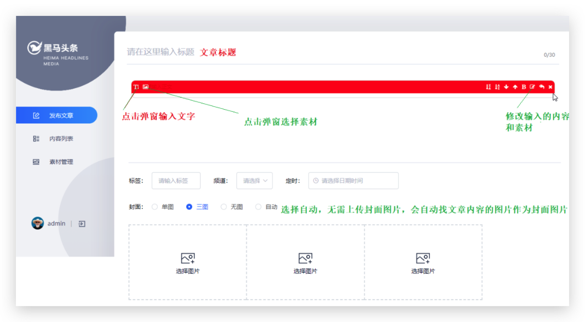
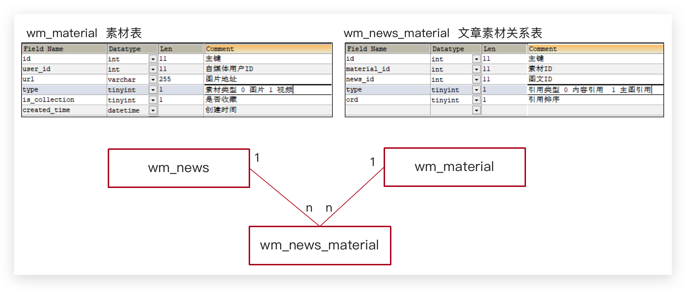
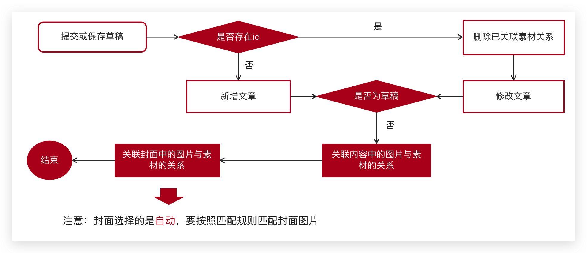

Day03-文章发布
==============

[[toc]]

学习内容
--------

自媒体服务

- 环境搭建

素材管理

- minio图片上传
- 自媒体获取用户
- 如何使用拦截器

文章管理

- 多条件查询
- 文章发布：复杂业务处理
- 分布式事务：Seata服务搭建

自媒体环境
------------

### 后台搭建

项目结构




搭建步骤

1. 搭建自媒体微服务

   - 创建新模块
   - 使用代码生成
   - 对实体类包进行移动
   - 创建SpringBoot启动类
   - 新增配置文件

2. 搭建自媒体网关

   - 创建新模块，并创建引导类和配置文件

     ```yaml
     server:
       port: 51602
     spring:
       profiles:
         active: dev
       application:
         name: leadnews-wemedia-gateway
       cloud:
         gateway:
           globalcors:
             cors-configurations:
               '[/**]': # 匹配所有请求
                 allowedOrigins: "*" #跨域处理 允许所有的域
                 allowedMethods: # 支持的方法
                   - GET
                   - POST
                   - PUT
                   - DELETE
           routes:
             # 平台管理
             - id: wemedia
               uri: lb://leadnews-wemedia
               predicates:
                 - Path=/wemedia/**
               filters:
                 - StripPrefix= 1
     ```

   - 实现全局过滤器


### 用户登录


素材管理
----------

### 素材上传

#### 需求分析

图片上传的页面，首先是展示素材信息，可以点击图片上传，弹窗后可以上传图片




#### 数据结构

媒体图文素材信息表wm_material


#### 实现思路



①：前端发送上传图片请求，类型为MultipartFile

②：在 `AuthorizeFilter`类中在将网关进行token解析后，把解析后的用户信息存储到header中

```java {35-42}
@Component
@Slf4j
public class AuthorizeFilter implements Ordered, GlobalFilter {
    @Override
    public Mono<Void> filter(ServerWebExchange exchange, GatewayFilterChain chain) {
        //1.获取request和response对象
        ServerHttpRequest request = exchange.getRequest();
        ServerHttpResponse response = exchange.getResponse();

        //2.判断是否是登录
        if (request.getURI().getPath().contains("/login")) {
            //放行
            return chain.filter(exchange);
        }

        //3.获取token
        String token = request.getHeaders().getFirst("token");

        //4.判断token是否存在
        if (StringUtils.isBlank(token)) {
            response.setStatusCode(HttpStatus.UNAUTHORIZED);
            return response.setComplete();
        }

        //5.判断token是否有效
        try {
            Claims claimsBody = AppJwtUtil.getClaimsBody(token);
            //是否是过期
            int result = AppJwtUtil.verifyToken(claimsBody);
            if (result == 1 || result == 2) {
                response.setStatusCode(HttpStatus.UNAUTHORIZED);
                return response.setComplete();
            }

            //获得token解析后中的用户信息
            Object userId = claimsBody.get("id");
            //在header中添加新的信息
            ServerHttpRequest serverHttpRequest = request.mutate().headers(httpHeaders -> {
                httpHeaders.add("userId", userId + "");
            }).build();
            //重置header
            exchange.mutate().request(serverHttpRequest).build();

        } catch (Exception e) {
            e.printStackTrace();
        }

        //6.放行
        return chain.filter(exchange);
    }

    /**
     * 优先级设置  值越小  优先级越高
     *
     * @return
     */
    @Override
    public int getOrder() {
        return 0;
    }
}

```

③：自媒体微服务使用拦截器获取到header中的的用户信息，并放入到threadlocal中

在 `heima-leadnews-utils` 中新增工具类

注意：需要从资料中找出WmUser实体类拷贝到model工程下

```java
package com.heima.utils.thread;

import com.heima.model.wemedia.pojos.WmUser;

public class WmThreadLocalUtil {

    private final static ThreadLocal<WmUser> WM_USER_THREAD_LOCAL = new ThreadLocal<>();

    /**
     * 添加用户
     * @param wmUser
     */
    public static void  setUser(WmUser wmUser){
        WM_USER_THREAD_LOCAL.set(wmUser);
    }

    /**
     * 获取用户
     */
    public static WmUser getUser(){
        return WM_USER_THREAD_LOCAL.get();
    }

    /**
     * 清理用户
     */
    public static void clear(){
        WM_USER_THREAD_LOCAL.remove();
    }
}
```

在 `heima-leadnews-wemedia` 中新增拦截器

```java
package com.heima.wemedia.interceptor;

import com.heima.model.wemedia.pojos.WmUser;
import com.heima.utils.thread.WmThreadLocalUtil;
import lombok.extern.slf4j.Slf4j;
import org.springframework.web.servlet.HandlerInterceptor;
import org.springframework.web.servlet.ModelAndView;

import javax.servlet.http.HttpServletRequest;
import javax.servlet.http.HttpServletResponse;
import java.util.Optional;

@Slf4j
public class WmTokenInterceptor implements HandlerInterceptor {
    @Override
    public boolean preHandle(HttpServletRequest request, HttpServletResponse response, Object handler) throws Exception {
        //得到header中的信息
        String userId = request.getHeader("userId");
        Optional<String> optional = Optional.ofNullable(userId);
        if(optional.isPresent()){
            //把用户id存入threadloacl中
            WmUser wmUser = new WmUser();
            wmUser.setId(Integer.valueOf(userId));
            WmThreadLocalUtil.setUser(wmUser);
            log.info("wmTokenFilter设置用户信息到threadlocal中...");
        }

        return true;
    }

    @Override
    public void postHandle(HttpServletRequest request, HttpServletResponse response, Object handler, ModelAndView modelAndView) throws Exception {
        log.info("清理threadlocal...");
        WmThreadLocalUtil.clear();
    }
}
```

配置使拦截器生效，拦截所有的请求

```java
package com.heima.wemedia.config;

import com.heima.wemedia.interceptor.WmTokenInterceptor;
import org.springframework.context.annotation.Configuration;
import org.springframework.web.servlet.config.annotation.InterceptorRegistry;
import org.springframework.web.servlet.config.annotation.WebMvcConfigurer;

@Configuration
public class WebMvcConfig implements WebMvcConfigurer {

    @Override
    public void addInterceptors(InterceptorRegistry registry) {
        registry.addInterceptor(new WmTokenInterceptor()).addPathPatterns("/**");
    }
}
```


#### 接口定义

|          | **说明**                        |
| -------- | ------------------------------- |
| 接口路径 | /api/v1/material/upload_picture |
| 请求方式 | POST                            |
| 参数     | MultipartFile                   |
| 响应结果 | ResponseResult                  |

MultipartFile  ：Springmvc指定的文件接收类型

ResponseResult  ：成功需要回显图片，返回素材对象

```json
{
   "host":null,
   "code":200,
   "errorMessage":"操作成功",
   "data":{
      "id":52,
      "userId":1102,
      "url":"http://192.168.200.130:9000/leadnews/2021/04/26/a73f5b60c0d84c32bfe175055aaaac40.jpg",
      "type":0,
      "isCollection":0,
      "createdTime":"2021-01-20T16:49:48.443+0000"
   }
}
```

失败：

- 参数失效
- 文章上传失败


#### 功能实现

导入heima-leadnews-minio

```xml
<dependencies>
   <dependency>
      <groupId>com.heima</groupId>
      <artifactId>heima-leadnews-minio</artifactId>
      <version>1.0-SNAPSHOT</version>
   </dependency>
</dependencies>
```

在自媒体微服务的配置中心添加以下配置：

```yaml
server:
  port: 51803
spring:
  profiles:
    active: dev
  application:
    name: leadnews-wemedia
  cloud:
    nacos:
      config:
        file-extension: yaml
        shared-configs:
          - data-id: shared-mybatis.yaml
          - data-id: shared-minio.yaml  // [!code ++]
```


创建WmMaterialController

```java
package com.heima.wemedia.controller;


import com.heima.model.common.dtos.ResponseResult;
import com.heima.wemedia.service.IWmMaterialService;
import org.springframework.beans.factory.annotation.Autowired;
import org.springframework.web.bind.annotation.PostMapping;
import org.springframework.web.bind.annotation.RequestMapping;

import org.springframework.web.bind.annotation.RestController;
import org.springframework.web.multipart.MultipartFile;

/**
 * <p>
 * 自媒体图文素材信息表 前端控制器
 * </p>
 *
 * @author mousse
 * @since 2024-03-05
 */
@RestController
@RequestMapping("/api/v1/material")
public class WmMaterialController {

    @Autowired
    private IWmMaterialService wmMaterialService;


    @PostMapping("/upload_picture")
    public ResponseResult uploadPicture(MultipartFile multipartFile) {
        return wmMaterialService.uploadPicture(multipartFile);
    }

}
```

业务层

```java
package com.heima.wemedia.service;

import com.heima.model.common.dtos.ResponseResult;
import com.heima.model.wemedia.pojos.WmMaterial;
import com.baomidou.mybatisplus.extension.service.IService;
import org.springframework.web.multipart.MultipartFile;

/**
 * <p>
 * 自媒体图文素材信息表 服务类
 * </p>
 *
 * @author mousse
 * @since 2024-03-05
 */
public interface IWmMaterialService extends IService<WmMaterial> {

    ResponseResult uploadPicture(MultipartFile multipartFile);
    
}
```

实现类

```java
package com.heima.wemedia.service.impl;


import com.baomidou.mybatisplus.extension.service.impl.ServiceImpl;
import com.heima.file.service.FileStorageService;
import com.heima.model.common.dtos.ResponseResult;
import com.heima.model.common.enums.AppHttpCodeEnum;
import com.heima.model.wemedia.pojos.WmMaterial;
import com.heima.utils.thread.WmThreadLocalUtil;
import com.heima.wemedia.mapper.WmMaterialMapper;
import com.heima.wemedia.service.IWmMaterialService;
import lombok.extern.slf4j.Slf4j;
import org.springframework.beans.factory.annotation.Autowired;
import org.springframework.stereotype.Service;
import org.springframework.transaction.annotation.Transactional;
import org.springframework.web.multipart.MultipartFile;

import java.io.IOException;
import java.time.LocalDateTime;
import java.util.Date;
import java.util.UUID;

@Slf4j
@Service
@Transactional
public class WmMaterialServiceImpl extends ServiceImpl<WmMaterialMapper, WmMaterial> implements IWmMaterialService {

    @Autowired
    private FileStorageService fileStorageService;


    /**
     * 图片上传
     *
     * @param multipartFile
     * @return
     */
    @Override
    public ResponseResult uploadPicture(MultipartFile multipartFile) {

        //1.检查参数
        if (multipartFile == null || multipartFile.getSize() == 0) {
            return ResponseResult.errorResult(AppHttpCodeEnum.PARAM_INVALID);
        }

        //2.上传图片到minIO中
        String fileName = UUID.randomUUID().toString().replace("-", "");
        //aa.jpg
        String originalFilename = multipartFile.getOriginalFilename();
        String postfix = originalFilename.substring(originalFilename.lastIndexOf("."));
        String fileId = null;
        try {
            fileId = fileStorageService.uploadImgFile("", fileName + postfix, multipartFile.getInputStream());
            log.info("上传图片到MinIO中，fileId:{}", fileId);
        } catch (IOException e) {
            e.printStackTrace();
            log.error("WmMaterialServiceImpl-上传文件失败");
        }

        //3.保存到数据库中
        WmMaterial wmMaterial = new WmMaterial();
        wmMaterial.setUserId(WmThreadLocalUtil.getUser().getId());
        wmMaterial.setUrl(fileId);
        wmMaterial.setIsCollection(false);
        wmMaterial.setType(1);
        wmMaterial.setCreatedTime(LocalDateTime.now());
        save(wmMaterial);

        //4.返回结果

        return ResponseResult.okResult(wmMaterial);
    }

}
```


#### 功能测试

启动自媒体微服务和自媒体网关，使用前端项目进行测试


### 素材列表

#### 接口定义

|          | **说明**              |
| -------- | --------------------- |
| 接口路径 | /api/v1/material/list |
| 请求方式 | POST                  |
| 参数     | WmMaterialDto         |
| 响应结果 | ResponseResult        |

WmMaterialDto  ：

```java
package com.heima.model.wemedia.dtos;

import com.heima.model.common.dtos.PageRequestDto;
import lombok.Data;

@Data
public class WmMaterialDto extends PageRequestDto {

    /**
     * 1 收藏
     * 0 未收藏
     */
    private Short isCollection;
}
```

ResponseResult  :

```json
{
   "host":null,
   "code":200,
   "errorMessage":"操作成功",
   "data":[
      {
         "id":52,
         "userId":1102,
         "url":"http://192.168.200.130:9000/leadnews/2021/04/26/ec893175f18c4261af14df14b83cb25f.jpg",
         "type":0,
         "isCollection":0,
         "createdTime":"2021-01-20T16:49:48.000+0000"
      },
      ....
   ],
   "currentPage":1,
   "size":20,
   "total":0
}
```


#### 功能实现

①在WmMaterialController类中新增方法

```java
@PostMapping("/list")
public ResponseResult findList(@RequestBody WmMaterialDto dto){
    return wmMaterialService.findList(dto);
}
```

业务层

在WmMaterialService中新增方法

```java
/**
     * 素材列表查询
     * @param dto
     * @return
     */
public ResponseResult findList( WmMaterialDto dto);
```

实现类

```java
/**
     * 素材列表查询
     * @param dto
     * @return
     */
@Override
public ResponseResult findList(WmMaterialDto dto) {

    //1.检查参数
    dto.checkParam();

    //2.分页查询
    IPage page = new Page(dto.getPage(),dto.getSize());
    LambdaQueryWrapper<WmMaterial> lambdaQueryWrapper = new LambdaQueryWrapper<>();
    //是否收藏
    if(dto.getIsCollection() != null && dto.getIsCollection() == 1){
        lambdaQueryWrapper.eq(WmMaterial::getIsCollection,dto.getIsCollection());
    }

    //按照用户查询
    lambdaQueryWrapper.eq(WmMaterial::getUserId,WmThreadLocalUtil.getUser().getId());

    //按照时间倒序
    lambdaQueryWrapper.orderByDesc(WmMaterial::getCreatedTime);


    page = page(page,lambdaQueryWrapper);

    //3.结果返回
    ResponseResult responseResult = new PageResponseResult(dto.getPage(),dto.getSize(),(int)page.getTotal());
    responseResult.setData(page.getRecords());
    return responseResult;
}
```

⑤：在自媒体引导类中添加 mybatis-plus的分页拦截器

```java
@Bean
public MybatisPlusInterceptor mybatisPlusInterceptor() {
    MybatisPlusInterceptor interceptor = new MybatisPlusInterceptor();
    interceptor.addInnerInterceptor(new PaginationInnerInterceptor(DbType.MYSQL));
    return interceptor;
}
```


## 文章管理

### 查询频道

#### 需求分析

需要查询所有的频道信息



#### 数据结构

wm_channel 频道信息表


#### 接口定义

|          | **说明**                 |
| -------- | ------------------------ |
| 接口路径 | /api/v1/channel/channels |
| 请求方式 | POST                     |
| 参数     | 无                       |
| 响应结果 | ResponseResult           |

ResponseResult 

```json
{
   "host": "null",
   "code": 0,
   "errorMessage": "操作成功",
   "data": [
      {
         "id": 4,
         "name": "java",
         "description": "java",
         "isDefault": true,
         "status": false,
         "ord": 3,
         "createdTime": "2019-08-16T10:55:41.000+0000"
      },
      Object {  ... },
      Object {  ... }
   ]
}
```


#### 功能实现

控制层

```java
package com.heima.wemedia.controller;


import com.heima.model.common.dtos.ResponseResult;
import com.heima.wemedia.service.IWmChannelService;
import org.springframework.beans.factory.annotation.Autowired;
import org.springframework.web.bind.annotation.GetMapping;
import org.springframework.web.bind.annotation.RequestMapping;
import org.springframework.web.bind.annotation.RestController;
/**
 * <p>
 * 频道信息表 前端控制器
 * </p>
 *
 * @author mousse
 * @since 2024-03-05
 */
@RestController
@RequestMapping("/api/v1/channel")
public class WmChannelController {

    @Autowired
    private IWmChannelService wmChannelService;

    @GetMapping("/channels")
    public ResponseResult findAll(){
        return wmChannelService.findAll();
    }
}
```

业务层

```java
package com.heima.wemedia.service;

import com.heima.model.common.dtos.ResponseResult;
import com.heima.model.wemedia.pojos.WmChannel;
import com.baomidou.mybatisplus.extension.service.IService;

/**
 * <p>
 * 频道信息表 服务类
 * </p>
 *
 * @author mousse
 * @since 2024-03-05
 */
public interface IWmChannelService extends IService<WmChannel> {

    ResponseResult findAll();

}
```

实现类

```java
package com.heima.wemedia.service.impl;

import com.heima.model.common.dtos.ResponseResult;
import com.heima.model.wemedia.pojos.WmChannel;
import com.heima.wemedia.mapper.WmChannelMapper;
import com.heima.wemedia.service.IWmChannelService;
import com.baomidou.mybatisplus.extension.service.impl.ServiceImpl;
import org.springframework.stereotype.Service;

/**
 * <p>
 * 频道信息表 服务实现类
 * </p>
 *
 * @author mousse
 * @since 2024-03-05
 */
@Service
public class WmChannelServiceImpl extends ServiceImpl<WmChannelMapper, WmChannel> implements IWmChannelService {

    @Override
    public ResponseResult findAll() {
        return ResponseResult.okResult(list());
    }
}
```


### 查询文章

#### 需求说明




#### 数据结构

wm_news 自媒体文章表


#### 接口定义

|          | **说明**          |
| -------- | ----------------- |
| 接口路径 | /api/v1/news/list |
| 请求方式 | POST              |
| 参数     | WmNewsPageReqDto  |
| 响应结果 | ResponseResult    |

WmNewsPageReqDto  :

```java
package com.heima.model.wemedia.dtos;

import com.heima.model.common.dtos.PageRequestDto;
import lombok.Data;

import java.util.Date;

@Data
public class WmNewsPageReqDto extends PageRequestDto {

    /**
     * 状态
     */
    private Short status;
    /**
     * 开始时间
     */
    private Date beginPubDate;
    /**
     * 结束时间
     */
    private Date endPubDate;
    /**
     * 所属频道ID
     */
    private Integer channelId;
    /**
     * 关键字
     */
    private String keyword;
}
```

ResponseResult  :

```json
{
   "host": "null",
   "code": 0,
   "errorMessage": "操作成功",
   "data": [
      Object { ... },
      Object { ... },
      Object { ... }

   ],
   "currentPage":1,
   "size":10,
   "total":21
}
```


#### 功能实现

①：新增WmNewsController

```java
package com.heima.wemedia.controller;


import com.heima.model.common.dtos.ResponseResult;
import com.heima.model.wemedia.dtos.WmNewsPageReqDto;
import com.heima.wemedia.service.IWmNewsService;
import org.springframework.beans.factory.annotation.Autowired;
import org.springframework.web.bind.annotation.PostMapping;
import org.springframework.web.bind.annotation.RequestBody;
import org.springframework.web.bind.annotation.RequestMapping;

import org.springframework.web.bind.annotation.RestController;

/**
 * <p>
 * 自媒体图文内容信息表 前端控制器
 * </p>
 *
 * @author mousse
 * @since 2024-03-05
 */
@RestController
@RequestMapping("/api/v1/news")
public class WmNewsController {


    @Autowired
    private IWmNewsService wmNewsService;

    @PostMapping("/list")
    public ResponseResult findAll(@RequestBody WmNewsPageReqDto dto){
        return  wmNewsService.findAll(dto);
    }

}
```

业务层

```java
package com.heima.wemedia.service;

import com.heima.model.common.dtos.ResponseResult;
import com.heima.model.wemedia.dtos.WmNewsPageReqDto;
import com.heima.model.wemedia.pojos.WmNews;
import com.baomidou.mybatisplus.extension.service.IService;

/**
 * <p>
 * 自媒体图文内容信息表 服务类
 * </p>
 *
 * @author mousse
 * @since 2024-03-05
 */
public interface IWmNewsService extends IService<WmNews> {

    ResponseResult findAll(WmNewsPageReqDto dto);
}
```

实现类

```java
package com.heima.wemedia.service.impl;

import com.baomidou.mybatisplus.core.conditions.query.LambdaQueryWrapper;
import com.baomidou.mybatisplus.core.metadata.IPage;
import com.baomidou.mybatisplus.extension.plugins.pagination.Page;
import com.heima.model.common.dtos.PageResponseResult;
import com.heima.model.common.dtos.ResponseResult;
import com.heima.model.common.enums.AppHttpCodeEnum;
import com.heima.model.wemedia.dtos.WmNewsPageReqDto;
import com.heima.model.wemedia.pojos.WmNews;
import com.heima.model.wemedia.pojos.WmUser;
import com.heima.utils.thread.WmThreadLocalUtil;
import com.heima.wemedia.mapper.WmNewsMapper;
import com.heima.wemedia.service.IWmNewsService;
import com.baomidou.mybatisplus.extension.service.impl.ServiceImpl;
import lombok.extern.slf4j.Slf4j;
import org.apache.commons.lang3.StringUtils;
import org.springframework.stereotype.Service;
import org.springframework.transaction.annotation.Transactional;

/**
 * <p>
 * 自媒体图文内容信息表 服务实现类
 * </p>
 *
 * @author mousse
 * @since 2024-03-05
 */
@Service
@Slf4j
@Transactional
public class WmNewsServiceImpl extends ServiceImpl<WmNewsMapper, WmNews> implements IWmNewsService {

    @Override
    public ResponseResult findAll(WmNewsPageReqDto dto) {

        //1.检查参数
        if(dto == null){
            return ResponseResult.errorResult(AppHttpCodeEnum.PARAM_INVALID);
        }
        //分页参数检查
        dto.checkParam();
        //获取当前登录人的信息
        WmUser user = WmThreadLocalUtil.getUser();
        if(user == null){
            return ResponseResult.errorResult(AppHttpCodeEnum.NEED_LOGIN);
        }

        //2.分页条件查询
        IPage page = new Page(dto.getPage(),dto.getSize());
        LambdaQueryWrapper<WmNews> lambdaQueryWrapper = new LambdaQueryWrapper<>();
        //状态精确查询
        if(dto.getStatus() != null){
            lambdaQueryWrapper.eq(WmNews::getStatus,dto.getStatus());
        }

        //频道精确查询
        if(dto.getChannelId() != null){
            lambdaQueryWrapper.eq(WmNews::getChannelId,dto.getChannelId());
        }

        //时间范围查询
        if(dto.getBeginPubDate()!=null && dto.getEndPubDate()!=null){
            lambdaQueryWrapper.between(WmNews::getPublishTime,dto.getBeginPubDate(),dto.getEndPubDate());
        }

        //关键字模糊查询
        if(StringUtils.isNotBlank(dto.getKeyword())){
            lambdaQueryWrapper.like(WmNews::getTitle,dto.getKeyword());
        }

        //查询当前登录用户的文章
        lambdaQueryWrapper.eq(WmNews::getUserId,user.getId());

        //发布时间倒序查询
        lambdaQueryWrapper.orderByDesc(WmNews::getCreatedTime);

        page = page(page,lambdaQueryWrapper);

        //3.结果返回
        ResponseResult responseResult = new PageResponseResult(dto.getPage(),dto.getSize(),(int)page.getTotal());
        responseResult.setData(page.getRecords());

        return responseResult;
    }
}
```


#### 功能测试

启动后端自媒体微服务和自媒体网关微服务，测试文章列表查询


### 文章发布

#### 需求分析



#### 数据结构

保存文章，除了需要wm_news表以外，还需要另外两张表




#### 思路分析

该功能为保存、修改（是否有id）、保存草稿的共有方法



1.前端提交发布或保存为草稿

2.后台判断请求中是否包含了文章id

3.如果不包含id,则为新增

​    3.1 执行新增文章的操作3.2 关联文章内容图片与素材的关系

​	3.3 关联文章封面图片与素材的关系

4.如果包含了id，则为修改请求

​	4.1 删除该文章与素材的所有关系

​	4.2 执行修改操作

​	4.3 关联文章内容图片与素材的关系

​	4.4 关联文章封面图片与素材的关系


#### 接口定义

|          | **说明**               |
| -------- | ---------------------- |
| 接口路径 | /api/v1/channel/submit |
| 请求方式 | POST                   |
| 参数     | WmNewsDto              |
| 响应结果 | ResponseResult         |

WmNewsDto

```java
package com.heima.model.wemedia.dtos;

import lombok.Data;

import java.util.Date;
import java.util.List;

@Data
public class WmNewsDto {
    
    private Integer id;
     /**
     * 标题
     */
    private String title;
     /**
     * 频道id
     */
    private Integer channelId;
     /**
     * 标签
     */
    private String labels;
     /**
     * 发布时间
     */
    private Date publishTime;
     /**
     * 文章内容
     */
    private String content;
     /**
     * 文章封面类型  0 无图 1 单图 3 多图 -1 自动
     */
    private Short type;
     /**
     * 提交时间
     */
    private Date submitedTime; 
     /**
     * 状态 提交为1  草稿为0
     */
    private Short status;
     
     /**
     * 封面图片列表 多张图以逗号隔开
     */
    private List<String> images;
}
```

前端给传递过来的json数据格式为：

```json
{
   "title":"黑马头条项目背景",
   "type":"1",//这个 0 是无图  1 是单图  3 是多图  -1 是自动
   "labels":"黑马头条",
   "publishTime":"2020-03-14T11:35:49.000Z",
   "channelId":1,
   "images":[
      "http://192.168.200.130/group1/M00/00/00/wKjIgl5swbGATaSAAAEPfZfx6Iw790.png"
   ],
   "status":1,
   "content":"[
{
   "type":"text",
   "value":"随着智能手机的普及，人们更加习惯于通过手机来看新闻。由于生活节奏的加快，很多人只能利用碎片时间来获取信息，因此，对于移动资讯客户端的需求也越来越高。黑马头条项目正是在这样背景下开发出来。黑马头条项目采用当下火热的微服务+大数据技术架构实现。本项目主要着手于获取最新最热新闻资讯，通过大数据分析用户喜好精确推送咨询新闻"
},
{
"type":"image",
"value":"http://192.168.200.130/group1/M00/00/00/wKjIgl5swbGATaSAAAEPfZfx6Iw790.png"
}
]"
}
```

ResponseResult:

```json
[
  {
   "code":501,
	 "errorMessage":"参数失效"
  },
  {
    "code":200,
  	"errorMessage":"操作成功"
  },
  {
    "code":501,
    "errorMessage":"素材引用失效"
  }
]
```


#### 功能实现

①：在新增WmNewsController中新增方法

```java {36-39}
package com.heima.wemedia.controller;


import com.heima.model.common.dtos.ResponseResult;
import com.heima.model.wemedia.dtos.WmNewsDto;
import com.heima.model.wemedia.dtos.WmNewsPageReqDto;
import com.heima.wemedia.service.IWmNewsService;
import org.springframework.beans.factory.annotation.Autowired;
import org.springframework.web.bind.annotation.PostMapping;
import org.springframework.web.bind.annotation.RequestBody;
import org.springframework.web.bind.annotation.RequestMapping;

import org.springframework.web.bind.annotation.RestController;

/**
 * <p>
 * 自媒体图文内容信息表 前端控制器
 * </p>
 *
 * @author mousse
 * @since 2024-03-05
 */
@RestController
@RequestMapping("/api/v1/news")
public class WmNewsController {


    @Autowired
    private IWmNewsService wmNewsService;

    @PostMapping("/list")
    public ResponseResult findAll(@RequestBody WmNewsPageReqDto dto) {
        return wmNewsService.findAll(dto);
    }

    @PostMapping("/submit")
    public ResponseResult submitNews(@RequestBody WmNewsDto dto) {
        return wmNewsService.submitNews(dto);
    }
}
```

常量类准备

```java
public interface WeMediaConstants {

    /**
     * 收藏
     */
    Boolean COLLECT_MATERIAL = true;

    /**
     * 取消收藏
     */
    Boolean CANCEL_COLLECT_MATERIAL = false;

    String WM_NEWS_TYPE_IMAGE = "image";

    Integer WM_NEWS_NONE_IMAGE = 0;
    Integer WM_NEWS_SINGLE_IMAGE = 1;
    Integer WM_NEWS_MANY_IMAGE = 3;
    Integer WM_NEWS_TYPE_AUTO = -1;

    Integer WM_CONTENT_REFERENCE = 0;
    Integer WM_COVER_REFERENCE = 1;

    /**
     * 文章下架
     */
    Integer WM_NEW_DOWN = 0;
    /**
     * 文章上架
     */
    Integer WM_NEW_UP = 1;
}
```

枚举类新增素材引用失效

```java
package com.heima.model.common.enums;

public enum AppHttpCodeEnum {

    MATERIASL_REFERENCE_FAIL(501, "素材引用失效"),
    ;

    int code;
    String errorMessage;

    AppHttpCodeEnum(int code, String errorMessage){
        this.code = code;
        this.errorMessage = errorMessage;
    }

    public int getCode() {
        return code;
    }

    public String getErrorMessage() {
        return errorMessage;
    }
}
```

在WmNewsService中新增方法

```java {21}
package com.heima.wemedia.service;

import com.heima.model.common.dtos.ResponseResult;
import com.heima.model.wemedia.dtos.WmNewsDto;
import com.heima.model.wemedia.dtos.WmNewsPageReqDto;
import com.heima.model.wemedia.pojos.WmNews;
import com.baomidou.mybatisplus.extension.service.IService;

/**
 * <p>
 * 自媒体图文内容信息表 服务类
 * </p>
 *
 * @author mousse
 * @since 2024-03-05
 */
public interface IWmNewsService extends IService<WmNews> {

    ResponseResult findAll(WmNewsPageReqDto dto);

    ResponseResult submitNews(WmNewsDto dto);
}
```

实现方法：

```java
package com.heima.wemedia.service.impl;

import com.alibaba.fastjson.JSON;
import com.baomidou.mybatisplus.core.conditions.query.LambdaQueryWrapper;
import com.baomidou.mybatisplus.core.metadata.IPage;
import com.baomidou.mybatisplus.core.toolkit.Wrappers;
import com.baomidou.mybatisplus.extension.plugins.pagination.Page;
import com.heima.common.exception.CustomException;
import com.heima.model.common.dtos.PageResponseResult;
import com.heima.model.common.dtos.ResponseResult;
import com.heima.model.common.enums.AppHttpCodeEnum;
import com.heima.model.constants.WeMediaConstants;
import com.heima.model.wemedia.dtos.WmNewsDto;
import com.heima.model.wemedia.dtos.WmNewsPageReqDto;
import com.heima.model.wemedia.pojos.WmMaterial;
import com.heima.model.wemedia.pojos.WmNews;
import com.heima.model.wemedia.pojos.WmNewsMaterial;
import com.heima.model.wemedia.pojos.WmUser;
import com.heima.utils.thread.WmThreadLocalUtil;
import com.heima.wemedia.mapper.WmMaterialMapper;
import com.heima.wemedia.mapper.WmNewsMapper;
import com.heima.wemedia.mapper.WmNewsMaterialMapper;
import com.heima.wemedia.service.IWmNewsService;
import com.baomidou.mybatisplus.extension.service.impl.ServiceImpl;
import lombok.extern.slf4j.Slf4j;
import org.apache.commons.lang3.StringUtils;
import org.springframework.beans.BeanUtils;
import org.springframework.beans.factory.annotation.Autowired;
import org.springframework.stereotype.Service;
import org.springframework.transaction.annotation.Transactional;

import java.time.LocalDateTime;
import java.util.ArrayList;
import java.util.List;
import java.util.Map;
import java.util.stream.Collectors;

/**
 * <p>
 * 自媒体图文内容信息表 服务实现类
 * </p>
 *
 * @author mousse
 * @since 2024-03-05
 */
@Service
@Slf4j
@Transactional
public class WmNewsServiceImpl extends ServiceImpl<WmNewsMapper, WmNews> implements IWmNewsService {


    @Override
    public ResponseResult submitNews(WmNewsDto dto) {

        //0.条件判断
        if (dto == null || dto.getContent() == null) {
            return ResponseResult.errorResult(AppHttpCodeEnum.PARAM_INVALID);
        }

        //1.保存或修改文章
        WmNews wmNews = new WmNews();
        //属性拷贝 属性名词和类型相同才能拷贝
        BeanUtils.copyProperties(dto, wmNews);
        //封面图片  list---> string
        if (dto.getImages() != null && dto.getImages().size() > 0) {
            //[1dddfsd.jpg,sdlfjldk.jpg]-->   1dddfsd.jpg,sdlfjldk.jpg
            String imageStr = StringUtils.join(dto.getImages(), ",");
            wmNews.setImages(imageStr);
        }
        //如果当前封面类型为自动 -1
        if (dto.getType().equals(WeMediaConstants.WM_NEWS_TYPE_AUTO)) {
            wmNews.setType(null);
        }

        saveOrUpdateWmNews(wmNews);

        //2.判断是否为草稿  如果为草稿结束当前方法
        if (dto.getStatus().equals(WmNews.Status.NORMAL.getCode())) {
            return ResponseResult.okResult(AppHttpCodeEnum.SUCCESS);
        }

        //3.不是草稿，保存文章内容图片与素材的关系
        //获取到文章内容中的图片信息
        List<String> materials = ectractUrlInfo(dto.getContent());
        saveRelativeInfoForContent(materials, wmNews.getId());

        //4.不是草稿，保存文章封面图片与素材的关系，如果当前布局是自动，需要匹配封面图片
        saveRelativeInfoForCover(dto, wmNews, materials);

        return ResponseResult.okResult(AppHttpCodeEnum.SUCCESS);

    }

    /**
     * 第一个功能：如果当前封面类型为自动，则设置封面类型的数据
     * 匹配规则：
     * 1：如果内容图片大于等于1，小于3  单图  type 1
     * 2：如果内容图片大于等于3  多图  type 3
     * 3：如果内容没有图片，无图  type 0
     * <p>
     * 第二个功能：保存封面图片与素材的关系
     *
     * @param dto
     * @param wmNews
     * @param materials
     */
    private void saveRelativeInfoForCover(WmNewsDto dto, WmNews wmNews, List<String> materials) {

        List<String> images = dto.getImages();

        //如果当前封面类型为自动，则设置封面类型的数据
        if (dto.getType().equals(WeMediaConstants.WM_NEWS_TYPE_AUTO)) {
            //多图
            if (materials.size() >= 3) {
                wmNews.setType(WeMediaConstants.WM_NEWS_MANY_IMAGE);
                images = materials.stream().limit(3).collect(Collectors.toList());
            } else if (materials.size() >= 1 && materials.size() < 3) {
                //单图
                wmNews.setType(WeMediaConstants.WM_NEWS_SINGLE_IMAGE);
                images = materials.stream().limit(1).collect(Collectors.toList());
            } else {
                //无图
                wmNews.setType(WeMediaConstants.WM_NEWS_NONE_IMAGE);
            }

            //修改文章
            if (images != null && images.size() > 0) {
                wmNews.setImages(StringUtils.join(images, ","));
            }
            updateById(wmNews);
        }
        if (images != null && images.size() > 0) {
            saveRelativeInfo(images, wmNews.getId(), WeMediaConstants.WM_COVER_REFERENCE);
        }

    }

    /**
     * 处理文章内容图片与素材的关系
     *
     * @param materials
     * @param newsId
     */
    private void saveRelativeInfoForContent(List<String> materials, Integer newsId) {
        saveRelativeInfo(materials, newsId, WeMediaConstants.WM_CONTENT_REFERENCE);
    }

    @Autowired
    private WmMaterialMapper wmMaterialMapper;

    /**
     * 保存文章图片与素材的关系到数据库中
     *
     * @param materials
     * @param newsId
     * @param type
     */
    private void saveRelativeInfo(List<String> materials, Integer newsId, Integer type) {
        if (materials != null && !materials.isEmpty()) {
            //通过图片的url查询素材的id
            List<WmMaterial> dbMaterials = wmMaterialMapper.selectList(Wrappers.<WmMaterial>lambdaQuery().in(WmMaterial::getUrl, materials));

            //判断素材是否有效
            if (dbMaterials == null || dbMaterials.size() == 0) {
                //手动抛出异常   第一个功能：能够提示调用者素材失效了，第二个功能，进行数据的回滚
                throw new CustomException(AppHttpCodeEnum.MATERIASL_REFERENCE_FAIL);
            }

            if (materials.size() != dbMaterials.size()) {
                throw new CustomException(AppHttpCodeEnum.MATERIASL_REFERENCE_FAIL);
            }

            List<Integer> idList = dbMaterials.stream().map(WmMaterial::getId).collect(Collectors.toList());

            //批量保存
            wmNewsMaterialMapper.saveRelations(idList, newsId, type);
        }

    }

    /**
     * 提取文章内容中的图片信息
     *
     * @param content
     * @return
     */
    private List<String> ectractUrlInfo(String content) {
        List<String> materials = new ArrayList<>();

        List<Map> maps = JSON.parseArray(content, Map.class);
        for (Map map : maps) {
            if (map.get("type").equals("image")) {
                String imgUrl = (String) map.get("value");
                materials.add(imgUrl);
            }
        }

        return materials;
    }

    @Autowired
    private WmNewsMaterialMapper wmNewsMaterialMapper;

    /**
     * 保存或修改文章
     *
     * @param wmNews
     */
    private void saveOrUpdateWmNews(WmNews wmNews) {
        //补全属性
        wmNews.setUserId(WmThreadLocalUtil.getUser().getId());
        wmNews.setCreatedTime(LocalDateTime.now());
        wmNews.setSubmitedTime(LocalDateTime.now());
        wmNews.setEnable(1);//默认上架

        if (wmNews.getId() == null) {
            //保存
            save(wmNews);
        } else {
            //修改
            //删除文章图片与素材的关系
            wmNewsMaterialMapper.delete(Wrappers.<WmNewsMaterial>lambdaQuery().eq(WmNewsMaterial::getNewsId, wmNews.getId()));
            updateById(wmNews);
        }
    }
}
```

②：新增WmNewsMaterialMapper类，文章与素材的关联关系需要批量保存，索引需要定义mapper文件和对应的映射文件

```java
import com.heima.model.wemedia.pojos.WmNewsMaterial;
import com.baomidou.mybatisplus.core.mapper.BaseMapper;

import java.util.List;

/**
 * <p>
 * 自媒体图文引用素材信息表 Mapper 接口
 * </p>
 *
 * @author mousse
 * @since 2024-03-05
 */
public interface WmNewsMaterialMapper extends BaseMapper<WmNewsMaterial> {

    void saveRelations(List<Integer> idList, Integer newsId, Integer type);
}
```

WmNewsMaterialMapper.xml

```xml
<?xml version="1.0" encoding="UTF-8"?>
<!DOCTYPE mapper PUBLIC "-//mybatis.org//DTD Mapper 3.0//EN" "http://mybatis.org/dtd/mybatis-3-mapper.dtd">
<mapper namespace="com.heima.wemedia.mapper.WmNewsMaterialMapper">

   <insert id="saveRelations">
      insert into wm_news_material (material_id,news_id,type,ord)
      values
      <foreach collection="materialIds" index="ord" item="mid" separator=",">
         (#{mid},#{newsId},#{type},#{ord})
      </foreach>
   </insert>
</mapper>
```


#### 功能测试


今日作业
--------

### 素材管理

#### 图片删除

|          | **说明**                          |
| -------- | --------------------------------- |
| 接口路径 | /api/v1/material/del_picture/{id} |
| 请求方式 | GET                               |
| 参数     | Integer  id                       |
| 响应结果 | ResponseResult                    |

返回结果实例：


#### 收藏与取消

取消收藏

|          | **说明**                             |
| -------- | ------------------------------------ |
| 接口路径 | /api/v1/material/cancel_collect/{id} |
| 请求方式 | GET                                  |
| 参数     | Integer  id                          |
| 响应结果 | ResponseResult                       |

收藏

|          | **说明**                      |
| -------- | ----------------------------- |
| 接口路径 | /api/v1/material/collect/{id} |
| 请求方式 | GET                           |
| 参数     | Integer  id                   |
| 响应结果 | ResponseResult                |

返回结果实例：


### 文章管理

#### 查看详情

|          | **说明**              |
| -------- | --------------------- |
| 接口路径 | /api/v1/news/one/{id} |
| 请求方式 | GET                   |
| 参数     | 文章id                |
| 响应结果 | ResponseResult        |

返回结果实例：


#### 文章删除

|          | **说明**                   |
| -------- | -------------------------- |
| 接口路径 | /api/v1/news/del_news/{id} |
| 请求方式 | GET                        |
| 参数     | 文章id                     |
| 响应结果 | ResponseResult             |

返回结果实例


#### *文章上下架

|          | **说明**                |
| -------- | ----------------------- |
| 接口路径 | /api/v1/news/down_or_up |
| 请求方式 | POST                    |
| 参数     | WmNewsDto               |
| 响应结果 | ResponseResult          |

WmNewsDto


返回结果实例


